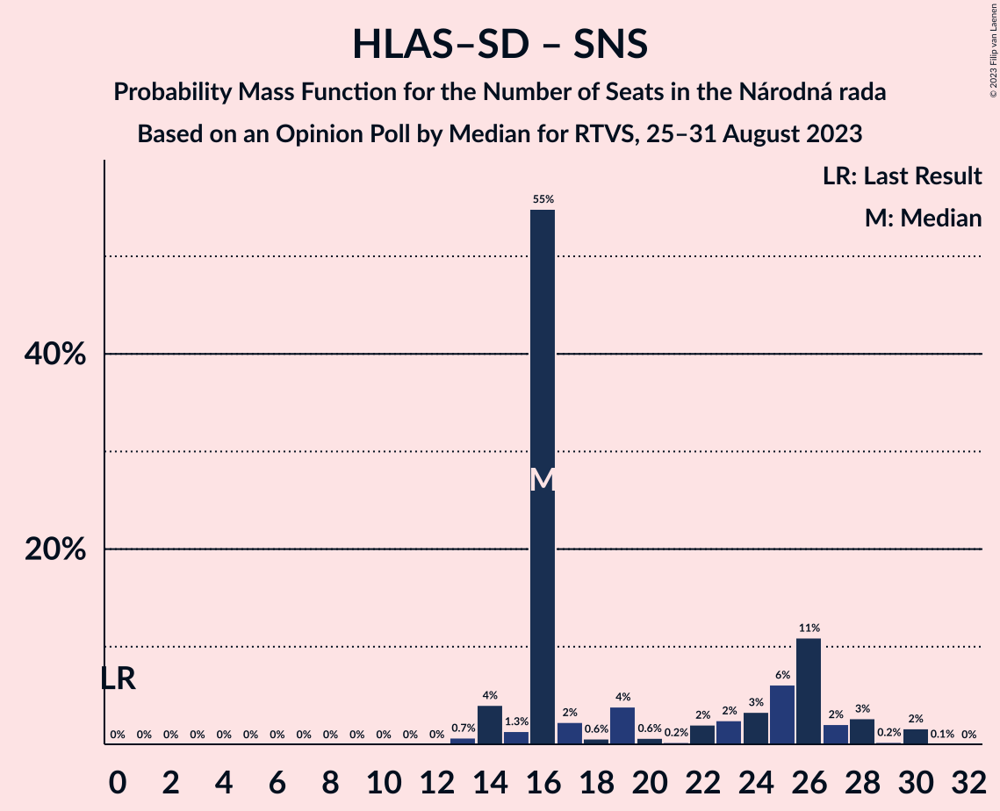

# Opinion Poll by Median for RTVS, 25–31 August 2023

<a href="#voting-intentions">Voting Intentions</a> | <a href="#seats">Seats</a> | <a href="#coalitions">Coalitions</a> | <a href="#technical-information">Technical Information</a>

## Voting Intentions

### Confidence Intervals

| Party | Last Result | Poll Result | 80% Confidence Interval | 90% Confidence Interval | 95% Confidence Interval | 99% Confidence Interval |
|:-----:|:-----------:|:-----------:|:-----------------------:|:-----------------------:|:-----------------------:|:-----------------------:|
| SMER–sociálna demokracia | 18.3% | 17.8% | 16.3–19.4% |15.9–19.9% |15.5–20.3% |14.8–21.1% |
| Progresívne Slovensko | 7.0% | 17.8% | 16.3–19.4% |15.9–19.9% |15.5–20.3% |14.8–21.1% |
| REPUBLIKA | 0.0% | 10.2% | 9.0–11.5% |8.7–11.9% |8.5–12.2% |7.9–12.9% |
| HLAS–sociálna demokracia | 0.0% | 9.4% | 8.3–10.7% |8.0–11.0% |7.7–11.4% |7.2–12.0% |
| SME RODINA | 8.2% | 8.2% | 7.2–9.4% |6.9–9.8% |6.6–10.1% |6.2–10.7% |
| Kresťanskodemokratické hnutie | 4.6% | 7.3% | 6.3–8.4% |6.1–8.8% |5.8–9.1% |5.4–9.7% |
| OBYČAJNÍ ĽUDIA a nezávislé osobnosti–Kresťanská únia–Za ľudí | 0.0% | 7.1% | 6.1–8.2% |5.9–8.6% |5.7–8.9% |5.2–9.4% |
| Sloboda a Solidarita | 6.2% | 6.7% | 5.8–7.8% |5.5–8.1% |5.3–8.4% |4.9–9.0% |
| Slovenská národná strana | 3.2% | 5.3% | 4.5–6.3% |4.3–6.6% |4.1–6.9% |3.7–7.4% |
| SPOLU–Občianska Demokracia | 7.0% | 3.6% | 2.9–4.5% |2.8–4.7% |2.6–4.9% |2.3–5.4% |
| Kotleba–Ľudová strana Naše Slovensko | 8.0% | 2.3% | 1.8–3.0% |1.6–3.2% |1.5–3.4% |1.3–3.8% |

*Note:* The poll result column reflects the actual value used in the calculations. Published results may vary slightly, and in addition be rounded to fewer digits.

## Seats

### Confidence Intervals

| Party | Last Result | Median | 80% Confidence Interval | 90% Confidence Interval | 95% Confidence Interval | 99% Confidence Interval |
|:-----:|:-----------:|:------:|:-----------------------:|:-----------------------:|:-----------------------:|:-----------------------:|
| <a href="#smer–sociálna-demokracia">SMER–sociálna demokracia</a> | 38 | 31 | 28–32 |27–34 |27–34 |25–36 |
| <a href="#progresívne-slovensko">Progresívne Slovensko</a> | 0 | 31 | 28–33 |27–33 |26–34 |25–35 |
| <a href="#republika">REPUBLIKA</a> | 0 | 17 | 16–19 |15–20 |15–21 |14–21 |
| <a href="#hlas–sociálna-demokracia">HLAS–sociálna demokracia</a> | 0 | 16 | 14–18 |13–19 |13–19 |13–20 |
| <a href="#sme-rodina">SME RODINA</a> | 17 | 15 | 12–15 |12–16 |11–17 |11–18 |
| <a href="#kresťanskodemokratické-hnutie">Kresťanskodemokratické hnutie</a> | 0 | 14 | 11–14 |10–14 |10–15 |9–17 |
| <a href="#obyčajní-ľudia-a-nezávislé-osobnosti–kresťanská-únia–za-ľudí">OBYČAJNÍ ĽUDIA a nezávislé osobnosti–Kresťanská únia–Za ľudí</a> | 0 | 13 | 11–13 |10–14 |10–15 |9–16 |
| <a href="#sloboda-a-solidarita">Sloboda a Solidarita</a> | 13 | 13 | 10–13 |10–13 |9–13 |9–15 |
| <a href="#slovenská-národná-strana">Slovenská národná strana</a> | 0 | 0 | 0–10 |0–11 |0–11 |0–12 |
| <a href="#spolu–občianska-demokracia">SPOLU–Občianska Demokracia</a> | 0 | 0 | 0 |0 |0 |0–8 |
| <a href="#kotleba–ľudová-strana-naše-slovensko">Kotleba–Ľudová strana Naše Slovensko</a> | 17 | 0 | 0 |0 |0 |0 |

### SMER–sociálna demokracia

*For a full overview of the results for this party, see the [SMER–sociálna demokracia](party-smer–sociálnademokracia.html) page.*

| Number of Seats | Probability | Accumulated | Special Marks |
|:---------------:|:-----------:|:-----------:|:-------------:|
| 23 | 0% | 100% |  |
| 24 | 0.1% | 99.9% |  |
| 25 | 0.7% | 99.9% |  |
| 26 | 1.4% | 99.2% |  |
| 27 | 3% | 98% |  |
| 28 | 8% | 94% |  |
| 29 | 8% | 86% |  |
| 30 | 5% | 79% |  |
| 31 | 60% | 73% | Median |
| 32 | 4% | 14% |  |
| 33 | 5% | 10% |  |
| 34 | 3% | 5% |  |
| 35 | 1.1% | 2% |  |
| 36 | 0.4% | 0.7% |  |
| 37 | 0.1% | 0.3% |  |
| 38 | 0.2% | 0.2% | Last Result |
| 39 | 0% | 0% |  |

### Progresívne Slovensko

*For a full overview of the results for this party, see the [Progresívne Slovensko](party-progresívneslovensko.html) page.*

| Number of Seats | Probability | Accumulated | Special Marks |
|:---------------:|:-----------:|:-----------:|:-------------:|
| 0 | 0% | 100% | Last Result |
| 1 | 0% | 100% |  |
| 2 | 0% | 100% |  |
| 3 | 0% | 100% |  |
| 4 | 0% | 100% |  |
| 5 | 0% | 100% |  |
| 6 | 0% | 100% |  |
| 7 | 0% | 100% |  |
| 8 | 0% | 100% |  |
| 9 | 0% | 100% |  |
| 10 | 0% | 100% |  |
| 11 | 0% | 100% |  |
| 12 | 0% | 100% |  |
| 13 | 0% | 100% |  |
| 14 | 0% | 100% |  |
| 15 | 0% | 100% |  |
| 16 | 0% | 100% |  |
| 17 | 0% | 100% |  |
| 18 | 0% | 100% |  |
| 19 | 0% | 100% |  |
| 20 | 0% | 100% |  |
| 21 | 0% | 100% |  |
| 22 | 0% | 100% |  |
| 23 | 0% | 100% |  |
| 24 | 0.1% | 100% |  |
| 25 | 0.8% | 99.9% |  |
| 26 | 2% | 99.0% |  |
| 27 | 3% | 97% |  |
| 28 | 5% | 94% |  |
| 29 | 7% | 89% |  |
| 30 | 8% | 82% |  |
| 31 | 57% | 74% | Median |
| 32 | 7% | 17% |  |
| 33 | 5% | 10% |  |
| 34 | 3% | 5% |  |
| 35 | 1.4% | 2% |  |
| 36 | 0.3% | 0.5% |  |
| 37 | 0.1% | 0.2% |  |
| 38 | 0.1% | 0.1% |  |
| 39 | 0% | 0% |  |

### REPUBLIKA

*For a full overview of the results for this party, see the [REPUBLIKA](party-republika.html) page.*

| Number of Seats | Probability | Accumulated | Special Marks |
|:---------------:|:-----------:|:-----------:|:-------------:|
| 0 | 0% | 100% | Last Result |
| 1 | 0% | 100% |  |
| 2 | 0% | 100% |  |
| 3 | 0% | 100% |  |
| 4 | 0% | 100% |  |
| 5 | 0% | 100% |  |
| 6 | 0% | 100% |  |
| 7 | 0% | 100% |  |
| 8 | 0% | 100% |  |
| 9 | 0% | 100% |  |
| 10 | 0% | 100% |  |
| 11 | 0% | 100% |  |
| 12 | 0.1% | 100% |  |
| 13 | 0.4% | 99.9% |  |
| 14 | 1.4% | 99.5% |  |
| 15 | 4% | 98% |  |
| 16 | 6% | 94% |  |
| 17 | 66% | 88% | Median |
| 18 | 7% | 22% |  |
| 19 | 5% | 15% |  |
| 20 | 7% | 10% |  |
| 21 | 2% | 3% |  |
| 22 | 0.3% | 0.5% |  |
| 23 | 0.2% | 0.2% |  |
| 24 | 0% | 0% |  |

### HLAS–sociálna demokracia

*For a full overview of the results for this party, see the [HLAS–sociálna demokracia](party-hlas–sociálnademokracia.html) page.*

| Number of Seats | Probability | Accumulated | Special Marks |
|:---------------:|:-----------:|:-----------:|:-------------:|
| 0 | 0% | 100% | Last Result |
| 1 | 0% | 100% |  |
| 2 | 0% | 100% |  |
| 3 | 0% | 100% |  |
| 4 | 0% | 100% |  |
| 5 | 0% | 100% |  |
| 6 | 0% | 100% |  |
| 7 | 0% | 100% |  |
| 8 | 0% | 100% |  |
| 9 | 0% | 100% |  |
| 10 | 0% | 100% |  |
| 11 | 0.1% | 100% |  |
| 12 | 0.4% | 99.9% |  |
| 13 | 5% | 99.6% |  |
| 14 | 7% | 95% |  |
| 15 | 5% | 88% |  |
| 16 | 67% | 83% | Median |
| 17 | 5% | 16% |  |
| 18 | 6% | 11% |  |
| 19 | 4% | 5% |  |
| 20 | 0.7% | 0.9% |  |
| 21 | 0.2% | 0.3% |  |
| 22 | 0.1% | 0.1% |  |
| 23 | 0% | 0% |  |

### SME RODINA

*For a full overview of the results for this party, see the [SME RODINA](party-smerodina.html) page.*

| Number of Seats | Probability | Accumulated | Special Marks |
|:---------------:|:-----------:|:-----------:|:-------------:|
| 10 | 0.3% | 100% |  |
| 11 | 4% | 99.7% |  |
| 12 | 6% | 95% |  |
| 13 | 11% | 90% |  |
| 14 | 11% | 79% |  |
| 15 | 58% | 68% | Median |
| 16 | 7% | 10% |  |
| 17 | 2% | 3% | Last Result |
| 18 | 0.6% | 0.8% |  |
| 19 | 0.1% | 0.2% |  |
| 20 | 0% | 0% |  |

### Kresťanskodemokratické hnutie

*For a full overview of the results for this party, see the [Kresťanskodemokratické hnutie](party-kresťanskodemokratickéhnutie.html) page.*

| Number of Seats | Probability | Accumulated | Special Marks |
|:---------------:|:-----------:|:-----------:|:-------------:|
| 0 | 0% | 100% | Last Result |
| 1 | 0% | 100% |  |
| 2 | 0% | 100% |  |
| 3 | 0% | 100% |  |
| 4 | 0% | 100% |  |
| 5 | 0% | 100% |  |
| 6 | 0% | 100% |  |
| 7 | 0% | 100% |  |
| 8 | 0.1% | 100% |  |
| 9 | 1.0% | 99.9% |  |
| 10 | 6% | 98.9% |  |
| 11 | 10% | 93% |  |
| 12 | 14% | 83% |  |
| 13 | 9% | 69% |  |
| 14 | 57% | 60% | Median |
| 15 | 3% | 4% |  |
| 16 | 0.5% | 1.0% |  |
| 17 | 0.5% | 0.6% |  |
| 18 | 0.1% | 0.1% |  |
| 19 | 0% | 0% |  |

### OBYČAJNÍ ĽUDIA a nezávislé osobnosti–Kresťanská únia–Za ľudí

*For a full overview of the results for this party, see the [OBYČAJNÍ ĽUDIA a nezávislé osobnosti–Kresťanská únia–Za ľudí](party-obyčajníľudiaanezávisléosobnosti–kresťanskáúnia–zaľudí.html) page.*

| Number of Seats | Probability | Accumulated | Special Marks |
|:---------------:|:-----------:|:-----------:|:-------------:|
| 0 | 0.1% | 100% | Last Result |
| 1 | 0% | 99.9% |  |
| 2 | 0% | 99.9% |  |
| 3 | 0% | 99.9% |  |
| 4 | 0% | 99.9% |  |
| 5 | 0% | 99.9% |  |
| 6 | 0% | 99.9% |  |
| 7 | 0% | 99.9% |  |
| 8 | 0% | 99.9% |  |
| 9 | 2% | 99.8% |  |
| 10 | 7% | 98% |  |
| 11 | 8% | 91% |  |
| 12 | 15% | 83% |  |
| 13 | 60% | 68% | Median |
| 14 | 6% | 9% |  |
| 15 | 1.1% | 3% |  |
| 16 | 2% | 2% |  |
| 17 | 0% | 0.1% |  |
| 18 | 0% | 0% |  |

### Sloboda a Solidarita

*For a full overview of the results for this party, see the [Sloboda a Solidarita](party-slobodaasolidarita.html) page.*

| Number of Seats | Probability | Accumulated | Special Marks |
|:---------------:|:-----------:|:-----------:|:-------------:|
| 0 | 0.3% | 100% |  |
| 1 | 0% | 99.7% |  |
| 2 | 0% | 99.7% |  |
| 3 | 0% | 99.7% |  |
| 4 | 0% | 99.7% |  |
| 5 | 0% | 99.7% |  |
| 6 | 0% | 99.7% |  |
| 7 | 0% | 99.7% |  |
| 8 | 0.1% | 99.7% |  |
| 9 | 4% | 99.6% |  |
| 10 | 11% | 96% |  |
| 11 | 12% | 85% |  |
| 12 | 10% | 73% |  |
| 13 | 61% | 63% | Last Result, Median |
| 14 | 1.0% | 2% |  |
| 15 | 0.6% | 0.8% |  |
| 16 | 0.2% | 0.2% |  |
| 17 | 0% | 0% |  |

### Slovenská národná strana

*For a full overview of the results for this party, see the [Slovenská národná strana](party-slovenskánárodnástrana.html) page.*

| Number of Seats | Probability | Accumulated | Special Marks |
|:---------------:|:-----------:|:-----------:|:-------------:|
| 0 | 68% | 100% | Last Result, Median |
| 1 | 0% | 32% |  |
| 2 | 0% | 32% |  |
| 3 | 0% | 32% |  |
| 4 | 0% | 32% |  |
| 5 | 0% | 32% |  |
| 6 | 0% | 32% |  |
| 7 | 0% | 32% |  |
| 8 | 2% | 32% |  |
| 9 | 9% | 29% |  |
| 10 | 15% | 20% |  |
| 11 | 3% | 5% |  |
| 12 | 2% | 2% |  |
| 13 | 0.1% | 0.2% |  |
| 14 | 0% | 0.1% |  |
| 15 | 0% | 0% |  |

### SPOLU–Občianska Demokracia

*For a full overview of the results for this party, see the [SPOLU–Občianska Demokracia](party-spolu–občianskademokracia.html) page.*

| Number of Seats | Probability | Accumulated | Special Marks |
|:---------------:|:-----------:|:-----------:|:-------------:|
| 0 | 99.4% | 100% | Last Result, Median |
| 1 | 0% | 0.6% |  |
| 2 | 0% | 0.6% |  |
| 3 | 0% | 0.6% |  |
| 4 | 0% | 0.6% |  |
| 5 | 0% | 0.6% |  |
| 6 | 0% | 0.6% |  |
| 7 | 0% | 0.6% |  |
| 8 | 0.2% | 0.6% |  |
| 9 | 0.3% | 0.4% |  |
| 10 | 0% | 0% |  |

### Kotleba–Ľudová strana Naše Slovensko

*For a full overview of the results for this party, see the [Kotleba–Ľudová strana Naše Slovensko](party-kotleba–ľudovástrananašeslovensko.html) page.*

| Number of Seats | Probability | Accumulated | Special Marks |
|:---------------:|:-----------:|:-----------:|:-------------:|
| 0 | 100% | 100% | Median |
| 1 | 0% | 0% |  |
| 2 | 0% | 0% |  |
| 3 | 0% | 0% |  |
| 4 | 0% | 0% |  |
| 5 | 0% | 0% |  |
| 6 | 0% | 0% |  |
| 7 | 0% | 0% |  |
| 8 | 0% | 0% |  |
| 9 | 0% | 0% |  |
| 10 | 0% | 0% |  |
| 11 | 0% | 0% |  |
| 12 | 0% | 0% |  |
| 13 | 0% | 0% |  |
| 14 | 0% | 0% |  |
| 15 | 0% | 0% |  |
| 16 | 0% | 0% |  |
| 17 | 0% | 0% | Last Result |

## Coalitions

### Confidence Intervals

| Coalition | Last Result | Median | Majority? | 80% Confidence Interval | 90% Confidence Interval | 95% Confidence Interval | 99% Confidence Interval |
|:---------:|:-----------:|:------:|:---------:|:-----------------------:|:-----------------------:|:-----------------------:|:-----------------------:|
| SMER–sociálna demokracia – HLAS–sociálna demokracia – SME RODINA – Slovenská národná strana – Kotleba–Ľudová strana Naše Slovensko | 72 | 62 | 0.3% | 62–69 | 60–72 | 59–73 | 58–74 |
| SMER–sociálna demokracia – HLAS–sociálna demokracia – SME RODINA – Slovenská národná strana | 55 | 62 | 0.3% | 62–69 | 60–72 | 59–73 | 58–74 |
| SMER–sociálna demokracia – HLAS–sociálna demokracia – SME RODINA | 55 | 62 | 0% | 57–63 | 56–64 | 55–66 | 53–68 |
| SMER–sociálna demokracia – HLAS–sociálna demokracia – Slovenská národná strana | 38 | 47 | 0% | 47–56 | 45–57 | 45–58 | 44–61 |
| SMER–sociálna demokracia – SME RODINA – Slovenská národná strana – Kotleba–Ľudová strana Naše Slovensko | 72 | 46 | 0% | 46–54 | 45–55 | 43–57 | 41–58 |
| SMER–sociálna demokracia – SME RODINA – Slovenská národná strana | 55 | 46 | 0% | 46–54 | 45–55 | 43–57 | 41–58 |
| SMER–sociálna demokracia – SME RODINA | 55 | 46 | 0% | 41–47 | 41–48 | 39–49 | 38–51 |
| SMER–sociálna demokracia – Slovenská národná strana | 38 | 31 | 0% | 31–41 | 30–41 | 29–43 | 28–45 |
| HLAS–sociálna demokracia – SME RODINA – Slovenská národná strana – Kotleba–Ľudová strana Naše Slovensko | 34 | 31 | 0% | 31–40 | 30–42 | 28–42 | 27–44 |
| HLAS–sociálna demokracia – SME RODINA – Slovenská národná strana | 17 | 31 | 0% | 31–40 | 30–42 | 28–42 | 27–44 |
| SMER–sociálna demokracia | 38 | 31 | 0% | 28–32 | 27–34 | 27–34 | 25–36 |
| HLAS–sociálna demokracia – SME RODINA | 17 | 31 | 0% | 28–32 | 27–33 | 26–34 | 25–36 |
| HLAS–sociálna demokracia – Slovenská národná strana | 0 | 16 | 0% | 16–26 | 15–27 | 14–28 | 13–30 |

### SMER–sociálna demokracia – HLAS–sociálna demokracia – SME RODINA – Slovenská národná strana – Kotleba–Ľudová strana Naše Slovensko

| Number of Seats | Probability | Accumulated | Special Marks |
|:---------------:|:-----------:|:-----------:|:-------------:|
| 55 | 0.1% | 100% |  |
| 56 | 0% | 99.9% |  |
| 57 | 0.2% | 99.9% |  |
| 58 | 0.6% | 99.6% |  |
| 59 | 3% | 99.0% |  |
| 60 | 1.0% | 96% |  |
| 61 | 2% | 95% |  |
| 62 | 53% | 93% | Median |
| 63 | 3% | 40% |  |
| 64 | 2% | 37% |  |
| 65 | 4% | 35% |  |
| 66 | 6% | 31% |  |
| 67 | 4% | 25% |  |
| 68 | 4% | 21% |  |
| 69 | 8% | 17% |  |
| 70 | 2% | 9% |  |
| 71 | 2% | 7% |  |
| 72 | 2% | 5% | Last Result |
| 73 | 3% | 4% |  |
| 74 | 0.5% | 1.0% |  |
| 75 | 0.1% | 0.5% |  |
| 76 | 0.2% | 0.3% | Majority |
| 77 | 0% | 0.1% |  |
| 78 | 0% | 0.1% |  |
| 79 | 0% | 0% |  |

### SMER–sociálna demokracia – HLAS–sociálna demokracia – SME RODINA – Slovenská národná strana

| Number of Seats | Probability | Accumulated | Special Marks |
|:---------------:|:-----------:|:-----------:|:-------------:|
| 55 | 0.1% | 100% | Last Result |
| 56 | 0% | 99.9% |  |
| 57 | 0.2% | 99.9% |  |
| 58 | 0.6% | 99.6% |  |
| 59 | 3% | 99.0% |  |
| 60 | 1.0% | 96% |  |
| 61 | 2% | 95% |  |
| 62 | 53% | 93% | Median |
| 63 | 3% | 40% |  |
| 64 | 2% | 37% |  |
| 65 | 4% | 35% |  |
| 66 | 6% | 31% |  |
| 67 | 4% | 25% |  |
| 68 | 4% | 21% |  |
| 69 | 8% | 17% |  |
| 70 | 2% | 9% |  |
| 71 | 2% | 7% |  |
| 72 | 2% | 5% |  |
| 73 | 3% | 4% |  |
| 74 | 0.5% | 1.0% |  |
| 75 | 0.1% | 0.5% |  |
| 76 | 0.2% | 0.3% | Majority |
| 77 | 0% | 0.1% |  |
| 78 | 0% | 0.1% |  |
| 79 | 0% | 0% |  |

### SMER–sociálna demokracia – HLAS–sociálna demokracia – SME RODINA

| Number of Seats | Probability | Accumulated | Special Marks |
|:---------------:|:-----------:|:-----------:|:-------------:|
| 51 | 0% | 100% |  |
| 52 | 0.1% | 99.9% |  |
| 53 | 0.6% | 99.9% |  |
| 54 | 0.3% | 99.3% |  |
| 55 | 2% | 99.0% | Last Result |
| 56 | 4% | 97% |  |
| 57 | 5% | 93% |  |
| 58 | 3% | 88% |  |
| 59 | 10% | 85% |  |
| 60 | 6% | 75% |  |
| 61 | 3% | 69% |  |
| 62 | 54% | 67% | Median |
| 63 | 6% | 13% |  |
| 64 | 2% | 7% |  |
| 65 | 1.1% | 5% |  |
| 66 | 2% | 4% |  |
| 67 | 0.8% | 2% |  |
| 68 | 0.3% | 0.8% |  |
| 69 | 0.2% | 0.5% |  |
| 70 | 0.2% | 0.3% |  |
| 71 | 0% | 0% |  |

### SMER–sociálna demokracia – HLAS–sociálna demokracia – Slovenská národná strana

| Number of Seats | Probability | Accumulated | Special Marks |
|:---------------:|:-----------:|:-----------:|:-------------:|
| 38 | 0% | 100% | Last Result |
| 39 | 0% | 100% |  |
| 40 | 0% | 100% |  |
| 41 | 0.1% | 100% |  |
| 42 | 0% | 99.9% |  |
| 43 | 0.2% | 99.9% |  |
| 44 | 2% | 99.7% |  |
| 45 | 4% | 98% |  |
| 46 | 0.7% | 94% |  |
| 47 | 54% | 94% | Median |
| 48 | 0.6% | 39% |  |
| 49 | 2% | 39% |  |
| 50 | 2% | 37% |  |
| 51 | 3% | 34% |  |
| 52 | 4% | 32% |  |
| 53 | 4% | 28% |  |
| 54 | 7% | 24% |  |
| 55 | 3% | 17% |  |
| 56 | 5% | 15% |  |
| 57 | 5% | 10% |  |
| 58 | 3% | 5% |  |
| 59 | 0.6% | 2% |  |
| 60 | 0.8% | 1.3% |  |
| 61 | 0.2% | 0.6% |  |
| 62 | 0.3% | 0.3% |  |
| 63 | 0% | 0% |  |

### SMER–sociálna demokracia – SME RODINA – Slovenská národná strana – Kotleba–Ľudová strana Naše Slovensko

| Number of Seats | Probability | Accumulated | Special Marks |
|:---------------:|:-----------:|:-----------:|:-------------:|
| 40 | 0.1% | 100% |  |
| 41 | 0.5% | 99.9% |  |
| 42 | 0.9% | 99.4% |  |
| 43 | 2% | 98.5% |  |
| 44 | 0.3% | 96% |  |
| 45 | 5% | 96% |  |
| 46 | 53% | 91% | Median |
| 47 | 3% | 38% |  |
| 48 | 0.8% | 36% |  |
| 49 | 5% | 35% |  |
| 50 | 3% | 30% |  |
| 51 | 6% | 27% |  |
| 52 | 2% | 21% |  |
| 53 | 9% | 19% |  |
| 54 | 2% | 10% |  |
| 55 | 3% | 8% |  |
| 56 | 1.1% | 5% |  |
| 57 | 3% | 4% |  |
| 58 | 0.3% | 0.8% |  |
| 59 | 0.2% | 0.4% |  |
| 60 | 0.1% | 0.2% |  |
| 61 | 0.1% | 0.1% |  |
| 62 | 0% | 0% |  |
| 63 | 0% | 0% |  |
| 64 | 0% | 0% |  |
| 65 | 0% | 0% |  |
| 66 | 0% | 0% |  |
| 67 | 0% | 0% |  |
| 68 | 0% | 0% |  |
| 69 | 0% | 0% |  |
| 70 | 0% | 0% |  |
| 71 | 0% | 0% |  |
| 72 | 0% | 0% | Last Result |

### SMER–sociálna demokracia – SME RODINA – Slovenská národná strana

| Number of Seats | Probability | Accumulated | Special Marks |
|:---------------:|:-----------:|:-----------:|:-------------:|
| 40 | 0.1% | 100% |  |
| 41 | 0.5% | 99.9% |  |
| 42 | 0.9% | 99.4% |  |
| 43 | 2% | 98.5% |  |
| 44 | 0.3% | 96% |  |
| 45 | 5% | 96% |  |
| 46 | 53% | 91% | Median |
| 47 | 3% | 38% |  |
| 48 | 0.8% | 36% |  |
| 49 | 5% | 35% |  |
| 50 | 3% | 30% |  |
| 51 | 6% | 27% |  |
| 52 | 2% | 21% |  |
| 53 | 9% | 19% |  |
| 54 | 2% | 10% |  |
| 55 | 3% | 8% | Last Result |
| 56 | 1.1% | 5% |  |
| 57 | 3% | 4% |  |
| 58 | 0.3% | 0.8% |  |
| 59 | 0.2% | 0.4% |  |
| 60 | 0.1% | 0.2% |  |
| 61 | 0.1% | 0.1% |  |
| 62 | 0% | 0% |  |

### SMER–sociálna demokracia – SME RODINA

| Number of Seats | Probability | Accumulated | Special Marks |
|:---------------:|:-----------:|:-----------:|:-------------:|
| 37 | 0.2% | 100% |  |
| 38 | 1.2% | 99.8% |  |
| 39 | 2% | 98.6% |  |
| 40 | 0.6% | 97% |  |
| 41 | 7% | 96% |  |
| 42 | 4% | 90% |  |
| 43 | 8% | 85% |  |
| 44 | 5% | 77% |  |
| 45 | 7% | 72% |  |
| 46 | 54% | 65% | Median |
| 47 | 5% | 11% |  |
| 48 | 1.1% | 6% |  |
| 49 | 3% | 5% |  |
| 50 | 0.8% | 2% |  |
| 51 | 0.5% | 0.8% |  |
| 52 | 0.2% | 0.3% |  |
| 53 | 0.1% | 0.1% |  |
| 54 | 0% | 0% |  |
| 55 | 0% | 0% | Last Result |

### SMER–sociálna demokracia – Slovenská národná strana

| Number of Seats | Probability | Accumulated | Special Marks |
|:---------------:|:-----------:|:-----------:|:-------------:|
| 26 | 0.1% | 100% |  |
| 27 | 0.1% | 99.9% |  |
| 28 | 2% | 99.8% |  |
| 29 | 2% | 98% |  |
| 30 | 1.2% | 96% |  |
| 31 | 54% | 95% | Median |
| 32 | 3% | 41% |  |
| 33 | 3% | 38% |  |
| 34 | 3% | 35% |  |
| 35 | 2% | 32% |  |
| 36 | 1.4% | 30% |  |
| 37 | 3% | 29% |  |
| 38 | 9% | 26% | Last Result |
| 39 | 3% | 17% |  |
| 40 | 4% | 15% |  |
| 41 | 5% | 10% |  |
| 42 | 2% | 5% |  |
| 43 | 1.2% | 3% |  |
| 44 | 1.1% | 2% |  |
| 45 | 0.4% | 0.5% |  |
| 46 | 0.1% | 0.1% |  |
| 47 | 0% | 0% |  |

### HLAS–sociálna demokracia – SME RODINA – Slovenská národná strana – Kotleba–Ľudová strana Naše Slovensko

| Number of Seats | Probability | Accumulated | Special Marks |
|:---------------:|:-----------:|:-----------:|:-------------:|
| 25 | 0.1% | 100% |  |
| 26 | 0.1% | 99.9% |  |
| 27 | 0.8% | 99.8% |  |
| 28 | 2% | 99.0% |  |
| 29 | 1.2% | 97% |  |
| 30 | 5% | 96% |  |
| 31 | 54% | 91% | Median |
| 32 | 2% | 37% |  |
| 33 | 1.3% | 35% |  |
| 34 | 2% | 34% | Last Result |
| 35 | 2% | 32% |  |
| 36 | 2% | 30% |  |
| 37 | 3% | 28% |  |
| 38 | 5% | 25% |  |
| 39 | 7% | 20% |  |
| 40 | 5% | 13% |  |
| 41 | 3% | 8% |  |
| 42 | 3% | 5% |  |
| 43 | 1.1% | 2% |  |
| 44 | 0.9% | 1.1% |  |
| 45 | 0.1% | 0.2% |  |
| 46 | 0% | 0.1% |  |
| 47 | 0% | 0% |  |

### HLAS–sociálna demokracia – SME RODINA – Slovenská národná strana

| Number of Seats | Probability | Accumulated | Special Marks |
|:---------------:|:-----------:|:-----------:|:-------------:|
| 17 | 0% | 100% | Last Result |
| 18 | 0% | 100% |  |
| 19 | 0% | 100% |  |
| 20 | 0% | 100% |  |
| 21 | 0% | 100% |  |
| 22 | 0% | 100% |  |
| 23 | 0% | 100% |  |
| 24 | 0% | 100% |  |
| 25 | 0.1% | 100% |  |
| 26 | 0.1% | 99.9% |  |
| 27 | 0.8% | 99.8% |  |
| 28 | 2% | 99.0% |  |
| 29 | 1.2% | 97% |  |
| 30 | 5% | 96% |  |
| 31 | 54% | 91% | Median |
| 32 | 2% | 37% |  |
| 33 | 1.3% | 35% |  |
| 34 | 2% | 34% |  |
| 35 | 2% | 32% |  |
| 36 | 2% | 30% |  |
| 37 | 3% | 28% |  |
| 38 | 5% | 25% |  |
| 39 | 7% | 20% |  |
| 40 | 5% | 13% |  |
| 41 | 3% | 8% |  |
| 42 | 3% | 5% |  |
| 43 | 1.1% | 2% |  |
| 44 | 0.9% | 1.1% |  |
| 45 | 0.1% | 0.2% |  |
| 46 | 0% | 0.1% |  |
| 47 | 0% | 0% |  |

### SMER–sociálna demokracia

| Number of Seats | Probability | Accumulated | Special Marks |
|:---------------:|:-----------:|:-----------:|:-------------:|
| 23 | 0% | 100% |  |
| 24 | 0.1% | 99.9% |  |
| 25 | 0.7% | 99.9% |  |
| 26 | 1.4% | 99.2% |  |
| 27 | 3% | 98% |  |
| 28 | 8% | 94% |  |
| 29 | 8% | 86% |  |
| 30 | 5% | 79% |  |
| 31 | 60% | 73% | Median |
| 32 | 4% | 14% |  |
| 33 | 5% | 10% |  |
| 34 | 3% | 5% |  |
| 35 | 1.1% | 2% |  |
| 36 | 0.4% | 0.7% |  |
| 37 | 0.1% | 0.3% |  |
| 38 | 0.2% | 0.2% | Last Result |
| 39 | 0% | 0% |  |

### HLAS–sociálna demokracia – SME RODINA

| Number of Seats | Probability | Accumulated | Special Marks |
|:---------------:|:-----------:|:-----------:|:-------------:|
| 17 | 0% | 100% | Last Result |
| 18 | 0% | 100% |  |
| 19 | 0% | 100% |  |
| 20 | 0% | 100% |  |
| 21 | 0% | 100% |  |
| 22 | 0% | 100% |  |
| 23 | 0% | 100% |  |
| 24 | 0.1% | 100% |  |
| 25 | 1.2% | 99.8% |  |
| 26 | 2% | 98.6% |  |
| 27 | 5% | 96% |  |
| 28 | 5% | 91% |  |
| 29 | 8% | 86% |  |
| 30 | 7% | 78% |  |
| 31 | 61% | 71% | Median |
| 32 | 5% | 11% |  |
| 33 | 2% | 5% |  |
| 34 | 2% | 3% |  |
| 35 | 0.5% | 1.4% |  |
| 36 | 0.5% | 0.9% |  |
| 37 | 0.3% | 0.4% |  |
| 38 | 0.1% | 0.1% |  |
| 39 | 0% | 0% |  |

### HLAS–sociálna demokracia – Slovenská národná strana

| Number of Seats | Probability | Accumulated | Special Marks |
|:---------------:|:-----------:|:-----------:|:-------------:|
| 0 | 0% | 100% | Last Result |
| 1 | 0% | 100% |  |
| 2 | 0% | 100% |  |
| 3 | 0% | 100% |  |
| 4 | 0% | 100% |  |
| 5 | 0% | 100% |  |
| 6 | 0% | 100% |  |
| 7 | 0% | 100% |  |
| 8 | 0% | 100% |  |
| 9 | 0% | 100% |  |
| 10 | 0% | 100% |  |
| 11 | 0% | 100% |  |
| 12 | 0% | 100% |  |
| 13 | 0.7% | 100% |  |
| 14 | 4% | 99.3% |  |
| 15 | 1.3% | 95% |  |
| 16 | 55% | 94% | Median |
| 17 | 2% | 39% |  |
| 18 | 0.6% | 37% |  |
| 19 | 4% | 36% |  |
| 20 | 0.6% | 32% |  |
| 21 | 0.2% | 32% |  |
| 22 | 2% | 31% |  |
| 23 | 2% | 29% |  |
| 24 | 3% | 27% |  |
| 25 | 6% | 24% |  |
| 26 | 11% | 18% |  |
| 27 | 2% | 7% |  |
| 28 | 3% | 5% |  |
| 29 | 0.2% | 2% |  |
| 30 | 2% | 2% |  |
| 31 | 0.1% | 0.1% |  |
| 32 | 0% | 0% |  |

## Technical Information

### Opinion Poll

+ **Polling firm:** Median
+ **Commissioner(s):** RTVS
+ **Fieldwork period:** 25–31 August 2023

### Calculations

+ **Sample size:** 1002
+ **Simulations done:** 1,048,576
+ **Error estimate:** 1.59%

