# Opinion Poll by NMS, 5–9 September 2023

<a href="#voting-intentions">Voting Intentions</a> | <a href="#seats">Seats</a> | <a href="#coalitions">Coalitions</a> | <a href="#technical-information">Technical Information</a>

## Voting Intentions

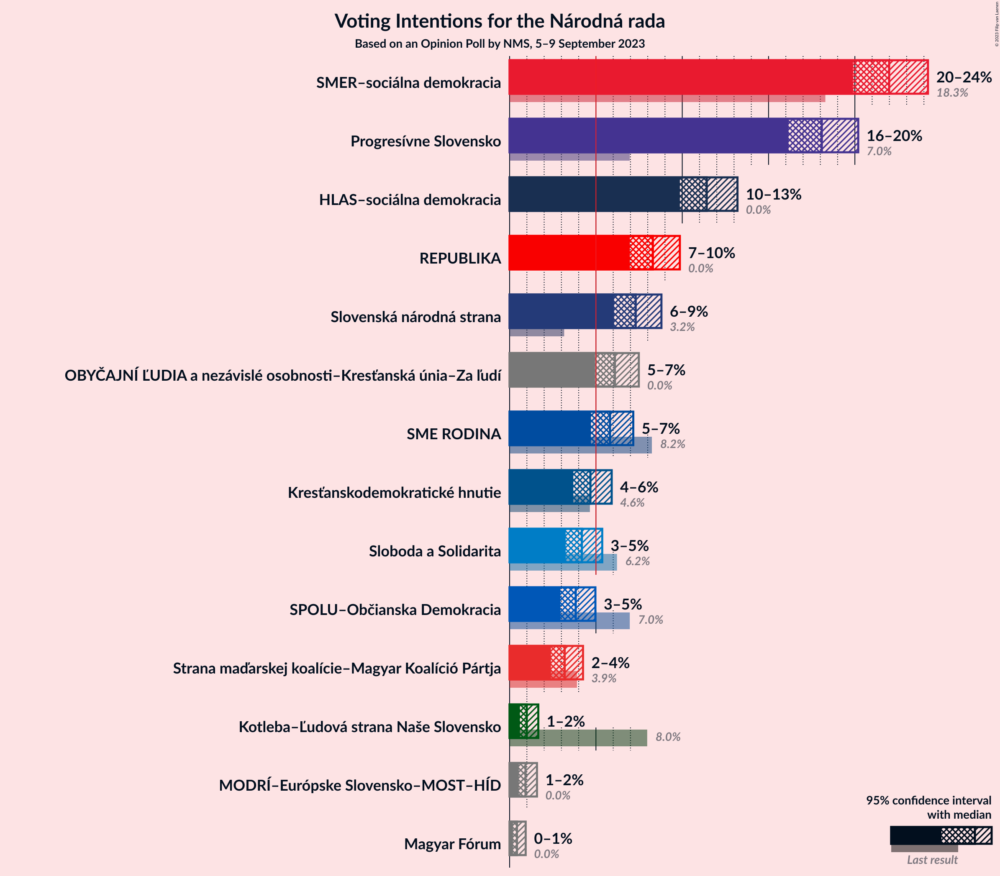

### Confidence Intervals

| Party | Last Result | Poll Result | 80% Confidence Interval | 90% Confidence Interval | 95% Confidence Interval | 99% Confidence Interval |
|:-----:|:-----------:|:-----------:|:-----------------------:|:-----------------------:|:-----------------------:|:-----------------------:|
| SMER–sociálna demokracia | 18.3% | 22.0% | 20.6–23.5% |20.2–23.9% |19.9–24.2% |19.3–25.0% |
| Progresívne Slovensko | 7.0% | 18.1% | 16.8–19.5% |16.5–19.8% |16.2–20.2% |15.6–20.9% |
| HLAS–sociálna demokracia | 0.0% | 11.4% | 10.4–12.6% |10.1–12.9% |9.9–13.2% |9.4–13.8% |
| REPUBLIKA | 0.0% | 8.3% | 7.4–9.3% |7.2–9.6% |7.0–9.9% |6.6–10.4% |
| Slovenská národná strana | 3.2% | 7.3% | 6.5–8.3% |6.2–8.6% |6.1–8.8% |5.7–9.3% |
| OBYČAJNÍ ĽUDIA a nezávislé osobnosti–Kresťanská únia–Za ľudí | 0.0% | 6.1% | 5.3–7.0% |5.1–7.3% |5.0–7.5% |4.6–7.9% |
| SME RODINA | 8.2% | 5.8% | 5.1–6.7% |4.9–7.0% |4.7–7.2% |4.4–7.6% |
| Kresťanskodemokratické hnutie | 4.6% | 4.7% | 4.0–5.5% |3.8–5.7% |3.7–5.9% |3.4–6.3% |
| Sloboda a Solidarita | 6.2% | 4.2% | 3.6–5.0% |3.4–5.2% |3.2–5.4% |3.0–5.8% |
| SPOLU–Občianska Demokracia | 7.0% | 3.8% | 3.2–4.6% |3.1–4.8% |2.9–5.0% |2.7–5.3% |
| Strana maďarskej koalície–Magyar Koalíció Pártja | 3.9% | 3.2% | 2.7–3.9% |2.5–4.1% |2.4–4.3% |2.2–4.6% |
| Kotleba–Ľudová strana Naše Slovensko | 8.0% | 1.0% | 0.7–1.4% |0.7–1.6% |0.6–1.7% |0.5–1.9% |
| MODRÍ–Európske Slovensko–MOST–HÍD | 0.0% | 0.9% | 0.7–1.3% |0.6–1.5% |0.5–1.6% |0.4–1.8% |
| Magyar Fórum | 0.0% | 0.4% | 0.3–0.7% |0.2–0.8% |0.2–0.9% |0.1–1.1% |

*Note:* The poll result column reflects the actual value used in the calculations. Published results may vary slightly, and in addition be rounded to fewer digits.

## Seats

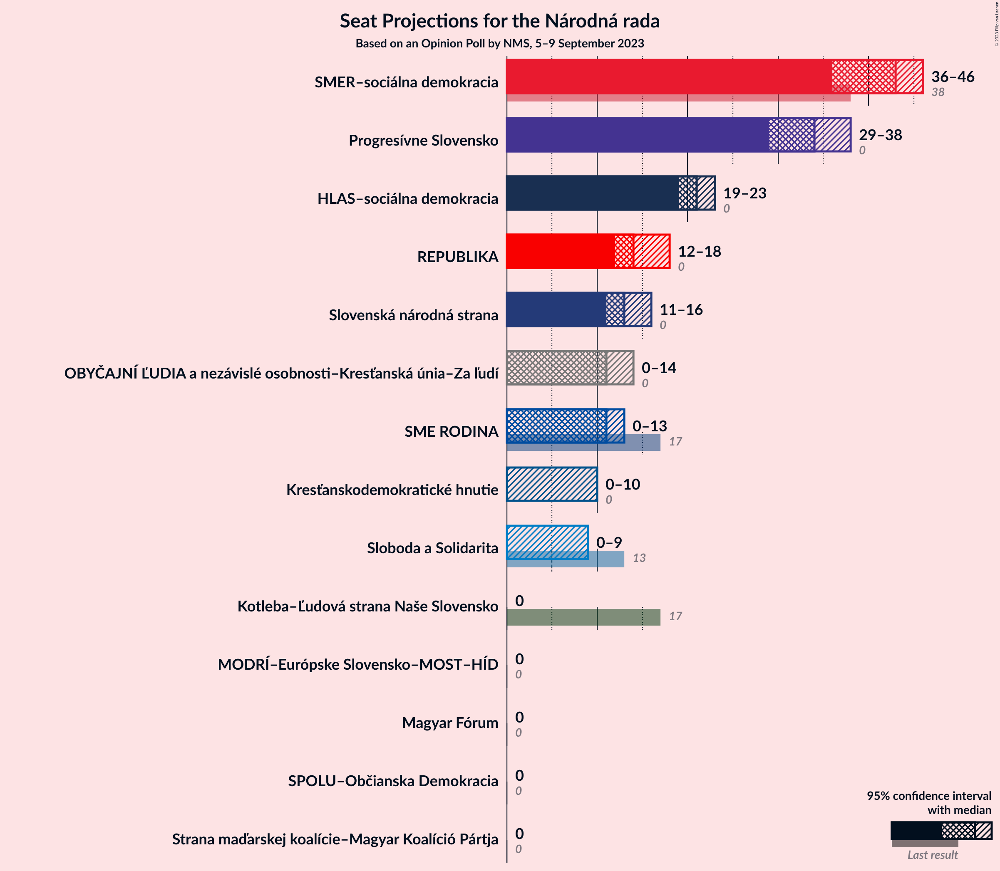

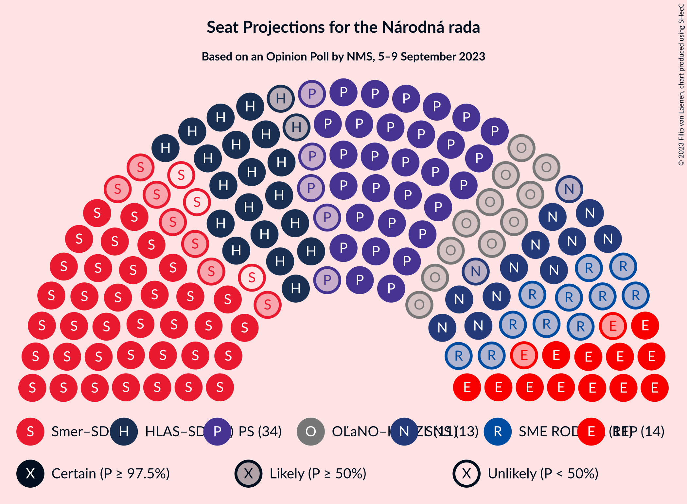

### Confidence Intervals

| Party | Last Result | Median | 80% Confidence Interval | 90% Confidence Interval | 95% Confidence Interval | 99% Confidence Interval |
|:-----:|:-----------:|:------:|:-----------------------:|:-----------------------:|:-----------------------:|:-----------------------:|
| <a href="#smer–sociálna-demokracia">SMER–sociálna demokracia</a> | 38 | 43 | 37–46 |36–46 |36–46 |35–47 |
| <a href="#progresívne-slovensko">Progresívne Slovensko</a> | 0 | 34 | 31–35 |31–36 |29–38 |28–40 |
| <a href="#hlas–sociálna-demokracia">HLAS–sociálna demokracia</a> | 0 | 21 | 19–23 |19–23 |19–23 |17–25 |
| <a href="#republika">REPUBLIKA</a> | 0 | 14 | 13–15 |12–17 |12–18 |12–19 |
| <a href="#slovenská-národná-strana">Slovenská národná strana</a> | 0 | 13 | 12–15 |11–15 |11–16 |11–16 |
| <a href="#obyčajní-ľudia-a-nezávislé-osobnosti–kresťanská-únia–za-ľudí">OBYČAJNÍ ĽUDIA a nezávislé osobnosti–Kresťanská únia–Za ľudí</a> | 0 | 11 | 10–14 |10–14 |0–14 |0–16 |
| <a href="#sme-rodina">SME RODINA</a> | 17 | 11 | 10–12 |10–13 |0–13 |0–13 |
| <a href="#kresťanskodemokratické-hnutie">Kresťanskodemokratické hnutie</a> | 0 | 0 | 0–10 |0–10 |0–10 |0–11 |
| <a href="#sloboda-a-solidarita">Sloboda a Solidarita</a> | 13 | 0 | 0 |0–9 |0–9 |0–10 |
| <a href="#spolu–občianska-demokracia">SPOLU–Občianska Demokracia</a> | 0 | 0 | 0 |0 |0 |0 |
| <a href="#strana-maďarskej-koalície–magyar-koalíció-pártja">Strana maďarskej koalície–Magyar Koalíció Pártja</a> | 0 | 0 | 0 |0 |0 |0 |
| <a href="#kotleba–ľudová-strana-naše-slovensko">Kotleba–Ľudová strana Naše Slovensko</a> | 17 | 0 | 0 |0 |0 |0 |
| <a href="#modrí–európske-slovensko–most–híd">MODRÍ–Európske Slovensko–MOST–HÍD</a> | 0 | 0 | 0 |0 |0 |0 |
| <a href="#magyar-fórum">Magyar Fórum</a> | 0 | 0 | 0 |0 |0 |0 |

### SMER–sociálna demokracia

*For a full overview of the results for this party, see the [SMER–sociálna demokracia](party-smer–sociálnademokracia.html) page.*

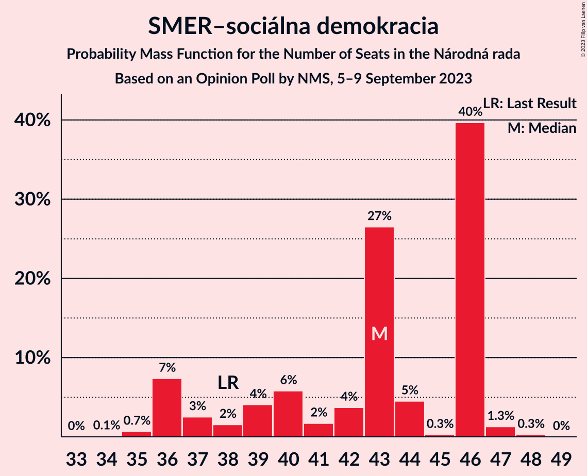

| Number of Seats | Probability | Accumulated | Special Marks |
|:---------------:|:-----------:|:-----------:|:-------------:|
| 34 | 0.1% | 100% |  |
| 35 | 0.7% | 99.9% |  |
| 36 | 7% | 99.2% |  |
| 37 | 3% | 92% |  |
| 38 | 2% | 89% | Last Result |
| 39 | 4% | 88% |  |
| 40 | 6% | 84% |  |
| 41 | 2% | 78% |  |
| 42 | 4% | 76% |  |
| 43 | 27% | 73% | Median |
| 44 | 5% | 46% |  |
| 45 | 0.3% | 42% |  |
| 46 | 40% | 41% |  |
| 47 | 1.3% | 2% |  |
| 48 | 0.3% | 0.3% |  |
| 49 | 0% | 0% |  |

### Progresívne Slovensko

*For a full overview of the results for this party, see the [Progresívne Slovensko](party-progresívneslovensko.html) page.*

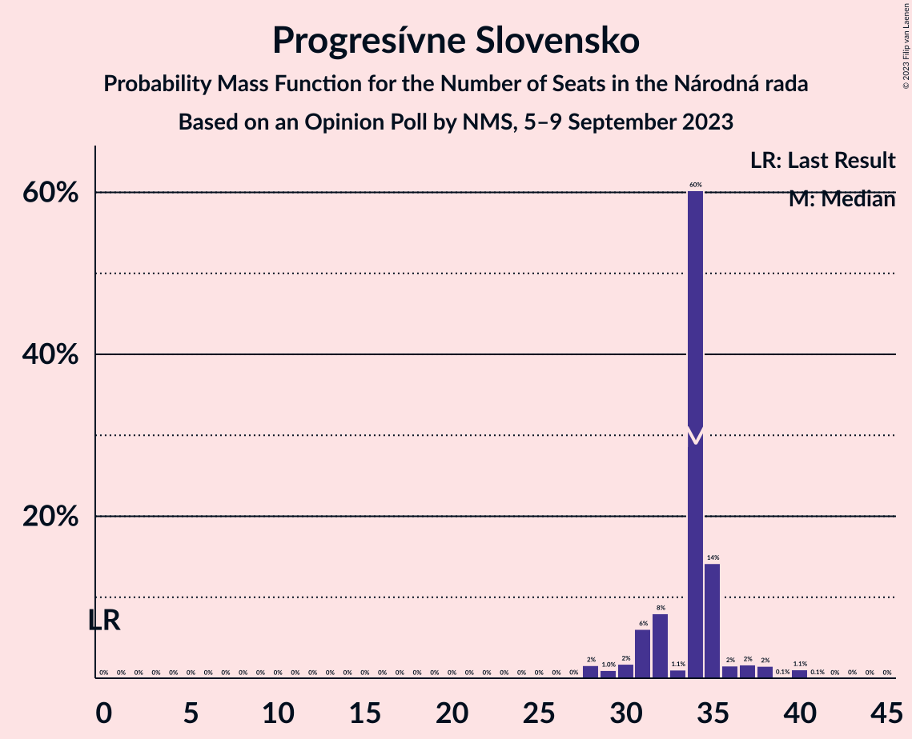

| Number of Seats | Probability | Accumulated | Special Marks |
|:---------------:|:-----------:|:-----------:|:-------------:|
| 0 | 0% | 100% | Last Result |
| 1 | 0% | 100% |  |
| 2 | 0% | 100% |  |
| 3 | 0% | 100% |  |
| 4 | 0% | 100% |  |
| 5 | 0% | 100% |  |
| 6 | 0% | 100% |  |
| 7 | 0% | 100% |  |
| 8 | 0% | 100% |  |
| 9 | 0% | 100% |  |
| 10 | 0% | 100% |  |
| 11 | 0% | 100% |  |
| 12 | 0% | 100% |  |
| 13 | 0% | 100% |  |
| 14 | 0% | 100% |  |
| 15 | 0% | 100% |  |
| 16 | 0% | 100% |  |
| 17 | 0% | 100% |  |
| 18 | 0% | 100% |  |
| 19 | 0% | 100% |  |
| 20 | 0% | 100% |  |
| 21 | 0% | 100% |  |
| 22 | 0% | 100% |  |
| 23 | 0% | 100% |  |
| 24 | 0% | 100% |  |
| 25 | 0% | 100% |  |
| 26 | 0% | 100% |  |
| 27 | 0% | 100% |  |
| 28 | 2% | 100% |  |
| 29 | 1.0% | 98% |  |
| 30 | 2% | 97% |  |
| 31 | 6% | 96% |  |
| 32 | 8% | 90% |  |
| 33 | 1.1% | 82% |  |
| 34 | 60% | 80% | Median |
| 35 | 14% | 20% |  |
| 36 | 2% | 6% |  |
| 37 | 2% | 4% |  |
| 38 | 2% | 3% |  |
| 39 | 0.1% | 1.3% |  |
| 40 | 1.1% | 1.2% |  |
| 41 | 0.1% | 0.1% |  |
| 42 | 0% | 0% |  |

### HLAS–sociálna demokracia

*For a full overview of the results for this party, see the [HLAS–sociálna demokracia](party-hlas–sociálnademokracia.html) page.*

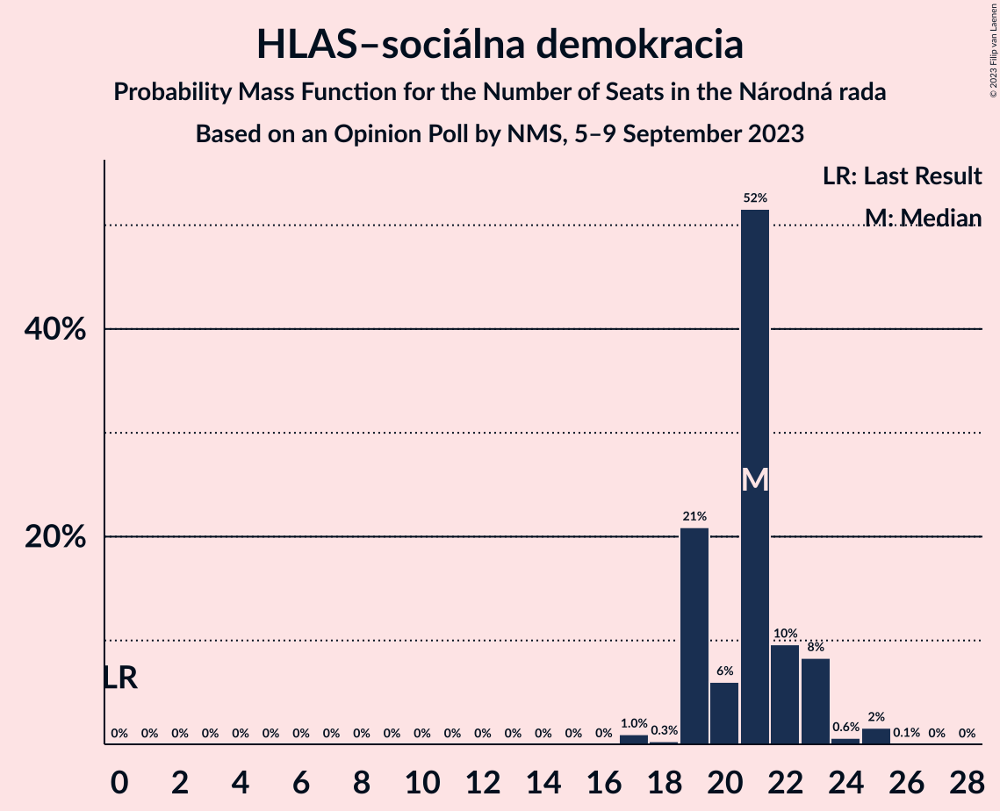

| Number of Seats | Probability | Accumulated | Special Marks |
|:---------------:|:-----------:|:-----------:|:-------------:|
| 0 | 0% | 100% | Last Result |
| 1 | 0% | 100% |  |
| 2 | 0% | 100% |  |
| 3 | 0% | 100% |  |
| 4 | 0% | 100% |  |
| 5 | 0% | 100% |  |
| 6 | 0% | 100% |  |
| 7 | 0% | 100% |  |
| 8 | 0% | 100% |  |
| 9 | 0% | 100% |  |
| 10 | 0% | 100% |  |
| 11 | 0% | 100% |  |
| 12 | 0% | 100% |  |
| 13 | 0% | 100% |  |
| 14 | 0% | 100% |  |
| 15 | 0% | 100% |  |
| 16 | 0% | 100% |  |
| 17 | 1.0% | 100% |  |
| 18 | 0.3% | 99.0% |  |
| 19 | 21% | 98.7% |  |
| 20 | 6% | 78% |  |
| 21 | 52% | 72% | Median |
| 22 | 10% | 20% |  |
| 23 | 8% | 11% |  |
| 24 | 0.6% | 2% |  |
| 25 | 2% | 2% |  |
| 26 | 0.1% | 0.1% |  |
| 27 | 0% | 0% |  |

### REPUBLIKA

*For a full overview of the results for this party, see the [REPUBLIKA](party-republika.html) page.*

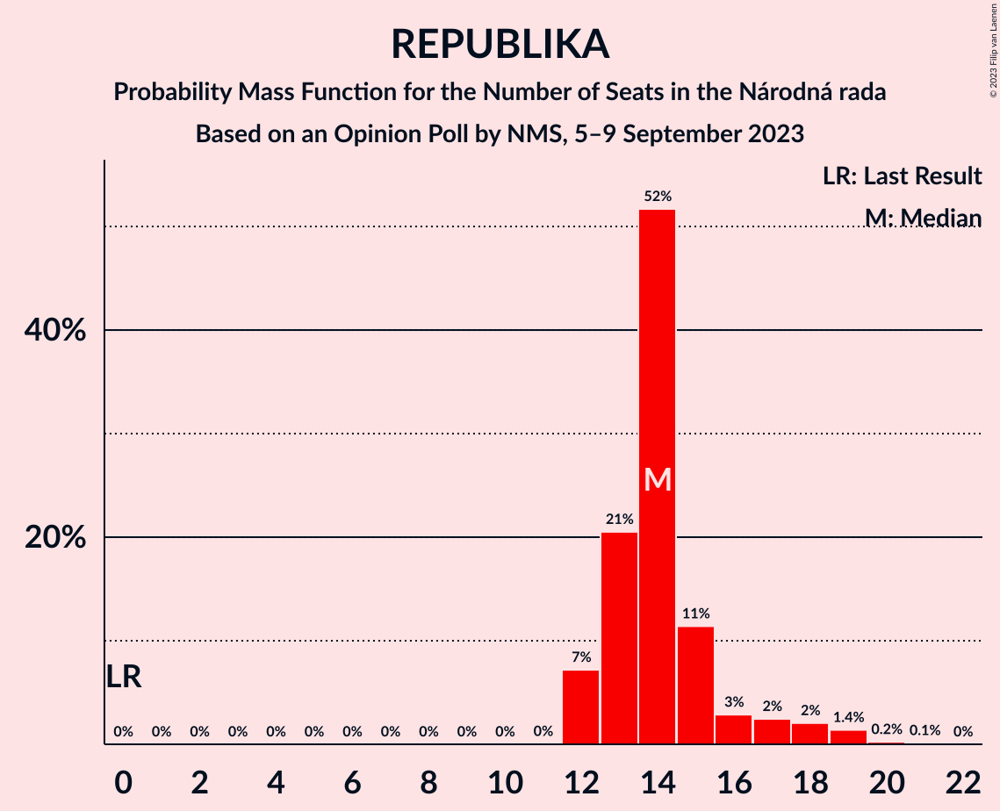

| Number of Seats | Probability | Accumulated | Special Marks |
|:---------------:|:-----------:|:-----------:|:-------------:|
| 0 | 0% | 100% | Last Result |
| 1 | 0% | 100% |  |
| 2 | 0% | 100% |  |
| 3 | 0% | 100% |  |
| 4 | 0% | 100% |  |
| 5 | 0% | 100% |  |
| 6 | 0% | 100% |  |
| 7 | 0% | 100% |  |
| 8 | 0% | 100% |  |
| 9 | 0% | 100% |  |
| 10 | 0% | 100% |  |
| 11 | 0% | 100% |  |
| 12 | 7% | 100% |  |
| 13 | 21% | 93% |  |
| 14 | 52% | 72% | Median |
| 15 | 11% | 21% |  |
| 16 | 3% | 9% |  |
| 17 | 2% | 6% |  |
| 18 | 2% | 4% |  |
| 19 | 1.4% | 2% |  |
| 20 | 0.2% | 0.4% |  |
| 21 | 0.1% | 0.1% |  |
| 22 | 0% | 0% |  |

### Slovenská národná strana

*For a full overview of the results for this party, see the [Slovenská národná strana](party-slovenskánárodnástrana.html) page.*

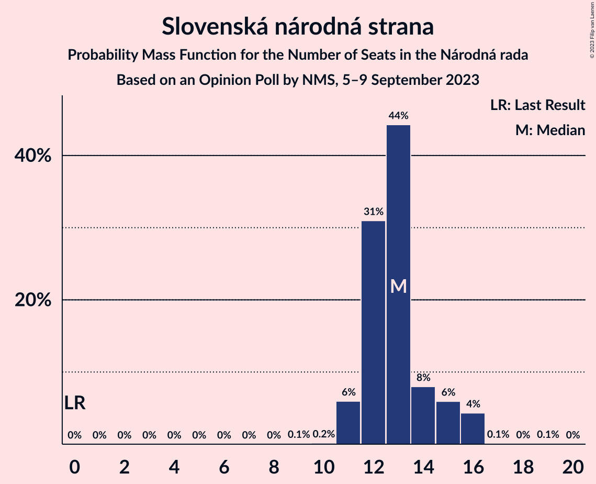

| Number of Seats | Probability | Accumulated | Special Marks |
|:---------------:|:-----------:|:-----------:|:-------------:|
| 0 | 0% | 100% | Last Result |
| 1 | 0% | 100% |  |
| 2 | 0% | 100% |  |
| 3 | 0% | 100% |  |
| 4 | 0% | 100% |  |
| 5 | 0% | 100% |  |
| 6 | 0% | 100% |  |
| 7 | 0% | 100% |  |
| 8 | 0% | 100% |  |
| 9 | 0.1% | 100% |  |
| 10 | 0.2% | 99.9% |  |
| 11 | 6% | 99.7% |  |
| 12 | 31% | 94% |  |
| 13 | 44% | 63% | Median |
| 14 | 8% | 19% |  |
| 15 | 6% | 11% |  |
| 16 | 4% | 5% |  |
| 17 | 0.1% | 0.3% |  |
| 18 | 0% | 0.2% |  |
| 19 | 0.1% | 0.1% |  |
| 20 | 0% | 0% |  |

### OBYČAJNÍ ĽUDIA a nezávislé osobnosti–Kresťanská únia–Za ľudí

*For a full overview of the results for this party, see the [OBYČAJNÍ ĽUDIA a nezávislé osobnosti–Kresťanská únia–Za ľudí](party-obyčajníľudiaanezávisléosobnosti–kresťanskáúnia–zaľudí.html) page.*

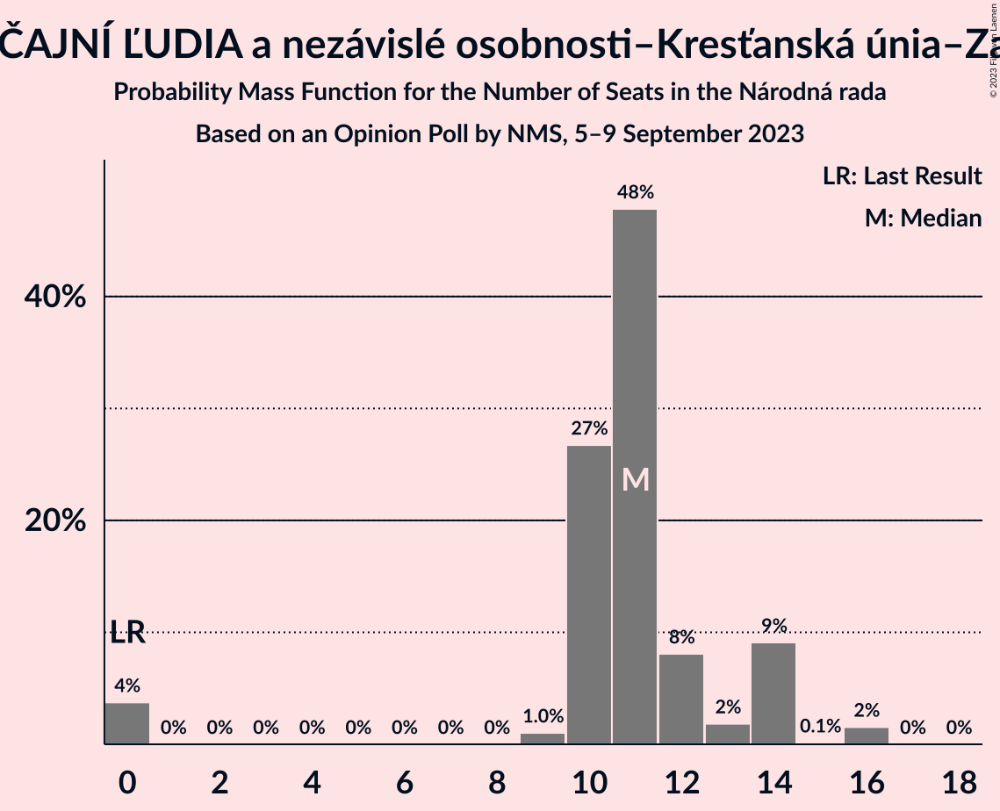

| Number of Seats | Probability | Accumulated | Special Marks |
|:---------------:|:-----------:|:-----------:|:-------------:|
| 0 | 4% | 100% | Last Result |
| 1 | 0% | 96% |  |
| 2 | 0% | 96% |  |
| 3 | 0% | 96% |  |
| 4 | 0% | 96% |  |
| 5 | 0% | 96% |  |
| 6 | 0% | 96% |  |
| 7 | 0% | 96% |  |
| 8 | 0% | 96% |  |
| 9 | 1.0% | 96% |  |
| 10 | 27% | 95% |  |
| 11 | 48% | 69% | Median |
| 12 | 8% | 21% |  |
| 13 | 2% | 13% |  |
| 14 | 9% | 11% |  |
| 15 | 0.1% | 2% |  |
| 16 | 2% | 2% |  |
| 17 | 0% | 0% |  |

### SME RODINA

*For a full overview of the results for this party, see the [SME RODINA](party-smerodina.html) page.*

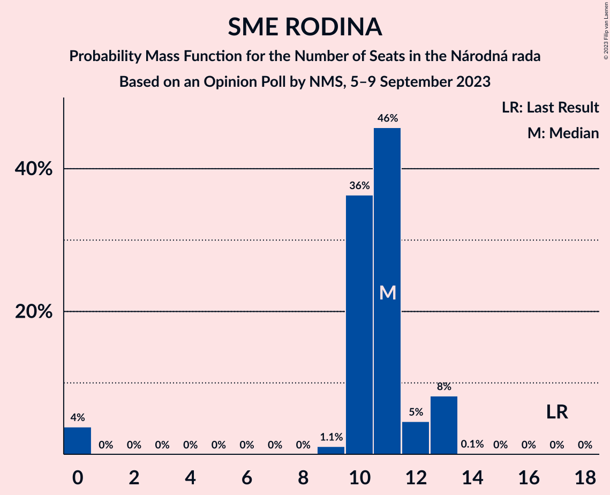

| Number of Seats | Probability | Accumulated | Special Marks |
|:---------------:|:-----------:|:-----------:|:-------------:|
| 0 | 4% | 100% |  |
| 1 | 0% | 96% |  |
| 2 | 0% | 96% |  |
| 3 | 0% | 96% |  |
| 4 | 0% | 96% |  |
| 5 | 0% | 96% |  |
| 6 | 0% | 96% |  |
| 7 | 0% | 96% |  |
| 8 | 0% | 96% |  |
| 9 | 1.1% | 96% |  |
| 10 | 36% | 95% |  |
| 11 | 46% | 59% | Median |
| 12 | 5% | 13% |  |
| 13 | 8% | 8% |  |
| 14 | 0.1% | 0.2% |  |
| 15 | 0% | 0% |  |
| 16 | 0% | 0% |  |
| 17 | 0% | 0% | Last Result |

### Kresťanskodemokratické hnutie

*For a full overview of the results for this party, see the [Kresťanskodemokratické hnutie](party-kresťanskodemokratickéhnutie.html) page.*

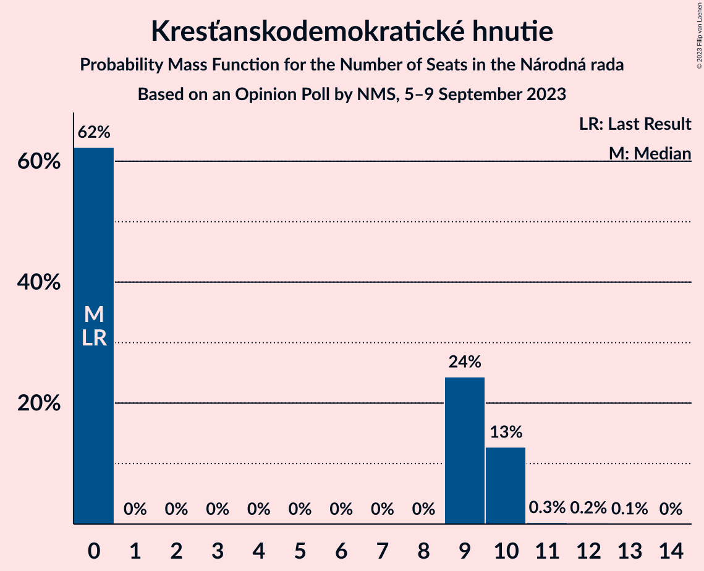

| Number of Seats | Probability | Accumulated | Special Marks |
|:---------------:|:-----------:|:-----------:|:-------------:|
| 0 | 62% | 100% | Last Result, Median |
| 1 | 0% | 38% |  |
| 2 | 0% | 38% |  |
| 3 | 0% | 38% |  |
| 4 | 0% | 38% |  |
| 5 | 0% | 38% |  |
| 6 | 0% | 38% |  |
| 7 | 0% | 38% |  |
| 8 | 0% | 38% |  |
| 9 | 24% | 38% |  |
| 10 | 13% | 13% |  |
| 11 | 0.3% | 0.6% |  |
| 12 | 0.2% | 0.3% |  |
| 13 | 0.1% | 0.1% |  |
| 14 | 0% | 0% |  |

### Sloboda a Solidarita

*For a full overview of the results for this party, see the [Sloboda a Solidarita](party-slobodaasolidarita.html) page.*

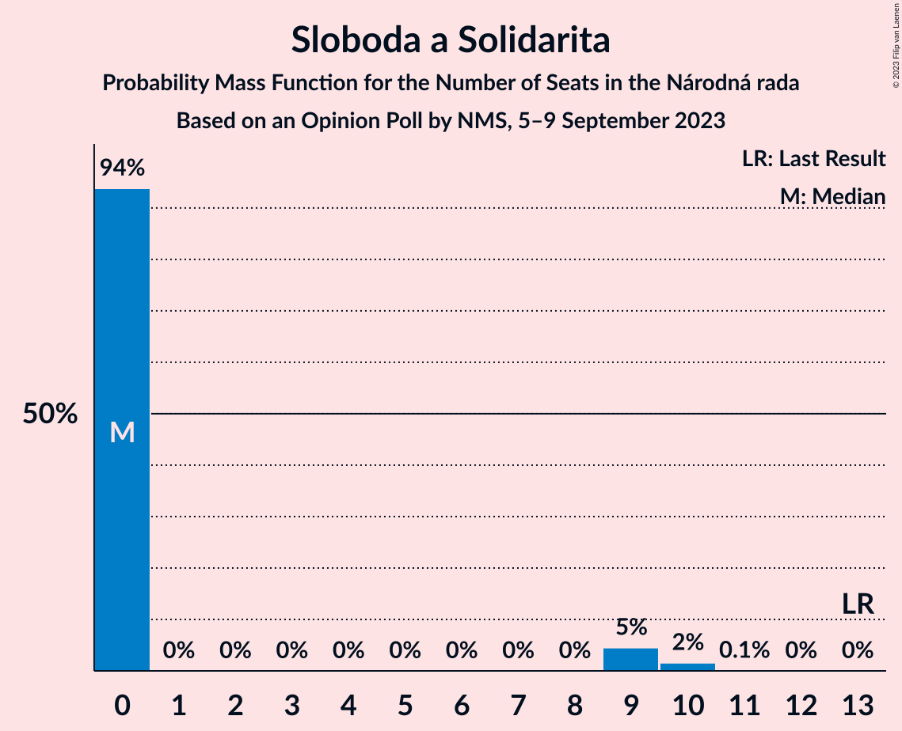

| Number of Seats | Probability | Accumulated | Special Marks |
|:---------------:|:-----------:|:-----------:|:-------------:|
| 0 | 94% | 100% | Median |
| 1 | 0% | 6% |  |
| 2 | 0% | 6% |  |
| 3 | 0% | 6% |  |
| 4 | 0% | 6% |  |
| 5 | 0% | 6% |  |
| 6 | 0% | 6% |  |
| 7 | 0% | 6% |  |
| 8 | 0% | 6% |  |
| 9 | 5% | 6% |  |
| 10 | 2% | 2% |  |
| 11 | 0.1% | 0.1% |  |
| 12 | 0% | 0% |  |
| 13 | 0% | 0% | Last Result |

### SPOLU–Občianska Demokracia

*For a full overview of the results for this party, see the [SPOLU–Občianska Demokracia](party-spolu–občianskademokracia.html) page.*

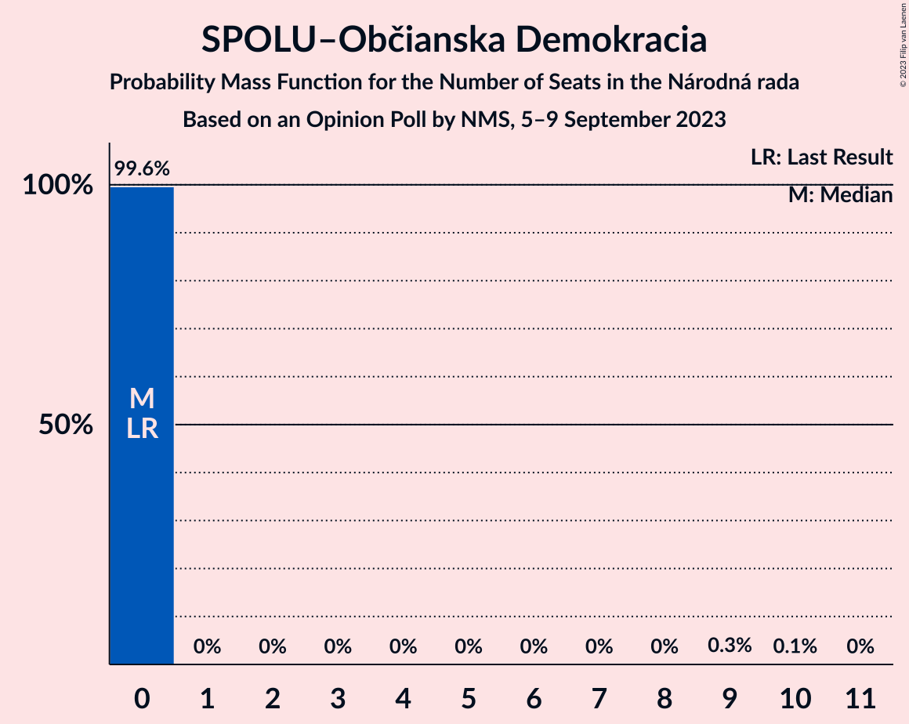

| Number of Seats | Probability | Accumulated | Special Marks |
|:---------------:|:-----------:|:-----------:|:-------------:|
| 0 | 99.6% | 100% | Last Result, Median |
| 1 | 0% | 0.4% |  |
| 2 | 0% | 0.4% |  |
| 3 | 0% | 0.4% |  |
| 4 | 0% | 0.4% |  |
| 5 | 0% | 0.4% |  |
| 6 | 0% | 0.4% |  |
| 7 | 0% | 0.4% |  |
| 8 | 0% | 0.4% |  |
| 9 | 0.3% | 0.4% |  |
| 10 | 0.1% | 0.1% |  |
| 11 | 0% | 0% |  |

### Strana maďarskej koalície–Magyar Koalíció Pártja

*For a full overview of the results for this party, see the [Strana maďarskej koalície–Magyar Koalíció Pártja](party-stranamaďarskejkoalície–magyarkoalíciópártja.html) page.*

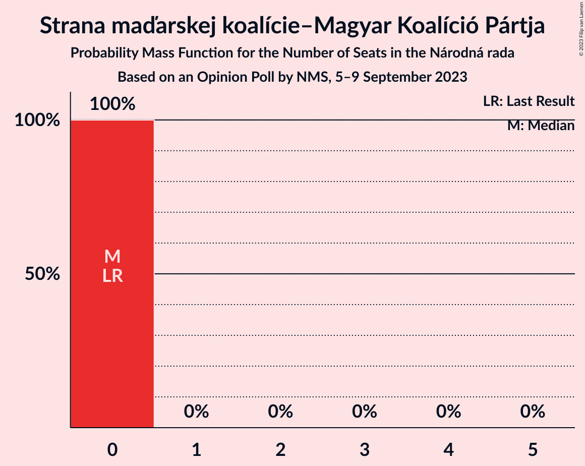

| Number of Seats | Probability | Accumulated | Special Marks |
|:---------------:|:-----------:|:-----------:|:-------------:|
| 0 | 100% | 100% | Last Result, Median |

### Kotleba–Ľudová strana Naše Slovensko

*For a full overview of the results for this party, see the [Kotleba–Ľudová strana Naše Slovensko](party-kotleba–ľudovástrananašeslovensko.html) page.*

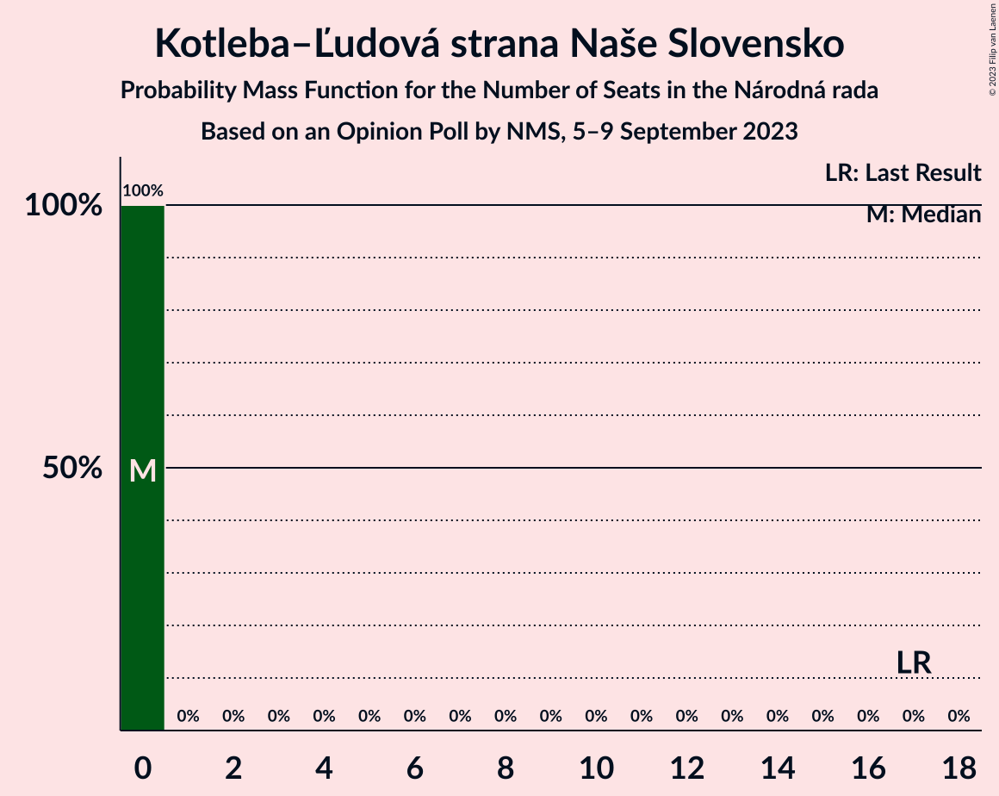

| Number of Seats | Probability | Accumulated | Special Marks |
|:---------------:|:-----------:|:-----------:|:-------------:|
| 0 | 100% | 100% | Median |
| 1 | 0% | 0% |  |
| 2 | 0% | 0% |  |
| 3 | 0% | 0% |  |
| 4 | 0% | 0% |  |
| 5 | 0% | 0% |  |
| 6 | 0% | 0% |  |
| 7 | 0% | 0% |  |
| 8 | 0% | 0% |  |
| 9 | 0% | 0% |  |
| 10 | 0% | 0% |  |
| 11 | 0% | 0% |  |
| 12 | 0% | 0% |  |
| 13 | 0% | 0% |  |
| 14 | 0% | 0% |  |
| 15 | 0% | 0% |  |
| 16 | 0% | 0% |  |
| 17 | 0% | 0% | Last Result |

### MODRÍ–Európske Slovensko–MOST–HÍD

*For a full overview of the results for this party, see the [MODRÍ–Európske Slovensko–MOST–HÍD](party-modrí–európskeslovensko–most–híd.html) page.*

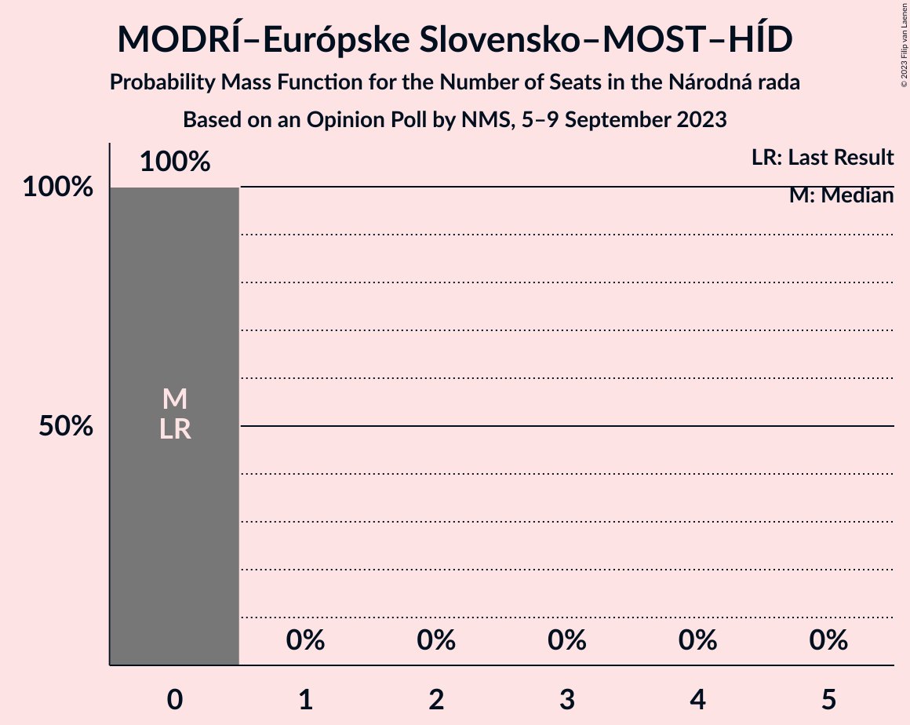

| Number of Seats | Probability | Accumulated | Special Marks |
|:---------------:|:-----------:|:-----------:|:-------------:|
| 0 | 100% | 100% | Last Result, Median |

### Magyar Fórum

*For a full overview of the results for this party, see the [Magyar Fórum](party-magyarfórum.html) page.*

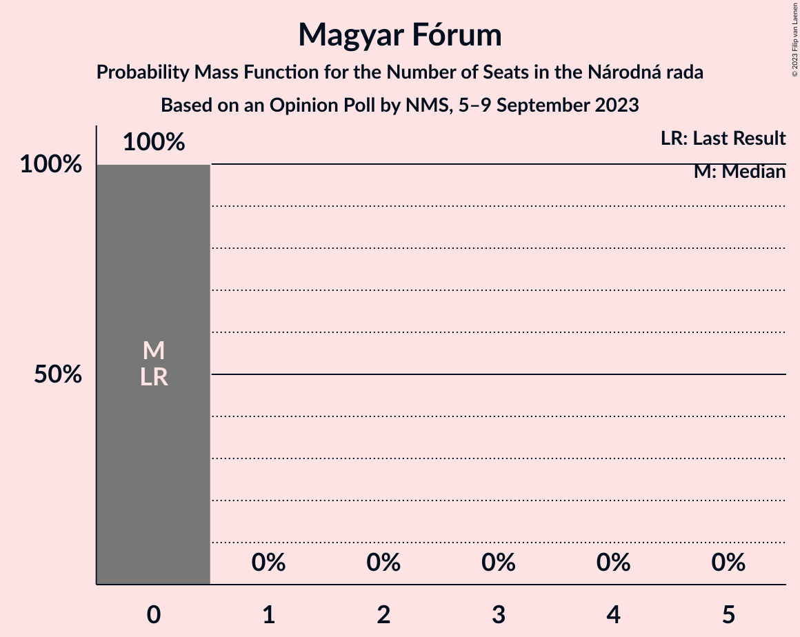

| Number of Seats | Probability | Accumulated | Special Marks |
|:---------------:|:-----------:|:-----------:|:-------------:|
| 0 | 100% | 100% | Last Result, Median |

## Coalitions

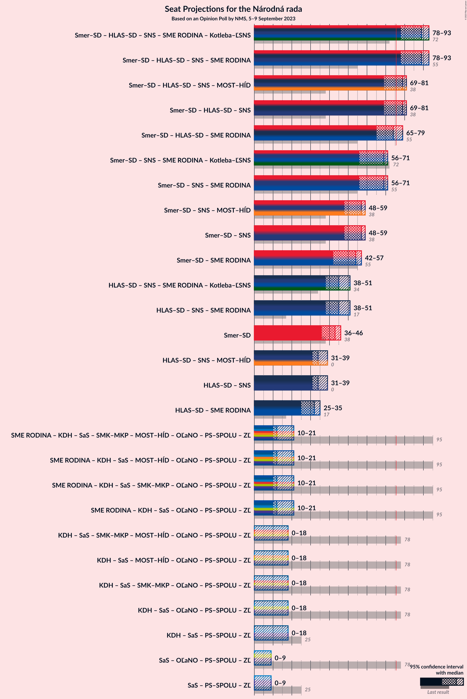

### Confidence Intervals

| Coalition | Last Result | Median | Majority? | 80% Confidence Interval | 90% Confidence Interval | 95% Confidence Interval | 99% Confidence Interval |
|:---------:|:-----------:|:------:|:---------:|:-----------------------:|:-----------------------:|:-----------------------:|:-----------------------:|
| SMER–sociálna demokracia – HLAS–sociálna demokracia – Slovenská národná strana – SME RODINA – Kotleba–Ľudová strana Naše Slovensko | 72 | 89 | 98% | 79–91 | 79–92 | 78–93 | 75–98 |
| SMER–sociálna demokracia – HLAS–sociálna demokracia – Slovenská národná strana – SME RODINA | 55 | 89 | 98% | 79–91 | 79–92 | 78–93 | 75–98 |
| SMER–sociálna demokracia – HLAS–sociálna demokracia – Slovenská národná strana | 38 | 79 | 56% | 72–80 | 69–80 | 69–81 | 69–86 |
| SMER–sociálna demokracia – HLAS–sociálna demokracia – SME RODINA | 55 | 74 | 49% | 67–78 | 67–78 | 65–79 | 59–82 |
| SMER–sociálna demokracia – Slovenská národná strana – SME RODINA – Kotleba–Ľudová strana Naše Slovensko | 72 | 69 | 0.3% | 58–70 | 58–70 | 56–71 | 53–75 |
| SMER–sociálna demokracia – Slovenská národná strana – SME RODINA | 55 | 69 | 0.3% | 58–70 | 58–70 | 56–71 | 53–75 |
| SMER–sociálna demokracia – Slovenská národná strana | 38 | 57 | 0% | 51–59 | 48–59 | 48–59 | 46–63 |
| SMER–sociálna demokracia – SME RODINA | 55 | 54 | 0% | 46–57 | 46–57 | 42–57 | 37–59 |
| HLAS–sociálna demokracia – Slovenská národná strana – SME RODINA – Kotleba–Ľudová strana Naše Slovensko | 34 | 45 | 0% | 41–48 | 41–49 | 38–51 | 36–51 |
| HLAS–sociálna demokracia – Slovenská národná strana – SME RODINA | 17 | 45 | 0% | 41–48 | 41–49 | 38–51 | 36–51 |
| SMER–sociálna demokracia | 38 | 43 | 0% | 37–46 | 36–46 | 36–46 | 35–47 |
| HLAS–sociálna demokracia – Slovenská národná strana | 0 | 34 | 0% | 31–36 | 31–38 | 31–39 | 29–39 |
| HLAS–sociálna demokracia – SME RODINA | 17 | 32 | 0% | 29–35 | 28–35 | 25–35 | 22–36 |

### SMER–sociálna demokracia – HLAS–sociálna demokracia – Slovenská národná strana – SME RODINA – Kotleba–Ľudová strana Naše Slovensko

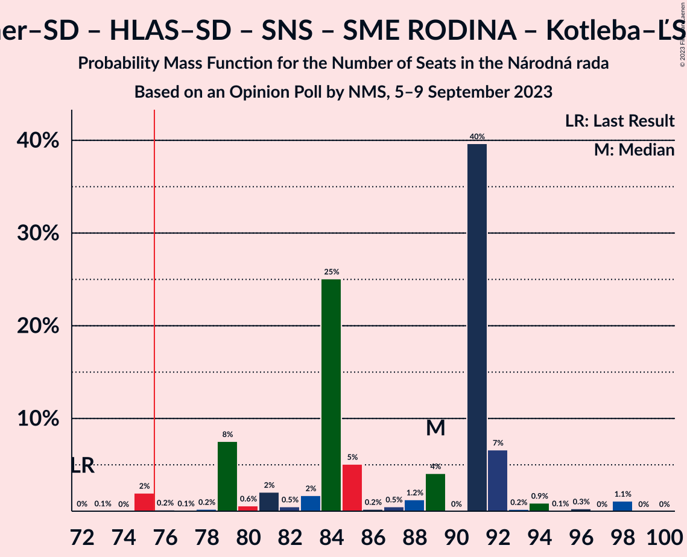

| Number of Seats | Probability | Accumulated | Special Marks |
|:---------------:|:-----------:|:-----------:|:-------------:|
| 72 | 0% | 100% | Last Result |
| 73 | 0.1% | 99.9% |  |
| 74 | 0% | 99.9% |  |
| 75 | 2% | 99.9% |  |
| 76 | 0.2% | 98% | Majority |
| 77 | 0.1% | 98% |  |
| 78 | 0.2% | 98% |  |
| 79 | 8% | 97% |  |
| 80 | 0.6% | 90% |  |
| 81 | 2% | 89% |  |
| 82 | 0.5% | 87% |  |
| 83 | 2% | 87% |  |
| 84 | 25% | 85% |  |
| 85 | 5% | 60% |  |
| 86 | 0.2% | 55% |  |
| 87 | 0.5% | 55% |  |
| 88 | 1.2% | 54% | Median |
| 89 | 4% | 53% |  |
| 90 | 0% | 49% |  |
| 91 | 40% | 49% |  |
| 92 | 7% | 9% |  |
| 93 | 0.2% | 3% |  |
| 94 | 0.9% | 2% |  |
| 95 | 0.1% | 1.5% |  |
| 96 | 0.3% | 1.4% |  |
| 97 | 0% | 1.1% |  |
| 98 | 1.1% | 1.1% |  |
| 99 | 0% | 0% |  |

### SMER–sociálna demokracia – HLAS–sociálna demokracia – Slovenská národná strana – SME RODINA

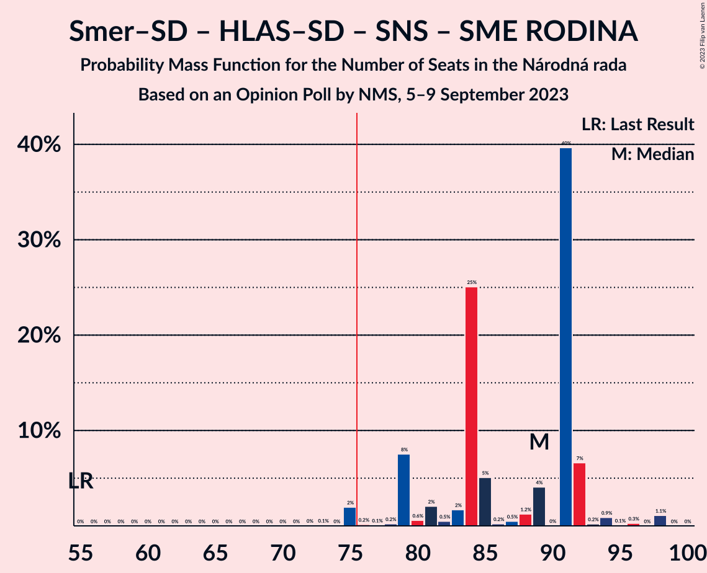

| Number of Seats | Probability | Accumulated | Special Marks |
|:---------------:|:-----------:|:-----------:|:-------------:|
| 55 | 0% | 100% | Last Result |
| 56 | 0% | 100% |  |
| 57 | 0% | 100% |  |
| 58 | 0% | 100% |  |
| 59 | 0% | 100% |  |
| 60 | 0% | 100% |  |
| 61 | 0% | 100% |  |
| 62 | 0% | 100% |  |
| 63 | 0% | 100% |  |
| 64 | 0% | 100% |  |
| 65 | 0% | 100% |  |
| 66 | 0% | 100% |  |
| 67 | 0% | 100% |  |
| 68 | 0% | 100% |  |
| 69 | 0% | 100% |  |
| 70 | 0% | 100% |  |
| 71 | 0% | 100% |  |
| 72 | 0% | 100% |  |
| 73 | 0.1% | 99.9% |  |
| 74 | 0% | 99.9% |  |
| 75 | 2% | 99.9% |  |
| 76 | 0.2% | 98% | Majority |
| 77 | 0.1% | 98% |  |
| 78 | 0.2% | 98% |  |
| 79 | 8% | 97% |  |
| 80 | 0.6% | 90% |  |
| 81 | 2% | 89% |  |
| 82 | 0.5% | 87% |  |
| 83 | 2% | 87% |  |
| 84 | 25% | 85% |  |
| 85 | 5% | 60% |  |
| 86 | 0.2% | 55% |  |
| 87 | 0.5% | 55% |  |
| 88 | 1.2% | 54% | Median |
| 89 | 4% | 53% |  |
| 90 | 0% | 49% |  |
| 91 | 40% | 49% |  |
| 92 | 7% | 9% |  |
| 93 | 0.2% | 3% |  |
| 94 | 0.9% | 2% |  |
| 95 | 0.1% | 1.5% |  |
| 96 | 0.3% | 1.4% |  |
| 97 | 0% | 1.1% |  |
| 98 | 1.1% | 1.1% |  |
| 99 | 0% | 0% |  |

### SMER–sociálna demokracia – HLAS–sociálna demokracia – Slovenská národná strana

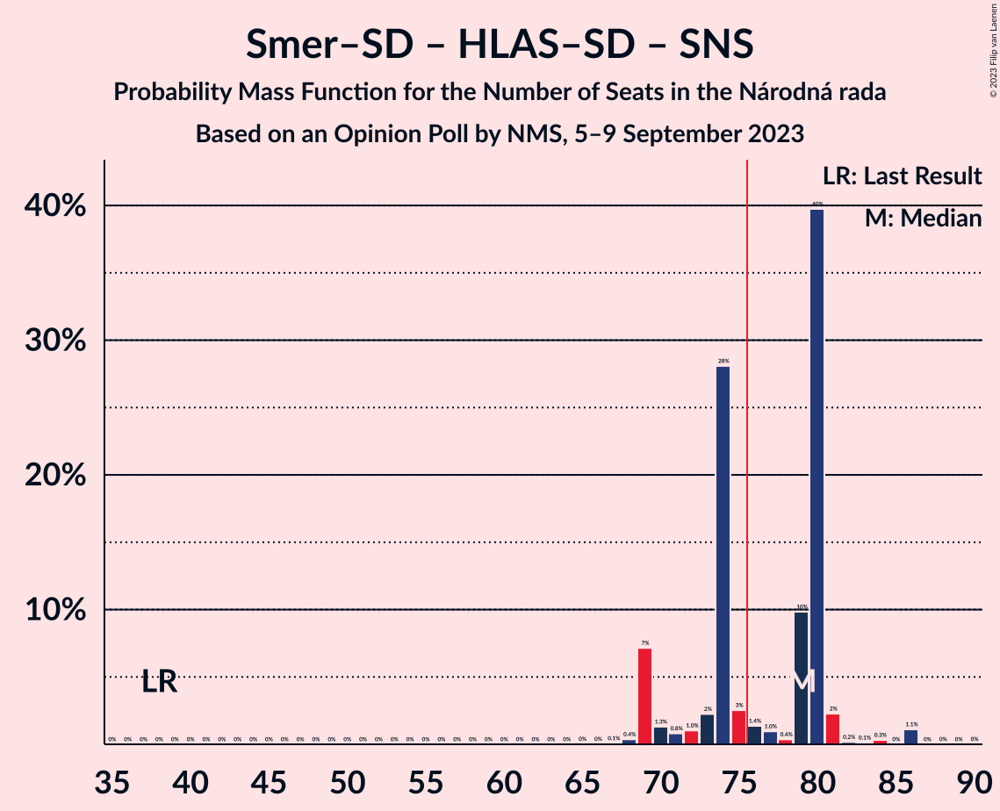

| Number of Seats | Probability | Accumulated | Special Marks |
|:---------------:|:-----------:|:-----------:|:-------------:|
| 38 | 0% | 100% | Last Result |
| 39 | 0% | 100% |  |
| 40 | 0% | 100% |  |
| 41 | 0% | 100% |  |
| 42 | 0% | 100% |  |
| 43 | 0% | 100% |  |
| 44 | 0% | 100% |  |
| 45 | 0% | 100% |  |
| 46 | 0% | 100% |  |
| 47 | 0% | 100% |  |
| 48 | 0% | 100% |  |
| 49 | 0% | 100% |  |
| 50 | 0% | 100% |  |
| 51 | 0% | 100% |  |
| 52 | 0% | 100% |  |
| 53 | 0% | 100% |  |
| 54 | 0% | 100% |  |
| 55 | 0% | 100% |  |
| 56 | 0% | 100% |  |
| 57 | 0% | 100% |  |
| 58 | 0% | 100% |  |
| 59 | 0% | 100% |  |
| 60 | 0% | 100% |  |
| 61 | 0% | 100% |  |
| 62 | 0% | 100% |  |
| 63 | 0% | 100% |  |
| 64 | 0% | 100% |  |
| 65 | 0% | 100% |  |
| 66 | 0% | 100% |  |
| 67 | 0.1% | 100% |  |
| 68 | 0.4% | 99.9% |  |
| 69 | 7% | 99.5% |  |
| 70 | 1.3% | 92% |  |
| 71 | 0.8% | 91% |  |
| 72 | 1.0% | 90% |  |
| 73 | 2% | 89% |  |
| 74 | 28% | 87% |  |
| 75 | 3% | 59% |  |
| 76 | 1.4% | 56% | Majority |
| 77 | 1.0% | 55% | Median |
| 78 | 0.4% | 54% |  |
| 79 | 10% | 54% |  |
| 80 | 40% | 44% |  |
| 81 | 2% | 4% |  |
| 82 | 0.2% | 2% |  |
| 83 | 0.1% | 2% |  |
| 84 | 0.3% | 1.5% |  |
| 85 | 0% | 1.2% |  |
| 86 | 1.1% | 1.1% |  |
| 87 | 0% | 0% |  |

### SMER–sociálna demokracia – HLAS–sociálna demokracia – SME RODINA

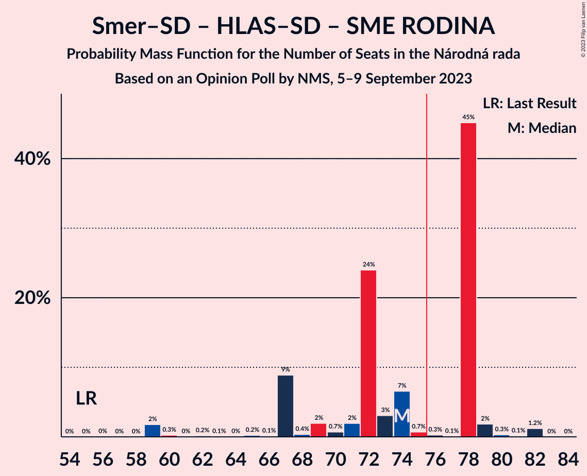

| Number of Seats | Probability | Accumulated | Special Marks |
|:---------------:|:-----------:|:-----------:|:-------------:|
| 55 | 0% | 100% | Last Result |
| 56 | 0% | 100% |  |
| 57 | 0% | 100% |  |
| 58 | 0% | 99.9% |  |
| 59 | 2% | 99.9% |  |
| 60 | 0.3% | 98% |  |
| 61 | 0% | 98% |  |
| 62 | 0.2% | 98% |  |
| 63 | 0.1% | 98% |  |
| 64 | 0% | 98% |  |
| 65 | 0.2% | 98% |  |
| 66 | 0.1% | 97% |  |
| 67 | 9% | 97% |  |
| 68 | 0.4% | 88% |  |
| 69 | 2% | 88% |  |
| 70 | 0.7% | 86% |  |
| 71 | 2% | 85% |  |
| 72 | 24% | 83% |  |
| 73 | 3% | 59% |  |
| 74 | 7% | 56% |  |
| 75 | 0.7% | 50% | Median |
| 76 | 0.3% | 49% | Majority |
| 77 | 0.1% | 49% |  |
| 78 | 45% | 49% |  |
| 79 | 2% | 4% |  |
| 80 | 0.3% | 2% |  |
| 81 | 0.1% | 1.4% |  |
| 82 | 1.2% | 1.2% |  |
| 83 | 0% | 0% |  |

### SMER–sociálna demokracia – Slovenská národná strana – SME RODINA – Kotleba–Ľudová strana Naše Slovensko

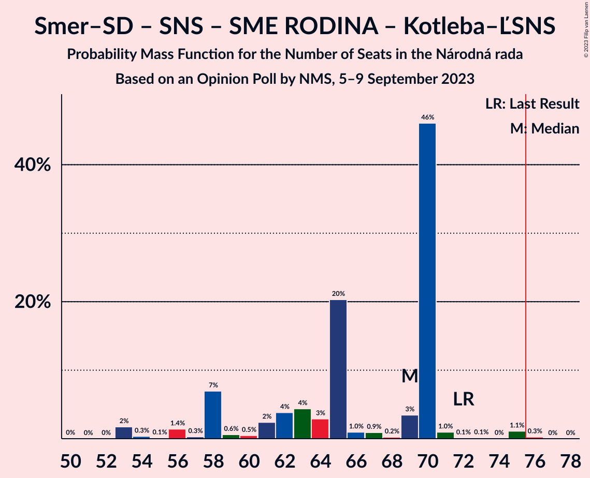

| Number of Seats | Probability | Accumulated | Special Marks |
|:---------------:|:-----------:|:-----------:|:-------------:|
| 50 | 0% | 100% |  |
| 51 | 0% | 99.9% |  |
| 52 | 0% | 99.9% |  |
| 53 | 2% | 99.9% |  |
| 54 | 0.3% | 98% |  |
| 55 | 0.1% | 98% |  |
| 56 | 1.4% | 98% |  |
| 57 | 0.3% | 96% |  |
| 58 | 7% | 96% |  |
| 59 | 0.6% | 89% |  |
| 60 | 0.5% | 88% |  |
| 61 | 2% | 88% |  |
| 62 | 4% | 86% |  |
| 63 | 4% | 82% |  |
| 64 | 3% | 77% |  |
| 65 | 20% | 75% |  |
| 66 | 1.0% | 54% |  |
| 67 | 0.9% | 53% | Median |
| 68 | 0.2% | 52% |  |
| 69 | 3% | 52% |  |
| 70 | 46% | 49% |  |
| 71 | 1.0% | 3% |  |
| 72 | 0.1% | 2% | Last Result |
| 73 | 0.1% | 2% |  |
| 74 | 0% | 1.4% |  |
| 75 | 1.1% | 1.4% |  |
| 76 | 0.3% | 0.3% | Majority |
| 77 | 0% | 0% |  |

### SMER–sociálna demokracia – Slovenská národná strana – SME RODINA

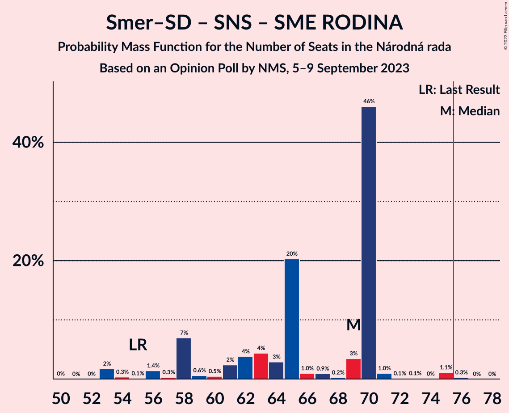

| Number of Seats | Probability | Accumulated | Special Marks |
|:---------------:|:-----------:|:-----------:|:-------------:|
| 50 | 0% | 100% |  |
| 51 | 0% | 99.9% |  |
| 52 | 0% | 99.9% |  |
| 53 | 2% | 99.9% |  |
| 54 | 0.3% | 98% |  |
| 55 | 0.1% | 98% | Last Result |
| 56 | 1.4% | 98% |  |
| 57 | 0.3% | 96% |  |
| 58 | 7% | 96% |  |
| 59 | 0.6% | 89% |  |
| 60 | 0.5% | 88% |  |
| 61 | 2% | 88% |  |
| 62 | 4% | 86% |  |
| 63 | 4% | 82% |  |
| 64 | 3% | 77% |  |
| 65 | 20% | 75% |  |
| 66 | 1.0% | 54% |  |
| 67 | 0.9% | 53% | Median |
| 68 | 0.2% | 52% |  |
| 69 | 3% | 52% |  |
| 70 | 46% | 49% |  |
| 71 | 1.0% | 3% |  |
| 72 | 0.1% | 2% |  |
| 73 | 0.1% | 2% |  |
| 74 | 0% | 1.4% |  |
| 75 | 1.1% | 1.4% |  |
| 76 | 0.3% | 0.3% | Majority |
| 77 | 0% | 0% |  |

### SMER–sociálna demokracia – Slovenská národná strana

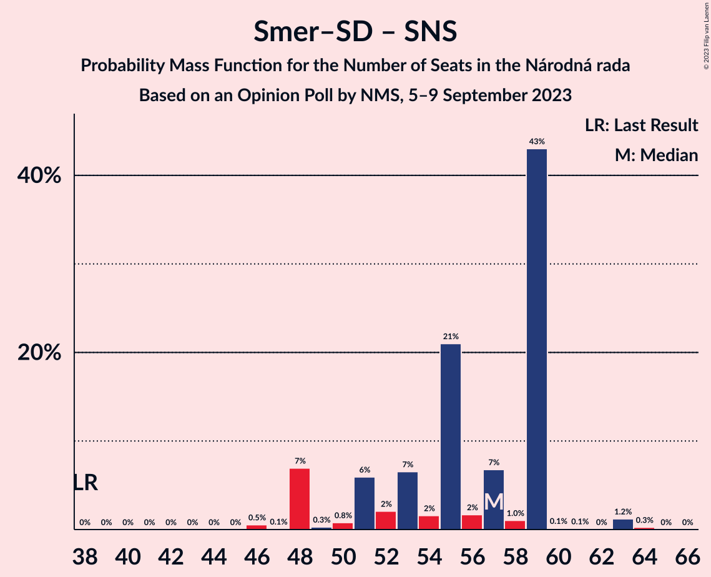

| Number of Seats | Probability | Accumulated | Special Marks |
|:---------------:|:-----------:|:-----------:|:-------------:|
| 38 | 0% | 100% | Last Result |
| 39 | 0% | 100% |  |
| 40 | 0% | 100% |  |
| 41 | 0% | 100% |  |
| 42 | 0% | 100% |  |
| 43 | 0% | 100% |  |
| 44 | 0% | 100% |  |
| 45 | 0% | 100% |  |
| 46 | 0.5% | 100% |  |
| 47 | 0.1% | 99.5% |  |
| 48 | 7% | 99.4% |  |
| 49 | 0.3% | 92% |  |
| 50 | 0.8% | 92% |  |
| 51 | 6% | 91% |  |
| 52 | 2% | 85% |  |
| 53 | 7% | 83% |  |
| 54 | 2% | 77% |  |
| 55 | 21% | 75% |  |
| 56 | 2% | 54% | Median |
| 57 | 7% | 53% |  |
| 58 | 1.0% | 46% |  |
| 59 | 43% | 45% |  |
| 60 | 0.1% | 2% |  |
| 61 | 0.1% | 2% |  |
| 62 | 0% | 2% |  |
| 63 | 1.2% | 1.5% |  |
| 64 | 0.3% | 0.3% |  |
| 65 | 0% | 0% |  |

### SMER–sociálna demokracia – SME RODINA

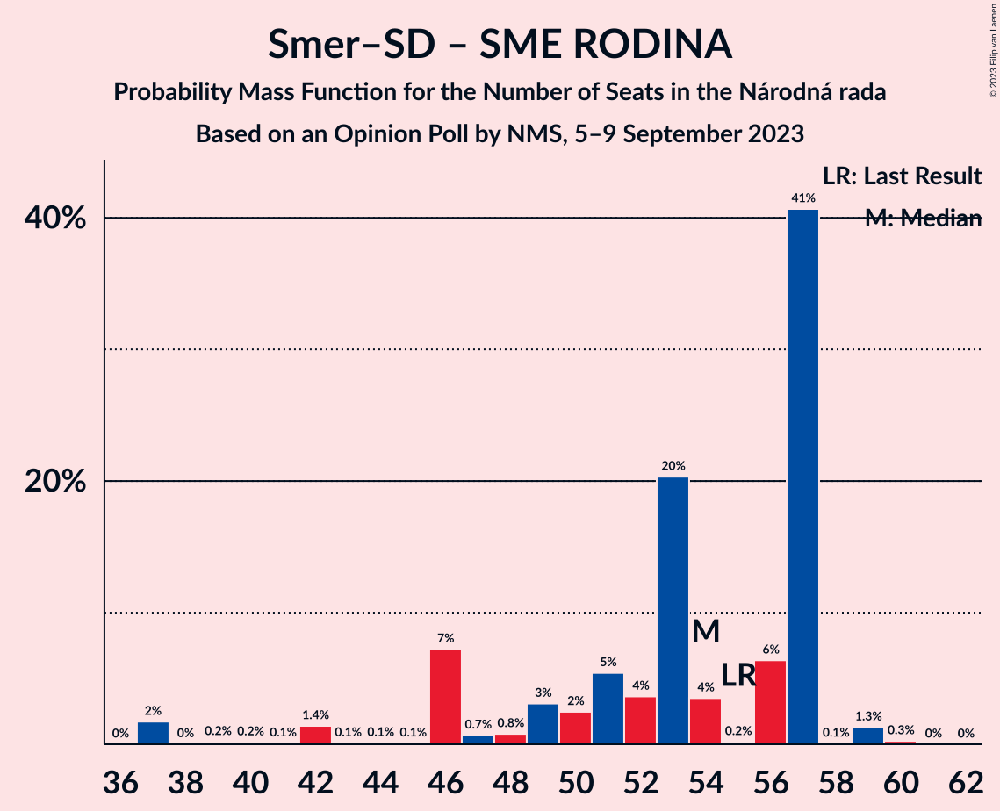

| Number of Seats | Probability | Accumulated | Special Marks |
|:---------------:|:-----------:|:-----------:|:-------------:|
| 37 | 2% | 100% |  |
| 38 | 0% | 98% |  |
| 39 | 0.2% | 98% |  |
| 40 | 0.2% | 98% |  |
| 41 | 0.1% | 98% |  |
| 42 | 1.4% | 98% |  |
| 43 | 0.1% | 96% |  |
| 44 | 0.1% | 96% |  |
| 45 | 0.1% | 96% |  |
| 46 | 7% | 96% |  |
| 47 | 0.7% | 89% |  |
| 48 | 0.8% | 88% |  |
| 49 | 3% | 87% |  |
| 50 | 2% | 84% |  |
| 51 | 5% | 82% |  |
| 52 | 4% | 76% |  |
| 53 | 20% | 73% |  |
| 54 | 4% | 52% | Median |
| 55 | 0.2% | 49% | Last Result |
| 56 | 6% | 49% |  |
| 57 | 41% | 42% |  |
| 58 | 0.1% | 2% |  |
| 59 | 1.3% | 2% |  |
| 60 | 0.3% | 0.3% |  |
| 61 | 0% | 0% |  |

### HLAS–sociálna demokracia – Slovenská národná strana – SME RODINA – Kotleba–Ľudová strana Naše Slovensko

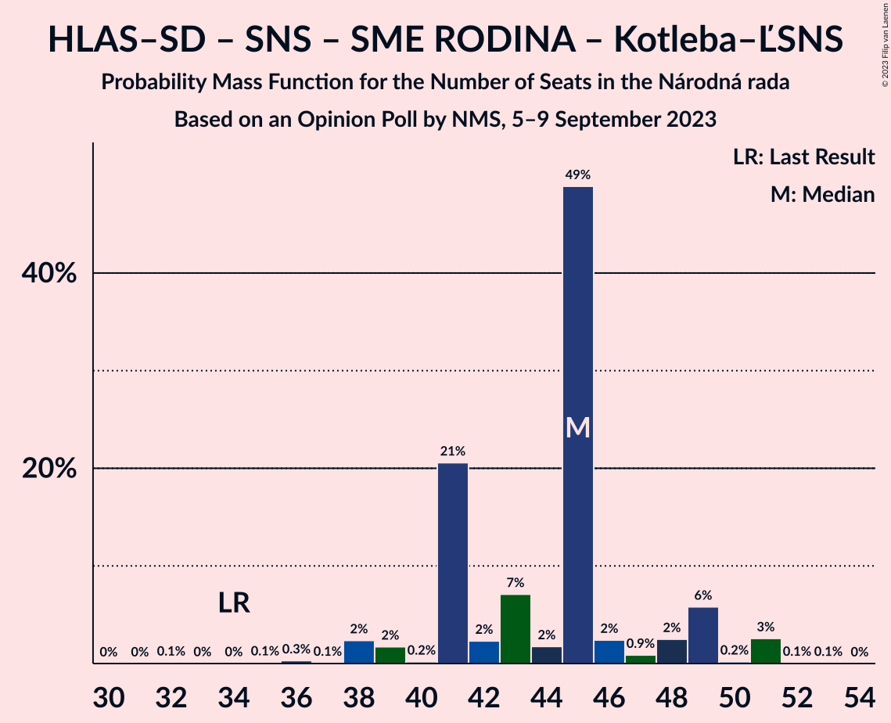

| Number of Seats | Probability | Accumulated | Special Marks |
|:---------------:|:-----------:|:-----------:|:-------------:|
| 32 | 0.1% | 100% |  |
| 33 | 0% | 99.9% |  |
| 34 | 0% | 99.9% | Last Result |
| 35 | 0.1% | 99.9% |  |
| 36 | 0.3% | 99.8% |  |
| 37 | 0.1% | 99.5% |  |
| 38 | 2% | 99.4% |  |
| 39 | 2% | 97% |  |
| 40 | 0.2% | 95% |  |
| 41 | 21% | 95% |  |
| 42 | 2% | 75% |  |
| 43 | 7% | 72% |  |
| 44 | 2% | 65% |  |
| 45 | 49% | 63% | Median |
| 46 | 2% | 14% |  |
| 47 | 0.9% | 12% |  |
| 48 | 2% | 11% |  |
| 49 | 6% | 9% |  |
| 50 | 0.2% | 3% |  |
| 51 | 3% | 3% |  |
| 52 | 0.1% | 0.1% |  |
| 53 | 0.1% | 0.1% |  |
| 54 | 0% | 0% |  |

### HLAS–sociálna demokracia – Slovenská národná strana – SME RODINA

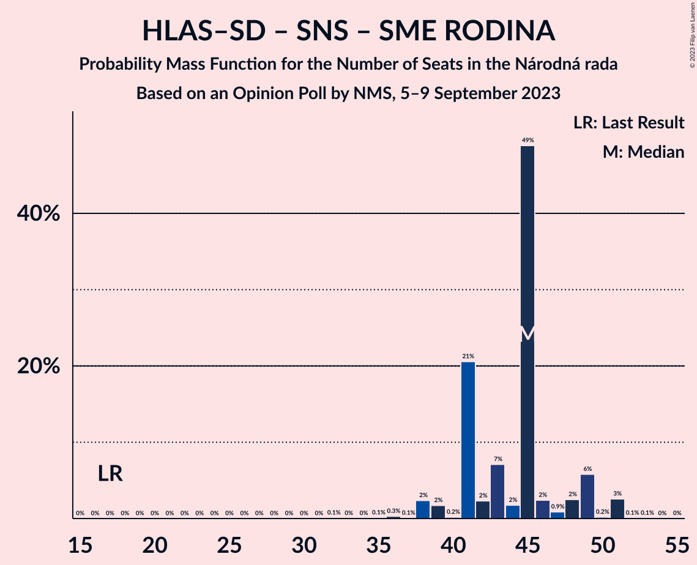

| Number of Seats | Probability | Accumulated | Special Marks |
|:---------------:|:-----------:|:-----------:|:-------------:|
| 17 | 0% | 100% | Last Result |
| 18 | 0% | 100% |  |
| 19 | 0% | 100% |  |
| 20 | 0% | 100% |  |
| 21 | 0% | 100% |  |
| 22 | 0% | 100% |  |
| 23 | 0% | 100% |  |
| 24 | 0% | 100% |  |
| 25 | 0% | 100% |  |
| 26 | 0% | 100% |  |
| 27 | 0% | 100% |  |
| 28 | 0% | 100% |  |
| 29 | 0% | 100% |  |
| 30 | 0% | 100% |  |
| 31 | 0% | 100% |  |
| 32 | 0.1% | 100% |  |
| 33 | 0% | 99.9% |  |
| 34 | 0% | 99.9% |  |
| 35 | 0.1% | 99.9% |  |
| 36 | 0.3% | 99.8% |  |
| 37 | 0.1% | 99.5% |  |
| 38 | 2% | 99.4% |  |
| 39 | 2% | 97% |  |
| 40 | 0.2% | 95% |  |
| 41 | 21% | 95% |  |
| 42 | 2% | 75% |  |
| 43 | 7% | 72% |  |
| 44 | 2% | 65% |  |
| 45 | 49% | 63% | Median |
| 46 | 2% | 14% |  |
| 47 | 0.9% | 12% |  |
| 48 | 2% | 11% |  |
| 49 | 6% | 9% |  |
| 50 | 0.2% | 3% |  |
| 51 | 3% | 3% |  |
| 52 | 0.1% | 0.1% |  |
| 53 | 0.1% | 0.1% |  |
| 54 | 0% | 0% |  |

### SMER–sociálna demokracia

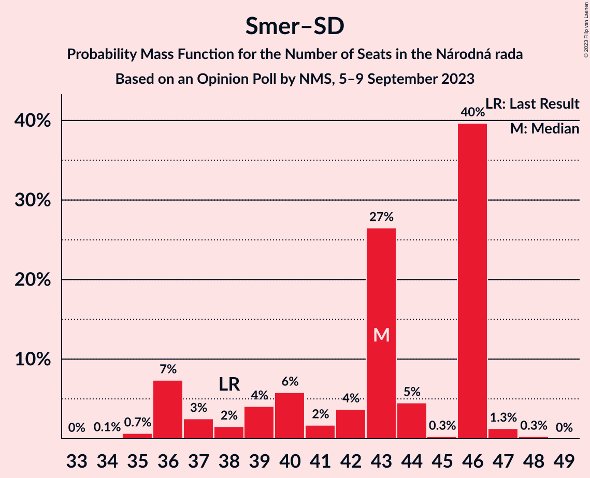

| Number of Seats | Probability | Accumulated | Special Marks |
|:---------------:|:-----------:|:-----------:|:-------------:|
| 34 | 0.1% | 100% |  |
| 35 | 0.7% | 99.9% |  |
| 36 | 7% | 99.2% |  |
| 37 | 3% | 92% |  |
| 38 | 2% | 89% | Last Result |
| 39 | 4% | 88% |  |
| 40 | 6% | 84% |  |
| 41 | 2% | 78% |  |
| 42 | 4% | 76% |  |
| 43 | 27% | 73% | Median |
| 44 | 5% | 46% |  |
| 45 | 0.3% | 42% |  |
| 46 | 40% | 41% |  |
| 47 | 1.3% | 2% |  |
| 48 | 0.3% | 0.3% |  |
| 49 | 0% | 0% |  |

### HLAS–sociálna demokracia – Slovenská národná strana

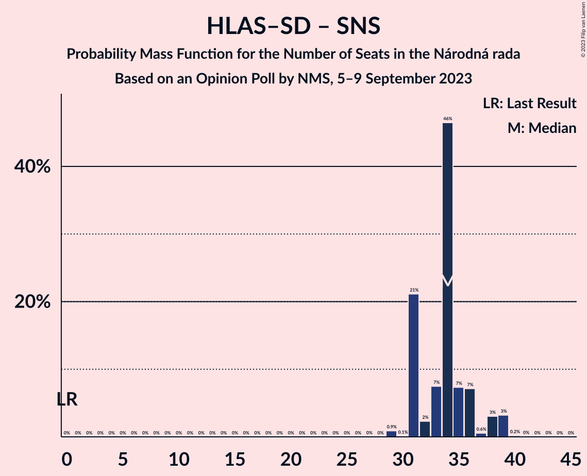

| Number of Seats | Probability | Accumulated | Special Marks |
|:---------------:|:-----------:|:-----------:|:-------------:|
| 0 | 0% | 100% | Last Result |
| 1 | 0% | 100% |  |
| 2 | 0% | 100% |  |
| 3 | 0% | 100% |  |
| 4 | 0% | 100% |  |
| 5 | 0% | 100% |  |
| 6 | 0% | 100% |  |
| 7 | 0% | 100% |  |
| 8 | 0% | 100% |  |
| 9 | 0% | 100% |  |
| 10 | 0% | 100% |  |
| 11 | 0% | 100% |  |
| 12 | 0% | 100% |  |
| 13 | 0% | 100% |  |
| 14 | 0% | 100% |  |
| 15 | 0% | 100% |  |
| 16 | 0% | 100% |  |
| 17 | 0% | 100% |  |
| 18 | 0% | 100% |  |
| 19 | 0% | 100% |  |
| 20 | 0% | 100% |  |
| 21 | 0% | 100% |  |
| 22 | 0% | 100% |  |
| 23 | 0% | 100% |  |
| 24 | 0% | 100% |  |
| 25 | 0% | 100% |  |
| 26 | 0% | 100% |  |
| 27 | 0% | 100% |  |
| 28 | 0% | 100% |  |
| 29 | 0.9% | 100% |  |
| 30 | 0.1% | 99.1% |  |
| 31 | 21% | 99.0% |  |
| 32 | 2% | 78% |  |
| 33 | 7% | 76% |  |
| 34 | 46% | 68% | Median |
| 35 | 7% | 22% |  |
| 36 | 7% | 14% |  |
| 37 | 0.6% | 7% |  |
| 38 | 3% | 7% |  |
| 39 | 3% | 3% |  |
| 40 | 0.2% | 0.3% |  |
| 41 | 0% | 0.1% |  |
| 42 | 0% | 0% |  |

### HLAS–sociálna demokracia – SME RODINA

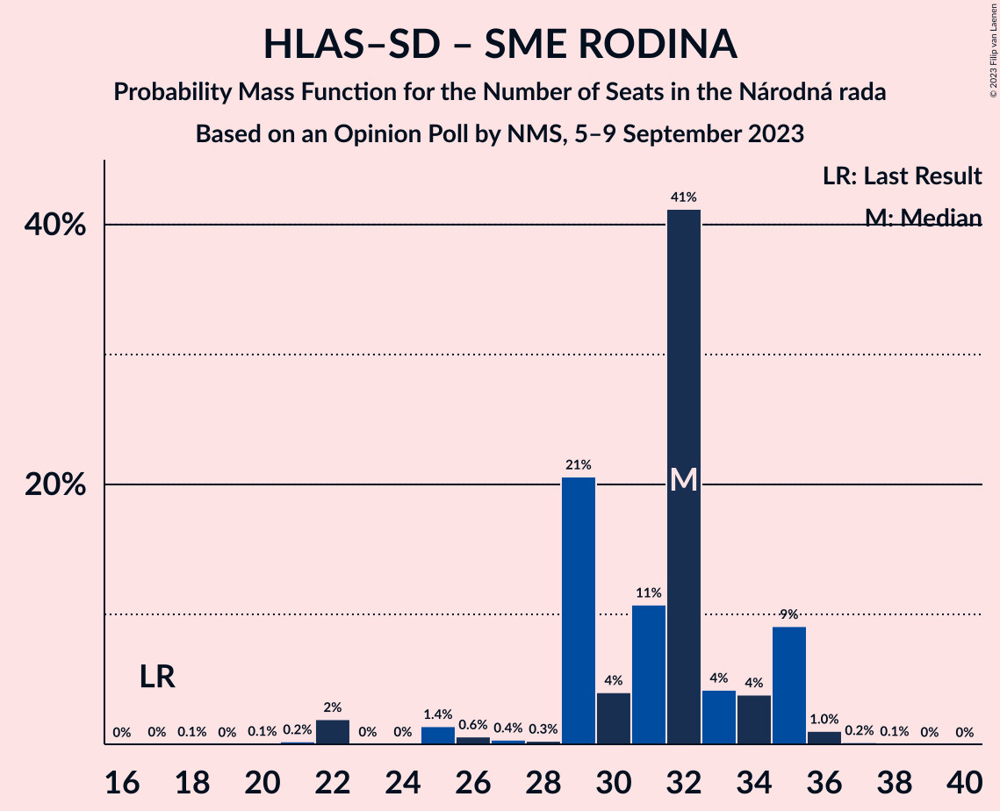

| Number of Seats | Probability | Accumulated | Special Marks |
|:---------------:|:-----------:|:-----------:|:-------------:|
| 17 | 0% | 100% | Last Result |
| 18 | 0.1% | 100% |  |
| 19 | 0% | 99.9% |  |
| 20 | 0.1% | 99.9% |  |
| 21 | 0.2% | 99.8% |  |
| 22 | 2% | 99.6% |  |
| 23 | 0% | 98% |  |
| 24 | 0% | 98% |  |
| 25 | 1.4% | 98% |  |
| 26 | 0.6% | 96% |  |
| 27 | 0.4% | 96% |  |
| 28 | 0.3% | 95% |  |
| 29 | 21% | 95% |  |
| 30 | 4% | 74% |  |
| 31 | 11% | 70% |  |
| 32 | 41% | 60% | Median |
| 33 | 4% | 18% |  |
| 34 | 4% | 14% |  |
| 35 | 9% | 10% |  |
| 36 | 1.0% | 1.3% |  |
| 37 | 0.2% | 0.3% |  |
| 38 | 0.1% | 0.1% |  |
| 39 | 0% | 0% |  |

## Technical Information

### Opinion Poll

+ **Polling firm:** NMS
+ **Commissioner(s):** —
+ **Fieldwork period:** 5–9 September 2023

### Calculations

+ **Sample size:** 1410
+ **Simulations done:** 1,048,576
+ **Error estimate:** 3.75%

