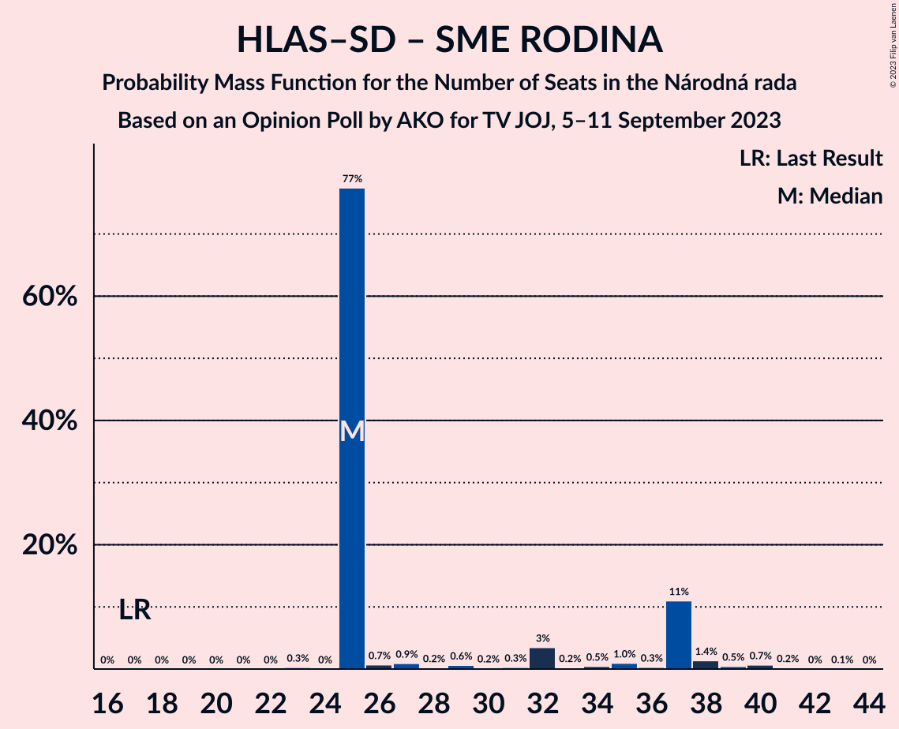

# Opinion Poll by AKO for TV JOJ, 5–11 September 2023

<a href="#voting-intentions">Voting Intentions</a> | <a href="#seats">Seats</a> | <a href="#coalitions">Coalitions</a> | <a href="#technical-information">Technical Information</a>

## Voting Intentions

### Confidence Intervals

| Party | Last Result | Poll Result | 80% Confidence Interval | 90% Confidence Interval | 95% Confidence Interval | 99% Confidence Interval |
|:-----:|:-----------:|:-----------:|:-----------------------:|:-----------------------:|:-----------------------:|:-----------------------:|
| SMER–sociálna demokracia | 18.3% | 19.4% | 17.9–21.1% |17.4–21.6% |17.1–22.0% |16.4–22.8% |
| Progresívne Slovensko | 7.0% | 18.2% | 16.7–19.8% |16.3–20.3% |15.9–20.7% |15.2–21.5% |
| HLAS–sociálna demokracia | 0.0% | 15.1% | 13.7–16.6% |13.3–17.1% |13.0–17.5% |12.4–18.2% |
| Sloboda a Solidarita | 6.2% | 7.4% | 6.4–8.6% |6.2–8.9% |5.9–9.2% |5.5–9.8% |
| OBYČAJNÍ ĽUDIA a nezávislé osobnosti–Kresťanská únia–Za ľudí | 0.0% | 7.0% | 6.1–8.2% |5.8–8.5% |5.6–8.8% |5.2–9.3% |
| Kresťanskodemokratické hnutie | 4.6% | 6.0% | 5.1–7.1% |4.9–7.4% |4.7–7.7% |4.3–8.2% |
| Slovenská národná strana | 3.2% | 6.0% | 5.1–7.1% |4.9–7.4% |4.7–7.7% |4.3–8.2% |
| SME RODINA | 8.2% | 5.3% | 4.5–6.3% |4.3–6.6% |4.1–6.9% |3.7–7.4% |
| REPUBLIKA | 0.0% | 5.2% | 4.4–6.2% |4.2–6.5% |4.0–6.8% |3.6–7.3% |
| SPOLU–Občianska Demokracia | 7.0% | 3.5% | 2.9–4.4% |2.7–4.6% |2.5–4.8% |2.2–5.3% |
| Strana maďarskej koalície–Magyar Koalíció Pártja | 3.9% | 2.9% | 2.3–3.7% |2.2–3.9% |2.0–4.1% |1.8–4.6% |
| MODRÍ–Európske Slovensko–MOST–HÍD | 0.0% | 1.4% | 1.0–2.0% |0.9–2.2% |0.8–2.3% |0.7–2.7% |
| Kotleba–Ľudová strana Naše Slovensko | 8.0% | 0.6% | 0.4–1.1% |0.3–1.2% |0.3–1.3% |0.2–1.6% |
| Magyar Fórum | 0.0% | 0.3% | 0.2–0.7% |0.1–0.8% |0.1–0.9% |0.1–1.1% |

*Note:* The poll result column reflects the actual value used in the calculations. Published results may vary slightly, and in addition be rounded to fewer digits.

## Seats

### Confidence Intervals

| Party | Last Result | Median | 80% Confidence Interval | 90% Confidence Interval | 95% Confidence Interval | 99% Confidence Interval |
|:-----:|:-----------:|:------:|:-----------------------:|:-----------------------:|:-----------------------:|:-----------------------:|
| <a href="#smer–sociálna-demokracia">SMER–sociálna demokracia</a> | 38 | 33 | 32–33 |32–35 |31–38 |29–39 |
| <a href="#progresívne-slovensko">Progresívne Slovensko</a> | 0 | 32 | 31–32 |31–32 |30–34 |26–38 |
| <a href="#hlas–sociálna-demokracia">HLAS–sociálna demokracia</a> | 0 | 25 | 25–27 |25–29 |25–32 |23–32 |
| <a href="#sloboda-a-solidarita">Sloboda a Solidarita</a> | 13 | 15 | 10–15 |10–15 |10–15 |9–18 |
| <a href="#obyčajní-ľudia-a-nezávislé-osobnosti–kresťanská-únia–za-ľudí">OBYČAJNÍ ĽUDIA a nezávislé osobnosti–Kresťanská únia–Za ľudí</a> | 0 | 13 | 10–13 |10–13 |10–14 |9–15 |
| <a href="#kresťanskodemokratické-hnutie">Kresťanskodemokratické hnutie</a> | 0 | 13 | 10–13 |10–13 |10–13 |0–13 |
| <a href="#slovenská-národná-strana">Slovenská národná strana</a> | 0 | 10 | 10–11 |10–11 |9–12 |0–14 |
| <a href="#sme-rodina">SME RODINA</a> | 17 | 0 | 0–10 |0–10 |0–10 |0–12 |
| <a href="#republika">REPUBLIKA</a> | 0 | 9 | 9 |0–9 |0–10 |0–12 |
| <a href="#spolu–občianska-demokracia">SPOLU–Občianska Demokracia</a> | 0 | 0 | 0 |0 |0 |0 |
| <a href="#strana-maďarskej-koalície–magyar-koalíció-pártja">Strana maďarskej koalície–Magyar Koalíció Pártja</a> | 0 | 0 | 0 |0 |0 |0 |
| <a href="#modrí–európske-slovensko–most–híd">MODRÍ–Európske Slovensko–MOST–HÍD</a> | 0 | 0 | 0 |0 |0 |0 |
| <a href="#kotleba–ľudová-strana-naše-slovensko">Kotleba–Ľudová strana Naše Slovensko</a> | 17 | 0 | 0 |0 |0 |0 |
| <a href="#magyar-fórum">Magyar Fórum</a> | 0 | 0 | 0 |0 |0 |0 |

### SMER–sociálna demokracia

*For a full overview of the results for this party, see the [SMER–sociálna demokracia](party-smer–sociálnademokracia.html) page.*

| Number of Seats | Probability | Accumulated | Special Marks |
|:---------------:|:-----------:|:-----------:|:-------------:|
| 27 | 0.2% | 100% |  |
| 28 | 0.2% | 99.8% |  |
| 29 | 1.1% | 99.6% |  |
| 30 | 0.1% | 98.5% |  |
| 31 | 2% | 98% |  |
| 32 | 11% | 97% |  |
| 33 | 78% | 85% | Median |
| 34 | 1.3% | 7% |  |
| 35 | 0.7% | 6% |  |
| 36 | 0.8% | 5% |  |
| 37 | 1.2% | 4% |  |
| 38 | 2% | 3% | Last Result |
| 39 | 0.1% | 0.5% |  |
| 40 | 0.1% | 0.4% |  |
| 41 | 0.1% | 0.4% |  |
| 42 | 0% | 0.3% |  |
| 43 | 0% | 0.2% |  |
| 44 | 0.2% | 0.2% |  |
| 45 | 0% | 0% |  |

### Progresívne Slovensko

*For a full overview of the results for this party, see the [Progresívne Slovensko](party-progresívneslovensko.html) page.*

| Number of Seats | Probability | Accumulated | Special Marks |
|:---------------:|:-----------:|:-----------:|:-------------:|
| 0 | 0% | 100% | Last Result |
| 1 | 0% | 100% |  |
| 2 | 0% | 100% |  |
| 3 | 0% | 100% |  |
| 4 | 0% | 100% |  |
| 5 | 0% | 100% |  |
| 6 | 0% | 100% |  |
| 7 | 0% | 100% |  |
| 8 | 0% | 100% |  |
| 9 | 0% | 100% |  |
| 10 | 0% | 100% |  |
| 11 | 0% | 100% |  |
| 12 | 0% | 100% |  |
| 13 | 0% | 100% |  |
| 14 | 0% | 100% |  |
| 15 | 0% | 100% |  |
| 16 | 0% | 100% |  |
| 17 | 0% | 100% |  |
| 18 | 0% | 100% |  |
| 19 | 0% | 100% |  |
| 20 | 0% | 100% |  |
| 21 | 0% | 100% |  |
| 22 | 0% | 100% |  |
| 23 | 0.3% | 100% |  |
| 24 | 0% | 99.7% |  |
| 25 | 0.1% | 99.7% |  |
| 26 | 0.6% | 99.6% |  |
| 27 | 0.1% | 99.0% |  |
| 28 | 0.7% | 98.9% |  |
| 29 | 0.5% | 98% |  |
| 30 | 1.1% | 98% |  |
| 31 | 11% | 97% |  |
| 32 | 81% | 85% | Median |
| 33 | 0.4% | 4% |  |
| 34 | 3% | 4% |  |
| 35 | 0.9% | 1.5% |  |
| 36 | 0% | 0.6% |  |
| 37 | 0% | 0.5% |  |
| 38 | 0.4% | 0.5% |  |
| 39 | 0% | 0.1% |  |
| 40 | 0% | 0.1% |  |
| 41 | 0% | 0% |  |

### HLAS–sociálna demokracia

*For a full overview of the results for this party, see the [HLAS–sociálna demokracia](party-hlas–sociálnademokracia.html) page.*

| Number of Seats | Probability | Accumulated | Special Marks |
|:---------------:|:-----------:|:-----------:|:-------------:|
| 0 | 0% | 100% | Last Result |
| 1 | 0% | 100% |  |
| 2 | 0% | 100% |  |
| 3 | 0% | 100% |  |
| 4 | 0% | 100% |  |
| 5 | 0% | 100% |  |
| 6 | 0% | 100% |  |
| 7 | 0% | 100% |  |
| 8 | 0% | 100% |  |
| 9 | 0% | 100% |  |
| 10 | 0% | 100% |  |
| 11 | 0% | 100% |  |
| 12 | 0% | 100% |  |
| 13 | 0% | 100% |  |
| 14 | 0% | 100% |  |
| 15 | 0% | 100% |  |
| 16 | 0% | 100% |  |
| 17 | 0% | 100% |  |
| 18 | 0% | 100% |  |
| 19 | 0% | 100% |  |
| 20 | 0.2% | 100% |  |
| 21 | 0.1% | 99.8% |  |
| 22 | 0.1% | 99.6% |  |
| 23 | 0.9% | 99.6% |  |
| 24 | 0.2% | 98.7% |  |
| 25 | 78% | 98% | Median |
| 26 | 2% | 21% |  |
| 27 | 11% | 19% |  |
| 28 | 2% | 7% |  |
| 29 | 1.1% | 5% |  |
| 30 | 0.8% | 4% |  |
| 31 | 0.2% | 3% |  |
| 32 | 3% | 3% |  |
| 33 | 0% | 0.2% |  |
| 34 | 0.2% | 0.2% |  |
| 35 | 0% | 0.1% |  |
| 36 | 0% | 0% |  |

### Sloboda a Solidarita

*For a full overview of the results for this party, see the [Sloboda a Solidarita](party-slobodaasolidarita.html) page.*

| Number of Seats | Probability | Accumulated | Special Marks |
|:---------------:|:-----------:|:-----------:|:-------------:|
| 9 | 1.1% | 100% |  |
| 10 | 10% | 98.9% |  |
| 11 | 1.0% | 89% |  |
| 12 | 3% | 88% |  |
| 13 | 1.5% | 85% | Last Result |
| 14 | 3% | 83% |  |
| 15 | 78% | 80% | Median |
| 16 | 0.6% | 2% |  |
| 17 | 0.2% | 1.4% |  |
| 18 | 1.1% | 1.2% |  |
| 19 | 0% | 0% |  |

### OBYČAJNÍ ĽUDIA a nezávislé osobnosti–Kresťanská únia–Za ľudí

*For a full overview of the results for this party, see the [OBYČAJNÍ ĽUDIA a nezávislé osobnosti–Kresťanská únia–Za ľudí](party-obyčajníľudiaanezávisléosobnosti–kresťanskáúnia–zaľudí.html) page.*

| Number of Seats | Probability | Accumulated | Special Marks |
|:---------------:|:-----------:|:-----------:|:-------------:|
| 0 | 0.1% | 100% | Last Result |
| 1 | 0% | 99.9% |  |
| 2 | 0% | 99.9% |  |
| 3 | 0% | 99.9% |  |
| 4 | 0% | 99.9% |  |
| 5 | 0% | 99.9% |  |
| 6 | 0% | 99.9% |  |
| 7 | 0% | 99.9% |  |
| 8 | 0.3% | 99.9% |  |
| 9 | 0.2% | 99.7% |  |
| 10 | 11% | 99.5% |  |
| 11 | 2% | 89% |  |
| 12 | 3% | 87% |  |
| 13 | 79% | 84% | Median |
| 14 | 3% | 4% |  |
| 15 | 2% | 2% |  |
| 16 | 0.2% | 0.3% |  |
| 17 | 0% | 0.1% |  |
| 18 | 0% | 0.1% |  |
| 19 | 0% | 0% |  |

### Kresťanskodemokratické hnutie

*For a full overview of the results for this party, see the [Kresťanskodemokratické hnutie](party-kresťanskodemokratickéhnutie.html) page.*

| Number of Seats | Probability | Accumulated | Special Marks |
|:---------------:|:-----------:|:-----------:|:-------------:|
| 0 | 0.5% | 100% | Last Result |
| 1 | 0% | 99.5% |  |
| 2 | 0% | 99.5% |  |
| 3 | 0% | 99.5% |  |
| 4 | 0% | 99.5% |  |
| 5 | 0% | 99.5% |  |
| 6 | 0% | 99.5% |  |
| 7 | 0% | 99.5% |  |
| 8 | 0% | 99.5% |  |
| 9 | 1.1% | 99.5% |  |
| 10 | 11% | 98% |  |
| 11 | 4% | 87% |  |
| 12 | 5% | 83% |  |
| 13 | 78% | 78% | Median |
| 14 | 0.1% | 0.3% |  |
| 15 | 0% | 0.2% |  |
| 16 | 0.2% | 0.2% |  |
| 17 | 0% | 0% |  |

### Slovenská národná strana

*For a full overview of the results for this party, see the [Slovenská národná strana](party-slovenskánárodnástrana.html) page.*

| Number of Seats | Probability | Accumulated | Special Marks |
|:---------------:|:-----------:|:-----------:|:-------------:|
| 0 | 2% | 100% | Last Result |
| 1 | 0% | 98% |  |
| 2 | 0% | 98% |  |
| 3 | 0% | 98% |  |
| 4 | 0% | 98% |  |
| 5 | 0% | 98% |  |
| 6 | 0% | 98% |  |
| 7 | 0% | 98% |  |
| 8 | 0% | 98% |  |
| 9 | 2% | 98% |  |
| 10 | 81% | 96% | Median |
| 11 | 11% | 15% |  |
| 12 | 2% | 4% |  |
| 13 | 0.8% | 2% |  |
| 14 | 0.5% | 0.7% |  |
| 15 | 0.2% | 0.2% |  |
| 16 | 0% | 0% |  |

### SME RODINA

*For a full overview of the results for this party, see the [SME RODINA](party-smerodina.html) page.*

| Number of Seats | Probability | Accumulated | Special Marks |
|:---------------:|:-----------:|:-----------:|:-------------:|
| 0 | 84% | 100% | Median |
| 1 | 0% | 16% |  |
| 2 | 0% | 16% |  |
| 3 | 0% | 16% |  |
| 4 | 0% | 16% |  |
| 5 | 0% | 16% |  |
| 6 | 0% | 16% |  |
| 7 | 0% | 16% |  |
| 8 | 0% | 16% |  |
| 9 | 2% | 16% |  |
| 10 | 13% | 14% |  |
| 11 | 1.0% | 2% |  |
| 12 | 0.4% | 0.5% |  |
| 13 | 0.1% | 0.1% |  |
| 14 | 0% | 0% |  |
| 15 | 0% | 0% |  |
| 16 | 0% | 0% |  |
| 17 | 0% | 0% | Last Result |

### REPUBLIKA

*For a full overview of the results for this party, see the [REPUBLIKA](party-republika.html) page.*

| Number of Seats | Probability | Accumulated | Special Marks |
|:---------------:|:-----------:|:-----------:|:-------------:|
| 0 | 7% | 100% | Last Result |
| 1 | 0% | 93% |  |
| 2 | 0% | 93% |  |
| 3 | 0% | 93% |  |
| 4 | 0% | 93% |  |
| 5 | 0% | 93% |  |
| 6 | 0% | 93% |  |
| 7 | 0% | 93% |  |
| 8 | 0% | 93% |  |
| 9 | 89% | 93% | Median |
| 10 | 3% | 5% |  |
| 11 | 1.4% | 2% |  |
| 12 | 0.5% | 0.6% |  |
| 13 | 0% | 0% |  |

### SPOLU–Občianska Demokracia

*For a full overview of the results for this party, see the [SPOLU–Občianska Demokracia](party-spolu–občianskademokracia.html) page.*

| Number of Seats | Probability | Accumulated | Special Marks |
|:---------------:|:-----------:|:-----------:|:-------------:|
| 0 | 99.8% | 100% | Last Result, Median |
| 1 | 0% | 0.2% |  |
| 2 | 0% | 0.2% |  |
| 3 | 0% | 0.2% |  |
| 4 | 0% | 0.2% |  |
| 5 | 0% | 0.2% |  |
| 6 | 0% | 0.2% |  |
| 7 | 0% | 0.2% |  |
| 8 | 0% | 0.2% |  |
| 9 | 0.2% | 0.2% |  |
| 10 | 0% | 0% |  |

### Strana maďarskej koalície–Magyar Koalíció Pártja

*For a full overview of the results for this party, see the [Strana maďarskej koalície–Magyar Koalíció Pártja](party-stranamaďarskejkoalície–magyarkoalíciópártja.html) page.*

| Number of Seats | Probability | Accumulated | Special Marks |
|:---------------:|:-----------:|:-----------:|:-------------:|
| 0 | 100% | 100% | Last Result, Median |

### MODRÍ–Európske Slovensko–MOST–HÍD

*For a full overview of the results for this party, see the [MODRÍ–Európske Slovensko–MOST–HÍD](party-modrí–európskeslovensko–most–híd.html) page.*

| Number of Seats | Probability | Accumulated | Special Marks |
|:---------------:|:-----------:|:-----------:|:-------------:|
| 0 | 100% | 100% | Last Result, Median |

### Kotleba–Ľudová strana Naše Slovensko

*For a full overview of the results for this party, see the [Kotleba–Ľudová strana Naše Slovensko](party-kotleba–ľudovástrananašeslovensko.html) page.*

| Number of Seats | Probability | Accumulated | Special Marks |
|:---------------:|:-----------:|:-----------:|:-------------:|
| 0 | 100% | 100% | Median |
| 1 | 0% | 0% |  |
| 2 | 0% | 0% |  |
| 3 | 0% | 0% |  |
| 4 | 0% | 0% |  |
| 5 | 0% | 0% |  |
| 6 | 0% | 0% |  |
| 7 | 0% | 0% |  |
| 8 | 0% | 0% |  |
| 9 | 0% | 0% |  |
| 10 | 0% | 0% |  |
| 11 | 0% | 0% |  |
| 12 | 0% | 0% |  |
| 13 | 0% | 0% |  |
| 14 | 0% | 0% |  |
| 15 | 0% | 0% |  |
| 16 | 0% | 0% |  |
| 17 | 0% | 0% | Last Result |

### Magyar Fórum

*For a full overview of the results for this party, see the [Magyar Fórum](party-magyarfórum.html) page.*

| Number of Seats | Probability | Accumulated | Special Marks |
|:---------------:|:-----------:|:-----------:|:-------------:|
| 0 | 100% | 100% | Last Result, Median |

## Coalitions

### Confidence Intervals

| Coalition | Last Result | Median | Majority? | 80% Confidence Interval | 90% Confidence Interval | 95% Confidence Interval | 99% Confidence Interval |
|:---------:|:-----------:|:------:|:---------:|:-----------------------:|:-----------------------:|:-----------------------:|:-----------------------:|
| SMER–sociálna demokracia – HLAS–sociálna demokracia – Slovenská národná strana – SME RODINA – Kotleba–Ľudová strana Naše Slovensko | 72 | 68 | 18% | 68–80 | 68–80 | 68–82 | 64–84 |
| SMER–sociálna demokracia – HLAS–sociálna demokracia – Slovenská národná strana – SME RODINA | 55 | 68 | 18% | 68–80 | 68–80 | 68–82 | 64–84 |
| SMER–sociálna demokracia – HLAS–sociálna demokracia – Slovenská národná strana | 38 | 68 | 3% | 68–70 | 68–73 | 66–76 | 63–80 |
| SMER–sociálna demokracia – HLAS–sociálna demokracia – SME RODINA | 55 | 58 | 0.4% | 58–69 | 58–70 | 58–71 | 58–75 |
| SMER–sociálna demokracia – Slovenská národná strana – SME RODINA – Kotleba–Ľudová strana Naše Slovensko | 72 | 43 | 0% | 43–53 | 43–53 | 43–55 | 32–57 |
| SMER–sociálna demokracia – Slovenská národná strana – SME RODINA | 55 | 43 | 0% | 43–53 | 43–53 | 43–55 | 32–57 |
| HLAS–sociálna demokracia – Slovenská národná strana – SME RODINA – Kotleba–Ľudová strana Naše Slovensko | 34 | 35 | 0% | 35–48 | 35–48 | 35–49 | 32–51 |
| HLAS–sociálna demokracia – Slovenská národná strana – SME RODINA | 17 | 35 | 0% | 35–48 | 35–48 | 35–49 | 32–51 |
| SMER–sociálna demokracia – Slovenská národná strana | 38 | 43 | 0% | 43 | 41–46 | 40–48 | 32–50 |
| SMER–sociálna demokracia – SME RODINA | 55 | 33 | 0% | 33–42 | 33–42 | 33–44 | 31–47 |
| HLAS–sociálna demokracia – Slovenská národná strana | 0 | 35 | 0% | 35–38 | 35–39 | 33–41 | 29–42 |
| SMER–sociálna demokracia | 38 | 33 | 0% | 32–33 | 32–35 | 31–38 | 29–39 |
| HLAS–sociálna demokracia – SME RODINA | 17 | 25 | 0% | 25–37 | 25–37 | 25–38 | 25–40 |

### SMER–sociálna demokracia – HLAS–sociálna demokracia – Slovenská národná strana – SME RODINA – Kotleba–Ľudová strana Naše Slovensko

| Number of Seats | Probability | Accumulated | Special Marks |
|:---------------:|:-----------:|:-----------:|:-------------:|
| 64 | 1.2% | 100% |  |
| 65 | 0.1% | 98.8% |  |
| 66 | 0% | 98.8% |  |
| 67 | 0.3% | 98.7% |  |
| 68 | 77% | 98% | Median |
| 69 | 0.2% | 21% |  |
| 70 | 0.1% | 21% |  |
| 71 | 0.1% | 21% |  |
| 72 | 0.4% | 21% | Last Result |
| 73 | 1.0% | 20% |  |
| 74 | 0.6% | 19% |  |
| 75 | 0.8% | 19% |  |
| 76 | 0.7% | 18% | Majority |
| 77 | 0.6% | 17% |  |
| 78 | 1.4% | 17% |  |
| 79 | 0.4% | 15% |  |
| 80 | 12% | 15% |  |
| 81 | 0.2% | 3% |  |
| 82 | 0.7% | 3% |  |
| 83 | 1.2% | 2% |  |
| 84 | 0.4% | 0.8% |  |
| 85 | 0.2% | 0.4% |  |
| 86 | 0% | 0.2% |  |
| 87 | 0% | 0.2% |  |
| 88 | 0.1% | 0.2% |  |
| 89 | 0% | 0.1% |  |
| 90 | 0% | 0.1% |  |
| 91 | 0.1% | 0.1% |  |
| 92 | 0% | 0% |  |

### SMER–sociálna demokracia – HLAS–sociálna demokracia – Slovenská národná strana – SME RODINA

| Number of Seats | Probability | Accumulated | Special Marks |
|:---------------:|:-----------:|:-----------:|:-------------:|
| 55 | 0% | 100% | Last Result |
| 56 | 0% | 100% |  |
| 57 | 0% | 100% |  |
| 58 | 0% | 100% |  |
| 59 | 0% | 100% |  |
| 60 | 0% | 100% |  |
| 61 | 0% | 100% |  |
| 62 | 0% | 100% |  |
| 63 | 0% | 100% |  |
| 64 | 1.2% | 100% |  |
| 65 | 0.1% | 98.8% |  |
| 66 | 0% | 98.8% |  |
| 67 | 0.3% | 98.7% |  |
| 68 | 77% | 98% | Median |
| 69 | 0.2% | 21% |  |
| 70 | 0.1% | 21% |  |
| 71 | 0.1% | 21% |  |
| 72 | 0.4% | 21% |  |
| 73 | 1.0% | 20% |  |
| 74 | 0.6% | 19% |  |
| 75 | 0.8% | 19% |  |
| 76 | 0.7% | 18% | Majority |
| 77 | 0.6% | 17% |  |
| 78 | 1.4% | 17% |  |
| 79 | 0.4% | 15% |  |
| 80 | 12% | 15% |  |
| 81 | 0.2% | 3% |  |
| 82 | 0.7% | 3% |  |
| 83 | 1.2% | 2% |  |
| 84 | 0.4% | 0.8% |  |
| 85 | 0.2% | 0.4% |  |
| 86 | 0% | 0.2% |  |
| 87 | 0% | 0.2% |  |
| 88 | 0.1% | 0.2% |  |
| 89 | 0% | 0.1% |  |
| 90 | 0% | 0.1% |  |
| 91 | 0.1% | 0.1% |  |
| 92 | 0% | 0% |  |

### SMER–sociálna demokracia – HLAS–sociálna demokracia – Slovenská národná strana

| Number of Seats | Probability | Accumulated | Special Marks |
|:---------------:|:-----------:|:-----------:|:-------------:|
| 38 | 0% | 100% | Last Result |
| 39 | 0% | 100% |  |
| 40 | 0% | 100% |  |
| 41 | 0% | 100% |  |
| 42 | 0% | 100% |  |
| 43 | 0% | 100% |  |
| 44 | 0% | 100% |  |
| 45 | 0% | 100% |  |
| 46 | 0% | 100% |  |
| 47 | 0% | 100% |  |
| 48 | 0% | 100% |  |
| 49 | 0% | 100% |  |
| 50 | 0% | 100% |  |
| 51 | 0% | 100% |  |
| 52 | 0% | 100% |  |
| 53 | 0% | 100% |  |
| 54 | 0% | 100% |  |
| 55 | 0% | 100% |  |
| 56 | 0% | 100% |  |
| 57 | 0% | 100% |  |
| 58 | 0% | 100% |  |
| 59 | 0.1% | 100% |  |
| 60 | 0% | 99.8% |  |
| 61 | 0.1% | 99.8% |  |
| 62 | 0.2% | 99.7% |  |
| 63 | 0.2% | 99.6% |  |
| 64 | 2% | 99.4% |  |
| 65 | 0.2% | 98% |  |
| 66 | 0.3% | 98% |  |
| 67 | 1.0% | 97% |  |
| 68 | 79% | 96% | Median |
| 69 | 0.1% | 18% |  |
| 70 | 10% | 18% |  |
| 71 | 0.1% | 7% |  |
| 72 | 0.8% | 7% |  |
| 73 | 2% | 6% |  |
| 74 | 0.5% | 4% |  |
| 75 | 0.8% | 4% |  |
| 76 | 0.4% | 3% | Majority |
| 77 | 0.1% | 2% |  |
| 78 | 0.2% | 2% |  |
| 79 | 0.1% | 2% |  |
| 80 | 2% | 2% |  |
| 81 | 0% | 0.2% |  |
| 82 | 0.1% | 0.1% |  |
| 83 | 0% | 0.1% |  |
| 84 | 0% | 0.1% |  |
| 85 | 0% | 0.1% |  |
| 86 | 0% | 0% |  |

### SMER–sociálna demokracia – HLAS–sociálna demokracia – SME RODINA

| Number of Seats | Probability | Accumulated | Special Marks |
|:---------------:|:-----------:|:-----------:|:-------------:|
| 55 | 0% | 100% | Last Result |
| 56 | 0% | 100% |  |
| 57 | 0.3% | 99.9% |  |
| 58 | 78% | 99.6% | Median |
| 59 | 0.1% | 22% |  |
| 60 | 0.7% | 22% |  |
| 61 | 0.1% | 21% |  |
| 62 | 0.2% | 21% |  |
| 63 | 0.2% | 21% |  |
| 64 | 2% | 21% |  |
| 65 | 0.7% | 19% |  |
| 66 | 1.4% | 18% |  |
| 67 | 1.3% | 17% |  |
| 68 | 0.4% | 16% |  |
| 69 | 10% | 15% |  |
| 70 | 2% | 5% |  |
| 71 | 1.3% | 3% |  |
| 72 | 0.4% | 2% |  |
| 73 | 0.7% | 1.4% |  |
| 74 | 0.1% | 0.6% |  |
| 75 | 0.1% | 0.5% |  |
| 76 | 0.1% | 0.4% | Majority |
| 77 | 0% | 0.3% |  |
| 78 | 0% | 0.3% |  |
| 79 | 0% | 0.2% |  |
| 80 | 0% | 0.2% |  |
| 81 | 0% | 0.2% |  |
| 82 | 0% | 0.2% |  |
| 83 | 0.2% | 0.2% |  |
| 84 | 0% | 0% |  |

### SMER–sociálna demokracia – Slovenská národná strana – SME RODINA – Kotleba–Ľudová strana Naše Slovensko

| Number of Seats | Probability | Accumulated | Special Marks |
|:---------------:|:-----------:|:-----------:|:-------------:|
| 32 | 1.1% | 100% |  |
| 33 | 0% | 98.9% |  |
| 34 | 0% | 98.9% |  |
| 35 | 0% | 98.9% |  |
| 36 | 0.1% | 98.8% |  |
| 37 | 0% | 98.7% |  |
| 38 | 0% | 98.7% |  |
| 39 | 0% | 98.7% |  |
| 40 | 0.1% | 98.7% |  |
| 41 | 0.3% | 98.6% |  |
| 42 | 0.2% | 98% |  |
| 43 | 77% | 98% | Median |
| 44 | 0.1% | 21% |  |
| 45 | 0.1% | 21% |  |
| 46 | 1.3% | 20% |  |
| 47 | 0.3% | 19% |  |
| 48 | 2% | 19% |  |
| 49 | 0.5% | 17% |  |
| 50 | 3% | 16% |  |
| 51 | 0.5% | 14% |  |
| 52 | 0.2% | 13% |  |
| 53 | 9% | 13% |  |
| 54 | 0.2% | 3% |  |
| 55 | 0.9% | 3% |  |
| 56 | 2% | 2% |  |
| 57 | 0.2% | 0.7% |  |
| 58 | 0.1% | 0.4% |  |
| 59 | 0.1% | 0.3% |  |
| 60 | 0.1% | 0.2% |  |
| 61 | 0% | 0.1% |  |
| 62 | 0% | 0.1% |  |
| 63 | 0% | 0.1% |  |
| 64 | 0% | 0.1% |  |
| 65 | 0% | 0.1% |  |
| 66 | 0% | 0% |  |
| 67 | 0% | 0% |  |
| 68 | 0% | 0% |  |
| 69 | 0% | 0% |  |
| 70 | 0% | 0% |  |
| 71 | 0% | 0% |  |
| 72 | 0% | 0% | Last Result |

### SMER–sociálna demokracia – Slovenská národná strana – SME RODINA

| Number of Seats | Probability | Accumulated | Special Marks |
|:---------------:|:-----------:|:-----------:|:-------------:|
| 32 | 1.1% | 100% |  |
| 33 | 0% | 98.9% |  |
| 34 | 0% | 98.9% |  |
| 35 | 0% | 98.9% |  |
| 36 | 0.1% | 98.8% |  |
| 37 | 0% | 98.7% |  |
| 38 | 0% | 98.7% |  |
| 39 | 0% | 98.7% |  |
| 40 | 0.1% | 98.7% |  |
| 41 | 0.3% | 98.6% |  |
| 42 | 0.2% | 98% |  |
| 43 | 77% | 98% | Median |
| 44 | 0.1% | 21% |  |
| 45 | 0.1% | 21% |  |
| 46 | 1.3% | 20% |  |
| 47 | 0.3% | 19% |  |
| 48 | 2% | 19% |  |
| 49 | 0.5% | 17% |  |
| 50 | 3% | 16% |  |
| 51 | 0.5% | 14% |  |
| 52 | 0.2% | 13% |  |
| 53 | 9% | 13% |  |
| 54 | 0.2% | 3% |  |
| 55 | 0.9% | 3% | Last Result |
| 56 | 2% | 2% |  |
| 57 | 0.2% | 0.7% |  |
| 58 | 0.1% | 0.4% |  |
| 59 | 0.1% | 0.3% |  |
| 60 | 0.1% | 0.2% |  |
| 61 | 0% | 0.1% |  |
| 62 | 0% | 0.1% |  |
| 63 | 0% | 0.1% |  |
| 64 | 0% | 0.1% |  |
| 65 | 0% | 0.1% |  |
| 66 | 0% | 0% |  |

### HLAS–sociálna demokracia – Slovenská národná strana – SME RODINA – Kotleba–Ľudová strana Naše Slovensko

| Number of Seats | Probability | Accumulated | Special Marks |
|:---------------:|:-----------:|:-----------:|:-------------:|
| 29 | 0.1% | 100% |  |
| 30 | 0% | 99.9% |  |
| 31 | 0% | 99.9% |  |
| 32 | 1.1% | 99.8% |  |
| 33 | 0.1% | 98.7% |  |
| 34 | 0% | 98.6% | Last Result |
| 35 | 77% | 98.6% | Median |
| 36 | 0.5% | 21% |  |
| 37 | 0.6% | 21% |  |
| 38 | 0.9% | 20% |  |
| 39 | 0.3% | 19% |  |
| 40 | 1.0% | 19% |  |
| 41 | 0.4% | 18% |  |
| 42 | 2% | 18% |  |
| 43 | 0.3% | 15% |  |
| 44 | 0.1% | 15% |  |
| 45 | 0.7% | 15% |  |
| 46 | 0.4% | 14% |  |
| 47 | 0.8% | 14% |  |
| 48 | 10% | 13% |  |
| 49 | 2% | 3% |  |
| 50 | 0.4% | 1.0% |  |
| 51 | 0.4% | 0.6% |  |
| 52 | 0% | 0.2% |  |
| 53 | 0.1% | 0.2% |  |
| 54 | 0% | 0.1% |  |
| 55 | 0.1% | 0.1% |  |
| 56 | 0% | 0% |  |

### HLAS–sociálna demokracia – Slovenská národná strana – SME RODINA

| Number of Seats | Probability | Accumulated | Special Marks |
|:---------------:|:-----------:|:-----------:|:-------------:|
| 17 | 0% | 100% | Last Result |
| 18 | 0% | 100% |  |
| 19 | 0% | 100% |  |
| 20 | 0% | 100% |  |
| 21 | 0% | 100% |  |
| 22 | 0% | 100% |  |
| 23 | 0% | 100% |  |
| 24 | 0% | 100% |  |
| 25 | 0% | 100% |  |
| 26 | 0% | 100% |  |
| 27 | 0% | 100% |  |
| 28 | 0% | 100% |  |
| 29 | 0.1% | 100% |  |
| 30 | 0% | 99.9% |  |
| 31 | 0% | 99.9% |  |
| 32 | 1.1% | 99.8% |  |
| 33 | 0.1% | 98.7% |  |
| 34 | 0% | 98.6% |  |
| 35 | 77% | 98.6% | Median |
| 36 | 0.5% | 21% |  |
| 37 | 0.6% | 21% |  |
| 38 | 0.9% | 20% |  |
| 39 | 0.3% | 19% |  |
| 40 | 1.0% | 19% |  |
| 41 | 0.4% | 18% |  |
| 42 | 2% | 18% |  |
| 43 | 0.3% | 15% |  |
| 44 | 0.1% | 15% |  |
| 45 | 0.7% | 15% |  |
| 46 | 0.4% | 14% |  |
| 47 | 0.8% | 14% |  |
| 48 | 10% | 13% |  |
| 49 | 2% | 3% |  |
| 50 | 0.4% | 1.0% |  |
| 51 | 0.4% | 0.6% |  |
| 52 | 0% | 0.2% |  |
| 53 | 0.1% | 0.2% |  |
| 54 | 0% | 0.1% |  |
| 55 | 0.1% | 0.1% |  |
| 56 | 0% | 0% |  |

### SMER–sociálna demokracia – Slovenská národná strana

| Number of Seats | Probability | Accumulated | Special Marks |
|:---------------:|:-----------:|:-----------:|:-------------:|
| 31 | 0.1% | 100% |  |
| 32 | 1.3% | 99.9% |  |
| 33 | 0% | 98.7% |  |
| 34 | 0% | 98.7% |  |
| 35 | 0% | 98.6% |  |
| 36 | 0.2% | 98.6% |  |
| 37 | 0.1% | 98% |  |
| 38 | 0.2% | 98% | Last Result |
| 39 | 0.3% | 98% |  |
| 40 | 2% | 98% |  |
| 41 | 0.9% | 96% |  |
| 42 | 0.3% | 95% |  |
| 43 | 87% | 95% | Median |
| 44 | 0.7% | 8% |  |
| 45 | 0.1% | 7% |  |
| 46 | 3% | 7% |  |
| 47 | 0.8% | 4% |  |
| 48 | 2% | 3% |  |
| 49 | 0.3% | 1.1% |  |
| 50 | 0.5% | 0.8% |  |
| 51 | 0.1% | 0.3% |  |
| 52 | 0% | 0.2% |  |
| 53 | 0% | 0.1% |  |
| 54 | 0% | 0.1% |  |
| 55 | 0% | 0.1% |  |
| 56 | 0% | 0.1% |  |
| 57 | 0% | 0% |  |

### SMER–sociálna demokracia – SME RODINA

| Number of Seats | Probability | Accumulated | Special Marks |
|:---------------:|:-----------:|:-----------:|:-------------:|
| 31 | 0.5% | 100% |  |
| 32 | 1.2% | 99.5% |  |
| 33 | 78% | 98% | Median |
| 34 | 0% | 20% |  |
| 35 | 0.4% | 20% |  |
| 36 | 0.2% | 20% |  |
| 37 | 0.9% | 20% |  |
| 38 | 2% | 19% |  |
| 39 | 1.1% | 16% |  |
| 40 | 0.4% | 15% |  |
| 41 | 0.9% | 15% |  |
| 42 | 10% | 14% |  |
| 43 | 0.5% | 4% |  |
| 44 | 1.2% | 3% |  |
| 45 | 0.3% | 2% |  |
| 46 | 0.9% | 2% |  |
| 47 | 0.3% | 0.8% |  |
| 48 | 0.1% | 0.5% |  |
| 49 | 0% | 0.4% |  |
| 50 | 0.1% | 0.4% |  |
| 51 | 0% | 0.3% |  |
| 52 | 0% | 0.2% |  |
| 53 | 0% | 0.2% |  |
| 54 | 0.2% | 0.2% |  |
| 55 | 0% | 0% | Last Result |

### HLAS–sociálna demokracia – Slovenská národná strana

| Number of Seats | Probability | Accumulated | Special Marks |
|:---------------:|:-----------:|:-----------:|:-------------:|
| 0 | 0% | 100% | Last Result |
| 1 | 0% | 100% |  |
| 2 | 0% | 100% |  |
| 3 | 0% | 100% |  |
| 4 | 0% | 100% |  |
| 5 | 0% | 100% |  |
| 6 | 0% | 100% |  |
| 7 | 0% | 100% |  |
| 8 | 0% | 100% |  |
| 9 | 0% | 100% |  |
| 10 | 0% | 100% |  |
| 11 | 0% | 100% |  |
| 12 | 0% | 100% |  |
| 13 | 0% | 100% |  |
| 14 | 0% | 100% |  |
| 15 | 0% | 100% |  |
| 16 | 0% | 100% |  |
| 17 | 0% | 100% |  |
| 18 | 0% | 100% |  |
| 19 | 0% | 100% |  |
| 20 | 0% | 100% |  |
| 21 | 0% | 100% |  |
| 22 | 0% | 100% |  |
| 23 | 0.1% | 100% |  |
| 24 | 0% | 99.9% |  |
| 25 | 0% | 99.9% |  |
| 26 | 0.1% | 99.9% |  |
| 27 | 0.2% | 99.8% |  |
| 28 | 0% | 99.6% |  |
| 29 | 0.3% | 99.6% |  |
| 30 | 0.3% | 99.3% |  |
| 31 | 0.1% | 99.0% |  |
| 32 | 1.2% | 98.8% |  |
| 33 | 0.5% | 98% |  |
| 34 | 0.1% | 97% |  |
| 35 | 78% | 97% | Median |
| 36 | 1.2% | 19% |  |
| 37 | 0.9% | 18% |  |
| 38 | 11% | 17% |  |
| 39 | 2% | 6% |  |
| 40 | 2% | 4% |  |
| 41 | 0.4% | 3% |  |
| 42 | 2% | 2% |  |
| 43 | 0.2% | 0.3% |  |
| 44 | 0% | 0.1% |  |
| 45 | 0% | 0.1% |  |
| 46 | 0% | 0.1% |  |
| 47 | 0.1% | 0.1% |  |
| 48 | 0% | 0% |  |

### SMER–sociálna demokracia

| Number of Seats | Probability | Accumulated | Special Marks |
|:---------------:|:-----------:|:-----------:|:-------------:|
| 27 | 0.2% | 100% |  |
| 28 | 0.2% | 99.8% |  |
| 29 | 1.1% | 99.6% |  |
| 30 | 0.1% | 98.5% |  |
| 31 | 2% | 98% |  |
| 32 | 11% | 97% |  |
| 33 | 78% | 85% | Median |
| 34 | 1.3% | 7% |  |
| 35 | 0.7% | 6% |  |
| 36 | 0.8% | 5% |  |
| 37 | 1.2% | 4% |  |
| 38 | 2% | 3% | Last Result |
| 39 | 0.1% | 0.5% |  |
| 40 | 0.1% | 0.4% |  |
| 41 | 0.1% | 0.4% |  |
| 42 | 0% | 0.3% |  |
| 43 | 0% | 0.2% |  |
| 44 | 0.2% | 0.2% |  |
| 45 | 0% | 0% |  |

### HLAS–sociálna demokracia – SME RODINA

| Number of Seats | Probability | Accumulated | Special Marks |
|:---------------:|:-----------:|:-----------:|:-------------:|
| 17 | 0% | 100% | Last Result |
| 18 | 0% | 100% |  |
| 19 | 0% | 100% |  |
| 20 | 0% | 100% |  |
| 21 | 0% | 100% |  |
| 22 | 0% | 100% |  |
| 23 | 0.3% | 100% |  |
| 24 | 0% | 99.7% |  |
| 25 | 77% | 99.7% | Median |
| 26 | 0.7% | 22% |  |
| 27 | 0.9% | 22% |  |
| 28 | 0.2% | 21% |  |
| 29 | 0.6% | 20% |  |
| 30 | 0.2% | 20% |  |
| 31 | 0.3% | 20% |  |
| 32 | 3% | 19% |  |
| 33 | 0.2% | 16% |  |
| 34 | 0.5% | 16% |  |
| 35 | 1.0% | 15% |  |
| 36 | 0.3% | 14% |  |
| 37 | 11% | 14% |  |
| 38 | 1.4% | 3% |  |
| 39 | 0.5% | 1.5% |  |
| 40 | 0.7% | 1.0% |  |
| 41 | 0.2% | 0.4% |  |
| 42 | 0% | 0.1% |  |
| 43 | 0.1% | 0.1% |  |
| 44 | 0% | 0% |  |

## Technical Information

### Opinion Poll

+ **Polling firm:** AKO
+ **Commissioner(s):** TV JOJ
+ **Fieldwork period:** 5–11 September 2023

### Calculations

+ **Sample size:** 1000
+ **Simulations done:** 1,048,576
+ **Error estimate:** 2.03%

