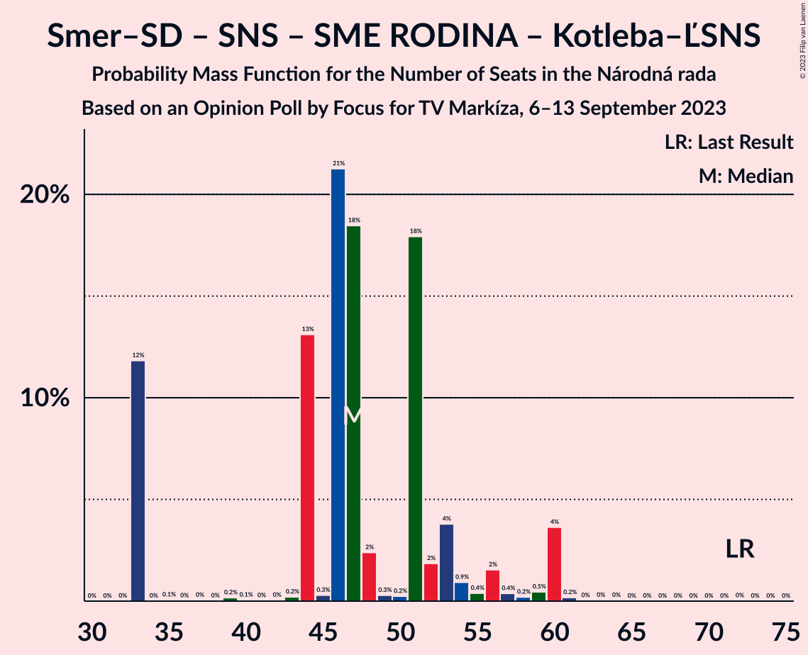

# Opinion Poll by Focus for TV Markíza, 6–13 September 2023

<a href="#voting-intentions">Voting Intentions</a> | <a href="#seats">Seats</a> | <a href="#coalitions">Coalitions</a> | <a href="#technical-information">Technical Information</a>

## Voting Intentions

### Confidence Intervals

| Party | Last Result | Poll Result | 80% Confidence Interval | 90% Confidence Interval | 95% Confidence Interval | 99% Confidence Interval |
|:-----:|:-----------:|:-----------:|:-----------------------:|:-----------------------:|:-----------------------:|:-----------------------:|
| SMER–sociálna demokracia | 18.3% | 18.9% | 17.4–20.5% |16.9–21.0% |16.6–21.4% |15.9–22.3% |
| Progresívne Slovensko | 7.0% | 16.5% | 15.1–18.1% |14.6–18.5% |14.3–18.9% |13.7–19.7% |
| HLAS–sociálna demokracia | 0.0% | 14.6% | 13.2–16.1% |12.8–16.5% |12.5–16.9% |11.9–17.7% |
| REPUBLIKA | 0.0% | 8.0% | 7.0–9.2% |6.7–9.5% |6.5–9.8% |6.0–10.5% |
| Slovenská národná strana | 3.2% | 6.4% | 5.5–7.5% |5.2–7.8% |5.0–8.1% |4.6–8.6% |
| OBYČAJNÍ ĽUDIA a nezávislé osobnosti–Kresťanská únia–Za ľudí | 0.0% | 6.3% | 5.4–7.4% |5.2–7.7% |5.0–8.0% |4.6–8.5% |
| Kresťanskodemokratické hnutie | 4.6% | 6.2% | 5.3–7.3% |5.1–7.6% |4.9–7.9% |4.5–8.4% |
| Sloboda a Solidarita | 6.2% | 5.1% | 4.3–6.1% |4.1–6.4% |3.9–6.6% |3.6–7.2% |
| SME RODINA | 8.2% | 4.9% | 4.1–5.9% |3.9–6.2% |3.7–6.4% |3.4–6.9% |
| SPOLU–Občianska Demokracia | 7.0% | 3.7% | 3.0–4.6% |2.9–4.8% |2.7–5.1% |2.4–5.5% |
| Strana maďarskej koalície–Magyar Koalíció Pártja | 3.9% | 3.6% | 2.9–4.5% |2.8–4.7% |2.6–5.0% |2.3–5.4% |
| Kotleba–Ľudová strana Naše Slovensko | 8.0% | 1.8% | 1.4–2.5% |1.2–2.7% |1.1–2.8% |1.0–3.2% |
| MODRÍ–Európske Slovensko–MOST–HÍD | 0.0% | 1.5% | 1.1–2.1% |1.0–2.3% |0.9–2.5% |0.7–2.8% |
| Magyar Fórum | 0.0% | 0.8% | 0.5–1.3% |0.5–1.4% |0.4–1.6% |0.3–1.8% |

*Note:* The poll result column reflects the actual value used in the calculations. Published results may vary slightly, and in addition be rounded to fewer digits.

## Seats

### Confidence Intervals

| Party | Last Result | Median | 80% Confidence Interval | 90% Confidence Interval | 95% Confidence Interval | 99% Confidence Interval |
|:-----:|:-----------:|:------:|:-----------------------:|:-----------------------:|:-----------------------:|:-----------------------:|
| <a href="#smer–sociálna-demokracia">SMER–sociálna demokracia</a> | 38 | 33 | 33–37 |32–38 |30–41 |29–43 |
| <a href="#progresívne-slovensko">Progresívne Slovensko</a> | 0 | 32 | 25–34 |25–34 |25–34 |25–36 |
| <a href="#hlas–sociálna-demokracia">HLAS–sociálna demokracia</a> | 0 | 28 | 25–31 |24–31 |23–31 |22–32 |
| <a href="#republika">REPUBLIKA</a> | 0 | 16 | 13–17 |12–17 |11–17 |11–19 |
| <a href="#slovenská-národná-strana">Slovenská národná strana</a> | 0 | 12 | 0–14 |0–14 |0–15 |0–15 |
| <a href="#obyčajní-ľudia-a-nezávislé-osobnosti–kresťanská-únia–za-ľudí">OBYČAJNÍ ĽUDIA a nezávislé osobnosti–Kresťanská únia–Za ľudí</a> | 0 | 12 | 10–14 |10–14 |9–14 |0–15 |
| <a href="#kresťanskodemokratické-hnutie">Kresťanskodemokratické hnutie</a> | 0 | 13 | 11–14 |10–14 |10–14 |0–14 |
| <a href="#sloboda-a-solidarita">Sloboda a Solidarita</a> | 13 | 0 | 0–12 |0–12 |0–12 |0–12 |
| <a href="#sme-rodina">SME RODINA</a> | 17 | 0 | 0–9 |0–11 |0–11 |0–12 |
| <a href="#spolu–občianska-demokracia">SPOLU–Občianska Demokracia</a> | 0 | 0 | 0 |0–10 |0–10 |0–10 |
| <a href="#strana-maďarskej-koalície–magyar-koalíció-pártja">Strana maďarskej koalície–Magyar Koalíció Pártja</a> | 0 | 0 | 0 |0 |0 |0–9 |
| <a href="#kotleba–ľudová-strana-naše-slovensko">Kotleba–Ľudová strana Naše Slovensko</a> | 17 | 0 | 0 |0 |0 |0 |
| <a href="#modrí–európske-slovensko–most–híd">MODRÍ–Európske Slovensko–MOST–HÍD</a> | 0 | 0 | 0 |0 |0 |0 |
| <a href="#magyar-fórum">Magyar Fórum</a> | 0 | 0 | 0 |0 |0 |0 |

### SMER–sociálna demokracia

*For a full overview of the results for this party, see the [SMER–sociálna demokracia](party-smer–sociálnademokracia.html) page.*

| Number of Seats | Probability | Accumulated | Special Marks |
|:---------------:|:-----------:|:-----------:|:-------------:|
| 27 | 0.1% | 100% |  |
| 28 | 0.1% | 99.9% |  |
| 29 | 2% | 99.8% |  |
| 30 | 1.0% | 98% |  |
| 31 | 0.9% | 97% |  |
| 32 | 2% | 96% |  |
| 33 | 47% | 93% | Median |
| 34 | 3% | 46% |  |
| 35 | 17% | 42% |  |
| 36 | 0.7% | 25% |  |
| 37 | 19% | 25% |  |
| 38 | 1.0% | 5% | Last Result |
| 39 | 0.5% | 4% |  |
| 40 | 0.2% | 4% |  |
| 41 | 2% | 3% |  |
| 42 | 0.2% | 1.4% |  |
| 43 | 0.9% | 1.1% |  |
| 44 | 0.2% | 0.3% |  |
| 45 | 0% | 0% |  |

### Progresívne Slovensko

*For a full overview of the results for this party, see the [Progresívne Slovensko](party-progresívneslovensko.html) page.*

| Number of Seats | Probability | Accumulated | Special Marks |
|:---------------:|:-----------:|:-----------:|:-------------:|
| 0 | 0% | 100% | Last Result |
| 1 | 0% | 100% |  |
| 2 | 0% | 100% |  |
| 3 | 0% | 100% |  |
| 4 | 0% | 100% |  |
| 5 | 0% | 100% |  |
| 6 | 0% | 100% |  |
| 7 | 0% | 100% |  |
| 8 | 0% | 100% |  |
| 9 | 0% | 100% |  |
| 10 | 0% | 100% |  |
| 11 | 0% | 100% |  |
| 12 | 0% | 100% |  |
| 13 | 0% | 100% |  |
| 14 | 0% | 100% |  |
| 15 | 0% | 100% |  |
| 16 | 0% | 100% |  |
| 17 | 0% | 100% |  |
| 18 | 0% | 100% |  |
| 19 | 0% | 100% |  |
| 20 | 0% | 100% |  |
| 21 | 0% | 100% |  |
| 22 | 0% | 100% |  |
| 23 | 0.1% | 100% |  |
| 24 | 0.2% | 99.9% |  |
| 25 | 16% | 99.7% |  |
| 26 | 4% | 84% |  |
| 27 | 1.2% | 80% |  |
| 28 | 2% | 79% |  |
| 29 | 3% | 77% |  |
| 30 | 13% | 73% |  |
| 31 | 0.8% | 60% |  |
| 32 | 31% | 59% | Median |
| 33 | 1.3% | 29% |  |
| 34 | 26% | 27% |  |
| 35 | 1.0% | 2% |  |
| 36 | 0.5% | 0.7% |  |
| 37 | 0.1% | 0.2% |  |
| 38 | 0% | 0.1% |  |
| 39 | 0% | 0.1% |  |
| 40 | 0% | 0% |  |

### HLAS–sociálna demokracia

*For a full overview of the results for this party, see the [HLAS–sociálna demokracia](party-hlas–sociálnademokracia.html) page.*

| Number of Seats | Probability | Accumulated | Special Marks |
|:---------------:|:-----------:|:-----------:|:-------------:|
| 0 | 0% | 100% | Last Result |
| 1 | 0% | 100% |  |
| 2 | 0% | 100% |  |
| 3 | 0% | 100% |  |
| 4 | 0% | 100% |  |
| 5 | 0% | 100% |  |
| 6 | 0% | 100% |  |
| 7 | 0% | 100% |  |
| 8 | 0% | 100% |  |
| 9 | 0% | 100% |  |
| 10 | 0% | 100% |  |
| 11 | 0% | 100% |  |
| 12 | 0% | 100% |  |
| 13 | 0% | 100% |  |
| 14 | 0% | 100% |  |
| 15 | 0% | 100% |  |
| 16 | 0% | 100% |  |
| 17 | 0% | 100% |  |
| 18 | 0% | 100% |  |
| 19 | 0% | 100% |  |
| 20 | 0.1% | 100% |  |
| 21 | 0.3% | 99.9% |  |
| 22 | 2% | 99.6% |  |
| 23 | 1.4% | 98% |  |
| 24 | 2% | 96% |  |
| 25 | 14% | 95% |  |
| 26 | 17% | 80% |  |
| 27 | 6% | 64% |  |
| 28 | 18% | 57% | Median |
| 29 | 25% | 39% |  |
| 30 | 0.8% | 14% |  |
| 31 | 13% | 14% |  |
| 32 | 0.3% | 0.7% |  |
| 33 | 0.3% | 0.4% |  |
| 34 | 0.1% | 0.1% |  |
| 35 | 0% | 0.1% |  |
| 36 | 0% | 0% |  |

### REPUBLIKA

*For a full overview of the results for this party, see the [REPUBLIKA](party-republika.html) page.*

| Number of Seats | Probability | Accumulated | Special Marks |
|:---------------:|:-----------:|:-----------:|:-------------:|
| 0 | 0% | 100% | Last Result |
| 1 | 0% | 100% |  |
| 2 | 0% | 100% |  |
| 3 | 0% | 100% |  |
| 4 | 0% | 100% |  |
| 5 | 0% | 100% |  |
| 6 | 0% | 100% |  |
| 7 | 0% | 100% |  |
| 8 | 0% | 100% |  |
| 9 | 0% | 100% |  |
| 10 | 0.3% | 100% |  |
| 11 | 4% | 99.7% |  |
| 12 | 2% | 96% |  |
| 13 | 26% | 93% |  |
| 14 | 7% | 67% |  |
| 15 | 2% | 60% |  |
| 16 | 19% | 59% | Median |
| 17 | 39% | 40% |  |
| 18 | 0.3% | 0.8% |  |
| 19 | 0.5% | 0.5% |  |
| 20 | 0% | 0.1% |  |
| 21 | 0% | 0% |  |

### Slovenská národná strana

*For a full overview of the results for this party, see the [Slovenská národná strana](party-slovenskánárodnástrana.html) page.*

| Number of Seats | Probability | Accumulated | Special Marks |
|:---------------:|:-----------:|:-----------:|:-------------:|
| 0 | 13% | 100% | Last Result |
| 1 | 0% | 87% |  |
| 2 | 0% | 87% |  |
| 3 | 0% | 87% |  |
| 4 | 0% | 87% |  |
| 5 | 0% | 87% |  |
| 6 | 0% | 87% |  |
| 7 | 0% | 87% |  |
| 8 | 0% | 87% |  |
| 9 | 0.9% | 87% |  |
| 10 | 10% | 87% |  |
| 11 | 18% | 77% |  |
| 12 | 17% | 59% | Median |
| 13 | 21% | 42% |  |
| 14 | 17% | 21% |  |
| 15 | 4% | 4% |  |
| 16 | 0.1% | 0.4% |  |
| 17 | 0.2% | 0.3% |  |
| 18 | 0% | 0% |  |

### OBYČAJNÍ ĽUDIA a nezávislé osobnosti–Kresťanská únia–Za ľudí

*For a full overview of the results for this party, see the [OBYČAJNÍ ĽUDIA a nezávislé osobnosti–Kresťanská únia–Za ľudí](party-obyčajníľudiaanezávisléosobnosti–kresťanskáúnia–zaľudí.html) page.*

| Number of Seats | Probability | Accumulated | Special Marks |
|:---------------:|:-----------:|:-----------:|:-------------:|
| 0 | 1.2% | 100% | Last Result |
| 1 | 0% | 98.8% |  |
| 2 | 0% | 98.8% |  |
| 3 | 0% | 98.8% |  |
| 4 | 0% | 98.8% |  |
| 5 | 0% | 98.8% |  |
| 6 | 0% | 98.8% |  |
| 7 | 0% | 98.8% |  |
| 8 | 0% | 98.8% |  |
| 9 | 4% | 98.8% |  |
| 10 | 6% | 95% |  |
| 11 | 36% | 89% |  |
| 12 | 8% | 53% | Median |
| 13 | 4% | 45% |  |
| 14 | 40% | 41% |  |
| 15 | 0.4% | 0.7% |  |
| 16 | 0.1% | 0.2% |  |
| 17 | 0.1% | 0.1% |  |
| 18 | 0% | 0% |  |

### Kresťanskodemokratické hnutie

*For a full overview of the results for this party, see the [Kresťanskodemokratické hnutie](party-kresťanskodemokratickéhnutie.html) page.*

| Number of Seats | Probability | Accumulated | Special Marks |
|:---------------:|:-----------:|:-----------:|:-------------:|
| 0 | 1.0% | 100% | Last Result |
| 1 | 0% | 99.0% |  |
| 2 | 0% | 99.0% |  |
| 3 | 0% | 99.0% |  |
| 4 | 0% | 99.0% |  |
| 5 | 0% | 99.0% |  |
| 6 | 0% | 99.0% |  |
| 7 | 0% | 99.0% |  |
| 8 | 0.1% | 99.0% |  |
| 9 | 1.1% | 98.9% |  |
| 10 | 6% | 98% |  |
| 11 | 5% | 92% |  |
| 12 | 35% | 87% |  |
| 13 | 23% | 53% | Median |
| 14 | 30% | 30% |  |
| 15 | 0.1% | 0.2% |  |
| 16 | 0% | 0.1% |  |
| 17 | 0% | 0% |  |

### Sloboda a Solidarita

*For a full overview of the results for this party, see the [Sloboda a Solidarita](party-slobodaasolidarita.html) page.*

| Number of Seats | Probability | Accumulated | Special Marks |
|:---------------:|:-----------:|:-----------:|:-------------:|
| 0 | 61% | 100% | Median |
| 1 | 0% | 39% |  |
| 2 | 0% | 39% |  |
| 3 | 0% | 39% |  |
| 4 | 0% | 39% |  |
| 5 | 0% | 39% |  |
| 6 | 0% | 39% |  |
| 7 | 0% | 39% |  |
| 8 | 0% | 39% |  |
| 9 | 4% | 39% |  |
| 10 | 17% | 35% |  |
| 11 | 2% | 18% |  |
| 12 | 16% | 17% |  |
| 13 | 0.3% | 0.4% | Last Result |
| 14 | 0.1% | 0.1% |  |
| 15 | 0% | 0% |  |

### SME RODINA

*For a full overview of the results for this party, see the [SME RODINA](party-smerodina.html) page.*

| Number of Seats | Probability | Accumulated | Special Marks |
|:---------------:|:-----------:|:-----------:|:-------------:|
| 0 | 86% | 100% | Median |
| 1 | 0% | 14% |  |
| 2 | 0% | 14% |  |
| 3 | 0% | 14% |  |
| 4 | 0% | 14% |  |
| 5 | 0% | 14% |  |
| 6 | 0% | 14% |  |
| 7 | 0% | 14% |  |
| 8 | 2% | 14% |  |
| 9 | 4% | 13% |  |
| 10 | 2% | 9% |  |
| 11 | 6% | 7% |  |
| 12 | 0.9% | 1.0% |  |
| 13 | 0.1% | 0.2% |  |
| 14 | 0% | 0.1% |  |
| 15 | 0% | 0% |  |
| 16 | 0% | 0% |  |
| 17 | 0% | 0% | Last Result |

### SPOLU–Občianska Demokracia

*For a full overview of the results for this party, see the [SPOLU–Občianska Demokracia](party-spolu–občianskademokracia.html) page.*

| Number of Seats | Probability | Accumulated | Special Marks |
|:---------------:|:-----------:|:-----------:|:-------------:|
| 0 | 91% | 100% | Last Result, Median |
| 1 | 0% | 9% |  |
| 2 | 0% | 9% |  |
| 3 | 0% | 9% |  |
| 4 | 0% | 9% |  |
| 5 | 0% | 9% |  |
| 6 | 0% | 9% |  |
| 7 | 0% | 9% |  |
| 8 | 0% | 9% |  |
| 9 | 0.2% | 9% |  |
| 10 | 9% | 9% |  |
| 11 | 0.1% | 0.1% |  |
| 12 | 0% | 0% |  |

### Strana maďarskej koalície–Magyar Koalíció Pártja

*For a full overview of the results for this party, see the [Strana maďarskej koalície–Magyar Koalíció Pártja](party-stranamaďarskejkoalície–magyarkoalíciópártja.html) page.*

| Number of Seats | Probability | Accumulated | Special Marks |
|:---------------:|:-----------:|:-----------:|:-------------:|
| 0 | 98.9% | 100% | Last Result, Median |
| 1 | 0% | 1.1% |  |
| 2 | 0% | 1.1% |  |
| 3 | 0% | 1.1% |  |
| 4 | 0% | 1.1% |  |
| 5 | 0% | 1.1% |  |
| 6 | 0% | 1.1% |  |
| 7 | 0% | 1.1% |  |
| 8 | 0% | 1.1% |  |
| 9 | 0.9% | 1.1% |  |
| 10 | 0.1% | 0.1% |  |
| 11 | 0% | 0.1% |  |
| 12 | 0% | 0% |  |

### Kotleba–Ľudová strana Naše Slovensko

*For a full overview of the results for this party, see the [Kotleba–Ľudová strana Naše Slovensko](party-kotleba–ľudovástrananašeslovensko.html) page.*

| Number of Seats | Probability | Accumulated | Special Marks |
|:---------------:|:-----------:|:-----------:|:-------------:|
| 0 | 100% | 100% | Median |
| 1 | 0% | 0% |  |
| 2 | 0% | 0% |  |
| 3 | 0% | 0% |  |
| 4 | 0% | 0% |  |
| 5 | 0% | 0% |  |
| 6 | 0% | 0% |  |
| 7 | 0% | 0% |  |
| 8 | 0% | 0% |  |
| 9 | 0% | 0% |  |
| 10 | 0% | 0% |  |
| 11 | 0% | 0% |  |
| 12 | 0% | 0% |  |
| 13 | 0% | 0% |  |
| 14 | 0% | 0% |  |
| 15 | 0% | 0% |  |
| 16 | 0% | 0% |  |
| 17 | 0% | 0% | Last Result |

### MODRÍ–Európske Slovensko–MOST–HÍD

*For a full overview of the results for this party, see the [MODRÍ–Európske Slovensko–MOST–HÍD](party-modrí–európskeslovensko–most–híd.html) page.*

| Number of Seats | Probability | Accumulated | Special Marks |
|:---------------:|:-----------:|:-----------:|:-------------:|
| 0 | 100% | 100% | Last Result, Median |

### Magyar Fórum

*For a full overview of the results for this party, see the [Magyar Fórum](party-magyarfórum.html) page.*

| Number of Seats | Probability | Accumulated | Special Marks |
|:---------------:|:-----------:|:-----------:|:-------------:|
| 0 | 100% | 100% | Last Result, Median |

## Coalitions

### Confidence Intervals

| Coalition | Last Result | Median | Majority? | 80% Confidence Interval | 90% Confidence Interval | 95% Confidence Interval | 99% Confidence Interval |
|:---------:|:-----------:|:------:|:---------:|:-----------------------:|:-----------------------:|:-----------------------:|:-----------------------:|
| SMER–sociálna demokracia – HLAS–sociálna demokracia – Slovenská národná strana – SME RODINA – Kotleba–Ľudová strana Naše Slovensko | 72 | 75 | 32% | 64–79 | 64–84 | 64–85 | 64–89 |
| SMER–sociálna demokracia – HLAS–sociálna demokracia – Slovenská národná strana – SME RODINA | 55 | 75 | 32% | 64–79 | 64–84 | 64–85 | 64–89 |
| SMER–sociálna demokracia – HLAS–sociálna demokracia – Slovenská národná strana | 38 | 73 | 22% | 64–79 | 64–79 | 64–79 | 63–84 |
| SMER–sociálna demokracia – HLAS–sociálna demokracia – SME RODINA | 55 | 62 | 0.5% | 58–67 | 58–70 | 58–73 | 58–75 |
| SMER–sociálna demokracia – Slovenská národná strana – SME RODINA – Kotleba–Ľudová strana Naše Slovensko | 72 | 47 | 0% | 33–53 | 33–57 | 33–60 | 33–60 |
| SMER–sociálna demokracia – Slovenská národná strana – SME RODINA | 55 | 47 | 0% | 33–53 | 33–57 | 33–60 | 33–60 |
| SMER–sociálna demokracia – Slovenská národná strana | 38 | 46 | 0% | 33–51 | 33–51 | 33–53 | 33–54 |
| HLAS–sociálna demokracia – Slovenská národná strana – SME RODINA – Kotleba–Ľudová strana Naše Slovensko | 34 | 41 | 0% | 31–46 | 31–48 | 31–51 | 31–52 |
| HLAS–sociálna demokracia – Slovenská národná strana – SME RODINA | 17 | 41 | 0% | 31–46 | 31–48 | 31–51 | 31–52 |
| SMER–sociálna demokracia – SME RODINA | 55 | 35 | 0% | 33–42 | 33–45 | 33–45 | 31–48 |
| HLAS–sociálna demokracia – Slovenská národná strana | 0 | 38 | 0% | 31–42 | 31–42 | 31–42 | 29–45 |
| SMER–sociálna demokracia | 38 | 33 | 0% | 33–37 | 32–38 | 30–41 | 29–43 |
| HLAS–sociálna demokracia – SME RODINA | 17 | 29 | 0% | 25–36 | 25–37 | 25–37 | 23–40 |

### SMER–sociálna demokracia – HLAS–sociálna demokracia – Slovenská národná strana – SME RODINA – Kotleba–Ľudová strana Naše Slovensko

| Number of Seats | Probability | Accumulated | Special Marks |
|:---------------:|:-----------:|:-----------:|:-------------:|
| 63 | 0% | 100% |  |
| 64 | 12% | 99.9% |  |
| 65 | 0.1% | 88% |  |
| 66 | 0.2% | 88% |  |
| 67 | 0.1% | 88% |  |
| 68 | 0.1% | 88% |  |
| 69 | 9% | 88% |  |
| 70 | 0.3% | 79% |  |
| 71 | 0.7% | 78% |  |
| 72 | 0.1% | 78% | Last Result |
| 73 | 21% | 78% | Median |
| 74 | 5% | 57% |  |
| 75 | 20% | 52% |  |
| 76 | 2% | 32% | Majority |
| 77 | 1.3% | 29% |  |
| 78 | 3% | 28% |  |
| 79 | 16% | 26% |  |
| 80 | 2% | 9% |  |
| 81 | 0.4% | 8% |  |
| 82 | 0.4% | 7% |  |
| 83 | 1.1% | 7% |  |
| 84 | 1.2% | 6% |  |
| 85 | 3% | 5% |  |
| 86 | 0.9% | 2% |  |
| 87 | 0.1% | 0.7% |  |
| 88 | 0% | 0.6% |  |
| 89 | 0.1% | 0.5% |  |
| 90 | 0.3% | 0.4% |  |
| 91 | 0% | 0.1% |  |
| 92 | 0% | 0.1% |  |
| 93 | 0% | 0.1% |  |
| 94 | 0% | 0% |  |

### SMER–sociálna demokracia – HLAS–sociálna demokracia – Slovenská národná strana – SME RODINA

| Number of Seats | Probability | Accumulated | Special Marks |
|:---------------:|:-----------:|:-----------:|:-------------:|
| 55 | 0% | 100% | Last Result |
| 56 | 0% | 100% |  |
| 57 | 0% | 100% |  |
| 58 | 0% | 100% |  |
| 59 | 0% | 100% |  |
| 60 | 0% | 100% |  |
| 61 | 0% | 100% |  |
| 62 | 0% | 100% |  |
| 63 | 0% | 100% |  |
| 64 | 12% | 99.9% |  |
| 65 | 0.1% | 88% |  |
| 66 | 0.2% | 88% |  |
| 67 | 0.1% | 88% |  |
| 68 | 0.1% | 88% |  |
| 69 | 9% | 88% |  |
| 70 | 0.3% | 79% |  |
| 71 | 0.7% | 78% |  |
| 72 | 0.1% | 78% |  |
| 73 | 21% | 78% | Median |
| 74 | 5% | 57% |  |
| 75 | 20% | 52% |  |
| 76 | 2% | 32% | Majority |
| 77 | 1.3% | 29% |  |
| 78 | 3% | 28% |  |
| 79 | 16% | 26% |  |
| 80 | 2% | 9% |  |
| 81 | 0.4% | 8% |  |
| 82 | 0.4% | 7% |  |
| 83 | 1.1% | 7% |  |
| 84 | 1.2% | 6% |  |
| 85 | 3% | 5% |  |
| 86 | 0.9% | 2% |  |
| 87 | 0.1% | 0.7% |  |
| 88 | 0% | 0.6% |  |
| 89 | 0.1% | 0.5% |  |
| 90 | 0.3% | 0.4% |  |
| 91 | 0% | 0.1% |  |
| 92 | 0% | 0.1% |  |
| 93 | 0% | 0.1% |  |
| 94 | 0% | 0% |  |

### SMER–sociálna demokracia – HLAS–sociálna demokracia – Slovenská národná strana

| Number of Seats | Probability | Accumulated | Special Marks |
|:---------------:|:-----------:|:-----------:|:-------------:|
| 38 | 0% | 100% | Last Result |
| 39 | 0% | 100% |  |
| 40 | 0% | 100% |  |
| 41 | 0% | 100% |  |
| 42 | 0% | 100% |  |
| 43 | 0% | 100% |  |
| 44 | 0% | 100% |  |
| 45 | 0% | 100% |  |
| 46 | 0% | 100% |  |
| 47 | 0% | 100% |  |
| 48 | 0% | 100% |  |
| 49 | 0% | 100% |  |
| 50 | 0% | 100% |  |
| 51 | 0% | 100% |  |
| 52 | 0% | 100% |  |
| 53 | 0% | 100% |  |
| 54 | 0% | 100% |  |
| 55 | 0% | 100% |  |
| 56 | 0% | 100% |  |
| 57 | 0% | 100% |  |
| 58 | 0% | 100% |  |
| 59 | 0% | 100% |  |
| 60 | 0% | 100% |  |
| 61 | 0.1% | 100% |  |
| 62 | 0.1% | 99.9% |  |
| 63 | 0.5% | 99.8% |  |
| 64 | 12% | 99.3% |  |
| 65 | 2% | 87% |  |
| 66 | 0.5% | 85% |  |
| 67 | 2% | 85% |  |
| 68 | 2% | 82% |  |
| 69 | 10% | 81% |  |
| 70 | 0.9% | 71% |  |
| 71 | 0.8% | 70% |  |
| 72 | 1.2% | 69% |  |
| 73 | 19% | 68% | Median |
| 74 | 7% | 49% |  |
| 75 | 20% | 42% |  |
| 76 | 1.0% | 22% | Majority |
| 77 | 0.7% | 21% |  |
| 78 | 2% | 20% |  |
| 79 | 15% | 18% |  |
| 80 | 0.9% | 2% |  |
| 81 | 0% | 1.4% |  |
| 82 | 0.2% | 1.4% |  |
| 83 | 0% | 1.2% |  |
| 84 | 0.9% | 1.2% |  |
| 85 | 0% | 0.3% |  |
| 86 | 0% | 0.2% |  |
| 87 | 0% | 0.2% |  |
| 88 | 0% | 0.2% |  |
| 89 | 0% | 0.2% |  |
| 90 | 0.1% | 0.2% |  |
| 91 | 0% | 0% |  |

### SMER–sociálna demokracia – HLAS–sociálna demokracia – SME RODINA

| Number of Seats | Probability | Accumulated | Special Marks |
|:---------------:|:-----------:|:-----------:|:-------------:|
| 53 | 0% | 100% |  |
| 54 | 0.1% | 99.9% |  |
| 55 | 0.1% | 99.9% | Last Result |
| 56 | 0.1% | 99.8% |  |
| 57 | 0.2% | 99.7% |  |
| 58 | 10% | 99.5% |  |
| 59 | 0.2% | 90% |  |
| 60 | 0.2% | 90% |  |
| 61 | 15% | 90% | Median |
| 62 | 26% | 75% |  |
| 63 | 1.0% | 49% |  |
| 64 | 16% | 48% |  |
| 65 | 16% | 32% |  |
| 66 | 5% | 16% |  |
| 67 | 2% | 11% |  |
| 68 | 0.2% | 10% |  |
| 69 | 0.7% | 9% |  |
| 70 | 4% | 9% |  |
| 71 | 1.4% | 5% |  |
| 72 | 0.2% | 3% |  |
| 73 | 1.1% | 3% |  |
| 74 | 1.2% | 2% |  |
| 75 | 0.3% | 0.7% |  |
| 76 | 0.1% | 0.5% | Majority |
| 77 | 0.1% | 0.4% |  |
| 78 | 0% | 0.3% |  |
| 79 | 0% | 0.2% |  |
| 80 | 0.1% | 0.2% |  |
| 81 | 0% | 0.1% |  |
| 82 | 0% | 0.1% |  |
| 83 | 0% | 0.1% |  |
| 84 | 0% | 0% |  |

### SMER–sociálna demokracia – Slovenská národná strana – SME RODINA – Kotleba–Ľudová strana Naše Slovensko

| Number of Seats | Probability | Accumulated | Special Marks |
|:---------------:|:-----------:|:-----------:|:-------------:|
| 33 | 12% | 100% |  |
| 34 | 0% | 88% |  |
| 35 | 0.1% | 88% |  |
| 36 | 0% | 88% |  |
| 37 | 0% | 88% |  |
| 38 | 0% | 88% |  |
| 39 | 0.2% | 88% |  |
| 40 | 0.1% | 88% |  |
| 41 | 0% | 88% |  |
| 42 | 0% | 88% |  |
| 43 | 0.2% | 88% |  |
| 44 | 13% | 87% |  |
| 45 | 0.3% | 74% | Median |
| 46 | 21% | 74% |  |
| 47 | 18% | 53% |  |
| 48 | 2% | 34% |  |
| 49 | 0.3% | 32% |  |
| 50 | 0.2% | 32% |  |
| 51 | 18% | 31% |  |
| 52 | 2% | 14% |  |
| 53 | 4% | 12% |  |
| 54 | 0.9% | 8% |  |
| 55 | 0.4% | 7% |  |
| 56 | 2% | 7% |  |
| 57 | 0.4% | 5% |  |
| 58 | 0.2% | 5% |  |
| 59 | 0.5% | 4% |  |
| 60 | 4% | 4% |  |
| 61 | 0.2% | 0.3% |  |
| 62 | 0% | 0.2% |  |
| 63 | 0% | 0.1% |  |
| 64 | 0% | 0.1% |  |
| 65 | 0% | 0% |  |
| 66 | 0% | 0% |  |
| 67 | 0% | 0% |  |
| 68 | 0% | 0% |  |
| 69 | 0% | 0% |  |
| 70 | 0% | 0% |  |
| 71 | 0% | 0% |  |
| 72 | 0% | 0% | Last Result |

### SMER–sociálna demokracia – Slovenská národná strana – SME RODINA

| Number of Seats | Probability | Accumulated | Special Marks |
|:---------------:|:-----------:|:-----------:|:-------------:|
| 33 | 12% | 100% |  |
| 34 | 0% | 88% |  |
| 35 | 0.1% | 88% |  |
| 36 | 0% | 88% |  |
| 37 | 0% | 88% |  |
| 38 | 0% | 88% |  |
| 39 | 0.2% | 88% |  |
| 40 | 0.1% | 88% |  |
| 41 | 0% | 88% |  |
| 42 | 0% | 88% |  |
| 43 | 0.2% | 88% |  |
| 44 | 13% | 87% |  |
| 45 | 0.3% | 74% | Median |
| 46 | 21% | 74% |  |
| 47 | 18% | 53% |  |
| 48 | 2% | 34% |  |
| 49 | 0.3% | 32% |  |
| 50 | 0.2% | 32% |  |
| 51 | 18% | 31% |  |
| 52 | 2% | 14% |  |
| 53 | 4% | 12% |  |
| 54 | 0.9% | 8% |  |
| 55 | 0.4% | 7% | Last Result |
| 56 | 2% | 7% |  |
| 57 | 0.4% | 5% |  |
| 58 | 0.2% | 5% |  |
| 59 | 0.5% | 4% |  |
| 60 | 4% | 4% |  |
| 61 | 0.2% | 0.3% |  |
| 62 | 0% | 0.2% |  |
| 63 | 0% | 0.1% |  |
| 64 | 0% | 0.1% |  |
| 65 | 0% | 0% |  |

### SMER–sociálna demokracia – Slovenská národná strana

| Number of Seats | Probability | Accumulated | Special Marks |
|:---------------:|:-----------:|:-----------:|:-------------:|
| 33 | 12% | 100% |  |
| 34 | 0.2% | 88% |  |
| 35 | 0.1% | 88% |  |
| 36 | 0.1% | 88% |  |
| 37 | 0.1% | 88% |  |
| 38 | 0.1% | 88% | Last Result |
| 39 | 2% | 88% |  |
| 40 | 0.2% | 85% |  |
| 41 | 0.9% | 85% |  |
| 42 | 1.2% | 84% |  |
| 43 | 3% | 83% |  |
| 44 | 14% | 81% |  |
| 45 | 2% | 66% | Median |
| 46 | 21% | 65% |  |
| 47 | 19% | 43% |  |
| 48 | 0.5% | 25% |  |
| 49 | 3% | 24% |  |
| 50 | 1.1% | 21% |  |
| 51 | 16% | 20% |  |
| 52 | 1.1% | 4% |  |
| 53 | 2% | 3% |  |
| 54 | 0.1% | 0.5% |  |
| 55 | 0.2% | 0.5% |  |
| 56 | 0% | 0.3% |  |
| 57 | 0% | 0.2% |  |
| 58 | 0% | 0.2% |  |
| 59 | 0.1% | 0.2% |  |
| 60 | 0% | 0% |  |

### HLAS–sociálna demokracia – Slovenská národná strana – SME RODINA – Kotleba–Ľudová strana Naše Slovensko

| Number of Seats | Probability | Accumulated | Special Marks |
|:---------------:|:-----------:|:-----------:|:-------------:|
| 27 | 0.1% | 100% |  |
| 28 | 0% | 99.8% |  |
| 29 | 0% | 99.8% |  |
| 30 | 0% | 99.8% |  |
| 31 | 12% | 99.8% |  |
| 32 | 0% | 88% |  |
| 33 | 0.1% | 88% |  |
| 34 | 0.7% | 88% | Last Result |
| 35 | 0.1% | 87% |  |
| 36 | 9% | 87% |  |
| 37 | 5% | 78% |  |
| 38 | 15% | 72% |  |
| 39 | 0.2% | 57% |  |
| 40 | 5% | 57% | Median |
| 41 | 3% | 52% |  |
| 42 | 36% | 49% |  |
| 43 | 1.0% | 13% |  |
| 44 | 0.8% | 12% |  |
| 45 | 0.5% | 11% |  |
| 46 | 0.8% | 11% |  |
| 47 | 3% | 10% |  |
| 48 | 2% | 7% |  |
| 49 | 0.4% | 5% |  |
| 50 | 0.2% | 5% |  |
| 51 | 4% | 4% |  |
| 52 | 0.2% | 0.6% |  |
| 53 | 0.1% | 0.4% |  |
| 54 | 0% | 0.3% |  |
| 55 | 0.2% | 0.3% |  |
| 56 | 0.1% | 0.1% |  |
| 57 | 0% | 0% |  |

### HLAS–sociálna demokracia – Slovenská národná strana – SME RODINA

| Number of Seats | Probability | Accumulated | Special Marks |
|:---------------:|:-----------:|:-----------:|:-------------:|
| 17 | 0% | 100% | Last Result |
| 18 | 0% | 100% |  |
| 19 | 0% | 100% |  |
| 20 | 0% | 100% |  |
| 21 | 0% | 100% |  |
| 22 | 0% | 100% |  |
| 23 | 0% | 100% |  |
| 24 | 0% | 100% |  |
| 25 | 0% | 100% |  |
| 26 | 0% | 100% |  |
| 27 | 0.1% | 100% |  |
| 28 | 0% | 99.8% |  |
| 29 | 0% | 99.8% |  |
| 30 | 0% | 99.8% |  |
| 31 | 12% | 99.8% |  |
| 32 | 0% | 88% |  |
| 33 | 0.1% | 88% |  |
| 34 | 0.7% | 88% |  |
| 35 | 0.1% | 87% |  |
| 36 | 9% | 87% |  |
| 37 | 5% | 78% |  |
| 38 | 15% | 72% |  |
| 39 | 0.2% | 57% |  |
| 40 | 5% | 57% | Median |
| 41 | 3% | 52% |  |
| 42 | 36% | 49% |  |
| 43 | 1.0% | 13% |  |
| 44 | 0.8% | 12% |  |
| 45 | 0.5% | 11% |  |
| 46 | 0.8% | 11% |  |
| 47 | 3% | 10% |  |
| 48 | 2% | 7% |  |
| 49 | 0.4% | 5% |  |
| 50 | 0.2% | 5% |  |
| 51 | 4% | 4% |  |
| 52 | 0.2% | 0.6% |  |
| 53 | 0.1% | 0.4% |  |
| 54 | 0% | 0.3% |  |
| 55 | 0.2% | 0.3% |  |
| 56 | 0.1% | 0.1% |  |
| 57 | 0% | 0% |  |

### SMER–sociálna demokracia – SME RODINA

| Number of Seats | Probability | Accumulated | Special Marks |
|:---------------:|:-----------:|:-----------:|:-------------:|
| 28 | 0% | 100% |  |
| 29 | 0.1% | 99.9% |  |
| 30 | 0.1% | 99.9% |  |
| 31 | 0.3% | 99.8% |  |
| 32 | 0.1% | 99.5% |  |
| 33 | 45% | 99.3% | Median |
| 34 | 0.3% | 54% |  |
| 35 | 15% | 54% |  |
| 36 | 0.3% | 38% |  |
| 37 | 19% | 38% |  |
| 38 | 3% | 19% |  |
| 39 | 0.4% | 16% |  |
| 40 | 3% | 16% |  |
| 41 | 2% | 13% |  |
| 42 | 2% | 11% |  |
| 43 | 1.3% | 9% |  |
| 44 | 1.3% | 8% |  |
| 45 | 4% | 6% |  |
| 46 | 1.2% | 2% |  |
| 47 | 0.3% | 0.8% |  |
| 48 | 0.1% | 0.6% |  |
| 49 | 0.2% | 0.5% |  |
| 50 | 0.2% | 0.3% |  |
| 51 | 0.1% | 0.1% |  |
| 52 | 0% | 0.1% |  |
| 53 | 0% | 0.1% |  |
| 54 | 0% | 0% |  |
| 55 | 0% | 0% | Last Result |

### HLAS–sociálna demokracia – Slovenská národná strana

| Number of Seats | Probability | Accumulated | Special Marks |
|:---------------:|:-----------:|:-----------:|:-------------:|
| 0 | 0% | 100% | Last Result |
| 1 | 0% | 100% |  |
| 2 | 0% | 100% |  |
| 3 | 0% | 100% |  |
| 4 | 0% | 100% |  |
| 5 | 0% | 100% |  |
| 6 | 0% | 100% |  |
| 7 | 0% | 100% |  |
| 8 | 0% | 100% |  |
| 9 | 0% | 100% |  |
| 10 | 0% | 100% |  |
| 11 | 0% | 100% |  |
| 12 | 0% | 100% |  |
| 13 | 0% | 100% |  |
| 14 | 0% | 100% |  |
| 15 | 0% | 100% |  |
| 16 | 0% | 100% |  |
| 17 | 0% | 100% |  |
| 18 | 0% | 100% |  |
| 19 | 0% | 100% |  |
| 20 | 0% | 100% |  |
| 21 | 0% | 100% |  |
| 22 | 0% | 100% |  |
| 23 | 0% | 100% |  |
| 24 | 0% | 100% |  |
| 25 | 0% | 99.9% |  |
| 26 | 0% | 99.9% |  |
| 27 | 0.1% | 99.9% |  |
| 28 | 0.1% | 99.8% |  |
| 29 | 0.3% | 99.7% |  |
| 30 | 0% | 99.4% |  |
| 31 | 12% | 99.4% |  |
| 32 | 0.4% | 87% |  |
| 33 | 2% | 87% |  |
| 34 | 1.0% | 85% |  |
| 35 | 2% | 84% |  |
| 36 | 10% | 82% |  |
| 37 | 6% | 72% |  |
| 38 | 18% | 66% |  |
| 39 | 0.6% | 48% |  |
| 40 | 8% | 47% | Median |
| 41 | 2% | 39% |  |
| 42 | 36% | 37% |  |
| 43 | 0.5% | 1.1% |  |
| 44 | 0.1% | 0.7% |  |
| 45 | 0.1% | 0.5% |  |
| 46 | 0.1% | 0.4% |  |
| 47 | 0.1% | 0.3% |  |
| 48 | 0.1% | 0.2% |  |
| 49 | 0.1% | 0.1% |  |
| 50 | 0% | 0% |  |

### SMER–sociálna demokracia

| Number of Seats | Probability | Accumulated | Special Marks |
|:---------------:|:-----------:|:-----------:|:-------------:|
| 27 | 0.1% | 100% |  |
| 28 | 0.1% | 99.9% |  |
| 29 | 2% | 99.8% |  |
| 30 | 1.0% | 98% |  |
| 31 | 0.9% | 97% |  |
| 32 | 2% | 96% |  |
| 33 | 47% | 93% | Median |
| 34 | 3% | 46% |  |
| 35 | 17% | 42% |  |
| 36 | 0.7% | 25% |  |
| 37 | 19% | 25% |  |
| 38 | 1.0% | 5% | Last Result |
| 39 | 0.5% | 4% |  |
| 40 | 0.2% | 4% |  |
| 41 | 2% | 3% |  |
| 42 | 0.2% | 1.4% |  |
| 43 | 0.9% | 1.1% |  |
| 44 | 0.2% | 0.3% |  |
| 45 | 0% | 0% |  |

### HLAS–sociálna demokracia – SME RODINA

| Number of Seats | Probability | Accumulated | Special Marks |
|:---------------:|:-----------:|:-----------:|:-------------:|
| 17 | 0% | 100% | Last Result |
| 18 | 0% | 100% |  |
| 19 | 0% | 100% |  |
| 20 | 0% | 100% |  |
| 21 | 0.2% | 100% |  |
| 22 | 0% | 99.8% |  |
| 23 | 0.7% | 99.8% |  |
| 24 | 0.1% | 99.1% |  |
| 25 | 11% | 98.9% |  |
| 26 | 15% | 88% |  |
| 27 | 5% | 73% |  |
| 28 | 16% | 69% | Median |
| 29 | 24% | 53% |  |
| 30 | 2% | 28% |  |
| 31 | 13% | 26% |  |
| 32 | 0.6% | 13% |  |
| 33 | 1.3% | 12% |  |
| 34 | 0.6% | 11% |  |
| 35 | 0.4% | 10% |  |
| 36 | 4% | 10% |  |
| 37 | 3% | 6% |  |
| 38 | 1.2% | 2% |  |
| 39 | 0.5% | 1.1% |  |
| 40 | 0.2% | 0.6% |  |
| 41 | 0.2% | 0.5% |  |
| 42 | 0% | 0.2% |  |
| 43 | 0% | 0.2% |  |
| 44 | 0% | 0.2% |  |
| 45 | 0.1% | 0.2% |  |
| 46 | 0% | 0% |  |

## Technical Information

### Opinion Poll

+ **Polling firm:** Focus
+ **Commissioner(s):** TV Markíza
+ **Fieldwork period:** 6–13 September 2023

### Calculations

+ **Sample size:** 1001
+ **Simulations done:** 1,048,576
+ **Error estimate:** 2.30%

