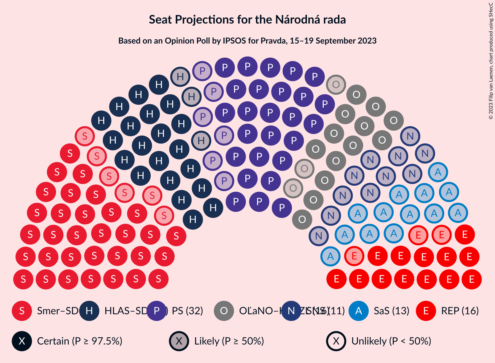

# Opinion Poll by IPSOS for Pravda, 15–19 September 2023

<a href="#voting-intentions">Voting Intentions</a> | <a href="#seats">Seats</a> | <a href="#coalitions">Coalitions</a> | <a href="#technical-information">Technical Information</a>

## Voting Intentions

### Confidence Intervals

| Party | Last Result | Poll Result | 80% Confidence Interval | 90% Confidence Interval | 95% Confidence Interval | 99% Confidence Interval |
|:-----:|:-----------:|:-----------:|:-----------------------:|:-----------------------:|:-----------------------:|:-----------------------:|
| SMER–sociálna demokracia | 18.3% | 20.1% | 18.5–21.8% |18.1–22.2% |17.7–22.6% |17.0–23.5% |
| Progresívne Slovensko | 7.0% | 17.1% | 15.6–18.6% |15.2–19.1% |14.9–19.5% |14.2–20.3% |
| HLAS–sociálna demokracia | 0.0% | 13.0% | 11.7–14.4% |11.3–14.8% |11.0–15.2% |10.5–15.9% |
| REPUBLIKA | 0.0% | 8.5% | 7.5–9.7% |7.2–10.0% |6.9–10.3% |6.5–11.0% |
| OBYČAJNÍ ĽUDIA a nezávislé osobnosti–Kresťanská únia–Za ľudí | 0.0% | 8.1% | 7.1–9.3% |6.8–9.6% |6.6–9.9% |6.1–10.5% |
| Sloboda a Solidarita | 6.2% | 6.0% | 5.2–7.1% |4.9–7.4% |4.7–7.7% |4.4–8.2% |
| Slovenská národná strana | 3.2% | 5.6% | 4.7–6.6% |4.5–6.9% |4.3–7.1% |3.9–7.7% |
| Kresťanskodemokratické hnutie | 4.6% | 5.3% | 4.5–6.3% |4.2–6.6% |4.1–6.8% |3.7–7.3% |
| SME RODINA | 8.2% | 4.2% | 3.5–5.1% |3.3–5.4% |3.1–5.6% |2.8–6.1% |
| Strana maďarskej koalície–Magyar Koalíció Pártja | 3.9% | 4.0% | 3.3–4.9% |3.1–5.2% |3.0–5.4% |2.7–5.9% |
| SPOLU–Občianska Demokracia | 7.0% | 3.4% | 2.8–4.3% |2.6–4.5% |2.5–4.7% |2.2–5.2% |
| Kotleba–Ľudová strana Naše Slovensko | 8.0% | 2.5% | 2.0–3.3% |1.9–3.5% |1.7–3.7% |1.5–4.1% |
| MODRÍ–Európske Slovensko–MOST–HÍD | 0.0% | 0.9% | 0.6–1.4% |0.5–1.5% |0.5–1.7% |0.4–2.0% |
| Magyar Fórum | 0.0% | 0.6% | 0.4–1.0% |0.3–1.2% |0.3–1.3% |0.2–1.5% |

*Note:* The poll result column reflects the actual value used in the calculations. Published results may vary slightly, and in addition be rounded to fewer digits.

## Seats

### Confidence Intervals

| Party | Last Result | Median | 80% Confidence Interval | 90% Confidence Interval | 95% Confidence Interval | 99% Confidence Interval |
|:-----:|:-----------:|:------:|:-----------------------:|:-----------------------:|:-----------------------:|:-----------------------:|
| <a href="#smer–sociálna-demokracia">SMER–sociálna demokracia</a> | 38 | 38 | 32–38 |32–40 |32–40 |31–43 |
| <a href="#progresívne-slovensko">Progresívne Slovensko</a> | 0 | 32 | 27–32 |27–33 |26–34 |26–36 |
| <a href="#hlas–sociálna-demokracia">HLAS–sociálna demokracia</a> | 0 | 24 | 24–25 |23–27 |21–27 |20–33 |
| <a href="#republika">REPUBLIKA</a> | 0 | 16 | 14–16 |14–17 |13–19 |11–20 |
| <a href="#obyčajní-ľudia-a-nezávislé-osobnosti–kresťanská-únia–za-ľudí">OBYČAJNÍ ĽUDIA a nezávislé osobnosti–Kresťanská únia–Za ľudí</a> | 0 | 16 | 13–16 |13–16 |13–17 |11–20 |
| <a href="#sloboda-a-solidarita">Sloboda a Solidarita</a> | 13 | 13 | 10–13 |10–13 |0–13 |0–14 |
| <a href="#slovenská-národná-strana">Slovenská národná strana</a> | 0 | 11 | 9–11 |9–11 |0–12 |0–13 |
| <a href="#kresťanskodemokratické-hnutie">Kresťanskodemokratické hnutie</a> | 0 | 0 | 0–10 |0–11 |0–12 |0–14 |
| <a href="#sme-rodina">SME RODINA</a> | 17 | 0 | 0–10 |0–10 |0–10 |0–11 |
| <a href="#strana-maďarskej-koalície–magyar-koalíció-pártja">Strana maďarskej koalície–Magyar Koalíció Pártja</a> | 0 | 0 | 0 |0 |0 |0–10 |
| <a href="#spolu–občianska-demokracia">SPOLU–Občianska Demokracia</a> | 0 | 0 | 0 |0 |0 |0 |
| <a href="#kotleba–ľudová-strana-naše-slovensko">Kotleba–Ľudová strana Naše Slovensko</a> | 17 | 0 | 0 |0 |0 |0 |
| <a href="#modrí–európske-slovensko–most–híd">MODRÍ–Európske Slovensko–MOST–HÍD</a> | 0 | 0 | 0 |0 |0 |0 |
| <a href="#magyar-fórum">Magyar Fórum</a> | 0 | 0 | 0 |0 |0 |0 |

### SMER–sociálna demokracia

*For a full overview of the results for this party, see the [SMER–sociálna demokracia](party-smer–sociálnademokracia.html) page.*

| Number of Seats | Probability | Accumulated | Special Marks |
|:---------------:|:-----------:|:-----------:|:-------------:|
| 29 | 0.4% | 100% |  |
| 30 | 0.1% | 99.6% |  |
| 31 | 0.2% | 99.5% |  |
| 32 | 35% | 99.4% |  |
| 33 | 0.7% | 65% |  |
| 34 | 0.5% | 64% |  |
| 35 | 0.2% | 63% |  |
| 36 | 3% | 63% |  |
| 37 | 3% | 61% |  |
| 38 | 51% | 58% | Last Result, Median |
| 39 | 1.2% | 7% |  |
| 40 | 4% | 6% |  |
| 41 | 0.8% | 2% |  |
| 42 | 0.2% | 0.7% |  |
| 43 | 0.1% | 0.5% |  |
| 44 | 0.3% | 0.5% |  |
| 45 | 0.1% | 0.2% |  |
| 46 | 0% | 0.1% |  |
| 47 | 0% | 0% |  |

### Progresívne Slovensko

*For a full overview of the results for this party, see the [Progresívne Slovensko](party-progresívneslovensko.html) page.*

| Number of Seats | Probability | Accumulated | Special Marks |
|:---------------:|:-----------:|:-----------:|:-------------:|
| 0 | 0% | 100% | Last Result |
| 1 | 0% | 100% |  |
| 2 | 0% | 100% |  |
| 3 | 0% | 100% |  |
| 4 | 0% | 100% |  |
| 5 | 0% | 100% |  |
| 6 | 0% | 100% |  |
| 7 | 0% | 100% |  |
| 8 | 0% | 100% |  |
| 9 | 0% | 100% |  |
| 10 | 0% | 100% |  |
| 11 | 0% | 100% |  |
| 12 | 0% | 100% |  |
| 13 | 0% | 100% |  |
| 14 | 0% | 100% |  |
| 15 | 0% | 100% |  |
| 16 | 0% | 100% |  |
| 17 | 0% | 100% |  |
| 18 | 0% | 100% |  |
| 19 | 0% | 100% |  |
| 20 | 0% | 100% |  |
| 21 | 0% | 100% |  |
| 22 | 0% | 100% |  |
| 23 | 0% | 100% |  |
| 24 | 0.1% | 100% |  |
| 25 | 0.1% | 99.9% |  |
| 26 | 2% | 99.8% |  |
| 27 | 36% | 97% |  |
| 28 | 0.3% | 61% |  |
| 29 | 1.4% | 61% |  |
| 30 | 1.4% | 60% |  |
| 31 | 4% | 58% |  |
| 32 | 49% | 55% | Median |
| 33 | 0.8% | 6% |  |
| 34 | 3% | 5% |  |
| 35 | 0.4% | 1.5% |  |
| 36 | 0.6% | 1.0% |  |
| 37 | 0.3% | 0.5% |  |
| 38 | 0.1% | 0.2% |  |
| 39 | 0% | 0% |  |

### HLAS–sociálna demokracia

*For a full overview of the results for this party, see the [HLAS–sociálna demokracia](party-hlas–sociálnademokracia.html) page.*

| Number of Seats | Probability | Accumulated | Special Marks |
|:---------------:|:-----------:|:-----------:|:-------------:|
| 0 | 0% | 100% | Last Result |
| 1 | 0% | 100% |  |
| 2 | 0% | 100% |  |
| 3 | 0% | 100% |  |
| 4 | 0% | 100% |  |
| 5 | 0% | 100% |  |
| 6 | 0% | 100% |  |
| 7 | 0% | 100% |  |
| 8 | 0% | 100% |  |
| 9 | 0% | 100% |  |
| 10 | 0% | 100% |  |
| 11 | 0% | 100% |  |
| 12 | 0% | 100% |  |
| 13 | 0% | 100% |  |
| 14 | 0% | 100% |  |
| 15 | 0% | 100% |  |
| 16 | 0% | 100% |  |
| 17 | 0% | 100% |  |
| 18 | 0.1% | 100% |  |
| 19 | 0.2% | 99.9% |  |
| 20 | 0.4% | 99.6% |  |
| 21 | 3% | 99.2% |  |
| 22 | 1.2% | 96% |  |
| 23 | 2% | 95% |  |
| 24 | 50% | 94% | Median |
| 25 | 37% | 44% |  |
| 26 | 1.1% | 7% |  |
| 27 | 4% | 6% |  |
| 28 | 0.3% | 2% |  |
| 29 | 1.0% | 2% |  |
| 30 | 0% | 0.7% |  |
| 31 | 0.2% | 0.7% |  |
| 32 | 0% | 0.5% |  |
| 33 | 0.5% | 0.5% |  |
| 34 | 0% | 0% |  |

### REPUBLIKA

*For a full overview of the results for this party, see the [REPUBLIKA](party-republika.html) page.*

| Number of Seats | Probability | Accumulated | Special Marks |
|:---------------:|:-----------:|:-----------:|:-------------:|
| 0 | 0% | 100% | Last Result |
| 1 | 0% | 100% |  |
| 2 | 0% | 100% |  |
| 3 | 0% | 100% |  |
| 4 | 0% | 100% |  |
| 5 | 0% | 100% |  |
| 6 | 0% | 100% |  |
| 7 | 0% | 100% |  |
| 8 | 0% | 100% |  |
| 9 | 0% | 100% |  |
| 10 | 0% | 100% |  |
| 11 | 1.3% | 100% |  |
| 12 | 0.2% | 98.6% |  |
| 13 | 2% | 98% |  |
| 14 | 38% | 96% |  |
| 15 | 1.4% | 58% |  |
| 16 | 50% | 57% | Median |
| 17 | 3% | 7% |  |
| 18 | 0.7% | 4% |  |
| 19 | 2% | 3% |  |
| 20 | 0.2% | 0.6% |  |
| 21 | 0.4% | 0.4% |  |
| 22 | 0% | 0% |  |

### OBYČAJNÍ ĽUDIA a nezávislé osobnosti–Kresťanská únia–Za ľudí

*For a full overview of the results for this party, see the [OBYČAJNÍ ĽUDIA a nezávislé osobnosti–Kresťanská únia–Za ľudí](party-obyčajníľudiaanezávisléosobnosti–kresťanskáúnia–zaľudí.html) page.*

| Number of Seats | Probability | Accumulated | Special Marks |
|:---------------:|:-----------:|:-----------:|:-------------:|
| 0 | 0% | 100% | Last Result |
| 1 | 0% | 100% |  |
| 2 | 0% | 100% |  |
| 3 | 0% | 100% |  |
| 4 | 0% | 100% |  |
| 5 | 0% | 100% |  |
| 6 | 0% | 100% |  |
| 7 | 0% | 100% |  |
| 8 | 0% | 100% |  |
| 9 | 0% | 100% |  |
| 10 | 0% | 100% |  |
| 11 | 1.4% | 100% |  |
| 12 | 1.1% | 98.6% |  |
| 13 | 39% | 98% |  |
| 14 | 3% | 59% |  |
| 15 | 2% | 55% |  |
| 16 | 50% | 54% | Median |
| 17 | 2% | 4% |  |
| 18 | 0.4% | 1.4% |  |
| 19 | 0.4% | 1.0% |  |
| 20 | 0.5% | 0.6% |  |
| 21 | 0.1% | 0.1% |  |
| 22 | 0% | 0% |  |

### Sloboda a Solidarita

*For a full overview of the results for this party, see the [Sloboda a Solidarita](party-slobodaasolidarita.html) page.*

| Number of Seats | Probability | Accumulated | Special Marks |
|:---------------:|:-----------:|:-----------:|:-------------:|
| 0 | 3% | 100% |  |
| 1 | 0% | 97% |  |
| 2 | 0% | 97% |  |
| 3 | 0% | 97% |  |
| 4 | 0% | 97% |  |
| 5 | 0% | 97% |  |
| 6 | 0% | 97% |  |
| 7 | 0% | 97% |  |
| 8 | 0% | 97% |  |
| 9 | 0.7% | 97% |  |
| 10 | 37% | 96% |  |
| 11 | 2% | 59% |  |
| 12 | 6% | 57% |  |
| 13 | 49% | 50% | Last Result, Median |
| 14 | 1.5% | 2% |  |
| 15 | 0.1% | 0.2% |  |
| 16 | 0.1% | 0.1% |  |
| 17 | 0% | 0% |  |

### Slovenská národná strana

*For a full overview of the results for this party, see the [Slovenská národná strana](party-slovenskánárodnástrana.html) page.*

| Number of Seats | Probability | Accumulated | Special Marks |
|:---------------:|:-----------:|:-----------:|:-------------:|
| 0 | 5% | 100% | Last Result |
| 1 | 0% | 95% |  |
| 2 | 0% | 95% |  |
| 3 | 0% | 95% |  |
| 4 | 0% | 95% |  |
| 5 | 0% | 95% |  |
| 6 | 0% | 95% |  |
| 7 | 0% | 95% |  |
| 8 | 0% | 95% |  |
| 9 | 35% | 95% |  |
| 10 | 6% | 61% |  |
| 11 | 52% | 54% | Median |
| 12 | 2% | 3% |  |
| 13 | 0.7% | 1.0% |  |
| 14 | 0.2% | 0.2% |  |
| 15 | 0.1% | 0.1% |  |
| 16 | 0% | 0% |  |

### Kresťanskodemokratické hnutie

*For a full overview of the results for this party, see the [Kresťanskodemokratické hnutie](party-kresťanskodemokratickéhnutie.html) page.*

| Number of Seats | Probability | Accumulated | Special Marks |
|:---------------:|:-----------:|:-----------:|:-------------:|
| 0 | 55% | 100% | Last Result, Median |
| 1 | 0% | 45% |  |
| 2 | 0% | 45% |  |
| 3 | 0% | 45% |  |
| 4 | 0% | 45% |  |
| 5 | 0% | 45% |  |
| 6 | 0% | 45% |  |
| 7 | 0% | 45% |  |
| 8 | 0% | 45% |  |
| 9 | 0.8% | 45% |  |
| 10 | 37% | 44% |  |
| 11 | 4% | 7% |  |
| 12 | 2% | 3% |  |
| 13 | 0.3% | 0.8% |  |
| 14 | 0.1% | 0.6% |  |
| 15 | 0.5% | 0.5% |  |
| 16 | 0% | 0% |  |

### SME RODINA

*For a full overview of the results for this party, see the [SME RODINA](party-smerodina.html) page.*

| Number of Seats | Probability | Accumulated | Special Marks |
|:---------------:|:-----------:|:-----------:|:-------------:|
| 0 | 62% | 100% | Median |
| 1 | 0% | 38% |  |
| 2 | 0% | 38% |  |
| 3 | 0% | 38% |  |
| 4 | 0% | 38% |  |
| 5 | 0% | 38% |  |
| 6 | 0% | 38% |  |
| 7 | 0% | 38% |  |
| 8 | 0% | 38% |  |
| 9 | 2% | 38% |  |
| 10 | 36% | 37% |  |
| 11 | 0.7% | 0.8% |  |
| 12 | 0.1% | 0.1% |  |
| 13 | 0% | 0% |  |
| 14 | 0% | 0% |  |
| 15 | 0% | 0% |  |
| 16 | 0% | 0% |  |
| 17 | 0% | 0% | Last Result |

### Strana maďarskej koalície–Magyar Koalíció Pártja

*For a full overview of the results for this party, see the [Strana maďarskej koalície–Magyar Koalíció Pártja](party-stranamaďarskejkoalície–magyarkoalíciópártja.html) page.*

| Number of Seats | Probability | Accumulated | Special Marks |
|:---------------:|:-----------:|:-----------:|:-------------:|
| 0 | 99.0% | 100% | Last Result, Median |
| 1 | 0% | 1.0% |  |
| 2 | 0% | 1.0% |  |
| 3 | 0% | 1.0% |  |
| 4 | 0% | 1.0% |  |
| 5 | 0% | 1.0% |  |
| 6 | 0% | 1.0% |  |
| 7 | 0% | 1.0% |  |
| 8 | 0% | 1.0% |  |
| 9 | 0.4% | 1.0% |  |
| 10 | 0.5% | 0.6% |  |
| 11 | 0.1% | 0.1% |  |
| 12 | 0% | 0% |  |

### SPOLU–Občianska Demokracia

*For a full overview of the results for this party, see the [SPOLU–Občianska Demokracia](party-spolu–občianskademokracia.html) page.*

| Number of Seats | Probability | Accumulated | Special Marks |
|:---------------:|:-----------:|:-----------:|:-------------:|
| 0 | 99.9% | 100% | Last Result, Median |
| 1 | 0% | 0.1% |  |
| 2 | 0% | 0.1% |  |
| 3 | 0% | 0.1% |  |
| 4 | 0% | 0.1% |  |
| 5 | 0% | 0.1% |  |
| 6 | 0% | 0.1% |  |
| 7 | 0% | 0.1% |  |
| 8 | 0% | 0.1% |  |
| 9 | 0.1% | 0.1% |  |
| 10 | 0% | 0.1% |  |
| 11 | 0% | 0% |  |

### Kotleba–Ľudová strana Naše Slovensko

*For a full overview of the results for this party, see the [Kotleba–Ľudová strana Naše Slovensko](party-kotleba–ľudovástrananašeslovensko.html) page.*

| Number of Seats | Probability | Accumulated | Special Marks |
|:---------------:|:-----------:|:-----------:|:-------------:|
| 0 | 100% | 100% | Median |
| 1 | 0% | 0% |  |
| 2 | 0% | 0% |  |
| 3 | 0% | 0% |  |
| 4 | 0% | 0% |  |
| 5 | 0% | 0% |  |
| 6 | 0% | 0% |  |
| 7 | 0% | 0% |  |
| 8 | 0% | 0% |  |
| 9 | 0% | 0% |  |
| 10 | 0% | 0% |  |
| 11 | 0% | 0% |  |
| 12 | 0% | 0% |  |
| 13 | 0% | 0% |  |
| 14 | 0% | 0% |  |
| 15 | 0% | 0% |  |
| 16 | 0% | 0% |  |
| 17 | 0% | 0% | Last Result |

### MODRÍ–Európske Slovensko–MOST–HÍD

*For a full overview of the results for this party, see the [MODRÍ–Európske Slovensko–MOST–HÍD](party-modrí–európskeslovensko–most–híd.html) page.*

| Number of Seats | Probability | Accumulated | Special Marks |
|:---------------:|:-----------:|:-----------:|:-------------:|
| 0 | 100% | 100% | Last Result, Median |

### Magyar Fórum

*For a full overview of the results for this party, see the [Magyar Fórum](party-magyarfórum.html) page.*

| Number of Seats | Probability | Accumulated | Special Marks |
|:---------------:|:-----------:|:-----------:|:-------------:|
| 0 | 100% | 100% | Last Result, Median |

## Coalitions

### Confidence Intervals

| Coalition | Last Result | Median | Majority? | 80% Confidence Interval | 90% Confidence Interval | 95% Confidence Interval | 99% Confidence Interval |
|:---------:|:-----------:|:------:|:---------:|:-----------------------:|:-----------------------:|:-----------------------:|:-----------------------:|
| SMER–sociálna demokracia – HLAS–sociálna demokracia – Slovenská národná strana – SME RODINA – Kotleba–Ľudová strana Naše Slovensko | 72 | 73 | 40% | 73–76 | 70–77 | 67–78 | 59–84 |
| SMER–sociálna demokracia – HLAS–sociálna demokracia – Slovenská národná strana – SME RODINA | 55 | 73 | 40% | 73–76 | 70–77 | 67–78 | 59–84 |
| SMER–sociálna demokracia – HLAS–sociálna demokracia – Slovenská národná strana | 38 | 73 | 3% | 66–73 | 66–73 | 65–77 | 59–77 |
| SMER–sociálna demokracia – HLAS–sociálna demokracia – SME RODINA | 55 | 62 | 0.5% | 62–67 | 61–67 | 59–69 | 55–76 |
| SMER–sociálna demokracia – Slovenská národná strana – SME RODINA – Kotleba–Ľudová strana Naše Slovensko | 72 | 49 | 0% | 49–51 | 46–51 | 40–54 | 36–57 |
| SMER–sociálna demokracia – Slovenská národná strana – SME RODINA | 55 | 49 | 0% | 49–51 | 46–51 | 40–54 | 36–57 |
| SMER–sociálna demokracia – Slovenská národná strana | 38 | 49 | 0% | 41–49 | 41–49 | 39–50 | 36–52 |
| SMER–sociálna demokracia – SME RODINA | 55 | 38 | 0% | 38–42 | 38–42 | 37–45 | 33–50 |
| HLAS–sociálna demokracia – Slovenská národná strana – SME RODINA – Kotleba–Ľudová strana Naše Slovensko | 34 | 35 | 0% | 35–44 | 32–44 | 29–44 | 22–46 |
| HLAS–sociálna demokracia – Slovenská národná strana – SME RODINA | 17 | 35 | 0% | 35–44 | 32–44 | 29–44 | 22–46 |
| SMER–sociálna demokracia | 38 | 38 | 0% | 32–38 | 32–40 | 32–40 | 31–43 |
| HLAS–sociálna demokracia – Slovenská národná strana | 0 | 35 | 0% | 34–35 | 32–35 | 27–37 | 21–39 |
| HLAS–sociálna demokracia – SME RODINA | 17 | 24 | 0% | 24–35 | 23–35 | 21–35 | 20–36 |

### SMER–sociálna demokracia – HLAS–sociálna demokracia – Slovenská národná strana – SME RODINA – Kotleba–Ľudová strana Naše Slovensko

| Number of Seats | Probability | Accumulated | Special Marks |
|:---------------:|:-----------:|:-----------:|:-------------:|
| 57 | 0% | 100% |  |
| 58 | 0% | 99.9% |  |
| 59 | 0.5% | 99.9% |  |
| 60 | 0.1% | 99.5% |  |
| 61 | 0.3% | 99.4% |  |
| 62 | 0% | 99.1% |  |
| 63 | 0% | 99.1% |  |
| 64 | 0.3% | 99.1% |  |
| 65 | 0.6% | 98.8% |  |
| 66 | 0.2% | 98% |  |
| 67 | 1.4% | 98% |  |
| 68 | 0.3% | 97% |  |
| 69 | 0.4% | 96% |  |
| 70 | 3% | 96% |  |
| 71 | 1.4% | 93% |  |
| 72 | 1.4% | 92% | Last Result |
| 73 | 49% | 90% | Median |
| 74 | 0.9% | 42% |  |
| 75 | 0.5% | 41% |  |
| 76 | 35% | 40% | Majority |
| 77 | 3% | 5% |  |
| 78 | 0.4% | 3% |  |
| 79 | 0.2% | 2% |  |
| 80 | 1.3% | 2% |  |
| 81 | 0% | 0.8% |  |
| 82 | 0% | 0.7% |  |
| 83 | 0% | 0.7% |  |
| 84 | 0.3% | 0.7% |  |
| 85 | 0% | 0.3% |  |
| 86 | 0% | 0.3% |  |
| 87 | 0.3% | 0.3% |  |
| 88 | 0% | 0% |  |

### SMER–sociálna demokracia – HLAS–sociálna demokracia – Slovenská národná strana – SME RODINA

| Number of Seats | Probability | Accumulated | Special Marks |
|:---------------:|:-----------:|:-----------:|:-------------:|
| 55 | 0% | 100% | Last Result |
| 56 | 0% | 100% |  |
| 57 | 0% | 100% |  |
| 58 | 0% | 99.9% |  |
| 59 | 0.5% | 99.9% |  |
| 60 | 0.1% | 99.5% |  |
| 61 | 0.3% | 99.4% |  |
| 62 | 0% | 99.1% |  |
| 63 | 0% | 99.1% |  |
| 64 | 0.3% | 99.1% |  |
| 65 | 0.6% | 98.8% |  |
| 66 | 0.2% | 98% |  |
| 67 | 1.4% | 98% |  |
| 68 | 0.3% | 97% |  |
| 69 | 0.4% | 96% |  |
| 70 | 3% | 96% |  |
| 71 | 1.4% | 93% |  |
| 72 | 1.4% | 92% |  |
| 73 | 49% | 90% | Median |
| 74 | 0.9% | 42% |  |
| 75 | 0.5% | 41% |  |
| 76 | 35% | 40% | Majority |
| 77 | 3% | 5% |  |
| 78 | 0.4% | 3% |  |
| 79 | 0.2% | 2% |  |
| 80 | 1.3% | 2% |  |
| 81 | 0% | 0.8% |  |
| 82 | 0% | 0.7% |  |
| 83 | 0% | 0.7% |  |
| 84 | 0.3% | 0.7% |  |
| 85 | 0% | 0.3% |  |
| 86 | 0% | 0.3% |  |
| 87 | 0.3% | 0.3% |  |
| 88 | 0% | 0% |  |

### SMER–sociálna demokracia – HLAS–sociálna demokracia – Slovenská národná strana

| Number of Seats | Probability | Accumulated | Special Marks |
|:---------------:|:-----------:|:-----------:|:-------------:|
| 38 | 0% | 100% | Last Result |
| 39 | 0% | 100% |  |
| 40 | 0% | 100% |  |
| 41 | 0% | 100% |  |
| 42 | 0% | 100% |  |
| 43 | 0% | 100% |  |
| 44 | 0% | 100% |  |
| 45 | 0% | 100% |  |
| 46 | 0% | 100% |  |
| 47 | 0% | 100% |  |
| 48 | 0% | 100% |  |
| 49 | 0% | 100% |  |
| 50 | 0% | 100% |  |
| 51 | 0% | 100% |  |
| 52 | 0% | 100% |  |
| 53 | 0% | 100% |  |
| 54 | 0% | 100% |  |
| 55 | 0% | 100% |  |
| 56 | 0% | 100% |  |
| 57 | 0% | 100% |  |
| 58 | 0.1% | 99.9% |  |
| 59 | 0.5% | 99.8% |  |
| 60 | 0.1% | 99.3% |  |
| 61 | 0.3% | 99.2% |  |
| 62 | 0% | 99.0% |  |
| 63 | 0.2% | 98.9% |  |
| 64 | 0.8% | 98.7% |  |
| 65 | 1.0% | 98% |  |
| 66 | 35% | 97% |  |
| 67 | 1.4% | 62% |  |
| 68 | 0.5% | 61% |  |
| 69 | 0.4% | 60% |  |
| 70 | 3% | 60% |  |
| 71 | 3% | 57% |  |
| 72 | 1.4% | 55% |  |
| 73 | 49% | 53% | Median |
| 74 | 0.3% | 4% |  |
| 75 | 0.5% | 4% |  |
| 76 | 0.5% | 3% | Majority |
| 77 | 2% | 3% |  |
| 78 | 0.3% | 0.5% |  |
| 79 | 0% | 0.2% |  |
| 80 | 0.1% | 0.2% |  |
| 81 | 0% | 0.1% |  |
| 82 | 0% | 0.1% |  |
| 83 | 0% | 0.1% |  |
| 84 | 0% | 0% |  |

### SMER–sociálna demokracia – HLAS–sociálna demokracia – SME RODINA

| Number of Seats | Probability | Accumulated | Special Marks |
|:---------------:|:-----------:|:-----------:|:-------------:|
| 52 | 0% | 100% |  |
| 53 | 0.1% | 99.9% |  |
| 54 | 0.3% | 99.9% |  |
| 55 | 0.1% | 99.5% | Last Result |
| 56 | 0.2% | 99.5% |  |
| 57 | 0.2% | 99.3% |  |
| 58 | 0.1% | 99.1% |  |
| 59 | 3% | 99.0% |  |
| 60 | 1.2% | 96% |  |
| 61 | 2% | 95% |  |
| 62 | 48% | 93% | Median |
| 63 | 1.5% | 45% |  |
| 64 | 0.3% | 44% |  |
| 65 | 0.7% | 43% |  |
| 66 | 0.3% | 43% |  |
| 67 | 38% | 42% |  |
| 68 | 0.6% | 4% |  |
| 69 | 2% | 4% |  |
| 70 | 0.6% | 2% |  |
| 71 | 0.1% | 1.5% |  |
| 72 | 0.1% | 1.4% |  |
| 73 | 0% | 1.3% |  |
| 74 | 0.5% | 1.3% |  |
| 75 | 0.3% | 0.8% |  |
| 76 | 0% | 0.5% | Majority |
| 77 | 0.4% | 0.5% |  |
| 78 | 0.1% | 0.1% |  |
| 79 | 0% | 0% |  |

### SMER–sociálna demokracia – Slovenská národná strana – SME RODINA – Kotleba–Ľudová strana Naše Slovensko

| Number of Seats | Probability | Accumulated | Special Marks |
|:---------------:|:-----------:|:-----------:|:-------------:|
| 34 | 0.1% | 100% |  |
| 35 | 0% | 99.9% |  |
| 36 | 0.4% | 99.9% |  |
| 37 | 0.8% | 99.4% |  |
| 38 | 0.4% | 98.7% |  |
| 39 | 0.1% | 98% |  |
| 40 | 1.4% | 98% |  |
| 41 | 0.2% | 97% |  |
| 42 | 0.3% | 96% |  |
| 43 | 0.4% | 96% |  |
| 44 | 0.3% | 96% |  |
| 45 | 0.4% | 96% |  |
| 46 | 0.8% | 95% |  |
| 47 | 0.8% | 94% |  |
| 48 | 0.6% | 94% |  |
| 49 | 52% | 93% | Median |
| 50 | 3% | 41% |  |
| 51 | 35% | 38% |  |
| 52 | 0.5% | 3% |  |
| 53 | 0.2% | 3% |  |
| 54 | 0.3% | 3% |  |
| 55 | 0.5% | 2% |  |
| 56 | 1.4% | 2% |  |
| 57 | 0% | 0.5% |  |
| 58 | 0% | 0.5% |  |
| 59 | 0.1% | 0.5% |  |
| 60 | 0% | 0.4% |  |
| 61 | 0% | 0.4% |  |
| 62 | 0.4% | 0.4% |  |
| 63 | 0% | 0% |  |
| 64 | 0% | 0% |  |
| 65 | 0% | 0% |  |
| 66 | 0% | 0% |  |
| 67 | 0% | 0% |  |
| 68 | 0% | 0% |  |
| 69 | 0% | 0% |  |
| 70 | 0% | 0% |  |
| 71 | 0% | 0% |  |
| 72 | 0% | 0% | Last Result |

### SMER–sociálna demokracia – Slovenská národná strana – SME RODINA

| Number of Seats | Probability | Accumulated | Special Marks |
|:---------------:|:-----------:|:-----------:|:-------------:|
| 34 | 0.1% | 100% |  |
| 35 | 0% | 99.9% |  |
| 36 | 0.4% | 99.9% |  |
| 37 | 0.8% | 99.4% |  |
| 38 | 0.4% | 98.7% |  |
| 39 | 0.1% | 98% |  |
| 40 | 1.4% | 98% |  |
| 41 | 0.2% | 97% |  |
| 42 | 0.3% | 96% |  |
| 43 | 0.4% | 96% |  |
| 44 | 0.3% | 96% |  |
| 45 | 0.4% | 96% |  |
| 46 | 0.8% | 95% |  |
| 47 | 0.8% | 94% |  |
| 48 | 0.6% | 94% |  |
| 49 | 52% | 93% | Median |
| 50 | 3% | 41% |  |
| 51 | 35% | 38% |  |
| 52 | 0.5% | 3% |  |
| 53 | 0.2% | 3% |  |
| 54 | 0.3% | 3% |  |
| 55 | 0.5% | 2% | Last Result |
| 56 | 1.4% | 2% |  |
| 57 | 0% | 0.5% |  |
| 58 | 0% | 0.5% |  |
| 59 | 0.1% | 0.5% |  |
| 60 | 0% | 0.4% |  |
| 61 | 0% | 0.4% |  |
| 62 | 0.4% | 0.4% |  |
| 63 | 0% | 0% |  |

### SMER–sociálna demokracia – Slovenská národná strana

| Number of Seats | Probability | Accumulated | Special Marks |
|:---------------:|:-----------:|:-----------:|:-------------:|
| 34 | 0.1% | 100% |  |
| 35 | 0% | 99.9% |  |
| 36 | 0.5% | 99.8% |  |
| 37 | 0.9% | 99.4% |  |
| 38 | 0.7% | 98.5% | Last Result |
| 39 | 0.4% | 98% |  |
| 40 | 1.5% | 97% |  |
| 41 | 35% | 96% |  |
| 42 | 0.7% | 61% |  |
| 43 | 0.4% | 60% |  |
| 44 | 0.4% | 60% |  |
| 45 | 0.7% | 60% |  |
| 46 | 1.1% | 59% |  |
| 47 | 2% | 58% |  |
| 48 | 0.6% | 56% |  |
| 49 | 51% | 55% | Median |
| 50 | 3% | 4% |  |
| 51 | 0.7% | 1.3% |  |
| 52 | 0.2% | 0.6% |  |
| 53 | 0.1% | 0.4% |  |
| 54 | 0.1% | 0.3% |  |
| 55 | 0% | 0.1% |  |
| 56 | 0% | 0.1% |  |
| 57 | 0% | 0.1% |  |
| 58 | 0% | 0.1% |  |
| 59 | 0.1% | 0.1% |  |
| 60 | 0% | 0% |  |

### SMER–sociálna demokracia – SME RODINA

| Number of Seats | Probability | Accumulated | Special Marks |
|:---------------:|:-----------:|:-----------:|:-------------:|
| 30 | 0.1% | 100% |  |
| 31 | 0.1% | 99.9% |  |
| 32 | 0.1% | 99.8% |  |
| 33 | 0.6% | 99.7% |  |
| 34 | 0.2% | 99.1% |  |
| 35 | 0.2% | 98.9% |  |
| 36 | 1.1% | 98.7% |  |
| 37 | 3% | 98% |  |
| 38 | 51% | 95% | Median |
| 39 | 1.2% | 44% |  |
| 40 | 4% | 43% |  |
| 41 | 0.5% | 39% |  |
| 42 | 35% | 38% |  |
| 43 | 0.1% | 4% |  |
| 44 | 0.4% | 3% |  |
| 45 | 2% | 3% |  |
| 46 | 0.1% | 1.3% |  |
| 47 | 0.2% | 1.2% |  |
| 48 | 0% | 1.0% |  |
| 49 | 0.5% | 1.0% |  |
| 50 | 0.2% | 0.6% |  |
| 51 | 0% | 0.4% |  |
| 52 | 0.3% | 0.4% |  |
| 53 | 0% | 0.1% |  |
| 54 | 0.1% | 0.1% |  |
| 55 | 0% | 0% | Last Result |

### HLAS–sociálna demokracia – Slovenská národná strana – SME RODINA – Kotleba–Ľudová strana Naše Slovensko

| Number of Seats | Probability | Accumulated | Special Marks |
|:---------------:|:-----------:|:-----------:|:-------------:|
| 19 | 0.1% | 100% |  |
| 20 | 0.1% | 99.9% |  |
| 21 | 0.3% | 99.8% |  |
| 22 | 0% | 99.5% |  |
| 23 | 0.3% | 99.5% |  |
| 24 | 0.3% | 99.2% |  |
| 25 | 0.1% | 98.9% |  |
| 26 | 0% | 98.8% |  |
| 27 | 1.3% | 98.8% |  |
| 28 | 0% | 98% |  |
| 29 | 0.8% | 98% |  |
| 30 | 0% | 97% |  |
| 31 | 0.6% | 97% |  |
| 32 | 3% | 96% |  |
| 33 | 0.8% | 93% |  |
| 34 | 0.4% | 93% | Last Result |
| 35 | 51% | 92% | Median |
| 36 | 0.8% | 42% |  |
| 37 | 2% | 41% |  |
| 38 | 0.4% | 38% |  |
| 39 | 0.3% | 38% |  |
| 40 | 0.3% | 38% |  |
| 41 | 0.2% | 37% |  |
| 42 | 0.2% | 37% |  |
| 43 | 0% | 37% |  |
| 44 | 36% | 37% |  |
| 45 | 0.5% | 1.2% |  |
| 46 | 0.3% | 0.7% |  |
| 47 | 0% | 0.3% |  |
| 48 | 0.3% | 0.3% |  |
| 49 | 0% | 0% |  |

### HLAS–sociálna demokracia – Slovenská národná strana – SME RODINA

| Number of Seats | Probability | Accumulated | Special Marks |
|:---------------:|:-----------:|:-----------:|:-------------:|
| 17 | 0% | 100% | Last Result |
| 18 | 0% | 100% |  |
| 19 | 0.1% | 100% |  |
| 20 | 0.1% | 99.9% |  |
| 21 | 0.3% | 99.8% |  |
| 22 | 0% | 99.5% |  |
| 23 | 0.3% | 99.5% |  |
| 24 | 0.3% | 99.2% |  |
| 25 | 0.1% | 98.9% |  |
| 26 | 0% | 98.8% |  |
| 27 | 1.3% | 98.8% |  |
| 28 | 0% | 98% |  |
| 29 | 0.8% | 98% |  |
| 30 | 0% | 97% |  |
| 31 | 0.6% | 97% |  |
| 32 | 3% | 96% |  |
| 33 | 0.8% | 93% |  |
| 34 | 0.4% | 93% |  |
| 35 | 51% | 92% | Median |
| 36 | 0.8% | 42% |  |
| 37 | 2% | 41% |  |
| 38 | 0.4% | 38% |  |
| 39 | 0.3% | 38% |  |
| 40 | 0.3% | 38% |  |
| 41 | 0.2% | 37% |  |
| 42 | 0.2% | 37% |  |
| 43 | 0% | 37% |  |
| 44 | 36% | 37% |  |
| 45 | 0.5% | 1.2% |  |
| 46 | 0.3% | 0.7% |  |
| 47 | 0% | 0.3% |  |
| 48 | 0.3% | 0.3% |  |
| 49 | 0% | 0% |  |

### SMER–sociálna demokracia

| Number of Seats | Probability | Accumulated | Special Marks |
|:---------------:|:-----------:|:-----------:|:-------------:|
| 29 | 0.4% | 100% |  |
| 30 | 0.1% | 99.6% |  |
| 31 | 0.2% | 99.5% |  |
| 32 | 35% | 99.4% |  |
| 33 | 0.7% | 65% |  |
| 34 | 0.5% | 64% |  |
| 35 | 0.2% | 63% |  |
| 36 | 3% | 63% |  |
| 37 | 3% | 61% |  |
| 38 | 51% | 58% | Last Result, Median |
| 39 | 1.2% | 7% |  |
| 40 | 4% | 6% |  |
| 41 | 0.8% | 2% |  |
| 42 | 0.2% | 0.7% |  |
| 43 | 0.1% | 0.5% |  |
| 44 | 0.3% | 0.5% |  |
| 45 | 0.1% | 0.2% |  |
| 46 | 0% | 0.1% |  |
| 47 | 0% | 0% |  |

### HLAS–sociálna demokracia – Slovenská národná strana

| Number of Seats | Probability | Accumulated | Special Marks |
|:---------------:|:-----------:|:-----------:|:-------------:|
| 0 | 0% | 100% | Last Result |
| 1 | 0% | 100% |  |
| 2 | 0% | 100% |  |
| 3 | 0% | 100% |  |
| 4 | 0% | 100% |  |
| 5 | 0% | 100% |  |
| 6 | 0% | 100% |  |
| 7 | 0% | 100% |  |
| 8 | 0% | 100% |  |
| 9 | 0% | 100% |  |
| 10 | 0% | 100% |  |
| 11 | 0% | 100% |  |
| 12 | 0% | 100% |  |
| 13 | 0% | 100% |  |
| 14 | 0% | 100% |  |
| 15 | 0% | 100% |  |
| 16 | 0% | 100% |  |
| 17 | 0% | 100% |  |
| 18 | 0% | 100% |  |
| 19 | 0.1% | 100% |  |
| 20 | 0.1% | 99.9% |  |
| 21 | 0.4% | 99.8% |  |
| 22 | 0% | 99.4% |  |
| 23 | 0.3% | 99.4% |  |
| 24 | 0.3% | 99.1% |  |
| 25 | 0.3% | 98.7% |  |
| 26 | 0.3% | 98% |  |
| 27 | 1.4% | 98% |  |
| 28 | 0.1% | 97% |  |
| 29 | 0.8% | 97% |  |
| 30 | 0.1% | 96% |  |
| 31 | 0.6% | 96% |  |
| 32 | 3% | 95% |  |
| 33 | 0.9% | 92% |  |
| 34 | 35% | 92% |  |
| 35 | 52% | 56% | Median |
| 36 | 0.4% | 4% |  |
| 37 | 3% | 4% |  |
| 38 | 0.4% | 1.2% |  |
| 39 | 0.5% | 0.9% |  |
| 40 | 0.3% | 0.3% |  |
| 41 | 0.1% | 0.1% |  |
| 42 | 0% | 0% |  |

### HLAS–sociálna demokracia – SME RODINA

| Number of Seats | Probability | Accumulated | Special Marks |
|:---------------:|:-----------:|:-----------:|:-------------:|
| 17 | 0% | 100% | Last Result |
| 18 | 0% | 100% |  |
| 19 | 0.2% | 99.9% |  |
| 20 | 0.3% | 99.7% |  |
| 21 | 3% | 99.5% |  |
| 22 | 0.9% | 97% |  |
| 23 | 1.4% | 96% |  |
| 24 | 49% | 95% | Median |
| 25 | 2% | 46% |  |
| 26 | 0.7% | 44% |  |
| 27 | 4% | 44% |  |
| 28 | 0.3% | 40% |  |
| 29 | 0.8% | 40% |  |
| 30 | 0.1% | 39% |  |
| 31 | 0.4% | 39% |  |
| 32 | 0.4% | 38% |  |
| 33 | 2% | 38% |  |
| 34 | 0.3% | 36% |  |
| 35 | 35% | 36% |  |
| 36 | 0.7% | 1.2% |  |
| 37 | 0% | 0.5% |  |
| 38 | 0.3% | 0.5% |  |
| 39 | 0.1% | 0.1% |  |
| 40 | 0% | 0% |  |

## Technical Information

### Opinion Poll

+ **Polling firm:** IPSOS
+ **Commissioner(s):** Pravda
+ **Fieldwork period:** 15–19 September 2023

### Calculations

+ **Sample size:** 1026
+ **Simulations done:** 1,048,576
+ **Error estimate:** 1.98%

