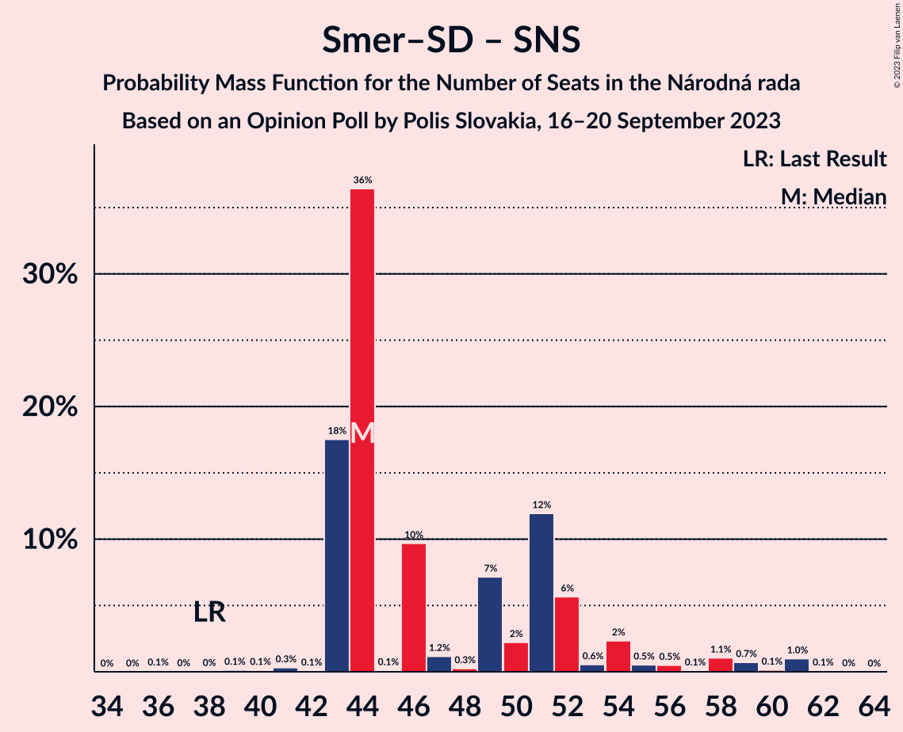

# Opinion Poll by Polis Slovakia, 16–20 September 2023

<a href="#voting-intentions">Voting Intentions</a> | <a href="#seats">Seats</a> | <a href="#coalitions">Coalitions</a> | <a href="#technical-information">Technical Information</a>

## Voting Intentions

### Confidence Intervals

| Party | Last Result | Poll Result | 80% Confidence Interval | 90% Confidence Interval | 95% Confidence Interval | 99% Confidence Interval |
|:-----:|:-----------:|:-----------:|:-----------------------:|:-----------------------:|:-----------------------:|:-----------------------:|
| SMER–sociálna demokracia | 18.3% | 24.4% | 22.8–26.1% |22.4–26.6% |22.0–27.0% |21.2–27.9% |
| Progresívne Slovensko | 7.0% | 15.1% | 13.8–16.6% |13.5–17.0% |13.1–17.4% |12.5–18.1% |
| HLAS–sociálna demokracia | 0.0% | 12.6% | 11.4–14.0% |11.1–14.4% |10.8–14.7% |10.2–15.4% |
| REPUBLIKA | 0.0% | 6.8% | 5.9–7.8% |5.6–8.1% |5.4–8.4% |5.0–8.9% |
| Sloboda a Solidarita | 6.2% | 6.4% | 5.5–7.4% |5.3–7.7% |5.1–8.0% |4.7–8.5% |
| Slovenská národná strana | 3.2% | 5.8% | 5.0–6.8% |4.7–7.1% |4.5–7.3% |4.2–7.8% |
| Kresťanskodemokratické hnutie | 4.6% | 5.7% | 4.9–6.7% |4.6–7.0% |4.5–7.2% |4.1–7.7% |
| OBYČAJNÍ ĽUDIA a nezávislé osobnosti–Kresťanská únia–Za ľudí | 0.0% | 5.7% | 4.9–6.7% |4.6–7.0% |4.5–7.2% |4.1–7.7% |
| Strana maďarskej koalície–Magyar Koalíció Pártja | 3.9% | 5.4% | 4.6–6.4% |4.4–6.7% |4.2–6.9% |3.9–7.4% |
| SME RODINA | 8.2% | 5.3% | 4.5–6.3% |4.3–6.6% |4.1–6.8% |3.8–7.3% |
| SPOLU–Občianska Demokracia | 7.0% | 2.0% | 1.5–2.6% |1.4–2.8% |1.3–3.0% |1.1–3.3% |
| Kotleba–Ľudová strana Naše Slovensko | 8.0% | 1.9% | 1.5–2.5% |1.3–2.7% |1.2–2.9% |1.1–3.2% |
| MODRÍ–Európske Slovensko–MOST–HÍD | 0.0% | 1.2% | 0.9–1.7% |0.8–1.9% |0.7–2.0% |0.5–2.3% |
| Magyar Fórum | 0.0% | 0.6% | 0.4–1.1% |0.4–1.2% |0.3–1.3% |0.2–1.5% |

*Note:* The poll result column reflects the actual value used in the calculations. Published results may vary slightly, and in addition be rounded to fewer digits.

## Seats

### Confidence Intervals

| Party | Last Result | Median | 80% Confidence Interval | 90% Confidence Interval | 95% Confidence Interval | 99% Confidence Interval |
|:-----:|:-----------:|:------:|:-----------------------:|:-----------------------:|:-----------------------:|:-----------------------:|
| <a href="#smer–sociálna-demokracia">SMER–sociálna demokracia</a> | 38 | 38 | 35–43 |35–45 |35–47 |35–49 |
| <a href="#progresívne-slovensko">Progresívne Slovensko</a> | 0 | 27 | 23–27 |23–30 |23–30 |22–31 |
| <a href="#hlas–sociálna-demokracia">HLAS–sociálna demokracia</a> | 0 | 21 | 21–24 |21–25 |19–25 |16–27 |
| <a href="#republika">REPUBLIKA</a> | 0 | 11 | 10–13 |10–14 |10–14 |9–17 |
| <a href="#sloboda-a-solidarita">Sloboda a Solidarita</a> | 13 | 11 | 10–14 |9–14 |9–14 |0–14 |
| <a href="#slovenská-národná-strana">Slovenská národná strana</a> | 0 | 9 | 0–11 |0–11 |0–12 |0–13 |
| <a href="#kresťanskodemokratické-hnutie">Kresťanskodemokratické hnutie</a> | 0 | 9 | 0–11 |0–11 |0–12 |0–13 |
| <a href="#obyčajní-ľudia-a-nezávislé-osobnosti–kresťanská-únia–za-ľudí">OBYČAJNÍ ĽUDIA a nezávislé osobnosti–Kresťanská únia–Za ľudí</a> | 0 | 9 | 8–12 |8–12 |0–12 |0–14 |
| <a href="#strana-maďarskej-koalície–magyar-koalíció-pártja">Strana maďarskej koalície–Magyar Koalíció Pártja</a> | 0 | 10 | 8–11 |0–11 |0–11 |0–12 |
| <a href="#sme-rodina">SME RODINA</a> | 17 | 9 | 0–10 |0–10 |0–11 |0–12 |
| <a href="#spolu–občianska-demokracia">SPOLU–Občianska Demokracia</a> | 0 | 0 | 0 |0 |0 |0 |
| <a href="#kotleba–ľudová-strana-naše-slovensko">Kotleba–Ľudová strana Naše Slovensko</a> | 17 | 0 | 0 |0 |0 |0 |
| <a href="#modrí–európske-slovensko–most–híd">MODRÍ–Európske Slovensko–MOST–HÍD</a> | 0 | 0 | 0 |0 |0 |0 |
| <a href="#magyar-fórum">Magyar Fórum</a> | 0 | 0 | 0 |0 |0 |0 |

### SMER–sociálna demokracia

*For a full overview of the results for this party, see the [SMER–sociálna demokracia](party-smer–sociálnademokracia.html) page.*

| Number of Seats | Probability | Accumulated | Special Marks |
|:---------------:|:-----------:|:-----------:|:-------------:|
| 33 | 0.2% | 100% |  |
| 34 | 0.2% | 99.8% |  |
| 35 | 36% | 99.6% |  |
| 36 | 0.1% | 64% |  |
| 37 | 1.4% | 64% |  |
| 38 | 15% | 62% | Last Result, Median |
| 39 | 2% | 47% |  |
| 40 | 0.6% | 45% |  |
| 41 | 7% | 44% |  |
| 42 | 10% | 37% |  |
| 43 | 19% | 27% |  |
| 44 | 3% | 8% |  |
| 45 | 0.6% | 5% |  |
| 46 | 0.9% | 4% |  |
| 47 | 1.3% | 4% |  |
| 48 | 2% | 2% |  |
| 49 | 0.2% | 0.5% |  |
| 50 | 0.1% | 0.3% |  |
| 51 | 0% | 0.2% |  |
| 52 | 0% | 0.2% |  |
| 53 | 0.2% | 0.2% |  |
| 54 | 0% | 0% |  |

### Progresívne Slovensko

*For a full overview of the results for this party, see the [Progresívne Slovensko](party-progresívneslovensko.html) page.*

| Number of Seats | Probability | Accumulated | Special Marks |
|:---------------:|:-----------:|:-----------:|:-------------:|
| 0 | 0% | 100% | Last Result |
| 1 | 0% | 100% |  |
| 2 | 0% | 100% |  |
| 3 | 0% | 100% |  |
| 4 | 0% | 100% |  |
| 5 | 0% | 100% |  |
| 6 | 0% | 100% |  |
| 7 | 0% | 100% |  |
| 8 | 0% | 100% |  |
| 9 | 0% | 100% |  |
| 10 | 0% | 100% |  |
| 11 | 0% | 100% |  |
| 12 | 0% | 100% |  |
| 13 | 0% | 100% |  |
| 14 | 0% | 100% |  |
| 15 | 0% | 100% |  |
| 16 | 0% | 100% |  |
| 17 | 0% | 100% |  |
| 18 | 0% | 100% |  |
| 19 | 0% | 100% |  |
| 20 | 0% | 100% |  |
| 21 | 0.4% | 100% |  |
| 22 | 0.6% | 99.6% |  |
| 23 | 11% | 99.0% |  |
| 24 | 1.2% | 88% |  |
| 25 | 19% | 87% |  |
| 26 | 5% | 68% |  |
| 27 | 55% | 63% | Median |
| 28 | 1.0% | 8% |  |
| 29 | 1.0% | 7% |  |
| 30 | 4% | 6% |  |
| 31 | 1.1% | 2% |  |
| 32 | 0.1% | 0.4% |  |
| 33 | 0.3% | 0.3% |  |
| 34 | 0.1% | 0.1% |  |
| 35 | 0% | 0% |  |

### HLAS–sociálna demokracia

*For a full overview of the results for this party, see the [HLAS–sociálna demokracia](party-hlas–sociálnademokracia.html) page.*

| Number of Seats | Probability | Accumulated | Special Marks |
|:---------------:|:-----------:|:-----------:|:-------------:|
| 0 | 0% | 100% | Last Result |
| 1 | 0% | 100% |  |
| 2 | 0% | 100% |  |
| 3 | 0% | 100% |  |
| 4 | 0% | 100% |  |
| 5 | 0% | 100% |  |
| 6 | 0% | 100% |  |
| 7 | 0% | 100% |  |
| 8 | 0% | 100% |  |
| 9 | 0% | 100% |  |
| 10 | 0% | 100% |  |
| 11 | 0% | 100% |  |
| 12 | 0% | 100% |  |
| 13 | 0% | 100% |  |
| 14 | 0% | 100% |  |
| 15 | 0.1% | 100% |  |
| 16 | 0.7% | 99.9% |  |
| 17 | 0.1% | 99.2% |  |
| 18 | 1.1% | 99.2% |  |
| 19 | 2% | 98% |  |
| 20 | 0.9% | 96% |  |
| 21 | 62% | 95% | Median |
| 22 | 2% | 34% |  |
| 23 | 15% | 31% |  |
| 24 | 9% | 17% |  |
| 25 | 6% | 7% |  |
| 26 | 0.5% | 1.3% |  |
| 27 | 0.3% | 0.7% |  |
| 28 | 0.4% | 0.4% |  |
| 29 | 0% | 0.1% |  |
| 30 | 0% | 0.1% |  |
| 31 | 0% | 0% |  |

### REPUBLIKA

*For a full overview of the results for this party, see the [REPUBLIKA](party-republika.html) page.*

| Number of Seats | Probability | Accumulated | Special Marks |
|:---------------:|:-----------:|:-----------:|:-------------:|
| 0 | 0.1% | 100% | Last Result |
| 1 | 0% | 99.9% |  |
| 2 | 0% | 99.9% |  |
| 3 | 0% | 99.9% |  |
| 4 | 0% | 99.9% |  |
| 5 | 0% | 99.9% |  |
| 6 | 0% | 99.9% |  |
| 7 | 0% | 99.9% |  |
| 8 | 0% | 99.9% |  |
| 9 | 2% | 99.9% |  |
| 10 | 47% | 98% |  |
| 11 | 9% | 51% | Median |
| 12 | 28% | 42% |  |
| 13 | 8% | 14% |  |
| 14 | 4% | 6% |  |
| 15 | 1.3% | 2% |  |
| 16 | 0.2% | 1.1% |  |
| 17 | 0.9% | 0.9% |  |
| 18 | 0% | 0% |  |

### Sloboda a Solidarita

*For a full overview of the results for this party, see the [Sloboda a Solidarita](party-slobodaasolidarita.html) page.*

| Number of Seats | Probability | Accumulated | Special Marks |
|:---------------:|:-----------:|:-----------:|:-------------:|
| 0 | 2% | 100% |  |
| 1 | 0% | 98% |  |
| 2 | 0% | 98% |  |
| 3 | 0% | 98% |  |
| 4 | 0% | 98% |  |
| 5 | 0% | 98% |  |
| 6 | 0% | 98% |  |
| 7 | 0% | 98% |  |
| 8 | 0% | 98% |  |
| 9 | 6% | 98% |  |
| 10 | 14% | 93% |  |
| 11 | 47% | 78% | Median |
| 12 | 5% | 32% |  |
| 13 | 1.0% | 27% | Last Result |
| 14 | 25% | 26% |  |
| 15 | 0.4% | 0.4% |  |
| 16 | 0% | 0% |  |

### Slovenská národná strana

*For a full overview of the results for this party, see the [Slovenská národná strana](party-slovenskánárodnástrana.html) page.*

| Number of Seats | Probability | Accumulated | Special Marks |
|:---------------:|:-----------:|:-----------:|:-------------:|
| 0 | 20% | 100% | Last Result |
| 1 | 0% | 80% |  |
| 2 | 0% | 80% |  |
| 3 | 0% | 80% |  |
| 4 | 0% | 80% |  |
| 5 | 0% | 80% |  |
| 6 | 0% | 80% |  |
| 7 | 0% | 80% |  |
| 8 | 8% | 80% |  |
| 9 | 45% | 71% | Median |
| 10 | 12% | 26% |  |
| 11 | 11% | 15% |  |
| 12 | 2% | 4% |  |
| 13 | 1.4% | 2% |  |
| 14 | 0.2% | 0.2% |  |
| 15 | 0% | 0% |  |

### Kresťanskodemokratické hnutie

*For a full overview of the results for this party, see the [Kresťanskodemokratické hnutie](party-kresťanskodemokratickéhnutie.html) page.*

| Number of Seats | Probability | Accumulated | Special Marks |
|:---------------:|:-----------:|:-----------:|:-------------:|
| 0 | 37% | 100% | Last Result |
| 1 | 0% | 63% |  |
| 2 | 0% | 63% |  |
| 3 | 0% | 63% |  |
| 4 | 0% | 63% |  |
| 5 | 0% | 63% |  |
| 6 | 0% | 63% |  |
| 7 | 0% | 63% |  |
| 8 | 0% | 63% |  |
| 9 | 40% | 63% | Median |
| 10 | 12% | 22% |  |
| 11 | 7% | 10% |  |
| 12 | 1.2% | 3% |  |
| 13 | 1.5% | 2% |  |
| 14 | 0.1% | 0.1% |  |
| 15 | 0% | 0% |  |

### OBYČAJNÍ ĽUDIA a nezávislé osobnosti–Kresťanská únia–Za ľudí

*For a full overview of the results for this party, see the [OBYČAJNÍ ĽUDIA a nezávislé osobnosti–Kresťanská únia–Za ľudí](party-obyčajníľudiaanezávisléosobnosti–kresťanskáúnia–zaľudí.html) page.*

| Number of Seats | Probability | Accumulated | Special Marks |
|:---------------:|:-----------:|:-----------:|:-------------:|
| 0 | 4% | 100% | Last Result |
| 1 | 0% | 96% |  |
| 2 | 0% | 96% |  |
| 3 | 0% | 96% |  |
| 4 | 0% | 96% |  |
| 5 | 0% | 96% |  |
| 6 | 0% | 96% |  |
| 7 | 0% | 96% |  |
| 8 | 8% | 96% |  |
| 9 | 42% | 88% | Median |
| 10 | 15% | 46% |  |
| 11 | 9% | 30% |  |
| 12 | 20% | 21% |  |
| 13 | 0.2% | 1.3% |  |
| 14 | 1.1% | 1.1% |  |
| 15 | 0% | 0% |  |

### Strana maďarskej koalície–Magyar Koalíció Pártja

*For a full overview of the results for this party, see the [Strana maďarskej koalície–Magyar Koalíció Pártja](party-stranamaďarskejkoalície–magyarkoalíciópártja.html) page.*

| Number of Seats | Probability | Accumulated | Special Marks |
|:---------------:|:-----------:|:-----------:|:-------------:|
| 0 | 9% | 100% | Last Result |
| 1 | 0% | 91% |  |
| 2 | 0% | 91% |  |
| 3 | 0% | 91% |  |
| 4 | 0% | 91% |  |
| 5 | 0% | 91% |  |
| 6 | 0% | 91% |  |
| 7 | 0% | 91% |  |
| 8 | 8% | 91% |  |
| 9 | 5% | 83% |  |
| 10 | 52% | 78% | Median |
| 11 | 24% | 26% |  |
| 12 | 2% | 2% |  |
| 13 | 0.3% | 0.4% |  |
| 14 | 0% | 0% |  |

### SME RODINA

*For a full overview of the results for this party, see the [SME RODINA](party-smerodina.html) page.*

| Number of Seats | Probability | Accumulated | Special Marks |
|:---------------:|:-----------:|:-----------:|:-------------:|
| 0 | 14% | 100% |  |
| 1 | 0% | 86% |  |
| 2 | 0% | 86% |  |
| 3 | 0% | 86% |  |
| 4 | 0% | 86% |  |
| 5 | 0% | 86% |  |
| 6 | 0% | 86% |  |
| 7 | 0% | 86% |  |
| 8 | 10% | 86% |  |
| 9 | 51% | 77% | Median |
| 10 | 23% | 26% |  |
| 11 | 2% | 3% |  |
| 12 | 0.6% | 0.9% |  |
| 13 | 0.3% | 0.4% |  |
| 14 | 0% | 0% |  |
| 15 | 0% | 0% |  |
| 16 | 0% | 0% |  |
| 17 | 0% | 0% | Last Result |

### SPOLU–Občianska Demokracia

*For a full overview of the results for this party, see the [SPOLU–Občianska Demokracia](party-spolu–občianskademokracia.html) page.*

| Number of Seats | Probability | Accumulated | Special Marks |
|:---------------:|:-----------:|:-----------:|:-------------:|
| 0 | 100% | 100% | Last Result, Median |

### Kotleba–Ľudová strana Naše Slovensko

*For a full overview of the results for this party, see the [Kotleba–Ľudová strana Naše Slovensko](party-kotleba–ľudovástrananašeslovensko.html) page.*

| Number of Seats | Probability | Accumulated | Special Marks |
|:---------------:|:-----------:|:-----------:|:-------------:|
| 0 | 100% | 100% | Median |
| 1 | 0% | 0% |  |
| 2 | 0% | 0% |  |
| 3 | 0% | 0% |  |
| 4 | 0% | 0% |  |
| 5 | 0% | 0% |  |
| 6 | 0% | 0% |  |
| 7 | 0% | 0% |  |
| 8 | 0% | 0% |  |
| 9 | 0% | 0% |  |
| 10 | 0% | 0% |  |
| 11 | 0% | 0% |  |
| 12 | 0% | 0% |  |
| 13 | 0% | 0% |  |
| 14 | 0% | 0% |  |
| 15 | 0% | 0% |  |
| 16 | 0% | 0% |  |
| 17 | 0% | 0% | Last Result |

### MODRÍ–Európske Slovensko–MOST–HÍD

*For a full overview of the results for this party, see the [MODRÍ–Európske Slovensko–MOST–HÍD](party-modrí–európskeslovensko–most–híd.html) page.*

| Number of Seats | Probability | Accumulated | Special Marks |
|:---------------:|:-----------:|:-----------:|:-------------:|
| 0 | 100% | 100% | Last Result, Median |

### Magyar Fórum

*For a full overview of the results for this party, see the [Magyar Fórum](party-magyarfórum.html) page.*

| Number of Seats | Probability | Accumulated | Special Marks |
|:---------------:|:-----------:|:-----------:|:-------------:|
| 0 | 100% | 100% | Last Result, Median |

## Coalitions

### Confidence Intervals

| Coalition | Last Result | Median | Majority? | 80% Confidence Interval | 90% Confidence Interval | 95% Confidence Interval | 99% Confidence Interval |
|:---------:|:-----------:|:------:|:---------:|:-----------------------:|:-----------------------:|:-----------------------:|:-----------------------:|
| SMER–sociálna demokracia – HLAS–sociálna demokracia – Slovenská národná strana – SME RODINA – Kotleba–Ľudová strana Naše Slovensko | 72 | 74 | 37% | 74–81 | 73–86 | 73–86 | 71–89 |
| SMER–sociálna demokracia – HLAS–sociálna demokracia – Slovenská národná strana – SME RODINA | 55 | 74 | 37% | 74–81 | 73–86 | 73–86 | 71–89 |
| SMER–sociálna demokracia – HLAS–sociálna demokracia – Slovenská národná strana | 38 | 65 | 11% | 64–76 | 64–77 | 64–80 | 63–86 |
| SMER–sociálna demokracia – HLAS–sociálna demokracia – SME RODINA | 55 | 69 | 7% | 65–74 | 64–77 | 62–77 | 60–81 |
| SMER–sociálna demokracia – Slovenská národná strana – SME RODINA – Kotleba–Ľudová strana Naše Slovensko | 72 | 53 | 0% | 52–60 | 52–61 | 50–62 | 49–68 |
| SMER–sociálna demokracia – Slovenská národná strana – SME RODINA | 55 | 53 | 0% | 52–60 | 52–61 | 50–62 | 49–68 |
| SMER–sociálna demokracia – Slovenská národná strana | 38 | 44 | 0% | 43–52 | 43–54 | 43–58 | 41–61 |
| SMER–sociálna demokracia – SME RODINA | 55 | 46 | 0% | 43–53 | 42–53 | 39–55 | 38–57 |
| SMER–sociálna demokracia | 38 | 38 | 0% | 35–43 | 35–45 | 35–47 | 35–49 |
| HLAS–sociálna demokracia – Slovenská národná strana – SME RODINA – Kotleba–Ľudová strana Naše Slovensko | 34 | 39 | 0% | 31–43 | 31–43 | 31–44 | 29–45 |
| HLAS–sociálna demokracia – Slovenská národná strana – SME RODINA | 17 | 39 | 0% | 31–43 | 31–43 | 31–44 | 29–45 |
| HLAS–sociálna demokracia – SME RODINA | 17 | 30 | 0% | 23–32 | 23–33 | 22–35 | 19–37 |
| HLAS–sociálna demokracia – Slovenská národná strana | 0 | 30 | 0% | 21–34 | 21–34 | 21–35 | 21–38 |

### SMER–sociálna demokracia – HLAS–sociálna demokracia – Slovenská národná strana – SME RODINA – Kotleba–Ľudová strana Naše Slovensko

| Number of Seats | Probability | Accumulated | Special Marks |
|:---------------:|:-----------:|:-----------:|:-------------:|
| 64 | 0% | 100% |  |
| 65 | 0% | 99.9% |  |
| 66 | 0% | 99.9% |  |
| 67 | 0% | 99.9% |  |
| 68 | 0% | 99.9% |  |
| 69 | 0.1% | 99.9% |  |
| 70 | 0.2% | 99.7% |  |
| 71 | 0.8% | 99.6% |  |
| 72 | 1.1% | 98.8% | Last Result |
| 73 | 4% | 98% |  |
| 74 | 53% | 94% |  |
| 75 | 4% | 41% |  |
| 76 | 0.8% | 37% | Majority |
| 77 | 3% | 36% | Median |
| 78 | 10% | 33% |  |
| 79 | 0.7% | 23% |  |
| 80 | 1.3% | 22% |  |
| 81 | 13% | 21% |  |
| 82 | 0.3% | 8% |  |
| 83 | 0.3% | 7% |  |
| 84 | 0.5% | 7% |  |
| 85 | 0.1% | 7% |  |
| 86 | 4% | 6% |  |
| 87 | 0.1% | 2% |  |
| 88 | 1.0% | 2% |  |
| 89 | 0.9% | 1.1% |  |
| 90 | 0% | 0.2% |  |
| 91 | 0% | 0.2% |  |
| 92 | 0% | 0.2% |  |
| 93 | 0% | 0.2% |  |
| 94 | 0% | 0.2% |  |
| 95 | 0.1% | 0.2% |  |
| 96 | 0% | 0.1% |  |
| 97 | 0% | 0.1% |  |
| 98 | 0% | 0.1% |  |
| 99 | 0% | 0.1% |  |
| 100 | 0% | 0.1% |  |
| 101 | 0% | 0.1% |  |
| 102 | 0% | 0.1% |  |
| 103 | 0% | 0.1% |  |
| 104 | 0% | 0% |  |

### SMER–sociálna demokracia – HLAS–sociálna demokracia – Slovenská národná strana – SME RODINA

| Number of Seats | Probability | Accumulated | Special Marks |
|:---------------:|:-----------:|:-----------:|:-------------:|
| 55 | 0% | 100% | Last Result |
| 56 | 0% | 100% |  |
| 57 | 0% | 100% |  |
| 58 | 0% | 100% |  |
| 59 | 0% | 100% |  |
| 60 | 0% | 100% |  |
| 61 | 0% | 100% |  |
| 62 | 0% | 100% |  |
| 63 | 0% | 100% |  |
| 64 | 0% | 100% |  |
| 65 | 0% | 99.9% |  |
| 66 | 0% | 99.9% |  |
| 67 | 0% | 99.9% |  |
| 68 | 0% | 99.9% |  |
| 69 | 0.1% | 99.9% |  |
| 70 | 0.2% | 99.7% |  |
| 71 | 0.8% | 99.6% |  |
| 72 | 1.1% | 98.8% |  |
| 73 | 4% | 98% |  |
| 74 | 53% | 94% |  |
| 75 | 4% | 41% |  |
| 76 | 0.8% | 37% | Majority |
| 77 | 3% | 36% | Median |
| 78 | 10% | 33% |  |
| 79 | 0.7% | 23% |  |
| 80 | 1.3% | 22% |  |
| 81 | 13% | 21% |  |
| 82 | 0.3% | 8% |  |
| 83 | 0.3% | 7% |  |
| 84 | 0.5% | 7% |  |
| 85 | 0.1% | 7% |  |
| 86 | 4% | 6% |  |
| 87 | 0.1% | 2% |  |
| 88 | 1.0% | 2% |  |
| 89 | 0.9% | 1.1% |  |
| 90 | 0% | 0.2% |  |
| 91 | 0% | 0.2% |  |
| 92 | 0% | 0.2% |  |
| 93 | 0% | 0.2% |  |
| 94 | 0% | 0.2% |  |
| 95 | 0.1% | 0.2% |  |
| 96 | 0% | 0.1% |  |
| 97 | 0% | 0.1% |  |
| 98 | 0% | 0.1% |  |
| 99 | 0% | 0.1% |  |
| 100 | 0% | 0.1% |  |
| 101 | 0% | 0.1% |  |
| 102 | 0% | 0.1% |  |
| 103 | 0% | 0.1% |  |
| 104 | 0% | 0% |  |

### SMER–sociálna demokracia – HLAS–sociálna demokracia – Slovenská národná strana

| Number of Seats | Probability | Accumulated | Special Marks |
|:---------------:|:-----------:|:-----------:|:-------------:|
| 38 | 0% | 100% | Last Result |
| 39 | 0% | 100% |  |
| 40 | 0% | 100% |  |
| 41 | 0% | 100% |  |
| 42 | 0% | 100% |  |
| 43 | 0% | 100% |  |
| 44 | 0% | 100% |  |
| 45 | 0% | 100% |  |
| 46 | 0% | 100% |  |
| 47 | 0% | 100% |  |
| 48 | 0% | 100% |  |
| 49 | 0% | 100% |  |
| 50 | 0% | 100% |  |
| 51 | 0% | 100% |  |
| 52 | 0% | 100% |  |
| 53 | 0% | 100% |  |
| 54 | 0% | 100% |  |
| 55 | 0% | 100% |  |
| 56 | 0% | 100% |  |
| 57 | 0% | 100% |  |
| 58 | 0% | 100% |  |
| 59 | 0.1% | 100% |  |
| 60 | 0.1% | 99.9% |  |
| 61 | 0% | 99.8% |  |
| 62 | 0.1% | 99.7% |  |
| 63 | 0.3% | 99.6% |  |
| 64 | 19% | 99.4% |  |
| 65 | 36% | 81% |  |
| 66 | 0.2% | 45% |  |
| 67 | 1.3% | 44% |  |
| 68 | 1.0% | 43% | Median |
| 69 | 0.2% | 42% |  |
| 70 | 9% | 42% |  |
| 71 | 0.8% | 33% |  |
| 72 | 13% | 32% |  |
| 73 | 4% | 19% |  |
| 74 | 0.1% | 15% |  |
| 75 | 4% | 15% |  |
| 76 | 4% | 11% | Majority |
| 77 | 3% | 8% |  |
| 78 | 0.7% | 5% |  |
| 79 | 1.1% | 4% |  |
| 80 | 1.2% | 3% |  |
| 81 | 0.1% | 2% |  |
| 82 | 0% | 2% |  |
| 83 | 0.1% | 2% |  |
| 84 | 0.4% | 1.5% |  |
| 85 | 0% | 1.1% |  |
| 86 | 1.0% | 1.1% |  |
| 87 | 0% | 0.1% |  |
| 88 | 0% | 0.1% |  |
| 89 | 0% | 0.1% |  |
| 90 | 0% | 0.1% |  |
| 91 | 0% | 0% |  |

### SMER–sociálna demokracia – HLAS–sociálna demokracia – SME RODINA

| Number of Seats | Probability | Accumulated | Special Marks |
|:---------------:|:-----------:|:-----------:|:-------------:|
| 55 | 0% | 100% | Last Result |
| 56 | 0% | 100% |  |
| 57 | 0% | 100% |  |
| 58 | 0% | 100% |  |
| 59 | 0.1% | 100% |  |
| 60 | 0.7% | 99.9% |  |
| 61 | 0.3% | 99.2% |  |
| 62 | 2% | 99.0% |  |
| 63 | 0.9% | 97% |  |
| 64 | 2% | 96% |  |
| 65 | 39% | 94% |  |
| 66 | 0.7% | 55% |  |
| 67 | 2% | 54% |  |
| 68 | 2% | 52% | Median |
| 69 | 2% | 51% |  |
| 70 | 15% | 49% |  |
| 71 | 6% | 34% |  |
| 72 | 2% | 28% |  |
| 73 | 2% | 27% |  |
| 74 | 18% | 25% |  |
| 75 | 0.5% | 7% |  |
| 76 | 0.2% | 7% | Majority |
| 77 | 4% | 7% |  |
| 78 | 0.2% | 2% |  |
| 79 | 0.5% | 2% |  |
| 80 | 1.1% | 2% |  |
| 81 | 0.3% | 0.5% |  |
| 82 | 0% | 0.3% |  |
| 83 | 0% | 0.3% |  |
| 84 | 0.1% | 0.3% |  |
| 85 | 0.1% | 0.2% |  |
| 86 | 0% | 0.1% |  |
| 87 | 0% | 0.1% |  |
| 88 | 0% | 0% |  |

### SMER–sociálna demokracia – Slovenská národná strana – SME RODINA – Kotleba–Ľudová strana Naše Slovensko

| Number of Seats | Probability | Accumulated | Special Marks |
|:---------------:|:-----------:|:-----------:|:-------------:|
| 42 | 0% | 100% |  |
| 43 | 0% | 99.9% |  |
| 44 | 0% | 99.9% |  |
| 45 | 0.1% | 99.9% |  |
| 46 | 0% | 99.8% |  |
| 47 | 0% | 99.8% |  |
| 48 | 0.1% | 99.8% |  |
| 49 | 0.8% | 99.7% |  |
| 50 | 2% | 98.9% |  |
| 51 | 1.2% | 97% |  |
| 52 | 5% | 95% |  |
| 53 | 53% | 90% |  |
| 54 | 11% | 36% |  |
| 55 | 0.5% | 25% |  |
| 56 | 0.8% | 25% | Median |
| 57 | 2% | 24% |  |
| 58 | 6% | 22% |  |
| 59 | 0.4% | 16% |  |
| 60 | 7% | 15% |  |
| 61 | 5% | 8% |  |
| 62 | 0.9% | 3% |  |
| 63 | 0.5% | 2% |  |
| 64 | 0.2% | 2% |  |
| 65 | 0.2% | 2% |  |
| 66 | 0% | 1.5% |  |
| 67 | 0.8% | 1.4% |  |
| 68 | 0.4% | 0.6% |  |
| 69 | 0% | 0.2% |  |
| 70 | 0.1% | 0.2% |  |
| 71 | 0% | 0.1% |  |
| 72 | 0% | 0.1% | Last Result |
| 73 | 0% | 0.1% |  |
| 74 | 0% | 0.1% |  |
| 75 | 0% | 0% |  |

### SMER–sociálna demokracia – Slovenská národná strana – SME RODINA

| Number of Seats | Probability | Accumulated | Special Marks |
|:---------------:|:-----------:|:-----------:|:-------------:|
| 42 | 0% | 100% |  |
| 43 | 0% | 99.9% |  |
| 44 | 0% | 99.9% |  |
| 45 | 0.1% | 99.9% |  |
| 46 | 0% | 99.8% |  |
| 47 | 0% | 99.8% |  |
| 48 | 0.1% | 99.8% |  |
| 49 | 0.8% | 99.7% |  |
| 50 | 2% | 98.9% |  |
| 51 | 1.2% | 97% |  |
| 52 | 5% | 95% |  |
| 53 | 53% | 90% |  |
| 54 | 11% | 36% |  |
| 55 | 0.5% | 25% | Last Result |
| 56 | 0.8% | 25% | Median |
| 57 | 2% | 24% |  |
| 58 | 6% | 22% |  |
| 59 | 0.4% | 16% |  |
| 60 | 7% | 15% |  |
| 61 | 5% | 8% |  |
| 62 | 0.9% | 3% |  |
| 63 | 0.5% | 2% |  |
| 64 | 0.2% | 2% |  |
| 65 | 0.2% | 2% |  |
| 66 | 0% | 1.5% |  |
| 67 | 0.8% | 1.4% |  |
| 68 | 0.4% | 0.6% |  |
| 69 | 0% | 0.2% |  |
| 70 | 0.1% | 0.2% |  |
| 71 | 0% | 0.1% |  |
| 72 | 0% | 0.1% |  |
| 73 | 0% | 0.1% |  |
| 74 | 0% | 0.1% |  |
| 75 | 0% | 0% |  |

### SMER–sociálna demokracia – Slovenská národná strana

| Number of Seats | Probability | Accumulated | Special Marks |
|:---------------:|:-----------:|:-----------:|:-------------:|
| 36 | 0.1% | 100% |  |
| 37 | 0% | 99.9% |  |
| 38 | 0% | 99.9% | Last Result |
| 39 | 0.1% | 99.8% |  |
| 40 | 0.1% | 99.7% |  |
| 41 | 0.3% | 99.6% |  |
| 42 | 0.1% | 99.3% |  |
| 43 | 18% | 99.2% |  |
| 44 | 36% | 82% |  |
| 45 | 0.1% | 45% |  |
| 46 | 10% | 45% |  |
| 47 | 1.2% | 35% | Median |
| 48 | 0.3% | 34% |  |
| 49 | 7% | 34% |  |
| 50 | 2% | 27% |  |
| 51 | 12% | 25% |  |
| 52 | 6% | 13% |  |
| 53 | 0.6% | 7% |  |
| 54 | 2% | 6% |  |
| 55 | 0.5% | 4% |  |
| 56 | 0.5% | 4% |  |
| 57 | 0.1% | 3% |  |
| 58 | 1.1% | 3% |  |
| 59 | 0.7% | 2% |  |
| 60 | 0.1% | 1.2% |  |
| 61 | 1.0% | 1.1% |  |
| 62 | 0.1% | 0.1% |  |
| 63 | 0% | 0% |  |

### SMER–sociálna demokracia – SME RODINA

| Number of Seats | Probability | Accumulated | Special Marks |
|:---------------:|:-----------:|:-----------:|:-------------:|
| 38 | 0.6% | 100% |  |
| 39 | 2% | 99.3% |  |
| 40 | 0.1% | 97% |  |
| 41 | 0.9% | 97% |  |
| 42 | 5% | 96% |  |
| 43 | 2% | 92% |  |
| 44 | 38% | 90% |  |
| 45 | 1.2% | 52% |  |
| 46 | 8% | 51% |  |
| 47 | 6% | 43% | Median |
| 48 | 2% | 37% |  |
| 49 | 0.8% | 34% |  |
| 50 | 7% | 34% |  |
| 51 | 1.3% | 27% |  |
| 52 | 3% | 26% |  |
| 53 | 19% | 22% |  |
| 54 | 0.7% | 4% |  |
| 55 | 0.9% | 3% | Last Result |
| 56 | 0.3% | 2% |  |
| 57 | 2% | 2% |  |
| 58 | 0% | 0.3% |  |
| 59 | 0.1% | 0.3% |  |
| 60 | 0% | 0.2% |  |
| 61 | 0.2% | 0.2% |  |
| 62 | 0% | 0% |  |

### SMER–sociálna demokracia

| Number of Seats | Probability | Accumulated | Special Marks |
|:---------------:|:-----------:|:-----------:|:-------------:|
| 33 | 0.2% | 100% |  |
| 34 | 0.2% | 99.8% |  |
| 35 | 36% | 99.6% |  |
| 36 | 0.1% | 64% |  |
| 37 | 1.4% | 64% |  |
| 38 | 15% | 62% | Last Result, Median |
| 39 | 2% | 47% |  |
| 40 | 0.6% | 45% |  |
| 41 | 7% | 44% |  |
| 42 | 10% | 37% |  |
| 43 | 19% | 27% |  |
| 44 | 3% | 8% |  |
| 45 | 0.6% | 5% |  |
| 46 | 0.9% | 4% |  |
| 47 | 1.3% | 4% |  |
| 48 | 2% | 2% |  |
| 49 | 0.2% | 0.5% |  |
| 50 | 0.1% | 0.3% |  |
| 51 | 0% | 0.2% |  |
| 52 | 0% | 0.2% |  |
| 53 | 0.2% | 0.2% |  |
| 54 | 0% | 0% |  |

### HLAS–sociálna demokracia – Slovenská národná strana – SME RODINA – Kotleba–Ľudová strana Naše Slovensko

| Number of Seats | Probability | Accumulated | Special Marks |
|:---------------:|:-----------:|:-----------:|:-------------:|
| 22 | 0% | 100% |  |
| 23 | 0.1% | 99.9% |  |
| 24 | 0% | 99.9% |  |
| 25 | 0% | 99.9% |  |
| 26 | 0.1% | 99.8% |  |
| 27 | 0.2% | 99.8% |  |
| 28 | 0% | 99.6% |  |
| 29 | 0.1% | 99.5% |  |
| 30 | 1.1% | 99.4% |  |
| 31 | 19% | 98% |  |
| 32 | 0.6% | 79% |  |
| 33 | 6% | 79% |  |
| 34 | 3% | 72% | Last Result |
| 35 | 2% | 69% |  |
| 36 | 0.8% | 67% |  |
| 37 | 0.7% | 66% |  |
| 38 | 1.1% | 65% |  |
| 39 | 37% | 64% | Median |
| 40 | 15% | 28% |  |
| 41 | 0.7% | 12% |  |
| 42 | 0.1% | 12% |  |
| 43 | 7% | 12% |  |
| 44 | 3% | 4% |  |
| 45 | 0.3% | 0.7% |  |
| 46 | 0.1% | 0.4% |  |
| 47 | 0% | 0.3% |  |
| 48 | 0.2% | 0.3% |  |
| 49 | 0% | 0.1% |  |
| 50 | 0% | 0.1% |  |
| 51 | 0% | 0.1% |  |
| 52 | 0% | 0.1% |  |
| 53 | 0% | 0.1% |  |
| 54 | 0% | 0.1% |  |
| 55 | 0% | 0.1% |  |
| 56 | 0.1% | 0.1% |  |
| 57 | 0% | 0% |  |

### HLAS–sociálna demokracia – Slovenská národná strana – SME RODINA

| Number of Seats | Probability | Accumulated | Special Marks |
|:---------------:|:-----------:|:-----------:|:-------------:|
| 17 | 0% | 100% | Last Result |
| 18 | 0% | 100% |  |
| 19 | 0% | 100% |  |
| 20 | 0% | 100% |  |
| 21 | 0% | 100% |  |
| 22 | 0% | 100% |  |
| 23 | 0.1% | 99.9% |  |
| 24 | 0% | 99.9% |  |
| 25 | 0% | 99.9% |  |
| 26 | 0.1% | 99.8% |  |
| 27 | 0.2% | 99.8% |  |
| 28 | 0% | 99.6% |  |
| 29 | 0.1% | 99.5% |  |
| 30 | 1.1% | 99.4% |  |
| 31 | 19% | 98% |  |
| 32 | 0.6% | 79% |  |
| 33 | 6% | 79% |  |
| 34 | 3% | 72% |  |
| 35 | 2% | 69% |  |
| 36 | 0.8% | 67% |  |
| 37 | 0.7% | 66% |  |
| 38 | 1.1% | 65% |  |
| 39 | 37% | 64% | Median |
| 40 | 15% | 28% |  |
| 41 | 0.7% | 12% |  |
| 42 | 0.1% | 12% |  |
| 43 | 7% | 12% |  |
| 44 | 3% | 4% |  |
| 45 | 0.3% | 0.7% |  |
| 46 | 0.1% | 0.4% |  |
| 47 | 0% | 0.3% |  |
| 48 | 0.2% | 0.3% |  |
| 49 | 0% | 0.1% |  |
| 50 | 0% | 0.1% |  |
| 51 | 0% | 0.1% |  |
| 52 | 0% | 0.1% |  |
| 53 | 0% | 0.1% |  |
| 54 | 0% | 0.1% |  |
| 55 | 0% | 0.1% |  |
| 56 | 0.1% | 0.1% |  |
| 57 | 0% | 0% |  |

### HLAS–sociálna demokracia – SME RODINA

| Number of Seats | Probability | Accumulated | Special Marks |
|:---------------:|:-----------:|:-----------:|:-------------:|
| 17 | 0% | 100% | Last Result |
| 18 | 0% | 100% |  |
| 19 | 1.0% | 100% |  |
| 20 | 0.1% | 99.0% |  |
| 21 | 0.6% | 98.8% |  |
| 22 | 1.1% | 98% |  |
| 23 | 7% | 97% |  |
| 24 | 0.6% | 90% |  |
| 25 | 2% | 89% |  |
| 26 | 1.3% | 87% |  |
| 27 | 1.3% | 86% |  |
| 28 | 0.7% | 84% |  |
| 29 | 0.7% | 84% |  |
| 30 | 43% | 83% | Median |
| 31 | 19% | 40% |  |
| 32 | 15% | 21% |  |
| 33 | 1.1% | 6% |  |
| 34 | 0.8% | 5% |  |
| 35 | 3% | 4% |  |
| 36 | 0.2% | 0.7% |  |
| 37 | 0.5% | 0.6% |  |
| 38 | 0% | 0.1% |  |
| 39 | 0% | 0.1% |  |
| 40 | 0% | 0.1% |  |
| 41 | 0% | 0% |  |

### HLAS–sociálna demokracia – Slovenská národná strana

| Number of Seats | Probability | Accumulated | Special Marks |
|:---------------:|:-----------:|:-----------:|:-------------:|
| 0 | 0% | 100% | Last Result |
| 1 | 0% | 100% |  |
| 2 | 0% | 100% |  |
| 3 | 0% | 100% |  |
| 4 | 0% | 100% |  |
| 5 | 0% | 100% |  |
| 6 | 0% | 100% |  |
| 7 | 0% | 100% |  |
| 8 | 0% | 100% |  |
| 9 | 0% | 100% |  |
| 10 | 0% | 100% |  |
| 11 | 0% | 100% |  |
| 12 | 0% | 100% |  |
| 13 | 0% | 100% |  |
| 14 | 0% | 100% |  |
| 15 | 0% | 100% |  |
| 16 | 0% | 100% |  |
| 17 | 0% | 100% |  |
| 18 | 0% | 100% |  |
| 19 | 0.2% | 100% |  |
| 20 | 0.1% | 99.8% |  |
| 21 | 18% | 99.7% |  |
| 22 | 0.1% | 82% |  |
| 23 | 1.3% | 82% |  |
| 24 | 0.5% | 80% |  |
| 25 | 0.7% | 80% |  |
| 26 | 0.1% | 79% |  |
| 27 | 1.5% | 79% |  |
| 28 | 0.3% | 78% |  |
| 29 | 0.2% | 77% |  |
| 30 | 38% | 77% | Median |
| 31 | 8% | 39% |  |
| 32 | 8% | 31% |  |
| 33 | 5% | 22% |  |
| 34 | 14% | 17% |  |
| 35 | 1.0% | 3% |  |
| 36 | 0.4% | 2% |  |
| 37 | 0.3% | 2% |  |
| 38 | 1.0% | 2% |  |
| 39 | 0% | 0.5% |  |
| 40 | 0.3% | 0.4% |  |
| 41 | 0% | 0.1% |  |
| 42 | 0% | 0.1% |  |
| 43 | 0% | 0% |  |

## Technical Information

### Opinion Poll

+ **Polling firm:** Polis Slovakia
+ **Commissioner(s):** —
+ **Fieldwork period:** 16–20 September 2023

### Calculations

+ **Sample size:** 1110
+ **Simulations done:** 1,048,576
+ **Error estimate:** 2.30%

