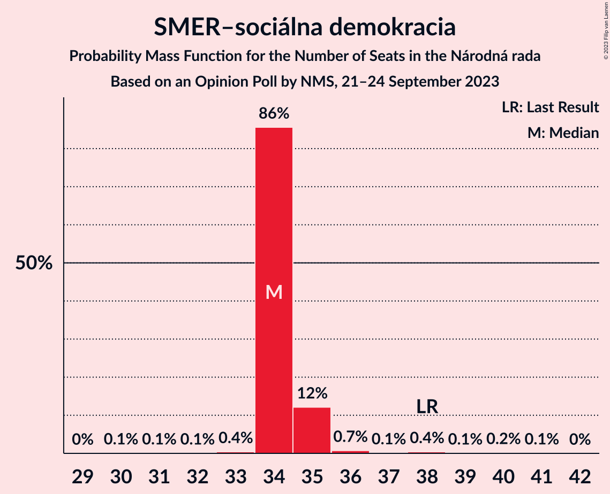
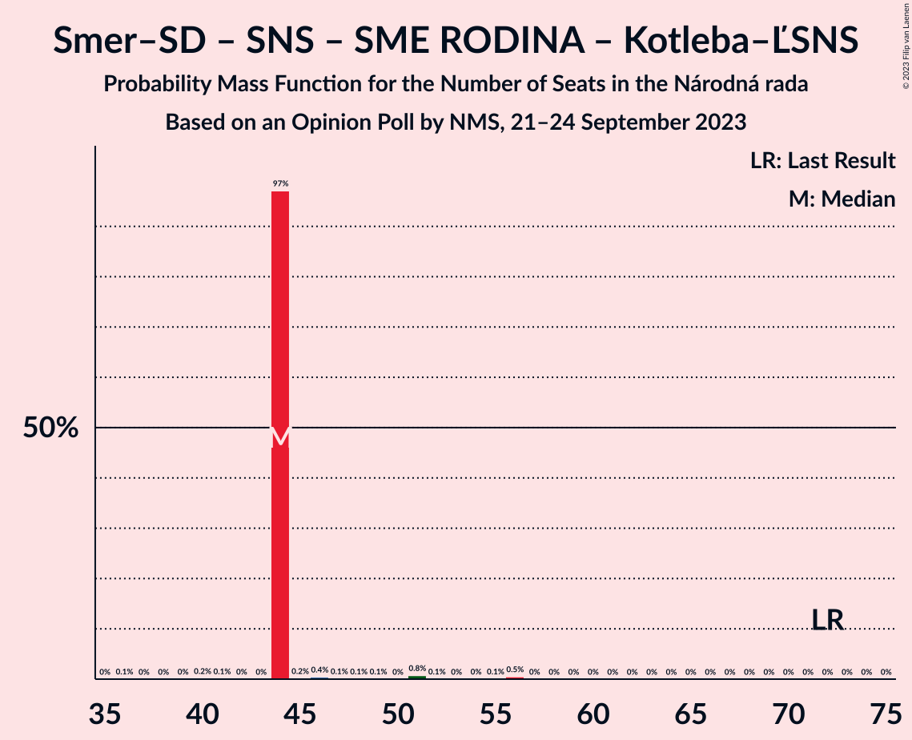
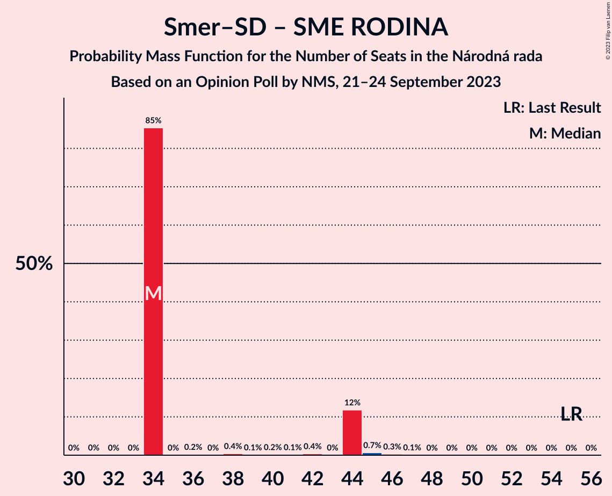

# Opinion Poll by NMS, 21–24 September 2023

<a href="#voting-intentions">Voting Intentions</a> | <a href="#seats">Seats</a> | <a href="#coalitions">Coalitions</a> | <a href="#technical-information">Technical Information</a>

## Voting Intentions

### Confidence Intervals

| Party | Last Result | Poll Result | 80% Confidence Interval | 90% Confidence Interval | 95% Confidence Interval | 99% Confidence Interval |
|:-----:|:-----------:|:-----------:|:-----------------------:|:-----------------------:|:-----------------------:|:-----------------------:|
| Progresívne Slovensko | 7.0% | 19.7% | 18.4–21.1% |18.0–21.5% |17.7–21.9% |17.1–22.6% |
| SMER–sociálna demokracia | 18.3% | 19.4% | 18.1–20.8% |17.7–21.2% |17.4–21.6% |16.8–22.3% |
| HLAS–sociálna demokracia | 0.0% | 10.5% | 9.5–11.6% |9.2–11.9% |9.0–12.2% |8.5–12.8% |
| OBYČAJNÍ ĽUDIA a nezávislé osobnosti–Kresťanská únia–Za ľudí | 0.0% | 9.5% | 8.6–10.6% |8.3–10.9% |8.1–11.1% |7.6–11.7% |
| REPUBLIKA | 0.0% | 8.5% | 7.6–9.5% |7.4–9.8% |7.1–10.1% |6.8–10.6% |
| Sloboda a Solidarita | 6.2% | 5.7% | 5.0–6.5% |4.7–6.8% |4.6–7.0% |4.3–7.5% |
| Kresťanskodemokratické hnutie | 4.6% | 5.4% | 4.7–6.2% |4.5–6.5% |4.3–6.7% |4.0–7.1% |
| Slovenská národná strana | 3.2% | 5.4% | 4.7–6.2% |4.5–6.5% |4.3–6.7% |4.0–7.1% |
| SME RODINA | 8.2% | 5.2% | 4.5–6.0% |4.3–6.2% |4.1–6.5% |3.8–6.9% |
| Strana maďarskej koalície–Magyar Koalíció Pártja | 3.9% | 3.1% | 2.6–3.8% |2.5–4.0% |2.3–4.2% |2.1–4.5% |
| SPOLU–Občianska Demokracia | 7.0% | 2.3% | 1.8–2.9% |1.7–3.0% |1.6–3.2% |1.4–3.5% |
| Kotleba–Ľudová strana Naše Slovensko | 8.0% | 1.8% | 1.4–2.3% |1.3–2.5% |1.2–2.6% |1.0–2.9% |
| MODRÍ–Európske Slovensko–MOST–HÍD | 0.0% | 1.1% | 0.8–1.6% |0.8–1.7% |0.7–1.8% |0.6–2.1% |
| Magyar Fórum | 0.0% | 0.3% | 0.2–0.6% |0.1–0.7% |0.1–0.7% |0.1–0.9% |

*Note:* The poll result column reflects the actual value used in the calculations. Published results may vary slightly, and in addition be rounded to fewer digits.

## Seats

### Confidence Intervals

| Party | Last Result | Median | 80% Confidence Interval | 90% Confidence Interval | 95% Confidence Interval | 99% Confidence Interval |
|:-----:|:-----------:|:------:|:-----------------------:|:-----------------------:|:-----------------------:|:-----------------------:|
| <a href="#progresívne-slovensko">Progresívne Slovensko</a> | 0 | 35 | 35–39 |35–39 |35–39 |33–39 |
| <a href="#smer–sociálna-demokracia">SMER–sociálna demokracia</a> | 38 | 34 | 34–35 |34–35 |34–35 |33–38 |
| <a href="#hlas–sociálna-demokracia">HLAS–sociálna demokracia</a> | 0 | 19 | 18–19 |18–19 |18–19 |15–21 |
| <a href="#obyčajní-ľudia-a-nezávislé-osobnosti–kresťanská-únia–za-ľudí">OBYČAJNÍ ĽUDIA a nezávislé osobnosti–Kresťanská únia–Za ľudí</a> | 0 | 17 | 14–17 |14–17 |14–17 |14–18 |
| <a href="#republika">REPUBLIKA</a> | 0 | 15 | 15 |15 |15 |14–18 |
| <a href="#sloboda-a-solidarita">Sloboda a Solidarita</a> | 13 | 11 | 10–11 |10–11 |10–11 |8–11 |
| <a href="#kresťanskodemokratické-hnutie">Kresťanskodemokratické hnutie</a> | 0 | 9 | 9–10 |9–10 |9–10 |0–11 |
| <a href="#slovenská-národná-strana">Slovenská národná strana</a> | 0 | 10 | 0–10 |0–10 |0–10 |0–11 |
| <a href="#sme-rodina">SME RODINA</a> | 17 | 0 | 0–9 |0–9 |0–9 |0–11 |
| <a href="#strana-maďarskej-koalície–magyar-koalíció-pártja">Strana maďarskej koalície–Magyar Koalíció Pártja</a> | 0 | 0 | 0 |0 |0 |0 |
| <a href="#spolu–občianska-demokracia">SPOLU–Občianska Demokracia</a> | 0 | 0 | 0 |0 |0 |0 |
| <a href="#kotleba–ľudová-strana-naše-slovensko">Kotleba–Ľudová strana Naše Slovensko</a> | 17 | 0 | 0 |0 |0 |0 |
| <a href="#modrí–európske-slovensko–most–híd">MODRÍ–Európske Slovensko–MOST–HÍD</a> | 0 | 0 | 0 |0 |0 |0 |
| <a href="#magyar-fórum">Magyar Fórum</a> | 0 | 0 | 0 |0 |0 |0 |

### Progresívne Slovensko

*For a full overview of the results for this party, see the [Progresívne Slovensko](party-progresívneslovensko.html) page.*

| Number of Seats | Probability | Accumulated | Special Marks |
|:---------------:|:-----------:|:-----------:|:-------------:|
| 0 | 0% | 100% | Last Result |
| 1 | 0% | 100% |  |
| 2 | 0% | 100% |  |
| 3 | 0% | 100% |  |
| 4 | 0% | 100% |  |
| 5 | 0% | 100% |  |
| 6 | 0% | 100% |  |
| 7 | 0% | 100% |  |
| 8 | 0% | 100% |  |
| 9 | 0% | 100% |  |
| 10 | 0% | 100% |  |
| 11 | 0% | 100% |  |
| 12 | 0% | 100% |  |
| 13 | 0% | 100% |  |
| 14 | 0% | 100% |  |
| 15 | 0% | 100% |  |
| 16 | 0% | 100% |  |
| 17 | 0% | 100% |  |
| 18 | 0% | 100% |  |
| 19 | 0% | 100% |  |
| 20 | 0% | 100% |  |
| 21 | 0% | 100% |  |
| 22 | 0% | 100% |  |
| 23 | 0% | 100% |  |
| 24 | 0% | 100% |  |
| 25 | 0% | 100% |  |
| 26 | 0% | 100% |  |
| 27 | 0% | 100% |  |
| 28 | 0% | 100% |  |
| 29 | 0% | 100% |  |
| 30 | 0% | 100% |  |
| 31 | 0.1% | 100% |  |
| 32 | 0.1% | 99.9% |  |
| 33 | 0.4% | 99.8% |  |
| 34 | 0.2% | 99.4% |  |
| 35 | 86% | 99.2% | Median |
| 36 | 0.4% | 14% |  |
| 37 | 0.9% | 13% |  |
| 38 | 0.1% | 12% |  |
| 39 | 12% | 12% |  |
| 40 | 0% | 0.4% |  |
| 41 | 0.3% | 0.3% |  |
| 42 | 0% | 0.1% |  |
| 43 | 0% | 0% |  |

### SMER–sociálna demokracia

*For a full overview of the results for this party, see the [SMER–sociálna demokracia](party-smer–sociálnademokracia.html) page.*

| Number of Seats | Probability | Accumulated | Special Marks |
|:---------------:|:-----------:|:-----------:|:-------------:|
| 30 | 0.1% | 100% |  |
| 31 | 0.1% | 99.9% |  |
| 32 | 0.1% | 99.8% |  |
| 33 | 0.4% | 99.7% |  |
| 34 | 86% | 99.3% | Median |
| 35 | 12% | 14% |  |
| 36 | 0.7% | 2% |  |
| 37 | 0.1% | 0.8% |  |
| 38 | 0.4% | 0.7% | Last Result |
| 39 | 0.1% | 0.3% |  |
| 40 | 0.2% | 0.3% |  |
| 41 | 0.1% | 0.1% |  |
| 42 | 0% | 0% |  |

### HLAS–sociálna demokracia

*For a full overview of the results for this party, see the [HLAS–sociálna demokracia](party-hlas–sociálnademokracia.html) page.*

| Number of Seats | Probability | Accumulated | Special Marks |
|:---------------:|:-----------:|:-----------:|:-------------:|
| 0 | 0% | 100% | Last Result |
| 1 | 0% | 100% |  |
| 2 | 0% | 100% |  |
| 3 | 0% | 100% |  |
| 4 | 0% | 100% |  |
| 5 | 0% | 100% |  |
| 6 | 0% | 100% |  |
| 7 | 0% | 100% |  |
| 8 | 0% | 100% |  |
| 9 | 0% | 100% |  |
| 10 | 0% | 100% |  |
| 11 | 0% | 100% |  |
| 12 | 0% | 100% |  |
| 13 | 0% | 100% |  |
| 14 | 0% | 100% |  |
| 15 | 0.9% | 100% |  |
| 16 | 0.1% | 99.1% |  |
| 17 | 0.2% | 99.0% |  |
| 18 | 12% | 98.8% |  |
| 19 | 86% | 87% | Median |
| 20 | 0.5% | 1.0% |  |
| 21 | 0.1% | 0.5% |  |
| 22 | 0.1% | 0.4% |  |
| 23 | 0.3% | 0.3% |  |
| 24 | 0% | 0% |  |

### OBYČAJNÍ ĽUDIA a nezávislé osobnosti–Kresťanská únia–Za ľudí

*For a full overview of the results for this party, see the [OBYČAJNÍ ĽUDIA a nezávislé osobnosti–Kresťanská únia–Za ľudí](party-obyčajníľudiaanezávisléosobnosti–kresťanskáúnia–zaľudí.html) page.*

| Number of Seats | Probability | Accumulated | Special Marks |
|:---------------:|:-----------:|:-----------:|:-------------:|
| 0 | 0% | 100% | Last Result |
| 1 | 0% | 100% |  |
| 2 | 0% | 100% |  |
| 3 | 0% | 100% |  |
| 4 | 0% | 100% |  |
| 5 | 0% | 100% |  |
| 6 | 0% | 100% |  |
| 7 | 0% | 100% |  |
| 8 | 0% | 100% |  |
| 9 | 0% | 100% |  |
| 10 | 0% | 100% |  |
| 11 | 0% | 100% |  |
| 12 | 0% | 100% |  |
| 13 | 0% | 100% |  |
| 14 | 12% | 100% |  |
| 15 | 0.2% | 88% |  |
| 16 | 0.3% | 88% |  |
| 17 | 86% | 87% | Median |
| 18 | 0.7% | 1.1% |  |
| 19 | 0.2% | 0.3% |  |
| 20 | 0.1% | 0.2% |  |
| 21 | 0.1% | 0.1% |  |
| 22 | 0% | 0% |  |

### REPUBLIKA

*For a full overview of the results for this party, see the [REPUBLIKA](party-republika.html) page.*

| Number of Seats | Probability | Accumulated | Special Marks |
|:---------------:|:-----------:|:-----------:|:-------------:|
| 0 | 0% | 100% | Last Result |
| 1 | 0% | 100% |  |
| 2 | 0% | 100% |  |
| 3 | 0% | 100% |  |
| 4 | 0% | 100% |  |
| 5 | 0% | 100% |  |
| 6 | 0% | 100% |  |
| 7 | 0% | 100% |  |
| 8 | 0% | 100% |  |
| 9 | 0% | 100% |  |
| 10 | 0% | 100% |  |
| 11 | 0% | 100% |  |
| 12 | 0.1% | 100% |  |
| 13 | 0.1% | 99.9% |  |
| 14 | 0.8% | 99.8% |  |
| 15 | 98% | 99.0% | Median |
| 16 | 0.4% | 1.4% |  |
| 17 | 0.1% | 1.0% |  |
| 18 | 0.6% | 0.9% |  |
| 19 | 0.3% | 0.3% |  |
| 20 | 0.1% | 0.1% |  |
| 21 | 0% | 0% |  |

### Sloboda a Solidarita

*For a full overview of the results for this party, see the [Sloboda a Solidarita](party-slobodaasolidarita.html) page.*

| Number of Seats | Probability | Accumulated | Special Marks |
|:---------------:|:-----------:|:-----------:|:-------------:|
| 0 | 0.4% | 100% |  |
| 1 | 0% | 99.6% |  |
| 2 | 0% | 99.6% |  |
| 3 | 0% | 99.6% |  |
| 4 | 0% | 99.6% |  |
| 5 | 0% | 99.6% |  |
| 6 | 0% | 99.6% |  |
| 7 | 0% | 99.6% |  |
| 8 | 0.4% | 99.6% |  |
| 9 | 0.6% | 99.2% |  |
| 10 | 13% | 98.7% |  |
| 11 | 86% | 86% | Median |
| 12 | 0.2% | 0.3% |  |
| 13 | 0.1% | 0.1% | Last Result |
| 14 | 0.1% | 0.1% |  |
| 15 | 0% | 0% |  |

### Kresťanskodemokratické hnutie

*For a full overview of the results for this party, see the [Kresťanskodemokratické hnutie](party-kresťanskodemokratickéhnutie.html) page.*

| Number of Seats | Probability | Accumulated | Special Marks |
|:---------------:|:-----------:|:-----------:|:-------------:|
| 0 | 1.4% | 100% | Last Result |
| 1 | 0% | 98.6% |  |
| 2 | 0% | 98.6% |  |
| 3 | 0% | 98.6% |  |
| 4 | 0% | 98.6% |  |
| 5 | 0% | 98.6% |  |
| 6 | 0% | 98.6% |  |
| 7 | 0% | 98.6% |  |
| 8 | 0% | 98.6% |  |
| 9 | 86% | 98.6% | Median |
| 10 | 12% | 13% |  |
| 11 | 0.6% | 0.8% |  |
| 12 | 0.1% | 0.2% |  |
| 13 | 0% | 0% |  |

### Slovenská národná strana

*For a full overview of the results for this party, see the [Slovenská národná strana](party-slovenskánárodnástrana.html) page.*

| Number of Seats | Probability | Accumulated | Special Marks |
|:---------------:|:-----------:|:-----------:|:-------------:|
| 0 | 13% | 100% | Last Result |
| 1 | 0% | 87% |  |
| 2 | 0% | 87% |  |
| 3 | 0% | 87% |  |
| 4 | 0% | 87% |  |
| 5 | 0% | 87% |  |
| 6 | 0% | 87% |  |
| 7 | 0% | 87% |  |
| 8 | 0% | 87% |  |
| 9 | 0.4% | 87% |  |
| 10 | 86% | 87% | Median |
| 11 | 0.7% | 1.2% |  |
| 12 | 0.1% | 0.5% |  |
| 13 | 0.4% | 0.4% |  |
| 14 | 0% | 0% |  |

### SME RODINA

*For a full overview of the results for this party, see the [SME RODINA](party-smerodina.html) page.*

| Number of Seats | Probability | Accumulated | Special Marks |
|:---------------:|:-----------:|:-----------:|:-------------:|
| 0 | 86% | 100% | Median |
| 1 | 0% | 14% |  |
| 2 | 0% | 14% |  |
| 3 | 0% | 14% |  |
| 4 | 0% | 14% |  |
| 5 | 0% | 14% |  |
| 6 | 0% | 14% |  |
| 7 | 0% | 14% |  |
| 8 | 0% | 14% |  |
| 9 | 13% | 14% |  |
| 10 | 0.2% | 0.8% |  |
| 11 | 0.5% | 0.6% |  |
| 12 | 0% | 0% |  |
| 13 | 0% | 0% |  |
| 14 | 0% | 0% |  |
| 15 | 0% | 0% |  |
| 16 | 0% | 0% |  |
| 17 | 0% | 0% | Last Result |

### Strana maďarskej koalície–Magyar Koalíció Pártja

*For a full overview of the results for this party, see the [Strana maďarskej koalície–Magyar Koalíció Pártja](party-stranamaďarskejkoalície–magyarkoalíciópártja.html) page.*

| Number of Seats | Probability | Accumulated | Special Marks |
|:---------------:|:-----------:|:-----------:|:-------------:|
| 0 | 100% | 100% | Last Result, Median |

### SPOLU–Občianska Demokracia

*For a full overview of the results for this party, see the [SPOLU–Občianska Demokracia](party-spolu–občianskademokracia.html) page.*

| Number of Seats | Probability | Accumulated | Special Marks |
|:---------------:|:-----------:|:-----------:|:-------------:|
| 0 | 100% | 100% | Last Result, Median |

### Kotleba–Ľudová strana Naše Slovensko

*For a full overview of the results for this party, see the [Kotleba–Ľudová strana Naše Slovensko](party-kotleba–ľudovástrananašeslovensko.html) page.*

| Number of Seats | Probability | Accumulated | Special Marks |
|:---------------:|:-----------:|:-----------:|:-------------:|
| 0 | 100% | 100% | Median |
| 1 | 0% | 0% |  |
| 2 | 0% | 0% |  |
| 3 | 0% | 0% |  |
| 4 | 0% | 0% |  |
| 5 | 0% | 0% |  |
| 6 | 0% | 0% |  |
| 7 | 0% | 0% |  |
| 8 | 0% | 0% |  |
| 9 | 0% | 0% |  |
| 10 | 0% | 0% |  |
| 11 | 0% | 0% |  |
| 12 | 0% | 0% |  |
| 13 | 0% | 0% |  |
| 14 | 0% | 0% |  |
| 15 | 0% | 0% |  |
| 16 | 0% | 0% |  |
| 17 | 0% | 0% | Last Result |

### MODRÍ–Európske Slovensko–MOST–HÍD

*For a full overview of the results for this party, see the [MODRÍ–Európske Slovensko–MOST–HÍD](party-modrí–európskeslovensko–most–híd.html) page.*

| Number of Seats | Probability | Accumulated | Special Marks |
|:---------------:|:-----------:|:-----------:|:-------------:|
| 0 | 100% | 100% | Last Result, Median |

### Magyar Fórum

*For a full overview of the results for this party, see the [Magyar Fórum](party-magyarfórum.html) page.*

| Number of Seats | Probability | Accumulated | Special Marks |
|:---------------:|:-----------:|:-----------:|:-------------:|
| 0 | 100% | 100% | Last Result, Median |

## Coalitions

### Confidence Intervals

| Coalition | Last Result | Median | Majority? | 80% Confidence Interval | 90% Confidence Interval | 95% Confidence Interval | 99% Confidence Interval |
|:---------:|:-----------:|:------:|:---------:|:-----------------------:|:-----------------------:|:-----------------------:|:-----------------------:|
| SMER–sociálna demokracia – HLAS–sociálna demokracia – Slovenská národná strana – SME RODINA – Kotleba–Ľudová strana Naše Slovensko | 72 | 63 | 0.1% | 62–63 | 62–63 | 62–63 | 62–71 |
| SMER–sociálna demokracia – HLAS–sociálna demokracia – Slovenská národná strana – SME RODINA | 55 | 63 | 0.1% | 62–63 | 62–63 | 62–63 | 62–71 |
| SMER–sociálna demokracia – HLAS–sociálna demokracia – Slovenská národná strana | 38 | 63 | 0% | 53–63 | 53–63 | 53–63 | 53–69 |
| SMER–sociálna demokracia – HLAS–sociálna demokracia – SME RODINA | 55 | 53 | 0% | 53–62 | 53–62 | 53–62 | 53–65 |
| SMER–sociálna demokracia – Slovenská národná strana – SME RODINA – Kotleba–Ľudová strana Naše Slovensko | 72 | 44 | 0% | 44 | 44 | 44 | 44–56 |
| SMER–sociálna demokracia – Slovenská národná strana – SME RODINA | 55 | 44 | 0% | 44 | 44 | 44 | 44–56 |
| SMER–sociálna demokracia – Slovenská národná strana | 38 | 44 | 0% | 35–44 | 35–44 | 35–44 | 35–47 |
| SMER–sociálna demokracia – SME RODINA | 55 | 34 | 0% | 34–44 | 34–44 | 34–44 | 34–45 |
| SMER–sociálna demokracia | 38 | 34 | 0% | 34–35 | 34–35 | 34–35 | 33–38 |
| HLAS–sociálna demokracia – Slovenská národná strana – SME RODINA – Kotleba–Ľudová strana Naše Slovensko | 34 | 29 | 0% | 27–29 | 27–29 | 27–29 | 27–35 |
| HLAS–sociálna demokracia – Slovenská národná strana – SME RODINA | 17 | 29 | 0% | 27–29 | 27–29 | 27–29 | 27–35 |
| HLAS–sociálna demokracia – Slovenská národná strana | 0 | 29 | 0% | 18–29 | 18–29 | 18–29 | 18–31 |
| HLAS–sociálna demokracia – SME RODINA | 17 | 19 | 0% | 19–27 | 19–27 | 19–27 | 19–31 |

### SMER–sociálna demokracia – HLAS–sociálna demokracia – Slovenská národná strana – SME RODINA – Kotleba–Ľudová strana Naše Slovensko

| Number of Seats | Probability | Accumulated | Special Marks |
|:---------------:|:-----------:|:-----------:|:-------------:|
| 58 | 0.1% | 100% |  |
| 59 | 0% | 99.9% |  |
| 60 | 0.1% | 99.9% |  |
| 61 | 0.1% | 99.8% |  |
| 62 | 12% | 99.7% |  |
| 63 | 86% | 88% | Median |
| 64 | 0.1% | 2% |  |
| 65 | 0.3% | 2% |  |
| 66 | 0.7% | 2% |  |
| 67 | 0% | 1.3% |  |
| 68 | 0% | 1.3% |  |
| 69 | 0.5% | 1.3% |  |
| 70 | 0.1% | 0.8% |  |
| 71 | 0.5% | 0.7% |  |
| 72 | 0% | 0.2% | Last Result |
| 73 | 0.1% | 0.2% |  |
| 74 | 0% | 0.1% |  |
| 75 | 0% | 0.1% |  |
| 76 | 0% | 0.1% | Majority |
| 77 | 0% | 0.1% |  |
| 78 | 0% | 0.1% |  |
| 79 | 0% | 0% |  |

### SMER–sociálna demokracia – HLAS–sociálna demokracia – Slovenská národná strana – SME RODINA

| Number of Seats | Probability | Accumulated | Special Marks |
|:---------------:|:-----------:|:-----------:|:-------------:|
| 55 | 0% | 100% | Last Result |
| 56 | 0% | 100% |  |
| 57 | 0% | 100% |  |
| 58 | 0.1% | 100% |  |
| 59 | 0% | 99.9% |  |
| 60 | 0.1% | 99.9% |  |
| 61 | 0.1% | 99.8% |  |
| 62 | 12% | 99.7% |  |
| 63 | 86% | 88% | Median |
| 64 | 0.1% | 2% |  |
| 65 | 0.3% | 2% |  |
| 66 | 0.7% | 2% |  |
| 67 | 0% | 1.3% |  |
| 68 | 0% | 1.3% |  |
| 69 | 0.5% | 1.3% |  |
| 70 | 0.1% | 0.8% |  |
| 71 | 0.5% | 0.7% |  |
| 72 | 0% | 0.2% |  |
| 73 | 0.1% | 0.2% |  |
| 74 | 0% | 0.1% |  |
| 75 | 0% | 0.1% |  |
| 76 | 0% | 0.1% | Majority |
| 77 | 0% | 0.1% |  |
| 78 | 0% | 0.1% |  |
| 79 | 0% | 0% |  |

### SMER–sociálna demokracia – HLAS–sociálna demokracia – Slovenská národná strana

| Number of Seats | Probability | Accumulated | Special Marks |
|:---------------:|:-----------:|:-----------:|:-------------:|
| 38 | 0% | 100% | Last Result |
| 39 | 0% | 100% |  |
| 40 | 0% | 100% |  |
| 41 | 0% | 100% |  |
| 42 | 0% | 100% |  |
| 43 | 0% | 100% |  |
| 44 | 0% | 100% |  |
| 45 | 0% | 100% |  |
| 46 | 0% | 100% |  |
| 47 | 0% | 100% |  |
| 48 | 0% | 100% |  |
| 49 | 0% | 100% |  |
| 50 | 0% | 100% |  |
| 51 | 0% | 100% |  |
| 52 | 0% | 100% |  |
| 53 | 12% | 99.9% |  |
| 54 | 0.3% | 88% |  |
| 55 | 0.3% | 88% |  |
| 56 | 0% | 88% |  |
| 57 | 0.4% | 88% |  |
| 58 | 0.1% | 87% |  |
| 59 | 0.1% | 87% |  |
| 60 | 0.1% | 87% |  |
| 61 | 0.1% | 87% |  |
| 62 | 0.5% | 87% |  |
| 63 | 86% | 86% | Median |
| 64 | 0% | 0.8% |  |
| 65 | 0.1% | 0.8% |  |
| 66 | 0% | 0.6% |  |
| 67 | 0.1% | 0.6% |  |
| 68 | 0% | 0.5% |  |
| 69 | 0.5% | 0.5% |  |
| 70 | 0% | 0% |  |

### SMER–sociálna demokracia – HLAS–sociálna demokracia – SME RODINA

| Number of Seats | Probability | Accumulated | Special Marks |
|:---------------:|:-----------:|:-----------:|:-------------:|
| 51 | 0% | 100% |  |
| 52 | 0% | 99.9% |  |
| 53 | 85% | 99.9% | Median |
| 54 | 0.1% | 14% |  |
| 55 | 0.1% | 14% | Last Result |
| 56 | 0.4% | 14% |  |
| 57 | 0.4% | 14% |  |
| 58 | 0.1% | 14% |  |
| 59 | 0.2% | 13% |  |
| 60 | 0.6% | 13% |  |
| 61 | 0.1% | 13% |  |
| 62 | 12% | 13% |  |
| 63 | 0.2% | 0.8% |  |
| 64 | 0.1% | 0.6% |  |
| 65 | 0.2% | 0.5% |  |
| 66 | 0.3% | 0.4% |  |
| 67 | 0% | 0.1% |  |
| 68 | 0% | 0.1% |  |
| 69 | 0% | 0% |  |

### SMER–sociálna demokracia – Slovenská národná strana – SME RODINA – Kotleba–Ľudová strana Naše Slovensko

| Number of Seats | Probability | Accumulated | Special Marks |
|:---------------:|:-----------:|:-----------:|:-------------:|
| 36 | 0.1% | 100% |  |
| 37 | 0% | 99.9% |  |
| 38 | 0% | 99.9% |  |
| 39 | 0% | 99.9% |  |
| 40 | 0.2% | 99.9% |  |
| 41 | 0.1% | 99.7% |  |
| 42 | 0% | 99.6% |  |
| 43 | 0% | 99.6% |  |
| 44 | 97% | 99.5% | Median |
| 45 | 0.2% | 2% |  |
| 46 | 0.4% | 2% |  |
| 47 | 0.1% | 2% |  |
| 48 | 0.1% | 2% |  |
| 49 | 0.1% | 2% |  |
| 50 | 0% | 2% |  |
| 51 | 0.8% | 2% |  |
| 52 | 0.1% | 0.8% |  |
| 53 | 0% | 0.7% |  |
| 54 | 0% | 0.7% |  |
| 55 | 0.1% | 0.7% |  |
| 56 | 0.5% | 0.6% |  |
| 57 | 0% | 0.1% |  |
| 58 | 0% | 0% |  |
| 59 | 0% | 0% |  |
| 60 | 0% | 0% |  |
| 61 | 0% | 0% |  |
| 62 | 0% | 0% |  |
| 63 | 0% | 0% |  |
| 64 | 0% | 0% |  |
| 65 | 0% | 0% |  |
| 66 | 0% | 0% |  |
| 67 | 0% | 0% |  |
| 68 | 0% | 0% |  |
| 69 | 0% | 0% |  |
| 70 | 0% | 0% |  |
| 71 | 0% | 0% |  |
| 72 | 0% | 0% | Last Result |

### SMER–sociálna demokracia – Slovenská národná strana – SME RODINA

| Number of Seats | Probability | Accumulated | Special Marks |
|:---------------:|:-----------:|:-----------:|:-------------:|
| 36 | 0.1% | 100% |  |
| 37 | 0% | 99.9% |  |
| 38 | 0% | 99.9% |  |
| 39 | 0% | 99.9% |  |
| 40 | 0.2% | 99.9% |  |
| 41 | 0.1% | 99.7% |  |
| 42 | 0% | 99.6% |  |
| 43 | 0% | 99.6% |  |
| 44 | 97% | 99.5% | Median |
| 45 | 0.2% | 2% |  |
| 46 | 0.4% | 2% |  |
| 47 | 0.1% | 2% |  |
| 48 | 0.1% | 2% |  |
| 49 | 0.1% | 2% |  |
| 50 | 0% | 2% |  |
| 51 | 0.8% | 2% |  |
| 52 | 0.1% | 0.8% |  |
| 53 | 0% | 0.7% |  |
| 54 | 0% | 0.7% |  |
| 55 | 0.1% | 0.7% | Last Result |
| 56 | 0.5% | 0.6% |  |
| 57 | 0% | 0.1% |  |
| 58 | 0% | 0% |  |

### SMER–sociálna demokracia – Slovenská národná strana

| Number of Seats | Probability | Accumulated | Special Marks |
|:---------------:|:-----------:|:-----------:|:-------------:|
| 34 | 0.2% | 100% |  |
| 35 | 12% | 99.8% |  |
| 36 | 0.1% | 88% |  |
| 37 | 0.1% | 88% |  |
| 38 | 0% | 88% | Last Result |
| 39 | 0% | 88% |  |
| 40 | 0.2% | 88% |  |
| 41 | 0.1% | 87% |  |
| 42 | 0.4% | 87% |  |
| 43 | 0% | 87% |  |
| 44 | 85% | 87% | Median |
| 45 | 0.1% | 1.3% |  |
| 46 | 0.2% | 1.3% |  |
| 47 | 0.5% | 1.0% |  |
| 48 | 0% | 0.5% |  |
| 49 | 0% | 0.4% |  |
| 50 | 0% | 0.4% |  |
| 51 | 0.4% | 0.4% |  |
| 52 | 0% | 0% |  |

### SMER–sociálna demokracia – SME RODINA

| Number of Seats | Probability | Accumulated | Special Marks |
|:---------------:|:-----------:|:-----------:|:-------------:|
| 31 | 0% | 100% |  |
| 32 | 0% | 99.9% |  |
| 33 | 0% | 99.9% |  |
| 34 | 85% | 99.9% | Median |
| 35 | 0% | 15% |  |
| 36 | 0.2% | 14% |  |
| 37 | 0% | 14% |  |
| 38 | 0.4% | 14% |  |
| 39 | 0.1% | 14% |  |
| 40 | 0.2% | 14% |  |
| 41 | 0.1% | 14% |  |
| 42 | 0.4% | 13% |  |
| 43 | 0% | 13% |  |
| 44 | 12% | 13% |  |
| 45 | 0.7% | 1.1% |  |
| 46 | 0.3% | 0.5% |  |
| 47 | 0.1% | 0.1% |  |
| 48 | 0% | 0% |  |
| 49 | 0% | 0% |  |
| 50 | 0% | 0% |  |
| 51 | 0% | 0% |  |
| 52 | 0% | 0% |  |
| 53 | 0% | 0% |  |
| 54 | 0% | 0% |  |
| 55 | 0% | 0% | Last Result |

### SMER–sociálna demokracia

| Number of Seats | Probability | Accumulated | Special Marks |
|:---------------:|:-----------:|:-----------:|:-------------:|
| 30 | 0.1% | 100% |  |
| 31 | 0.1% | 99.9% |  |
| 32 | 0.1% | 99.8% |  |
| 33 | 0.4% | 99.7% |  |
| 34 | 86% | 99.3% | Median |
| 35 | 12% | 14% |  |
| 36 | 0.7% | 2% |  |
| 37 | 0.1% | 0.8% |  |
| 38 | 0.4% | 0.7% | Last Result |
| 39 | 0.1% | 0.3% |  |
| 40 | 0.2% | 0.3% |  |
| 41 | 0.1% | 0.1% |  |
| 42 | 0% | 0% |  |

### HLAS–sociálna demokracia – Slovenská národná strana – SME RODINA – Kotleba–Ľudová strana Naše Slovensko

| Number of Seats | Probability | Accumulated | Special Marks |
|:---------------:|:-----------:|:-----------:|:-------------:|
| 19 | 0.1% | 100% |  |
| 20 | 0% | 99.9% |  |
| 21 | 0% | 99.9% |  |
| 22 | 0.1% | 99.9% |  |
| 23 | 0.1% | 99.8% |  |
| 24 | 0% | 99.7% |  |
| 25 | 0% | 99.6% |  |
| 26 | 0% | 99.6% |  |
| 27 | 12% | 99.6% |  |
| 28 | 0.1% | 88% |  |
| 29 | 85% | 88% | Median |
| 30 | 0% | 2% |  |
| 31 | 0.9% | 2% |  |
| 32 | 0% | 1.4% |  |
| 33 | 0.5% | 1.3% |  |
| 34 | 0% | 0.9% | Last Result |
| 35 | 0.5% | 0.8% |  |
| 36 | 0% | 0.3% |  |
| 37 | 0.1% | 0.3% |  |
| 38 | 0.1% | 0.2% |  |
| 39 | 0% | 0.2% |  |
| 40 | 0% | 0.1% |  |
| 41 | 0% | 0.1% |  |
| 42 | 0% | 0.1% |  |
| 43 | 0% | 0% |  |

### HLAS–sociálna demokracia – Slovenská národná strana – SME RODINA

| Number of Seats | Probability | Accumulated | Special Marks |
|:---------------:|:-----------:|:-----------:|:-------------:|
| 17 | 0% | 100% | Last Result |
| 18 | 0% | 100% |  |
| 19 | 0.1% | 100% |  |
| 20 | 0% | 99.9% |  |
| 21 | 0% | 99.9% |  |
| 22 | 0.1% | 99.9% |  |
| 23 | 0.1% | 99.8% |  |
| 24 | 0% | 99.7% |  |
| 25 | 0% | 99.6% |  |
| 26 | 0% | 99.6% |  |
| 27 | 12% | 99.6% |  |
| 28 | 0.1% | 88% |  |
| 29 | 85% | 88% | Median |
| 30 | 0% | 2% |  |
| 31 | 0.9% | 2% |  |
| 32 | 0% | 1.4% |  |
| 33 | 0.5% | 1.3% |  |
| 34 | 0% | 0.9% |  |
| 35 | 0.5% | 0.8% |  |
| 36 | 0% | 0.3% |  |
| 37 | 0.1% | 0.3% |  |
| 38 | 0.1% | 0.2% |  |
| 39 | 0% | 0.2% |  |
| 40 | 0% | 0.1% |  |
| 41 | 0% | 0.1% |  |
| 42 | 0% | 0.1% |  |
| 43 | 0% | 0% |  |

### HLAS–sociálna demokracia – Slovenská národná strana

| Number of Seats | Probability | Accumulated | Special Marks |
|:---------------:|:-----------:|:-----------:|:-------------:|
| 0 | 0% | 100% | Last Result |
| 1 | 0% | 100% |  |
| 2 | 0% | 100% |  |
| 3 | 0% | 100% |  |
| 4 | 0% | 100% |  |
| 5 | 0% | 100% |  |
| 6 | 0% | 100% |  |
| 7 | 0% | 100% |  |
| 8 | 0% | 100% |  |
| 9 | 0% | 100% |  |
| 10 | 0% | 100% |  |
| 11 | 0% | 100% |  |
| 12 | 0% | 100% |  |
| 13 | 0% | 100% |  |
| 14 | 0% | 100% |  |
| 15 | 0% | 100% |  |
| 16 | 0% | 100% |  |
| 17 | 0.1% | 100% |  |
| 18 | 12% | 99.9% |  |
| 19 | 0.1% | 88% |  |
| 20 | 0.4% | 88% |  |
| 21 | 0% | 88% |  |
| 22 | 0.1% | 88% |  |
| 23 | 0.1% | 87% |  |
| 24 | 0.4% | 87% |  |
| 25 | 0% | 87% |  |
| 26 | 0.6% | 87% |  |
| 27 | 0.1% | 86% |  |
| 28 | 0.1% | 86% |  |
| 29 | 85% | 86% | Median |
| 30 | 0% | 0.7% |  |
| 31 | 0.5% | 0.7% |  |
| 32 | 0% | 0.2% |  |
| 33 | 0.2% | 0.2% |  |
| 34 | 0% | 0% |  |

### HLAS–sociálna demokracia – SME RODINA

| Number of Seats | Probability | Accumulated | Special Marks |
|:---------------:|:-----------:|:-----------:|:-------------:|
| 17 | 0% | 100% | Last Result |
| 18 | 0.4% | 99.9% |  |
| 19 | 85% | 99.5% | Median |
| 20 | 0% | 14% |  |
| 21 | 0.1% | 14% |  |
| 22 | 0.1% | 14% |  |
| 23 | 0.3% | 14% |  |
| 24 | 0.9% | 14% |  |
| 25 | 0% | 13% |  |
| 26 | 0.1% | 13% |  |
| 27 | 12% | 13% |  |
| 28 | 0.1% | 0.7% |  |
| 29 | 0.1% | 0.6% |  |
| 30 | 0% | 0.5% |  |
| 31 | 0.4% | 0.5% |  |
| 32 | 0% | 0.1% |  |
| 33 | 0% | 0.1% |  |
| 34 | 0% | 0% |  |

## Technical Information

### Opinion Poll

+ **Polling firm:** NMS
+ **Commissioner(s):** —
+ **Fieldwork period:** 21–24 September 2023

### Calculations

+ **Sample size:** 1411
+ **Simulations done:** 1,048,576
+ **Error estimate:** 2.74%

