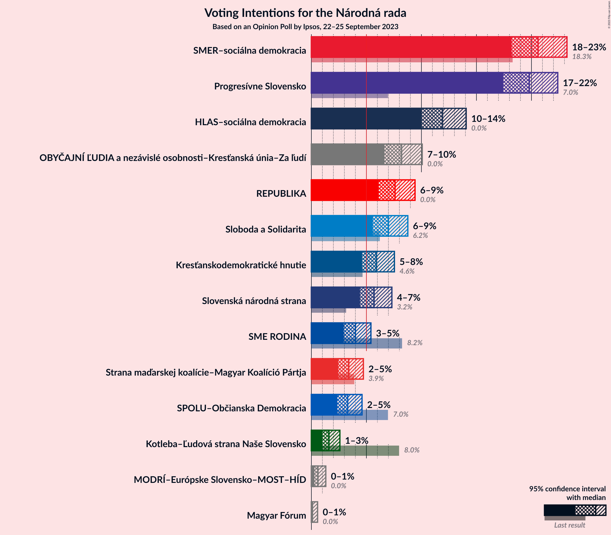
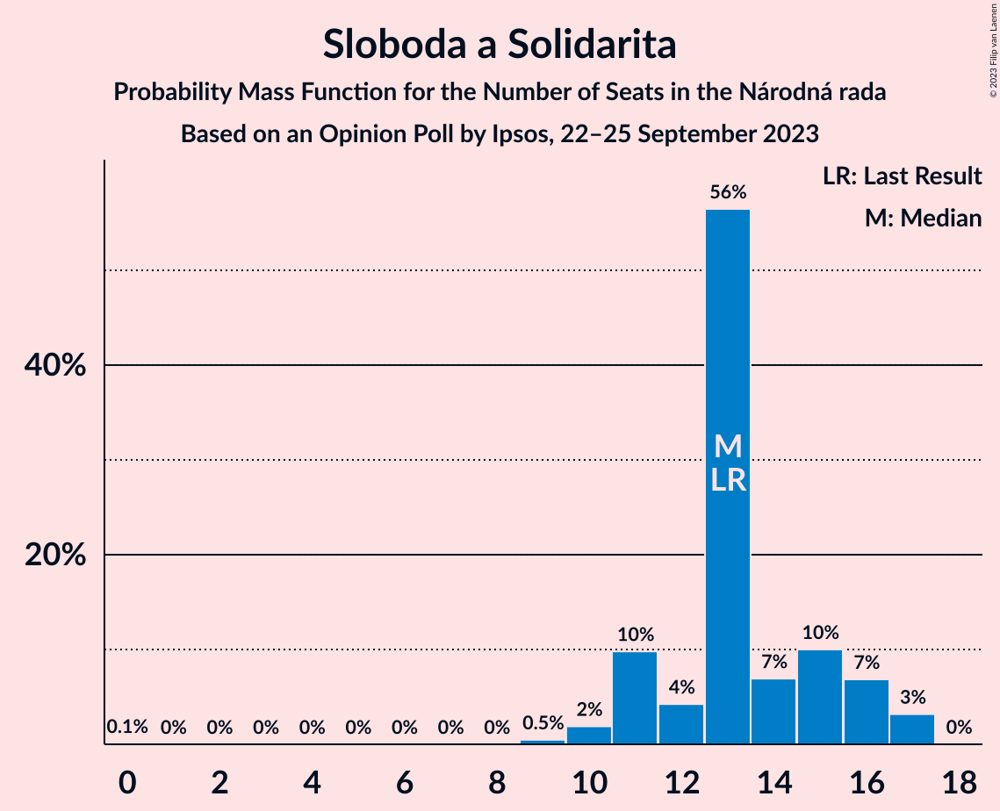

# Opinion Poll by Ipsos, 22–25 September 2023

<a href="#voting-intentions">Voting Intentions</a> | <a href="#seats">Seats</a> | <a href="#coalitions">Coalitions</a> | <a href="#technical-information">Technical Information</a>

## Voting Intentions

### Confidence Intervals

| Party | Last Result | Poll Result | 80% Confidence Interval | 90% Confidence Interval | 95% Confidence Interval | 99% Confidence Interval |
|:-----:|:-----------:|:-----------:|:-----------------------:|:-----------------------:|:-----------------------:|:-----------------------:|
| SMER–sociálna demokracia | 18.3% | 20.6% | 19.0–22.3% |18.6–22.8% |18.2–23.2% |17.5–24.1% |
| Progresívne Slovensko | 7.0% | 19.8% | 18.2–21.5% |17.8–22.0% |17.4–22.4% |16.7–23.2% |
| HLAS–sociálna demokracia | 0.0% | 11.9% | 10.7–13.3% |10.3–13.7% |10.0–14.1% |9.5–14.8% |
| OBYČAJNÍ ĽUDIA a nezávislé osobnosti–Kresťanská únia–Za ľudí | 0.0% | 8.2% | 7.2–9.4% |6.9–9.8% |6.6–10.1% |6.2–10.7% |
| REPUBLIKA | 0.0% | 7.6% | 6.6–8.8% |6.3–9.1% |6.1–9.4% |5.7–10.0% |
| Sloboda a Solidarita | 6.2% | 7.0% | 6.1–8.2% |5.8–8.5% |5.6–8.8% |5.2–9.3% |
| Kresťanskodemokratické hnutie | 4.6% | 5.9% | 5.0–7.0% |4.8–7.3% |4.6–7.5% |4.2–8.1% |
| Slovenská národná strana | 3.2% | 5.7% | 4.9–6.8% |4.6–7.1% |4.4–7.3% |4.1–7.9% |
| SME RODINA | 8.2% | 4.0% | 3.3–4.9% |3.1–5.2% |2.9–5.4% |2.7–5.9% |
| Strana maďarskej koalície–Magyar Koalíció Pártja | 3.9% | 3.4% | 2.8–4.3% |2.6–4.5% |2.4–4.7% |2.2–5.2% |
| SPOLU–Občianska Demokracia | 7.0% | 3.3% | 2.7–4.1% |2.5–4.4% |2.4–4.6% |2.1–5.0% |
| Kotleba–Ľudová strana Naše Slovensko | 8.0% | 1.6% | 1.2–2.2% |1.1–2.4% |1.0–2.6% |0.8–2.9% |
| MODRÍ–Európske Slovensko–MOST–HÍD | 0.0% | 0.6% | 0.4–1.1% |0.3–1.2% |0.3–1.3% |0.2–1.6% |
| Magyar Fórum | 0.0% | 0.1% | 0.0–0.4% |0.0–0.5% |0.0–0.6% |0.0–0.7% |

*Note:* The poll result column reflects the actual value used in the calculations. Published results may vary slightly, and in addition be rounded to fewer digits.

## Seats

### Confidence Intervals

| Party | Last Result | Median | 80% Confidence Interval | 90% Confidence Interval | 95% Confidence Interval | 99% Confidence Interval |
|:-----:|:-----------:|:------:|:-----------------------:|:-----------------------:|:-----------------------:|:-----------------------:|
| <a href="#smer–sociálna-demokracia">SMER–sociálna demokracia</a> | 38 | 35 | 34–38 |32–39 |32–41 |31–42 |
| <a href="#progresívne-slovensko">Progresívne Slovensko</a> | 0 | 34 | 31–36 |31–39 |29–40 |29–42 |
| <a href="#hlas–sociálna-demokracia">HLAS–sociálna demokracia</a> | 0 | 22 | 20–25 |19–25 |19–25 |17–26 |
| <a href="#obyčajní-ľudia-a-nezávislé-osobnosti–kresťanská-únia–za-ľudí">OBYČAJNÍ ĽUDIA a nezávislé osobnosti–Kresťanská únia–Za ľudí</a> | 0 | 11 | 11–15 |11–17 |11–17 |10–18 |
| <a href="#republika">REPUBLIKA</a> | 0 | 14 | 12–17 |12–17 |11–17 |0–17 |
| <a href="#sloboda-a-solidarita">Sloboda a Solidarita</a> | 13 | 13 | 11–16 |11–16 |11–17 |9–17 |
| <a href="#kresťanskodemokratické-hnutie">Kresťanskodemokratické hnutie</a> | 0 | 12 | 9–13 |9–14 |0–14 |0–14 |
| <a href="#slovenská-národná-strana">Slovenská národná strana</a> | 0 | 0 | 0–10 |0–11 |0–12 |0–14 |
| <a href="#sme-rodina">SME RODINA</a> | 17 | 9 | 0–9 |0–9 |0–9 |0–9 |
| <a href="#strana-maďarskej-koalície–magyar-koalíció-pártja">Strana maďarskej koalície–Magyar Koalíció Pártja</a> | 0 | 0 | 0 |0 |0–9 |0–9 |
| <a href="#spolu–občianska-demokracia">SPOLU–Občianska Demokracia</a> | 0 | 0 | 0 |0 |0 |0 |
| <a href="#kotleba–ľudová-strana-naše-slovensko">Kotleba–Ľudová strana Naše Slovensko</a> | 17 | 0 | 0 |0 |0 |0 |
| <a href="#modrí–európske-slovensko–most–híd">MODRÍ–Európske Slovensko–MOST–HÍD</a> | 0 | 0 | 0 |0 |0 |0 |
| <a href="#magyar-fórum">Magyar Fórum</a> | 0 | 0 | 0 |0 |0 |0 |

### SMER–sociálna demokracia

*For a full overview of the results for this party, see the [SMER–sociálna demokracia](party-smer–sociálnademokracia.html) page.*

| Number of Seats | Probability | Accumulated | Special Marks |
|:---------------:|:-----------:|:-----------:|:-------------:|
| 27 | 0.1% | 100% |  |
| 28 | 0% | 99.9% |  |
| 29 | 0.2% | 99.9% |  |
| 30 | 0.2% | 99.7% |  |
| 31 | 0.4% | 99.5% |  |
| 32 | 6% | 99.1% |  |
| 33 | 0.6% | 93% |  |
| 34 | 9% | 93% |  |
| 35 | 62% | 84% | Median |
| 36 | 2% | 22% |  |
| 37 | 7% | 20% |  |
| 38 | 7% | 13% | Last Result |
| 39 | 1.0% | 6% |  |
| 40 | 2% | 5% |  |
| 41 | 1.3% | 3% |  |
| 42 | 2% | 2% |  |
| 43 | 0.1% | 0.2% |  |
| 44 | 0% | 0.1% |  |
| 45 | 0% | 0% |  |

### Progresívne Slovensko

*For a full overview of the results for this party, see the [Progresívne Slovensko](party-progresívneslovensko.html) page.*

| Number of Seats | Probability | Accumulated | Special Marks |
|:---------------:|:-----------:|:-----------:|:-------------:|
| 0 | 0% | 100% | Last Result |
| 1 | 0% | 100% |  |
| 2 | 0% | 100% |  |
| 3 | 0% | 100% |  |
| 4 | 0% | 100% |  |
| 5 | 0% | 100% |  |
| 6 | 0% | 100% |  |
| 7 | 0% | 100% |  |
| 8 | 0% | 100% |  |
| 9 | 0% | 100% |  |
| 10 | 0% | 100% |  |
| 11 | 0% | 100% |  |
| 12 | 0% | 100% |  |
| 13 | 0% | 100% |  |
| 14 | 0% | 100% |  |
| 15 | 0% | 100% |  |
| 16 | 0% | 100% |  |
| 17 | 0% | 100% |  |
| 18 | 0% | 100% |  |
| 19 | 0% | 100% |  |
| 20 | 0% | 100% |  |
| 21 | 0% | 100% |  |
| 22 | 0% | 100% |  |
| 23 | 0% | 100% |  |
| 24 | 0% | 100% |  |
| 25 | 0% | 100% |  |
| 26 | 0% | 100% |  |
| 27 | 0.2% | 100% |  |
| 28 | 0.3% | 99.8% |  |
| 29 | 2% | 99.5% |  |
| 30 | 0.4% | 97% |  |
| 31 | 8% | 97% |  |
| 32 | 3% | 90% |  |
| 33 | 0.9% | 87% |  |
| 34 | 51% | 86% | Median |
| 35 | 14% | 35% |  |
| 36 | 12% | 21% |  |
| 37 | 3% | 9% |  |
| 38 | 0.3% | 6% |  |
| 39 | 2% | 5% |  |
| 40 | 2% | 4% |  |
| 41 | 0.5% | 2% |  |
| 42 | 1.3% | 1.3% |  |
| 43 | 0% | 0% |  |

### HLAS–sociálna demokracia

*For a full overview of the results for this party, see the [HLAS–sociálna demokracia](party-hlas–sociálnademokracia.html) page.*

| Number of Seats | Probability | Accumulated | Special Marks |
|:---------------:|:-----------:|:-----------:|:-------------:|
| 0 | 0% | 100% | Last Result |
| 1 | 0% | 100% |  |
| 2 | 0% | 100% |  |
| 3 | 0% | 100% |  |
| 4 | 0% | 100% |  |
| 5 | 0% | 100% |  |
| 6 | 0% | 100% |  |
| 7 | 0% | 100% |  |
| 8 | 0% | 100% |  |
| 9 | 0% | 100% |  |
| 10 | 0% | 100% |  |
| 11 | 0% | 100% |  |
| 12 | 0% | 100% |  |
| 13 | 0% | 100% |  |
| 14 | 0% | 100% |  |
| 15 | 0% | 100% |  |
| 16 | 0.4% | 100% |  |
| 17 | 0.5% | 99.6% |  |
| 18 | 1.2% | 99.2% |  |
| 19 | 3% | 98% |  |
| 20 | 26% | 95% |  |
| 21 | 2% | 69% |  |
| 22 | 52% | 66% | Median |
| 23 | 1.2% | 14% |  |
| 24 | 0.5% | 13% |  |
| 25 | 10% | 12% |  |
| 26 | 2% | 2% |  |
| 27 | 0.1% | 0.2% |  |
| 28 | 0.1% | 0.1% |  |
| 29 | 0% | 0% |  |

### OBYČAJNÍ ĽUDIA a nezávislé osobnosti–Kresťanská únia–Za ľudí

*For a full overview of the results for this party, see the [OBYČAJNÍ ĽUDIA a nezávislé osobnosti–Kresťanská únia–Za ľudí](party-obyčajníľudiaanezávisléosobnosti–kresťanskáúnia–zaľudí.html) page.*

| Number of Seats | Probability | Accumulated | Special Marks |
|:---------------:|:-----------:|:-----------:|:-------------:|
| 0 | 0% | 100% | Last Result |
| 1 | 0% | 100% |  |
| 2 | 0% | 100% |  |
| 3 | 0% | 100% |  |
| 4 | 0% | 100% |  |
| 5 | 0% | 100% |  |
| 6 | 0% | 100% |  |
| 7 | 0% | 100% |  |
| 8 | 0% | 100% |  |
| 9 | 0% | 100% |  |
| 10 | 2% | 100% |  |
| 11 | 52% | 98% | Median |
| 12 | 3% | 46% |  |
| 13 | 20% | 42% |  |
| 14 | 9% | 23% |  |
| 15 | 5% | 14% |  |
| 16 | 0.6% | 8% |  |
| 17 | 6% | 8% |  |
| 18 | 1.3% | 1.5% |  |
| 19 | 0.2% | 0.2% |  |
| 20 | 0.1% | 0.1% |  |
| 21 | 0% | 0% |  |

### REPUBLIKA

*For a full overview of the results for this party, see the [REPUBLIKA](party-republika.html) page.*

| Number of Seats | Probability | Accumulated | Special Marks |
|:---------------:|:-----------:|:-----------:|:-------------:|
| 0 | 1.0% | 100% | Last Result |
| 1 | 0% | 99.0% |  |
| 2 | 0% | 99.0% |  |
| 3 | 0% | 99.0% |  |
| 4 | 0% | 99.0% |  |
| 5 | 0% | 99.0% |  |
| 6 | 0% | 99.0% |  |
| 7 | 0% | 99.0% |  |
| 8 | 0% | 99.0% |  |
| 9 | 0.2% | 99.0% |  |
| 10 | 0.9% | 98.9% |  |
| 11 | 1.3% | 98% |  |
| 12 | 14% | 97% |  |
| 13 | 15% | 83% |  |
| 14 | 52% | 67% | Median |
| 15 | 3% | 15% |  |
| 16 | 2% | 12% |  |
| 17 | 10% | 10% |  |
| 18 | 0.1% | 0.3% |  |
| 19 | 0.2% | 0.2% |  |
| 20 | 0% | 0% |  |

### Sloboda a Solidarita

*For a full overview of the results for this party, see the [Sloboda a Solidarita](party-slobodaasolidarita.html) page.*

| Number of Seats | Probability | Accumulated | Special Marks |
|:---------------:|:-----------:|:-----------:|:-------------:|
| 0 | 0.1% | 100% |  |
| 1 | 0% | 99.9% |  |
| 2 | 0% | 99.9% |  |
| 3 | 0% | 99.9% |  |
| 4 | 0% | 99.9% |  |
| 5 | 0% | 99.9% |  |
| 6 | 0% | 99.9% |  |
| 7 | 0% | 99.9% |  |
| 8 | 0% | 99.9% |  |
| 9 | 0.5% | 99.9% |  |
| 10 | 2% | 99.4% |  |
| 11 | 10% | 98% |  |
| 12 | 4% | 88% |  |
| 13 | 56% | 83% | Last Result, Median |
| 14 | 7% | 27% |  |
| 15 | 10% | 20% |  |
| 16 | 7% | 10% |  |
| 17 | 3% | 3% |  |
| 18 | 0% | 0% |  |

### Kresťanskodemokratické hnutie

*For a full overview of the results for this party, see the [Kresťanskodemokratické hnutie](party-kresťanskodemokratickéhnutie.html) page.*

| Number of Seats | Probability | Accumulated | Special Marks |
|:---------------:|:-----------:|:-----------:|:-------------:|
| 0 | 3% | 100% | Last Result |
| 1 | 0% | 97% |  |
| 2 | 0% | 97% |  |
| 3 | 0% | 97% |  |
| 4 | 0% | 97% |  |
| 5 | 0% | 97% |  |
| 6 | 0% | 97% |  |
| 7 | 0% | 97% |  |
| 8 | 0% | 97% |  |
| 9 | 8% | 96% |  |
| 10 | 20% | 89% |  |
| 11 | 4% | 68% |  |
| 12 | 53% | 64% | Median |
| 13 | 3% | 11% |  |
| 14 | 8% | 8% |  |
| 15 | 0.1% | 0.1% |  |
| 16 | 0% | 0% |  |

### Slovenská národná strana

*For a full overview of the results for this party, see the [Slovenská národná strana](party-slovenskánárodnástrana.html) page.*

| Number of Seats | Probability | Accumulated | Special Marks |
|:---------------:|:-----------:|:-----------:|:-------------:|
| 0 | 70% | 100% | Last Result, Median |
| 1 | 0% | 30% |  |
| 2 | 0% | 30% |  |
| 3 | 0% | 30% |  |
| 4 | 0% | 30% |  |
| 5 | 0% | 30% |  |
| 6 | 0% | 30% |  |
| 7 | 0% | 30% |  |
| 8 | 0.1% | 30% |  |
| 9 | 9% | 29% |  |
| 10 | 13% | 21% |  |
| 11 | 4% | 7% |  |
| 12 | 1.5% | 3% |  |
| 13 | 0.9% | 2% |  |
| 14 | 0.6% | 0.8% |  |
| 15 | 0.1% | 0.1% |  |
| 16 | 0% | 0% |  |

### SME RODINA

*For a full overview of the results for this party, see the [SME RODINA](party-smerodina.html) page.*

| Number of Seats | Probability | Accumulated | Special Marks |
|:---------------:|:-----------:|:-----------:|:-------------:|
| 0 | 48% | 100% |  |
| 1 | 0% | 52% |  |
| 2 | 0% | 52% |  |
| 3 | 0% | 52% |  |
| 4 | 0% | 52% |  |
| 5 | 0% | 52% |  |
| 6 | 0% | 52% |  |
| 7 | 0% | 52% |  |
| 8 | 0.6% | 52% |  |
| 9 | 51% | 51% | Median |
| 10 | 0.2% | 0.3% |  |
| 11 | 0% | 0.1% |  |
| 12 | 0.1% | 0.1% |  |
| 13 | 0% | 0% |  |
| 14 | 0% | 0% |  |
| 15 | 0% | 0% |  |
| 16 | 0% | 0% |  |
| 17 | 0% | 0% | Last Result |

### Strana maďarskej koalície–Magyar Koalíció Pártja

*For a full overview of the results for this party, see the [Strana maďarskej koalície–Magyar Koalíció Pártja](party-stranamaďarskejkoalície–magyarkoalíciópártja.html) page.*

| Number of Seats | Probability | Accumulated | Special Marks |
|:---------------:|:-----------:|:-----------:|:-------------:|
| 0 | 96% | 100% | Last Result, Median |
| 1 | 0% | 4% |  |
| 2 | 0% | 4% |  |
| 3 | 0% | 4% |  |
| 4 | 0% | 4% |  |
| 5 | 0% | 4% |  |
| 6 | 0% | 4% |  |
| 7 | 0% | 4% |  |
| 8 | 0% | 4% |  |
| 9 | 4% | 4% |  |
| 10 | 0% | 0% |  |

### SPOLU–Občianska Demokracia

*For a full overview of the results for this party, see the [SPOLU–Občianska Demokracia](party-spolu–občianskademokracia.html) page.*

| Number of Seats | Probability | Accumulated | Special Marks |
|:---------------:|:-----------:|:-----------:|:-------------:|
| 0 | 99.7% | 100% | Last Result, Median |
| 1 | 0% | 0.3% |  |
| 2 | 0% | 0.3% |  |
| 3 | 0% | 0.3% |  |
| 4 | 0% | 0.3% |  |
| 5 | 0% | 0.3% |  |
| 6 | 0% | 0.3% |  |
| 7 | 0% | 0.3% |  |
| 8 | 0% | 0.3% |  |
| 9 | 0.3% | 0.3% |  |
| 10 | 0% | 0% |  |

### Kotleba–Ľudová strana Naše Slovensko

*For a full overview of the results for this party, see the [Kotleba–Ľudová strana Naše Slovensko](party-kotleba–ľudovástrananašeslovensko.html) page.*

| Number of Seats | Probability | Accumulated | Special Marks |
|:---------------:|:-----------:|:-----------:|:-------------:|
| 0 | 100% | 100% | Median |
| 1 | 0% | 0% |  |
| 2 | 0% | 0% |  |
| 3 | 0% | 0% |  |
| 4 | 0% | 0% |  |
| 5 | 0% | 0% |  |
| 6 | 0% | 0% |  |
| 7 | 0% | 0% |  |
| 8 | 0% | 0% |  |
| 9 | 0% | 0% |  |
| 10 | 0% | 0% |  |
| 11 | 0% | 0% |  |
| 12 | 0% | 0% |  |
| 13 | 0% | 0% |  |
| 14 | 0% | 0% |  |
| 15 | 0% | 0% |  |
| 16 | 0% | 0% |  |
| 17 | 0% | 0% | Last Result |

### MODRÍ–Európske Slovensko–MOST–HÍD

*For a full overview of the results for this party, see the [MODRÍ–Európske Slovensko–MOST–HÍD](party-modrí–európskeslovensko–most–híd.html) page.*

| Number of Seats | Probability | Accumulated | Special Marks |
|:---------------:|:-----------:|:-----------:|:-------------:|
| 0 | 100% | 100% | Last Result, Median |

### Magyar Fórum

*For a full overview of the results for this party, see the [Magyar Fórum](party-magyarfórum.html) page.*

| Number of Seats | Probability | Accumulated | Special Marks |
|:---------------:|:-----------:|:-----------:|:-------------:|
| 0 | 100% | 100% | Last Result, Median |

## Coalitions

### Confidence Intervals

| Coalition | Last Result | Median | Majority? | 80% Confidence Interval | 90% Confidence Interval | 95% Confidence Interval | 99% Confidence Interval |
|:---------:|:-----------:|:------:|:---------:|:-----------------------:|:-----------------------:|:-----------------------:|:-----------------------:|
| SMER–sociálna demokracia – HLAS–sociálna demokracia – Slovenská národná strana – SME RODINA – Kotleba–Ľudová strana Naše Slovensko | 72 | 66 | 0.9% | 60–67 | 52–69 | 52–72 | 52–76 |
| SMER–sociálna demokracia – HLAS–sociálna demokracia – Slovenská národná strana – SME RODINA | 55 | 66 | 0.9% | 60–67 | 52–69 | 52–72 | 52–76 |
| SMER–sociálna demokracia – HLAS–sociálna demokracia – Slovenská národná strana | 38 | 57 | 0.8% | 57–67 | 52–67 | 52–71 | 52–76 |
| SMER–sociálna demokracia – HLAS–sociálna demokracia – SME RODINA | 55 | 66 | 0% | 54–66 | 52–66 | 52–66 | 51–66 |
| SMER–sociálna demokracia – Slovenská národná strana – SME RODINA – Kotleba–Ľudová strana Naše Slovensko | 72 | 44 | 0% | 35–47 | 32–48 | 32–51 | 32–54 |
| SMER–sociálna demokracia – Slovenská národná strana – SME RODINA | 55 | 44 | 0% | 35–47 | 32–48 | 32–51 | 32–54 |
| SMER–sociálna demokracia – Slovenská národná strana | 38 | 35 | 0% | 35–47 | 32–48 | 32–51 | 32–53 |
| SMER–sociálna demokracia – SME RODINA | 55 | 44 | 0% | 34–44 | 32–44 | 32–44 | 31–44 |
| SMER–sociálna demokracia | 38 | 35 | 0% | 34–38 | 32–39 | 32–41 | 31–42 |
| HLAS–sociálna demokracia – Slovenská národná strana – SME RODINA – Kotleba–Ľudová strana Naše Slovensko | 34 | 31 | 0% | 25–31 | 20–32 | 20–35 | 20–40 |
| HLAS–sociálna demokracia – Slovenská národná strana – SME RODINA | 17 | 31 | 0% | 25–31 | 20–32 | 20–35 | 20–40 |
| HLAS–sociálna demokracia – Slovenská národná strana | 0 | 22 | 0% | 22–30 | 20–31 | 20–33 | 20–37 |
| HLAS–sociálna demokracia – SME RODINA | 17 | 31 | 0% | 20–31 | 19–31 | 19–31 | 17–31 |

### SMER–sociálna demokracia – HLAS–sociálna demokracia – Slovenská národná strana – SME RODINA – Kotleba–Ľudová strana Naše Slovensko

| Number of Seats | Probability | Accumulated | Special Marks |
|:---------------:|:-----------:|:-----------:|:-------------:|
| 51 | 0.1% | 100% |  |
| 52 | 5% | 99.9% |  |
| 53 | 0% | 95% |  |
| 54 | 0.1% | 95% |  |
| 55 | 0.1% | 95% |  |
| 56 | 0% | 95% |  |
| 57 | 0% | 95% |  |
| 58 | 0% | 95% |  |
| 59 | 0.2% | 95% |  |
| 60 | 9% | 95% |  |
| 61 | 4% | 86% |  |
| 62 | 0.4% | 82% |  |
| 63 | 0.2% | 81% |  |
| 64 | 10% | 81% |  |
| 65 | 2% | 71% |  |
| 66 | 51% | 69% | Median |
| 67 | 12% | 18% |  |
| 68 | 0.6% | 6% |  |
| 69 | 0.9% | 5% |  |
| 70 | 0.7% | 4% |  |
| 71 | 1.1% | 4% |  |
| 72 | 0.3% | 3% | Last Result |
| 73 | 0.5% | 2% |  |
| 74 | 0.3% | 2% |  |
| 75 | 0.6% | 1.5% |  |
| 76 | 0.6% | 0.9% | Majority |
| 77 | 0.2% | 0.3% |  |
| 78 | 0% | 0.1% |  |
| 79 | 0% | 0.1% |  |
| 80 | 0% | 0% |  |

### SMER–sociálna demokracia – HLAS–sociálna demokracia – Slovenská národná strana – SME RODINA

| Number of Seats | Probability | Accumulated | Special Marks |
|:---------------:|:-----------:|:-----------:|:-------------:|
| 51 | 0.1% | 100% |  |
| 52 | 5% | 99.9% |  |
| 53 | 0% | 95% |  |
| 54 | 0.1% | 95% |  |
| 55 | 0.1% | 95% | Last Result |
| 56 | 0% | 95% |  |
| 57 | 0% | 95% |  |
| 58 | 0% | 95% |  |
| 59 | 0.2% | 95% |  |
| 60 | 9% | 95% |  |
| 61 | 4% | 86% |  |
| 62 | 0.4% | 82% |  |
| 63 | 0.2% | 81% |  |
| 64 | 10% | 81% |  |
| 65 | 2% | 71% |  |
| 66 | 51% | 69% | Median |
| 67 | 12% | 18% |  |
| 68 | 0.6% | 6% |  |
| 69 | 0.9% | 5% |  |
| 70 | 0.7% | 4% |  |
| 71 | 1.1% | 4% |  |
| 72 | 0.3% | 3% |  |
| 73 | 0.5% | 2% |  |
| 74 | 0.3% | 2% |  |
| 75 | 0.6% | 1.5% |  |
| 76 | 0.6% | 0.9% | Majority |
| 77 | 0.2% | 0.3% |  |
| 78 | 0% | 0.1% |  |
| 79 | 0% | 0.1% |  |
| 80 | 0% | 0% |  |

### SMER–sociálna demokracia – HLAS–sociálna demokracia – Slovenská národná strana

| Number of Seats | Probability | Accumulated | Special Marks |
|:---------------:|:-----------:|:-----------:|:-------------:|
| 38 | 0% | 100% | Last Result |
| 39 | 0% | 100% |  |
| 40 | 0% | 100% |  |
| 41 | 0% | 100% |  |
| 42 | 0% | 100% |  |
| 43 | 0% | 100% |  |
| 44 | 0% | 100% |  |
| 45 | 0% | 100% |  |
| 46 | 0% | 100% |  |
| 47 | 0% | 100% |  |
| 48 | 0% | 100% |  |
| 49 | 0% | 100% |  |
| 50 | 0% | 100% |  |
| 51 | 0.1% | 100% |  |
| 52 | 5% | 99.9% |  |
| 53 | 0.1% | 95% |  |
| 54 | 0.1% | 95% |  |
| 55 | 0.1% | 95% |  |
| 56 | 0% | 95% |  |
| 57 | 51% | 95% | Median |
| 58 | 0.2% | 44% |  |
| 59 | 0.2% | 44% |  |
| 60 | 9% | 44% |  |
| 61 | 4% | 35% |  |
| 62 | 0.4% | 30% |  |
| 63 | 0.2% | 30% |  |
| 64 | 10% | 30% |  |
| 65 | 2% | 19% |  |
| 66 | 0.8% | 17% |  |
| 67 | 12% | 17% |  |
| 68 | 0.6% | 5% |  |
| 69 | 0.7% | 4% |  |
| 70 | 0.6% | 3% |  |
| 71 | 1.0% | 3% |  |
| 72 | 0.3% | 2% |  |
| 73 | 0.5% | 1.4% |  |
| 74 | 0% | 0.9% |  |
| 75 | 0.1% | 0.9% |  |
| 76 | 0.6% | 0.8% | Majority |
| 77 | 0.2% | 0.2% |  |
| 78 | 0% | 0% |  |

### SMER–sociálna demokracia – HLAS–sociálna demokracia – SME RODINA

| Number of Seats | Probability | Accumulated | Special Marks |
|:---------------:|:-----------:|:-----------:|:-------------:|
| 47 | 0.1% | 100% |  |
| 48 | 0% | 99.8% |  |
| 49 | 0% | 99.8% |  |
| 50 | 0.1% | 99.8% |  |
| 51 | 0.3% | 99.8% |  |
| 52 | 6% | 99.5% |  |
| 53 | 0.2% | 94% |  |
| 54 | 8% | 94% |  |
| 55 | 2% | 85% | Last Result |
| 56 | 3% | 83% |  |
| 57 | 3% | 80% |  |
| 58 | 8% | 77% |  |
| 59 | 0.9% | 70% |  |
| 60 | 10% | 69% |  |
| 61 | 5% | 59% |  |
| 62 | 0.7% | 54% |  |
| 63 | 0% | 53% |  |
| 64 | 2% | 53% |  |
| 65 | 0.3% | 51% |  |
| 66 | 51% | 51% | Median |
| 67 | 0% | 0.4% |  |
| 68 | 0.1% | 0.4% |  |
| 69 | 0.1% | 0.4% |  |
| 70 | 0.1% | 0.2% |  |
| 71 | 0.1% | 0.1% |  |
| 72 | 0% | 0% |  |

### SMER–sociálna demokracia – Slovenská národná strana – SME RODINA – Kotleba–Ľudová strana Naše Slovensko

| Number of Seats | Probability | Accumulated | Special Marks |
|:---------------:|:-----------:|:-----------:|:-------------:|
| 32 | 5% | 100% |  |
| 33 | 0% | 95% |  |
| 34 | 0% | 95% |  |
| 35 | 11% | 95% |  |
| 36 | 0.5% | 84% |  |
| 37 | 0.2% | 83% |  |
| 38 | 0.2% | 83% |  |
| 39 | 0.1% | 83% |  |
| 40 | 0.1% | 83% |  |
| 41 | 2% | 83% |  |
| 42 | 2% | 81% |  |
| 43 | 0.4% | 80% |  |
| 44 | 59% | 79% | Median |
| 45 | 2% | 20% |  |
| 46 | 1.1% | 19% |  |
| 47 | 11% | 18% |  |
| 48 | 2% | 7% |  |
| 49 | 0.8% | 5% |  |
| 50 | 0.2% | 4% |  |
| 51 | 2% | 4% |  |
| 52 | 0.3% | 2% |  |
| 53 | 0.6% | 2% |  |
| 54 | 0.9% | 1.1% |  |
| 55 | 0.1% | 0.2% |  |
| 56 | 0% | 0.1% |  |
| 57 | 0% | 0.1% |  |
| 58 | 0% | 0% |  |
| 59 | 0% | 0% |  |
| 60 | 0% | 0% |  |
| 61 | 0% | 0% |  |
| 62 | 0% | 0% |  |
| 63 | 0% | 0% |  |
| 64 | 0% | 0% |  |
| 65 | 0% | 0% |  |
| 66 | 0% | 0% |  |
| 67 | 0% | 0% |  |
| 68 | 0% | 0% |  |
| 69 | 0% | 0% |  |
| 70 | 0% | 0% |  |
| 71 | 0% | 0% |  |
| 72 | 0% | 0% | Last Result |

### SMER–sociálna demokracia – Slovenská národná strana – SME RODINA

| Number of Seats | Probability | Accumulated | Special Marks |
|:---------------:|:-----------:|:-----------:|:-------------:|
| 32 | 5% | 100% |  |
| 33 | 0% | 95% |  |
| 34 | 0% | 95% |  |
| 35 | 11% | 95% |  |
| 36 | 0.5% | 84% |  |
| 37 | 0.2% | 83% |  |
| 38 | 0.2% | 83% |  |
| 39 | 0.1% | 83% |  |
| 40 | 0.1% | 83% |  |
| 41 | 2% | 83% |  |
| 42 | 2% | 81% |  |
| 43 | 0.4% | 80% |  |
| 44 | 59% | 79% | Median |
| 45 | 2% | 20% |  |
| 46 | 1.1% | 19% |  |
| 47 | 11% | 18% |  |
| 48 | 2% | 7% |  |
| 49 | 0.8% | 5% |  |
| 50 | 0.2% | 4% |  |
| 51 | 2% | 4% |  |
| 52 | 0.3% | 2% |  |
| 53 | 0.6% | 2% |  |
| 54 | 0.9% | 1.1% |  |
| 55 | 0.1% | 0.2% | Last Result |
| 56 | 0% | 0.1% |  |
| 57 | 0% | 0.1% |  |
| 58 | 0% | 0% |  |

### SMER–sociálna demokracia – Slovenská národná strana

| Number of Seats | Probability | Accumulated | Special Marks |
|:---------------:|:-----------:|:-----------:|:-------------:|
| 32 | 5% | 100% |  |
| 33 | 0% | 95% |  |
| 34 | 0% | 95% |  |
| 35 | 62% | 95% | Median |
| 36 | 0.5% | 33% |  |
| 37 | 0.4% | 33% |  |
| 38 | 0.2% | 32% | Last Result |
| 39 | 0.2% | 32% |  |
| 40 | 0.1% | 32% |  |
| 41 | 2% | 32% |  |
| 42 | 2% | 30% |  |
| 43 | 0.5% | 29% |  |
| 44 | 8% | 28% |  |
| 45 | 2% | 20% |  |
| 46 | 2% | 18% |  |
| 47 | 11% | 16% |  |
| 48 | 2% | 6% |  |
| 49 | 0.8% | 4% |  |
| 50 | 0.2% | 3% |  |
| 51 | 1.4% | 3% |  |
| 52 | 0.3% | 1.2% |  |
| 53 | 0.6% | 0.9% |  |
| 54 | 0.2% | 0.3% |  |
| 55 | 0.1% | 0.1% |  |
| 56 | 0% | 0% |  |

### SMER–sociálna demokracia – SME RODINA

| Number of Seats | Probability | Accumulated | Special Marks |
|:---------------:|:-----------:|:-----------:|:-------------:|
| 29 | 0.1% | 100% |  |
| 30 | 0.1% | 99.9% |  |
| 31 | 0.4% | 99.7% |  |
| 32 | 6% | 99.3% |  |
| 33 | 0.2% | 94% |  |
| 34 | 9% | 93% |  |
| 35 | 11% | 85% |  |
| 36 | 2% | 73% |  |
| 37 | 7% | 71% |  |
| 38 | 7% | 64% |  |
| 39 | 0.9% | 57% |  |
| 40 | 2% | 56% |  |
| 41 | 2% | 55% |  |
| 42 | 2% | 53% |  |
| 43 | 0.6% | 52% |  |
| 44 | 51% | 51% | Median |
| 45 | 0.1% | 0.4% |  |
| 46 | 0.1% | 0.3% |  |
| 47 | 0% | 0.2% |  |
| 48 | 0% | 0.2% |  |
| 49 | 0.1% | 0.1% |  |
| 50 | 0% | 0.1% |  |
| 51 | 0% | 0% |  |
| 52 | 0% | 0% |  |
| 53 | 0% | 0% |  |
| 54 | 0% | 0% |  |
| 55 | 0% | 0% | Last Result |

### SMER–sociálna demokracia

| Number of Seats | Probability | Accumulated | Special Marks |
|:---------------:|:-----------:|:-----------:|:-------------:|
| 27 | 0.1% | 100% |  |
| 28 | 0% | 99.9% |  |
| 29 | 0.2% | 99.9% |  |
| 30 | 0.2% | 99.7% |  |
| 31 | 0.4% | 99.5% |  |
| 32 | 6% | 99.1% |  |
| 33 | 0.6% | 93% |  |
| 34 | 9% | 93% |  |
| 35 | 62% | 84% | Median |
| 36 | 2% | 22% |  |
| 37 | 7% | 20% |  |
| 38 | 7% | 13% | Last Result |
| 39 | 1.0% | 6% |  |
| 40 | 2% | 5% |  |
| 41 | 1.3% | 3% |  |
| 42 | 2% | 2% |  |
| 43 | 0.1% | 0.2% |  |
| 44 | 0% | 0.1% |  |
| 45 | 0% | 0% |  |

### HLAS–sociálna demokracia – Slovenská národná strana – SME RODINA – Kotleba–Ľudová strana Naše Slovensko

| Number of Seats | Probability | Accumulated | Special Marks |
|:---------------:|:-----------:|:-----------:|:-------------:|
| 17 | 0% | 100% |  |
| 18 | 0% | 99.9% |  |
| 19 | 0.1% | 99.9% |  |
| 20 | 6% | 99.9% |  |
| 21 | 0% | 94% |  |
| 22 | 1.2% | 94% |  |
| 23 | 0.3% | 92% |  |
| 24 | 0.1% | 92% |  |
| 25 | 9% | 92% |  |
| 26 | 2% | 83% |  |
| 27 | 0.3% | 80% |  |
| 28 | 2% | 80% |  |
| 29 | 7% | 78% |  |
| 30 | 13% | 71% |  |
| 31 | 52% | 57% | Median |
| 32 | 0.9% | 5% |  |
| 33 | 1.2% | 4% |  |
| 34 | 0.3% | 3% | Last Result |
| 35 | 0.4% | 3% |  |
| 36 | 0.4% | 2% |  |
| 37 | 0.8% | 2% |  |
| 38 | 0.1% | 1.0% |  |
| 39 | 0% | 1.0% |  |
| 40 | 0.6% | 0.9% |  |
| 41 | 0.2% | 0.4% |  |
| 42 | 0% | 0.1% |  |
| 43 | 0.1% | 0.1% |  |
| 44 | 0% | 0% |  |

### HLAS–sociálna demokracia – Slovenská národná strana – SME RODINA

| Number of Seats | Probability | Accumulated | Special Marks |
|:---------------:|:-----------:|:-----------:|:-------------:|
| 17 | 0% | 100% | Last Result |
| 18 | 0% | 99.9% |  |
| 19 | 0.1% | 99.9% |  |
| 20 | 6% | 99.9% |  |
| 21 | 0% | 94% |  |
| 22 | 1.2% | 94% |  |
| 23 | 0.3% | 92% |  |
| 24 | 0.1% | 92% |  |
| 25 | 9% | 92% |  |
| 26 | 2% | 83% |  |
| 27 | 0.3% | 80% |  |
| 28 | 2% | 80% |  |
| 29 | 7% | 78% |  |
| 30 | 13% | 71% |  |
| 31 | 52% | 57% | Median |
| 32 | 0.9% | 5% |  |
| 33 | 1.2% | 4% |  |
| 34 | 0.3% | 3% |  |
| 35 | 0.4% | 3% |  |
| 36 | 0.4% | 2% |  |
| 37 | 0.8% | 2% |  |
| 38 | 0.1% | 1.0% |  |
| 39 | 0% | 1.0% |  |
| 40 | 0.6% | 0.9% |  |
| 41 | 0.2% | 0.4% |  |
| 42 | 0% | 0.1% |  |
| 43 | 0.1% | 0.1% |  |
| 44 | 0% | 0% |  |

### HLAS–sociálna demokracia – Slovenská národná strana

| Number of Seats | Probability | Accumulated | Special Marks |
|:---------------:|:-----------:|:-----------:|:-------------:|
| 0 | 0% | 100% | Last Result |
| 1 | 0% | 100% |  |
| 2 | 0% | 100% |  |
| 3 | 0% | 100% |  |
| 4 | 0% | 100% |  |
| 5 | 0% | 100% |  |
| 6 | 0% | 100% |  |
| 7 | 0% | 100% |  |
| 8 | 0% | 100% |  |
| 9 | 0% | 100% |  |
| 10 | 0% | 100% |  |
| 11 | 0% | 100% |  |
| 12 | 0% | 100% |  |
| 13 | 0% | 100% |  |
| 14 | 0% | 100% |  |
| 15 | 0% | 100% |  |
| 16 | 0.1% | 100% |  |
| 17 | 0% | 99.9% |  |
| 18 | 0% | 99.9% |  |
| 19 | 0.1% | 99.9% |  |
| 20 | 6% | 99.8% |  |
| 21 | 0.1% | 93% |  |
| 22 | 52% | 93% | Median |
| 23 | 0.4% | 42% |  |
| 24 | 0.1% | 41% |  |
| 25 | 9% | 41% |  |
| 26 | 2% | 32% |  |
| 27 | 0.3% | 29% |  |
| 28 | 2% | 29% |  |
| 29 | 7% | 27% |  |
| 30 | 13% | 20% |  |
| 31 | 2% | 6% |  |
| 32 | 1.3% | 5% |  |
| 33 | 1.3% | 3% |  |
| 34 | 0.2% | 2% |  |
| 35 | 0.4% | 2% |  |
| 36 | 0.4% | 1.2% |  |
| 37 | 0.8% | 0.9% |  |
| 38 | 0.1% | 0.1% |  |
| 39 | 0% | 0% |  |

### HLAS–sociálna demokracia – SME RODINA

| Number of Seats | Probability | Accumulated | Special Marks |
|:---------------:|:-----------:|:-----------:|:-------------:|
| 16 | 0.1% | 100% |  |
| 17 | 0.5% | 99.8% | Last Result |
| 18 | 1.2% | 99.4% |  |
| 19 | 3% | 98% |  |
| 20 | 26% | 95% |  |
| 21 | 2% | 69% |  |
| 22 | 2% | 67% |  |
| 23 | 1.1% | 66% |  |
| 24 | 0.4% | 65% |  |
| 25 | 10% | 64% |  |
| 26 | 2% | 54% |  |
| 27 | 0.2% | 52% |  |
| 28 | 0.3% | 52% |  |
| 29 | 0.5% | 51% |  |
| 30 | 0.1% | 51% |  |
| 31 | 51% | 51% | Median |
| 32 | 0.1% | 0.3% |  |
| 33 | 0.2% | 0.2% |  |
| 34 | 0% | 0% |  |

## Technical Information

### Opinion Poll

+ **Polling firm:** Ipsos
+ **Commissioner(s):** —
+ **Fieldwork period:** 22–25 September 2023

### Calculations

+ **Sample size:** 1000
+ **Simulations done:** 1,048,576
+ **Error estimate:** 1.48%

