# Opinion Poll by AKO, 20–26 September 2023

<a href="#voting-intentions">Voting Intentions</a> | <a href="#seats">Seats</a> | <a href="#coalitions">Coalitions</a> | <a href="#technical-information">Technical Information</a>

## Voting Intentions

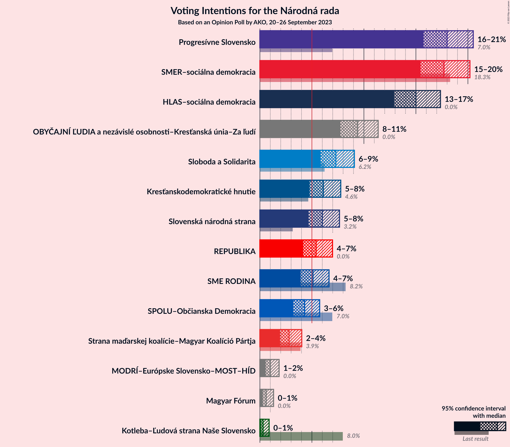

### Confidence Intervals

| Party | Last Result | Poll Result | 80% Confidence Interval | 90% Confidence Interval | 95% Confidence Interval | 99% Confidence Interval |
|:-----:|:-----------:|:-----------:|:-----------------------:|:-----------------------:|:-----------------------:|:-----------------------:|
| Progresívne Slovensko | 7.0% | 18.0% | 16.5–19.6% |16.1–20.1% |15.7–20.5% |15.0–21.3% |
| SMER–sociálna demokracia | 18.3% | 17.7% | 16.2–19.3% |15.8–19.8% |15.5–20.2% |14.8–21.0% |
| HLAS–sociálna demokracia | 0.0% | 15.0% | 13.6–16.5% |13.2–17.0% |12.9–17.4% |12.3–18.1% |
| OBYČAJNÍ ĽUDIA a nezávislé osobnosti–Kresťanská únia–Za ľudí | 0.0% | 9.4% | 8.3–10.7% |8.0–11.1% |7.7–11.4% |7.2–12.0% |
| Sloboda a Solidarita | 6.2% | 7.3% | 6.3–8.5% |6.1–8.8% |5.8–9.1% |5.4–9.7% |
| Kresťanskodemokratické hnutie | 4.6% | 6.1% | 5.2–7.2% |5.0–7.5% |4.8–7.8% |4.4–8.3% |
| Slovenská národná strana | 3.2% | 6.0% | 5.1–7.1% |4.9–7.4% |4.7–7.7% |4.3–8.2% |
| REPUBLIKA | 0.0% | 5.4% | 4.6–6.4% |4.3–6.7% |4.2–7.0% |3.8–7.5% |
| SME RODINA | 8.2% | 5.1% | 4.3–6.1% |4.1–6.4% |3.9–6.6% |3.6–7.2% |
| SPOLU–Občianska Demokracia | 7.0% | 4.3% | 3.6–5.2% |3.4–5.5% |3.2–5.7% |2.9–6.2% |
| Strana maďarskej koalície–Magyar Koalíció Pártja | 3.9% | 2.8% | 2.2–3.6% |2.1–3.8% |1.9–4.0% |1.7–4.4% |
| MODRÍ–Európske Slovensko–MOST–HÍD | 0.0% | 1.0% | 0.7–1.5% |0.6–1.7% |0.5–1.8% |0.4–2.1% |
| Magyar Fórum | 0.0% | 0.6% | 0.4–1.1% |0.3–1.2% |0.3–1.3% |0.2–1.6% |
| Kotleba–Ľudová strana Naše Slovensko | 8.0% | 0.3% | 0.2–0.7% |0.1–0.8% |0.1–0.9% |0.1–1.1% |

*Note:* The poll result column reflects the actual value used in the calculations. Published results may vary slightly, and in addition be rounded to fewer digits.

## Seats

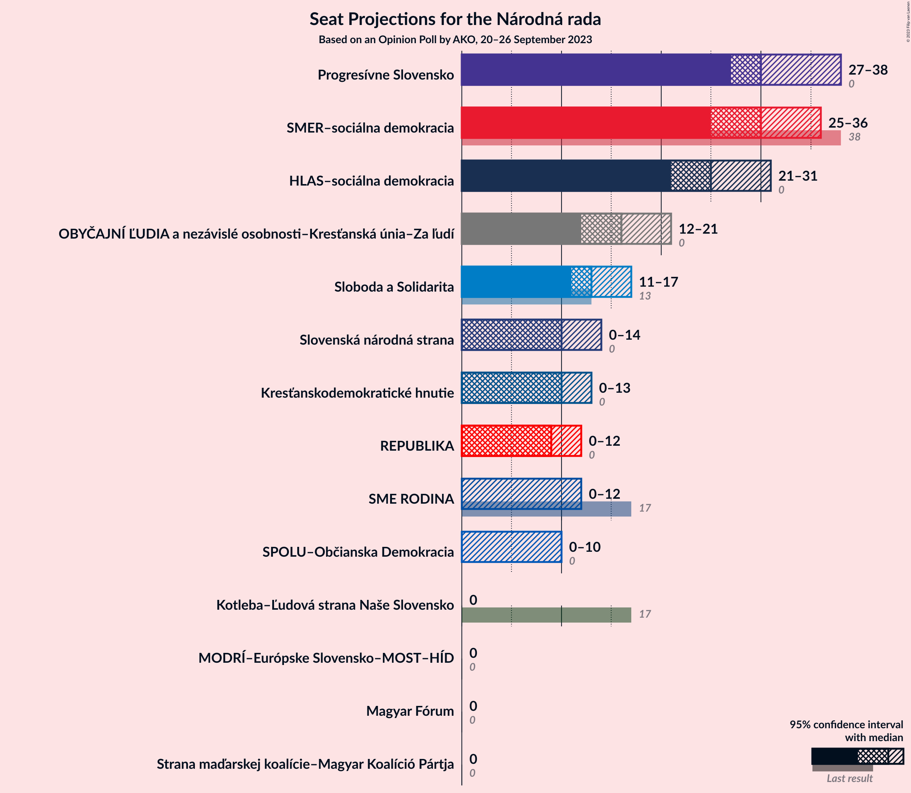

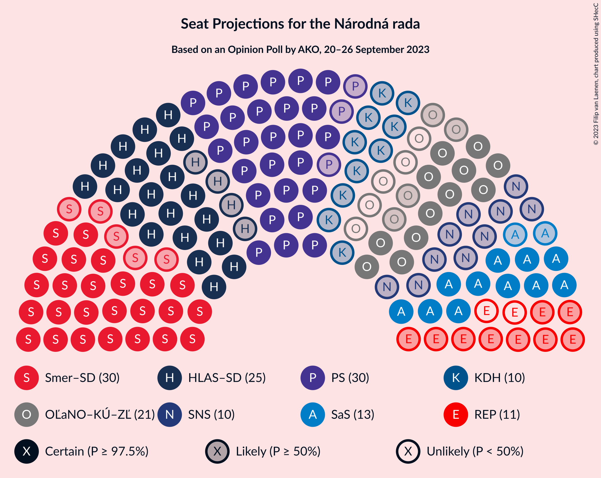

### Confidence Intervals

| Party | Last Result | Median | 80% Confidence Interval | 90% Confidence Interval | 95% Confidence Interval | 99% Confidence Interval |
|:-----:|:-----------:|:------:|:-----------------------:|:-----------------------:|:-----------------------:|:-----------------------:|
| <a href="#progresívne-slovensko">Progresívne Slovensko</a> | 0 | 30 | 29–38 |28–38 |27–38 |25–38 |
| <a href="#smer–sociálna-demokracia">SMER–sociálna demokracia</a> | 38 | 30 | 28–36 |26–36 |25–36 |25–38 |
| <a href="#hlas–sociálna-demokracia">HLAS–sociálna demokracia</a> | 0 | 25 | 24–28 |22–29 |21–31 |19–32 |
| <a href="#obyčajní-ľudia-a-nezávislé-osobnosti–kresťanská-únia–za-ľudí">OBYČAJNÍ ĽUDIA a nezávislé osobnosti–Kresťanská únia–Za ľudí</a> | 0 | 16 | 14–21 |13–21 |12–21 |12–22 |
| <a href="#sloboda-a-solidarita">Sloboda a Solidarita</a> | 13 | 13 | 11–15 |11–15 |11–17 |9–18 |
| <a href="#kresťanskodemokratické-hnutie">Kresťanskodemokratické hnutie</a> | 0 | 10 | 9–12 |8–12 |0–13 |0–15 |
| <a href="#slovenská-národná-strana">Slovenská národná strana</a> | 0 | 10 | 9–14 |0–14 |0–14 |0–14 |
| <a href="#republika">REPUBLIKA</a> | 0 | 9 | 0–11 |0–11 |0–12 |0–12 |
| <a href="#sme-rodina">SME RODINA</a> | 17 | 0 | 0–10 |0–11 |0–12 |0–12 |
| <a href="#spolu–občianska-demokracia">SPOLU–Občianska Demokracia</a> | 0 | 0 | 0–10 |0–10 |0–10 |0–10 |
| <a href="#strana-maďarskej-koalície–magyar-koalíció-pártja">Strana maďarskej koalície–Magyar Koalíció Pártja</a> | 0 | 0 | 0 |0 |0 |0 |
| <a href="#modrí–európske-slovensko–most–híd">MODRÍ–Európske Slovensko–MOST–HÍD</a> | 0 | 0 | 0 |0 |0 |0 |
| <a href="#magyar-fórum">Magyar Fórum</a> | 0 | 0 | 0 |0 |0 |0 |
| <a href="#kotleba–ľudová-strana-naše-slovensko">Kotleba–Ľudová strana Naše Slovensko</a> | 17 | 0 | 0 |0 |0 |0 |

### Progresívne Slovensko

*For a full overview of the results for this party, see the [Progresívne Slovensko](party-progresívneslovensko.html) page.*

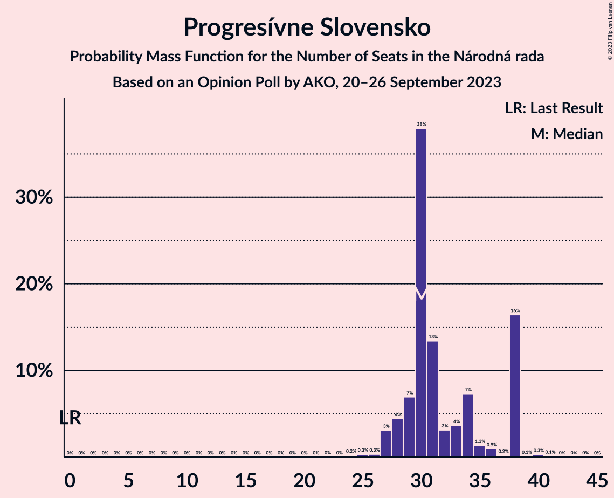

| Number of Seats | Probability | Accumulated | Special Marks |
|:---------------:|:-----------:|:-----------:|:-------------:|
| 0 | 0% | 100% | Last Result |
| 1 | 0% | 100% |  |
| 2 | 0% | 100% |  |
| 3 | 0% | 100% |  |
| 4 | 0% | 100% |  |
| 5 | 0% | 100% |  |
| 6 | 0% | 100% |  |
| 7 | 0% | 100% |  |
| 8 | 0% | 100% |  |
| 9 | 0% | 100% |  |
| 10 | 0% | 100% |  |
| 11 | 0% | 100% |  |
| 12 | 0% | 100% |  |
| 13 | 0% | 100% |  |
| 14 | 0% | 100% |  |
| 15 | 0% | 100% |  |
| 16 | 0% | 100% |  |
| 17 | 0% | 100% |  |
| 18 | 0% | 100% |  |
| 19 | 0% | 100% |  |
| 20 | 0% | 100% |  |
| 21 | 0% | 100% |  |
| 22 | 0% | 100% |  |
| 23 | 0% | 100% |  |
| 24 | 0.2% | 100% |  |
| 25 | 0.3% | 99.8% |  |
| 26 | 0.3% | 99.5% |  |
| 27 | 3% | 99.2% |  |
| 28 | 4% | 96% |  |
| 29 | 7% | 92% |  |
| 30 | 38% | 85% | Median |
| 31 | 13% | 47% |  |
| 32 | 3% | 33% |  |
| 33 | 4% | 30% |  |
| 34 | 7% | 27% |  |
| 35 | 1.3% | 19% |  |
| 36 | 0.9% | 18% |  |
| 37 | 0.2% | 17% |  |
| 38 | 16% | 17% |  |
| 39 | 0.1% | 0.5% |  |
| 40 | 0.3% | 0.4% |  |
| 41 | 0.1% | 0.1% |  |
| 42 | 0% | 0% |  |

### SMER–sociálna demokracia

*For a full overview of the results for this party, see the [SMER–sociálna demokracia](party-smer–sociálnademokracia.html) page.*

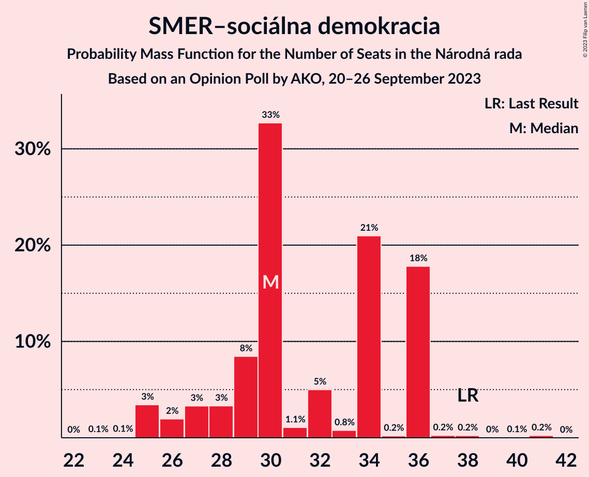

| Number of Seats | Probability | Accumulated | Special Marks |
|:---------------:|:-----------:|:-----------:|:-------------:|
| 23 | 0.1% | 100% |  |
| 24 | 0.1% | 99.9% |  |
| 25 | 3% | 99.8% |  |
| 26 | 2% | 96% |  |
| 27 | 3% | 94% |  |
| 28 | 3% | 91% |  |
| 29 | 8% | 88% |  |
| 30 | 33% | 79% | Median |
| 31 | 1.1% | 47% |  |
| 32 | 5% | 46% |  |
| 33 | 0.8% | 41% |  |
| 34 | 21% | 40% |  |
| 35 | 0.2% | 19% |  |
| 36 | 18% | 19% |  |
| 37 | 0.2% | 0.8% |  |
| 38 | 0.2% | 0.6% | Last Result |
| 39 | 0% | 0.4% |  |
| 40 | 0.1% | 0.3% |  |
| 41 | 0.2% | 0.3% |  |
| 42 | 0% | 0% |  |

### HLAS–sociálna demokracia

*For a full overview of the results for this party, see the [HLAS–sociálna demokracia](party-hlas–sociálnademokracia.html) page.*

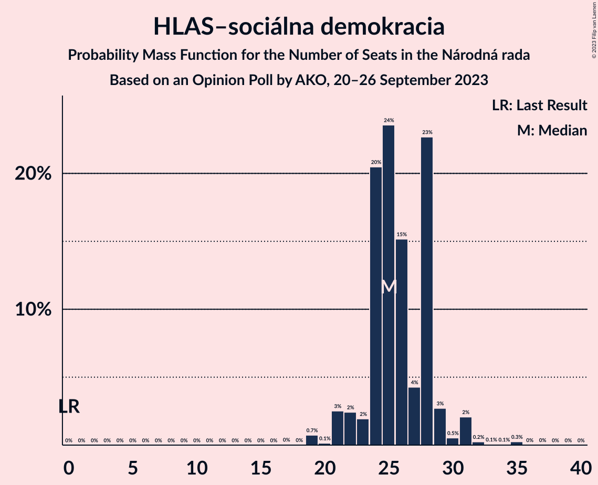

| Number of Seats | Probability | Accumulated | Special Marks |
|:---------------:|:-----------:|:-----------:|:-------------:|
| 0 | 0% | 100% | Last Result |
| 1 | 0% | 100% |  |
| 2 | 0% | 100% |  |
| 3 | 0% | 100% |  |
| 4 | 0% | 100% |  |
| 5 | 0% | 100% |  |
| 6 | 0% | 100% |  |
| 7 | 0% | 100% |  |
| 8 | 0% | 100% |  |
| 9 | 0% | 100% |  |
| 10 | 0% | 100% |  |
| 11 | 0% | 100% |  |
| 12 | 0% | 100% |  |
| 13 | 0% | 100% |  |
| 14 | 0% | 100% |  |
| 15 | 0% | 100% |  |
| 16 | 0% | 100% |  |
| 17 | 0% | 100% |  |
| 18 | 0% | 100% |  |
| 19 | 0.7% | 99.9% |  |
| 20 | 0.1% | 99.2% |  |
| 21 | 3% | 99.1% |  |
| 22 | 2% | 97% |  |
| 23 | 2% | 94% |  |
| 24 | 20% | 92% |  |
| 25 | 24% | 72% | Median |
| 26 | 15% | 48% |  |
| 27 | 4% | 33% |  |
| 28 | 23% | 29% |  |
| 29 | 3% | 6% |  |
| 30 | 0.5% | 3% |  |
| 31 | 2% | 3% |  |
| 32 | 0.2% | 0.6% |  |
| 33 | 0.1% | 0.4% |  |
| 34 | 0.1% | 0.3% |  |
| 35 | 0.3% | 0.3% |  |
| 36 | 0% | 0% |  |

### OBYČAJNÍ ĽUDIA a nezávislé osobnosti–Kresťanská únia–Za ľudí

*For a full overview of the results for this party, see the [OBYČAJNÍ ĽUDIA a nezávislé osobnosti–Kresťanská únia–Za ľudí](party-obyčajníľudiaanezávisléosobnosti–kresťanskáúnia–zaľudí.html) page.*

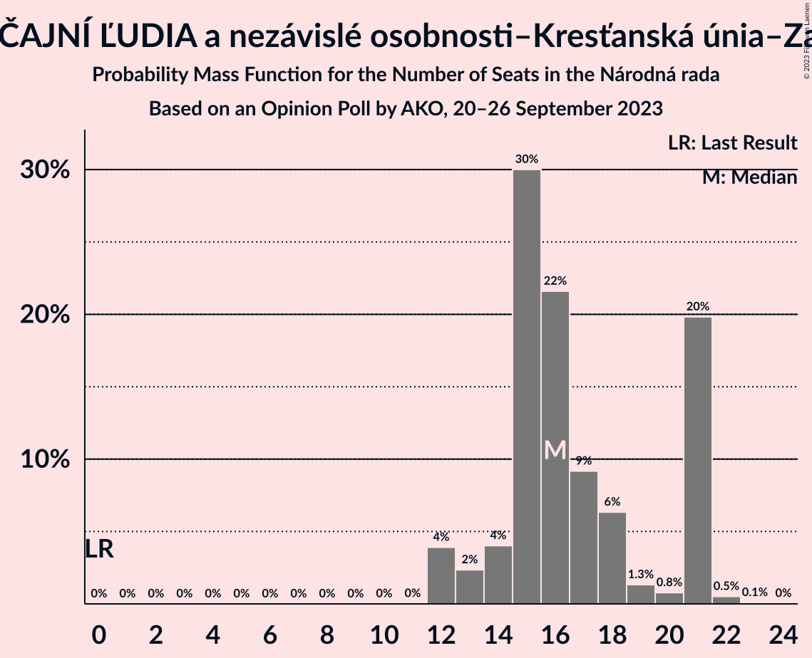

| Number of Seats | Probability | Accumulated | Special Marks |
|:---------------:|:-----------:|:-----------:|:-------------:|
| 0 | 0% | 100% | Last Result |
| 1 | 0% | 100% |  |
| 2 | 0% | 100% |  |
| 3 | 0% | 100% |  |
| 4 | 0% | 100% |  |
| 5 | 0% | 100% |  |
| 6 | 0% | 100% |  |
| 7 | 0% | 100% |  |
| 8 | 0% | 100% |  |
| 9 | 0% | 100% |  |
| 10 | 0% | 100% |  |
| 11 | 0% | 100% |  |
| 12 | 4% | 100% |  |
| 13 | 2% | 96% |  |
| 14 | 4% | 94% |  |
| 15 | 30% | 90% |  |
| 16 | 22% | 60% | Median |
| 17 | 9% | 38% |  |
| 18 | 6% | 29% |  |
| 19 | 1.3% | 23% |  |
| 20 | 0.8% | 21% |  |
| 21 | 20% | 20% |  |
| 22 | 0.5% | 0.6% |  |
| 23 | 0.1% | 0.1% |  |
| 24 | 0% | 0% |  |

### Sloboda a Solidarita

*For a full overview of the results for this party, see the [Sloboda a Solidarita](party-slobodaasolidarita.html) page.*

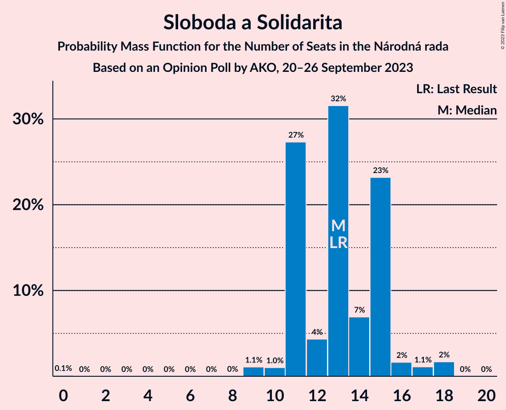

| Number of Seats | Probability | Accumulated | Special Marks |
|:---------------:|:-----------:|:-----------:|:-------------:|
| 0 | 0.1% | 100% |  |
| 1 | 0% | 99.9% |  |
| 2 | 0% | 99.9% |  |
| 3 | 0% | 99.9% |  |
| 4 | 0% | 99.9% |  |
| 5 | 0% | 99.9% |  |
| 6 | 0% | 99.9% |  |
| 7 | 0% | 99.9% |  |
| 8 | 0% | 99.9% |  |
| 9 | 1.1% | 99.9% |  |
| 10 | 1.0% | 98.8% |  |
| 11 | 27% | 98% |  |
| 12 | 4% | 70% |  |
| 13 | 32% | 66% | Last Result, Median |
| 14 | 7% | 35% |  |
| 15 | 23% | 28% |  |
| 16 | 2% | 4% |  |
| 17 | 1.1% | 3% |  |
| 18 | 2% | 2% |  |
| 19 | 0% | 0% |  |

### Kresťanskodemokratické hnutie

*For a full overview of the results for this party, see the [Kresťanskodemokratické hnutie](party-kresťanskodemokratickéhnutie.html) page.*

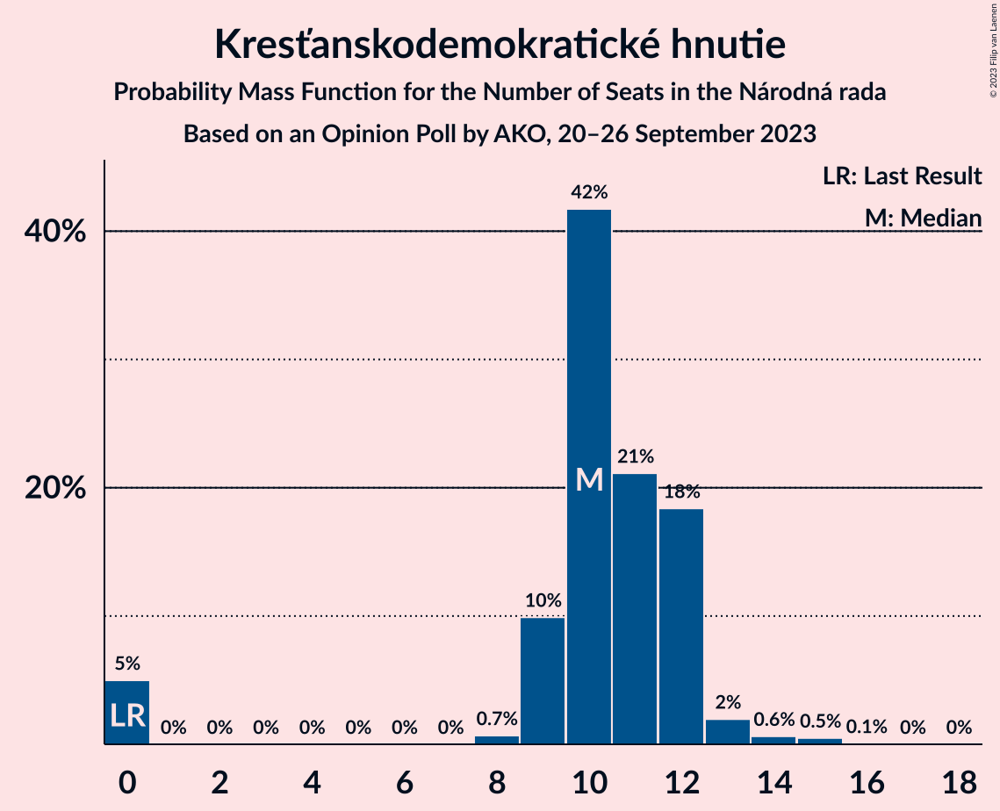

| Number of Seats | Probability | Accumulated | Special Marks |
|:---------------:|:-----------:|:-----------:|:-------------:|
| 0 | 5% | 100% | Last Result |
| 1 | 0% | 95% |  |
| 2 | 0% | 95% |  |
| 3 | 0% | 95% |  |
| 4 | 0% | 95% |  |
| 5 | 0% | 95% |  |
| 6 | 0% | 95% |  |
| 7 | 0% | 95% |  |
| 8 | 0.7% | 95% |  |
| 9 | 10% | 94% |  |
| 10 | 42% | 84% | Median |
| 11 | 21% | 43% |  |
| 12 | 18% | 22% |  |
| 13 | 2% | 3% |  |
| 14 | 0.6% | 1.2% |  |
| 15 | 0.5% | 0.6% |  |
| 16 | 0.1% | 0.1% |  |
| 17 | 0% | 0% |  |

### Slovenská národná strana

*For a full overview of the results for this party, see the [Slovenská národná strana](party-slovenskánárodnástrana.html) page.*

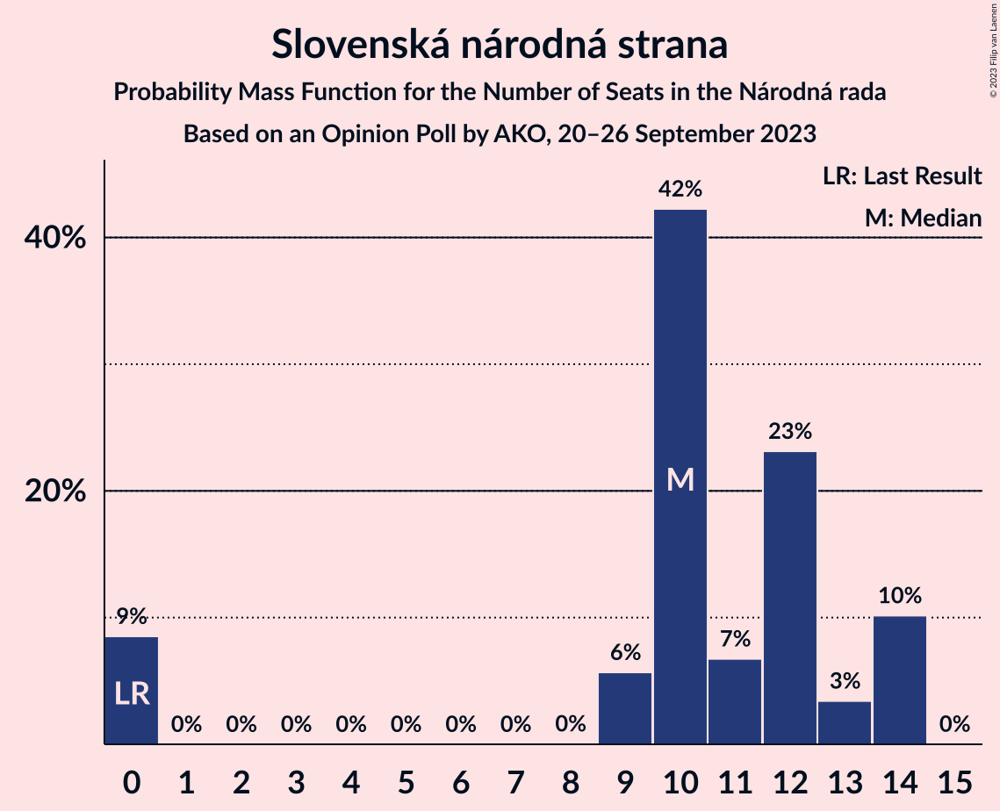

| Number of Seats | Probability | Accumulated | Special Marks |
|:---------------:|:-----------:|:-----------:|:-------------:|
| 0 | 9% | 100% | Last Result |
| 1 | 0% | 91% |  |
| 2 | 0% | 91% |  |
| 3 | 0% | 91% |  |
| 4 | 0% | 91% |  |
| 5 | 0% | 91% |  |
| 6 | 0% | 91% |  |
| 7 | 0% | 91% |  |
| 8 | 0% | 91% |  |
| 9 | 6% | 91% |  |
| 10 | 42% | 86% | Median |
| 11 | 7% | 44% |  |
| 12 | 23% | 37% |  |
| 13 | 3% | 14% |  |
| 14 | 10% | 10% |  |
| 15 | 0% | 0% |  |

### REPUBLIKA

*For a full overview of the results for this party, see the [REPUBLIKA](party-republika.html) page.*

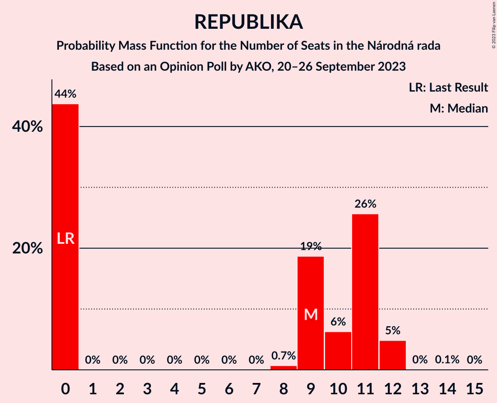

| Number of Seats | Probability | Accumulated | Special Marks |
|:---------------:|:-----------:|:-----------:|:-------------:|
| 0 | 44% | 100% | Last Result |
| 1 | 0% | 56% |  |
| 2 | 0% | 56% |  |
| 3 | 0% | 56% |  |
| 4 | 0% | 56% |  |
| 5 | 0% | 56% |  |
| 6 | 0% | 56% |  |
| 7 | 0% | 56% |  |
| 8 | 0.7% | 56% |  |
| 9 | 19% | 56% | Median |
| 10 | 6% | 37% |  |
| 11 | 26% | 31% |  |
| 12 | 5% | 5% |  |
| 13 | 0% | 0.1% |  |
| 14 | 0.1% | 0.1% |  |
| 15 | 0% | 0% |  |

### SME RODINA

*For a full overview of the results for this party, see the [SME RODINA](party-smerodina.html) page.*

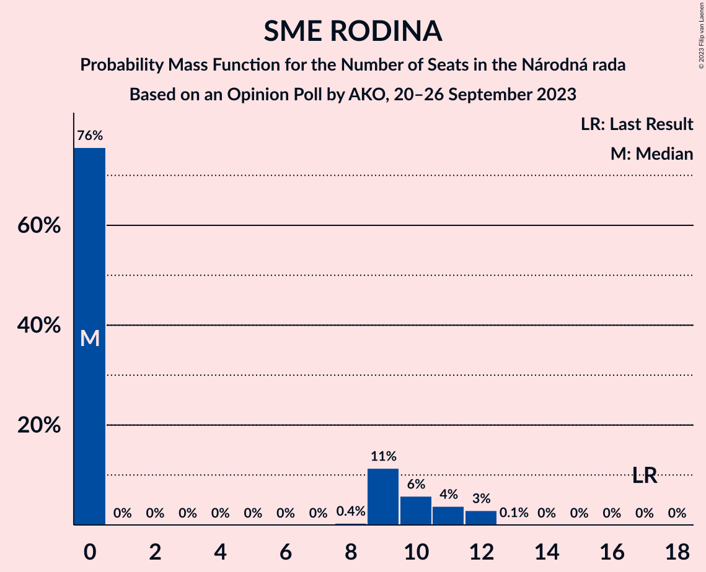

| Number of Seats | Probability | Accumulated | Special Marks |
|:---------------:|:-----------:|:-----------:|:-------------:|
| 0 | 76% | 100% | Median |
| 1 | 0% | 24% |  |
| 2 | 0% | 24% |  |
| 3 | 0% | 24% |  |
| 4 | 0% | 24% |  |
| 5 | 0% | 24% |  |
| 6 | 0% | 24% |  |
| 7 | 0% | 24% |  |
| 8 | 0.4% | 24% |  |
| 9 | 11% | 24% |  |
| 10 | 6% | 13% |  |
| 11 | 4% | 7% |  |
| 12 | 3% | 3% |  |
| 13 | 0.1% | 0.1% |  |
| 14 | 0% | 0% |  |
| 15 | 0% | 0% |  |
| 16 | 0% | 0% |  |
| 17 | 0% | 0% | Last Result |

### SPOLU–Občianska Demokracia

*For a full overview of the results for this party, see the [SPOLU–Občianska Demokracia](party-spolu–občianskademokracia.html) page.*

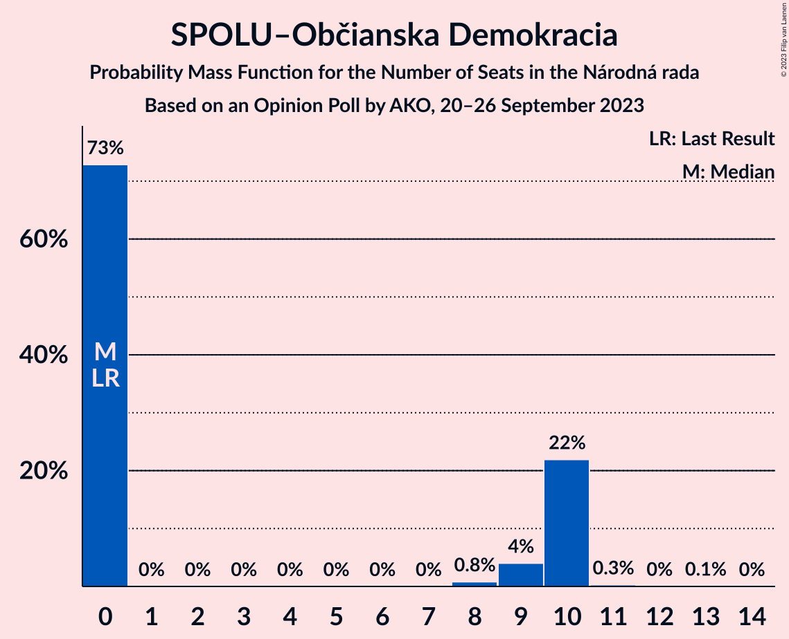

| Number of Seats | Probability | Accumulated | Special Marks |
|:---------------:|:-----------:|:-----------:|:-------------:|
| 0 | 73% | 100% | Last Result, Median |
| 1 | 0% | 27% |  |
| 2 | 0% | 27% |  |
| 3 | 0% | 27% |  |
| 4 | 0% | 27% |  |
| 5 | 0% | 27% |  |
| 6 | 0% | 27% |  |
| 7 | 0% | 27% |  |
| 8 | 0.8% | 27% |  |
| 9 | 4% | 26% |  |
| 10 | 22% | 22% |  |
| 11 | 0.3% | 0.4% |  |
| 12 | 0% | 0.1% |  |
| 13 | 0.1% | 0.1% |  |
| 14 | 0% | 0% |  |

### Strana maďarskej koalície–Magyar Koalíció Pártja

*For a full overview of the results for this party, see the [Strana maďarskej koalície–Magyar Koalíció Pártja](party-stranamaďarskejkoalície–magyarkoalíciópártja.html) page.*

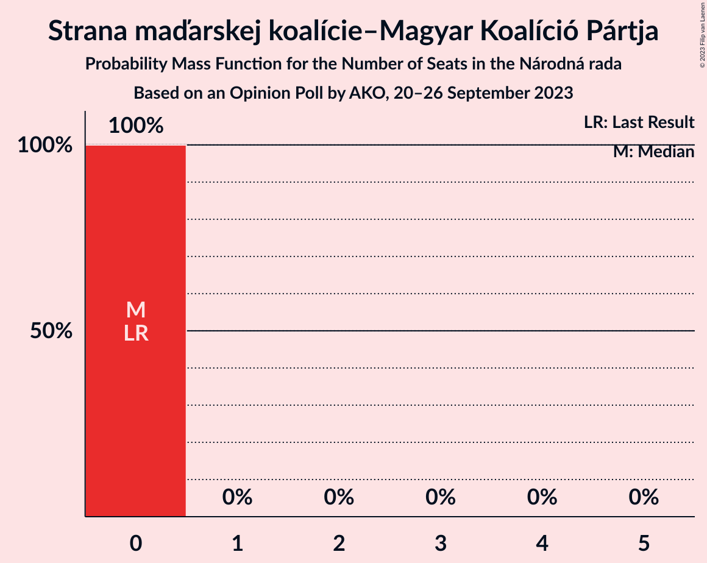

| Number of Seats | Probability | Accumulated | Special Marks |
|:---------------:|:-----------:|:-----------:|:-------------:|
| 0 | 100% | 100% | Last Result, Median |

### MODRÍ–Európske Slovensko–MOST–HÍD

*For a full overview of the results for this party, see the [MODRÍ–Európske Slovensko–MOST–HÍD](party-modrí–európskeslovensko–most–híd.html) page.*

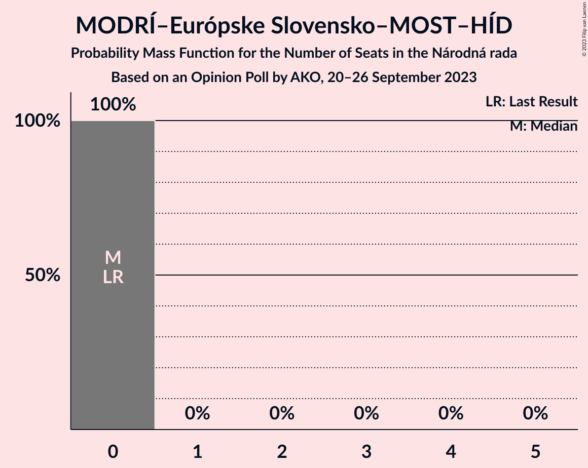

| Number of Seats | Probability | Accumulated | Special Marks |
|:---------------:|:-----------:|:-----------:|:-------------:|
| 0 | 100% | 100% | Last Result, Median |

### Magyar Fórum

*For a full overview of the results for this party, see the [Magyar Fórum](party-magyarfórum.html) page.*

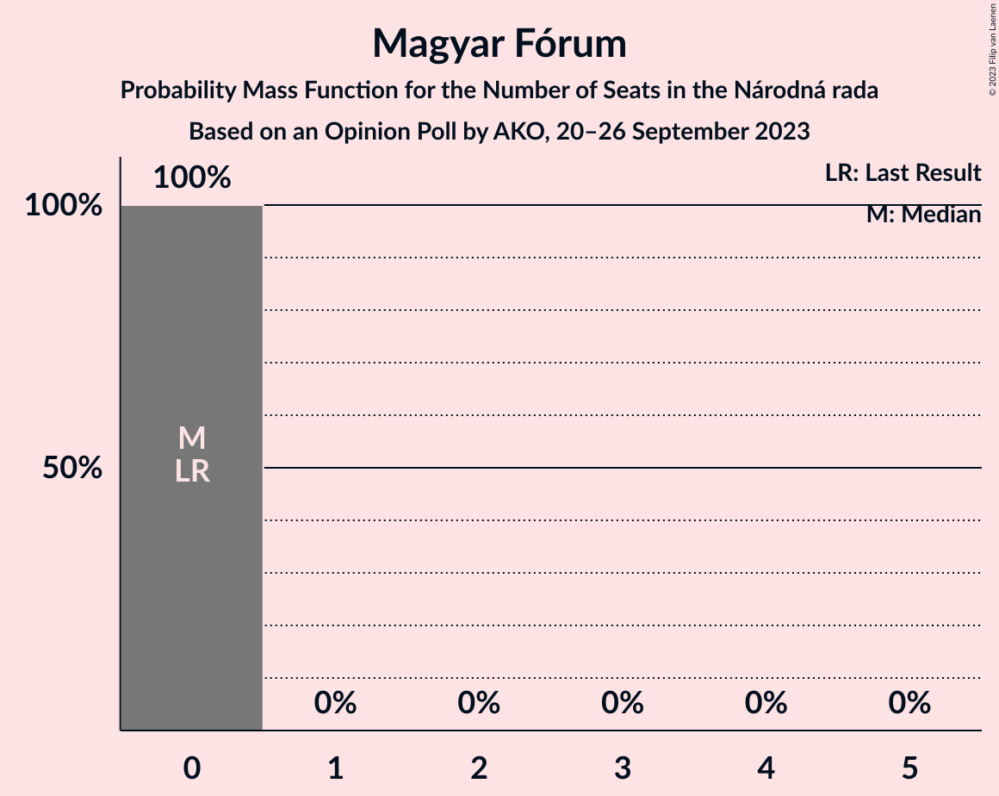

| Number of Seats | Probability | Accumulated | Special Marks |
|:---------------:|:-----------:|:-----------:|:-------------:|
| 0 | 100% | 100% | Last Result, Median |

### Kotleba–Ľudová strana Naše Slovensko

*For a full overview of the results for this party, see the [Kotleba–Ľudová strana Naše Slovensko](party-kotleba–ľudovástrananašeslovensko.html) page.*

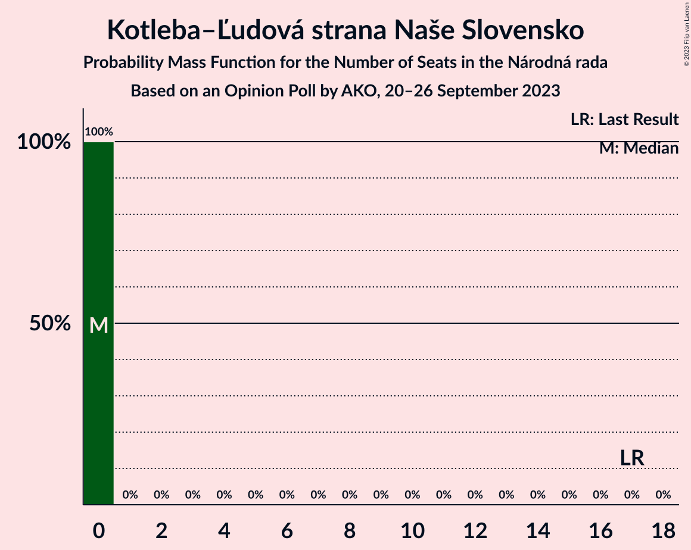

| Number of Seats | Probability | Accumulated | Special Marks |
|:---------------:|:-----------:|:-----------:|:-------------:|
| 0 | 100% | 100% | Median |
| 1 | 0% | 0% |  |
| 2 | 0% | 0% |  |
| 3 | 0% | 0% |  |
| 4 | 0% | 0% |  |
| 5 | 0% | 0% |  |
| 6 | 0% | 0% |  |
| 7 | 0% | 0% |  |
| 8 | 0% | 0% |  |
| 9 | 0% | 0% |  |
| 10 | 0% | 0% |  |
| 11 | 0% | 0% |  |
| 12 | 0% | 0% |  |
| 13 | 0% | 0% |  |
| 14 | 0% | 0% |  |
| 15 | 0% | 0% |  |
| 16 | 0% | 0% |  |
| 17 | 0% | 0% | Last Result |

## Coalitions

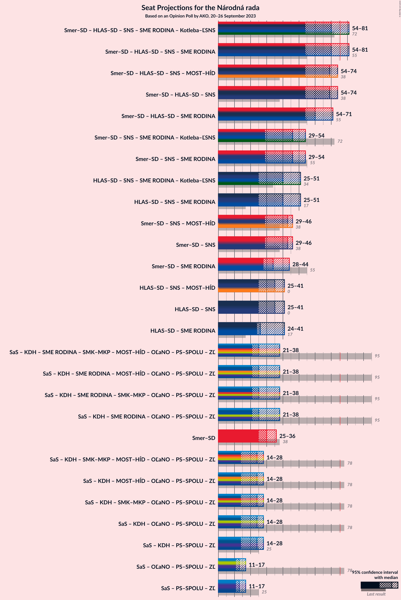

### Confidence Intervals

| Coalition | Last Result | Median | Majority? | 80% Confidence Interval | 90% Confidence Interval | 95% Confidence Interval | 99% Confidence Interval |
|:---------:|:-----------:|:------:|:---------:|:-----------------------:|:-----------------------:|:-----------------------:|:-----------------------:|
| SMER–sociálna demokracia – HLAS–sociálna demokracia – Slovenská národná strana – SME RODINA – Kotleba–Ľudová strana Naše Slovensko | 72 | 70 | 10% | 65–75 | 57–79 | 54–81 | 54–83 |
| SMER–sociálna demokracia – HLAS–sociálna demokracia – Slovenská národná strana – SME RODINA | 55 | 70 | 10% | 65–75 | 57–79 | 54–81 | 54–83 |
| SMER–sociálna demokracia – HLAS–sociálna demokracia – Slovenská národná strana | 38 | 69 | 0.5% | 60–74 | 54–74 | 54–74 | 53–77 |
| SMER–sociálna demokracia – HLAS–sociálna demokracia – SME RODINA | 55 | 60 | 0.2% | 55–66 | 54–69 | 54–71 | 51–73 |
| SMER–sociálna demokracia – Slovenská národná strana – SME RODINA – Kotleba–Ľudová strana Naše Slovensko | 72 | 46 | 0% | 40–50 | 32–52 | 29–54 | 29–55 |
| SMER–sociálna demokracia – Slovenská národná strana – SME RODINA | 55 | 46 | 0% | 40–50 | 32–52 | 29–54 | 29–55 |
| HLAS–sociálna demokracia – Slovenská národná strana – SME RODINA – Kotleba–Ľudová strana Naše Slovensko | 34 | 40 | 0% | 34–45 | 27–47 | 25–51 | 25–52 |
| HLAS–sociálna demokracia – Slovenská národná strana – SME RODINA | 17 | 40 | 0% | 34–45 | 27–47 | 25–51 | 25–52 |
| SMER–sociálna demokracia – Slovenská národná strana | 38 | 43 | 0% | 35–46 | 30–46 | 29–46 | 29–50 |
| SMER–sociálna demokracia – SME RODINA | 55 | 34 | 0% | 30–40 | 29–42 | 28–44 | 25–45 |
| HLAS–sociálna demokracia – Slovenská národná strana | 0 | 35 | 0% | 32–40 | 25–40 | 25–41 | 25–43 |
| HLAS–sociálna demokracia – SME RODINA | 17 | 26 | 0% | 24–36 | 24–38 | 24–41 | 23–41 |
| SMER–sociálna demokracia | 38 | 30 | 0% | 28–36 | 26–36 | 25–36 | 25–38 |

### SMER–sociálna demokracia – HLAS–sociálna demokracia – Slovenská národná strana – SME RODINA – Kotleba–Ľudová strana Naše Slovensko

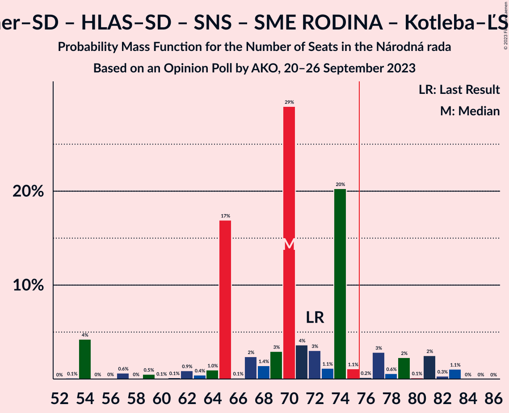

| Number of Seats | Probability | Accumulated | Special Marks |
|:---------------:|:-----------:|:-----------:|:-------------:|
| 53 | 0.1% | 100% |  |
| 54 | 4% | 99.9% |  |
| 55 | 0% | 96% |  |
| 56 | 0% | 96% |  |
| 57 | 0.6% | 96% |  |
| 58 | 0% | 95% |  |
| 59 | 0.5% | 95% |  |
| 60 | 0.1% | 94% |  |
| 61 | 0.1% | 94% |  |
| 62 | 0.9% | 94% |  |
| 63 | 0.4% | 93% |  |
| 64 | 1.0% | 93% |  |
| 65 | 17% | 92% | Median |
| 66 | 0.1% | 75% |  |
| 67 | 2% | 75% |  |
| 68 | 1.4% | 73% |  |
| 69 | 3% | 71% |  |
| 70 | 29% | 68% |  |
| 71 | 4% | 39% |  |
| 72 | 3% | 35% | Last Result |
| 73 | 1.1% | 32% |  |
| 74 | 20% | 31% |  |
| 75 | 1.1% | 11% |  |
| 76 | 0.2% | 10% | Majority |
| 77 | 3% | 10% |  |
| 78 | 0.6% | 7% |  |
| 79 | 2% | 6% |  |
| 80 | 0.1% | 4% |  |
| 81 | 2% | 4% |  |
| 82 | 0.3% | 1.4% |  |
| 83 | 1.1% | 1.1% |  |
| 84 | 0% | 0.1% |  |
| 85 | 0% | 0% |  |

### SMER–sociálna demokracia – HLAS–sociálna demokracia – Slovenská národná strana – SME RODINA

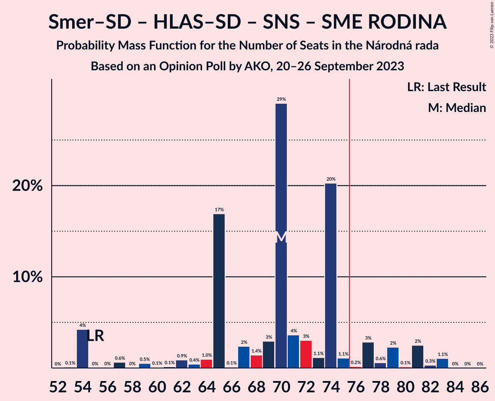

| Number of Seats | Probability | Accumulated | Special Marks |
|:---------------:|:-----------:|:-----------:|:-------------:|
| 53 | 0.1% | 100% |  |
| 54 | 4% | 99.9% |  |
| 55 | 0% | 96% | Last Result |
| 56 | 0% | 96% |  |
| 57 | 0.6% | 96% |  |
| 58 | 0% | 95% |  |
| 59 | 0.5% | 95% |  |
| 60 | 0.1% | 94% |  |
| 61 | 0.1% | 94% |  |
| 62 | 0.9% | 94% |  |
| 63 | 0.4% | 93% |  |
| 64 | 1.0% | 93% |  |
| 65 | 17% | 92% | Median |
| 66 | 0.1% | 75% |  |
| 67 | 2% | 75% |  |
| 68 | 1.4% | 73% |  |
| 69 | 3% | 71% |  |
| 70 | 29% | 68% |  |
| 71 | 4% | 39% |  |
| 72 | 3% | 35% |  |
| 73 | 1.1% | 32% |  |
| 74 | 20% | 31% |  |
| 75 | 1.1% | 11% |  |
| 76 | 0.2% | 10% | Majority |
| 77 | 3% | 10% |  |
| 78 | 0.6% | 7% |  |
| 79 | 2% | 6% |  |
| 80 | 0.1% | 4% |  |
| 81 | 2% | 4% |  |
| 82 | 0.3% | 1.4% |  |
| 83 | 1.1% | 1.1% |  |
| 84 | 0% | 0.1% |  |
| 85 | 0% | 0% |  |

### SMER–sociálna demokracia – HLAS–sociálna demokracia – Slovenská národná strana

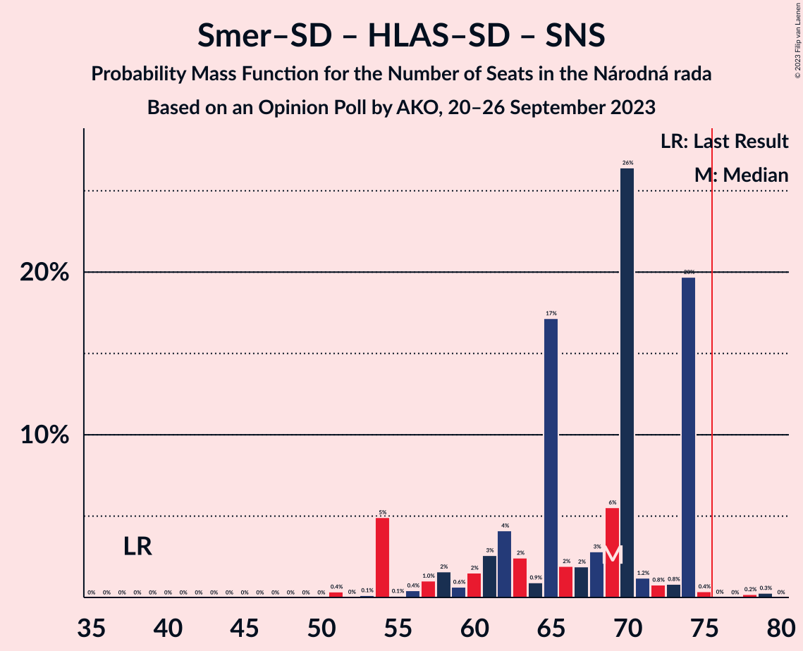

| Number of Seats | Probability | Accumulated | Special Marks |
|:---------------:|:-----------:|:-----------:|:-------------:|
| 38 | 0% | 100% | Last Result |
| 39 | 0% | 100% |  |
| 40 | 0% | 100% |  |
| 41 | 0% | 100% |  |
| 42 | 0% | 100% |  |
| 43 | 0% | 100% |  |
| 44 | 0% | 100% |  |
| 45 | 0% | 100% |  |
| 46 | 0% | 100% |  |
| 47 | 0% | 100% |  |
| 48 | 0% | 100% |  |
| 49 | 0% | 100% |  |
| 50 | 0% | 100% |  |
| 51 | 0.4% | 100% |  |
| 52 | 0% | 99.6% |  |
| 53 | 0.1% | 99.6% |  |
| 54 | 5% | 99.5% |  |
| 55 | 0.1% | 95% |  |
| 56 | 0.4% | 94% |  |
| 57 | 1.0% | 94% |  |
| 58 | 2% | 93% |  |
| 59 | 0.6% | 91% |  |
| 60 | 2% | 91% |  |
| 61 | 3% | 89% |  |
| 62 | 4% | 87% |  |
| 63 | 2% | 83% |  |
| 64 | 0.9% | 80% |  |
| 65 | 17% | 79% | Median |
| 66 | 2% | 62% |  |
| 67 | 2% | 60% |  |
| 68 | 3% | 58% |  |
| 69 | 6% | 55% |  |
| 70 | 26% | 50% |  |
| 71 | 1.2% | 23% |  |
| 72 | 0.8% | 22% |  |
| 73 | 0.8% | 21% |  |
| 74 | 20% | 21% |  |
| 75 | 0.4% | 0.9% |  |
| 76 | 0% | 0.5% | Majority |
| 77 | 0% | 0.5% |  |
| 78 | 0.2% | 0.5% |  |
| 79 | 0.3% | 0.3% |  |
| 80 | 0% | 0% |  |

### SMER–sociálna demokracia – HLAS–sociálna demokracia – SME RODINA

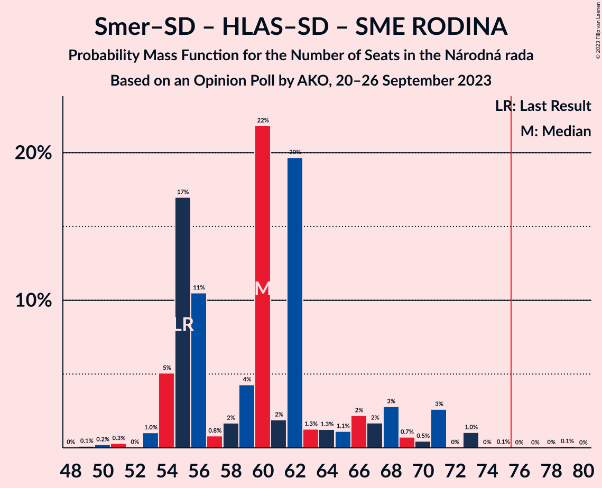

| Number of Seats | Probability | Accumulated | Special Marks |
|:---------------:|:-----------:|:-----------:|:-------------:|
| 48 | 0% | 100% |  |
| 49 | 0.1% | 99.9% |  |
| 50 | 0.2% | 99.8% |  |
| 51 | 0.3% | 99.6% |  |
| 52 | 0% | 99.3% |  |
| 53 | 1.0% | 99.2% |  |
| 54 | 5% | 98% |  |
| 55 | 17% | 93% | Last Result, Median |
| 56 | 11% | 76% |  |
| 57 | 0.8% | 66% |  |
| 58 | 2% | 65% |  |
| 59 | 4% | 63% |  |
| 60 | 22% | 59% |  |
| 61 | 2% | 37% |  |
| 62 | 20% | 35% |  |
| 63 | 1.3% | 15% |  |
| 64 | 1.3% | 14% |  |
| 65 | 1.1% | 13% |  |
| 66 | 2% | 12% |  |
| 67 | 2% | 10% |  |
| 68 | 3% | 8% |  |
| 69 | 0.7% | 5% |  |
| 70 | 0.5% | 4% |  |
| 71 | 3% | 4% |  |
| 72 | 0% | 1.3% |  |
| 73 | 1.0% | 1.3% |  |
| 74 | 0% | 0.2% |  |
| 75 | 0.1% | 0.2% |  |
| 76 | 0% | 0.2% | Majority |
| 77 | 0% | 0.2% |  |
| 78 | 0% | 0.1% |  |
| 79 | 0.1% | 0.1% |  |
| 80 | 0% | 0% |  |

### SMER–sociálna demokracia – Slovenská národná strana – SME RODINA – Kotleba–Ľudová strana Naše Slovensko

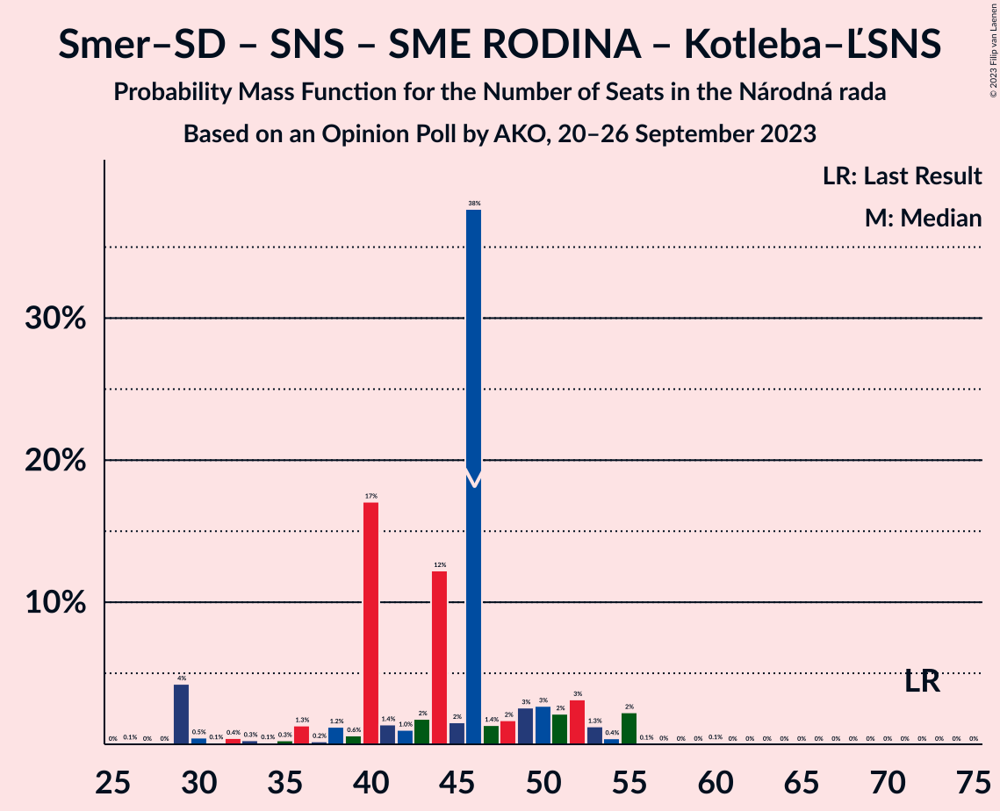

| Number of Seats | Probability | Accumulated | Special Marks |
|:---------------:|:-----------:|:-----------:|:-------------:|
| 26 | 0.1% | 100% |  |
| 27 | 0% | 99.9% |  |
| 28 | 0% | 99.9% |  |
| 29 | 4% | 99.9% |  |
| 30 | 0.5% | 96% |  |
| 31 | 0.1% | 95% |  |
| 32 | 0.4% | 95% |  |
| 33 | 0.3% | 95% |  |
| 34 | 0.1% | 94% |  |
| 35 | 0.3% | 94% |  |
| 36 | 1.3% | 94% |  |
| 37 | 0.2% | 93% |  |
| 38 | 1.2% | 92% |  |
| 39 | 0.6% | 91% |  |
| 40 | 17% | 91% | Median |
| 41 | 1.4% | 73% |  |
| 42 | 1.0% | 72% |  |
| 43 | 2% | 71% |  |
| 44 | 12% | 69% |  |
| 45 | 2% | 57% |  |
| 46 | 38% | 56% |  |
| 47 | 1.4% | 18% |  |
| 48 | 2% | 16% |  |
| 49 | 3% | 15% |  |
| 50 | 3% | 12% |  |
| 51 | 2% | 9% |  |
| 52 | 3% | 7% |  |
| 53 | 1.3% | 4% |  |
| 54 | 0.4% | 3% |  |
| 55 | 2% | 2% |  |
| 56 | 0.1% | 0.2% |  |
| 57 | 0% | 0.2% |  |
| 58 | 0% | 0.1% |  |
| 59 | 0% | 0.1% |  |
| 60 | 0.1% | 0.1% |  |
| 61 | 0% | 0% |  |
| 62 | 0% | 0% |  |
| 63 | 0% | 0% |  |
| 64 | 0% | 0% |  |
| 65 | 0% | 0% |  |
| 66 | 0% | 0% |  |
| 67 | 0% | 0% |  |
| 68 | 0% | 0% |  |
| 69 | 0% | 0% |  |
| 70 | 0% | 0% |  |
| 71 | 0% | 0% |  |
| 72 | 0% | 0% | Last Result |

### SMER–sociálna demokracia – Slovenská národná strana – SME RODINA

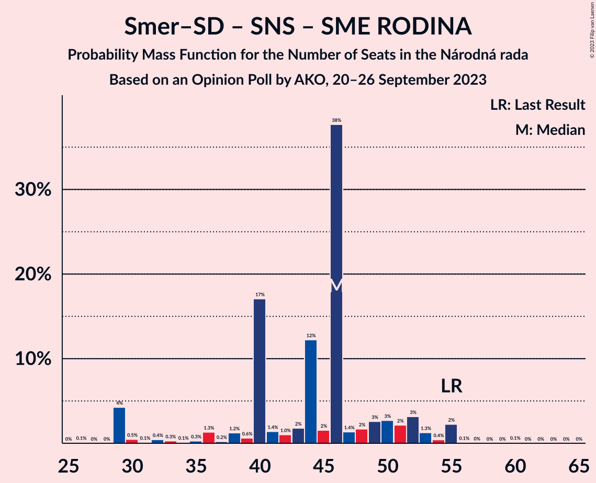

| Number of Seats | Probability | Accumulated | Special Marks |
|:---------------:|:-----------:|:-----------:|:-------------:|
| 26 | 0.1% | 100% |  |
| 27 | 0% | 99.9% |  |
| 28 | 0% | 99.9% |  |
| 29 | 4% | 99.9% |  |
| 30 | 0.5% | 96% |  |
| 31 | 0.1% | 95% |  |
| 32 | 0.4% | 95% |  |
| 33 | 0.3% | 95% |  |
| 34 | 0.1% | 94% |  |
| 35 | 0.3% | 94% |  |
| 36 | 1.3% | 94% |  |
| 37 | 0.2% | 93% |  |
| 38 | 1.2% | 92% |  |
| 39 | 0.6% | 91% |  |
| 40 | 17% | 91% | Median |
| 41 | 1.4% | 73% |  |
| 42 | 1.0% | 72% |  |
| 43 | 2% | 71% |  |
| 44 | 12% | 69% |  |
| 45 | 2% | 57% |  |
| 46 | 38% | 56% |  |
| 47 | 1.4% | 18% |  |
| 48 | 2% | 16% |  |
| 49 | 3% | 15% |  |
| 50 | 3% | 12% |  |
| 51 | 2% | 9% |  |
| 52 | 3% | 7% |  |
| 53 | 1.3% | 4% |  |
| 54 | 0.4% | 3% |  |
| 55 | 2% | 2% | Last Result |
| 56 | 0.1% | 0.2% |  |
| 57 | 0% | 0.2% |  |
| 58 | 0% | 0.1% |  |
| 59 | 0% | 0.1% |  |
| 60 | 0.1% | 0.1% |  |
| 61 | 0% | 0% |  |

### HLAS–sociálna demokracia – Slovenská národná strana – SME RODINA – Kotleba–Ľudová strana Naše Slovensko

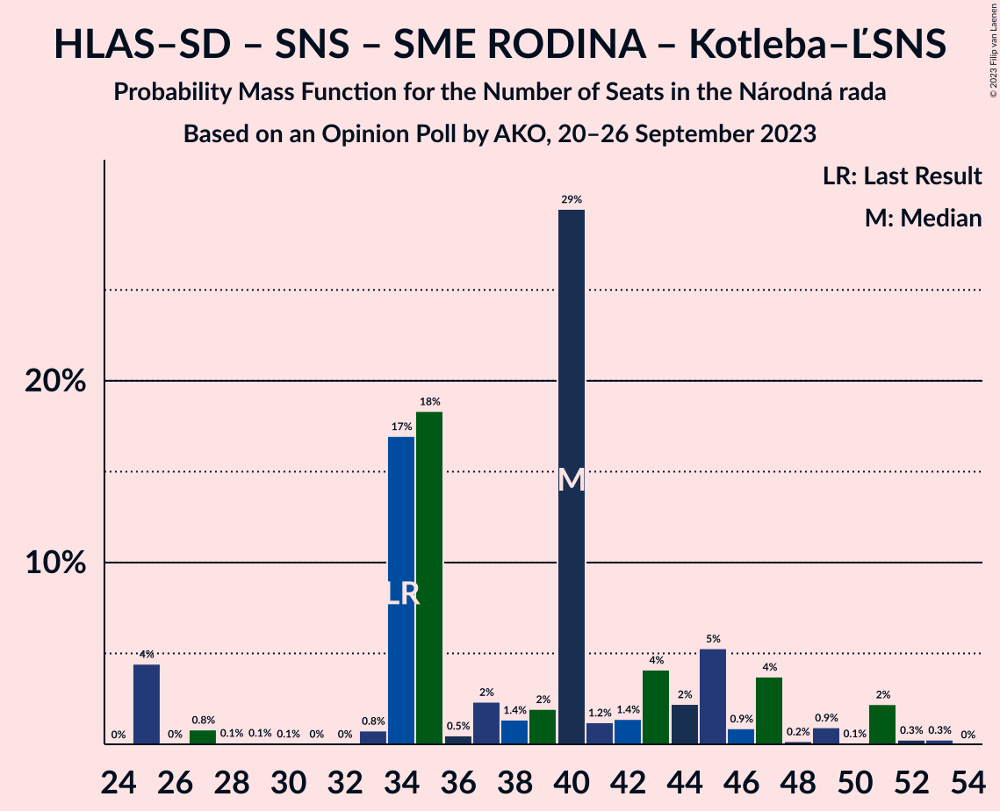

| Number of Seats | Probability | Accumulated | Special Marks |
|:---------------:|:-----------:|:-----------:|:-------------:|
| 25 | 4% | 100% |  |
| 26 | 0% | 96% |  |
| 27 | 0.8% | 96% |  |
| 28 | 0.1% | 95% |  |
| 29 | 0.1% | 95% |  |
| 30 | 0.1% | 95% |  |
| 31 | 0% | 94% |  |
| 32 | 0% | 94% |  |
| 33 | 0.8% | 94% |  |
| 34 | 17% | 94% | Last Result |
| 35 | 18% | 77% | Median |
| 36 | 0.5% | 58% |  |
| 37 | 2% | 58% |  |
| 38 | 1.4% | 55% |  |
| 39 | 2% | 54% |  |
| 40 | 29% | 52% |  |
| 41 | 1.2% | 23% |  |
| 42 | 1.4% | 22% |  |
| 43 | 4% | 20% |  |
| 44 | 2% | 16% |  |
| 45 | 5% | 14% |  |
| 46 | 0.9% | 9% |  |
| 47 | 4% | 8% |  |
| 48 | 0.2% | 4% |  |
| 49 | 0.9% | 4% |  |
| 50 | 0.1% | 3% |  |
| 51 | 2% | 3% |  |
| 52 | 0.3% | 0.5% |  |
| 53 | 0.3% | 0.3% |  |
| 54 | 0% | 0% |  |

### HLAS–sociálna demokracia – Slovenská národná strana – SME RODINA

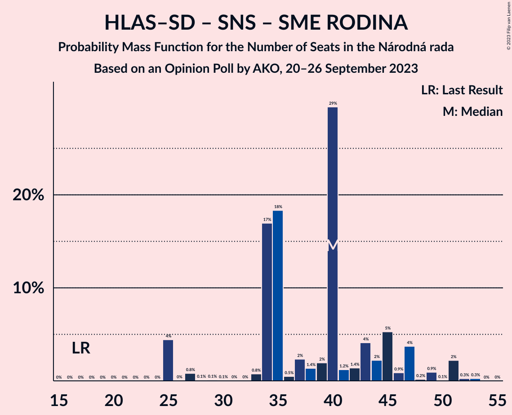

| Number of Seats | Probability | Accumulated | Special Marks |
|:---------------:|:-----------:|:-----------:|:-------------:|
| 17 | 0% | 100% | Last Result |
| 18 | 0% | 100% |  |
| 19 | 0% | 100% |  |
| 20 | 0% | 100% |  |
| 21 | 0% | 100% |  |
| 22 | 0% | 100% |  |
| 23 | 0% | 100% |  |
| 24 | 0% | 100% |  |
| 25 | 4% | 100% |  |
| 26 | 0% | 96% |  |
| 27 | 0.8% | 96% |  |
| 28 | 0.1% | 95% |  |
| 29 | 0.1% | 95% |  |
| 30 | 0.1% | 95% |  |
| 31 | 0% | 94% |  |
| 32 | 0% | 94% |  |
| 33 | 0.8% | 94% |  |
| 34 | 17% | 94% |  |
| 35 | 18% | 77% | Median |
| 36 | 0.5% | 58% |  |
| 37 | 2% | 58% |  |
| 38 | 1.4% | 55% |  |
| 39 | 2% | 54% |  |
| 40 | 29% | 52% |  |
| 41 | 1.2% | 23% |  |
| 42 | 1.4% | 22% |  |
| 43 | 4% | 20% |  |
| 44 | 2% | 16% |  |
| 45 | 5% | 14% |  |
| 46 | 0.9% | 9% |  |
| 47 | 4% | 8% |  |
| 48 | 0.2% | 4% |  |
| 49 | 0.9% | 4% |  |
| 50 | 0.1% | 3% |  |
| 51 | 2% | 3% |  |
| 52 | 0.3% | 0.5% |  |
| 53 | 0.3% | 0.3% |  |
| 54 | 0% | 0% |  |

### SMER–sociálna demokracia – Slovenská národná strana

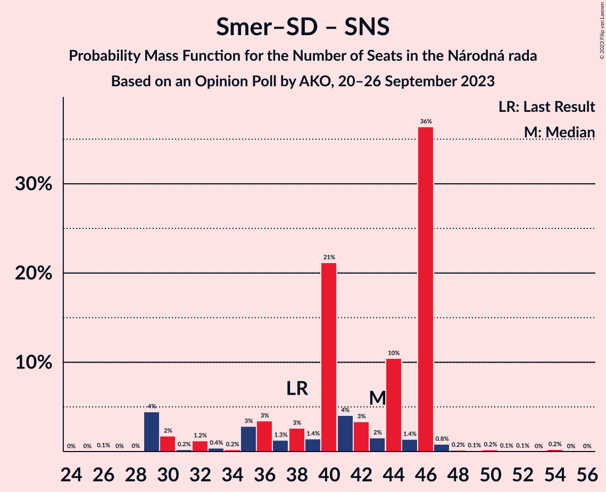

| Number of Seats | Probability | Accumulated | Special Marks |
|:---------------:|:-----------:|:-----------:|:-------------:|
| 26 | 0.1% | 100% |  |
| 27 | 0% | 99.9% |  |
| 28 | 0% | 99.9% |  |
| 29 | 4% | 99.9% |  |
| 30 | 2% | 95% |  |
| 31 | 0.2% | 94% |  |
| 32 | 1.2% | 93% |  |
| 33 | 0.4% | 92% |  |
| 34 | 0.2% | 92% |  |
| 35 | 3% | 92% |  |
| 36 | 3% | 89% |  |
| 37 | 1.3% | 85% |  |
| 38 | 3% | 84% | Last Result |
| 39 | 1.4% | 81% |  |
| 40 | 21% | 80% | Median |
| 41 | 4% | 59% |  |
| 42 | 3% | 55% |  |
| 43 | 2% | 51% |  |
| 44 | 10% | 50% |  |
| 45 | 1.4% | 39% |  |
| 46 | 36% | 38% |  |
| 47 | 0.8% | 2% |  |
| 48 | 0.2% | 0.8% |  |
| 49 | 0.1% | 0.7% |  |
| 50 | 0.2% | 0.6% |  |
| 51 | 0.1% | 0.4% |  |
| 52 | 0.1% | 0.3% |  |
| 53 | 0% | 0.2% |  |
| 54 | 0.2% | 0.2% |  |
| 55 | 0% | 0% |  |

### SMER–sociálna demokracia – SME RODINA

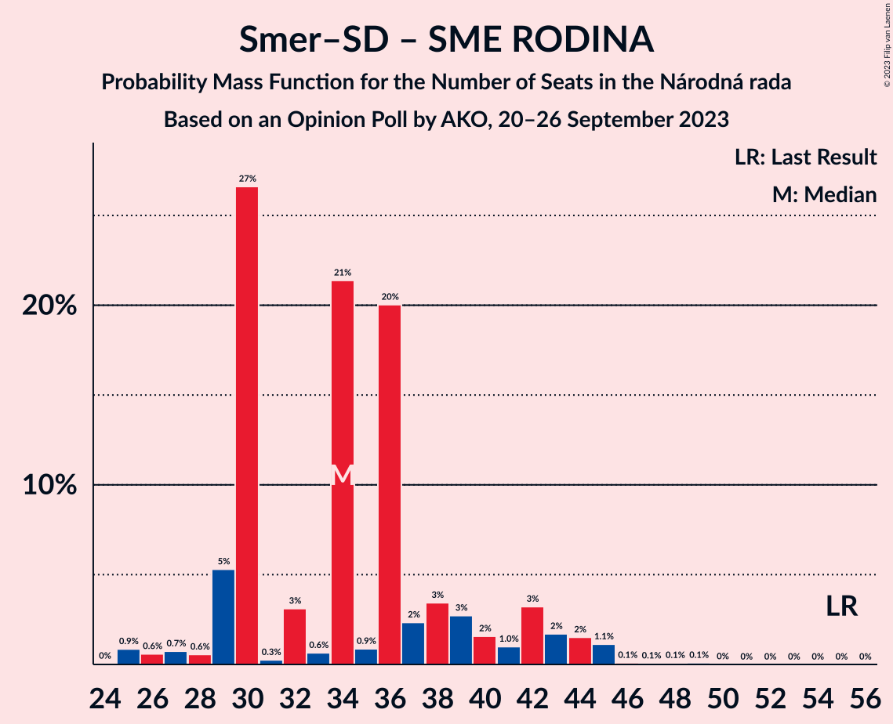

| Number of Seats | Probability | Accumulated | Special Marks |
|:---------------:|:-----------:|:-----------:|:-------------:|
| 24 | 0% | 100% |  |
| 25 | 0.9% | 99.9% |  |
| 26 | 0.6% | 99.1% |  |
| 27 | 0.7% | 98.5% |  |
| 28 | 0.6% | 98% |  |
| 29 | 5% | 97% |  |
| 30 | 27% | 92% | Median |
| 31 | 0.3% | 65% |  |
| 32 | 3% | 65% |  |
| 33 | 0.6% | 62% |  |
| 34 | 21% | 61% |  |
| 35 | 0.9% | 40% |  |
| 36 | 20% | 39% |  |
| 37 | 2% | 19% |  |
| 38 | 3% | 17% |  |
| 39 | 3% | 13% |  |
| 40 | 2% | 10% |  |
| 41 | 1.0% | 9% |  |
| 42 | 3% | 8% |  |
| 43 | 2% | 5% |  |
| 44 | 2% | 3% |  |
| 45 | 1.1% | 1.5% |  |
| 46 | 0.1% | 0.4% |  |
| 47 | 0.1% | 0.3% |  |
| 48 | 0.1% | 0.2% |  |
| 49 | 0.1% | 0.1% |  |
| 50 | 0% | 0% |  |
| 51 | 0% | 0% |  |
| 52 | 0% | 0% |  |
| 53 | 0% | 0% |  |
| 54 | 0% | 0% |  |
| 55 | 0% | 0% | Last Result |

### HLAS–sociálna demokracia – Slovenská národná strana

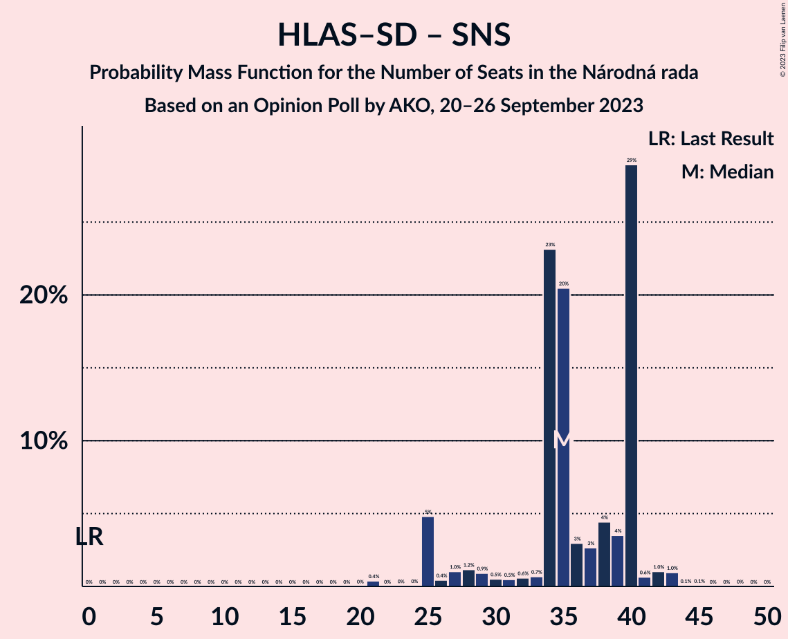

| Number of Seats | Probability | Accumulated | Special Marks |
|:---------------:|:-----------:|:-----------:|:-------------:|
| 0 | 0% | 100% | Last Result |
| 1 | 0% | 100% |  |
| 2 | 0% | 100% |  |
| 3 | 0% | 100% |  |
| 4 | 0% | 100% |  |
| 5 | 0% | 100% |  |
| 6 | 0% | 100% |  |
| 7 | 0% | 100% |  |
| 8 | 0% | 100% |  |
| 9 | 0% | 100% |  |
| 10 | 0% | 100% |  |
| 11 | 0% | 100% |  |
| 12 | 0% | 100% |  |
| 13 | 0% | 100% |  |
| 14 | 0% | 100% |  |
| 15 | 0% | 100% |  |
| 16 | 0% | 100% |  |
| 17 | 0% | 100% |  |
| 18 | 0% | 100% |  |
| 19 | 0% | 100% |  |
| 20 | 0% | 100% |  |
| 21 | 0.4% | 100% |  |
| 22 | 0% | 99.6% |  |
| 23 | 0% | 99.6% |  |
| 24 | 0% | 99.6% |  |
| 25 | 5% | 99.5% |  |
| 26 | 0.4% | 95% |  |
| 27 | 1.0% | 94% |  |
| 28 | 1.2% | 93% |  |
| 29 | 0.9% | 92% |  |
| 30 | 0.5% | 91% |  |
| 31 | 0.5% | 91% |  |
| 32 | 0.6% | 90% |  |
| 33 | 0.7% | 90% |  |
| 34 | 23% | 89% |  |
| 35 | 20% | 66% | Median |
| 36 | 3% | 45% |  |
| 37 | 3% | 42% |  |
| 38 | 4% | 40% |  |
| 39 | 4% | 35% |  |
| 40 | 29% | 32% |  |
| 41 | 0.6% | 3% |  |
| 42 | 1.0% | 2% |  |
| 43 | 1.0% | 1.1% |  |
| 44 | 0.1% | 0.1% |  |
| 45 | 0.1% | 0.1% |  |
| 46 | 0% | 0% |  |

### HLAS–sociálna demokracia – SME RODINA

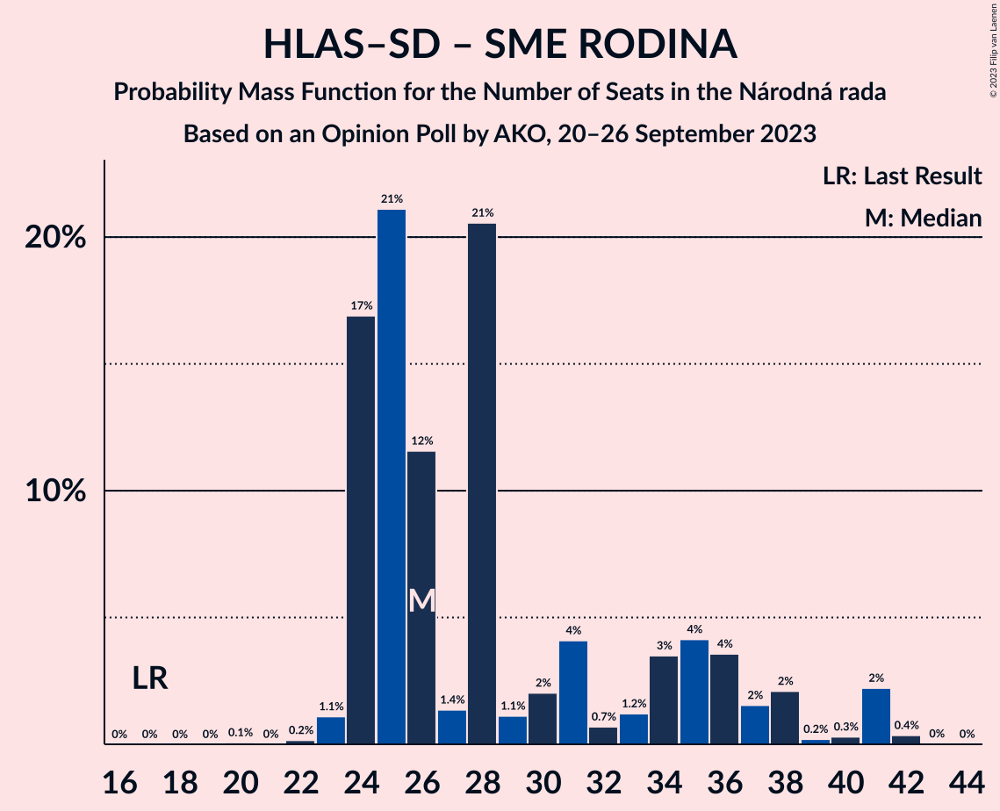

| Number of Seats | Probability | Accumulated | Special Marks |
|:---------------:|:-----------:|:-----------:|:-------------:|
| 17 | 0% | 100% | Last Result |
| 18 | 0% | 100% |  |
| 19 | 0% | 100% |  |
| 20 | 0.1% | 100% |  |
| 21 | 0% | 99.9% |  |
| 22 | 0.2% | 99.9% |  |
| 23 | 1.1% | 99.7% |  |
| 24 | 17% | 98.7% |  |
| 25 | 21% | 82% | Median |
| 26 | 12% | 61% |  |
| 27 | 1.4% | 49% |  |
| 28 | 21% | 48% |  |
| 29 | 1.1% | 27% |  |
| 30 | 2% | 26% |  |
| 31 | 4% | 24% |  |
| 32 | 0.7% | 20% |  |
| 33 | 1.2% | 19% |  |
| 34 | 3% | 18% |  |
| 35 | 4% | 14% |  |
| 36 | 4% | 10% |  |
| 37 | 2% | 7% |  |
| 38 | 2% | 5% |  |
| 39 | 0.2% | 3% |  |
| 40 | 0.3% | 3% |  |
| 41 | 2% | 3% |  |
| 42 | 0.4% | 0.4% |  |
| 43 | 0% | 0.1% |  |
| 44 | 0% | 0% |  |

### SMER–sociálna demokracia

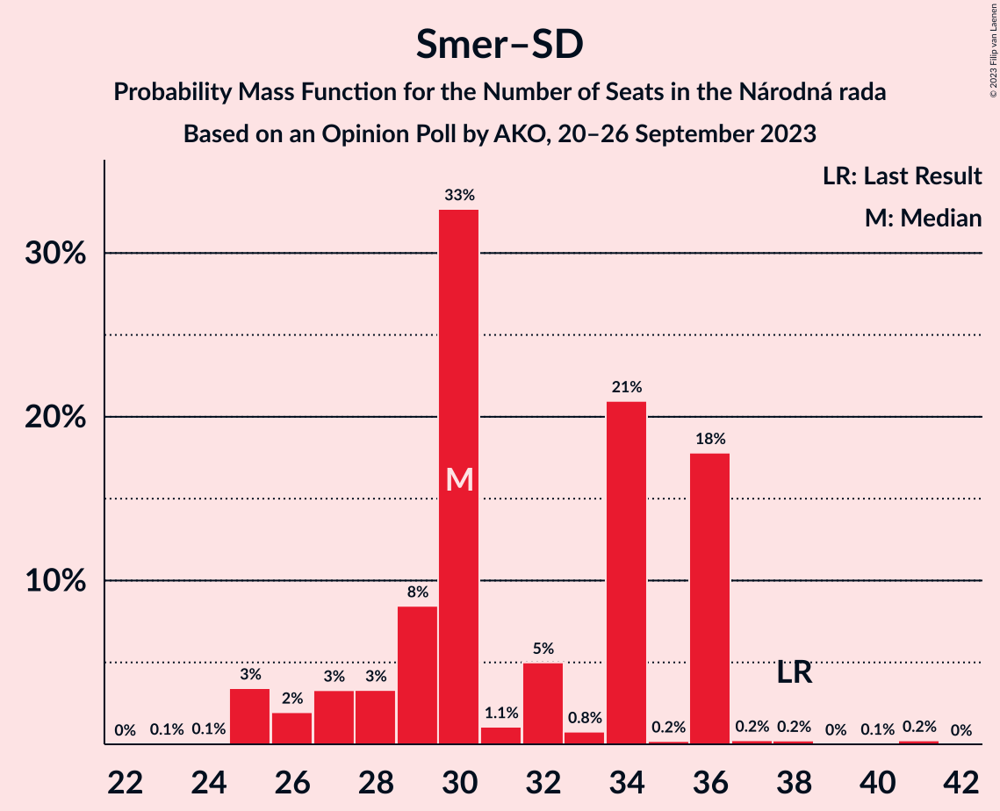

| Number of Seats | Probability | Accumulated | Special Marks |
|:---------------:|:-----------:|:-----------:|:-------------:|
| 23 | 0.1% | 100% |  |
| 24 | 0.1% | 99.9% |  |
| 25 | 3% | 99.8% |  |
| 26 | 2% | 96% |  |
| 27 | 3% | 94% |  |
| 28 | 3% | 91% |  |
| 29 | 8% | 88% |  |
| 30 | 33% | 79% | Median |
| 31 | 1.1% | 47% |  |
| 32 | 5% | 46% |  |
| 33 | 0.8% | 41% |  |
| 34 | 21% | 40% |  |
| 35 | 0.2% | 19% |  |
| 36 | 18% | 19% |  |
| 37 | 0.2% | 0.8% |  |
| 38 | 0.2% | 0.6% | Last Result |
| 39 | 0% | 0.4% |  |
| 40 | 0.1% | 0.3% |  |
| 41 | 0.2% | 0.3% |  |
| 42 | 0% | 0% |  |

## Technical Information

### Opinion Poll

+ **Polling firm:** AKO
+ **Commissioner(s):** —
+ **Fieldwork period:** 20–26 September 2023

### Calculations

+ **Sample size:** 1000
+ **Simulations done:** 1,048,576
+ **Error estimate:** 5.97%

