# Opinion Poll by Focus, 22–26 September 2023

<a href="#voting-intentions">Voting Intentions</a> | <a href="#seats">Seats</a> | <a href="#coalitions">Coalitions</a> | <a href="#technical-information">Technical Information</a>

## Voting Intentions

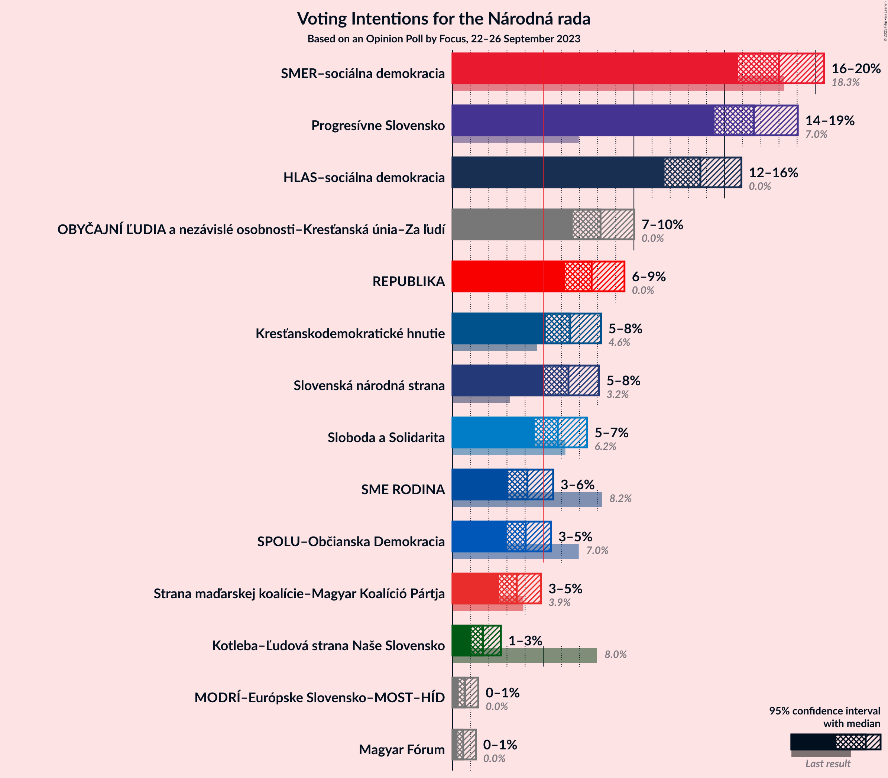

### Confidence Intervals

| Party | Last Result | Poll Result | 80% Confidence Interval | 90% Confidence Interval | 95% Confidence Interval | 99% Confidence Interval |
|:-----:|:-----------:|:-----------:|:-----------------------:|:-----------------------:|:-----------------------:|:-----------------------:|
| SMER–sociálna demokracia | 18.3% | 18.0% | 16.5–19.6% |16.1–20.1% |15.7–20.5% |15.1–21.3% |
| Progresívne Slovensko | 7.0% | 16.6% | 15.2–18.2% |14.8–18.6% |14.4–19.0% |13.8–19.8% |
| HLAS–sociálna demokracia | 0.0% | 13.7% | 12.4–15.1% |12.0–15.6% |11.7–15.9% |11.1–16.7% |
| OBYČAJNÍ ĽUDIA a nezávislé osobnosti–Kresťanská únia–Za ľudí | 0.0% | 8.2% | 7.1–9.4% |6.9–9.7% |6.6–10.0% |6.2–10.6% |
| REPUBLIKA | 0.0% | 7.7% | 6.7–8.9% |6.4–9.2% |6.2–9.5% |5.7–10.1% |
| Kresťanskodemokratické hnutie | 4.6% | 6.5% | 5.6–7.6% |5.3–7.9% |5.1–8.2% |4.7–8.7% |
| Slovenská národná strana | 3.2% | 6.4% | 5.5–7.5% |5.3–7.8% |5.0–8.1% |4.6–8.6% |
| Sloboda a Solidarita | 6.2% | 5.8% | 5.0–6.9% |4.7–7.1% |4.5–7.4% |4.1–8.0% |
| SME RODINA | 8.2% | 4.1% | 3.4–5.0% |3.2–5.3% |3.1–5.5% |2.8–6.0% |
| SPOLU–Občianska Demokracia | 7.0% | 4.0% | 3.3–4.9% |3.1–5.2% |3.0–5.4% |2.7–5.9% |
| Strana maďarskej koalície–Magyar Koalíció Pártja | 3.9% | 3.5% | 2.9–4.4% |2.7–4.6% |2.6–4.9% |2.3–5.3% |
| Kotleba–Ľudová strana Naše Slovensko | 8.0% | 1.7% | 1.2–2.3% |1.1–2.5% |1.0–2.7% |0.9–3.0% |
| MODRÍ–Európske Slovensko–MOST–HÍD | 0.0% | 0.7% | 0.5–1.2% |0.4–1.3% |0.3–1.4% |0.2–1.7% |
| Magyar Fórum | 0.0% | 0.6% | 0.4–1.0% |0.3–1.2% |0.3–1.3% |0.2–1.5% |

*Note:* The poll result column reflects the actual value used in the calculations. Published results may vary slightly, and in addition be rounded to fewer digits.

## Seats

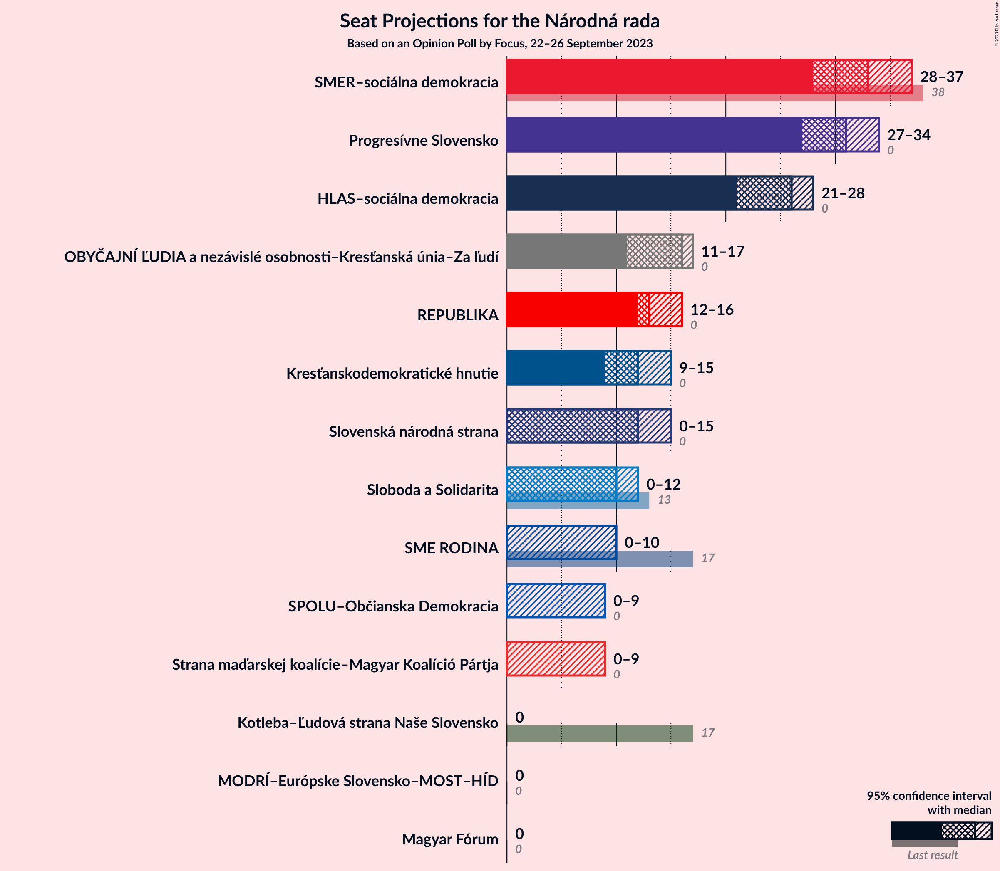

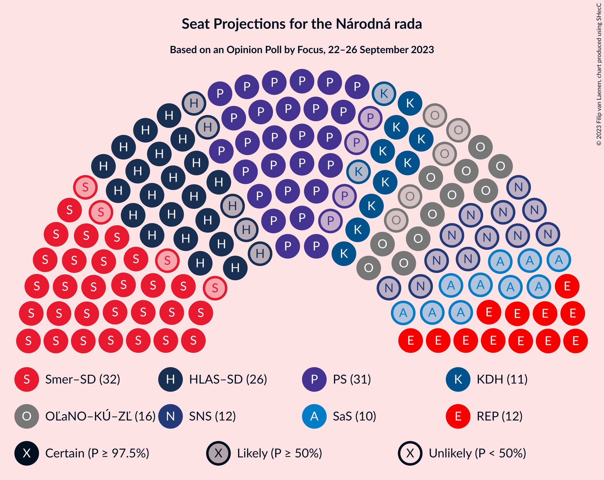

### Confidence Intervals

| Party | Last Result | Median | 80% Confidence Interval | 90% Confidence Interval | 95% Confidence Interval | 99% Confidence Interval |
|:-----:|:-----------:|:------:|:-----------------------:|:-----------------------:|:-----------------------:|:-----------------------:|
| <a href="#smer–sociálna-demokracia">SMER–sociálna demokracia</a> | 38 | 33 | 29–35 |29–35 |28–37 |28–39 |
| <a href="#progresívne-slovensko">Progresívne Slovensko</a> | 0 | 31 | 28–34 |28–34 |27–34 |26–37 |
| <a href="#hlas–sociálna-demokracia">HLAS–sociálna demokracia</a> | 0 | 26 | 22–28 |21–28 |21–28 |21–30 |
| <a href="#obyčajní-ľudia-a-nezávislé-osobnosti–kresťanská-únia–za-ľudí">OBYČAJNÍ ĽUDIA a nezávislé osobnosti–Kresťanská únia–Za ľudí</a> | 0 | 16 | 12–17 |12–17 |11–17 |11–18 |
| <a href="#republika">REPUBLIKA</a> | 0 | 13 | 12–14 |12–15 |12–16 |10–18 |
| <a href="#kresťanskodemokratické-hnutie">Kresťanskodemokratické hnutie</a> | 0 | 12 | 10–14 |9–15 |9–15 |0–15 |
| <a href="#slovenská-národná-strana">Slovenská národná strana</a> | 0 | 12 | 10–12 |10–13 |0–15 |0–15 |
| <a href="#sloboda-a-solidarita">Sloboda a Solidarita</a> | 13 | 10 | 0–11 |0–12 |0–12 |0–14 |
| <a href="#sme-rodina">SME RODINA</a> | 17 | 0 | 0 |0–8 |0–10 |0–10 |
| <a href="#spolu–občianska-demokracia">SPOLU–Občianska Demokracia</a> | 0 | 0 | 0 |0–9 |0–9 |0–10 |
| <a href="#strana-maďarskej-koalície–magyar-koalíció-pártja">Strana maďarskej koalície–Magyar Koalíció Pártja</a> | 0 | 0 | 0 |0 |0–9 |0–9 |
| <a href="#kotleba–ľudová-strana-naše-slovensko">Kotleba–Ľudová strana Naše Slovensko</a> | 17 | 0 | 0 |0 |0 |0 |
| <a href="#modrí–európske-slovensko–most–híd">MODRÍ–Európske Slovensko–MOST–HÍD</a> | 0 | 0 | 0 |0 |0 |0 |
| <a href="#magyar-fórum">Magyar Fórum</a> | 0 | 0 | 0 |0 |0 |0 |

### SMER–sociálna demokracia

*For a full overview of the results for this party, see the [SMER–sociálna demokracia](party-smer–sociálnademokracia.html) page.*

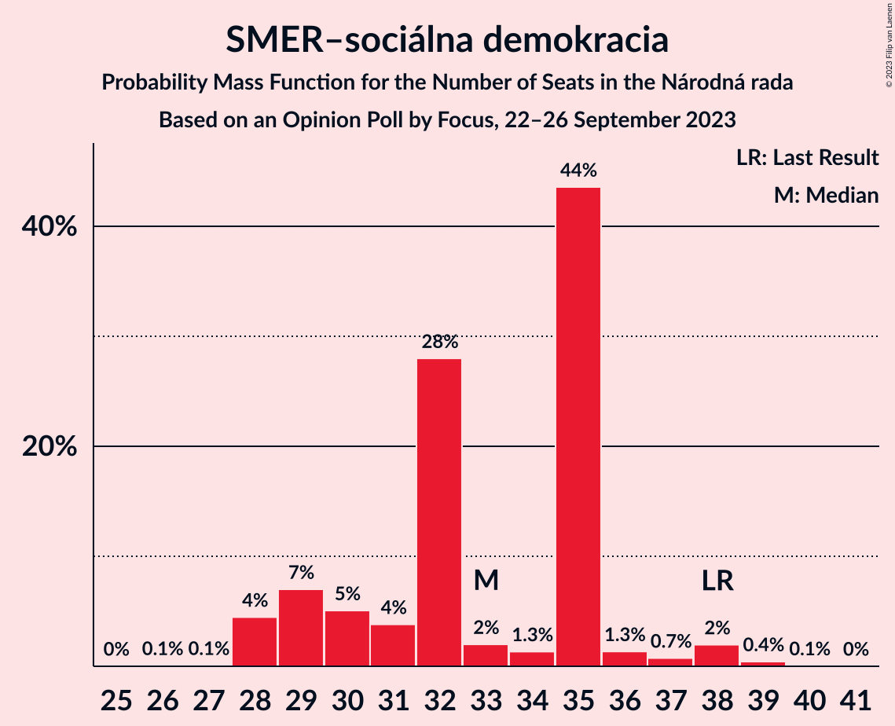

| Number of Seats | Probability | Accumulated | Special Marks |
|:---------------:|:-----------:|:-----------:|:-------------:|
| 26 | 0.1% | 100% |  |
| 27 | 0.1% | 99.9% |  |
| 28 | 4% | 99.8% |  |
| 29 | 7% | 95% |  |
| 30 | 5% | 88% |  |
| 31 | 4% | 83% |  |
| 32 | 28% | 79% |  |
| 33 | 2% | 51% | Median |
| 34 | 1.3% | 49% |  |
| 35 | 44% | 48% |  |
| 36 | 1.3% | 5% |  |
| 37 | 0.7% | 3% |  |
| 38 | 2% | 2% | Last Result |
| 39 | 0.4% | 0.5% |  |
| 40 | 0.1% | 0.1% |  |
| 41 | 0% | 0% |  |

### Progresívne Slovensko

*For a full overview of the results for this party, see the [Progresívne Slovensko](party-progresívneslovensko.html) page.*

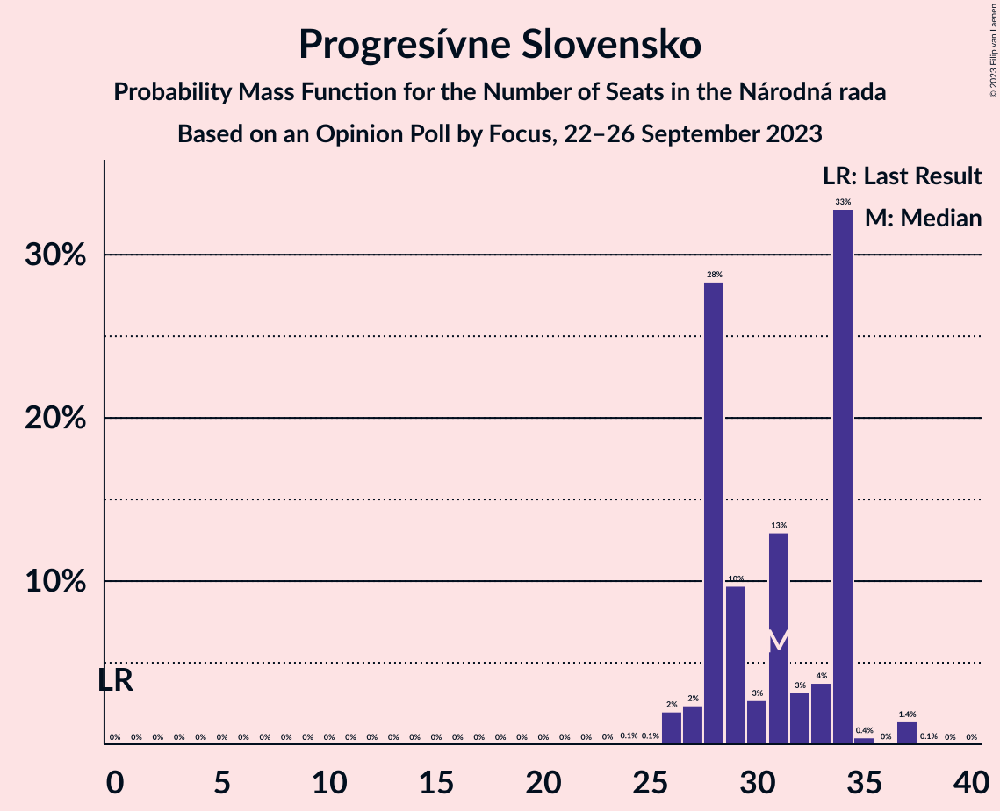

| Number of Seats | Probability | Accumulated | Special Marks |
|:---------------:|:-----------:|:-----------:|:-------------:|
| 0 | 0% | 100% | Last Result |
| 1 | 0% | 100% |  |
| 2 | 0% | 100% |  |
| 3 | 0% | 100% |  |
| 4 | 0% | 100% |  |
| 5 | 0% | 100% |  |
| 6 | 0% | 100% |  |
| 7 | 0% | 100% |  |
| 8 | 0% | 100% |  |
| 9 | 0% | 100% |  |
| 10 | 0% | 100% |  |
| 11 | 0% | 100% |  |
| 12 | 0% | 100% |  |
| 13 | 0% | 100% |  |
| 14 | 0% | 100% |  |
| 15 | 0% | 100% |  |
| 16 | 0% | 100% |  |
| 17 | 0% | 100% |  |
| 18 | 0% | 100% |  |
| 19 | 0% | 100% |  |
| 20 | 0% | 100% |  |
| 21 | 0% | 100% |  |
| 22 | 0% | 100% |  |
| 23 | 0% | 100% |  |
| 24 | 0.1% | 100% |  |
| 25 | 0.1% | 99.9% |  |
| 26 | 2% | 99.8% |  |
| 27 | 2% | 98% |  |
| 28 | 28% | 95% |  |
| 29 | 10% | 67% |  |
| 30 | 3% | 57% |  |
| 31 | 13% | 55% | Median |
| 32 | 3% | 42% |  |
| 33 | 4% | 38% |  |
| 34 | 33% | 35% |  |
| 35 | 0.4% | 2% |  |
| 36 | 0% | 2% |  |
| 37 | 1.4% | 1.5% |  |
| 38 | 0.1% | 0.1% |  |
| 39 | 0% | 0% |  |

### HLAS–sociálna demokracia

*For a full overview of the results for this party, see the [HLAS–sociálna demokracia](party-hlas–sociálnademokracia.html) page.*

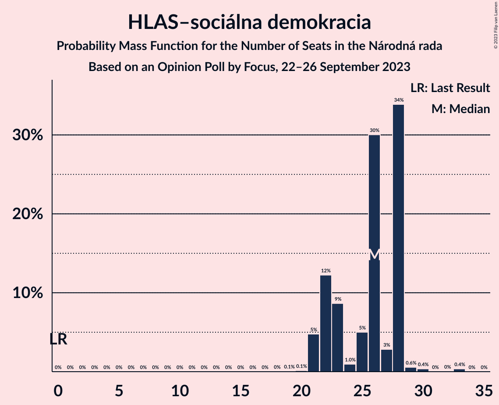

| Number of Seats | Probability | Accumulated | Special Marks |
|:---------------:|:-----------:|:-----------:|:-------------:|
| 0 | 0% | 100% | Last Result |
| 1 | 0% | 100% |  |
| 2 | 0% | 100% |  |
| 3 | 0% | 100% |  |
| 4 | 0% | 100% |  |
| 5 | 0% | 100% |  |
| 6 | 0% | 100% |  |
| 7 | 0% | 100% |  |
| 8 | 0% | 100% |  |
| 9 | 0% | 100% |  |
| 10 | 0% | 100% |  |
| 11 | 0% | 100% |  |
| 12 | 0% | 100% |  |
| 13 | 0% | 100% |  |
| 14 | 0% | 100% |  |
| 15 | 0% | 100% |  |
| 16 | 0% | 100% |  |
| 17 | 0% | 100% |  |
| 18 | 0% | 100% |  |
| 19 | 0.1% | 100% |  |
| 20 | 0.1% | 99.9% |  |
| 21 | 5% | 99.7% |  |
| 22 | 12% | 95% |  |
| 23 | 9% | 83% |  |
| 24 | 1.0% | 74% |  |
| 25 | 5% | 73% |  |
| 26 | 30% | 68% | Median |
| 27 | 3% | 38% |  |
| 28 | 34% | 35% |  |
| 29 | 0.6% | 1.4% |  |
| 30 | 0.4% | 0.8% |  |
| 31 | 0% | 0.4% |  |
| 32 | 0% | 0.4% |  |
| 33 | 0.4% | 0.4% |  |
| 34 | 0% | 0% |  |

### OBYČAJNÍ ĽUDIA a nezávislé osobnosti–Kresťanská únia–Za ľudí

*For a full overview of the results for this party, see the [OBYČAJNÍ ĽUDIA a nezávislé osobnosti–Kresťanská únia–Za ľudí](party-obyčajníľudiaanezávisléosobnosti–kresťanskáúnia–zaľudí.html) page.*

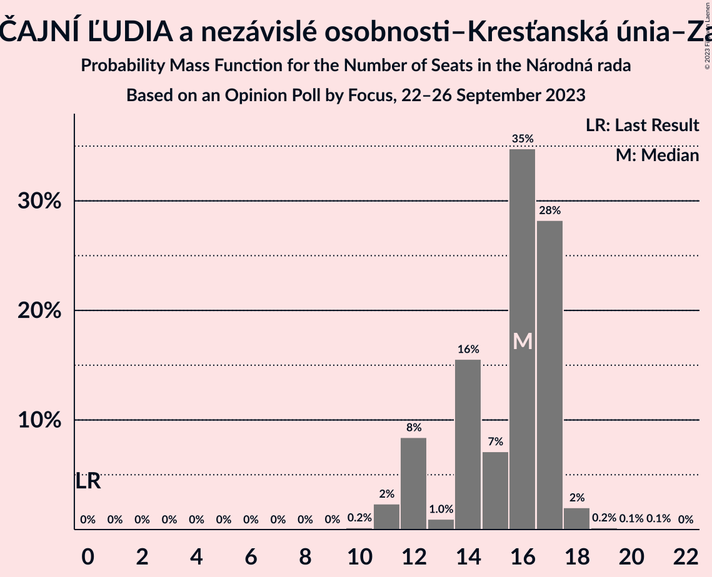

| Number of Seats | Probability | Accumulated | Special Marks |
|:---------------:|:-----------:|:-----------:|:-------------:|
| 0 | 0% | 100% | Last Result |
| 1 | 0% | 100% |  |
| 2 | 0% | 100% |  |
| 3 | 0% | 100% |  |
| 4 | 0% | 100% |  |
| 5 | 0% | 100% |  |
| 6 | 0% | 100% |  |
| 7 | 0% | 100% |  |
| 8 | 0% | 100% |  |
| 9 | 0% | 100% |  |
| 10 | 0.2% | 100% |  |
| 11 | 2% | 99.8% |  |
| 12 | 8% | 97% |  |
| 13 | 1.0% | 89% |  |
| 14 | 16% | 88% |  |
| 15 | 7% | 73% |  |
| 16 | 35% | 65% | Median |
| 17 | 28% | 31% |  |
| 18 | 2% | 2% |  |
| 19 | 0.2% | 0.4% |  |
| 20 | 0.1% | 0.2% |  |
| 21 | 0.1% | 0.1% |  |
| 22 | 0% | 0% |  |

### REPUBLIKA

*For a full overview of the results for this party, see the [REPUBLIKA](party-republika.html) page.*

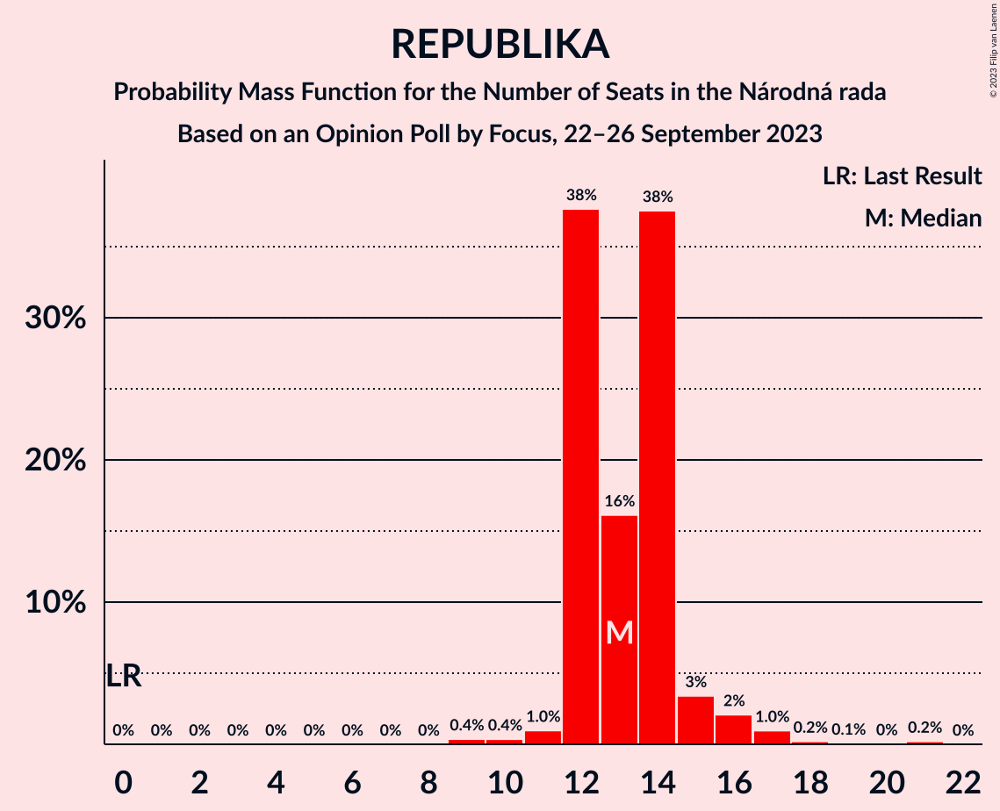

| Number of Seats | Probability | Accumulated | Special Marks |
|:---------------:|:-----------:|:-----------:|:-------------:|
| 0 | 0% | 100% | Last Result |
| 1 | 0% | 100% |  |
| 2 | 0% | 100% |  |
| 3 | 0% | 100% |  |
| 4 | 0% | 100% |  |
| 5 | 0% | 100% |  |
| 6 | 0% | 100% |  |
| 7 | 0% | 100% |  |
| 8 | 0% | 100% |  |
| 9 | 0.4% | 100% |  |
| 10 | 0.4% | 99.6% |  |
| 11 | 1.0% | 99.3% |  |
| 12 | 38% | 98% |  |
| 13 | 16% | 61% | Median |
| 14 | 38% | 45% |  |
| 15 | 3% | 7% |  |
| 16 | 2% | 4% |  |
| 17 | 1.0% | 1.5% |  |
| 18 | 0.2% | 0.5% |  |
| 19 | 0.1% | 0.3% |  |
| 20 | 0% | 0.2% |  |
| 21 | 0.2% | 0.2% |  |
| 22 | 0% | 0% |  |

### Kresťanskodemokratické hnutie

*For a full overview of the results for this party, see the [Kresťanskodemokratické hnutie](party-kresťanskodemokratickéhnutie.html) page.*

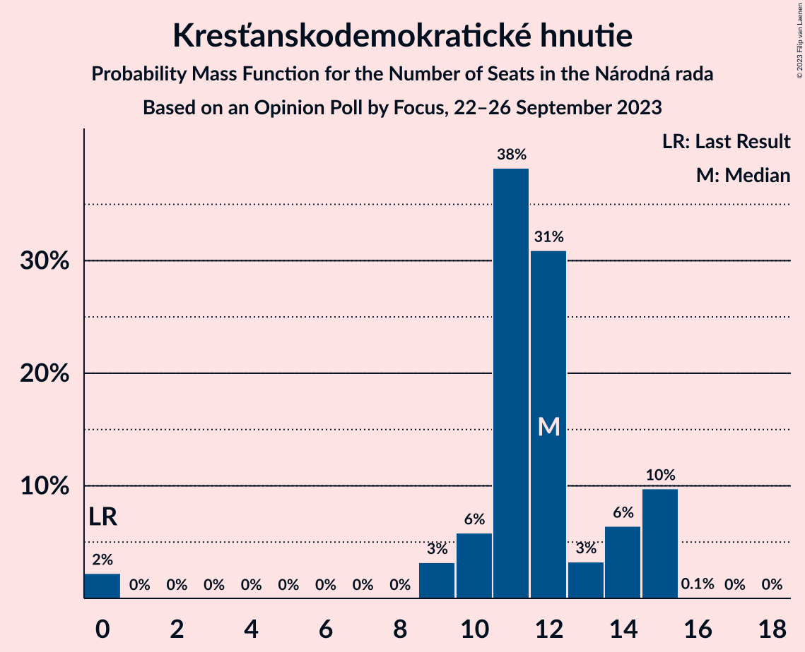

| Number of Seats | Probability | Accumulated | Special Marks |
|:---------------:|:-----------:|:-----------:|:-------------:|
| 0 | 2% | 100% | Last Result |
| 1 | 0% | 98% |  |
| 2 | 0% | 98% |  |
| 3 | 0% | 98% |  |
| 4 | 0% | 98% |  |
| 5 | 0% | 98% |  |
| 6 | 0% | 98% |  |
| 7 | 0% | 98% |  |
| 8 | 0% | 98% |  |
| 9 | 3% | 98% |  |
| 10 | 6% | 95% |  |
| 11 | 38% | 89% |  |
| 12 | 31% | 50% | Median |
| 13 | 3% | 20% |  |
| 14 | 6% | 16% |  |
| 15 | 10% | 10% |  |
| 16 | 0.1% | 0.1% |  |
| 17 | 0% | 0.1% |  |
| 18 | 0% | 0% |  |

### Slovenská národná strana

*For a full overview of the results for this party, see the [Slovenská národná strana](party-slovenskánárodnástrana.html) page.*

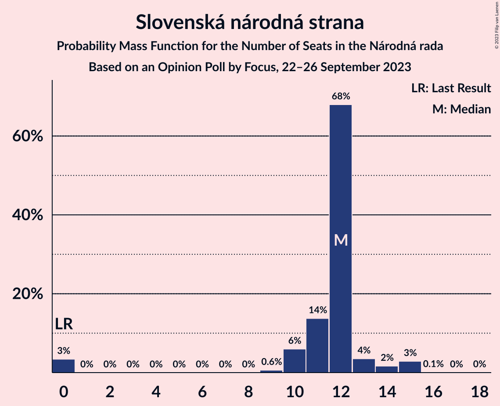

| Number of Seats | Probability | Accumulated | Special Marks |
|:---------------:|:-----------:|:-----------:|:-------------:|
| 0 | 3% | 100% | Last Result |
| 1 | 0% | 97% |  |
| 2 | 0% | 97% |  |
| 3 | 0% | 97% |  |
| 4 | 0% | 97% |  |
| 5 | 0% | 97% |  |
| 6 | 0% | 97% |  |
| 7 | 0% | 97% |  |
| 8 | 0% | 97% |  |
| 9 | 0.6% | 97% |  |
| 10 | 6% | 96% |  |
| 11 | 14% | 90% |  |
| 12 | 68% | 76% | Median |
| 13 | 4% | 8% |  |
| 14 | 2% | 5% |  |
| 15 | 3% | 3% |  |
| 16 | 0.1% | 0.1% |  |
| 17 | 0% | 0.1% |  |
| 18 | 0% | 0% |  |

### Sloboda a Solidarita

*For a full overview of the results for this party, see the [Sloboda a Solidarita](party-slobodaasolidarita.html) page.*

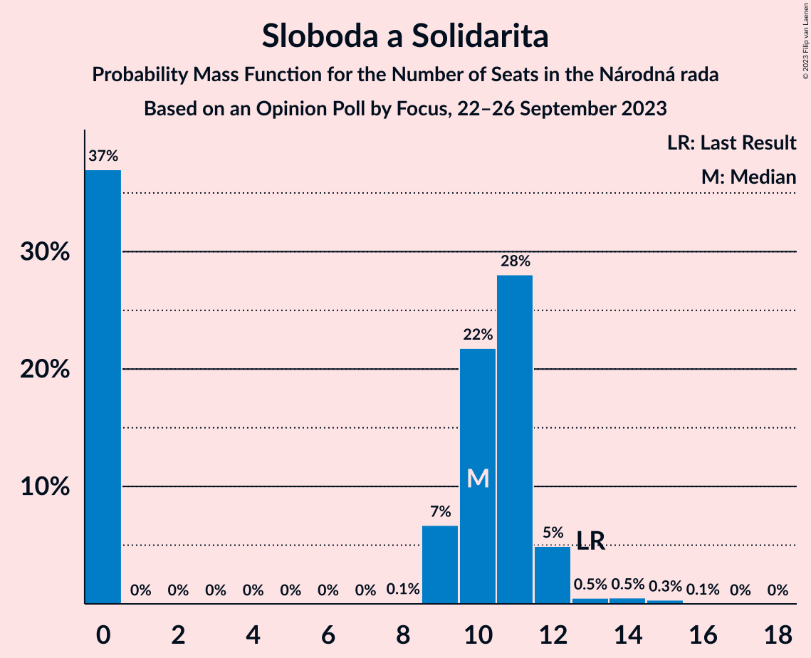

| Number of Seats | Probability | Accumulated | Special Marks |
|:---------------:|:-----------:|:-----------:|:-------------:|
| 0 | 37% | 100% |  |
| 1 | 0% | 63% |  |
| 2 | 0% | 63% |  |
| 3 | 0% | 63% |  |
| 4 | 0% | 63% |  |
| 5 | 0% | 63% |  |
| 6 | 0% | 63% |  |
| 7 | 0% | 63% |  |
| 8 | 0.1% | 63% |  |
| 9 | 7% | 63% |  |
| 10 | 22% | 56% | Median |
| 11 | 28% | 34% |  |
| 12 | 5% | 6% |  |
| 13 | 0.5% | 1.4% | Last Result |
| 14 | 0.5% | 0.9% |  |
| 15 | 0.3% | 0.4% |  |
| 16 | 0.1% | 0.1% |  |
| 17 | 0% | 0% |  |

### SME RODINA

*For a full overview of the results for this party, see the [SME RODINA](party-smerodina.html) page.*

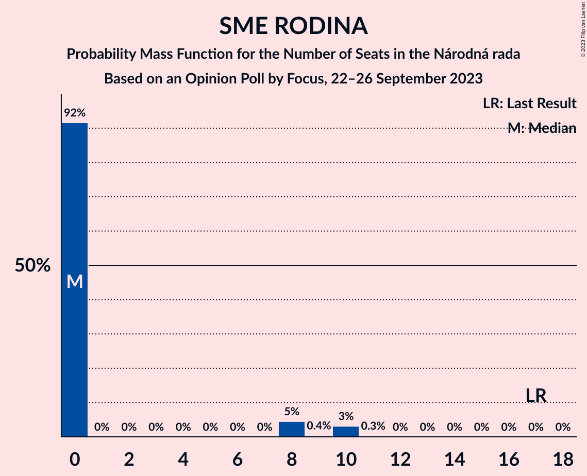

| Number of Seats | Probability | Accumulated | Special Marks |
|:---------------:|:-----------:|:-----------:|:-------------:|
| 0 | 92% | 100% | Median |
| 1 | 0% | 8% |  |
| 2 | 0% | 8% |  |
| 3 | 0% | 8% |  |
| 4 | 0% | 8% |  |
| 5 | 0% | 8% |  |
| 6 | 0% | 8% |  |
| 7 | 0% | 8% |  |
| 8 | 5% | 8% |  |
| 9 | 0.4% | 4% |  |
| 10 | 3% | 3% |  |
| 11 | 0.3% | 0.3% |  |
| 12 | 0% | 0% |  |
| 13 | 0% | 0% |  |
| 14 | 0% | 0% |  |
| 15 | 0% | 0% |  |
| 16 | 0% | 0% |  |
| 17 | 0% | 0% | Last Result |

### SPOLU–Občianska Demokracia

*For a full overview of the results for this party, see the [SPOLU–Občianska Demokracia](party-spolu–občianskademokracia.html) page.*

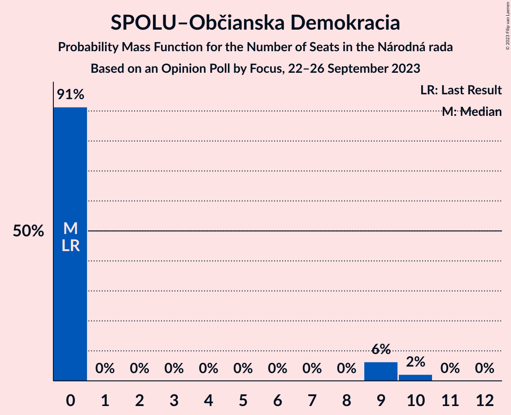

| Number of Seats | Probability | Accumulated | Special Marks |
|:---------------:|:-----------:|:-----------:|:-------------:|
| 0 | 91% | 100% | Last Result, Median |
| 1 | 0% | 9% |  |
| 2 | 0% | 9% |  |
| 3 | 0% | 9% |  |
| 4 | 0% | 9% |  |
| 5 | 0% | 9% |  |
| 6 | 0% | 9% |  |
| 7 | 0% | 9% |  |
| 8 | 0% | 9% |  |
| 9 | 6% | 9% |  |
| 10 | 2% | 2% |  |
| 11 | 0% | 0.1% |  |
| 12 | 0% | 0% |  |

### Strana maďarskej koalície–Magyar Koalíció Pártja

*For a full overview of the results for this party, see the [Strana maďarskej koalície–Magyar Koalíció Pártja](party-stranamaďarskejkoalície–magyarkoalíciópártja.html) page.*

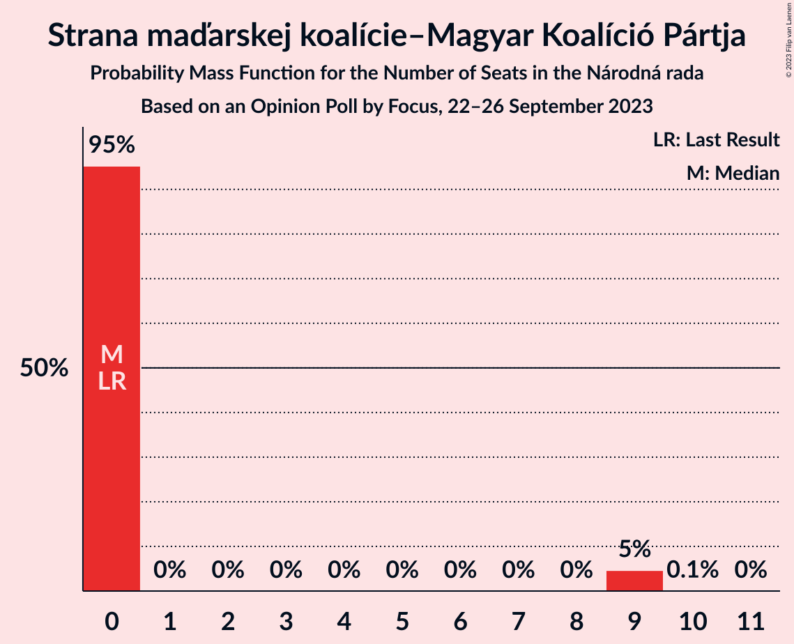

| Number of Seats | Probability | Accumulated | Special Marks |
|:---------------:|:-----------:|:-----------:|:-------------:|
| 0 | 95% | 100% | Last Result, Median |
| 1 | 0% | 5% |  |
| 2 | 0% | 5% |  |
| 3 | 0% | 5% |  |
| 4 | 0% | 5% |  |
| 5 | 0% | 5% |  |
| 6 | 0% | 5% |  |
| 7 | 0% | 5% |  |
| 8 | 0% | 5% |  |
| 9 | 5% | 5% |  |
| 10 | 0.1% | 0.1% |  |
| 11 | 0% | 0% |  |

### Kotleba–Ľudová strana Naše Slovensko

*For a full overview of the results for this party, see the [Kotleba–Ľudová strana Naše Slovensko](party-kotleba–ľudovástrananašeslovensko.html) page.*

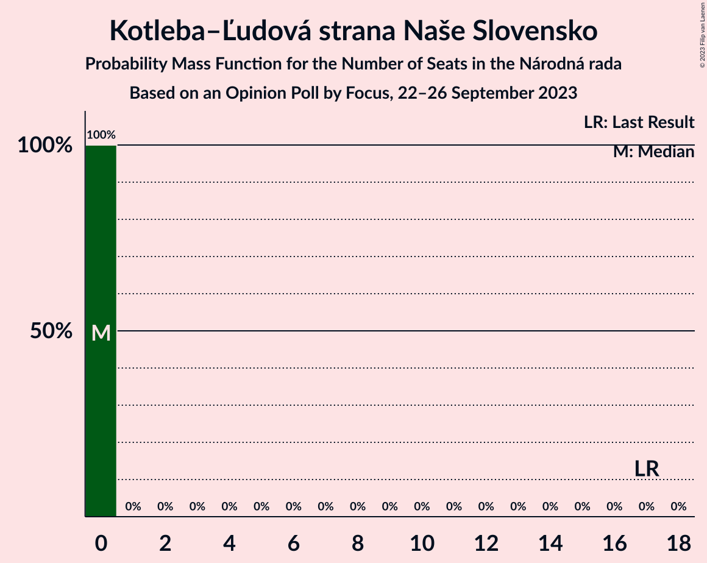

| Number of Seats | Probability | Accumulated | Special Marks |
|:---------------:|:-----------:|:-----------:|:-------------:|
| 0 | 100% | 100% | Median |
| 1 | 0% | 0% |  |
| 2 | 0% | 0% |  |
| 3 | 0% | 0% |  |
| 4 | 0% | 0% |  |
| 5 | 0% | 0% |  |
| 6 | 0% | 0% |  |
| 7 | 0% | 0% |  |
| 8 | 0% | 0% |  |
| 9 | 0% | 0% |  |
| 10 | 0% | 0% |  |
| 11 | 0% | 0% |  |
| 12 | 0% | 0% |  |
| 13 | 0% | 0% |  |
| 14 | 0% | 0% |  |
| 15 | 0% | 0% |  |
| 16 | 0% | 0% |  |
| 17 | 0% | 0% | Last Result |

### MODRÍ–Európske Slovensko–MOST–HÍD

*For a full overview of the results for this party, see the [MODRÍ–Európske Slovensko–MOST–HÍD](party-modrí–európskeslovensko–most–híd.html) page.*

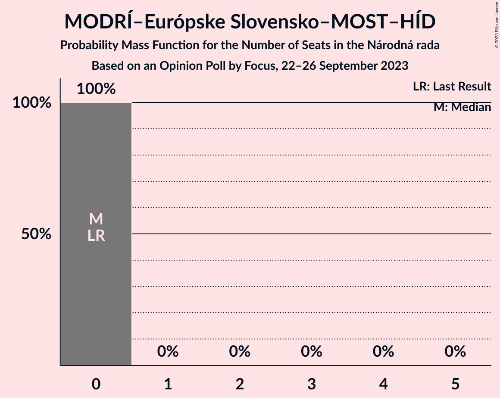

| Number of Seats | Probability | Accumulated | Special Marks |
|:---------------:|:-----------:|:-----------:|:-------------:|
| 0 | 100% | 100% | Last Result, Median |

### Magyar Fórum

*For a full overview of the results for this party, see the [Magyar Fórum](party-magyarfórum.html) page.*

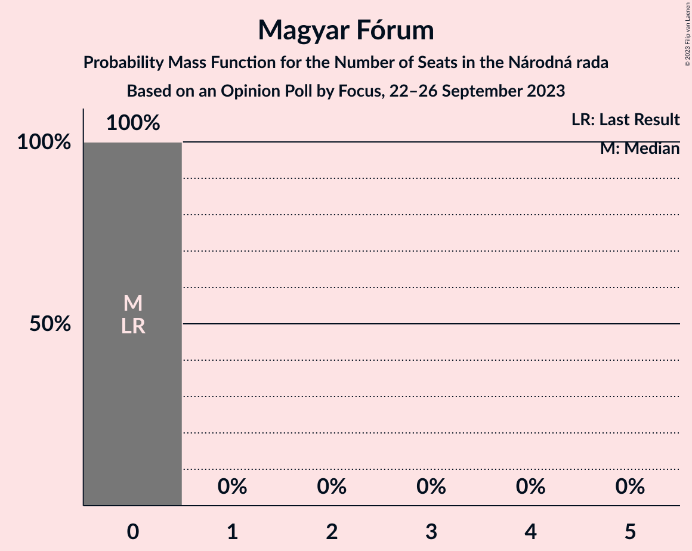

| Number of Seats | Probability | Accumulated | Special Marks |
|:---------------:|:-----------:|:-----------:|:-------------:|
| 0 | 100% | 100% | Last Result, Median |

## Coalitions

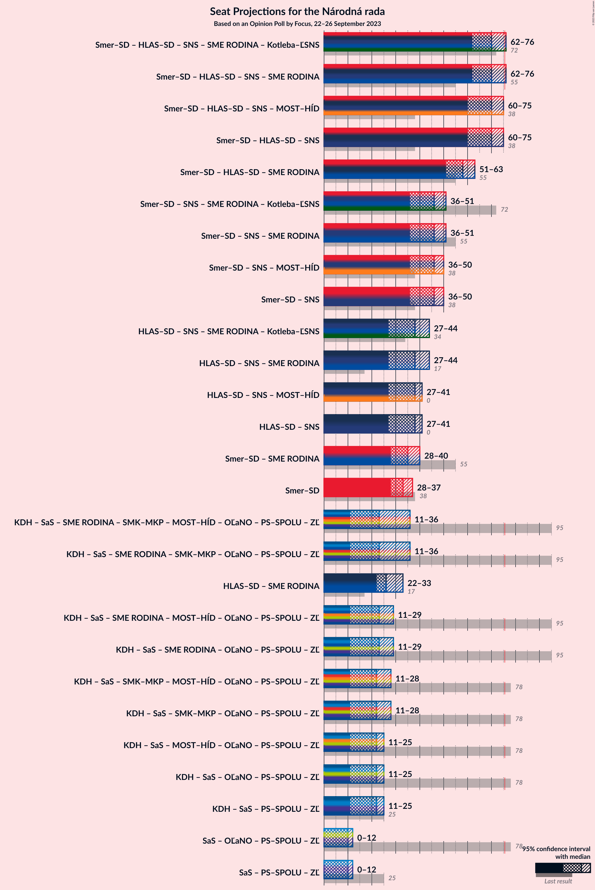

### Confidence Intervals

| Coalition | Last Result | Median | Majority? | 80% Confidence Interval | 90% Confidence Interval | 95% Confidence Interval | 99% Confidence Interval |
|:---------:|:-----------:|:------:|:---------:|:-----------------------:|:-----------------------:|:-----------------------:|:-----------------------:|
| SMER–sociálna demokracia – HLAS–sociálna demokracia – Slovenská národná strana – SME RODINA – Kotleba–Ľudová strana Naše Slovensko | 72 | 70 | 3% | 66–75 | 63–75 | 62–76 | 57–78 |
| SMER–sociálna demokracia – HLAS–sociálna demokracia – Slovenská národná strana – SME RODINA | 55 | 70 | 3% | 66–75 | 63–75 | 62–76 | 57–78 |
| SMER–sociálna demokracia – HLAS–sociálna demokracia – Slovenská národná strana | 38 | 70 | 2% | 63–75 | 60–75 | 60–75 | 57–78 |
| SMER–sociálna demokracia – HLAS–sociálna demokracia – SME RODINA | 55 | 58 | 0% | 55–63 | 54–63 | 51–63 | 51–67 |
| SMER–sociálna demokracia – Slovenská národná strana – SME RODINA – Kotleba–Ľudová strana Naše Slovensko | 72 | 46 | 0% | 41–47 | 40–50 | 36–51 | 31–52 |
| SMER–sociálna demokracia – Slovenská národná strana – SME RODINA | 55 | 46 | 0% | 41–47 | 40–50 | 36–51 | 31–52 |
| SMER–sociálna demokracia – Slovenská národná strana | 38 | 46 | 0% | 40–47 | 39–47 | 36–50 | 31–51 |
| HLAS–sociálna demokracia – Slovenská národná strana – SME RODINA – Kotleba–Ľudová strana Naše Slovensko | 34 | 38 | 0% | 33–40 | 33–41 | 27–44 | 26–45 |
| HLAS–sociálna demokracia – Slovenská národná strana – SME RODINA | 17 | 38 | 0% | 33–40 | 33–41 | 27–44 | 26–45 |
| HLAS–sociálna demokracia – Slovenská národná strana | 0 | 38 | 0% | 33–40 | 31–41 | 27–41 | 26–43 |
| SMER–sociálna demokracia – SME RODINA | 55 | 35 | 0% | 31–37 | 29–38 | 28–40 | 28–40 |
| SMER–sociálna demokracia | 38 | 33 | 0% | 29–35 | 29–35 | 28–37 | 28–39 |
| HLAS–sociálna demokracia – SME RODINA | 17 | 26 | 0% | 22–28 | 22–29 | 22–33 | 22–33 |

### SMER–sociálna demokracia – HLAS–sociálna demokracia – Slovenská národná strana – SME RODINA – Kotleba–Ľudová strana Naše Slovensko

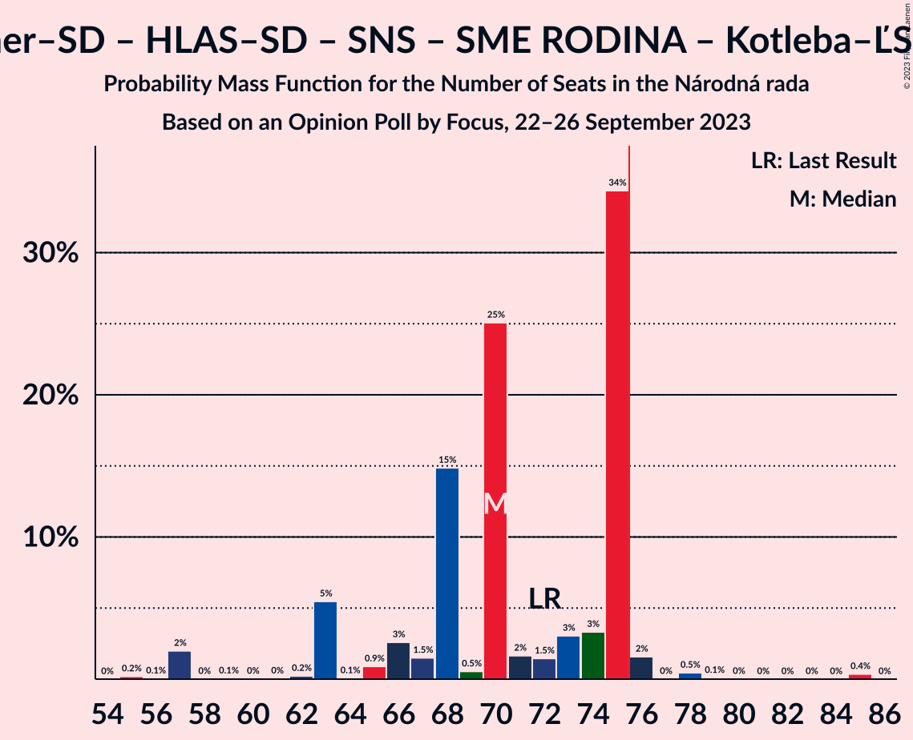

| Number of Seats | Probability | Accumulated | Special Marks |
|:---------------:|:-----------:|:-----------:|:-------------:|
| 55 | 0.2% | 100% |  |
| 56 | 0.1% | 99.8% |  |
| 57 | 2% | 99.7% |  |
| 58 | 0% | 98% |  |
| 59 | 0.1% | 98% |  |
| 60 | 0% | 98% |  |
| 61 | 0% | 98% |  |
| 62 | 0.2% | 98% |  |
| 63 | 5% | 97% |  |
| 64 | 0.1% | 92% |  |
| 65 | 0.9% | 92% |  |
| 66 | 3% | 91% |  |
| 67 | 1.5% | 88% |  |
| 68 | 15% | 87% |  |
| 69 | 0.5% | 72% |  |
| 70 | 25% | 71% |  |
| 71 | 2% | 46% | Median |
| 72 | 1.5% | 45% | Last Result |
| 73 | 3% | 43% |  |
| 74 | 3% | 40% |  |
| 75 | 34% | 37% |  |
| 76 | 2% | 3% | Majority |
| 77 | 0% | 1.0% |  |
| 78 | 0.5% | 0.9% |  |
| 79 | 0.1% | 0.5% |  |
| 80 | 0% | 0.4% |  |
| 81 | 0% | 0.4% |  |
| 82 | 0% | 0.4% |  |
| 83 | 0% | 0.4% |  |
| 84 | 0% | 0.4% |  |
| 85 | 0.4% | 0.4% |  |
| 86 | 0% | 0% |  |

### SMER–sociálna demokracia – HLAS–sociálna demokracia – Slovenská národná strana – SME RODINA

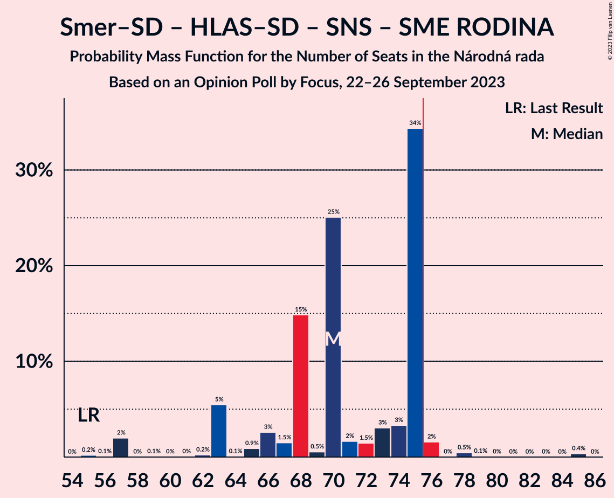

| Number of Seats | Probability | Accumulated | Special Marks |
|:---------------:|:-----------:|:-----------:|:-------------:|
| 55 | 0.2% | 100% | Last Result |
| 56 | 0.1% | 99.8% |  |
| 57 | 2% | 99.7% |  |
| 58 | 0% | 98% |  |
| 59 | 0.1% | 98% |  |
| 60 | 0% | 98% |  |
| 61 | 0% | 98% |  |
| 62 | 0.2% | 98% |  |
| 63 | 5% | 97% |  |
| 64 | 0.1% | 92% |  |
| 65 | 0.9% | 92% |  |
| 66 | 3% | 91% |  |
| 67 | 1.5% | 88% |  |
| 68 | 15% | 87% |  |
| 69 | 0.5% | 72% |  |
| 70 | 25% | 71% |  |
| 71 | 2% | 46% | Median |
| 72 | 1.5% | 45% |  |
| 73 | 3% | 43% |  |
| 74 | 3% | 40% |  |
| 75 | 34% | 37% |  |
| 76 | 2% | 3% | Majority |
| 77 | 0% | 1.0% |  |
| 78 | 0.5% | 0.9% |  |
| 79 | 0.1% | 0.5% |  |
| 80 | 0% | 0.4% |  |
| 81 | 0% | 0.4% |  |
| 82 | 0% | 0.4% |  |
| 83 | 0% | 0.4% |  |
| 84 | 0% | 0.4% |  |
| 85 | 0.4% | 0.4% |  |
| 86 | 0% | 0% |  |

### SMER–sociálna demokracia – HLAS–sociálna demokracia – Slovenská národná strana

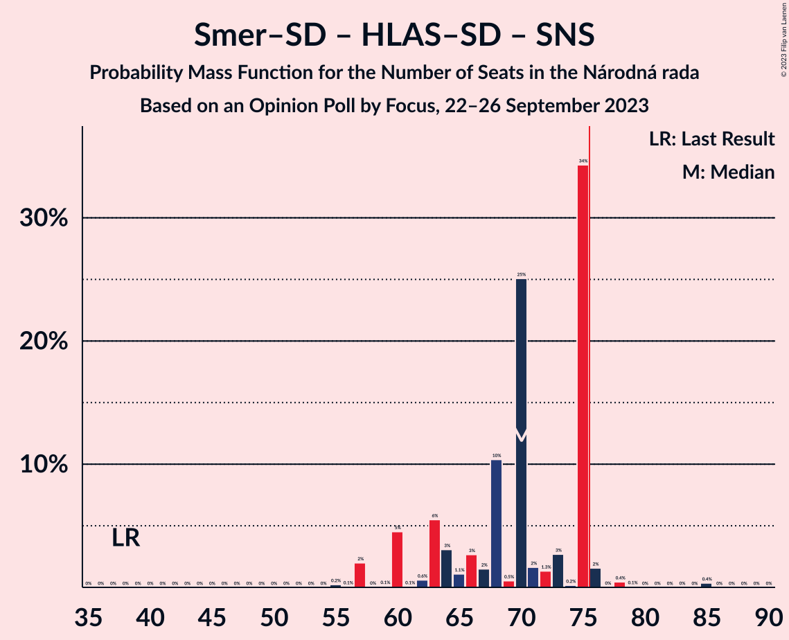

| Number of Seats | Probability | Accumulated | Special Marks |
|:---------------:|:-----------:|:-----------:|:-------------:|
| 38 | 0% | 100% | Last Result |
| 39 | 0% | 100% |  |
| 40 | 0% | 100% |  |
| 41 | 0% | 100% |  |
| 42 | 0% | 100% |  |
| 43 | 0% | 100% |  |
| 44 | 0% | 100% |  |
| 45 | 0% | 100% |  |
| 46 | 0% | 100% |  |
| 47 | 0% | 100% |  |
| 48 | 0% | 100% |  |
| 49 | 0% | 100% |  |
| 50 | 0% | 100% |  |
| 51 | 0% | 100% |  |
| 52 | 0% | 100% |  |
| 53 | 0% | 100% |  |
| 54 | 0% | 100% |  |
| 55 | 0.2% | 100% |  |
| 56 | 0.1% | 99.8% |  |
| 57 | 2% | 99.7% |  |
| 58 | 0% | 98% |  |
| 59 | 0.1% | 98% |  |
| 60 | 5% | 98% |  |
| 61 | 0.1% | 93% |  |
| 62 | 0.6% | 93% |  |
| 63 | 6% | 92% |  |
| 64 | 3% | 87% |  |
| 65 | 1.1% | 84% |  |
| 66 | 3% | 83% |  |
| 67 | 2% | 80% |  |
| 68 | 10% | 79% |  |
| 69 | 0.5% | 68% |  |
| 70 | 25% | 68% |  |
| 71 | 2% | 43% | Median |
| 72 | 1.3% | 41% |  |
| 73 | 3% | 40% |  |
| 74 | 0.2% | 37% |  |
| 75 | 34% | 37% |  |
| 76 | 2% | 2% | Majority |
| 77 | 0% | 0.9% |  |
| 78 | 0.4% | 0.9% |  |
| 79 | 0.1% | 0.4% |  |
| 80 | 0% | 0.4% |  |
| 81 | 0% | 0.4% |  |
| 82 | 0% | 0.4% |  |
| 83 | 0% | 0.4% |  |
| 84 | 0% | 0.4% |  |
| 85 | 0.4% | 0.4% |  |
| 86 | 0% | 0% |  |

### SMER–sociálna demokracia – HLAS–sociálna demokracia – SME RODINA

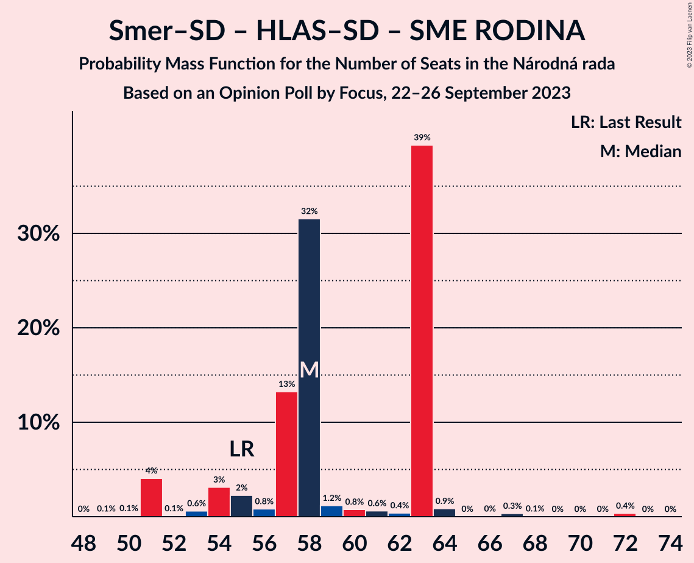

| Number of Seats | Probability | Accumulated | Special Marks |
|:---------------:|:-----------:|:-----------:|:-------------:|
| 49 | 0.1% | 100% |  |
| 50 | 0.1% | 99.9% |  |
| 51 | 4% | 99.8% |  |
| 52 | 0.1% | 96% |  |
| 53 | 0.6% | 96% |  |
| 54 | 3% | 95% |  |
| 55 | 2% | 92% | Last Result |
| 56 | 0.8% | 90% |  |
| 57 | 13% | 89% |  |
| 58 | 32% | 76% |  |
| 59 | 1.2% | 44% | Median |
| 60 | 0.8% | 43% |  |
| 61 | 0.6% | 42% |  |
| 62 | 0.4% | 41% |  |
| 63 | 39% | 41% |  |
| 64 | 0.9% | 2% |  |
| 65 | 0% | 0.9% |  |
| 66 | 0% | 0.8% |  |
| 67 | 0.3% | 0.8% |  |
| 68 | 0.1% | 0.4% |  |
| 69 | 0% | 0.4% |  |
| 70 | 0% | 0.4% |  |
| 71 | 0% | 0.4% |  |
| 72 | 0.4% | 0.4% |  |
| 73 | 0% | 0% |  |

### SMER–sociálna demokracia – Slovenská národná strana – SME RODINA – Kotleba–Ľudová strana Naše Slovensko

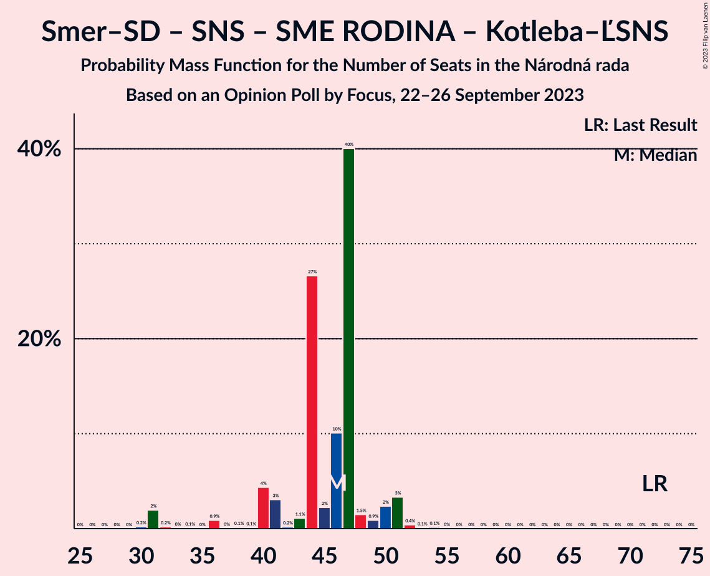

| Number of Seats | Probability | Accumulated | Special Marks |
|:---------------:|:-----------:|:-----------:|:-------------:|
| 30 | 0.2% | 100% |  |
| 31 | 2% | 99.8% |  |
| 32 | 0.2% | 98% |  |
| 33 | 0% | 98% |  |
| 34 | 0.1% | 98% |  |
| 35 | 0% | 98% |  |
| 36 | 0.9% | 98% |  |
| 37 | 0% | 97% |  |
| 38 | 0.1% | 97% |  |
| 39 | 0.1% | 97% |  |
| 40 | 4% | 96% |  |
| 41 | 3% | 92% |  |
| 42 | 0.2% | 89% |  |
| 43 | 1.1% | 89% |  |
| 44 | 27% | 88% |  |
| 45 | 2% | 61% | Median |
| 46 | 10% | 59% |  |
| 47 | 40% | 49% |  |
| 48 | 1.5% | 9% |  |
| 49 | 0.9% | 7% |  |
| 50 | 2% | 6% |  |
| 51 | 3% | 4% |  |
| 52 | 0.4% | 0.7% |  |
| 53 | 0.1% | 0.3% |  |
| 54 | 0.1% | 0.2% |  |
| 55 | 0% | 0% |  |
| 56 | 0% | 0% |  |
| 57 | 0% | 0% |  |
| 58 | 0% | 0% |  |
| 59 | 0% | 0% |  |
| 60 | 0% | 0% |  |
| 61 | 0% | 0% |  |
| 62 | 0% | 0% |  |
| 63 | 0% | 0% |  |
| 64 | 0% | 0% |  |
| 65 | 0% | 0% |  |
| 66 | 0% | 0% |  |
| 67 | 0% | 0% |  |
| 68 | 0% | 0% |  |
| 69 | 0% | 0% |  |
| 70 | 0% | 0% |  |
| 71 | 0% | 0% |  |
| 72 | 0% | 0% | Last Result |

### SMER–sociálna demokracia – Slovenská národná strana – SME RODINA

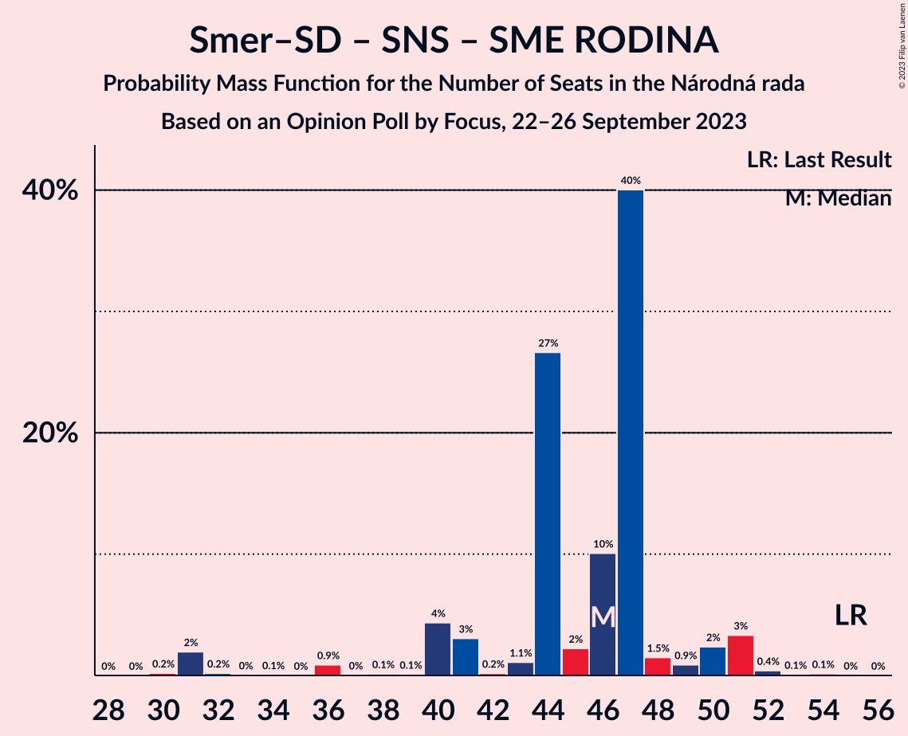

| Number of Seats | Probability | Accumulated | Special Marks |
|:---------------:|:-----------:|:-----------:|:-------------:|
| 30 | 0.2% | 100% |  |
| 31 | 2% | 99.8% |  |
| 32 | 0.2% | 98% |  |
| 33 | 0% | 98% |  |
| 34 | 0.1% | 98% |  |
| 35 | 0% | 98% |  |
| 36 | 0.9% | 98% |  |
| 37 | 0% | 97% |  |
| 38 | 0.1% | 97% |  |
| 39 | 0.1% | 97% |  |
| 40 | 4% | 96% |  |
| 41 | 3% | 92% |  |
| 42 | 0.2% | 89% |  |
| 43 | 1.1% | 89% |  |
| 44 | 27% | 88% |  |
| 45 | 2% | 61% | Median |
| 46 | 10% | 59% |  |
| 47 | 40% | 49% |  |
| 48 | 1.5% | 9% |  |
| 49 | 0.9% | 7% |  |
| 50 | 2% | 6% |  |
| 51 | 3% | 4% |  |
| 52 | 0.4% | 0.7% |  |
| 53 | 0.1% | 0.3% |  |
| 54 | 0.1% | 0.2% |  |
| 55 | 0% | 0% | Last Result |

### SMER–sociálna demokracia – Slovenská národná strana

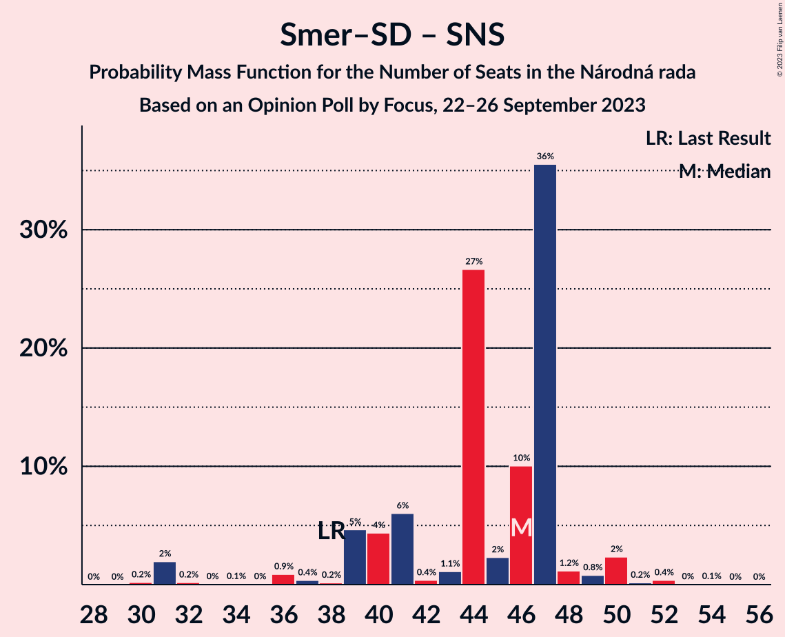

| Number of Seats | Probability | Accumulated | Special Marks |
|:---------------:|:-----------:|:-----------:|:-------------:|
| 30 | 0.2% | 100% |  |
| 31 | 2% | 99.8% |  |
| 32 | 0.2% | 98% |  |
| 33 | 0% | 98% |  |
| 34 | 0.1% | 98% |  |
| 35 | 0% | 98% |  |
| 36 | 0.9% | 98% |  |
| 37 | 0.4% | 97% |  |
| 38 | 0.2% | 96% | Last Result |
| 39 | 5% | 96% |  |
| 40 | 4% | 91% |  |
| 41 | 6% | 87% |  |
| 42 | 0.4% | 81% |  |
| 43 | 1.1% | 81% |  |
| 44 | 27% | 80% |  |
| 45 | 2% | 53% | Median |
| 46 | 10% | 51% |  |
| 47 | 36% | 41% |  |
| 48 | 1.2% | 5% |  |
| 49 | 0.8% | 4% |  |
| 50 | 2% | 3% |  |
| 51 | 0.2% | 0.6% |  |
| 52 | 0.4% | 0.5% |  |
| 53 | 0% | 0.1% |  |
| 54 | 0.1% | 0.1% |  |
| 55 | 0% | 0% |  |

### HLAS–sociálna demokracia – Slovenská národná strana – SME RODINA – Kotleba–Ľudová strana Naše Slovensko

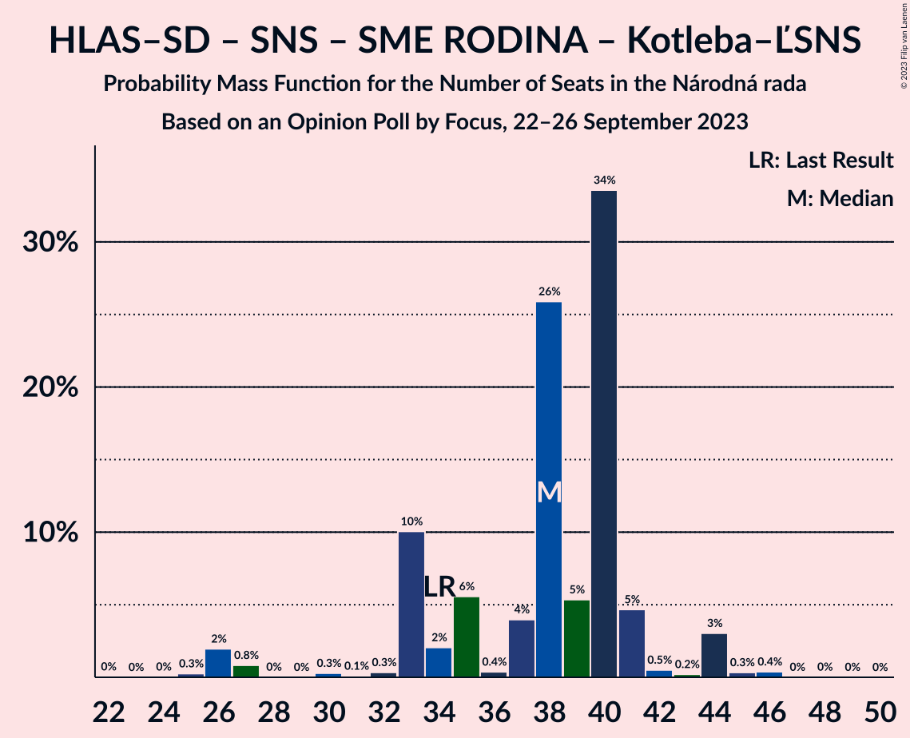

| Number of Seats | Probability | Accumulated | Special Marks |
|:---------------:|:-----------:|:-----------:|:-------------:|
| 23 | 0% | 100% |  |
| 24 | 0% | 99.9% |  |
| 25 | 0.3% | 99.9% |  |
| 26 | 2% | 99.7% |  |
| 27 | 0.8% | 98% |  |
| 28 | 0% | 97% |  |
| 29 | 0% | 97% |  |
| 30 | 0.3% | 97% |  |
| 31 | 0.1% | 97% |  |
| 32 | 0.3% | 96% |  |
| 33 | 10% | 96% |  |
| 34 | 2% | 86% | Last Result |
| 35 | 6% | 84% |  |
| 36 | 0.4% | 78% |  |
| 37 | 4% | 78% |  |
| 38 | 26% | 74% | Median |
| 39 | 5% | 48% |  |
| 40 | 34% | 43% |  |
| 41 | 5% | 9% |  |
| 42 | 0.5% | 5% |  |
| 43 | 0.2% | 4% |  |
| 44 | 3% | 4% |  |
| 45 | 0.3% | 0.8% |  |
| 46 | 0.4% | 0.5% |  |
| 47 | 0% | 0.1% |  |
| 48 | 0% | 0.1% |  |
| 49 | 0% | 0% |  |

### HLAS–sociálna demokracia – Slovenská národná strana – SME RODINA

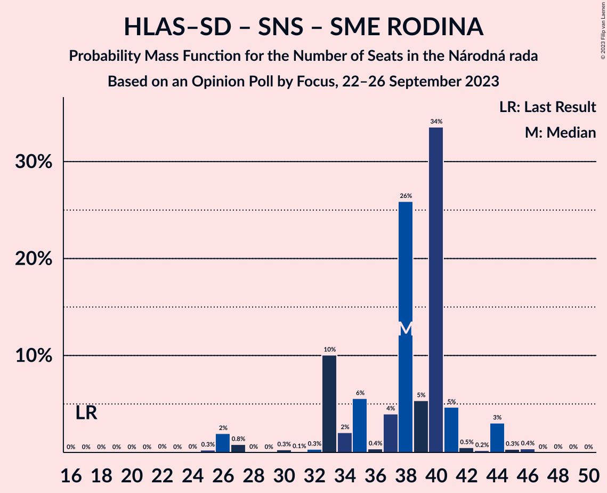

| Number of Seats | Probability | Accumulated | Special Marks |
|:---------------:|:-----------:|:-----------:|:-------------:|
| 17 | 0% | 100% | Last Result |
| 18 | 0% | 100% |  |
| 19 | 0% | 100% |  |
| 20 | 0% | 100% |  |
| 21 | 0% | 100% |  |
| 22 | 0% | 100% |  |
| 23 | 0% | 100% |  |
| 24 | 0% | 99.9% |  |
| 25 | 0.3% | 99.9% |  |
| 26 | 2% | 99.7% |  |
| 27 | 0.8% | 98% |  |
| 28 | 0% | 97% |  |
| 29 | 0% | 97% |  |
| 30 | 0.3% | 97% |  |
| 31 | 0.1% | 97% |  |
| 32 | 0.3% | 96% |  |
| 33 | 10% | 96% |  |
| 34 | 2% | 86% |  |
| 35 | 6% | 84% |  |
| 36 | 0.4% | 78% |  |
| 37 | 4% | 78% |  |
| 38 | 26% | 74% | Median |
| 39 | 5% | 48% |  |
| 40 | 34% | 43% |  |
| 41 | 5% | 9% |  |
| 42 | 0.5% | 5% |  |
| 43 | 0.2% | 4% |  |
| 44 | 3% | 4% |  |
| 45 | 0.3% | 0.8% |  |
| 46 | 0.4% | 0.5% |  |
| 47 | 0% | 0.1% |  |
| 48 | 0% | 0.1% |  |
| 49 | 0% | 0% |  |

### HLAS–sociálna demokracia – Slovenská národná strana

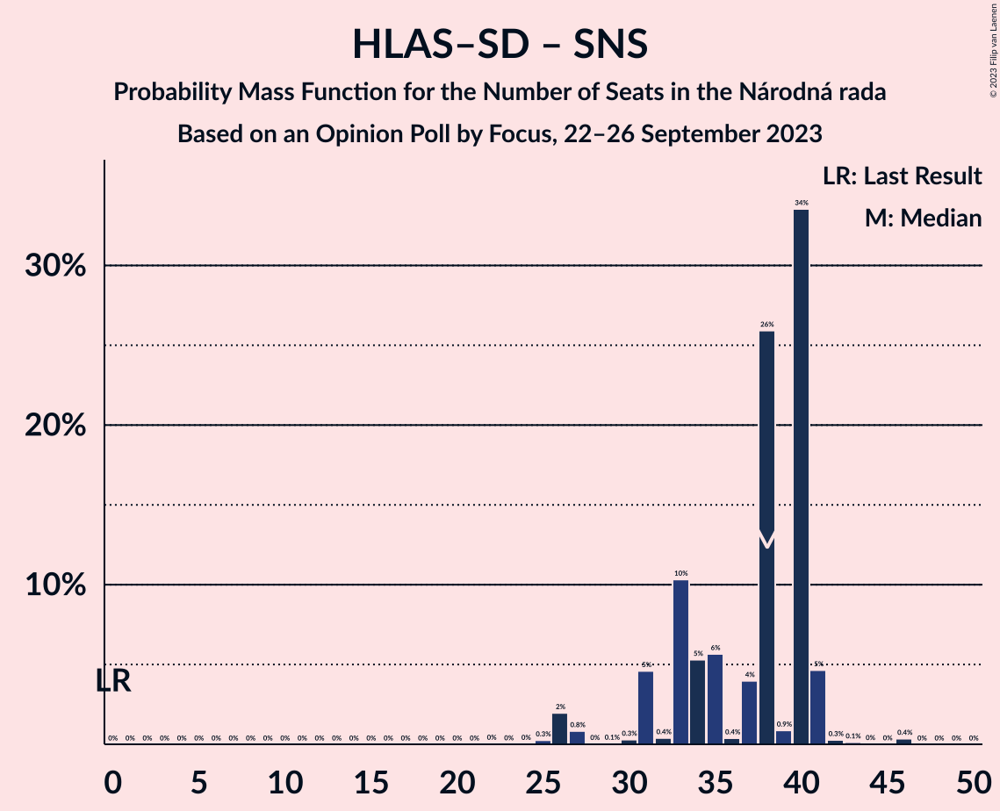

| Number of Seats | Probability | Accumulated | Special Marks |
|:---------------:|:-----------:|:-----------:|:-------------:|
| 0 | 0% | 100% | Last Result |
| 1 | 0% | 100% |  |
| 2 | 0% | 100% |  |
| 3 | 0% | 100% |  |
| 4 | 0% | 100% |  |
| 5 | 0% | 100% |  |
| 6 | 0% | 100% |  |
| 7 | 0% | 100% |  |
| 8 | 0% | 100% |  |
| 9 | 0% | 100% |  |
| 10 | 0% | 100% |  |
| 11 | 0% | 100% |  |
| 12 | 0% | 100% |  |
| 13 | 0% | 100% |  |
| 14 | 0% | 100% |  |
| 15 | 0% | 100% |  |
| 16 | 0% | 100% |  |
| 17 | 0% | 100% |  |
| 18 | 0% | 100% |  |
| 19 | 0% | 100% |  |
| 20 | 0% | 100% |  |
| 21 | 0% | 100% |  |
| 22 | 0% | 100% |  |
| 23 | 0% | 99.9% |  |
| 24 | 0% | 99.9% |  |
| 25 | 0.3% | 99.9% |  |
| 26 | 2% | 99.6% |  |
| 27 | 0.8% | 98% |  |
| 28 | 0% | 97% |  |
| 29 | 0.1% | 97% |  |
| 30 | 0.3% | 97% |  |
| 31 | 5% | 96% |  |
| 32 | 0.4% | 92% |  |
| 33 | 10% | 91% |  |
| 34 | 5% | 81% |  |
| 35 | 6% | 76% |  |
| 36 | 0.4% | 70% |  |
| 37 | 4% | 70% |  |
| 38 | 26% | 66% | Median |
| 39 | 0.9% | 40% |  |
| 40 | 34% | 39% |  |
| 41 | 5% | 5% |  |
| 42 | 0.3% | 0.8% |  |
| 43 | 0.1% | 0.5% |  |
| 44 | 0% | 0.4% |  |
| 45 | 0% | 0.4% |  |
| 46 | 0.4% | 0.4% |  |
| 47 | 0% | 0% |  |

### SMER–sociálna demokracia – SME RODINA

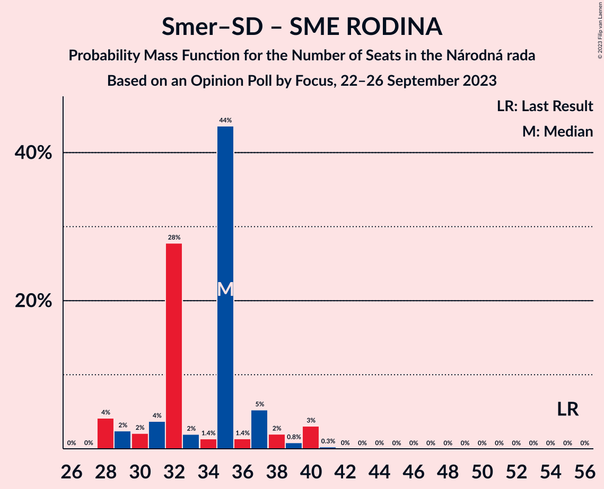

| Number of Seats | Probability | Accumulated | Special Marks |
|:---------------:|:-----------:|:-----------:|:-------------:|
| 27 | 0% | 100% |  |
| 28 | 4% | 99.9% |  |
| 29 | 2% | 96% |  |
| 30 | 2% | 93% |  |
| 31 | 4% | 91% |  |
| 32 | 28% | 88% |  |
| 33 | 2% | 60% | Median |
| 34 | 1.4% | 58% |  |
| 35 | 44% | 56% |  |
| 36 | 1.4% | 13% |  |
| 37 | 5% | 11% |  |
| 38 | 2% | 6% |  |
| 39 | 0.8% | 4% |  |
| 40 | 3% | 3% |  |
| 41 | 0.3% | 0.3% |  |
| 42 | 0% | 0.1% |  |
| 43 | 0% | 0% |  |
| 44 | 0% | 0% |  |
| 45 | 0% | 0% |  |
| 46 | 0% | 0% |  |
| 47 | 0% | 0% |  |
| 48 | 0% | 0% |  |
| 49 | 0% | 0% |  |
| 50 | 0% | 0% |  |
| 51 | 0% | 0% |  |
| 52 | 0% | 0% |  |
| 53 | 0% | 0% |  |
| 54 | 0% | 0% |  |
| 55 | 0% | 0% | Last Result |

### SMER–sociálna demokracia

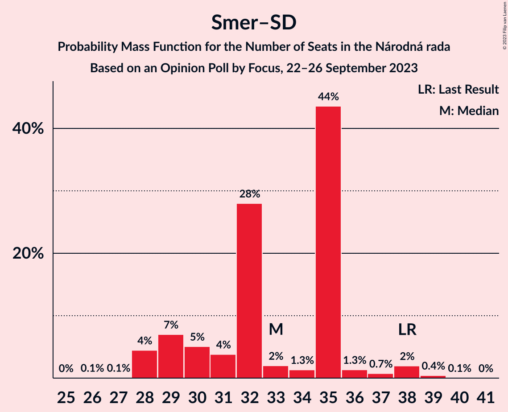

| Number of Seats | Probability | Accumulated | Special Marks |
|:---------------:|:-----------:|:-----------:|:-------------:|
| 26 | 0.1% | 100% |  |
| 27 | 0.1% | 99.9% |  |
| 28 | 4% | 99.8% |  |
| 29 | 7% | 95% |  |
| 30 | 5% | 88% |  |
| 31 | 4% | 83% |  |
| 32 | 28% | 79% |  |
| 33 | 2% | 51% | Median |
| 34 | 1.3% | 49% |  |
| 35 | 44% | 48% |  |
| 36 | 1.3% | 5% |  |
| 37 | 0.7% | 3% |  |
| 38 | 2% | 2% | Last Result |
| 39 | 0.4% | 0.5% |  |
| 40 | 0.1% | 0.1% |  |
| 41 | 0% | 0% |  |

### HLAS–sociálna demokracia – SME RODINA

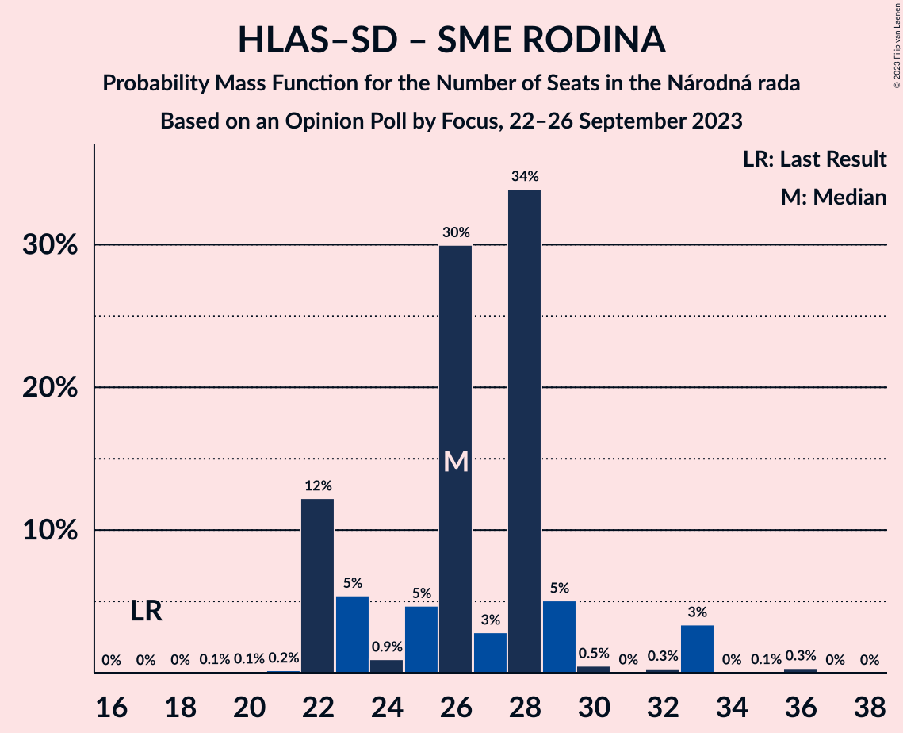

| Number of Seats | Probability | Accumulated | Special Marks |
|:---------------:|:-----------:|:-----------:|:-------------:|
| 17 | 0% | 100% | Last Result |
| 18 | 0% | 100% |  |
| 19 | 0.1% | 100% |  |
| 20 | 0.1% | 99.9% |  |
| 21 | 0.2% | 99.8% |  |
| 22 | 12% | 99.7% |  |
| 23 | 5% | 87% |  |
| 24 | 0.9% | 82% |  |
| 25 | 5% | 81% |  |
| 26 | 30% | 76% | Median |
| 27 | 3% | 46% |  |
| 28 | 34% | 44% |  |
| 29 | 5% | 10% |  |
| 30 | 0.5% | 5% |  |
| 31 | 0% | 4% |  |
| 32 | 0.3% | 4% |  |
| 33 | 3% | 4% |  |
| 34 | 0% | 0.4% |  |
| 35 | 0.1% | 0.4% |  |
| 36 | 0.3% | 0.3% |  |
| 37 | 0% | 0% |  |

## Technical Information

### Opinion Poll

+ **Polling firm:** Focus
+ **Commissioner(s):** —
+ **Fieldwork period:** 22–26 September 2023

### Calculations

+ **Sample size:** 1017
+ **Simulations done:** 1,048,576
+ **Error estimate:** 2.58%

