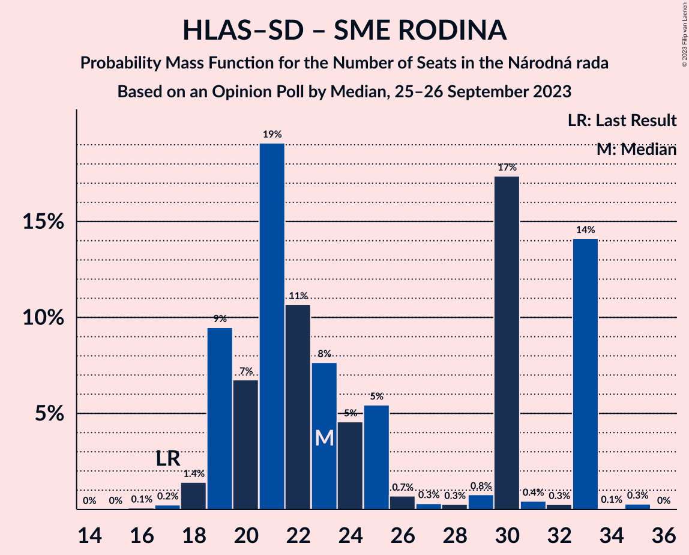

# Opinion Poll by Median, 25–26 September 2023

<a href="#voting-intentions">Voting Intentions</a> | <a href="#seats">Seats</a> | <a href="#coalitions">Coalitions</a> | <a href="#technical-information">Technical Information</a>

## Voting Intentions

### Confidence Intervals

| Party | Last Result | Poll Result | 80% Confidence Interval | 90% Confidence Interval | 95% Confidence Interval | 99% Confidence Interval |
|:-----:|:-----------:|:-----------:|:-----------------------:|:-----------------------:|:-----------------------:|:-----------------------:|
| SMER–sociálna demokracia | 18.3% | 19.8% | 18.3–21.5% |17.8–22.0% |17.5–22.4% |16.8–23.2% |
| Progresívne Slovensko | 7.0% | 19.3% | 17.8–21.0% |17.4–21.5% |17.0–21.9% |16.3–22.7% |
| HLAS–sociálna demokracia | 0.0% | 11.9% | 10.6–13.3% |10.3–13.7% |10.0–14.0% |9.4–14.7% |
| REPUBLIKA | 0.0% | 8.0% | 7.0–9.2% |6.7–9.5% |6.4–9.8% |6.0–10.4% |
| Kresťanskodemokratické hnutie | 4.6% | 7.7% | 6.7–8.9% |6.4–9.2% |6.2–9.5% |5.7–10.1% |
| Sloboda a Solidarita | 6.2% | 7.4% | 6.4–8.5% |6.1–8.9% |5.9–9.2% |5.5–9.8% |
| OBYČAJNÍ ĽUDIA a nezávislé osobnosti–Kresťanská únia–Za ľudí | 0.0% | 6.2% | 5.3–7.3% |5.0–7.6% |4.8–7.8% |4.5–8.4% |
| Slovenská národná strana | 3.2% | 4.8% | 4.0–5.8% |3.8–6.0% |3.6–6.3% |3.3–6.8% |
| SME RODINA | 8.2% | 4.1% | 3.4–5.0% |3.2–5.3% |3.0–5.5% |2.7–6.0% |
| SPOLU–Občianska Demokracia | 7.0% | 3.8% | 3.1–4.7% |2.9–4.9% |2.8–5.2% |2.5–5.6% |
| Strana maďarskej koalície–Magyar Koalíció Pártja | 3.9% | 2.5% | 2.0–3.2% |1.8–3.5% |1.7–3.7% |1.5–4.1% |
| MODRÍ–Európske Slovensko–MOST–HÍD | 0.0% | 2.1% | 1.6–2.8% |1.5–3.0% |1.4–3.2% |1.2–3.6% |

*Note:* The poll result column reflects the actual value used in the calculations. Published results may vary slightly, and in addition be rounded to fewer digits.

## Seats

### Confidence Intervals

| Party | Last Result | Median | 80% Confidence Interval | 90% Confidence Interval | 95% Confidence Interval | 99% Confidence Interval |
|:-----:|:-----------:|:------:|:-----------------------:|:-----------------------:|:-----------------------:|:-----------------------:|
| <a href="#smer–sociálna-demokracia">SMER–sociálna demokracia</a> | 38 | 34 | 34–38 |33–39 |31–40 |30–42 |
| <a href="#progresívne-slovensko">Progresívne Slovensko</a> | 0 | 35 | 32–41 |30–41 |29–41 |29–43 |
| <a href="#hlas–sociálna-demokracia">HLAS–sociálna demokracia</a> | 0 | 21 | 19–24 |19–25 |19–25 |18–26 |
| <a href="#republika">REPUBLIKA</a> | 0 | 13 | 12–16 |12–16 |12–17 |11–19 |
| <a href="#kresťanskodemokratické-hnutie">Kresťanskodemokratické hnutie</a> | 0 | 14 | 12–16 |12–16 |12–17 |11–19 |
| <a href="#sloboda-a-solidarita">Sloboda a Solidarita</a> | 13 | 13 | 12–15 |11–16 |10–16 |10–17 |
| <a href="#obyčajní-ľudia-a-nezávislé-osobnosti–kresťanská-únia–za-ľudí">OBYČAJNÍ ĽUDIA a nezávislé osobnosti–Kresťanská únia–Za ľudí</a> | 0 | 11 | 10–13 |9–14 |0–14 |0–14 |
| <a href="#slovenská-národná-strana">Slovenská národná strana</a> | 0 | 0 | 0–10 |0–10 |0–11 |0–12 |
| <a href="#sme-rodina">SME RODINA</a> | 17 | 0 | 0–10 |0–10 |0–10 |0–10 |
| <a href="#spolu–občianska-demokracia">SPOLU–Občianska Demokracia</a> | 0 | 0 | 0 |0 |0–9 |0–10 |
| <a href="#strana-maďarskej-koalície–magyar-koalíció-pártja">Strana maďarskej koalície–Magyar Koalíció Pártja</a> | 0 | 0 | 0 |0 |0 |0 |
| <a href="#modrí–európske-slovensko–most–híd">MODRÍ–Európske Slovensko–MOST–HÍD</a> | 0 | 0 | 0 |0 |0 |0 |

### SMER–sociálna demokracia

*For a full overview of the results for this party, see the [SMER–sociálna demokracia](party-smer–sociálnademokracia.html) page.*

| Number of Seats | Probability | Accumulated | Special Marks |
|:---------------:|:-----------:|:-----------:|:-------------:|
| 28 | 0.1% | 100% |  |
| 29 | 0.1% | 99.9% |  |
| 30 | 0.9% | 99.8% |  |
| 31 | 1.5% | 98.9% |  |
| 32 | 2% | 97% |  |
| 33 | 3% | 95% |  |
| 34 | 46% | 92% | Median |
| 35 | 7% | 46% |  |
| 36 | 16% | 39% |  |
| 37 | 10% | 24% |  |
| 38 | 7% | 14% | Last Result |
| 39 | 3% | 8% |  |
| 40 | 3% | 5% |  |
| 41 | 1.5% | 2% |  |
| 42 | 0.7% | 1.0% |  |
| 43 | 0.2% | 0.3% |  |
| 44 | 0% | 0.1% |  |
| 45 | 0% | 0% |  |

### Progresívne Slovensko

*For a full overview of the results for this party, see the [Progresívne Slovensko](party-progresívneslovensko.html) page.*

| Number of Seats | Probability | Accumulated | Special Marks |
|:---------------:|:-----------:|:-----------:|:-------------:|
| 0 | 0% | 100% | Last Result |
| 1 | 0% | 100% |  |
| 2 | 0% | 100% |  |
| 3 | 0% | 100% |  |
| 4 | 0% | 100% |  |
| 5 | 0% | 100% |  |
| 6 | 0% | 100% |  |
| 7 | 0% | 100% |  |
| 8 | 0% | 100% |  |
| 9 | 0% | 100% |  |
| 10 | 0% | 100% |  |
| 11 | 0% | 100% |  |
| 12 | 0% | 100% |  |
| 13 | 0% | 100% |  |
| 14 | 0% | 100% |  |
| 15 | 0% | 100% |  |
| 16 | 0% | 100% |  |
| 17 | 0% | 100% |  |
| 18 | 0% | 100% |  |
| 19 | 0% | 100% |  |
| 20 | 0% | 100% |  |
| 21 | 0% | 100% |  |
| 22 | 0% | 100% |  |
| 23 | 0% | 100% |  |
| 24 | 0% | 100% |  |
| 25 | 0% | 100% |  |
| 26 | 0% | 100% |  |
| 27 | 0.1% | 100% |  |
| 28 | 0.1% | 99.9% |  |
| 29 | 3% | 99.8% |  |
| 30 | 2% | 97% |  |
| 31 | 3% | 95% |  |
| 32 | 8% | 92% |  |
| 33 | 6% | 83% |  |
| 34 | 7% | 77% |  |
| 35 | 45% | 70% | Median |
| 36 | 3% | 26% |  |
| 37 | 2% | 23% |  |
| 38 | 3% | 21% |  |
| 39 | 3% | 18% |  |
| 40 | 0.2% | 15% |  |
| 41 | 14% | 15% |  |
| 42 | 0.3% | 0.8% |  |
| 43 | 0.1% | 0.5% |  |
| 44 | 0.4% | 0.4% |  |
| 45 | 0% | 0% |  |

### HLAS–sociálna demokracia

*For a full overview of the results for this party, see the [HLAS–sociálna demokracia](party-hlas–sociálnademokracia.html) page.*

| Number of Seats | Probability | Accumulated | Special Marks |
|:---------------:|:-----------:|:-----------:|:-------------:|
| 0 | 0% | 100% | Last Result |
| 1 | 0% | 100% |  |
| 2 | 0% | 100% |  |
| 3 | 0% | 100% |  |
| 4 | 0% | 100% |  |
| 5 | 0% | 100% |  |
| 6 | 0% | 100% |  |
| 7 | 0% | 100% |  |
| 8 | 0% | 100% |  |
| 9 | 0% | 100% |  |
| 10 | 0% | 100% |  |
| 11 | 0% | 100% |  |
| 12 | 0% | 100% |  |
| 13 | 0% | 100% |  |
| 14 | 0% | 100% |  |
| 15 | 0% | 100% |  |
| 16 | 0.1% | 100% |  |
| 17 | 0.3% | 99.8% |  |
| 18 | 2% | 99.5% |  |
| 19 | 10% | 98% |  |
| 20 | 24% | 88% |  |
| 21 | 21% | 65% | Median |
| 22 | 11% | 44% |  |
| 23 | 8% | 33% |  |
| 24 | 19% | 25% |  |
| 25 | 6% | 7% |  |
| 26 | 0.8% | 1.2% |  |
| 27 | 0.3% | 0.4% |  |
| 28 | 0.1% | 0.1% |  |
| 29 | 0% | 0% |  |

### REPUBLIKA

*For a full overview of the results for this party, see the [REPUBLIKA](party-republika.html) page.*

| Number of Seats | Probability | Accumulated | Special Marks |
|:---------------:|:-----------:|:-----------:|:-------------:|
| 0 | 0% | 100% | Last Result |
| 1 | 0% | 100% |  |
| 2 | 0% | 100% |  |
| 3 | 0% | 100% |  |
| 4 | 0% | 100% |  |
| 5 | 0% | 100% |  |
| 6 | 0% | 100% |  |
| 7 | 0% | 100% |  |
| 8 | 0% | 100% |  |
| 9 | 0% | 100% |  |
| 10 | 0.1% | 100% |  |
| 11 | 2% | 99.9% |  |
| 12 | 13% | 98% |  |
| 13 | 40% | 85% | Median |
| 14 | 8% | 45% |  |
| 15 | 21% | 37% |  |
| 16 | 12% | 16% |  |
| 17 | 2% | 4% |  |
| 18 | 2% | 2% |  |
| 19 | 0.5% | 0.6% |  |
| 20 | 0.1% | 0.1% |  |
| 21 | 0% | 0% |  |

### Kresťanskodemokratické hnutie

*For a full overview of the results for this party, see the [Kresťanskodemokratické hnutie](party-kresťanskodemokratickéhnutie.html) page.*

| Number of Seats | Probability | Accumulated | Special Marks |
|:---------------:|:-----------:|:-----------:|:-------------:|
| 0 | 0% | 100% | Last Result |
| 1 | 0% | 100% |  |
| 2 | 0% | 100% |  |
| 3 | 0% | 100% |  |
| 4 | 0% | 100% |  |
| 5 | 0% | 100% |  |
| 6 | 0% | 100% |  |
| 7 | 0% | 100% |  |
| 8 | 0% | 100% |  |
| 9 | 0% | 100% |  |
| 10 | 0.3% | 100% |  |
| 11 | 1.4% | 99.6% |  |
| 12 | 22% | 98% |  |
| 13 | 8% | 76% |  |
| 14 | 47% | 68% | Median |
| 15 | 11% | 21% |  |
| 16 | 7% | 11% |  |
| 17 | 2% | 4% |  |
| 18 | 1.4% | 2% |  |
| 19 | 0.4% | 0.5% |  |
| 20 | 0.1% | 0.1% |  |
| 21 | 0% | 0% |  |

### Sloboda a Solidarita

*For a full overview of the results for this party, see the [Sloboda a Solidarita](party-slobodaasolidarita.html) page.*

| Number of Seats | Probability | Accumulated | Special Marks |
|:---------------:|:-----------:|:-----------:|:-------------:|
| 9 | 0.1% | 100% |  |
| 10 | 4% | 99.8% |  |
| 11 | 3% | 96% |  |
| 12 | 37% | 93% |  |
| 13 | 22% | 56% | Last Result, Median |
| 14 | 8% | 34% |  |
| 15 | 20% | 26% |  |
| 16 | 6% | 6% |  |
| 17 | 0.4% | 0.6% |  |
| 18 | 0.1% | 0.2% |  |
| 19 | 0% | 0% |  |

### OBYČAJNÍ ĽUDIA a nezávislé osobnosti–Kresťanská únia–Za ľudí

*For a full overview of the results for this party, see the [OBYČAJNÍ ĽUDIA a nezávislé osobnosti–Kresťanská únia–Za ľudí](party-obyčajníľudiaanezávisléosobnosti–kresťanskáúnia–zaľudí.html) page.*

| Number of Seats | Probability | Accumulated | Special Marks |
|:---------------:|:-----------:|:-----------:|:-------------:|
| 0 | 3% | 100% | Last Result |
| 1 | 0% | 97% |  |
| 2 | 0% | 97% |  |
| 3 | 0% | 97% |  |
| 4 | 0% | 97% |  |
| 5 | 0% | 97% |  |
| 6 | 0% | 97% |  |
| 7 | 0% | 97% |  |
| 8 | 1.2% | 97% |  |
| 9 | 1.1% | 95% |  |
| 10 | 37% | 94% |  |
| 11 | 19% | 58% | Median |
| 12 | 24% | 39% |  |
| 13 | 6% | 15% |  |
| 14 | 9% | 9% |  |
| 15 | 0.3% | 0.4% |  |
| 16 | 0.1% | 0.1% |  |
| 17 | 0% | 0% |  |

### Slovenská národná strana

*For a full overview of the results for this party, see the [Slovenská národná strana](party-slovenskánárodnástrana.html) page.*

| Number of Seats | Probability | Accumulated | Special Marks |
|:---------------:|:-----------:|:-----------:|:-------------:|
| 0 | 74% | 100% | Last Result, Median |
| 1 | 0% | 26% |  |
| 2 | 0% | 26% |  |
| 3 | 0% | 26% |  |
| 4 | 0% | 26% |  |
| 5 | 0% | 26% |  |
| 6 | 0% | 26% |  |
| 7 | 0% | 26% |  |
| 8 | 1.1% | 26% |  |
| 9 | 11% | 25% |  |
| 10 | 10% | 14% |  |
| 11 | 3% | 4% |  |
| 12 | 1.1% | 1.2% |  |
| 13 | 0% | 0% |  |

### SME RODINA

*For a full overview of the results for this party, see the [SME RODINA](party-smerodina.html) page.*

| Number of Seats | Probability | Accumulated | Special Marks |
|:---------------:|:-----------:|:-----------:|:-------------:|
| 0 | 66% | 100% | Median |
| 1 | 0% | 34% |  |
| 2 | 0% | 34% |  |
| 3 | 0% | 34% |  |
| 4 | 0% | 34% |  |
| 5 | 0% | 34% |  |
| 6 | 0% | 34% |  |
| 7 | 0% | 34% |  |
| 8 | 0% | 34% |  |
| 9 | 16% | 34% |  |
| 10 | 17% | 17% |  |
| 11 | 0.3% | 0.3% |  |
| 12 | 0% | 0% |  |
| 13 | 0% | 0% |  |
| 14 | 0% | 0% |  |
| 15 | 0% | 0% |  |
| 16 | 0% | 0% |  |
| 17 | 0% | 0% | Last Result |

### SPOLU–Občianska Demokracia

*For a full overview of the results for this party, see the [SPOLU–Občianska Demokracia](party-spolu–občianskademokracia.html) page.*

| Number of Seats | Probability | Accumulated | Special Marks |
|:---------------:|:-----------:|:-----------:|:-------------:|
| 0 | 95% | 100% | Last Result, Median |
| 1 | 0% | 5% |  |
| 2 | 0% | 5% |  |
| 3 | 0% | 5% |  |
| 4 | 0% | 5% |  |
| 5 | 0% | 5% |  |
| 6 | 0% | 5% |  |
| 7 | 0% | 5% |  |
| 8 | 0% | 5% |  |
| 9 | 4% | 5% |  |
| 10 | 0.9% | 1.0% |  |
| 11 | 0% | 0% |  |

### Strana maďarskej koalície–Magyar Koalíció Pártja

*For a full overview of the results for this party, see the [Strana maďarskej koalície–Magyar Koalíció Pártja](party-stranamaďarskejkoalície–magyarkoalíciópártja.html) page.*

| Number of Seats | Probability | Accumulated | Special Marks |
|:---------------:|:-----------:|:-----------:|:-------------:|
| 0 | 100% | 100% | Last Result, Median |

### MODRÍ–Európske Slovensko–MOST–HÍD

*For a full overview of the results for this party, see the [MODRÍ–Európske Slovensko–MOST–HÍD](party-modrí–európskeslovensko–most–híd.html) page.*

| Number of Seats | Probability | Accumulated | Special Marks |
|:---------------:|:-----------:|:-----------:|:-------------:|
| 0 | 100% | 100% | Last Result, Median |

## Coalitions

### Confidence Intervals

| Coalition | Last Result | Median | Majority? | 80% Confidence Interval | 90% Confidence Interval | 95% Confidence Interval | 99% Confidence Interval |
|:---------:|:-----------:|:------:|:---------:|:-----------------------:|:-----------------------:|:-----------------------:|:-----------------------:|
| SMER–sociálna demokracia – HLAS–sociálna demokracia – Slovenská národná strana – SME RODINA | 55 | 64 | 0.1% | 55–68 | 55–69 | 55–69 | 54–71 |
| SMER–sociálna demokracia – HLAS–sociálna demokracia – Slovenská národná strana | 38 | 58 | 0% | 54–68 | 54–69 | 54–69 | 53–70 |
| SMER–sociálna demokracia – HLAS–sociálna demokracia – SME RODINA | 55 | 59 | 0% | 55–67 | 54–67 | 52–67 | 51–69 |
| SMER–sociálna demokracia – Slovenská národná strana – SME RODINA | 55 | 43 | 0% | 34–46 | 34–47 | 34–48 | 32–51 |
| SMER–sociálna demokracia – Slovenská národná strana | 38 | 35 | 0% | 34–46 | 34–47 | 34–48 | 32–50 |
| SMER–sociálna demokracia – SME RODINA | 55 | 37 | 0% | 34–44 | 33–44 | 32–44 | 30–48 |
| SMER–sociálna demokracia | 38 | 34 | 0% | 34–38 | 33–39 | 31–40 | 30–42 |
| HLAS–sociálna demokracia – Slovenská národná strana – SME RODINA | 17 | 29 | 0% | 21–33 | 21–33 | 20–34 | 19–36 |
| HLAS–sociálna demokracia – Slovenská národná strana | 0 | 24 | 0% | 20–32 | 20–32 | 20–33 | 18–34 |
| HLAS–sociálna demokracia – SME RODINA | 17 | 23 | 0% | 19–33 | 19–33 | 19–33 | 18–33 |

### SMER–sociálna demokracia – HLAS–sociálna demokracia – Slovenská národná strana – SME RODINA

| Number of Seats | Probability | Accumulated | Special Marks |
|:---------------:|:-----------:|:-----------:|:-------------:|
| 51 | 0.1% | 100% |  |
| 52 | 0% | 99.8% |  |
| 53 | 0.1% | 99.8% |  |
| 54 | 0.3% | 99.7% |  |
| 55 | 15% | 99.4% | Last Result, Median |
| 56 | 0.2% | 84% |  |
| 57 | 3% | 84% |  |
| 58 | 3% | 81% |  |
| 59 | 7% | 78% |  |
| 60 | 2% | 71% |  |
| 61 | 5% | 69% |  |
| 62 | 4% | 64% |  |
| 63 | 4% | 60% |  |
| 64 | 21% | 56% |  |
| 65 | 7% | 35% |  |
| 66 | 0.6% | 28% |  |
| 67 | 14% | 27% |  |
| 68 | 7% | 13% |  |
| 69 | 5% | 6% |  |
| 70 | 0.4% | 1.2% |  |
| 71 | 0.4% | 0.8% |  |
| 72 | 0.1% | 0.4% |  |
| 73 | 0.1% | 0.4% |  |
| 74 | 0.1% | 0.3% |  |
| 75 | 0% | 0.1% |  |
| 76 | 0% | 0.1% | Majority |
| 77 | 0% | 0.1% |  |
| 78 | 0% | 0% |  |

### SMER–sociálna demokracia – HLAS–sociálna demokracia – Slovenská národná strana

| Number of Seats | Probability | Accumulated | Special Marks |
|:---------------:|:-----------:|:-----------:|:-------------:|
| 38 | 0% | 100% | Last Result |
| 39 | 0% | 100% |  |
| 40 | 0% | 100% |  |
| 41 | 0% | 100% |  |
| 42 | 0% | 100% |  |
| 43 | 0% | 100% |  |
| 44 | 0% | 100% |  |
| 45 | 0% | 100% |  |
| 46 | 0% | 100% |  |
| 47 | 0% | 100% |  |
| 48 | 0% | 100% |  |
| 49 | 0% | 100% |  |
| 50 | 0.1% | 100% |  |
| 51 | 0.2% | 99.9% |  |
| 52 | 0.1% | 99.7% |  |
| 53 | 0.2% | 99.6% |  |
| 54 | 17% | 99.4% |  |
| 55 | 16% | 83% | Median |
| 56 | 0.2% | 67% |  |
| 57 | 3% | 67% |  |
| 58 | 18% | 63% |  |
| 59 | 7% | 45% |  |
| 60 | 2% | 38% |  |
| 61 | 5% | 36% |  |
| 62 | 4% | 31% |  |
| 63 | 4% | 27% |  |
| 64 | 4% | 22% |  |
| 65 | 7% | 19% |  |
| 66 | 0.5% | 12% |  |
| 67 | 0.2% | 11% |  |
| 68 | 6% | 11% |  |
| 69 | 5% | 5% |  |
| 70 | 0.3% | 0.6% |  |
| 71 | 0% | 0.2% |  |
| 72 | 0% | 0.2% |  |
| 73 | 0.1% | 0.2% |  |
| 74 | 0% | 0.1% |  |
| 75 | 0% | 0% |  |

### SMER–sociálna demokracia – HLAS–sociálna demokracia – SME RODINA

| Number of Seats | Probability | Accumulated | Special Marks |
|:---------------:|:-----------:|:-----------:|:-------------:|
| 48 | 0.1% | 100% |  |
| 49 | 0.1% | 99.9% |  |
| 50 | 0.2% | 99.9% |  |
| 51 | 1.1% | 99.7% |  |
| 52 | 1.5% | 98.6% |  |
| 53 | 0.4% | 97% |  |
| 54 | 3% | 97% |  |
| 55 | 23% | 94% | Last Result, Median |
| 56 | 0.8% | 70% |  |
| 57 | 5% | 70% |  |
| 58 | 4% | 64% |  |
| 59 | 14% | 60% |  |
| 60 | 2% | 47% |  |
| 61 | 5% | 45% |  |
| 62 | 4% | 40% |  |
| 63 | 2% | 36% |  |
| 64 | 18% | 34% |  |
| 65 | 0.3% | 17% |  |
| 66 | 0.5% | 16% |  |
| 67 | 14% | 16% |  |
| 68 | 1.1% | 2% |  |
| 69 | 0.2% | 0.6% |  |
| 70 | 0% | 0.4% |  |
| 71 | 0.3% | 0.4% |  |
| 72 | 0% | 0% |  |

### SMER–sociálna demokracia – Slovenská národná strana – SME RODINA

| Number of Seats | Probability | Accumulated | Special Marks |
|:---------------:|:-----------:|:-----------:|:-------------:|
| 31 | 0.2% | 100% |  |
| 32 | 0.3% | 99.8% |  |
| 33 | 1.4% | 99.4% |  |
| 34 | 14% | 98% | Median |
| 35 | 2% | 84% |  |
| 36 | 6% | 81% |  |
| 37 | 6% | 75% |  |
| 38 | 5% | 69% |  |
| 39 | 2% | 64% |  |
| 40 | 3% | 63% |  |
| 41 | 3% | 60% |  |
| 42 | 2% | 57% |  |
| 43 | 16% | 55% |  |
| 44 | 19% | 39% |  |
| 45 | 4% | 20% |  |
| 46 | 9% | 16% |  |
| 47 | 3% | 7% |  |
| 48 | 2% | 5% |  |
| 49 | 1.4% | 2% |  |
| 50 | 0.5% | 1.1% |  |
| 51 | 0.3% | 0.6% |  |
| 52 | 0% | 0.3% |  |
| 53 | 0.1% | 0.3% |  |
| 54 | 0% | 0.2% |  |
| 55 | 0.1% | 0.1% | Last Result |
| 56 | 0% | 0% |  |

### SMER–sociálna demokracia – Slovenská národná strana

| Number of Seats | Probability | Accumulated | Special Marks |
|:---------------:|:-----------:|:-----------:|:-------------:|
| 29 | 0% | 100% |  |
| 30 | 0.1% | 99.9% |  |
| 31 | 0.2% | 99.9% |  |
| 32 | 0.4% | 99.7% |  |
| 33 | 2% | 99.3% |  |
| 34 | 45% | 98% | Median |
| 35 | 3% | 52% |  |
| 36 | 6% | 50% |  |
| 37 | 6% | 43% |  |
| 38 | 5% | 37% | Last Result |
| 39 | 2% | 32% |  |
| 40 | 3% | 29% |  |
| 41 | 3% | 26% |  |
| 42 | 2% | 23% |  |
| 43 | 0.8% | 22% |  |
| 44 | 3% | 21% |  |
| 45 | 4% | 18% |  |
| 46 | 9% | 14% |  |
| 47 | 2% | 6% |  |
| 48 | 1.4% | 3% |  |
| 49 | 1.2% | 2% |  |
| 50 | 0.4% | 0.7% |  |
| 51 | 0.2% | 0.3% |  |
| 52 | 0% | 0.1% |  |
| 53 | 0% | 0.1% |  |
| 54 | 0% | 0% |  |

### SMER–sociálna demokracia – SME RODINA

| Number of Seats | Probability | Accumulated | Special Marks |
|:---------------:|:-----------:|:-----------:|:-------------:|
| 29 | 0.1% | 100% |  |
| 30 | 0.8% | 99.9% |  |
| 31 | 1.4% | 99.1% |  |
| 32 | 2% | 98% |  |
| 33 | 2% | 95% |  |
| 34 | 15% | 93% | Median |
| 35 | 7% | 78% |  |
| 36 | 15% | 71% |  |
| 37 | 9% | 56% |  |
| 38 | 6% | 47% |  |
| 39 | 2% | 40% |  |
| 40 | 3% | 38% |  |
| 41 | 2% | 36% |  |
| 42 | 0.8% | 34% |  |
| 43 | 15% | 33% |  |
| 44 | 16% | 18% |  |
| 45 | 0.4% | 2% |  |
| 46 | 0.1% | 1.3% |  |
| 47 | 0.3% | 1.2% |  |
| 48 | 0.8% | 0.9% |  |
| 49 | 0.1% | 0.1% |  |
| 50 | 0% | 0% |  |
| 51 | 0% | 0% |  |
| 52 | 0% | 0% |  |
| 53 | 0% | 0% |  |
| 54 | 0% | 0% |  |
| 55 | 0% | 0% | Last Result |

### SMER–sociálna demokracia

| Number of Seats | Probability | Accumulated | Special Marks |
|:---------------:|:-----------:|:-----------:|:-------------:|
| 28 | 0.1% | 100% |  |
| 29 | 0.1% | 99.9% |  |
| 30 | 0.9% | 99.8% |  |
| 31 | 1.5% | 98.9% |  |
| 32 | 2% | 97% |  |
| 33 | 3% | 95% |  |
| 34 | 46% | 92% | Median |
| 35 | 7% | 46% |  |
| 36 | 16% | 39% |  |
| 37 | 10% | 24% |  |
| 38 | 7% | 14% | Last Result |
| 39 | 3% | 8% |  |
| 40 | 3% | 5% |  |
| 41 | 1.5% | 2% |  |
| 42 | 0.7% | 1.0% |  |
| 43 | 0.2% | 0.3% |  |
| 44 | 0% | 0.1% |  |
| 45 | 0% | 0% |  |

### HLAS–sociálna demokracia – Slovenská národná strana – SME RODINA

| Number of Seats | Probability | Accumulated | Special Marks |
|:---------------:|:-----------:|:-----------:|:-------------:|
| 17 | 0.2% | 100% | Last Result |
| 18 | 0.2% | 99.8% |  |
| 19 | 0.5% | 99.6% |  |
| 20 | 4% | 99.2% |  |
| 21 | 17% | 95% | Median |
| 22 | 6% | 78% |  |
| 23 | 2% | 72% |  |
| 24 | 4% | 70% |  |
| 25 | 5% | 66% |  |
| 26 | 0.5% | 60% |  |
| 27 | 1.1% | 60% |  |
| 28 | 4% | 59% |  |
| 29 | 8% | 55% |  |
| 30 | 19% | 46% |  |
| 31 | 2% | 28% |  |
| 32 | 7% | 25% |  |
| 33 | 15% | 18% |  |
| 34 | 2% | 3% |  |
| 35 | 0.7% | 1.2% |  |
| 36 | 0.1% | 0.5% |  |
| 37 | 0.1% | 0.4% |  |
| 38 | 0.1% | 0.3% |  |
| 39 | 0.1% | 0.2% |  |
| 40 | 0.1% | 0.2% |  |
| 41 | 0% | 0.1% |  |
| 42 | 0% | 0% |  |

### HLAS–sociálna demokracia – Slovenská národná strana

| Number of Seats | Probability | Accumulated | Special Marks |
|:---------------:|:-----------:|:-----------:|:-------------:|
| 0 | 0% | 100% | Last Result |
| 1 | 0% | 100% |  |
| 2 | 0% | 100% |  |
| 3 | 0% | 100% |  |
| 4 | 0% | 100% |  |
| 5 | 0% | 100% |  |
| 6 | 0% | 100% |  |
| 7 | 0% | 100% |  |
| 8 | 0% | 100% |  |
| 9 | 0% | 100% |  |
| 10 | 0% | 100% |  |
| 11 | 0% | 100% |  |
| 12 | 0% | 100% |  |
| 13 | 0% | 100% |  |
| 14 | 0% | 100% |  |
| 15 | 0% | 100% |  |
| 16 | 0.1% | 100% |  |
| 17 | 0.2% | 99.9% |  |
| 18 | 0.3% | 99.8% |  |
| 19 | 0.5% | 99.5% |  |
| 20 | 21% | 99.0% |  |
| 21 | 19% | 78% | Median |
| 22 | 6% | 59% |  |
| 23 | 2% | 53% |  |
| 24 | 18% | 51% |  |
| 25 | 6% | 33% |  |
| 26 | 0.7% | 27% |  |
| 27 | 1.2% | 26% |  |
| 28 | 4% | 25% |  |
| 29 | 8% | 22% |  |
| 30 | 1.3% | 14% |  |
| 31 | 2% | 12% |  |
| 32 | 7% | 10% |  |
| 33 | 1.2% | 3% |  |
| 34 | 2% | 2% |  |
| 35 | 0.4% | 0.5% |  |
| 36 | 0.1% | 0.1% |  |
| 37 | 0% | 0% |  |

### HLAS–sociálna demokracia – SME RODINA

| Number of Seats | Probability | Accumulated | Special Marks |
|:---------------:|:-----------:|:-----------:|:-------------:|
| 16 | 0.1% | 100% |  |
| 17 | 0.2% | 99.9% | Last Result |
| 18 | 1.4% | 99.7% |  |
| 19 | 9% | 98% |  |
| 20 | 7% | 89% |  |
| 21 | 19% | 82% | Median |
| 22 | 11% | 63% |  |
| 23 | 8% | 52% |  |
| 24 | 5% | 45% |  |
| 25 | 5% | 40% |  |
| 26 | 0.7% | 35% |  |
| 27 | 0.3% | 34% |  |
| 28 | 0.3% | 34% |  |
| 29 | 0.8% | 33% |  |
| 30 | 17% | 33% |  |
| 31 | 0.4% | 15% |  |
| 32 | 0.3% | 15% |  |
| 33 | 14% | 14% |  |
| 34 | 0.1% | 0.4% |  |
| 35 | 0.3% | 0.3% |  |
| 36 | 0% | 0% |  |

## Technical Information

### Opinion Poll

+ **Polling firm:** Median
+ **Commissioner(s):** —
+ **Fieldwork period:** 25–26 September 2023

### Calculations

+ **Sample size:** 1004
+ **Simulations done:** 1,048,576
+ **Error estimate:** 2.30%

