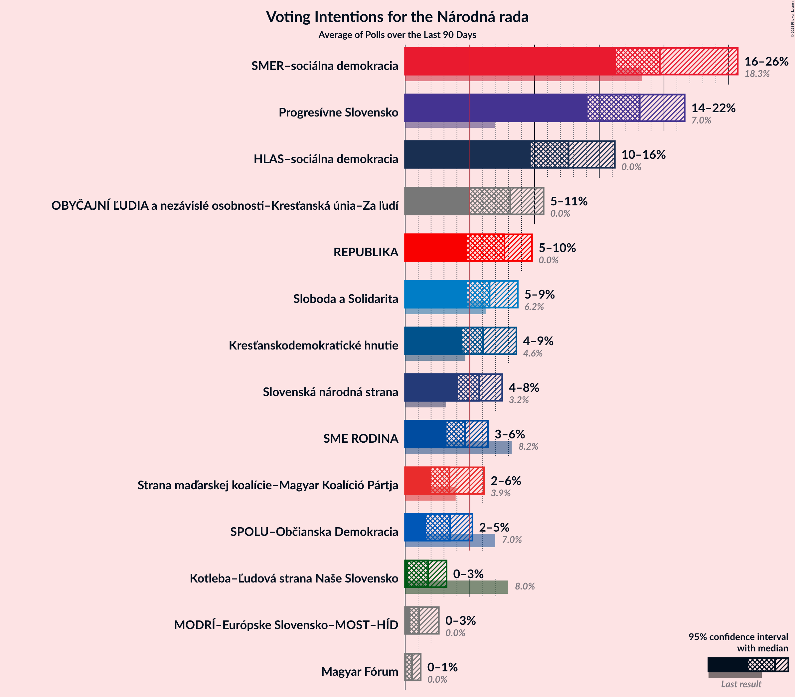

# Poll Average

<a href="#voting-intentions">Voting Intentions</a> | <a href="#seats">Seats</a> | <a href="#coalitions">Coalitions</a> | <a href="#technical-information">Technical Information</a>

## Summary

The table below lists the polls on which the average is based. They are the most recent polls (less than 90 days old) registered and analyzed so far.

| Period     | Polling firm/Commissioner(s) | Smer–SD | SaS | OĽaNO | NOVA | SNS | Kotleba–ĽSNS | SME RODINA | MOST–HÍD | KDH | SMK–MKP | PS | SPOLU | PS–SPOLU | ZĽ | DV | V |
|:----------:|:----------------------------:|:--:|:--:|:--:|:--:|:--:|:--:|:--:|:--:|:--:|:--:|:--:|:--:|:--:|:--:|:--:|:--:|
| 5 March 2016 | General Election | 28.3%   49 | 12.1%   21 | 11.0%   17 | 11.0%   2 | 8.6%   15 | 8.0%   14 | 6.6%   11 | 6.5%   11 | 4.9%   0 | 4.0%   0 | 0.0%   0 | 0.0%   0 | 0.0%   0 | 0.0%   0 | 0.0%   0 | 0.0%   0 |
| N/A | Poll Average | 18–24%   32–42 | 4–8%   0–13 | 5–8%   9–15 | N/A   N/A | 5–10%   10–17 | 7–14%   13–24 | 4–8%   0–15 | 3–5%   0 | 5–11%   9–20 | 2–4%   0 | N/A   N/A | N/A   N/A | 10–15%   17–27 | 7–14%   12–23 | 1–3%   0 | 1–3%   0 |
| [15–22 October 2019](2019-10-22-FOCUS.html) | FOCUS | 20–25%   37–44 | 4–7%   0–11 | 5–8%   9–14 | N/A   N/A | 5–8%   10–15 | 8–12%   15–19 | 6–9%   11–17 | 3–5%   0 | 5–8%   10–15 | 2–5%   0 | N/A   N/A | N/A   N/A | 9–13%   17–24 | 7–11%   14–17 | 2–4%   0 | 1–3%   0 |
| [7–10 October 2019](2019-10-10-AKO.html) | AKO | 18–23%   32–38 | 5–8%   10–14 | 5–7%   0–12 | N/A   N/A | 5–8%   10–13 | 10–14%   16–24 | 5–8%   0–12 | 3–5%   0 | 4–7%   0–12 | 2–4%   0 | N/A   N/A | N/A   N/A | 11–15%   20–27 | 10–14%   19–23 | 1–3%   0 | 1–2%   0 |
| [12 August 2019](2019-08-12-MVK.html) | MVK | 18–23%   32–42 | 4–7%   0–12 | 5–9%   10–15 | N/A   N/A | 7–10%   12–19 | 7–10%   12–18 | 4–7%   0–12 | 3–5%   0–8 | 8–11%   14–21 | 2–5%   0 | N/A   N/A | N/A   N/A | 11–16%   20–28 | 6–10%   11–18 | N/A   N/A | N/A   N/A |
| 5 March 2016 | General Election | 28.3%   49 | 12.1%   21 | 11.0%   17 | 11.0%   2 | 8.6%   15 | 8.0%   14 | 6.6%   11 | 6.5%   11 | 4.9%   0 | 4.0%   0 | 0.0%   0 | 0.0%   0 | 0.0%   0 | 0.0%   0 | 0.0%   0 | 0.0%   0 |

Only polls for which at least the sample size has been published are included in the table above.

**Legend:**
+ **Top half of each row:** Voting intentions (95% confidence interval)
+ **Bottom half of each row:** Seat projections for the Národná rada (95% confidence interval)
+ **Smer–SD:** SMER–sociálna demokracia
+ **SaS:** Sloboda a Solidarita
+ **OĽaNO:** OBYČAJNÍ ĽUDIA a nezávislé osobnosti
+ **NOVA:** NOVA
+ **SNS:** Slovenská národná strana
+ **Kotleba–ĽSNS:** Kotleba–Ľudová strana Naše Slovensko
+ **SME RODINA:** SME RODINA
+ **MOST–HÍD:** MOST–HÍD
+ **KDH:** Kresťanskodemokratické hnutie
+ **SMK–MKP:** Strana maďarskej koalície–Magyar Koalíció Pártja
+ **PS:** Progresívne Slovensko
+ **SPOLU:** SPOLU–Občianska Demokracia
+ **PS–SPOLU:** Progresívne Slovensko–SPOLU–Občianska Demokracia
+ **ZĽ:** Za ľudí
+ **DV:** Dobrá voľba
+ **V:** VLASŤ
+ **N/A (single party):** Party not included the published results
+ **N/A (entire row):** Calculation for this opinion poll not started yet

## Voting Intentions

### Confidence Intervals

| Party | Last Result | Median | 80% Confidence Interval | 90% Confidence Interval | 95% Confidence Interval | 99% Confidence Interval |
|:-----:|:-----------:|:------:|:-----------------------:|:-----------------------:|:-----------------------:|:-----------------------:|
| <a href="#smer–sociálna-demokracia">SMER–sociálna demokracia</a> | 28.3% | 21.0% | 19.1–23.0% |18.6–23.6% | 18.2–24.1% | 17.4–25.0% |
| <a href="#sloboda-a-solidarita">Sloboda a Solidarita</a> | 12.1% | 5.8% | 4.7–7.2% |4.4–7.6% | 4.2–8.0% | 3.8–8.6% |
| <a href="#obyčajní-ľudia-a-nezávislé-osobnosti">OBYČAJNÍ ĽUDIA a nezávislé osobnosti</a> | 11.0% | 6.3% | 5.2–7.5% |4.9–7.9% | 4.7–8.2% | 4.3–8.8% |
| <a href="#nova">NOVA</a> | 11.0% | N/A | N/A |N/A | N/A | N/A |
| <a href="#slovenská-národná-strana">Slovenská národná strana</a> | 8.6% | 6.9% | 5.7–9.0% |5.4–9.5% | 5.2–9.9% | 4.7–10.6% |
| <a href="#kotleba–ľudová-strana-naše-slovensko">Kotleba–Ľudová strana Naše Slovensko</a> | 8.0% | 10.2% | 7.7–12.9% |7.3–13.5% | 7.0–13.9% | 6.4–14.7% |
| <a href="#sme-rodina">SME RODINA</a> | 6.6% | 6.2% | 5.0–7.8% |4.7–8.2% | 4.5–8.5% | 4.1–9.2% |
| <a href="#most–híd">MOST–HÍD</a> | 6.5% | 3.9% | 3.2–4.7% |3.0–5.0% | 2.8–5.2% | 2.5–5.7% |
| <a href="#kresťanskodemokratické-hnutie">Kresťanskodemokratické hnutie</a> | 4.9% | 6.7% | 5.2–9.9% |4.9–10.4% | 4.7–10.8% | 4.2–11.6% |
| <a href="#strana-maďarskej-koalície–magyar-koalíció-pártja">Strana maďarskej koalície–Magyar Koalíció Pártja</a> | 4.0% | 3.3% | 2.6–4.1% |2.4–4.3% | 2.3–4.5% | 2.0–5.0% |
| <a href="#progresívne-slovensko">Progresívne Slovensko</a> | 0.0% | N/A | N/A |N/A | N/A | N/A |
| <a href="#spolu–občianska-demokracia">SPOLU–Občianska Demokracia</a> | 0.0% | N/A | N/A |N/A | N/A | N/A |
| <a href="#progresívne-slovensko–spolu–občianska-demokracia">Progresívne Slovensko–SPOLU–Občianska Demokracia</a> | 0.0% | 12.4% | 10.5–14.2% |10.0–14.7% | 9.7–15.1% | 9.0–15.9% |
| <a href="#za-ľudí">Za ľudí</a> | 0.0% | 9.2% | 7.4–12.6% |7.1–13.1% | 6.8–13.6% | 6.2–14.4% |
| <a href="#dobrá-voľba">Dobrá voľba</a> | 0.0% | 2.1% | 1.4–3.0% |1.3–3.2% | 1.2–3.4% | 1.0–3.8% |
| <a href="#vlasť">VLASŤ</a> | 0.0% | 1.6% | 1.1–2.2% |0.9–2.4% | 0.8–2.6% | 0.7–3.0% |

### SMER–sociálna demokracia

*For a full overview of the results for this party, see the [SMER–sociálna demokracia](party-smer–sociálnademokracia.html) page.*

| Voting Intentions | Probability | Accumulated | Special Marks |
|:-----------------:|:-----------:|:-----------:|:-------------:|
| 15.5–16.5% | 0.1% | 100% |  |
| 16.5–17.5% | 0.7% | 99.9% |  |
| 17.5–18.5% | 4% | 99.3% |  |
| 18.5–19.5% | 13% | 95% |  |
| 19.5–20.5% | 22% | 83% |  |
| 20.5–21.5% | 25% | 61% | Median |
| 21.5–22.5% | 20% | 35% |  |
| 22.5–23.5% | 11% | 16% |  |
| 23.5–24.5% | 4% | 5% |  |
| 24.5–25.5% | 1.0% | 1.1% |  |
| 25.5–26.5% | 0.2% | 0.2% |  |
| 26.5–27.5% | 0% | 0% |  |
| 27.5–28.5% | 0% | 0% | Last Result |

### Sloboda a Solidarita

*For a full overview of the results for this party, see the [Sloboda a Solidarita](party-slobodaasolidarita.html) page.*

| Voting Intentions | Probability | Accumulated | Special Marks |
|:-----------------:|:-----------:|:-----------:|:-------------:|
| 1.5–2.5% | 0% | 100% |  |
| 2.5–3.5% | 0.1% | 100% |  |
| 3.5–4.5% | 7% | 99.9% |  |
| 4.5–5.5% | 33% | 93% |  |
| 5.5–6.5% | 35% | 60% | Median |
| 6.5–7.5% | 19% | 25% |  |
| 7.5–8.5% | 5% | 6% |  |
| 8.5–9.5% | 0.6% | 0.6% |  |
| 9.5–10.5% | 0% | 0% |  |
| 10.5–11.5% | 0% | 0% |  |
| 11.5–12.5% | 0% | 0% | Last Result |

### OBYČAJNÍ ĽUDIA a nezávislé osobnosti

*For a full overview of the results for this party, see the [OBYČAJNÍ ĽUDIA a nezávislé osobnosti](party-obyčajníľudiaanezávisléosobnosti.html) page.*

| Voting Intentions | Probability | Accumulated | Special Marks |
|:-----------------:|:-----------:|:-----------:|:-------------:|
| 2.5–3.5% | 0% | 100% |  |
| 3.5–4.5% | 1.5% | 100% |  |
| 4.5–5.5% | 19% | 98.5% |  |
| 5.5–6.5% | 42% | 79% | Median |
| 6.5–7.5% | 28% | 38% |  |
| 7.5–8.5% | 8% | 10% |  |
| 8.5–9.5% | 1.1% | 1.1% |  |
| 9.5–10.5% | 0.1% | 0.1% |  |
| 10.5–11.5% | 0% | 0% | Last Result |

### Slovenská národná strana

*For a full overview of the results for this party, see the [Slovenská národná strana](party-slovenskánárodnástrana.html) page.*

| Voting Intentions | Probability | Accumulated | Special Marks |
|:-----------------:|:-----------:|:-----------:|:-------------:|
| 2.5–3.5% | 0% | 100% |  |
| 3.5–4.5% | 0.2% | 100% |  |
| 4.5–5.5% | 7% | 99.8% |  |
| 5.5–6.5% | 30% | 92% |  |
| 6.5–7.5% | 27% | 63% | Median |
| 7.5–8.5% | 18% | 35% |  |
| 8.5–9.5% | 13% | 17% | Last Result |
| 9.5–10.5% | 4% | 5% |  |
| 10.5–11.5% | 0.5% | 0.6% |  |
| 11.5–12.5% | 0% | 0% |  |

### Kotleba–Ľudová strana Naše Slovensko

*For a full overview of the results for this party, see the [Kotleba–Ľudová strana Naše Slovensko](party-kotleba–ľudovástrananašeslovensko.html) page.*

| Voting Intentions | Probability | Accumulated | Special Marks |
|:-----------------:|:-----------:|:-----------:|:-------------:|
| 4.5–5.5% | 0% | 100% |  |
| 5.5–6.5% | 0.8% | 100% |  |
| 6.5–7.5% | 7% | 99.2% |  |
| 7.5–8.5% | 16% | 92% | Last Result |
| 8.5–9.5% | 16% | 77% |  |
| 9.5–10.5% | 16% | 61% | Median |
| 10.5–11.5% | 16% | 45% |  |
| 11.5–12.5% | 15% | 29% |  |
| 12.5–13.5% | 10% | 15% |  |
| 13.5–14.5% | 4% | 4% |  |
| 14.5–15.5% | 0.6% | 0.7% |  |
| 15.5–16.5% | 0.1% | 0.1% |  |
| 16.5–17.5% | 0% | 0% |  |

### SME RODINA

*For a full overview of the results for this party, see the [SME RODINA](party-smerodina.html) page.*

| Voting Intentions | Probability | Accumulated | Special Marks |
|:-----------------:|:-----------:|:-----------:|:-------------:|
| 2.5–3.5% | 0% | 100% |  |
| 3.5–4.5% | 3% | 100% |  |
| 4.5–5.5% | 23% | 97% |  |
| 5.5–6.5% | 35% | 74% | Median |
| 6.5–7.5% | 24% | 38% | Last Result |
| 7.5–8.5% | 11% | 14% |  |
| 8.5–9.5% | 2% | 2% |  |
| 9.5–10.5% | 0.2% | 0.2% |  |
| 10.5–11.5% | 0% | 0% |  |

### MOST–HÍD

*For a full overview of the results for this party, see the [MOST–HÍD](party-most–híd.html) page.*

| Voting Intentions | Probability | Accumulated | Special Marks |
|:-----------------:|:-----------:|:-----------:|:-------------:|
| 0.5–1.5% | 0% | 100% |  |
| 1.5–2.5% | 0.6% | 100% |  |
| 2.5–3.5% | 27% | 99.4% |  |
| 3.5–4.5% | 57% | 72% | Median |
| 4.5–5.5% | 15% | 15% |  |
| 5.5–6.5% | 0.8% | 0.8% |  |
| 6.5–7.5% | 0% | 0% | Last Result |

### Kresťanskodemokratické hnutie

*For a full overview of the results for this party, see the [Kresťanskodemokratické hnutie](party-kresťanskodemokratickéhnutie.html) page.*

| Voting Intentions | Probability | Accumulated | Special Marks |
|:-----------------:|:-----------:|:-----------:|:-------------:|
| 2.5–3.5% | 0% | 100% |  |
| 3.5–4.5% | 2% | 100% |  |
| 4.5–5.5% | 16% | 98% | Last Result |
| 5.5–6.5% | 29% | 82% |  |
| 6.5–7.5% | 17% | 53% | Median |
| 7.5–8.5% | 8% | 37% |  |
| 8.5–9.5% | 13% | 28% |  |
| 9.5–10.5% | 11% | 15% |  |
| 10.5–11.5% | 4% | 4% |  |
| 11.5–12.5% | 0.5% | 0.5% |  |
| 12.5–13.5% | 0% | 0% |  |

### Strana maďarskej koalície–Magyar Koalíció Pártja

*For a full overview of the results for this party, see the [Strana maďarskej koalície–Magyar Koalíció Pártja](party-stranamaďarskejkoalície–magyarkoalíciópártja.html) page.*

| Voting Intentions | Probability | Accumulated | Special Marks |
|:-----------------:|:-----------:|:-----------:|:-------------:|
| 0.5–1.5% | 0% | 100% |  |
| 1.5–2.5% | 8% | 100% |  |
| 2.5–3.5% | 59% | 92% | Median |
| 3.5–4.5% | 31% | 34% | Last Result |
| 4.5–5.5% | 2% | 2% |  |
| 5.5–6.5% | 0.1% | 0.1% |  |
| 6.5–7.5% | 0% | 0% |  |

### Progresívne Slovensko–SPOLU–Občianska Demokracia

*For a full overview of the results for this party, see the [Progresívne Slovensko–SPOLU–Občianska Demokracia](party-progresívneslovensko–spolu–občianskademokracia.html) page.*

| Voting Intentions | Probability | Accumulated | Special Marks |
|:-----------------:|:-----------:|:-----------:|:-------------:|
| 0.0–0.5% | 0% | 100% | Last Result |
| 0.5–1.5% | 0% | 100% |  |
| 1.5–2.5% | 0% | 100% |  |
| 2.5–3.5% | 0% | 100% |  |
| 3.5–4.5% | 0% | 100% |  |
| 4.5–5.5% | 0% | 100% |  |
| 5.5–6.5% | 0% | 100% |  |
| 6.5–7.5% | 0% | 100% |  |
| 7.5–8.5% | 0.1% | 100% |  |
| 8.5–9.5% | 2% | 99.9% |  |
| 9.5–10.5% | 9% | 98% |  |
| 10.5–11.5% | 18% | 89% |  |
| 11.5–12.5% | 24% | 71% | Median |
| 12.5–13.5% | 25% | 47% |  |
| 13.5–14.5% | 16% | 22% |  |
| 14.5–15.5% | 5% | 6% |  |
| 15.5–16.5% | 0.9% | 1.0% |  |
| 16.5–17.5% | 0.1% | 0.1% |  |
| 17.5–18.5% | 0% | 0% |  |

### Za ľudí

*For a full overview of the results for this party, see the [Za ľudí](party-zaľudí.html) page.*

| Voting Intentions | Probability | Accumulated | Special Marks |
|:-----------------:|:-----------:|:-----------:|:-------------:|
| 0.0–0.5% | 0% | 100% | Last Result |
| 0.5–1.5% | 0% | 100% |  |
| 1.5–2.5% | 0% | 100% |  |
| 2.5–3.5% | 0% | 100% |  |
| 3.5–4.5% | 0% | 100% |  |
| 4.5–5.5% | 0% | 100% |  |
| 5.5–6.5% | 1.4% | 100% |  |
| 6.5–7.5% | 10% | 98.6% |  |
| 7.5–8.5% | 23% | 88% |  |
| 8.5–9.5% | 21% | 66% | Median |
| 9.5–10.5% | 11% | 44% |  |
| 10.5–11.5% | 10% | 33% |  |
| 11.5–12.5% | 12% | 23% |  |
| 12.5–13.5% | 8% | 11% |  |
| 13.5–14.5% | 2% | 3% |  |
| 14.5–15.5% | 0.3% | 0.4% |  |
| 15.5–16.5% | 0% | 0% |  |

### Dobrá voľba

*For a full overview of the results for this party, see the [Dobrá voľba](party-dobrávoľba.html) page.*

| Voting Intentions | Probability | Accumulated | Special Marks |
|:-----------------:|:-----------:|:-----------:|:-------------:|
| 0.0–0.5% | 0% | 100% | Last Result |
| 0.5–1.5% | 16% | 100% |  |
| 1.5–2.5% | 58% | 84% | Median |
| 2.5–3.5% | 25% | 26% |  |
| 3.5–4.5% | 1.4% | 1.5% |  |
| 4.5–5.5% | 0% | 0% |  |

### VLASŤ

*For a full overview of the results for this party, see the [VLASŤ](party-vlasť.html) page.*

| Voting Intentions | Probability | Accumulated | Special Marks |
|:-----------------:|:-----------:|:-----------:|:-------------:|
| 0.0–0.5% | 0.1% | 100% | Last Result |
| 0.5–1.5% | 47% | 99.9% |  |
| 1.5–2.5% | 50% | 53% | Median |
| 2.5–3.5% | 3% | 3% |  |
| 3.5–4.5% | 0% | 0% |  |

## Seats

### Confidence Intervals

| Party | Last Result | Median | 80% Confidence Interval | 90% Confidence Interval | 95% Confidence Interval | 99% Confidence Interval |
|:-----:|:-----------:|:------:|:-----------------------:|:-----------------------:|:-----------------------:|:-----------------------:|
| <a href="#smer–sociálna-demokracia">SMER–sociálna demokracia</a> | 49 | 37 | 33–41 |33–41 | 32–42 | 31–47 |
| <a href="#sloboda-a-solidarita">Sloboda a Solidarita</a> | 21 | 10 | 9–12 |0–12 | 0–13 | 0–15 |
| <a href="#obyčajní-ľudia-a-nezávislé-osobnosti">OBYČAJNÍ ĽUDIA a nezávislé osobnosti</a> | 17 | 11 | 10–13 |10–14 | 9–15 | 0–16 |
| <a href="#nova">NOVA</a> | 2 | N/A | N/A |N/A | N/A | N/A |
| <a href="#slovenská-národná-strana">Slovenská národná strana</a> | 15 | 13 | 10–16 |10–17 | 10–17 | 9–20 |
| <a href="#kotleba–ľudová-strana-naše-slovensko">Kotleba–Ľudová strana Naše Slovensko</a> | 14 | 17 | 14–24 |13–24 | 13–24 | 11–25 |
| <a href="#sme-rodina">SME RODINA</a> | 11 | 10 | 0–14 |0–14 | 0–15 | 0–17 |
| <a href="#most–híd">MOST–HÍD</a> | 11 | 0 | 0 |0 | 0 | 0–10 |
| <a href="#kresťanskodemokratické-hnutie">Kresťanskodemokratické hnutie</a> | 0 | 13 | 11–18 |9–19 | 9–20 | 0–21 |
| <a href="#strana-maďarskej-koalície–magyar-koalíció-pártja">Strana maďarskej koalície–Magyar Koalíció Pártja</a> | 0 | 0 | 0 |0 | 0 | 0 |
| <a href="#progresívne-slovensko">Progresívne Slovensko</a> | 0 | N/A | N/A |N/A | N/A | N/A |
| <a href="#spolu–občianska-demokracia">SPOLU–Občianska Demokracia</a> | 0 | N/A | N/A |N/A | N/A | N/A |
| <a href="#progresívne-slovensko–spolu–občianska-demokracia">Progresívne Slovensko–SPOLU–Občianska Demokracia</a> | 0 | 23 | 17–25 |17–26 | 17–27 | 17–28 |
| <a href="#za-ľudí">Za ľudí</a> | 0 | 16 | 13–20 |13–21 | 12–23 | 11–24 |
| <a href="#dobrá-voľba">Dobrá voľba</a> | 0 | 0 | 0 |0 | 0 | 0 |
| <a href="#vlasť">VLASŤ</a> | 0 | 0 | 0 |0 | 0 | 0 |

### SMER–sociálna demokracia

*For a full overview of the results for this party, see the [SMER–sociálna demokracia](party-smer–sociálnademokracia.html) page.*

| Number of Seats | Probability | Accumulated | Special Marks |
|:---------------:|:-----------:|:-----------:|:-------------:|
| 29 | 0.1% | 100% |  |
| 30 | 0.2% | 99.9% |  |
| 31 | 0.7% | 99.7% |  |
| 32 | 2% | 99.0% |  |
| 33 | 9% | 97% |  |
| 34 | 4% | 88% |  |
| 35 | 16% | 84% |  |
| 36 | 6% | 68% |  |
| 37 | 17% | 62% | Median |
| 38 | 17% | 45% |  |
| 39 | 5% | 27% |  |
| 40 | 5% | 22% |  |
| 41 | 13% | 17% |  |
| 42 | 2% | 4% |  |
| 43 | 1.1% | 2% |  |
| 44 | 0.2% | 1.1% |  |
| 45 | 0.1% | 0.9% |  |
| 46 | 0.1% | 0.9% |  |
| 47 | 0.6% | 0.8% |  |
| 48 | 0% | 0.2% |  |
| 49 | 0% | 0.2% | Last Result |
| 50 | 0.1% | 0.2% |  |
| 51 | 0% | 0.1% |  |
| 52 | 0.1% | 0.1% |  |
| 53 | 0% | 0% |  |

### Sloboda a Solidarita

*For a full overview of the results for this party, see the [Sloboda a Solidarita](party-slobodaasolidarita.html) page.*

| Number of Seats | Probability | Accumulated | Special Marks |
|:---------------:|:-----------:|:-----------:|:-------------:|
| 0 | 8% | 100% |  |
| 1 | 0% | 92% |  |
| 2 | 0% | 92% |  |
| 3 | 0% | 92% |  |
| 4 | 0% | 92% |  |
| 5 | 0% | 92% |  |
| 6 | 0% | 92% |  |
| 7 | 0% | 92% |  |
| 8 | 0.1% | 92% |  |
| 9 | 24% | 92% |  |
| 10 | 41% | 68% | Median |
| 11 | 17% | 27% |  |
| 12 | 7% | 10% |  |
| 13 | 0.6% | 3% |  |
| 14 | 1.5% | 2% |  |
| 15 | 0.4% | 0.8% |  |
| 16 | 0.3% | 0.4% |  |
| 17 | 0.1% | 0.1% |  |
| 18 | 0% | 0% |  |
| 19 | 0% | 0% |  |
| 20 | 0% | 0% |  |
| 21 | 0% | 0% | Last Result |

### OBYČAJNÍ ĽUDIA a nezávislé osobnosti

*For a full overview of the results for this party, see the [OBYČAJNÍ ĽUDIA a nezávislé osobnosti](party-obyčajníľudiaanezávisléosobnosti.html) page.*

| Number of Seats | Probability | Accumulated | Special Marks |
|:---------------:|:-----------:|:-----------:|:-------------:|
| 0 | 2% | 100% |  |
| 1 | 0% | 98% |  |
| 2 | 0% | 98% |  |
| 3 | 0% | 98% |  |
| 4 | 0% | 98% |  |
| 5 | 0% | 98% |  |
| 6 | 0% | 98% |  |
| 7 | 0% | 98% |  |
| 8 | 0% | 98% |  |
| 9 | 2% | 98% |  |
| 10 | 33% | 96% |  |
| 11 | 20% | 63% | Median |
| 12 | 15% | 43% |  |
| 13 | 20% | 28% |  |
| 14 | 5% | 8% |  |
| 15 | 3% | 3% |  |
| 16 | 0.5% | 0.7% |  |
| 17 | 0.2% | 0.2% | Last Result |
| 18 | 0% | 0% |  |

### Slovenská národná strana

*For a full overview of the results for this party, see the [Slovenská národná strana](party-slovenskánárodnástrana.html) page.*

| Number of Seats | Probability | Accumulated | Special Marks |
|:---------------:|:-----------:|:-----------:|:-------------:|
| 0 | 0.5% | 100% |  |
| 1 | 0% | 99.5% |  |
| 2 | 0% | 99.5% |  |
| 3 | 0% | 99.5% |  |
| 4 | 0% | 99.5% |  |
| 5 | 0% | 99.5% |  |
| 6 | 0% | 99.5% |  |
| 7 | 0% | 99.5% |  |
| 8 | 0% | 99.5% |  |
| 9 | 0.7% | 99.5% |  |
| 10 | 13% | 98.8% |  |
| 11 | 1.2% | 85% |  |
| 12 | 4% | 84% |  |
| 13 | 33% | 81% | Median |
| 14 | 4% | 47% |  |
| 15 | 29% | 43% | Last Result |
| 16 | 7% | 14% |  |
| 17 | 5% | 7% |  |
| 18 | 1.1% | 2% |  |
| 19 | 0.3% | 1.0% |  |
| 20 | 0.5% | 0.6% |  |
| 21 | 0.1% | 0.1% |  |
| 22 | 0% | 0% |  |

### Kotleba–Ľudová strana Naše Slovensko

*For a full overview of the results for this party, see the [Kotleba–Ľudová strana Naše Slovensko](party-kotleba–ľudovástrananašeslovensko.html) page.*

| Number of Seats | Probability | Accumulated | Special Marks |
|:---------------:|:-----------:|:-----------:|:-------------:|
| 10 | 0% | 100% |  |
| 11 | 0.6% | 99.9% |  |
| 12 | 1.4% | 99.4% |  |
| 13 | 7% | 98% |  |
| 14 | 7% | 91% | Last Result |
| 15 | 8% | 84% |  |
| 16 | 15% | 76% |  |
| 17 | 18% | 62% | Median |
| 18 | 12% | 44% |  |
| 19 | 3% | 32% |  |
| 20 | 0.4% | 29% |  |
| 21 | 11% | 29% |  |
| 22 | 0.8% | 18% |  |
| 23 | 1.1% | 18% |  |
| 24 | 16% | 17% |  |
| 25 | 0.5% | 0.8% |  |
| 26 | 0% | 0.2% |  |
| 27 | 0% | 0.2% |  |
| 28 | 0% | 0.2% |  |
| 29 | 0% | 0.2% |  |
| 30 | 0.2% | 0.2% |  |
| 31 | 0% | 0% |  |

### SME RODINA

*For a full overview of the results for this party, see the [SME RODINA](party-smerodina.html) page.*

| Number of Seats | Probability | Accumulated | Special Marks |
|:---------------:|:-----------:|:-----------:|:-------------:|
| 0 | 23% | 100% |  |
| 1 | 0% | 77% |  |
| 2 | 0% | 77% |  |
| 3 | 0% | 77% |  |
| 4 | 0% | 77% |  |
| 5 | 0% | 77% |  |
| 6 | 0% | 77% |  |
| 7 | 0% | 77% |  |
| 8 | 0% | 77% |  |
| 9 | 18% | 77% |  |
| 10 | 16% | 59% | Median |
| 11 | 8% | 43% | Last Result |
| 12 | 13% | 35% |  |
| 13 | 5% | 22% |  |
| 14 | 15% | 17% |  |
| 15 | 0.7% | 3% |  |
| 16 | 0.9% | 2% |  |
| 17 | 0.9% | 0.9% |  |
| 18 | 0% | 0% |  |

### MOST–HÍD

*For a full overview of the results for this party, see the [MOST–HÍD](party-most–híd.html) page.*

| Number of Seats | Probability | Accumulated | Special Marks |
|:---------------:|:-----------:|:-----------:|:-------------:|
| 0 | 98.5% | 100% | Median |
| 1 | 0% | 1.5% |  |
| 2 | 0% | 1.5% |  |
| 3 | 0% | 1.5% |  |
| 4 | 0% | 1.5% |  |
| 5 | 0% | 1.5% |  |
| 6 | 0% | 1.5% |  |
| 7 | 0% | 1.5% |  |
| 8 | 0.4% | 1.5% |  |
| 9 | 0.5% | 1.1% |  |
| 10 | 0.4% | 0.6% |  |
| 11 | 0.2% | 0.2% | Last Result |
| 12 | 0% | 0% |  |

### Kresťanskodemokratické hnutie

*For a full overview of the results for this party, see the [Kresťanskodemokratické hnutie](party-kresťanskodemokratickéhnutie.html) page.*

| Number of Seats | Probability | Accumulated | Special Marks |
|:---------------:|:-----------:|:-----------:|:-------------:|
| 0 | 2% | 100% | Last Result |
| 1 | 0% | 98% |  |
| 2 | 0% | 98% |  |
| 3 | 0% | 98% |  |
| 4 | 0% | 98% |  |
| 5 | 0% | 98% |  |
| 6 | 0% | 98% |  |
| 7 | 0% | 98% |  |
| 8 | 0.1% | 98% |  |
| 9 | 5% | 98% |  |
| 10 | 1.4% | 93% |  |
| 11 | 37% | 92% |  |
| 12 | 2% | 55% |  |
| 13 | 19% | 53% | Median |
| 14 | 3% | 34% |  |
| 15 | 3% | 31% |  |
| 16 | 9% | 28% |  |
| 17 | 4% | 19% |  |
| 18 | 8% | 15% |  |
| 19 | 4% | 7% |  |
| 20 | 2% | 3% |  |
| 21 | 0.7% | 1.0% |  |
| 22 | 0.2% | 0.3% |  |
| 23 | 0% | 0.1% |  |
| 24 | 0% | 0% |  |

### Strana maďarskej koalície–Magyar Koalíció Pártja

*For a full overview of the results for this party, see the [Strana maďarskej koalície–Magyar Koalíció Pártja](party-stranamaďarskejkoalície–magyarkoalíciópártja.html) page.*

| Number of Seats | Probability | Accumulated | Special Marks |
|:---------------:|:-----------:|:-----------:|:-------------:|
| 0 | 99.6% | 100% | Last Result, Median |
| 1 | 0% | 0.4% |  |
| 2 | 0% | 0.4% |  |
| 3 | 0% | 0.4% |  |
| 4 | 0% | 0.4% |  |
| 5 | 0% | 0.4% |  |
| 6 | 0% | 0.4% |  |
| 7 | 0% | 0.4% |  |
| 8 | 0.1% | 0.4% |  |
| 9 | 0.2% | 0.2% |  |
| 10 | 0.1% | 0.1% |  |
| 11 | 0% | 0% |  |

### Progresívne Slovensko–SPOLU–Občianska Demokracia

*For a full overview of the results for this party, see the [Progresívne Slovensko–SPOLU–Občianska Demokracia](party-progresívneslovensko–spolu–občianskademokracia.html) page.*

| Number of Seats | Probability | Accumulated | Special Marks |
|:---------------:|:-----------:|:-----------:|:-------------:|
| 0 | 0% | 100% | Last Result |
| 1 | 0% | 100% |  |
| 2 | 0% | 100% |  |
| 3 | 0% | 100% |  |
| 4 | 0% | 100% |  |
| 5 | 0% | 100% |  |
| 6 | 0% | 100% |  |
| 7 | 0% | 100% |  |
| 8 | 0% | 100% |  |
| 9 | 0% | 100% |  |
| 10 | 0% | 100% |  |
| 11 | 0% | 100% |  |
| 12 | 0% | 100% |  |
| 13 | 0% | 100% |  |
| 14 | 0% | 100% |  |
| 15 | 0% | 100% |  |
| 16 | 0.1% | 100% |  |
| 17 | 14% | 99.9% |  |
| 18 | 0.4% | 86% |  |
| 19 | 16% | 85% |  |
| 20 | 2% | 70% |  |
| 21 | 3% | 67% |  |
| 22 | 9% | 64% |  |
| 23 | 19% | 56% | Median |
| 24 | 24% | 37% |  |
| 25 | 7% | 13% |  |
| 26 | 2% | 6% |  |
| 27 | 3% | 4% |  |
| 28 | 0.9% | 1.3% |  |
| 29 | 0.2% | 0.4% |  |
| 30 | 0.1% | 0.2% |  |
| 31 | 0.1% | 0.1% |  |
| 32 | 0% | 0% |  |

### Za ľudí

*For a full overview of the results for this party, see the [Za ľudí](party-zaľudí.html) page.*

| Number of Seats | Probability | Accumulated | Special Marks |
|:---------------:|:-----------:|:-----------:|:-------------:|
| 0 | 0% | 100% | Last Result |
| 1 | 0% | 100% |  |
| 2 | 0% | 100% |  |
| 3 | 0% | 100% |  |
| 4 | 0% | 100% |  |
| 5 | 0% | 100% |  |
| 6 | 0% | 100% |  |
| 7 | 0% | 100% |  |
| 8 | 0% | 100% |  |
| 9 | 0% | 100% |  |
| 10 | 0.1% | 100% |  |
| 11 | 1.2% | 99.9% |  |
| 12 | 3% | 98.7% |  |
| 13 | 10% | 96% |  |
| 14 | 12% | 85% |  |
| 15 | 16% | 74% |  |
| 16 | 19% | 58% | Median |
| 17 | 3% | 38% |  |
| 18 | 1.4% | 35% |  |
| 19 | 11% | 34% |  |
| 20 | 15% | 22% |  |
| 21 | 3% | 7% |  |
| 22 | 0.2% | 4% |  |
| 23 | 3% | 3% |  |
| 24 | 0.6% | 0.7% |  |
| 25 | 0.1% | 0.2% |  |
| 26 | 0% | 0.1% |  |
| 27 | 0.1% | 0.1% |  |
| 28 | 0% | 0% |  |

### Dobrá voľba

*For a full overview of the results for this party, see the [Dobrá voľba](party-dobrávoľba.html) page.*

| Number of Seats | Probability | Accumulated | Special Marks |
|:---------------:|:-----------:|:-----------:|:-------------:|
| 0 | 100% | 100% | Last Result, Median |

### VLASŤ

*For a full overview of the results for this party, see the [VLASŤ](party-vlasť.html) page.*

| Number of Seats | Probability | Accumulated | Special Marks |
|:---------------:|:-----------:|:-----------:|:-------------:|
| 0 | 100% | 100% | Last Result, Median |

## Coalitions

### Confidence Intervals

| Coalition | Last Result | Median | Majority? | 80% Confidence Interval | 90% Confidence Interval | 95% Confidence Interval | 99% Confidence Interval |
|:---------:|:-----------:|:------:|:---------:|:-----------------------:|:-----------------------:|:-----------------------:|:-----------------------:|
| SMER–sociálna demokracia – Slovenská národná strana – MOST–HÍD | 75 | 51 | 0% | 45–55 | 45–56 | 43–58 | 42–63 |
| SMER–sociálna demokracia | 49 | 37 | 0% | 33–41 | 33–41 | 32–42 | 31–47 |

### SMER–sociálna demokracia – Slovenská národná strana – MOST–HÍD

| Number of Seats | Probability | Accumulated | Special Marks |
|:---------------:|:-----------:|:-----------:|:-------------:|
| 37 | 0.1% | 100% |  |
| 38 | 0% | 99.9% |  |
| 39 | 0% | 99.9% |  |
| 40 | 0% | 99.8% |  |
| 41 | 0.1% | 99.8% |  |
| 42 | 1.5% | 99.7% |  |
| 43 | 1.1% | 98% |  |
| 44 | 0.6% | 97% |  |
| 45 | 11% | 97% |  |
| 46 | 1.3% | 86% |  |
| 47 | 0.5% | 85% |  |
| 48 | 8% | 84% |  |
| 49 | 6% | 76% |  |
| 50 | 3% | 71% | Median |
| 51 | 21% | 68% |  |
| 52 | 18% | 47% |  |
| 53 | 3% | 28% |  |
| 54 | 14% | 26% |  |
| 55 | 5% | 11% |  |
| 56 | 1.5% | 6% |  |
| 57 | 2% | 5% |  |
| 58 | 1.0% | 3% |  |
| 59 | 0.2% | 2% |  |
| 60 | 0.2% | 2% |  |
| 61 | 0.4% | 1.3% |  |
| 62 | 0.3% | 0.9% |  |
| 63 | 0.4% | 0.7% |  |
| 64 | 0.1% | 0.3% |  |
| 65 | 0% | 0.2% |  |
| 66 | 0.1% | 0.2% |  |
| 67 | 0.1% | 0.1% |  |
| 68 | 0% | 0% |  |
| 69 | 0% | 0% |  |
| 70 | 0% | 0% |  |
| 71 | 0% | 0% |  |
| 72 | 0% | 0% |  |
| 73 | 0% | 0% |  |
| 74 | 0% | 0% |  |
| 75 | 0% | 0% | Last Result |

### SMER–sociálna demokracia

| Number of Seats | Probability | Accumulated | Special Marks |
|:---------------:|:-----------:|:-----------:|:-------------:|
| 29 | 0.1% | 100% |  |
| 30 | 0.2% | 99.9% |  |
| 31 | 0.7% | 99.7% |  |
| 32 | 2% | 99.0% |  |
| 33 | 9% | 97% |  |
| 34 | 4% | 88% |  |
| 35 | 16% | 84% |  |
| 36 | 6% | 68% |  |
| 37 | 17% | 62% | Median |
| 38 | 17% | 45% |  |
| 39 | 5% | 27% |  |
| 40 | 5% | 22% |  |
| 41 | 13% | 17% |  |
| 42 | 2% | 4% |  |
| 43 | 1.1% | 2% |  |
| 44 | 0.2% | 1.1% |  |
| 45 | 0.1% | 0.9% |  |
| 46 | 0.1% | 0.9% |  |
| 47 | 0.6% | 0.8% |  |
| 48 | 0% | 0.2% |  |
| 49 | 0% | 0.2% | Last Result |
| 50 | 0.1% | 0.2% |  |
| 51 | 0% | 0.1% |  |
| 52 | 0.1% | 0.1% |  |
| 53 | 0% | 0% |  |

## Technical Information

+ **Number of polls included in this average:** 3
+ **Lowest number of simulations done in a poll included in this average:** 131,072
+ **Total number of simulations done in the polls included in this average:** 1,310,720
+ **Error estimate:** 3.40%
