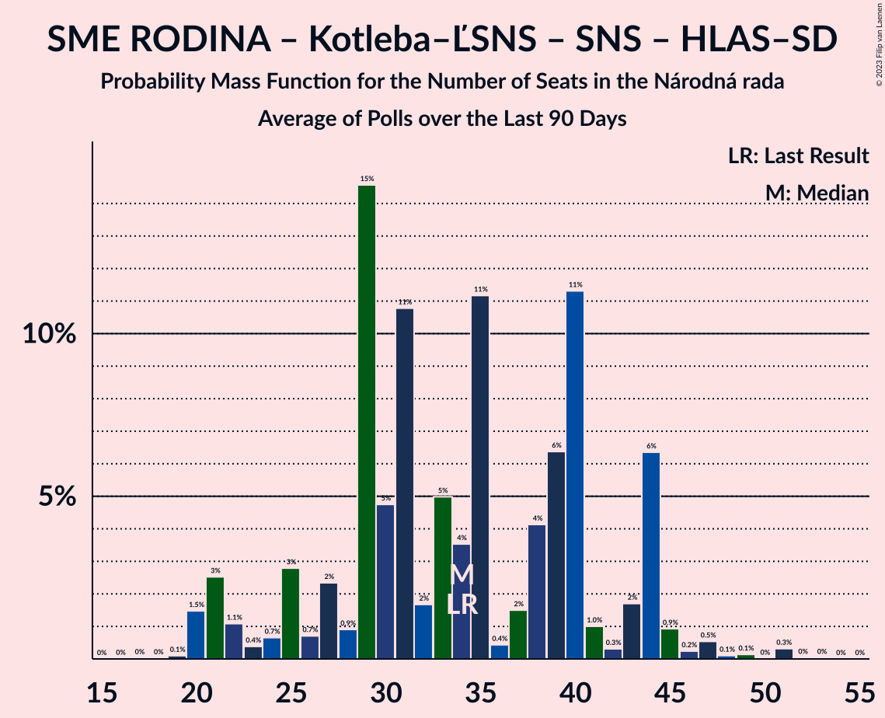

# Poll Average

<a href="#voting-intentions">Voting Intentions</a> | <a href="#seats">Seats</a> | <a href="#coalitions">Coalitions</a> | <a href="#technical-information">Technical Information</a>

## Summary

The table below lists the polls on which the average is based. They are the most recent polls (less than 90 days old) registered and analyzed so far.

| Period     | Polling firm/Commissioner(s) | OĽaNO | Smer–SD | SME RODINA | Kotleba–ĽSNS | PS–SPOLU | SaS | ZĽ | KDH | SMK–MKP | SNS | DV | V | MOST–HÍD | NOVA | PS | SPOLU | HLAS–SD | REP |
|:----------:|:----------------------------:|:--:|:--:|:--:|:--:|:--:|:--:|:--:|:--:|:--:|:--:|:--:|:--:|:--:|:--:|:--:|:--:|:--:|:--:|
| 29 February 2020 | General Election | 25.0%   53 | 18.3%   38 | 8.2%   17 | 8.0%   17 | 7.0%   0 | 6.2%   13 | 5.8%   12 | 4.6%   0 | 3.9%   0 | 3.2%   0 | 3.1%   0 | 2.9%   0 | 2.0%   0 | 0.0%   0 | 7.0%   0 | 7.0%   0 | 0.0%   0 | 0.0%   0 |
| N/A | Poll Average | 8–16%   13–32 | 7–12%   14–23 | 4–11%   0–19 | 2–10%   0–19 | N/A   N/A | 9–14%   20–28 | 3–6%   0–13 | 3–7%   0–12 | 2–7%   0–11 | 1–4%   0–11 | 1–4%   0 | 0–3%   0 | 1–6%   0–11 | N/A   N/A | 5–9%   0–16 | 0–2%   0 | 19–25%   36–50 | 4–6%   0–13 |
| [31 March–7 April 2021](2021-04-07-FOCUS.html) | FOCUS | 8–11%   15–20 | 9–13%   17–27 | 6–9%   10–19 | 3–6%   0–12 | N/A   N/A | 9–13%   19–27 | 4–6%   0–12 | N/A   N/A | 4–7%   0–14 | 2–5%   0 | 1–3%   0 | 1–3%   0 | 4–7%   0–16 | N/A   N/A | 5–8%   0–16 | 0–2%   0 | 20–25%   39–57 | 4–6%   0–13 |
| [27–31 March 2021](2021-03-31-Actly.html) | Actly | 8–12%   13–19 | 9–13%   21–23 | 8–11%   15–19 | 2–4%   0 | N/A   N/A | 9–12%   21–26 | 3–5%   0 | 4–7%   0–12 | 3–6%   0 | 2–4%   0–11 | 1–3%   0 | 0–1%   0 | N/A   N/A | N/A   N/A | 6–9%   11–15 | 1–2%   0 | 20–25%   44–46 | 4–6%   0–12 |
| [8–12 March 2021](2021-03-12-AKO.html) | AKO | N/A   N/A | N/A   N/A | N/A   N/A | N/A   N/A | N/A   N/A | N/A   N/A | N/A   N/A | N/A   N/A | N/A   N/A | N/A   N/A | N/A   N/A | N/A   N/A | N/A   N/A | N/A   N/A | N/A   N/A | N/A   N/A | N/A   N/A | N/A   N/A |
| [31 January–8 February 2021](2021-02-08-Polis.html) | Polis   SITA | 10–14%   19–26 | 7–11%   13–20 | 4–7%   0–12 | 6–9%   10–15 | N/A   N/A | 11–15%   19–28 | 4–7%   0–13 | 3–6%   0–10 | 4–7%   0–12 | 1–3%   0 | 3–5%   0–8 | 1–3%   0 | 1–2%   0 | N/A   N/A | 5–8%   8–14 | 1–2%   0 | 19–24%   35–43 | N/A   N/A |
| [7–13 January 2021](2021-01-13-MedianSK.html) | Median SK   RTVS | 13–17%   24–33 | 7–10%   13–19 | 4–7%   0–13 | 8–11%   14–22 | N/A   N/A | 10–14%   19–26 | 3–6%   0–11 | 3–5%   0–9 | 2–4%   0 | 1–2%   0 | 2–4%   0 | 2–4%   0 | 1–3%   0 | N/A   N/A | 5–8%   10–15 | N/A   N/A | 19–24%   36–48 | N/A   N/A |
| 29 February 2020 | General Election | 25.0%   53 | 18.3%   38 | 8.2%   17 | 8.0%   17 | 7.0%   0 | 6.2%   13 | 5.8%   12 | 4.6%   0 | 3.9%   0 | 3.2%   0 | 3.1%   0 | 2.9%   0 | 2.0%   0 | 0.0%   0 | 7.0%   0 | 7.0%   0 | 0.0%   0 | 0.0%   0 |

Only polls for which at least the sample size has been published are included in the table above.

**Legend:**
+ **Top half of each row:** Voting intentions (95% confidence interval)
+ **Bottom half of each row:** Seat projections for the Národná rada (95% confidence interval)
+ **OĽaNO:** OBYČAJNÍ ĽUDIA a nezávislé osobnosti
+ **Smer–SD:** SMER–sociálna demokracia
+ **SME RODINA:** SME RODINA
+ **Kotleba–ĽSNS:** Kotleba–Ľudová strana Naše Slovensko
+ **PS–SPOLU:** Progresívne Slovensko–SPOLU–Občianska Demokracia
+ **SaS:** Sloboda a Solidarita
+ **ZĽ:** Za ľudí
+ **KDH:** Kresťanskodemokratické hnutie
+ **SMK–MKP:** Strana maďarskej koalície–Magyar Koalíció Pártja
+ **SNS:** Slovenská národná strana
+ **DV:** Dobrá voľba
+ **V:** VLASŤ
+ **MOST–HÍD:** MOST–HÍD
+ **NOVA:** NOVA
+ **PS:** Progresívne Slovensko
+ **SPOLU:** SPOLU–Občianska Demokracia
+ **HLAS–SD:** HLAS–sociálna demokracia
+ **REP:** REPUBLIKA
+ **N/A (single party):** Party not included the published results
+ **N/A (entire row):** Calculation for this opinion poll not started yet

## Voting Intentions

### Confidence Intervals

| Party | Last Result | Median | 80% Confidence Interval | 90% Confidence Interval | 95% Confidence Interval | 99% Confidence Interval |
|:-----:|:-----------:|:------:|:-----------------------:|:-----------------------:|:-----------------------:|:-----------------------:|
| <a href="#obyčajní-ľudia-a-nezávislé-osobnosti">OBYČAJNÍ ĽUDIA a nezávislé osobnosti</a> | 25.0% | 11.1% | 8.7–15.2% |8.3–15.9% | 8.0–16.4% | 7.4–17.3% |
| <a href="#smer–sociálna-demokracia">SMER–sociálna demokracia</a> | 18.3% | 9.7% | 7.8–11.6% |7.4–12.1% | 7.1–12.5% | 6.6–13.2% |
| <a href="#sme-rodina">SME RODINA</a> | 8.2% | 6.6% | 4.9–9.8% |4.6–10.4% | 4.4–10.8% | 4.0–11.6% |
| <a href="#kotleba–ľudová-strana-naše-slovensko">Kotleba–Ľudová strana Naše Slovensko</a> | 8.0% | 5.7% | 2.8–9.5% |2.5–10.0% | 2.3–10.5% | 2.0–11.2% |
| <a href="#progresívne-slovensko–spolu–občianska-demokracia">Progresívne Slovensko–SPOLU–Občianska Demokracia</a> | 7.0% | N/A | N/A |N/A | N/A | N/A |
| <a href="#progresívne-slovensko">Progresívne Slovensko</a> | 7.0% | 6.6% | 5.5–7.9% |5.3–8.3% | 5.0–8.6% | 4.6–9.3% |
| <a href="#spolu–občianska-demokracia">SPOLU–Občianska Demokracia</a> | 7.0% | 1.1% | 0.7–1.6% |0.6–1.8% | 0.5–1.9% | 0.4–2.2% |
| <a href="#sloboda-a-solidarita">Sloboda a Solidarita</a> | 6.2% | 11.5% | 9.9–13.2% |9.4–13.6% | 9.1–14.0% | 8.5–14.7% |
| <a href="#za-ľudí">Za ľudí</a> | 5.8% | 4.7% | 3.5–5.9% |3.2–6.2% | 3.0–6.5% | 2.6–7.1% |
| <a href="#kresťanskodemokratické-hnutie">Kresťanskodemokratické hnutie</a> | 4.6% | 4.6% | 3.4–6.1% |3.2–6.5% | 2.9–6.8% | 2.6–7.4% |
| <a href="#strana-maďarskej-koalície–magyar-koalíció-pártja">Strana maďarskej koalície–Magyar Koalíció Pártja</a> | 3.9% | 4.5% | 3.0–5.9% |2.7–6.3% | 2.5–6.6% | 2.2–7.1% |
| <a href="#slovenská-národná-strana">Slovenská národná strana</a> | 3.2% | 2.6% | 1.3–3.8% |1.2–4.1% | 1.0–4.4% | 0.8–4.8% |
| <a href="#dobrá-voľba">Dobrá voľba</a> | 3.1% | 2.5% | 1.6–3.8% |1.5–4.2% | 1.3–4.4% | 1.1–4.9% |
| <a href="#vlasť">VLASŤ</a> | 2.9% | 1.9% | 0.1–2.8% |0.1–3.0% | 0.1–3.2% | 0.0–3.7% |
| <a href="#most–híd">MOST–HÍD</a> | 2.0% | 1.7% | 1.0–5.4% |0.8–5.8% | 0.7–6.1% | 0.6–6.7% |
| <a href="#nova">NOVA</a> | 0.0% | N/A | N/A |N/A | N/A | N/A |
| <a href="#hlas–sociálna-demokracia">HLAS–sociálna demokracia</a> | 0.0% | 22.0% | 20.3–23.9% |19.8–24.4% | 19.4–24.9% | 18.7–25.8% |
| <a href="#republika">REPUBLIKA</a> | 0.0% | 4.9% | 4.0–5.8% |3.8–6.1% | 3.6–6.3% | 3.3–6.8% |

### OBYČAJNÍ ĽUDIA a nezávislé osobnosti

*For a full overview of the results for this party, see the [OBYČAJNÍ ĽUDIA a nezávislé osobnosti](party-obyčajníľudiaanezávisléosobnosti.html) page.*

| Voting Intentions | Probability | Accumulated | Special Marks |
|:-----------------:|:-----------:|:-----------:|:-------------:|
| 5.5–6.5% | 0% | 100% |  |
| 6.5–7.5% | 0.8% | 100% |  |
| 7.5–8.5% | 7% | 99.2% |  |
| 8.5–9.5% | 19% | 92% |  |
| 9.5–10.5% | 17% | 73% |  |
| 10.5–11.5% | 11% | 56% | Median |
| 11.5–12.5% | 11% | 45% |  |
| 12.5–13.5% | 9% | 34% |  |
| 13.5–14.5% | 9% | 25% |  |
| 14.5–15.5% | 9% | 16% |  |
| 15.5–16.5% | 5% | 7% |  |
| 16.5–17.5% | 2% | 2% |  |
| 17.5–18.5% | 0.3% | 0.3% |  |
| 18.5–19.5% | 0% | 0% |  |
| 19.5–20.5% | 0% | 0% |  |
| 20.5–21.5% | 0% | 0% |  |
| 21.5–22.5% | 0% | 0% |  |
| 22.5–23.5% | 0% | 0% |  |
| 23.5–24.5% | 0% | 0% |  |
| 24.5–25.5% | 0% | 0% | Last Result |

### SMER–sociálna demokracia

*For a full overview of the results for this party, see the [SMER–sociálna demokracia](party-smer–sociálnademokracia.html) page.*

| Voting Intentions | Probability | Accumulated | Special Marks |
|:-----------------:|:-----------:|:-----------:|:-------------:|
| 4.5–5.5% | 0% | 100% |  |
| 5.5–6.5% | 0.5% | 100% |  |
| 6.5–7.5% | 6% | 99.5% |  |
| 7.5–8.5% | 18% | 94% |  |
| 8.5–9.5% | 23% | 76% |  |
| 9.5–10.5% | 23% | 53% | Median |
| 10.5–11.5% | 19% | 30% |  |
| 11.5–12.5% | 9% | 11% |  |
| 12.5–13.5% | 2% | 2% |  |
| 13.5–14.5% | 0.2% | 0.2% |  |
| 14.5–15.5% | 0% | 0% |  |
| 15.5–16.5% | 0% | 0% |  |
| 16.5–17.5% | 0% | 0% |  |
| 17.5–18.5% | 0% | 0% | Last Result |

### SME RODINA

*For a full overview of the results for this party, see the [SME RODINA](party-smerodina.html) page.*

| Voting Intentions | Probability | Accumulated | Special Marks |
|:-----------------:|:-----------:|:-----------:|:-------------:|
| 2.5–3.5% | 0.1% | 100% |  |
| 3.5–4.5% | 5% | 99.9% |  |
| 4.5–5.5% | 23% | 95% |  |
| 5.5–6.5% | 22% | 72% |  |
| 6.5–7.5% | 14% | 51% | Median |
| 7.5–8.5% | 12% | 36% | Last Result |
| 8.5–9.5% | 12% | 24% |  |
| 9.5–10.5% | 9% | 13% |  |
| 10.5–11.5% | 3% | 4% |  |
| 11.5–12.5% | 0.5% | 0.5% |  |
| 12.5–13.5% | 0% | 0% |  |

### Kotleba–Ľudová strana Naše Slovensko

*For a full overview of the results for this party, see the [Kotleba–Ľudová strana Naše Slovensko](party-kotleba–ľudovástrananašeslovensko.html) page.*

| Voting Intentions | Probability | Accumulated | Special Marks |
|:-----------------:|:-----------:|:-----------:|:-------------:|
| 0.5–1.5% | 0% | 100% |  |
| 1.5–2.5% | 5% | 100% |  |
| 2.5–3.5% | 18% | 95% |  |
| 3.5–4.5% | 17% | 76% |  |
| 4.5–5.5% | 9% | 60% |  |
| 5.5–6.5% | 7% | 51% | Median |
| 6.5–7.5% | 13% | 44% |  |
| 7.5–8.5% | 11% | 31% | Last Result |
| 8.5–9.5% | 11% | 20% |  |
| 9.5–10.5% | 7% | 9% |  |
| 10.5–11.5% | 2% | 2% |  |
| 11.5–12.5% | 0.2% | 0.2% |  |
| 12.5–13.5% | 0% | 0% |  |

### Progresívne Slovensko

*For a full overview of the results for this party, see the [Progresívne Slovensko](party-progresívneslovensko.html) page.*

| Voting Intentions | Probability | Accumulated | Special Marks |
|:-----------------:|:-----------:|:-----------:|:-------------:|
| 2.5–3.5% | 0% | 100% |  |
| 3.5–4.5% | 0.4% | 100% |  |
| 4.5–5.5% | 10% | 99.6% |  |
| 5.5–6.5% | 38% | 89% |  |
| 6.5–7.5% | 35% | 51% | Last Result, Median |
| 7.5–8.5% | 14% | 17% |  |
| 8.5–9.5% | 3% | 3% |  |
| 9.5–10.5% | 0.2% | 0.2% |  |
| 10.5–11.5% | 0% | 0% |  |

### SPOLU–Občianska Demokracia

*For a full overview of the results for this party, see the [SPOLU–Občianska Demokracia](party-spolu–občianskademokracia.html) page.*

| Voting Intentions | Probability | Accumulated | Special Marks |
|:-----------------:|:-----------:|:-----------:|:-------------:|
| 0.0–0.5% | 4% | 100% |  |
| 0.5–1.5% | 84% | 96% | Median |
| 1.5–2.5% | 12% | 12% |  |
| 2.5–3.5% | 0.1% | 0.1% |  |
| 3.5–4.5% | 0% | 0% |  |
| 4.5–5.5% | 0% | 0% |  |
| 5.5–6.5% | 0% | 0% |  |
| 6.5–7.5% | 0% | 0% | Last Result |

### Sloboda a Solidarita

*For a full overview of the results for this party, see the [Sloboda a Solidarita](party-slobodaasolidarita.html) page.*

| Voting Intentions | Probability | Accumulated | Special Marks |
|:-----------------:|:-----------:|:-----------:|:-------------:|
| 5.5–6.5% | 0% | 100% | Last Result |
| 6.5–7.5% | 0% | 100% |  |
| 7.5–8.5% | 0.6% | 100% |  |
| 8.5–9.5% | 6% | 99.4% |  |
| 9.5–10.5% | 17% | 94% |  |
| 10.5–11.5% | 28% | 77% | Median |
| 11.5–12.5% | 27% | 49% |  |
| 12.5–13.5% | 16% | 21% |  |
| 13.5–14.5% | 5% | 5% |  |
| 14.5–15.5% | 0.7% | 0.8% |  |
| 15.5–16.5% | 0.1% | 0.1% |  |
| 16.5–17.5% | 0% | 0% |  |

### Za ľudí

*For a full overview of the results for this party, see the [Za ľudí](party-zaľudí.html) page.*

| Voting Intentions | Probability | Accumulated | Special Marks |
|:-----------------:|:-----------:|:-----------:|:-------------:|
| 0.5–1.5% | 0% | 100% |  |
| 1.5–2.5% | 0.3% | 100% |  |
| 2.5–3.5% | 11% | 99.7% |  |
| 3.5–4.5% | 35% | 89% |  |
| 4.5–5.5% | 36% | 54% | Median |
| 5.5–6.5% | 16% | 18% | Last Result |
| 6.5–7.5% | 2% | 2% |  |
| 7.5–8.5% | 0.1% | 0.1% |  |
| 8.5–9.5% | 0% | 0% |  |

### Kresťanskodemokratické hnutie

*For a full overview of the results for this party, see the [Kresťanskodemokratické hnutie](party-kresťanskodemokratickéhnutie.html) page.*

| Voting Intentions | Probability | Accumulated | Special Marks |
|:-----------------:|:-----------:|:-----------:|:-------------:|
| 0.5–1.5% | 0% | 100% |  |
| 1.5–2.5% | 0.4% | 100% |  |
| 2.5–3.5% | 13% | 99.6% |  |
| 3.5–4.5% | 35% | 87% |  |
| 4.5–5.5% | 31% | 52% | Last Result, Median |
| 5.5–6.5% | 17% | 21% |  |
| 6.5–7.5% | 4% | 4% |  |
| 7.5–8.5% | 0.3% | 0.3% |  |
| 8.5–9.5% | 0% | 0% |  |

### Strana maďarskej koalície–Magyar Koalíció Pártja

*For a full overview of the results for this party, see the [Strana maďarskej koalície–Magyar Koalíció Pártja](party-stranamaďarskejkoalície–magyarkoalíciópártja.html) page.*

| Voting Intentions | Probability | Accumulated | Special Marks |
|:-----------------:|:-----------:|:-----------:|:-------------:|
| 0.5–1.5% | 0% | 100% |  |
| 1.5–2.5% | 3% | 100% |  |
| 2.5–3.5% | 20% | 97% |  |
| 3.5–4.5% | 27% | 77% | Last Result |
| 4.5–5.5% | 31% | 50% | Median |
| 5.5–6.5% | 16% | 19% |  |
| 6.5–7.5% | 2% | 3% |  |
| 7.5–8.5% | 0.1% | 0.1% |  |
| 8.5–9.5% | 0% | 0% |  |

### Slovenská národná strana

*For a full overview of the results for this party, see the [Slovenská národná strana](party-slovenskánárodnástrana.html) page.*

| Voting Intentions | Probability | Accumulated | Special Marks |
|:-----------------:|:-----------:|:-----------:|:-------------:|
| 0.0–0.5% | 0% | 100% |  |
| 0.5–1.5% | 17% | 100% |  |
| 1.5–2.5% | 33% | 83% |  |
| 2.5–3.5% | 33% | 50% | Last Result, Median |
| 3.5–4.5% | 16% | 17% |  |
| 4.5–5.5% | 1.3% | 1.3% |  |
| 5.5–6.5% | 0% | 0% |  |

### Dobrá voľba

*For a full overview of the results for this party, see the [Dobrá voľba](party-dobrávoľba.html) page.*

| Voting Intentions | Probability | Accumulated | Special Marks |
|:-----------------:|:-----------:|:-----------:|:-------------:|
| 0.0–0.5% | 0% | 100% |  |
| 0.5–1.5% | 7% | 100% |  |
| 1.5–2.5% | 46% | 93% | Median |
| 2.5–3.5% | 30% | 47% | Last Result |
| 3.5–4.5% | 15% | 16% |  |
| 4.5–5.5% | 2% | 2% |  |
| 5.5–6.5% | 0% | 0% |  |
| 6.5–7.5% | 0% | 0% |  |

### VLASŤ

*For a full overview of the results for this party, see the [VLASŤ](party-vlasť.html) page.*

| Voting Intentions | Probability | Accumulated | Special Marks |
|:-----------------:|:-----------:|:-----------:|:-------------:|
| 0.0–0.5% | 24% | 100% |  |
| 0.5–1.5% | 12% | 76% |  |
| 1.5–2.5% | 46% | 64% | Median |
| 2.5–3.5% | 18% | 18% | Last Result |
| 3.5–4.5% | 0.8% | 0.8% |  |
| 4.5–5.5% | 0% | 0% |  |

### MOST–HÍD

*For a full overview of the results for this party, see the [MOST–HÍD](party-most–híd.html) page.*

| Voting Intentions | Probability | Accumulated | Special Marks |
|:-----------------:|:-----------:|:-----------:|:-------------:|
| 0.0–0.5% | 0.4% | 100% |  |
| 0.5–1.5% | 43% | 99.6% |  |
| 1.5–2.5% | 23% | 57% | Last Result, Median |
| 2.5–3.5% | 1.2% | 34% |  |
| 3.5–4.5% | 7% | 33% |  |
| 4.5–5.5% | 18% | 26% |  |
| 5.5–6.5% | 7% | 8% |  |
| 6.5–7.5% | 0.7% | 0.8% |  |
| 7.5–8.5% | 0% | 0% |  |

### HLAS–sociálna demokracia

*For a full overview of the results for this party, see the [HLAS–sociálna demokracia](party-hlas–sociálnademokracia.html) page.*

| Voting Intentions | Probability | Accumulated | Special Marks |
|:-----------------:|:-----------:|:-----------:|:-------------:|
| 0.0–0.5% | 0% | 100% | Last Result |
| 0.5–1.5% | 0% | 100% |  |
| 1.5–2.5% | 0% | 100% |  |
| 2.5–3.5% | 0% | 100% |  |
| 3.5–4.5% | 0% | 100% |  |
| 4.5–5.5% | 0% | 100% |  |
| 5.5–6.5% | 0% | 100% |  |
| 6.5–7.5% | 0% | 100% |  |
| 7.5–8.5% | 0% | 100% |  |
| 8.5–9.5% | 0% | 100% |  |
| 9.5–10.5% | 0% | 100% |  |
| 10.5–11.5% | 0% | 100% |  |
| 11.5–12.5% | 0% | 100% |  |
| 12.5–13.5% | 0% | 100% |  |
| 13.5–14.5% | 0% | 100% |  |
| 14.5–15.5% | 0% | 100% |  |
| 15.5–16.5% | 0% | 100% |  |
| 16.5–17.5% | 0% | 100% |  |
| 17.5–18.5% | 0.3% | 100% |  |
| 18.5–19.5% | 3% | 99.6% |  |
| 19.5–20.5% | 10% | 97% |  |
| 20.5–21.5% | 23% | 86% |  |
| 21.5–22.5% | 28% | 64% | Median |
| 22.5–23.5% | 21% | 36% |  |
| 23.5–24.5% | 10% | 14% |  |
| 24.5–25.5% | 3% | 4% |  |
| 25.5–26.5% | 0.7% | 0.8% |  |
| 26.5–27.5% | 0.1% | 0.1% |  |
| 27.5–28.5% | 0% | 0% |  |

### REPUBLIKA

*For a full overview of the results for this party, see the [REPUBLIKA](party-republika.html) page.*

| Voting Intentions | Probability | Accumulated | Special Marks |
|:-----------------:|:-----------:|:-----------:|:-------------:|
| 0.0–0.5% | 0% | 100% | Last Result |
| 0.5–1.5% | 0% | 100% |  |
| 1.5–2.5% | 0% | 100% |  |
| 2.5–3.5% | 2% | 100% |  |
| 3.5–4.5% | 31% | 98% |  |
| 4.5–5.5% | 50% | 67% | Median |
| 5.5–6.5% | 16% | 17% |  |
| 6.5–7.5% | 1.2% | 1.2% |  |
| 7.5–8.5% | 0% | 0% |  |

## Seats

### Confidence Intervals

| Party | Last Result | Median | 80% Confidence Interval | 90% Confidence Interval | 95% Confidence Interval | 99% Confidence Interval |
|:-----:|:-----------:|:------:|:-----------------------:|:-----------------------:|:-----------------------:|:-----------------------:|
| <a href="#obyčajní-ľudia-a-nezávislé-osobnosti">OBYČAJNÍ ĽUDIA a nezávislé osobnosti</a> | 53 | 19 | 16–29 |13–29 | 13–32 | 13–33 |
| <a href="#smer–sociálna-demokracia">SMER–sociálna demokracia</a> | 38 | 20 | 16–23 |14–23 | 14–23 | 11–27 |
| <a href="#sme-rodina">SME RODINA</a> | 17 | 11 | 0–18 |0–19 | 0–19 | 0–19 |
| <a href="#kotleba–ľudová-strana-naše-slovensko">Kotleba–Ľudová strana Naše Slovensko</a> | 17 | 12 | 0–19 |0–19 | 0–19 | 0–24 |
| <a href="#progresívne-slovensko–spolu–občianska-demokracia">Progresívne Slovensko–SPOLU–Občianska Demokracia</a> | 0 | N/A | N/A |N/A | N/A | N/A |
| <a href="#progresívne-slovensko">Progresívne Slovensko</a> | 0 | 14 | 11–15 |9–15 | 0–16 | 0–16 |
| <a href="#spolu–občianska-demokracia">SPOLU–Občianska Demokracia</a> | 0 | 0 | 0 |0 | 0 | 0 |
| <a href="#sloboda-a-solidarita">Sloboda a Solidarita</a> | 13 | 23 | 21–27 |21–28 | 20–28 | 18–28 |
| <a href="#za-ľudí">Za ľudí</a> | 12 | 0 | 0–12 |0–13 | 0–13 | 0–13 |
| <a href="#kresťanskodemokratické-hnutie">Kresťanskodemokratické hnutie</a> | 0 | 0 | 0–12 |0–12 | 0–12 | 0–12 |
| <a href="#strana-maďarskej-koalície–magyar-koalíció-pártja">Strana maďarskej koalície–Magyar Koalíció Pártja</a> | 0 | 0 | 0–10 |0–10 | 0–11 | 0–15 |
| <a href="#slovenská-národná-strana">Slovenská národná strana</a> | 0 | 0 | 0 |0–11 | 0–11 | 0–11 |
| <a href="#dobrá-voľba">Dobrá voľba</a> | 0 | 0 | 0 |0 | 0 | 0–10 |
| <a href="#vlasť">VLASŤ</a> | 0 | 0 | 0 |0 | 0 | 0 |
| <a href="#most–híd">MOST–HÍD</a> | 0 | 0 | 0 |0–10 | 0–11 | 0–16 |
| <a href="#nova">NOVA</a> | 0 | N/A | N/A |N/A | N/A | N/A |
| <a href="#hlas–sociálna-demokracia">HLAS–sociálna demokracia</a> | 0 | 42 | 38–47 |37–47 | 36–50 | 33–57 |
| <a href="#republika">REPUBLIKA</a> | 0 | 0 | 0–12 |0–12 | 0–13 | 0–13 |

### OBYČAJNÍ ĽUDIA a nezávislé osobnosti

*For a full overview of the results for this party, see the [OBYČAJNÍ ĽUDIA a nezávislé osobnosti](party-obyčajníľudiaanezávisléosobnosti.html) page.*

| Number of Seats | Probability | Accumulated | Special Marks |
|:---------------:|:-----------:|:-----------:|:-------------:|
| 13 | 9% | 100% |  |
| 14 | 0.1% | 91% |  |
| 15 | 0.9% | 91% |  |
| 16 | 0.9% | 90% |  |
| 17 | 5% | 89% |  |
| 18 | 2% | 84% |  |
| 19 | 32% | 82% | Median |
| 20 | 1.3% | 50% |  |
| 21 | 0.9% | 49% |  |
| 22 | 20% | 48% |  |
| 23 | 1.3% | 28% |  |
| 24 | 0.5% | 27% |  |
| 25 | 3% | 26% |  |
| 26 | 0.4% | 23% |  |
| 27 | 1.1% | 23% |  |
| 28 | 1.0% | 22% |  |
| 29 | 16% | 21% |  |
| 30 | 0.8% | 5% |  |
| 31 | 1.2% | 4% |  |
| 32 | 2% | 3% |  |
| 33 | 0.3% | 0.8% |  |
| 34 | 0.1% | 0.5% |  |
| 35 | 0.2% | 0.4% |  |
| 36 | 0.1% | 0.2% |  |
| 37 | 0.1% | 0.1% |  |
| 38 | 0% | 0% |  |
| 39 | 0% | 0% |  |
| 40 | 0% | 0% |  |
| 41 | 0% | 0% |  |
| 42 | 0% | 0% |  |
| 43 | 0% | 0% |  |
| 44 | 0% | 0% |  |
| 45 | 0% | 0% |  |
| 46 | 0% | 0% |  |
| 47 | 0% | 0% |  |
| 48 | 0% | 0% |  |
| 49 | 0% | 0% |  |
| 50 | 0% | 0% |  |
| 51 | 0% | 0% |  |
| 52 | 0% | 0% |  |
| 53 | 0% | 0% | Last Result |

### SMER–sociálna demokracia

*For a full overview of the results for this party, see the [SMER–sociálna demokracia](party-smer–sociálnademokracia.html) page.*

| Number of Seats | Probability | Accumulated | Special Marks |
|:---------------:|:-----------:|:-----------:|:-------------:|
| 11 | 0.6% | 100% |  |
| 12 | 0.2% | 99.4% |  |
| 13 | 0.7% | 99.2% |  |
| 14 | 4% | 98.5% |  |
| 15 | 1.5% | 94% |  |
| 16 | 26% | 93% |  |
| 17 | 3% | 67% |  |
| 18 | 5% | 64% |  |
| 19 | 3% | 58% |  |
| 20 | 25% | 55% | Median |
| 21 | 14% | 31% |  |
| 22 | 0.3% | 16% |  |
| 23 | 15% | 16% |  |
| 24 | 0.2% | 1.4% |  |
| 25 | 0.3% | 1.2% |  |
| 26 | 0% | 0.9% |  |
| 27 | 0.7% | 0.9% |  |
| 28 | 0% | 0.2% |  |
| 29 | 0.2% | 0.2% |  |
| 30 | 0.1% | 0.1% |  |
| 31 | 0% | 0% |  |
| 32 | 0% | 0% |  |
| 33 | 0% | 0% |  |
| 34 | 0% | 0% |  |
| 35 | 0% | 0% |  |
| 36 | 0% | 0% |  |
| 37 | 0% | 0% |  |
| 38 | 0% | 0% | Last Result |

### SME RODINA

*For a full overview of the results for this party, see the [SME RODINA](party-smerodina.html) page.*

| Number of Seats | Probability | Accumulated | Special Marks |
|:---------------:|:-----------:|:-----------:|:-------------:|
| 0 | 24% | 100% |  |
| 1 | 0% | 76% |  |
| 2 | 0% | 76% |  |
| 3 | 0% | 76% |  |
| 4 | 0% | 76% |  |
| 5 | 0% | 76% |  |
| 6 | 0% | 76% |  |
| 7 | 0% | 76% |  |
| 8 | 0% | 76% |  |
| 9 | 1.1% | 76% |  |
| 10 | 9% | 75% |  |
| 11 | 17% | 66% | Median |
| 12 | 2% | 49% |  |
| 13 | 3% | 47% |  |
| 14 | 14% | 45% |  |
| 15 | 4% | 30% |  |
| 16 | 2% | 26% |  |
| 17 | 1.3% | 25% | Last Result |
| 18 | 14% | 23% |  |
| 19 | 9% | 9% |  |
| 20 | 0% | 0.2% |  |
| 21 | 0.1% | 0.1% |  |
| 22 | 0% | 0% |  |

### Kotleba–Ľudová strana Naše Slovensko

*For a full overview of the results for this party, see the [Kotleba–Ľudová strana Naše Slovensko](party-kotleba–ľudovástrananašeslovensko.html) page.*

| Number of Seats | Probability | Accumulated | Special Marks |
|:---------------:|:-----------:|:-----------:|:-------------:|
| 0 | 46% | 100% |  |
| 1 | 0% | 54% |  |
| 2 | 0% | 54% |  |
| 3 | 0% | 54% |  |
| 4 | 0% | 54% |  |
| 5 | 0% | 54% |  |
| 6 | 0% | 54% |  |
| 7 | 0% | 54% |  |
| 8 | 0% | 54% |  |
| 9 | 0% | 54% |  |
| 10 | 0.7% | 54% |  |
| 11 | 2% | 53% |  |
| 12 | 4% | 51% | Median |
| 13 | 11% | 47% |  |
| 14 | 3% | 36% |  |
| 15 | 11% | 34% |  |
| 16 | 1.4% | 23% |  |
| 17 | 1.3% | 21% | Last Result |
| 18 | 3% | 20% |  |
| 19 | 15% | 17% |  |
| 20 | 0.4% | 1.4% |  |
| 21 | 0.1% | 1.0% |  |
| 22 | 0.3% | 0.9% |  |
| 23 | 0% | 0.6% |  |
| 24 | 0.5% | 0.5% |  |
| 25 | 0% | 0% |  |

### Progresívne Slovensko–SPOLU–Občianska Demokracia

*For a full overview of the results for this party, see the [Progresívne Slovensko–SPOLU–Občianska Demokracia](party-progresívneslovensko–spolu–občianskademokracia.html) page.*

### Progresívne Slovensko

*For a full overview of the results for this party, see the [Progresívne Slovensko](party-progresívneslovensko.html) page.*

| Number of Seats | Probability | Accumulated | Special Marks |
|:---------------:|:-----------:|:-----------:|:-------------:|
| 0 | 5% | 100% | Last Result |
| 1 | 0% | 95% |  |
| 2 | 0% | 95% |  |
| 3 | 0% | 95% |  |
| 4 | 0% | 95% |  |
| 5 | 0% | 95% |  |
| 6 | 0% | 95% |  |
| 7 | 0% | 95% |  |
| 8 | 0% | 95% |  |
| 9 | 1.0% | 95% |  |
| 10 | 4% | 94% |  |
| 11 | 5% | 91% |  |
| 12 | 5% | 86% |  |
| 13 | 13% | 80% |  |
| 14 | 25% | 67% | Median |
| 15 | 38% | 42% |  |
| 16 | 4% | 4% |  |
| 17 | 0.1% | 0.3% |  |
| 18 | 0.1% | 0.1% |  |
| 19 | 0% | 0% |  |

### SPOLU–Občianska Demokracia

*For a full overview of the results for this party, see the [SPOLU–Občianska Demokracia](party-spolu–občianskademokracia.html) page.*

| Number of Seats | Probability | Accumulated | Special Marks |
|:---------------:|:-----------:|:-----------:|:-------------:|
| 0 | 100% | 100% | Last Result, Median |

### Sloboda a Solidarita

*For a full overview of the results for this party, see the [Sloboda a Solidarita](party-slobodaasolidarita.html) page.*

| Number of Seats | Probability | Accumulated | Special Marks |
|:---------------:|:-----------:|:-----------:|:-------------:|
| 13 | 0% | 100% | Last Result |
| 14 | 0% | 100% |  |
| 15 | 0% | 100% |  |
| 16 | 0% | 100% |  |
| 17 | 0.1% | 100% |  |
| 18 | 0.8% | 99.8% |  |
| 19 | 1.4% | 99.0% |  |
| 20 | 2% | 98% |  |
| 21 | 24% | 96% |  |
| 22 | 15% | 72% |  |
| 23 | 29% | 57% | Median |
| 24 | 11% | 28% |  |
| 25 | 3% | 17% |  |
| 26 | 3% | 15% |  |
| 27 | 1.3% | 11% |  |
| 28 | 9% | 10% |  |
| 29 | 0.4% | 0.5% |  |
| 30 | 0% | 0.1% |  |
| 31 | 0% | 0% |  |

### Za ľudí

*For a full overview of the results for this party, see the [Za ľudí](party-zaľudí.html) page.*

| Number of Seats | Probability | Accumulated | Special Marks |
|:---------------:|:-----------:|:-----------:|:-------------:|
| 0 | 82% | 100% | Median |
| 1 | 0% | 18% |  |
| 2 | 0% | 18% |  |
| 3 | 0% | 18% |  |
| 4 | 0% | 18% |  |
| 5 | 0% | 18% |  |
| 6 | 0% | 18% |  |
| 7 | 0% | 18% |  |
| 8 | 0% | 18% |  |
| 9 | 0.7% | 18% |  |
| 10 | 2% | 17% |  |
| 11 | 4% | 15% |  |
| 12 | 1.2% | 11% | Last Result |
| 13 | 10% | 10% |  |
| 14 | 0.1% | 0.2% |  |
| 15 | 0% | 0% |  |

### Kresťanskodemokratické hnutie

*For a full overview of the results for this party, see the [Kresťanskodemokratické hnutie](party-kresťanskodemokratickéhnutie.html) page.*

| Number of Seats | Probability | Accumulated | Special Marks |
|:---------------:|:-----------:|:-----------:|:-------------:|
| 0 | 65% | 100% | Last Result, Median |
| 1 | 0% | 35% |  |
| 2 | 0% | 35% |  |
| 3 | 0% | 35% |  |
| 4 | 0% | 35% |  |
| 5 | 0% | 35% |  |
| 6 | 0% | 35% |  |
| 7 | 0% | 35% |  |
| 8 | 0% | 35% |  |
| 9 | 2% | 35% |  |
| 10 | 14% | 33% |  |
| 11 | 0.4% | 19% |  |
| 12 | 19% | 19% |  |
| 13 | 0% | 0% |  |

### Strana maďarskej koalície–Magyar Koalíció Pártja

*For a full overview of the results for this party, see the [Strana maďarskej koalície–Magyar Koalíció Pártja](party-stranamaďarskejkoalície–magyarkoalíciópártja.html) page.*

| Number of Seats | Probability | Accumulated | Special Marks |
|:---------------:|:-----------:|:-----------:|:-------------:|
| 0 | 77% | 100% | Last Result, Median |
| 1 | 0% | 23% |  |
| 2 | 0% | 23% |  |
| 3 | 0% | 23% |  |
| 4 | 0% | 23% |  |
| 5 | 0% | 23% |  |
| 6 | 0% | 23% |  |
| 7 | 0% | 23% |  |
| 8 | 0% | 23% |  |
| 9 | 2% | 23% |  |
| 10 | 16% | 21% |  |
| 11 | 3% | 5% |  |
| 12 | 0.6% | 2% |  |
| 13 | 0.7% | 1.4% |  |
| 14 | 0.1% | 0.8% |  |
| 15 | 0.6% | 0.6% |  |
| 16 | 0% | 0% |  |

### Slovenská národná strana

*For a full overview of the results for this party, see the [Slovenská národná strana](party-slovenskánárodnástrana.html) page.*

| Number of Seats | Probability | Accumulated | Special Marks |
|:---------------:|:-----------:|:-----------:|:-------------:|
| 0 | 91% | 100% | Last Result, Median |
| 1 | 0% | 9% |  |
| 2 | 0% | 9% |  |
| 3 | 0% | 9% |  |
| 4 | 0% | 9% |  |
| 5 | 0% | 9% |  |
| 6 | 0% | 9% |  |
| 7 | 0% | 9% |  |
| 8 | 0% | 9% |  |
| 9 | 0% | 9% |  |
| 10 | 0% | 9% |  |
| 11 | 9% | 9% |  |
| 12 | 0% | 0% |  |

### Dobrá voľba

*For a full overview of the results for this party, see the [Dobrá voľba](party-dobrávoľba.html) page.*

| Number of Seats | Probability | Accumulated | Special Marks |
|:---------------:|:-----------:|:-----------:|:-------------:|
| 0 | 99.4% | 100% | Last Result, Median |
| 1 | 0% | 0.6% |  |
| 2 | 0% | 0.6% |  |
| 3 | 0% | 0.6% |  |
| 4 | 0% | 0.6% |  |
| 5 | 0% | 0.6% |  |
| 6 | 0% | 0.6% |  |
| 7 | 0% | 0.6% |  |
| 8 | 0% | 0.6% |  |
| 9 | 0.1% | 0.6% |  |
| 10 | 0.5% | 0.5% |  |
| 11 | 0.1% | 0.1% |  |
| 12 | 0% | 0% |  |

### VLASŤ

*For a full overview of the results for this party, see the [VLASŤ](party-vlasť.html) page.*

| Number of Seats | Probability | Accumulated | Special Marks |
|:---------------:|:-----------:|:-----------:|:-------------:|
| 0 | 100% | 100% | Last Result, Median |

### MOST–HÍD

*For a full overview of the results for this party, see the [MOST–HÍD](party-most–híd.html) page.*

| Number of Seats | Probability | Accumulated | Special Marks |
|:---------------:|:-----------:|:-----------:|:-------------:|
| 0 | 92% | 100% | Last Result, Median |
| 1 | 0% | 8% |  |
| 2 | 0% | 8% |  |
| 3 | 0% | 8% |  |
| 4 | 0% | 8% |  |
| 5 | 0% | 8% |  |
| 6 | 0% | 8% |  |
| 7 | 0% | 8% |  |
| 8 | 0% | 8% |  |
| 9 | 0.5% | 8% |  |
| 10 | 5% | 8% |  |
| 11 | 1.4% | 3% |  |
| 12 | 0.4% | 2% |  |
| 13 | 0.1% | 1.1% |  |
| 14 | 0% | 1.0% |  |
| 15 | 0% | 1.0% |  |
| 16 | 1.0% | 1.0% |  |
| 17 | 0% | 0% |  |

### NOVA

*For a full overview of the results for this party, see the [NOVA](party-nova.html) page.*

### HLAS–sociálna demokracia

*For a full overview of the results for this party, see the [HLAS–sociálna demokracia](party-hlas–sociálnademokracia.html) page.*

| Number of Seats | Probability | Accumulated | Special Marks |
|:---------------:|:-----------:|:-----------:|:-------------:|
| 0 | 0% | 100% | Last Result |
| 1 | 0% | 100% |  |
| 2 | 0% | 100% |  |
| 3 | 0% | 100% |  |
| 4 | 0% | 100% |  |
| 5 | 0% | 100% |  |
| 6 | 0% | 100% |  |
| 7 | 0% | 100% |  |
| 8 | 0% | 100% |  |
| 9 | 0% | 100% |  |
| 10 | 0% | 100% |  |
| 11 | 0% | 100% |  |
| 12 | 0% | 100% |  |
| 13 | 0% | 100% |  |
| 14 | 0% | 100% |  |
| 15 | 0% | 100% |  |
| 16 | 0% | 100% |  |
| 17 | 0% | 100% |  |
| 18 | 0% | 100% |  |
| 19 | 0% | 100% |  |
| 20 | 0% | 100% |  |
| 21 | 0% | 100% |  |
| 22 | 0% | 100% |  |
| 23 | 0% | 100% |  |
| 24 | 0% | 100% |  |
| 25 | 0% | 100% |  |
| 26 | 0% | 100% |  |
| 27 | 0% | 100% |  |
| 28 | 0% | 100% |  |
| 29 | 0% | 100% |  |
| 30 | 0% | 100% |  |
| 31 | 0.1% | 100% |  |
| 32 | 0.2% | 99.9% |  |
| 33 | 0.3% | 99.7% |  |
| 34 | 0.2% | 99.4% |  |
| 35 | 0.8% | 99.2% |  |
| 36 | 3% | 98% |  |
| 37 | 2% | 95% |  |
| 38 | 15% | 94% |  |
| 39 | 3% | 78% |  |
| 40 | 11% | 75% |  |
| 41 | 5% | 64% |  |
| 42 | 10% | 60% | Median |
| 43 | 2% | 50% |  |
| 44 | 15% | 48% |  |
| 45 | 9% | 33% |  |
| 46 | 4% | 24% |  |
| 47 | 16% | 20% |  |
| 48 | 1.3% | 4% |  |
| 49 | 0% | 3% |  |
| 50 | 0.7% | 3% |  |
| 51 | 0.9% | 2% |  |
| 52 | 0.1% | 1.4% |  |
| 53 | 0.4% | 1.3% |  |
| 54 | 0% | 0.9% |  |
| 55 | 0% | 0.9% |  |
| 56 | 0% | 0.9% |  |
| 57 | 0.8% | 0.9% |  |
| 58 | 0.1% | 0.1% |  |
| 59 | 0% | 0% |  |

### REPUBLIKA

*For a full overview of the results for this party, see the [REPUBLIKA](party-republika.html) page.*

| Number of Seats | Probability | Accumulated | Special Marks |
|:---------------:|:-----------:|:-----------:|:-------------:|
| 0 | 61% | 100% | Last Result, Median |
| 1 | 0% | 39% |  |
| 2 | 0% | 39% |  |
| 3 | 0% | 39% |  |
| 4 | 0% | 39% |  |
| 5 | 0% | 39% |  |
| 6 | 0% | 39% |  |
| 7 | 0% | 39% |  |
| 8 | 0% | 39% |  |
| 9 | 0.1% | 39% |  |
| 10 | 4% | 39% |  |
| 11 | 0.5% | 35% |  |
| 12 | 32% | 34% |  |
| 13 | 3% | 3% |  |
| 14 | 0% | 0% |  |

## Coalitions

### Confidence Intervals

| Coalition | Last Result | Median | Majority? | 80% Confidence Interval | 90% Confidence Interval | 95% Confidence Interval | 99% Confidence Interval |
|:---------:|:-----------:|:------:|:---------:|:-----------------------:|:-----------------------:|:-----------------------:|:-----------------------:|
| SMER–sociálna demokracia – SME RODINA – Kotleba–Ľudová strana Naše Slovensko – Slovenská národná strana – HLAS–sociálna demokracia | 72 | 83 | 72% | 73–91 | 73–98 | 72–98 | 65–98 |
| SMER–sociálna demokracia – SME RODINA – Slovenská národná strana – HLAS–sociálna demokracia | 55 | 73 | 44% | 58–88 | 58–98 | 58–98 | 53–98 |
| SMER–sociálna demokracia – SME RODINA – HLAS–sociálna demokracia | 55 | 73 | 44% | 58–87 | 58–87 | 58–87 | 53–89 |
| SMER–sociálna demokracia – Slovenská národná strana – MOST–HÍD – HLAS–sociálna demokracia | 38 | 63 | 11% | 54–79 | 54–79 | 50–79 | 48–87 |
| SMER–sociálna demokracia – Slovenská národná strana – HLAS–sociálna demokracia | 38 | 61 | 9% | 54–73 | 54–79 | 50–79 | 48–79 |
| OBYČAJNÍ ĽUDIA a nezávislé osobnosti – SME RODINA – Progresívne Slovensko–SPOLU–Občianska Demokracia – Sloboda a Solidarita – Za ľudí – Kresťanskodemokratické hnutie – Strana maďarskej koalície–Magyar Koalíció Pártja – MOST–HÍD | 95 | 63 | 3% | 56–70 | 56–72 | 56–76 | 53–81 |
| SME RODINA – Kotleba–Ľudová strana Naše Slovensko – Slovenská národná strana – HLAS–sociálna demokracia | 34 | 62 | 0.4% | 53–75 | 52–75 | 51–75 | 49–75 |
| SME RODINA – Slovenská národná strana – HLAS–sociálna demokracia | 17 | 54 | 0% | 40–66 | 40–75 | 40–75 | 37–75 |
| OBYČAJNÍ ĽUDIA a nezávislé osobnosti – SME RODINA – Progresívne Slovensko–SPOLU–Občianska Demokracia – Sloboda a Solidarita – Za ľudí – Kresťanskodemokratické hnutie – Strana maďarskej koalície–Magyar Koalíció Pártja | 95 | 63 | 2% | 56–70 | 56–72 | 56–74 | 53–81 |
| OBYČAJNÍ ĽUDIA a nezávislé osobnosti – SME RODINA – Progresívne Slovensko–SPOLU–Občianska Demokracia – Sloboda a Solidarita – Za ľudí – Kresťanskodemokratické hnutie – MOST–HÍD | 95 | 63 | 1.1% | 54–70 | 54–70 | 53–72 | 49–80 |
| OBYČAJNÍ ĽUDIA a nezávislé osobnosti – SME RODINA – Progresívne Slovensko–SPOLU–Občianska Demokracia – Sloboda a Solidarita – Za ľudí – Kresťanskodemokratické hnutie | 95 | 61 | 0.2% | 54–70 | 50–70 | 50–71 | 46–74 |
| OBYČAJNÍ ĽUDIA a nezávislé osobnosti – Progresívne Slovensko–SPOLU–Občianska Demokracia – Sloboda a Solidarita – Za ľudí – Kresťanskodemokratické hnutie – Strana maďarskej koalície–Magyar Koalíció Pártja – MOST–HÍD | 78 | 52 | 0.1% | 42–64 | 37–64 | 37–66 | 37–73 |
| OBYČAJNÍ ĽUDIA a nezávislé osobnosti – Progresívne Slovensko–SPOLU–Občianska Demokracia – Sloboda a Solidarita – Za ľudí – Kresťanskodemokratické hnutie – Strana maďarskej koalície–Magyar Koalíció Pártja | 78 | 52 | 0.1% | 42–64 | 37–64 | 37–66 | 37–73 |
| SME RODINA – HLAS–sociálna demokracia | 17 | 54 | 0% | 40–64 | 40–64 | 40–64 | 37–71 |
| OBYČAJNÍ ĽUDIA a nezávislé osobnosti – Progresívne Slovensko–SPOLU–Občianska Demokracia – Sloboda a Solidarita – Za ľudí – Kresťanskodemokratické hnutie – MOST–HÍD | 78 | 52 | 0% | 39–63 | 37–63 | 37–63 | 37–64 |
| OBYČAJNÍ ĽUDIA a nezávislé osobnosti – Progresívne Slovensko–SPOLU–Občianska Demokracia – Sloboda a Solidarita – Za ľudí – Kresťanskodemokratické hnutie | 78 | 52 | 0% | 38–63 | 37–63 | 37–63 | 35–64 |
| OBYČAJNÍ ĽUDIA a nezávislé osobnosti – Progresívne Slovensko–SPOLU–Občianska Demokracia – Sloboda a Solidarita – Za ľudí | 78 | 44 | 0% | 38–63 | 37–63 | 37–63 | 35–63 |
| Slovenská národná strana – MOST–HÍD – HLAS–sociálna demokracia | 0 | 44 | 0% | 38–56 | 37–56 | 36–56 | 34–67 |
| Slovenská národná strana – HLAS–sociálna demokracia | 0 | 42 | 0% | 38–51 | 37–56 | 36–56 | 33–57 |
| SMER–sociálna demokracia – SME RODINA – Kotleba–Ľudová strana Naše Slovensko – Slovenská národná strana | 72 | 39 | 0% | 31–48 | 31–53 | 31–53 | 28–53 |
| SMER–sociálna demokracia – SME RODINA – Slovenská národná strana | 55 | 31 | 0% | 16–39 | 16–53 | 16–53 | 14–53 |
| SMER–sociálna demokracia – SME RODINA | 55 | 31 | 0% | 16–39 | 16–42 | 16–42 | 14–46 |
| Progresívne Slovensko–SPOLU–Občianska Demokracia – Sloboda a Solidarita – Za ľudí – Kresťanskodemokratické hnutie | 25 | 24 | 0% | 22–41 | 21–41 | 21–41 | 18–45 |
| Progresívne Slovensko–SPOLU–Občianska Demokracia – Sloboda a Solidarita – Za ľudí | 25 | 23 | 0% | 21–38 | 21–41 | 20–41 | 18–41 |
| SMER–sociálna demokracia – Slovenská národná strana – MOST–HÍD | 38 | 20 | 0% | 16–34 | 14–34 | 14–34 | 11–38 |
| SMER–sociálna demokracia – Slovenská národná strana | 38 | 20 | 0% | 16–23 | 14–34 | 14–34 | 11–34 |
| SMER–sociálna demokracia | 38 | 20 | 0% | 16–23 | 14–23 | 14–23 | 11–27 |

### SMER–sociálna demokracia – SME RODINA – Kotleba–Ľudová strana Naše Slovensko – Slovenská národná strana – HLAS–sociálna demokracia

| Number of Seats | Probability | Accumulated | Special Marks |
|:---------------:|:-----------:|:-----------:|:-------------:|
| 59 | 0% | 100% |  |
| 60 | 0% | 99.9% |  |
| 61 | 0% | 99.9% |  |
| 62 | 0.1% | 99.9% |  |
| 63 | 0% | 99.9% |  |
| 64 | 0% | 99.9% |  |
| 65 | 0.8% | 99.9% |  |
| 66 | 0.1% | 99.1% |  |
| 67 | 0% | 99.0% |  |
| 68 | 0.1% | 99.0% |  |
| 69 | 0.6% | 98.9% |  |
| 70 | 0.4% | 98% |  |
| 71 | 0.3% | 98% |  |
| 72 | 0.9% | 98% | Last Result |
| 73 | 20% | 97% |  |
| 74 | 4% | 77% |  |
| 75 | 0.5% | 73% |  |
| 76 | 0.6% | 72% | Majority |
| 77 | 0.6% | 72% |  |
| 78 | 0.5% | 71% |  |
| 79 | 0.7% | 71% |  |
| 80 | 0.7% | 70% |  |
| 81 | 14% | 69% |  |
| 82 | 2% | 55% |  |
| 83 | 15% | 53% |  |
| 84 | 19% | 39% |  |
| 85 | 2% | 20% | Median |
| 86 | 1.3% | 18% |  |
| 87 | 2% | 17% |  |
| 88 | 0.9% | 15% |  |
| 89 | 3% | 14% |  |
| 90 | 1.3% | 11% |  |
| 91 | 0.7% | 10% |  |
| 92 | 0.1% | 9% |  |
| 93 | 0.4% | 9% |  |
| 94 | 0.1% | 9% |  |
| 95 | 0% | 9% |  |
| 96 | 0.1% | 9% |  |
| 97 | 0.1% | 9% |  |
| 98 | 8% | 9% |  |
| 99 | 0% | 0.1% |  |
| 100 | 0% | 0% |  |

### SMER–sociálna demokracia – SME RODINA – Slovenská národná strana – HLAS–sociálna demokracia

| Number of Seats | Probability | Accumulated | Special Marks |
|:---------------:|:-----------:|:-----------:|:-------------:|
| 50 | 0.1% | 100% |  |
| 51 | 0% | 99.9% |  |
| 52 | 0% | 99.9% |  |
| 53 | 0.9% | 99.9% |  |
| 54 | 0.1% | 99.0% |  |
| 55 | 0.2% | 98.9% | Last Result |
| 56 | 0.2% | 98.6% |  |
| 57 | 0.4% | 98% |  |
| 58 | 10% | 98% |  |
| 59 | 2% | 88% |  |
| 60 | 11% | 86% |  |
| 61 | 0.5% | 76% |  |
| 62 | 0.4% | 75% |  |
| 63 | 0.4% | 75% |  |
| 64 | 1.1% | 74% |  |
| 65 | 16% | 73% |  |
| 66 | 0.7% | 58% |  |
| 67 | 0.4% | 57% |  |
| 68 | 0.9% | 57% |  |
| 69 | 1.3% | 56% |  |
| 70 | 0.6% | 54% |  |
| 71 | 2% | 54% |  |
| 72 | 0.3% | 52% |  |
| 73 | 3% | 51% | Median |
| 74 | 3% | 49% |  |
| 75 | 1.1% | 45% |  |
| 76 | 2% | 44% | Majority |
| 77 | 0.1% | 42% |  |
| 78 | 0% | 42% |  |
| 79 | 0% | 42% |  |
| 80 | 0.1% | 42% |  |
| 81 | 13% | 42% |  |
| 82 | 0.3% | 29% |  |
| 83 | 14% | 29% |  |
| 84 | 3% | 14% |  |
| 85 | 0.4% | 12% |  |
| 86 | 0.8% | 11% |  |
| 87 | 0% | 11% |  |
| 88 | 0.8% | 11% |  |
| 89 | 0.8% | 10% |  |
| 90 | 0% | 9% |  |
| 91 | 0% | 9% |  |
| 92 | 0.1% | 9% |  |
| 93 | 0.1% | 9% |  |
| 94 | 0% | 9% |  |
| 95 | 0% | 9% |  |
| 96 | 0.1% | 9% |  |
| 97 | 0% | 9% |  |
| 98 | 8% | 9% |  |
| 99 | 0% | 0% |  |

### SMER–sociálna demokracia – SME RODINA – HLAS–sociálna demokracia

| Number of Seats | Probability | Accumulated | Special Marks |
|:---------------:|:-----------:|:-----------:|:-------------:|
| 50 | 0.1% | 100% |  |
| 51 | 0% | 99.9% |  |
| 52 | 0% | 99.9% |  |
| 53 | 0.9% | 99.9% |  |
| 54 | 0.1% | 99.0% |  |
| 55 | 0.2% | 98.9% | Last Result |
| 56 | 0.2% | 98.6% |  |
| 57 | 0.4% | 98% |  |
| 58 | 10% | 98% |  |
| 59 | 2% | 88% |  |
| 60 | 11% | 86% |  |
| 61 | 0.5% | 76% |  |
| 62 | 0.4% | 75% |  |
| 63 | 0.4% | 75% |  |
| 64 | 1.1% | 74% |  |
| 65 | 16% | 73% |  |
| 66 | 0.7% | 58% |  |
| 67 | 0.4% | 57% |  |
| 68 | 0.9% | 57% |  |
| 69 | 1.3% | 56% |  |
| 70 | 0.6% | 54% |  |
| 71 | 2% | 54% |  |
| 72 | 0.3% | 52% |  |
| 73 | 3% | 51% | Median |
| 74 | 3% | 49% |  |
| 75 | 1.1% | 45% |  |
| 76 | 2% | 44% | Majority |
| 77 | 0.1% | 42% |  |
| 78 | 0.1% | 42% |  |
| 79 | 0% | 42% |  |
| 80 | 0.1% | 42% |  |
| 81 | 13% | 42% |  |
| 82 | 0.3% | 29% |  |
| 83 | 14% | 28% |  |
| 84 | 3% | 14% |  |
| 85 | 0.4% | 12% |  |
| 86 | 0.8% | 11% |  |
| 87 | 9% | 11% |  |
| 88 | 0.8% | 2% |  |
| 89 | 0.8% | 1.2% |  |
| 90 | 0% | 0.4% |  |
| 91 | 0% | 0.4% |  |
| 92 | 0.1% | 0.3% |  |
| 93 | 0.1% | 0.2% |  |
| 94 | 0% | 0.1% |  |
| 95 | 0% | 0.1% |  |
| 96 | 0.1% | 0.1% |  |
| 97 | 0% | 0% |  |

### SMER–sociálna demokracia – Slovenská národná strana – MOST–HÍD – HLAS–sociálna demokracia

| Number of Seats | Probability | Accumulated | Special Marks |
|:---------------:|:-----------:|:-----------:|:-------------:|
| 38 | 0% | 100% | Last Result |
| 39 | 0% | 100% |  |
| 40 | 0% | 100% |  |
| 41 | 0% | 100% |  |
| 42 | 0% | 100% |  |
| 43 | 0% | 100% |  |
| 44 | 0% | 100% |  |
| 45 | 0% | 100% |  |
| 46 | 0.2% | 99.9% |  |
| 47 | 0.1% | 99.8% |  |
| 48 | 0.3% | 99.7% |  |
| 49 | 1.0% | 99.4% |  |
| 50 | 0.9% | 98% |  |
| 51 | 0.5% | 97% |  |
| 52 | 0.4% | 97% |  |
| 53 | 1.3% | 97% |  |
| 54 | 16% | 95% |  |
| 55 | 0.9% | 80% |  |
| 56 | 1.3% | 79% |  |
| 57 | 2% | 77% |  |
| 58 | 11% | 75% |  |
| 59 | 0.7% | 64% |  |
| 60 | 10% | 64% |  |
| 61 | 3% | 53% |  |
| 62 | 0.5% | 51% | Median |
| 63 | 1.4% | 50% |  |
| 64 | 1.0% | 49% |  |
| 65 | 15% | 48% |  |
| 66 | 0.1% | 32% |  |
| 67 | 13% | 32% |  |
| 68 | 0.1% | 19% |  |
| 69 | 3% | 19% |  |
| 70 | 0.2% | 16% |  |
| 71 | 0.2% | 16% |  |
| 72 | 0.1% | 15% |  |
| 73 | 0.4% | 15% |  |
| 74 | 4% | 15% |  |
| 75 | 0.1% | 11% |  |
| 76 | 0.1% | 11% | Majority |
| 77 | 0% | 11% |  |
| 78 | 0% | 11% |  |
| 79 | 9% | 11% |  |
| 80 | 0.1% | 2% |  |
| 81 | 1.0% | 2% |  |
| 82 | 0% | 1.1% |  |
| 83 | 0.1% | 1.1% |  |
| 84 | 0% | 1.1% |  |
| 85 | 0.2% | 1.1% |  |
| 86 | 0% | 0.9% |  |
| 87 | 0.7% | 0.9% |  |
| 88 | 0% | 0.1% |  |
| 89 | 0.1% | 0.1% |  |
| 90 | 0% | 0% |  |

### SMER–sociálna demokracia – Slovenská národná strana – HLAS–sociálna demokracia

| Number of Seats | Probability | Accumulated | Special Marks |
|:---------------:|:-----------:|:-----------:|:-------------:|
| 38 | 0% | 100% | Last Result |
| 39 | 0% | 100% |  |
| 40 | 0% | 100% |  |
| 41 | 0% | 100% |  |
| 42 | 0% | 100% |  |
| 43 | 0% | 100% |  |
| 44 | 0% | 100% |  |
| 45 | 0% | 100% |  |
| 46 | 0.2% | 99.9% |  |
| 47 | 0.1% | 99.8% |  |
| 48 | 0.3% | 99.7% |  |
| 49 | 1.0% | 99.4% |  |
| 50 | 0.9% | 98% |  |
| 51 | 0.5% | 97% |  |
| 52 | 0.5% | 97% |  |
| 53 | 1.5% | 96% |  |
| 54 | 16% | 95% |  |
| 55 | 0.9% | 79% |  |
| 56 | 1.5% | 78% |  |
| 57 | 2% | 77% |  |
| 58 | 11% | 75% |  |
| 59 | 0.7% | 64% |  |
| 60 | 10% | 63% |  |
| 61 | 3% | 53% |  |
| 62 | 0.5% | 50% | Median |
| 63 | 2% | 49% |  |
| 64 | 4% | 48% |  |
| 65 | 15% | 44% |  |
| 66 | 0.1% | 28% |  |
| 67 | 13% | 28% |  |
| 68 | 0.1% | 15% |  |
| 69 | 3% | 15% |  |
| 70 | 0.8% | 12% |  |
| 71 | 0.8% | 11% |  |
| 72 | 0.4% | 10% |  |
| 73 | 0.3% | 10% |  |
| 74 | 0.9% | 10% |  |
| 75 | 0.1% | 9% |  |
| 76 | 0% | 9% | Majority |
| 77 | 0% | 9% |  |
| 78 | 0.1% | 9% |  |
| 79 | 9% | 9% |  |
| 80 | 0% | 0.1% |  |
| 81 | 0.1% | 0.1% |  |
| 82 | 0% | 0% |  |

### OBYČAJNÍ ĽUDIA a nezávislé osobnosti – SME RODINA – Progresívne Slovensko–SPOLU–Občianska Demokracia – Sloboda a Solidarita – Za ľudí – Kresťanskodemokratické hnutie – Strana maďarskej koalície–Magyar Koalíció Pártja – MOST–HÍD

| Number of Seats | Probability | Accumulated | Special Marks |
|:---------------:|:-----------:|:-----------:|:-------------:|
| 50 | 0.1% | 100% |  |
| 51 | 0% | 99.9% |  |
| 52 | 0% | 99.9% |  |
| 53 | 0.6% | 99.8% | Median |
| 54 | 0.5% | 99.3% |  |
| 55 | 0.1% | 98.8% |  |
| 56 | 24% | 98.7% |  |
| 57 | 0.1% | 75% |  |
| 58 | 3% | 75% |  |
| 59 | 2% | 72% |  |
| 60 | 0.3% | 70% |  |
| 61 | 0.3% | 70% |  |
| 62 | 0.6% | 69% |  |
| 63 | 26% | 69% |  |
| 64 | 10% | 43% |  |
| 65 | 2% | 33% |  |
| 66 | 1.3% | 31% |  |
| 67 | 0.8% | 30% |  |
| 68 | 1.1% | 29% |  |
| 69 | 2% | 28% |  |
| 70 | 18% | 26% |  |
| 71 | 1.0% | 8% |  |
| 72 | 2% | 7% |  |
| 73 | 1.3% | 5% |  |
| 74 | 0.6% | 4% |  |
| 75 | 0.3% | 3% |  |
| 76 | 0.6% | 3% | Majority |
| 77 | 0.4% | 2% |  |
| 78 | 0.1% | 2% |  |
| 79 | 0.2% | 2% |  |
| 80 | 0.8% | 2% |  |
| 81 | 0.4% | 0.7% |  |
| 82 | 0.1% | 0.3% |  |
| 83 | 0% | 0.2% |  |
| 84 | 0% | 0.2% |  |
| 85 | 0% | 0.2% |  |
| 86 | 0.1% | 0.2% |  |
| 87 | 0.1% | 0.1% |  |
| 88 | 0% | 0% |  |
| 89 | 0% | 0% |  |
| 90 | 0% | 0% |  |
| 91 | 0% | 0% |  |
| 92 | 0% | 0% |  |
| 93 | 0% | 0% |  |
| 94 | 0% | 0% |  |
| 95 | 0% | 0% | Last Result |

### SME RODINA – Kotleba–Ľudová strana Naše Slovensko – Slovenská národná strana – HLAS–sociálna demokracia

| Number of Seats | Probability | Accumulated | Special Marks |
|:---------------:|:-----------:|:-----------:|:-------------:|
| 34 | 0% | 100% | Last Result |
| 35 | 0% | 100% |  |
| 36 | 0% | 100% |  |
| 37 | 0% | 100% |  |
| 38 | 0% | 100% |  |
| 39 | 0% | 100% |  |
| 40 | 0% | 100% |  |
| 41 | 0% | 100% |  |
| 42 | 0% | 100% |  |
| 43 | 0% | 100% |  |
| 44 | 0% | 99.9% |  |
| 45 | 0% | 99.9% |  |
| 46 | 0.2% | 99.9% |  |
| 47 | 0.1% | 99.7% |  |
| 48 | 0.1% | 99.6% |  |
| 49 | 0.9% | 99.6% |  |
| 50 | 0.1% | 98.7% |  |
| 51 | 3% | 98.6% |  |
| 52 | 0.2% | 95% |  |
| 53 | 10% | 95% |  |
| 54 | 0.3% | 85% |  |
| 55 | 0.8% | 85% |  |
| 56 | 0.4% | 84% |  |
| 57 | 10% | 84% |  |
| 58 | 0.3% | 74% |  |
| 59 | 0.8% | 74% |  |
| 60 | 0.7% | 73% |  |
| 61 | 17% | 72% |  |
| 62 | 15% | 55% |  |
| 63 | 0.8% | 40% |  |
| 64 | 1.3% | 39% |  |
| 65 | 0.9% | 38% | Median |
| 66 | 4% | 37% |  |
| 67 | 0.7% | 32% |  |
| 68 | 15% | 32% |  |
| 69 | 1.4% | 16% |  |
| 70 | 1.0% | 15% |  |
| 71 | 2% | 14% |  |
| 72 | 0.2% | 12% |  |
| 73 | 0.7% | 12% |  |
| 74 | 0.2% | 11% |  |
| 75 | 10% | 11% |  |
| 76 | 0.2% | 0.4% | Majority |
| 77 | 0.1% | 0.2% |  |
| 78 | 0.1% | 0.2% |  |
| 79 | 0% | 0.1% |  |
| 80 | 0% | 0.1% |  |
| 81 | 0% | 0% |  |

### SME RODINA – Slovenská národná strana – HLAS–sociálna demokracia

| Number of Seats | Probability | Accumulated | Special Marks |
|:---------------:|:-----------:|:-----------:|:-------------:|
| 17 | 0% | 100% | Last Result |
| 18 | 0% | 100% |  |
| 19 | 0% | 100% |  |
| 20 | 0% | 100% |  |
| 21 | 0% | 100% |  |
| 22 | 0% | 100% |  |
| 23 | 0% | 100% |  |
| 24 | 0% | 100% |  |
| 25 | 0% | 100% |  |
| 26 | 0% | 100% |  |
| 27 | 0% | 100% |  |
| 28 | 0% | 100% |  |
| 29 | 0% | 100% |  |
| 30 | 0% | 100% |  |
| 31 | 0% | 100% |  |
| 32 | 0% | 100% |  |
| 33 | 0% | 100% |  |
| 34 | 0% | 100% |  |
| 35 | 0.1% | 100% |  |
| 36 | 0.1% | 99.8% |  |
| 37 | 0.8% | 99.8% |  |
| 38 | 0.2% | 99.0% |  |
| 39 | 0.2% | 98.8% |  |
| 40 | 10% | 98.6% |  |
| 41 | 0.7% | 89% |  |
| 42 | 10% | 88% |  |
| 43 | 0.3% | 79% |  |
| 44 | 0.2% | 78% |  |
| 45 | 1.3% | 78% |  |
| 46 | 1.3% | 77% |  |
| 47 | 2% | 76% |  |
| 48 | 2% | 74% |  |
| 49 | 15% | 71% |  |
| 50 | 1.2% | 57% |  |
| 51 | 5% | 56% |  |
| 52 | 0.5% | 51% |  |
| 53 | 0.3% | 50% | Median |
| 54 | 0.4% | 50% |  |
| 55 | 1.4% | 50% |  |
| 56 | 1.4% | 48% |  |
| 57 | 4% | 47% |  |
| 58 | 0.5% | 43% |  |
| 59 | 0.1% | 42% |  |
| 60 | 0.1% | 42% |  |
| 61 | 16% | 42% |  |
| 62 | 15% | 26% |  |
| 63 | 0.2% | 12% |  |
| 64 | 0.7% | 12% |  |
| 65 | 0.1% | 11% |  |
| 66 | 1.1% | 11% |  |
| 67 | 0.1% | 10% |  |
| 68 | 0% | 10% |  |
| 69 | 0% | 10% |  |
| 70 | 0% | 10% |  |
| 71 | 0.9% | 10% |  |
| 72 | 0% | 9% |  |
| 73 | 0.1% | 9% |  |
| 74 | 0% | 9% |  |
| 75 | 8% | 9% |  |
| 76 | 0% | 0% | Majority |

### OBYČAJNÍ ĽUDIA a nezávislé osobnosti – SME RODINA – Progresívne Slovensko–SPOLU–Občianska Demokracia – Sloboda a Solidarita – Za ľudí – Kresťanskodemokratické hnutie – Strana maďarskej koalície–Magyar Koalíció Pártja

| Number of Seats | Probability | Accumulated | Special Marks |
|:---------------:|:-----------:|:-----------:|:-------------:|
| 47 | 0% | 100% |  |
| 48 | 0% | 99.9% |  |
| 49 | 0% | 99.9% |  |
| 50 | 0.1% | 99.9% |  |
| 51 | 0.1% | 99.9% |  |
| 52 | 0% | 99.7% |  |
| 53 | 1.3% | 99.7% | Median |
| 54 | 0.6% | 98% |  |
| 55 | 0.1% | 98% |  |
| 56 | 24% | 98% |  |
| 57 | 0.1% | 74% |  |
| 58 | 3% | 74% |  |
| 59 | 2% | 71% |  |
| 60 | 4% | 68% |  |
| 61 | 0.4% | 65% |  |
| 62 | 0.5% | 64% |  |
| 63 | 26% | 64% |  |
| 64 | 10% | 38% |  |
| 65 | 2% | 28% |  |
| 66 | 1.2% | 26% |  |
| 67 | 0.8% | 25% |  |
| 68 | 0.7% | 24% |  |
| 69 | 2% | 23% |  |
| 70 | 15% | 21% |  |
| 71 | 0.9% | 6% |  |
| 72 | 2% | 5% |  |
| 73 | 1.2% | 4% |  |
| 74 | 0.5% | 3% |  |
| 75 | 0.2% | 2% |  |
| 76 | 0.7% | 2% | Majority |
| 77 | 0.2% | 1.0% |  |
| 78 | 0.1% | 0.8% |  |
| 79 | 0.1% | 0.8% |  |
| 80 | 0.2% | 0.7% |  |
| 81 | 0.4% | 0.6% |  |
| 82 | 0.1% | 0.2% |  |
| 83 | 0% | 0.1% |  |
| 84 | 0% | 0.1% |  |
| 85 | 0% | 0.1% |  |
| 86 | 0.1% | 0.1% |  |
| 87 | 0% | 0% |  |
| 88 | 0% | 0% |  |
| 89 | 0% | 0% |  |
| 90 | 0% | 0% |  |
| 91 | 0% | 0% |  |
| 92 | 0% | 0% |  |
| 93 | 0% | 0% |  |
| 94 | 0% | 0% |  |
| 95 | 0% | 0% | Last Result |

### OBYČAJNÍ ĽUDIA a nezávislé osobnosti – SME RODINA – Progresívne Slovensko–SPOLU–Občianska Demokracia – Sloboda a Solidarita – Za ľudí – Kresťanskodemokratické hnutie – MOST–HÍD

| Number of Seats | Probability | Accumulated | Special Marks |
|:---------------:|:-----------:|:-----------:|:-------------:|
| 47 | 0% | 100% |  |
| 48 | 0% | 99.9% |  |
| 49 | 1.3% | 99.9% |  |
| 50 | 0.1% | 98.7% |  |
| 51 | 0.2% | 98.6% |  |
| 52 | 0.8% | 98% |  |
| 53 | 1.0% | 98% | Median |
| 54 | 10% | 97% |  |
| 55 | 1.3% | 86% |  |
| 56 | 24% | 85% |  |
| 57 | 0.2% | 61% |  |
| 58 | 3% | 60% |  |
| 59 | 2% | 57% |  |
| 60 | 4% | 55% |  |
| 61 | 0.6% | 51% |  |
| 62 | 0.6% | 51% |  |
| 63 | 25% | 50% |  |
| 64 | 1.2% | 25% |  |
| 65 | 2% | 24% |  |
| 66 | 0.7% | 22% |  |
| 67 | 0.8% | 21% |  |
| 68 | 0.7% | 21% |  |
| 69 | 2% | 20% |  |
| 70 | 14% | 18% |  |
| 71 | 0.3% | 4% |  |
| 72 | 1.4% | 4% |  |
| 73 | 0.5% | 2% |  |
| 74 | 0.3% | 2% |  |
| 75 | 0.3% | 1.4% |  |
| 76 | 0.1% | 1.1% | Majority |
| 77 | 0.3% | 1.0% |  |
| 78 | 0% | 0.7% |  |
| 79 | 0% | 0.7% |  |
| 80 | 0.6% | 0.6% |  |
| 81 | 0% | 0% |  |
| 82 | 0% | 0% |  |
| 83 | 0% | 0% |  |
| 84 | 0% | 0% |  |
| 85 | 0% | 0% |  |
| 86 | 0% | 0% |  |
| 87 | 0% | 0% |  |
| 88 | 0% | 0% |  |
| 89 | 0% | 0% |  |
| 90 | 0% | 0% |  |
| 91 | 0% | 0% |  |
| 92 | 0% | 0% |  |
| 93 | 0% | 0% |  |
| 94 | 0% | 0% |  |
| 95 | 0% | 0% | Last Result |

### OBYČAJNÍ ĽUDIA a nezávislé osobnosti – SME RODINA – Progresívne Slovensko–SPOLU–Občianska Demokracia – Sloboda a Solidarita – Za ľudí – Kresťanskodemokratické hnutie

| Number of Seats | Probability | Accumulated | Special Marks |
|:---------------:|:-----------:|:-----------:|:-------------:|
| 45 | 0.2% | 100% |  |
| 46 | 0.3% | 99.8% |  |
| 47 | 0.1% | 99.5% |  |
| 48 | 0% | 99.4% |  |
| 49 | 1.3% | 99.4% |  |
| 50 | 3% | 98% |  |
| 51 | 0.3% | 95% |  |
| 52 | 0.8% | 94% |  |
| 53 | 2% | 94% | Median |
| 54 | 10% | 92% |  |
| 55 | 0.9% | 82% |  |
| 56 | 25% | 81% |  |
| 57 | 0.2% | 56% |  |
| 58 | 3% | 56% |  |
| 59 | 2% | 52% |  |
| 60 | 0.6% | 51% |  |
| 61 | 0.7% | 50% |  |
| 62 | 0.5% | 49% |  |
| 63 | 25% | 49% |  |
| 64 | 1.2% | 24% |  |
| 65 | 2% | 23% |  |
| 66 | 0.6% | 21% |  |
| 67 | 0.8% | 20% |  |
| 68 | 0.6% | 19% |  |
| 69 | 1.5% | 18% |  |
| 70 | 14% | 17% |  |
| 71 | 0.2% | 3% |  |
| 72 | 1.3% | 2% |  |
| 73 | 0.5% | 1.1% |  |
| 74 | 0.2% | 0.6% |  |
| 75 | 0.2% | 0.4% |  |
| 76 | 0% | 0.2% | Majority |
| 77 | 0.1% | 0.2% |  |
| 78 | 0% | 0% |  |
| 79 | 0% | 0% |  |
| 80 | 0% | 0% |  |
| 81 | 0% | 0% |  |
| 82 | 0% | 0% |  |
| 83 | 0% | 0% |  |
| 84 | 0% | 0% |  |
| 85 | 0% | 0% |  |
| 86 | 0% | 0% |  |
| 87 | 0% | 0% |  |
| 88 | 0% | 0% |  |
| 89 | 0% | 0% |  |
| 90 | 0% | 0% |  |
| 91 | 0% | 0% |  |
| 92 | 0% | 0% |  |
| 93 | 0% | 0% |  |
| 94 | 0% | 0% |  |
| 95 | 0% | 0% | Last Result |

### OBYČAJNÍ ĽUDIA a nezávislé osobnosti – Progresívne Slovensko–SPOLU–Občianska Demokracia – Sloboda a Solidarita – Za ľudí – Kresťanskodemokratické hnutie – Strana maďarskej koalície–Magyar Koalíció Pártja – MOST–HÍD

| Number of Seats | Probability | Accumulated | Special Marks |
|:---------------:|:-----------:|:-----------:|:-------------:|
| 37 | 8% | 100% |  |
| 38 | 0% | 91% |  |
| 39 | 0% | 91% |  |
| 40 | 0% | 91% |  |
| 41 | 0.2% | 91% |  |
| 42 | 13% | 91% | Median |
| 43 | 3% | 78% |  |
| 44 | 0% | 76% |  |
| 45 | 0% | 76% |  |
| 46 | 2% | 76% |  |
| 47 | 0.9% | 74% |  |
| 48 | 0.6% | 73% |  |
| 49 | 2% | 72% |  |
| 50 | 2% | 70% |  |
| 51 | 0.2% | 69% |  |
| 52 | 29% | 69% |  |
| 53 | 1.1% | 40% |  |
| 54 | 3% | 38% |  |
| 55 | 1.0% | 36% |  |
| 56 | 3% | 35% |  |
| 57 | 1.0% | 32% |  |
| 58 | 1.1% | 31% |  |
| 59 | 0.7% | 30% |  |
| 60 | 4% | 30% |  |
| 61 | 1.3% | 26% |  |
| 62 | 0.4% | 24% |  |
| 63 | 10% | 24% |  |
| 64 | 10% | 14% |  |
| 65 | 0.3% | 4% |  |
| 66 | 1.1% | 3% |  |
| 67 | 0.2% | 2% |  |
| 68 | 0.2% | 2% |  |
| 69 | 0.3% | 2% |  |
| 70 | 0.1% | 2% |  |
| 71 | 0.5% | 2% |  |
| 72 | 0.2% | 1.1% |  |
| 73 | 0.8% | 0.9% |  |
| 74 | 0% | 0.2% |  |
| 75 | 0.1% | 0.1% |  |
| 76 | 0% | 0.1% | Majority |
| 77 | 0% | 0.1% |  |
| 78 | 0% | 0% | Last Result |

### OBYČAJNÍ ĽUDIA a nezávislé osobnosti – Progresívne Slovensko–SPOLU–Občianska Demokracia – Sloboda a Solidarita – Za ľudí – Kresťanskodemokratické hnutie – Strana maďarskej koalície–Magyar Koalíció Pártja

| Number of Seats | Probability | Accumulated | Special Marks |
|:---------------:|:-----------:|:-----------:|:-------------:|
| 35 | 0% | 100% |  |
| 36 | 0.1% | 99.9% |  |
| 37 | 8% | 99.8% |  |
| 38 | 0.7% | 91% |  |
| 39 | 0.1% | 91% |  |
| 40 | 0.1% | 91% |  |
| 41 | 0.1% | 90% |  |
| 42 | 13% | 90% | Median |
| 43 | 3% | 77% |  |
| 44 | 0.2% | 75% |  |
| 45 | 0.1% | 74% |  |
| 46 | 2% | 74% |  |
| 47 | 0.8% | 73% |  |
| 48 | 1.1% | 72% |  |
| 49 | 2% | 71% |  |
| 50 | 6% | 69% |  |
| 51 | 0.2% | 63% |  |
| 52 | 29% | 63% |  |
| 53 | 1.1% | 34% |  |
| 54 | 2% | 33% |  |
| 55 | 1.0% | 31% |  |
| 56 | 2% | 30% |  |
| 57 | 0.7% | 28% |  |
| 58 | 1.0% | 27% |  |
| 59 | 0.6% | 26% |  |
| 60 | 0.7% | 25% |  |
| 61 | 0.5% | 25% |  |
| 62 | 0.4% | 24% |  |
| 63 | 10% | 24% |  |
| 64 | 10% | 14% |  |
| 65 | 0.3% | 3% |  |
| 66 | 1.0% | 3% |  |
| 67 | 0.1% | 2% |  |
| 68 | 0.2% | 2% |  |
| 69 | 0.3% | 2% |  |
| 70 | 0.1% | 1.5% |  |
| 71 | 0.3% | 1.4% |  |
| 72 | 0.2% | 1.1% |  |
| 73 | 0.8% | 0.9% |  |
| 74 | 0% | 0.2% |  |
| 75 | 0.1% | 0.1% |  |
| 76 | 0% | 0.1% | Majority |
| 77 | 0% | 0.1% |  |
| 78 | 0% | 0% | Last Result |

### SME RODINA – HLAS–sociálna demokracia

| Number of Seats | Probability | Accumulated | Special Marks |
|:---------------:|:-----------:|:-----------:|:-------------:|
| 17 | 0% | 100% | Last Result |
| 18 | 0% | 100% |  |
| 19 | 0% | 100% |  |
| 20 | 0% | 100% |  |
| 21 | 0% | 100% |  |
| 22 | 0% | 100% |  |
| 23 | 0% | 100% |  |
| 24 | 0% | 100% |  |
| 25 | 0% | 100% |  |
| 26 | 0% | 100% |  |
| 27 | 0% | 100% |  |
| 28 | 0% | 100% |  |
| 29 | 0% | 100% |  |
| 30 | 0% | 100% |  |
| 31 | 0% | 100% |  |
| 32 | 0% | 100% |  |
| 33 | 0% | 100% |  |
| 34 | 0% | 100% |  |
| 35 | 0.1% | 100% |  |
| 36 | 0.1% | 99.8% |  |
| 37 | 0.8% | 99.8% |  |
| 38 | 0.2% | 99.0% |  |
| 39 | 0.2% | 98.8% |  |
| 40 | 10% | 98.6% |  |
| 41 | 0.7% | 89% |  |
| 42 | 10% | 88% |  |
| 43 | 0.3% | 79% |  |
| 44 | 0.2% | 78% |  |
| 45 | 1.3% | 78% |  |
| 46 | 1.3% | 77% |  |
| 47 | 2% | 76% |  |
| 48 | 2% | 74% |  |
| 49 | 15% | 71% |  |
| 50 | 1.2% | 57% |  |
| 51 | 5% | 56% |  |
| 52 | 0.5% | 51% |  |
| 53 | 0.3% | 50% | Median |
| 54 | 0.4% | 50% |  |
| 55 | 1.4% | 50% |  |
| 56 | 1.5% | 48% |  |
| 57 | 4% | 47% |  |
| 58 | 0.5% | 42% |  |
| 59 | 0.1% | 42% |  |
| 60 | 0.1% | 42% |  |
| 61 | 16% | 42% |  |
| 62 | 15% | 26% |  |
| 63 | 0.1% | 12% |  |
| 64 | 9% | 11% |  |
| 65 | 0% | 2% |  |
| 66 | 1.1% | 2% |  |
| 67 | 0.1% | 1.1% |  |
| 68 | 0% | 1.0% |  |
| 69 | 0% | 1.0% |  |
| 70 | 0% | 1.0% |  |
| 71 | 0.9% | 1.0% |  |
| 72 | 0% | 0.1% |  |
| 73 | 0.1% | 0.1% |  |
| 74 | 0% | 0% |  |

### OBYČAJNÍ ĽUDIA a nezávislé osobnosti – Progresívne Slovensko–SPOLU–Občianska Demokracia – Sloboda a Solidarita – Za ľudí – Kresťanskodemokratické hnutie – MOST–HÍD

| Number of Seats | Probability | Accumulated | Special Marks |
|:---------------:|:-----------:|:-----------:|:-------------:|
| 36 | 0% | 100% |  |
| 37 | 9% | 99.9% |  |
| 38 | 0.8% | 91% |  |
| 39 | 1.4% | 90% |  |
| 40 | 0.4% | 89% |  |
| 41 | 0.2% | 89% |  |
| 42 | 14% | 88% | Median |
| 43 | 3% | 74% |  |
| 44 | 0.4% | 72% |  |
| 45 | 0.6% | 71% |  |
| 46 | 2% | 71% |  |
| 47 | 0.7% | 69% |  |
| 48 | 0.7% | 68% |  |
| 49 | 1.0% | 67% |  |
| 50 | 5% | 66% |  |
| 51 | 0.4% | 62% |  |
| 52 | 28% | 61% |  |
| 53 | 1.1% | 33% |  |
| 54 | 13% | 32% |  |
| 55 | 1.0% | 19% |  |
| 56 | 2% | 18% |  |
| 57 | 1.1% | 16% |  |
| 58 | 0.9% | 15% |  |
| 59 | 0.8% | 14% |  |
| 60 | 0.6% | 14% |  |
| 61 | 1.2% | 13% |  |
| 62 | 0.3% | 12% |  |
| 63 | 10% | 11% |  |
| 64 | 1.0% | 1.5% |  |
| 65 | 0.1% | 0.5% |  |
| 66 | 0.1% | 0.4% |  |
| 67 | 0% | 0.2% |  |
| 68 | 0.1% | 0.2% |  |
| 69 | 0.1% | 0.1% |  |
| 70 | 0% | 0% |  |
| 71 | 0% | 0% |  |
| 72 | 0% | 0% |  |
| 73 | 0% | 0% |  |
| 74 | 0% | 0% |  |
| 75 | 0% | 0% |  |
| 76 | 0% | 0% | Majority |
| 77 | 0% | 0% |  |
| 78 | 0% | 0% | Last Result |

### OBYČAJNÍ ĽUDIA a nezávislé osobnosti – Progresívne Slovensko–SPOLU–Občianska Demokracia – Sloboda a Solidarita – Za ľudí – Kresťanskodemokratické hnutie

| Number of Seats | Probability | Accumulated | Special Marks |
|:---------------:|:-----------:|:-----------:|:-------------:|
| 34 | 0% | 100% |  |
| 35 | 0.5% | 99.9% |  |
| 36 | 0.1% | 99.4% |  |
| 37 | 9% | 99.3% |  |
| 38 | 2% | 90% |  |
| 39 | 1.4% | 89% |  |
| 40 | 4% | 88% |  |
| 41 | 0.1% | 84% |  |
| 42 | 14% | 84% | Median |
| 43 | 3% | 70% |  |
| 44 | 0.2% | 67% |  |
| 45 | 0.5% | 67% |  |
| 46 | 2% | 66% |  |
| 47 | 0.6% | 64% |  |
| 48 | 0.9% | 64% |  |
| 49 | 1.4% | 63% |  |
| 50 | 2% | 62% |  |
| 51 | 0.4% | 59% |  |
| 52 | 28% | 59% |  |
| 53 | 1.1% | 31% |  |
| 54 | 12% | 30% |  |
| 55 | 1.0% | 18% |  |
| 56 | 2% | 17% |  |
| 57 | 1.1% | 15% |  |
| 58 | 0.8% | 14% |  |
| 59 | 0.6% | 13% |  |
| 60 | 0.5% | 13% |  |
| 61 | 0.3% | 12% |  |
| 62 | 0.3% | 12% |  |
| 63 | 10% | 11% |  |
| 64 | 1.0% | 1.4% |  |
| 65 | 0.1% | 0.5% |  |
| 66 | 0.1% | 0.4% |  |
| 67 | 0% | 0.2% |  |
| 68 | 0.1% | 0.2% |  |
| 69 | 0.1% | 0.1% |  |
| 70 | 0% | 0% |  |
| 71 | 0% | 0% |  |
| 72 | 0% | 0% |  |
| 73 | 0% | 0% |  |
| 74 | 0% | 0% |  |
| 75 | 0% | 0% |  |
| 76 | 0% | 0% | Majority |
| 77 | 0% | 0% |  |
| 78 | 0% | 0% | Last Result |

### OBYČAJNÍ ĽUDIA a nezávislé osobnosti – Progresívne Slovensko–SPOLU–Občianska Demokracia – Sloboda a Solidarita – Za ľudí

| Number of Seats | Probability | Accumulated | Special Marks |
|:---------------:|:-----------:|:-----------:|:-------------:|
| 34 | 0% | 100% |  |
| 35 | 0.5% | 99.9% |  |
| 36 | 0.1% | 99.4% |  |
| 37 | 9% | 99.3% |  |
| 38 | 2% | 90% |  |
| 39 | 1.5% | 89% |  |
| 40 | 18% | 87% |  |
| 41 | 0.2% | 70% |  |
| 42 | 14% | 70% | Median |
| 43 | 3% | 56% |  |
| 44 | 10% | 53% |  |
| 45 | 0.5% | 43% |  |
| 46 | 2% | 42% |  |
| 47 | 0.9% | 40% |  |
| 48 | 1.0% | 39% |  |
| 49 | 2% | 38% |  |
| 50 | 3% | 37% |  |
| 51 | 0.4% | 34% |  |
| 52 | 14% | 34% |  |
| 53 | 1.1% | 20% |  |
| 54 | 2% | 19% |  |
| 55 | 2% | 17% |  |
| 56 | 2% | 15% |  |
| 57 | 0.7% | 13% |  |
| 58 | 0.7% | 12% |  |
| 59 | 0.6% | 12% |  |
| 60 | 0.2% | 11% |  |
| 61 | 0.3% | 11% |  |
| 62 | 0.2% | 11% |  |
| 63 | 10% | 10% |  |
| 64 | 0.2% | 0.4% |  |
| 65 | 0.1% | 0.2% |  |
| 66 | 0.1% | 0.1% |  |
| 67 | 0% | 0% |  |
| 68 | 0% | 0% |  |
| 69 | 0% | 0% |  |
| 70 | 0% | 0% |  |
| 71 | 0% | 0% |  |
| 72 | 0% | 0% |  |
| 73 | 0% | 0% |  |
| 74 | 0% | 0% |  |
| 75 | 0% | 0% |  |
| 76 | 0% | 0% | Majority |
| 77 | 0% | 0% |  |
| 78 | 0% | 0% | Last Result |

### Slovenská národná strana – MOST–HÍD – HLAS–sociálna demokracia

| Number of Seats | Probability | Accumulated | Special Marks |
|:---------------:|:-----------:|:-----------:|:-------------:|
| 0 | 0% | 100% | Last Result |
| 1 | 0% | 100% |  |
| 2 | 0% | 100% |  |
| 3 | 0% | 100% |  |
| 4 | 0% | 100% |  |
| 5 | 0% | 100% |  |
| 6 | 0% | 100% |  |
| 7 | 0% | 100% |  |
| 8 | 0% | 100% |  |
| 9 | 0% | 100% |  |
| 10 | 0% | 100% |  |
| 11 | 0% | 100% |  |
| 12 | 0% | 100% |  |
| 13 | 0% | 100% |  |
| 14 | 0% | 100% |  |
| 15 | 0% | 100% |  |
| 16 | 0% | 100% |  |
| 17 | 0% | 100% |  |
| 18 | 0% | 100% |  |
| 19 | 0% | 100% |  |
| 20 | 0% | 100% |  |
| 21 | 0% | 100% |  |
| 22 | 0% | 100% |  |
| 23 | 0% | 100% |  |
| 24 | 0% | 100% |  |
| 25 | 0% | 100% |  |
| 26 | 0% | 100% |  |
| 27 | 0% | 100% |  |
| 28 | 0% | 100% |  |
| 29 | 0% | 100% |  |
| 30 | 0% | 100% |  |
| 31 | 0.1% | 100% |  |
| 32 | 0.2% | 99.9% |  |
| 33 | 0.2% | 99.7% |  |
| 34 | 0.2% | 99.5% |  |
| 35 | 0.7% | 99.3% |  |
| 36 | 3% | 98.6% |  |
| 37 | 2% | 96% |  |
| 38 | 15% | 94% |  |
| 39 | 3% | 79% |  |
| 40 | 11% | 76% |  |
| 41 | 1.1% | 65% |  |
| 42 | 10% | 64% | Median |
| 43 | 1.3% | 54% |  |
| 44 | 15% | 53% |  |
| 45 | 0.1% | 37% |  |
| 46 | 4% | 37% |  |
| 47 | 16% | 34% |  |
| 48 | 1.1% | 17% |  |
| 49 | 0.2% | 16% |  |
| 50 | 0.7% | 16% |  |
| 51 | 4% | 15% |  |
| 52 | 0.2% | 12% |  |
| 53 | 0.1% | 12% |  |
| 54 | 0.8% | 11% |  |
| 55 | 0% | 11% |  |
| 56 | 8% | 11% |  |
| 57 | 0.8% | 2% |  |
| 58 | 0% | 1.5% |  |
| 59 | 0% | 1.4% |  |
| 60 | 0.2% | 1.4% |  |
| 61 | 0% | 1.2% |  |
| 62 | 0.3% | 1.2% |  |
| 63 | 0% | 0.9% |  |
| 64 | 0% | 0.9% |  |
| 65 | 0% | 0.9% |  |
| 66 | 0% | 0.9% |  |
| 67 | 0.7% | 0.9% |  |
| 68 | 0% | 0.1% |  |
| 69 | 0.1% | 0.1% |  |
| 70 | 0% | 0% |  |

### Slovenská národná strana – HLAS–sociálna demokracia

| Number of Seats | Probability | Accumulated | Special Marks |
|:---------------:|:-----------:|:-----------:|:-------------:|
| 0 | 0% | 100% | Last Result |
| 1 | 0% | 100% |  |
| 2 | 0% | 100% |  |
| 3 | 0% | 100% |  |
| 4 | 0% | 100% |  |
| 5 | 0% | 100% |  |
| 6 | 0% | 100% |  |
| 7 | 0% | 100% |  |
| 8 | 0% | 100% |  |
| 9 | 0% | 100% |  |
| 10 | 0% | 100% |  |
| 11 | 0% | 100% |  |
| 12 | 0% | 100% |  |
| 13 | 0% | 100% |  |
| 14 | 0% | 100% |  |
| 15 | 0% | 100% |  |
| 16 | 0% | 100% |  |
| 17 | 0% | 100% |  |
| 18 | 0% | 100% |  |
| 19 | 0% | 100% |  |
| 20 | 0% | 100% |  |
| 21 | 0% | 100% |  |
| 22 | 0% | 100% |  |
| 23 | 0% | 100% |  |
| 24 | 0% | 100% |  |
| 25 | 0% | 100% |  |
| 26 | 0% | 100% |  |
| 27 | 0% | 100% |  |
| 28 | 0% | 100% |  |
| 29 | 0% | 100% |  |
| 30 | 0% | 100% |  |
| 31 | 0.1% | 100% |  |
| 32 | 0.2% | 99.9% |  |
| 33 | 0.3% | 99.7% |  |
| 34 | 0.2% | 99.4% |  |
| 35 | 0.8% | 99.2% |  |
| 36 | 3% | 98% |  |
| 37 | 2% | 95% |  |
| 38 | 15% | 94% |  |
| 39 | 3% | 78% |  |
| 40 | 11% | 75% |  |
| 41 | 5% | 64% |  |
| 42 | 10% | 60% | Median |
| 43 | 2% | 50% |  |
| 44 | 15% | 48% |  |
| 45 | 0.1% | 33% |  |
| 46 | 4% | 33% |  |
| 47 | 16% | 29% |  |
| 48 | 1.3% | 13% |  |
| 49 | 0% | 12% |  |
| 50 | 0.7% | 12% |  |
| 51 | 0.9% | 11% |  |
| 52 | 0.2% | 10% |  |
| 53 | 0.4% | 10% |  |
| 54 | 0% | 9% |  |
| 55 | 0% | 9% |  |
| 56 | 8% | 9% |  |
| 57 | 0.8% | 0.9% |  |
| 58 | 0.1% | 0.1% |  |
| 59 | 0% | 0% |  |

### SMER–sociálna demokracia – SME RODINA – Kotleba–Ľudová strana Naše Slovensko – Slovenská národná strana

| Number of Seats | Probability | Accumulated | Special Marks |
|:---------------:|:-----------:|:-----------:|:-------------:|
| 24 | 0% | 100% |  |
| 25 | 0% | 99.9% |  |
| 26 | 0.1% | 99.9% |  |
| 27 | 0.1% | 99.9% |  |
| 28 | 0.9% | 99.7% |  |
| 29 | 0.2% | 98.9% |  |
| 30 | 0.6% | 98.7% |  |
| 31 | 11% | 98% |  |
| 32 | 0.5% | 87% |  |
| 33 | 13% | 87% |  |
| 34 | 15% | 74% |  |
| 35 | 2% | 59% |  |
| 36 | 0.5% | 57% |  |
| 37 | 2% | 57% |  |
| 38 | 3% | 55% |  |
| 39 | 15% | 52% |  |
| 40 | 1.4% | 37% |  |
| 41 | 1.0% | 35% |  |
| 42 | 2% | 34% |  |
| 43 | 0.7% | 32% | Median |
| 44 | 1.1% | 31% |  |
| 45 | 2% | 30% |  |
| 46 | 17% | 28% |  |
| 47 | 0.4% | 11% |  |
| 48 | 1.5% | 11% |  |
| 49 | 0.2% | 9% |  |
| 50 | 0.1% | 9% |  |
| 51 | 0.3% | 9% |  |
| 52 | 0% | 9% |  |
| 53 | 9% | 9% |  |
| 54 | 0% | 0.1% |  |
| 55 | 0% | 0% |  |
| 56 | 0% | 0% |  |
| 57 | 0% | 0% |  |
| 58 | 0% | 0% |  |
| 59 | 0% | 0% |  |
| 60 | 0% | 0% |  |
| 61 | 0% | 0% |  |
| 62 | 0% | 0% |  |
| 63 | 0% | 0% |  |
| 64 | 0% | 0% |  |
| 65 | 0% | 0% |  |
| 66 | 0% | 0% |  |
| 67 | 0% | 0% |  |
| 68 | 0% | 0% |  |
| 69 | 0% | 0% |  |
| 70 | 0% | 0% |  |
| 71 | 0% | 0% |  |
| 72 | 0% | 0% | Last Result |

### SMER–sociálna demokracia – SME RODINA – Slovenská národná strana

| Number of Seats | Probability | Accumulated | Special Marks |
|:---------------:|:-----------:|:-----------:|:-------------:|
| 13 | 0.1% | 100% |  |
| 14 | 0.8% | 99.8% |  |
| 15 | 0.3% | 99.1% |  |
| 16 | 11% | 98.8% |  |
| 17 | 0.6% | 88% |  |
| 18 | 0.6% | 87% |  |
| 19 | 0.1% | 87% |  |
| 20 | 10% | 86% |  |
| 21 | 0.5% | 77% |  |
| 22 | 0.1% | 76% |  |
| 23 | 0.7% | 76% |  |
| 24 | 3% | 75% |  |
| 25 | 0.7% | 72% |  |
| 26 | 0.6% | 71% |  |
| 27 | 15% | 71% |  |
| 28 | 2% | 56% |  |
| 29 | 2% | 54% |  |
| 30 | 2% | 52% |  |
| 31 | 1.1% | 51% | Median |
| 32 | 2% | 49% |  |
| 33 | 4% | 47% |  |
| 34 | 15% | 44% |  |
| 35 | 2% | 29% |  |
| 36 | 0.2% | 27% |  |
| 37 | 0.3% | 27% |  |
| 38 | 3% | 26% |  |
| 39 | 14% | 24% |  |
| 40 | 0.1% | 10% |  |
| 41 | 0.2% | 10% |  |
| 42 | 0% | 9% |  |
| 43 | 0% | 9% |  |
| 44 | 0.2% | 9% |  |
| 45 | 0% | 9% |  |
| 46 | 0.7% | 9% |  |
| 47 | 0% | 9% |  |
| 48 | 0% | 9% |  |
| 49 | 0% | 9% |  |
| 50 | 0% | 9% |  |
| 51 | 0% | 9% |  |
| 52 | 0% | 8% |  |
| 53 | 8% | 8% |  |
| 54 | 0% | 0% |  |
| 55 | 0% | 0% | Last Result |

### SMER–sociálna demokracia – SME RODINA

| Number of Seats | Probability | Accumulated | Special Marks |
|:---------------:|:-----------:|:-----------:|:-------------:|
| 13 | 0.1% | 100% |  |
| 14 | 0.8% | 99.8% |  |
| 15 | 0.3% | 99.1% |  |
| 16 | 11% | 98.8% |  |
| 17 | 0.6% | 88% |  |
| 18 | 0.6% | 87% |  |
| 19 | 0.1% | 87% |  |
| 20 | 10% | 86% |  |
| 21 | 0.5% | 77% |  |
| 22 | 0.1% | 76% |  |
| 23 | 0.7% | 76% |  |
| 24 | 3% | 75% |  |
| 25 | 0.7% | 72% |  |
| 26 | 0.6% | 71% |  |
| 27 | 15% | 71% |  |
| 28 | 2% | 56% |  |
| 29 | 2% | 54% |  |
| 30 | 2% | 52% |  |
| 31 | 1.2% | 51% | Median |
| 32 | 2% | 49% |  |
| 33 | 4% | 47% |  |
| 34 | 15% | 44% |  |
| 35 | 2% | 28% |  |
| 36 | 0.2% | 27% |  |
| 37 | 0.3% | 27% |  |
| 38 | 3% | 26% |  |
| 39 | 14% | 24% |  |
| 40 | 0.1% | 10% |  |
| 41 | 0.2% | 10% |  |
| 42 | 9% | 9% |  |
| 43 | 0% | 0.8% |  |
| 44 | 0.1% | 0.8% |  |
| 45 | 0% | 0.7% |  |
| 46 | 0.6% | 0.7% |  |
| 47 | 0% | 0% |  |
| 48 | 0% | 0% |  |
| 49 | 0% | 0% |  |
| 50 | 0% | 0% |  |
| 51 | 0% | 0% |  |
| 52 | 0% | 0% |  |
| 53 | 0% | 0% |  |
| 54 | 0% | 0% |  |
| 55 | 0% | 0% | Last Result |

### Progresívne Slovensko–SPOLU–Občianska Demokracia – Sloboda a Solidarita – Za ľudí – Kresťanskodemokratické hnutie

| Number of Seats | Probability | Accumulated | Special Marks |
|:---------------:|:-----------:|:-----------:|:-------------:|
| 17 | 0.1% | 100% |  |
| 18 | 0.5% | 99.9% |  |
| 19 | 0.6% | 99.4% |  |
| 20 | 1.3% | 98.8% |  |
| 21 | 7% | 98% |  |
| 22 | 4% | 90% |  |
| 23 | 28% | 86% | Median |
| 24 | 11% | 58% |  |
| 25 | 1.2% | 47% | Last Result |
| 26 | 3% | 46% |  |
| 27 | 0.4% | 43% |  |
| 28 | 0.2% | 43% |  |
| 29 | 0.4% | 42% |  |
| 30 | 2% | 42% |  |
| 31 | 0.5% | 40% |  |
| 32 | 11% | 40% |  |
| 33 | 15% | 29% |  |
| 34 | 0.3% | 14% |  |
| 35 | 0.3% | 13% |  |
| 36 | 0.6% | 13% |  |
| 37 | 0.3% | 12% |  |
| 38 | 1.1% | 12% |  |
| 39 | 0.2% | 11% |  |
| 40 | 0.2% | 11% |  |
| 41 | 10% | 11% |  |
| 42 | 0% | 1.0% |  |
| 43 | 0% | 1.0% |  |
| 44 | 0.2% | 1.0% |  |
| 45 | 0.8% | 0.8% |  |
| 46 | 0% | 0% |  |

### Progresívne Slovensko–SPOLU–Občianska Demokracia – Sloboda a Solidarita – Za ľudí

| Number of Seats | Probability | Accumulated | Special Marks |
|:---------------:|:-----------:|:-----------:|:-------------:|
| 17 | 0.1% | 100% |  |
| 18 | 0.6% | 99.9% |  |
| 19 | 0.7% | 99.4% |  |
| 20 | 2% | 98.7% |  |
| 21 | 21% | 97% |  |
| 22 | 14% | 76% |  |
| 23 | 28% | 62% | Median |
| 24 | 11% | 34% |  |
| 25 | 1.3% | 23% | Last Result |
| 26 | 3% | 22% |  |
| 27 | 0.4% | 18% |  |
| 28 | 0.1% | 18% |  |
| 29 | 0.6% | 18% |  |
| 30 | 1.2% | 17% |  |
| 31 | 0.7% | 16% |  |
| 32 | 1.3% | 15% |  |
| 33 | 1.4% | 14% |  |
| 34 | 0.3% | 13% |  |
| 35 | 0.3% | 12% |  |
| 36 | 1.2% | 12% |  |
| 37 | 0.3% | 11% |  |
| 38 | 1.0% | 11% |  |
| 39 | 0.1% | 10% |  |
| 40 | 0.2% | 10% |  |
| 41 | 9% | 9% |  |
| 42 | 0% | 0% |  |

### SMER–sociálna demokracia – Slovenská národná strana – MOST–HÍD

| Number of Seats | Probability | Accumulated | Special Marks |
|:---------------:|:-----------:|:-----------:|:-------------:|
| 11 | 0.6% | 100% |  |
| 12 | 0.2% | 99.4% |  |
| 13 | 0.7% | 99.2% |  |
| 14 | 4% | 98.5% |  |
| 15 | 1.4% | 94% |  |
| 16 | 26% | 93% |  |
| 17 | 3% | 67% |  |
| 18 | 5% | 64% |  |
| 19 | 3% | 59% |  |
| 20 | 24% | 56% | Median |
| 21 | 14% | 32% |  |
| 22 | 0.1% | 18% |  |
| 23 | 3% | 18% |  |
| 24 | 0.1% | 15% |  |
| 25 | 0.1% | 15% |  |
| 26 | 0% | 15% |  |
| 27 | 0% | 15% |  |
| 28 | 0.5% | 15% |  |
| 29 | 0.2% | 15% |  |
| 30 | 0.2% | 14% |  |
| 31 | 0.2% | 14% |  |
| 32 | 0.1% | 14% |  |
| 33 | 3% | 14% |  |
| 34 | 9% | 11% |  |
| 35 | 0.1% | 2% |  |
| 36 | 0.7% | 2% |  |
| 37 | 0.2% | 0.9% |  |
| 38 | 0.6% | 0.7% | Last Result |
| 39 | 0% | 0.1% |  |
| 40 | 0% | 0.1% |  |
| 41 | 0% | 0% |  |

### SMER–sociálna demokracia – Slovenská národná strana

| Number of Seats | Probability | Accumulated | Special Marks |
|:---------------:|:-----------:|:-----------:|:-------------:|
| 11 | 0.6% | 100% |  |
| 12 | 0.2% | 99.4% |  |
| 13 | 0.7% | 99.2% |  |
| 14 | 4% | 98.5% |  |
| 15 | 1.5% | 94% |  |
| 16 | 26% | 93% |  |
| 17 | 3% | 67% |  |
| 18 | 5% | 64% |  |
| 19 | 3% | 58% |  |
| 20 | 25% | 55% | Median |
| 21 | 14% | 31% |  |
| 22 | 0.2% | 16% |  |
| 23 | 6% | 16% |  |
| 24 | 0.2% | 10% |  |
| 25 | 0.2% | 10% |  |
| 26 | 0% | 10% |  |
| 27 | 0.7% | 10% |  |
| 28 | 0% | 9% |  |
| 29 | 0.2% | 9% |  |
| 30 | 0.1% | 9% |  |
| 31 | 0% | 9% |  |
| 32 | 0% | 9% |  |
| 33 | 0% | 9% |  |
| 34 | 8% | 9% |  |
| 35 | 0% | 0% |  |
| 36 | 0% | 0% |  |
| 37 | 0% | 0% |  |
| 38 | 0% | 0% | Last Result |

### SMER–sociálna demokracia

| Number of Seats | Probability | Accumulated | Special Marks |
|:---------------:|:-----------:|:-----------:|:-------------:|
| 11 | 0.6% | 100% |  |
| 12 | 0.2% | 99.4% |  |
| 13 | 0.7% | 99.2% |  |
| 14 | 4% | 98.5% |  |
| 15 | 1.5% | 94% |  |
| 16 | 26% | 93% |  |
| 17 | 3% | 67% |  |
| 18 | 5% | 64% |  |
| 19 | 3% | 58% |  |
| 20 | 25% | 55% | Median |
| 21 | 14% | 31% |  |
| 22 | 0.3% | 16% |  |
| 23 | 15% | 16% |  |
| 24 | 0.2% | 1.4% |  |
| 25 | 0.3% | 1.2% |  |
| 26 | 0% | 0.9% |  |
| 27 | 0.7% | 0.9% |  |
| 28 | 0% | 0.2% |  |
| 29 | 0.2% | 0.2% |  |
| 30 | 0.1% | 0.1% |  |
| 31 | 0% | 0% |  |
| 32 | 0% | 0% |  |
| 33 | 0% | 0% |  |
| 34 | 0% | 0% |  |
| 35 | 0% | 0% |  |
| 36 | 0% | 0% |  |
| 37 | 0% | 0% |  |
| 38 | 0% | 0% | Last Result |

## Technical Information

+ **Number of polls included in this average:** 5
+ **Lowest number of simulations done in a poll included in this average:** 0
+ **Total number of simulations done in the polls included in this average:** 2,228,736
+ **Error estimate:** 2.68%
