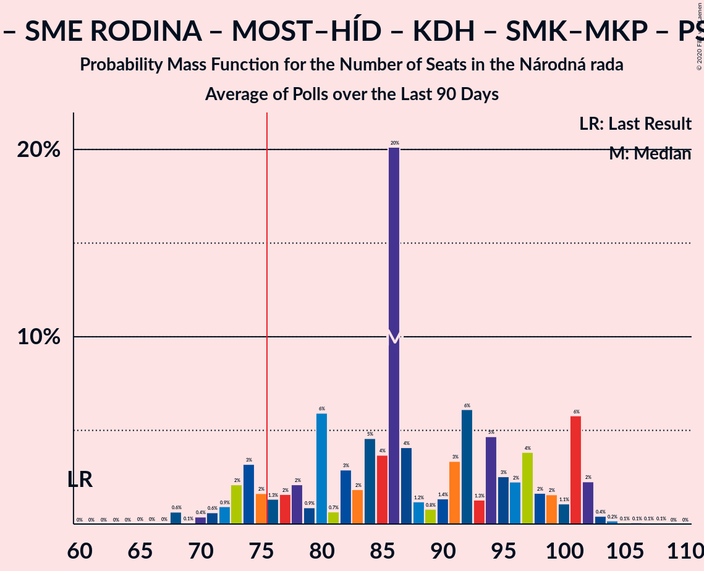
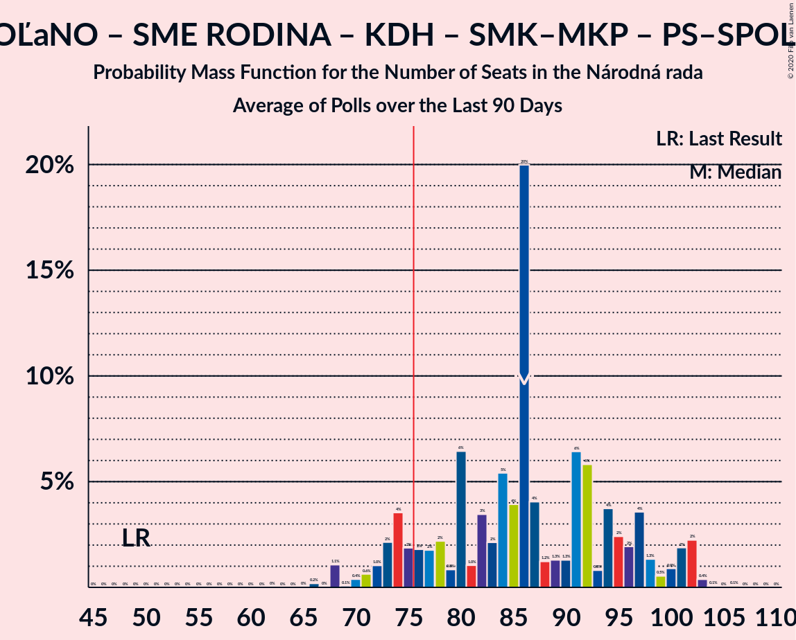
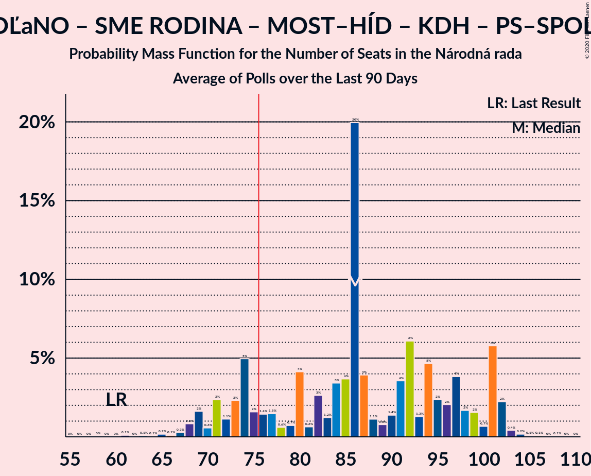
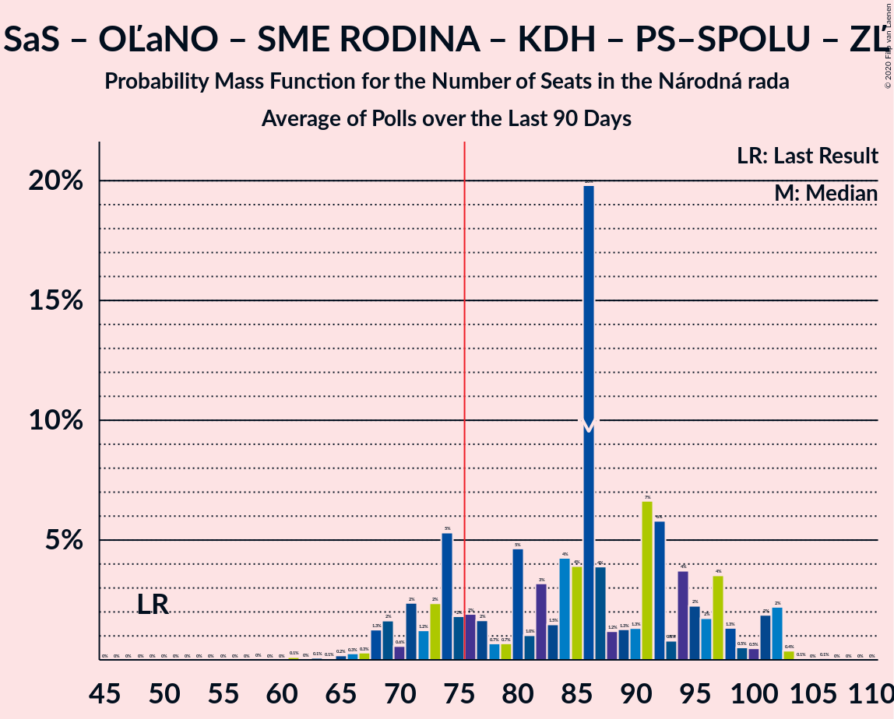
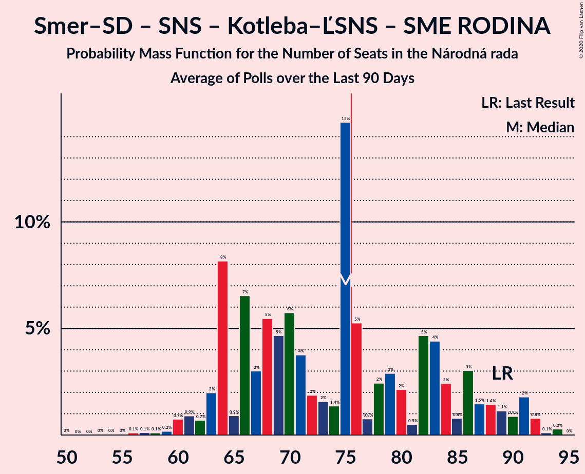
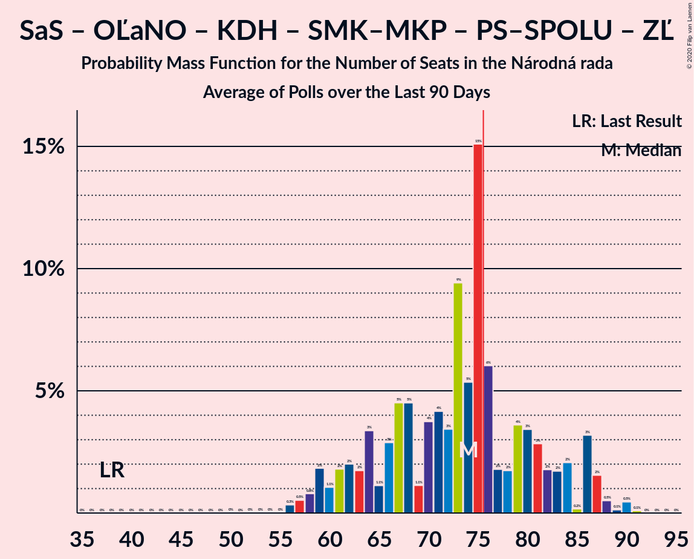
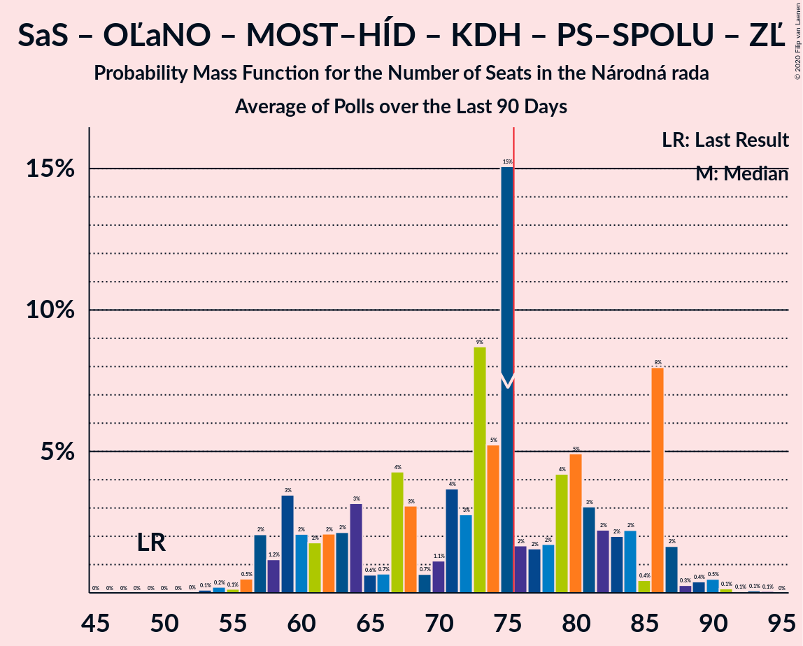
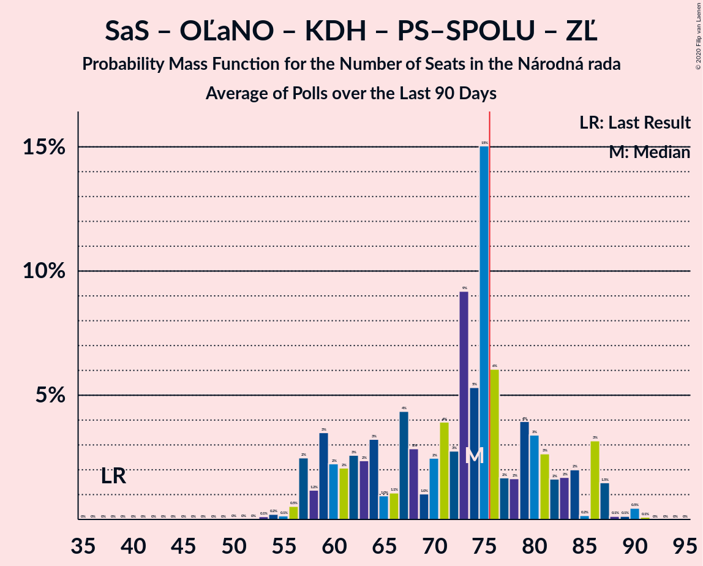

# Poll Average

<a href="#voting-intentions">Voting Intentions</a> | <a href="#seats">Seats</a> | <a href="#coalitions">Coalitions</a> | <a href="#technical-information">Technical Information</a>

## Summary

The table below lists the polls on which the average is based. They are the most recent polls (less than 90 days old) registered and analyzed so far.

| Period     | Polling firm/Commissioner(s) | Smer–SD | SaS | OĽaNO | NOVA | SNS | Kotleba–ĽSNS | SME RODINA | MOST–HÍD | KDH | SMK–MKP | PS | SPOLU | PS–SPOLU | ZĽ | DV | V |
|:----------:|:----------------------------:|:--:|:--:|:--:|:--:|:--:|:--:|:--:|:--:|:--:|:--:|:--:|:--:|:--:|:--:|:--:|:--:|
| 5 March 2016 | General Election | 28.3%   49 | 12.1%   21 | 11.0%   17 | 11.0%   2 | 8.6%   15 | 8.0%   14 | 6.6%   11 | 6.5%   11 | 4.9%   0 | 4.0%   0 | 0.0%   0 | 0.0%   0 | 0.0%   0 | 0.0%   0 | 0.0%   0 | 0.0%   0 |
| N/A | Poll Average | 15–24%   27–46 | 3–7%   0–13 | 8–17%   15–31 | N/A   N/A | 4–7%   0–13 | 9–14%   17–28 | 5–9%   10–18 | 2–6%   0–10 | 4–9%   0–17 | 2–6%   0–10 | N/A   N/A | N/A   N/A | 7–11%   13–22 | 7–11%   12–20 | 2–6%   0–11 | 1–5%   0 |
| [11–13 February 2020](2020-02-13-AKO.html) | AKO | 15–19%   25–37 | 5–8%   0–14 | 13–18%   24–33 | N/A   N/A | 4–7%   0–12 | 9–12%   15–23 | 6–9%   11–16 | 4–6%   0–10 | 4–7%   0–11 | 2–4%   0 | N/A   N/A | N/A   N/A | 8–11%   14–20 | 7–11%   13–20 | 3–6%   0–11 | 1–2%   0 |
| [6–12 February 2020](2020-02-12-FOCUS.html) | FOCUS | 15–19%   28–38 | 4–7%   0–14 | 11–16%   21–29 | N/A   N/A | 3–6%   0–10 | 10–14%   20–29 | 6–10%   11–20 | 3–6%   0–10 | 4–7%   0–14 | 3–5%   0–9 | N/A   N/A | N/A   N/A | 8–11%   15–22 | 7–10%   12–20 | 3–5%   0–10 | 2–4%   0 |
| [24–31 January 2020](2020-01-31-MVK.html) | MVK | 20–24%   35–48 | 3–5%   0 | 7–11%   14–21 | N/A   N/A | 5–8%   0–14 | 11–15%   19–28 | 5–8%   9–16 | 2–4%   0 | 6–9%   11–17 | 4–6%   0–10 | N/A   N/A | N/A   N/A | 7–10%   12–18 | 7–10%   12–19 | 2–4%   0 | 2–3%   0 |
| [23–30 January 2020](2020-01-30-Polis.html) | Polis | 15–19%   26–38 | 4–7%   0–13 | 10–14%   19–26 | N/A   N/A | 4–7%   0–13 | 9–13%   16–25 | 5–8%   9–15 | 4–6%   0–11 | 4–7%   0–12 | 3–5%   0 | N/A   N/A | N/A   N/A | 8–11%   13–20 | 8–12%   15–21 | 4–6%   0–10 | 3–5%   0 |
| 5 March 2016 | General Election | 28.3%   49 | 12.1%   21 | 11.0%   17 | 11.0%   2 | 8.6%   15 | 8.0%   14 | 6.6%   11 | 6.5%   11 | 4.9%   0 | 4.0%   0 | 0.0%   0 | 0.0%   0 | 0.0%   0 | 0.0%   0 | 0.0%   0 | 0.0%   0 |

Only polls for which at least the sample size has been published are included in the table above.

**Legend:**
+ **Top half of each row:** Voting intentions (95% confidence interval)
+ **Bottom half of each row:** Seat projections for the Národná rada (95% confidence interval)
+ **Smer–SD:** SMER–sociálna demokracia
+ **SaS:** Sloboda a Solidarita
+ **OĽaNO:** OBYČAJNÍ ĽUDIA a nezávislé osobnosti
+ **NOVA:** NOVA
+ **SNS:** Slovenská národná strana
+ **Kotleba–ĽSNS:** Kotleba–Ľudová strana Naše Slovensko
+ **SME RODINA:** SME RODINA
+ **MOST–HÍD:** MOST–HÍD
+ **KDH:** Kresťanskodemokratické hnutie
+ **SMK–MKP:** Strana maďarskej koalície–Magyar Koalíció Pártja
+ **PS:** Progresívne Slovensko
+ **SPOLU:** SPOLU–Občianska Demokracia
+ **PS–SPOLU:** Progresívne Slovensko–SPOLU–Občianska Demokracia
+ **ZĽ:** Za ľudí
+ **DV:** Dobrá voľba
+ **V:** VLASŤ
+ **N/A (single party):** Party not included the published results
+ **N/A (entire row):** Calculation for this opinion poll not started yet

## Voting Intentions

### Confidence Intervals

| Party | Last Result | Median | 80% Confidence Interval | 90% Confidence Interval | 95% Confidence Interval | 99% Confidence Interval |
|:-----:|:-----------:|:------:|:-----------------------:|:-----------------------:|:-----------------------:|:-----------------------:|
| <a href="#smer–sociálna-demokracia">SMER–sociálna demokracia</a> | 28.3% | 17.6% | 15.8–22.2% |15.3–23.0% | 15.0–23.5% | 14.3–24.5% |
| <a href="#sloboda-a-solidarita">Sloboda a Solidarita</a> | 12.1% | 5.2% | 3.7–6.5% |3.4–6.9% | 3.2–7.2% | 2.8–7.9% |
| <a href="#obyčajní-ľudia-a-nezávislé-osobnosti">OBYČAJNÍ ĽUDIA a nezávislé osobnosti</a> | 11.0% | 12.7% | 8.7–15.9% |8.3–16.5% | 7.9–17.0% | 7.3–18.0% |
| <a href="#nova">NOVA</a> | 11.0% | N/A | N/A |N/A | N/A | N/A |
| <a href="#slovenská-národná-strana">Slovenská národná strana</a> | 8.6% | 5.3% | 4.1–6.5% |3.8–6.8% | 3.6–7.1% | 3.2–7.6% |
| <a href="#kotleba–ľudová-strana-naše-slovensko">Kotleba–Ľudová strana Naše Slovensko</a> | 8.0% | 11.7% | 9.9–13.5% |9.5–13.9% | 9.1–14.3% | 8.5–15.1% |
| <a href="#sme-rodina">SME RODINA</a> | 6.6% | 7.0% | 5.8–8.3% |5.5–8.7% | 5.3–9.1% | 4.9–9.7% |
| <a href="#most–híd">MOST–HÍD</a> | 6.5% | 4.3% | 2.9–5.4% |2.6–5.7% | 2.4–6.0% | 2.1–6.5% |
| <a href="#kresťanskodemokratické-hnutie">Kresťanskodemokratické hnutie</a> | 4.9% | 5.8% | 4.7–7.7% |4.4–8.2% | 4.2–8.6% | 3.9–9.3% |
| <a href="#strana-maďarskej-koalície–magyar-koalíció-pártja">Strana maďarskej koalície–Magyar Koalíció Pártja</a> | 4.0% | 3.8% | 2.8–5.0% |2.6–5.3% | 2.4–5.6% | 2.1–6.1% |
| <a href="#progresívne-slovensko">Progresívne Slovensko</a> | 0.0% | N/A | N/A |N/A | N/A | N/A |
| <a href="#spolu–občianska-demokracia">SPOLU–Občianska Demokracia</a> | 0.0% | N/A | N/A |N/A | N/A | N/A |
| <a href="#progresívne-slovensko–spolu–občianska-demokracia">Progresívne Slovensko–SPOLU–Občianska Demokracia</a> | 0.0% | 9.0% | 7.7–10.4% |7.4–10.7% | 7.1–11.1% | 6.6–11.7% |
| <a href="#za-ľudí">Za ľudí</a> | 0.0% | 8.8% | 7.6–10.4% |7.2–10.9% | 7.0–11.3% | 6.5–12.0% |
| <a href="#dobrá-voľba">Dobrá voľba</a> | 0.0% | 4.1% | 2.8–5.1% |2.6–5.4% | 2.4–5.7% | 2.1–6.2% |
| <a href="#vlasť">VLASŤ</a> | 0.0% | 2.8% | 1.5–4.2% |1.3–4.5% | 1.1–4.8% | 0.9–5.3% |

### SMER–sociálna demokracia

*For a full overview of the results for this party, see the [SMER–sociálna demokracia](party-smer–sociálnademokracia.html) page.*

| Voting Intentions | Probability | Accumulated | Special Marks |
|:-----------------:|:-----------:|:-----------:|:-------------:|
| 12.5–13.5% | 0.1% | 100% |  |
| 13.5–14.5% | 0.9% | 99.9% |  |
| 14.5–15.5% | 6% | 99.0% |  |
| 15.5–16.5% | 18% | 93% |  |
| 16.5–17.5% | 25% | 75% |  |
| 17.5–18.5% | 18% | 51% | Median |
| 18.5–19.5% | 7% | 33% |  |
| 19.5–20.5% | 4% | 26% |  |
| 20.5–21.5% | 6% | 22% |  |
| 21.5–22.5% | 8% | 16% |  |
| 22.5–23.5% | 5% | 8% |  |
| 23.5–24.5% | 2% | 2% |  |
| 24.5–25.5% | 0.4% | 0.5% |  |
| 25.5–26.5% | 0.1% | 0.1% |  |
| 26.5–27.5% | 0% | 0% |  |
| 27.5–28.5% | 0% | 0% | Last Result |

### Sloboda a Solidarita

*For a full overview of the results for this party, see the [Sloboda a Solidarita](party-slobodaasolidarita.html) page.*

| Voting Intentions | Probability | Accumulated | Special Marks |
|:-----------------:|:-----------:|:-----------:|:-------------:|
| 0.5–1.5% | 0% | 100% |  |
| 1.5–2.5% | 0.1% | 100% |  |
| 2.5–3.5% | 7% | 99.9% |  |
| 3.5–4.5% | 21% | 93% |  |
| 4.5–5.5% | 33% | 72% | Median |
| 5.5–6.5% | 28% | 38% |  |
| 6.5–7.5% | 9% | 10% |  |
| 7.5–8.5% | 1.1% | 1.2% |  |
| 8.5–9.5% | 0.1% | 0.1% |  |
| 9.5–10.5% | 0% | 0% |  |
| 10.5–11.5% | 0% | 0% |  |
| 11.5–12.5% | 0% | 0% | Last Result |

### OBYČAJNÍ ĽUDIA a nezávislé osobnosti

*For a full overview of the results for this party, see the [OBYČAJNÍ ĽUDIA a nezávislé osobnosti](party-obyčajníľudiaanezávisléosobnosti.html) page.*

| Voting Intentions | Probability | Accumulated | Special Marks |
|:-----------------:|:-----------:|:-----------:|:-------------:|
| 5.5–6.5% | 0% | 100% |  |
| 6.5–7.5% | 1.0% | 100% |  |
| 7.5–8.5% | 7% | 99.0% |  |
| 8.5–9.5% | 11% | 92% |  |
| 9.5–10.5% | 7% | 81% |  |
| 10.5–11.5% | 8% | 74% | Last Result |
| 11.5–12.5% | 14% | 66% |  |
| 12.5–13.5% | 15% | 52% | Median |
| 13.5–14.5% | 13% | 37% |  |
| 14.5–15.5% | 11% | 24% |  |
| 15.5–16.5% | 8% | 13% |  |
| 16.5–17.5% | 4% | 5% |  |
| 17.5–18.5% | 1.0% | 1.1% |  |
| 18.5–19.5% | 0.1% | 0.2% |  |
| 19.5–20.5% | 0% | 0% |  |

### Slovenská národná strana

*For a full overview of the results for this party, see the [Slovenská národná strana](party-slovenskánárodnástrana.html) page.*

| Voting Intentions | Probability | Accumulated | Special Marks |
|:-----------------:|:-----------:|:-----------:|:-------------:|
| 1.5–2.5% | 0% | 100% |  |
| 2.5–3.5% | 2% | 100% |  |
| 3.5–4.5% | 20% | 98% |  |
| 4.5–5.5% | 39% | 78% | Median |
| 5.5–6.5% | 30% | 39% |  |
| 6.5–7.5% | 8% | 9% |  |
| 7.5–8.5% | 0.7% | 0.7% |  |
| 8.5–9.5% | 0% | 0% | Last Result |

### Kotleba–Ľudová strana Naše Slovensko

*For a full overview of the results for this party, see the [Kotleba–Ľudová strana Naše Slovensko](party-kotleba–ľudovástrananašeslovensko.html) page.*

| Voting Intentions | Probability | Accumulated | Special Marks |
|:-----------------:|:-----------:|:-----------:|:-------------:|
| 6.5–7.5% | 0% | 100% |  |
| 7.5–8.5% | 0.6% | 100% | Last Result |
| 8.5–9.5% | 5% | 99.4% |  |
| 9.5–10.5% | 16% | 94% |  |
| 10.5–11.5% | 25% | 78% |  |
| 11.5–12.5% | 26% | 53% | Median |
| 12.5–13.5% | 18% | 27% |  |
| 13.5–14.5% | 7% | 9% |  |
| 14.5–15.5% | 1.4% | 2% |  |
| 15.5–16.5% | 0.1% | 0.1% |  |
| 16.5–17.5% | 0% | 0% |  |

### SME RODINA

*For a full overview of the results for this party, see the [SME RODINA](party-smerodina.html) page.*

| Voting Intentions | Probability | Accumulated | Special Marks |
|:-----------------:|:-----------:|:-----------:|:-------------:|
| 2.5–3.5% | 0% | 100% |  |
| 3.5–4.5% | 0.1% | 100% |  |
| 4.5–5.5% | 5% | 99.9% |  |
| 5.5–6.5% | 28% | 95% |  |
| 6.5–7.5% | 37% | 66% | Last Result, Median |
| 7.5–8.5% | 22% | 29% |  |
| 8.5–9.5% | 6% | 7% |  |
| 9.5–10.5% | 0.8% | 0.8% |  |
| 10.5–11.5% | 0% | 0% |  |
| 11.5–12.5% | 0% | 0% |  |

### MOST–HÍD

*For a full overview of the results for this party, see the [MOST–HÍD](party-most–híd.html) page.*

| Voting Intentions | Probability | Accumulated | Special Marks |
|:-----------------:|:-----------:|:-----------:|:-------------:|
| 0.5–1.5% | 0% | 100% |  |
| 1.5–2.5% | 4% | 100% |  |
| 2.5–3.5% | 21% | 96% |  |
| 3.5–4.5% | 34% | 75% | Median |
| 4.5–5.5% | 32% | 40% |  |
| 5.5–6.5% | 7% | 8% |  |
| 6.5–7.5% | 0.4% | 0.4% | Last Result |
| 7.5–8.5% | 0% | 0% |  |

### Kresťanskodemokratické hnutie

*For a full overview of the results for this party, see the [Kresťanskodemokratické hnutie](party-kresťanskodemokratickéhnutie.html) page.*

| Voting Intentions | Probability | Accumulated | Special Marks |
|:-----------------:|:-----------:|:-----------:|:-------------:|
| 2.5–3.5% | 0.1% | 100% |  |
| 3.5–4.5% | 7% | 99.9% |  |
| 4.5–5.5% | 35% | 93% | Last Result |
| 5.5–6.5% | 31% | 58% | Median |
| 6.5–7.5% | 15% | 28% |  |
| 7.5–8.5% | 10% | 13% |  |
| 8.5–9.5% | 2% | 3% |  |
| 9.5–10.5% | 0.2% | 0.2% |  |
| 10.5–11.5% | 0% | 0% |  |

### Strana maďarskej koalície–Magyar Koalíció Pártja

*For a full overview of the results for this party, see the [Strana maďarskej koalície–Magyar Koalíció Pártja](party-stranamaďarskejkoalície–magyarkoalíciópártja.html) page.*

| Voting Intentions | Probability | Accumulated | Special Marks |
|:-----------------:|:-----------:|:-----------:|:-------------:|
| 0.5–1.5% | 0% | 100% |  |
| 1.5–2.5% | 5% | 100% |  |
| 2.5–3.5% | 35% | 95% |  |
| 3.5–4.5% | 41% | 61% | Last Result, Median |
| 4.5–5.5% | 18% | 20% |  |
| 5.5–6.5% | 3% | 3% |  |
| 6.5–7.5% | 0.1% | 0.1% |  |
| 7.5–8.5% | 0% | 0% |  |

### Progresívne Slovensko–SPOLU–Občianska Demokracia

*For a full overview of the results for this party, see the [Progresívne Slovensko–SPOLU–Občianska Demokracia](party-progresívneslovensko–spolu–občianskademokracia.html) page.*

| Voting Intentions | Probability | Accumulated | Special Marks |
|:-----------------:|:-----------:|:-----------:|:-------------:|
| 0.0–0.5% | 0% | 100% | Last Result |
| 0.5–1.5% | 0% | 100% |  |
| 1.5–2.5% | 0% | 100% |  |
| 2.5–3.5% | 0% | 100% |  |
| 3.5–4.5% | 0% | 100% |  |
| 4.5–5.5% | 0% | 100% |  |
| 5.5–6.5% | 0.5% | 100% |  |
| 6.5–7.5% | 7% | 99.5% |  |
| 7.5–8.5% | 25% | 93% |  |
| 8.5–9.5% | 37% | 68% | Median |
| 9.5–10.5% | 23% | 31% |  |
| 10.5–11.5% | 6% | 7% |  |
| 11.5–12.5% | 0.8% | 0.8% |  |
| 12.5–13.5% | 0% | 0% |  |
| 13.5–14.5% | 0% | 0% |  |

### Za ľudí

*For a full overview of the results for this party, see the [Za ľudí](party-zaľudí.html) page.*

| Voting Intentions | Probability | Accumulated | Special Marks |
|:-----------------:|:-----------:|:-----------:|:-------------:|
| 0.0–0.5% | 0% | 100% | Last Result |
| 0.5–1.5% | 0% | 100% |  |
| 1.5–2.5% | 0% | 100% |  |
| 2.5–3.5% | 0% | 100% |  |
| 3.5–4.5% | 0% | 100% |  |
| 4.5–5.5% | 0% | 100% |  |
| 5.5–6.5% | 0.7% | 100% |  |
| 6.5–7.5% | 9% | 99.3% |  |
| 7.5–8.5% | 30% | 90% |  |
| 8.5–9.5% | 33% | 61% | Median |
| 9.5–10.5% | 19% | 28% |  |
| 10.5–11.5% | 7% | 9% |  |
| 11.5–12.5% | 1.4% | 1.5% |  |
| 12.5–13.5% | 0.1% | 0.1% |  |
| 13.5–14.5% | 0% | 0% |  |

### Dobrá voľba

*For a full overview of the results for this party, see the [Dobrá voľba](party-dobrávoľba.html) page.*

| Voting Intentions | Probability | Accumulated | Special Marks |
|:-----------------:|:-----------:|:-----------:|:-------------:|
| 0.0–0.5% | 0% | 100% | Last Result |
| 0.5–1.5% | 0% | 100% |  |
| 1.5–2.5% | 4% | 100% |  |
| 2.5–3.5% | 25% | 96% |  |
| 3.5–4.5% | 42% | 71% | Median |
| 4.5–5.5% | 25% | 29% |  |
| 5.5–6.5% | 4% | 4% |  |
| 6.5–7.5% | 0.1% | 0.1% |  |
| 7.5–8.5% | 0% | 0% |  |

### VLASŤ

*For a full overview of the results for this party, see the [VLASŤ](party-vlasť.html) page.*

| Voting Intentions | Probability | Accumulated | Special Marks |
|:-----------------:|:-----------:|:-----------:|:-------------:|
| 0.0–0.5% | 0% | 100% | Last Result |
| 0.5–1.5% | 13% | 100% |  |
| 1.5–2.5% | 29% | 87% |  |
| 2.5–3.5% | 32% | 59% | Median |
| 3.5–4.5% | 22% | 27% |  |
| 4.5–5.5% | 4% | 4% |  |
| 5.5–6.5% | 0.2% | 0.2% |  |
| 6.5–7.5% | 0% | 0% |  |

## Seats

### Confidence Intervals

| Party | Last Result | Median | 80% Confidence Interval | 90% Confidence Interval | 95% Confidence Interval | 99% Confidence Interval |
|:-----:|:-----------:|:------:|:-----------------------:|:-----------------------:|:-----------------------:|:-----------------------:|
| <a href="#smer–sociálna-demokracia">SMER–sociálna demokracia</a> | 49 | 33 | 28–41 |28–43 | 27–46 | 25–48 |
| <a href="#sloboda-a-solidarita">Sloboda a Solidarita</a> | 21 | 9 | 0–12 |0–13 | 0–13 | 0–14 |
| <a href="#obyčajní-ľudia-a-nezávislé-osobnosti">OBYČAJNÍ ĽUDIA a nezávislé osobnosti</a> | 17 | 23 | 17–29 |16–31 | 15–31 | 14–33 |
| <a href="#nova">NOVA</a> | 2 | N/A | N/A |N/A | N/A | N/A |
| <a href="#slovenská-národná-strana">Slovenská národná strana</a> | 15 | 9 | 0–12 |0–12 | 0–13 | 0–14 |
| <a href="#kotleba–ľudová-strana-naše-slovensko">Kotleba–Ľudová strana Naše Slovensko</a> | 14 | 21 | 18–25 |17–26 | 17–28 | 15–29 |
| <a href="#sme-rodina">SME RODINA</a> | 11 | 13 | 11–16 |10–18 | 10–18 | 0–20 |
| <a href="#most–híd">MOST–HÍD</a> | 11 | 0 | 0–9 |0–10 | 0–10 | 0–12 |
| <a href="#kresťanskodemokratické-hnutie">Kresťanskodemokratické hnutie</a> | 0 | 10 | 0–15 |0–16 | 0–17 | 0–17 |
| <a href="#strana-maďarskej-koalície–magyar-koalíció-pártja">Strana maďarskej koalície–Magyar Koalíció Pártja</a> | 0 | 0 | 0 |0–9 | 0–10 | 0–11 |
| <a href="#progresívne-slovensko">Progresívne Slovensko</a> | 0 | N/A | N/A |N/A | N/A | N/A |
| <a href="#spolu–občianska-demokracia">SPOLU–Občianska Demokracia</a> | 0 | N/A | N/A |N/A | N/A | N/A |
| <a href="#progresívne-slovensko–spolu–občianska-demokracia">Progresívne Slovensko–SPOLU–Občianska Demokracia</a> | 0 | 17 | 14–19 |13–20 | 13–22 | 12–23 |
| <a href="#za-ľudí">Za ľudí</a> | 0 | 17 | 14–19 |13–20 | 12–20 | 11–21 |
| <a href="#dobrá-voľba">Dobrá voľba</a> | 0 | 0 | 0–9 |0–10 | 0–11 | 0–11 |
| <a href="#vlasť">VLASŤ</a> | 0 | 0 | 0 |0 | 0 | 0 |

### SMER–sociálna demokracia

*For a full overview of the results for this party, see the [SMER–sociálna demokracia](party-smer–sociálnademokracia.html) page.*

| Number of Seats | Probability | Accumulated | Special Marks |
|:---------------:|:-----------:|:-----------:|:-------------:|
| 23 | 0.3% | 100% |  |
| 24 | 0.1% | 99.7% |  |
| 25 | 0.7% | 99.6% |  |
| 26 | 1.0% | 98.9% |  |
| 27 | 1.3% | 98% |  |
| 28 | 8% | 97% |  |
| 29 | 2% | 89% |  |
| 30 | 5% | 87% |  |
| 31 | 13% | 81% |  |
| 32 | 10% | 69% |  |
| 33 | 22% | 59% | Median |
| 34 | 3% | 36% |  |
| 35 | 3% | 33% |  |
| 36 | 2% | 31% |  |
| 37 | 6% | 29% |  |
| 38 | 8% | 23% |  |
| 39 | 1.4% | 15% |  |
| 40 | 0.8% | 14% |  |
| 41 | 5% | 13% |  |
| 42 | 2% | 8% |  |
| 43 | 2% | 6% |  |
| 44 | 0.5% | 4% |  |
| 45 | 0.8% | 4% |  |
| 46 | 2% | 3% |  |
| 47 | 0.2% | 0.8% |  |
| 48 | 0.6% | 0.6% |  |
| 49 | 0% | 0.1% | Last Result |
| 50 | 0% | 0% |  |

### Sloboda a Solidarita

*For a full overview of the results for this party, see the [Sloboda a Solidarita](party-slobodaasolidarita.html) page.*

| Number of Seats | Probability | Accumulated | Special Marks |
|:---------------:|:-----------:|:-----------:|:-------------:|
| 0 | 37% | 100% |  |
| 1 | 0% | 63% |  |
| 2 | 0% | 63% |  |
| 3 | 0% | 63% |  |
| 4 | 0% | 63% |  |
| 5 | 0% | 63% |  |
| 6 | 0% | 63% |  |
| 7 | 0% | 63% |  |
| 8 | 0.1% | 63% |  |
| 9 | 17% | 63% | Median |
| 10 | 20% | 46% |  |
| 11 | 10% | 26% |  |
| 12 | 10% | 16% |  |
| 13 | 4% | 6% |  |
| 14 | 2% | 2% |  |
| 15 | 0.1% | 0.3% |  |
| 16 | 0.2% | 0.2% |  |
| 17 | 0% | 0% |  |
| 18 | 0% | 0% |  |
| 19 | 0% | 0% |  |
| 20 | 0% | 0% |  |
| 21 | 0% | 0% | Last Result |

### OBYČAJNÍ ĽUDIA a nezávislé osobnosti

*For a full overview of the results for this party, see the [OBYČAJNÍ ĽUDIA a nezávislé osobnosti](party-obyčajníľudiaanezávisléosobnosti.html) page.*

| Number of Seats | Probability | Accumulated | Special Marks |
|:---------------:|:-----------:|:-----------:|:-------------:|
| 12 | 0.1% | 100% |  |
| 13 | 0.3% | 99.9% |  |
| 14 | 2% | 99.6% |  |
| 15 | 2% | 98% |  |
| 16 | 5% | 96% |  |
| 17 | 5% | 90% | Last Result |
| 18 | 4% | 86% |  |
| 19 | 7% | 82% |  |
| 20 | 4% | 76% |  |
| 21 | 2% | 72% |  |
| 22 | 3% | 70% |  |
| 23 | 19% | 67% | Median |
| 24 | 4% | 49% |  |
| 25 | 15% | 44% |  |
| 26 | 5% | 29% |  |
| 27 | 9% | 24% |  |
| 28 | 4% | 16% |  |
| 29 | 3% | 12% |  |
| 30 | 3% | 9% |  |
| 31 | 5% | 6% |  |
| 32 | 0.5% | 1.5% |  |
| 33 | 0.8% | 1.0% |  |
| 34 | 0% | 0.2% |  |
| 35 | 0.1% | 0.1% |  |
| 36 | 0% | 0.1% |  |
| 37 | 0% | 0% |  |

### Slovenská národná strana

*For a full overview of the results for this party, see the [Slovenská národná strana](party-slovenskánárodnástrana.html) page.*

| Number of Seats | Probability | Accumulated | Special Marks |
|:---------------:|:-----------:|:-----------:|:-------------:|
| 0 | 47% | 100% |  |
| 1 | 0% | 53% |  |
| 2 | 0% | 53% |  |
| 3 | 0% | 53% |  |
| 4 | 0% | 53% |  |
| 5 | 0% | 53% |  |
| 6 | 0% | 53% |  |
| 7 | 0% | 53% |  |
| 8 | 0.1% | 53% |  |
| 9 | 8% | 53% | Median |
| 10 | 24% | 45% |  |
| 11 | 10% | 21% |  |
| 12 | 7% | 11% |  |
| 13 | 2% | 4% |  |
| 14 | 1.0% | 1.2% |  |
| 15 | 0.2% | 0.2% | Last Result |
| 16 | 0% | 0% |  |

### Kotleba–Ľudová strana Naše Slovensko

*For a full overview of the results for this party, see the [Kotleba–Ľudová strana Naše Slovensko](party-kotleba–ľudovástrananašeslovensko.html) page.*

| Number of Seats | Probability | Accumulated | Special Marks |
|:---------------:|:-----------:|:-----------:|:-------------:|
| 14 | 0.3% | 100% | Last Result |
| 15 | 0.6% | 99.7% |  |
| 16 | 1.4% | 99.1% |  |
| 17 | 8% | 98% |  |
| 18 | 7% | 90% |  |
| 19 | 3% | 83% |  |
| 20 | 7% | 80% |  |
| 21 | 33% | 73% | Median |
| 22 | 10% | 40% |  |
| 23 | 10% | 30% |  |
| 24 | 7% | 20% |  |
| 25 | 7% | 13% |  |
| 26 | 2% | 6% |  |
| 27 | 2% | 5% |  |
| 28 | 2% | 3% |  |
| 29 | 0.8% | 1.0% |  |
| 30 | 0.1% | 0.2% |  |
| 31 | 0% | 0.1% |  |
| 32 | 0.1% | 0.1% |  |
| 33 | 0% | 0% |  |

### SME RODINA

*For a full overview of the results for this party, see the [SME RODINA](party-smerodina.html) page.*

| Number of Seats | Probability | Accumulated | Special Marks |
|:---------------:|:-----------:|:-----------:|:-------------:|
| 0 | 0.7% | 100% |  |
| 1 | 0% | 99.3% |  |
| 2 | 0% | 99.3% |  |
| 3 | 0% | 99.3% |  |
| 4 | 0% | 99.3% |  |
| 5 | 0% | 99.3% |  |
| 6 | 0% | 99.3% |  |
| 7 | 0% | 99.3% |  |
| 8 | 0% | 99.3% |  |
| 9 | 1.3% | 99.3% |  |
| 10 | 6% | 98% |  |
| 11 | 25% | 92% | Last Result |
| 12 | 8% | 68% |  |
| 13 | 17% | 60% | Median |
| 14 | 19% | 43% |  |
| 15 | 9% | 24% |  |
| 16 | 6% | 14% |  |
| 17 | 1.5% | 8% |  |
| 18 | 5% | 7% |  |
| 19 | 1.0% | 2% |  |
| 20 | 0.8% | 0.8% |  |
| 21 | 0% | 0% |  |

### MOST–HÍD

*For a full overview of the results for this party, see the [MOST–HÍD](party-most–híd.html) page.*

| Number of Seats | Probability | Accumulated | Special Marks |
|:---------------:|:-----------:|:-----------:|:-------------:|
| 0 | 87% | 100% | Median |
| 1 | 0% | 13% |  |
| 2 | 0% | 13% |  |
| 3 | 0% | 13% |  |
| 4 | 0% | 13% |  |
| 5 | 0% | 13% |  |
| 6 | 0% | 13% |  |
| 7 | 0% | 13% |  |
| 8 | 0.4% | 13% |  |
| 9 | 3% | 12% |  |
| 10 | 8% | 10% |  |
| 11 | 1.3% | 2% | Last Result |
| 12 | 0.4% | 0.5% |  |
| 13 | 0.1% | 0.1% |  |
| 14 | 0% | 0% |  |

### Kresťanskodemokratické hnutie

*For a full overview of the results for this party, see the [Kresťanskodemokratické hnutie](party-kresťanskodemokratickéhnutie.html) page.*

| Number of Seats | Probability | Accumulated | Special Marks |
|:---------------:|:-----------:|:-----------:|:-------------:|
| 0 | 19% | 100% | Last Result |
| 1 | 0% | 81% |  |
| 2 | 0% | 81% |  |
| 3 | 0% | 81% |  |
| 4 | 0% | 81% |  |
| 5 | 0% | 81% |  |
| 6 | 0% | 81% |  |
| 7 | 0% | 81% |  |
| 8 | 0.1% | 81% |  |
| 9 | 21% | 80% |  |
| 10 | 12% | 60% | Median |
| 11 | 19% | 48% |  |
| 12 | 6% | 28% |  |
| 13 | 3% | 23% |  |
| 14 | 5% | 19% |  |
| 15 | 9% | 14% |  |
| 16 | 3% | 6% |  |
| 17 | 2% | 3% |  |
| 18 | 0.3% | 0.3% |  |
| 19 | 0.1% | 0.1% |  |
| 20 | 0% | 0% |  |

### Strana maďarskej koalície–Magyar Koalíció Pártja

*For a full overview of the results for this party, see the [Strana maďarskej koalície–Magyar Koalíció Pártja](party-stranamaďarskejkoalície–magyarkoalíciópártja.html) page.*

| Number of Seats | Probability | Accumulated | Special Marks |
|:---------------:|:-----------:|:-----------:|:-------------:|
| 0 | 91% | 100% | Last Result, Median |
| 1 | 0% | 9% |  |
| 2 | 0% | 9% |  |
| 3 | 0% | 9% |  |
| 4 | 0% | 9% |  |
| 5 | 0% | 9% |  |
| 6 | 0% | 9% |  |
| 7 | 0% | 9% |  |
| 8 | 0% | 9% |  |
| 9 | 5% | 9% |  |
| 10 | 3% | 3% |  |
| 11 | 0.4% | 0.6% |  |
| 12 | 0.2% | 0.2% |  |
| 13 | 0% | 0% |  |

### Progresívne Slovensko–SPOLU–Občianska Demokracia

*For a full overview of the results for this party, see the [Progresívne Slovensko–SPOLU–Občianska Demokracia](party-progresívneslovensko–spolu–občianskademokracia.html) page.*

| Number of Seats | Probability | Accumulated | Special Marks |
|:---------------:|:-----------:|:-----------:|:-------------:|
| 0 | 0% | 100% | Last Result |
| 1 | 0% | 100% |  |
| 2 | 0% | 100% |  |
| 3 | 0% | 100% |  |
| 4 | 0% | 100% |  |
| 5 | 0% | 100% |  |
| 6 | 0% | 100% |  |
| 7 | 0% | 100% |  |
| 8 | 0% | 100% |  |
| 9 | 0% | 100% |  |
| 10 | 0% | 100% |  |
| 11 | 0.1% | 100% |  |
| 12 | 0.8% | 99.9% |  |
| 13 | 6% | 99.0% |  |
| 14 | 7% | 93% |  |
| 15 | 14% | 86% |  |
| 16 | 17% | 71% |  |
| 17 | 22% | 55% | Median |
| 18 | 11% | 33% |  |
| 19 | 13% | 21% |  |
| 20 | 4% | 8% |  |
| 21 | 2% | 4% |  |
| 22 | 2% | 3% |  |
| 23 | 0.3% | 0.6% |  |
| 24 | 0.2% | 0.3% |  |
| 25 | 0.1% | 0.1% |  |
| 26 | 0% | 0% |  |

### Za ľudí

*For a full overview of the results for this party, see the [Za ľudí](party-zaľudí.html) page.*

| Number of Seats | Probability | Accumulated | Special Marks |
|:---------------:|:-----------:|:-----------:|:-------------:|
| 0 | 0% | 100% | Last Result |
| 1 | 0% | 100% |  |
| 2 | 0% | 100% |  |
| 3 | 0% | 100% |  |
| 4 | 0% | 100% |  |
| 5 | 0% | 100% |  |
| 6 | 0% | 100% |  |
| 7 | 0% | 100% |  |
| 8 | 0% | 100% |  |
| 9 | 0% | 100% |  |
| 10 | 0% | 100% |  |
| 11 | 0.6% | 100% |  |
| 12 | 2% | 99.4% |  |
| 13 | 7% | 97% |  |
| 14 | 7% | 90% |  |
| 15 | 14% | 83% |  |
| 16 | 11% | 69% |  |
| 17 | 37% | 57% | Median |
| 18 | 8% | 21% |  |
| 19 | 4% | 13% |  |
| 20 | 7% | 9% |  |
| 21 | 1.2% | 2% |  |
| 22 | 0.1% | 0.4% |  |
| 23 | 0.1% | 0.3% |  |
| 24 | 0.2% | 0.2% |  |
| 25 | 0% | 0% |  |

### Dobrá voľba

*For a full overview of the results for this party, see the [Dobrá voľba](party-dobrávoľba.html) page.*

| Number of Seats | Probability | Accumulated | Special Marks |
|:---------------:|:-----------:|:-----------:|:-------------:|
| 0 | 86% | 100% | Last Result, Median |
| 1 | 0% | 14% |  |
| 2 | 0% | 14% |  |
| 3 | 0% | 14% |  |
| 4 | 0% | 14% |  |
| 5 | 0% | 14% |  |
| 6 | 0% | 14% |  |
| 7 | 0% | 14% |  |
| 8 | 0.3% | 14% |  |
| 9 | 7% | 14% |  |
| 10 | 3% | 8% |  |
| 11 | 5% | 5% |  |
| 12 | 0.1% | 0.1% |  |
| 13 | 0% | 0% |  |

### VLASŤ

*For a full overview of the results for this party, see the [VLASŤ](party-vlasť.html) page.*

| Number of Seats | Probability | Accumulated | Special Marks |
|:---------------:|:-----------:|:-----------:|:-------------:|
| 0 | 99.7% | 100% | Last Result, Median |
| 1 | 0% | 0.3% |  |
| 2 | 0% | 0.3% |  |
| 3 | 0% | 0.3% |  |
| 4 | 0% | 0.3% |  |
| 5 | 0% | 0.3% |  |
| 6 | 0% | 0.3% |  |
| 7 | 0% | 0.3% |  |
| 8 | 0% | 0.3% |  |
| 9 | 0.1% | 0.3% |  |
| 10 | 0.1% | 0.1% |  |
| 11 | 0% | 0% |  |

## Coalitions

### Confidence Intervals

| Coalition | Last Result | Median | Majority? | 80% Confidence Interval | 90% Confidence Interval | 95% Confidence Interval | 99% Confidence Interval |
|:---------:|:-----------:|:------:|:---------:|:-----------------------:|:-----------------------:|:-----------------------:|:-----------------------:|
| Sloboda a Solidarita – OBYČAJNÍ ĽUDIA a nezávislé osobnosti – SME RODINA – MOST–HÍD – Kresťanskodemokratické hnutie – Strana maďarskej koalície–Magyar Koalíció Pártja – Progresívne Slovensko–SPOLU–Občianska Demokracia – Za ľudí | 60 | 86 | 90% | 76–99 | 74–101 | 72–102 | 68–103 |
| Sloboda a Solidarita – OBYČAJNÍ ĽUDIA a nezávislé osobnosti – SME RODINA – Kresťanskodemokratické hnutie – Strana maďarskej koalície–Magyar Koalíció Pártja – Progresívne Slovensko–SPOLU–Občianska Demokracia – Za ľudí | 49 | 86 | 89% | 75–97 | 73–100 | 72–102 | 68–103 |
| Sloboda a Solidarita – OBYČAJNÍ ĽUDIA a nezávislé osobnosti – SME RODINA – MOST–HÍD – Kresťanskodemokratické hnutie – Progresívne Slovensko–SPOLU–Občianska Demokracia – Za ľudí | 60 | 86 | 84% | 74–99 | 71–101 | 69–102 | 66–103 |
| Sloboda a Solidarita – OBYČAJNÍ ĽUDIA a nezávislé osobnosti – SME RODINA – Kresťanskodemokratické hnutie – Progresívne Slovensko–SPOLU–Občianska Demokracia – Za ľudí | 49 | 86 | 82% | 73–97 | 71–100 | 69–102 | 65–103 |
| SMER–sociálna demokracia – Slovenská národná strana – Kotleba–Ľudová strana Naše Slovensko – SME RODINA | 89 | 75 | 37% | 64–86 | 64–89 | 62–91 | 59–92 |
| Sloboda a Solidarita – OBYČAJNÍ ĽUDIA a nezávislé osobnosti – MOST–HÍD – Kresťanskodemokratické hnutie – Strana maďarskej koalície–Magyar Koalíció Pártja – Progresívne Slovensko–SPOLU–Občianska Demokracia – Za ľudí | 49 | 75 | 36% | 64–86 | 61–86 | 59–87 | 58–90 |
| Sloboda a Solidarita – OBYČAJNÍ ĽUDIA a nezávislé osobnosti – Kresťanskodemokratické hnutie – Strana maďarskej koalície–Magyar Koalíció Pártja – Progresívne Slovensko–SPOLU–Občianska Demokracia – Za ľudí | 38 | 74 | 31% | 63–82 | 61–86 | 59–87 | 57–90 |
| Sloboda a Solidarita – OBYČAJNÍ ĽUDIA a nezávislé osobnosti – MOST–HÍD – Kresťanskodemokratické hnutie – Progresívne Slovensko–SPOLU–Občianska Demokracia – Za ľudí | 49 | 75 | 35% | 61–86 | 59–86 | 57–87 | 56–90 |
| Sloboda a Solidarita – OBYČAJNÍ ĽUDIA a nezávislé osobnosti – Kresťanskodemokratické hnutie – Progresívne Slovensko–SPOLU–Občianska Demokracia – Za ľudí | 38 | 74 | 30% | 60–82 | 59–86 | 57–86 | 55–90 |
| Sloboda a Solidarita – OBYČAJNÍ ĽUDIA a nezávislé osobnosti – Progresívne Slovensko–SPOLU–Občianska Demokracia – Za ľudí | 38 | 66 | 4% | 47–74 | 45–75 | 43–76 | 41–81 |
| SMER–sociálna demokracia – Slovenská národná strana – SME RODINA | 75 | 52 | 0% | 45–63 | 42–65 | 42–66 | 39–69 |
| SMER–sociálna demokracia – SME RODINA | 60 | 46 | 0% | 42–53 | 40–56 | 39–60 | 35–60 |
| Sloboda a Solidarita – Kresťanskodemokratické hnutie – Progresívne Slovensko–SPOLU–Občianska Demokracia – Za ľudí | 21 | 49 | 0% | 43–56 | 40–58 | 37–59 | 34–61 |
| SMER–sociálna demokracia – Slovenská národná strana – MOST–HÍD | 75 | 41 | 0% | 31–51 | 29–53 | 28–55 | 28–57 |
| SMER–sociálna demokracia – Slovenská národná strana | 64 | 40 | 0% | 31–50 | 28–53 | 28–55 | 27–57 |
| Sloboda a Solidarita – Progresívne Slovensko–SPOLU–Občianska Demokracia – Za ľudí | 21 | 42 | 0% | 30–48 | 28–49 | 28–49 | 26–52 |
| SMER–sociálna demokracia | 49 | 33 | 0% | 28–41 | 28–43 | 27–46 | 25–48 |

### Sloboda a Solidarita – OBYČAJNÍ ĽUDIA a nezávislé osobnosti – SME RODINA – MOST–HÍD – Kresťanskodemokratické hnutie – Strana maďarskej koalície–Magyar Koalíció Pártja – Progresívne Slovensko–SPOLU–Občianska Demokracia – Za ľudí

| Number of Seats | Probability | Accumulated | Special Marks |
|:---------------:|:-----------:|:-----------:|:-------------:|
| 60 | 0% | 100% | Last Result |
| 61 | 0% | 100% |  |
| 62 | 0% | 100% |  |
| 63 | 0% | 100% |  |
| 64 | 0% | 100% |  |
| 65 | 0% | 100% |  |
| 66 | 0% | 100% |  |
| 67 | 0% | 99.9% |  |
| 68 | 0.6% | 99.9% |  |
| 69 | 0.1% | 99.3% |  |
| 70 | 0.4% | 99.2% |  |
| 71 | 0.6% | 98.8% |  |
| 72 | 0.9% | 98% |  |
| 73 | 2% | 97% |  |
| 74 | 3% | 95% |  |
| 75 | 2% | 92% |  |
| 76 | 1.3% | 90% | Majority |
| 77 | 2% | 89% |  |
| 78 | 2% | 87% |  |
| 79 | 0.9% | 85% |  |
| 80 | 6% | 84% |  |
| 81 | 0.7% | 78% |  |
| 82 | 3% | 78% |  |
| 83 | 2% | 75% |  |
| 84 | 5% | 73% |  |
| 85 | 4% | 69% |  |
| 86 | 20% | 65% |  |
| 87 | 4% | 45% |  |
| 88 | 1.2% | 41% |  |
| 89 | 0.8% | 39% | Median |
| 90 | 1.4% | 39% |  |
| 91 | 3% | 37% |  |
| 92 | 6% | 34% |  |
| 93 | 1.3% | 28% |  |
| 94 | 5% | 27% |  |
| 95 | 3% | 22% |  |
| 96 | 2% | 19% |  |
| 97 | 4% | 17% |  |
| 98 | 2% | 13% |  |
| 99 | 2% | 12% |  |
| 100 | 1.1% | 10% |  |
| 101 | 6% | 9% |  |
| 102 | 2% | 3% |  |
| 103 | 0.4% | 0.9% |  |
| 104 | 0.2% | 0.4% |  |
| 105 | 0.1% | 0.3% |  |
| 106 | 0.1% | 0.2% |  |
| 107 | 0.1% | 0.1% |  |
| 108 | 0.1% | 0.1% |  |
| 109 | 0% | 0% |  |

### Sloboda a Solidarita – OBYČAJNÍ ĽUDIA a nezávislé osobnosti – SME RODINA – Kresťanskodemokratické hnutie – Strana maďarskej koalície–Magyar Koalíció Pártja – Progresívne Slovensko–SPOLU–Občianska Demokracia – Za ľudí

| Number of Seats | Probability | Accumulated | Special Marks |
|:---------------:|:-----------:|:-----------:|:-------------:|
| 49 | 0% | 100% | Last Result |
| 50 | 0% | 100% |  |
| 51 | 0% | 100% |  |
| 52 | 0% | 100% |  |
| 53 | 0% | 100% |  |
| 54 | 0% | 100% |  |
| 55 | 0% | 100% |  |
| 56 | 0% | 100% |  |
| 57 | 0% | 100% |  |
| 58 | 0% | 100% |  |
| 59 | 0% | 100% |  |
| 60 | 0% | 100% |  |
| 61 | 0% | 100% |  |
| 62 | 0% | 100% |  |
| 63 | 0% | 100% |  |
| 64 | 0% | 100% |  |
| 65 | 0% | 100% |  |
| 66 | 0.2% | 99.9% |  |
| 67 | 0% | 99.8% |  |
| 68 | 1.1% | 99.7% |  |
| 69 | 0.1% | 98.6% |  |
| 70 | 0.4% | 98.6% |  |
| 71 | 0.6% | 98% |  |
| 72 | 1.0% | 98% |  |
| 73 | 2% | 97% |  |
| 74 | 4% | 94% |  |
| 75 | 2% | 91% |  |
| 76 | 2% | 89% | Majority |
| 77 | 2% | 87% |  |
| 78 | 2% | 85% |  |
| 79 | 0.8% | 83% |  |
| 80 | 6% | 82% |  |
| 81 | 1.0% | 76% |  |
| 82 | 3% | 75% |  |
| 83 | 2% | 71% |  |
| 84 | 5% | 69% |  |
| 85 | 4% | 64% |  |
| 86 | 20% | 60% |  |
| 87 | 4% | 40% |  |
| 88 | 1.2% | 36% |  |
| 89 | 1.3% | 35% | Median |
| 90 | 1.3% | 33% |  |
| 91 | 6% | 32% |  |
| 92 | 6% | 26% |  |
| 93 | 0.8% | 20% |  |
| 94 | 4% | 19% |  |
| 95 | 2% | 15% |  |
| 96 | 2% | 13% |  |
| 97 | 4% | 11% |  |
| 98 | 1.3% | 7% |  |
| 99 | 0.5% | 6% |  |
| 100 | 0.9% | 6% |  |
| 101 | 2% | 5% |  |
| 102 | 2% | 3% |  |
| 103 | 0.4% | 0.5% |  |
| 104 | 0.1% | 0.1% |  |
| 105 | 0% | 0.1% |  |
| 106 | 0.1% | 0.1% |  |
| 107 | 0% | 0% |  |

### Sloboda a Solidarita – OBYČAJNÍ ĽUDIA a nezávislé osobnosti – SME RODINA – MOST–HÍD – Kresťanskodemokratické hnutie – Progresívne Slovensko–SPOLU–Občianska Demokracia – Za ľudí

| Number of Seats | Probability | Accumulated | Special Marks |
|:---------------:|:-----------:|:-----------:|:-------------:|
| 59 | 0% | 100% |  |
| 60 | 0% | 99.9% | Last Result |
| 61 | 0.1% | 99.9% |  |
| 62 | 0% | 99.8% |  |
| 63 | 0.1% | 99.8% |  |
| 64 | 0.1% | 99.7% |  |
| 65 | 0.2% | 99.7% |  |
| 66 | 0.1% | 99.5% |  |
| 67 | 0.3% | 99.4% |  |
| 68 | 0.8% | 99.1% |  |
| 69 | 2% | 98% |  |
| 70 | 0.6% | 97% |  |
| 71 | 2% | 96% |  |
| 72 | 1.1% | 94% |  |
| 73 | 2% | 93% |  |
| 74 | 5% | 90% |  |
| 75 | 2% | 85% |  |
| 76 | 1.4% | 84% | Majority |
| 77 | 1.5% | 82% |  |
| 78 | 0.6% | 81% |  |
| 79 | 0.7% | 80% |  |
| 80 | 4% | 79% |  |
| 81 | 0.6% | 75% |  |
| 82 | 3% | 75% |  |
| 83 | 1.2% | 72% |  |
| 84 | 3% | 71% |  |
| 85 | 4% | 67% |  |
| 86 | 20% | 64% |  |
| 87 | 4% | 44% |  |
| 88 | 1.1% | 40% |  |
| 89 | 0.8% | 39% | Median |
| 90 | 1.4% | 38% |  |
| 91 | 4% | 37% |  |
| 92 | 6% | 33% |  |
| 93 | 1.3% | 27% |  |
| 94 | 5% | 26% |  |
| 95 | 2% | 21% |  |
| 96 | 2% | 19% |  |
| 97 | 4% | 17% |  |
| 98 | 2% | 13% |  |
| 99 | 2% | 11% |  |
| 100 | 0.7% | 10% |  |
| 101 | 6% | 9% |  |
| 102 | 2% | 3% |  |
| 103 | 0.4% | 0.8% |  |
| 104 | 0.2% | 0.4% |  |
| 105 | 0.1% | 0.2% |  |
| 106 | 0.1% | 0.2% |  |
| 107 | 0% | 0.1% |  |
| 108 | 0.1% | 0.1% |  |
| 109 | 0% | 0% |  |

### Sloboda a Solidarita – OBYČAJNÍ ĽUDIA a nezávislé osobnosti – SME RODINA – Kresťanskodemokratické hnutie – Progresívne Slovensko–SPOLU–Občianska Demokracia – Za ľudí

| Number of Seats | Probability | Accumulated | Special Marks |
|:---------------:|:-----------:|:-----------:|:-------------:|
| 49 | 0% | 100% | Last Result |
| 50 | 0% | 100% |  |
| 51 | 0% | 100% |  |
| 52 | 0% | 100% |  |
| 53 | 0% | 100% |  |
| 54 | 0% | 100% |  |
| 55 | 0% | 100% |  |
| 56 | 0% | 100% |  |
| 57 | 0% | 100% |  |
| 58 | 0% | 100% |  |
| 59 | 0% | 100% |  |
| 60 | 0% | 99.9% |  |
| 61 | 0.1% | 99.9% |  |
| 62 | 0% | 99.8% |  |
| 63 | 0.1% | 99.8% |  |
| 64 | 0.1% | 99.7% |  |
| 65 | 0.2% | 99.7% |  |
| 66 | 0.3% | 99.5% |  |
| 67 | 0.3% | 99.2% |  |
| 68 | 1.3% | 98.9% |  |
| 69 | 2% | 98% |  |
| 70 | 0.6% | 96% |  |
| 71 | 2% | 95% |  |
| 72 | 1.2% | 93% |  |
| 73 | 2% | 92% |  |
| 74 | 5% | 89% |  |
| 75 | 2% | 84% |  |
| 76 | 2% | 82% | Majority |
| 77 | 2% | 80% |  |
| 78 | 0.7% | 79% |  |
| 79 | 0.7% | 78% |  |
| 80 | 5% | 77% |  |
| 81 | 1.0% | 73% |  |
| 82 | 3% | 72% |  |
| 83 | 1.5% | 69% |  |
| 84 | 4% | 67% |  |
| 85 | 4% | 63% |  |
| 86 | 20% | 59% |  |
| 87 | 4% | 39% |  |
| 88 | 1.2% | 35% |  |
| 89 | 1.3% | 34% | Median |
| 90 | 1.3% | 33% |  |
| 91 | 7% | 31% |  |
| 92 | 6% | 25% |  |
| 93 | 0.8% | 19% |  |
| 94 | 4% | 18% |  |
| 95 | 2% | 14% |  |
| 96 | 2% | 12% |  |
| 97 | 4% | 10% |  |
| 98 | 1.3% | 7% |  |
| 99 | 0.5% | 6% |  |
| 100 | 0.5% | 5% |  |
| 101 | 2% | 5% |  |
| 102 | 2% | 3% |  |
| 103 | 0.4% | 0.5% |  |
| 104 | 0.1% | 0.1% |  |
| 105 | 0% | 0.1% |  |
| 106 | 0.1% | 0.1% |  |
| 107 | 0% | 0% |  |

### SMER–sociálna demokracia – Slovenská národná strana – Kotleba–Ľudová strana Naše Slovensko – SME RODINA

| Number of Seats | Probability | Accumulated | Special Marks |
|:---------------:|:-----------:|:-----------:|:-------------:|
| 53 | 0% | 100% |  |
| 54 | 0% | 99.9% |  |
| 55 | 0% | 99.9% |  |
| 56 | 0.1% | 99.9% |  |
| 57 | 0.1% | 99.7% |  |
| 58 | 0.1% | 99.6% |  |
| 59 | 0.2% | 99.5% |  |
| 60 | 0.7% | 99.3% |  |
| 61 | 0.9% | 98.6% |  |
| 62 | 0.7% | 98% |  |
| 63 | 2% | 97% |  |
| 64 | 8% | 95% |  |
| 65 | 0.9% | 87% |  |
| 66 | 7% | 86% |  |
| 67 | 3% | 79% |  |
| 68 | 5% | 76% |  |
| 69 | 5% | 71% |  |
| 70 | 6% | 66% |  |
| 71 | 4% | 60% |  |
| 72 | 2% | 57% |  |
| 73 | 2% | 55% |  |
| 74 | 1.4% | 53% |  |
| 75 | 15% | 52% |  |
| 76 | 5% | 37% | Median, Majority |
| 77 | 0.8% | 32% |  |
| 78 | 2% | 31% |  |
| 79 | 3% | 29% |  |
| 80 | 2% | 26% |  |
| 81 | 0.5% | 24% |  |
| 82 | 5% | 23% |  |
| 83 | 4% | 19% |  |
| 84 | 2% | 14% |  |
| 85 | 0.8% | 12% |  |
| 86 | 3% | 11% |  |
| 87 | 1.5% | 8% |  |
| 88 | 1.4% | 6% |  |
| 89 | 1.1% | 5% | Last Result |
| 90 | 0.9% | 4% |  |
| 91 | 2% | 3% |  |
| 92 | 0.8% | 1.2% |  |
| 93 | 0.1% | 0.4% |  |
| 94 | 0.3% | 0.3% |  |
| 95 | 0% | 0% |  |

### Sloboda a Solidarita – OBYČAJNÍ ĽUDIA a nezávislé osobnosti – MOST–HÍD – Kresťanskodemokratické hnutie – Strana maďarskej koalície–Magyar Koalíció Pártja – Progresívne Slovensko–SPOLU–Občianska Demokracia – Za ľudí

| Number of Seats | Probability | Accumulated | Special Marks |
|:---------------:|:-----------:|:-----------:|:-------------:|
| 49 | 0% | 100% | Last Result |
| 50 | 0% | 100% |  |
| 51 | 0% | 100% |  |
| 52 | 0% | 100% |  |
| 53 | 0% | 100% |  |
| 54 | 0% | 100% |  |
| 55 | 0% | 100% |  |
| 56 | 0.3% | 100% |  |
| 57 | 0.1% | 99.7% |  |
| 58 | 0.8% | 99.5% |  |
| 59 | 2% | 98.8% |  |
| 60 | 0.9% | 97% |  |
| 61 | 2% | 96% |  |
| 62 | 2% | 95% |  |
| 63 | 2% | 93% |  |
| 64 | 3% | 92% |  |
| 65 | 0.8% | 88% |  |
| 66 | 2% | 87% |  |
| 67 | 4% | 85% |  |
| 68 | 5% | 81% |  |
| 69 | 0.8% | 76% |  |
| 70 | 2% | 75% |  |
| 71 | 4% | 73% |  |
| 72 | 3% | 69% |  |
| 73 | 9% | 65% |  |
| 74 | 5% | 56% |  |
| 75 | 15% | 51% |  |
| 76 | 2% | 36% | Median, Majority |
| 77 | 2% | 34% |  |
| 78 | 2% | 33% |  |
| 79 | 4% | 31% |  |
| 80 | 5% | 27% |  |
| 81 | 3% | 22% |  |
| 82 | 2% | 19% |  |
| 83 | 2% | 16% |  |
| 84 | 2% | 14% |  |
| 85 | 0.4% | 12% |  |
| 86 | 8% | 12% |  |
| 87 | 2% | 4% |  |
| 88 | 0.6% | 2% |  |
| 89 | 0.4% | 1.3% |  |
| 90 | 0.5% | 0.9% |  |
| 91 | 0.2% | 0.4% |  |
| 92 | 0.1% | 0.2% |  |
| 93 | 0.1% | 0.2% |  |
| 94 | 0.1% | 0.1% |  |
| 95 | 0% | 0% |  |

### Sloboda a Solidarita – OBYČAJNÍ ĽUDIA a nezávislé osobnosti – Kresťanskodemokratické hnutie – Strana maďarskej koalície–Magyar Koalíció Pártja – Progresívne Slovensko–SPOLU–Občianska Demokracia – Za ľudí

| Number of Seats | Probability | Accumulated | Special Marks |
|:---------------:|:-----------:|:-----------:|:-------------:|
| 38 | 0% | 100% | Last Result |
| 39 | 0% | 100% |  |
| 40 | 0% | 100% |  |
| 41 | 0% | 100% |  |
| 42 | 0% | 100% |  |
| 43 | 0% | 100% |  |
| 44 | 0% | 100% |  |
| 45 | 0% | 100% |  |
| 46 | 0% | 100% |  |
| 47 | 0% | 100% |  |
| 48 | 0% | 100% |  |
| 49 | 0% | 100% |  |
| 50 | 0% | 100% |  |
| 51 | 0% | 100% |  |
| 52 | 0% | 100% |  |
| 53 | 0% | 100% |  |
| 54 | 0% | 100% |  |
| 55 | 0% | 100% |  |
| 56 | 0.3% | 99.9% |  |
| 57 | 0.5% | 99.6% |  |
| 58 | 0.8% | 99.1% |  |
| 59 | 2% | 98% |  |
| 60 | 1.1% | 96% |  |
| 61 | 2% | 95% |  |
| 62 | 2% | 94% |  |
| 63 | 2% | 92% |  |
| 64 | 3% | 90% |  |
| 65 | 1.1% | 86% |  |
| 66 | 3% | 85% |  |
| 67 | 5% | 82% |  |
| 68 | 5% | 78% |  |
| 69 | 1.1% | 73% |  |
| 70 | 4% | 72% |  |
| 71 | 4% | 69% |  |
| 72 | 3% | 64% |  |
| 73 | 9% | 61% |  |
| 74 | 5% | 52% |  |
| 75 | 15% | 46% |  |
| 76 | 6% | 31% | Median, Majority |
| 77 | 2% | 25% |  |
| 78 | 2% | 23% |  |
| 79 | 4% | 22% |  |
| 80 | 3% | 18% |  |
| 81 | 3% | 15% |  |
| 82 | 2% | 12% |  |
| 83 | 2% | 10% |  |
| 84 | 2% | 8% |  |
| 85 | 0.2% | 6% |  |
| 86 | 3% | 6% |  |
| 87 | 2% | 3% |  |
| 88 | 0.5% | 1.2% |  |
| 89 | 0.1% | 0.7% |  |
| 90 | 0.5% | 0.6% |  |
| 91 | 0.1% | 0.1% |  |
| 92 | 0% | 0% |  |

### Sloboda a Solidarita – OBYČAJNÍ ĽUDIA a nezávislé osobnosti – MOST–HÍD – Kresťanskodemokratické hnutie – Progresívne Slovensko–SPOLU–Občianska Demokracia – Za ľudí

| Number of Seats | Probability | Accumulated | Special Marks |
|:---------------:|:-----------:|:-----------:|:-------------:|
| 49 | 0% | 100% | Last Result |
| 50 | 0% | 100% |  |
| 51 | 0% | 100% |  |
| 52 | 0% | 100% |  |
| 53 | 0.1% | 100% |  |
| 54 | 0.2% | 99.9% |  |
| 55 | 0.1% | 99.7% |  |
| 56 | 0.5% | 99.5% |  |
| 57 | 2% | 99.0% |  |
| 58 | 1.2% | 97% |  |
| 59 | 3% | 96% |  |
| 60 | 2% | 92% |  |
| 61 | 2% | 90% |  |
| 62 | 2% | 88% |  |
| 63 | 2% | 86% |  |
| 64 | 3% | 84% |  |
| 65 | 0.6% | 81% |  |
| 66 | 0.7% | 80% |  |
| 67 | 4% | 80% |  |
| 68 | 3% | 75% |  |
| 69 | 0.7% | 72% |  |
| 70 | 1.1% | 72% |  |
| 71 | 4% | 71% |  |
| 72 | 3% | 67% |  |
| 73 | 9% | 64% |  |
| 74 | 5% | 55% |  |
| 75 | 15% | 50% |  |
| 76 | 2% | 35% | Median, Majority |
| 77 | 2% | 33% |  |
| 78 | 2% | 32% |  |
| 79 | 4% | 30% |  |
| 80 | 5% | 26% |  |
| 81 | 3% | 21% |  |
| 82 | 2% | 18% |  |
| 83 | 2% | 16% |  |
| 84 | 2% | 14% |  |
| 85 | 0.4% | 12% |  |
| 86 | 8% | 11% |  |
| 87 | 2% | 3% |  |
| 88 | 0.3% | 2% |  |
| 89 | 0.4% | 1.2% |  |
| 90 | 0.5% | 0.8% |  |
| 91 | 0.1% | 0.4% |  |
| 92 | 0.1% | 0.2% |  |
| 93 | 0.1% | 0.2% |  |
| 94 | 0.1% | 0.1% |  |
| 95 | 0% | 0% |  |

### Sloboda a Solidarita – OBYČAJNÍ ĽUDIA a nezávislé osobnosti – Kresťanskodemokratické hnutie – Progresívne Slovensko–SPOLU–Občianska Demokracia – Za ľudí

| Number of Seats | Probability | Accumulated | Special Marks |
|:---------------:|:-----------:|:-----------:|:-------------:|
| 38 | 0% | 100% | Last Result |
| 39 | 0% | 100% |  |
| 40 | 0% | 100% |  |
| 41 | 0% | 100% |  |
| 42 | 0% | 100% |  |
| 43 | 0% | 100% |  |
| 44 | 0% | 100% |  |
| 45 | 0% | 100% |  |
| 46 | 0% | 100% |  |
| 47 | 0% | 100% |  |
| 48 | 0% | 100% |  |
| 49 | 0% | 100% |  |
| 50 | 0% | 100% |  |
| 51 | 0% | 100% |  |
| 52 | 0% | 100% |  |
| 53 | 0.1% | 100% |  |
| 54 | 0.2% | 99.8% |  |
| 55 | 0.1% | 99.6% |  |
| 56 | 0.5% | 99.5% |  |
| 57 | 2% | 99.0% |  |
| 58 | 1.2% | 96% |  |
| 59 | 3% | 95% |  |
| 60 | 2% | 92% |  |
| 61 | 2% | 90% |  |
| 62 | 3% | 87% |  |
| 63 | 2% | 85% |  |
| 64 | 3% | 83% |  |
| 65 | 1.0% | 79% |  |
| 66 | 1.1% | 78% |  |
| 67 | 4% | 77% |  |
| 68 | 3% | 73% |  |
| 69 | 1.0% | 70% |  |
| 70 | 2% | 69% |  |
| 71 | 4% | 67% |  |
| 72 | 3% | 63% |  |
| 73 | 9% | 60% |  |
| 74 | 5% | 51% |  |
| 75 | 15% | 45% |  |
| 76 | 6% | 30% | Median, Majority |
| 77 | 2% | 24% |  |
| 78 | 2% | 23% |  |
| 79 | 4% | 21% |  |
| 80 | 3% | 17% |  |
| 81 | 3% | 14% |  |
| 82 | 2% | 11% |  |
| 83 | 2% | 9% |  |
| 84 | 2% | 8% |  |
| 85 | 0.2% | 6% |  |
| 86 | 3% | 5% |  |
| 87 | 1.5% | 2% |  |
| 88 | 0.1% | 0.8% |  |
| 89 | 0.1% | 0.7% |  |
| 90 | 0.5% | 0.6% |  |
| 91 | 0.1% | 0.1% |  |
| 92 | 0% | 0% |  |

### Sloboda a Solidarita – OBYČAJNÍ ĽUDIA a nezávislé osobnosti – Progresívne Slovensko–SPOLU–Občianska Demokracia – Za ľudí

| Number of Seats | Probability | Accumulated | Special Marks |
|:---------------:|:-----------:|:-----------:|:-------------:|
| 38 | 0% | 100% | Last Result |
| 39 | 0.2% | 100% |  |
| 40 | 0% | 99.8% |  |
| 41 | 0.3% | 99.8% |  |
| 42 | 2% | 99.5% |  |
| 43 | 0.9% | 98% |  |
| 44 | 1.0% | 97% |  |
| 45 | 4% | 96% |  |
| 46 | 1.3% | 92% |  |
| 47 | 3% | 90% |  |
| 48 | 1.5% | 88% |  |
| 49 | 1.4% | 86% |  |
| 50 | 3% | 85% |  |
| 51 | 0.4% | 82% |  |
| 52 | 5% | 82% |  |
| 53 | 2% | 77% |  |
| 54 | 0.3% | 75% |  |
| 55 | 0.1% | 75% |  |
| 56 | 0.3% | 75% |  |
| 57 | 0.8% | 74% |  |
| 58 | 0.9% | 73% |  |
| 59 | 0.9% | 73% |  |
| 60 | 2% | 72% |  |
| 61 | 2% | 70% |  |
| 62 | 3% | 68% |  |
| 63 | 1.3% | 64% |  |
| 64 | 4% | 63% |  |
| 65 | 5% | 59% |  |
| 66 | 15% | 54% | Median |
| 67 | 3% | 39% |  |
| 68 | 4% | 36% |  |
| 69 | 4% | 32% |  |
| 70 | 1.4% | 28% |  |
| 71 | 5% | 26% |  |
| 72 | 2% | 21% |  |
| 73 | 6% | 20% |  |
| 74 | 6% | 14% |  |
| 75 | 3% | 7% |  |
| 76 | 2% | 4% | Majority |
| 77 | 0.2% | 2% |  |
| 78 | 0.4% | 2% |  |
| 79 | 0.4% | 2% |  |
| 80 | 0.7% | 1.3% |  |
| 81 | 0.2% | 0.6% |  |
| 82 | 0% | 0.3% |  |
| 83 | 0% | 0.3% |  |
| 84 | 0.3% | 0.3% |  |
| 85 | 0% | 0% |  |

### SMER–sociálna demokracia – Slovenská národná strana – SME RODINA

| Number of Seats | Probability | Accumulated | Special Marks |
|:---------------:|:-----------:|:-----------:|:-------------:|
| 34 | 0% | 100% |  |
| 35 | 0% | 99.9% |  |
| 36 | 0% | 99.9% |  |
| 37 | 0.2% | 99.9% |  |
| 38 | 0.1% | 99.7% |  |
| 39 | 0.4% | 99.6% |  |
| 40 | 0.8% | 99.3% |  |
| 41 | 0.8% | 98.5% |  |
| 42 | 3% | 98% |  |
| 43 | 0.6% | 95% |  |
| 44 | 4% | 94% |  |
| 45 | 6% | 91% |  |
| 46 | 11% | 85% |  |
| 47 | 2% | 74% |  |
| 48 | 1.4% | 72% |  |
| 49 | 5% | 70% |  |
| 50 | 3% | 65% |  |
| 51 | 12% | 63% |  |
| 52 | 3% | 50% |  |
| 53 | 1.1% | 48% |  |
| 54 | 16% | 47% |  |
| 55 | 1.3% | 31% | Median |
| 56 | 2% | 30% |  |
| 57 | 2% | 28% |  |
| 58 | 2% | 25% |  |
| 59 | 1.3% | 23% |  |
| 60 | 3% | 22% |  |
| 61 | 4% | 20% |  |
| 62 | 5% | 15% |  |
| 63 | 5% | 10% |  |
| 64 | 0.5% | 6% |  |
| 65 | 1.2% | 5% |  |
| 66 | 2% | 4% |  |
| 67 | 0.1% | 2% |  |
| 68 | 0.2% | 2% |  |
| 69 | 1.3% | 2% |  |
| 70 | 0% | 0.3% |  |
| 71 | 0.1% | 0.3% |  |
| 72 | 0.2% | 0.2% |  |
| 73 | 0% | 0% |  |
| 74 | 0% | 0% |  |
| 75 | 0% | 0% | Last Result |

### SMER–sociálna demokracia – SME RODINA

| Number of Seats | Probability | Accumulated | Special Marks |
|:---------------:|:-----------:|:-----------:|:-------------:|
| 31 | 0.1% | 100% |  |
| 32 | 0% | 99.9% |  |
| 33 | 0.1% | 99.9% |  |
| 34 | 0.3% | 99.8% |  |
| 35 | 0.1% | 99.5% |  |
| 36 | 0.1% | 99.5% |  |
| 37 | 0.9% | 99.4% |  |
| 38 | 0.9% | 98.5% |  |
| 39 | 2% | 98% |  |
| 40 | 2% | 96% |  |
| 41 | 3% | 94% |  |
| 42 | 6% | 91% |  |
| 43 | 3% | 84% |  |
| 44 | 18% | 81% |  |
| 45 | 7% | 63% |  |
| 46 | 12% | 56% | Median |
| 47 | 4% | 44% |  |
| 48 | 2% | 40% |  |
| 49 | 5% | 39% |  |
| 50 | 2% | 33% |  |
| 51 | 17% | 31% |  |
| 52 | 3% | 13% |  |
| 53 | 0.6% | 11% |  |
| 54 | 2% | 10% |  |
| 55 | 2% | 8% |  |
| 56 | 2% | 6% |  |
| 57 | 0.8% | 4% |  |
| 58 | 0.1% | 4% |  |
| 59 | 0.5% | 3% |  |
| 60 | 3% | 3% | Last Result |
| 61 | 0.4% | 0.5% |  |
| 62 | 0% | 0.1% |  |
| 63 | 0% | 0% |  |

### Sloboda a Solidarita – Kresťanskodemokratické hnutie – Progresívne Slovensko–SPOLU–Občianska Demokracia – Za ľudí

| Number of Seats | Probability | Accumulated | Special Marks |
|:---------------:|:-----------:|:-----------:|:-------------:|
| 21 | 0% | 100% | Last Result |
| 22 | 0% | 100% |  |
| 23 | 0% | 100% |  |
| 24 | 0% | 100% |  |
| 25 | 0% | 100% |  |
| 26 | 0% | 100% |  |
| 27 | 0% | 100% |  |
| 28 | 0% | 100% |  |
| 29 | 0% | 100% |  |
| 30 | 0% | 100% |  |
| 31 | 0.2% | 100% |  |
| 32 | 0.1% | 99.8% |  |
| 33 | 0.1% | 99.7% |  |
| 34 | 0.2% | 99.6% |  |
| 35 | 0.8% | 99.4% |  |
| 36 | 0.5% | 98.6% |  |
| 37 | 0.7% | 98% |  |
| 38 | 0.6% | 97% |  |
| 39 | 0.6% | 97% |  |
| 40 | 2% | 96% |  |
| 41 | 2% | 94% |  |
| 42 | 2% | 92% |  |
| 43 | 3% | 90% |  |
| 44 | 3% | 87% |  |
| 45 | 7% | 83% |  |
| 46 | 6% | 77% |  |
| 47 | 5% | 70% |  |
| 48 | 15% | 65% |  |
| 49 | 7% | 50% |  |
| 50 | 2% | 43% |  |
| 51 | 2% | 41% |  |
| 52 | 15% | 39% |  |
| 53 | 8% | 24% | Median |
| 54 | 1.4% | 16% |  |
| 55 | 4% | 14% |  |
| 56 | 3% | 11% |  |
| 57 | 3% | 8% |  |
| 58 | 1.4% | 5% |  |
| 59 | 2% | 4% |  |
| 60 | 0.6% | 2% |  |
| 61 | 0.8% | 0.9% |  |
| 62 | 0.1% | 0.2% |  |
| 63 | 0% | 0% |  |

### SMER–sociálna demokracia – Slovenská národná strana – MOST–HÍD

| Number of Seats | Probability | Accumulated | Special Marks |
|:---------------:|:-----------:|:-----------:|:-------------:|
| 25 | 0.1% | 100% |  |
| 26 | 0% | 99.9% |  |
| 27 | 0.2% | 99.8% |  |
| 28 | 4% | 99.6% |  |
| 29 | 0.9% | 95% |  |
| 30 | 3% | 94% |  |
| 31 | 2% | 92% |  |
| 32 | 9% | 89% |  |
| 33 | 6% | 80% |  |
| 34 | 2% | 74% |  |
| 35 | 0.7% | 72% |  |
| 36 | 1.0% | 71% |  |
| 37 | 5% | 70% |  |
| 38 | 2% | 65% |  |
| 39 | 2% | 63% |  |
| 40 | 4% | 61% |  |
| 41 | 7% | 57% |  |
| 42 | 3% | 49% | Median |
| 43 | 16% | 47% |  |
| 44 | 2% | 31% |  |
| 45 | 2% | 30% |  |
| 46 | 3% | 27% |  |
| 47 | 3% | 24% |  |
| 48 | 1.1% | 21% |  |
| 49 | 7% | 20% |  |
| 50 | 2% | 13% |  |
| 51 | 3% | 11% |  |
| 52 | 1.2% | 9% |  |
| 53 | 3% | 8% |  |
| 54 | 0.3% | 4% |  |
| 55 | 2% | 4% |  |
| 56 | 0.4% | 2% |  |
| 57 | 1.4% | 2% |  |
| 58 | 0.3% | 0.5% |  |
| 59 | 0% | 0.2% |  |
| 60 | 0.1% | 0.1% |  |
| 61 | 0% | 0% |  |
| 62 | 0% | 0% |  |
| 63 | 0% | 0% |  |
| 64 | 0% | 0% |  |
| 65 | 0% | 0% |  |
| 66 | 0% | 0% |  |
| 67 | 0% | 0% |  |
| 68 | 0% | 0% |  |
| 69 | 0% | 0% |  |
| 70 | 0% | 0% |  |
| 71 | 0% | 0% |  |
| 72 | 0% | 0% |  |
| 73 | 0% | 0% |  |
| 74 | 0% | 0% |  |
| 75 | 0% | 0% | Last Result |

### SMER–sociálna demokracia – Slovenská národná strana

| Number of Seats | Probability | Accumulated | Special Marks |
|:---------------:|:-----------:|:-----------:|:-------------:|
| 24 | 0% | 100% |  |
| 25 | 0.2% | 99.9% |  |
| 26 | 0.1% | 99.7% |  |
| 27 | 0.4% | 99.6% |  |
| 28 | 5% | 99.2% |  |
| 29 | 1.0% | 95% |  |
| 30 | 3% | 94% |  |
| 31 | 7% | 90% |  |
| 32 | 9% | 83% |  |
| 33 | 7% | 74% |  |
| 34 | 2% | 67% |  |
| 35 | 2% | 65% |  |
| 36 | 1.5% | 63% |  |
| 37 | 5% | 62% |  |
| 38 | 2% | 56% |  |
| 39 | 2% | 54% |  |
| 40 | 5% | 52% |  |
| 41 | 2% | 47% |  |
| 42 | 2% | 44% | Median |
| 43 | 16% | 42% |  |
| 44 | 2% | 27% |  |
| 45 | 1.4% | 25% |  |
| 46 | 3% | 24% |  |
| 47 | 3% | 20% |  |
| 48 | 0.4% | 18% |  |
| 49 | 6% | 17% |  |
| 50 | 1.3% | 11% |  |
| 51 | 2% | 10% |  |
| 52 | 1.0% | 7% |  |
| 53 | 3% | 6% |  |
| 54 | 0.2% | 3% |  |
| 55 | 1.4% | 3% |  |
| 56 | 0.4% | 2% |  |
| 57 | 1.0% | 1.5% |  |
| 58 | 0.3% | 0.5% |  |
| 59 | 0% | 0.2% |  |
| 60 | 0.1% | 0.1% |  |
| 61 | 0% | 0% |  |
| 62 | 0% | 0% |  |
| 63 | 0% | 0% |  |
| 64 | 0% | 0% | Last Result |

### Sloboda a Solidarita – Progresívne Slovensko–SPOLU–Občianska Demokracia – Za ľudí

| Number of Seats | Probability | Accumulated | Special Marks |
|:---------------:|:-----------:|:-----------:|:-------------:|
| 21 | 0% | 100% | Last Result |
| 22 | 0% | 100% |  |
| 23 | 0% | 100% |  |
| 24 | 0% | 100% |  |
| 25 | 0.4% | 100% |  |
| 26 | 0.4% | 99.5% |  |
| 27 | 1.0% | 99.2% |  |
| 28 | 6% | 98% |  |
| 29 | 1.0% | 92% |  |
| 30 | 2% | 91% |  |
| 31 | 2% | 89% |  |
| 32 | 4% | 86% |  |
| 33 | 8% | 82% |  |
| 34 | 6% | 74% |  |
| 35 | 1.4% | 68% |  |
| 36 | 1.4% | 67% |  |
| 37 | 1.2% | 65% |  |
| 38 | 2% | 64% |  |
| 39 | 4% | 63% |  |
| 40 | 2% | 58% |  |
| 41 | 2% | 56% |  |
| 42 | 6% | 54% |  |
| 43 | 18% | 48% | Median |
| 44 | 3% | 30% |  |
| 45 | 4% | 27% |  |
| 46 | 3% | 23% |  |
| 47 | 5% | 19% |  |
| 48 | 7% | 14% |  |
| 49 | 5% | 7% |  |
| 50 | 1.3% | 2% |  |
| 51 | 0.4% | 1.0% |  |
| 52 | 0.3% | 0.6% |  |
| 53 | 0.3% | 0.3% |  |
| 54 | 0% | 0% |  |

### SMER–sociálna demokracia

| Number of Seats | Probability | Accumulated | Special Marks |
|:---------------:|:-----------:|:-----------:|:-------------:|
| 23 | 0.3% | 100% |  |
| 24 | 0.1% | 99.7% |  |
| 25 | 0.7% | 99.6% |  |
| 26 | 1.0% | 98.9% |  |
| 27 | 1.3% | 98% |  |
| 28 | 8% | 97% |  |
| 29 | 2% | 89% |  |
| 30 | 5% | 87% |  |
| 31 | 13% | 81% |  |
| 32 | 10% | 69% |  |
| 33 | 22% | 59% | Median |
| 34 | 3% | 36% |  |
| 35 | 3% | 33% |  |
| 36 | 2% | 31% |  |
| 37 | 6% | 29% |  |
| 38 | 8% | 23% |  |
| 39 | 1.4% | 15% |  |
| 40 | 0.8% | 14% |  |
| 41 | 5% | 13% |  |
| 42 | 2% | 8% |  |
| 43 | 2% | 6% |  |
| 44 | 0.5% | 4% |  |
| 45 | 0.8% | 4% |  |
| 46 | 2% | 3% |  |
| 47 | 0.2% | 0.8% |  |
| 48 | 0.6% | 0.6% |  |
| 49 | 0% | 0.1% | Last Result |
| 50 | 0% | 0% |  |

## Technical Information

+ **Number of polls included in this average:** 4
+ **Lowest number of simulations done in a poll included in this average:** 1,048,576
+ **Total number of simulations done in the polls included in this average:** 4,194,304
+ **Error estimate:** 2.96%
