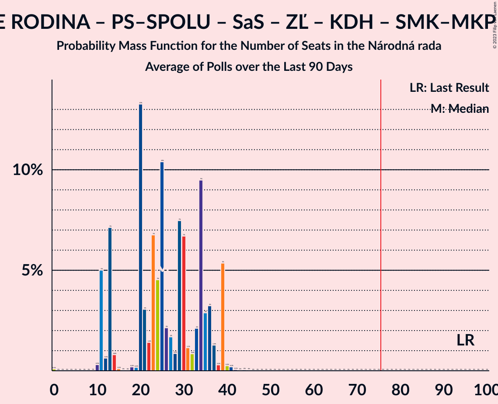

# Poll Average

<a href="#voting-intentions">Voting Intentions</a> | <a href="#seats">Seats</a> | <a href="#coalitions">Coalitions</a> | <a href="#technical-information">Technical Information</a>

## Summary

The table below lists the polls on which the average is based. They are the most recent polls (less than 90 days old) registered and analyzed so far.

| Period     | Polling firm/Commissioner(s) | OĽaNO | Smer–SD | SME RODINA | Kotleba–ĽSNS | PS–SPOLU | SaS | ZĽ | KDH | SMK–MKP | SNS | DV | V | MOST–HÍD | NOVA | PS | SPOLU | HLAS–SD | REP |
|:----------:|:----------------------------:|:--:|:--:|:--:|:--:|:--:|:--:|:--:|:--:|:--:|:--:|:--:|:--:|:--:|:--:|:--:|:--:|:--:|:--:|
| 29 February 2020 | General Election | 25.0%   53 | 18.3%   38 | 8.2%   17 | 8.0%   17 | 7.0%   0 | 6.2%   13 | 5.8%   12 | 4.6%   0 | 3.9%   0 | 3.2%   0 | 3.1%   0 | 2.9%   0 | 2.0%   0 | 0.0%   0 | 7.0%   0 | 7.0%   0 | 0.0%   0 | 0.0%   0 |
| N/A | Poll Average | 8–11%   14–23 | 8–13%   13–24 | 6–11%   10–22 | 2–5%   0–11 | N/A   N/A | 9–14%   18–29 | 3–6%   0–11 | 4–7%   0–13 | 3–6%   0–12 | 1–4%   0 | 1–4%   0 | 0–4%   0 | N/A   N/A | N/A   N/A | 5–9%   0–20 | 0–2%   0 | 19–25%   35–51 | 4–10%   0–19 |
| [13–17 May 2021](2021-05-17-AKO.html) | AKO | 8–11%   15–22 | 7–11%   13–22 | 6–9%   10–16 | 1–3%   0 | N/A   N/A | 11–15%   21–29 | 3–5%   0–10 | 4–6%   0–11 | 4–6%   0–11 | 1–2%   0 | 2–4%   0 | 2–5%   0 | N/A   N/A | N/A   N/A | 6–10%   13–20 | 1–2%   0 | 19–24%   35–42 | 7–10%   12–20 |
| [31 March–7 April 2021](2021-04-07-FOCUS.html) | FOCUS | 8–11%   13–21 | 9–13%   16–26 | 6–9%   11–17 | 3–6%   0–11 | N/A   N/A | 9–13%   18–25 | 4–6%   0–11 | 4–7%   0–14 | 4–7%   0–12 | 2–5%   0 | 1–3%   0 | 1–3%   0 | N/A   N/A | N/A   N/A | 5–8%   0–14 | 0–2%   0 | 20–25%   35–51 | 4–6%   0–12 |
| [27–31 March 2021](2021-03-31-Actly.html) | Actly | 8–12%   16–25 | 9–13%   16–24 | 8–11%   16–23 | 2–4%   0 | N/A   N/A | 9–12%   16–23 | 3–5%   0–9 | 4–7%   0–12 | 3–6%   0 | 2–4%   0 | 1–3%   0 | 0–1%   0 | N/A   N/A | N/A   N/A | 6–9%   11–17 | 1–2%   0 | 20–25%   37–51 | 4–6%   0–12 |
| 29 February 2020 | General Election | 25.0%   53 | 18.3%   38 | 8.2%   17 | 8.0%   17 | 7.0%   0 | 6.2%   13 | 5.8%   12 | 4.6%   0 | 3.9%   0 | 3.2%   0 | 3.1%   0 | 2.9%   0 | 2.0%   0 | 0.0%   0 | 7.0%   0 | 7.0%   0 | 0.0%   0 | 0.0%   0 |

Only polls for which at least the sample size has been published are included in the table above.

**Legend:**
+ **Top half of each row:** Voting intentions (95% confidence interval)
+ **Bottom half of each row:** Seat projections for the Národná rada (95% confidence interval)
+ **OĽaNO:** OBYČAJNÍ ĽUDIA a nezávislé osobnosti
+ **Smer–SD:** SMER–sociálna demokracia
+ **SME RODINA:** SME RODINA
+ **Kotleba–ĽSNS:** Kotleba–Ľudová strana Naše Slovensko
+ **PS–SPOLU:** Progresívne Slovensko–SPOLU–Občianska Demokracia
+ **SaS:** Sloboda a Solidarita
+ **ZĽ:** Za ľudí
+ **KDH:** Kresťanskodemokratické hnutie
+ **SMK–MKP:** Strana maďarskej koalície–Magyar Koalíció Pártja
+ **SNS:** Slovenská národná strana
+ **DV:** Dobrá voľba
+ **V:** VLASŤ
+ **MOST–HÍD:** MOST–HÍD
+ **NOVA:** NOVA
+ **PS:** Progresívne Slovensko
+ **SPOLU:** SPOLU–Občianska Demokracia
+ **HLAS–SD:** HLAS–sociálna demokracia
+ **REP:** REPUBLIKA
+ **N/A (single party):** Party not included the published results
+ **N/A (entire row):** Calculation for this opinion poll not started yet

## Voting Intentions

### Confidence Intervals

| Party | Last Result | Median | 80% Confidence Interval | 90% Confidence Interval | 95% Confidence Interval | 99% Confidence Interval |
|:-----:|:-----------:|:------:|:-----------------------:|:-----------------------:|:-----------------------:|:-----------------------:|
| <a href="#obyčajní-ľudia-a-nezávislé-osobnosti">OBYČAJNÍ ĽUDIA a nezávislé osobnosti</a> | 25.0% | 9.4% | 8.3–10.6% |8.0–11.0% | 7.7–11.3% | 7.2–12.0% |
| <a href="#smer–sociálna-demokracia">SMER–sociálna demokracia</a> | 18.3% | 10.2% | 8.6–11.8% |8.2–12.2% | 7.8–12.6% | 7.3–13.3% |
| <a href="#sme-rodina">SME RODINA</a> | 8.2% | 7.8% | 6.4–10.1% |6.1–10.5% | 5.8–11.0% | 5.4–11.7% |
| <a href="#kotleba–ľudová-strana-naše-slovensko">Kotleba–Ľudová strana Naše Slovensko</a> | 8.0% | 3.0% | 1.8–4.7% |1.6–5.1% | 1.5–5.3% | 1.2–5.9% |
| <a href="#progresívne-slovensko–spolu–občianska-demokracia">Progresívne Slovensko–SPOLU–Občianska Demokracia</a> | 7.0% | N/A | N/A |N/A | N/A | N/A |
| <a href="#progresívne-slovensko">Progresívne Slovensko</a> | 7.0% | 7.3% | 5.8–8.7% |5.5–9.1% | 5.2–9.4% | 4.7–10.0% |
| <a href="#spolu–občianska-demokracia">SPOLU–Občianska Demokracia</a> | 7.0% | 1.1% | 0.7–1.8% |0.6–2.0% | 0.5–2.2% | 0.4–2.5% |
| <a href="#sloboda-a-solidarita">Sloboda a Solidarita</a> | 6.2% | 11.4% | 9.7–13.6% |9.3–14.1% | 9.0–14.5% | 8.4–15.4% |
| <a href="#za-ľudí">Za ľudí</a> | 5.8% | 4.1% | 3.2–5.3% |3.0–5.6% | 2.8–5.9% | 2.5–6.5% |
| <a href="#kresťanskodemokratické-hnutie">Kresťanskodemokratické hnutie</a> | 4.6% | 5.4% | 4.3–6.5% |4.1–6.8% | 3.8–7.1% | 3.5–7.7% |
| <a href="#strana-maďarskej-koalície–magyar-koalíció-pártja">Strana maďarskej koalície–Magyar Koalíció Pártja</a> | 3.9% | 4.8% | 3.8–5.8% |3.5–6.1% | 3.3–6.3% | 2.9–6.9% |
| <a href="#slovenská-národná-strana">Slovenská národná strana</a> | 3.2% | 2.9% | 1.4–4.0% |1.2–4.2% | 1.1–4.5% | 0.9–4.9% |
| <a href="#dobrá-voľba">Dobrá voľba</a> | 3.1% | 2.3% | 1.6–3.2% |1.4–3.5% | 1.3–3.7% | 1.1–4.1% |
| <a href="#vlasť">VLASŤ</a> | 2.9% | 1.7% | 0.1–3.6% |0.1–3.9% | 0.0–4.2% | 0.0–4.7% |
| <a href="#most–híd">MOST–HÍD</a> | 2.0% | N/A | N/A |N/A | N/A | N/A |
| <a href="#nova">NOVA</a> | 0.0% | N/A | N/A |N/A | N/A | N/A |
| <a href="#hlas–sociálna-demokracia">HLAS–sociálna demokracia</a> | 0.0% | 22.1% | 20.2–24.0% |19.7–24.5% | 19.3–25.0% | 18.5–25.9% |
| <a href="#republika">REPUBLIKA</a> | 0.0% | 5.3% | 4.2–8.7% |3.9–9.1% | 3.7–9.5% | 3.4–10.2% |

### OBYČAJNÍ ĽUDIA a nezávislé osobnosti

*For a full overview of the results for this party, see the [OBYČAJNÍ ĽUDIA a nezávislé osobnosti](party-obyčajníľudiaanezávisléosobnosti.html) page.*

| Voting Intentions | Probability | Accumulated | Special Marks |
|:-----------------:|:-----------:|:-----------:|:-------------:|
| 5.5–6.5% | 0% | 100% |  |
| 6.5–7.5% | 2% | 100% |  |
| 7.5–8.5% | 15% | 98% |  |
| 8.5–9.5% | 39% | 83% | Median |
| 9.5–10.5% | 32% | 44% |  |
| 10.5–11.5% | 10% | 12% |  |
| 11.5–12.5% | 1.4% | 2% |  |
| 12.5–13.5% | 0.1% | 0.1% |  |
| 13.5–14.5% | 0% | 0% |  |
| 14.5–15.5% | 0% | 0% |  |
| 15.5–16.5% | 0% | 0% |  |
| 16.5–17.5% | 0% | 0% |  |
| 17.5–18.5% | 0% | 0% |  |
| 18.5–19.5% | 0% | 0% |  |
| 19.5–20.5% | 0% | 0% |  |
| 20.5–21.5% | 0% | 0% |  |
| 21.5–22.5% | 0% | 0% |  |
| 22.5–23.5% | 0% | 0% |  |
| 23.5–24.5% | 0% | 0% |  |
| 24.5–25.5% | 0% | 0% | Last Result |

### SMER–sociálna demokracia

*For a full overview of the results for this party, see the [SMER–sociálna demokracia](party-smer–sociálnademokracia.html) page.*

| Voting Intentions | Probability | Accumulated | Special Marks |
|:-----------------:|:-----------:|:-----------:|:-------------:|
| 5.5–6.5% | 0% | 100% |  |
| 6.5–7.5% | 1.1% | 100% |  |
| 7.5–8.5% | 9% | 98.9% |  |
| 8.5–9.5% | 21% | 90% |  |
| 9.5–10.5% | 29% | 69% | Median |
| 10.5–11.5% | 26% | 40% |  |
| 11.5–12.5% | 12% | 14% |  |
| 12.5–13.5% | 3% | 3% |  |
| 13.5–14.5% | 0.3% | 0.3% |  |
| 14.5–15.5% | 0% | 0% |  |
| 15.5–16.5% | 0% | 0% |  |
| 16.5–17.5% | 0% | 0% |  |
| 17.5–18.5% | 0% | 0% | Last Result |

### SME RODINA

*For a full overview of the results for this party, see the [SME RODINA](party-smerodina.html) page.*

| Voting Intentions | Probability | Accumulated | Special Marks |
|:-----------------:|:-----------:|:-----------:|:-------------:|
| 3.5–4.5% | 0% | 100% |  |
| 4.5–5.5% | 1.0% | 100% |  |
| 5.5–6.5% | 13% | 99.0% |  |
| 6.5–7.5% | 30% | 86% |  |
| 7.5–8.5% | 23% | 56% | Last Result, Median |
| 8.5–9.5% | 16% | 33% |  |
| 9.5–10.5% | 12% | 17% |  |
| 10.5–11.5% | 4% | 5% |  |
| 11.5–12.5% | 0.6% | 0.7% |  |
| 12.5–13.5% | 0% | 0.1% |  |
| 13.5–14.5% | 0% | 0% |  |

### Kotleba–Ľudová strana Naše Slovensko

*For a full overview of the results for this party, see the [Kotleba–Ľudová strana Naše Slovensko](party-kotleba–ľudovástrananašeslovensko.html) page.*

| Voting Intentions | Probability | Accumulated | Special Marks |
|:-----------------:|:-----------:|:-----------:|:-------------:|
| 0.0–0.5% | 0% | 100% |  |
| 0.5–1.5% | 4% | 100% |  |
| 1.5–2.5% | 32% | 96% |  |
| 2.5–3.5% | 29% | 64% | Median |
| 3.5–4.5% | 23% | 35% |  |
| 4.5–5.5% | 11% | 13% |  |
| 5.5–6.5% | 1.4% | 1.5% |  |
| 6.5–7.5% | 0% | 0% |  |
| 7.5–8.5% | 0% | 0% | Last Result |

### Progresívne Slovensko

*For a full overview of the results for this party, see the [Progresívne Slovensko](party-progresívneslovensko.html) page.*

| Voting Intentions | Probability | Accumulated | Special Marks |
|:-----------------:|:-----------:|:-----------:|:-------------:|
| 2.5–3.5% | 0% | 100% |  |
| 3.5–4.5% | 0.2% | 100% |  |
| 4.5–5.5% | 6% | 99.8% |  |
| 5.5–6.5% | 21% | 94% |  |
| 6.5–7.5% | 32% | 73% | Last Result, Median |
| 7.5–8.5% | 29% | 41% |  |
| 8.5–9.5% | 11% | 13% |  |
| 9.5–10.5% | 2% | 2% |  |
| 10.5–11.5% | 0.1% | 0.1% |  |
| 11.5–12.5% | 0% | 0% |  |

### SPOLU–Občianska Demokracia

*For a full overview of the results for this party, see the [SPOLU–Občianska Demokracia](party-spolu–občianskademokracia.html) page.*

| Voting Intentions | Probability | Accumulated | Special Marks |
|:-----------------:|:-----------:|:-----------:|:-------------:|
| 0.0–0.5% | 4% | 100% |  |
| 0.5–1.5% | 75% | 96% | Median |
| 1.5–2.5% | 20% | 21% |  |
| 2.5–3.5% | 0.5% | 0.5% |  |
| 3.5–4.5% | 0% | 0% |  |
| 4.5–5.5% | 0% | 0% |  |
| 5.5–6.5% | 0% | 0% |  |
| 6.5–7.5% | 0% | 0% | Last Result |

### Sloboda a Solidarita

*For a full overview of the results for this party, see the [Sloboda a Solidarita](party-slobodaasolidarita.html) page.*

| Voting Intentions | Probability | Accumulated | Special Marks |
|:-----------------:|:-----------:|:-----------:|:-------------:|
| 5.5–6.5% | 0% | 100% | Last Result |
| 6.5–7.5% | 0% | 100% |  |
| 7.5–8.5% | 0.8% | 100% |  |
| 8.5–9.5% | 7% | 99.1% |  |
| 9.5–10.5% | 20% | 92% |  |
| 10.5–11.5% | 25% | 73% | Median |
| 11.5–12.5% | 21% | 47% |  |
| 12.5–13.5% | 16% | 26% |  |
| 13.5–14.5% | 8% | 11% |  |
| 14.5–15.5% | 2% | 2% |  |
| 15.5–16.5% | 0.3% | 0.3% |  |
| 16.5–17.5% | 0% | 0% |  |

### Za ľudí

*For a full overview of the results for this party, see the [Za ľudí](party-zaľudí.html) page.*

| Voting Intentions | Probability | Accumulated | Special Marks |
|:-----------------:|:-----------:|:-----------:|:-------------:|
| 0.5–1.5% | 0% | 100% |  |
| 1.5–2.5% | 0.6% | 100% |  |
| 2.5–3.5% | 23% | 99.4% |  |
| 3.5–4.5% | 47% | 77% | Median |
| 4.5–5.5% | 24% | 30% |  |
| 5.5–6.5% | 5% | 6% | Last Result |
| 6.5–7.5% | 0.4% | 0.4% |  |
| 7.5–8.5% | 0% | 0% |  |

### Kresťanskodemokratické hnutie

*For a full overview of the results for this party, see the [Kresťanskodemokratické hnutie](party-kresťanskodemokratickéhnutie.html) page.*

| Voting Intentions | Probability | Accumulated | Special Marks |
|:-----------------:|:-----------:|:-----------:|:-------------:|
| 1.5–2.5% | 0% | 100% |  |
| 2.5–3.5% | 0.7% | 100% |  |
| 3.5–4.5% | 15% | 99.3% |  |
| 4.5–5.5% | 41% | 84% | Last Result, Median |
| 5.5–6.5% | 34% | 43% |  |
| 6.5–7.5% | 8% | 9% |  |
| 7.5–8.5% | 0.7% | 0.7% |  |
| 8.5–9.5% | 0% | 0% |  |

### Strana maďarskej koalície–Magyar Koalíció Pártja

*For a full overview of the results for this party, see the [Strana maďarskej koalície–Magyar Koalíció Pártja](party-stranamaďarskejkoalície–magyarkoalíciópártja.html) page.*

| Voting Intentions | Probability | Accumulated | Special Marks |
|:-----------------:|:-----------:|:-----------:|:-------------:|
| 1.5–2.5% | 0% | 100% |  |
| 2.5–3.5% | 6% | 100% |  |
| 3.5–4.5% | 34% | 94% | Last Result |
| 4.5–5.5% | 44% | 60% | Median |
| 5.5–6.5% | 15% | 16% |  |
| 6.5–7.5% | 1.4% | 1.4% |  |
| 7.5–8.5% | 0% | 0% |  |
| 8.5–9.5% | 0% | 0% |  |

### Slovenská národná strana

*For a full overview of the results for this party, see the [Slovenská národná strana](party-slovenskánárodnástrana.html) page.*

| Voting Intentions | Probability | Accumulated | Special Marks |
|:-----------------:|:-----------:|:-----------:|:-------------:|
| 0.0–0.5% | 0% | 100% |  |
| 0.5–1.5% | 16% | 100% |  |
| 1.5–2.5% | 22% | 84% |  |
| 2.5–3.5% | 39% | 62% | Last Result, Median |
| 3.5–4.5% | 21% | 23% |  |
| 4.5–5.5% | 2% | 2% |  |
| 5.5–6.5% | 0% | 0% |  |

### Dobrá voľba

*For a full overview of the results for this party, see the [Dobrá voľba](party-dobrávoľba.html) page.*

| Voting Intentions | Probability | Accumulated | Special Marks |
|:-----------------:|:-----------:|:-----------:|:-------------:|
| 0.0–0.5% | 0% | 100% |  |
| 0.5–1.5% | 10% | 100% |  |
| 1.5–2.5% | 56% | 90% | Median |
| 2.5–3.5% | 31% | 35% | Last Result |
| 3.5–4.5% | 4% | 4% |  |
| 4.5–5.5% | 0.1% | 0.1% |  |
| 5.5–6.5% | 0% | 0% |  |

### VLASŤ

*For a full overview of the results for this party, see the [VLASŤ](party-vlasť.html) page.*

| Voting Intentions | Probability | Accumulated | Special Marks |
|:-----------------:|:-----------:|:-----------:|:-------------:|
| 0.0–0.5% | 32% | 100% |  |
| 0.5–1.5% | 14% | 68% |  |
| 1.5–2.5% | 21% | 54% | Median |
| 2.5–3.5% | 21% | 32% | Last Result |
| 3.5–4.5% | 11% | 12% |  |
| 4.5–5.5% | 0.8% | 0.8% |  |
| 5.5–6.5% | 0% | 0% |  |

### HLAS–sociálna demokracia

*For a full overview of the results for this party, see the [HLAS–sociálna demokracia](party-hlas–sociálnademokracia.html) page.*

| Voting Intentions | Probability | Accumulated | Special Marks |
|:-----------------:|:-----------:|:-----------:|:-------------:|
| 0.0–0.5% | 0% | 100% | Last Result |
| 0.5–1.5% | 0% | 100% |  |
| 1.5–2.5% | 0% | 100% |  |
| 2.5–3.5% | 0% | 100% |  |
| 3.5–4.5% | 0% | 100% |  |
| 4.5–5.5% | 0% | 100% |  |
| 5.5–6.5% | 0% | 100% |  |
| 6.5–7.5% | 0% | 100% |  |
| 7.5–8.5% | 0% | 100% |  |
| 8.5–9.5% | 0% | 100% |  |
| 9.5–10.5% | 0% | 100% |  |
| 10.5–11.5% | 0% | 100% |  |
| 11.5–12.5% | 0% | 100% |  |
| 12.5–13.5% | 0% | 100% |  |
| 13.5–14.5% | 0% | 100% |  |
| 14.5–15.5% | 0% | 100% |  |
| 15.5–16.5% | 0% | 100% |  |
| 16.5–17.5% | 0% | 100% |  |
| 17.5–18.5% | 0.5% | 100% |  |
| 18.5–19.5% | 3% | 99.4% |  |
| 19.5–20.5% | 11% | 96% |  |
| 20.5–21.5% | 21% | 85% |  |
| 21.5–22.5% | 27% | 64% | Median |
| 22.5–23.5% | 21% | 37% |  |
| 23.5–24.5% | 11% | 16% |  |
| 24.5–25.5% | 4% | 5% |  |
| 25.5–26.5% | 0.8% | 1.0% |  |
| 26.5–27.5% | 0.1% | 0.1% |  |
| 27.5–28.5% | 0% | 0% |  |

### REPUBLIKA

*For a full overview of the results for this party, see the [REPUBLIKA](party-republika.html) page.*

| Voting Intentions | Probability | Accumulated | Special Marks |
|:-----------------:|:-----------:|:-----------:|:-------------:|
| 0.0–0.5% | 0% | 100% | Last Result |
| 0.5–1.5% | 0% | 100% |  |
| 1.5–2.5% | 0% | 100% |  |
| 2.5–3.5% | 1.2% | 100% |  |
| 3.5–4.5% | 21% | 98.8% |  |
| 4.5–5.5% | 34% | 78% | Median |
| 5.5–6.5% | 11% | 44% |  |
| 6.5–7.5% | 7% | 34% |  |
| 7.5–8.5% | 15% | 27% |  |
| 8.5–9.5% | 9% | 12% |  |
| 9.5–10.5% | 2% | 2% |  |
| 10.5–11.5% | 0.2% | 0.2% |  |
| 11.5–12.5% | 0% | 0% |  |

## Seats

### Confidence Intervals

| Party | Last Result | Median | 80% Confidence Interval | 90% Confidence Interval | 95% Confidence Interval | 99% Confidence Interval |
|:-----:|:-----------:|:------:|:-----------------------:|:-----------------------:|:-----------------------:|:-----------------------:|
| <a href="#obyčajní-ľudia-a-nezávislé-osobnosti">OBYČAJNÍ ĽUDIA a nezávislé osobnosti</a> | 53 | 18 | 16–20 |15–22 | 14–23 | 13–25 |
| <a href="#smer–sociálna-demokracia">SMER–sociálna demokracia</a> | 38 | 19 | 16–22 |16–23 | 13–24 | 13–26 |
| <a href="#sme-rodina">SME RODINA</a> | 17 | 14 | 10–19 |10–21 | 10–22 | 10–23 |
| <a href="#kotleba–ľudová-strana-naše-slovensko">Kotleba–Ľudová strana Naše Slovensko</a> | 17 | 0 | 0–11 |0–11 | 0–11 | 0–11 |
| <a href="#progresívne-slovensko–spolu–občianska-demokracia">Progresívne Slovensko–SPOLU–Občianska Demokracia</a> | 0 | N/A | N/A |N/A | N/A | N/A |
| <a href="#progresívne-slovensko">Progresívne Slovensko</a> | 0 | 13 | 11–19 |9–20 | 0–20 | 0–20 |
| <a href="#spolu–občianska-demokracia">SPOLU–Občianska Demokracia</a> | 0 | 0 | 0 |0 | 0 | 0 |
| <a href="#sloboda-a-solidarita">Sloboda a Solidarita</a> | 13 | 21 | 18–26 |18–29 | 18–29 | 16–29 |
| <a href="#za-ľudí">Za ľudí</a> | 12 | 0 | 0–11 |0–11 | 0–11 | 0–12 |
| <a href="#kresťanskodemokratické-hnutie">Kresťanskodemokratické hnutie</a> | 0 | 0 | 0–12 |0–12 | 0–13 | 0–14 |
| <a href="#strana-maďarskej-koalície–magyar-koalíció-pártja">Strana maďarskej koalície–Magyar Koalíció Pártja</a> | 0 | 0 | 0–10 |0–12 | 0–12 | 0–13 |
| <a href="#slovenská-národná-strana">Slovenská národná strana</a> | 0 | 0 | 0 |0 | 0 | 0 |
| <a href="#dobrá-voľba">Dobrá voľba</a> | 0 | 0 | 0 |0 | 0 | 0 |
| <a href="#vlasť">VLASŤ</a> | 0 | 0 | 0 |0 | 0 | 0 |
| <a href="#most–híd">MOST–HÍD</a> | 0 | N/A | N/A |N/A | N/A | N/A |
| <a href="#nova">NOVA</a> | 0 | N/A | N/A |N/A | N/A | N/A |
| <a href="#hlas–sociálna-demokracia">HLAS–sociálna demokracia</a> | 0 | 40 | 36–49 |36–50 | 35–51 | 33–51 |
| <a href="#republika">REPUBLIKA</a> | 0 | 10 | 0–19 |0–19 | 0–19 | 0–20 |

### OBYČAJNÍ ĽUDIA a nezávislé osobnosti

*For a full overview of the results for this party, see the [OBYČAJNÍ ĽUDIA a nezávislé osobnosti](party-obyčajníľudiaanezávisléosobnosti.html) page.*

| Number of Seats | Probability | Accumulated | Special Marks |
|:---------------:|:-----------:|:-----------:|:-------------:|
| 12 | 0.4% | 100% |  |
| 13 | 1.2% | 99.6% |  |
| 14 | 2% | 98% |  |
| 15 | 6% | 97% |  |
| 16 | 11% | 91% |  |
| 17 | 7% | 80% |  |
| 18 | 46% | 73% | Median |
| 19 | 13% | 28% |  |
| 20 | 5% | 15% |  |
| 21 | 3% | 10% |  |
| 22 | 3% | 7% |  |
| 23 | 3% | 4% |  |
| 24 | 0.1% | 1.2% |  |
| 25 | 1.1% | 1.2% |  |
| 26 | 0% | 0% |  |
| 27 | 0% | 0% |  |
| 28 | 0% | 0% |  |
| 29 | 0% | 0% |  |
| 30 | 0% | 0% |  |
| 31 | 0% | 0% |  |
| 32 | 0% | 0% |  |
| 33 | 0% | 0% |  |
| 34 | 0% | 0% |  |
| 35 | 0% | 0% |  |
| 36 | 0% | 0% |  |
| 37 | 0% | 0% |  |
| 38 | 0% | 0% |  |
| 39 | 0% | 0% |  |
| 40 | 0% | 0% |  |
| 41 | 0% | 0% |  |
| 42 | 0% | 0% |  |
| 43 | 0% | 0% |  |
| 44 | 0% | 0% |  |
| 45 | 0% | 0% |  |
| 46 | 0% | 0% |  |
| 47 | 0% | 0% |  |
| 48 | 0% | 0% |  |
| 49 | 0% | 0% |  |
| 50 | 0% | 0% |  |
| 51 | 0% | 0% |  |
| 52 | 0% | 0% |  |
| 53 | 0% | 0% | Last Result |

### SMER–sociálna demokracia

*For a full overview of the results for this party, see the [SMER–sociálna demokracia](party-smer–sociálnademokracia.html) page.*

| Number of Seats | Probability | Accumulated | Special Marks |
|:---------------:|:-----------:|:-----------:|:-------------:|
| 13 | 3% | 100% |  |
| 14 | 1.1% | 97% |  |
| 15 | 1.0% | 96% |  |
| 16 | 5% | 95% |  |
| 17 | 7% | 90% |  |
| 18 | 22% | 83% |  |
| 19 | 22% | 61% | Median |
| 20 | 4% | 39% |  |
| 21 | 12% | 35% |  |
| 22 | 15% | 23% |  |
| 23 | 3% | 8% |  |
| 24 | 3% | 5% |  |
| 25 | 0.2% | 2% |  |
| 26 | 1.2% | 1.3% |  |
| 27 | 0.1% | 0.2% |  |
| 28 | 0.1% | 0.1% |  |
| 29 | 0% | 0% |  |
| 30 | 0% | 0% |  |
| 31 | 0% | 0% |  |
| 32 | 0% | 0% |  |
| 33 | 0% | 0% |  |
| 34 | 0% | 0% |  |
| 35 | 0% | 0% |  |
| 36 | 0% | 0% |  |
| 37 | 0% | 0% |  |
| 38 | 0% | 0% | Last Result |

### SME RODINA

*For a full overview of the results for this party, see the [SME RODINA](party-smerodina.html) page.*

| Number of Seats | Probability | Accumulated | Special Marks |
|:---------------:|:-----------:|:-----------:|:-------------:|
| 0 | 0.1% | 100% |  |
| 1 | 0% | 99.9% |  |
| 2 | 0% | 99.9% |  |
| 3 | 0% | 99.9% |  |
| 4 | 0% | 99.9% |  |
| 5 | 0% | 99.9% |  |
| 6 | 0% | 99.9% |  |
| 7 | 0% | 99.9% |  |
| 8 | 0% | 99.9% |  |
| 9 | 0.1% | 99.9% |  |
| 10 | 11% | 99.8% |  |
| 11 | 8% | 88% |  |
| 12 | 3% | 81% |  |
| 13 | 10% | 77% |  |
| 14 | 19% | 68% | Median |
| 15 | 2% | 49% |  |
| 16 | 19% | 47% |  |
| 17 | 0.9% | 28% | Last Result |
| 18 | 9% | 27% |  |
| 19 | 10% | 18% |  |
| 20 | 0.5% | 8% |  |
| 21 | 3% | 7% |  |
| 22 | 2% | 4% |  |
| 23 | 2% | 2% |  |
| 24 | 0% | 0.1% |  |
| 25 | 0% | 0.1% |  |
| 26 | 0.1% | 0.1% |  |
| 27 | 0% | 0% |  |

### Kotleba–Ľudová strana Naše Slovensko

*For a full overview of the results for this party, see the [Kotleba–Ľudová strana Naše Slovensko](party-kotleba–ľudovástrananašeslovensko.html) page.*

| Number of Seats | Probability | Accumulated | Special Marks |
|:---------------:|:-----------:|:-----------:|:-------------:|
| 0 | 83% | 100% | Median |
| 1 | 0% | 17% |  |
| 2 | 0% | 17% |  |
| 3 | 0% | 17% |  |
| 4 | 0% | 17% |  |
| 5 | 0% | 17% |  |
| 6 | 0% | 17% |  |
| 7 | 0% | 17% |  |
| 8 | 0.3% | 17% |  |
| 9 | 1.0% | 17% |  |
| 10 | 3% | 16% |  |
| 11 | 13% | 13% |  |
| 12 | 0% | 0% |  |
| 13 | 0% | 0% |  |
| 14 | 0% | 0% |  |
| 15 | 0% | 0% |  |
| 16 | 0% | 0% |  |
| 17 | 0% | 0% | Last Result |

### Progresívne Slovensko–SPOLU–Občianska Demokracia

*For a full overview of the results for this party, see the [Progresívne Slovensko–SPOLU–Občianska Demokracia](party-progresívneslovensko–spolu–občianskademokracia.html) page.*

### Progresívne Slovensko

*For a full overview of the results for this party, see the [Progresívne Slovensko](party-progresívneslovensko.html) page.*

| Number of Seats | Probability | Accumulated | Special Marks |
|:---------------:|:-----------:|:-----------:|:-------------:|
| 0 | 5% | 100% | Last Result |
| 1 | 0% | 95% |  |
| 2 | 0% | 95% |  |
| 3 | 0% | 95% |  |
| 4 | 0% | 95% |  |
| 5 | 0% | 95% |  |
| 6 | 0% | 95% |  |
| 7 | 0% | 95% |  |
| 8 | 0% | 95% |  |
| 9 | 0.3% | 95% |  |
| 10 | 2% | 95% |  |
| 11 | 9% | 93% |  |
| 12 | 21% | 84% |  |
| 13 | 12% | 62% | Median |
| 14 | 6% | 50% |  |
| 15 | 10% | 44% |  |
| 16 | 3% | 34% |  |
| 17 | 12% | 31% |  |
| 18 | 0.2% | 19% |  |
| 19 | 11% | 19% |  |
| 20 | 8% | 8% |  |
| 21 | 0% | 0.1% |  |
| 22 | 0.1% | 0.1% |  |
| 23 | 0% | 0% |  |

### SPOLU–Občianska Demokracia

*For a full overview of the results for this party, see the [SPOLU–Občianska Demokracia](party-spolu–občianskademokracia.html) page.*

| Number of Seats | Probability | Accumulated | Special Marks |
|:---------------:|:-----------:|:-----------:|:-------------:|
| 0 | 100% | 100% | Last Result, Median |

### Sloboda a Solidarita

*For a full overview of the results for this party, see the [Sloboda a Solidarita](party-slobodaasolidarita.html) page.*

| Number of Seats | Probability | Accumulated | Special Marks |
|:---------------:|:-----------:|:-----------:|:-------------:|
| 13 | 0% | 100% | Last Result |
| 14 | 0% | 100% |  |
| 15 | 0.1% | 100% |  |
| 16 | 2% | 99.8% |  |
| 17 | 0.5% | 98% |  |
| 18 | 10% | 98% |  |
| 19 | 21% | 87% |  |
| 20 | 6% | 67% |  |
| 21 | 15% | 61% | Median |
| 22 | 11% | 46% |  |
| 23 | 7% | 35% |  |
| 24 | 4% | 28% |  |
| 25 | 13% | 24% |  |
| 26 | 3% | 11% |  |
| 27 | 0.1% | 8% |  |
| 28 | 0.4% | 8% |  |
| 29 | 7% | 7% |  |
| 30 | 0% | 0% |  |

### Za ľudí

*For a full overview of the results for this party, see the [Za ľudí](party-zaľudí.html) page.*

| Number of Seats | Probability | Accumulated | Special Marks |
|:---------------:|:-----------:|:-----------:|:-------------:|
| 0 | 76% | 100% | Median |
| 1 | 0% | 24% |  |
| 2 | 0% | 24% |  |
| 3 | 0% | 24% |  |
| 4 | 0% | 24% |  |
| 5 | 0% | 24% |  |
| 6 | 0% | 24% |  |
| 7 | 0% | 24% |  |
| 8 | 0% | 24% |  |
| 9 | 2% | 24% |  |
| 10 | 5% | 22% |  |
| 11 | 16% | 17% |  |
| 12 | 0.4% | 0.6% | Last Result |
| 13 | 0.1% | 0.2% |  |
| 14 | 0.1% | 0.1% |  |
| 15 | 0% | 0% |  |

### Kresťanskodemokratické hnutie

*For a full overview of the results for this party, see the [Kresťanskodemokratické hnutie](party-kresťanskodemokratickéhnutie.html) page.*

| Number of Seats | Probability | Accumulated | Special Marks |
|:---------------:|:-----------:|:-----------:|:-------------:|
| 0 | 55% | 100% | Last Result, Median |
| 1 | 0% | 45% |  |
| 2 | 0% | 45% |  |
| 3 | 0% | 45% |  |
| 4 | 0% | 45% |  |
| 5 | 0% | 45% |  |
| 6 | 0% | 45% |  |
| 7 | 0% | 45% |  |
| 8 | 0% | 45% |  |
| 9 | 4% | 45% |  |
| 10 | 10% | 41% |  |
| 11 | 20% | 31% |  |
| 12 | 6% | 11% |  |
| 13 | 3% | 5% |  |
| 14 | 0.9% | 1.3% |  |
| 15 | 0.4% | 0.5% |  |
| 16 | 0% | 0.1% |  |
| 17 | 0% | 0% |  |

### Strana maďarskej koalície–Magyar Koalíció Pártja

*For a full overview of the results for this party, see the [Strana maďarskej koalície–Magyar Koalíció Pártja](party-stranamaďarskejkoalície–magyarkoalíciópártja.html) page.*

| Number of Seats | Probability | Accumulated | Special Marks |
|:---------------:|:-----------:|:-----------:|:-------------:|
| 0 | 74% | 100% | Last Result, Median |
| 1 | 0% | 26% |  |
| 2 | 0% | 26% |  |
| 3 | 0% | 26% |  |
| 4 | 0% | 26% |  |
| 5 | 0% | 26% |  |
| 6 | 0% | 26% |  |
| 7 | 0% | 26% |  |
| 8 | 0% | 26% |  |
| 9 | 4% | 26% |  |
| 10 | 12% | 22% |  |
| 11 | 5% | 10% |  |
| 12 | 4% | 5% |  |
| 13 | 0.3% | 0.7% |  |
| 14 | 0.3% | 0.4% |  |
| 15 | 0.1% | 0.1% |  |
| 16 | 0% | 0% |  |

### Slovenská národná strana

*For a full overview of the results for this party, see the [Slovenská národná strana](party-slovenskánárodnástrana.html) page.*

| Number of Seats | Probability | Accumulated | Special Marks |
|:---------------:|:-----------:|:-----------:|:-------------:|
| 0 | 99.5% | 100% | Last Result, Median |
| 1 | 0% | 0.5% |  |
| 2 | 0% | 0.5% |  |
| 3 | 0% | 0.5% |  |
| 4 | 0% | 0.5% |  |
| 5 | 0% | 0.5% |  |
| 6 | 0% | 0.5% |  |
| 7 | 0% | 0.5% |  |
| 8 | 0% | 0.5% |  |
| 9 | 0% | 0.5% |  |
| 10 | 0.4% | 0.4% |  |
| 11 | 0% | 0% |  |

### Dobrá voľba

*For a full overview of the results for this party, see the [Dobrá voľba](party-dobrávoľba.html) page.*

| Number of Seats | Probability | Accumulated | Special Marks |
|:---------------:|:-----------:|:-----------:|:-------------:|
| 0 | 100% | 100% | Last Result, Median |

### VLASŤ

*For a full overview of the results for this party, see the [VLASŤ](party-vlasť.html) page.*

| Number of Seats | Probability | Accumulated | Special Marks |
|:---------------:|:-----------:|:-----------:|:-------------:|
| 0 | 99.9% | 100% | Last Result, Median |
| 1 | 0% | 0.1% |  |
| 2 | 0% | 0.1% |  |
| 3 | 0% | 0.1% |  |
| 4 | 0% | 0.1% |  |
| 5 | 0% | 0.1% |  |
| 6 | 0% | 0.1% |  |
| 7 | 0% | 0.1% |  |
| 8 | 0% | 0.1% |  |
| 9 | 0.1% | 0.1% |  |
| 10 | 0% | 0% |  |

### MOST–HÍD

*For a full overview of the results for this party, see the [MOST–HÍD](party-most–híd.html) page.*

### NOVA

*For a full overview of the results for this party, see the [NOVA](party-nova.html) page.*

### HLAS–sociálna demokracia

*For a full overview of the results for this party, see the [HLAS–sociálna demokracia](party-hlas–sociálnademokracia.html) page.*

| Number of Seats | Probability | Accumulated | Special Marks |
|:---------------:|:-----------:|:-----------:|:-------------:|
| 0 | 0% | 100% | Last Result |
| 1 | 0% | 100% |  |
| 2 | 0% | 100% |  |
| 3 | 0% | 100% |  |
| 4 | 0% | 100% |  |
| 5 | 0% | 100% |  |
| 6 | 0% | 100% |  |
| 7 | 0% | 100% |  |
| 8 | 0% | 100% |  |
| 9 | 0% | 100% |  |
| 10 | 0% | 100% |  |
| 11 | 0% | 100% |  |
| 12 | 0% | 100% |  |
| 13 | 0% | 100% |  |
| 14 | 0% | 100% |  |
| 15 | 0% | 100% |  |
| 16 | 0% | 100% |  |
| 17 | 0% | 100% |  |
| 18 | 0% | 100% |  |
| 19 | 0% | 100% |  |
| 20 | 0% | 100% |  |
| 21 | 0% | 100% |  |
| 22 | 0% | 100% |  |
| 23 | 0% | 100% |  |
| 24 | 0% | 100% |  |
| 25 | 0% | 100% |  |
| 26 | 0% | 100% |  |
| 27 | 0% | 100% |  |
| 28 | 0% | 100% |  |
| 29 | 0% | 100% |  |
| 30 | 0.3% | 100% |  |
| 31 | 0% | 99.7% |  |
| 32 | 0% | 99.7% |  |
| 33 | 0.4% | 99.7% |  |
| 34 | 0.2% | 99.2% |  |
| 35 | 2% | 99.0% |  |
| 36 | 9% | 97% |  |
| 37 | 14% | 89% |  |
| 38 | 7% | 74% |  |
| 39 | 11% | 67% |  |
| 40 | 17% | 57% | Median |
| 41 | 1.5% | 40% |  |
| 42 | 2% | 39% |  |
| 43 | 3% | 37% |  |
| 44 | 14% | 34% |  |
| 45 | 2% | 20% |  |
| 46 | 3% | 18% |  |
| 47 | 2% | 15% |  |
| 48 | 0.5% | 13% |  |
| 49 | 3% | 12% |  |
| 50 | 5% | 9% |  |
| 51 | 4% | 5% |  |
| 52 | 0% | 0.1% |  |
| 53 | 0% | 0.1% |  |
| 54 | 0% | 0% |  |

### REPUBLIKA

*For a full overview of the results for this party, see the [REPUBLIKA](party-republika.html) page.*

| Number of Seats | Probability | Accumulated | Special Marks |
|:---------------:|:-----------:|:-----------:|:-------------:|
| 0 | 39% | 100% | Last Result |
| 1 | 0% | 61% |  |
| 2 | 0% | 61% |  |
| 3 | 0% | 61% |  |
| 4 | 0% | 61% |  |
| 5 | 0% | 61% |  |
| 6 | 0% | 61% |  |
| 7 | 0% | 61% |  |
| 8 | 0% | 61% |  |
| 9 | 1.1% | 61% |  |
| 10 | 19% | 59% | Median |
| 11 | 4% | 41% |  |
| 12 | 4% | 37% |  |
| 13 | 1.4% | 33% |  |
| 14 | 3% | 31% |  |
| 15 | 0.1% | 28% |  |
| 16 | 11% | 28% |  |
| 17 | 7% | 18% |  |
| 18 | 0.2% | 11% |  |
| 19 | 9% | 10% |  |
| 20 | 1.0% | 1.0% |  |
| 21 | 0% | 0% |  |

## Coalitions

### Confidence Intervals

| Coalition | Last Result | Median | Majority? | 80% Confidence Interval | 90% Confidence Interval | 95% Confidence Interval | 99% Confidence Interval |
|:---------:|:-----------:|:------:|:---------:|:-----------------------:|:-----------------------:|:-----------------------:|:-----------------------:|
| SMER–sociálna demokracia – SME RODINA – Kotleba–Ľudová strana Naše Slovensko – Slovenská národná strana – HLAS–sociálna demokracia | 72 | 77 | 58% | 65–90 | 65–92 | 61–93 | 61–98 |
| SMER–sociálna demokracia – SME RODINA – HLAS–sociálna demokracia | 55 | 76 | 57% | 65–84 | 65–90 | 61–92 | 61–98 |
| SMER–sociálna demokracia – SME RODINA – Slovenská národná strana – HLAS–sociálna demokracia | 55 | 76 | 57% | 65–84 | 65–90 | 61–92 | 61–98 |
| OBYČAJNÍ ĽUDIA a nezávislé osobnosti – SME RODINA – Progresívne Slovensko–SPOLU–Občianska Demokracia – Sloboda a Solidarita – Za ľudí – Kresťanskodemokratické hnutie – Strana maďarskej koalície–Magyar Koalíció Pártja – MOST–HÍD | 95 | 64 | 9% | 57–74 | 56–77 | 56–82 | 55–92 |
| OBYČAJNÍ ĽUDIA a nezávislé osobnosti – SME RODINA – Progresívne Slovensko–SPOLU–Občianska Demokracia – Sloboda a Solidarita – Za ľudí – Kresťanskodemokratické hnutie – Strana maďarskej koalície–Magyar Koalíció Pártja | 95 | 64 | 9% | 57–74 | 56–77 | 56–82 | 55–92 |
| OBYČAJNÍ ĽUDIA a nezávislé osobnosti – SME RODINA – Progresívne Slovensko–SPOLU–Občianska Demokracia – Sloboda a Solidarita – Za ľudí – Kresťanskodemokratické hnutie – MOST–HÍD | 95 | 64 | 5% | 50–71 | 49–75 | 49–76 | 46–80 |
| OBYČAJNÍ ĽUDIA a nezávislé osobnosti – SME RODINA – Progresívne Slovensko–SPOLU–Občianska Demokracia – Sloboda a Solidarita – Za ľudí – Kresťanskodemokratické hnutie | 95 | 64 | 5% | 50–71 | 49–75 | 49–76 | 46–80 |
| SMER–sociálna demokracia – Slovenská národná strana – MOST–HÍD – HLAS–sociálna demokracia | 38 | 61 | 0.4% | 54–68 | 52–71 | 51–75 | 48–75 |
| SMER–sociálna demokracia – Slovenská národná strana – HLAS–sociálna demokracia | 38 | 61 | 0.4% | 54–68 | 52–71 | 51–75 | 48–75 |
| SME RODINA – Kotleba–Ľudová strana Naše Slovensko – Slovenská národná strana – HLAS–sociálna demokracia | 34 | 58 | 0% | 48–71 | 46–71 | 46–74 | 46–74 |
| SME RODINA – HLAS–sociálna demokracia | 17 | 56 | 0% | 48–66 | 46–69 | 46–69 | 46–74 |
| SME RODINA – Slovenská národná strana – HLAS–sociálna demokracia | 17 | 56 | 0% | 48–66 | 46–69 | 46–69 | 46–74 |
| OBYČAJNÍ ĽUDIA a nezávislé osobnosti – Progresívne Slovensko–SPOLU–Občianska Demokracia – Sloboda a Solidarita – Za ľudí – Kresťanskodemokratické hnutie – Strana maďarskej koalície–Magyar Koalíció Pártja – MOST–HÍD | 78 | 48 | 1.5% | 43–59 | 43–64 | 38–68 | 38–78 |
| OBYČAJNÍ ĽUDIA a nezávislé osobnosti – Progresívne Slovensko–SPOLU–Občianska Demokracia – Sloboda a Solidarita – Za ľudí – Kresťanskodemokratické hnutie – Strana maďarskej koalície–Magyar Koalíció Pártja | 78 | 48 | 1.5% | 43–59 | 43–64 | 38–68 | 38–78 |
| OBYČAJNÍ ĽUDIA a nezávislé osobnosti – Progresívne Slovensko–SPOLU–Občianska Demokracia – Sloboda a Solidarita – Za ľudí – Kresťanskodemokratické hnutie – MOST–HÍD | 78 | 48 | 0% | 39–55 | 38–56 | 37–59 | 32–66 |
| OBYČAJNÍ ĽUDIA a nezávislé osobnosti – Progresívne Slovensko–SPOLU–Občianska Demokracia – Sloboda a Solidarita – Za ľudí – Kresťanskodemokratické hnutie | 78 | 48 | 0% | 39–55 | 38–56 | 37–59 | 32–66 |
| OBYČAJNÍ ĽUDIA a nezávislé osobnosti – Progresívne Slovensko–SPOLU–Občianska Demokracia – Sloboda a Solidarita – Za ľudí | 78 | 43 | 0% | 36–48 | 36–50 | 35–55 | 32–56 |
| Slovenská národná strana – MOST–HÍD – HLAS–sociálna demokracia | 0 | 40 | 0% | 36–49 | 36–50 | 35–51 | 33–51 |
| Slovenská národná strana – HLAS–sociálna demokracia | 0 | 40 | 0% | 36–49 | 36–50 | 35–51 | 33–51 |
| SMER–sociálna demokracia – SME RODINA – Kotleba–Ľudová strana Naše Slovensko – Slovenská národná strana | 72 | 36 | 0% | 29–46 | 29–46 | 23–47 | 23–47 |
| SMER–sociálna demokracia – SME RODINA – Slovenská národná strana | 55 | 34 | 0% | 29–40 | 29–42 | 23–47 | 23–47 |
| SMER–sociálna demokracia – SME RODINA | 55 | 34 | 0% | 29–40 | 29–42 | 23–46 | 23–47 |
| Progresívne Slovensko–SPOLU–Občianska Demokracia – Sloboda a Solidarita – Za ľudí – Kresťanskodemokratické hnutie | 25 | 30 | 0% | 21–35 | 21–38 | 20–41 | 19–47 |
| Progresívne Slovensko–SPOLU–Občianska Demokracia – Sloboda a Solidarita – Za ľudí | 25 | 23 | 0% | 19–30 | 18–32 | 18–35 | 18–36 |
| SMER–sociálna demokracia – Slovenská národná strana – MOST–HÍD | 38 | 19 | 0% | 16–22 | 16–23 | 13–24 | 13–27 |
| SMER–sociálna demokracia | 38 | 19 | 0% | 16–22 | 16–23 | 13–24 | 13–26 |
| SMER–sociálna demokracia – Slovenská národná strana | 38 | 19 | 0% | 16–22 | 16–23 | 13–24 | 13–27 |

### SMER–sociálna demokracia – SME RODINA – Kotleba–Ľudová strana Naše Slovensko – Slovenská národná strana – HLAS–sociálna demokracia

| Number of Seats | Probability | Accumulated | Special Marks |
|:---------------:|:-----------:|:-----------:|:-------------:|
| 61 | 3% | 100% |  |
| 62 | 0% | 97% |  |
| 63 | 0.1% | 97% |  |
| 64 | 0.1% | 97% |  |
| 65 | 8% | 97% |  |
| 66 | 4% | 89% |  |
| 67 | 0.1% | 85% |  |
| 68 | 2% | 85% |  |
| 69 | 10% | 84% |  |
| 70 | 0.2% | 74% |  |
| 71 | 1.0% | 74% |  |
| 72 | 3% | 73% | Last Result |
| 73 | 9% | 70% | Median |
| 74 | 1.1% | 61% |  |
| 75 | 1.5% | 60% |  |
| 76 | 7% | 58% | Majority |
| 77 | 6% | 51% |  |
| 78 | 4% | 45% |  |
| 79 | 6% | 41% |  |
| 80 | 0.4% | 35% |  |
| 81 | 3% | 34% |  |
| 82 | 5% | 31% |  |
| 83 | 0.3% | 26% |  |
| 84 | 2% | 26% |  |
| 85 | 0.2% | 24% |  |
| 86 | 0.6% | 24% |  |
| 87 | 0.7% | 23% |  |
| 88 | 0.4% | 23% |  |
| 89 | 0.1% | 22% |  |
| 90 | 16% | 22% |  |
| 91 | 1.4% | 6% |  |
| 92 | 2% | 5% |  |
| 93 | 0.4% | 3% |  |
| 94 | 0.1% | 2% |  |
| 95 | 0% | 2% |  |
| 96 | 0% | 2% |  |
| 97 | 0% | 2% |  |
| 98 | 2% | 2% |  |
| 99 | 0% | 0.1% |  |
| 100 | 0% | 0% |  |

### SMER–sociálna demokracia – SME RODINA – HLAS–sociálna demokracia

| Number of Seats | Probability | Accumulated | Special Marks |
|:---------------:|:-----------:|:-----------:|:-------------:|
| 55 | 0% | 100% | Last Result |
| 56 | 0% | 100% |  |
| 57 | 0% | 100% |  |
| 58 | 0% | 100% |  |
| 59 | 0% | 100% |  |
| 60 | 0% | 100% |  |
| 61 | 3% | 99.9% |  |
| 62 | 0.5% | 97% |  |
| 63 | 0.2% | 97% |  |
| 64 | 0.1% | 96% |  |
| 65 | 8% | 96% |  |
| 66 | 4% | 88% |  |
| 67 | 0.1% | 84% |  |
| 68 | 2% | 84% |  |
| 69 | 10% | 82% |  |
| 70 | 0.5% | 73% |  |
| 71 | 2% | 72% |  |
| 72 | 3% | 71% |  |
| 73 | 9% | 68% | Median |
| 74 | 1.0% | 59% |  |
| 75 | 1.5% | 58% |  |
| 76 | 7% | 57% | Majority |
| 77 | 7% | 49% |  |
| 78 | 4% | 43% |  |
| 79 | 17% | 39% |  |
| 80 | 1.2% | 21% |  |
| 81 | 4% | 20% |  |
| 82 | 5% | 17% |  |
| 83 | 0.6% | 11% |  |
| 84 | 2% | 11% |  |
| 85 | 0.2% | 9% |  |
| 86 | 0.6% | 9% |  |
| 87 | 0.1% | 8% |  |
| 88 | 0.4% | 8% |  |
| 89 | 0.1% | 8% |  |
| 90 | 4% | 8% |  |
| 91 | 1.4% | 4% |  |
| 92 | 0.3% | 3% |  |
| 93 | 0% | 2% |  |
| 94 | 0% | 2% |  |
| 95 | 0% | 2% |  |
| 96 | 0% | 2% |  |
| 97 | 0% | 2% |  |
| 98 | 2% | 2% |  |
| 99 | 0% | 0.1% |  |
| 100 | 0% | 0% |  |

### SMER–sociálna demokracia – SME RODINA – Slovenská národná strana – HLAS–sociálna demokracia

| Number of Seats | Probability | Accumulated | Special Marks |
|:---------------:|:-----------:|:-----------:|:-------------:|
| 55 | 0% | 100% | Last Result |
| 56 | 0% | 100% |  |
| 57 | 0% | 100% |  |
| 58 | 0% | 100% |  |
| 59 | 0% | 100% |  |
| 60 | 0% | 100% |  |
| 61 | 3% | 99.9% |  |
| 62 | 0.5% | 97% |  |
| 63 | 0.2% | 97% |  |
| 64 | 0.1% | 96% |  |
| 65 | 8% | 96% |  |
| 66 | 4% | 88% |  |
| 67 | 0.1% | 84% |  |
| 68 | 2% | 84% |  |
| 69 | 10% | 82% |  |
| 70 | 0.5% | 73% |  |
| 71 | 2% | 72% |  |
| 72 | 3% | 71% |  |
| 73 | 9% | 68% | Median |
| 74 | 1.0% | 59% |  |
| 75 | 1.5% | 58% |  |
| 76 | 7% | 57% | Majority |
| 77 | 7% | 49% |  |
| 78 | 4% | 43% |  |
| 79 | 17% | 39% |  |
| 80 | 1.2% | 21% |  |
| 81 | 4% | 20% |  |
| 82 | 5% | 17% |  |
| 83 | 0.6% | 12% |  |
| 84 | 2% | 11% |  |
| 85 | 0.2% | 9% |  |
| 86 | 0.6% | 9% |  |
| 87 | 0.1% | 9% |  |
| 88 | 0.4% | 9% |  |
| 89 | 0.1% | 8% |  |
| 90 | 4% | 8% |  |
| 91 | 1.4% | 5% |  |
| 92 | 0.7% | 3% |  |
| 93 | 0% | 2% |  |
| 94 | 0% | 2% |  |
| 95 | 0% | 2% |  |
| 96 | 0% | 2% |  |
| 97 | 0% | 2% |  |
| 98 | 2% | 2% |  |
| 99 | 0% | 0.1% |  |
| 100 | 0% | 0% |  |

### OBYČAJNÍ ĽUDIA a nezávislé osobnosti – SME RODINA – Progresívne Slovensko–SPOLU–Občianska Demokracia – Sloboda a Solidarita – Za ľudí – Kresťanskodemokratické hnutie – Strana maďarskej koalície–Magyar Koalíció Pártja – MOST–HÍD

| Number of Seats | Probability | Accumulated | Special Marks |
|:---------------:|:-----------:|:-----------:|:-------------:|
| 50 | 0.2% | 100% |  |
| 51 | 0% | 99.8% |  |
| 52 | 0% | 99.8% |  |
| 53 | 0.1% | 99.8% | Median |
| 54 | 0.1% | 99.7% |  |
| 55 | 0.7% | 99.6% |  |
| 56 | 7% | 98.9% |  |
| 57 | 10% | 92% |  |
| 58 | 0.6% | 82% |  |
| 59 | 9% | 81% |  |
| 60 | 2% | 73% |  |
| 61 | 4% | 71% |  |
| 62 | 5% | 67% |  |
| 63 | 1.0% | 62% |  |
| 64 | 13% | 61% |  |
| 65 | 9% | 49% |  |
| 66 | 2% | 40% |  |
| 67 | 10% | 38% |  |
| 68 | 3% | 28% |  |
| 69 | 3% | 25% |  |
| 70 | 2% | 22% |  |
| 71 | 1.0% | 20% |  |
| 72 | 4% | 19% |  |
| 73 | 5% | 15% |  |
| 74 | 0.9% | 10% |  |
| 75 | 0.7% | 9% |  |
| 76 | 2% | 9% | Majority |
| 77 | 2% | 6% |  |
| 78 | 0.9% | 4% |  |
| 79 | 0.3% | 3% |  |
| 80 | 0.1% | 3% |  |
| 81 | 0.4% | 3% |  |
| 82 | 0.5% | 3% |  |
| 83 | 0.1% | 2% |  |
| 84 | 0% | 2% |  |
| 85 | 0.1% | 2% |  |
| 86 | 0.2% | 2% |  |
| 87 | 0.3% | 2% |  |
| 88 | 0% | 2% |  |
| 89 | 0% | 1.5% |  |
| 90 | 0% | 1.5% |  |
| 91 | 0% | 1.5% |  |
| 92 | 1.5% | 1.5% |  |
| 93 | 0% | 0% |  |
| 94 | 0% | 0% |  |
| 95 | 0% | 0% | Last Result |

### OBYČAJNÍ ĽUDIA a nezávislé osobnosti – SME RODINA – Progresívne Slovensko–SPOLU–Občianska Demokracia – Sloboda a Solidarita – Za ľudí – Kresťanskodemokratické hnutie – Strana maďarskej koalície–Magyar Koalíció Pártja

| Number of Seats | Probability | Accumulated | Special Marks |
|:---------------:|:-----------:|:-----------:|:-------------:|
| 50 | 0.2% | 100% |  |
| 51 | 0% | 99.8% |  |
| 52 | 0% | 99.8% |  |
| 53 | 0.1% | 99.8% | Median |
| 54 | 0.1% | 99.7% |  |
| 55 | 0.7% | 99.6% |  |
| 56 | 7% | 98.9% |  |
| 57 | 10% | 92% |  |
| 58 | 0.6% | 82% |  |
| 59 | 9% | 81% |  |
| 60 | 2% | 73% |  |
| 61 | 4% | 71% |  |
| 62 | 5% | 67% |  |
| 63 | 1.0% | 62% |  |
| 64 | 13% | 61% |  |
| 65 | 9% | 49% |  |
| 66 | 2% | 40% |  |
| 67 | 10% | 38% |  |
| 68 | 3% | 28% |  |
| 69 | 3% | 25% |  |
| 70 | 2% | 22% |  |
| 71 | 1.0% | 20% |  |
| 72 | 4% | 19% |  |
| 73 | 5% | 15% |  |
| 74 | 0.9% | 10% |  |
| 75 | 0.7% | 9% |  |
| 76 | 2% | 9% | Majority |
| 77 | 2% | 6% |  |
| 78 | 0.9% | 4% |  |
| 79 | 0.3% | 3% |  |
| 80 | 0.1% | 3% |  |
| 81 | 0.4% | 3% |  |
| 82 | 0.5% | 3% |  |
| 83 | 0.1% | 2% |  |
| 84 | 0% | 2% |  |
| 85 | 0.1% | 2% |  |
| 86 | 0.2% | 2% |  |
| 87 | 0.3% | 2% |  |
| 88 | 0% | 2% |  |
| 89 | 0% | 1.5% |  |
| 90 | 0% | 1.5% |  |
| 91 | 0% | 1.5% |  |
| 92 | 1.5% | 1.5% |  |
| 93 | 0% | 0% |  |
| 94 | 0% | 0% |  |
| 95 | 0% | 0% | Last Result |

### OBYČAJNÍ ĽUDIA a nezávislé osobnosti – SME RODINA – Progresívne Slovensko–SPOLU–Občianska Demokracia – Sloboda a Solidarita – Za ľudí – Kresťanskodemokratické hnutie – MOST–HÍD

| Number of Seats | Probability | Accumulated | Special Marks |
|:---------------:|:-----------:|:-----------:|:-------------:|
| 43 | 0.1% | 100% |  |
| 44 | 0% | 99.9% |  |
| 45 | 0% | 99.9% |  |
| 46 | 0.6% | 99.9% |  |
| 47 | 0.1% | 99.3% |  |
| 48 | 0.5% | 99.3% |  |
| 49 | 8% | 98.7% |  |
| 50 | 2% | 91% |  |
| 51 | 0% | 89% |  |
| 52 | 0.1% | 89% |  |
| 53 | 0.1% | 89% | Median |
| 54 | 0.1% | 89% |  |
| 55 | 0.2% | 89% |  |
| 56 | 8% | 88% |  |
| 57 | 10% | 81% |  |
| 58 | 0.2% | 71% |  |
| 59 | 0.5% | 71% |  |
| 60 | 4% | 70% |  |
| 61 | 6% | 66% |  |
| 62 | 4% | 60% |  |
| 63 | 4% | 56% |  |
| 64 | 13% | 52% |  |
| 65 | 10% | 40% |  |
| 66 | 2% | 29% |  |
| 67 | 11% | 27% |  |
| 68 | 3% | 16% |  |
| 69 | 0.8% | 14% |  |
| 70 | 2% | 13% |  |
| 71 | 1.5% | 11% |  |
| 72 | 2% | 9% |  |
| 73 | 2% | 7% |  |
| 74 | 0.6% | 6% |  |
| 75 | 0.2% | 5% |  |
| 76 | 3% | 5% | Majority |
| 77 | 0.2% | 2% |  |
| 78 | 0.1% | 2% |  |
| 79 | 0% | 2% |  |
| 80 | 1.5% | 2% |  |
| 81 | 0.1% | 0.1% |  |
| 82 | 0% | 0.1% |  |
| 83 | 0% | 0.1% |  |
| 84 | 0% | 0.1% |  |
| 85 | 0.1% | 0.1% |  |
| 86 | 0% | 0% |  |
| 87 | 0% | 0% |  |
| 88 | 0% | 0% |  |
| 89 | 0% | 0% |  |
| 90 | 0% | 0% |  |
| 91 | 0% | 0% |  |
| 92 | 0% | 0% |  |
| 93 | 0% | 0% |  |
| 94 | 0% | 0% |  |
| 95 | 0% | 0% | Last Result |

### OBYČAJNÍ ĽUDIA a nezávislé osobnosti – SME RODINA – Progresívne Slovensko–SPOLU–Občianska Demokracia – Sloboda a Solidarita – Za ľudí – Kresťanskodemokratické hnutie

| Number of Seats | Probability | Accumulated | Special Marks |
|:---------------:|:-----------:|:-----------:|:-------------:|
| 43 | 0.1% | 100% |  |
| 44 | 0% | 99.9% |  |
| 45 | 0% | 99.9% |  |
| 46 | 0.6% | 99.9% |  |
| 47 | 0.1% | 99.3% |  |
| 48 | 0.5% | 99.3% |  |
| 49 | 8% | 98.7% |  |
| 50 | 2% | 91% |  |
| 51 | 0% | 89% |  |
| 52 | 0.1% | 89% |  |
| 53 | 0.1% | 89% | Median |
| 54 | 0.1% | 89% |  |
| 55 | 0.2% | 89% |  |
| 56 | 8% | 88% |  |
| 57 | 10% | 81% |  |
| 58 | 0.2% | 71% |  |
| 59 | 0.5% | 71% |  |
| 60 | 4% | 70% |  |
| 61 | 6% | 66% |  |
| 62 | 4% | 60% |  |
| 63 | 4% | 56% |  |
| 64 | 13% | 52% |  |
| 65 | 10% | 40% |  |
| 66 | 2% | 29% |  |
| 67 | 11% | 27% |  |
| 68 | 3% | 16% |  |
| 69 | 0.8% | 14% |  |
| 70 | 2% | 13% |  |
| 71 | 1.5% | 11% |  |
| 72 | 2% | 9% |  |
| 73 | 2% | 7% |  |
| 74 | 0.6% | 6% |  |
| 75 | 0.2% | 5% |  |
| 76 | 3% | 5% | Majority |
| 77 | 0.2% | 2% |  |
| 78 | 0.1% | 2% |  |
| 79 | 0% | 2% |  |
| 80 | 1.5% | 2% |  |
| 81 | 0.1% | 0.1% |  |
| 82 | 0% | 0.1% |  |
| 83 | 0% | 0.1% |  |
| 84 | 0% | 0.1% |  |
| 85 | 0.1% | 0.1% |  |
| 86 | 0% | 0% |  |
| 87 | 0% | 0% |  |
| 88 | 0% | 0% |  |
| 89 | 0% | 0% |  |
| 90 | 0% | 0% |  |
| 91 | 0% | 0% |  |
| 92 | 0% | 0% |  |
| 93 | 0% | 0% |  |
| 94 | 0% | 0% |  |
| 95 | 0% | 0% | Last Result |

### SMER–sociálna demokracia – Slovenská národná strana – MOST–HÍD – HLAS–sociálna demokracia

| Number of Seats | Probability | Accumulated | Special Marks |
|:---------------:|:-----------:|:-----------:|:-------------:|
| 38 | 0% | 100% | Last Result |
| 39 | 0% | 100% |  |
| 40 | 0% | 100% |  |
| 41 | 0% | 100% |  |
| 42 | 0% | 100% |  |
| 43 | 0% | 100% |  |
| 44 | 0% | 100% |  |
| 45 | 0% | 100% |  |
| 46 | 0% | 100% |  |
| 47 | 0.3% | 100% |  |
| 48 | 0.4% | 99.7% |  |
| 49 | 0% | 99.3% |  |
| 50 | 0% | 99.3% |  |
| 51 | 4% | 99.3% |  |
| 52 | 1.4% | 96% |  |
| 53 | 3% | 94% |  |
| 54 | 2% | 91% |  |
| 55 | 18% | 89% |  |
| 56 | 0.4% | 71% |  |
| 57 | 0.5% | 71% |  |
| 58 | 11% | 71% |  |
| 59 | 0.6% | 60% | Median |
| 60 | 5% | 59% |  |
| 61 | 9% | 54% |  |
| 62 | 10% | 45% |  |
| 63 | 13% | 35% |  |
| 64 | 0.7% | 22% |  |
| 65 | 1.3% | 21% |  |
| 66 | 4% | 20% |  |
| 67 | 5% | 16% |  |
| 68 | 3% | 11% |  |
| 69 | 0.2% | 9% |  |
| 70 | 0.2% | 8% |  |
| 71 | 4% | 8% |  |
| 72 | 0.4% | 5% |  |
| 73 | 1.4% | 4% |  |
| 74 | 0% | 3% |  |
| 75 | 2% | 3% |  |
| 76 | 0% | 0.4% | Majority |
| 77 | 0% | 0.4% |  |
| 78 | 0% | 0.4% |  |
| 79 | 0.4% | 0.4% |  |
| 80 | 0% | 0% |  |

### SMER–sociálna demokracia – Slovenská národná strana – HLAS–sociálna demokracia

| Number of Seats | Probability | Accumulated | Special Marks |
|:---------------:|:-----------:|:-----------:|:-------------:|
| 38 | 0% | 100% | Last Result |
| 39 | 0% | 100% |  |
| 40 | 0% | 100% |  |
| 41 | 0% | 100% |  |
| 42 | 0% | 100% |  |
| 43 | 0% | 100% |  |
| 44 | 0% | 100% |  |
| 45 | 0% | 100% |  |
| 46 | 0% | 100% |  |
| 47 | 0.3% | 100% |  |
| 48 | 0.4% | 99.7% |  |
| 49 | 0% | 99.3% |  |
| 50 | 0% | 99.3% |  |
| 51 | 4% | 99.3% |  |
| 52 | 1.4% | 96% |  |
| 53 | 3% | 94% |  |
| 54 | 2% | 91% |  |
| 55 | 18% | 89% |  |
| 56 | 0.4% | 71% |  |
| 57 | 0.5% | 71% |  |
| 58 | 11% | 71% |  |
| 59 | 0.6% | 60% | Median |
| 60 | 5% | 59% |  |
| 61 | 9% | 54% |  |
| 62 | 10% | 45% |  |
| 63 | 13% | 35% |  |
| 64 | 0.7% | 22% |  |
| 65 | 1.3% | 21% |  |
| 66 | 4% | 20% |  |
| 67 | 5% | 16% |  |
| 68 | 3% | 11% |  |
| 69 | 0.2% | 9% |  |
| 70 | 0.2% | 8% |  |
| 71 | 4% | 8% |  |
| 72 | 0.4% | 5% |  |
| 73 | 1.4% | 4% |  |
| 74 | 0% | 3% |  |
| 75 | 2% | 3% |  |
| 76 | 0% | 0.4% | Majority |
| 77 | 0% | 0.4% |  |
| 78 | 0% | 0.4% |  |
| 79 | 0.4% | 0.4% |  |
| 80 | 0% | 0% |  |

### SME RODINA – Kotleba–Ľudová strana Naše Slovensko – Slovenská národná strana – HLAS–sociálna demokracia

| Number of Seats | Probability | Accumulated | Special Marks |
|:---------------:|:-----------:|:-----------:|:-------------:|
| 34 | 0% | 100% | Last Result |
| 35 | 0% | 100% |  |
| 36 | 0% | 100% |  |
| 37 | 0% | 100% |  |
| 38 | 0% | 100% |  |
| 39 | 0% | 100% |  |
| 40 | 0% | 100% |  |
| 41 | 0% | 100% |  |
| 42 | 0.1% | 100% |  |
| 43 | 0% | 99.9% |  |
| 44 | 0% | 99.9% |  |
| 45 | 0% | 99.9% |  |
| 46 | 8% | 99.9% |  |
| 47 | 0.1% | 92% |  |
| 48 | 3% | 92% |  |
| 49 | 0.2% | 89% |  |
| 50 | 4% | 88% |  |
| 51 | 18% | 85% |  |
| 52 | 4% | 67% |  |
| 53 | 2% | 63% |  |
| 54 | 1.2% | 62% | Median |
| 55 | 6% | 60% |  |
| 56 | 2% | 54% |  |
| 57 | 2% | 52% |  |
| 58 | 12% | 50% |  |
| 59 | 0.6% | 38% |  |
| 60 | 2% | 38% |  |
| 61 | 4% | 36% |  |
| 62 | 1.0% | 32% |  |
| 63 | 1.0% | 31% |  |
| 64 | 2% | 30% |  |
| 65 | 3% | 28% |  |
| 66 | 2% | 25% |  |
| 67 | 0.5% | 22% |  |
| 68 | 2% | 22% |  |
| 69 | 5% | 20% |  |
| 70 | 0% | 16% |  |
| 71 | 11% | 16% |  |
| 72 | 2% | 4% |  |
| 73 | 0% | 3% |  |
| 74 | 3% | 3% |  |
| 75 | 0% | 0% |  |

### SME RODINA – HLAS–sociálna demokracia

| Number of Seats | Probability | Accumulated | Special Marks |
|:---------------:|:-----------:|:-----------:|:-------------:|
| 17 | 0% | 100% | Last Result |
| 18 | 0% | 100% |  |
| 19 | 0% | 100% |  |
| 20 | 0% | 100% |  |
| 21 | 0% | 100% |  |
| 22 | 0% | 100% |  |
| 23 | 0% | 100% |  |
| 24 | 0% | 100% |  |
| 25 | 0% | 100% |  |
| 26 | 0% | 100% |  |
| 27 | 0% | 100% |  |
| 28 | 0% | 100% |  |
| 29 | 0% | 100% |  |
| 30 | 0% | 100% |  |
| 31 | 0% | 100% |  |
| 32 | 0% | 100% |  |
| 33 | 0% | 100% |  |
| 34 | 0% | 100% |  |
| 35 | 0% | 100% |  |
| 36 | 0% | 100% |  |
| 37 | 0% | 100% |  |
| 38 | 0% | 100% |  |
| 39 | 0% | 100% |  |
| 40 | 0% | 100% |  |
| 41 | 0% | 100% |  |
| 42 | 0.1% | 100% |  |
| 43 | 0% | 99.9% |  |
| 44 | 0.3% | 99.9% |  |
| 45 | 0% | 99.6% |  |
| 46 | 8% | 99.6% |  |
| 47 | 0.5% | 91% |  |
| 48 | 3% | 91% |  |
| 49 | 0.3% | 88% |  |
| 50 | 4% | 88% |  |
| 51 | 18% | 84% |  |
| 52 | 4% | 66% |  |
| 53 | 2% | 62% |  |
| 54 | 1.5% | 60% | Median |
| 55 | 7% | 58% |  |
| 56 | 2% | 51% |  |
| 57 | 2% | 50% |  |
| 58 | 12% | 48% |  |
| 59 | 1.2% | 35% |  |
| 60 | 13% | 34% |  |
| 61 | 5% | 21% |  |
| 62 | 0.2% | 16% |  |
| 63 | 0.7% | 16% |  |
| 64 | 3% | 15% |  |
| 65 | 2% | 12% |  |
| 66 | 2% | 10% |  |
| 67 | 0.5% | 8% |  |
| 68 | 1.4% | 8% |  |
| 69 | 4% | 6% |  |
| 70 | 0% | 2% |  |
| 71 | 0.1% | 2% |  |
| 72 | 0% | 2% |  |
| 73 | 0% | 2% |  |
| 74 | 2% | 2% |  |
| 75 | 0% | 0% |  |

### SME RODINA – Slovenská národná strana – HLAS–sociálna demokracia

| Number of Seats | Probability | Accumulated | Special Marks |
|:---------------:|:-----------:|:-----------:|:-------------:|
| 17 | 0% | 100% | Last Result |
| 18 | 0% | 100% |  |
| 19 | 0% | 100% |  |
| 20 | 0% | 100% |  |
| 21 | 0% | 100% |  |
| 22 | 0% | 100% |  |
| 23 | 0% | 100% |  |
| 24 | 0% | 100% |  |
| 25 | 0% | 100% |  |
| 26 | 0% | 100% |  |
| 27 | 0% | 100% |  |
| 28 | 0% | 100% |  |
| 29 | 0% | 100% |  |
| 30 | 0% | 100% |  |
| 31 | 0% | 100% |  |
| 32 | 0% | 100% |  |
| 33 | 0% | 100% |  |
| 34 | 0% | 100% |  |
| 35 | 0% | 100% |  |
| 36 | 0% | 100% |  |
| 37 | 0% | 100% |  |
| 38 | 0% | 100% |  |
| 39 | 0% | 100% |  |
| 40 | 0% | 100% |  |
| 41 | 0% | 100% |  |
| 42 | 0.1% | 100% |  |
| 43 | 0% | 99.9% |  |
| 44 | 0.3% | 99.9% |  |
| 45 | 0% | 99.6% |  |
| 46 | 8% | 99.6% |  |
| 47 | 0.5% | 91% |  |
| 48 | 3% | 91% |  |
| 49 | 0.2% | 88% |  |
| 50 | 4% | 88% |  |
| 51 | 18% | 84% |  |
| 52 | 4% | 66% |  |
| 53 | 2% | 62% |  |
| 54 | 1.4% | 60% | Median |
| 55 | 7% | 58% |  |
| 56 | 2% | 51% |  |
| 57 | 2% | 50% |  |
| 58 | 12% | 48% |  |
| 59 | 1.2% | 36% |  |
| 60 | 13% | 34% |  |
| 61 | 5% | 21% |  |
| 62 | 0.2% | 16% |  |
| 63 | 0.7% | 16% |  |
| 64 | 3% | 15% |  |
| 65 | 2% | 13% |  |
| 66 | 2% | 11% |  |
| 67 | 0.5% | 8% |  |
| 68 | 2% | 8% |  |
| 69 | 4% | 6% |  |
| 70 | 0% | 2% |  |
| 71 | 0.1% | 2% |  |
| 72 | 0% | 2% |  |
| 73 | 0% | 2% |  |
| 74 | 2% | 2% |  |
| 75 | 0% | 0% |  |

### OBYČAJNÍ ĽUDIA a nezávislé osobnosti – Progresívne Slovensko–SPOLU–Občianska Demokracia – Sloboda a Solidarita – Za ľudí – Kresťanskodemokratické hnutie – Strana maďarskej koalície–Magyar Koalíció Pártja – MOST–HÍD

| Number of Seats | Probability | Accumulated | Special Marks |
|:---------------:|:-----------:|:-----------:|:-------------:|
| 34 | 0.1% | 100% |  |
| 35 | 0% | 99.9% |  |
| 36 | 0.2% | 99.9% |  |
| 37 | 0.1% | 99.8% |  |
| 38 | 3% | 99.7% |  |
| 39 | 0% | 97% | Median |
| 40 | 0% | 97% |  |
| 41 | 0.6% | 97% |  |
| 42 | 0.4% | 96% |  |
| 43 | 13% | 96% |  |
| 44 | 0.5% | 83% |  |
| 45 | 8% | 83% |  |
| 46 | 1.4% | 75% |  |
| 47 | 10% | 73% |  |
| 48 | 16% | 63% |  |
| 49 | 10% | 47% |  |
| 50 | 3% | 38% |  |
| 51 | 7% | 34% |  |
| 52 | 0.7% | 27% |  |
| 53 | 2% | 26% |  |
| 54 | 0.6% | 24% |  |
| 55 | 5% | 23% |  |
| 56 | 2% | 18% |  |
| 57 | 0.4% | 16% |  |
| 58 | 2% | 16% |  |
| 59 | 4% | 13% |  |
| 60 | 0.9% | 10% |  |
| 61 | 3% | 9% |  |
| 62 | 0.3% | 6% |  |
| 63 | 0.1% | 5% |  |
| 64 | 1.2% | 5% |  |
| 65 | 0.4% | 4% |  |
| 66 | 0.9% | 4% |  |
| 67 | 0.3% | 3% |  |
| 68 | 0.5% | 3% |  |
| 69 | 0.1% | 2% |  |
| 70 | 0.1% | 2% |  |
| 71 | 0% | 2% |  |
| 72 | 0.3% | 2% |  |
| 73 | 0.2% | 2% |  |
| 74 | 0% | 1.5% |  |
| 75 | 0% | 1.5% |  |
| 76 | 0% | 1.5% | Majority |
| 77 | 0% | 1.5% |  |
| 78 | 1.5% | 1.5% | Last Result |
| 79 | 0% | 0% |  |

### OBYČAJNÍ ĽUDIA a nezávislé osobnosti – Progresívne Slovensko–SPOLU–Občianska Demokracia – Sloboda a Solidarita – Za ľudí – Kresťanskodemokratické hnutie – Strana maďarskej koalície–Magyar Koalíció Pártja

| Number of Seats | Probability | Accumulated | Special Marks |
|:---------------:|:-----------:|:-----------:|:-------------:|
| 34 | 0.1% | 100% |  |
| 35 | 0% | 99.9% |  |
| 36 | 0.2% | 99.9% |  |
| 37 | 0.1% | 99.8% |  |
| 38 | 3% | 99.7% |  |
| 39 | 0% | 97% | Median |
| 40 | 0% | 97% |  |
| 41 | 0.6% | 97% |  |
| 42 | 0.4% | 96% |  |
| 43 | 13% | 96% |  |
| 44 | 0.5% | 83% |  |
| 45 | 8% | 83% |  |
| 46 | 1.4% | 75% |  |
| 47 | 10% | 73% |  |
| 48 | 16% | 63% |  |
| 49 | 10% | 47% |  |
| 50 | 3% | 38% |  |
| 51 | 7% | 34% |  |
| 52 | 0.7% | 27% |  |
| 53 | 2% | 26% |  |
| 54 | 0.6% | 24% |  |
| 55 | 5% | 23% |  |
| 56 | 2% | 18% |  |
| 57 | 0.4% | 16% |  |
| 58 | 2% | 16% |  |
| 59 | 4% | 13% |  |
| 60 | 0.9% | 10% |  |
| 61 | 3% | 9% |  |
| 62 | 0.3% | 6% |  |
| 63 | 0.1% | 5% |  |
| 64 | 1.2% | 5% |  |
| 65 | 0.4% | 4% |  |
| 66 | 0.9% | 4% |  |
| 67 | 0.3% | 3% |  |
| 68 | 0.5% | 3% |  |
| 69 | 0.1% | 2% |  |
| 70 | 0.1% | 2% |  |
| 71 | 0% | 2% |  |
| 72 | 0.3% | 2% |  |
| 73 | 0.2% | 2% |  |
| 74 | 0% | 1.5% |  |
| 75 | 0% | 1.5% |  |
| 76 | 0% | 1.5% | Majority |
| 77 | 0% | 1.5% |  |
| 78 | 1.5% | 1.5% | Last Result |
| 79 | 0% | 0% |  |

### OBYČAJNÍ ĽUDIA a nezávislé osobnosti – Progresívne Slovensko–SPOLU–Občianska Demokracia – Sloboda a Solidarita – Za ľudí – Kresťanskodemokratické hnutie – MOST–HÍD

| Number of Seats | Probability | Accumulated | Special Marks |
|:---------------:|:-----------:|:-----------:|:-------------:|
| 32 | 0.6% | 100% |  |
| 33 | 0% | 99.4% |  |
| 34 | 0.1% | 99.4% |  |
| 35 | 0.6% | 99.4% |  |
| 36 | 0.6% | 98.8% |  |
| 37 | 1.0% | 98% |  |
| 38 | 3% | 97% |  |
| 39 | 8% | 94% | Median |
| 40 | 0.4% | 86% |  |
| 41 | 0.1% | 86% |  |
| 42 | 0.5% | 86% |  |
| 43 | 13% | 85% |  |
| 44 | 0.5% | 72% |  |
| 45 | 7% | 71% |  |
| 46 | 1.3% | 64% |  |
| 47 | 12% | 63% |  |
| 48 | 16% | 51% |  |
| 49 | 0.7% | 35% |  |
| 50 | 7% | 34% |  |
| 51 | 10% | 27% |  |
| 52 | 2% | 17% |  |
| 53 | 3% | 15% |  |
| 54 | 0.6% | 13% |  |
| 55 | 6% | 12% |  |
| 56 | 2% | 6% |  |
| 57 | 0.6% | 4% |  |
| 58 | 0.7% | 3% |  |
| 59 | 0.2% | 3% |  |
| 60 | 0% | 2% |  |
| 61 | 0.5% | 2% |  |
| 62 | 0.1% | 2% |  |
| 63 | 0.2% | 2% |  |
| 64 | 0% | 2% |  |
| 65 | 0.1% | 2% |  |
| 66 | 1.5% | 2% |  |
| 67 | 0% | 0.1% |  |
| 68 | 0% | 0.1% |  |
| 69 | 0.1% | 0.1% |  |
| 70 | 0% | 0% |  |
| 71 | 0% | 0% |  |
| 72 | 0% | 0% |  |
| 73 | 0% | 0% |  |
| 74 | 0% | 0% |  |
| 75 | 0% | 0% |  |
| 76 | 0% | 0% | Majority |
| 77 | 0% | 0% |  |
| 78 | 0% | 0% | Last Result |

### OBYČAJNÍ ĽUDIA a nezávislé osobnosti – Progresívne Slovensko–SPOLU–Občianska Demokracia – Sloboda a Solidarita – Za ľudí – Kresťanskodemokratické hnutie

| Number of Seats | Probability | Accumulated | Special Marks |
|:---------------:|:-----------:|:-----------:|:-------------:|
| 32 | 0.6% | 100% |  |
| 33 | 0% | 99.4% |  |
| 34 | 0.1% | 99.4% |  |
| 35 | 0.6% | 99.4% |  |
| 36 | 0.6% | 98.8% |  |
| 37 | 1.0% | 98% |  |
| 38 | 3% | 97% |  |
| 39 | 8% | 94% | Median |
| 40 | 0.4% | 86% |  |
| 41 | 0.1% | 86% |  |
| 42 | 0.5% | 86% |  |
| 43 | 13% | 85% |  |
| 44 | 0.5% | 72% |  |
| 45 | 7% | 71% |  |
| 46 | 1.3% | 64% |  |
| 47 | 12% | 63% |  |
| 48 | 16% | 51% |  |
| 49 | 0.7% | 35% |  |
| 50 | 7% | 34% |  |
| 51 | 10% | 27% |  |
| 52 | 2% | 17% |  |
| 53 | 3% | 15% |  |
| 54 | 0.6% | 13% |  |
| 55 | 6% | 12% |  |
| 56 | 2% | 6% |  |
| 57 | 0.6% | 4% |  |
| 58 | 0.7% | 3% |  |
| 59 | 0.2% | 3% |  |
| 60 | 0% | 2% |  |
| 61 | 0.5% | 2% |  |
| 62 | 0.1% | 2% |  |
| 63 | 0.2% | 2% |  |
| 64 | 0% | 2% |  |
| 65 | 0.1% | 2% |  |
| 66 | 1.5% | 2% |  |
| 67 | 0% | 0.1% |  |
| 68 | 0% | 0.1% |  |
| 69 | 0.1% | 0.1% |  |
| 70 | 0% | 0% |  |
| 71 | 0% | 0% |  |
| 72 | 0% | 0% |  |
| 73 | 0% | 0% |  |
| 74 | 0% | 0% |  |
| 75 | 0% | 0% |  |
| 76 | 0% | 0% | Majority |
| 77 | 0% | 0% |  |
| 78 | 0% | 0% | Last Result |

### OBYČAJNÍ ĽUDIA a nezávislé osobnosti – Progresívne Slovensko–SPOLU–Občianska Demokracia – Sloboda a Solidarita – Za ľudí

| Number of Seats | Probability | Accumulated | Special Marks |
|:---------------:|:-----------:|:-----------:|:-------------:|
| 30 | 0% | 100% |  |
| 31 | 0% | 99.9% |  |
| 32 | 0.6% | 99.9% |  |
| 33 | 0.1% | 99.3% |  |
| 34 | 0.2% | 99.3% |  |
| 35 | 3% | 99.1% |  |
| 36 | 9% | 96% |  |
| 37 | 5% | 87% |  |
| 38 | 6% | 82% |  |
| 39 | 10% | 77% | Median |
| 40 | 2% | 67% |  |
| 41 | 11% | 65% |  |
| 42 | 2% | 54% |  |
| 43 | 16% | 52% |  |
| 44 | 5% | 36% |  |
| 45 | 8% | 31% |  |
| 46 | 2% | 23% |  |
| 47 | 3% | 21% |  |
| 48 | 12% | 18% |  |
| 49 | 0.4% | 6% |  |
| 50 | 1.5% | 6% |  |
| 51 | 0.1% | 4% |  |
| 52 | 0.5% | 4% |  |
| 53 | 0.2% | 4% |  |
| 54 | 0.1% | 4% |  |
| 55 | 2% | 4% |  |
| 56 | 2% | 2% |  |
| 57 | 0% | 0.1% |  |
| 58 | 0.1% | 0.1% |  |
| 59 | 0% | 0% |  |
| 60 | 0% | 0% |  |
| 61 | 0% | 0% |  |
| 62 | 0% | 0% |  |
| 63 | 0% | 0% |  |
| 64 | 0% | 0% |  |
| 65 | 0% | 0% |  |
| 66 | 0% | 0% |  |
| 67 | 0% | 0% |  |
| 68 | 0% | 0% |  |
| 69 | 0% | 0% |  |
| 70 | 0% | 0% |  |
| 71 | 0% | 0% |  |
| 72 | 0% | 0% |  |
| 73 | 0% | 0% |  |
| 74 | 0% | 0% |  |
| 75 | 0% | 0% |  |
| 76 | 0% | 0% | Majority |
| 77 | 0% | 0% |  |
| 78 | 0% | 0% | Last Result |

### Slovenská národná strana – MOST–HÍD – HLAS–sociálna demokracia

| Number of Seats | Probability | Accumulated | Special Marks |
|:---------------:|:-----------:|:-----------:|:-------------:|
| 0 | 0% | 100% | Last Result |
| 1 | 0% | 100% |  |
| 2 | 0% | 100% |  |
| 3 | 0% | 100% |  |
| 4 | 0% | 100% |  |
| 5 | 0% | 100% |  |
| 6 | 0% | 100% |  |
| 7 | 0% | 100% |  |
| 8 | 0% | 100% |  |
| 9 | 0% | 100% |  |
| 10 | 0% | 100% |  |
| 11 | 0% | 100% |  |
| 12 | 0% | 100% |  |
| 13 | 0% | 100% |  |
| 14 | 0% | 100% |  |
| 15 | 0% | 100% |  |
| 16 | 0% | 100% |  |
| 17 | 0% | 100% |  |
| 18 | 0% | 100% |  |
| 19 | 0% | 100% |  |
| 20 | 0% | 100% |  |
| 21 | 0% | 100% |  |
| 22 | 0% | 100% |  |
| 23 | 0% | 100% |  |
| 24 | 0% | 100% |  |
| 25 | 0% | 100% |  |
| 26 | 0% | 100% |  |
| 27 | 0% | 100% |  |
| 28 | 0% | 100% |  |
| 29 | 0% | 100% |  |
| 30 | 0.3% | 100% |  |
| 31 | 0% | 99.7% |  |
| 32 | 0% | 99.7% |  |
| 33 | 0.4% | 99.7% |  |
| 34 | 0.2% | 99.2% |  |
| 35 | 2% | 99.1% |  |
| 36 | 9% | 97% |  |
| 37 | 14% | 89% |  |
| 38 | 7% | 74% |  |
| 39 | 11% | 67% |  |
| 40 | 17% | 57% | Median |
| 41 | 1.5% | 40% |  |
| 42 | 2% | 39% |  |
| 43 | 3% | 37% |  |
| 44 | 14% | 34% |  |
| 45 | 2% | 20% |  |
| 46 | 3% | 19% |  |
| 47 | 2% | 15% |  |
| 48 | 0.5% | 13% |  |
| 49 | 3% | 13% |  |
| 50 | 5% | 10% |  |
| 51 | 4% | 5% |  |
| 52 | 0.1% | 0.5% |  |
| 53 | 0% | 0.4% |  |
| 54 | 0% | 0.4% |  |
| 55 | 0.4% | 0.4% |  |
| 56 | 0% | 0% |  |

### Slovenská národná strana – HLAS–sociálna demokracia

| Number of Seats | Probability | Accumulated | Special Marks |
|:---------------:|:-----------:|:-----------:|:-------------:|
| 0 | 0% | 100% | Last Result |
| 1 | 0% | 100% |  |
| 2 | 0% | 100% |  |
| 3 | 0% | 100% |  |
| 4 | 0% | 100% |  |
| 5 | 0% | 100% |  |
| 6 | 0% | 100% |  |
| 7 | 0% | 100% |  |
| 8 | 0% | 100% |  |
| 9 | 0% | 100% |  |
| 10 | 0% | 100% |  |
| 11 | 0% | 100% |  |
| 12 | 0% | 100% |  |
| 13 | 0% | 100% |  |
| 14 | 0% | 100% |  |
| 15 | 0% | 100% |  |
| 16 | 0% | 100% |  |
| 17 | 0% | 100% |  |
| 18 | 0% | 100% |  |
| 19 | 0% | 100% |  |
| 20 | 0% | 100% |  |
| 21 | 0% | 100% |  |
| 22 | 0% | 100% |  |
| 23 | 0% | 100% |  |
| 24 | 0% | 100% |  |
| 25 | 0% | 100% |  |
| 26 | 0% | 100% |  |
| 27 | 0% | 100% |  |
| 28 | 0% | 100% |  |
| 29 | 0% | 100% |  |
| 30 | 0.3% | 100% |  |
| 31 | 0% | 99.7% |  |
| 32 | 0% | 99.7% |  |
| 33 | 0.4% | 99.7% |  |
| 34 | 0.2% | 99.2% |  |
| 35 | 2% | 99.1% |  |
| 36 | 9% | 97% |  |
| 37 | 14% | 89% |  |
| 38 | 7% | 74% |  |
| 39 | 11% | 67% |  |
| 40 | 17% | 57% | Median |
| 41 | 1.5% | 40% |  |
| 42 | 2% | 39% |  |
| 43 | 3% | 37% |  |
| 44 | 14% | 34% |  |
| 45 | 2% | 20% |  |
| 46 | 3% | 19% |  |
| 47 | 2% | 15% |  |
| 48 | 0.5% | 13% |  |
| 49 | 3% | 13% |  |
| 50 | 5% | 10% |  |
| 51 | 4% | 5% |  |
| 52 | 0.1% | 0.5% |  |
| 53 | 0% | 0.4% |  |
| 54 | 0% | 0.4% |  |
| 55 | 0.4% | 0.4% |  |
| 56 | 0% | 0% |  |

### SMER–sociálna demokracia – SME RODINA – Kotleba–Ľudová strana Naše Slovensko – Slovenská národná strana

| Number of Seats | Probability | Accumulated | Special Marks |
|:---------------:|:-----------:|:-----------:|:-------------:|
| 19 | 0% | 100% |  |
| 20 | 0% | 99.9% |  |
| 21 | 0.1% | 99.9% |  |
| 22 | 0% | 99.9% |  |
| 23 | 3% | 99.9% |  |
| 24 | 0.1% | 97% |  |
| 25 | 0% | 97% |  |
| 26 | 0.1% | 97% |  |
| 27 | 0.1% | 97% |  |
| 28 | 0.2% | 97% |  |
| 29 | 14% | 97% |  |
| 30 | 0.8% | 83% |  |
| 31 | 3% | 82% |  |
| 32 | 10% | 79% |  |
| 33 | 9% | 69% | Median |
| 34 | 5% | 60% |  |
| 35 | 4% | 55% |  |
| 36 | 8% | 51% |  |
| 37 | 1.1% | 43% |  |
| 38 | 7% | 42% |  |
| 39 | 4% | 36% |  |
| 40 | 8% | 31% |  |
| 41 | 2% | 23% |  |
| 42 | 3% | 22% |  |
| 43 | 0.4% | 19% |  |
| 44 | 2% | 18% |  |
| 45 | 2% | 17% |  |
| 46 | 12% | 15% |  |
| 47 | 3% | 3% |  |
| 48 | 0% | 0.1% |  |
| 49 | 0% | 0.1% |  |
| 50 | 0% | 0.1% |  |
| 51 | 0% | 0.1% |  |
| 52 | 0% | 0.1% |  |
| 53 | 0% | 0.1% |  |
| 54 | 0% | 0.1% |  |
| 55 | 0% | 0% |  |
| 56 | 0% | 0% |  |
| 57 | 0% | 0% |  |
| 58 | 0% | 0% |  |
| 59 | 0% | 0% |  |
| 60 | 0% | 0% |  |
| 61 | 0% | 0% |  |
| 62 | 0% | 0% |  |
| 63 | 0% | 0% |  |
| 64 | 0% | 0% |  |
| 65 | 0% | 0% |  |
| 66 | 0% | 0% |  |
| 67 | 0% | 0% |  |
| 68 | 0% | 0% |  |
| 69 | 0% | 0% |  |
| 70 | 0% | 0% |  |
| 71 | 0% | 0% |  |
| 72 | 0% | 0% | Last Result |

### SMER–sociálna demokracia – SME RODINA – Slovenská národná strana

| Number of Seats | Probability | Accumulated | Special Marks |
|:---------------:|:-----------:|:-----------:|:-------------:|
| 19 | 0% | 100% |  |
| 20 | 0% | 99.9% |  |
| 21 | 0.1% | 99.9% |  |
| 22 | 0% | 99.9% |  |
| 23 | 3% | 99.9% |  |
| 24 | 0.1% | 97% |  |
| 25 | 0.2% | 97% |  |
| 26 | 0.1% | 97% |  |
| 27 | 0.1% | 97% |  |
| 28 | 0.4% | 97% |  |
| 29 | 15% | 96% |  |
| 30 | 0.9% | 81% |  |
| 31 | 3% | 81% |  |
| 32 | 11% | 78% |  |
| 33 | 9% | 67% | Median |
| 34 | 8% | 58% |  |
| 35 | 15% | 50% |  |
| 36 | 8% | 34% |  |
| 37 | 1.1% | 26% |  |
| 38 | 6% | 25% |  |
| 39 | 4% | 19% |  |
| 40 | 8% | 15% |  |
| 41 | 1.4% | 7% |  |
| 42 | 2% | 6% |  |
| 43 | 0.2% | 4% |  |
| 44 | 0.2% | 4% |  |
| 45 | 0.2% | 3% |  |
| 46 | 0.4% | 3% |  |
| 47 | 3% | 3% |  |
| 48 | 0% | 0.1% |  |
| 49 | 0% | 0.1% |  |
| 50 | 0% | 0.1% |  |
| 51 | 0% | 0.1% |  |
| 52 | 0% | 0.1% |  |
| 53 | 0% | 0.1% |  |
| 54 | 0% | 0.1% |  |
| 55 | 0% | 0% | Last Result |

### SMER–sociálna demokracia – SME RODINA

| Number of Seats | Probability | Accumulated | Special Marks |
|:---------------:|:-----------:|:-----------:|:-------------:|
| 19 | 0% | 100% |  |
| 20 | 0% | 99.9% |  |
| 21 | 0.1% | 99.9% |  |
| 22 | 0% | 99.9% |  |
| 23 | 3% | 99.9% |  |
| 24 | 0.1% | 97% |  |
| 25 | 0.2% | 97% |  |
| 26 | 0.1% | 97% |  |
| 27 | 0.1% | 97% |  |
| 28 | 0.4% | 97% |  |
| 29 | 15% | 96% |  |
| 30 | 0.9% | 81% |  |
| 31 | 3% | 80% |  |
| 32 | 11% | 78% |  |
| 33 | 9% | 67% | Median |
| 34 | 8% | 58% |  |
| 35 | 15% | 50% |  |
| 36 | 8% | 34% |  |
| 37 | 1.5% | 26% |  |
| 38 | 6% | 25% |  |
| 39 | 4% | 19% |  |
| 40 | 8% | 15% |  |
| 41 | 1.4% | 7% |  |
| 42 | 2% | 5% |  |
| 43 | 0.2% | 3% |  |
| 44 | 0.2% | 3% |  |
| 45 | 0.1% | 3% |  |
| 46 | 0.4% | 3% |  |
| 47 | 2% | 2% |  |
| 48 | 0% | 0.1% |  |
| 49 | 0% | 0.1% |  |
| 50 | 0% | 0.1% |  |
| 51 | 0% | 0% |  |
| 52 | 0% | 0% |  |
| 53 | 0% | 0% |  |
| 54 | 0% | 0% |  |
| 55 | 0% | 0% | Last Result |

### Progresívne Slovensko–SPOLU–Občianska Demokracia – Sloboda a Solidarita – Za ľudí – Kresťanskodemokratické hnutie

| Number of Seats | Probability | Accumulated | Special Marks |
|:---------------:|:-----------:|:-----------:|:-------------:|
| 18 | 0.2% | 100% |  |
| 19 | 1.1% | 99.8% |  |
| 20 | 3% | 98.7% |  |
| 21 | 10% | 96% | Median |
| 22 | 1.1% | 86% |  |
| 23 | 5% | 85% |  |
| 24 | 0.1% | 80% |  |
| 25 | 10% | 80% | Last Result |
| 26 | 0.2% | 71% |  |
| 27 | 0.2% | 71% |  |
| 28 | 0.5% | 70% |  |
| 29 | 16% | 70% |  |
| 30 | 16% | 54% |  |
| 31 | 3% | 38% |  |
| 32 | 13% | 34% |  |
| 33 | 5% | 21% |  |
| 34 | 2% | 16% |  |
| 35 | 6% | 14% |  |
| 36 | 2% | 8% |  |
| 37 | 0.6% | 6% |  |
| 38 | 1.2% | 6% |  |
| 39 | 0.4% | 5% |  |
| 40 | 0.8% | 4% |  |
| 41 | 1.0% | 3% |  |
| 42 | 0.5% | 2% |  |
| 43 | 0% | 2% |  |
| 44 | 0% | 2% |  |
| 45 | 0.1% | 2% |  |
| 46 | 0.1% | 2% |  |
| 47 | 1.5% | 2% |  |
| 48 | 0% | 0.2% |  |
| 49 | 0.2% | 0.2% |  |
| 50 | 0% | 0% |  |

### Progresívne Slovensko–SPOLU–Občianska Demokracia – Sloboda a Solidarita – Za ľudí

| Number of Seats | Probability | Accumulated | Special Marks |
|:---------------:|:-----------:|:-----------:|:-------------:|
| 15 | 0.1% | 100% |  |
| 16 | 0.1% | 99.9% |  |
| 17 | 0.2% | 99.8% |  |
| 18 | 9% | 99.6% |  |
| 19 | 8% | 90% |  |
| 20 | 5% | 83% |  |
| 21 | 13% | 77% | Median |
| 22 | 10% | 65% |  |
| 23 | 6% | 55% |  |
| 24 | 2% | 49% |  |
| 25 | 13% | 47% | Last Result |
| 26 | 4% | 34% |  |
| 27 | 0.3% | 30% |  |
| 28 | 0.9% | 30% |  |
| 29 | 10% | 29% |  |
| 30 | 12% | 20% |  |
| 31 | 2% | 8% |  |
| 32 | 1.5% | 6% |  |
| 33 | 0.5% | 5% |  |
| 34 | 0.7% | 4% |  |
| 35 | 2% | 4% |  |
| 36 | 2% | 2% |  |
| 37 | 0.1% | 0.1% |  |
| 38 | 0% | 0% |  |

### SMER–sociálna demokracia – Slovenská národná strana – MOST–HÍD

| Number of Seats | Probability | Accumulated | Special Marks |
|:---------------:|:-----------:|:-----------:|:-------------:|
| 13 | 3% | 100% |  |
| 14 | 1.1% | 97% |  |
| 15 | 1.0% | 96% |  |
| 16 | 5% | 95% |  |
| 17 | 7% | 90% |  |
| 18 | 22% | 83% |  |
| 19 | 22% | 61% | Median |
| 20 | 4% | 40% |  |
| 21 | 12% | 35% |  |
| 22 | 15% | 24% |  |
| 23 | 3% | 8% |  |
| 24 | 3% | 5% |  |
| 25 | 0.2% | 2% |  |
| 26 | 1.2% | 2% |  |
| 27 | 0.1% | 0.6% |  |
| 28 | 0.1% | 0.5% |  |
| 29 | 0% | 0.4% |  |
| 30 | 0% | 0.4% |  |
| 31 | 0% | 0.4% |  |
| 32 | 0% | 0.4% |  |
| 33 | 0% | 0.4% |  |
| 34 | 0.4% | 0.4% |  |
| 35 | 0% | 0% |  |
| 36 | 0% | 0% |  |
| 37 | 0% | 0% |  |
| 38 | 0% | 0% | Last Result |

### SMER–sociálna demokracia

| Number of Seats | Probability | Accumulated | Special Marks |
|:---------------:|:-----------:|:-----------:|:-------------:|
| 13 | 3% | 100% |  |
| 14 | 1.1% | 97% |  |
| 15 | 1.0% | 96% |  |
| 16 | 5% | 95% |  |
| 17 | 7% | 90% |  |
| 18 | 22% | 83% |  |
| 19 | 22% | 61% | Median |
| 20 | 4% | 39% |  |
| 21 | 12% | 35% |  |
| 22 | 15% | 23% |  |
| 23 | 3% | 8% |  |
| 24 | 3% | 5% |  |
| 25 | 0.2% | 2% |  |
| 26 | 1.2% | 1.3% |  |
| 27 | 0.1% | 0.2% |  |
| 28 | 0.1% | 0.1% |  |
| 29 | 0% | 0% |  |
| 30 | 0% | 0% |  |
| 31 | 0% | 0% |  |
| 32 | 0% | 0% |  |
| 33 | 0% | 0% |  |
| 34 | 0% | 0% |  |
| 35 | 0% | 0% |  |
| 36 | 0% | 0% |  |
| 37 | 0% | 0% |  |
| 38 | 0% | 0% | Last Result |

### SMER–sociálna demokracia – Slovenská národná strana

| Number of Seats | Probability | Accumulated | Special Marks |
|:---------------:|:-----------:|:-----------:|:-------------:|
| 13 | 3% | 100% |  |
| 14 | 1.1% | 97% |  |
| 15 | 1.0% | 96% |  |
| 16 | 5% | 95% |  |
| 17 | 7% | 90% |  |
| 18 | 22% | 83% |  |
| 19 | 22% | 61% | Median |
| 20 | 4% | 40% |  |
| 21 | 12% | 35% |  |
| 22 | 15% | 24% |  |
| 23 | 3% | 8% |  |
| 24 | 3% | 5% |  |
| 25 | 0.2% | 2% |  |
| 26 | 1.2% | 2% |  |
| 27 | 0.1% | 0.6% |  |
| 28 | 0.1% | 0.5% |  |
| 29 | 0% | 0.4% |  |
| 30 | 0% | 0.4% |  |
| 31 | 0% | 0.4% |  |
| 32 | 0% | 0.4% |  |
| 33 | 0% | 0.4% |  |
| 34 | 0.4% | 0.4% |  |
| 35 | 0% | 0% |  |
| 36 | 0% | 0% |  |
| 37 | 0% | 0% |  |
| 38 | 0% | 0% | Last Result |

## Technical Information

+ **Number of polls included in this average:** 3
+ **Lowest number of simulations done in a poll included in this average:** 131,072
+ **Total number of simulations done in the polls included in this average:** 2,228,224
+ **Error estimate:** 3.12%
