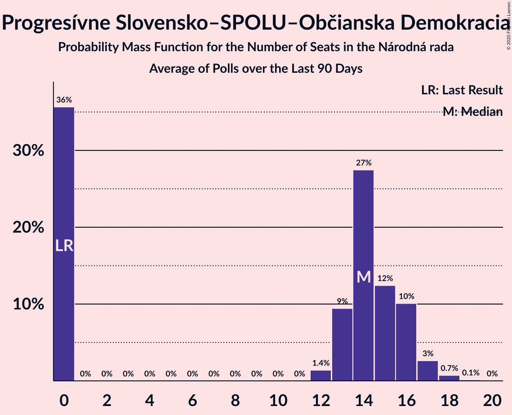

# Poll Average

<a href="#voting-intentions">Voting Intentions</a> | <a href="#seats">Seats</a> | <a href="#coalitions">Coalitions</a> | <a href="#technical-information">Technical Information</a>

## Summary

The table below lists the polls on which the average is based. They are the most recent polls (less than 90 days old) registered and analyzed so far.

| Period     | Polling firm/Commissioner(s) | OĽaNO | Smer–SD | SME RODINA | Kotleba–ĽSNS | PS–SPOLU | SaS | ZĽ | KDH | SMK–MKP | SNS | DV | V | MOST–HÍD | NOVA | PS | SPOLU | HLAS–SD |
|:----------:|:----------------------------:|:--:|:--:|:--:|:--:|:--:|:--:|:--:|:--:|:--:|:--:|:--:|:--:|:--:|:--:|:--:|:--:|:--:|
| 29 February 2020 | General Election | 25.0%   53 | 18.3%   38 | 8.2%   17 | 8.0%   17 | 7.0%   0 | 6.2%   13 | 5.8%   12 | 4.6%   0 | 3.9%   0 | 3.2%   0 | 3.1%   0 | 2.9%   0 | 2.0%   0 | 0.0%   0 | 7.0%   0 | 7.0%   0 | 0.0%   0 |
| N/A | Poll Average | 9–16%   18–32 | 7–12%   13–22 | 4–7%   0–13 | 3–10%   0–19 | N/A   N/A | 11–16%   21–31 | 3–7%   0–13 | 3–6%   0–13 | 2–6%   0–10 | 1–4%   0 | 1–4%   0 | 1–4%   0 | 0–3%   0 | N/A   N/A | 5–8%   0–16 | 0–2%   0 | 20–27%   36–50 |
| [17–24 February 2021](2021-02-24-FOCUS.html) | FOCUS | 9–12%   18–24 | 8–11%   15–22 | 4–7%   0–12 | 5–8%   11–16 | N/A   N/A | 11–15%   22–30 | 4–7%   0–12 | 4–6%   0–13 | 3–5%   0 | 2–4%   0 | 1–3%   0 | 2–4%   0 | 1–3%   0 | N/A   N/A | 5–8%   10–16 | 0–1%   0 | 20–26%   40–53 |
| [8–11 February 2021](2021-02-11-AKO.html) | AKO | 12–16%   21–28 | 7–10%   12–19 | 4–7%   0–12 | 3–5%   0 | N/A   N/A | 13–17%   24–32 | 4–7%   0–12 | 4–6%   0–11 | 1–3%   0 | 2–3%   0 | 1–3%   0 | 1–3%   0 | 0–2%   0 | N/A   N/A | 6–9%   10–16 | 0–1%   0 | 22–28%   41–54 |
| [31 January–8 February 2021](2021-02-08-Polis.html) | Polis   SITA | 10–14%   19–26 | 7–11%   13–20 | 4–7%   0–12 | 6–9%   10–15 | N/A   N/A | 11–15%   19–28 | 4–7%   0–13 | 3–6%   0–10 | 4–7%   0–12 | 1–3%   0 | 3–5%   0–8 | 1–3%   0 | 1–2%   0 | N/A   N/A | 5–8%   8–14 | 1–2%   0 | 19–24%   35–43 |
| [7–13 January 2021](2021-01-13-MedianSK.html) | Median SK   RTVS | 13–17%   24–33 | 7–10%   13–19 | 4–7%   0–13 | 8–11%   14–22 | N/A   N/A | 10–14%   19–26 | 3–6%   0–11 | 3–5%   0–9 | 2–4%   0 | 1–2%   0 | 2–4%   0 | 2–4%   0 | 1–3%   0 | N/A   N/A | 5–8%   10–15 | N/A   N/A | 19–24%   36–48 |
| [6–11 December 2020](2020-12-11-Actly.html) | Actly | 12–16%   22–33 | 9–12%   16–24 | 4–7%   0–12 | 5–8%   0–16 | N/A   N/A | 11–16%   22–31 | 3–6%   0–11 | 4–7%   0–14 | N/A   N/A | N/A   N/A | N/A   N/A | N/A   N/A | N/A   N/A | N/A   N/A | 4–7%   0–14 | N/A   N/A | 19–25%   37–49 |
| 29 February 2020 | General Election | 25.0%   53 | 18.3%   38 | 8.2%   17 | 8.0%   17 | 7.0%   0 | 6.2%   13 | 5.8%   12 | 4.6%   0 | 3.9%   0 | 3.2%   0 | 3.1%   0 | 2.9%   0 | 2.0%   0 | 0.0%   0 | 7.0%   0 | 7.0%   0 | 0.0%   0 |

Only polls for which at least the sample size has been published are included in the table above.

**Legend:**
+ **Top half of each row:** Voting intentions (95% confidence interval)
+ **Bottom half of each row:** Seat projections for the Národná rada (95% confidence interval)
+ **OĽaNO:** OBYČAJNÍ ĽUDIA a nezávislé osobnosti
+ **Smer–SD:** SMER–sociálna demokracia
+ **SME RODINA:** SME RODINA
+ **Kotleba–ĽSNS:** Kotleba–Ľudová strana Naše Slovensko
+ **PS–SPOLU:** Progresívne Slovensko–SPOLU–Občianska Demokracia
+ **SaS:** Sloboda a Solidarita
+ **ZĽ:** Za ľudí
+ **KDH:** Kresťanskodemokratické hnutie
+ **SMK–MKP:** Strana maďarskej koalície–Magyar Koalíció Pártja
+ **SNS:** Slovenská národná strana
+ **DV:** Dobrá voľba
+ **V:** VLASŤ
+ **MOST–HÍD:** MOST–HÍD
+ **NOVA:** NOVA
+ **PS:** Progresívne Slovensko
+ **SPOLU:** SPOLU–Občianska Demokracia
+ **HLAS–SD:** HLAS–sociálna demokracia
+ **N/A (single party):** Party not included the published results
+ **N/A (entire row):** Calculation for this opinion poll not started yet

## Voting Intentions

### Confidence Intervals

| Party | Last Result | Median | 80% Confidence Interval | 90% Confidence Interval | 95% Confidence Interval | 99% Confidence Interval |
|:-----:|:-----------:|:------:|:-----------------------:|:-----------------------:|:-----------------------:|:-----------------------:|
| <a href="#obyčajní-ľudia-a-nezávislé-osobnosti">OBYČAJNÍ ĽUDIA a nezávislé osobnosti</a> | 25.0% | 13.3% | 10.4–15.5% |9.8–16.0% | 9.4–16.4% | 8.7–17.3% |
| <a href="#smer–sociálna-demokracia">SMER–sociálna demokracia</a> | 18.3% | 9.0% | 7.7–10.6% |7.4–11.1% | 7.1–11.5% | 6.5–12.3% |
| <a href="#sme-rodina">SME RODINA</a> | 8.2% | 5.3% | 4.4–6.3% |4.2–6.6% | 4.0–6.8% | 3.6–7.4% |
| <a href="#kotleba–ľudová-strana-naše-slovensko">Kotleba–Ľudová strana Naše Slovensko</a> | 8.0% | 6.6% | 3.9–9.3% |3.5–9.9% | 3.2–10.3% | 2.8–11.1% |
| <a href="#progresívne-slovensko–spolu–občianska-demokracia">Progresívne Slovensko–SPOLU–Občianska Demokracia</a> | 7.0% | N/A | N/A |N/A | N/A | N/A |
| <a href="#progresívne-slovensko">Progresívne Slovensko</a> | 7.0% | 6.5% | 5.3–7.7% |5.0–8.1% | 4.8–8.4% | 4.3–9.1% |
| <a href="#spolu–občianska-demokracia">SPOLU–Občianska Demokracia</a> | 7.0% | 0.9% | 0.5–1.5% |0.4–1.7% | 0.3–1.9% | 0.2–2.2% |
| <a href="#sloboda-a-solidarita">Sloboda a Solidarita</a> | 6.2% | 13.0% | 11.3–15.3% |10.9–16.0% | 10.6–16.5% | 9.9–17.5% |
| <a href="#za-ľudí">Za ľudí</a> | 5.8% | 5.0% | 3.9–6.1% |3.6–6.5% | 3.4–6.7% | 3.0–7.3% |
| <a href="#kresťanskodemokratické-hnutie">Kresťanskodemokratické hnutie</a> | 4.6% | 4.8% | 3.6–5.9% |3.3–6.2% | 3.1–6.5% | 2.7–7.1% |
| <a href="#strana-maďarskej-koalície–magyar-koalíció-pártja">Strana maďarskej koalície–Magyar Koalíció Pártja</a> | 3.9% | 3.4% | 1.9–5.7% |1.7–6.1% | 1.5–6.5% | 1.3–7.0% |
| <a href="#slovenská-národná-strana">Slovenská národná strana</a> | 3.2% | 2.2% | 1.3–3.2% |1.2–3.4% | 1.0–3.7% | 0.8–4.1% |
| <a href="#dobrá-voľba">Dobrá voľba</a> | 3.1% | 2.3% | 1.5–3.8% |1.3–4.2% | 1.2–4.4% | 1.0–4.9% |
| <a href="#vlasť">VLASŤ</a> | 2.9% | 2.4% | 1.7–3.2% |1.5–3.5% | 1.3–3.7% | 1.1–4.2% |
| <a href="#most–híd">MOST–HÍD</a> | 2.0% | 1.4% | 0.7–2.3% |0.6–2.6% | 0.5–2.8% | 0.4–3.2% |
| <a href="#nova">NOVA</a> | 0.0% | N/A | N/A |N/A | N/A | N/A |
| <a href="#hlas–sociálna-demokracia">HLAS–sociálna demokracia</a> | 0.0% | 22.4% | 20.4–25.2% |19.9–26.0% | 19.5–26.7% | 18.7–27.8% |

### OBYČAJNÍ ĽUDIA a nezávislé osobnosti

*For a full overview of the results for this party, see the [OBYČAJNÍ ĽUDIA a nezávislé osobnosti](party-obyčajníľudiaanezávisléosobnosti.html) page.*

| Voting Intentions | Probability | Accumulated | Special Marks |
|:-----------------:|:-----------:|:-----------:|:-------------:|
| 6.5–7.5% | 0% | 100% |  |
| 7.5–8.5% | 0.3% | 100% |  |
| 8.5–9.5% | 3% | 99.7% |  |
| 9.5–10.5% | 8% | 97% |  |
| 10.5–11.5% | 11% | 89% |  |
| 11.5–12.5% | 14% | 78% |  |
| 12.5–13.5% | 19% | 64% | Median |
| 13.5–14.5% | 21% | 45% |  |
| 14.5–15.5% | 15% | 24% |  |
| 15.5–16.5% | 7% | 9% |  |
| 16.5–17.5% | 2% | 2% |  |
| 17.5–18.5% | 0.3% | 0.3% |  |
| 18.5–19.5% | 0% | 0% |  |
| 19.5–20.5% | 0% | 0% |  |
| 20.5–21.5% | 0% | 0% |  |
| 21.5–22.5% | 0% | 0% |  |
| 22.5–23.5% | 0% | 0% |  |
| 23.5–24.5% | 0% | 0% |  |
| 24.5–25.5% | 0% | 0% | Last Result |

### SMER–sociálna demokracia

*For a full overview of the results for this party, see the [SMER–sociálna demokracia](party-smer–sociálnademokracia.html) page.*

| Voting Intentions | Probability | Accumulated | Special Marks |
|:-----------------:|:-----------:|:-----------:|:-------------:|
| 4.5–5.5% | 0% | 100% |  |
| 5.5–6.5% | 0.5% | 100% |  |
| 6.5–7.5% | 7% | 99.5% |  |
| 7.5–8.5% | 26% | 92% |  |
| 8.5–9.5% | 34% | 67% | Median |
| 9.5–10.5% | 22% | 33% |  |
| 10.5–11.5% | 9% | 11% |  |
| 11.5–12.5% | 2% | 2% |  |
| 12.5–13.5% | 0.3% | 0.3% |  |
| 13.5–14.5% | 0% | 0% |  |
| 14.5–15.5% | 0% | 0% |  |
| 15.5–16.5% | 0% | 0% |  |
| 16.5–17.5% | 0% | 0% |  |
| 17.5–18.5% | 0% | 0% | Last Result |

### SME RODINA

*For a full overview of the results for this party, see the [SME RODINA](party-smerodina.html) page.*

| Voting Intentions | Probability | Accumulated | Special Marks |
|:-----------------:|:-----------:|:-----------:|:-------------:|
| 1.5–2.5% | 0% | 100% |  |
| 2.5–3.5% | 0.4% | 100% |  |
| 3.5–4.5% | 15% | 99.6% |  |
| 4.5–5.5% | 50% | 85% | Median |
| 5.5–6.5% | 31% | 36% |  |
| 6.5–7.5% | 5% | 5% |  |
| 7.5–8.5% | 0.3% | 0.3% | Last Result |
| 8.5–9.5% | 0% | 0% |  |

### Kotleba–Ľudová strana Naše Slovensko

*For a full overview of the results for this party, see the [Kotleba–Ľudová strana Naše Slovensko](party-kotleba–ľudovástrananašeslovensko.html) page.*

| Voting Intentions | Probability | Accumulated | Special Marks |
|:-----------------:|:-----------:|:-----------:|:-------------:|
| 0.5–1.5% | 0% | 100% |  |
| 1.5–2.5% | 0.1% | 100% |  |
| 2.5–3.5% | 6% | 99.9% |  |
| 3.5–4.5% | 11% | 94% |  |
| 4.5–5.5% | 8% | 83% |  |
| 5.5–6.5% | 23% | 74% |  |
| 6.5–7.5% | 24% | 52% | Median |
| 7.5–8.5% | 12% | 28% | Last Result |
| 8.5–9.5% | 9% | 17% |  |
| 9.5–10.5% | 6% | 7% |  |
| 10.5–11.5% | 2% | 2% |  |
| 11.5–12.5% | 0.2% | 0.2% |  |
| 12.5–13.5% | 0% | 0% |  |

### Progresívne Slovensko

*For a full overview of the results for this party, see the [Progresívne Slovensko](party-progresívneslovensko.html) page.*

| Voting Intentions | Probability | Accumulated | Special Marks |
|:-----------------:|:-----------:|:-----------:|:-------------:|
| 2.5–3.5% | 0% | 100% |  |
| 3.5–4.5% | 1.2% | 100% |  |
| 4.5–5.5% | 14% | 98.7% |  |
| 5.5–6.5% | 38% | 85% | Median |
| 6.5–7.5% | 33% | 47% | Last Result |
| 7.5–8.5% | 12% | 14% |  |
| 8.5–9.5% | 2% | 2% |  |
| 9.5–10.5% | 0.1% | 0.1% |  |
| 10.5–11.5% | 0% | 0% |  |

### SPOLU–Občianska Demokracia

*For a full overview of the results for this party, see the [SPOLU–Občianska Demokracia](party-spolu–občianskademokracia.html) page.*

| Voting Intentions | Probability | Accumulated | Special Marks |
|:-----------------:|:-----------:|:-----------:|:-------------:|
| 0.0–0.5% | 17% | 100% |  |
| 0.5–1.5% | 74% | 83% | Median |
| 1.5–2.5% | 8% | 8% |  |
| 2.5–3.5% | 0.1% | 0.1% |  |
| 3.5–4.5% | 0% | 0% |  |
| 4.5–5.5% | 0% | 0% |  |
| 5.5–6.5% | 0% | 0% |  |
| 6.5–7.5% | 0% | 0% | Last Result |

### Sloboda a Solidarita

*For a full overview of the results for this party, see the [Sloboda a Solidarita](party-slobodaasolidarita.html) page.*

| Voting Intentions | Probability | Accumulated | Special Marks |
|:-----------------:|:-----------:|:-----------:|:-------------:|
| 5.5–6.5% | 0% | 100% | Last Result |
| 6.5–7.5% | 0% | 100% |  |
| 7.5–8.5% | 0% | 100% |  |
| 8.5–9.5% | 0.2% | 100% |  |
| 9.5–10.5% | 2% | 99.8% |  |
| 10.5–11.5% | 11% | 98% |  |
| 11.5–12.5% | 23% | 87% |  |
| 12.5–13.5% | 26% | 63% | Median |
| 13.5–14.5% | 18% | 37% |  |
| 14.5–15.5% | 11% | 19% |  |
| 15.5–16.5% | 6% | 8% |  |
| 16.5–17.5% | 2% | 2% |  |
| 17.5–18.5% | 0.4% | 0.4% |  |
| 18.5–19.5% | 0% | 0% |  |
| 19.5–20.5% | 0% | 0% |  |

### Za ľudí

*For a full overview of the results for this party, see the [Za ľudí](party-zaľudí.html) page.*

| Voting Intentions | Probability | Accumulated | Special Marks |
|:-----------------:|:-----------:|:-----------:|:-------------:|
| 1.5–2.5% | 0% | 100% |  |
| 2.5–3.5% | 4% | 100% |  |
| 3.5–4.5% | 27% | 96% |  |
| 4.5–5.5% | 42% | 69% | Median |
| 5.5–6.5% | 24% | 28% | Last Result |
| 6.5–7.5% | 4% | 4% |  |
| 7.5–8.5% | 0.2% | 0.2% |  |
| 8.5–9.5% | 0% | 0% |  |

### Kresťanskodemokratické hnutie

*For a full overview of the results for this party, see the [Kresťanskodemokratické hnutie](party-kresťanskodemokratickéhnutie.html) page.*

| Voting Intentions | Probability | Accumulated | Special Marks |
|:-----------------:|:-----------:|:-----------:|:-------------:|
| 0.5–1.5% | 0% | 100% |  |
| 1.5–2.5% | 0.2% | 100% |  |
| 2.5–3.5% | 8% | 99.8% |  |
| 3.5–4.5% | 32% | 92% |  |
| 4.5–5.5% | 41% | 60% | Last Result, Median |
| 5.5–6.5% | 16% | 19% |  |
| 6.5–7.5% | 2% | 2% |  |
| 7.5–8.5% | 0.1% | 0.1% |  |
| 8.5–9.5% | 0% | 0% |  |

### Strana maďarskej koalície–Magyar Koalíció Pártja

*For a full overview of the results for this party, see the [Strana maďarskej koalície–Magyar Koalíció Pártja](party-stranamaďarskejkoalície–magyarkoalíciópártja.html) page.*

| Voting Intentions | Probability | Accumulated | Special Marks |
|:-----------------:|:-----------:|:-----------:|:-------------:|
| 0.0–0.5% | 0% | 100% |  |
| 0.5–1.5% | 3% | 100% |  |
| 1.5–2.5% | 22% | 97% |  |
| 2.5–3.5% | 31% | 75% | Median |
| 3.5–4.5% | 19% | 45% | Last Result |
| 4.5–5.5% | 13% | 25% |  |
| 5.5–6.5% | 10% | 12% |  |
| 6.5–7.5% | 2% | 2% |  |
| 7.5–8.5% | 0.1% | 0.1% |  |
| 8.5–9.5% | 0% | 0% |  |

### Slovenská národná strana

*For a full overview of the results for this party, see the [Slovenská národná strana](party-slovenskánárodnástrana.html) page.*

| Voting Intentions | Probability | Accumulated | Special Marks |
|:-----------------:|:-----------:|:-----------:|:-------------:|
| 0.0–0.5% | 0% | 100% |  |
| 0.5–1.5% | 18% | 100% |  |
| 1.5–2.5% | 50% | 82% | Median |
| 2.5–3.5% | 29% | 32% | Last Result |
| 3.5–4.5% | 4% | 4% |  |
| 4.5–5.5% | 0.1% | 0.1% |  |
| 5.5–6.5% | 0% | 0% |  |

### Dobrá voľba

*For a full overview of the results for this party, see the [Dobrá voľba](party-dobrávoľba.html) page.*

| Voting Intentions | Probability | Accumulated | Special Marks |
|:-----------------:|:-----------:|:-----------:|:-------------:|
| 0.0–0.5% | 0% | 100% |  |
| 0.5–1.5% | 14% | 100% |  |
| 1.5–2.5% | 43% | 86% | Median |
| 2.5–3.5% | 26% | 43% | Last Result |
| 3.5–4.5% | 14% | 16% |  |
| 4.5–5.5% | 2% | 2% |  |
| 5.5–6.5% | 0% | 0% |  |
| 6.5–7.5% | 0% | 0% |  |

### VLASŤ

*For a full overview of the results for this party, see the [VLASŤ](party-vlasť.html) page.*

| Voting Intentions | Probability | Accumulated | Special Marks |
|:-----------------:|:-----------:|:-----------:|:-------------:|
| 0.0–0.5% | 0% | 100% |  |
| 0.5–1.5% | 7% | 100% |  |
| 1.5–2.5% | 55% | 93% | Median |
| 2.5–3.5% | 35% | 39% | Last Result |
| 3.5–4.5% | 4% | 4% |  |
| 4.5–5.5% | 0.1% | 0.1% |  |
| 5.5–6.5% | 0% | 0% |  |

### MOST–HÍD

*For a full overview of the results for this party, see the [MOST–HÍD](party-most–híd.html) page.*

| Voting Intentions | Probability | Accumulated | Special Marks |
|:-----------------:|:-----------:|:-----------:|:-------------:|
| 0.0–0.5% | 3% | 100% |  |
| 0.5–1.5% | 56% | 97% | Median |
| 1.5–2.5% | 36% | 41% | Last Result |
| 2.5–3.5% | 5% | 5% |  |
| 3.5–4.5% | 0.1% | 0.1% |  |
| 4.5–5.5% | 0% | 0% |  |

### HLAS–sociálna demokracia

*For a full overview of the results for this party, see the [HLAS–sociálna demokracia](party-hlas–sociálnademokracia.html) page.*

| Voting Intentions | Probability | Accumulated | Special Marks |
|:-----------------:|:-----------:|:-----------:|:-------------:|
| 0.0–0.5% | 0% | 100% | Last Result |
| 0.5–1.5% | 0% | 100% |  |
| 1.5–2.5% | 0% | 100% |  |
| 2.5–3.5% | 0% | 100% |  |
| 3.5–4.5% | 0% | 100% |  |
| 4.5–5.5% | 0% | 100% |  |
| 5.5–6.5% | 0% | 100% |  |
| 6.5–7.5% | 0% | 100% |  |
| 7.5–8.5% | 0% | 100% |  |
| 8.5–9.5% | 0% | 100% |  |
| 9.5–10.5% | 0% | 100% |  |
| 10.5–11.5% | 0% | 100% |  |
| 11.5–12.5% | 0% | 100% |  |
| 12.5–13.5% | 0% | 100% |  |
| 13.5–14.5% | 0% | 100% |  |
| 14.5–15.5% | 0% | 100% |  |
| 15.5–16.5% | 0% | 100% |  |
| 16.5–17.5% | 0% | 100% |  |
| 17.5–18.5% | 0.3% | 100% |  |
| 18.5–19.5% | 2% | 99.7% |  |
| 19.5–20.5% | 9% | 97% |  |
| 20.5–21.5% | 18% | 89% |  |
| 21.5–22.5% | 23% | 70% | Median |
| 22.5–23.5% | 18% | 48% |  |
| 23.5–24.5% | 13% | 29% |  |
| 24.5–25.5% | 8% | 16% |  |
| 25.5–26.5% | 5% | 8% |  |
| 26.5–27.5% | 2% | 3% |  |
| 27.5–28.5% | 0.6% | 0.7% |  |
| 28.5–29.5% | 0.1% | 0.1% |  |
| 29.5–30.5% | 0% | 0% |  |

## Seats

### Confidence Intervals

| Party | Last Result | Median | 80% Confidence Interval | 90% Confidence Interval | 95% Confidence Interval | 99% Confidence Interval |
|:-----:|:-----------:|:------:|:-----------------------:|:-----------------------:|:-----------------------:|:-----------------------:|
| <a href="#obyčajní-ľudia-a-nezávislé-osobnosti">OBYČAJNÍ ĽUDIA a nezávislé osobnosti</a> | 53 | 23 | 19–29 |19–31 | 18–32 | 18–34 |
| <a href="#smer–sociálna-demokracia">SMER–sociálna demokracia</a> | 38 | 17 | 15–20 |14–22 | 13–22 | 11–24 |
| <a href="#sme-rodina">SME RODINA</a> | 17 | 10 | 0–12 |0–12 | 0–13 | 0–13 |
| <a href="#kotleba–ľudová-strana-naše-slovensko">Kotleba–Ľudová strana Naše Slovensko</a> | 17 | 13 | 0–19 |0–19 | 0–19 | 0–22 |
| <a href="#progresívne-slovensko–spolu–občianska-demokracia">Progresívne Slovensko–SPOLU–Občianska Demokracia</a> | 0 | N/A | N/A |N/A | N/A | N/A |
| <a href="#progresívne-slovensko">Progresívne Slovensko</a> | 0 | 13 | 10–15 |9–16 | 0–16 | 0–17 |
| <a href="#spolu–občianska-demokracia">SPOLU–Občianska Demokracia</a> | 0 | 0 | 0 |0 | 0 | 0 |
| <a href="#sloboda-a-solidarita">Sloboda a Solidarita</a> | 13 | 25 | 22–28 |21–30 | 21–31 | 18–33 |
| <a href="#za-ľudí">Za ľudí</a> | 12 | 0 | 0–12 |0–13 | 0–13 | 0–13 |
| <a href="#kresťanskodemokratické-hnutie">Kresťanskodemokratické hnutie</a> | 0 | 9 | 0–12 |0–12 | 0–13 | 0–14 |
| <a href="#strana-maďarskej-koalície–magyar-koalíció-pártja">Strana maďarskej koalície–Magyar Koalíció Pártja</a> | 0 | 0 | 0–10 |0–10 | 0–10 | 0–12 |
| <a href="#slovenská-národná-strana">Slovenská národná strana</a> | 0 | 0 | 0 |0 | 0 | 0 |
| <a href="#dobrá-voľba">Dobrá voľba</a> | 0 | 0 | 0 |0 | 0 | 0–10 |
| <a href="#vlasť">VLASŤ</a> | 0 | 0 | 0 |0 | 0 | 0 |
| <a href="#most–híd">MOST–HÍD</a> | 0 | 0 | 0 |0 | 0 | 0 |
| <a href="#nova">NOVA</a> | 0 | N/A | N/A |N/A | N/A | N/A |
| <a href="#hlas–sociálna-demokracia">HLAS–sociálna demokracia</a> | 0 | 43 | 38–48 |37–48 | 36–50 | 34–54 |

### OBYČAJNÍ ĽUDIA a nezávislé osobnosti

*For a full overview of the results for this party, see the [OBYČAJNÍ ĽUDIA a nezávislé osobnosti](party-obyčajníľudiaanezávisléosobnosti.html) page.*

| Number of Seats | Probability | Accumulated | Special Marks |
|:---------------:|:-----------:|:-----------:|:-------------:|
| 16 | 0% | 100% |  |
| 17 | 0.3% | 99.9% |  |
| 18 | 2% | 99.6% |  |
| 19 | 8% | 97% |  |
| 20 | 0.6% | 89% |  |
| 21 | 12% | 88% |  |
| 22 | 24% | 76% |  |
| 23 | 3% | 52% | Median |
| 24 | 5% | 50% |  |
| 25 | 6% | 45% |  |
| 26 | 3% | 39% |  |
| 27 | 5% | 36% |  |
| 28 | 7% | 31% |  |
| 29 | 16% | 24% |  |
| 30 | 2% | 8% |  |
| 31 | 2% | 5% |  |
| 32 | 3% | 4% |  |
| 33 | 0.5% | 1.2% |  |
| 34 | 0.3% | 0.7% |  |
| 35 | 0.2% | 0.4% |  |
| 36 | 0.1% | 0.2% |  |
| 37 | 0.1% | 0.1% |  |
| 38 | 0% | 0% |  |
| 39 | 0% | 0% |  |
| 40 | 0% | 0% |  |
| 41 | 0% | 0% |  |
| 42 | 0% | 0% |  |
| 43 | 0% | 0% |  |
| 44 | 0% | 0% |  |
| 45 | 0% | 0% |  |
| 46 | 0% | 0% |  |
| 47 | 0% | 0% |  |
| 48 | 0% | 0% |  |
| 49 | 0% | 0% |  |
| 50 | 0% | 0% |  |
| 51 | 0% | 0% |  |
| 52 | 0% | 0% |  |
| 53 | 0% | 0% | Last Result |

### SMER–sociálna demokracia

*For a full overview of the results for this party, see the [SMER–sociálna demokracia](party-smer–sociálnademokracia.html) page.*

| Number of Seats | Probability | Accumulated | Special Marks |
|:---------------:|:-----------:|:-----------:|:-------------:|
| 11 | 0.6% | 100% |  |
| 12 | 1.3% | 99.4% |  |
| 13 | 0.8% | 98% |  |
| 14 | 4% | 97% |  |
| 15 | 5% | 93% |  |
| 16 | 29% | 88% |  |
| 17 | 13% | 59% | Median |
| 18 | 15% | 46% |  |
| 19 | 9% | 31% |  |
| 20 | 13% | 22% |  |
| 21 | 2% | 9% |  |
| 22 | 4% | 6% |  |
| 23 | 1.2% | 2% |  |
| 24 | 0.5% | 1.0% |  |
| 25 | 0.3% | 0.5% |  |
| 26 | 0.1% | 0.2% |  |
| 27 | 0% | 0.1% |  |
| 28 | 0% | 0% |  |
| 29 | 0% | 0% |  |
| 30 | 0% | 0% |  |
| 31 | 0% | 0% |  |
| 32 | 0% | 0% |  |
| 33 | 0% | 0% |  |
| 34 | 0% | 0% |  |
| 35 | 0% | 0% |  |
| 36 | 0% | 0% |  |
| 37 | 0% | 0% |  |
| 38 | 0% | 0% | Last Result |

### SME RODINA

*For a full overview of the results for this party, see the [SME RODINA](party-smerodina.html) page.*

| Number of Seats | Probability | Accumulated | Special Marks |
|:---------------:|:-----------:|:-----------:|:-------------:|
| 0 | 42% | 100% |  |
| 1 | 0% | 58% |  |
| 2 | 0% | 58% |  |
| 3 | 0% | 58% |  |
| 4 | 0% | 58% |  |
| 5 | 0% | 58% |  |
| 6 | 0% | 58% |  |
| 7 | 0% | 58% |  |
| 8 | 0% | 58% |  |
| 9 | 3% | 58% |  |
| 10 | 18% | 55% | Median |
| 11 | 22% | 37% |  |
| 12 | 13% | 16% |  |
| 13 | 2% | 3% |  |
| 14 | 0.3% | 0.4% |  |
| 15 | 0.1% | 0.1% |  |
| 16 | 0% | 0% |  |
| 17 | 0% | 0% | Last Result |

### Kotleba–Ľudová strana Naše Slovensko

*For a full overview of the results for this party, see the [Kotleba–Ľudová strana Naše Slovensko](party-kotleba–ľudovástrananašeslovensko.html) page.*

| Number of Seats | Probability | Accumulated | Special Marks |
|:---------------:|:-----------:|:-----------:|:-------------:|
| 0 | 21% | 100% |  |
| 1 | 0% | 79% |  |
| 2 | 0% | 79% |  |
| 3 | 0% | 79% |  |
| 4 | 0% | 79% |  |
| 5 | 0% | 79% |  |
| 6 | 0% | 79% |  |
| 7 | 0% | 79% |  |
| 8 | 0% | 79% |  |
| 9 | 0.4% | 79% |  |
| 10 | 3% | 78% |  |
| 11 | 7% | 75% |  |
| 12 | 5% | 68% |  |
| 13 | 28% | 62% | Median |
| 14 | 6% | 35% |  |
| 15 | 9% | 29% |  |
| 16 | 2% | 20% |  |
| 17 | 1.2% | 17% | Last Result |
| 18 | 3% | 16% |  |
| 19 | 12% | 14% |  |
| 20 | 0.3% | 1.1% |  |
| 21 | 0.1% | 0.8% |  |
| 22 | 0.3% | 0.7% |  |
| 23 | 0% | 0.5% |  |
| 24 | 0.4% | 0.4% |  |
| 25 | 0% | 0% |  |

### Progresívne Slovensko–SPOLU–Občianska Demokracia

*For a full overview of the results for this party, see the [Progresívne Slovensko–SPOLU–Občianska Demokracia](party-progresívneslovensko–spolu–občianskademokracia.html) page.*

### Progresívne Slovensko

*For a full overview of the results for this party, see the [Progresívne Slovensko](party-progresívneslovensko.html) page.*

| Number of Seats | Probability | Accumulated | Special Marks |
|:---------------:|:-----------:|:-----------:|:-------------:|
| 0 | 5% | 100% | Last Result |
| 1 | 0% | 95% |  |
| 2 | 0% | 95% |  |
| 3 | 0% | 95% |  |
| 4 | 0% | 95% |  |
| 5 | 0% | 95% |  |
| 6 | 0% | 95% |  |
| 7 | 0% | 95% |  |
| 8 | 0% | 95% |  |
| 9 | 2% | 95% |  |
| 10 | 9% | 93% |  |
| 11 | 8% | 85% |  |
| 12 | 10% | 76% |  |
| 13 | 29% | 66% | Median |
| 14 | 23% | 38% |  |
| 15 | 7% | 14% |  |
| 16 | 7% | 8% |  |
| 17 | 0.6% | 0.7% |  |
| 18 | 0.1% | 0.2% |  |
| 19 | 0% | 0% |  |

### SPOLU–Občianska Demokracia

*For a full overview of the results for this party, see the [SPOLU–Občianska Demokracia](party-spolu–občianskademokracia.html) page.*

| Number of Seats | Probability | Accumulated | Special Marks |
|:---------------:|:-----------:|:-----------:|:-------------:|
| 0 | 100% | 100% | Last Result, Median |

### Sloboda a Solidarita

*For a full overview of the results for this party, see the [Sloboda a Solidarita](party-slobodaasolidarita.html) page.*

| Number of Seats | Probability | Accumulated | Special Marks |
|:---------------:|:-----------:|:-----------:|:-------------:|
| 13 | 0% | 100% | Last Result |
| 14 | 0% | 100% |  |
| 15 | 0% | 100% |  |
| 16 | 0% | 100% |  |
| 17 | 0.1% | 100% |  |
| 18 | 0.6% | 99.9% |  |
| 19 | 0.6% | 99.4% |  |
| 20 | 1.1% | 98.7% |  |
| 21 | 4% | 98% |  |
| 22 | 12% | 93% |  |
| 23 | 19% | 81% |  |
| 24 | 8% | 63% |  |
| 25 | 14% | 55% | Median |
| 26 | 4% | 41% |  |
| 27 | 10% | 37% |  |
| 28 | 20% | 27% |  |
| 29 | 2% | 7% |  |
| 30 | 2% | 5% |  |
| 31 | 2% | 3% |  |
| 32 | 0.6% | 1.1% |  |
| 33 | 0.4% | 0.5% |  |
| 34 | 0.1% | 0.1% |  |
| 35 | 0% | 0.1% |  |
| 36 | 0% | 0% |  |

### Za ľudí

*For a full overview of the results for this party, see the [Za ľudí](party-zaľudí.html) page.*

| Number of Seats | Probability | Accumulated | Special Marks |
|:---------------:|:-----------:|:-----------:|:-------------:|
| 0 | 71% | 100% | Median |
| 1 | 0% | 29% |  |
| 2 | 0% | 29% |  |
| 3 | 0% | 29% |  |
| 4 | 0% | 29% |  |
| 5 | 0% | 29% |  |
| 6 | 0% | 29% |  |
| 7 | 0% | 29% |  |
| 8 | 0% | 29% |  |
| 9 | 2% | 29% |  |
| 10 | 5% | 27% |  |
| 11 | 8% | 22% |  |
| 12 | 6% | 14% | Last Result |
| 13 | 8% | 8% |  |
| 14 | 0.1% | 0.1% |  |
| 15 | 0% | 0.1% |  |
| 16 | 0% | 0% |  |

### Kresťanskodemokratické hnutie

*For a full overview of the results for this party, see the [Kresťanskodemokratické hnutie](party-kresťanskodemokratickéhnutie.html) page.*

| Number of Seats | Probability | Accumulated | Special Marks |
|:---------------:|:-----------:|:-----------:|:-------------:|
| 0 | 49% | 100% | Last Result |
| 1 | 0% | 51% |  |
| 2 | 0% | 51% |  |
| 3 | 0% | 51% |  |
| 4 | 0% | 51% |  |
| 5 | 0% | 51% |  |
| 6 | 0% | 51% |  |
| 7 | 0% | 51% |  |
| 8 | 0% | 51% |  |
| 9 | 6% | 51% | Median |
| 10 | 17% | 45% |  |
| 11 | 15% | 28% |  |
| 12 | 10% | 13% |  |
| 13 | 2% | 3% |  |
| 14 | 0.8% | 0.9% |  |
| 15 | 0.1% | 0.1% |  |
| 16 | 0% | 0% |  |

### Strana maďarskej koalície–Magyar Koalíció Pártja

*For a full overview of the results for this party, see the [Strana maďarskej koalície–Magyar Koalíció Pártja](party-stranamaďarskejkoalície–magyarkoalíciópártja.html) page.*

| Number of Seats | Probability | Accumulated | Special Marks |
|:---------------:|:-----------:|:-----------:|:-------------:|
| 0 | 85% | 100% | Last Result, Median |
| 1 | 0% | 15% |  |
| 2 | 0% | 15% |  |
| 3 | 0% | 15% |  |
| 4 | 0% | 15% |  |
| 5 | 0% | 15% |  |
| 6 | 0% | 15% |  |
| 7 | 0% | 15% |  |
| 8 | 0% | 15% |  |
| 9 | 2% | 15% |  |
| 10 | 11% | 13% |  |
| 11 | 2% | 2% |  |
| 12 | 0.5% | 0.8% |  |
| 13 | 0.3% | 0.3% |  |
| 14 | 0% | 0.1% |  |
| 15 | 0% | 0% |  |

### Slovenská národná strana

*For a full overview of the results for this party, see the [Slovenská národná strana](party-slovenskánárodnástrana.html) page.*

| Number of Seats | Probability | Accumulated | Special Marks |
|:---------------:|:-----------:|:-----------:|:-------------:|
| 0 | 100% | 100% | Last Result, Median |

### Dobrá voľba

*For a full overview of the results for this party, see the [Dobrá voľba](party-dobrávoľba.html) page.*

| Number of Seats | Probability | Accumulated | Special Marks |
|:---------------:|:-----------:|:-----------:|:-------------:|
| 0 | 99.4% | 100% | Last Result, Median |
| 1 | 0% | 0.6% |  |
| 2 | 0% | 0.6% |  |
| 3 | 0% | 0.6% |  |
| 4 | 0% | 0.6% |  |
| 5 | 0% | 0.6% |  |
| 6 | 0% | 0.6% |  |
| 7 | 0% | 0.6% |  |
| 8 | 0% | 0.6% |  |
| 9 | 0.1% | 0.6% |  |
| 10 | 0.5% | 0.5% |  |
| 11 | 0.1% | 0.1% |  |
| 12 | 0% | 0% |  |

### VLASŤ

*For a full overview of the results for this party, see the [VLASŤ](party-vlasť.html) page.*

| Number of Seats | Probability | Accumulated | Special Marks |
|:---------------:|:-----------:|:-----------:|:-------------:|
| 0 | 100% | 100% | Last Result, Median |

### MOST–HÍD

*For a full overview of the results for this party, see the [MOST–HÍD](party-most–híd.html) page.*

| Number of Seats | Probability | Accumulated | Special Marks |
|:---------------:|:-----------:|:-----------:|:-------------:|
| 0 | 100% | 100% | Last Result, Median |

### NOVA

*For a full overview of the results for this party, see the [NOVA](party-nova.html) page.*

### HLAS–sociálna demokracia

*For a full overview of the results for this party, see the [HLAS–sociálna demokracia](party-hlas–sociálnademokracia.html) page.*

| Number of Seats | Probability | Accumulated | Special Marks |
|:---------------:|:-----------:|:-----------:|:-------------:|
| 0 | 0% | 100% | Last Result |
| 1 | 0% | 100% |  |
| 2 | 0% | 100% |  |
| 3 | 0% | 100% |  |
| 4 | 0% | 100% |  |
| 5 | 0% | 100% |  |
| 6 | 0% | 100% |  |
| 7 | 0% | 100% |  |
| 8 | 0% | 100% |  |
| 9 | 0% | 100% |  |
| 10 | 0% | 100% |  |
| 11 | 0% | 100% |  |
| 12 | 0% | 100% |  |
| 13 | 0% | 100% |  |
| 14 | 0% | 100% |  |
| 15 | 0% | 100% |  |
| 16 | 0% | 100% |  |
| 17 | 0% | 100% |  |
| 18 | 0% | 100% |  |
| 19 | 0% | 100% |  |
| 20 | 0% | 100% |  |
| 21 | 0% | 100% |  |
| 22 | 0% | 100% |  |
| 23 | 0% | 100% |  |
| 24 | 0% | 100% |  |
| 25 | 0% | 100% |  |
| 26 | 0% | 100% |  |
| 27 | 0% | 100% |  |
| 28 | 0% | 100% |  |
| 29 | 0% | 100% |  |
| 30 | 0% | 100% |  |
| 31 | 0% | 100% |  |
| 32 | 0.2% | 99.9% |  |
| 33 | 0.2% | 99.8% |  |
| 34 | 0.2% | 99.6% |  |
| 35 | 0.8% | 99.4% |  |
| 36 | 3% | 98.6% |  |
| 37 | 2% | 96% |  |
| 38 | 14% | 94% |  |
| 39 | 2% | 80% |  |
| 40 | 12% | 78% |  |
| 41 | 5% | 65% |  |
| 42 | 9% | 60% |  |
| 43 | 7% | 51% | Median |
| 44 | 11% | 44% |  |
| 45 | 2% | 33% |  |
| 46 | 4% | 31% |  |
| 47 | 12% | 27% |  |
| 48 | 12% | 15% |  |
| 49 | 0.5% | 3% |  |
| 50 | 0.4% | 3% |  |
| 51 | 0.4% | 2% |  |
| 52 | 0.2% | 2% |  |
| 53 | 0.6% | 2% |  |
| 54 | 0.9% | 1.1% |  |
| 55 | 0% | 0.2% |  |
| 56 | 0% | 0.2% |  |
| 57 | 0.1% | 0.1% |  |
| 58 | 0% | 0% |  |

## Coalitions

### Confidence Intervals

| Coalition | Last Result | Median | Majority? | 80% Confidence Interval | 90% Confidence Interval | 95% Confidence Interval | 99% Confidence Interval |
|:---------:|:-----------:|:------:|:---------:|:-----------------------:|:-----------------------:|:-----------------------:|:-----------------------:|
| SMER–sociálna demokracia – SME RODINA – Kotleba–Ľudová strana Naše Slovensko – Slovenská národná strana – HLAS–sociálna demokracia | 72 | 78 | 64% | 70–85 | 69–88 | 65–90 | 61–92 |
| OBYČAJNÍ ĽUDIA a nezávislé osobnosti – SME RODINA – Progresívne Slovensko–SPOLU–Občianska Demokracia – Sloboda a Solidarita – Za ľudí – Kresťanskodemokratické hnutie – Strana maďarskej koalície–Magyar Koalíció Pártja – MOST–HÍD | 95 | 64 | 9% | 59–74 | 56–77 | 55–78 | 49–83 |
| OBYČAJNÍ ĽUDIA a nezávislé osobnosti – SME RODINA – Progresívne Slovensko–SPOLU–Občianska Demokracia – Sloboda a Solidarita – Za ľudí – Kresťanskodemokratické hnutie – Strana maďarskej koalície–Magyar Koalíció Pártja | 95 | 64 | 9% | 59–74 | 56–77 | 55–78 | 49–83 |
| SMER–sociálna demokracia – SME RODINA – HLAS–sociálna demokracia | 55 | 65 | 13% | 58–77 | 58–77 | 58–77 | 53–79 |
| SMER–sociálna demokracia – SME RODINA – Slovenská národná strana – HLAS–sociálna demokracia | 55 | 65 | 13% | 58–77 | 58–77 | 58–77 | 53–79 |
| OBYČAJNÍ ĽUDIA a nezávislé osobnosti – SME RODINA – Progresívne Slovensko–SPOLU–Občianska Demokracia – Sloboda a Solidarita – Za ľudí – Kresťanskodemokratické hnutie – MOST–HÍD | 95 | 63 | 8% | 55–74 | 54–77 | 54–77 | 49–83 |
| OBYČAJNÍ ĽUDIA a nezávislé osobnosti – SME RODINA – Progresívne Slovensko–SPOLU–Občianska Demokracia – Sloboda a Solidarita – Za ľudí – Kresťanskodemokratické hnutie | 95 | 63 | 8% | 55–74 | 54–77 | 54–77 | 49–83 |
| SME RODINA – Kotleba–Ľudová strana Naše Slovensko – Slovenská národná strana – HLAS–sociálna demokracia | 34 | 60 | 0.3% | 53–68 | 51–70 | 48–73 | 44–75 |
| OBYČAJNÍ ĽUDIA a nezávislé osobnosti – Progresívne Slovensko–SPOLU–Občianska Demokracia – Sloboda a Solidarita – Za ľudí – Kresťanskodemokratické hnutie – Strana maďarskej koalície–Magyar Koalíció Pártja – MOST–HÍD | 78 | 60 | 0.5% | 51–67 | 50–71 | 47–73 | 46–75 |
| OBYČAJNÍ ĽUDIA a nezávislé osobnosti – Progresívne Slovensko–SPOLU–Občianska Demokracia – Sloboda a Solidarita – Za ľudí – Kresťanskodemokratické hnutie – MOST–HÍD | 78 | 59 | 0.4% | 51–67 | 50–69 | 47–73 | 45–74 |
| OBYČAJNÍ ĽUDIA a nezávislé osobnosti – Progresívne Slovensko–SPOLU–Občianska Demokracia – Sloboda a Solidarita – Za ľudí – Kresťanskodemokratické hnutie – Strana maďarskej koalície–Magyar Koalíció Pártja | 78 | 60 | 0.5% | 51–67 | 50–71 | 47–73 | 46–75 |
| OBYČAJNÍ ĽUDIA a nezávislé osobnosti – Progresívne Slovensko–SPOLU–Občianska Demokracia – Sloboda a Solidarita – Za ľudí – Kresťanskodemokratické hnutie | 78 | 59 | 0.4% | 51–67 | 50–69 | 47–73 | 45–74 |
| SMER–sociálna demokracia – Slovenská národná strana – MOST–HÍD – HLAS–sociálna demokracia | 38 | 60 | 0.2% | 54–65 | 54–67 | 52–70 | 48–73 |
| SMER–sociálna demokracia – Slovenská národná strana – HLAS–sociálna demokracia | 38 | 60 | 0.2% | 54–65 | 54–67 | 52–70 | 48–73 |
| OBYČAJNÍ ĽUDIA a nezávislé osobnosti – Progresívne Slovensko–SPOLU–Občianska Demokracia – Sloboda a Solidarita – Za ľudí | 78 | 52 | 0% | 44–63 | 42–66 | 42–67 | 42–70 |
| SME RODINA – HLAS–sociálna demokracia | 17 | 49 | 0% | 40–59 | 40–60 | 40–60 | 37–60 |
| SME RODINA – Slovenská národná strana – HLAS–sociálna demokracia | 17 | 49 | 0% | 40–59 | 40–60 | 40–60 | 37–60 |
| Slovenská národná strana – MOST–HÍD – HLAS–sociálna demokracia | 0 | 43 | 0% | 38–48 | 37–48 | 36–50 | 34–54 |
| Slovenská národná strana – HLAS–sociálna demokracia | 0 | 43 | 0% | 38–48 | 37–48 | 36–50 | 34–54 |
| Progresívne Slovensko–SPOLU–Občianska Demokracia – Sloboda a Solidarita – Za ľudí – Kresťanskodemokratické hnutie | 25 | 36 | 0% | 23–41 | 23–45 | 21–47 | 19–50 |
| SMER–sociálna demokracia – SME RODINA – Kotleba–Ľudová strana Naše Slovensko – Slovenská národná strana | 72 | 33 | 0% | 26–46 | 24–46 | 18–46 | 16–48 |
| Progresívne Slovensko–SPOLU–Občianska Demokracia – Sloboda a Solidarita – Za ľudí | 25 | 26 | 0% | 22–41 | 22–41 | 21–41 | 19–43 |
| SMER–sociálna demokracia – SME RODINA | 55 | 25 | 0% | 16–30 | 16–32 | 16–32 | 14–34 |
| SMER–sociálna demokracia – SME RODINA – Slovenská národná strana | 55 | 25 | 0% | 16–30 | 16–32 | 16–32 | 14–34 |
| SMER–sociálna demokracia – Slovenská národná strana – MOST–HÍD | 38 | 17 | 0% | 15–20 | 14–22 | 13–22 | 11–24 |
| SMER–sociálna demokracia | 38 | 17 | 0% | 15–20 | 14–22 | 13–22 | 11–24 |
| SMER–sociálna demokracia – Slovenská národná strana | 38 | 17 | 0% | 15–20 | 14–22 | 13–22 | 11–24 |

### SMER–sociálna demokracia – SME RODINA – Kotleba–Ľudová strana Naše Slovensko – Slovenská národná strana – HLAS–sociálna demokracia

| Number of Seats | Probability | Accumulated | Special Marks |
|:---------------:|:-----------:|:-----------:|:-------------:|
| 58 | 0.1% | 100% |  |
| 59 | 0% | 99.9% |  |
| 60 | 0.1% | 99.9% |  |
| 61 | 0.8% | 99.8% |  |
| 62 | 0.4% | 99.0% |  |
| 63 | 0.1% | 98.5% |  |
| 64 | 0.3% | 98% |  |
| 65 | 1.1% | 98% |  |
| 66 | 0.1% | 97% |  |
| 67 | 0.6% | 97% |  |
| 68 | 0.5% | 96% |  |
| 69 | 5% | 96% |  |
| 70 | 2% | 91% |  |
| 71 | 1.1% | 89% |  |
| 72 | 3% | 88% | Last Result |
| 73 | 19% | 85% |  |
| 74 | 2% | 67% |  |
| 75 | 1.1% | 65% |  |
| 76 | 2% | 64% | Majority |
| 77 | 11% | 62% |  |
| 78 | 9% | 51% |  |
| 79 | 2% | 41% |  |
| 80 | 2% | 39% |  |
| 81 | 1.2% | 37% |  |
| 82 | 4% | 36% |  |
| 83 | 6% | 31% | Median |
| 84 | 13% | 25% |  |
| 85 | 2% | 12% |  |
| 86 | 3% | 10% |  |
| 87 | 2% | 7% |  |
| 88 | 0.4% | 5% |  |
| 89 | 2% | 5% |  |
| 90 | 1.1% | 3% |  |
| 91 | 0.7% | 2% |  |
| 92 | 1.1% | 1.4% |  |
| 93 | 0.1% | 0.3% |  |
| 94 | 0.1% | 0.2% |  |
| 95 | 0% | 0.1% |  |
| 96 | 0% | 0.1% |  |
| 97 | 0% | 0.1% |  |
| 98 | 0% | 0.1% |  |
| 99 | 0% | 0% |  |

### OBYČAJNÍ ĽUDIA a nezávislé osobnosti – SME RODINA – Progresívne Slovensko–SPOLU–Občianska Demokracia – Sloboda a Solidarita – Za ľudí – Kresťanskodemokratické hnutie – Strana maďarskej koalície–Magyar Koalíció Pártja – MOST–HÍD

| Number of Seats | Probability | Accumulated | Special Marks |
|:---------------:|:-----------:|:-----------:|:-------------:|
| 47 | 0% | 100% |  |
| 48 | 0% | 99.9% |  |
| 49 | 0.6% | 99.9% |  |
| 50 | 0.1% | 99.4% |  |
| 51 | 0% | 99.3% |  |
| 52 | 0.1% | 99.3% |  |
| 53 | 0.5% | 99.2% |  |
| 54 | 0.3% | 98.7% |  |
| 55 | 1.2% | 98% |  |
| 56 | 2% | 97% |  |
| 57 | 0.4% | 95% |  |
| 58 | 0.8% | 94% |  |
| 59 | 9% | 94% |  |
| 60 | 0.8% | 85% |  |
| 61 | 5% | 84% |  |
| 62 | 3% | 79% |  |
| 63 | 22% | 77% |  |
| 64 | 10% | 55% |  |
| 65 | 4% | 45% |  |
| 66 | 3% | 41% |  |
| 67 | 1.4% | 37% | Median |
| 68 | 2% | 36% |  |
| 69 | 3% | 34% |  |
| 70 | 3% | 31% |  |
| 71 | 3% | 29% |  |
| 72 | 12% | 26% |  |
| 73 | 3% | 14% |  |
| 74 | 2% | 12% |  |
| 75 | 0.6% | 9% |  |
| 76 | 2% | 9% | Majority |
| 77 | 4% | 7% |  |
| 78 | 0.7% | 3% |  |
| 79 | 0.2% | 2% |  |
| 80 | 0.3% | 2% |  |
| 81 | 0.2% | 1.3% |  |
| 82 | 0.3% | 1.1% |  |
| 83 | 0.6% | 0.8% |  |
| 84 | 0% | 0.3% |  |
| 85 | 0% | 0.2% |  |
| 86 | 0.2% | 0.2% |  |
| 87 | 0% | 0% |  |
| 88 | 0% | 0% |  |
| 89 | 0% | 0% |  |
| 90 | 0% | 0% |  |
| 91 | 0% | 0% |  |
| 92 | 0% | 0% |  |
| 93 | 0% | 0% |  |
| 94 | 0% | 0% |  |
| 95 | 0% | 0% | Last Result |

### OBYČAJNÍ ĽUDIA a nezávislé osobnosti – SME RODINA – Progresívne Slovensko–SPOLU–Občianska Demokracia – Sloboda a Solidarita – Za ľudí – Kresťanskodemokratické hnutie – Strana maďarskej koalície–Magyar Koalíció Pártja

| Number of Seats | Probability | Accumulated | Special Marks |
|:---------------:|:-----------:|:-----------:|:-------------:|
| 47 | 0% | 100% |  |
| 48 | 0% | 99.9% |  |
| 49 | 0.6% | 99.9% |  |
| 50 | 0.1% | 99.4% |  |
| 51 | 0% | 99.3% |  |
| 52 | 0.1% | 99.3% |  |
| 53 | 0.5% | 99.2% |  |
| 54 | 0.3% | 98.7% |  |
| 55 | 1.2% | 98% |  |
| 56 | 2% | 97% |  |
| 57 | 0.4% | 95% |  |
| 58 | 0.8% | 94% |  |
| 59 | 9% | 94% |  |
| 60 | 0.8% | 85% |  |
| 61 | 5% | 84% |  |
| 62 | 3% | 79% |  |
| 63 | 22% | 77% |  |
| 64 | 10% | 55% |  |
| 65 | 4% | 45% |  |
| 66 | 3% | 41% |  |
| 67 | 1.4% | 37% | Median |
| 68 | 2% | 36% |  |
| 69 | 3% | 34% |  |
| 70 | 3% | 31% |  |
| 71 | 3% | 29% |  |
| 72 | 12% | 26% |  |
| 73 | 3% | 14% |  |
| 74 | 2% | 12% |  |
| 75 | 0.6% | 9% |  |
| 76 | 2% | 9% | Majority |
| 77 | 4% | 7% |  |
| 78 | 0.7% | 3% |  |
| 79 | 0.2% | 2% |  |
| 80 | 0.3% | 2% |  |
| 81 | 0.2% | 1.3% |  |
| 82 | 0.3% | 1.1% |  |
| 83 | 0.6% | 0.8% |  |
| 84 | 0% | 0.3% |  |
| 85 | 0% | 0.2% |  |
| 86 | 0.2% | 0.2% |  |
| 87 | 0% | 0% |  |
| 88 | 0% | 0% |  |
| 89 | 0% | 0% |  |
| 90 | 0% | 0% |  |
| 91 | 0% | 0% |  |
| 92 | 0% | 0% |  |
| 93 | 0% | 0% |  |
| 94 | 0% | 0% |  |
| 95 | 0% | 0% | Last Result |

### SMER–sociálna demokracia – SME RODINA – HLAS–sociálna demokracia

| Number of Seats | Probability | Accumulated | Special Marks |
|:---------------:|:-----------:|:-----------:|:-------------:|
| 50 | 0% | 100% |  |
| 51 | 0% | 99.9% |  |
| 52 | 0% | 99.9% |  |
| 53 | 0.8% | 99.9% |  |
| 54 | 0.1% | 99.2% |  |
| 55 | 0.3% | 99.1% | Last Result |
| 56 | 0.2% | 98.8% |  |
| 57 | 0.4% | 98.6% |  |
| 58 | 8% | 98% |  |
| 59 | 2% | 90% |  |
| 60 | 10% | 87% |  |
| 61 | 2% | 77% |  |
| 62 | 1.4% | 75% |  |
| 63 | 2% | 74% |  |
| 64 | 2% | 71% |  |
| 65 | 21% | 69% |  |
| 66 | 2% | 48% |  |
| 67 | 2% | 46% |  |
| 68 | 3% | 44% |  |
| 69 | 7% | 40% |  |
| 70 | 7% | 33% | Median |
| 71 | 3% | 26% |  |
| 72 | 3% | 23% |  |
| 73 | 2% | 19% |  |
| 74 | 3% | 17% |  |
| 75 | 1.4% | 14% |  |
| 76 | 2% | 13% | Majority |
| 77 | 9% | 11% |  |
| 78 | 0.7% | 2% |  |
| 79 | 0.6% | 1.0% |  |
| 80 | 0.1% | 0.4% |  |
| 81 | 0.1% | 0.3% |  |
| 82 | 0.1% | 0.2% |  |
| 83 | 0.1% | 0.1% |  |
| 84 | 0% | 0% |  |

### SMER–sociálna demokracia – SME RODINA – Slovenská národná strana – HLAS–sociálna demokracia

| Number of Seats | Probability | Accumulated | Special Marks |
|:---------------:|:-----------:|:-----------:|:-------------:|
| 50 | 0% | 100% |  |
| 51 | 0% | 99.9% |  |
| 52 | 0% | 99.9% |  |
| 53 | 0.8% | 99.9% |  |
| 54 | 0.1% | 99.2% |  |
| 55 | 0.3% | 99.1% | Last Result |
| 56 | 0.2% | 98.8% |  |
| 57 | 0.4% | 98.6% |  |
| 58 | 8% | 98% |  |
| 59 | 2% | 90% |  |
| 60 | 10% | 87% |  |
| 61 | 2% | 77% |  |
| 62 | 1.4% | 75% |  |
| 63 | 2% | 74% |  |
| 64 | 2% | 72% |  |
| 65 | 21% | 69% |  |
| 66 | 2% | 48% |  |
| 67 | 2% | 46% |  |
| 68 | 3% | 44% |  |
| 69 | 7% | 40% |  |
| 70 | 7% | 33% | Median |
| 71 | 3% | 26% |  |
| 72 | 3% | 23% |  |
| 73 | 2% | 19% |  |
| 74 | 3% | 17% |  |
| 75 | 1.4% | 14% |  |
| 76 | 2% | 13% | Majority |
| 77 | 9% | 11% |  |
| 78 | 0.7% | 2% |  |
| 79 | 0.6% | 1.0% |  |
| 80 | 0.1% | 0.4% |  |
| 81 | 0.1% | 0.3% |  |
| 82 | 0.1% | 0.2% |  |
| 83 | 0.1% | 0.1% |  |
| 84 | 0% | 0% |  |

### OBYČAJNÍ ĽUDIA a nezávislé osobnosti – SME RODINA – Progresívne Slovensko–SPOLU–Občianska Demokracia – Sloboda a Solidarita – Za ľudí – Kresťanskodemokratické hnutie – MOST–HÍD

| Number of Seats | Probability | Accumulated | Special Marks |
|:---------------:|:-----------:|:-----------:|:-------------:|
| 47 | 0% | 100% |  |
| 48 | 0% | 99.9% |  |
| 49 | 0.6% | 99.9% |  |
| 50 | 0.1% | 99.4% |  |
| 51 | 0.1% | 99.3% |  |
| 52 | 0.1% | 99.1% |  |
| 53 | 0.6% | 99.0% |  |
| 54 | 8% | 98% |  |
| 55 | 2% | 90% |  |
| 56 | 2% | 89% |  |
| 57 | 0.4% | 86% |  |
| 58 | 1.4% | 86% |  |
| 59 | 9% | 84% |  |
| 60 | 1.1% | 76% |  |
| 61 | 5% | 75% |  |
| 62 | 3% | 70% |  |
| 63 | 22% | 67% |  |
| 64 | 3% | 45% |  |
| 65 | 4% | 42% |  |
| 66 | 3% | 38% |  |
| 67 | 1.4% | 35% | Median |
| 68 | 2% | 34% |  |
| 69 | 3% | 32% |  |
| 70 | 2% | 29% |  |
| 71 | 3% | 26% |  |
| 72 | 11% | 24% |  |
| 73 | 2% | 12% |  |
| 74 | 2% | 10% |  |
| 75 | 0.6% | 8% |  |
| 76 | 1.2% | 8% | Majority |
| 77 | 4% | 6% |  |
| 78 | 0.7% | 2% |  |
| 79 | 0.2% | 1.3% |  |
| 80 | 0.1% | 1.2% |  |
| 81 | 0% | 1.0% |  |
| 82 | 0.2% | 1.0% |  |
| 83 | 0.6% | 0.8% |  |
| 84 | 0% | 0.2% |  |
| 85 | 0% | 0.1% |  |
| 86 | 0.1% | 0.1% |  |
| 87 | 0% | 0% |  |
| 88 | 0% | 0% |  |
| 89 | 0% | 0% |  |
| 90 | 0% | 0% |  |
| 91 | 0% | 0% |  |
| 92 | 0% | 0% |  |
| 93 | 0% | 0% |  |
| 94 | 0% | 0% |  |
| 95 | 0% | 0% | Last Result |

### OBYČAJNÍ ĽUDIA a nezávislé osobnosti – SME RODINA – Progresívne Slovensko–SPOLU–Občianska Demokracia – Sloboda a Solidarita – Za ľudí – Kresťanskodemokratické hnutie

| Number of Seats | Probability | Accumulated | Special Marks |
|:---------------:|:-----------:|:-----------:|:-------------:|
| 47 | 0% | 100% |  |
| 48 | 0% | 99.9% |  |
| 49 | 0.6% | 99.9% |  |
| 50 | 0.1% | 99.4% |  |
| 51 | 0.1% | 99.3% |  |
| 52 | 0.1% | 99.1% |  |
| 53 | 0.6% | 99.0% |  |
| 54 | 8% | 98% |  |
| 55 | 2% | 90% |  |
| 56 | 2% | 89% |  |
| 57 | 0.4% | 86% |  |
| 58 | 1.4% | 86% |  |
| 59 | 9% | 84% |  |
| 60 | 1.1% | 76% |  |
| 61 | 5% | 75% |  |
| 62 | 3% | 70% |  |
| 63 | 22% | 67% |  |
| 64 | 3% | 45% |  |
| 65 | 4% | 42% |  |
| 66 | 3% | 38% |  |
| 67 | 1.4% | 35% | Median |
| 68 | 2% | 34% |  |
| 69 | 3% | 32% |  |
| 70 | 2% | 29% |  |
| 71 | 3% | 26% |  |
| 72 | 11% | 24% |  |
| 73 | 2% | 12% |  |
| 74 | 2% | 10% |  |
| 75 | 0.6% | 8% |  |
| 76 | 1.2% | 8% | Majority |
| 77 | 4% | 6% |  |
| 78 | 0.7% | 2% |  |
| 79 | 0.2% | 1.3% |  |
| 80 | 0.1% | 1.2% |  |
| 81 | 0% | 1.0% |  |
| 82 | 0.2% | 1.0% |  |
| 83 | 0.6% | 0.8% |  |
| 84 | 0% | 0.2% |  |
| 85 | 0% | 0.1% |  |
| 86 | 0.1% | 0.1% |  |
| 87 | 0% | 0% |  |
| 88 | 0% | 0% |  |
| 89 | 0% | 0% |  |
| 90 | 0% | 0% |  |
| 91 | 0% | 0% |  |
| 92 | 0% | 0% |  |
| 93 | 0% | 0% |  |
| 94 | 0% | 0% |  |
| 95 | 0% | 0% | Last Result |

### SME RODINA – Kotleba–Ľudová strana Naše Slovensko – Slovenská národná strana – HLAS–sociálna demokracia

| Number of Seats | Probability | Accumulated | Special Marks |
|:---------------:|:-----------:|:-----------:|:-------------:|
| 34 | 0% | 100% | Last Result |
| 35 | 0% | 100% |  |
| 36 | 0% | 100% |  |
| 37 | 0% | 100% |  |
| 38 | 0% | 100% |  |
| 39 | 0% | 100% |  |
| 40 | 0.1% | 100% |  |
| 41 | 0% | 99.9% |  |
| 42 | 0% | 99.9% |  |
| 43 | 0.1% | 99.9% |  |
| 44 | 0.3% | 99.7% |  |
| 45 | 1.0% | 99.4% |  |
| 46 | 0.1% | 98% |  |
| 47 | 0.1% | 98% |  |
| 48 | 0.9% | 98% |  |
| 49 | 1.0% | 97% |  |
| 50 | 0.5% | 96% |  |
| 51 | 1.1% | 96% |  |
| 52 | 0.4% | 95% |  |
| 53 | 10% | 94% |  |
| 54 | 7% | 85% |  |
| 55 | 2% | 78% |  |
| 56 | 2% | 76% |  |
| 57 | 11% | 74% |  |
| 58 | 2% | 63% |  |
| 59 | 2% | 61% |  |
| 60 | 19% | 59% |  |
| 61 | 3% | 40% |  |
| 62 | 1.2% | 37% |  |
| 63 | 2% | 36% |  |
| 64 | 3% | 34% |  |
| 65 | 2% | 31% |  |
| 66 | 3% | 28% | Median |
| 67 | 6% | 25% |  |
| 68 | 11% | 18% |  |
| 69 | 1.2% | 7% |  |
| 70 | 0.8% | 6% |  |
| 71 | 2% | 5% |  |
| 72 | 0.3% | 3% |  |
| 73 | 0.9% | 3% |  |
| 74 | 0.3% | 2% |  |
| 75 | 1.4% | 2% |  |
| 76 | 0.1% | 0.3% | Majority |
| 77 | 0.1% | 0.2% |  |
| 78 | 0.1% | 0.1% |  |
| 79 | 0% | 0% |  |

### OBYČAJNÍ ĽUDIA a nezávislé osobnosti – Progresívne Slovensko–SPOLU–Občianska Demokracia – Sloboda a Solidarita – Za ľudí – Kresťanskodemokratické hnutie – Strana maďarskej koalície–Magyar Koalíció Pártja – MOST–HÍD

| Number of Seats | Probability | Accumulated | Special Marks |
|:---------------:|:-----------:|:-----------:|:-------------:|
| 43 | 0.1% | 100% |  |
| 44 | 0% | 99.8% |  |
| 45 | 0% | 99.8% |  |
| 46 | 2% | 99.8% |  |
| 47 | 0.8% | 98% |  |
| 48 | 0.5% | 97% |  |
| 49 | 0.7% | 97% |  |
| 50 | 1.4% | 96% |  |
| 51 | 5% | 95% |  |
| 52 | 12% | 90% |  |
| 53 | 2% | 77% |  |
| 54 | 3% | 75% |  |
| 55 | 2% | 72% |  |
| 56 | 2% | 70% |  |
| 57 | 1.2% | 68% | Median |
| 58 | 3% | 67% |  |
| 59 | 9% | 64% |  |
| 60 | 11% | 55% |  |
| 61 | 2% | 44% |  |
| 62 | 4% | 42% |  |
| 63 | 9% | 38% |  |
| 64 | 10% | 28% |  |
| 65 | 2% | 18% |  |
| 66 | 4% | 16% |  |
| 67 | 4% | 12% |  |
| 68 | 1.0% | 8% |  |
| 69 | 0.9% | 7% |  |
| 70 | 0.8% | 6% |  |
| 71 | 0.7% | 5% |  |
| 72 | 1.1% | 4% |  |
| 73 | 2% | 3% |  |
| 74 | 1.1% | 2% |  |
| 75 | 0.1% | 0.6% |  |
| 76 | 0.2% | 0.5% | Majority |
| 77 | 0% | 0.3% |  |
| 78 | 0.2% | 0.2% | Last Result |
| 79 | 0% | 0.1% |  |
| 80 | 0% | 0% |  |

### OBYČAJNÍ ĽUDIA a nezávislé osobnosti – Progresívne Slovensko–SPOLU–Občianska Demokracia – Sloboda a Solidarita – Za ľudí – Kresťanskodemokratické hnutie – MOST–HÍD

| Number of Seats | Probability | Accumulated | Special Marks |
|:---------------:|:-----------:|:-----------:|:-------------:|
| 43 | 0.2% | 100% |  |
| 44 | 0.1% | 99.8% |  |
| 45 | 0.3% | 99.7% |  |
| 46 | 2% | 99.4% |  |
| 47 | 0.8% | 98% |  |
| 48 | 0.6% | 97% |  |
| 49 | 1.3% | 96% |  |
| 50 | 2% | 95% |  |
| 51 | 5% | 94% |  |
| 52 | 12% | 88% |  |
| 53 | 2% | 76% |  |
| 54 | 11% | 74% |  |
| 55 | 2% | 63% |  |
| 56 | 2% | 61% |  |
| 57 | 2% | 59% | Median |
| 58 | 3% | 57% |  |
| 59 | 9% | 54% |  |
| 60 | 11% | 45% |  |
| 61 | 2% | 34% |  |
| 62 | 4% | 32% |  |
| 63 | 9% | 28% |  |
| 64 | 3% | 19% |  |
| 65 | 2% | 16% |  |
| 66 | 3% | 14% |  |
| 67 | 4% | 10% |  |
| 68 | 0.9% | 6% |  |
| 69 | 0.7% | 5% |  |
| 70 | 0.8% | 5% |  |
| 71 | 0.4% | 4% |  |
| 72 | 1.0% | 4% |  |
| 73 | 1.0% | 3% |  |
| 74 | 1.0% | 2% |  |
| 75 | 0% | 0.5% |  |
| 76 | 0.2% | 0.4% | Majority |
| 77 | 0% | 0.2% |  |
| 78 | 0.1% | 0.2% | Last Result |
| 79 | 0% | 0.1% |  |
| 80 | 0% | 0% |  |

### OBYČAJNÍ ĽUDIA a nezávislé osobnosti – Progresívne Slovensko–SPOLU–Občianska Demokracia – Sloboda a Solidarita – Za ľudí – Kresťanskodemokratické hnutie – Strana maďarskej koalície–Magyar Koalíció Pártja

| Number of Seats | Probability | Accumulated | Special Marks |
|:---------------:|:-----------:|:-----------:|:-------------:|
| 43 | 0.1% | 100% |  |
| 44 | 0% | 99.8% |  |
| 45 | 0% | 99.8% |  |
| 46 | 2% | 99.8% |  |
| 47 | 0.8% | 98% |  |
| 48 | 0.5% | 97% |  |
| 49 | 0.7% | 97% |  |
| 50 | 1.4% | 96% |  |
| 51 | 5% | 95% |  |
| 52 | 12% | 90% |  |
| 53 | 2% | 77% |  |
| 54 | 3% | 75% |  |
| 55 | 2% | 72% |  |
| 56 | 2% | 70% |  |
| 57 | 1.2% | 68% | Median |
| 58 | 3% | 67% |  |
| 59 | 9% | 64% |  |
| 60 | 11% | 55% |  |
| 61 | 2% | 44% |  |
| 62 | 4% | 42% |  |
| 63 | 9% | 38% |  |
| 64 | 10% | 28% |  |
| 65 | 2% | 18% |  |
| 66 | 4% | 16% |  |
| 67 | 4% | 12% |  |
| 68 | 1.0% | 8% |  |
| 69 | 0.9% | 7% |  |
| 70 | 0.8% | 6% |  |
| 71 | 0.7% | 5% |  |
| 72 | 1.1% | 4% |  |
| 73 | 2% | 3% |  |
| 74 | 1.1% | 2% |  |
| 75 | 0.1% | 0.6% |  |
| 76 | 0.2% | 0.5% | Majority |
| 77 | 0% | 0.3% |  |
| 78 | 0.2% | 0.2% | Last Result |
| 79 | 0% | 0.1% |  |
| 80 | 0% | 0% |  |

### OBYČAJNÍ ĽUDIA a nezávislé osobnosti – Progresívne Slovensko–SPOLU–Občianska Demokracia – Sloboda a Solidarita – Za ľudí – Kresťanskodemokratické hnutie

| Number of Seats | Probability | Accumulated | Special Marks |
|:---------------:|:-----------:|:-----------:|:-------------:|
| 43 | 0.2% | 100% |  |
| 44 | 0.1% | 99.8% |  |
| 45 | 0.3% | 99.7% |  |
| 46 | 2% | 99.4% |  |
| 47 | 0.8% | 98% |  |
| 48 | 0.6% | 97% |  |
| 49 | 1.3% | 96% |  |
| 50 | 2% | 95% |  |
| 51 | 5% | 94% |  |
| 52 | 12% | 88% |  |
| 53 | 2% | 76% |  |
| 54 | 11% | 74% |  |
| 55 | 2% | 63% |  |
| 56 | 2% | 61% |  |
| 57 | 2% | 59% | Median |
| 58 | 3% | 57% |  |
| 59 | 9% | 54% |  |
| 60 | 11% | 45% |  |
| 61 | 2% | 34% |  |
| 62 | 4% | 32% |  |
| 63 | 9% | 28% |  |
| 64 | 3% | 19% |  |
| 65 | 2% | 16% |  |
| 66 | 3% | 14% |  |
| 67 | 4% | 10% |  |
| 68 | 0.9% | 6% |  |
| 69 | 0.7% | 5% |  |
| 70 | 0.8% | 5% |  |
| 71 | 0.4% | 4% |  |
| 72 | 1.0% | 4% |  |
| 73 | 1.0% | 3% |  |
| 74 | 1.0% | 2% |  |
| 75 | 0% | 0.5% |  |
| 76 | 0.2% | 0.4% | Majority |
| 77 | 0% | 0.2% |  |
| 78 | 0.1% | 0.2% | Last Result |
| 79 | 0% | 0.1% |  |
| 80 | 0% | 0% |  |

### SMER–sociálna demokracia – Slovenská národná strana – MOST–HÍD – HLAS–sociálna demokracia

| Number of Seats | Probability | Accumulated | Special Marks |
|:---------------:|:-----------:|:-----------:|:-------------:|
| 38 | 0% | 100% | Last Result |
| 39 | 0% | 100% |  |
| 40 | 0% | 100% |  |
| 41 | 0% | 100% |  |
| 42 | 0% | 100% |  |
| 43 | 0% | 100% |  |
| 44 | 0% | 100% |  |
| 45 | 0% | 100% |  |
| 46 | 0.1% | 100% |  |
| 47 | 0.1% | 99.8% |  |
| 48 | 0.2% | 99.7% |  |
| 49 | 0.8% | 99.5% |  |
| 50 | 0.8% | 98.7% |  |
| 51 | 0.4% | 98% |  |
| 52 | 0.4% | 98% |  |
| 53 | 1.3% | 97% |  |
| 54 | 13% | 96% |  |
| 55 | 1.3% | 83% |  |
| 56 | 1.2% | 81% |  |
| 57 | 2% | 80% |  |
| 58 | 13% | 78% |  |
| 59 | 7% | 65% |  |
| 60 | 15% | 59% | Median |
| 61 | 4% | 43% |  |
| 62 | 4% | 39% |  |
| 63 | 4% | 35% |  |
| 64 | 4% | 31% |  |
| 65 | 18% | 26% |  |
| 66 | 1.1% | 8% |  |
| 67 | 2% | 7% |  |
| 68 | 1.3% | 5% |  |
| 69 | 0.5% | 4% |  |
| 70 | 0.5% | 3% |  |
| 71 | 0.9% | 2% |  |
| 72 | 1.1% | 2% |  |
| 73 | 0.1% | 0.5% |  |
| 74 | 0.1% | 0.4% |  |
| 75 | 0.1% | 0.2% |  |
| 76 | 0% | 0.2% | Majority |
| 77 | 0% | 0.1% |  |
| 78 | 0% | 0.1% |  |
| 79 | 0% | 0.1% |  |
| 80 | 0% | 0% |  |

### SMER–sociálna demokracia – Slovenská národná strana – HLAS–sociálna demokracia

| Number of Seats | Probability | Accumulated | Special Marks |
|:---------------:|:-----------:|:-----------:|:-------------:|
| 38 | 0% | 100% | Last Result |
| 39 | 0% | 100% |  |
| 40 | 0% | 100% |  |
| 41 | 0% | 100% |  |
| 42 | 0% | 100% |  |
| 43 | 0% | 100% |  |
| 44 | 0% | 100% |  |
| 45 | 0% | 100% |  |
| 46 | 0.1% | 100% |  |
| 47 | 0.1% | 99.8% |  |
| 48 | 0.2% | 99.7% |  |
| 49 | 0.8% | 99.5% |  |
| 50 | 0.8% | 98.7% |  |
| 51 | 0.4% | 98% |  |
| 52 | 0.4% | 98% |  |
| 53 | 1.3% | 97% |  |
| 54 | 13% | 96% |  |
| 55 | 1.3% | 83% |  |
| 56 | 1.2% | 81% |  |
| 57 | 2% | 80% |  |
| 58 | 13% | 78% |  |
| 59 | 7% | 65% |  |
| 60 | 15% | 59% | Median |
| 61 | 4% | 43% |  |
| 62 | 4% | 39% |  |
| 63 | 4% | 35% |  |
| 64 | 4% | 31% |  |
| 65 | 18% | 26% |  |
| 66 | 1.1% | 8% |  |
| 67 | 2% | 7% |  |
| 68 | 1.3% | 5% |  |
| 69 | 0.5% | 4% |  |
| 70 | 0.5% | 3% |  |
| 71 | 0.9% | 2% |  |
| 72 | 1.1% | 2% |  |
| 73 | 0.1% | 0.5% |  |
| 74 | 0.1% | 0.4% |  |
| 75 | 0.1% | 0.2% |  |
| 76 | 0% | 0.2% | Majority |
| 77 | 0% | 0.1% |  |
| 78 | 0% | 0.1% |  |
| 79 | 0% | 0.1% |  |
| 80 | 0% | 0% |  |

### OBYČAJNÍ ĽUDIA a nezávislé osobnosti – Progresívne Slovensko–SPOLU–Občianska Demokracia – Sloboda a Solidarita – Za ľudí

| Number of Seats | Probability | Accumulated | Special Marks |
|:---------------:|:-----------:|:-----------:|:-------------:|
| 39 | 0.1% | 100% |  |
| 40 | 0% | 99.9% |  |
| 41 | 0% | 99.9% |  |
| 42 | 5% | 99.9% |  |
| 43 | 0.3% | 95% |  |
| 44 | 8% | 95% |  |
| 45 | 0.7% | 87% |  |
| 46 | 2% | 86% |  |
| 47 | 9% | 84% |  |
| 48 | 2% | 75% | Median |
| 49 | 11% | 73% |  |
| 50 | 3% | 61% |  |
| 51 | 3% | 59% |  |
| 52 | 14% | 55% |  |
| 53 | 5% | 41% |  |
| 54 | 4% | 36% |  |
| 55 | 3% | 32% |  |
| 56 | 3% | 29% |  |
| 57 | 2% | 27% |  |
| 58 | 2% | 25% |  |
| 59 | 2% | 23% |  |
| 60 | 0.8% | 22% |  |
| 61 | 1.2% | 21% |  |
| 62 | 3% | 20% |  |
| 63 | 9% | 17% |  |
| 64 | 1.3% | 8% |  |
| 65 | 1.2% | 7% |  |
| 66 | 1.5% | 5% |  |
| 67 | 3% | 4% |  |
| 68 | 0.1% | 0.7% |  |
| 69 | 0.1% | 0.6% |  |
| 70 | 0.3% | 0.6% |  |
| 71 | 0% | 0.3% |  |
| 72 | 0.2% | 0.2% |  |
| 73 | 0% | 0% |  |
| 74 | 0% | 0% |  |
| 75 | 0% | 0% |  |
| 76 | 0% | 0% | Majority |
| 77 | 0% | 0% |  |
| 78 | 0% | 0% | Last Result |

### SME RODINA – HLAS–sociálna demokracia

| Number of Seats | Probability | Accumulated | Special Marks |
|:---------------:|:-----------:|:-----------:|:-------------:|
| 17 | 0% | 100% | Last Result |
| 18 | 0% | 100% |  |
| 19 | 0% | 100% |  |
| 20 | 0% | 100% |  |
| 21 | 0% | 100% |  |
| 22 | 0% | 100% |  |
| 23 | 0% | 100% |  |
| 24 | 0% | 100% |  |
| 25 | 0% | 100% |  |
| 26 | 0% | 100% |  |
| 27 | 0% | 100% |  |
| 28 | 0% | 100% |  |
| 29 | 0% | 100% |  |
| 30 | 0% | 100% |  |
| 31 | 0% | 100% |  |
| 32 | 0% | 100% |  |
| 33 | 0% | 100% |  |
| 34 | 0% | 100% |  |
| 35 | 0.1% | 100% |  |
| 36 | 0.1% | 99.9% |  |
| 37 | 0.7% | 99.8% |  |
| 38 | 0.4% | 99.1% |  |
| 39 | 0.4% | 98.7% |  |
| 40 | 9% | 98% |  |
| 41 | 3% | 90% |  |
| 42 | 8% | 86% |  |
| 43 | 1.3% | 78% |  |
| 44 | 2% | 77% |  |
| 45 | 3% | 75% |  |
| 46 | 2% | 72% |  |
| 47 | 10% | 70% |  |
| 48 | 4% | 59% |  |
| 49 | 13% | 55% |  |
| 50 | 4% | 42% |  |
| 51 | 2% | 38% |  |
| 52 | 2% | 35% |  |
| 53 | 2% | 34% | Median |
| 54 | 12% | 31% |  |
| 55 | 2% | 19% |  |
| 56 | 2% | 18% |  |
| 57 | 5% | 16% |  |
| 58 | 1.2% | 11% |  |
| 59 | 0.5% | 10% |  |
| 60 | 9% | 10% |  |
| 61 | 0.1% | 0.3% |  |
| 62 | 0.1% | 0.2% |  |
| 63 | 0.1% | 0.1% |  |
| 64 | 0% | 0% |  |

### SME RODINA – Slovenská národná strana – HLAS–sociálna demokracia

| Number of Seats | Probability | Accumulated | Special Marks |
|:---------------:|:-----------:|:-----------:|:-------------:|
| 17 | 0% | 100% | Last Result |
| 18 | 0% | 100% |  |
| 19 | 0% | 100% |  |
| 20 | 0% | 100% |  |
| 21 | 0% | 100% |  |
| 22 | 0% | 100% |  |
| 23 | 0% | 100% |  |
| 24 | 0% | 100% |  |
| 25 | 0% | 100% |  |
| 26 | 0% | 100% |  |
| 27 | 0% | 100% |  |
| 28 | 0% | 100% |  |
| 29 | 0% | 100% |  |
| 30 | 0% | 100% |  |
| 31 | 0% | 100% |  |
| 32 | 0% | 100% |  |
| 33 | 0% | 100% |  |
| 34 | 0% | 100% |  |
| 35 | 0.1% | 100% |  |
| 36 | 0.1% | 99.9% |  |
| 37 | 0.7% | 99.8% |  |
| 38 | 0.4% | 99.1% |  |
| 39 | 0.4% | 98.7% |  |
| 40 | 9% | 98% |  |
| 41 | 3% | 90% |  |
| 42 | 8% | 86% |  |
| 43 | 1.3% | 78% |  |
| 44 | 2% | 77% |  |
| 45 | 3% | 75% |  |
| 46 | 2% | 72% |  |
| 47 | 10% | 70% |  |
| 48 | 4% | 59% |  |
| 49 | 13% | 55% |  |
| 50 | 4% | 42% |  |
| 51 | 2% | 38% |  |
| 52 | 2% | 36% |  |
| 53 | 2% | 34% | Median |
| 54 | 12% | 31% |  |
| 55 | 2% | 19% |  |
| 56 | 2% | 18% |  |
| 57 | 5% | 16% |  |
| 58 | 1.2% | 11% |  |
| 59 | 0.5% | 10% |  |
| 60 | 9% | 10% |  |
| 61 | 0.1% | 0.3% |  |
| 62 | 0.1% | 0.2% |  |
| 63 | 0.1% | 0.1% |  |
| 64 | 0% | 0% |  |

### Slovenská národná strana – MOST–HÍD – HLAS–sociálna demokracia

| Number of Seats | Probability | Accumulated | Special Marks |
|:---------------:|:-----------:|:-----------:|:-------------:|
| 0 | 0% | 100% | Last Result |
| 1 | 0% | 100% |  |
| 2 | 0% | 100% |  |
| 3 | 0% | 100% |  |
| 4 | 0% | 100% |  |
| 5 | 0% | 100% |  |
| 6 | 0% | 100% |  |
| 7 | 0% | 100% |  |
| 8 | 0% | 100% |  |
| 9 | 0% | 100% |  |
| 10 | 0% | 100% |  |
| 11 | 0% | 100% |  |
| 12 | 0% | 100% |  |
| 13 | 0% | 100% |  |
| 14 | 0% | 100% |  |
| 15 | 0% | 100% |  |
| 16 | 0% | 100% |  |
| 17 | 0% | 100% |  |
| 18 | 0% | 100% |  |
| 19 | 0% | 100% |  |
| 20 | 0% | 100% |  |
| 21 | 0% | 100% |  |
| 22 | 0% | 100% |  |
| 23 | 0% | 100% |  |
| 24 | 0% | 100% |  |
| 25 | 0% | 100% |  |
| 26 | 0% | 100% |  |
| 27 | 0% | 100% |  |
| 28 | 0% | 100% |  |
| 29 | 0% | 100% |  |
| 30 | 0% | 100% |  |
| 31 | 0% | 100% |  |
| 32 | 0.2% | 99.9% |  |
| 33 | 0.2% | 99.8% |  |
| 34 | 0.2% | 99.6% |  |
| 35 | 0.8% | 99.4% |  |
| 36 | 3% | 98.6% |  |
| 37 | 2% | 96% |  |
| 38 | 14% | 94% |  |
| 39 | 2% | 80% |  |
| 40 | 12% | 78% |  |
| 41 | 5% | 65% |  |
| 42 | 9% | 60% |  |
| 43 | 7% | 51% | Median |
| 44 | 11% | 44% |  |
| 45 | 2% | 33% |  |
| 46 | 4% | 31% |  |
| 47 | 12% | 27% |  |
| 48 | 12% | 15% |  |
| 49 | 0.5% | 3% |  |
| 50 | 0.4% | 3% |  |
| 51 | 0.4% | 2% |  |
| 52 | 0.2% | 2% |  |
| 53 | 0.6% | 2% |  |
| 54 | 0.9% | 1.1% |  |
| 55 | 0% | 0.2% |  |
| 56 | 0% | 0.2% |  |
| 57 | 0.1% | 0.1% |  |
| 58 | 0% | 0% |  |

### Slovenská národná strana – HLAS–sociálna demokracia

| Number of Seats | Probability | Accumulated | Special Marks |
|:---------------:|:-----------:|:-----------:|:-------------:|
| 0 | 0% | 100% | Last Result |
| 1 | 0% | 100% |  |
| 2 | 0% | 100% |  |
| 3 | 0% | 100% |  |
| 4 | 0% | 100% |  |
| 5 | 0% | 100% |  |
| 6 | 0% | 100% |  |
| 7 | 0% | 100% |  |
| 8 | 0% | 100% |  |
| 9 | 0% | 100% |  |
| 10 | 0% | 100% |  |
| 11 | 0% | 100% |  |
| 12 | 0% | 100% |  |
| 13 | 0% | 100% |  |
| 14 | 0% | 100% |  |
| 15 | 0% | 100% |  |
| 16 | 0% | 100% |  |
| 17 | 0% | 100% |  |
| 18 | 0% | 100% |  |
| 19 | 0% | 100% |  |
| 20 | 0% | 100% |  |
| 21 | 0% | 100% |  |
| 22 | 0% | 100% |  |
| 23 | 0% | 100% |  |
| 24 | 0% | 100% |  |
| 25 | 0% | 100% |  |
| 26 | 0% | 100% |  |
| 27 | 0% | 100% |  |
| 28 | 0% | 100% |  |
| 29 | 0% | 100% |  |
| 30 | 0% | 100% |  |
| 31 | 0% | 100% |  |
| 32 | 0.2% | 99.9% |  |
| 33 | 0.2% | 99.8% |  |
| 34 | 0.2% | 99.6% |  |
| 35 | 0.8% | 99.4% |  |
| 36 | 3% | 98.6% |  |
| 37 | 2% | 96% |  |
| 38 | 14% | 94% |  |
| 39 | 2% | 80% |  |
| 40 | 12% | 78% |  |
| 41 | 5% | 65% |  |
| 42 | 9% | 60% |  |
| 43 | 7% | 51% | Median |
| 44 | 11% | 44% |  |
| 45 | 2% | 33% |  |
| 46 | 4% | 31% |  |
| 47 | 12% | 27% |  |
| 48 | 12% | 15% |  |
| 49 | 0.5% | 3% |  |
| 50 | 0.4% | 3% |  |
| 51 | 0.4% | 2% |  |
| 52 | 0.2% | 2% |  |
| 53 | 0.6% | 2% |  |
| 54 | 0.9% | 1.1% |  |
| 55 | 0% | 0.2% |  |
| 56 | 0% | 0.2% |  |
| 57 | 0.1% | 0.1% |  |
| 58 | 0% | 0% |  |

### Progresívne Slovensko–SPOLU–Občianska Demokracia – Sloboda a Solidarita – Za ľudí – Kresťanskodemokratické hnutie

| Number of Seats | Probability | Accumulated | Special Marks |
|:---------------:|:-----------:|:-----------:|:-------------:|
| 18 | 0.4% | 100% |  |
| 19 | 0.1% | 99.6% |  |
| 20 | 0.3% | 99.4% |  |
| 21 | 3% | 99.1% |  |
| 22 | 1.3% | 97% |  |
| 23 | 12% | 95% |  |
| 24 | 2% | 83% |  |
| 25 | 1.3% | 81% | Last Result |
| 26 | 0.9% | 80% |  |
| 27 | 1.5% | 79% |  |
| 28 | 2% | 77% |  |
| 29 | 0.8% | 76% |  |
| 30 | 2% | 75% |  |
| 31 | 0.9% | 73% |  |
| 32 | 14% | 72% |  |
| 33 | 2% | 58% |  |
| 34 | 3% | 56% | Median |
| 35 | 3% | 54% |  |
| 36 | 3% | 50% |  |
| 37 | 13% | 47% |  |
| 38 | 2% | 34% |  |
| 39 | 13% | 32% |  |
| 40 | 1.4% | 19% |  |
| 41 | 10% | 18% |  |
| 42 | 1.3% | 8% |  |
| 43 | 0.7% | 6% |  |
| 44 | 0.7% | 6% |  |
| 45 | 0.9% | 5% |  |
| 46 | 0.5% | 4% |  |
| 47 | 2% | 4% |  |
| 48 | 0.1% | 2% |  |
| 49 | 0.8% | 1.5% |  |
| 50 | 0.3% | 0.6% |  |
| 51 | 0.1% | 0.3% |  |
| 52 | 0.1% | 0.2% |  |
| 53 | 0.1% | 0.1% |  |
| 54 | 0% | 0% |  |

### SMER–sociálna demokracia – SME RODINA – Kotleba–Ľudová strana Naše Slovensko – Slovenská národná strana

| Number of Seats | Probability | Accumulated | Special Marks |
|:---------------:|:-----------:|:-----------:|:-------------:|
| 13 | 0% | 100% |  |
| 14 | 0% | 99.9% |  |
| 15 | 0% | 99.9% |  |
| 16 | 1.2% | 99.9% |  |
| 17 | 0.2% | 98.7% |  |
| 18 | 1.3% | 98.5% |  |
| 19 | 0.6% | 97% |  |
| 20 | 0.1% | 97% |  |
| 21 | 0.1% | 97% |  |
| 22 | 0.1% | 96% |  |
| 23 | 1.2% | 96% |  |
| 24 | 0.7% | 95% |  |
| 25 | 3% | 95% |  |
| 26 | 2% | 91% |  |
| 27 | 1.1% | 90% |  |
| 28 | 1.1% | 88% |  |
| 29 | 10% | 87% |  |
| 30 | 2% | 77% |  |
| 31 | 18% | 76% |  |
| 32 | 2% | 58% |  |
| 33 | 9% | 56% |  |
| 34 | 3% | 47% |  |
| 35 | 1.3% | 44% |  |
| 36 | 2% | 43% |  |
| 37 | 2% | 41% |  |
| 38 | 2% | 39% |  |
| 39 | 7% | 38% |  |
| 40 | 2% | 31% | Median |
| 41 | 3% | 29% |  |
| 42 | 4% | 27% |  |
| 43 | 2% | 22% |  |
| 44 | 2% | 20% |  |
| 45 | 1.5% | 18% |  |
| 46 | 14% | 17% |  |
| 47 | 0.5% | 2% |  |
| 48 | 1.3% | 2% |  |
| 49 | 0.2% | 0.5% |  |
| 50 | 0% | 0.3% |  |
| 51 | 0.2% | 0.3% |  |
| 52 | 0% | 0.1% |  |
| 53 | 0% | 0% |  |
| 54 | 0% | 0% |  |
| 55 | 0% | 0% |  |
| 56 | 0% | 0% |  |
| 57 | 0% | 0% |  |
| 58 | 0% | 0% |  |
| 59 | 0% | 0% |  |
| 60 | 0% | 0% |  |
| 61 | 0% | 0% |  |
| 62 | 0% | 0% |  |
| 63 | 0% | 0% |  |
| 64 | 0% | 0% |  |
| 65 | 0% | 0% |  |
| 66 | 0% | 0% |  |
| 67 | 0% | 0% |  |
| 68 | 0% | 0% |  |
| 69 | 0% | 0% |  |
| 70 | 0% | 0% |  |
| 71 | 0% | 0% |  |
| 72 | 0% | 0% | Last Result |

### Progresívne Slovensko–SPOLU–Občianska Demokracia – Sloboda a Solidarita – Za ľudí

| Number of Seats | Probability | Accumulated | Special Marks |
|:---------------:|:-----------:|:-----------:|:-------------:|
| 18 | 0.4% | 100% |  |
| 19 | 0.2% | 99.5% |  |
| 20 | 0.6% | 99.3% |  |
| 21 | 3% | 98.7% |  |
| 22 | 10% | 96% |  |
| 23 | 18% | 86% |  |
| 24 | 6% | 68% |  |
| 25 | 12% | 62% | Last Result, Median |
| 26 | 2% | 51% |  |
| 27 | 5% | 48% |  |
| 28 | 12% | 44% |  |
| 29 | 1.2% | 32% |  |
| 30 | 2% | 31% |  |
| 31 | 1.3% | 29% |  |
| 32 | 1.5% | 27% |  |
| 33 | 0.9% | 26% |  |
| 34 | 2% | 25% |  |
| 35 | 0.9% | 23% |  |
| 36 | 3% | 22% |  |
| 37 | 3% | 19% |  |
| 38 | 2% | 16% |  |
| 39 | 4% | 15% |  |
| 40 | 0.6% | 11% |  |
| 41 | 9% | 10% |  |
| 42 | 0.4% | 1.0% |  |
| 43 | 0.4% | 0.6% |  |
| 44 | 0.2% | 0.2% |  |
| 45 | 0% | 0% |  |

### SMER–sociálna demokracia – SME RODINA

| Number of Seats | Probability | Accumulated | Special Marks |
|:---------------:|:-----------:|:-----------:|:-------------:|
| 12 | 0% | 100% |  |
| 13 | 0.1% | 99.9% |  |
| 14 | 0.7% | 99.8% |  |
| 15 | 0.3% | 99.1% |  |
| 16 | 10% | 98.8% |  |
| 17 | 1.2% | 89% |  |
| 18 | 11% | 87% |  |
| 19 | 4% | 76% |  |
| 20 | 10% | 72% |  |
| 21 | 1.3% | 62% |  |
| 22 | 2% | 61% |  |
| 23 | 3% | 60% |  |
| 24 | 4% | 57% |  |
| 25 | 4% | 53% |  |
| 26 | 9% | 49% |  |
| 27 | 13% | 40% | Median |
| 28 | 1.3% | 27% |  |
| 29 | 12% | 26% |  |
| 30 | 4% | 13% |  |
| 31 | 3% | 9% |  |
| 32 | 4% | 6% |  |
| 33 | 0.8% | 1.4% |  |
| 34 | 0.2% | 0.6% |  |
| 35 | 0.2% | 0.4% |  |
| 36 | 0.1% | 0.2% |  |
| 37 | 0% | 0.1% |  |
| 38 | 0% | 0% |  |
| 39 | 0% | 0% |  |
| 40 | 0% | 0% |  |
| 41 | 0% | 0% |  |
| 42 | 0% | 0% |  |
| 43 | 0% | 0% |  |
| 44 | 0% | 0% |  |
| 45 | 0% | 0% |  |
| 46 | 0% | 0% |  |
| 47 | 0% | 0% |  |
| 48 | 0% | 0% |  |
| 49 | 0% | 0% |  |
| 50 | 0% | 0% |  |
| 51 | 0% | 0% |  |
| 52 | 0% | 0% |  |
| 53 | 0% | 0% |  |
| 54 | 0% | 0% |  |
| 55 | 0% | 0% | Last Result |

### SMER–sociálna demokracia – SME RODINA – Slovenská národná strana

| Number of Seats | Probability | Accumulated | Special Marks |
|:---------------:|:-----------:|:-----------:|:-------------:|
| 12 | 0% | 100% |  |
| 13 | 0.1% | 99.9% |  |
| 14 | 0.7% | 99.8% |  |
| 15 | 0.3% | 99.1% |  |
| 16 | 10% | 98.8% |  |
| 17 | 1.2% | 89% |  |
| 18 | 11% | 87% |  |
| 19 | 4% | 76% |  |
| 20 | 10% | 72% |  |
| 21 | 1.3% | 62% |  |
| 22 | 2% | 61% |  |
| 23 | 3% | 60% |  |
| 24 | 4% | 57% |  |
| 25 | 4% | 53% |  |
| 26 | 9% | 49% |  |
| 27 | 13% | 40% | Median |
| 28 | 1.3% | 27% |  |
| 29 | 12% | 26% |  |
| 30 | 4% | 13% |  |
| 31 | 3% | 9% |  |
| 32 | 4% | 6% |  |
| 33 | 0.8% | 1.4% |  |
| 34 | 0.2% | 0.6% |  |
| 35 | 0.2% | 0.4% |  |
| 36 | 0.1% | 0.2% |  |
| 37 | 0% | 0.1% |  |
| 38 | 0% | 0% |  |
| 39 | 0% | 0% |  |
| 40 | 0% | 0% |  |
| 41 | 0% | 0% |  |
| 42 | 0% | 0% |  |
| 43 | 0% | 0% |  |
| 44 | 0% | 0% |  |
| 45 | 0% | 0% |  |
| 46 | 0% | 0% |  |
| 47 | 0% | 0% |  |
| 48 | 0% | 0% |  |
| 49 | 0% | 0% |  |
| 50 | 0% | 0% |  |
| 51 | 0% | 0% |  |
| 52 | 0% | 0% |  |
| 53 | 0% | 0% |  |
| 54 | 0% | 0% |  |
| 55 | 0% | 0% | Last Result |

### SMER–sociálna demokracia – Slovenská národná strana – MOST–HÍD

| Number of Seats | Probability | Accumulated | Special Marks |
|:---------------:|:-----------:|:-----------:|:-------------:|
| 11 | 0.6% | 100% |  |
| 12 | 1.3% | 99.4% |  |
| 13 | 0.8% | 98% |  |
| 14 | 4% | 97% |  |
| 15 | 5% | 93% |  |
| 16 | 29% | 88% |  |
| 17 | 13% | 59% | Median |
| 18 | 15% | 46% |  |
| 19 | 9% | 31% |  |
| 20 | 13% | 22% |  |
| 21 | 2% | 9% |  |
| 22 | 4% | 6% |  |
| 23 | 1.2% | 2% |  |
| 24 | 0.5% | 1.0% |  |
| 25 | 0.3% | 0.5% |  |
| 26 | 0.1% | 0.2% |  |
| 27 | 0% | 0.1% |  |
| 28 | 0% | 0% |  |
| 29 | 0% | 0% |  |
| 30 | 0% | 0% |  |
| 31 | 0% | 0% |  |
| 32 | 0% | 0% |  |
| 33 | 0% | 0% |  |
| 34 | 0% | 0% |  |
| 35 | 0% | 0% |  |
| 36 | 0% | 0% |  |
| 37 | 0% | 0% |  |
| 38 | 0% | 0% | Last Result |

### SMER–sociálna demokracia

| Number of Seats | Probability | Accumulated | Special Marks |
|:---------------:|:-----------:|:-----------:|:-------------:|
| 11 | 0.6% | 100% |  |
| 12 | 1.3% | 99.4% |  |
| 13 | 0.8% | 98% |  |
| 14 | 4% | 97% |  |
| 15 | 5% | 93% |  |
| 16 | 29% | 88% |  |
| 17 | 13% | 59% | Median |
| 18 | 15% | 46% |  |
| 19 | 9% | 31% |  |
| 20 | 13% | 22% |  |
| 21 | 2% | 9% |  |
| 22 | 4% | 6% |  |
| 23 | 1.2% | 2% |  |
| 24 | 0.5% | 1.0% |  |
| 25 | 0.3% | 0.5% |  |
| 26 | 0.1% | 0.2% |  |
| 27 | 0% | 0.1% |  |
| 28 | 0% | 0% |  |
| 29 | 0% | 0% |  |
| 30 | 0% | 0% |  |
| 31 | 0% | 0% |  |
| 32 | 0% | 0% |  |
| 33 | 0% | 0% |  |
| 34 | 0% | 0% |  |
| 35 | 0% | 0% |  |
| 36 | 0% | 0% |  |
| 37 | 0% | 0% |  |
| 38 | 0% | 0% | Last Result |

### SMER–sociálna demokracia – Slovenská národná strana

| Number of Seats | Probability | Accumulated | Special Marks |
|:---------------:|:-----------:|:-----------:|:-------------:|
| 11 | 0.6% | 100% |  |
| 12 | 1.3% | 99.4% |  |
| 13 | 0.8% | 98% |  |
| 14 | 4% | 97% |  |
| 15 | 5% | 93% |  |
| 16 | 29% | 88% |  |
| 17 | 13% | 59% | Median |
| 18 | 15% | 46% |  |
| 19 | 9% | 31% |  |
| 20 | 13% | 22% |  |
| 21 | 2% | 9% |  |
| 22 | 4% | 6% |  |
| 23 | 1.2% | 2% |  |
| 24 | 0.5% | 1.0% |  |
| 25 | 0.3% | 0.5% |  |
| 26 | 0.1% | 0.2% |  |
| 27 | 0% | 0.1% |  |
| 28 | 0% | 0% |  |
| 29 | 0% | 0% |  |
| 30 | 0% | 0% |  |
| 31 | 0% | 0% |  |
| 32 | 0% | 0% |  |
| 33 | 0% | 0% |  |
| 34 | 0% | 0% |  |
| 35 | 0% | 0% |  |
| 36 | 0% | 0% |  |
| 37 | 0% | 0% |  |
| 38 | 0% | 0% | Last Result |

## Technical Information

+ **Number of polls included in this average:** 5
+ **Lowest number of simulations done in a poll included in this average:** 1,048,576
+ **Total number of simulations done in the polls included in this average:** 5,242,880
+ **Error estimate:** 4.04%
