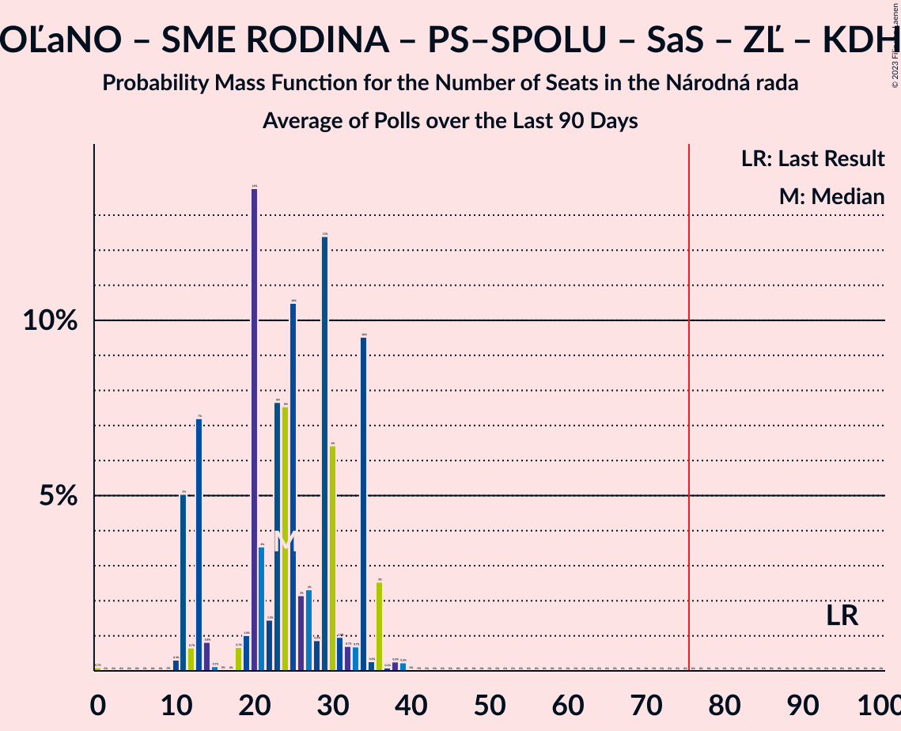

# Poll Average

<a href="#voting-intentions">Voting Intentions</a> | <a href="#seats">Seats</a> | <a href="#coalitions">Coalitions</a> | <a href="#technical-information">Technical Information</a>

## Summary

The table below lists the polls on which the average is based. They are the most recent polls (less than 90 days old) registered and analyzed so far.

| Period     | Polling firm/Commissioner(s) | OĽaNO | Smer–SD | SME RODINA | Kotleba–ĽSNS | PS–SPOLU | SaS | ZĽ | KDH | SMK–MKP | SNS | DV | V | MOST–HÍD | NOVA | PS | SPOLU | HLAS–SD | REP | MODRÍ | MODRÍ–MOST–HÍD | OĽaNO–KÚ–ZĽ | KÚ | HLAS–SD–DV | MF |
|:----------:|:----------------------------:|:--:|:--:|:--:|:--:|:--:|:--:|:--:|:--:|:--:|:--:|:--:|:--:|:--:|:--:|:--:|:--:|:--:|:--:|:--:|:--:|:--:|:--:|:--:|:--:|
| 29 February 2020 | General Election | 25.0%   53 | 18.3%   38 | 8.2%   17 | 8.0%   17 | 7.0%   0 | 6.2%   13 | 5.8%   12 | 4.6%   0 | 3.9%   0 | 3.2%   0 | 3.1%   0 | 2.9%   0 | 2.0%   0 | 0.0%   0 | 7.0%   0 | 7.0%   0 | 0.0%   0 | 0.0%   0 | 0.0%   0 | 0.0%   0 | 0.0%   0 | 0.0%   0 | 0.0%   0 | 0.0%   0 |
| N/A | Poll Average | N/A   N/A | 16–26%   29–43 | 3–6%   0–10 | 0–3%   0 | N/A   N/A | 5–9%   0–16 | N/A   N/A | 4–9%   0–15 | 2–6%   0–11 | 4–8%   0–13 | N/A   N/A | N/A   N/A | N/A   N/A | N/A   N/A | 14–22%   25–40 | 2–5%   0–10 | 10–16%   18–28 | 5–10%   0–17 | N/A   N/A | 0–3%   0 | 5–11%   9–21 | N/A   N/A | N/A   N/A | 0–1%   0 |
| [25–26 September 2023](2023-09-26-Median.html) | Median | N/A   N/A | 17–22%   31–40 | 3–6%   0–10 | N/A   N/A | N/A   N/A | 6–9%   10–16 | N/A   N/A | 6–9%   12–17 | 2–4%   0 | 4–6%   0–11 | N/A   N/A | N/A   N/A | N/A   N/A | N/A   N/A | 17–22%   29–41 | 3–5%   0–9 | 10–14%   19–25 | 6–10%   12–17 | N/A   N/A | 1–3%   0 | 5–8%   0–14 | N/A   N/A | N/A   N/A | N/A   N/A |
| [22–26 September 2023](2023-09-26-Focus.html) | Focus | N/A   N/A | 16–20%   28–37 | 3–6%   0–10 | 1–3%   0 | N/A   N/A | 5–7%   0–12 | N/A   N/A | 5–8%   9–15 | 3–5%   0–9 | 5–8%   0–15 | N/A   N/A | N/A   N/A | N/A   N/A | N/A   N/A | 14–19%   27–34 | 3–5%   0–9 | 12–16%   21–28 | 6–9%   12–16 | N/A   N/A | 0–1%   0 | 7–10%   11–17 | N/A   N/A | N/A   N/A | 0–1%   0 |
| [20–26 September 2023](2023-09-26-AKO.html) | AKO | N/A   N/A | 15–20%   25–36 | 4–7%   0–12 | 0–1%   0 | N/A   N/A | 6–9%   11–17 | N/A   N/A | 5–8%   0–13 | 2–4%   0 | 5–8%   0–14 | N/A   N/A | N/A   N/A | N/A   N/A | N/A   N/A | 16–21%   27–38 | 3–6%   0–10 | 13–17%   21–31 | 4–7%   0–12 | N/A   N/A | 1–2%   0 | 8–11%   12–21 | N/A   N/A | N/A   N/A | 0–1%   0 |
| [22–25 September 2023](2023-09-25-Ipsos.html) | Ipsos | N/A   N/A | 18–23%   32–41 | 3–5%   0–9 | 1–3%   0 | N/A   N/A | 6–9%   11–17 | N/A   N/A | 5–8%   0–14 | 2–5%   0–9 | 4–7%   0–12 | N/A   N/A | N/A   N/A | N/A   N/A | N/A   N/A | 17–22%   29–40 | 2–5%   0 | 10–14%   19–25 | 6–9%   11–17 | N/A   N/A | 0–1%   0 | 7–10%   11–17 | N/A   N/A | N/A   N/A | 0–1%   0 |
| [21–24 September 2023](2023-09-24-NMS.html) | NMS | N/A   N/A | 17–22%   34–35 | 4–6%   0–9 | 1–3%   0 | N/A   N/A | 5–7%   10–11 | N/A   N/A | 4–7%   9–10 | 2–4%   0 | 4–7%   0–10 | N/A   N/A | N/A   N/A | N/A   N/A | N/A   N/A | 18–22%   35–39 | 2–3%   0 | 9–12%   18–19 | 7–10%   15 | N/A   N/A | 1–2%   0 | 8–11%   14–17 | N/A   N/A | N/A   N/A | 0–1%   0 |
| [16–20 September 2023](2023-09-20-PolisSlovakia.html) | Polis Slovakia | N/A   N/A | 22–27%   35–47 | 4–7%   0–11 | 1–3%   0 | N/A   N/A | 5–8%   9–14 | N/A   N/A | 4–7%   0–12 | 4–7%   0–11 | 5–7%   0–12 | N/A   N/A | N/A   N/A | N/A   N/A | N/A   N/A | 13–17%   23–30 | 1–3%   0 | 11–15%   19–25 | 5–8%   10–14 | N/A   N/A | 1–2%   0 | 4–7%   0–12 | N/A   N/A | N/A   N/A | 0–1%   0 |
| [15–19 September 2023](2023-09-19-IPSOS.html) | IPSOS   Pravda | N/A   N/A | 18–23%   32–40 | 3–6%   0–10 | 2–4%   0 | N/A   N/A | 5–8%   0–13 | N/A   N/A | 4–7%   0–12 | 3–5%   0 | 4–7%   0–12 | N/A   N/A | N/A   N/A | N/A   N/A | N/A   N/A | 15–19%   26–34 | 2–5%   0 | 11–15%   21–27 | 7–10%   13–19 | N/A   N/A | 0–2%   0 | 7–10%   13–17 | N/A   N/A | N/A   N/A | 0–1%   0 |
| 29 February 2020 | General Election | 25.0%   53 | 18.3%   38 | 8.2%   17 | 8.0%   17 | 7.0%   0 | 6.2%   13 | 5.8%   12 | 4.6%   0 | 3.9%   0 | 3.2%   0 | 3.1%   0 | 2.9%   0 | 2.0%   0 | 0.0%   0 | 7.0%   0 | 7.0%   0 | 0.0%   0 | 0.0%   0 | 0.0%   0 | 0.0%   0 | 0.0%   0 | 0.0%   0 | 0.0%   0 | 0.0%   0 |

Only polls for which at least the sample size has been published are included in the table above.

**Legend:**
+ **Top half of each row:** Voting intentions (95% confidence interval)
+ **Bottom half of each row:** Seat projections for the Národná rada (95% confidence interval)
+ **OĽaNO:** OBYČAJNÍ ĽUDIA a nezávislé osobnosti
+ **Smer–SD:** SMER–sociálna demokracia
+ **SME RODINA:** SME RODINA
+ **Kotleba–ĽSNS:** Kotleba–Ľudová strana Naše Slovensko
+ **PS–SPOLU:** Progresívne Slovensko–SPOLU–Občianska Demokracia
+ **SaS:** Sloboda a Solidarita
+ **ZĽ:** Za ľudí
+ **KDH:** Kresťanskodemokratické hnutie
+ **SMK–MKP:** Strana maďarskej koalície–Magyar Koalíció Pártja
+ **SNS:** Slovenská národná strana
+ **DV:** Dobrá voľba
+ **V:** VLASŤ
+ **MOST–HÍD:** MOST–HÍD
+ **NOVA:** NOVA
+ **PS:** Progresívne Slovensko
+ **SPOLU:** SPOLU–Občianska Demokracia
+ **HLAS–SD:** HLAS–sociálna demokracia
+ **REP:** REPUBLIKA
+ **MODRÍ:** MODRÍ–Európske Slovensko
+ **MODRÍ–MOST–HÍD:** MODRÍ–Európske Slovensko–MOST–HÍD
+ **OĽaNO–KÚ–ZĽ:** OBYČAJNÍ ĽUDIA a nezávislé osobnosti–Kresťanská únia–Za ľudí
+ **KÚ:** Kresťanská únia
+ **HLAS–SD–DV:** HLAS–sociálna demokracia–Dobrá voľba
+ **MF:** Magyar Fórum
+ **N/A (single party):** Party not included the published results
+ **N/A (entire row):** Calculation for this opinion poll not started yet

## Voting Intentions

### Confidence Intervals

| Party | Last Result | Median | 80% Confidence Interval | 90% Confidence Interval | 95% Confidence Interval | 99% Confidence Interval |
|:-----:|:-----------:|:------:|:-----------------------:|:-----------------------:|:-----------------------:|:-----------------------:|
| <a href="#obyčajní-ľudia-a-nezávislé-osobnosti">OBYČAJNÍ ĽUDIA a nezávislé osobnosti</a> | 25.0% | N/A | N/A |N/A | N/A | N/A |
| <a href="#smer–sociálna-demokracia">SMER–sociálna demokracia</a> | 18.3% | 19.7% | 17.3–23.8% |16.7–24.9% | 16.3–25.7% | 15.4–26.8% |
| <a href="#sme-rodina">SME RODINA</a> | 8.2% | 4.6% | 3.6–5.8% |3.4–6.1% | 3.2–6.4% | 2.8–6.9% |
| <a href="#kotleba–ľudová-strana-naše-slovensko">Kotleba–Ľudová strana Naše Slovensko</a> | 8.0% | 1.8% | 0.4–2.6% |0.3–2.9% | 0.2–3.2% | 0.1–3.7% |
| <a href="#progresívne-slovensko–spolu–občianska-demokracia">Progresívne Slovensko–SPOLU–Občianska Demokracia</a> | 7.0% | N/A | N/A |N/A | N/A | N/A |
| <a href="#progresívne-slovensko">Progresívne Slovensko</a> | 7.0% | 18.1% | 15.2–20.6% |14.6–21.1% | 14.1–21.6% | 13.3–22.5% |
| <a href="#spolu–občianska-demokracia">SPOLU–Občianska Demokracia</a> | 7.0% | 3.5% | 2.0–4.6% |1.8–4.9% | 1.6–5.2% | 1.3–5.8% |
| <a href="#sloboda-a-solidarita">Sloboda a Solidarita</a> | 6.2% | 6.5% | 5.3–7.9% |5.1–8.3% | 4.8–8.7% | 4.4–9.3% |
| <a href="#za-ľudí">Za ľudí</a> | 5.8% | N/A | N/A |N/A | N/A | N/A |
| <a href="#kresťanskodemokratické-hnutie">Kresťanskodemokratické hnutie</a> | 4.6% | 6.0% | 4.9–7.6% |4.7–8.1% | 4.4–8.6% | 4.0–9.4% |
| <a href="#strana-maďarskej-koalície–magyar-koalíció-pártja">Strana maďarskej koalície–Magyar Koalíció Pártja</a> | 3.9% | 3.4% | 2.4–5.2% |2.2–5.7% | 2.0–6.1% | 1.7–6.8% |
| <a href="#slovenská-národná-strana">Slovenská národná strana</a> | 3.2% | 5.7% | 4.7–6.9% |4.4–7.2% | 4.1–7.5% | 3.7–8.1% |
| <a href="#dobrá-voľba">Dobrá voľba</a> | 3.1% | N/A | N/A |N/A | N/A | N/A |
| <a href="#vlasť">VLASŤ</a> | 2.9% | N/A | N/A |N/A | N/A | N/A |
| <a href="#most–híd">MOST–HÍD</a> | 2.0% | N/A | N/A |N/A | N/A | N/A |
| <a href="#nova">NOVA</a> | 0.0% | N/A | N/A |N/A | N/A | N/A |
| <a href="#hlas–sociálna-demokracia">HLAS–sociálna demokracia</a> | 0.0% | 12.6% | 10.6–15.0% |10.1–15.7% | 9.7–16.2% | 9.1–17.2% |
| <a href="#republika">REPUBLIKA</a> | 0.0% | 7.7% | 5.7–9.1% |5.2–9.5% | 4.8–9.8% | 4.3–10.4% |
| <a href="#modrí–európske-slovensko">MODRÍ–Európske Slovensko</a> | 0.0% | N/A | N/A |N/A | N/A | N/A |
| <a href="#modrí–európske-slovensko–most–híd">MODRÍ–Európske Slovensko–MOST–HÍD</a> | 0.0% | 1.1% | 0.6–2.0% |0.5–2.3% | 0.4–2.6% | 0.3–3.1% |
| <a href="#obyčajní-ľudia-a-nezávislé-osobnosti–kresťanská-únia–za-ľudí">OBYČAJNÍ ĽUDIA a nezávislé osobnosti–Kresťanská únia–Za ľudí</a> | 0.0% | 8.1% | 5.7–9.9% |5.3–10.4% | 5.0–10.7% | 4.5–11.4% |
| <a href="#kresťanská-únia">Kresťanská únia</a> | 0.0% | N/A | N/A |N/A | N/A | N/A |
| <a href="#hlas–sociálna-demokracia–dobrá-voľba">HLAS–sociálna demokracia–Dobrá voľba</a> | 0.0% | N/A | N/A |N/A | N/A | N/A |
| <a href="#magyar-fórum">Magyar Fórum</a> | 0.0% | 0.5% | 0.2–1.0% |0.1–1.1% | 0.1–1.2% | 0.0–1.5% |

### SMER–sociálna demokracia

*For a full overview of the results for this party, see the [SMER–sociálna demokracia](party-smer–sociálnademokracia.html) page.*

| Voting Intentions | Probability | Accumulated | Special Marks |
|:-----------------:|:-----------:|:-----------:|:-------------:|
| 13.5–14.5% | 0.1% | 100% |  |
| 14.5–15.5% | 0.6% | 99.9% |  |
| 15.5–16.5% | 3% | 99.3% |  |
| 16.5–17.5% | 8% | 96% |  |
| 17.5–18.5% | 15% | 88% | Last Result |
| 18.5–19.5% | 20% | 73% |  |
| 19.5–20.5% | 19% | 53% | Median |
| 20.5–21.5% | 13% | 34% |  |
| 21.5–22.5% | 6% | 21% |  |
| 22.5–23.5% | 4% | 15% |  |
| 23.5–24.5% | 4% | 11% |  |
| 24.5–25.5% | 4% | 7% |  |
| 25.5–26.5% | 2% | 3% |  |
| 26.5–27.5% | 0.6% | 0.8% |  |
| 27.5–28.5% | 0.1% | 0.1% |  |
| 28.5–29.5% | 0% | 0% |  |

### SME RODINA

*For a full overview of the results for this party, see the [SME RODINA](party-smerodina.html) page.*

| Voting Intentions | Probability | Accumulated | Special Marks |
|:-----------------:|:-----------:|:-----------:|:-------------:|
| 1.5–2.5% | 0.1% | 100% |  |
| 2.5–3.5% | 9% | 99.9% |  |
| 3.5–4.5% | 39% | 91% |  |
| 4.5–5.5% | 37% | 52% | Median |
| 5.5–6.5% | 14% | 15% |  |
| 6.5–7.5% | 1.4% | 1.5% |  |
| 7.5–8.5% | 0% | 0% | Last Result |
| 8.5–9.5% | 0% | 0% |  |

### Kotleba–Ľudová strana Naše Slovensko

*For a full overview of the results for this party, see the [Kotleba–Ľudová strana Naše Slovensko](party-kotleba–ľudovástrananašeslovensko.html) page.*

| Voting Intentions | Probability | Accumulated | Special Marks |
|:-----------------:|:-----------:|:-----------:|:-------------:|
| 0.0–0.5% | 13% | 100% |  |
| 0.5–1.5% | 22% | 87% |  |
| 1.5–2.5% | 53% | 65% | Median |
| 2.5–3.5% | 12% | 12% |  |
| 3.5–4.5% | 0.7% | 0.7% |  |
| 4.5–5.5% | 0% | 0% |  |
| 5.5–6.5% | 0% | 0% |  |
| 6.5–7.5% | 0% | 0% |  |
| 7.5–8.5% | 0% | 0% | Last Result |

### SPOLU–Občianska Demokracia

*For a full overview of the results for this party, see the [SPOLU–Občianska Demokracia](party-spolu–občianskademokracia.html) page.*

| Voting Intentions | Probability | Accumulated | Special Marks |
|:-----------------:|:-----------:|:-----------:|:-------------:|
| 0.0–0.5% | 0% | 100% |  |
| 0.5–1.5% | 2% | 100% |  |
| 1.5–2.5% | 22% | 98% |  |
| 2.5–3.5% | 30% | 76% | Median |
| 3.5–4.5% | 35% | 46% |  |
| 4.5–5.5% | 11% | 12% |  |
| 5.5–6.5% | 1.0% | 1.0% |  |
| 6.5–7.5% | 0% | 0% | Last Result |

### Progresívne Slovensko

*For a full overview of the results for this party, see the [Progresívne Slovensko](party-progresívneslovensko.html) page.*

| Voting Intentions | Probability | Accumulated | Special Marks |
|:-----------------:|:-----------:|:-----------:|:-------------:|
| 6.5–7.5% | 0% | 100% | Last Result |
| 7.5–8.5% | 0% | 100% |  |
| 8.5–9.5% | 0% | 100% |  |
| 9.5–10.5% | 0% | 100% |  |
| 10.5–11.5% | 0% | 100% |  |
| 11.5–12.5% | 0.1% | 100% |  |
| 12.5–13.5% | 0.8% | 99.9% |  |
| 13.5–14.5% | 4% | 99.1% |  |
| 14.5–15.5% | 8% | 95% |  |
| 15.5–16.5% | 13% | 87% |  |
| 16.5–17.5% | 15% | 74% |  |
| 17.5–18.5% | 17% | 59% | Median |
| 18.5–19.5% | 18% | 43% |  |
| 19.5–20.5% | 15% | 25% |  |
| 20.5–21.5% | 8% | 10% |  |
| 21.5–22.5% | 2% | 3% |  |
| 22.5–23.5% | 0.4% | 0.4% |  |
| 23.5–24.5% | 0% | 0% |  |
| 24.5–25.5% | 0% | 0% |  |

### Sloboda a Solidarita

*For a full overview of the results for this party, see the [Sloboda a Solidarita](party-slobodaasolidarita.html) page.*

| Voting Intentions | Probability | Accumulated | Special Marks |
|:-----------------:|:-----------:|:-----------:|:-------------:|
| 2.5–3.5% | 0% | 100% |  |
| 3.5–4.5% | 0.9% | 100% |  |
| 4.5–5.5% | 15% | 99.1% |  |
| 5.5–6.5% | 35% | 84% | Last Result |
| 6.5–7.5% | 31% | 49% | Median |
| 7.5–8.5% | 15% | 18% |  |
| 8.5–9.5% | 3% | 3% |  |
| 9.5–10.5% | 0.2% | 0.3% |  |
| 10.5–11.5% | 0% | 0% |  |

### Kresťanskodemokratické hnutie

*For a full overview of the results for this party, see the [Kresťanskodemokratické hnutie](party-kresťanskodemokratickéhnutie.html) page.*

| Voting Intentions | Probability | Accumulated | Special Marks |
|:-----------------:|:-----------:|:-----------:|:-------------:|
| 2.5–3.5% | 0% | 100% |  |
| 3.5–4.5% | 4% | 100% |  |
| 4.5–5.5% | 27% | 96% | Last Result |
| 5.5–6.5% | 38% | 69% | Median |
| 6.5–7.5% | 20% | 31% |  |
| 7.5–8.5% | 8% | 11% |  |
| 8.5–9.5% | 2% | 3% |  |
| 9.5–10.5% | 0.3% | 0.3% |  |
| 10.5–11.5% | 0% | 0% |  |

### Strana maďarskej koalície–Magyar Koalíció Pártja

*For a full overview of the results for this party, see the [Strana maďarskej koalície–Magyar Koalíció Pártja](party-stranamaďarskejkoalície–magyarkoalíciópártja.html) page.*

| Voting Intentions | Probability | Accumulated | Special Marks |
|:-----------------:|:-----------:|:-----------:|:-------------:|
| 0.0–0.5% | 0% | 100% |  |
| 0.5–1.5% | 0.2% | 100% |  |
| 1.5–2.5% | 13% | 99.8% |  |
| 2.5–3.5% | 42% | 87% | Median |
| 3.5–4.5% | 27% | 45% | Last Result |
| 4.5–5.5% | 11% | 18% |  |
| 5.5–6.5% | 6% | 7% |  |
| 6.5–7.5% | 0.9% | 0.9% |  |
| 7.5–8.5% | 0% | 0% |  |

### Slovenská národná strana

*For a full overview of the results for this party, see the [Slovenská národná strana](party-slovenskánárodnástrana.html) page.*

| Voting Intentions | Probability | Accumulated | Special Marks |
|:-----------------:|:-----------:|:-----------:|:-------------:|
| 1.5–2.5% | 0% | 100% |  |
| 2.5–3.5% | 0.3% | 100% | Last Result |
| 3.5–4.5% | 7% | 99.7% |  |
| 4.5–5.5% | 35% | 92% |  |
| 5.5–6.5% | 41% | 58% | Median |
| 6.5–7.5% | 15% | 17% |  |
| 7.5–8.5% | 2% | 2% |  |
| 8.5–9.5% | 0.1% | 0.1% |  |
| 9.5–10.5% | 0% | 0% |  |

### REPUBLIKA

*For a full overview of the results for this party, see the [REPUBLIKA](party-republika.html) page.*

| Voting Intentions | Probability | Accumulated | Special Marks |
|:-----------------:|:-----------:|:-----------:|:-------------:|
| 0.0–0.5% | 0% | 100% | Last Result |
| 0.5–1.5% | 0% | 100% |  |
| 1.5–2.5% | 0% | 100% |  |
| 2.5–3.5% | 0% | 100% |  |
| 3.5–4.5% | 1.3% | 100% |  |
| 4.5–5.5% | 7% | 98.7% |  |
| 5.5–6.5% | 13% | 92% |  |
| 6.5–7.5% | 24% | 79% |  |
| 7.5–8.5% | 32% | 55% | Median |
| 8.5–9.5% | 18% | 23% |  |
| 9.5–10.5% | 4% | 4% |  |
| 10.5–11.5% | 0.4% | 0.4% |  |
| 11.5–12.5% | 0% | 0% |  |

### MODRÍ–Európske Slovensko–MOST–HÍD

*For a full overview of the results for this party, see the [MODRÍ–Európske Slovensko–MOST–HÍD](party-modrí–európskeslovensko–most–híd.html) page.*

| Voting Intentions | Probability | Accumulated | Special Marks |
|:-----------------:|:-----------:|:-----------:|:-------------:|
| 0.0–0.5% | 9% | 100% | Last Result |
| 0.5–1.5% | 72% | 91% | Median |
| 1.5–2.5% | 17% | 20% |  |
| 2.5–3.5% | 3% | 3% |  |
| 3.5–4.5% | 0.1% | 0.1% |  |
| 4.5–5.5% | 0% | 0% |  |

### HLAS–sociálna demokracia

*For a full overview of the results for this party, see the [HLAS–sociálna demokracia](party-hlas–sociálnademokracia.html) page.*

| Voting Intentions | Probability | Accumulated | Special Marks |
|:-----------------:|:-----------:|:-----------:|:-------------:|
| 0.0–0.5% | 0% | 100% | Last Result |
| 0.5–1.5% | 0% | 100% |  |
| 1.5–2.5% | 0% | 100% |  |
| 2.5–3.5% | 0% | 100% |  |
| 3.5–4.5% | 0% | 100% |  |
| 4.5–5.5% | 0% | 100% |  |
| 5.5–6.5% | 0% | 100% |  |
| 6.5–7.5% | 0% | 100% |  |
| 7.5–8.5% | 0.1% | 100% |  |
| 8.5–9.5% | 2% | 99.9% |  |
| 9.5–10.5% | 8% | 98% |  |
| 10.5–11.5% | 16% | 90% |  |
| 11.5–12.5% | 22% | 74% |  |
| 12.5–13.5% | 22% | 52% | Median |
| 13.5–14.5% | 15% | 30% |  |
| 14.5–15.5% | 9% | 15% |  |
| 15.5–16.5% | 4% | 6% |  |
| 16.5–17.5% | 1.2% | 1.5% |  |
| 17.5–18.5% | 0.2% | 0.3% |  |
| 18.5–19.5% | 0% | 0% |  |

### OBYČAJNÍ ĽUDIA a nezávislé osobnosti–Kresťanská únia–Za ľudí

*For a full overview of the results for this party, see the [OBYČAJNÍ ĽUDIA a nezávislé osobnosti–Kresťanská únia–Za ľudí](party-obyčajníľudiaanezávisléosobnosti–kresťanskáúnia–zaľudí.html) page.*

| Voting Intentions | Probability | Accumulated | Special Marks |
|:-----------------:|:-----------:|:-----------:|:-------------:|
| 0.0–0.5% | 0% | 100% | Last Result |
| 0.5–1.5% | 0% | 100% |  |
| 1.5–2.5% | 0% | 100% |  |
| 2.5–3.5% | 0% | 100% |  |
| 3.5–4.5% | 0.6% | 100% |  |
| 4.5–5.5% | 8% | 99.4% |  |
| 5.5–6.5% | 15% | 92% |  |
| 6.5–7.5% | 14% | 77% |  |
| 7.5–8.5% | 23% | 63% | Median |
| 8.5–9.5% | 23% | 40% |  |
| 9.5–10.5% | 13% | 16% |  |
| 10.5–11.5% | 3% | 4% |  |
| 11.5–12.5% | 0.3% | 0.3% |  |
| 12.5–13.5% | 0% | 0% |  |

### Magyar Fórum

*For a full overview of the results for this party, see the [Magyar Fórum](party-magyarfórum.html) page.*

| Voting Intentions | Probability | Accumulated | Special Marks |
|:-----------------:|:-----------:|:-----------:|:-------------:|
| 0.0–0.5% | 52% | 100% | Last Result |
| 0.5–1.5% | 48% | 48% | Median |
| 1.5–2.5% | 0.3% | 0.3% |  |
| 2.5–3.5% | 0% | 0% |  |

## Seats

### Confidence Intervals

| Party | Last Result | Median | 80% Confidence Interval | 90% Confidence Interval | 95% Confidence Interval | 99% Confidence Interval |
|:-----:|:-----------:|:------:|:-----------------------:|:-----------------------:|:-----------------------:|:-----------------------:|
| <a href="#obyčajní-ľudia-a-nezávislé-osobnosti">OBYČAJNÍ ĽUDIA a nezávislé osobnosti</a> | 53 | N/A | N/A |N/A | N/A | N/A |
| <a href="#smer–sociálna-demokracia">SMER–sociálna demokracia</a> | 38 | 35 | 30–38 |30–42 | 29–43 | 25–47 |
| <a href="#sme-rodina">SME RODINA</a> | 17 | 0 | 0–10 |0–10 | 0–10 | 0–12 |
| <a href="#kotleba–ľudová-strana-naše-slovensko">Kotleba–Ľudová strana Naše Slovensko</a> | 17 | 0 | 0 |0 | 0 | 0 |
| <a href="#progresívne-slovensko–spolu–občianska-demokracia">Progresívne Slovensko–SPOLU–Občianska Demokracia</a> | 0 | N/A | N/A |N/A | N/A | N/A |
| <a href="#progresívne-slovensko">Progresívne Slovensko</a> | 0 | 32 | 27–36 |26–39 | 25–40 | 23–41 |
| <a href="#spolu–občianska-demokracia">SPOLU–Občianska Demokracia</a> | 0 | 0 | 0 |0–9 | 0–10 | 0–10 |
| <a href="#sloboda-a-solidarita">Sloboda a Solidarita</a> | 13 | 11 | 10–15 |0–15 | 0–16 | 0–17 |
| <a href="#za-ľudí">Za ľudí</a> | 12 | N/A | N/A |N/A | N/A | N/A |
| <a href="#kresťanskodemokratické-hnutie">Kresťanskodemokratické hnutie</a> | 0 | 10 | 0–14 |0–14 | 0–15 | 0–17 |
| <a href="#strana-maďarskej-koalície–magyar-koalíció-pártja">Strana maďarskej koalície–Magyar Koalíció Pártja</a> | 0 | 0 | 0–10 |0–10 | 0–11 | 0–11 |
| <a href="#slovenská-národná-strana">Slovenská národná strana</a> | 0 | 10 | 0–12 |0–12 | 0–13 | 0–14 |
| <a href="#dobrá-voľba">Dobrá voľba</a> | 0 | N/A | N/A |N/A | N/A | N/A |
| <a href="#vlasť">VLASŤ</a> | 0 | N/A | N/A |N/A | N/A | N/A |
| <a href="#most–híd">MOST–HÍD</a> | 0 | N/A | N/A |N/A | N/A | N/A |
| <a href="#nova">NOVA</a> | 0 | N/A | N/A |N/A | N/A | N/A |
| <a href="#hlas–sociálna-demokracia">HLAS–sociálna demokracia</a> | 0 | 23 | 19–27 |19–28 | 18–28 | 18–31 |
| <a href="#republika">REPUBLIKA</a> | 0 | 14 | 10–16 |0–16 | 0–17 | 0–19 |
| <a href="#modrí–európske-slovensko">MODRÍ–Európske Slovensko</a> | 0 | N/A | N/A |N/A | N/A | N/A |
| <a href="#modrí–európske-slovensko–most–híd">MODRÍ–Európske Slovensko–MOST–HÍD</a> | 0 | 0 | 0 |0 | 0 | 0 |
| <a href="#obyčajní-ľudia-a-nezávislé-osobnosti–kresťanská-únia–za-ľudí">OBYČAJNÍ ĽUDIA a nezávislé osobnosti–Kresťanská únia–Za ľudí</a> | 0 | 14 | 10–17 |9–18 | 9–21 | 0–21 |
| <a href="#kresťanská-únia">Kresťanská únia</a> | 0 | N/A | N/A |N/A | N/A | N/A |
| <a href="#hlas–sociálna-demokracia–dobrá-voľba">HLAS–sociálna demokracia–Dobrá voľba</a> | 0 | N/A | N/A |N/A | N/A | N/A |
| <a href="#magyar-fórum">Magyar Fórum</a> | 0 | 0 | 0 |0 | 0 | 0 |

### OBYČAJNÍ ĽUDIA a nezávislé osobnosti

*For a full overview of the results for this party, see the [OBYČAJNÍ ĽUDIA a nezávislé osobnosti](party-obyčajníľudiaanezávisléosobnosti.html) page.*

### SMER–sociálna demokracia

*For a full overview of the results for this party, see the [SMER–sociálna demokracia](party-smer–sociálnademokracia.html) page.*

| Number of Seats | Probability | Accumulated | Special Marks |
|:---------------:|:-----------:|:-----------:|:-------------:|
| 25 | 0.5% | 100% |  |
| 26 | 0.3% | 99.5% |  |
| 27 | 0.5% | 99.2% |  |
| 28 | 1.1% | 98.7% |  |
| 29 | 2% | 98% |  |
| 30 | 6% | 95% |  |
| 31 | 1.0% | 90% |  |
| 32 | 11% | 89% |  |
| 33 | 1.1% | 78% |  |
| 34 | 23% | 77% |  |
| 35 | 23% | 53% | Median |
| 36 | 6% | 30% |  |
| 37 | 3% | 25% |  |
| 38 | 12% | 22% | Last Result |
| 39 | 1.1% | 10% |  |
| 40 | 1.3% | 9% |  |
| 41 | 2% | 7% |  |
| 42 | 2% | 6% |  |
| 43 | 3% | 4% |  |
| 44 | 0.4% | 1.2% |  |
| 45 | 0.1% | 0.8% |  |
| 46 | 0.1% | 0.6% |  |
| 47 | 0.2% | 0.5% |  |
| 48 | 0.3% | 0.3% |  |
| 49 | 0% | 0.1% |  |
| 50 | 0% | 0% |  |

### SME RODINA

*For a full overview of the results for this party, see the [SME RODINA](party-smerodina.html) page.*

| Number of Seats | Probability | Accumulated | Special Marks |
|:---------------:|:-----------:|:-----------:|:-------------:|
| 0 | 63% | 100% | Median |
| 1 | 0% | 37% |  |
| 2 | 0% | 37% |  |
| 3 | 0% | 37% |  |
| 4 | 0% | 37% |  |
| 5 | 0% | 37% |  |
| 6 | 0% | 37% |  |
| 7 | 0% | 37% |  |
| 8 | 2% | 37% |  |
| 9 | 21% | 34% |  |
| 10 | 12% | 14% |  |
| 11 | 1.1% | 2% |  |
| 12 | 0.5% | 0.6% |  |
| 13 | 0.1% | 0.1% |  |
| 14 | 0% | 0% |  |
| 15 | 0% | 0% |  |
| 16 | 0% | 0% |  |
| 17 | 0% | 0% | Last Result |

### Kotleba–Ľudová strana Naše Slovensko

*For a full overview of the results for this party, see the [Kotleba–Ľudová strana Naše Slovensko](party-kotleba–ľudovástrananašeslovensko.html) page.*

| Number of Seats | Probability | Accumulated | Special Marks |
|:---------------:|:-----------:|:-----------:|:-------------:|
| 0 | 100% | 100% | Median |
| 1 | 0% | 0% |  |
| 2 | 0% | 0% |  |
| 3 | 0% | 0% |  |
| 4 | 0% | 0% |  |
| 5 | 0% | 0% |  |
| 6 | 0% | 0% |  |
| 7 | 0% | 0% |  |
| 8 | 0% | 0% |  |
| 9 | 0% | 0% |  |
| 10 | 0% | 0% |  |
| 11 | 0% | 0% |  |
| 12 | 0% | 0% |  |
| 13 | 0% | 0% |  |
| 14 | 0% | 0% |  |
| 15 | 0% | 0% |  |
| 16 | 0% | 0% |  |
| 17 | 0% | 0% | Last Result |

### Progresívne Slovensko–SPOLU–Občianska Demokracia

*For a full overview of the results for this party, see the [Progresívne Slovensko–SPOLU–Občianska Demokracia](party-progresívneslovensko–spolu–občianskademokracia.html) page.*

### Progresívne Slovensko

*For a full overview of the results for this party, see the [Progresívne Slovensko](party-progresívneslovensko.html) page.*

| Number of Seats | Probability | Accumulated | Special Marks |
|:---------------:|:-----------:|:-----------:|:-------------:|
| 0 | 0% | 100% | Last Result |
| 1 | 0% | 100% |  |
| 2 | 0% | 100% |  |
| 3 | 0% | 100% |  |
| 4 | 0% | 100% |  |
| 5 | 0% | 100% |  |
| 6 | 0% | 100% |  |
| 7 | 0% | 100% |  |
| 8 | 0% | 100% |  |
| 9 | 0% | 100% |  |
| 10 | 0% | 100% |  |
| 11 | 0% | 100% |  |
| 12 | 0% | 100% |  |
| 13 | 0% | 100% |  |
| 14 | 0% | 100% |  |
| 15 | 0% | 100% |  |
| 16 | 0% | 100% |  |
| 17 | 0% | 100% |  |
| 18 | 0% | 100% |  |
| 19 | 0% | 100% |  |
| 20 | 0% | 100% |  |
| 21 | 0.1% | 100% |  |
| 22 | 0.1% | 99.9% |  |
| 23 | 2% | 99.9% |  |
| 24 | 0.2% | 98% |  |
| 25 | 3% | 98% |  |
| 26 | 1.4% | 95% |  |
| 27 | 14% | 94% |  |
| 28 | 5% | 80% |  |
| 29 | 3% | 75% |  |
| 30 | 7% | 72% |  |
| 31 | 6% | 65% |  |
| 32 | 10% | 59% | Median |
| 33 | 2% | 49% |  |
| 34 | 14% | 47% |  |
| 35 | 21% | 33% |  |
| 36 | 2% | 12% |  |
| 37 | 1.2% | 9% |  |
| 38 | 3% | 8% |  |
| 39 | 2% | 5% |  |
| 40 | 0.3% | 3% |  |
| 41 | 2% | 2% |  |
| 42 | 0.2% | 0.3% |  |
| 43 | 0% | 0.1% |  |
| 44 | 0.1% | 0.1% |  |
| 45 | 0% | 0% |  |

### SPOLU–Občianska Demokracia

*For a full overview of the results for this party, see the [SPOLU–Občianska Demokracia](party-spolu–občianskademokracia.html) page.*

| Number of Seats | Probability | Accumulated | Special Marks |
|:---------------:|:-----------:|:-----------:|:-------------:|
| 0 | 94% | 100% | Last Result, Median |
| 1 | 0% | 6% |  |
| 2 | 0% | 6% |  |
| 3 | 0% | 6% |  |
| 4 | 0% | 6% |  |
| 5 | 0% | 6% |  |
| 6 | 0% | 6% |  |
| 7 | 0% | 6% |  |
| 8 | 0.1% | 6% |  |
| 9 | 2% | 6% |  |
| 10 | 4% | 4% |  |
| 11 | 0.1% | 0.1% |  |
| 12 | 0% | 0% |  |

### Sloboda a Solidarita

*For a full overview of the results for this party, see the [Sloboda a Solidarita](party-slobodaasolidarita.html) page.*

| Number of Seats | Probability | Accumulated | Special Marks |
|:---------------:|:-----------:|:-----------:|:-------------:|
| 0 | 6% | 100% |  |
| 1 | 0% | 94% |  |
| 2 | 0% | 94% |  |
| 3 | 0% | 94% |  |
| 4 | 0% | 94% |  |
| 5 | 0% | 94% |  |
| 6 | 0% | 94% |  |
| 7 | 0% | 94% |  |
| 8 | 0.1% | 94% |  |
| 9 | 2% | 94% |  |
| 10 | 13% | 92% |  |
| 11 | 29% | 78% | Median |
| 12 | 9% | 49% |  |
| 13 | 23% | 41% | Last Result |
| 14 | 7% | 18% |  |
| 15 | 8% | 11% |  |
| 16 | 2% | 3% |  |
| 17 | 0.7% | 1.0% |  |
| 18 | 0.3% | 0.3% |  |
| 19 | 0% | 0% |  |

### Za ľudí

*For a full overview of the results for this party, see the [Za ľudí](party-zaľudí.html) page.*

### Kresťanskodemokratické hnutie

*For a full overview of the results for this party, see the [Kresťanskodemokratické hnutie](party-kresťanskodemokratickéhnutie.html) page.*

| Number of Seats | Probability | Accumulated | Special Marks |
|:---------------:|:-----------:|:-----------:|:-------------:|
| 0 | 15% | 100% | Last Result |
| 1 | 0% | 85% |  |
| 2 | 0% | 85% |  |
| 3 | 0% | 85% |  |
| 4 | 0% | 85% |  |
| 5 | 0% | 85% |  |
| 6 | 0% | 85% |  |
| 7 | 0% | 85% |  |
| 8 | 0.1% | 85% |  |
| 9 | 21% | 85% |  |
| 10 | 19% | 64% | Median |
| 11 | 11% | 45% |  |
| 12 | 18% | 34% |  |
| 13 | 3% | 16% |  |
| 14 | 9% | 14% |  |
| 15 | 3% | 5% |  |
| 16 | 1.1% | 2% |  |
| 17 | 0.2% | 0.5% |  |
| 18 | 0.2% | 0.3% |  |
| 19 | 0.1% | 0.1% |  |
| 20 | 0% | 0% |  |

### Strana maďarskej koalície–Magyar Koalíció Pártja

*For a full overview of the results for this party, see the [Strana maďarskej koalície–Magyar Koalíció Pártja](party-stranamaďarskejkoalície–magyarkoalíciópártja.html) page.*

| Number of Seats | Probability | Accumulated | Special Marks |
|:---------------:|:-----------:|:-----------:|:-------------:|
| 0 | 86% | 100% | Last Result, Median |
| 1 | 0% | 14% |  |
| 2 | 0% | 14% |  |
| 3 | 0% | 14% |  |
| 4 | 0% | 14% |  |
| 5 | 0% | 14% |  |
| 6 | 0% | 14% |  |
| 7 | 0% | 14% |  |
| 8 | 1.2% | 14% |  |
| 9 | 2% | 13% |  |
| 10 | 7% | 11% |  |
| 11 | 3% | 4% |  |
| 12 | 0.2% | 0.3% |  |
| 13 | 0% | 0.1% |  |
| 14 | 0% | 0% |  |

### Slovenská národná strana

*For a full overview of the results for this party, see the [Slovenská národná strana](party-slovenskánárodnástrana.html) page.*

| Number of Seats | Probability | Accumulated | Special Marks |
|:---------------:|:-----------:|:-----------:|:-------------:|
| 0 | 28% | 100% | Last Result |
| 1 | 0% | 72% |  |
| 2 | 0% | 72% |  |
| 3 | 0% | 72% |  |
| 4 | 0% | 72% |  |
| 5 | 0% | 72% |  |
| 6 | 0% | 72% |  |
| 7 | 0% | 72% |  |
| 8 | 1.4% | 72% |  |
| 9 | 15% | 71% |  |
| 10 | 25% | 56% | Median |
| 11 | 13% | 31% |  |
| 12 | 14% | 18% |  |
| 13 | 1.5% | 4% |  |
| 14 | 2% | 2% |  |
| 15 | 0.4% | 0.5% |  |
| 16 | 0% | 0% |  |

### Dobrá voľba

*For a full overview of the results for this party, see the [Dobrá voľba](party-dobrávoľba.html) page.*

### VLASŤ

*For a full overview of the results for this party, see the [VLASŤ](party-vlasť.html) page.*

### MOST–HÍD

*For a full overview of the results for this party, see the [MOST–HÍD](party-most–híd.html) page.*

### NOVA

*For a full overview of the results for this party, see the [NOVA](party-nova.html) page.*

### HLAS–sociálna demokracia

*For a full overview of the results for this party, see the [HLAS–sociálna demokracia](party-hlas–sociálnademokracia.html) page.*

| Number of Seats | Probability | Accumulated | Special Marks |
|:---------------:|:-----------:|:-----------:|:-------------:|
| 0 | 0% | 100% | Last Result |
| 1 | 0% | 100% |  |
| 2 | 0% | 100% |  |
| 3 | 0% | 100% |  |
| 4 | 0% | 100% |  |
| 5 | 0% | 100% |  |
| 6 | 0% | 100% |  |
| 7 | 0% | 100% |  |
| 8 | 0% | 100% |  |
| 9 | 0% | 100% |  |
| 10 | 0% | 100% |  |
| 11 | 0% | 100% |  |
| 12 | 0% | 100% |  |
| 13 | 0% | 100% |  |
| 14 | 0% | 100% |  |
| 15 | 0.1% | 100% |  |
| 16 | 0.2% | 99.9% |  |
| 17 | 0.2% | 99.7% |  |
| 18 | 2% | 99.5% |  |
| 19 | 14% | 97% |  |
| 20 | 7% | 83% |  |
| 21 | 14% | 75% |  |
| 22 | 12% | 62% |  |
| 23 | 5% | 50% | Median |
| 24 | 14% | 45% |  |
| 25 | 12% | 31% |  |
| 26 | 7% | 18% |  |
| 27 | 2% | 11% |  |
| 28 | 8% | 10% |  |
| 29 | 0.6% | 1.3% |  |
| 30 | 0.1% | 0.7% |  |
| 31 | 0.3% | 0.6% |  |
| 32 | 0% | 0.2% |  |
| 33 | 0.1% | 0.2% |  |
| 34 | 0% | 0% |  |

### REPUBLIKA

*For a full overview of the results for this party, see the [REPUBLIKA](party-republika.html) page.*

| Number of Seats | Probability | Accumulated | Special Marks |
|:---------------:|:-----------:|:-----------:|:-------------:|
| 0 | 6% | 100% | Last Result |
| 1 | 0% | 94% |  |
| 2 | 0% | 94% |  |
| 3 | 0% | 94% |  |
| 4 | 0% | 94% |  |
| 5 | 0% | 94% |  |
| 6 | 0% | 94% |  |
| 7 | 0% | 94% |  |
| 8 | 0.1% | 94% |  |
| 9 | 3% | 93% |  |
| 10 | 8% | 91% |  |
| 11 | 6% | 83% |  |
| 12 | 14% | 77% |  |
| 13 | 12% | 63% |  |
| 14 | 20% | 51% | Median |
| 15 | 18% | 31% |  |
| 16 | 9% | 13% |  |
| 17 | 2% | 3% |  |
| 18 | 0.5% | 1.1% |  |
| 19 | 0.5% | 0.6% |  |
| 20 | 0.1% | 0.1% |  |
| 21 | 0.1% | 0.1% |  |
| 22 | 0% | 0% |  |

### MODRÍ–Európske Slovensko

*For a full overview of the results for this party, see the [MODRÍ–Európske Slovensko](party-modrí–európskeslovensko.html) page.*

### MODRÍ–Európske Slovensko–MOST–HÍD

*For a full overview of the results for this party, see the [MODRÍ–Európske Slovensko–MOST–HÍD](party-modrí–európskeslovensko–most–híd.html) page.*

| Number of Seats | Probability | Accumulated | Special Marks |
|:---------------:|:-----------:|:-----------:|:-------------:|
| 0 | 100% | 100% | Last Result, Median |

### OBYČAJNÍ ĽUDIA a nezávislé osobnosti–Kresťanská únia–Za ľudí

*For a full overview of the results for this party, see the [OBYČAJNÍ ĽUDIA a nezávislé osobnosti–Kresťanská únia–Za ľudí](party-obyčajníľudiaanezávisléosobnosti–kresťanskáúnia–zaľudí.html) page.*

| Number of Seats | Probability | Accumulated | Special Marks |
|:---------------:|:-----------:|:-----------:|:-------------:|
| 0 | 1.0% | 100% | Last Result |
| 1 | 0% | 99.0% |  |
| 2 | 0% | 99.0% |  |
| 3 | 0% | 99.0% |  |
| 4 | 0% | 99.0% |  |
| 5 | 0% | 99.0% |  |
| 6 | 0% | 99.0% |  |
| 7 | 0% | 99.0% |  |
| 8 | 1.3% | 99.0% |  |
| 9 | 6% | 98% |  |
| 10 | 8% | 91% |  |
| 11 | 12% | 84% |  |
| 12 | 9% | 72% |  |
| 13 | 10% | 63% |  |
| 14 | 8% | 53% | Median |
| 15 | 6% | 46% |  |
| 16 | 15% | 39% |  |
| 17 | 19% | 24% |  |
| 18 | 2% | 5% |  |
| 19 | 0.3% | 4% |  |
| 20 | 0.2% | 3% |  |
| 21 | 3% | 3% |  |
| 22 | 0.1% | 0.1% |  |
| 23 | 0% | 0% |  |

### Kresťanská únia

*For a full overview of the results for this party, see the [Kresťanská únia](party-kresťanskáúnia.html) page.*

### HLAS–sociálna demokracia–Dobrá voľba

*For a full overview of the results for this party, see the [HLAS–sociálna demokracia–Dobrá voľba](party-hlas–sociálnademokracia–dobrávoľba.html) page.*

### Magyar Fórum

*For a full overview of the results for this party, see the [Magyar Fórum](party-magyarfórum.html) page.*

| Number of Seats | Probability | Accumulated | Special Marks |
|:---------------:|:-----------:|:-----------:|:-------------:|
| 0 | 100% | 100% | Last Result, Median |

## Coalitions

### Confidence Intervals

| Coalition | Last Result | Median | Majority? | 80% Confidence Interval | 90% Confidence Interval | 95% Confidence Interval | 99% Confidence Interval |
|:---------:|:-----------:|:------:|:---------:|:-----------------------:|:-----------------------:|:-----------------------:|:-----------------------:|
| SMER–sociálna demokracia – SME RODINA – Kotleba–Ľudová strana Naše Slovensko – Slovenská národná strana – HLAS–sociálna demokracia | 72 | 69 | 13% | 62–76 | 58–78 | 55–81 | 52–86 |
| SMER–sociálna demokracia – SME RODINA – Slovenská národná strana – HLAS–sociálna demokracia | 55 | 69 | 13% | 62–76 | 58–78 | 55–81 | 52–86 |
| SMER–sociálna demokracia – Slovenská národná strana – MOST–HÍD – HLAS–sociálna demokracia | 38 | 65 | 3% | 57–74 | 54–75 | 53–76 | 52–80 |
| SMER–sociálna demokracia – Slovenská národná strana – HLAS–sociálna demokracia | 38 | 65 | 3% | 57–74 | 54–75 | 53–76 | 52–80 |
| SMER–sociálna demokracia – SME RODINA – HLAS–sociálna demokracia | 55 | 62 | 1.1% | 53–67 | 53–71 | 53–74 | 51–77 |
| SMER–sociálna demokracia – SME RODINA – Kotleba–Ľudová strana Naše Slovensko – Slovenská národná strana | 72 | 45 | 0% | 40–53 | 35–54 | 34–58 | 29–62 |
| SMER–sociálna demokracia – SME RODINA – Slovenská národná strana | 55 | 45 | 0% | 40–53 | 35–54 | 34–58 | 29–62 |
| SMER–sociálna demokracia – SME RODINA | 55 | 37 | 0% | 32–44 | 30–49 | 30–53 | 28–54 |
| SMER–sociálna demokracia – Slovenská národná strana – MOST–HÍD | 38 | 44 | 0% | 35–49 | 34–50 | 33–51 | 29–56 |
| SMER–sociálna demokracia – Slovenská národná strana | 38 | 44 | 0% | 35–49 | 34–50 | 33–51 | 29–56 |
| SME RODINA – Kotleba–Ľudová strana Naše Slovensko – Slovenská národná strana – HLAS–sociálna demokracia | 34 | 34 | 0% | 27–43 | 22–44 | 21–44 | 20–49 |
| SME RODINA – Slovenská národná strana – HLAS–sociálna demokracia | 17 | 34 | 0% | 27–43 | 22–44 | 21–44 | 20–49 |
| SMER–sociálna demokracia | 38 | 35 | 0% | 30–38 | 30–42 | 29–43 | 25–47 |
| Slovenská národná strana – MOST–HÍD – HLAS–sociálna demokracia | 0 | 30 | 0% | 21–40 | 20–40 | 20–40 | 18–41 |
| Slovenská národná strana – HLAS–sociálna demokracia | 0 | 30 | 0% | 21–40 | 20–40 | 20–40 | 18–41 |
| OBYČAJNÍ ĽUDIA a nezávislé osobnosti – SME RODINA – Progresívne Slovensko–SPOLU–Občianska Demokracia – Sloboda a Solidarita – Za ľudí – Kresťanskodemokratické hnutie – Strana maďarskej koalície–Magyar Koalíció Pártja – MOST–HÍD | 95 | 25 | 0% | 13–36 | 11–39 | 11–39 | 11–40 |
| OBYČAJNÍ ĽUDIA a nezávislé osobnosti – SME RODINA – Progresívne Slovensko–SPOLU–Občianska Demokracia – Sloboda a Solidarita – Za ľudí – Kresťanskodemokratické hnutie – Strana maďarskej koalície–Magyar Koalíció Pártja | 95 | 25 | 0% | 13–36 | 11–39 | 11–39 | 11–40 |
| OBYČAJNÍ ĽUDIA a nezávislé osobnosti – SME RODINA – Progresívne Slovensko–SPOLU–Občianska Demokracia – Sloboda a Solidarita – Za ľudí – Kresťanskodemokratické hnutie – MOST–HÍD | 95 | 24 | 0% | 13–34 | 11–34 | 11–36 | 11–38 |
| OBYČAJNÍ ĽUDIA a nezávislé osobnosti – SME RODINA – Progresívne Slovensko–SPOLU–Občianska Demokracia – Sloboda a Solidarita – Za ľudí – Kresťanskodemokratické hnutie | 95 | 24 | 0% | 13–34 | 11–34 | 11–36 | 11–38 |
| SME RODINA – HLAS–sociálna demokracia | 17 | 26 | 0% | 19–33 | 19–35 | 19–35 | 18–38 |
| OBYČAJNÍ ĽUDIA a nezávislé osobnosti – Progresívne Slovensko–SPOLU–Občianska Demokracia – Sloboda a Solidarita – Za ľudí – Kresťanskodemokratické hnutie – Strana maďarskej koalície–Magyar Koalíció Pártja – MOST–HÍD | 78 | 23 | 0% | 13–29 | 11–30 | 11–30 | 10–33 |
| OBYČAJNÍ ĽUDIA a nezávislé osobnosti – Progresívne Slovensko–SPOLU–Občianska Demokracia – Sloboda a Solidarita – Za ľudí – Kresťanskodemokratické hnutie – Strana maďarskej koalície–Magyar Koalíció Pártja | 78 | 23 | 0% | 13–29 | 11–30 | 11–30 | 10–33 |
| OBYČAJNÍ ĽUDIA a nezávislé osobnosti – Progresívne Slovensko–SPOLU–Občianska Demokracia – Sloboda a Solidarita – Za ľudí – Kresťanskodemokratické hnutie – MOST–HÍD | 78 | 21 | 0% | 13–26 | 11–29 | 11–29 | 10–31 |
| OBYČAJNÍ ĽUDIA a nezávislé osobnosti – Progresívne Slovensko–SPOLU–Občianska Demokracia – Sloboda a Solidarita – Za ľudí – Kresťanskodemokratické hnutie | 78 | 21 | 0% | 13–26 | 11–29 | 11–29 | 10–31 |
| Progresívne Slovensko–SPOLU–Občianska Demokracia – Sloboda a Solidarita – Za ľudí – Kresťanskodemokratické hnutie | 25 | 21 | 0% | 13–26 | 11–29 | 11–29 | 10–31 |
| OBYČAJNÍ ĽUDIA a nezávislé osobnosti – Progresívne Slovensko–SPOLU–Občianska Demokracia – Sloboda a Solidarita – Za ľudí | 78 | 11 | 0% | 10–15 | 0–15 | 0–16 | 0–17 |
| Progresívne Slovensko–SPOLU–Občianska Demokracia – Sloboda a Solidarita – Za ľudí | 25 | 11 | 0% | 10–15 | 0–15 | 0–16 | 0–17 |

### SMER–sociálna demokracia – SME RODINA – Kotleba–Ľudová strana Naše Slovensko – Slovenská národná strana – HLAS–sociálna demokracia

| Number of Seats | Probability | Accumulated | Special Marks |
|:---------------:|:-----------:|:-----------:|:-------------:|
| 52 | 0.7% | 100% |  |
| 53 | 0% | 99.2% |  |
| 54 | 0.7% | 99.2% |  |
| 55 | 2% | 98.6% |  |
| 56 | 0% | 96% |  |
| 57 | 0.8% | 96% |  |
| 58 | 0.5% | 95% |  |
| 59 | 1.1% | 95% |  |
| 60 | 2% | 94% |  |
| 61 | 1.3% | 92% |  |
| 62 | 2% | 91% |  |
| 63 | 14% | 88% |  |
| 64 | 5% | 75% |  |
| 65 | 4% | 70% |  |
| 66 | 8% | 66% |  |
| 67 | 4% | 58% |  |
| 68 | 3% | 54% | Median |
| 69 | 2% | 50% |  |
| 70 | 8% | 49% |  |
| 71 | 1.3% | 40% |  |
| 72 | 1.1% | 39% | Last Result |
| 73 | 8% | 38% |  |
| 74 | 11% | 30% |  |
| 75 | 6% | 19% |  |
| 76 | 5% | 13% | Majority |
| 77 | 1.2% | 7% |  |
| 78 | 2% | 6% |  |
| 79 | 0.5% | 5% |  |
| 80 | 0.4% | 4% |  |
| 81 | 2% | 4% |  |
| 82 | 0.1% | 1.4% |  |
| 83 | 0.2% | 1.4% |  |
| 84 | 0.1% | 1.2% |  |
| 85 | 0.1% | 1.0% |  |
| 86 | 0.6% | 1.0% |  |
| 87 | 0.1% | 0.4% |  |
| 88 | 0.1% | 0.3% |  |
| 89 | 0.1% | 0.2% |  |
| 90 | 0% | 0% |  |

### SMER–sociálna demokracia – SME RODINA – Slovenská národná strana – HLAS–sociálna demokracia

| Number of Seats | Probability | Accumulated | Special Marks |
|:---------------:|:-----------:|:-----------:|:-------------:|
| 52 | 0.7% | 100% |  |
| 53 | 0% | 99.2% |  |
| 54 | 0.7% | 99.2% |  |
| 55 | 2% | 98.6% | Last Result |
| 56 | 0% | 96% |  |
| 57 | 0.8% | 96% |  |
| 58 | 0.5% | 95% |  |
| 59 | 1.1% | 95% |  |
| 60 | 2% | 94% |  |
| 61 | 1.3% | 92% |  |
| 62 | 2% | 91% |  |
| 63 | 14% | 88% |  |
| 64 | 5% | 75% |  |
| 65 | 4% | 70% |  |
| 66 | 8% | 66% |  |
| 67 | 4% | 58% |  |
| 68 | 3% | 54% | Median |
| 69 | 2% | 50% |  |
| 70 | 8% | 49% |  |
| 71 | 1.3% | 40% |  |
| 72 | 1.1% | 39% |  |
| 73 | 8% | 38% |  |
| 74 | 11% | 30% |  |
| 75 | 6% | 19% |  |
| 76 | 5% | 13% | Majority |
| 77 | 1.2% | 7% |  |
| 78 | 2% | 6% |  |
| 79 | 0.5% | 5% |  |
| 80 | 0.4% | 4% |  |
| 81 | 2% | 4% |  |
| 82 | 0.1% | 1.4% |  |
| 83 | 0.2% | 1.4% |  |
| 84 | 0.1% | 1.2% |  |
| 85 | 0.1% | 1.0% |  |
| 86 | 0.6% | 1.0% |  |
| 87 | 0.1% | 0.4% |  |
| 88 | 0.1% | 0.3% |  |
| 89 | 0.1% | 0.2% |  |
| 90 | 0% | 0% |  |

### SMER–sociálna demokracia – Slovenská národná strana – MOST–HÍD – HLAS–sociálna demokracia

| Number of Seats | Probability | Accumulated | Special Marks |
|:---------------:|:-----------:|:-----------:|:-------------:|
| 38 | 0% | 100% | Last Result |
| 39 | 0% | 100% |  |
| 40 | 0% | 100% |  |
| 41 | 0% | 100% |  |
| 42 | 0% | 100% |  |
| 43 | 0% | 100% |  |
| 44 | 0% | 100% |  |
| 45 | 0% | 100% |  |
| 46 | 0% | 100% |  |
| 47 | 0% | 100% |  |
| 48 | 0% | 100% |  |
| 49 | 0% | 100% |  |
| 50 | 0% | 100% |  |
| 51 | 0.1% | 100% |  |
| 52 | 0.7% | 99.9% |  |
| 53 | 2% | 99.2% |  |
| 54 | 3% | 97% |  |
| 55 | 2% | 94% |  |
| 56 | 0.1% | 92% |  |
| 57 | 8% | 92% |  |
| 58 | 3% | 84% |  |
| 59 | 1.3% | 81% |  |
| 60 | 3% | 79% |  |
| 61 | 2% | 77% |  |
| 62 | 1.4% | 75% |  |
| 63 | 14% | 74% |  |
| 64 | 5% | 60% |  |
| 65 | 9% | 54% |  |
| 66 | 6% | 45% |  |
| 67 | 3% | 39% |  |
| 68 | 3% | 37% | Median |
| 69 | 2% | 34% |  |
| 70 | 9% | 32% |  |
| 71 | 1.0% | 23% |  |
| 72 | 2% | 22% |  |
| 73 | 8% | 19% |  |
| 74 | 3% | 11% |  |
| 75 | 6% | 8% |  |
| 76 | 0.9% | 3% | Majority |
| 77 | 0.8% | 2% |  |
| 78 | 0.2% | 1.0% |  |
| 79 | 0.2% | 0.7% |  |
| 80 | 0.2% | 0.5% |  |
| 81 | 0% | 0.3% |  |
| 82 | 0% | 0.3% |  |
| 83 | 0% | 0.3% |  |
| 84 | 0.1% | 0.3% |  |
| 85 | 0.1% | 0.2% |  |
| 86 | 0.1% | 0.2% |  |
| 87 | 0% | 0% |  |

### SMER–sociálna demokracia – Slovenská národná strana – HLAS–sociálna demokracia

| Number of Seats | Probability | Accumulated | Special Marks |
|:---------------:|:-----------:|:-----------:|:-------------:|
| 38 | 0% | 100% | Last Result |
| 39 | 0% | 100% |  |
| 40 | 0% | 100% |  |
| 41 | 0% | 100% |  |
| 42 | 0% | 100% |  |
| 43 | 0% | 100% |  |
| 44 | 0% | 100% |  |
| 45 | 0% | 100% |  |
| 46 | 0% | 100% |  |
| 47 | 0% | 100% |  |
| 48 | 0% | 100% |  |
| 49 | 0% | 100% |  |
| 50 | 0% | 100% |  |
| 51 | 0.1% | 100% |  |
| 52 | 0.7% | 99.9% |  |
| 53 | 2% | 99.2% |  |
| 54 | 3% | 97% |  |
| 55 | 2% | 94% |  |
| 56 | 0.1% | 92% |  |
| 57 | 8% | 92% |  |
| 58 | 3% | 84% |  |
| 59 | 1.3% | 81% |  |
| 60 | 3% | 79% |  |
| 61 | 2% | 77% |  |
| 62 | 1.4% | 75% |  |
| 63 | 14% | 74% |  |
| 64 | 5% | 60% |  |
| 65 | 9% | 54% |  |
| 66 | 6% | 45% |  |
| 67 | 3% | 39% |  |
| 68 | 3% | 37% | Median |
| 69 | 2% | 34% |  |
| 70 | 9% | 32% |  |
| 71 | 1.0% | 23% |  |
| 72 | 2% | 22% |  |
| 73 | 8% | 19% |  |
| 74 | 3% | 11% |  |
| 75 | 6% | 8% |  |
| 76 | 0.9% | 3% | Majority |
| 77 | 0.8% | 2% |  |
| 78 | 0.2% | 1.0% |  |
| 79 | 0.2% | 0.7% |  |
| 80 | 0.2% | 0.5% |  |
| 81 | 0% | 0.3% |  |
| 82 | 0% | 0.3% |  |
| 83 | 0% | 0.3% |  |
| 84 | 0.1% | 0.3% |  |
| 85 | 0.1% | 0.2% |  |
| 86 | 0.1% | 0.2% |  |
| 87 | 0% | 0% |  |

### SMER–sociálna demokracia – SME RODINA – HLAS–sociálna demokracia

| Number of Seats | Probability | Accumulated | Special Marks |
|:---------------:|:-----------:|:-----------:|:-------------:|
| 48 | 0% | 100% |  |
| 49 | 0% | 99.9% |  |
| 50 | 0.1% | 99.9% |  |
| 51 | 0.8% | 99.8% |  |
| 52 | 1.0% | 99.0% |  |
| 53 | 13% | 98% |  |
| 54 | 3% | 85% |  |
| 55 | 6% | 83% | Last Result |
| 56 | 2% | 76% |  |
| 57 | 3% | 74% |  |
| 58 | 6% | 71% | Median |
| 59 | 3% | 64% |  |
| 60 | 5% | 61% |  |
| 61 | 2% | 56% |  |
| 62 | 12% | 54% |  |
| 63 | 7% | 41% |  |
| 64 | 3% | 35% |  |
| 65 | 6% | 31% |  |
| 66 | 8% | 25% |  |
| 67 | 8% | 18% |  |
| 68 | 0.9% | 10% |  |
| 69 | 0.6% | 9% |  |
| 70 | 2% | 8% |  |
| 71 | 1.3% | 6% |  |
| 72 | 0.3% | 4% |  |
| 73 | 0.4% | 4% |  |
| 74 | 3% | 4% |  |
| 75 | 0.1% | 1.2% |  |
| 76 | 0% | 1.1% | Majority |
| 77 | 0.7% | 1.0% |  |
| 78 | 0% | 0.4% |  |
| 79 | 0.1% | 0.3% |  |
| 80 | 0.2% | 0.2% |  |
| 81 | 0% | 0.1% |  |
| 82 | 0% | 0% |  |

### SMER–sociálna demokracia – SME RODINA – Kotleba–Ľudová strana Naše Slovensko – Slovenská národná strana

| Number of Seats | Probability | Accumulated | Special Marks |
|:---------------:|:-----------:|:-----------:|:-------------:|
| 29 | 0.6% | 100% |  |
| 30 | 0.1% | 99.4% |  |
| 31 | 0.3% | 99.3% |  |
| 32 | 0.9% | 98.9% |  |
| 33 | 0.3% | 98% |  |
| 34 | 2% | 98% |  |
| 35 | 2% | 96% |  |
| 36 | 1.3% | 94% |  |
| 37 | 1.0% | 92% |  |
| 38 | 1.0% | 91% |  |
| 39 | 0.4% | 90% |  |
| 40 | 4% | 90% |  |
| 41 | 1.3% | 86% |  |
| 42 | 0.7% | 85% |  |
| 43 | 3% | 84% |  |
| 44 | 31% | 82% |  |
| 45 | 2% | 51% | Median |
| 46 | 8% | 49% |  |
| 47 | 8% | 41% |  |
| 48 | 1.2% | 33% |  |
| 49 | 8% | 32% |  |
| 50 | 2% | 24% |  |
| 51 | 6% | 22% |  |
| 52 | 1.4% | 16% |  |
| 53 | 8% | 14% |  |
| 54 | 2% | 6% |  |
| 55 | 0.5% | 4% |  |
| 56 | 0.4% | 4% |  |
| 57 | 0.3% | 4% |  |
| 58 | 0.9% | 3% |  |
| 59 | 0.1% | 2% |  |
| 60 | 1.1% | 2% |  |
| 61 | 0.7% | 1.2% |  |
| 62 | 0.2% | 0.5% |  |
| 63 | 0.1% | 0.3% |  |
| 64 | 0% | 0.3% |  |
| 65 | 0% | 0.2% |  |
| 66 | 0% | 0.2% |  |
| 67 | 0.1% | 0.2% |  |
| 68 | 0.1% | 0.1% |  |
| 69 | 0% | 0% |  |
| 70 | 0% | 0% |  |
| 71 | 0% | 0% |  |
| 72 | 0% | 0% | Last Result |

### SMER–sociálna demokracia – SME RODINA – Slovenská národná strana

| Number of Seats | Probability | Accumulated | Special Marks |
|:---------------:|:-----------:|:-----------:|:-------------:|
| 29 | 0.6% | 100% |  |
| 30 | 0.1% | 99.4% |  |
| 31 | 0.3% | 99.3% |  |
| 32 | 0.9% | 98.9% |  |
| 33 | 0.3% | 98% |  |
| 34 | 2% | 98% |  |
| 35 | 2% | 96% |  |
| 36 | 1.3% | 94% |  |
| 37 | 1.0% | 92% |  |
| 38 | 1.0% | 91% |  |
| 39 | 0.4% | 90% |  |
| 40 | 4% | 90% |  |
| 41 | 1.3% | 86% |  |
| 42 | 0.7% | 85% |  |
| 43 | 3% | 84% |  |
| 44 | 31% | 82% |  |
| 45 | 2% | 51% | Median |
| 46 | 8% | 49% |  |
| 47 | 8% | 41% |  |
| 48 | 1.2% | 33% |  |
| 49 | 8% | 32% |  |
| 50 | 2% | 24% |  |
| 51 | 6% | 22% |  |
| 52 | 1.4% | 16% |  |
| 53 | 8% | 14% |  |
| 54 | 2% | 6% |  |
| 55 | 0.5% | 4% | Last Result |
| 56 | 0.4% | 4% |  |
| 57 | 0.3% | 4% |  |
| 58 | 0.9% | 3% |  |
| 59 | 0.1% | 2% |  |
| 60 | 1.1% | 2% |  |
| 61 | 0.7% | 1.2% |  |
| 62 | 0.2% | 0.5% |  |
| 63 | 0.1% | 0.3% |  |
| 64 | 0% | 0.3% |  |
| 65 | 0% | 0.2% |  |
| 66 | 0% | 0.2% |  |
| 67 | 0.1% | 0.2% |  |
| 68 | 0.1% | 0.1% |  |
| 69 | 0% | 0% |  |

### SMER–sociálna demokracia – SME RODINA

| Number of Seats | Probability | Accumulated | Special Marks |
|:---------------:|:-----------:|:-----------:|:-------------:|
| 25 | 0.1% | 100% |  |
| 26 | 0.1% | 99.9% |  |
| 27 | 0.1% | 99.8% |  |
| 28 | 0.7% | 99.7% |  |
| 29 | 1.1% | 99.0% |  |
| 30 | 4% | 98% |  |
| 31 | 0.8% | 94% |  |
| 32 | 6% | 93% |  |
| 33 | 0.9% | 87% |  |
| 34 | 19% | 86% |  |
| 35 | 9% | 67% | Median |
| 36 | 6% | 59% |  |
| 37 | 4% | 53% |  |
| 38 | 10% | 49% |  |
| 39 | 1.4% | 39% |  |
| 40 | 2% | 38% |  |
| 41 | 0.9% | 36% |  |
| 42 | 7% | 35% |  |
| 43 | 3% | 28% |  |
| 44 | 17% | 25% |  |
| 45 | 0.8% | 9% |  |
| 46 | 1.3% | 8% |  |
| 47 | 1.0% | 7% |  |
| 48 | 0.5% | 6% |  |
| 49 | 0.2% | 5% |  |
| 50 | 1.0% | 5% |  |
| 51 | 0.2% | 4% |  |
| 52 | 0.5% | 4% |  |
| 53 | 3% | 3% |  |
| 54 | 0.1% | 0.5% |  |
| 55 | 0.1% | 0.4% | Last Result |
| 56 | 0% | 0.3% |  |
| 57 | 0.2% | 0.3% |  |
| 58 | 0% | 0% |  |

### SMER–sociálna demokracia – Slovenská národná strana – MOST–HÍD

| Number of Seats | Probability | Accumulated | Special Marks |
|:---------------:|:-----------:|:-----------:|:-------------:|
| 29 | 0.6% | 100% |  |
| 30 | 0.3% | 99.3% |  |
| 31 | 0.3% | 99.0% |  |
| 32 | 1.0% | 98.7% |  |
| 33 | 0.3% | 98% |  |
| 34 | 7% | 97% |  |
| 35 | 11% | 91% |  |
| 36 | 2% | 80% |  |
| 37 | 1.3% | 78% |  |
| 38 | 1.3% | 77% | Last Result |
| 39 | 1.3% | 75% |  |
| 40 | 4% | 74% |  |
| 41 | 7% | 70% |  |
| 42 | 1.2% | 62% |  |
| 43 | 3% | 61% |  |
| 44 | 24% | 58% |  |
| 45 | 1.5% | 34% | Median |
| 46 | 10% | 32% |  |
| 47 | 8% | 23% |  |
| 48 | 0.8% | 15% |  |
| 49 | 9% | 14% |  |
| 50 | 1.2% | 6% |  |
| 51 | 2% | 4% |  |
| 52 | 0.9% | 2% |  |
| 53 | 0.2% | 1.2% |  |
| 54 | 0.4% | 1.1% |  |
| 55 | 0.1% | 0.6% |  |
| 56 | 0.1% | 0.5% |  |
| 57 | 0% | 0.5% |  |
| 58 | 0.2% | 0.4% |  |
| 59 | 0.1% | 0.3% |  |
| 60 | 0% | 0.2% |  |
| 61 | 0.1% | 0.2% |  |
| 62 | 0% | 0% |  |

### SMER–sociálna demokracia – Slovenská národná strana

| Number of Seats | Probability | Accumulated | Special Marks |
|:---------------:|:-----------:|:-----------:|:-------------:|
| 29 | 0.6% | 100% |  |
| 30 | 0.3% | 99.3% |  |
| 31 | 0.3% | 99.0% |  |
| 32 | 1.0% | 98.7% |  |
| 33 | 0.3% | 98% |  |
| 34 | 7% | 97% |  |
| 35 | 11% | 91% |  |
| 36 | 2% | 80% |  |
| 37 | 1.3% | 78% |  |
| 38 | 1.3% | 77% | Last Result |
| 39 | 1.3% | 75% |  |
| 40 | 4% | 74% |  |
| 41 | 7% | 70% |  |
| 42 | 1.2% | 62% |  |
| 43 | 3% | 61% |  |
| 44 | 24% | 58% |  |
| 45 | 1.5% | 34% | Median |
| 46 | 10% | 32% |  |
| 47 | 8% | 23% |  |
| 48 | 0.8% | 15% |  |
| 49 | 9% | 14% |  |
| 50 | 1.2% | 6% |  |
| 51 | 2% | 4% |  |
| 52 | 0.9% | 2% |  |
| 53 | 0.2% | 1.2% |  |
| 54 | 0.4% | 1.1% |  |
| 55 | 0.1% | 0.6% |  |
| 56 | 0.1% | 0.5% |  |
| 57 | 0% | 0.5% |  |
| 58 | 0.2% | 0.4% |  |
| 59 | 0.1% | 0.3% |  |
| 60 | 0% | 0.2% |  |
| 61 | 0.1% | 0.2% |  |
| 62 | 0% | 0% |  |

### SME RODINA – Kotleba–Ľudová strana Naše Slovensko – Slovenská národná strana – HLAS–sociálna demokracia

| Number of Seats | Probability | Accumulated | Special Marks |
|:---------------:|:-----------:|:-----------:|:-------------:|
| 18 | 0% | 100% |  |
| 19 | 0.1% | 99.9% |  |
| 20 | 1.5% | 99.8% |  |
| 21 | 3% | 98% |  |
| 22 | 1.1% | 96% |  |
| 23 | 0.4% | 95% |  |
| 24 | 0.7% | 94% |  |
| 25 | 3% | 94% |  |
| 26 | 0.7% | 91% |  |
| 27 | 2% | 90% |  |
| 28 | 0.9% | 88% |  |
| 29 | 15% | 87% |  |
| 30 | 5% | 72% |  |
| 31 | 11% | 68% |  |
| 32 | 2% | 57% |  |
| 33 | 5% | 55% | Median |
| 34 | 4% | 50% | Last Result |
| 35 | 11% | 47% |  |
| 36 | 0.4% | 35% |  |
| 37 | 2% | 35% |  |
| 38 | 4% | 34% |  |
| 39 | 6% | 29% |  |
| 40 | 11% | 23% |  |
| 41 | 1.0% | 12% |  |
| 42 | 0.3% | 11% |  |
| 43 | 2% | 10% |  |
| 44 | 6% | 9% |  |
| 45 | 0.9% | 2% |  |
| 46 | 0.2% | 1.4% |  |
| 47 | 0.5% | 1.2% |  |
| 48 | 0.1% | 0.7% |  |
| 49 | 0.1% | 0.6% |  |
| 50 | 0% | 0.4% |  |
| 51 | 0.3% | 0.4% |  |
| 52 | 0% | 0.1% |  |
| 53 | 0% | 0.1% |  |
| 54 | 0% | 0% |  |

### SME RODINA – Slovenská národná strana – HLAS–sociálna demokracia

| Number of Seats | Probability | Accumulated | Special Marks |
|:---------------:|:-----------:|:-----------:|:-------------:|
| 17 | 0% | 100% | Last Result |
| 18 | 0% | 100% |  |
| 19 | 0.1% | 99.9% |  |
| 20 | 1.5% | 99.8% |  |
| 21 | 3% | 98% |  |
| 22 | 1.1% | 96% |  |
| 23 | 0.4% | 95% |  |
| 24 | 0.7% | 94% |  |
| 25 | 3% | 94% |  |
| 26 | 0.7% | 91% |  |
| 27 | 2% | 90% |  |
| 28 | 0.9% | 88% |  |
| 29 | 15% | 87% |  |
| 30 | 5% | 72% |  |
| 31 | 11% | 68% |  |
| 32 | 2% | 57% |  |
| 33 | 5% | 55% | Median |
| 34 | 4% | 50% |  |
| 35 | 11% | 47% |  |
| 36 | 0.4% | 35% |  |
| 37 | 2% | 35% |  |
| 38 | 4% | 34% |  |
| 39 | 6% | 29% |  |
| 40 | 11% | 23% |  |
| 41 | 1.0% | 12% |  |
| 42 | 0.3% | 11% |  |
| 43 | 2% | 10% |  |
| 44 | 6% | 9% |  |
| 45 | 0.9% | 2% |  |
| 46 | 0.2% | 1.4% |  |
| 47 | 0.5% | 1.2% |  |
| 48 | 0.1% | 0.7% |  |
| 49 | 0.1% | 0.6% |  |
| 50 | 0% | 0.4% |  |
| 51 | 0.3% | 0.4% |  |
| 52 | 0% | 0.1% |  |
| 53 | 0% | 0.1% |  |
| 54 | 0% | 0% |  |

### SMER–sociálna demokracia

| Number of Seats | Probability | Accumulated | Special Marks |
|:---------------:|:-----------:|:-----------:|:-------------:|
| 25 | 0.5% | 100% |  |
| 26 | 0.3% | 99.5% |  |
| 27 | 0.5% | 99.2% |  |
| 28 | 1.1% | 98.7% |  |
| 29 | 2% | 98% |  |
| 30 | 6% | 95% |  |
| 31 | 1.0% | 90% |  |
| 32 | 11% | 89% |  |
| 33 | 1.1% | 78% |  |
| 34 | 23% | 77% |  |
| 35 | 23% | 53% | Median |
| 36 | 6% | 30% |  |
| 37 | 3% | 25% |  |
| 38 | 12% | 22% | Last Result |
| 39 | 1.1% | 10% |  |
| 40 | 1.3% | 9% |  |
| 41 | 2% | 7% |  |
| 42 | 2% | 6% |  |
| 43 | 3% | 4% |  |
| 44 | 0.4% | 1.2% |  |
| 45 | 0.1% | 0.8% |  |
| 46 | 0.1% | 0.6% |  |
| 47 | 0.2% | 0.5% |  |
| 48 | 0.3% | 0.3% |  |
| 49 | 0% | 0.1% |  |
| 50 | 0% | 0% |  |

### Slovenská národná strana – MOST–HÍD – HLAS–sociálna demokracia

| Number of Seats | Probability | Accumulated | Special Marks |
|:---------------:|:-----------:|:-----------:|:-------------:|
| 0 | 0% | 100% | Last Result |
| 1 | 0% | 100% |  |
| 2 | 0% | 100% |  |
| 3 | 0% | 100% |  |
| 4 | 0% | 100% |  |
| 5 | 0% | 100% |  |
| 6 | 0% | 100% |  |
| 7 | 0% | 100% |  |
| 8 | 0% | 100% |  |
| 9 | 0% | 100% |  |
| 10 | 0% | 100% |  |
| 11 | 0% | 100% |  |
| 12 | 0% | 100% |  |
| 13 | 0% | 100% |  |
| 14 | 0% | 100% |  |
| 15 | 0% | 100% |  |
| 16 | 0% | 100% |  |
| 17 | 0% | 100% |  |
| 18 | 2% | 99.9% |  |
| 19 | 0.1% | 98% |  |
| 20 | 4% | 98% |  |
| 21 | 5% | 94% |  |
| 22 | 8% | 89% |  |
| 23 | 0.6% | 80% |  |
| 24 | 3% | 80% |  |
| 25 | 3% | 77% |  |
| 26 | 0.9% | 74% |  |
| 27 | 0.9% | 73% |  |
| 28 | 1.1% | 72% |  |
| 29 | 15% | 71% |  |
| 30 | 8% | 56% |  |
| 31 | 3% | 49% |  |
| 32 | 3% | 46% |  |
| 33 | 3% | 43% | Median |
| 34 | 11% | 40% |  |
| 35 | 11% | 29% |  |
| 36 | 0.7% | 18% |  |
| 37 | 1.5% | 17% |  |
| 38 | 5% | 15% |  |
| 39 | 0.7% | 11% |  |
| 40 | 9% | 10% |  |
| 41 | 0.8% | 1.2% |  |
| 42 | 0.2% | 0.4% |  |
| 43 | 0.2% | 0.2% |  |
| 44 | 0% | 0.1% |  |
| 45 | 0% | 0.1% |  |
| 46 | 0.1% | 0.1% |  |
| 47 | 0% | 0% |  |

### Slovenská národná strana – HLAS–sociálna demokracia

| Number of Seats | Probability | Accumulated | Special Marks |
|:---------------:|:-----------:|:-----------:|:-------------:|
| 0 | 0% | 100% | Last Result |
| 1 | 0% | 100% |  |
| 2 | 0% | 100% |  |
| 3 | 0% | 100% |  |
| 4 | 0% | 100% |  |
| 5 | 0% | 100% |  |
| 6 | 0% | 100% |  |
| 7 | 0% | 100% |  |
| 8 | 0% | 100% |  |
| 9 | 0% | 100% |  |
| 10 | 0% | 100% |  |
| 11 | 0% | 100% |  |
| 12 | 0% | 100% |  |
| 13 | 0% | 100% |  |
| 14 | 0% | 100% |  |
| 15 | 0% | 100% |  |
| 16 | 0% | 100% |  |
| 17 | 0% | 100% |  |
| 18 | 2% | 99.9% |  |
| 19 | 0.1% | 98% |  |
| 20 | 4% | 98% |  |
| 21 | 5% | 94% |  |
| 22 | 8% | 89% |  |
| 23 | 0.6% | 80% |  |
| 24 | 3% | 80% |  |
| 25 | 3% | 77% |  |
| 26 | 0.9% | 74% |  |
| 27 | 0.9% | 73% |  |
| 28 | 1.1% | 72% |  |
| 29 | 15% | 71% |  |
| 30 | 8% | 56% |  |
| 31 | 3% | 49% |  |
| 32 | 3% | 46% |  |
| 33 | 3% | 43% | Median |
| 34 | 11% | 40% |  |
| 35 | 11% | 29% |  |
| 36 | 0.7% | 18% |  |
| 37 | 1.5% | 17% |  |
| 38 | 5% | 15% |  |
| 39 | 0.7% | 11% |  |
| 40 | 9% | 10% |  |
| 41 | 0.8% | 1.2% |  |
| 42 | 0.2% | 0.4% |  |
| 43 | 0.2% | 0.2% |  |
| 44 | 0% | 0.1% |  |
| 45 | 0% | 0.1% |  |
| 46 | 0.1% | 0.1% |  |
| 47 | 0% | 0% |  |

### OBYČAJNÍ ĽUDIA a nezávislé osobnosti – SME RODINA – Progresívne Slovensko–SPOLU–Občianska Demokracia – Sloboda a Solidarita – Za ľudí – Kresťanskodemokratické hnutie – Strana maďarskej koalície–Magyar Koalíció Pártja – MOST–HÍD

| Number of Seats | Probability | Accumulated | Special Marks |
|:---------------:|:-----------:|:-----------:|:-------------:|
| 0 | 0.1% | 100% |  |
| 1 | 0% | 99.9% |  |
| 2 | 0% | 99.9% |  |
| 3 | 0% | 99.9% |  |
| 4 | 0% | 99.9% |  |
| 5 | 0% | 99.9% |  |
| 6 | 0% | 99.9% |  |
| 7 | 0% | 99.9% |  |
| 8 | 0% | 99.9% |  |
| 9 | 0% | 99.9% |  |
| 10 | 0.3% | 99.9% |  |
| 11 | 5% | 99.6% |  |
| 12 | 0.6% | 95% |  |
| 13 | 7% | 94% |  |
| 14 | 0.8% | 87% |  |
| 15 | 0.1% | 86% |  |
| 16 | 0% | 86% |  |
| 17 | 0% | 86% |  |
| 18 | 0.2% | 86% |  |
| 19 | 0.2% | 86% |  |
| 20 | 13% | 86% |  |
| 21 | 3% | 72% | Median |
| 22 | 1.4% | 69% |  |
| 23 | 7% | 68% |  |
| 24 | 5% | 61% |  |
| 25 | 10% | 57% |  |
| 26 | 2% | 46% |  |
| 27 | 2% | 44% |  |
| 28 | 0.9% | 42% |  |
| 29 | 7% | 41% |  |
| 30 | 7% | 34% |  |
| 31 | 1.1% | 27% |  |
| 32 | 0.8% | 26% |  |
| 33 | 2% | 25% |  |
| 34 | 9% | 23% |  |
| 35 | 3% | 14% |  |
| 36 | 3% | 11% |  |
| 37 | 1.3% | 8% |  |
| 38 | 0.3% | 6% |  |
| 39 | 5% | 6% |  |
| 40 | 0.3% | 0.6% |  |
| 41 | 0.2% | 0.4% |  |
| 42 | 0.1% | 0.2% |  |
| 43 | 0% | 0.1% |  |
| 44 | 0% | 0.1% |  |
| 45 | 0% | 0% |  |
| 46 | 0% | 0% |  |
| 47 | 0% | 0% |  |
| 48 | 0% | 0% |  |
| 49 | 0% | 0% |  |
| 50 | 0% | 0% |  |
| 51 | 0% | 0% |  |
| 52 | 0% | 0% |  |
| 53 | 0% | 0% |  |
| 54 | 0% | 0% |  |
| 55 | 0% | 0% |  |
| 56 | 0% | 0% |  |
| 57 | 0% | 0% |  |
| 58 | 0% | 0% |  |
| 59 | 0% | 0% |  |
| 60 | 0% | 0% |  |
| 61 | 0% | 0% |  |
| 62 | 0% | 0% |  |
| 63 | 0% | 0% |  |
| 64 | 0% | 0% |  |
| 65 | 0% | 0% |  |
| 66 | 0% | 0% |  |
| 67 | 0% | 0% |  |
| 68 | 0% | 0% |  |
| 69 | 0% | 0% |  |
| 70 | 0% | 0% |  |
| 71 | 0% | 0% |  |
| 72 | 0% | 0% |  |
| 73 | 0% | 0% |  |
| 74 | 0% | 0% |  |
| 75 | 0% | 0% |  |
| 76 | 0% | 0% | Majority |
| 77 | 0% | 0% |  |
| 78 | 0% | 0% |  |
| 79 | 0% | 0% |  |
| 80 | 0% | 0% |  |
| 81 | 0% | 0% |  |
| 82 | 0% | 0% |  |
| 83 | 0% | 0% |  |
| 84 | 0% | 0% |  |
| 85 | 0% | 0% |  |
| 86 | 0% | 0% |  |
| 87 | 0% | 0% |  |
| 88 | 0% | 0% |  |
| 89 | 0% | 0% |  |
| 90 | 0% | 0% |  |
| 91 | 0% | 0% |  |
| 92 | 0% | 0% |  |
| 93 | 0% | 0% |  |
| 94 | 0% | 0% |  |
| 95 | 0% | 0% | Last Result |

### OBYČAJNÍ ĽUDIA a nezávislé osobnosti – SME RODINA – Progresívne Slovensko–SPOLU–Občianska Demokracia – Sloboda a Solidarita – Za ľudí – Kresťanskodemokratické hnutie – Strana maďarskej koalície–Magyar Koalíció Pártja

| Number of Seats | Probability | Accumulated | Special Marks |
|:---------------:|:-----------:|:-----------:|:-------------:|
| 0 | 0.1% | 100% |  |
| 1 | 0% | 99.9% |  |
| 2 | 0% | 99.9% |  |
| 3 | 0% | 99.9% |  |
| 4 | 0% | 99.9% |  |
| 5 | 0% | 99.9% |  |
| 6 | 0% | 99.9% |  |
| 7 | 0% | 99.9% |  |
| 8 | 0% | 99.9% |  |
| 9 | 0% | 99.9% |  |
| 10 | 0.3% | 99.9% |  |
| 11 | 5% | 99.6% |  |
| 12 | 0.6% | 95% |  |
| 13 | 7% | 94% |  |
| 14 | 0.8% | 87% |  |
| 15 | 0.1% | 86% |  |
| 16 | 0% | 86% |  |
| 17 | 0% | 86% |  |
| 18 | 0.2% | 86% |  |
| 19 | 0.2% | 86% |  |
| 20 | 13% | 86% |  |
| 21 | 3% | 72% | Median |
| 22 | 1.4% | 69% |  |
| 23 | 7% | 68% |  |
| 24 | 5% | 61% |  |
| 25 | 10% | 57% |  |
| 26 | 2% | 46% |  |
| 27 | 2% | 44% |  |
| 28 | 0.9% | 42% |  |
| 29 | 7% | 41% |  |
| 30 | 7% | 34% |  |
| 31 | 1.1% | 27% |  |
| 32 | 0.8% | 26% |  |
| 33 | 2% | 25% |  |
| 34 | 9% | 23% |  |
| 35 | 3% | 14% |  |
| 36 | 3% | 11% |  |
| 37 | 1.3% | 8% |  |
| 38 | 0.3% | 6% |  |
| 39 | 5% | 6% |  |
| 40 | 0.3% | 0.6% |  |
| 41 | 0.2% | 0.4% |  |
| 42 | 0.1% | 0.2% |  |
| 43 | 0% | 0.1% |  |
| 44 | 0% | 0.1% |  |
| 45 | 0% | 0% |  |
| 46 | 0% | 0% |  |
| 47 | 0% | 0% |  |
| 48 | 0% | 0% |  |
| 49 | 0% | 0% |  |
| 50 | 0% | 0% |  |
| 51 | 0% | 0% |  |
| 52 | 0% | 0% |  |
| 53 | 0% | 0% |  |
| 54 | 0% | 0% |  |
| 55 | 0% | 0% |  |
| 56 | 0% | 0% |  |
| 57 | 0% | 0% |  |
| 58 | 0% | 0% |  |
| 59 | 0% | 0% |  |
| 60 | 0% | 0% |  |
| 61 | 0% | 0% |  |
| 62 | 0% | 0% |  |
| 63 | 0% | 0% |  |
| 64 | 0% | 0% |  |
| 65 | 0% | 0% |  |
| 66 | 0% | 0% |  |
| 67 | 0% | 0% |  |
| 68 | 0% | 0% |  |
| 69 | 0% | 0% |  |
| 70 | 0% | 0% |  |
| 71 | 0% | 0% |  |
| 72 | 0% | 0% |  |
| 73 | 0% | 0% |  |
| 74 | 0% | 0% |  |
| 75 | 0% | 0% |  |
| 76 | 0% | 0% | Majority |
| 77 | 0% | 0% |  |
| 78 | 0% | 0% |  |
| 79 | 0% | 0% |  |
| 80 | 0% | 0% |  |
| 81 | 0% | 0% |  |
| 82 | 0% | 0% |  |
| 83 | 0% | 0% |  |
| 84 | 0% | 0% |  |
| 85 | 0% | 0% |  |
| 86 | 0% | 0% |  |
| 87 | 0% | 0% |  |
| 88 | 0% | 0% |  |
| 89 | 0% | 0% |  |
| 90 | 0% | 0% |  |
| 91 | 0% | 0% |  |
| 92 | 0% | 0% |  |
| 93 | 0% | 0% |  |
| 94 | 0% | 0% |  |
| 95 | 0% | 0% | Last Result |

### OBYČAJNÍ ĽUDIA a nezávislé osobnosti – SME RODINA – Progresívne Slovensko–SPOLU–Občianska Demokracia – Sloboda a Solidarita – Za ľudí – Kresťanskodemokratické hnutie – MOST–HÍD

| Number of Seats | Probability | Accumulated | Special Marks |
|:---------------:|:-----------:|:-----------:|:-------------:|
| 0 | 0.1% | 100% |  |
| 1 | 0% | 99.9% |  |
| 2 | 0% | 99.9% |  |
| 3 | 0% | 99.9% |  |
| 4 | 0% | 99.9% |  |
| 5 | 0% | 99.9% |  |
| 6 | 0% | 99.9% |  |
| 7 | 0% | 99.9% |  |
| 8 | 0% | 99.9% |  |
| 9 | 0% | 99.9% |  |
| 10 | 0.3% | 99.9% |  |
| 11 | 5% | 99.6% |  |
| 12 | 0.7% | 95% |  |
| 13 | 7% | 94% |  |
| 14 | 0.8% | 87% |  |
| 15 | 0.1% | 86% |  |
| 16 | 0% | 86% |  |
| 17 | 0% | 86% |  |
| 18 | 0.7% | 86% |  |
| 19 | 1.0% | 85% |  |
| 20 | 14% | 84% |  |
| 21 | 4% | 70% | Median |
| 22 | 1.5% | 67% |  |
| 23 | 8% | 65% |  |
| 24 | 8% | 58% |  |
| 25 | 10% | 50% |  |
| 26 | 2% | 39% |  |
| 27 | 2% | 37% |  |
| 28 | 0.9% | 35% |  |
| 29 | 12% | 34% |  |
| 30 | 6% | 22% |  |
| 31 | 1.0% | 15% |  |
| 32 | 0.7% | 14% |  |
| 33 | 0.7% | 14% |  |
| 34 | 10% | 13% |  |
| 35 | 0.3% | 3% |  |
| 36 | 3% | 3% |  |
| 37 | 0.1% | 0.6% |  |
| 38 | 0.3% | 0.5% |  |
| 39 | 0.2% | 0.3% |  |
| 40 | 0% | 0% |  |
| 41 | 0% | 0% |  |
| 42 | 0% | 0% |  |
| 43 | 0% | 0% |  |
| 44 | 0% | 0% |  |
| 45 | 0% | 0% |  |
| 46 | 0% | 0% |  |
| 47 | 0% | 0% |  |
| 48 | 0% | 0% |  |
| 49 | 0% | 0% |  |
| 50 | 0% | 0% |  |
| 51 | 0% | 0% |  |
| 52 | 0% | 0% |  |
| 53 | 0% | 0% |  |
| 54 | 0% | 0% |  |
| 55 | 0% | 0% |  |
| 56 | 0% | 0% |  |
| 57 | 0% | 0% |  |
| 58 | 0% | 0% |  |
| 59 | 0% | 0% |  |
| 60 | 0% | 0% |  |
| 61 | 0% | 0% |  |
| 62 | 0% | 0% |  |
| 63 | 0% | 0% |  |
| 64 | 0% | 0% |  |
| 65 | 0% | 0% |  |
| 66 | 0% | 0% |  |
| 67 | 0% | 0% |  |
| 68 | 0% | 0% |  |
| 69 | 0% | 0% |  |
| 70 | 0% | 0% |  |
| 71 | 0% | 0% |  |
| 72 | 0% | 0% |  |
| 73 | 0% | 0% |  |
| 74 | 0% | 0% |  |
| 75 | 0% | 0% |  |
| 76 | 0% | 0% | Majority |
| 77 | 0% | 0% |  |
| 78 | 0% | 0% |  |
| 79 | 0% | 0% |  |
| 80 | 0% | 0% |  |
| 81 | 0% | 0% |  |
| 82 | 0% | 0% |  |
| 83 | 0% | 0% |  |
| 84 | 0% | 0% |  |
| 85 | 0% | 0% |  |
| 86 | 0% | 0% |  |
| 87 | 0% | 0% |  |
| 88 | 0% | 0% |  |
| 89 | 0% | 0% |  |
| 90 | 0% | 0% |  |
| 91 | 0% | 0% |  |
| 92 | 0% | 0% |  |
| 93 | 0% | 0% |  |
| 94 | 0% | 0% |  |
| 95 | 0% | 0% | Last Result |

### OBYČAJNÍ ĽUDIA a nezávislé osobnosti – SME RODINA – Progresívne Slovensko–SPOLU–Občianska Demokracia – Sloboda a Solidarita – Za ľudí – Kresťanskodemokratické hnutie

| Number of Seats | Probability | Accumulated | Special Marks |
|:---------------:|:-----------:|:-----------:|:-------------:|
| 0 | 0.1% | 100% |  |
| 1 | 0% | 99.9% |  |
| 2 | 0% | 99.9% |  |
| 3 | 0% | 99.9% |  |
| 4 | 0% | 99.9% |  |
| 5 | 0% | 99.9% |  |
| 6 | 0% | 99.9% |  |
| 7 | 0% | 99.9% |  |
| 8 | 0% | 99.9% |  |
| 9 | 0% | 99.9% |  |
| 10 | 0.3% | 99.9% |  |
| 11 | 5% | 99.6% |  |
| 12 | 0.7% | 95% |  |
| 13 | 7% | 94% |  |
| 14 | 0.8% | 87% |  |
| 15 | 0.1% | 86% |  |
| 16 | 0% | 86% |  |
| 17 | 0% | 86% |  |
| 18 | 0.7% | 86% |  |
| 19 | 1.0% | 85% |  |
| 20 | 14% | 84% |  |
| 21 | 4% | 70% | Median |
| 22 | 1.5% | 67% |  |
| 23 | 8% | 65% |  |
| 24 | 8% | 58% |  |
| 25 | 10% | 50% |  |
| 26 | 2% | 39% |  |
| 27 | 2% | 37% |  |
| 28 | 0.9% | 35% |  |
| 29 | 12% | 34% |  |
| 30 | 6% | 22% |  |
| 31 | 1.0% | 15% |  |
| 32 | 0.7% | 14% |  |
| 33 | 0.7% | 14% |  |
| 34 | 10% | 13% |  |
| 35 | 0.3% | 3% |  |
| 36 | 3% | 3% |  |
| 37 | 0.1% | 0.6% |  |
| 38 | 0.3% | 0.5% |  |
| 39 | 0.2% | 0.3% |  |
| 40 | 0% | 0% |  |
| 41 | 0% | 0% |  |
| 42 | 0% | 0% |  |
| 43 | 0% | 0% |  |
| 44 | 0% | 0% |  |
| 45 | 0% | 0% |  |
| 46 | 0% | 0% |  |
| 47 | 0% | 0% |  |
| 48 | 0% | 0% |  |
| 49 | 0% | 0% |  |
| 50 | 0% | 0% |  |
| 51 | 0% | 0% |  |
| 52 | 0% | 0% |  |
| 53 | 0% | 0% |  |
| 54 | 0% | 0% |  |
| 55 | 0% | 0% |  |
| 56 | 0% | 0% |  |
| 57 | 0% | 0% |  |
| 58 | 0% | 0% |  |
| 59 | 0% | 0% |  |
| 60 | 0% | 0% |  |
| 61 | 0% | 0% |  |
| 62 | 0% | 0% |  |
| 63 | 0% | 0% |  |
| 64 | 0% | 0% |  |
| 65 | 0% | 0% |  |
| 66 | 0% | 0% |  |
| 67 | 0% | 0% |  |
| 68 | 0% | 0% |  |
| 69 | 0% | 0% |  |
| 70 | 0% | 0% |  |
| 71 | 0% | 0% |  |
| 72 | 0% | 0% |  |
| 73 | 0% | 0% |  |
| 74 | 0% | 0% |  |
| 75 | 0% | 0% |  |
| 76 | 0% | 0% | Majority |
| 77 | 0% | 0% |  |
| 78 | 0% | 0% |  |
| 79 | 0% | 0% |  |
| 80 | 0% | 0% |  |
| 81 | 0% | 0% |  |
| 82 | 0% | 0% |  |
| 83 | 0% | 0% |  |
| 84 | 0% | 0% |  |
| 85 | 0% | 0% |  |
| 86 | 0% | 0% |  |
| 87 | 0% | 0% |  |
| 88 | 0% | 0% |  |
| 89 | 0% | 0% |  |
| 90 | 0% | 0% |  |
| 91 | 0% | 0% |  |
| 92 | 0% | 0% |  |
| 93 | 0% | 0% |  |
| 94 | 0% | 0% |  |
| 95 | 0% | 0% | Last Result |

### SME RODINA – HLAS–sociálna demokracia

| Number of Seats | Probability | Accumulated | Special Marks |
|:---------------:|:-----------:|:-----------:|:-------------:|
| 17 | 0.1% | 100% | Last Result |
| 18 | 0.4% | 99.8% |  |
| 19 | 14% | 99.4% |  |
| 20 | 5% | 85% |  |
| 21 | 3% | 80% |  |
| 22 | 4% | 77% |  |
| 23 | 3% | 73% | Median |
| 24 | 10% | 70% |  |
| 25 | 6% | 59% |  |
| 26 | 7% | 53% |  |
| 27 | 3% | 46% |  |
| 28 | 8% | 43% |  |
| 29 | 1.3% | 35% |  |
| 30 | 9% | 34% |  |
| 31 | 11% | 25% |  |
| 32 | 2% | 14% |  |
| 33 | 3% | 12% |  |
| 34 | 0.7% | 9% |  |
| 35 | 6% | 8% |  |
| 36 | 0.7% | 2% |  |
| 37 | 0.3% | 1.1% |  |
| 38 | 0.3% | 0.8% |  |
| 39 | 0% | 0.5% |  |
| 40 | 0% | 0.4% |  |
| 41 | 0.3% | 0.4% |  |
| 42 | 0.1% | 0.1% |  |
| 43 | 0% | 0% |  |

### OBYČAJNÍ ĽUDIA a nezávislé osobnosti – Progresívne Slovensko–SPOLU–Občianska Demokracia – Sloboda a Solidarita – Za ľudí – Kresťanskodemokratické hnutie – Strana maďarskej koalície–Magyar Koalíció Pártja – MOST–HÍD

| Number of Seats | Probability | Accumulated | Special Marks |
|:---------------:|:-----------:|:-----------:|:-------------:|
| 0 | 0.2% | 100% |  |
| 1 | 0% | 99.8% |  |
| 2 | 0% | 99.8% |  |
| 3 | 0% | 99.8% |  |
| 4 | 0% | 99.8% |  |
| 5 | 0% | 99.8% |  |
| 6 | 0% | 99.8% |  |
| 7 | 0% | 99.8% |  |
| 8 | 0% | 99.8% |  |
| 9 | 0.1% | 99.8% |  |
| 10 | 0.9% | 99.7% |  |
| 11 | 5% | 98.8% |  |
| 12 | 0.8% | 94% |  |
| 13 | 7% | 93% |  |
| 14 | 1.3% | 86% |  |
| 15 | 0.1% | 84% |  |
| 16 | 0.1% | 84% |  |
| 17 | 0% | 84% |  |
| 18 | 0.2% | 84% |  |
| 19 | 0.7% | 84% |  |
| 20 | 21% | 83% |  |
| 21 | 3% | 62% | Median |
| 22 | 2% | 59% |  |
| 23 | 7% | 57% |  |
| 24 | 6% | 50% |  |
| 25 | 22% | 44% |  |
| 26 | 4% | 22% |  |
| 27 | 2% | 18% |  |
| 28 | 2% | 16% |  |
| 29 | 5% | 14% |  |
| 30 | 7% | 9% |  |
| 31 | 0.4% | 2% |  |
| 32 | 0.6% | 2% |  |
| 33 | 0.7% | 1.0% |  |
| 34 | 0% | 0.3% |  |
| 35 | 0.2% | 0.2% |  |
| 36 | 0% | 0.1% |  |
| 37 | 0% | 0% |  |
| 38 | 0% | 0% |  |
| 39 | 0% | 0% |  |
| 40 | 0% | 0% |  |
| 41 | 0% | 0% |  |
| 42 | 0% | 0% |  |
| 43 | 0% | 0% |  |
| 44 | 0% | 0% |  |
| 45 | 0% | 0% |  |
| 46 | 0% | 0% |  |
| 47 | 0% | 0% |  |
| 48 | 0% | 0% |  |
| 49 | 0% | 0% |  |
| 50 | 0% | 0% |  |
| 51 | 0% | 0% |  |
| 52 | 0% | 0% |  |
| 53 | 0% | 0% |  |
| 54 | 0% | 0% |  |
| 55 | 0% | 0% |  |
| 56 | 0% | 0% |  |
| 57 | 0% | 0% |  |
| 58 | 0% | 0% |  |
| 59 | 0% | 0% |  |
| 60 | 0% | 0% |  |
| 61 | 0% | 0% |  |
| 62 | 0% | 0% |  |
| 63 | 0% | 0% |  |
| 64 | 0% | 0% |  |
| 65 | 0% | 0% |  |
| 66 | 0% | 0% |  |
| 67 | 0% | 0% |  |
| 68 | 0% | 0% |  |
| 69 | 0% | 0% |  |
| 70 | 0% | 0% |  |
| 71 | 0% | 0% |  |
| 72 | 0% | 0% |  |
| 73 | 0% | 0% |  |
| 74 | 0% | 0% |  |
| 75 | 0% | 0% |  |
| 76 | 0% | 0% | Majority |
| 77 | 0% | 0% |  |
| 78 | 0% | 0% | Last Result |

### OBYČAJNÍ ĽUDIA a nezávislé osobnosti – Progresívne Slovensko–SPOLU–Občianska Demokracia – Sloboda a Solidarita – Za ľudí – Kresťanskodemokratické hnutie – Strana maďarskej koalície–Magyar Koalíció Pártja

| Number of Seats | Probability | Accumulated | Special Marks |
|:---------------:|:-----------:|:-----------:|:-------------:|
| 0 | 0.2% | 100% |  |
| 1 | 0% | 99.8% |  |
| 2 | 0% | 99.8% |  |
| 3 | 0% | 99.8% |  |
| 4 | 0% | 99.8% |  |
| 5 | 0% | 99.8% |  |
| 6 | 0% | 99.8% |  |
| 7 | 0% | 99.8% |  |
| 8 | 0% | 99.8% |  |
| 9 | 0.1% | 99.8% |  |
| 10 | 0.9% | 99.7% |  |
| 11 | 5% | 98.8% |  |
| 12 | 0.8% | 94% |  |
| 13 | 7% | 93% |  |
| 14 | 1.3% | 86% |  |
| 15 | 0.1% | 84% |  |
| 16 | 0.1% | 84% |  |
| 17 | 0% | 84% |  |
| 18 | 0.2% | 84% |  |
| 19 | 0.7% | 84% |  |
| 20 | 21% | 83% |  |
| 21 | 3% | 62% | Median |
| 22 | 2% | 59% |  |
| 23 | 7% | 57% |  |
| 24 | 6% | 50% |  |
| 25 | 22% | 44% |  |
| 26 | 4% | 22% |  |
| 27 | 2% | 18% |  |
| 28 | 2% | 16% |  |
| 29 | 5% | 14% |  |
| 30 | 7% | 9% |  |
| 31 | 0.4% | 2% |  |
| 32 | 0.6% | 2% |  |
| 33 | 0.7% | 1.0% |  |
| 34 | 0% | 0.3% |  |
| 35 | 0.2% | 0.2% |  |
| 36 | 0% | 0.1% |  |
| 37 | 0% | 0% |  |
| 38 | 0% | 0% |  |
| 39 | 0% | 0% |  |
| 40 | 0% | 0% |  |
| 41 | 0% | 0% |  |
| 42 | 0% | 0% |  |
| 43 | 0% | 0% |  |
| 44 | 0% | 0% |  |
| 45 | 0% | 0% |  |
| 46 | 0% | 0% |  |
| 47 | 0% | 0% |  |
| 48 | 0% | 0% |  |
| 49 | 0% | 0% |  |
| 50 | 0% | 0% |  |
| 51 | 0% | 0% |  |
| 52 | 0% | 0% |  |
| 53 | 0% | 0% |  |
| 54 | 0% | 0% |  |
| 55 | 0% | 0% |  |
| 56 | 0% | 0% |  |
| 57 | 0% | 0% |  |
| 58 | 0% | 0% |  |
| 59 | 0% | 0% |  |
| 60 | 0% | 0% |  |
| 61 | 0% | 0% |  |
| 62 | 0% | 0% |  |
| 63 | 0% | 0% |  |
| 64 | 0% | 0% |  |
| 65 | 0% | 0% |  |
| 66 | 0% | 0% |  |
| 67 | 0% | 0% |  |
| 68 | 0% | 0% |  |
| 69 | 0% | 0% |  |
| 70 | 0% | 0% |  |
| 71 | 0% | 0% |  |
| 72 | 0% | 0% |  |
| 73 | 0% | 0% |  |
| 74 | 0% | 0% |  |
| 75 | 0% | 0% |  |
| 76 | 0% | 0% | Majority |
| 77 | 0% | 0% |  |
| 78 | 0% | 0% | Last Result |

### OBYČAJNÍ ĽUDIA a nezávislé osobnosti – Progresívne Slovensko–SPOLU–Občianska Demokracia – Sloboda a Solidarita – Za ľudí – Kresťanskodemokratické hnutie – MOST–HÍD

| Number of Seats | Probability | Accumulated | Special Marks |
|:---------------:|:-----------:|:-----------:|:-------------:|
| 0 | 0.2% | 100% |  |
| 1 | 0% | 99.8% |  |
| 2 | 0% | 99.8% |  |
| 3 | 0% | 99.8% |  |
| 4 | 0% | 99.8% |  |
| 5 | 0% | 99.8% |  |
| 6 | 0% | 99.8% |  |
| 7 | 0% | 99.8% |  |
| 8 | 0% | 99.8% |  |
| 9 | 0.1% | 99.8% |  |
| 10 | 2% | 99.7% |  |
| 11 | 6% | 98% |  |
| 12 | 1.0% | 92% |  |
| 13 | 7% | 91% |  |
| 14 | 5% | 84% |  |
| 15 | 0.2% | 79% |  |
| 16 | 0.1% | 79% |  |
| 17 | 0% | 79% |  |
| 18 | 0.7% | 79% |  |
| 19 | 1.4% | 79% |  |
| 20 | 25% | 77% |  |
| 21 | 5% | 52% | Median |
| 22 | 2% | 47% |  |
| 23 | 7% | 45% |  |
| 24 | 5% | 38% |  |
| 25 | 20% | 32% |  |
| 26 | 4% | 12% |  |
| 27 | 2% | 8% |  |
| 28 | 1.0% | 6% |  |
| 29 | 3% | 5% |  |
| 30 | 1.0% | 2% |  |
| 31 | 0.2% | 0.6% |  |
| 32 | 0.4% | 0.4% |  |
| 33 | 0% | 0.1% |  |
| 34 | 0% | 0% |  |
| 35 | 0% | 0% |  |
| 36 | 0% | 0% |  |
| 37 | 0% | 0% |  |
| 38 | 0% | 0% |  |
| 39 | 0% | 0% |  |
| 40 | 0% | 0% |  |
| 41 | 0% | 0% |  |
| 42 | 0% | 0% |  |
| 43 | 0% | 0% |  |
| 44 | 0% | 0% |  |
| 45 | 0% | 0% |  |
| 46 | 0% | 0% |  |
| 47 | 0% | 0% |  |
| 48 | 0% | 0% |  |
| 49 | 0% | 0% |  |
| 50 | 0% | 0% |  |
| 51 | 0% | 0% |  |
| 52 | 0% | 0% |  |
| 53 | 0% | 0% |  |
| 54 | 0% | 0% |  |
| 55 | 0% | 0% |  |
| 56 | 0% | 0% |  |
| 57 | 0% | 0% |  |
| 58 | 0% | 0% |  |
| 59 | 0% | 0% |  |
| 60 | 0% | 0% |  |
| 61 | 0% | 0% |  |
| 62 | 0% | 0% |  |
| 63 | 0% | 0% |  |
| 64 | 0% | 0% |  |
| 65 | 0% | 0% |  |
| 66 | 0% | 0% |  |
| 67 | 0% | 0% |  |
| 68 | 0% | 0% |  |
| 69 | 0% | 0% |  |
| 70 | 0% | 0% |  |
| 71 | 0% | 0% |  |
| 72 | 0% | 0% |  |
| 73 | 0% | 0% |  |
| 74 | 0% | 0% |  |
| 75 | 0% | 0% |  |
| 76 | 0% | 0% | Majority |
| 77 | 0% | 0% |  |
| 78 | 0% | 0% | Last Result |

### OBYČAJNÍ ĽUDIA a nezávislé osobnosti – Progresívne Slovensko–SPOLU–Občianska Demokracia – Sloboda a Solidarita – Za ľudí – Kresťanskodemokratické hnutie

| Number of Seats | Probability | Accumulated | Special Marks |
|:---------------:|:-----------:|:-----------:|:-------------:|
| 0 | 0.2% | 100% |  |
| 1 | 0% | 99.8% |  |
| 2 | 0% | 99.8% |  |
| 3 | 0% | 99.8% |  |
| 4 | 0% | 99.8% |  |
| 5 | 0% | 99.8% |  |
| 6 | 0% | 99.8% |  |
| 7 | 0% | 99.8% |  |
| 8 | 0% | 99.8% |  |
| 9 | 0.1% | 99.8% |  |
| 10 | 2% | 99.7% |  |
| 11 | 6% | 98% |  |
| 12 | 1.0% | 92% |  |
| 13 | 7% | 91% |  |
| 14 | 5% | 84% |  |
| 15 | 0.2% | 79% |  |
| 16 | 0.1% | 79% |  |
| 17 | 0% | 79% |  |
| 18 | 0.7% | 79% |  |
| 19 | 1.4% | 79% |  |
| 20 | 25% | 77% |  |
| 21 | 5% | 52% | Median |
| 22 | 2% | 47% |  |
| 23 | 7% | 45% |  |
| 24 | 5% | 38% |  |
| 25 | 20% | 32% |  |
| 26 | 4% | 12% |  |
| 27 | 2% | 8% |  |
| 28 | 1.0% | 6% |  |
| 29 | 3% | 5% |  |
| 30 | 1.0% | 2% |  |
| 31 | 0.2% | 0.6% |  |
| 32 | 0.4% | 0.4% |  |
| 33 | 0% | 0.1% |  |
| 34 | 0% | 0% |  |
| 35 | 0% | 0% |  |
| 36 | 0% | 0% |  |
| 37 | 0% | 0% |  |
| 38 | 0% | 0% |  |
| 39 | 0% | 0% |  |
| 40 | 0% | 0% |  |
| 41 | 0% | 0% |  |
| 42 | 0% | 0% |  |
| 43 | 0% | 0% |  |
| 44 | 0% | 0% |  |
| 45 | 0% | 0% |  |
| 46 | 0% | 0% |  |
| 47 | 0% | 0% |  |
| 48 | 0% | 0% |  |
| 49 | 0% | 0% |  |
| 50 | 0% | 0% |  |
| 51 | 0% | 0% |  |
| 52 | 0% | 0% |  |
| 53 | 0% | 0% |  |
| 54 | 0% | 0% |  |
| 55 | 0% | 0% |  |
| 56 | 0% | 0% |  |
| 57 | 0% | 0% |  |
| 58 | 0% | 0% |  |
| 59 | 0% | 0% |  |
| 60 | 0% | 0% |  |
| 61 | 0% | 0% |  |
| 62 | 0% | 0% |  |
| 63 | 0% | 0% |  |
| 64 | 0% | 0% |  |
| 65 | 0% | 0% |  |
| 66 | 0% | 0% |  |
| 67 | 0% | 0% |  |
| 68 | 0% | 0% |  |
| 69 | 0% | 0% |  |
| 70 | 0% | 0% |  |
| 71 | 0% | 0% |  |
| 72 | 0% | 0% |  |
| 73 | 0% | 0% |  |
| 74 | 0% | 0% |  |
| 75 | 0% | 0% |  |
| 76 | 0% | 0% | Majority |
| 77 | 0% | 0% |  |
| 78 | 0% | 0% | Last Result |

### Progresívne Slovensko–SPOLU–Občianska Demokracia – Sloboda a Solidarita – Za ľudí – Kresťanskodemokratické hnutie

| Number of Seats | Probability | Accumulated | Special Marks |
|:---------------:|:-----------:|:-----------:|:-------------:|
| 0 | 0.2% | 100% |  |
| 1 | 0% | 99.8% |  |
| 2 | 0% | 99.8% |  |
| 3 | 0% | 99.8% |  |
| 4 | 0% | 99.8% |  |
| 5 | 0% | 99.8% |  |
| 6 | 0% | 99.8% |  |
| 7 | 0% | 99.8% |  |
| 8 | 0% | 99.8% |  |
| 9 | 0.1% | 99.8% |  |
| 10 | 2% | 99.7% |  |
| 11 | 6% | 98% |  |
| 12 | 1.0% | 92% |  |
| 13 | 7% | 91% |  |
| 14 | 5% | 84% |  |
| 15 | 0.2% | 79% |  |
| 16 | 0.1% | 79% |  |
| 17 | 0% | 79% |  |
| 18 | 0.7% | 79% |  |
| 19 | 1.4% | 79% |  |
| 20 | 25% | 77% |  |
| 21 | 5% | 52% | Median |
| 22 | 2% | 47% |  |
| 23 | 7% | 45% |  |
| 24 | 5% | 38% |  |
| 25 | 20% | 32% | Last Result |
| 26 | 4% | 12% |  |
| 27 | 2% | 8% |  |
| 28 | 1.0% | 6% |  |
| 29 | 3% | 5% |  |
| 30 | 1.0% | 2% |  |
| 31 | 0.2% | 0.6% |  |
| 32 | 0.4% | 0.4% |  |
| 33 | 0% | 0.1% |  |
| 34 | 0% | 0% |  |

### OBYČAJNÍ ĽUDIA a nezávislé osobnosti – Progresívne Slovensko–SPOLU–Občianska Demokracia – Sloboda a Solidarita – Za ľudí

| Number of Seats | Probability | Accumulated | Special Marks |
|:---------------:|:-----------:|:-----------:|:-------------:|
| 0 | 6% | 100% |  |
| 1 | 0% | 94% |  |
| 2 | 0% | 94% |  |
| 3 | 0% | 94% |  |
| 4 | 0% | 94% |  |
| 5 | 0% | 94% |  |
| 6 | 0% | 94% |  |
| 7 | 0% | 94% |  |
| 8 | 0.1% | 94% |  |
| 9 | 2% | 94% |  |
| 10 | 13% | 92% |  |
| 11 | 29% | 78% | Median |
| 12 | 9% | 49% |  |
| 13 | 23% | 41% |  |
| 14 | 7% | 18% |  |
| 15 | 8% | 11% |  |
| 16 | 2% | 3% |  |
| 17 | 0.7% | 1.0% |  |
| 18 | 0.3% | 0.3% |  |
| 19 | 0% | 0% |  |
| 20 | 0% | 0% |  |
| 21 | 0% | 0% |  |
| 22 | 0% | 0% |  |
| 23 | 0% | 0% |  |
| 24 | 0% | 0% |  |
| 25 | 0% | 0% |  |
| 26 | 0% | 0% |  |
| 27 | 0% | 0% |  |
| 28 | 0% | 0% |  |
| 29 | 0% | 0% |  |
| 30 | 0% | 0% |  |
| 31 | 0% | 0% |  |
| 32 | 0% | 0% |  |
| 33 | 0% | 0% |  |
| 34 | 0% | 0% |  |
| 35 | 0% | 0% |  |
| 36 | 0% | 0% |  |
| 37 | 0% | 0% |  |
| 38 | 0% | 0% |  |
| 39 | 0% | 0% |  |
| 40 | 0% | 0% |  |
| 41 | 0% | 0% |  |
| 42 | 0% | 0% |  |
| 43 | 0% | 0% |  |
| 44 | 0% | 0% |  |
| 45 | 0% | 0% |  |
| 46 | 0% | 0% |  |
| 47 | 0% | 0% |  |
| 48 | 0% | 0% |  |
| 49 | 0% | 0% |  |
| 50 | 0% | 0% |  |
| 51 | 0% | 0% |  |
| 52 | 0% | 0% |  |
| 53 | 0% | 0% |  |
| 54 | 0% | 0% |  |
| 55 | 0% | 0% |  |
| 56 | 0% | 0% |  |
| 57 | 0% | 0% |  |
| 58 | 0% | 0% |  |
| 59 | 0% | 0% |  |
| 60 | 0% | 0% |  |
| 61 | 0% | 0% |  |
| 62 | 0% | 0% |  |
| 63 | 0% | 0% |  |
| 64 | 0% | 0% |  |
| 65 | 0% | 0% |  |
| 66 | 0% | 0% |  |
| 67 | 0% | 0% |  |
| 68 | 0% | 0% |  |
| 69 | 0% | 0% |  |
| 70 | 0% | 0% |  |
| 71 | 0% | 0% |  |
| 72 | 0% | 0% |  |
| 73 | 0% | 0% |  |
| 74 | 0% | 0% |  |
| 75 | 0% | 0% |  |
| 76 | 0% | 0% | Majority |
| 77 | 0% | 0% |  |
| 78 | 0% | 0% | Last Result |

### Progresívne Slovensko–SPOLU–Občianska Demokracia – Sloboda a Solidarita – Za ľudí

| Number of Seats | Probability | Accumulated | Special Marks |
|:---------------:|:-----------:|:-----------:|:-------------:|
| 0 | 6% | 100% |  |
| 1 | 0% | 94% |  |
| 2 | 0% | 94% |  |
| 3 | 0% | 94% |  |
| 4 | 0% | 94% |  |
| 5 | 0% | 94% |  |
| 6 | 0% | 94% |  |
| 7 | 0% | 94% |  |
| 8 | 0.1% | 94% |  |
| 9 | 2% | 94% |  |
| 10 | 13% | 92% |  |
| 11 | 29% | 78% | Median |
| 12 | 9% | 49% |  |
| 13 | 23% | 41% |  |
| 14 | 7% | 18% |  |
| 15 | 8% | 11% |  |
| 16 | 2% | 3% |  |
| 17 | 0.7% | 1.0% |  |
| 18 | 0.3% | 0.3% |  |
| 19 | 0% | 0% |  |
| 20 | 0% | 0% |  |
| 21 | 0% | 0% |  |
| 22 | 0% | 0% |  |
| 23 | 0% | 0% |  |
| 24 | 0% | 0% |  |
| 25 | 0% | 0% | Last Result |

## Technical Information

+ **Number of polls included in this average:** 7
+ **Lowest number of simulations done in a poll included in this average:** 1,048,576
+ **Total number of simulations done in the polls included in this average:** 7,340,032
+ **Error estimate:** 5.97%
