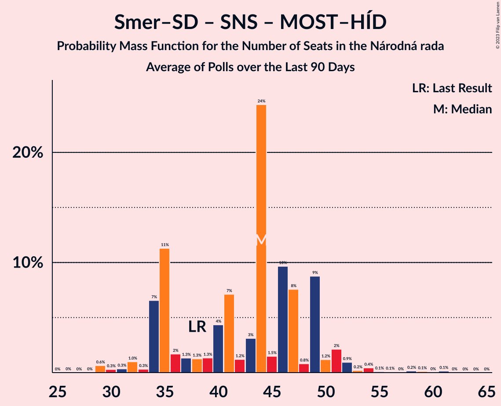

# Poll Average

<a href="#voting-intentions">Voting Intentions</a> | <a href="#seats">Seats</a> | <a href="#coalitions">Coalitions</a> | <a href="#technical-information">Technical Information</a>

## Summary

The table below lists the polls on which the average is based. They are the most recent polls (less than 90 days old) registered and analyzed so far.

| Period     | Polling firm/Commissioner(s) | Smer–SD | SaS | OĽaNO | NOVA | SNS | Kotleba–ĽSNS | SME RODINA | MOST–HÍD | KDH | SMK–MKP | PS | SPOLU | PS–SPOLU | ZĽ | DV | V |
|:----------:|:----------------------------:|:--:|:--:|:--:|:--:|:--:|:--:|:--:|:--:|:--:|:--:|:--:|:--:|:--:|:--:|:--:|:--:|
| 5 March 2016 | General Election | 28.3%   49 | 12.1%   21 | 11.0%   17 | 11.0%   2 | 8.6%   15 | 8.0%   14 | 6.6%   11 | 6.5%   11 | 4.9%   0 | 4.0%   0 | 0.0%   0 | 0.0%   0 | 0.0%   0 | 0.0%   0 | 0.0%   0 | 0.0%   0 |
| N/A | Poll Average | 18–23%   32–43 | 4–8%   0–13 | 5–8%   0–16 | N/A   N/A | 5–8%   10–16 | 9–14%   16–24 | 4–8%   0–15 | 3–5%   0–10 | 4–7%   0–14 | 2–5%   0 | N/A   N/A | N/A   N/A | 10–14%   15–26 | 9–14%   16–24 | 1–4%   0 | 1–4%   0 |
| [9–13 November 2019](2019-11-13-Polis.html) | Polis | 18–23%   33–44 | 4–7%   0–12 | 6–9%   11–18 | N/A   N/A | 5–8%   9–15 | 9–13%   17–25 | 4–7%   0–13 | 3–5%   0–10 | 5–8%   0–14 | 3–5%   0–9 | N/A   N/A | N/A   N/A | 9–13%   15–25 | 9–13%   18–25 | 2–4%   0 | 2–5%   0 |
| [30 October–6 November 2019](2019-11-06-FOCUS.html) | FOCUS | 18–23%   32–43 | 4–7%   0–12 | 4–7%   0–14 | N/A   N/A | 5–8%   10–16 | 9–12%   15–23 | 6–9%   10–17 | 3–6%   0–10 | 4–7%   0–13 | 3–5%   0–9 | N/A   N/A | N/A   N/A | 10–14%   18–26 | 9–13%   16–24 | 2–4%   0 | 2–4%   0 |
| [7–10 October 2019](2019-10-10-AKO.html) | AKO | 18–23%   32–38 | 5–8%   10–14 | 5–7%   0–12 | N/A   N/A | 5–8%   10–13 | 10–14%   16–24 | 5–8%   0–12 | 3–5%   0 | 4–7%   0–12 | 2–4%   0 | N/A   N/A | N/A   N/A | 11–15%   20–27 | 10–14%   19–23 | 1–3%   0 | 1–2%   0 |
| 5 March 2016 | General Election | 28.3%   49 | 12.1%   21 | 11.0%   17 | 11.0%   2 | 8.6%   15 | 8.0%   14 | 6.6%   11 | 6.5%   11 | 4.9%   0 | 4.0%   0 | 0.0%   0 | 0.0%   0 | 0.0%   0 | 0.0%   0 | 0.0%   0 | 0.0%   0 |

Only polls for which at least the sample size has been published are included in the table above.

**Legend:**
+ **Top half of each row:** Voting intentions (95% confidence interval)
+ **Bottom half of each row:** Seat projections for the Národná rada (95% confidence interval)
+ **Smer–SD:** SMER–sociálna demokracia
+ **SaS:** Sloboda a Solidarita
+ **OĽaNO:** OBYČAJNÍ ĽUDIA a nezávislé osobnosti
+ **NOVA:** NOVA
+ **SNS:** Slovenská národná strana
+ **Kotleba–ĽSNS:** Kotleba–Ľudová strana Naše Slovensko
+ **SME RODINA:** SME RODINA
+ **MOST–HÍD:** MOST–HÍD
+ **KDH:** Kresťanskodemokratické hnutie
+ **SMK–MKP:** Strana maďarskej koalície–Magyar Koalíció Pártja
+ **PS:** Progresívne Slovensko
+ **SPOLU:** SPOLU–Občianska Demokracia
+ **PS–SPOLU:** Progresívne Slovensko–SPOLU–Občianska Demokracia
+ **ZĽ:** Za ľudí
+ **DV:** Dobrá voľba
+ **V:** VLASŤ
+ **N/A (single party):** Party not included the published results
+ **N/A (entire row):** Calculation for this opinion poll not started yet

## Voting Intentions

### Confidence Intervals

| Party | Last Result | Median | 80% Confidence Interval | 90% Confidence Interval | 95% Confidence Interval | 99% Confidence Interval |
|:-----:|:-----------:|:------:|:-----------------------:|:-----------------------:|:-----------------------:|:-----------------------:|
| <a href="#smer–sociálna-demokracia">SMER–sociálna demokracia</a> | 28.3% | 20.1% | 18.6–21.7% |18.1–22.2% | 17.8–22.6% | 17.0–23.4% |
| <a href="#sloboda-a-solidarita">Sloboda a Solidarita</a> | 12.1% | 5.5% | 4.4–7.2% |4.2–7.6% | 4.0–8.0% | 3.6–8.6% |
| <a href="#obyčajní-ľudia-a-nezávislé-osobnosti">OBYČAJNÍ ĽUDIA a nezávislé osobnosti</a> | 11.0% | 6.2% | 5.1–7.6% |4.8–7.9% | 4.6–8.3% | 4.2–8.9% |
| <a href="#nova">NOVA</a> | 11.0% | N/A | N/A |N/A | N/A | N/A |
| <a href="#slovenská-národná-strana">Slovenská národná strana</a> | 8.6% | 6.5% | 5.5–7.6% |5.2–7.9% | 5.0–8.2% | 4.6–8.8% |
| <a href="#kotleba–ľudová-strana-naše-slovensko">Kotleba–Ľudová strana Naše Slovensko</a> | 8.0% | 11.2% | 9.7–13.0% |9.3–13.5% | 9.0–13.9% | 8.4–14.7% |
| <a href="#sme-rodina">SME RODINA</a> | 6.6% | 6.0% | 4.8–7.5% |4.5–7.9% | 4.3–8.2% | 3.9–8.9% |
| <a href="#most–híd">MOST–HÍD</a> | 6.5% | 4.1% | 3.4–5.0% |3.2–5.2% | 3.0–5.4% | 2.7–5.9% |
| <a href="#kresťanskodemokratické-hnutie">Kresťanskodemokratické hnutie</a> | 4.9% | 5.8% | 4.9–6.8% |4.7–7.1% | 4.5–7.4% | 4.1–7.9% |
| <a href="#strana-maďarskej-koalície–magyar-koalíció-pártja">Strana maďarskej koalície–Magyar Koalíció Pártja</a> | 4.0% | 3.5% | 2.7–4.3% |2.5–4.5% | 2.4–4.8% | 2.1–5.2% |
| <a href="#progresívne-slovensko">Progresívne Slovensko</a> | 0.0% | N/A | N/A |N/A | N/A | N/A |
| <a href="#spolu–občianska-demokracia">SPOLU–Občianska Demokracia</a> | 0.0% | N/A | N/A |N/A | N/A | N/A |
| <a href="#progresívne-slovensko–spolu–občianska-demokracia">Progresívne Slovensko–SPOLU–Občianska Demokracia</a> | 0.0% | 11.8% | 10.4–13.5% |10.0–14.0% | 9.7–14.4% | 9.1–15.2% |
| <a href="#za-ľudí">Za ľudí</a> | 0.0% | 11.3% | 9.9–12.8% |9.5–13.3% | 9.2–13.7% | 8.6–14.4% |
| <a href="#dobrá-voľba">Dobrá voľba</a> | 0.0% | 2.4% | 1.5–3.4% |1.4–3.6% | 1.2–3.9% | 1.0–4.3% |
| <a href="#vlasť">VLASŤ</a> | 0.0% | 2.9% | 1.2–3.8% |1.0–4.1% | 0.9–4.3% | 0.7–4.8% |

### SMER–sociálna demokracia

*For a full overview of the results for this party, see the [SMER–sociálna demokracia](party-smer–sociálnademokracia.html) page.*

| Voting Intentions | Probability | Accumulated | Special Marks |
|:-----------------:|:-----------:|:-----------:|:-------------:|
| 14.5–15.5% | 0% | 100% |  |
| 15.5–16.5% | 0.1% | 100% |  |
| 16.5–17.5% | 1.5% | 99.9% |  |
| 17.5–18.5% | 8% | 98% |  |
| 18.5–19.5% | 22% | 90% |  |
| 19.5–20.5% | 31% | 68% | Median |
| 20.5–21.5% | 24% | 37% |  |
| 21.5–22.5% | 10% | 13% |  |
| 22.5–23.5% | 2% | 3% |  |
| 23.5–24.5% | 0.4% | 0.4% |  |
| 24.5–25.5% | 0% | 0% |  |
| 25.5–26.5% | 0% | 0% |  |
| 26.5–27.5% | 0% | 0% |  |
| 27.5–28.5% | 0% | 0% | Last Result |

### Sloboda a Solidarita

*For a full overview of the results for this party, see the [Sloboda a Solidarita](party-slobodaasolidarita.html) page.*

| Voting Intentions | Probability | Accumulated | Special Marks |
|:-----------------:|:-----------:|:-----------:|:-------------:|
| 1.5–2.5% | 0% | 100% |  |
| 2.5–3.5% | 0.3% | 100% |  |
| 3.5–4.5% | 13% | 99.7% |  |
| 4.5–5.5% | 37% | 87% |  |
| 5.5–6.5% | 28% | 50% | Median |
| 6.5–7.5% | 16% | 22% |  |
| 7.5–8.5% | 5% | 6% |  |
| 8.5–9.5% | 0.6% | 0.6% |  |
| 9.5–10.5% | 0% | 0% |  |
| 10.5–11.5% | 0% | 0% |  |
| 11.5–12.5% | 0% | 0% | Last Result |

### OBYČAJNÍ ĽUDIA a nezávislé osobnosti

*For a full overview of the results for this party, see the [OBYČAJNÍ ĽUDIA a nezávislé osobnosti](party-obyčajníľudiaanezávisléosobnosti.html) page.*

| Voting Intentions | Probability | Accumulated | Special Marks |
|:-----------------:|:-----------:|:-----------:|:-------------:|
| 2.5–3.5% | 0% | 100% |  |
| 3.5–4.5% | 2% | 100% |  |
| 4.5–5.5% | 22% | 98% |  |
| 5.5–6.5% | 39% | 75% | Median |
| 6.5–7.5% | 26% | 36% |  |
| 7.5–8.5% | 9% | 10% |  |
| 8.5–9.5% | 1.1% | 1.2% |  |
| 9.5–10.5% | 0.1% | 0.1% |  |
| 10.5–11.5% | 0% | 0% | Last Result |

### Slovenská národná strana

*For a full overview of the results for this party, see the [Slovenská národná strana](party-slovenskánárodnástrana.html) page.*

| Voting Intentions | Probability | Accumulated | Special Marks |
|:-----------------:|:-----------:|:-----------:|:-------------:|
| 2.5–3.5% | 0% | 100% |  |
| 3.5–4.5% | 0.4% | 100% |  |
| 4.5–5.5% | 11% | 99.6% |  |
| 5.5–6.5% | 43% | 89% | Median |
| 6.5–7.5% | 36% | 46% |  |
| 7.5–8.5% | 10% | 11% |  |
| 8.5–9.5% | 0.9% | 1.0% | Last Result |
| 9.5–10.5% | 0% | 0% |  |

### Kotleba–Ľudová strana Naše Slovensko

*For a full overview of the results for this party, see the [Kotleba–Ľudová strana Naše Slovensko](party-kotleba–ľudovástrananašeslovensko.html) page.*

| Voting Intentions | Probability | Accumulated | Special Marks |
|:-----------------:|:-----------:|:-----------:|:-------------:|
| 6.5–7.5% | 0% | 100% |  |
| 7.5–8.5% | 0.8% | 100% | Last Result |
| 8.5–9.5% | 7% | 99.2% |  |
| 9.5–10.5% | 22% | 92% |  |
| 10.5–11.5% | 30% | 70% | Median |
| 11.5–12.5% | 23% | 41% |  |
| 12.5–13.5% | 12% | 17% |  |
| 13.5–14.5% | 4% | 5% |  |
| 14.5–15.5% | 0.7% | 0.7% |  |
| 15.5–16.5% | 0.1% | 0.1% |  |
| 16.5–17.5% | 0% | 0% |  |

### SME RODINA

*For a full overview of the results for this party, see the [SME RODINA](party-smerodina.html) page.*

| Voting Intentions | Probability | Accumulated | Special Marks |
|:-----------------:|:-----------:|:-----------:|:-------------:|
| 2.5–3.5% | 0.1% | 100% |  |
| 3.5–4.5% | 5% | 99.9% |  |
| 4.5–5.5% | 27% | 95% |  |
| 5.5–6.5% | 35% | 68% | Median |
| 6.5–7.5% | 23% | 33% | Last Result |
| 7.5–8.5% | 8% | 9% |  |
| 8.5–9.5% | 1.2% | 1.2% |  |
| 9.5–10.5% | 0.1% | 0.1% |  |
| 10.5–11.5% | 0% | 0% |  |

### MOST–HÍD

*For a full overview of the results for this party, see the [MOST–HÍD](party-most–híd.html) page.*

| Voting Intentions | Probability | Accumulated | Special Marks |
|:-----------------:|:-----------:|:-----------:|:-------------:|
| 0.5–1.5% | 0% | 100% |  |
| 1.5–2.5% | 0.2% | 100% |  |
| 2.5–3.5% | 17% | 99.8% |  |
| 3.5–4.5% | 58% | 83% | Median |
| 4.5–5.5% | 23% | 24% |  |
| 5.5–6.5% | 2% | 2% |  |
| 6.5–7.5% | 0% | 0% | Last Result |

### Kresťanskodemokratické hnutie

*For a full overview of the results for this party, see the [Kresťanskodemokratické hnutie](party-kresťanskodemokratickéhnutie.html) page.*

| Voting Intentions | Probability | Accumulated | Special Marks |
|:-----------------:|:-----------:|:-----------:|:-------------:|
| 2.5–3.5% | 0% | 100% |  |
| 3.5–4.5% | 3% | 100% |  |
| 4.5–5.5% | 32% | 97% | Last Result |
| 5.5–6.5% | 47% | 65% | Median |
| 6.5–7.5% | 16% | 17% |  |
| 7.5–8.5% | 2% | 2% |  |
| 8.5–9.5% | 0.1% | 0.1% |  |
| 9.5–10.5% | 0% | 0% |  |

### Strana maďarskej koalície–Magyar Koalíció Pártja

*For a full overview of the results for this party, see the [Strana maďarskej koalície–Magyar Koalíció Pártja](party-stranamaďarskejkoalície–magyarkoalíciópártja.html) page.*

| Voting Intentions | Probability | Accumulated | Special Marks |
|:-----------------:|:-----------:|:-----------:|:-------------:|
| 0.5–1.5% | 0% | 100% |  |
| 1.5–2.5% | 5% | 100% |  |
| 2.5–3.5% | 50% | 95% | Median |
| 3.5–4.5% | 40% | 45% | Last Result |
| 4.5–5.5% | 5% | 5% |  |
| 5.5–6.5% | 0.1% | 0.1% |  |
| 6.5–7.5% | 0% | 0% |  |

### Progresívne Slovensko–SPOLU–Občianska Demokracia

*For a full overview of the results for this party, see the [Progresívne Slovensko–SPOLU–Občianska Demokracia](party-progresívneslovensko–spolu–občianskademokracia.html) page.*

| Voting Intentions | Probability | Accumulated | Special Marks |
|:-----------------:|:-----------:|:-----------:|:-------------:|
| 0.0–0.5% | 0% | 100% | Last Result |
| 0.5–1.5% | 0% | 100% |  |
| 1.5–2.5% | 0% | 100% |  |
| 2.5–3.5% | 0% | 100% |  |
| 3.5–4.5% | 0% | 100% |  |
| 4.5–5.5% | 0% | 100% |  |
| 5.5–6.5% | 0% | 100% |  |
| 6.5–7.5% | 0% | 100% |  |
| 7.5–8.5% | 0.1% | 100% |  |
| 8.5–9.5% | 2% | 99.9% |  |
| 9.5–10.5% | 11% | 98% |  |
| 10.5–11.5% | 28% | 87% |  |
| 11.5–12.5% | 30% | 59% | Median |
| 12.5–13.5% | 19% | 29% |  |
| 13.5–14.5% | 7% | 9% |  |
| 14.5–15.5% | 2% | 2% |  |
| 15.5–16.5% | 0.2% | 0.2% |  |
| 16.5–17.5% | 0% | 0% |  |

### Za ľudí

*For a full overview of the results for this party, see the [Za ľudí](party-zaľudí.html) page.*

| Voting Intentions | Probability | Accumulated | Special Marks |
|:-----------------:|:-----------:|:-----------:|:-------------:|
| 0.0–0.5% | 0% | 100% | Last Result |
| 0.5–1.5% | 0% | 100% |  |
| 1.5–2.5% | 0% | 100% |  |
| 2.5–3.5% | 0% | 100% |  |
| 3.5–4.5% | 0% | 100% |  |
| 4.5–5.5% | 0% | 100% |  |
| 5.5–6.5% | 0% | 100% |  |
| 6.5–7.5% | 0% | 100% |  |
| 7.5–8.5% | 0.4% | 100% |  |
| 8.5–9.5% | 5% | 99.6% |  |
| 9.5–10.5% | 20% | 95% |  |
| 10.5–11.5% | 34% | 75% | Median |
| 11.5–12.5% | 26% | 41% |  |
| 12.5–13.5% | 11% | 14% |  |
| 13.5–14.5% | 3% | 3% |  |
| 14.5–15.5% | 0.3% | 0.4% |  |
| 15.5–16.5% | 0% | 0% |  |

### Dobrá voľba

*For a full overview of the results for this party, see the [Dobrá voľba](party-dobrávoľba.html) page.*

| Voting Intentions | Probability | Accumulated | Special Marks |
|:-----------------:|:-----------:|:-----------:|:-------------:|
| 0.0–0.5% | 0% | 100% | Last Result |
| 0.5–1.5% | 10% | 100% |  |
| 1.5–2.5% | 46% | 90% | Median |
| 2.5–3.5% | 38% | 44% |  |
| 3.5–4.5% | 6% | 6% |  |
| 4.5–5.5% | 0.2% | 0.2% |  |
| 5.5–6.5% | 0% | 0% |  |

### VLASŤ

*For a full overview of the results for this party, see the [VLASŤ](party-vlasť.html) page.*

| Voting Intentions | Probability | Accumulated | Special Marks |
|:-----------------:|:-----------:|:-----------:|:-------------:|
| 0.0–0.5% | 0.1% | 100% | Last Result |
| 0.5–1.5% | 23% | 99.9% |  |
| 1.5–2.5% | 16% | 77% |  |
| 2.5–3.5% | 41% | 61% | Median |
| 3.5–4.5% | 19% | 20% |  |
| 4.5–5.5% | 1.1% | 1.1% |  |
| 5.5–6.5% | 0% | 0% |  |

## Seats

### Confidence Intervals

| Party | Last Result | Median | 80% Confidence Interval | 90% Confidence Interval | 95% Confidence Interval | 99% Confidence Interval |
|:-----:|:-----------:|:------:|:-----------------------:|:-----------------------:|:-----------------------:|:-----------------------:|
| <a href="#smer–sociálna-demokracia">SMER–sociálna demokracia</a> | 49 | 38 | 34–40 |33–41 | 32–43 | 31–45 |
| <a href="#sloboda-a-solidarita">Sloboda a Solidarita</a> | 21 | 10 | 0–11 |0–12 | 0–13 | 0–15 |
| <a href="#obyčajní-ľudia-a-nezávislé-osobnosti">OBYČAJNÍ ĽUDIA a nezávislé osobnosti</a> | 17 | 11 | 10–13 |9–14 | 0–16 | 0–18 |
| <a href="#nova">NOVA</a> | 2 | N/A | N/A |N/A | N/A | N/A |
| <a href="#slovenská-národná-strana">Slovenská národná strana</a> | 15 | 12 | 10–14 |10–15 | 10–16 | 0–16 |
| <a href="#kotleba–ľudová-strana-naše-slovensko">Kotleba–Ľudová strana Naše Slovensko</a> | 14 | 21 | 18–24 |16–24 | 16–24 | 15–27 |
| <a href="#sme-rodina">SME RODINA</a> | 11 | 10 | 0–13 |0–14 | 0–15 | 0–17 |
| <a href="#most–híd">MOST–HÍD</a> | 11 | 0 | 0–9 |0–9 | 0–10 | 0–11 |
| <a href="#kresťanskodemokratické-hnutie">Kresťanskodemokratické hnutie</a> | 0 | 11 | 0–12 |0–13 | 0–14 | 0–16 |
| <a href="#strana-maďarskej-koalície–magyar-koalíció-pártja">Strana maďarskej koalície–Magyar Koalíció Pártja</a> | 0 | 0 | 0 |0 | 0 | 0–10 |
| <a href="#progresívne-slovensko">Progresívne Slovensko</a> | 0 | N/A | N/A |N/A | N/A | N/A |
| <a href="#spolu–občianska-demokracia">SPOLU–Občianska Demokracia</a> | 0 | N/A | N/A |N/A | N/A | N/A |
| <a href="#progresívne-slovensko–spolu–občianska-demokracia">Progresívne Slovensko–SPOLU–Občianska Demokracia</a> | 0 | 22 | 18–24 |15–24 | 15–26 | 15–28 |
| <a href="#za-ľudí">Za ľudí</a> | 0 | 20 | 19–23 |18–23 | 16–24 | 15–27 |
| <a href="#dobrá-voľba">Dobrá voľba</a> | 0 | 0 | 0 |0 | 0 | 0 |
| <a href="#vlasť">VLASŤ</a> | 0 | 0 | 0 |0 | 0 | 0 |

### SMER–sociálna demokracia

*For a full overview of the results for this party, see the [SMER–sociálna demokracia](party-smer–sociálnademokracia.html) page.*

| Number of Seats | Probability | Accumulated | Special Marks |
|:---------------:|:-----------:|:-----------:|:-------------:|
| 29 | 0.2% | 100% |  |
| 30 | 0.1% | 99.8% |  |
| 31 | 0.4% | 99.7% |  |
| 32 | 3% | 99.3% |  |
| 33 | 2% | 96% |  |
| 34 | 6% | 94% |  |
| 35 | 18% | 88% |  |
| 36 | 3% | 70% |  |
| 37 | 10% | 67% |  |
| 38 | 43% | 56% | Median |
| 39 | 3% | 14% |  |
| 40 | 4% | 11% |  |
| 41 | 3% | 7% |  |
| 42 | 2% | 4% |  |
| 43 | 0.9% | 3% |  |
| 44 | 1.2% | 2% |  |
| 45 | 0.2% | 0.6% |  |
| 46 | 0.2% | 0.4% |  |
| 47 | 0.1% | 0.2% |  |
| 48 | 0% | 0.1% |  |
| 49 | 0% | 0% | Last Result |

### Sloboda a Solidarita

*For a full overview of the results for this party, see the [Sloboda a Solidarita](party-slobodaasolidarita.html) page.*

| Number of Seats | Probability | Accumulated | Special Marks |
|:---------------:|:-----------:|:-----------:|:-------------:|
| 0 | 36% | 100% |  |
| 1 | 0% | 64% |  |
| 2 | 0% | 64% |  |
| 3 | 0% | 64% |  |
| 4 | 0% | 64% |  |
| 5 | 0% | 64% |  |
| 6 | 0% | 64% |  |
| 7 | 0% | 64% |  |
| 8 | 0.1% | 64% |  |
| 9 | 2% | 64% |  |
| 10 | 41% | 62% | Median |
| 11 | 14% | 21% |  |
| 12 | 4% | 7% |  |
| 13 | 0.7% | 3% |  |
| 14 | 1.4% | 2% |  |
| 15 | 0.4% | 0.8% |  |
| 16 | 0.3% | 0.4% |  |
| 17 | 0.1% | 0.1% |  |
| 18 | 0% | 0% |  |
| 19 | 0% | 0% |  |
| 20 | 0% | 0% |  |
| 21 | 0% | 0% | Last Result |

### OBYČAJNÍ ĽUDIA a nezávislé osobnosti

*For a full overview of the results for this party, see the [OBYČAJNÍ ĽUDIA a nezávislé osobnosti](party-obyčajníľudiaanezávisléosobnosti.html) page.*

| Number of Seats | Probability | Accumulated | Special Marks |
|:---------------:|:-----------:|:-----------:|:-------------:|
| 0 | 4% | 100% |  |
| 1 | 0% | 96% |  |
| 2 | 0% | 96% |  |
| 3 | 0% | 96% |  |
| 4 | 0% | 96% |  |
| 5 | 0% | 96% |  |
| 6 | 0% | 96% |  |
| 7 | 0% | 96% |  |
| 8 | 0% | 96% |  |
| 9 | 2% | 96% |  |
| 10 | 29% | 94% |  |
| 11 | 23% | 65% | Median |
| 12 | 20% | 42% |  |
| 13 | 15% | 22% |  |
| 14 | 3% | 8% |  |
| 15 | 2% | 4% |  |
| 16 | 0.6% | 3% |  |
| 17 | 0.9% | 2% | Last Result |
| 18 | 1.0% | 1.2% |  |
| 19 | 0.2% | 0.2% |  |
| 20 | 0% | 0% |  |

### Slovenská národná strana

*For a full overview of the results for this party, see the [Slovenská národná strana](party-slovenskánárodnástrana.html) page.*

| Number of Seats | Probability | Accumulated | Special Marks |
|:---------------:|:-----------:|:-----------:|:-------------:|
| 0 | 1.2% | 100% |  |
| 1 | 0% | 98.8% |  |
| 2 | 0% | 98.8% |  |
| 3 | 0% | 98.8% |  |
| 4 | 0% | 98.8% |  |
| 5 | 0% | 98.8% |  |
| 6 | 0% | 98.8% |  |
| 7 | 0% | 98.8% |  |
| 8 | 0% | 98.8% |  |
| 9 | 0.9% | 98.8% |  |
| 10 | 17% | 98% |  |
| 11 | 7% | 81% |  |
| 12 | 35% | 74% | Median |
| 13 | 24% | 39% |  |
| 14 | 7% | 15% |  |
| 15 | 4% | 8% | Last Result |
| 16 | 4% | 5% |  |
| 17 | 0.1% | 0.2% |  |
| 18 | 0.1% | 0.1% |  |
| 19 | 0% | 0% |  |

### Kotleba–Ľudová strana Naše Slovensko

*For a full overview of the results for this party, see the [Kotleba–Ľudová strana Naše Slovensko](party-kotleba–ľudovástrananašeslovensko.html) page.*

| Number of Seats | Probability | Accumulated | Special Marks |
|:---------------:|:-----------:|:-----------:|:-------------:|
| 14 | 0.3% | 100% | Last Result |
| 15 | 0.9% | 99.6% |  |
| 16 | 5% | 98.8% |  |
| 17 | 4% | 94% |  |
| 18 | 21% | 91% |  |
| 19 | 6% | 69% |  |
| 20 | 5% | 63% |  |
| 21 | 15% | 58% | Median |
| 22 | 12% | 44% |  |
| 23 | 3% | 32% |  |
| 24 | 27% | 29% |  |
| 25 | 1.0% | 2% |  |
| 26 | 0.3% | 0.8% |  |
| 27 | 0.1% | 0.5% |  |
| 28 | 0.2% | 0.4% |  |
| 29 | 0% | 0.2% |  |
| 30 | 0.2% | 0.2% |  |
| 31 | 0% | 0% |  |

### SME RODINA

*For a full overview of the results for this party, see the [SME RODINA](party-smerodina.html) page.*

| Number of Seats | Probability | Accumulated | Special Marks |
|:---------------:|:-----------:|:-----------:|:-------------:|
| 0 | 23% | 100% |  |
| 1 | 0% | 77% |  |
| 2 | 0% | 77% |  |
| 3 | 0% | 77% |  |
| 4 | 0% | 77% |  |
| 5 | 0% | 77% |  |
| 6 | 0% | 77% |  |
| 7 | 0% | 77% |  |
| 8 | 0% | 77% |  |
| 9 | 13% | 77% |  |
| 10 | 28% | 64% | Median |
| 11 | 7% | 36% | Last Result |
| 12 | 7% | 29% |  |
| 13 | 13% | 22% |  |
| 14 | 6% | 8% |  |
| 15 | 1.4% | 3% |  |
| 16 | 0.6% | 1.5% |  |
| 17 | 0.4% | 0.8% |  |
| 18 | 0.2% | 0.5% |  |
| 19 | 0% | 0.3% |  |
| 20 | 0.2% | 0.2% |  |
| 21 | 0.1% | 0.1% |  |
| 22 | 0% | 0% |  |

### MOST–HÍD

*For a full overview of the results for this party, see the [MOST–HÍD](party-most–híd.html) page.*

| Number of Seats | Probability | Accumulated | Special Marks |
|:---------------:|:-----------:|:-----------:|:-------------:|
| 0 | 83% | 100% | Median |
| 1 | 0% | 17% |  |
| 2 | 0% | 17% |  |
| 3 | 0% | 17% |  |
| 4 | 0% | 17% |  |
| 5 | 0% | 17% |  |
| 6 | 0% | 17% |  |
| 7 | 0% | 17% |  |
| 8 | 0.1% | 17% |  |
| 9 | 13% | 17% |  |
| 10 | 3% | 4% |  |
| 11 | 0.9% | 1.0% | Last Result |
| 12 | 0.1% | 0.1% |  |
| 13 | 0% | 0% |  |

### Kresťanskodemokratické hnutie

*For a full overview of the results for this party, see the [Kresťanskodemokratické hnutie](party-kresťanskodemokratickéhnutie.html) page.*

| Number of Seats | Probability | Accumulated | Special Marks |
|:---------------:|:-----------:|:-----------:|:-------------:|
| 0 | 10% | 100% | Last Result |
| 1 | 0% | 90% |  |
| 2 | 0% | 90% |  |
| 3 | 0% | 90% |  |
| 4 | 0% | 90% |  |
| 5 | 0% | 90% |  |
| 6 | 0% | 90% |  |
| 7 | 0% | 90% |  |
| 8 | 0.1% | 90% |  |
| 9 | 17% | 90% |  |
| 10 | 9% | 73% |  |
| 11 | 30% | 64% | Median |
| 12 | 27% | 34% |  |
| 13 | 3% | 7% |  |
| 14 | 2% | 4% |  |
| 15 | 0.4% | 1.4% |  |
| 16 | 0.9% | 1.0% |  |
| 17 | 0% | 0% |  |

### Strana maďarskej koalície–Magyar Koalíció Pártja

*For a full overview of the results for this party, see the [Strana maďarskej koalície–Magyar Koalíció Pártja](party-stranamaďarskejkoalície–magyarkoalíciópártja.html) page.*

| Number of Seats | Probability | Accumulated | Special Marks |
|:---------------:|:-----------:|:-----------:|:-------------:|
| 0 | 98% | 100% | Last Result, Median |
| 1 | 0% | 2% |  |
| 2 | 0% | 2% |  |
| 3 | 0% | 2% |  |
| 4 | 0% | 2% |  |
| 5 | 0% | 2% |  |
| 6 | 0% | 2% |  |
| 7 | 0% | 2% |  |
| 8 | 0% | 2% |  |
| 9 | 0.7% | 2% |  |
| 10 | 1.2% | 1.2% |  |
| 11 | 0% | 0% |  |

### Progresívne Slovensko–SPOLU–Občianska Demokracia

*For a full overview of the results for this party, see the [Progresívne Slovensko–SPOLU–Občianska Demokracia](party-progresívneslovensko–spolu–občianskademokracia.html) page.*

| Number of Seats | Probability | Accumulated | Special Marks |
|:---------------:|:-----------:|:-----------:|:-------------:|
| 0 | 0% | 100% | Last Result |
| 1 | 0% | 100% |  |
| 2 | 0% | 100% |  |
| 3 | 0% | 100% |  |
| 4 | 0% | 100% |  |
| 5 | 0% | 100% |  |
| 6 | 0% | 100% |  |
| 7 | 0% | 100% |  |
| 8 | 0% | 100% |  |
| 9 | 0% | 100% |  |
| 10 | 0% | 100% |  |
| 11 | 0% | 100% |  |
| 12 | 0% | 100% |  |
| 13 | 0% | 100% |  |
| 14 | 0% | 100% |  |
| 15 | 8% | 100% |  |
| 16 | 0.2% | 92% |  |
| 17 | 0.8% | 92% |  |
| 18 | 2% | 91% |  |
| 19 | 3% | 89% |  |
| 20 | 5% | 86% |  |
| 21 | 7% | 81% |  |
| 22 | 26% | 74% | Median |
| 23 | 21% | 48% |  |
| 24 | 23% | 28% |  |
| 25 | 2% | 5% |  |
| 26 | 1.3% | 3% |  |
| 27 | 0.8% | 1.5% |  |
| 28 | 0.4% | 0.6% |  |
| 29 | 0% | 0.3% |  |
| 30 | 0.2% | 0.2% |  |
| 31 | 0% | 0.1% |  |
| 32 | 0% | 0% |  |

### Za ľudí

*For a full overview of the results for this party, see the [Za ľudí](party-zaľudí.html) page.*

| Number of Seats | Probability | Accumulated | Special Marks |
|:---------------:|:-----------:|:-----------:|:-------------:|
| 0 | 0% | 100% | Last Result |
| 1 | 0% | 100% |  |
| 2 | 0% | 100% |  |
| 3 | 0% | 100% |  |
| 4 | 0% | 100% |  |
| 5 | 0% | 100% |  |
| 6 | 0% | 100% |  |
| 7 | 0% | 100% |  |
| 8 | 0% | 100% |  |
| 9 | 0% | 100% |  |
| 10 | 0% | 100% |  |
| 11 | 0% | 100% |  |
| 12 | 0% | 100% |  |
| 13 | 0% | 100% |  |
| 14 | 0.1% | 100% |  |
| 15 | 0.4% | 99.9% |  |
| 16 | 2% | 99.5% |  |
| 17 | 1.1% | 97% |  |
| 18 | 3% | 96% |  |
| 19 | 35% | 93% |  |
| 20 | 35% | 58% | Median |
| 21 | 9% | 23% |  |
| 22 | 3% | 14% |  |
| 23 | 5% | 10% |  |
| 24 | 3% | 5% |  |
| 25 | 0.7% | 2% |  |
| 26 | 0.7% | 1.3% |  |
| 27 | 0.2% | 0.6% |  |
| 28 | 0.3% | 0.3% |  |
| 29 | 0% | 0.1% |  |
| 30 | 0% | 0% |  |

### Dobrá voľba

*For a full overview of the results for this party, see the [Dobrá voľba](party-dobrávoľba.html) page.*

| Number of Seats | Probability | Accumulated | Special Marks |
|:---------------:|:-----------:|:-----------:|:-------------:|
| 0 | 100% | 100% | Last Result, Median |

### VLASŤ

*For a full overview of the results for this party, see the [VLASŤ](party-vlasť.html) page.*

| Number of Seats | Probability | Accumulated | Special Marks |
|:---------------:|:-----------:|:-----------:|:-------------:|
| 0 | 99.9% | 100% | Last Result, Median |
| 1 | 0% | 0.1% |  |
| 2 | 0% | 0.1% |  |
| 3 | 0% | 0.1% |  |
| 4 | 0% | 0.1% |  |
| 5 | 0% | 0.1% |  |
| 6 | 0% | 0.1% |  |
| 7 | 0% | 0.1% |  |
| 8 | 0% | 0.1% |  |
| 9 | 0% | 0.1% |  |
| 10 | 0.1% | 0.1% |  |
| 11 | 0% | 0% |  |

## Coalitions

### Confidence Intervals

| Coalition | Last Result | Median | Majority? | 80% Confidence Interval | 90% Confidence Interval | 95% Confidence Interval | 99% Confidence Interval |
|:---------:|:-----------:|:------:|:---------:|:-----------------------:|:-----------------------:|:-----------------------:|:-----------------------:|
| SMER–sociálna demokracia – Slovenská národná strana – MOST–HÍD | 75 | 50 | 0% | 45–59 | 44–59 | 43–59 | 41–63 |
| SMER–sociálna demokracia | 49 | 38 | 0% | 34–40 | 33–41 | 32–43 | 31–45 |

### SMER–sociálna demokracia – Slovenská národná strana – MOST–HÍD

| Number of Seats | Probability | Accumulated | Special Marks |
|:---------------:|:-----------:|:-----------:|:-------------:|
| 35 | 0% | 100% |  |
| 36 | 0% | 99.9% |  |
| 37 | 0.1% | 99.9% |  |
| 38 | 0% | 99.8% |  |
| 39 | 0% | 99.8% |  |
| 40 | 0.1% | 99.7% |  |
| 41 | 0.3% | 99.7% |  |
| 42 | 2% | 99.4% |  |
| 43 | 2% | 98% |  |
| 44 | 0.8% | 96% |  |
| 45 | 12% | 95% |  |
| 46 | 2% | 83% |  |
| 47 | 1.0% | 81% |  |
| 48 | 9% | 80% |  |
| 49 | 11% | 71% |  |
| 50 | 12% | 61% | Median |
| 51 | 19% | 49% |  |
| 52 | 3% | 30% |  |
| 53 | 2% | 27% |  |
| 54 | 5% | 25% |  |
| 55 | 2% | 20% |  |
| 56 | 2% | 18% |  |
| 57 | 1.5% | 16% |  |
| 58 | 1.4% | 14% |  |
| 59 | 12% | 13% |  |
| 60 | 0.4% | 1.4% |  |
| 61 | 0.3% | 1.0% |  |
| 62 | 0.3% | 0.8% |  |
| 63 | 0.1% | 0.5% |  |
| 64 | 0.2% | 0.4% |  |
| 65 | 0% | 0.2% |  |
| 66 | 0.1% | 0.1% |  |
| 67 | 0% | 0.1% |  |
| 68 | 0% | 0% |  |
| 69 | 0% | 0% |  |
| 70 | 0% | 0% |  |
| 71 | 0% | 0% |  |
| 72 | 0% | 0% |  |
| 73 | 0% | 0% |  |
| 74 | 0% | 0% |  |
| 75 | 0% | 0% | Last Result |

### SMER–sociálna demokracia

| Number of Seats | Probability | Accumulated | Special Marks |
|:---------------:|:-----------:|:-----------:|:-------------:|
| 29 | 0.2% | 100% |  |
| 30 | 0.1% | 99.8% |  |
| 31 | 0.4% | 99.7% |  |
| 32 | 3% | 99.3% |  |
| 33 | 2% | 96% |  |
| 34 | 6% | 94% |  |
| 35 | 18% | 88% |  |
| 36 | 3% | 70% |  |
| 37 | 10% | 67% |  |
| 38 | 43% | 56% | Median |
| 39 | 3% | 14% |  |
| 40 | 4% | 11% |  |
| 41 | 3% | 7% |  |
| 42 | 2% | 4% |  |
| 43 | 0.9% | 3% |  |
| 44 | 1.2% | 2% |  |
| 45 | 0.2% | 0.6% |  |
| 46 | 0.2% | 0.4% |  |
| 47 | 0.1% | 0.2% |  |
| 48 | 0% | 0.1% |  |
| 49 | 0% | 0% | Last Result |

## Technical Information

+ **Number of polls included in this average:** 3
+ **Lowest number of simulations done in a poll included in this average:** 131,072
+ **Total number of simulations done in the polls included in this average:** 2,228,224
+ **Error estimate:** 3.40%
