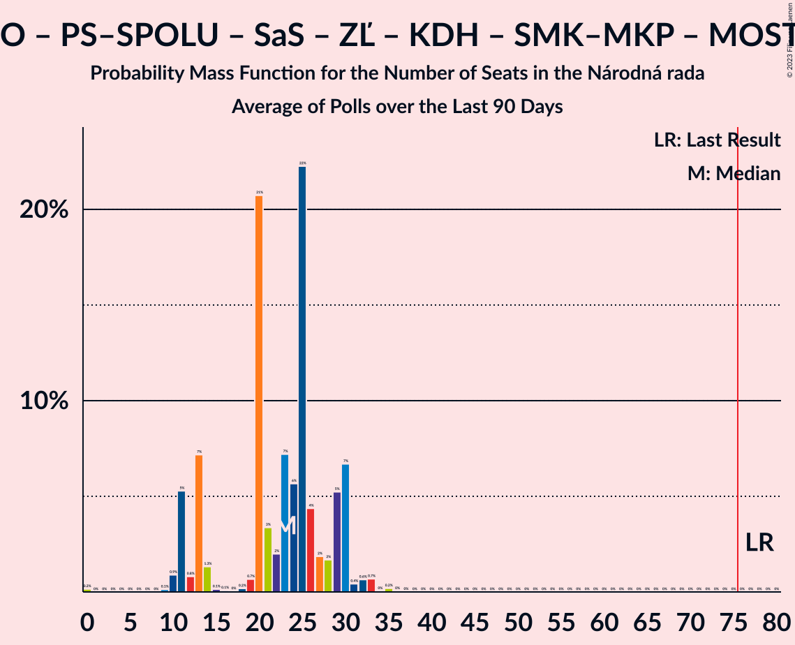

# Poll Average

<a href="#voting-intentions">Voting Intentions</a> | <a href="#seats">Seats</a> | <a href="#coalitions">Coalitions</a> | <a href="#technical-information">Technical Information</a>

## Summary

The table below lists the polls on which the average is based. They are the most recent polls (less than 90 days old) registered and analyzed so far.

| Period     | Polling firm/Commissioner(s) | OĽaNO | Smer–SD | SME RODINA | Kotleba–ĽSNS | PS–SPOLU | SaS | ZĽ | KDH | SMK–MKP | SNS | DV | V | MOST–HÍD | NOVA | PS | SPOLU |
|:----------:|:----------------------------:|:--:|:--:|:--:|:--:|:--:|:--:|:--:|:--:|:--:|:--:|:--:|:--:|:--:|:--:|:--:|:--:|
| 29 February 2020 | General Election | 25.0%   53 | 18.3%   38 | 8.2%   17 | 8.0%   17 | 7.0%   0 | 6.2%   13 | 5.8%   12 | 4.6%   0 | 3.9%   0 | 3.2%   0 | 3.1%   0 | 2.9%   0 | 2.0%   0 | 0.0%   0 | 7.0%   0 | 7.0%   0 |
| N/A | Poll Average | 21–32%   37–57 | 17–24%   33–46 | 7–13%   13–21 | 5–11%   11–18 | 6–9%   0–17 | 7–11%   12–19 | 2–6%   0–10 | 3–6%   0–11 | 3–6%   0–9 | 1–3%   0 | 1–3%   0 | 1–3%   0 | 0–2%   0 | N/A   N/A | 5–8%   9–13 | 0–2%   0 |
| [14–21 May 2020](2020-05-21-FOCUS.html) | FOCUS | 20–26%   33–44 | 19–24%   33–38 | 9–13%   17–21 | 8–12%   15–18 | N/A   N/A | 6–10%   11–16 | 3–6%   0–9 | 4–6%   0–11 | 3–6%   0–8 | 1–2%   0 | 1–3%   0 | 1–2%   0 | 1–2%   0 | N/A   N/A | 5–8%   11 | 0–1%   0 |
| [14–17 April 2020](2020-04-17-AKO.html) | AKO | 27–33%   51–56 | 16–21%   32–35 | 8–12%   19–21 | 5–8%   11–13 | N/A   N/A | 8–12%   17–20 | 2–4%   0 | 3–5%   0 | 3–6%   0–11 | 1–3%   0 | 1–3%   0 | 1–3%   0 | 0–1%   0 | N/A   N/A | 5–8%   0–13 | 0–2%   0 |
| [4–8 April 2020](2020-04-08-Polis.html) | Polis | 24–29%   44–59 | 19–24%   34–48 | 6–10%   12–19 | 6–9%   11–18 | 6–9%   0–17 | 7–10%   12–19 | 4–6%   0–11 | 3–5%   0–10 | N/A   N/A | N/A   N/A | N/A   N/A | N/A   N/A | N/A   N/A | N/A   N/A | N/A   N/A | N/A   N/A |
| 29 February 2020 | General Election | 25.0%   53 | 18.3%   38 | 8.2%   17 | 8.0%   17 | 7.0%   0 | 6.2%   13 | 5.8%   12 | 4.6%   0 | 3.9%   0 | 3.2%   0 | 3.1%   0 | 2.9%   0 | 2.0%   0 | 0.0%   0 | 7.0%   0 | 7.0%   0 |

Only polls for which at least the sample size has been published are included in the table above.

**Legend:**
+ **Top half of each row:** Voting intentions (95% confidence interval)
+ **Bottom half of each row:** Seat projections for the Národná rada (95% confidence interval)
+ **OĽaNO:** OBYČAJNÍ ĽUDIA a nezávislé osobnosti
+ **Smer–SD:** SMER–sociálna demokracia
+ **SME RODINA:** SME RODINA
+ **Kotleba–ĽSNS:** Kotleba–Ľudová strana Naše Slovensko
+ **PS–SPOLU:** Progresívne Slovensko–SPOLU–Občianska Demokracia
+ **SaS:** Sloboda a Solidarita
+ **ZĽ:** Za ľudí
+ **KDH:** Kresťanskodemokratické hnutie
+ **SMK–MKP:** Strana maďarskej koalície–Magyar Koalíció Pártja
+ **SNS:** Slovenská národná strana
+ **DV:** Dobrá voľba
+ **V:** VLASŤ
+ **MOST–HÍD:** MOST–HÍD
+ **NOVA:** NOVA
+ **PS:** Progresívne Slovensko
+ **SPOLU:** SPOLU–Občianska Demokracia
+ **N/A (single party):** Party not included the published results
+ **N/A (entire row):** Calculation for this opinion poll not started yet

## Voting Intentions

### Confidence Intervals

| Party | Last Result | Median | 80% Confidence Interval | 90% Confidence Interval | 95% Confidence Interval | 99% Confidence Interval |
|:-----:|:-----------:|:------:|:-----------------------:|:-----------------------:|:-----------------------:|:-----------------------:|
| <a href="#obyčajní-ľudia-a-nezávislé-osobnosti">OBYČAJNÍ ĽUDIA a nezávislé osobnosti</a> | 25.0% | 26.2% | 22.3–30.7% |21.6–31.4% | 21.1–32.0% | 20.2–33.1% |
| <a href="#smer–sociálna-demokracia">SMER–sociálna demokracia</a> | 18.3% | 20.6% | 17.7–22.8% |17.1–23.3% | 16.6–23.8% | 15.8–24.7% |
| <a href="#sme-rodina">SME RODINA</a> | 8.2% | 9.9% | 7.6–11.9% |7.2–12.3% | 6.9–12.7% | 6.3–13.5% |
| <a href="#kotleba–ľudová-strana-naše-slovensko">Kotleba–Ľudová strana Naše Slovensko</a> | 8.0% | 7.7% | 6.0–10.2% |5.7–10.7% | 5.4–11.1% | 4.9–11.9% |
| <a href="#progresívne-slovensko–spolu–občianska-demokracia">Progresívne Slovensko–SPOLU–Občianska Demokracia</a> | 7.0% | 7.5% | 6.5–8.5% |6.2–8.8% | 6.0–9.1% | 5.6–9.7% |
| <a href="#progresívne-slovensko">Progresívne Slovensko</a> | 7.0% | 6.6% | 5.6–7.6% |5.4–7.9% | 5.1–8.2% | 4.7–8.8% |
| <a href="#spolu–občianska-demokracia">SPOLU–Občianska Demokracia</a> | 7.0% | 0.6% | 0.1–1.2% |0.1–1.4% | 0.1–1.6% | 0.0–1.9% |
| <a href="#sloboda-a-solidarita">Sloboda a Solidarita</a> | 6.2% | 8.6% | 7.3–10.3% |7.0–10.8% | 6.7–11.2% | 6.3–11.9% |
| <a href="#za-ľudí">Za ľudí</a> | 5.8% | 4.2% | 2.8–5.3% |2.5–5.6% | 2.3–5.9% | 2.0–6.4% |
| <a href="#kresťanskodemokratické-hnutie">Kresťanskodemokratické hnutie</a> | 4.6% | 4.3% | 3.3–5.4% |3.1–5.7% | 2.9–6.0% | 2.6–6.5% |
| <a href="#strana-maďarskej-koalície–magyar-koalíció-pártja">Strana maďarskej koalície–Magyar Koalíció Pártja</a> | 3.9% | 4.3% | 3.5–5.2% |3.3–5.5% | 3.2–5.7% | 2.9–6.2% |
| <a href="#slovenská-národná-strana">Slovenská národná strana</a> | 3.2% | 1.8% | 1.2–2.7% |1.0–2.9% | 0.9–3.1% | 0.7–3.5% |
| <a href="#dobrá-voľba">Dobrá voľba</a> | 3.1% | 2.2% | 1.6–2.8% |1.5–3.0% | 1.3–3.2% | 1.2–3.6% |
| <a href="#vlasť">VLASŤ</a> | 2.9% | 1.7% | 1.1–2.4% |0.9–2.6% | 0.8–2.8% | 0.7–3.2% |
| <a href="#most–híd">MOST–HÍD</a> | 2.0% | 1.1% | 0.5–1.9% |0.4–2.1% | 0.3–2.3% | 0.2–2.6% |
| <a href="#nova">NOVA</a> | 0.0% | N/A | N/A |N/A | N/A | N/A |

### OBYČAJNÍ ĽUDIA a nezávislé osobnosti

*For a full overview of the results for this party, see the [OBYČAJNÍ ĽUDIA a nezávislé osobnosti](party-obyčajníľudiaanezávisléosobnosti.html) page.*

| Voting Intentions | Probability | Accumulated | Special Marks |
|:-----------------:|:-----------:|:-----------:|:-------------:|
| 17.5–18.5% | 0% | 100% |  |
| 18.5–19.5% | 0.1% | 100% |  |
| 19.5–20.5% | 0.9% | 99.9% |  |
| 20.5–21.5% | 4% | 99.0% |  |
| 21.5–22.5% | 8% | 95% |  |
| 22.5–23.5% | 10% | 87% |  |
| 23.5–24.5% | 10% | 77% |  |
| 24.5–25.5% | 10% | 67% | Last Result |
| 25.5–26.5% | 11% | 57% | Median |
| 26.5–27.5% | 9% | 46% |  |
| 27.5–28.5% | 8% | 37% |  |
| 28.5–29.5% | 9% | 29% |  |
| 29.5–30.5% | 9% | 20% |  |
| 30.5–31.5% | 7% | 11% |  |
| 31.5–32.5% | 3% | 4% |  |
| 32.5–33.5% | 1.0% | 1.2% |  |
| 33.5–34.5% | 0.2% | 0.2% |  |
| 34.5–35.5% | 0% | 0% |  |

### SMER–sociálna demokracia

*For a full overview of the results for this party, see the [SMER–sociálna demokracia](party-smer–sociálnademokracia.html) page.*

| Voting Intentions | Probability | Accumulated | Special Marks |
|:-----------------:|:-----------:|:-----------:|:-------------:|
| 13.5–14.5% | 0% | 100% |  |
| 14.5–15.5% | 0.3% | 100% |  |
| 15.5–16.5% | 2% | 99.7% |  |
| 16.5–17.5% | 6% | 98% |  |
| 17.5–18.5% | 11% | 91% | Last Result |
| 18.5–19.5% | 13% | 80% |  |
| 19.5–20.5% | 16% | 68% |  |
| 20.5–21.5% | 21% | 52% | Median |
| 21.5–22.5% | 18% | 31% |  |
| 22.5–23.5% | 9% | 13% |  |
| 23.5–24.5% | 3% | 4% |  |
| 24.5–25.5% | 0.5% | 0.6% |  |
| 25.5–26.5% | 0.1% | 0.1% |  |
| 26.5–27.5% | 0% | 0% |  |

### SME RODINA

*For a full overview of the results for this party, see the [SME RODINA](party-smerodina.html) page.*

| Voting Intentions | Probability | Accumulated | Special Marks |
|:-----------------:|:-----------:|:-----------:|:-------------:|
| 4.5–5.5% | 0% | 100% |  |
| 5.5–6.5% | 1.0% | 100% |  |
| 6.5–7.5% | 8% | 99.0% |  |
| 7.5–8.5% | 17% | 91% | Last Result |
| 8.5–9.5% | 17% | 74% |  |
| 9.5–10.5% | 21% | 57% | Median |
| 10.5–11.5% | 21% | 35% |  |
| 11.5–12.5% | 11% | 15% |  |
| 12.5–13.5% | 3% | 4% |  |
| 13.5–14.5% | 0.4% | 0.5% |  |
| 14.5–15.5% | 0% | 0% |  |

### Kotleba–Ľudová strana Naše Slovensko

*For a full overview of the results for this party, see the [Kotleba–Ľudová strana Naše Slovensko](party-kotleba–ľudovástrananašeslovensko.html) page.*

| Voting Intentions | Probability | Accumulated | Special Marks |
|:-----------------:|:-----------:|:-----------:|:-------------:|
| 2.5–3.5% | 0% | 100% |  |
| 3.5–4.5% | 0.1% | 100% |  |
| 4.5–5.5% | 4% | 99.9% |  |
| 5.5–6.5% | 18% | 96% |  |
| 6.5–7.5% | 26% | 79% |  |
| 7.5–8.5% | 19% | 53% | Last Result, Median |
| 8.5–9.5% | 15% | 34% |  |
| 9.5–10.5% | 13% | 20% |  |
| 10.5–11.5% | 6% | 7% |  |
| 11.5–12.5% | 1.0% | 1.1% |  |
| 12.5–13.5% | 0.1% | 0.1% |  |
| 13.5–14.5% | 0% | 0% |  |

### Progresívne Slovensko

*For a full overview of the results for this party, see the [Progresívne Slovensko](party-progresívneslovensko.html) page.*

| Voting Intentions | Probability | Accumulated | Special Marks |
|:-----------------:|:-----------:|:-----------:|:-------------:|
| 2.5–3.5% | 0% | 100% |  |
| 3.5–4.5% | 0.2% | 100% |  |
| 4.5–5.5% | 8% | 99.8% |  |
| 5.5–6.5% | 41% | 92% |  |
| 6.5–7.5% | 39% | 51% | Last Result, Median |
| 7.5–8.5% | 11% | 12% |  |
| 8.5–9.5% | 0.9% | 1.0% |  |
| 9.5–10.5% | 0% | 0% |  |

### SPOLU–Občianska Demokracia

*For a full overview of the results for this party, see the [SPOLU–Občianska Demokracia](party-spolu–občianskademokracia.html) page.*

| Voting Intentions | Probability | Accumulated | Special Marks |
|:-----------------:|:-----------:|:-----------:|:-------------:|
| 0.0–0.5% | 48% | 100% |  |
| 0.5–1.5% | 49% | 52% | Median |
| 1.5–2.5% | 3% | 3% |  |
| 2.5–3.5% | 0% | 0% |  |
| 3.5–4.5% | 0% | 0% |  |
| 4.5–5.5% | 0% | 0% |  |
| 5.5–6.5% | 0% | 0% |  |
| 6.5–7.5% | 0% | 0% | Last Result |

### Progresívne Slovensko–SPOLU–Občianska Demokracia

*For a full overview of the results for this party, see the [Progresívne Slovensko–SPOLU–Občianska Demokracia](party-progresívneslovensko–spolu–občianskademokracia.html) page.*

| Voting Intentions | Probability | Accumulated | Special Marks |
|:-----------------:|:-----------:|:-----------:|:-------------:|
| 3.5–4.5% | 0% | 100% |  |
| 4.5–5.5% | 0.4% | 100% |  |
| 5.5–6.5% | 11% | 99.6% |  |
| 6.5–7.5% | 42% | 88% | Last Result, Median |
| 7.5–8.5% | 36% | 46% |  |
| 8.5–9.5% | 9% | 9% |  |
| 9.5–10.5% | 0.7% | 0.7% |  |
| 10.5–11.5% | 0% | 0% |  |

### Sloboda a Solidarita

*For a full overview of the results for this party, see the [Sloboda a Solidarita](party-slobodaasolidarita.html) page.*

| Voting Intentions | Probability | Accumulated | Special Marks |
|:-----------------:|:-----------:|:-----------:|:-------------:|
| 4.5–5.5% | 0% | 100% |  |
| 5.5–6.5% | 1.4% | 100% | Last Result |
| 6.5–7.5% | 14% | 98.6% |  |
| 7.5–8.5% | 32% | 85% |  |
| 8.5–9.5% | 29% | 52% | Median |
| 9.5–10.5% | 16% | 23% |  |
| 10.5–11.5% | 6% | 7% |  |
| 11.5–12.5% | 1.0% | 1.1% |  |
| 12.5–13.5% | 0.1% | 0.1% |  |
| 13.5–14.5% | 0% | 0% |  |

### Za ľudí

*For a full overview of the results for this party, see the [Za ľudí](party-zaľudí.html) page.*

| Voting Intentions | Probability | Accumulated | Special Marks |
|:-----------------:|:-----------:|:-----------:|:-------------:|
| 0.5–1.5% | 0% | 100% |  |
| 1.5–2.5% | 5% | 100% |  |
| 2.5–3.5% | 25% | 95% |  |
| 3.5–4.5% | 35% | 69% | Median |
| 4.5–5.5% | 28% | 34% |  |
| 5.5–6.5% | 6% | 6% | Last Result |
| 6.5–7.5% | 0.3% | 0.3% |  |
| 7.5–8.5% | 0% | 0% |  |

### Kresťanskodemokratické hnutie

*For a full overview of the results for this party, see the [Kresťanskodemokratické hnutie](party-kresťanskodemokratickéhnutie.html) page.*

| Voting Intentions | Probability | Accumulated | Special Marks |
|:-----------------:|:-----------:|:-----------:|:-------------:|
| 0.5–1.5% | 0% | 100% |  |
| 1.5–2.5% | 0.4% | 100% |  |
| 2.5–3.5% | 17% | 99.6% |  |
| 3.5–4.5% | 47% | 83% | Median |
| 4.5–5.5% | 29% | 36% | Last Result |
| 5.5–6.5% | 6% | 7% |  |
| 6.5–7.5% | 0.4% | 0.5% |  |
| 7.5–8.5% | 0% | 0% |  |

### Strana maďarskej koalície–Magyar Koalíció Pártja

*For a full overview of the results for this party, see the [Strana maďarskej koalície–Magyar Koalíció Pártja](party-stranamaďarskejkoalície–magyarkoalíciópártja.html) page.*

| Voting Intentions | Probability | Accumulated | Special Marks |
|:-----------------:|:-----------:|:-----------:|:-------------:|
| 1.5–2.5% | 0.1% | 100% |  |
| 2.5–3.5% | 10% | 99.9% |  |
| 3.5–4.5% | 53% | 90% | Last Result, Median |
| 4.5–5.5% | 33% | 37% |  |
| 5.5–6.5% | 4% | 4% |  |
| 6.5–7.5% | 0.1% | 0.1% |  |
| 7.5–8.5% | 0% | 0% |  |

### Slovenská národná strana

*For a full overview of the results for this party, see the [Slovenská národná strana](party-slovenskánárodnástrana.html) page.*

| Voting Intentions | Probability | Accumulated | Special Marks |
|:-----------------:|:-----------:|:-----------:|:-------------:|
| 0.0–0.5% | 0% | 100% |  |
| 0.5–1.5% | 33% | 100% |  |
| 1.5–2.5% | 53% | 67% | Median |
| 2.5–3.5% | 14% | 14% | Last Result |
| 3.5–4.5% | 0.5% | 0.5% |  |
| 4.5–5.5% | 0% | 0% |  |

### Dobrá voľba

*For a full overview of the results for this party, see the [Dobrá voľba](party-dobrávoľba.html) page.*

| Voting Intentions | Probability | Accumulated | Special Marks |
|:-----------------:|:-----------:|:-----------:|:-------------:|
| 0.0–0.5% | 0% | 100% |  |
| 0.5–1.5% | 8% | 100% |  |
| 1.5–2.5% | 71% | 92% | Median |
| 2.5–3.5% | 21% | 21% | Last Result |
| 3.5–4.5% | 0.6% | 0.6% |  |
| 4.5–5.5% | 0% | 0% |  |

### VLASŤ

*For a full overview of the results for this party, see the [VLASŤ](party-vlasť.html) page.*

| Voting Intentions | Probability | Accumulated | Special Marks |
|:-----------------:|:-----------:|:-----------:|:-------------:|
| 0.0–0.5% | 0.1% | 100% |  |
| 0.5–1.5% | 43% | 99.9% |  |
| 1.5–2.5% | 51% | 57% | Median |
| 2.5–3.5% | 6% | 6% | Last Result |
| 3.5–4.5% | 0.1% | 0.1% |  |
| 4.5–5.5% | 0% | 0% |  |

### MOST–HÍD

*For a full overview of the results for this party, see the [MOST–HÍD](party-most–híd.html) page.*

| Voting Intentions | Probability | Accumulated | Special Marks |
|:-----------------:|:-----------:|:-----------:|:-------------:|
| 0.0–0.5% | 16% | 100% |  |
| 0.5–1.5% | 59% | 84% | Median |
| 1.5–2.5% | 24% | 25% | Last Result |
| 2.5–3.5% | 0.7% | 0.7% |  |
| 3.5–4.5% | 0% | 0% |  |

## Seats

### Confidence Intervals

| Party | Last Result | Median | 80% Confidence Interval | 90% Confidence Interval | 95% Confidence Interval | 99% Confidence Interval |
|:-----:|:-----------:|:------:|:-----------------------:|:-----------------------:|:-----------------------:|:-----------------------:|
| <a href="#obyčajní-ľudia-a-nezávislé-osobnosti">OBYČAJNÍ ĽUDIA a nezávislé osobnosti</a> | 53 | 49 | 43–54 |43–54 | 37–57 | 33–59 |
| <a href="#smer–sociálna-demokracia">SMER–sociálna demokracia</a> | 38 | 38 | 34–43 |33–45 | 33–46 | 31–48 |
| <a href="#sme-rodina">SME RODINA</a> | 17 | 18 | 14–21 |13–21 | 13–21 | 12–21 |
| <a href="#kotleba–ľudová-strana-naše-slovensko">Kotleba–Ľudová strana Naše Slovensko</a> | 17 | 14 | 13–16 |12–17 | 11–18 | 10–19 |
| <a href="#progresívne-slovensko–spolu–občianska-demokracia">Progresívne Slovensko–SPOLU–Občianska Demokracia</a> | 0 | 14 | 0–16 |0–16 | 0–17 | 0–18 |
| <a href="#progresívne-slovensko">Progresívne Slovensko</a> | 0 | 11 | 11–13 |11–13 | 9–13 | 0–13 |
| <a href="#spolu–občianska-demokracia">SPOLU–Občianska Demokracia</a> | 0 | 0 | 0 |0 | 0 | 0 |
| <a href="#sloboda-a-solidarita">Sloboda a Solidarita</a> | 13 | 16 | 13–18 |13–18 | 12–19 | 11–20 |
| <a href="#za-ľudí">Za ľudí</a> | 12 | 0 | 0–9 |0–10 | 0–10 | 0–12 |
| <a href="#kresťanskodemokratické-hnutie">Kresťanskodemokratické hnutie</a> | 0 | 0 | 0–11 |0–11 | 0–11 | 0–11 |
| <a href="#strana-maďarskej-koalície–magyar-koalíció-pártja">Strana maďarskej koalície–Magyar Koalíció Pártja</a> | 0 | 0 | 0 |0–8 | 0–9 | 0–11 |
| <a href="#slovenská-národná-strana">Slovenská národná strana</a> | 0 | 0 | 0 |0 | 0 | 0 |
| <a href="#dobrá-voľba">Dobrá voľba</a> | 0 | 0 | 0 |0 | 0 | 0 |
| <a href="#vlasť">VLASŤ</a> | 0 | 0 | 0 |0 | 0 | 0 |
| <a href="#most–híd">MOST–HÍD</a> | 0 | 0 | 0 |0 | 0 | 0 |
| <a href="#nova">NOVA</a> | 0 | N/A | N/A |N/A | N/A | N/A |

### OBYČAJNÍ ĽUDIA a nezávislé osobnosti

*For a full overview of the results for this party, see the [OBYČAJNÍ ĽUDIA a nezávislé osobnosti](party-obyčajníľudiaanezávisléosobnosti.html) page.*

| Number of Seats | Probability | Accumulated | Special Marks |
|:---------------:|:-----------:|:-----------:|:-------------:|
| 33 | 2% | 100% |  |
| 34 | 0.1% | 98% |  |
| 35 | 0.1% | 98% |  |
| 36 | 0.1% | 98% |  |
| 37 | 0.1% | 98% |  |
| 38 | 0% | 97% |  |
| 39 | 0% | 97% |  |
| 40 | 0.1% | 97% |  |
| 41 | 0.3% | 97% |  |
| 42 | 0.3% | 97% |  |
| 43 | 26% | 97% |  |
| 44 | 6% | 71% |  |
| 45 | 2% | 65% |  |
| 46 | 2% | 64% |  |
| 47 | 0.8% | 62% |  |
| 48 | 4% | 61% |  |
| 49 | 7% | 57% | Median |
| 50 | 3% | 50% |  |
| 51 | 30% | 47% |  |
| 52 | 0.8% | 17% |  |
| 53 | 6% | 16% | Last Result |
| 54 | 6% | 10% |  |
| 55 | 0.7% | 4% |  |
| 56 | 0.4% | 3% |  |
| 57 | 0.7% | 3% |  |
| 58 | 0.9% | 2% |  |
| 59 | 1.0% | 1.3% |  |
| 60 | 0.1% | 0.3% |  |
| 61 | 0% | 0.2% |  |
| 62 | 0% | 0.2% |  |
| 63 | 0.1% | 0.1% |  |
| 64 | 0% | 0% |  |

### SMER–sociálna demokracia

*For a full overview of the results for this party, see the [SMER–sociálna demokracia](party-smer–sociálnademokracia.html) page.*

| Number of Seats | Probability | Accumulated | Special Marks |
|:---------------:|:-----------:|:-----------:|:-------------:|
| 27 | 0.1% | 100% |  |
| 28 | 0% | 99.9% |  |
| 29 | 0.1% | 99.9% |  |
| 30 | 0.1% | 99.8% |  |
| 31 | 0.2% | 99.6% |  |
| 32 | 1.0% | 99.4% |  |
| 33 | 6% | 98% |  |
| 34 | 3% | 92% |  |
| 35 | 32% | 89% |  |
| 36 | 2% | 57% |  |
| 37 | 3% | 56% |  |
| 38 | 28% | 53% | Last Result, Median |
| 39 | 2% | 25% |  |
| 40 | 5% | 23% |  |
| 41 | 5% | 18% |  |
| 42 | 3% | 14% |  |
| 43 | 3% | 10% |  |
| 44 | 2% | 8% |  |
| 45 | 1.4% | 5% |  |
| 46 | 2% | 4% |  |
| 47 | 0.4% | 2% |  |
| 48 | 0.7% | 1.1% |  |
| 49 | 0.2% | 0.5% |  |
| 50 | 0.1% | 0.2% |  |
| 51 | 0.1% | 0.1% |  |
| 52 | 0% | 0% |  |

### SME RODINA

*For a full overview of the results for this party, see the [SME RODINA](party-smerodina.html) page.*

| Number of Seats | Probability | Accumulated | Special Marks |
|:---------------:|:-----------:|:-----------:|:-------------:|
| 10 | 0.1% | 100% |  |
| 11 | 0.4% | 99.9% |  |
| 12 | 1.2% | 99.6% |  |
| 13 | 4% | 98% |  |
| 14 | 6% | 94% |  |
| 15 | 7% | 89% |  |
| 16 | 8% | 82% |  |
| 17 | 8% | 74% | Last Result |
| 18 | 26% | 66% | Median |
| 19 | 4% | 40% |  |
| 20 | 1.1% | 36% |  |
| 21 | 34% | 35% |  |
| 22 | 0.2% | 0.4% |  |
| 23 | 0.1% | 0.3% |  |
| 24 | 0.2% | 0.2% |  |
| 25 | 0% | 0% |  |

### Kotleba–Ľudová strana Naše Slovensko

*For a full overview of the results for this party, see the [Kotleba–Ľudová strana Naše Slovensko](party-kotleba–ľudovástrananašeslovensko.html) page.*

| Number of Seats | Probability | Accumulated | Special Marks |
|:---------------:|:-----------:|:-----------:|:-------------:|
| 0 | 0.1% | 100% |  |
| 1 | 0% | 99.9% |  |
| 2 | 0% | 99.9% |  |
| 3 | 0% | 99.9% |  |
| 4 | 0% | 99.9% |  |
| 5 | 0% | 99.9% |  |
| 6 | 0% | 99.9% |  |
| 7 | 0% | 99.9% |  |
| 8 | 0% | 99.9% |  |
| 9 | 0% | 99.9% |  |
| 10 | 0.5% | 99.9% |  |
| 11 | 2% | 99.4% |  |
| 12 | 4% | 97% |  |
| 13 | 37% | 94% |  |
| 14 | 10% | 57% | Median |
| 15 | 7% | 47% |  |
| 16 | 34% | 40% |  |
| 17 | 2% | 6% | Last Result |
| 18 | 4% | 4% |  |
| 19 | 0.6% | 0.7% |  |
| 20 | 0.1% | 0.1% |  |
| 21 | 0% | 0% |  |

### Progresívne Slovensko–SPOLU–Občianska Demokracia

*For a full overview of the results for this party, see the [Progresívne Slovensko–SPOLU–Občianska Demokracia](party-progresívneslovensko–spolu–občianskademokracia.html) page.*

| Number of Seats | Probability | Accumulated | Special Marks |
|:---------------:|:-----------:|:-----------:|:-------------:|
| 0 | 36% | 100% | Last Result |
| 1 | 0% | 64% |  |
| 2 | 0% | 64% |  |
| 3 | 0% | 64% |  |
| 4 | 0% | 64% |  |
| 5 | 0% | 64% |  |
| 6 | 0% | 64% |  |
| 7 | 0% | 64% |  |
| 8 | 0% | 64% |  |
| 9 | 0% | 64% |  |
| 10 | 0% | 64% |  |
| 11 | 0% | 64% |  |
| 12 | 1.4% | 64% |  |
| 13 | 9% | 63% |  |
| 14 | 27% | 53% | Median |
| 15 | 12% | 26% |  |
| 16 | 10% | 14% |  |
| 17 | 3% | 4% |  |
| 18 | 0.7% | 0.9% |  |
| 19 | 0.1% | 0.2% |  |
| 20 | 0% | 0% |  |

### Progresívne Slovensko

*For a full overview of the results for this party, see the [Progresívne Slovensko](party-progresívneslovensko.html) page.*

| Number of Seats | Probability | Accumulated | Special Marks |
|:---------------:|:-----------:|:-----------:|:-------------:|
| 0 | 2% | 100% | Last Result |
| 1 | 0% | 98% |  |
| 2 | 0% | 98% |  |
| 3 | 0% | 98% |  |
| 4 | 0% | 98% |  |
| 5 | 0% | 98% |  |
| 6 | 0% | 98% |  |
| 7 | 0% | 98% |  |
| 8 | 0% | 98% |  |
| 9 | 0.3% | 98% |  |
| 10 | 0.3% | 97% |  |
| 11 | 49% | 97% | Median |
| 12 | 2% | 48% |  |
| 13 | 45% | 46% |  |
| 14 | 0.3% | 0.5% |  |
| 15 | 0.1% | 0.2% |  |
| 16 | 0.1% | 0.1% |  |
| 17 | 0% | 0% |  |

### SPOLU–Občianska Demokracia

*For a full overview of the results for this party, see the [SPOLU–Občianska Demokracia](party-spolu–občianskademokracia.html) page.*

| Number of Seats | Probability | Accumulated | Special Marks |
|:---------------:|:-----------:|:-----------:|:-------------:|
| 0 | 100% | 100% | Last Result, Median |

### Sloboda a Solidarita

*For a full overview of the results for this party, see the [Sloboda a Solidarita](party-slobodaasolidarita.html) page.*

| Number of Seats | Probability | Accumulated | Special Marks |
|:---------------:|:-----------:|:-----------:|:-------------:|
| 11 | 2% | 100% |  |
| 12 | 1.1% | 98% |  |
| 13 | 26% | 96% | Last Result |
| 14 | 3% | 70% |  |
| 15 | 6% | 67% |  |
| 16 | 12% | 61% | Median |
| 17 | 38% | 49% |  |
| 18 | 7% | 10% |  |
| 19 | 1.5% | 4% |  |
| 20 | 2% | 2% |  |
| 21 | 0.1% | 0.2% |  |
| 22 | 0.1% | 0.1% |  |
| 23 | 0% | 0% |  |

### Za ľudí

*For a full overview of the results for this party, see the [Za ľudí](party-zaľudí.html) page.*

| Number of Seats | Probability | Accumulated | Special Marks |
|:---------------:|:-----------:|:-----------:|:-------------:|
| 0 | 83% | 100% | Median |
| 1 | 0% | 17% |  |
| 2 | 0% | 17% |  |
| 3 | 0% | 17% |  |
| 4 | 0% | 17% |  |
| 5 | 0% | 17% |  |
| 6 | 0% | 17% |  |
| 7 | 0% | 17% |  |
| 8 | 0% | 17% |  |
| 9 | 10% | 17% |  |
| 10 | 5% | 7% |  |
| 11 | 2% | 2% |  |
| 12 | 0.5% | 0.6% | Last Result |
| 13 | 0.1% | 0.1% |  |
| 14 | 0% | 0% |  |

### Kresťanskodemokratické hnutie

*For a full overview of the results for this party, see the [Kresťanskodemokratické hnutie](party-kresťanskodemokratickéhnutie.html) page.*

| Number of Seats | Probability | Accumulated | Special Marks |
|:---------------:|:-----------:|:-----------:|:-------------:|
| 0 | 69% | 100% | Last Result, Median |
| 1 | 0% | 31% |  |
| 2 | 0% | 31% |  |
| 3 | 0% | 31% |  |
| 4 | 0% | 31% |  |
| 5 | 0% | 31% |  |
| 6 | 0% | 31% |  |
| 7 | 0% | 31% |  |
| 8 | 0% | 31% |  |
| 9 | 4% | 31% |  |
| 10 | 1.4% | 26% |  |
| 11 | 25% | 25% |  |
| 12 | 0.4% | 0.4% |  |
| 13 | 0% | 0% |  |

### Strana maďarskej koalície–Magyar Koalíció Pártja

*For a full overview of the results for this party, see the [Strana maďarskej koalície–Magyar Koalíció Pártja](party-stranamaďarskejkoalície–magyarkoalíciópártja.html) page.*

| Number of Seats | Probability | Accumulated | Special Marks |
|:---------------:|:-----------:|:-----------:|:-------------:|
| 0 | 94% | 100% | Last Result, Median |
| 1 | 0% | 6% |  |
| 2 | 0% | 6% |  |
| 3 | 0% | 6% |  |
| 4 | 0% | 6% |  |
| 5 | 0% | 6% |  |
| 6 | 0% | 6% |  |
| 7 | 0% | 6% |  |
| 8 | 3% | 6% |  |
| 9 | 0.7% | 3% |  |
| 10 | 0.4% | 2% |  |
| 11 | 2% | 2% |  |
| 12 | 0% | 0% |  |

### Slovenská národná strana

*For a full overview of the results for this party, see the [Slovenská národná strana](party-slovenskánárodnástrana.html) page.*

| Number of Seats | Probability | Accumulated | Special Marks |
|:---------------:|:-----------:|:-----------:|:-------------:|
| 0 | 100% | 100% | Last Result, Median |

### Dobrá voľba

*For a full overview of the results for this party, see the [Dobrá voľba](party-dobrávoľba.html) page.*

| Number of Seats | Probability | Accumulated | Special Marks |
|:---------------:|:-----------:|:-----------:|:-------------:|
| 0 | 100% | 100% | Last Result, Median |

### VLASŤ

*For a full overview of the results for this party, see the [VLASŤ](party-vlasť.html) page.*

| Number of Seats | Probability | Accumulated | Special Marks |
|:---------------:|:-----------:|:-----------:|:-------------:|
| 0 | 100% | 100% | Last Result, Median |

### MOST–HÍD

*For a full overview of the results for this party, see the [MOST–HÍD](party-most–híd.html) page.*

| Number of Seats | Probability | Accumulated | Special Marks |
|:---------------:|:-----------:|:-----------:|:-------------:|
| 0 | 100% | 100% | Last Result, Median |

### NOVA

*For a full overview of the results for this party, see the [NOVA](party-nova.html) page.*

## Coalitions

### Confidence Intervals

| Coalition | Last Result | Median | Majority? | 80% Confidence Interval | 90% Confidence Interval | 95% Confidence Interval | 99% Confidence Interval |
|:---------:|:-----------:|:------:|:---------:|:-----------------------:|:-----------------------:|:-----------------------:|:-----------------------:|
| OBYČAJNÍ ĽUDIA a nezávislé osobnosti – SME RODINA – Progresívne Slovensko–SPOLU–Občianska Demokracia – Sloboda a Solidarita – Za ľudí – Kresťanskodemokratické hnutie – Strana maďarskej koalície–Magyar Koalíció Pártja – MOST–HÍD | 95 | 89 | 99.9% | 85–97 | 85–100 | 85–102 | 83–104 |
| OBYČAJNÍ ĽUDIA a nezávislé osobnosti – SME RODINA – Progresívne Slovensko–SPOLU–Občianska Demokracia – Sloboda a Solidarita – Za ľudí – Kresťanskodemokratické hnutie – Strana maďarskej koalície–Magyar Koalíció Pártja | 95 | 89 | 99.9% | 85–97 | 85–100 | 85–102 | 83–104 |
| OBYČAJNÍ ĽUDIA a nezávislé osobnosti – SME RODINA – Progresívne Slovensko–SPOLU–Občianska Demokracia – Sloboda a Solidarita – Za ľudí – Kresťanskodemokratické hnutie – MOST–HÍD | 95 | 89 | 99.9% | 85–97 | 85–99 | 80–101 | 79–103 |
| OBYČAJNÍ ĽUDIA a nezávislé osobnosti – SME RODINA – Progresívne Slovensko–SPOLU–Občianska Demokracia – Sloboda a Solidarita – Za ľudí – Kresťanskodemokratické hnutie | 95 | 89 | 99.9% | 85–97 | 85–99 | 80–101 | 79–103 |
| OBYČAJNÍ ĽUDIA a nezávislé osobnosti – Progresívne Slovensko–SPOLU–Občianska Demokracia – Sloboda a Solidarita – Za ľudí – Kresťanskodemokratické hnutie – Strana maďarskej koalície–Magyar Koalíció Pártja – MOST–HÍD | 78 | 68 | 29% | 67–82 | 67–85 | 67–86 | 65–89 |
| OBYČAJNÍ ĽUDIA a nezávislé osobnosti – Progresívne Slovensko–SPOLU–Občianska Demokracia – Sloboda a Solidarita – Za ľudí – Kresťanskodemokratické hnutie – Strana maďarskej koalície–Magyar Koalíció Pártja | 78 | 68 | 29% | 67–82 | 67–85 | 67–86 | 65–89 |
| OBYČAJNÍ ĽUDIA a nezávislé osobnosti – Progresívne Slovensko–SPOLU–Občianska Demokracia – Sloboda a Solidarita – Za ľudí – Kresťanskodemokratické hnutie – MOST–HÍD | 78 | 68 | 27% | 67–82 | 67–84 | 62–86 | 62–89 |
| OBYČAJNÍ ĽUDIA a nezávislé osobnosti – Progresívne Slovensko–SPOLU–Občianska Demokracia – Sloboda a Solidarita – Za ľudí – Kresťanskodemokratické hnutie | 78 | 68 | 27% | 67–82 | 67–84 | 62–86 | 62–89 |
| OBYČAJNÍ ĽUDIA a nezávislé osobnosti – Progresívne Slovensko–SPOLU–Občianska Demokracia – Sloboda a Solidarita – Za ľudí | 78 | 68 | 25% | 56–81 | 56–84 | 56–85 | 53–89 |
| SMER–sociálna demokracia – SME RODINA – Kotleba–Ľudová strana Naše Slovensko – Slovenská národná strana | 72 | 69 | 6% | 66–73 | 65–78 | 63–78 | 58–81 |
| SMER–sociálna demokracia – SME RODINA | 55 | 56 | 0% | 52–58 | 51–62 | 50–63 | 47–65 |
| SMER–sociálna demokracia – SME RODINA – Slovenská národná strana | 55 | 56 | 0% | 52–58 | 51–62 | 50–63 | 47–65 |
| SMER–sociálna demokracia – Slovenská národná strana – MOST–HÍD | 38 | 38 | 0% | 34–43 | 33–45 | 33–46 | 31–48 |
| SMER–sociálna demokracia | 38 | 38 | 0% | 34–43 | 33–45 | 33–46 | 31–48 |
| SMER–sociálna demokracia – Slovenská národná strana | 38 | 38 | 0% | 34–43 | 33–45 | 33–46 | 31–48 |
| Progresívne Slovensko–SPOLU–Občianska Demokracia – Sloboda a Solidarita – Za ľudí – Kresťanskodemokratické hnutie | 25 | 24 | 0% | 17–32 | 17–37 | 17–39 | 15–43 |
| Progresívne Slovensko–SPOLU–Občianska Demokracia – Sloboda a Solidarita – Za ľudí | 25 | 17 | 0% | 13–32 | 13–35 | 13–39 | 13–41 |

### OBYČAJNÍ ĽUDIA a nezávislé osobnosti – SME RODINA – Progresívne Slovensko–SPOLU–Občianska Demokracia – Sloboda a Solidarita – Za ľudí – Kresťanskodemokratické hnutie – Strana maďarskej koalície–Magyar Koalíció Pártja – MOST–HÍD

| Number of Seats | Probability | Accumulated | Special Marks |
|:---------------:|:-----------:|:-----------:|:-------------:|
| 75 | 0.1% | 100% |  |
| 76 | 0% | 99.9% | Majority |
| 77 | 0% | 99.9% |  |
| 78 | 0% | 99.9% |  |
| 79 | 0.1% | 99.9% |  |
| 80 | 0.1% | 99.8% |  |
| 81 | 0% | 99.7% |  |
| 82 | 0.2% | 99.7% |  |
| 83 | 0.2% | 99.5% |  |
| 84 | 0.2% | 99.3% |  |
| 85 | 24% | 99.1% |  |
| 86 | 0.3% | 75% |  |
| 87 | 3% | 75% |  |
| 88 | 0.8% | 71% |  |
| 89 | 32% | 71% |  |
| 90 | 7% | 39% |  |
| 91 | 2% | 31% |  |
| 92 | 2% | 29% |  |
| 93 | 2% | 27% |  |
| 94 | 4% | 25% |  |
| 95 | 5% | 21% | Last Result |
| 96 | 5% | 17% |  |
| 97 | 3% | 12% | Median |
| 98 | 2% | 9% |  |
| 99 | 2% | 7% |  |
| 100 | 1.5% | 6% |  |
| 101 | 1.5% | 4% |  |
| 102 | 0.8% | 3% |  |
| 103 | 0.3% | 2% |  |
| 104 | 2% | 2% |  |
| 105 | 0.1% | 0.2% |  |
| 106 | 0.1% | 0.1% |  |
| 107 | 0% | 0% |  |

### OBYČAJNÍ ĽUDIA a nezávislé osobnosti – SME RODINA – Progresívne Slovensko–SPOLU–Občianska Demokracia – Sloboda a Solidarita – Za ľudí – Kresťanskodemokratické hnutie – Strana maďarskej koalície–Magyar Koalíció Pártja

| Number of Seats | Probability | Accumulated | Special Marks |
|:---------------:|:-----------:|:-----------:|:-------------:|
| 75 | 0.1% | 100% |  |
| 76 | 0% | 99.9% | Majority |
| 77 | 0% | 99.9% |  |
| 78 | 0% | 99.9% |  |
| 79 | 0.1% | 99.9% |  |
| 80 | 0.1% | 99.8% |  |
| 81 | 0% | 99.7% |  |
| 82 | 0.2% | 99.7% |  |
| 83 | 0.2% | 99.5% |  |
| 84 | 0.2% | 99.3% |  |
| 85 | 24% | 99.1% |  |
| 86 | 0.3% | 75% |  |
| 87 | 3% | 75% |  |
| 88 | 0.8% | 71% |  |
| 89 | 32% | 71% |  |
| 90 | 7% | 39% |  |
| 91 | 2% | 31% |  |
| 92 | 2% | 29% |  |
| 93 | 2% | 27% |  |
| 94 | 4% | 25% |  |
| 95 | 5% | 21% | Last Result |
| 96 | 5% | 17% |  |
| 97 | 3% | 12% | Median |
| 98 | 2% | 9% |  |
| 99 | 2% | 7% |  |
| 100 | 1.5% | 6% |  |
| 101 | 1.5% | 4% |  |
| 102 | 0.8% | 3% |  |
| 103 | 0.3% | 2% |  |
| 104 | 2% | 2% |  |
| 105 | 0.1% | 0.2% |  |
| 106 | 0.1% | 0.1% |  |
| 107 | 0% | 0% |  |

### OBYČAJNÍ ĽUDIA a nezávislé osobnosti – SME RODINA – Progresívne Slovensko–SPOLU–Občianska Demokracia – Sloboda a Solidarita – Za ľudí – Kresťanskodemokratické hnutie – MOST–HÍD

| Number of Seats | Probability | Accumulated | Special Marks |
|:---------------:|:-----------:|:-----------:|:-------------:|
| 75 | 0.1% | 100% |  |
| 76 | 0% | 99.9% | Majority |
| 77 | 0% | 99.9% |  |
| 78 | 0% | 99.9% |  |
| 79 | 2% | 99.9% |  |
| 80 | 0.1% | 98% |  |
| 81 | 0.1% | 97% |  |
| 82 | 0.2% | 97% |  |
| 83 | 0.2% | 97% |  |
| 84 | 0.2% | 97% |  |
| 85 | 24% | 97% |  |
| 86 | 0.7% | 72% |  |
| 87 | 1.0% | 72% |  |
| 88 | 0.8% | 71% |  |
| 89 | 32% | 70% |  |
| 90 | 7% | 38% |  |
| 91 | 2% | 31% |  |
| 92 | 2% | 28% |  |
| 93 | 3% | 26% |  |
| 94 | 4% | 23% |  |
| 95 | 4% | 19% | Last Result |
| 96 | 5% | 15% |  |
| 97 | 3% | 10% | Median |
| 98 | 2% | 8% |  |
| 99 | 2% | 6% |  |
| 100 | 2% | 4% |  |
| 101 | 1.4% | 3% |  |
| 102 | 0.8% | 2% |  |
| 103 | 0.3% | 0.7% |  |
| 104 | 0.2% | 0.4% |  |
| 105 | 0.1% | 0.2% |  |
| 106 | 0.1% | 0.1% |  |
| 107 | 0% | 0% |  |

### OBYČAJNÍ ĽUDIA a nezávislé osobnosti – SME RODINA – Progresívne Slovensko–SPOLU–Občianska Demokracia – Sloboda a Solidarita – Za ľudí – Kresťanskodemokratické hnutie

| Number of Seats | Probability | Accumulated | Special Marks |
|:---------------:|:-----------:|:-----------:|:-------------:|
| 75 | 0.1% | 100% |  |
| 76 | 0% | 99.9% | Majority |
| 77 | 0% | 99.9% |  |
| 78 | 0% | 99.9% |  |
| 79 | 2% | 99.9% |  |
| 80 | 0.1% | 98% |  |
| 81 | 0.1% | 97% |  |
| 82 | 0.2% | 97% |  |
| 83 | 0.2% | 97% |  |
| 84 | 0.2% | 97% |  |
| 85 | 24% | 97% |  |
| 86 | 0.7% | 72% |  |
| 87 | 1.0% | 72% |  |
| 88 | 0.8% | 71% |  |
| 89 | 32% | 70% |  |
| 90 | 7% | 38% |  |
| 91 | 2% | 31% |  |
| 92 | 2% | 28% |  |
| 93 | 3% | 26% |  |
| 94 | 4% | 23% |  |
| 95 | 4% | 19% | Last Result |
| 96 | 5% | 15% |  |
| 97 | 3% | 10% | Median |
| 98 | 2% | 8% |  |
| 99 | 2% | 6% |  |
| 100 | 2% | 4% |  |
| 101 | 1.4% | 3% |  |
| 102 | 0.8% | 2% |  |
| 103 | 0.3% | 0.7% |  |
| 104 | 0.2% | 0.4% |  |
| 105 | 0.1% | 0.2% |  |
| 106 | 0.1% | 0.1% |  |
| 107 | 0% | 0% |  |

### OBYČAJNÍ ĽUDIA a nezávislé osobnosti – Progresívne Slovensko–SPOLU–Občianska Demokracia – Sloboda a Solidarita – Za ľudí – Kresťanskodemokratické hnutie – Strana maďarskej koalície–Magyar Koalíció Pártja – MOST–HÍD

| Number of Seats | Probability | Accumulated | Special Marks |
|:---------------:|:-----------:|:-----------:|:-------------:|
| 54 | 0.1% | 100% |  |
| 55 | 0% | 99.9% |  |
| 56 | 0% | 99.9% |  |
| 57 | 0% | 99.9% |  |
| 58 | 0% | 99.9% |  |
| 59 | 0% | 99.9% |  |
| 60 | 0.1% | 99.9% |  |
| 61 | 0.1% | 99.8% |  |
| 62 | 0.2% | 99.7% |  |
| 63 | 0% | 99.5% |  |
| 64 | 0% | 99.5% |  |
| 65 | 0% | 99.5% |  |
| 66 | 0.1% | 99.5% |  |
| 67 | 25% | 99.4% |  |
| 68 | 29% | 75% |  |
| 69 | 5% | 45% |  |
| 70 | 3% | 40% |  |
| 71 | 2% | 37% |  |
| 72 | 3% | 35% |  |
| 73 | 1.1% | 33% |  |
| 74 | 2% | 31% |  |
| 75 | 1.0% | 30% |  |
| 76 | 2% | 29% | Majority |
| 77 | 2% | 27% |  |
| 78 | 2% | 26% | Last Result |
| 79 | 4% | 24% | Median |
| 80 | 3% | 20% |  |
| 81 | 5% | 17% |  |
| 82 | 2% | 11% |  |
| 83 | 2% | 10% |  |
| 84 | 2% | 8% |  |
| 85 | 3% | 6% |  |
| 86 | 0.8% | 3% |  |
| 87 | 0.9% | 2% |  |
| 88 | 0.5% | 2% |  |
| 89 | 0.7% | 1.0% |  |
| 90 | 0.2% | 0.3% |  |
| 91 | 0.1% | 0.1% |  |
| 92 | 0% | 0.1% |  |
| 93 | 0% | 0% |  |

### OBYČAJNÍ ĽUDIA a nezávislé osobnosti – Progresívne Slovensko–SPOLU–Občianska Demokracia – Sloboda a Solidarita – Za ľudí – Kresťanskodemokratické hnutie – Strana maďarskej koalície–Magyar Koalíció Pártja

| Number of Seats | Probability | Accumulated | Special Marks |
|:---------------:|:-----------:|:-----------:|:-------------:|
| 54 | 0.1% | 100% |  |
| 55 | 0% | 99.9% |  |
| 56 | 0% | 99.9% |  |
| 57 | 0% | 99.9% |  |
| 58 | 0% | 99.9% |  |
| 59 | 0% | 99.9% |  |
| 60 | 0.1% | 99.9% |  |
| 61 | 0.1% | 99.8% |  |
| 62 | 0.2% | 99.7% |  |
| 63 | 0% | 99.5% |  |
| 64 | 0% | 99.5% |  |
| 65 | 0% | 99.5% |  |
| 66 | 0.1% | 99.5% |  |
| 67 | 25% | 99.4% |  |
| 68 | 29% | 75% |  |
| 69 | 5% | 45% |  |
| 70 | 3% | 40% |  |
| 71 | 2% | 37% |  |
| 72 | 3% | 35% |  |
| 73 | 1.1% | 33% |  |
| 74 | 2% | 31% |  |
| 75 | 1.0% | 30% |  |
| 76 | 2% | 29% | Majority |
| 77 | 2% | 27% |  |
| 78 | 2% | 26% | Last Result |
| 79 | 4% | 24% | Median |
| 80 | 3% | 20% |  |
| 81 | 5% | 17% |  |
| 82 | 2% | 11% |  |
| 83 | 2% | 10% |  |
| 84 | 2% | 8% |  |
| 85 | 3% | 6% |  |
| 86 | 0.8% | 3% |  |
| 87 | 0.9% | 2% |  |
| 88 | 0.5% | 2% |  |
| 89 | 0.7% | 1.0% |  |
| 90 | 0.2% | 0.3% |  |
| 91 | 0.1% | 0.1% |  |
| 92 | 0% | 0.1% |  |
| 93 | 0% | 0% |  |

### OBYČAJNÍ ĽUDIA a nezávislé osobnosti – Progresívne Slovensko–SPOLU–Občianska Demokracia – Sloboda a Solidarita – Za ľudí – Kresťanskodemokratické hnutie – MOST–HÍD

| Number of Seats | Probability | Accumulated | Special Marks |
|:---------------:|:-----------:|:-----------:|:-------------:|
| 54 | 0.1% | 100% |  |
| 55 | 0% | 99.9% |  |
| 56 | 0% | 99.9% |  |
| 57 | 0.1% | 99.9% |  |
| 58 | 0% | 99.8% |  |
| 59 | 0% | 99.7% |  |
| 60 | 0.1% | 99.7% |  |
| 61 | 0.1% | 99.6% |  |
| 62 | 2% | 99.6% |  |
| 63 | 0% | 97% |  |
| 64 | 0% | 97% |  |
| 65 | 0% | 97% |  |
| 66 | 0.1% | 97% |  |
| 67 | 24% | 97% |  |
| 68 | 29% | 73% |  |
| 69 | 6% | 43% |  |
| 70 | 0.4% | 38% |  |
| 71 | 2% | 37% |  |
| 72 | 3% | 35% |  |
| 73 | 1.2% | 32% |  |
| 74 | 3% | 31% |  |
| 75 | 0.9% | 28% |  |
| 76 | 2% | 27% | Majority |
| 77 | 2% | 25% |  |
| 78 | 2% | 24% | Last Result |
| 79 | 4% | 22% | Median |
| 80 | 3% | 18% |  |
| 81 | 5% | 15% |  |
| 82 | 2% | 10% |  |
| 83 | 2% | 8% |  |
| 84 | 2% | 7% |  |
| 85 | 2% | 5% |  |
| 86 | 0.8% | 3% |  |
| 87 | 0.9% | 2% |  |
| 88 | 0.5% | 1.5% |  |
| 89 | 0.7% | 1.0% |  |
| 90 | 0.2% | 0.3% |  |
| 91 | 0.1% | 0.1% |  |
| 92 | 0% | 0.1% |  |
| 93 | 0% | 0% |  |

### OBYČAJNÍ ĽUDIA a nezávislé osobnosti – Progresívne Slovensko–SPOLU–Občianska Demokracia – Sloboda a Solidarita – Za ľudí – Kresťanskodemokratické hnutie

| Number of Seats | Probability | Accumulated | Special Marks |
|:---------------:|:-----------:|:-----------:|:-------------:|
| 54 | 0.1% | 100% |  |
| 55 | 0% | 99.9% |  |
| 56 | 0% | 99.9% |  |
| 57 | 0.1% | 99.9% |  |
| 58 | 0% | 99.8% |  |
| 59 | 0% | 99.7% |  |
| 60 | 0.1% | 99.7% |  |
| 61 | 0.1% | 99.6% |  |
| 62 | 2% | 99.6% |  |
| 63 | 0% | 97% |  |
| 64 | 0% | 97% |  |
| 65 | 0% | 97% |  |
| 66 | 0.1% | 97% |  |
| 67 | 24% | 97% |  |
| 68 | 29% | 73% |  |
| 69 | 6% | 43% |  |
| 70 | 0.4% | 38% |  |
| 71 | 2% | 37% |  |
| 72 | 3% | 35% |  |
| 73 | 1.2% | 32% |  |
| 74 | 3% | 31% |  |
| 75 | 0.9% | 28% |  |
| 76 | 2% | 27% | Majority |
| 77 | 2% | 25% |  |
| 78 | 2% | 24% | Last Result |
| 79 | 4% | 22% | Median |
| 80 | 3% | 18% |  |
| 81 | 5% | 15% |  |
| 82 | 2% | 10% |  |
| 83 | 2% | 8% |  |
| 84 | 2% | 7% |  |
| 85 | 2% | 5% |  |
| 86 | 0.8% | 3% |  |
| 87 | 0.9% | 2% |  |
| 88 | 0.5% | 1.5% |  |
| 89 | 0.7% | 1.0% |  |
| 90 | 0.2% | 0.3% |  |
| 91 | 0.1% | 0.1% |  |
| 92 | 0% | 0.1% |  |
| 93 | 0% | 0% |  |

### OBYČAJNÍ ĽUDIA a nezávislé osobnosti – Progresívne Slovensko–SPOLU–Občianska Demokracia – Sloboda a Solidarita – Za ľudí

| Number of Seats | Probability | Accumulated | Special Marks |
|:---------------:|:-----------:|:-----------:|:-------------:|
| 45 | 0.1% | 100% |  |
| 46 | 0% | 99.9% |  |
| 47 | 0% | 99.9% |  |
| 48 | 0% | 99.9% |  |
| 49 | 0% | 99.9% |  |
| 50 | 0% | 99.9% |  |
| 51 | 0% | 99.9% |  |
| 52 | 0% | 99.9% |  |
| 53 | 2% | 99.9% |  |
| 54 | 0% | 98% |  |
| 55 | 0% | 98% |  |
| 56 | 24% | 98% |  |
| 57 | 0.5% | 73% |  |
| 58 | 0.1% | 73% |  |
| 59 | 0% | 73% |  |
| 60 | 0.2% | 73% |  |
| 61 | 0.1% | 73% |  |
| 62 | 0.3% | 73% |  |
| 63 | 0% | 72% |  |
| 64 | 0.1% | 72% |  |
| 65 | 0.9% | 72% |  |
| 66 | 0.1% | 71% |  |
| 67 | 0.3% | 71% |  |
| 68 | 30% | 71% |  |
| 69 | 5% | 41% |  |
| 70 | 0.6% | 36% |  |
| 71 | 3% | 35% |  |
| 72 | 3% | 33% |  |
| 73 | 1.3% | 30% |  |
| 74 | 2% | 29% |  |
| 75 | 1.0% | 26% |  |
| 76 | 2% | 25% | Majority |
| 77 | 2% | 24% |  |
| 78 | 2% | 22% | Last Result |
| 79 | 4% | 20% | Median |
| 80 | 3% | 16% |  |
| 81 | 5% | 13% |  |
| 82 | 2% | 9% |  |
| 83 | 2% | 7% |  |
| 84 | 2% | 5% |  |
| 85 | 1.4% | 4% |  |
| 86 | 0.6% | 2% |  |
| 87 | 0.7% | 2% |  |
| 88 | 0.3% | 1.0% |  |
| 89 | 0.5% | 0.7% |  |
| 90 | 0.1% | 0.2% |  |
| 91 | 0% | 0.1% |  |
| 92 | 0% | 0% |  |

### SMER–sociálna demokracia – SME RODINA – Kotleba–Ľudová strana Naše Slovensko – Slovenská národná strana

| Number of Seats | Probability | Accumulated | Special Marks |
|:---------------:|:-----------:|:-----------:|:-------------:|
| 57 | 0.4% | 100% |  |
| 58 | 0.2% | 99.6% |  |
| 59 | 0.1% | 99.4% |  |
| 60 | 0.2% | 99.3% |  |
| 61 | 0.8% | 99.0% |  |
| 62 | 0.5% | 98% |  |
| 63 | 1.0% | 98% |  |
| 64 | 1.4% | 97% |  |
| 65 | 4% | 95% |  |
| 66 | 2% | 92% |  |
| 67 | 3% | 90% |  |
| 68 | 2% | 87% |  |
| 69 | 37% | 85% |  |
| 70 | 8% | 49% | Median |
| 71 | 4% | 41% |  |
| 72 | 26% | 37% | Last Result |
| 73 | 2% | 10% |  |
| 74 | 2% | 9% |  |
| 75 | 0.9% | 7% |  |
| 76 | 0.6% | 6% | Majority |
| 77 | 0.7% | 6% |  |
| 78 | 3% | 5% |  |
| 79 | 1.2% | 2% |  |
| 80 | 0.4% | 1.1% |  |
| 81 | 0.3% | 0.7% |  |
| 82 | 0.2% | 0.4% |  |
| 83 | 0.2% | 0.2% |  |
| 84 | 0% | 0.1% |  |
| 85 | 0% | 0% |  |

### SMER–sociálna demokracia – SME RODINA

| Number of Seats | Probability | Accumulated | Special Marks |
|:---------------:|:-----------:|:-----------:|:-------------:|
| 44 | 0.1% | 100% |  |
| 45 | 0.1% | 99.9% |  |
| 46 | 0.1% | 99.8% |  |
| 47 | 0.7% | 99.7% |  |
| 48 | 0.5% | 99.0% |  |
| 49 | 1.0% | 98.6% |  |
| 50 | 2% | 98% |  |
| 51 | 4% | 96% |  |
| 52 | 2% | 91% |  |
| 53 | 3% | 90% |  |
| 54 | 9% | 87% |  |
| 55 | 5% | 77% | Last Result |
| 56 | 58% | 72% | Median |
| 57 | 3% | 15% |  |
| 58 | 2% | 11% |  |
| 59 | 2% | 9% |  |
| 60 | 1.4% | 7% |  |
| 61 | 1.0% | 6% |  |
| 62 | 0.8% | 5% |  |
| 63 | 3% | 4% |  |
| 64 | 0.6% | 1.4% |  |
| 65 | 0.6% | 0.8% |  |
| 66 | 0.1% | 0.2% |  |
| 67 | 0.1% | 0.1% |  |
| 68 | 0% | 0% |  |

### SMER–sociálna demokracia – SME RODINA – Slovenská národná strana

| Number of Seats | Probability | Accumulated | Special Marks |
|:---------------:|:-----------:|:-----------:|:-------------:|
| 44 | 0.1% | 100% |  |
| 45 | 0.1% | 99.9% |  |
| 46 | 0.1% | 99.8% |  |
| 47 | 0.7% | 99.7% |  |
| 48 | 0.5% | 99.0% |  |
| 49 | 1.0% | 98.6% |  |
| 50 | 2% | 98% |  |
| 51 | 4% | 96% |  |
| 52 | 2% | 91% |  |
| 53 | 3% | 90% |  |
| 54 | 9% | 87% |  |
| 55 | 5% | 77% | Last Result |
| 56 | 58% | 72% | Median |
| 57 | 3% | 15% |  |
| 58 | 2% | 11% |  |
| 59 | 2% | 9% |  |
| 60 | 1.4% | 7% |  |
| 61 | 1.0% | 6% |  |
| 62 | 0.8% | 5% |  |
| 63 | 3% | 4% |  |
| 64 | 0.6% | 1.4% |  |
| 65 | 0.6% | 0.8% |  |
| 66 | 0.1% | 0.2% |  |
| 67 | 0.1% | 0.1% |  |
| 68 | 0% | 0% |  |

### SMER–sociálna demokracia – Slovenská národná strana – MOST–HÍD

| Number of Seats | Probability | Accumulated | Special Marks |
|:---------------:|:-----------:|:-----------:|:-------------:|
| 27 | 0.1% | 100% |  |
| 28 | 0% | 99.9% |  |
| 29 | 0.1% | 99.9% |  |
| 30 | 0.1% | 99.8% |  |
| 31 | 0.2% | 99.6% |  |
| 32 | 1.0% | 99.4% |  |
| 33 | 6% | 98% |  |
| 34 | 3% | 92% |  |
| 35 | 32% | 89% |  |
| 36 | 2% | 57% |  |
| 37 | 3% | 56% |  |
| 38 | 28% | 53% | Last Result, Median |
| 39 | 2% | 25% |  |
| 40 | 5% | 23% |  |
| 41 | 5% | 18% |  |
| 42 | 3% | 14% |  |
| 43 | 3% | 10% |  |
| 44 | 2% | 8% |  |
| 45 | 1.4% | 5% |  |
| 46 | 2% | 4% |  |
| 47 | 0.4% | 2% |  |
| 48 | 0.7% | 1.1% |  |
| 49 | 0.2% | 0.5% |  |
| 50 | 0.1% | 0.2% |  |
| 51 | 0.1% | 0.1% |  |
| 52 | 0% | 0% |  |

### SMER–sociálna demokracia

| Number of Seats | Probability | Accumulated | Special Marks |
|:---------------:|:-----------:|:-----------:|:-------------:|
| 27 | 0.1% | 100% |  |
| 28 | 0% | 99.9% |  |
| 29 | 0.1% | 99.9% |  |
| 30 | 0.1% | 99.8% |  |
| 31 | 0.2% | 99.6% |  |
| 32 | 1.0% | 99.4% |  |
| 33 | 6% | 98% |  |
| 34 | 3% | 92% |  |
| 35 | 32% | 89% |  |
| 36 | 2% | 57% |  |
| 37 | 3% | 56% |  |
| 38 | 28% | 53% | Last Result, Median |
| 39 | 2% | 25% |  |
| 40 | 5% | 23% |  |
| 41 | 5% | 18% |  |
| 42 | 3% | 14% |  |
| 43 | 3% | 10% |  |
| 44 | 2% | 8% |  |
| 45 | 1.4% | 5% |  |
| 46 | 2% | 4% |  |
| 47 | 0.4% | 2% |  |
| 48 | 0.7% | 1.1% |  |
| 49 | 0.2% | 0.5% |  |
| 50 | 0.1% | 0.2% |  |
| 51 | 0.1% | 0.1% |  |
| 52 | 0% | 0% |  |

### SMER–sociálna demokracia – Slovenská národná strana

| Number of Seats | Probability | Accumulated | Special Marks |
|:---------------:|:-----------:|:-----------:|:-------------:|
| 27 | 0.1% | 100% |  |
| 28 | 0% | 99.9% |  |
| 29 | 0.1% | 99.9% |  |
| 30 | 0.1% | 99.8% |  |
| 31 | 0.2% | 99.6% |  |
| 32 | 1.0% | 99.4% |  |
| 33 | 6% | 98% |  |
| 34 | 3% | 92% |  |
| 35 | 32% | 89% |  |
| 36 | 2% | 57% |  |
| 37 | 3% | 56% |  |
| 38 | 28% | 53% | Last Result, Median |
| 39 | 2% | 25% |  |
| 40 | 5% | 23% |  |
| 41 | 5% | 18% |  |
| 42 | 3% | 14% |  |
| 43 | 3% | 10% |  |
| 44 | 2% | 8% |  |
| 45 | 1.4% | 5% |  |
| 46 | 2% | 4% |  |
| 47 | 0.4% | 2% |  |
| 48 | 0.7% | 1.1% |  |
| 49 | 0.2% | 0.5% |  |
| 50 | 0.1% | 0.2% |  |
| 51 | 0.1% | 0.1% |  |
| 52 | 0% | 0% |  |

### Progresívne Slovensko–SPOLU–Občianska Demokracia – Sloboda a Solidarita – Za ľudí – Kresťanskodemokratické hnutie

| Number of Seats | Probability | Accumulated | Special Marks |
|:---------------:|:-----------:|:-----------:|:-------------:|
| 13 | 0.1% | 100% |  |
| 14 | 0.2% | 99.9% |  |
| 15 | 0.8% | 99.7% |  |
| 16 | 1.2% | 98.9% |  |
| 17 | 31% | 98% |  |
| 18 | 4% | 67% |  |
| 19 | 0.8% | 62% |  |
| 20 | 2% | 62% |  |
| 21 | 0.1% | 60% |  |
| 22 | 0.2% | 59% |  |
| 23 | 0.1% | 59% |  |
| 24 | 24% | 59% |  |
| 25 | 5% | 35% | Last Result |
| 26 | 1.5% | 30% |  |
| 27 | 2% | 28% |  |
| 28 | 3% | 26% |  |
| 29 | 4% | 24% |  |
| 30 | 4% | 19% | Median |
| 31 | 4% | 15% |  |
| 32 | 3% | 11% |  |
| 33 | 2% | 9% |  |
| 34 | 0.6% | 7% |  |
| 35 | 0.6% | 7% |  |
| 36 | 0.6% | 6% |  |
| 37 | 0.4% | 5% |  |
| 38 | 1.2% | 5% |  |
| 39 | 1.4% | 4% |  |
| 40 | 0.7% | 2% |  |
| 41 | 0.8% | 2% |  |
| 42 | 0.3% | 0.9% |  |
| 43 | 0.2% | 0.6% |  |
| 44 | 0.1% | 0.4% |  |
| 45 | 0.1% | 0.3% |  |
| 46 | 0% | 0.2% |  |
| 47 | 0.1% | 0.1% |  |
| 48 | 0% | 0% |  |

### Progresívne Slovensko–SPOLU–Občianska Demokracia – Sloboda a Solidarita – Za ľudí

| Number of Seats | Probability | Accumulated | Special Marks |
|:---------------:|:-----------:|:-----------:|:-------------:|
| 11 | 0.1% | 100% |  |
| 12 | 0% | 99.9% |  |
| 13 | 24% | 99.9% |  |
| 14 | 0.6% | 76% |  |
| 15 | 0.9% | 75% |  |
| 16 | 2% | 74% |  |
| 17 | 31% | 72% |  |
| 18 | 5% | 41% |  |
| 19 | 0.9% | 37% |  |
| 20 | 4% | 36% |  |
| 21 | 0.1% | 32% |  |
| 22 | 1.0% | 31% |  |
| 23 | 0.1% | 31% |  |
| 24 | 0.2% | 30% |  |
| 25 | 5% | 30% | Last Result |
| 26 | 0.8% | 25% |  |
| 27 | 2% | 24% |  |
| 28 | 2% | 22% |  |
| 29 | 2% | 20% |  |
| 30 | 4% | 18% | Median |
| 31 | 3% | 14% |  |
| 32 | 3% | 10% |  |
| 33 | 2% | 8% |  |
| 34 | 0.6% | 6% |  |
| 35 | 0.7% | 5% |  |
| 36 | 0.6% | 5% |  |
| 37 | 0.4% | 4% |  |
| 38 | 1.1% | 4% |  |
| 39 | 1.0% | 3% |  |
| 40 | 0.6% | 2% |  |
| 41 | 0.6% | 1.0% |  |
| 42 | 0.2% | 0.4% |  |
| 43 | 0.1% | 0.2% |  |
| 44 | 0% | 0% |  |

## Technical Information

+ **Number of polls included in this average:** 3
+ **Lowest number of simulations done in a poll included in this average:** 131,072
+ **Total number of simulations done in the polls included in this average:** 2,228,224
+ **Error estimate:** 1.68%
