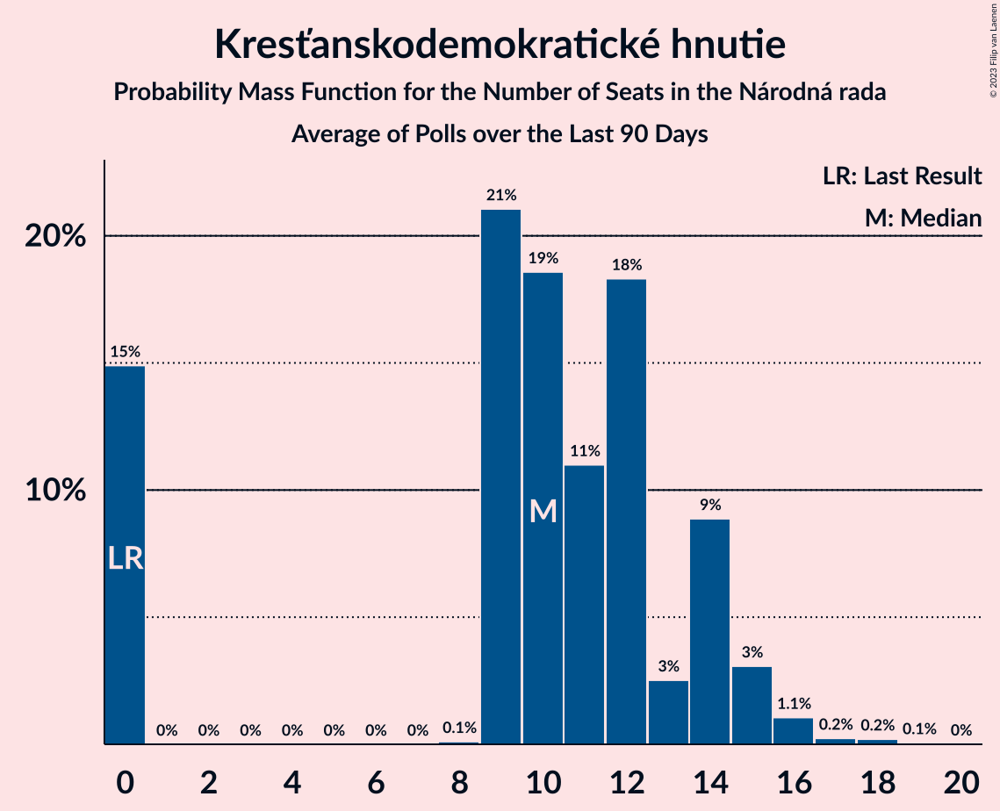

# Poll Average

<a href="#voting-intentions">Voting Intentions</a> | <a href="#seats">Seats</a> | <a href="#coalitions">Coalitions</a> | <a href="#technical-information">Technical Information</a>

## Summary

The table below lists the polls on which the average is based. They are the most recent polls (less than 90 days old) registered and analyzed so far.

| Period     | Polling firm/Commissioner(s) | OĽaNO | Smer–SD | SME RODINA | Kotleba–ĽSNS | PS–SPOLU | SaS | ZĽ | KDH | SMK–MKP | SNS | DV | V | MOST–HÍD | NOVA | PS | SPOLU | HLAS–SD | REP |
|:----------:|:----------------------------:|:--:|:--:|:--:|:--:|:--:|:--:|:--:|:--:|:--:|:--:|:--:|:--:|:--:|:--:|:--:|:--:|:--:|:--:|
| 29 February 2020 | General Election | 25.0%   53 | 18.3%   38 | 8.2%   17 | 8.0%   17 | 7.0%   0 | 6.2%   13 | 5.8%   12 | 4.6%   0 | 3.9%   0 | 3.2%   0 | 3.1%   0 | 2.9%   0 | 2.0%   0 | 0.0%   0 | 7.0%   0 | 7.0%   0 | 0.0%   0 | 0.0%   0 |
| N/A | Poll Average | 7–11%   10–23 | 9–14%   17–26 | 6–11%   11–22 | 2–6%   0–10 | N/A   N/A | 9–16%   18–30 | 3–5%   0 | 4–7%   0–12 | 3–7%   0–13 | 2–4%   0 | 1–3%   0 | 0–1%   0 | N/A   N/A | N/A   N/A | 5–10%   9–19 | 1–2%   0 | 19–25%   36–51 | 2–6%   0–10 |
| [7–11 June 2021](2021-06-11-AKO.html) | AKO | 7–11%   14–22 | 9–13%   17–24 | 6–10%   13–18 | 2–4%   0 | N/A   N/A | 12–16%   23–31 | 3–5%   0 | 4–7%   0–11 | 4–7%   0–13 | 2–4%   0 | 2–4%   0 | N/A   N/A | N/A   N/A | N/A   N/A | 7–10%   13–19 | 1–3%   0 | 19–24%   36–44 | 2–4%   0 |
| [2–9 June 2021](2021-06-09-FOCUS.html) | FOCUS | 7–10%   10–17 | 10–14%   17–26 | 6–9%   11–17 | 4–6%   0–11 | N/A   N/A | 11–15%   20–26 | 2–5%   0 | 5–7%   9–13 | 4–7%   0–13 | 2–4%   0 | 1–2%   0 | N/A   N/A | N/A   N/A | N/A   N/A | 5–8%   9–13 | 1–2%   0 | 19–24%   33–45 | 4–6%   0–10 |
| [27–31 March 2021](2021-03-31-Actly.html) | Actly | 8–12%   16–25 | 9–13%   16–24 | 8–11%   16–23 | 2–4%   0 | N/A   N/A | 9–12%   16–23 | 3–5%   0–9 | 4–7%   0–12 | 3–6%   0 | 2–4%   0 | 1–3%   0 | 0–1%   0 | N/A   N/A | N/A   N/A | 6–9%   11–17 | 1–2%   0 | 20–25%   37–51 | 4–6%   0–12 |
| 29 February 2020 | General Election | 25.0%   53 | 18.3%   38 | 8.2%   17 | 8.0%   17 | 7.0%   0 | 6.2%   13 | 5.8%   12 | 4.6%   0 | 3.9%   0 | 3.2%   0 | 3.1%   0 | 2.9%   0 | 2.0%   0 | 0.0%   0 | 7.0%   0 | 7.0%   0 | 0.0%   0 | 0.0%   0 |

Only polls for which at least the sample size has been published are included in the table above.

**Legend:**
+ **Top half of each row:** Voting intentions (95% confidence interval)
+ **Bottom half of each row:** Seat projections for the Národná rada (95% confidence interval)
+ **OĽaNO:** OBYČAJNÍ ĽUDIA a nezávislé osobnosti
+ **Smer–SD:** SMER–sociálna demokracia
+ **SME RODINA:** SME RODINA
+ **Kotleba–ĽSNS:** Kotleba–Ľudová strana Naše Slovensko
+ **PS–SPOLU:** Progresívne Slovensko–SPOLU–Občianska Demokracia
+ **SaS:** Sloboda a Solidarita
+ **ZĽ:** Za ľudí
+ **KDH:** Kresťanskodemokratické hnutie
+ **SMK–MKP:** Strana maďarskej koalície–Magyar Koalíció Pártja
+ **SNS:** Slovenská národná strana
+ **DV:** Dobrá voľba
+ **V:** VLASŤ
+ **MOST–HÍD:** MOST–HÍD
+ **NOVA:** NOVA
+ **PS:** Progresívne Slovensko
+ **SPOLU:** SPOLU–Občianska Demokracia
+ **HLAS–SD:** HLAS–sociálna demokracia
+ **REP:** REPUBLIKA
+ **N/A (single party):** Party not included the published results
+ **N/A (entire row):** Calculation for this opinion poll not started yet

## Voting Intentions

### Confidence Intervals

| Party | Last Result | Median | 80% Confidence Interval | 90% Confidence Interval | 95% Confidence Interval | 99% Confidence Interval |
|:-----:|:-----------:|:------:|:-----------------------:|:-----------------------:|:-----------------------:|:-----------------------:|
| <a href="#obyčajní-ľudia-a-nezávislé-osobnosti">OBYČAJNÍ ĽUDIA a nezávislé osobnosti</a> | 25.0% | 9.0% | 7.7–10.4% |7.3–10.8% | 7.0–11.2% | 6.5–11.9% |
| <a href="#smer–sociálna-demokracia">SMER–sociálna demokracia</a> | 18.3% | 11.0% | 9.6–12.7% |9.2–13.2% | 9.0–13.6% | 8.4–14.4% |
| <a href="#sme-rodina">SME RODINA</a> | 8.2% | 8.3% | 6.9–10.1% |6.6–10.6% | 6.3–11.0% | 5.9–11.7% |
| <a href="#kotleba–ľudová-strana-naše-slovensko">Kotleba–Ľudová strana Naše Slovensko</a> | 8.0% | 3.4% | 2.5–5.3% |2.3–5.6% | 2.1–6.0% | 1.9–6.5% |
| <a href="#progresívne-slovensko–spolu–občianska-demokracia">Progresívne Slovensko–SPOLU–Občianska Demokracia</a> | 7.0% | N/A | N/A |N/A | N/A | N/A |
| <a href="#progresívne-slovensko">Progresívne Slovensko</a> | 7.0% | 7.4% | 5.9–8.9% |5.6–9.4% | 5.3–9.7% | 4.9–10.4% |
| <a href="#spolu–občianska-demokracia">SPOLU–Občianska Demokracia</a> | 7.0% | 1.4% | 0.9–2.1% |0.8–2.2% | 0.7–2.4% | 0.5–2.8% |
| <a href="#sloboda-a-solidarita">Sloboda a Solidarita</a> | 6.2% | 12.6% | 9.9–14.7% |9.4–15.2% | 9.0–15.6% | 8.4–16.5% |
| <a href="#za-ľudí">Za ľudí</a> | 5.8% | 3.6% | 2.9–4.4% |2.7–4.7% | 2.6–4.9% | 2.3–5.4% |
| <a href="#kresťanskodemokratické-hnutie">Kresťanskodemokratické hnutie</a> | 4.6% | 5.6% | 4.7–6.7% |4.5–7.0% | 4.3–7.2% | 3.9–7.8% |
| <a href="#strana-maďarskej-koalície–magyar-koalíció-pártja">Strana maďarskej koalície–Magyar Koalíció Pártja</a> | 3.9% | 5.1% | 3.8–6.4% |3.5–6.7% | 3.3–7.0% | 2.9–7.6% |
| <a href="#slovenská-národná-strana">Slovenská národná strana</a> | 3.2% | 3.2% | 2.5–3.9% |2.4–4.2% | 2.2–4.4% | 2.0–4.8% |
| <a href="#dobrá-voľba">Dobrá voľba</a> | 3.1% | 2.0% | 1.2–2.9% |1.0–3.2% | 0.9–3.4% | 0.7–3.8% |
| <a href="#vlasť">VLASŤ</a> | 2.9% | 0.2% | 0.1–0.4% |0.0–0.5% | 0.0–0.6% | 0.0–0.7% |
| <a href="#most–híd">MOST–HÍD</a> | 2.0% | N/A | N/A |N/A | N/A | N/A |
| <a href="#nova">NOVA</a> | 0.0% | N/A | N/A |N/A | N/A | N/A |
| <a href="#hlas–sociálna-demokracia">HLAS–sociálna demokracia</a> | 0.0% | 21.8% | 19.9–23.7% |19.4–24.3% | 19.0–24.8% | 18.2–25.7% |
| <a href="#republika">REPUBLIKA</a> | 0.0% | 4.4% | 2.6–5.6% |2.4–5.9% | 2.2–6.1% | 1.9–6.7% |

### OBYČAJNÍ ĽUDIA a nezávislé osobnosti

*For a full overview of the results for this party, see the [OBYČAJNÍ ĽUDIA a nezávislé osobnosti](party-obyčajníľudiaanezávisléosobnosti.html) page.*

| Voting Intentions | Probability | Accumulated | Special Marks |
|:-----------------:|:-----------:|:-----------:|:-------------:|
| 4.5–5.5% | 0% | 100% |  |
| 5.5–6.5% | 0.6% | 100% |  |
| 6.5–7.5% | 7% | 99.4% |  |
| 7.5–8.5% | 26% | 92% |  |
| 8.5–9.5% | 35% | 66% | Median |
| 9.5–10.5% | 22% | 30% |  |
| 10.5–11.5% | 7% | 8% |  |
| 11.5–12.5% | 1.0% | 1.1% |  |
| 12.5–13.5% | 0.1% | 0.1% |  |
| 13.5–14.5% | 0% | 0% |  |
| 14.5–15.5% | 0% | 0% |  |
| 15.5–16.5% | 0% | 0% |  |
| 16.5–17.5% | 0% | 0% |  |
| 17.5–18.5% | 0% | 0% |  |
| 18.5–19.5% | 0% | 0% |  |
| 19.5–20.5% | 0% | 0% |  |
| 20.5–21.5% | 0% | 0% |  |
| 21.5–22.5% | 0% | 0% |  |
| 22.5–23.5% | 0% | 0% |  |
| 23.5–24.5% | 0% | 0% |  |
| 24.5–25.5% | 0% | 0% | Last Result |

### SMER–sociálna demokracia

*For a full overview of the results for this party, see the [SMER–sociálna demokracia](party-smer–sociálnademokracia.html) page.*

| Voting Intentions | Probability | Accumulated | Special Marks |
|:-----------------:|:-----------:|:-----------:|:-------------:|
| 6.5–7.5% | 0% | 100% |  |
| 7.5–8.5% | 0.8% | 100% |  |
| 8.5–9.5% | 8% | 99.2% |  |
| 9.5–10.5% | 25% | 91% |  |
| 10.5–11.5% | 32% | 66% | Median |
| 11.5–12.5% | 22% | 34% |  |
| 12.5–13.5% | 9% | 12% |  |
| 13.5–14.5% | 2% | 3% |  |
| 14.5–15.5% | 0.3% | 0.3% |  |
| 15.5–16.5% | 0% | 0% |  |
| 16.5–17.5% | 0% | 0% |  |
| 17.5–18.5% | 0% | 0% | Last Result |

### SME RODINA

*For a full overview of the results for this party, see the [SME RODINA](party-smerodina.html) page.*

| Voting Intentions | Probability | Accumulated | Special Marks |
|:-----------------:|:-----------:|:-----------:|:-------------:|
| 3.5–4.5% | 0% | 100% |  |
| 4.5–5.5% | 0.1% | 100% |  |
| 5.5–6.5% | 4% | 99.9% |  |
| 6.5–7.5% | 22% | 96% |  |
| 7.5–8.5% | 32% | 73% | Last Result, Median |
| 8.5–9.5% | 23% | 41% |  |
| 9.5–10.5% | 13% | 18% |  |
| 10.5–11.5% | 4% | 5% |  |
| 11.5–12.5% | 0.7% | 0.7% |  |
| 12.5–13.5% | 0% | 0.1% |  |
| 13.5–14.5% | 0% | 0% |  |

### Kotleba–Ľudová strana Naše Slovensko

*For a full overview of the results for this party, see the [Kotleba–Ľudová strana Naše Slovensko](party-kotleba–ľudovástrananašeslovensko.html) page.*

| Voting Intentions | Probability | Accumulated | Special Marks |
|:-----------------:|:-----------:|:-----------:|:-------------:|
| 0.5–1.5% | 0% | 100% |  |
| 1.5–2.5% | 12% | 100% |  |
| 2.5–3.5% | 43% | 88% | Median |
| 3.5–4.5% | 21% | 44% |  |
| 4.5–5.5% | 18% | 24% |  |
| 5.5–6.5% | 6% | 6% |  |
| 6.5–7.5% | 0.4% | 0.4% |  |
| 7.5–8.5% | 0% | 0% | Last Result |

### Progresívne Slovensko

*For a full overview of the results for this party, see the [Progresívne Slovensko](party-progresívneslovensko.html) page.*

| Voting Intentions | Probability | Accumulated | Special Marks |
|:-----------------:|:-----------:|:-----------:|:-------------:|
| 2.5–3.5% | 0% | 100% |  |
| 3.5–4.5% | 0.1% | 100% |  |
| 4.5–5.5% | 4% | 99.9% |  |
| 5.5–6.5% | 20% | 96% |  |
| 6.5–7.5% | 30% | 76% | Last Result, Median |
| 7.5–8.5% | 28% | 46% |  |
| 8.5–9.5% | 14% | 17% |  |
| 9.5–10.5% | 3% | 3% |  |
| 10.5–11.5% | 0.3% | 0.3% |  |
| 11.5–12.5% | 0% | 0% |  |

### SPOLU–Občianska Demokracia

*For a full overview of the results for this party, see the [SPOLU–Občianska Demokracia](party-spolu–občianskademokracia.html) page.*

| Voting Intentions | Probability | Accumulated | Special Marks |
|:-----------------:|:-----------:|:-----------:|:-------------:|
| 0.0–0.5% | 0.8% | 100% |  |
| 0.5–1.5% | 59% | 99.2% | Median |
| 1.5–2.5% | 38% | 40% |  |
| 2.5–3.5% | 1.5% | 1.5% |  |
| 3.5–4.5% | 0% | 0% |  |
| 4.5–5.5% | 0% | 0% |  |
| 5.5–6.5% | 0% | 0% |  |
| 6.5–7.5% | 0% | 0% | Last Result |

### Sloboda a Solidarita

*For a full overview of the results for this party, see the [Sloboda a Solidarita](party-slobodaasolidarita.html) page.*

| Voting Intentions | Probability | Accumulated | Special Marks |
|:-----------------:|:-----------:|:-----------:|:-------------:|
| 5.5–6.5% | 0% | 100% | Last Result |
| 6.5–7.5% | 0% | 100% |  |
| 7.5–8.5% | 0.8% | 100% |  |
| 8.5–9.5% | 6% | 99.2% |  |
| 9.5–10.5% | 13% | 93% |  |
| 10.5–11.5% | 14% | 80% |  |
| 11.5–12.5% | 16% | 66% |  |
| 12.5–13.5% | 21% | 51% | Median |
| 13.5–14.5% | 18% | 30% |  |
| 14.5–15.5% | 9% | 12% |  |
| 15.5–16.5% | 2% | 3% |  |
| 16.5–17.5% | 0.4% | 0.4% |  |
| 17.5–18.5% | 0% | 0% |  |

### Za ľudí

*For a full overview of the results for this party, see the [Za ľudí](party-zaľudí.html) page.*

| Voting Intentions | Probability | Accumulated | Special Marks |
|:-----------------:|:-----------:|:-----------:|:-------------:|
| 0.5–1.5% | 0% | 100% |  |
| 1.5–2.5% | 2% | 100% |  |
| 2.5–3.5% | 43% | 98% |  |
| 3.5–4.5% | 47% | 54% | Median |
| 4.5–5.5% | 7% | 7% |  |
| 5.5–6.5% | 0.3% | 0.3% | Last Result |
| 6.5–7.5% | 0% | 0% |  |

### Kresťanskodemokratické hnutie

*For a full overview of the results for this party, see the [Kresťanskodemokratické hnutie](party-kresťanskodemokratickéhnutie.html) page.*

| Voting Intentions | Probability | Accumulated | Special Marks |
|:-----------------:|:-----------:|:-----------:|:-------------:|
| 2.5–3.5% | 0.1% | 100% |  |
| 3.5–4.5% | 6% | 99.9% |  |
| 4.5–5.5% | 39% | 93% | Last Result |
| 5.5–6.5% | 42% | 55% | Median |
| 6.5–7.5% | 11% | 12% |  |
| 7.5–8.5% | 1.0% | 1.1% |  |
| 8.5–9.5% | 0% | 0% |  |

### Strana maďarskej koalície–Magyar Koalíció Pártja

*For a full overview of the results for this party, see the [Strana maďarskej koalície–Magyar Koalíció Pártja](party-stranamaďarskejkoalície–magyarkoalíciópártja.html) page.*

| Voting Intentions | Probability | Accumulated | Special Marks |
|:-----------------:|:-----------:|:-----------:|:-------------:|
| 1.5–2.5% | 0% | 100% |  |
| 2.5–3.5% | 5% | 100% |  |
| 3.5–4.5% | 25% | 95% | Last Result |
| 4.5–5.5% | 36% | 70% | Median |
| 5.5–6.5% | 27% | 33% |  |
| 6.5–7.5% | 6% | 7% |  |
| 7.5–8.5% | 0.5% | 0.5% |  |
| 8.5–9.5% | 0% | 0% |  |

### Slovenská národná strana

*For a full overview of the results for this party, see the [Slovenská národná strana](party-slovenskánárodnástrana.html) page.*

| Voting Intentions | Probability | Accumulated | Special Marks |
|:-----------------:|:-----------:|:-----------:|:-------------:|
| 0.5–1.5% | 0% | 100% |  |
| 1.5–2.5% | 11% | 100% |  |
| 2.5–3.5% | 63% | 89% | Last Result, Median |
| 3.5–4.5% | 25% | 26% |  |
| 4.5–5.5% | 1.4% | 1.4% |  |
| 5.5–6.5% | 0% | 0% |  |

### Dobrá voľba

*For a full overview of the results for this party, see the [Dobrá voľba](party-dobrávoľba.html) page.*

| Voting Intentions | Probability | Accumulated | Special Marks |
|:-----------------:|:-----------:|:-----------:|:-------------:|
| 0.0–0.5% | 0.1% | 100% |  |
| 0.5–1.5% | 26% | 99.9% |  |
| 1.5–2.5% | 49% | 74% | Median |
| 2.5–3.5% | 23% | 24% | Last Result |
| 3.5–4.5% | 1.4% | 1.4% |  |
| 4.5–5.5% | 0% | 0% |  |

### VLASŤ

*For a full overview of the results for this party, see the [VLASŤ](party-vlasť.html) page.*

| Voting Intentions | Probability | Accumulated | Special Marks |
|:-----------------:|:-----------:|:-----------:|:-------------:|
| 0.0–0.5% | 97% | 100% | Median |
| 0.5–1.5% | 3% | 3% |  |
| 1.5–2.5% | 0% | 0% |  |
| 2.5–3.5% | 0% | 0% | Last Result |

### HLAS–sociálna demokracia

*For a full overview of the results for this party, see the [HLAS–sociálna demokracia](party-hlas–sociálnademokracia.html) page.*

| Voting Intentions | Probability | Accumulated | Special Marks |
|:-----------------:|:-----------:|:-----------:|:-------------:|
| 0.0–0.5% | 0% | 100% | Last Result |
| 0.5–1.5% | 0% | 100% |  |
| 1.5–2.5% | 0% | 100% |  |
| 2.5–3.5% | 0% | 100% |  |
| 3.5–4.5% | 0% | 100% |  |
| 4.5–5.5% | 0% | 100% |  |
| 5.5–6.5% | 0% | 100% |  |
| 6.5–7.5% | 0% | 100% |  |
| 7.5–8.5% | 0% | 100% |  |
| 8.5–9.5% | 0% | 100% |  |
| 9.5–10.5% | 0% | 100% |  |
| 10.5–11.5% | 0% | 100% |  |
| 11.5–12.5% | 0% | 100% |  |
| 12.5–13.5% | 0% | 100% |  |
| 13.5–14.5% | 0% | 100% |  |
| 14.5–15.5% | 0% | 100% |  |
| 15.5–16.5% | 0% | 100% |  |
| 16.5–17.5% | 0.1% | 100% |  |
| 17.5–18.5% | 0.9% | 99.9% |  |
| 18.5–19.5% | 5% | 99.0% |  |
| 19.5–20.5% | 14% | 94% |  |
| 20.5–21.5% | 24% | 80% |  |
| 21.5–22.5% | 26% | 56% | Median |
| 22.5–23.5% | 18% | 30% |  |
| 23.5–24.5% | 9% | 12% |  |
| 24.5–25.5% | 3% | 4% |  |
| 25.5–26.5% | 0.6% | 0.7% |  |
| 26.5–27.5% | 0.1% | 0.1% |  |
| 27.5–28.5% | 0% | 0% |  |

### REPUBLIKA

*For a full overview of the results for this party, see the [REPUBLIKA](party-republika.html) page.*

| Voting Intentions | Probability | Accumulated | Special Marks |
|:-----------------:|:-----------:|:-----------:|:-------------:|
| 0.0–0.5% | 0% | 100% | Last Result |
| 0.5–1.5% | 0% | 100% |  |
| 1.5–2.5% | 9% | 100% |  |
| 2.5–3.5% | 22% | 91% |  |
| 3.5–4.5% | 25% | 69% | Median |
| 4.5–5.5% | 33% | 44% |  |
| 5.5–6.5% | 10% | 11% |  |
| 6.5–7.5% | 0.7% | 0.8% |  |
| 7.5–8.5% | 0% | 0% |  |

## Seats

### Confidence Intervals

| Party | Last Result | Median | 80% Confidence Interval | 90% Confidence Interval | 95% Confidence Interval | 99% Confidence Interval |
|:-----:|:-----------:|:------:|:-----------------------:|:-----------------------:|:-----------------------:|:-----------------------:|
| <a href="#obyčajní-ľudia-a-nezávislé-osobnosti">OBYČAJNÍ ĽUDIA a nezávislé osobnosti</a> | 53 | 18 | 13–22 |13–22 | 10–23 | 10–25 |
| <a href="#smer–sociálna-demokracia">SMER–sociálna demokracia</a> | 38 | 21 | 18–24 |17–24 | 17–26 | 16–27 |
| <a href="#sme-rodina">SME RODINA</a> | 17 | 16 | 11–19 |11–21 | 11–22 | 11–23 |
| <a href="#kotleba–ľudová-strana-naše-slovensko">Kotleba–Ľudová strana Naše Slovensko</a> | 17 | 0 | 0–10 |0–10 | 0–10 | 0–11 |
| <a href="#progresívne-slovensko–spolu–občianska-demokracia">Progresívne Slovensko–SPOLU–Občianska Demokracia</a> | 0 | N/A | N/A |N/A | N/A | N/A |
| <a href="#progresívne-slovensko">Progresívne Slovensko</a> | 0 | 13 | 12–17 |10–18 | 9–19 | 9–19 |
| <a href="#spolu–občianska-demokracia">SPOLU–Občianska Demokracia</a> | 0 | 0 | 0 |0 | 0 | 0 |
| <a href="#sloboda-a-solidarita">Sloboda a Solidarita</a> | 13 | 23 | 19–28 |18–30 | 18–30 | 16–32 |
| <a href="#za-ľudí">Za ľudí</a> | 12 | 0 | 0 |0 | 0 | 0–10 |
| <a href="#kresťanskodemokratické-hnutie">Kresťanskodemokratické hnutie</a> | 0 | 10 | 0–12 |0–12 | 0–12 | 0–14 |
| <a href="#strana-maďarskej-koalície–magyar-koalíció-pártja">Strana maďarskej koalície–Magyar Koalíció Pártja</a> | 0 | 0 | 0–12 |0–12 | 0–13 | 0–14 |
| <a href="#slovenská-národná-strana">Slovenská národná strana</a> | 0 | 0 | 0 |0 | 0 | 0 |
| <a href="#dobrá-voľba">Dobrá voľba</a> | 0 | 0 | 0 |0 | 0 | 0 |
| <a href="#vlasť">VLASŤ</a> | 0 | 0 | 0 |0 | 0 | 0 |
| <a href="#most–híd">MOST–HÍD</a> | 0 | N/A | N/A |N/A | N/A | N/A |
| <a href="#nova">NOVA</a> | 0 | N/A | N/A |N/A | N/A | N/A |
| <a href="#hlas–sociálna-demokracia">HLAS–sociálna demokracia</a> | 0 | 40 | 37–45 |36–50 | 36–51 | 33–51 |
| <a href="#republika">REPUBLIKA</a> | 0 | 0 | 0–10 |0–10 | 0–10 | 0–12 |

### OBYČAJNÍ ĽUDIA a nezávislé osobnosti

*For a full overview of the results for this party, see the [OBYČAJNÍ ĽUDIA a nezávislé osobnosti](party-obyčajníľudiaanezávisléosobnosti.html) page.*

| Number of Seats | Probability | Accumulated | Special Marks |
|:---------------:|:-----------:|:-----------:|:-------------:|
| 10 | 3% | 100% |  |
| 11 | 0.1% | 97% |  |
| 12 | 0.7% | 97% |  |
| 13 | 7% | 96% |  |
| 14 | 5% | 89% |  |
| 15 | 16% | 85% |  |
| 16 | 6% | 69% |  |
| 17 | 6% | 62% |  |
| 18 | 23% | 56% | Median |
| 19 | 11% | 33% |  |
| 20 | 5% | 23% |  |
| 21 | 0.3% | 18% |  |
| 22 | 14% | 18% |  |
| 23 | 2% | 4% |  |
| 24 | 0% | 1.2% |  |
| 25 | 1.1% | 1.1% |  |
| 26 | 0% | 0% |  |
| 27 | 0% | 0% |  |
| 28 | 0% | 0% |  |
| 29 | 0% | 0% |  |
| 30 | 0% | 0% |  |
| 31 | 0% | 0% |  |
| 32 | 0% | 0% |  |
| 33 | 0% | 0% |  |
| 34 | 0% | 0% |  |
| 35 | 0% | 0% |  |
| 36 | 0% | 0% |  |
| 37 | 0% | 0% |  |
| 38 | 0% | 0% |  |
| 39 | 0% | 0% |  |
| 40 | 0% | 0% |  |
| 41 | 0% | 0% |  |
| 42 | 0% | 0% |  |
| 43 | 0% | 0% |  |
| 44 | 0% | 0% |  |
| 45 | 0% | 0% |  |
| 46 | 0% | 0% |  |
| 47 | 0% | 0% |  |
| 48 | 0% | 0% |  |
| 49 | 0% | 0% |  |
| 50 | 0% | 0% |  |
| 51 | 0% | 0% |  |
| 52 | 0% | 0% |  |
| 53 | 0% | 0% | Last Result |

### SMER–sociálna demokracia

*For a full overview of the results for this party, see the [SMER–sociálna demokracia](party-smer–sociálnademokracia.html) page.*

| Number of Seats | Probability | Accumulated | Special Marks |
|:---------------:|:-----------:|:-----------:|:-------------:|
| 14 | 0.1% | 100% |  |
| 15 | 0.2% | 99.9% |  |
| 16 | 2% | 99.8% |  |
| 17 | 3% | 98% |  |
| 18 | 13% | 95% |  |
| 19 | 17% | 81% |  |
| 20 | 5% | 65% |  |
| 21 | 12% | 60% | Median |
| 22 | 23% | 48% |  |
| 23 | 5% | 25% |  |
| 24 | 16% | 20% |  |
| 25 | 1.2% | 4% |  |
| 26 | 2% | 3% |  |
| 27 | 0.6% | 0.8% |  |
| 28 | 0.1% | 0.2% |  |
| 29 | 0.1% | 0.1% |  |
| 30 | 0% | 0% |  |
| 31 | 0% | 0% |  |
| 32 | 0% | 0% |  |
| 33 | 0% | 0% |  |
| 34 | 0% | 0% |  |
| 35 | 0% | 0% |  |
| 36 | 0% | 0% |  |
| 37 | 0% | 0% |  |
| 38 | 0% | 0% | Last Result |

### SME RODINA

*For a full overview of the results for this party, see the [SME RODINA](party-smerodina.html) page.*

| Number of Seats | Probability | Accumulated | Special Marks |
|:---------------:|:-----------:|:-----------:|:-------------:|
| 9 | 0% | 100% |  |
| 10 | 0.4% | 99.9% |  |
| 11 | 15% | 99.6% |  |
| 12 | 8% | 85% |  |
| 13 | 4% | 77% |  |
| 14 | 6% | 74% |  |
| 15 | 11% | 68% |  |
| 16 | 13% | 57% | Median |
| 17 | 15% | 44% | Last Result |
| 18 | 11% | 29% |  |
| 19 | 10% | 18% |  |
| 20 | 0.5% | 8% |  |
| 21 | 3% | 7% |  |
| 22 | 2% | 4% |  |
| 23 | 2% | 2% |  |
| 24 | 0% | 0.1% |  |
| 25 | 0% | 0.1% |  |
| 26 | 0.1% | 0.1% |  |
| 27 | 0% | 0% |  |

### Kotleba–Ľudová strana Naše Slovensko

*For a full overview of the results for this party, see the [Kotleba–Ľudová strana Naše Slovensko](party-kotleba–ľudovástrananašeslovensko.html) page.*

| Number of Seats | Probability | Accumulated | Special Marks |
|:---------------:|:-----------:|:-----------:|:-------------:|
| 0 | 77% | 100% | Median |
| 1 | 0% | 23% |  |
| 2 | 0% | 23% |  |
| 3 | 0% | 23% |  |
| 4 | 0% | 23% |  |
| 5 | 0% | 23% |  |
| 6 | 0% | 23% |  |
| 7 | 0% | 23% |  |
| 8 | 0% | 23% |  |
| 9 | 7% | 23% |  |
| 10 | 14% | 16% |  |
| 11 | 2% | 2% |  |
| 12 | 0.1% | 0.4% |  |
| 13 | 0.2% | 0.3% |  |
| 14 | 0.1% | 0.1% |  |
| 15 | 0% | 0% |  |
| 16 | 0% | 0% |  |
| 17 | 0% | 0% | Last Result |

### Progresívne Slovensko–SPOLU–Občianska Demokracia

*For a full overview of the results for this party, see the [Progresívne Slovensko–SPOLU–Občianska Demokracia](party-progresívneslovensko–spolu–občianskademokracia.html) page.*

### Progresívne Slovensko

*For a full overview of the results for this party, see the [Progresívne Slovensko](party-progresívneslovensko.html) page.*

| Number of Seats | Probability | Accumulated | Special Marks |
|:---------------:|:-----------:|:-----------:|:-------------:|
| 0 | 0.4% | 100% | Last Result |
| 1 | 0% | 99.6% |  |
| 2 | 0% | 99.6% |  |
| 3 | 0% | 99.6% |  |
| 4 | 0% | 99.6% |  |
| 5 | 0% | 99.6% |  |
| 6 | 0% | 99.6% |  |
| 7 | 0% | 99.6% |  |
| 8 | 0% | 99.6% |  |
| 9 | 2% | 99.6% |  |
| 10 | 3% | 97% |  |
| 11 | 3% | 95% |  |
| 12 | 29% | 92% |  |
| 13 | 13% | 63% | Median |
| 14 | 5% | 50% |  |
| 15 | 4% | 45% |  |
| 16 | 9% | 41% |  |
| 17 | 27% | 32% |  |
| 18 | 1.1% | 5% |  |
| 19 | 4% | 4% |  |
| 20 | 0.2% | 0.3% |  |
| 21 | 0.1% | 0.1% |  |
| 22 | 0% | 0% |  |

### SPOLU–Občianska Demokracia

*For a full overview of the results for this party, see the [SPOLU–Občianska Demokracia](party-spolu–občianskademokracia.html) page.*

| Number of Seats | Probability | Accumulated | Special Marks |
|:---------------:|:-----------:|:-----------:|:-------------:|
| 0 | 100% | 100% | Last Result, Median |

### Sloboda a Solidarita

*For a full overview of the results for this party, see the [Sloboda a Solidarita](party-slobodaasolidarita.html) page.*

| Number of Seats | Probability | Accumulated | Special Marks |
|:---------------:|:-----------:|:-----------:|:-------------:|
| 13 | 0% | 100% | Last Result |
| 14 | 0% | 100% |  |
| 15 | 0% | 100% |  |
| 16 | 1.4% | 99.9% |  |
| 17 | 0.2% | 98.6% |  |
| 18 | 8% | 98% |  |
| 19 | 5% | 91% |  |
| 20 | 8% | 86% |  |
| 21 | 5% | 77% |  |
| 22 | 12% | 72% |  |
| 23 | 18% | 60% | Median |
| 24 | 10% | 42% |  |
| 25 | 2% | 32% |  |
| 26 | 1.0% | 30% |  |
| 27 | 9% | 29% |  |
| 28 | 13% | 20% |  |
| 29 | 1.4% | 7% |  |
| 30 | 3% | 5% |  |
| 31 | 1.4% | 2% |  |
| 32 | 0.5% | 0.6% |  |
| 33 | 0% | 0% |  |

### Za ľudí

*For a full overview of the results for this party, see the [Za ľudí](party-zaľudí.html) page.*

| Number of Seats | Probability | Accumulated | Special Marks |
|:---------------:|:-----------:|:-----------:|:-------------:|
| 0 | 98% | 100% | Median |
| 1 | 0% | 2% |  |
| 2 | 0% | 2% |  |
| 3 | 0% | 2% |  |
| 4 | 0% | 2% |  |
| 5 | 0% | 2% |  |
| 6 | 0% | 2% |  |
| 7 | 0% | 2% |  |
| 8 | 0% | 2% |  |
| 9 | 2% | 2% |  |
| 10 | 0.6% | 0.7% |  |
| 11 | 0.1% | 0.1% |  |
| 12 | 0% | 0% | Last Result |

### Kresťanskodemokratické hnutie

*For a full overview of the results for this party, see the [Kresťanskodemokratické hnutie](party-kresťanskodemokratickéhnutie.html) page.*

| Number of Seats | Probability | Accumulated | Special Marks |
|:---------------:|:-----------:|:-----------:|:-------------:|
| 0 | 37% | 100% | Last Result |
| 1 | 0% | 63% |  |
| 2 | 0% | 63% |  |
| 3 | 0% | 63% |  |
| 4 | 0% | 63% |  |
| 5 | 0% | 63% |  |
| 6 | 0% | 63% |  |
| 7 | 0% | 63% |  |
| 8 | 0% | 63% |  |
| 9 | 7% | 63% |  |
| 10 | 13% | 56% | Median |
| 11 | 32% | 43% |  |
| 12 | 9% | 11% |  |
| 13 | 0.9% | 2% |  |
| 14 | 0.8% | 1.1% |  |
| 15 | 0.2% | 0.3% |  |
| 16 | 0.1% | 0.1% |  |
| 17 | 0% | 0% |  |

### Strana maďarskej koalície–Magyar Koalíció Pártja

*For a full overview of the results for this party, see the [Strana maďarskej koalície–Magyar Koalíció Pártja](party-stranamaďarskejkoalície–magyarkoalíciópártja.html) page.*

| Number of Seats | Probability | Accumulated | Special Marks |
|:---------------:|:-----------:|:-----------:|:-------------:|
| 0 | 52% | 100% | Last Result, Median |
| 1 | 0% | 48% |  |
| 2 | 0% | 48% |  |
| 3 | 0% | 48% |  |
| 4 | 0% | 48% |  |
| 5 | 0% | 48% |  |
| 6 | 0% | 48% |  |
| 7 | 0% | 48% |  |
| 8 | 0% | 48% |  |
| 9 | 3% | 48% |  |
| 10 | 20% | 45% |  |
| 11 | 6% | 26% |  |
| 12 | 15% | 19% |  |
| 13 | 4% | 4% |  |
| 14 | 0.6% | 0.8% |  |
| 15 | 0.1% | 0.2% |  |
| 16 | 0% | 0% |  |

### Slovenská národná strana

*For a full overview of the results for this party, see the [Slovenská národná strana](party-slovenskánárodnástrana.html) page.*

| Number of Seats | Probability | Accumulated | Special Marks |
|:---------------:|:-----------:|:-----------:|:-------------:|
| 0 | 99.9% | 100% | Last Result, Median |
| 1 | 0% | 0.1% |  |
| 2 | 0% | 0.1% |  |
| 3 | 0% | 0.1% |  |
| 4 | 0% | 0.1% |  |
| 5 | 0% | 0.1% |  |
| 6 | 0% | 0.1% |  |
| 7 | 0% | 0.1% |  |
| 8 | 0% | 0.1% |  |
| 9 | 0% | 0.1% |  |
| 10 | 0.1% | 0.1% |  |
| 11 | 0% | 0% |  |

### Dobrá voľba

*For a full overview of the results for this party, see the [Dobrá voľba](party-dobrávoľba.html) page.*

| Number of Seats | Probability | Accumulated | Special Marks |
|:---------------:|:-----------:|:-----------:|:-------------:|
| 0 | 100% | 100% | Last Result, Median |

### VLASŤ

*For a full overview of the results for this party, see the [VLASŤ](party-vlasť.html) page.*

| Number of Seats | Probability | Accumulated | Special Marks |
|:---------------:|:-----------:|:-----------:|:-------------:|
| 0 | 100% | 100% | Last Result, Median |

### MOST–HÍD

*For a full overview of the results for this party, see the [MOST–HÍD](party-most–híd.html) page.*

### NOVA

*For a full overview of the results for this party, see the [NOVA](party-nova.html) page.*

### HLAS–sociálna demokracia

*For a full overview of the results for this party, see the [HLAS–sociálna demokracia](party-hlas–sociálnademokracia.html) page.*

| Number of Seats | Probability | Accumulated | Special Marks |
|:---------------:|:-----------:|:-----------:|:-------------:|
| 0 | 0% | 100% | Last Result |
| 1 | 0% | 100% |  |
| 2 | 0% | 100% |  |
| 3 | 0% | 100% |  |
| 4 | 0% | 100% |  |
| 5 | 0% | 100% |  |
| 6 | 0% | 100% |  |
| 7 | 0% | 100% |  |
| 8 | 0% | 100% |  |
| 9 | 0% | 100% |  |
| 10 | 0% | 100% |  |
| 11 | 0% | 100% |  |
| 12 | 0% | 100% |  |
| 13 | 0% | 100% |  |
| 14 | 0% | 100% |  |
| 15 | 0% | 100% |  |
| 16 | 0% | 100% |  |
| 17 | 0% | 100% |  |
| 18 | 0% | 100% |  |
| 19 | 0% | 100% |  |
| 20 | 0% | 100% |  |
| 21 | 0% | 100% |  |
| 22 | 0% | 100% |  |
| 23 | 0% | 100% |  |
| 24 | 0% | 100% |  |
| 25 | 0% | 100% |  |
| 26 | 0% | 100% |  |
| 27 | 0% | 100% |  |
| 28 | 0% | 100% |  |
| 29 | 0.1% | 100% |  |
| 30 | 0% | 99.9% |  |
| 31 | 0% | 99.9% |  |
| 32 | 0.1% | 99.9% |  |
| 33 | 1.3% | 99.9% |  |
| 34 | 0.4% | 98.5% |  |
| 35 | 0.5% | 98% |  |
| 36 | 3% | 98% |  |
| 37 | 9% | 94% |  |
| 38 | 5% | 85% |  |
| 39 | 18% | 80% |  |
| 40 | 22% | 62% | Median |
| 41 | 1.1% | 40% |  |
| 42 | 15% | 39% |  |
| 43 | 3% | 23% |  |
| 44 | 4% | 20% |  |
| 45 | 6% | 16% |  |
| 46 | 0.8% | 10% |  |
| 47 | 1.1% | 9% |  |
| 48 | 0.6% | 8% |  |
| 49 | 0.1% | 7% |  |
| 50 | 5% | 7% |  |
| 51 | 3% | 3% |  |
| 52 | 0% | 0.1% |  |
| 53 | 0% | 0.1% |  |
| 54 | 0% | 0% |  |

### REPUBLIKA

*For a full overview of the results for this party, see the [REPUBLIKA](party-republika.html) page.*

| Number of Seats | Probability | Accumulated | Special Marks |
|:---------------:|:-----------:|:-----------:|:-------------:|
| 0 | 75% | 100% | Last Result, Median |
| 1 | 0% | 25% |  |
| 2 | 0% | 25% |  |
| 3 | 0% | 25% |  |
| 4 | 0% | 25% |  |
| 5 | 0% | 25% |  |
| 6 | 0% | 25% |  |
| 7 | 0% | 25% |  |
| 8 | 0% | 25% |  |
| 9 | 5% | 25% |  |
| 10 | 18% | 20% |  |
| 11 | 0.4% | 2% |  |
| 12 | 2% | 2% |  |
| 13 | 0.1% | 0.1% |  |
| 14 | 0% | 0.1% |  |
| 15 | 0% | 0% |  |

## Coalitions

### Confidence Intervals

| Coalition | Last Result | Median | Majority? | 80% Confidence Interval | 90% Confidence Interval | 95% Confidence Interval | 99% Confidence Interval |
|:---------:|:-----------:|:------:|:---------:|:-----------------------:|:-----------------------:|:-----------------------:|:-----------------------:|
| SMER–sociálna demokracia – SME RODINA – Kotleba–Ľudová strana Naše Slovensko – Slovenská národná strana – HLAS–sociálna demokracia | 72 | 79 | 90% | 76–87 | 73–90 | 72–92 | 69–98 |
| SMER–sociálna demokracia – SME RODINA – HLAS–sociálna demokracia | 55 | 77 | 70% | 69–84 | 68–90 | 67–92 | 63–98 |
| SMER–sociálna demokracia – SME RODINA – Slovenská národná strana – HLAS–sociálna demokracia | 55 | 77 | 70% | 69–84 | 68–90 | 67–92 | 63–98 |
| OBYČAJNÍ ĽUDIA a nezávislé osobnosti – SME RODINA – Progresívne Slovensko–SPOLU–Občianska Demokracia – Sloboda a Solidarita – Za ľudí – Kresťanskodemokratické hnutie – Strana maďarskej koalície–Magyar Koalíció Pártja – MOST–HÍD | 95 | 69 | 8% | 64–75 | 62–77 | 61–77 | 60–81 |
| OBYČAJNÍ ĽUDIA a nezávislé osobnosti – SME RODINA – Progresívne Slovensko–SPOLU–Občianska Demokracia – Sloboda a Solidarita – Za ľudí – Kresťanskodemokratické hnutie – Strana maďarskej koalície–Magyar Koalíció Pártja | 95 | 69 | 8% | 64–75 | 62–77 | 61–77 | 60–81 |
| OBYČAJNÍ ĽUDIA a nezávislé osobnosti – SME RODINA – Progresívne Slovensko–SPOLU–Občianska Demokracia – Sloboda a Solidarita – Za ľudí – Kresťanskodemokratické hnutie – MOST–HÍD | 95 | 64 | 3% | 59–68 | 57–73 | 54–76 | 54–76 |
| OBYČAJNÍ ĽUDIA a nezávislé osobnosti – SME RODINA – Progresívne Slovensko–SPOLU–Občianska Demokracia – Sloboda a Solidarita – Za ľudí – Kresťanskodemokratické hnutie | 95 | 64 | 3% | 59–68 | 57–73 | 54–76 | 54–76 |
| SMER–sociálna demokracia – Slovenská národná strana – MOST–HÍD – HLAS–sociálna demokracia | 38 | 61 | 0% | 56–67 | 54–71 | 53–73 | 51–75 |
| SMER–sociálna demokracia – Slovenská národná strana – HLAS–sociálna demokracia | 38 | 61 | 0% | 56–67 | 54–71 | 53–73 | 51–75 |
| SME RODINA – Kotleba–Ľudová strana Naše Slovensko – Slovenská národná strana – HLAS–sociálna demokracia | 34 | 59 | 0% | 55–66 | 53–69 | 50–70 | 48–74 |
| SME RODINA – HLAS–sociálna demokracia | 17 | 56 | 0% | 50–65 | 49–69 | 49–69 | 45–74 |
| SME RODINA – Slovenská národná strana – HLAS–sociálna demokracia | 17 | 56 | 0% | 50–65 | 49–69 | 49–69 | 45–74 |
| OBYČAJNÍ ĽUDIA a nezávislé osobnosti – Progresívne Slovensko–SPOLU–Občianska Demokracia – Sloboda a Solidarita – Za ľudí – Kresťanskodemokratické hnutie – Strana maďarskej koalície–Magyar Koalíció Pártja – MOST–HÍD | 78 | 53 | 0% | 47–60 | 43–61 | 38–62 | 38–67 |
| OBYČAJNÍ ĽUDIA a nezávislé osobnosti – Progresívne Slovensko–SPOLU–Občianska Demokracia – Sloboda a Solidarita – Za ľudí – Kresťanskodemokratické hnutie – Strana maďarskej koalície–Magyar Koalíció Pártja | 78 | 53 | 0% | 47–60 | 43–61 | 38–62 | 38–67 |
| OBYČAJNÍ ĽUDIA a nezávislé osobnosti – Progresívne Slovensko–SPOLU–Občianska Demokracia – Sloboda a Solidarita – Za ľudí – Kresťanskodemokratické hnutie – MOST–HÍD | 78 | 48 | 0% | 43–51 | 42–55 | 38–55 | 38–59 |
| OBYČAJNÍ ĽUDIA a nezávislé osobnosti – Progresívne Slovensko–SPOLU–Občianska Demokracia – Sloboda a Solidarita – Za ľudí – Kresťanskodemokratické hnutie | 78 | 48 | 0% | 43–51 | 42–55 | 38–55 | 38–59 |
| Slovenská národná strana – MOST–HÍD – HLAS–sociálna demokracia | 0 | 40 | 0% | 37–45 | 36–50 | 36–51 | 33–51 |
| Slovenská národná strana – HLAS–sociálna demokracia | 0 | 40 | 0% | 37–45 | 36–50 | 36–51 | 33–51 |
| OBYČAJNÍ ĽUDIA a nezávislé osobnosti – Progresívne Slovensko–SPOLU–Občianska Demokracia – Sloboda a Solidarita – Za ľudí | 78 | 40 | 0% | 36–50 | 35–50 | 30–50 | 30–52 |
| SMER–sociálna demokracia – SME RODINA – Kotleba–Ľudová strana Naše Slovensko – Slovenská národná strana | 72 | 40 | 0% | 34–44 | 33–46 | 33–47 | 30–50 |
| SMER–sociálna demokracia – SME RODINA | 55 | 37 | 0% | 30–41 | 30–42 | 30–46 | 30–47 |
| SMER–sociálna demokracia – SME RODINA – Slovenská národná strana | 55 | 37 | 0% | 30–41 | 30–42 | 30–46 | 30–47 |
| Progresívne Slovensko–SPOLU–Občianska Demokracia – Sloboda a Solidarita – Za ľudí – Kresťanskodemokratické hnutie | 25 | 31 | 0% | 27–35 | 23–36 | 20–38 | 19–41 |
| Progresívne Slovensko–SPOLU–Občianska Demokracia – Sloboda a Solidarita – Za ľudí | 25 | 23 | 0% | 19–28 | 18–30 | 18–31 | 18–33 |
| SMER–sociálna demokracia – Slovenská národná strana – MOST–HÍD | 38 | 21 | 0% | 18–24 | 17–24 | 17–26 | 16–27 |
| SMER–sociálna demokracia | 38 | 21 | 0% | 18–24 | 17–24 | 17–26 | 16–27 |
| SMER–sociálna demokracia – Slovenská národná strana | 38 | 21 | 0% | 18–24 | 17–24 | 17–26 | 16–27 |

### SMER–sociálna demokracia – SME RODINA – Kotleba–Ľudová strana Naše Slovensko – Slovenská národná strana – HLAS–sociálna demokracia

| Number of Seats | Probability | Accumulated | Special Marks |
|:---------------:|:-----------:|:-----------:|:-------------:|
| 65 | 0.1% | 100% |  |
| 66 | 0% | 99.8% |  |
| 67 | 0.1% | 99.8% |  |
| 68 | 0.2% | 99.7% |  |
| 69 | 0.1% | 99.5% |  |
| 70 | 0.5% | 99.4% |  |
| 71 | 0.7% | 98.9% |  |
| 72 | 2% | 98% | Last Result |
| 73 | 3% | 96% |  |
| 74 | 0.8% | 93% |  |
| 75 | 2% | 92% |  |
| 76 | 12% | 90% | Majority |
| 77 | 17% | 78% | Median |
| 78 | 7% | 61% |  |
| 79 | 15% | 54% |  |
| 80 | 0.6% | 39% |  |
| 81 | 2% | 39% |  |
| 82 | 9% | 37% |  |
| 83 | 14% | 28% |  |
| 84 | 2% | 14% |  |
| 85 | 0.5% | 12% |  |
| 86 | 1.4% | 12% |  |
| 87 | 0.6% | 10% |  |
| 88 | 2% | 10% |  |
| 89 | 0.1% | 8% |  |
| 90 | 4% | 8% |  |
| 91 | 1.3% | 4% |  |
| 92 | 0.3% | 3% |  |
| 93 | 0% | 2% |  |
| 94 | 0.1% | 2% |  |
| 95 | 0% | 2% |  |
| 96 | 0% | 2% |  |
| 97 | 0% | 2% |  |
| 98 | 2% | 2% |  |
| 99 | 0% | 0.1% |  |
| 100 | 0% | 0% |  |

### SMER–sociálna demokracia – SME RODINA – HLAS–sociálna demokracia

| Number of Seats | Probability | Accumulated | Special Marks |
|:---------------:|:-----------:|:-----------:|:-------------:|
| 55 | 0% | 100% | Last Result |
| 56 | 0% | 100% |  |
| 57 | 0% | 100% |  |
| 58 | 0% | 100% |  |
| 59 | 0% | 100% |  |
| 60 | 0% | 100% |  |
| 61 | 0% | 100% |  |
| 62 | 0.1% | 100% |  |
| 63 | 1.0% | 99.9% |  |
| 64 | 0% | 98.9% |  |
| 65 | 0.2% | 98.9% |  |
| 66 | 0.3% | 98.7% |  |
| 67 | 2% | 98% |  |
| 68 | 3% | 96% |  |
| 69 | 8% | 93% |  |
| 70 | 0.5% | 85% |  |
| 71 | 0.8% | 84% |  |
| 72 | 6% | 84% |  |
| 73 | 4% | 78% |  |
| 74 | 1.1% | 74% |  |
| 75 | 3% | 73% |  |
| 76 | 10% | 70% | Majority |
| 77 | 15% | 60% | Median |
| 78 | 8% | 45% |  |
| 79 | 6% | 37% |  |
| 80 | 0.4% | 30% |  |
| 81 | 2% | 30% |  |
| 82 | 3% | 28% |  |
| 83 | 13% | 25% |  |
| 84 | 2% | 11% |  |
| 85 | 0.2% | 9% |  |
| 86 | 0.5% | 9% |  |
| 87 | 0.4% | 9% |  |
| 88 | 0.8% | 8% |  |
| 89 | 0.1% | 8% |  |
| 90 | 3% | 7% |  |
| 91 | 1.3% | 4% |  |
| 92 | 0.3% | 3% |  |
| 93 | 0% | 2% |  |
| 94 | 0% | 2% |  |
| 95 | 0% | 2% |  |
| 96 | 0% | 2% |  |
| 97 | 0% | 2% |  |
| 98 | 2% | 2% |  |
| 99 | 0% | 0% |  |

### SMER–sociálna demokracia – SME RODINA – Slovenská národná strana – HLAS–sociálna demokracia

| Number of Seats | Probability | Accumulated | Special Marks |
|:---------------:|:-----------:|:-----------:|:-------------:|
| 55 | 0% | 100% | Last Result |
| 56 | 0% | 100% |  |
| 57 | 0% | 100% |  |
| 58 | 0% | 100% |  |
| 59 | 0% | 100% |  |
| 60 | 0% | 100% |  |
| 61 | 0% | 100% |  |
| 62 | 0.1% | 100% |  |
| 63 | 1.0% | 99.9% |  |
| 64 | 0% | 98.9% |  |
| 65 | 0.2% | 98.9% |  |
| 66 | 0.3% | 98.7% |  |
| 67 | 2% | 98% |  |
| 68 | 3% | 96% |  |
| 69 | 8% | 93% |  |
| 70 | 0.5% | 85% |  |
| 71 | 0.8% | 85% |  |
| 72 | 6% | 84% |  |
| 73 | 4% | 78% |  |
| 74 | 1.1% | 74% |  |
| 75 | 3% | 73% |  |
| 76 | 10% | 70% | Majority |
| 77 | 15% | 60% | Median |
| 78 | 8% | 45% |  |
| 79 | 6% | 37% |  |
| 80 | 0.4% | 31% |  |
| 81 | 2% | 30% |  |
| 82 | 3% | 28% |  |
| 83 | 13% | 25% |  |
| 84 | 2% | 11% |  |
| 85 | 0.2% | 9% |  |
| 86 | 0.5% | 9% |  |
| 87 | 0.4% | 9% |  |
| 88 | 0.8% | 8% |  |
| 89 | 0.1% | 8% |  |
| 90 | 3% | 7% |  |
| 91 | 1.3% | 4% |  |
| 92 | 0.3% | 3% |  |
| 93 | 0% | 2% |  |
| 94 | 0% | 2% |  |
| 95 | 0% | 2% |  |
| 96 | 0% | 2% |  |
| 97 | 0% | 2% |  |
| 98 | 2% | 2% |  |
| 99 | 0% | 0% |  |

### OBYČAJNÍ ĽUDIA a nezávislé osobnosti – SME RODINA – Progresívne Slovensko–SPOLU–Občianska Demokracia – Sloboda a Solidarita – Za ľudí – Kresťanskodemokratické hnutie – Strana maďarskej koalície–Magyar Koalíció Pártja – MOST–HÍD

| Number of Seats | Probability | Accumulated | Special Marks |
|:---------------:|:-----------:|:-----------:|:-------------:|
| 53 | 0.1% | 100% |  |
| 54 | 0% | 99.9% |  |
| 55 | 0% | 99.9% |  |
| 56 | 0.2% | 99.9% |  |
| 57 | 0% | 99.7% |  |
| 58 | 0.1% | 99.6% |  |
| 59 | 0% | 99.5% |  |
| 60 | 0.1% | 99.5% |  |
| 61 | 2% | 99.4% |  |
| 62 | 4% | 97% |  |
| 63 | 1.4% | 93% |  |
| 64 | 4% | 92% |  |
| 65 | 8% | 88% |  |
| 66 | 0.5% | 79% |  |
| 67 | 25% | 79% | Median |
| 68 | 3% | 53% |  |
| 69 | 1.2% | 51% |  |
| 70 | 12% | 49% |  |
| 71 | 8% | 38% |  |
| 72 | 16% | 30% |  |
| 73 | 2% | 14% |  |
| 74 | 0.9% | 12% |  |
| 75 | 3% | 11% |  |
| 76 | 3% | 8% | Majority |
| 77 | 3% | 5% |  |
| 78 | 0.4% | 2% |  |
| 79 | 0.9% | 2% |  |
| 80 | 0.2% | 0.8% |  |
| 81 | 0.1% | 0.6% |  |
| 82 | 0.3% | 0.5% |  |
| 83 | 0.1% | 0.2% |  |
| 84 | 0.1% | 0.1% |  |
| 85 | 0% | 0% |  |
| 86 | 0% | 0% |  |
| 87 | 0% | 0% |  |
| 88 | 0% | 0% |  |
| 89 | 0% | 0% |  |
| 90 | 0% | 0% |  |
| 91 | 0% | 0% |  |
| 92 | 0% | 0% |  |
| 93 | 0% | 0% |  |
| 94 | 0% | 0% |  |
| 95 | 0% | 0% | Last Result |

### OBYČAJNÍ ĽUDIA a nezávislé osobnosti – SME RODINA – Progresívne Slovensko–SPOLU–Občianska Demokracia – Sloboda a Solidarita – Za ľudí – Kresťanskodemokratické hnutie – Strana maďarskej koalície–Magyar Koalíció Pártja

| Number of Seats | Probability | Accumulated | Special Marks |
|:---------------:|:-----------:|:-----------:|:-------------:|
| 53 | 0.1% | 100% |  |
| 54 | 0% | 99.9% |  |
| 55 | 0% | 99.9% |  |
| 56 | 0.2% | 99.9% |  |
| 57 | 0% | 99.7% |  |
| 58 | 0.1% | 99.6% |  |
| 59 | 0% | 99.5% |  |
| 60 | 0.1% | 99.5% |  |
| 61 | 2% | 99.4% |  |
| 62 | 4% | 97% |  |
| 63 | 1.4% | 93% |  |
| 64 | 4% | 92% |  |
| 65 | 8% | 88% |  |
| 66 | 0.5% | 79% |  |
| 67 | 25% | 79% | Median |
| 68 | 3% | 53% |  |
| 69 | 1.2% | 51% |  |
| 70 | 12% | 49% |  |
| 71 | 8% | 38% |  |
| 72 | 16% | 30% |  |
| 73 | 2% | 14% |  |
| 74 | 0.9% | 12% |  |
| 75 | 3% | 11% |  |
| 76 | 3% | 8% | Majority |
| 77 | 3% | 5% |  |
| 78 | 0.4% | 2% |  |
| 79 | 0.9% | 2% |  |
| 80 | 0.2% | 0.8% |  |
| 81 | 0.1% | 0.6% |  |
| 82 | 0.3% | 0.5% |  |
| 83 | 0.1% | 0.2% |  |
| 84 | 0.1% | 0.1% |  |
| 85 | 0% | 0% |  |
| 86 | 0% | 0% |  |
| 87 | 0% | 0% |  |
| 88 | 0% | 0% |  |
| 89 | 0% | 0% |  |
| 90 | 0% | 0% |  |
| 91 | 0% | 0% |  |
| 92 | 0% | 0% |  |
| 93 | 0% | 0% |  |
| 94 | 0% | 0% |  |
| 95 | 0% | 0% | Last Result |

### OBYČAJNÍ ĽUDIA a nezávislé osobnosti – SME RODINA – Progresívne Slovensko–SPOLU–Občianska Demokracia – Sloboda a Solidarita – Za ľudí – Kresťanskodemokratické hnutie – MOST–HÍD

| Number of Seats | Probability | Accumulated | Special Marks |
|:---------------:|:-----------:|:-----------:|:-------------:|
| 48 | 0% | 100% |  |
| 49 | 0.1% | 99.9% |  |
| 50 | 0% | 99.9% |  |
| 51 | 0% | 99.8% |  |
| 52 | 0.1% | 99.8% |  |
| 53 | 0.1% | 99.7% |  |
| 54 | 3% | 99.6% |  |
| 55 | 0.3% | 97% |  |
| 56 | 1.4% | 96% |  |
| 57 | 2% | 95% |  |
| 58 | 1.0% | 93% |  |
| 59 | 7% | 92% |  |
| 60 | 19% | 86% |  |
| 61 | 4% | 67% |  |
| 62 | 8% | 63% |  |
| 63 | 2% | 54% |  |
| 64 | 7% | 52% |  |
| 65 | 9% | 45% |  |
| 66 | 0.7% | 36% |  |
| 67 | 23% | 35% | Median |
| 68 | 2% | 12% |  |
| 69 | 0.7% | 10% |  |
| 70 | 0.5% | 9% |  |
| 71 | 1.0% | 9% |  |
| 72 | 2% | 8% |  |
| 73 | 2% | 5% |  |
| 74 | 0.6% | 3% |  |
| 75 | 0.3% | 3% |  |
| 76 | 2% | 3% | Majority |
| 77 | 0% | 0.2% |  |
| 78 | 0.1% | 0.2% |  |
| 79 | 0% | 0% |  |
| 80 | 0% | 0% |  |
| 81 | 0% | 0% |  |
| 82 | 0% | 0% |  |
| 83 | 0% | 0% |  |
| 84 | 0% | 0% |  |
| 85 | 0% | 0% |  |
| 86 | 0% | 0% |  |
| 87 | 0% | 0% |  |
| 88 | 0% | 0% |  |
| 89 | 0% | 0% |  |
| 90 | 0% | 0% |  |
| 91 | 0% | 0% |  |
| 92 | 0% | 0% |  |
| 93 | 0% | 0% |  |
| 94 | 0% | 0% |  |
| 95 | 0% | 0% | Last Result |

### OBYČAJNÍ ĽUDIA a nezávislé osobnosti – SME RODINA – Progresívne Slovensko–SPOLU–Občianska Demokracia – Sloboda a Solidarita – Za ľudí – Kresťanskodemokratické hnutie

| Number of Seats | Probability | Accumulated | Special Marks |
|:---------------:|:-----------:|:-----------:|:-------------:|
| 48 | 0% | 100% |  |
| 49 | 0.1% | 99.9% |  |
| 50 | 0% | 99.9% |  |
| 51 | 0% | 99.8% |  |
| 52 | 0.1% | 99.8% |  |
| 53 | 0.1% | 99.7% |  |
| 54 | 3% | 99.6% |  |
| 55 | 0.3% | 97% |  |
| 56 | 1.4% | 96% |  |
| 57 | 2% | 95% |  |
| 58 | 1.0% | 93% |  |
| 59 | 7% | 92% |  |
| 60 | 19% | 86% |  |
| 61 | 4% | 67% |  |
| 62 | 8% | 63% |  |
| 63 | 2% | 54% |  |
| 64 | 7% | 52% |  |
| 65 | 9% | 45% |  |
| 66 | 0.7% | 36% |  |
| 67 | 23% | 35% | Median |
| 68 | 2% | 12% |  |
| 69 | 0.7% | 10% |  |
| 70 | 0.5% | 9% |  |
| 71 | 1.0% | 9% |  |
| 72 | 2% | 8% |  |
| 73 | 2% | 5% |  |
| 74 | 0.6% | 3% |  |
| 75 | 0.3% | 3% |  |
| 76 | 2% | 3% | Majority |
| 77 | 0% | 0.2% |  |
| 78 | 0.1% | 0.2% |  |
| 79 | 0% | 0% |  |
| 80 | 0% | 0% |  |
| 81 | 0% | 0% |  |
| 82 | 0% | 0% |  |
| 83 | 0% | 0% |  |
| 84 | 0% | 0% |  |
| 85 | 0% | 0% |  |
| 86 | 0% | 0% |  |
| 87 | 0% | 0% |  |
| 88 | 0% | 0% |  |
| 89 | 0% | 0% |  |
| 90 | 0% | 0% |  |
| 91 | 0% | 0% |  |
| 92 | 0% | 0% |  |
| 93 | 0% | 0% |  |
| 94 | 0% | 0% |  |
| 95 | 0% | 0% | Last Result |

### SMER–sociálna demokracia – Slovenská národná strana – MOST–HÍD – HLAS–sociálna demokracia

| Number of Seats | Probability | Accumulated | Special Marks |
|:---------------:|:-----------:|:-----------:|:-------------:|
| 38 | 0% | 100% | Last Result |
| 39 | 0% | 100% |  |
| 40 | 0% | 100% |  |
| 41 | 0% | 100% |  |
| 42 | 0% | 100% |  |
| 43 | 0% | 100% |  |
| 44 | 0% | 100% |  |
| 45 | 0% | 100% |  |
| 46 | 0% | 100% |  |
| 47 | 0% | 100% |  |
| 48 | 0% | 100% |  |
| 49 | 0% | 100% |  |
| 50 | 0.1% | 100% |  |
| 51 | 1.1% | 99.9% |  |
| 52 | 0.1% | 98.8% |  |
| 53 | 2% | 98.7% |  |
| 54 | 2% | 97% |  |
| 55 | 0.6% | 95% |  |
| 56 | 7% | 94% |  |
| 57 | 1.0% | 87% |  |
| 58 | 18% | 86% |  |
| 59 | 1.0% | 69% |  |
| 60 | 8% | 68% |  |
| 61 | 13% | 60% | Median |
| 62 | 10% | 47% |  |
| 63 | 3% | 36% |  |
| 64 | 2% | 33% |  |
| 65 | 0.3% | 32% |  |
| 66 | 15% | 31% |  |
| 67 | 7% | 17% |  |
| 68 | 0.6% | 9% |  |
| 69 | 0.4% | 9% |  |
| 70 | 0.6% | 9% |  |
| 71 | 3% | 8% |  |
| 72 | 0.4% | 4% |  |
| 73 | 2% | 4% |  |
| 74 | 0% | 2% |  |
| 75 | 2% | 2% |  |
| 76 | 0% | 0% | Majority |

### SMER–sociálna demokracia – Slovenská národná strana – HLAS–sociálna demokracia

| Number of Seats | Probability | Accumulated | Special Marks |
|:---------------:|:-----------:|:-----------:|:-------------:|
| 38 | 0% | 100% | Last Result |
| 39 | 0% | 100% |  |
| 40 | 0% | 100% |  |
| 41 | 0% | 100% |  |
| 42 | 0% | 100% |  |
| 43 | 0% | 100% |  |
| 44 | 0% | 100% |  |
| 45 | 0% | 100% |  |
| 46 | 0% | 100% |  |
| 47 | 0% | 100% |  |
| 48 | 0% | 100% |  |
| 49 | 0% | 100% |  |
| 50 | 0.1% | 100% |  |
| 51 | 1.1% | 99.9% |  |
| 52 | 0.1% | 98.8% |  |
| 53 | 2% | 98.7% |  |
| 54 | 2% | 97% |  |
| 55 | 0.6% | 95% |  |
| 56 | 7% | 94% |  |
| 57 | 1.0% | 87% |  |
| 58 | 18% | 86% |  |
| 59 | 1.0% | 69% |  |
| 60 | 8% | 68% |  |
| 61 | 13% | 60% | Median |
| 62 | 10% | 47% |  |
| 63 | 3% | 36% |  |
| 64 | 2% | 33% |  |
| 65 | 0.3% | 32% |  |
| 66 | 15% | 31% |  |
| 67 | 7% | 17% |  |
| 68 | 0.6% | 9% |  |
| 69 | 0.4% | 9% |  |
| 70 | 0.6% | 9% |  |
| 71 | 3% | 8% |  |
| 72 | 0.4% | 4% |  |
| 73 | 2% | 4% |  |
| 74 | 0% | 2% |  |
| 75 | 2% | 2% |  |
| 76 | 0% | 0% | Majority |

### SME RODINA – Kotleba–Ľudová strana Naše Slovensko – Slovenská národná strana – HLAS–sociálna demokracia

| Number of Seats | Probability | Accumulated | Special Marks |
|:---------------:|:-----------:|:-----------:|:-------------:|
| 34 | 0% | 100% | Last Result |
| 35 | 0% | 100% |  |
| 36 | 0% | 100% |  |
| 37 | 0% | 100% |  |
| 38 | 0% | 100% |  |
| 39 | 0% | 100% |  |
| 40 | 0% | 100% |  |
| 41 | 0% | 100% |  |
| 42 | 0% | 100% |  |
| 43 | 0% | 100% |  |
| 44 | 0.1% | 100% |  |
| 45 | 0% | 99.9% |  |
| 46 | 0% | 99.9% |  |
| 47 | 0.1% | 99.8% |  |
| 48 | 0.3% | 99.7% |  |
| 49 | 0.5% | 99.5% |  |
| 50 | 2% | 99.0% |  |
| 51 | 0.3% | 97% |  |
| 52 | 2% | 97% |  |
| 53 | 1.2% | 95% |  |
| 54 | 2% | 94% |  |
| 55 | 14% | 92% |  |
| 56 | 11% | 78% | Median |
| 57 | 3% | 67% |  |
| 58 | 14% | 64% |  |
| 59 | 16% | 50% |  |
| 60 | 11% | 34% |  |
| 61 | 3% | 23% |  |
| 62 | 2% | 20% |  |
| 63 | 5% | 18% |  |
| 64 | 3% | 14% |  |
| 65 | 0.5% | 11% |  |
| 66 | 2% | 10% |  |
| 67 | 0.6% | 8% |  |
| 68 | 1.3% | 8% |  |
| 69 | 4% | 6% |  |
| 70 | 0% | 3% |  |
| 71 | 0.1% | 2% |  |
| 72 | 0% | 2% |  |
| 73 | 0% | 2% |  |
| 74 | 2% | 2% |  |
| 75 | 0% | 0% |  |

### SME RODINA – HLAS–sociálna demokracia

| Number of Seats | Probability | Accumulated | Special Marks |
|:---------------:|:-----------:|:-----------:|:-------------:|
| 17 | 0% | 100% | Last Result |
| 18 | 0% | 100% |  |
| 19 | 0% | 100% |  |
| 20 | 0% | 100% |  |
| 21 | 0% | 100% |  |
| 22 | 0% | 100% |  |
| 23 | 0% | 100% |  |
| 24 | 0% | 100% |  |
| 25 | 0% | 100% |  |
| 26 | 0% | 100% |  |
| 27 | 0% | 100% |  |
| 28 | 0% | 100% |  |
| 29 | 0% | 100% |  |
| 30 | 0% | 100% |  |
| 31 | 0% | 100% |  |
| 32 | 0% | 100% |  |
| 33 | 0% | 100% |  |
| 34 | 0% | 100% |  |
| 35 | 0% | 100% |  |
| 36 | 0% | 100% |  |
| 37 | 0% | 100% |  |
| 38 | 0% | 100% |  |
| 39 | 0% | 100% |  |
| 40 | 0% | 100% |  |
| 41 | 0.1% | 100% |  |
| 42 | 0% | 99.9% |  |
| 43 | 0% | 99.9% |  |
| 44 | 0.1% | 99.9% |  |
| 45 | 1.3% | 99.8% |  |
| 46 | 0.1% | 98% |  |
| 47 | 0.1% | 98% |  |
| 48 | 0.3% | 98% |  |
| 49 | 3% | 98% |  |
| 50 | 12% | 95% |  |
| 51 | 0.9% | 82% |  |
| 52 | 5% | 81% |  |
| 53 | 5% | 77% |  |
| 54 | 1.0% | 71% |  |
| 55 | 14% | 70% |  |
| 56 | 11% | 56% | Median |
| 57 | 3% | 45% |  |
| 58 | 11% | 42% |  |
| 59 | 14% | 31% |  |
| 60 | 2% | 17% |  |
| 61 | 0.9% | 15% |  |
| 62 | 0.6% | 14% |  |
| 63 | 0.7% | 13% |  |
| 64 | 3% | 13% |  |
| 65 | 0.4% | 10% |  |
| 66 | 2% | 10% |  |
| 67 | 0.5% | 8% |  |
| 68 | 1.3% | 7% |  |
| 69 | 4% | 6% |  |
| 70 | 0% | 2% |  |
| 71 | 0.1% | 2% |  |
| 72 | 0% | 2% |  |
| 73 | 0% | 2% |  |
| 74 | 2% | 2% |  |
| 75 | 0% | 0% |  |

### SME RODINA – Slovenská národná strana – HLAS–sociálna demokracia

| Number of Seats | Probability | Accumulated | Special Marks |
|:---------------:|:-----------:|:-----------:|:-------------:|
| 17 | 0% | 100% | Last Result |
| 18 | 0% | 100% |  |
| 19 | 0% | 100% |  |
| 20 | 0% | 100% |  |
| 21 | 0% | 100% |  |
| 22 | 0% | 100% |  |
| 23 | 0% | 100% |  |
| 24 | 0% | 100% |  |
| 25 | 0% | 100% |  |
| 26 | 0% | 100% |  |
| 27 | 0% | 100% |  |
| 28 | 0% | 100% |  |
| 29 | 0% | 100% |  |
| 30 | 0% | 100% |  |
| 31 | 0% | 100% |  |
| 32 | 0% | 100% |  |
| 33 | 0% | 100% |  |
| 34 | 0% | 100% |  |
| 35 | 0% | 100% |  |
| 36 | 0% | 100% |  |
| 37 | 0% | 100% |  |
| 38 | 0% | 100% |  |
| 39 | 0% | 100% |  |
| 40 | 0% | 100% |  |
| 41 | 0.1% | 100% |  |
| 42 | 0% | 99.9% |  |
| 43 | 0% | 99.9% |  |
| 44 | 0.1% | 99.9% |  |
| 45 | 1.3% | 99.8% |  |
| 46 | 0.1% | 98% |  |
| 47 | 0.1% | 98% |  |
| 48 | 0.3% | 98% |  |
| 49 | 3% | 98% |  |
| 50 | 12% | 95% |  |
| 51 | 0.9% | 82% |  |
| 52 | 5% | 81% |  |
| 53 | 5% | 77% |  |
| 54 | 1.0% | 71% |  |
| 55 | 14% | 70% |  |
| 56 | 11% | 56% | Median |
| 57 | 3% | 46% |  |
| 58 | 11% | 42% |  |
| 59 | 14% | 31% |  |
| 60 | 2% | 17% |  |
| 61 | 0.9% | 15% |  |
| 62 | 0.6% | 14% |  |
| 63 | 0.7% | 13% |  |
| 64 | 3% | 13% |  |
| 65 | 0.4% | 10% |  |
| 66 | 2% | 10% |  |
| 67 | 0.5% | 8% |  |
| 68 | 1.3% | 7% |  |
| 69 | 4% | 6% |  |
| 70 | 0% | 2% |  |
| 71 | 0.1% | 2% |  |
| 72 | 0% | 2% |  |
| 73 | 0% | 2% |  |
| 74 | 2% | 2% |  |
| 75 | 0% | 0% |  |

### OBYČAJNÍ ĽUDIA a nezávislé osobnosti – Progresívne Slovensko–SPOLU–Občianska Demokracia – Sloboda a Solidarita – Za ľudí – Kresťanskodemokratické hnutie – Strana maďarskej koalície–Magyar Koalíció Pártja – MOST–HÍD

| Number of Seats | Probability | Accumulated | Special Marks |
|:---------------:|:-----------:|:-----------:|:-------------:|
| 34 | 0.1% | 100% |  |
| 35 | 0% | 99.9% |  |
| 36 | 0% | 99.9% |  |
| 37 | 0.1% | 99.9% |  |
| 38 | 3% | 99.9% |  |
| 39 | 0% | 97% |  |
| 40 | 0% | 97% |  |
| 41 | 0% | 97% |  |
| 42 | 0.1% | 97% |  |
| 43 | 4% | 97% |  |
| 44 | 0.1% | 94% |  |
| 45 | 0.3% | 94% |  |
| 46 | 1.4% | 93% |  |
| 47 | 7% | 92% |  |
| 48 | 5% | 84% |  |
| 49 | 1.4% | 79% |  |
| 50 | 15% | 78% |  |
| 51 | 8% | 63% | Median |
| 52 | 4% | 55% |  |
| 53 | 3% | 52% |  |
| 54 | 2% | 49% |  |
| 55 | 4% | 47% |  |
| 56 | 7% | 43% |  |
| 57 | 9% | 36% |  |
| 58 | 3% | 27% |  |
| 59 | 9% | 25% |  |
| 60 | 7% | 16% |  |
| 61 | 5% | 8% |  |
| 62 | 1.0% | 3% |  |
| 63 | 0.2% | 2% |  |
| 64 | 0.4% | 2% |  |
| 65 | 0.4% | 1.2% |  |
| 66 | 0.3% | 0.9% |  |
| 67 | 0.3% | 0.6% |  |
| 68 | 0.1% | 0.3% |  |
| 69 | 0.1% | 0.2% |  |
| 70 | 0.1% | 0.1% |  |
| 71 | 0% | 0% |  |
| 72 | 0% | 0% |  |
| 73 | 0% | 0% |  |
| 74 | 0% | 0% |  |
| 75 | 0% | 0% |  |
| 76 | 0% | 0% | Majority |
| 77 | 0% | 0% |  |
| 78 | 0% | 0% | Last Result |

### OBYČAJNÍ ĽUDIA a nezávislé osobnosti – Progresívne Slovensko–SPOLU–Občianska Demokracia – Sloboda a Solidarita – Za ľudí – Kresťanskodemokratické hnutie – Strana maďarskej koalície–Magyar Koalíció Pártja

| Number of Seats | Probability | Accumulated | Special Marks |
|:---------------:|:-----------:|:-----------:|:-------------:|
| 34 | 0.1% | 100% |  |
| 35 | 0% | 99.9% |  |
| 36 | 0% | 99.9% |  |
| 37 | 0.1% | 99.9% |  |
| 38 | 3% | 99.9% |  |
| 39 | 0% | 97% |  |
| 40 | 0% | 97% |  |
| 41 | 0% | 97% |  |
| 42 | 0.1% | 97% |  |
| 43 | 4% | 97% |  |
| 44 | 0.1% | 94% |  |
| 45 | 0.3% | 94% |  |
| 46 | 1.4% | 93% |  |
| 47 | 7% | 92% |  |
| 48 | 5% | 84% |  |
| 49 | 1.4% | 79% |  |
| 50 | 15% | 78% |  |
| 51 | 8% | 63% | Median |
| 52 | 4% | 55% |  |
| 53 | 3% | 52% |  |
| 54 | 2% | 49% |  |
| 55 | 4% | 47% |  |
| 56 | 7% | 43% |  |
| 57 | 9% | 36% |  |
| 58 | 3% | 27% |  |
| 59 | 9% | 25% |  |
| 60 | 7% | 16% |  |
| 61 | 5% | 8% |  |
| 62 | 1.0% | 3% |  |
| 63 | 0.2% | 2% |  |
| 64 | 0.4% | 2% |  |
| 65 | 0.4% | 1.2% |  |
| 66 | 0.3% | 0.9% |  |
| 67 | 0.3% | 0.6% |  |
| 68 | 0.1% | 0.3% |  |
| 69 | 0.1% | 0.2% |  |
| 70 | 0.1% | 0.1% |  |
| 71 | 0% | 0% |  |
| 72 | 0% | 0% |  |
| 73 | 0% | 0% |  |
| 74 | 0% | 0% |  |
| 75 | 0% | 0% |  |
| 76 | 0% | 0% | Majority |
| 77 | 0% | 0% |  |
| 78 | 0% | 0% | Last Result |

### OBYČAJNÍ ĽUDIA a nezávislé osobnosti – Progresívne Slovensko–SPOLU–Občianska Demokracia – Sloboda a Solidarita – Za ľudí – Kresťanskodemokratické hnutie – MOST–HÍD

| Number of Seats | Probability | Accumulated | Special Marks |
|:---------------:|:-----------:|:-----------:|:-------------:|
| 33 | 0.1% | 100% |  |
| 34 | 0.1% | 99.9% |  |
| 35 | 0% | 99.8% |  |
| 36 | 0.2% | 99.8% |  |
| 37 | 0.1% | 99.6% |  |
| 38 | 3% | 99.5% |  |
| 39 | 0.1% | 97% |  |
| 40 | 0.1% | 97% |  |
| 41 | 0.5% | 97% |  |
| 42 | 3% | 96% |  |
| 43 | 4% | 93% |  |
| 44 | 2% | 89% |  |
| 45 | 9% | 86% |  |
| 46 | 7% | 78% |  |
| 47 | 9% | 70% |  |
| 48 | 14% | 61% |  |
| 49 | 11% | 48% |  |
| 50 | 18% | 36% |  |
| 51 | 9% | 18% | Median |
| 52 | 0.8% | 9% |  |
| 53 | 3% | 8% |  |
| 54 | 0.7% | 6% |  |
| 55 | 3% | 5% |  |
| 56 | 0.3% | 2% |  |
| 57 | 0.7% | 2% |  |
| 58 | 0.2% | 0.9% |  |
| 59 | 0.4% | 0.7% |  |
| 60 | 0.1% | 0.3% |  |
| 61 | 0.2% | 0.2% |  |
| 62 | 0% | 0% |  |
| 63 | 0% | 0% |  |
| 64 | 0% | 0% |  |
| 65 | 0% | 0% |  |
| 66 | 0% | 0% |  |
| 67 | 0% | 0% |  |
| 68 | 0% | 0% |  |
| 69 | 0% | 0% |  |
| 70 | 0% | 0% |  |
| 71 | 0% | 0% |  |
| 72 | 0% | 0% |  |
| 73 | 0% | 0% |  |
| 74 | 0% | 0% |  |
| 75 | 0% | 0% |  |
| 76 | 0% | 0% | Majority |
| 77 | 0% | 0% |  |
| 78 | 0% | 0% | Last Result |

### OBYČAJNÍ ĽUDIA a nezávislé osobnosti – Progresívne Slovensko–SPOLU–Občianska Demokracia – Sloboda a Solidarita – Za ľudí – Kresťanskodemokratické hnutie

| Number of Seats | Probability | Accumulated | Special Marks |
|:---------------:|:-----------:|:-----------:|:-------------:|
| 33 | 0.1% | 100% |  |
| 34 | 0.1% | 99.9% |  |
| 35 | 0% | 99.8% |  |
| 36 | 0.2% | 99.8% |  |
| 37 | 0.1% | 99.6% |  |
| 38 | 3% | 99.5% |  |
| 39 | 0.1% | 97% |  |
| 40 | 0.1% | 97% |  |
| 41 | 0.5% | 97% |  |
| 42 | 3% | 96% |  |
| 43 | 4% | 93% |  |
| 44 | 2% | 89% |  |
| 45 | 9% | 86% |  |
| 46 | 7% | 78% |  |
| 47 | 9% | 70% |  |
| 48 | 14% | 61% |  |
| 49 | 11% | 48% |  |
| 50 | 18% | 36% |  |
| 51 | 9% | 18% | Median |
| 52 | 0.8% | 9% |  |
| 53 | 3% | 8% |  |
| 54 | 0.7% | 6% |  |
| 55 | 3% | 5% |  |
| 56 | 0.3% | 2% |  |
| 57 | 0.7% | 2% |  |
| 58 | 0.2% | 0.9% |  |
| 59 | 0.4% | 0.7% |  |
| 60 | 0.1% | 0.3% |  |
| 61 | 0.2% | 0.2% |  |
| 62 | 0% | 0% |  |
| 63 | 0% | 0% |  |
| 64 | 0% | 0% |  |
| 65 | 0% | 0% |  |
| 66 | 0% | 0% |  |
| 67 | 0% | 0% |  |
| 68 | 0% | 0% |  |
| 69 | 0% | 0% |  |
| 70 | 0% | 0% |  |
| 71 | 0% | 0% |  |
| 72 | 0% | 0% |  |
| 73 | 0% | 0% |  |
| 74 | 0% | 0% |  |
| 75 | 0% | 0% |  |
| 76 | 0% | 0% | Majority |
| 77 | 0% | 0% |  |
| 78 | 0% | 0% | Last Result |

### Slovenská národná strana – MOST–HÍD – HLAS–sociálna demokracia

| Number of Seats | Probability | Accumulated | Special Marks |
|:---------------:|:-----------:|:-----------:|:-------------:|
| 0 | 0% | 100% | Last Result |
| 1 | 0% | 100% |  |
| 2 | 0% | 100% |  |
| 3 | 0% | 100% |  |
| 4 | 0% | 100% |  |
| 5 | 0% | 100% |  |
| 6 | 0% | 100% |  |
| 7 | 0% | 100% |  |
| 8 | 0% | 100% |  |
| 9 | 0% | 100% |  |
| 10 | 0% | 100% |  |
| 11 | 0% | 100% |  |
| 12 | 0% | 100% |  |
| 13 | 0% | 100% |  |
| 14 | 0% | 100% |  |
| 15 | 0% | 100% |  |
| 16 | 0% | 100% |  |
| 17 | 0% | 100% |  |
| 18 | 0% | 100% |  |
| 19 | 0% | 100% |  |
| 20 | 0% | 100% |  |
| 21 | 0% | 100% |  |
| 22 | 0% | 100% |  |
| 23 | 0% | 100% |  |
| 24 | 0% | 100% |  |
| 25 | 0% | 100% |  |
| 26 | 0% | 100% |  |
| 27 | 0% | 100% |  |
| 28 | 0% | 100% |  |
| 29 | 0.1% | 100% |  |
| 30 | 0% | 99.9% |  |
| 31 | 0% | 99.9% |  |
| 32 | 0.1% | 99.9% |  |
| 33 | 1.3% | 99.9% |  |
| 34 | 0.4% | 98.5% |  |
| 35 | 0.5% | 98% |  |
| 36 | 3% | 98% |  |
| 37 | 9% | 94% |  |
| 38 | 5% | 85% |  |
| 39 | 18% | 80% |  |
| 40 | 22% | 62% | Median |
| 41 | 1.1% | 40% |  |
| 42 | 15% | 39% |  |
| 43 | 3% | 24% |  |
| 44 | 4% | 21% |  |
| 45 | 6% | 16% |  |
| 46 | 0.8% | 10% |  |
| 47 | 1.1% | 9% |  |
| 48 | 0.6% | 8% |  |
| 49 | 0.1% | 7% |  |
| 50 | 5% | 7% |  |
| 51 | 3% | 3% |  |
| 52 | 0% | 0.1% |  |
| 53 | 0% | 0.1% |  |
| 54 | 0% | 0% |  |

### Slovenská národná strana – HLAS–sociálna demokracia

| Number of Seats | Probability | Accumulated | Special Marks |
|:---------------:|:-----------:|:-----------:|:-------------:|
| 0 | 0% | 100% | Last Result |
| 1 | 0% | 100% |  |
| 2 | 0% | 100% |  |
| 3 | 0% | 100% |  |
| 4 | 0% | 100% |  |
| 5 | 0% | 100% |  |
| 6 | 0% | 100% |  |
| 7 | 0% | 100% |  |
| 8 | 0% | 100% |  |
| 9 | 0% | 100% |  |
| 10 | 0% | 100% |  |
| 11 | 0% | 100% |  |
| 12 | 0% | 100% |  |
| 13 | 0% | 100% |  |
| 14 | 0% | 100% |  |
| 15 | 0% | 100% |  |
| 16 | 0% | 100% |  |
| 17 | 0% | 100% |  |
| 18 | 0% | 100% |  |
| 19 | 0% | 100% |  |
| 20 | 0% | 100% |  |
| 21 | 0% | 100% |  |
| 22 | 0% | 100% |  |
| 23 | 0% | 100% |  |
| 24 | 0% | 100% |  |
| 25 | 0% | 100% |  |
| 26 | 0% | 100% |  |
| 27 | 0% | 100% |  |
| 28 | 0% | 100% |  |
| 29 | 0.1% | 100% |  |
| 30 | 0% | 99.9% |  |
| 31 | 0% | 99.9% |  |
| 32 | 0.1% | 99.9% |  |
| 33 | 1.3% | 99.9% |  |
| 34 | 0.4% | 98.5% |  |
| 35 | 0.5% | 98% |  |
| 36 | 3% | 98% |  |
| 37 | 9% | 94% |  |
| 38 | 5% | 85% |  |
| 39 | 18% | 80% |  |
| 40 | 22% | 62% | Median |
| 41 | 1.1% | 40% |  |
| 42 | 15% | 39% |  |
| 43 | 3% | 24% |  |
| 44 | 4% | 21% |  |
| 45 | 6% | 16% |  |
| 46 | 0.8% | 10% |  |
| 47 | 1.1% | 9% |  |
| 48 | 0.6% | 8% |  |
| 49 | 0.1% | 7% |  |
| 50 | 5% | 7% |  |
| 51 | 3% | 3% |  |
| 52 | 0% | 0.1% |  |
| 53 | 0% | 0.1% |  |
| 54 | 0% | 0% |  |

### OBYČAJNÍ ĽUDIA a nezávislé osobnosti – Progresívne Slovensko–SPOLU–Občianska Demokracia – Sloboda a Solidarita – Za ľudí

| Number of Seats | Probability | Accumulated | Special Marks |
|:---------------:|:-----------:|:-----------:|:-------------:|
| 30 | 3% | 100% |  |
| 31 | 0.2% | 97% |  |
| 32 | 0.1% | 97% |  |
| 33 | 0.7% | 97% |  |
| 34 | 0.6% | 96% |  |
| 35 | 1.5% | 96% |  |
| 36 | 9% | 94% |  |
| 37 | 17% | 85% |  |
| 38 | 12% | 68% |  |
| 39 | 4% | 57% |  |
| 40 | 5% | 53% |  |
| 41 | 6% | 48% | Median |
| 42 | 2% | 42% |  |
| 43 | 6% | 40% |  |
| 44 | 4% | 34% |  |
| 45 | 9% | 30% |  |
| 46 | 3% | 21% |  |
| 47 | 1.4% | 18% |  |
| 48 | 0.5% | 16% |  |
| 49 | 0.5% | 16% |  |
| 50 | 15% | 15% |  |
| 51 | 0.4% | 1.0% |  |
| 52 | 0.4% | 0.6% |  |
| 53 | 0% | 0.1% |  |
| 54 | 0.1% | 0.1% |  |
| 55 | 0.1% | 0.1% |  |
| 56 | 0% | 0% |  |
| 57 | 0% | 0% |  |
| 58 | 0% | 0% |  |
| 59 | 0% | 0% |  |
| 60 | 0% | 0% |  |
| 61 | 0% | 0% |  |
| 62 | 0% | 0% |  |
| 63 | 0% | 0% |  |
| 64 | 0% | 0% |  |
| 65 | 0% | 0% |  |
| 66 | 0% | 0% |  |
| 67 | 0% | 0% |  |
| 68 | 0% | 0% |  |
| 69 | 0% | 0% |  |
| 70 | 0% | 0% |  |
| 71 | 0% | 0% |  |
| 72 | 0% | 0% |  |
| 73 | 0% | 0% |  |
| 74 | 0% | 0% |  |
| 75 | 0% | 0% |  |
| 76 | 0% | 0% | Majority |
| 77 | 0% | 0% |  |
| 78 | 0% | 0% | Last Result |

### SMER–sociálna demokracia – SME RODINA – Kotleba–Ľudová strana Naše Slovensko – Slovenská národná strana

| Number of Seats | Probability | Accumulated | Special Marks |
|:---------------:|:-----------:|:-----------:|:-------------:|
| 27 | 0% | 100% |  |
| 28 | 0% | 99.9% |  |
| 29 | 0% | 99.9% |  |
| 30 | 0.5% | 99.9% |  |
| 31 | 0.3% | 99.4% |  |
| 32 | 0.5% | 99.0% |  |
| 33 | 8% | 98.5% |  |
| 34 | 2% | 91% |  |
| 35 | 3% | 89% |  |
| 36 | 11% | 86% |  |
| 37 | 11% | 75% | Median |
| 38 | 6% | 64% |  |
| 39 | 7% | 58% |  |
| 40 | 21% | 51% |  |
| 41 | 15% | 30% |  |
| 42 | 4% | 15% |  |
| 43 | 0.6% | 11% |  |
| 44 | 0.5% | 10% |  |
| 45 | 4% | 10% |  |
| 46 | 0.7% | 6% |  |
| 47 | 3% | 5% |  |
| 48 | 0.8% | 2% |  |
| 49 | 0% | 1.3% |  |
| 50 | 0.9% | 1.3% |  |
| 51 | 0.1% | 0.3% |  |
| 52 | 0% | 0.3% |  |
| 53 | 0% | 0.3% |  |
| 54 | 0.2% | 0.3% |  |
| 55 | 0% | 0% |  |
| 56 | 0% | 0% |  |
| 57 | 0% | 0% |  |
| 58 | 0% | 0% |  |
| 59 | 0% | 0% |  |
| 60 | 0% | 0% |  |
| 61 | 0% | 0% |  |
| 62 | 0% | 0% |  |
| 63 | 0% | 0% |  |
| 64 | 0% | 0% |  |
| 65 | 0% | 0% |  |
| 66 | 0% | 0% |  |
| 67 | 0% | 0% |  |
| 68 | 0% | 0% |  |
| 69 | 0% | 0% |  |
| 70 | 0% | 0% |  |
| 71 | 0% | 0% |  |
| 72 | 0% | 0% | Last Result |

### SMER–sociálna demokracia – SME RODINA

| Number of Seats | Probability | Accumulated | Special Marks |
|:---------------:|:-----------:|:-----------:|:-------------:|
| 27 | 0% | 100% |  |
| 28 | 0% | 99.9% |  |
| 29 | 0.1% | 99.9% |  |
| 30 | 10% | 99.8% |  |
| 31 | 5% | 90% |  |
| 32 | 0.9% | 85% |  |
| 33 | 9% | 84% |  |
| 34 | 2% | 75% |  |
| 35 | 7% | 73% |  |
| 36 | 12% | 65% |  |
| 37 | 12% | 54% | Median |
| 38 | 6% | 42% |  |
| 39 | 6% | 36% |  |
| 40 | 9% | 30% |  |
| 41 | 15% | 21% |  |
| 42 | 2% | 6% |  |
| 43 | 0.1% | 3% |  |
| 44 | 0.3% | 3% |  |
| 45 | 0.1% | 3% |  |
| 46 | 0.4% | 3% |  |
| 47 | 2% | 2% |  |
| 48 | 0% | 0.1% |  |
| 49 | 0% | 0.1% |  |
| 50 | 0% | 0.1% |  |
| 51 | 0% | 0% |  |
| 52 | 0% | 0% |  |
| 53 | 0% | 0% |  |
| 54 | 0% | 0% |  |
| 55 | 0% | 0% | Last Result |

### SMER–sociálna demokracia – SME RODINA – Slovenská národná strana

| Number of Seats | Probability | Accumulated | Special Marks |
|:---------------:|:-----------:|:-----------:|:-------------:|
| 27 | 0% | 100% |  |
| 28 | 0% | 99.9% |  |
| 29 | 0.1% | 99.9% |  |
| 30 | 10% | 99.8% |  |
| 31 | 5% | 90% |  |
| 32 | 0.9% | 85% |  |
| 33 | 9% | 84% |  |
| 34 | 2% | 75% |  |
| 35 | 7% | 73% |  |
| 36 | 12% | 65% |  |
| 37 | 12% | 54% | Median |
| 38 | 6% | 42% |  |
| 39 | 6% | 36% |  |
| 40 | 9% | 30% |  |
| 41 | 15% | 21% |  |
| 42 | 2% | 6% |  |
| 43 | 0.1% | 3% |  |
| 44 | 0.3% | 3% |  |
| 45 | 0.1% | 3% |  |
| 46 | 0.4% | 3% |  |
| 47 | 2% | 2% |  |
| 48 | 0% | 0.1% |  |
| 49 | 0% | 0.1% |  |
| 50 | 0% | 0.1% |  |
| 51 | 0% | 0% |  |
| 52 | 0% | 0% |  |
| 53 | 0% | 0% |  |
| 54 | 0% | 0% |  |
| 55 | 0% | 0% | Last Result |

### Progresívne Slovensko–SPOLU–Občianska Demokracia – Sloboda a Solidarita – Za ľudí – Kresťanskodemokratické hnutie

| Number of Seats | Probability | Accumulated | Special Marks |
|:---------------:|:-----------:|:-----------:|:-------------:|
| 18 | 0.1% | 100% |  |
| 19 | 0.4% | 99.9% |  |
| 20 | 2% | 99.5% |  |
| 21 | 1.3% | 97% |  |
| 22 | 0.2% | 96% |  |
| 23 | 4% | 96% |  |
| 24 | 0.7% | 92% |  |
| 25 | 0.3% | 91% | Last Result |
| 26 | 0.3% | 91% |  |
| 27 | 8% | 91% |  |
| 28 | 13% | 82% |  |
| 29 | 9% | 69% |  |
| 30 | 7% | 60% |  |
| 31 | 7% | 53% |  |
| 32 | 14% | 46% |  |
| 33 | 6% | 32% | Median |
| 34 | 12% | 26% |  |
| 35 | 9% | 14% |  |
| 36 | 1.5% | 5% |  |
| 37 | 1.2% | 4% |  |
| 38 | 0.7% | 3% |  |
| 39 | 0.8% | 2% |  |
| 40 | 0.3% | 1.0% |  |
| 41 | 0.2% | 0.7% |  |
| 42 | 0.1% | 0.5% |  |
| 43 | 0.1% | 0.4% |  |
| 44 | 0.2% | 0.3% |  |
| 45 | 0% | 0.1% |  |
| 46 | 0.1% | 0.1% |  |
| 47 | 0% | 0% |  |

### Progresívne Slovensko–SPOLU–Občianska Demokracia – Sloboda a Solidarita – Za ľudí

| Number of Seats | Probability | Accumulated | Special Marks |
|:---------------:|:-----------:|:-----------:|:-------------:|
| 15 | 0% | 100% |  |
| 16 | 0.1% | 99.9% |  |
| 17 | 0.2% | 99.9% |  |
| 18 | 7% | 99.7% |  |
| 19 | 5% | 92% |  |
| 20 | 8% | 87% |  |
| 21 | 5% | 79% |  |
| 22 | 12% | 74% |  |
| 23 | 17% | 62% | Median |
| 24 | 10% | 44% |  |
| 25 | 4% | 34% | Last Result |
| 26 | 1.0% | 31% |  |
| 27 | 9% | 30% |  |
| 28 | 14% | 21% |  |
| 29 | 1.5% | 8% |  |
| 30 | 4% | 6% |  |
| 31 | 1.4% | 3% |  |
| 32 | 0.7% | 1.3% |  |
| 33 | 0.5% | 0.6% |  |
| 34 | 0.1% | 0.1% |  |
| 35 | 0% | 0% |  |

### SMER–sociálna demokracia – Slovenská národná strana – MOST–HÍD

| Number of Seats | Probability | Accumulated | Special Marks |
|:---------------:|:-----------:|:-----------:|:-------------:|
| 15 | 0.2% | 100% |  |
| 16 | 2% | 99.8% |  |
| 17 | 3% | 98% |  |
| 18 | 13% | 95% |  |
| 19 | 17% | 81% |  |
| 20 | 5% | 65% |  |
| 21 | 12% | 60% | Median |
| 22 | 23% | 48% |  |
| 23 | 5% | 25% |  |
| 24 | 16% | 20% |  |
| 25 | 1.2% | 4% |  |
| 26 | 2% | 3% |  |
| 27 | 0.6% | 0.9% |  |
| 28 | 0.1% | 0.2% |  |
| 29 | 0.1% | 0.2% |  |
| 30 | 0% | 0% |  |
| 31 | 0% | 0% |  |
| 32 | 0% | 0% |  |
| 33 | 0% | 0% |  |
| 34 | 0% | 0% |  |
| 35 | 0% | 0% |  |
| 36 | 0% | 0% |  |
| 37 | 0% | 0% |  |
| 38 | 0% | 0% | Last Result |

### SMER–sociálna demokracia

| Number of Seats | Probability | Accumulated | Special Marks |
|:---------------:|:-----------:|:-----------:|:-------------:|
| 14 | 0.1% | 100% |  |
| 15 | 0.2% | 99.9% |  |
| 16 | 2% | 99.8% |  |
| 17 | 3% | 98% |  |
| 18 | 13% | 95% |  |
| 19 | 17% | 81% |  |
| 20 | 5% | 65% |  |
| 21 | 12% | 60% | Median |
| 22 | 23% | 48% |  |
| 23 | 5% | 25% |  |
| 24 | 16% | 20% |  |
| 25 | 1.2% | 4% |  |
| 26 | 2% | 3% |  |
| 27 | 0.6% | 0.8% |  |
| 28 | 0.1% | 0.2% |  |
| 29 | 0.1% | 0.1% |  |
| 30 | 0% | 0% |  |
| 31 | 0% | 0% |  |
| 32 | 0% | 0% |  |
| 33 | 0% | 0% |  |
| 34 | 0% | 0% |  |
| 35 | 0% | 0% |  |
| 36 | 0% | 0% |  |
| 37 | 0% | 0% |  |
| 38 | 0% | 0% | Last Result |

### SMER–sociálna demokracia – Slovenská národná strana

| Number of Seats | Probability | Accumulated | Special Marks |
|:---------------:|:-----------:|:-----------:|:-------------:|
| 15 | 0.2% | 100% |  |
| 16 | 2% | 99.8% |  |
| 17 | 3% | 98% |  |
| 18 | 13% | 95% |  |
| 19 | 17% | 81% |  |
| 20 | 5% | 65% |  |
| 21 | 12% | 60% | Median |
| 22 | 23% | 48% |  |
| 23 | 5% | 25% |  |
| 24 | 16% | 20% |  |
| 25 | 1.2% | 4% |  |
| 26 | 2% | 3% |  |
| 27 | 0.6% | 0.9% |  |
| 28 | 0.1% | 0.2% |  |
| 29 | 0.1% | 0.2% |  |
| 30 | 0% | 0% |  |
| 31 | 0% | 0% |  |
| 32 | 0% | 0% |  |
| 33 | 0% | 0% |  |
| 34 | 0% | 0% |  |
| 35 | 0% | 0% |  |
| 36 | 0% | 0% |  |
| 37 | 0% | 0% |  |
| 38 | 0% | 0% | Last Result |

## Technical Information

+ **Number of polls included in this average:** 3
+ **Lowest number of simulations done in a poll included in this average:** 1,048,576
+ **Total number of simulations done in the polls included in this average:** 3,145,728
+ **Error estimate:** 3.12%
