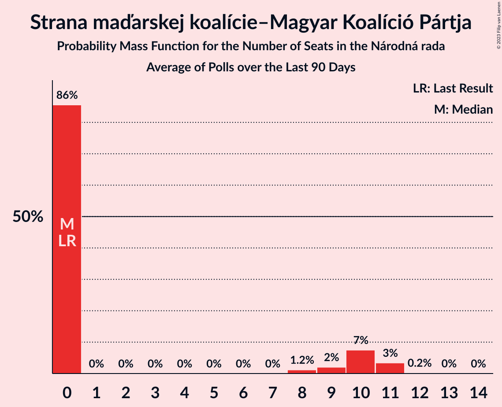
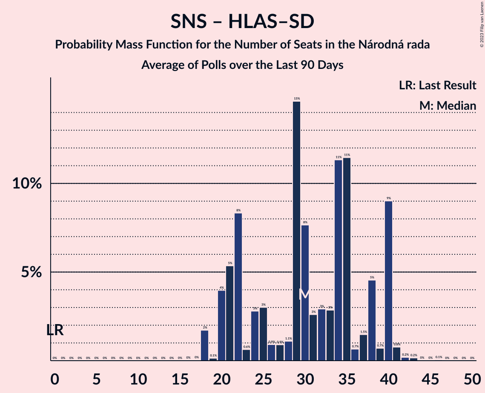

# Poll Average

<a href="#voting-intentions">Voting Intentions</a> | <a href="#seats">Seats</a> | <a href="#coalitions">Coalitions</a> | <a href="#technical-information">Technical Information</a>

## Summary

The table below lists the polls on which the average is based. They are the most recent polls (less than 90 days old) registered and analyzed so far.

| Period     | Polling firm/Commissioner(s) | OĽaNO | Smer–SD | SME RODINA | Kotleba–ĽSNS | PS–SPOLU | SaS | ZĽ | KDH | SMK–MKP | SNS | DV | V | MOST–HÍD | NOVA | PS | SPOLU | HLAS–SD | REP |
|:----------:|:----------------------------:|:--:|:--:|:--:|:--:|:--:|:--:|:--:|:--:|:--:|:--:|:--:|:--:|:--:|:--:|:--:|:--:|:--:|:--:|
| 29 February 2020 | General Election | 25.0%   53 | 18.3%   38 | 8.2%   17 | 8.0%   17 | 7.0%   0 | 6.2%   13 | 5.8%   12 | 4.6%   0 | 3.9%   0 | 3.2%   0 | 3.1%   0 | 2.9%   0 | 2.0%   0 | 0.0%   0 | 7.0%   0 | 7.0%   0 | 0.0%   0 | 0.0%   0 |
| N/A | Poll Average | 5–9%   9–18 | 12–22%   22–43 | 5–9%   0–17 | 1–4%   0 | N/A   N/A | 4–9%   0–16 | 1–4%   0 | 4–8%   0–15 | 2–6%   0–10 | 2–5%   0 | 1–5%   0 | N/A   N/A | N/A   N/A | N/A   N/A | 8–16%   17–29 | 1–3%   0 | 17–22%   30–41 | 6–11%   10–19 |
| [7–13 February 2023](2023-02-13-AKO.html) | AKO   TV JOJ | 6–9%   11–14 | 14–19%   27–33 | 6–9%   11–15 | 1–2%   0 | N/A   N/A | 6–10%   12–16 | 2–3%   0 | 5–9%   10–14 | 1–3%   0 | 3–5%   0 | N/A   N/A | N/A   N/A | N/A   N/A | N/A   N/A | 12–16%   21–28 | 1–2%   0 | 17–21%   30–35 | 5–8%   9–14 |
| [1–8 February 2023](2023-02-08-Focus.html) | Focus   TV Markíza | 5–8%   9–15 | 13–17%   24–29 | 6–9%   12–16 | 2–4%   0 | N/A   N/A | 4–7%   0–11 | 1–2%   0 | 5–9%   10–16 | 3–6%   0–10 | 3–5%   0 | 1–2%   0 | N/A   N/A | N/A   N/A | N/A   N/A | 9–13%   17–24 | 1–3%   0 | 18–23%   34–41 | 7–10%   13–18 |
| [28 January–1 February 2023](2023-02-01-Polis.html) | Polis   SITA | 6–9%   11–16 | 19–24%   34–44 | 5–8%   10–16 | 2–3%   0 | N/A   N/A | 4–7%   0–12 | 2–4%   0 | 4–7%   0–12 | 4–6%   0–12 | 3–5%   0–9 | 3–5%   0 | N/A   N/A | N/A   N/A | N/A   N/A | 8–11%   16–21 | 1–2%   0 | 17–22%   30–41 | 6–9%   11–15 |
| [18–20 January 2023](2023-01-20-IPSOS.html) | IPSOS   Denník N | 7–10%   12–18 | 12–16%   21–28 | 6–10%   12–18 | 2–4%   0 | N/A   N/A | 6–9%   10–15 | 1–3%   0 | 5–8%   9–15 | 2–4%   0 | 2–4%   0 | N/A   N/A | N/A   N/A | N/A   N/A | N/A   N/A | 11–15%   20–27 | N/A   N/A | 16–21%   29–36 | 7–10%   12–18 |
| [19–23 December 2022](2022-12-23-Median.html) | Median | 5–8%   9–14 | 15–19%   27–34 | 5–8%   0–13 | 1–3%   0 | N/A   N/A | 5–8%   9–15 | 1–3%   0 | 5–8%   0–13 | 2–4%   0 | N/A   N/A | N/A   N/A | N/A   N/A | N/A   N/A | N/A   N/A | 12–16%   21–31 | N/A   N/A | 17–22%   31–40 | 8–12%   15–21 |
| 29 February 2020 | General Election | 25.0%   53 | 18.3%   38 | 8.2%   17 | 8.0%   17 | 7.0%   0 | 6.2%   13 | 5.8%   12 | 4.6%   0 | 3.9%   0 | 3.2%   0 | 3.1%   0 | 2.9%   0 | 2.0%   0 | 0.0%   0 | 7.0%   0 | 7.0%   0 | 0.0%   0 | 0.0%   0 |

Only polls for which at least the sample size has been published are included in the table above.

**Legend:**
+ **Top half of each row:** Voting intentions (95% confidence interval)
+ **Bottom half of each row:** Seat projections for the Národná rada (95% confidence interval)
+ **OĽaNO:** OBYČAJNÍ ĽUDIA a nezávislé osobnosti
+ **Smer–SD:** SMER–sociálna demokracia
+ **SME RODINA:** SME RODINA
+ **Kotleba–ĽSNS:** Kotleba–Ľudová strana Naše Slovensko
+ **PS–SPOLU:** Progresívne Slovensko–SPOLU–Občianska Demokracia
+ **SaS:** Sloboda a Solidarita
+ **ZĽ:** Za ľudí
+ **KDH:** Kresťanskodemokratické hnutie
+ **SMK–MKP:** Strana maďarskej koalície–Magyar Koalíció Pártja
+ **SNS:** Slovenská národná strana
+ **DV:** Dobrá voľba
+ **V:** VLASŤ
+ **MOST–HÍD:** MOST–HÍD
+ **NOVA:** NOVA
+ **PS:** Progresívne Slovensko
+ **SPOLU:** SPOLU–Občianska Demokracia
+ **HLAS–SD:** HLAS–sociálna demokracia
+ **REP:** REPUBLIKA
+ **N/A (single party):** Party not included the published results
+ **N/A (entire row):** Calculation for this opinion poll not started yet

## Voting Intentions

### Confidence Intervals

| Party | Last Result | Median | 80% Confidence Interval | 90% Confidence Interval | 95% Confidence Interval | 99% Confidence Interval |
|:-----:|:-----------:|:------:|:-----------------------:|:-----------------------:|:-----------------------:|:-----------------------:|
| <a href="#obyčajní-ľudia-a-nezávislé-osobnosti">OBYČAJNÍ ĽUDIA a nezávislé osobnosti</a> | 25.0% | 7.1% | 5.8–8.5% |5.5–9.0% | 5.3–9.3% | 4.8–10.0% |
| <a href="#smer–sociálna-demokracia">SMER–sociálna demokracia</a> | 18.3% | 16.0% | 13.3–21.0% |12.7–21.9% | 12.3–22.5% | 11.6–23.6% |
| <a href="#sme-rodina">SME RODINA</a> | 8.2% | 7.1% | 5.7–8.6% |5.4–9.0% | 5.1–9.3% | 4.6–10.0% |
| <a href="#kotleba–ľudová-strana-naše-slovensko">Kotleba–Ľudová strana Naše Slovensko</a> | 8.0% | 2.4% | 1.5–3.5% |1.3–3.8% | 1.2–4.0% | 0.9–4.5% |
| <a href="#progresívne-slovensko–spolu–občianska-demokracia">Progresívne Slovensko–SPOLU–Občianska Demokracia</a> | 7.0% | N/A | N/A |N/A | N/A | N/A |
| <a href="#progresívne-slovensko">Progresívne Slovensko</a> | 7.0% | 12.4% | 9.4–14.8% |8.9–15.3% | 8.5–15.7% | 7.8–16.6% |
| <a href="#spolu–občianska-demokracia">SPOLU–Občianska Demokracia</a> | 7.0% | 1.4% | 0.9–2.3% |0.7–2.5% | 0.6–2.7% | 0.5–3.1% |
| <a href="#sloboda-a-solidarita">Sloboda a Solidarita</a> | 6.2% | 6.4% | 4.8–8.2% |4.5–8.6% | 4.3–9.0% | 3.9–9.8% |
| <a href="#za-ľudí">Za ľudí</a> | 5.8% | 2.1% | 1.0–3.3% |0.8–3.6% | 0.7–3.8% | 0.5–4.4% |
| <a href="#kresťanskodemokratické-hnutie">Kresťanskodemokratické hnutie</a> | 4.6% | 6.4% | 4.9–7.7% |4.6–8.0% | 4.3–8.3% | 3.8–8.9% |
| <a href="#strana-maďarskej-koalície–magyar-koalíció-pártja">Strana maďarskej koalície–Magyar Koalíció Pártja</a> | 3.9% | 3.4% | 2.1–5.1% |1.8–5.5% | 1.7–5.8% | 1.4–6.3% |
| <a href="#slovenská-národná-strana">Slovenská národná strana</a> | 3.2% | 3.7% | 2.7–4.6% |2.5–4.9% | 2.3–5.1% | 2.0–5.6% |
| <a href="#dobrá-voľba">Dobrá voľba</a> | 3.1% | 2.4% | 1.2–4.1% |1.0–4.4% | 0.9–4.6% | 0.7–5.1% |
| <a href="#vlasť">VLASŤ</a> | 2.9% | N/A | N/A |N/A | N/A | N/A |
| <a href="#most–híd">MOST–HÍD</a> | 2.0% | N/A | N/A |N/A | N/A | N/A |
| <a href="#nova">NOVA</a> | 0.0% | N/A | N/A |N/A | N/A | N/A |
| <a href="#hlas–sociálna-demokracia">HLAS–sociálna demokracia</a> | 0.0% | 19.3% | 17.5–21.3% |17.0–22.0% | 16.6–22.5% | 15.8–23.5% |
| <a href="#republika">REPUBLIKA</a> | 0.0% | 8.0% | 6.3–9.9% |6.0–10.4% | 5.7–10.8% | 5.2–11.6% |

### OBYČAJNÍ ĽUDIA a nezávislé osobnosti

*For a full overview of the results for this party, see the [OBYČAJNÍ ĽUDIA a nezávislé osobnosti](party-obyčajníľudiaanezávisléosobnosti.html) page.*

| Voting Intentions | Probability | Accumulated | Special Marks |
|:-----------------:|:-----------:|:-----------:|:-------------:|
| 2.5–3.5% | 0% | 100% |  |
| 3.5–4.5% | 0.2% | 100% |  |
| 4.5–5.5% | 5% | 99.8% |  |
| 5.5–6.5% | 25% | 94% |  |
| 6.5–7.5% | 35% | 69% | Median |
| 7.5–8.5% | 24% | 34% |  |
| 8.5–9.5% | 8% | 10% |  |
| 9.5–10.5% | 1.4% | 1.5% |  |
| 10.5–11.5% | 0.1% | 0.1% |  |
| 11.5–12.5% | 0% | 0% |  |
| 12.5–13.5% | 0% | 0% |  |
| 13.5–14.5% | 0% | 0% |  |
| 14.5–15.5% | 0% | 0% |  |
| 15.5–16.5% | 0% | 0% |  |
| 16.5–17.5% | 0% | 0% |  |
| 17.5–18.5% | 0% | 0% |  |
| 18.5–19.5% | 0% | 0% |  |
| 19.5–20.5% | 0% | 0% |  |
| 20.5–21.5% | 0% | 0% |  |
| 21.5–22.5% | 0% | 0% |  |
| 22.5–23.5% | 0% | 0% |  |
| 23.5–24.5% | 0% | 0% |  |
| 24.5–25.5% | 0% | 0% | Last Result |

### SMER–sociálna demokracia

*For a full overview of the results for this party, see the [SMER–sociálna demokracia](party-smer–sociálnademokracia.html) page.*

| Voting Intentions | Probability | Accumulated | Special Marks |
|:-----------------:|:-----------:|:-----------:|:-------------:|
| 9.5–10.5% | 0% | 100% |  |
| 10.5–11.5% | 0.5% | 100% |  |
| 11.5–12.5% | 3% | 99.5% |  |
| 12.5–13.5% | 9% | 96% |  |
| 13.5–14.5% | 14% | 87% |  |
| 14.5–15.5% | 16% | 73% |  |
| 15.5–16.5% | 16% | 57% | Median |
| 16.5–17.5% | 13% | 41% |  |
| 17.5–18.5% | 7% | 28% | Last Result |
| 18.5–19.5% | 4% | 22% |  |
| 19.5–20.5% | 5% | 18% |  |
| 20.5–21.5% | 6% | 13% |  |
| 21.5–22.5% | 4% | 7% |  |
| 22.5–23.5% | 2% | 2% |  |
| 23.5–24.5% | 0.5% | 0.5% |  |
| 24.5–25.5% | 0.1% | 0.1% |  |
| 25.5–26.5% | 0% | 0% |  |

### SME RODINA

*For a full overview of the results for this party, see the [SME RODINA](party-smerodina.html) page.*

| Voting Intentions | Probability | Accumulated | Special Marks |
|:-----------------:|:-----------:|:-----------:|:-------------:|
| 2.5–3.5% | 0% | 100% |  |
| 3.5–4.5% | 0.4% | 100% |  |
| 4.5–5.5% | 7% | 99.6% |  |
| 5.5–6.5% | 24% | 93% |  |
| 6.5–7.5% | 33% | 68% | Median |
| 7.5–8.5% | 25% | 36% | Last Result |
| 8.5–9.5% | 9% | 10% |  |
| 9.5–10.5% | 1.4% | 1.5% |  |
| 10.5–11.5% | 0.1% | 0.1% |  |
| 11.5–12.5% | 0% | 0% |  |

### Kotleba–Ľudová strana Naše Slovensko

*For a full overview of the results for this party, see the [Kotleba–Ľudová strana Naše Slovensko](party-kotleba–ľudovástrananašeslovensko.html) page.*

| Voting Intentions | Probability | Accumulated | Special Marks |
|:-----------------:|:-----------:|:-----------:|:-------------:|
| 0.0–0.5% | 0% | 100% |  |
| 0.5–1.5% | 13% | 100% |  |
| 1.5–2.5% | 43% | 87% | Median |
| 2.5–3.5% | 35% | 44% |  |
| 3.5–4.5% | 8% | 9% |  |
| 4.5–5.5% | 0.4% | 0.4% |  |
| 5.5–6.5% | 0% | 0% |  |
| 6.5–7.5% | 0% | 0% |  |
| 7.5–8.5% | 0% | 0% | Last Result |

### Progresívne Slovensko

*For a full overview of the results for this party, see the [Progresívne Slovensko](party-progresívneslovensko.html) page.*

| Voting Intentions | Probability | Accumulated | Special Marks |
|:-----------------:|:-----------:|:-----------:|:-------------:|
| 5.5–6.5% | 0% | 100% |  |
| 6.5–7.5% | 0.2% | 100% | Last Result |
| 7.5–8.5% | 3% | 99.8% |  |
| 8.5–9.5% | 9% | 97% |  |
| 9.5–10.5% | 12% | 89% |  |
| 10.5–11.5% | 13% | 77% |  |
| 11.5–12.5% | 15% | 63% | Median |
| 12.5–13.5% | 19% | 48% |  |
| 13.5–14.5% | 17% | 30% |  |
| 14.5–15.5% | 9% | 13% |  |
| 15.5–16.5% | 3% | 3% |  |
| 16.5–17.5% | 0.5% | 0.5% |  |
| 17.5–18.5% | 0% | 0% |  |
| 18.5–19.5% | 0% | 0% |  |

### SPOLU–Občianska Demokracia

*For a full overview of the results for this party, see the [SPOLU–Občianska Demokracia](party-spolu–občianskademokracia.html) page.*

| Voting Intentions | Probability | Accumulated | Special Marks |
|:-----------------:|:-----------:|:-----------:|:-------------:|
| 0.0–0.5% | 0.9% | 100% |  |
| 0.5–1.5% | 56% | 99.1% | Median |
| 1.5–2.5% | 38% | 43% |  |
| 2.5–3.5% | 5% | 5% |  |
| 3.5–4.5% | 0.1% | 0.1% |  |
| 4.5–5.5% | 0% | 0% |  |
| 5.5–6.5% | 0% | 0% |  |
| 6.5–7.5% | 0% | 0% | Last Result |

### Sloboda a Solidarita

*For a full overview of the results for this party, see the [Sloboda a Solidarita](party-slobodaasolidarita.html) page.*

| Voting Intentions | Probability | Accumulated | Special Marks |
|:-----------------:|:-----------:|:-----------:|:-------------:|
| 1.5–2.5% | 0% | 100% |  |
| 2.5–3.5% | 0.1% | 100% |  |
| 3.5–4.5% | 5% | 99.9% |  |
| 4.5–5.5% | 22% | 95% |  |
| 5.5–6.5% | 27% | 72% | Last Result, Median |
| 6.5–7.5% | 24% | 45% |  |
| 7.5–8.5% | 15% | 21% |  |
| 8.5–9.5% | 5% | 6% |  |
| 9.5–10.5% | 0.8% | 0.8% |  |
| 10.5–11.5% | 0.1% | 0.1% |  |
| 11.5–12.5% | 0% | 0% |  |

### Za ľudí

*For a full overview of the results for this party, see the [Za ľudí](party-zaľudí.html) page.*

| Voting Intentions | Probability | Accumulated | Special Marks |
|:-----------------:|:-----------:|:-----------:|:-------------:|
| 0.0–0.5% | 0.5% | 100% |  |
| 0.5–1.5% | 23% | 99.5% |  |
| 1.5–2.5% | 46% | 77% | Median |
| 2.5–3.5% | 25% | 31% |  |
| 3.5–4.5% | 5% | 5% |  |
| 4.5–5.5% | 0.2% | 0.2% |  |
| 5.5–6.5% | 0% | 0% | Last Result |

### Kresťanskodemokratické hnutie

*For a full overview of the results for this party, see the [Kresťanskodemokratické hnutie](party-kresťanskodemokratickéhnutie.html) page.*

| Voting Intentions | Probability | Accumulated | Special Marks |
|:-----------------:|:-----------:|:-----------:|:-------------:|
| 1.5–2.5% | 0% | 100% |  |
| 2.5–3.5% | 0.2% | 100% |  |
| 3.5–4.5% | 5% | 99.8% |  |
| 4.5–5.5% | 17% | 95% | Last Result |
| 5.5–6.5% | 33% | 78% | Median |
| 6.5–7.5% | 32% | 44% |  |
| 7.5–8.5% | 11% | 13% |  |
| 8.5–9.5% | 1.4% | 1.5% |  |
| 9.5–10.5% | 0.1% | 0.1% |  |
| 10.5–11.5% | 0% | 0% |  |

### Strana maďarskej koalície–Magyar Koalíció Pártja

*For a full overview of the results for this party, see the [Strana maďarskej koalície–Magyar Koalíció Pártja](party-stranamaďarskejkoalície–magyarkoalíciópártja.html) page.*

| Voting Intentions | Probability | Accumulated | Special Marks |
|:-----------------:|:-----------:|:-----------:|:-------------:|
| 0.0–0.5% | 0% | 100% |  |
| 0.5–1.5% | 1.5% | 100% |  |
| 1.5–2.5% | 23% | 98.5% |  |
| 2.5–3.5% | 30% | 76% | Median |
| 3.5–4.5% | 23% | 46% | Last Result |
| 4.5–5.5% | 19% | 23% |  |
| 5.5–6.5% | 4% | 4% |  |
| 6.5–7.5% | 0.2% | 0.2% |  |
| 7.5–8.5% | 0% | 0% |  |

### Slovenská národná strana

*For a full overview of the results for this party, see the [Slovenská národná strana](party-slovenskánárodnástrana.html) page.*

| Voting Intentions | Probability | Accumulated | Special Marks |
|:-----------------:|:-----------:|:-----------:|:-------------:|
| 0.5–1.5% | 0% | 100% |  |
| 1.5–2.5% | 6% | 100% |  |
| 2.5–3.5% | 38% | 94% | Last Result |
| 3.5–4.5% | 45% | 56% | Median |
| 4.5–5.5% | 11% | 11% |  |
| 5.5–6.5% | 0.6% | 0.6% |  |
| 6.5–7.5% | 0% | 0% |  |

### Dobrá voľba

*For a full overview of the results for this party, see the [Dobrá voľba](party-dobrávoľba.html) page.*

| Voting Intentions | Probability | Accumulated | Special Marks |
|:-----------------:|:-----------:|:-----------:|:-------------:|
| 0.0–0.5% | 0% | 100% |  |
| 0.5–1.5% | 31% | 100% |  |
| 1.5–2.5% | 20% | 69% | Median |
| 2.5–3.5% | 24% | 49% | Last Result |
| 3.5–4.5% | 22% | 25% |  |
| 4.5–5.5% | 3% | 3% |  |
| 5.5–6.5% | 0.1% | 0.1% |  |
| 6.5–7.5% | 0% | 0% |  |

### HLAS–sociálna demokracia

*For a full overview of the results for this party, see the [HLAS–sociálna demokracia](party-hlas–sociálnademokracia.html) page.*

| Voting Intentions | Probability | Accumulated | Special Marks |
|:-----------------:|:-----------:|:-----------:|:-------------:|
| 0.0–0.5% | 0% | 100% | Last Result |
| 0.5–1.5% | 0% | 100% |  |
| 1.5–2.5% | 0% | 100% |  |
| 2.5–3.5% | 0% | 100% |  |
| 3.5–4.5% | 0% | 100% |  |
| 4.5–5.5% | 0% | 100% |  |
| 5.5–6.5% | 0% | 100% |  |
| 6.5–7.5% | 0% | 100% |  |
| 7.5–8.5% | 0% | 100% |  |
| 8.5–9.5% | 0% | 100% |  |
| 9.5–10.5% | 0% | 100% |  |
| 10.5–11.5% | 0% | 100% |  |
| 11.5–12.5% | 0% | 100% |  |
| 12.5–13.5% | 0% | 100% |  |
| 13.5–14.5% | 0% | 100% |  |
| 14.5–15.5% | 0.3% | 100% |  |
| 15.5–16.5% | 2% | 99.7% |  |
| 16.5–17.5% | 9% | 98% |  |
| 17.5–18.5% | 20% | 89% |  |
| 18.5–19.5% | 26% | 69% | Median |
| 19.5–20.5% | 22% | 43% |  |
| 20.5–21.5% | 13% | 21% |  |
| 21.5–22.5% | 6% | 8% |  |
| 22.5–23.5% | 2% | 2% |  |
| 23.5–24.5% | 0.4% | 0.4% |  |
| 24.5–25.5% | 0.1% | 0.1% |  |
| 25.5–26.5% | 0% | 0% |  |

### REPUBLIKA

*For a full overview of the results for this party, see the [REPUBLIKA](party-republika.html) page.*

| Voting Intentions | Probability | Accumulated | Special Marks |
|:-----------------:|:-----------:|:-----------:|:-------------:|
| 0.0–0.5% | 0% | 100% | Last Result |
| 0.5–1.5% | 0% | 100% |  |
| 1.5–2.5% | 0% | 100% |  |
| 2.5–3.5% | 0% | 100% |  |
| 3.5–4.5% | 0% | 100% |  |
| 4.5–5.5% | 2% | 100% |  |
| 5.5–6.5% | 12% | 98% |  |
| 6.5–7.5% | 24% | 86% |  |
| 7.5–8.5% | 26% | 62% | Median |
| 8.5–9.5% | 21% | 36% |  |
| 9.5–10.5% | 11% | 15% |  |
| 10.5–11.5% | 4% | 4% |  |
| 11.5–12.5% | 0.6% | 0.6% |  |
| 12.5–13.5% | 0% | 0% |  |
| 13.5–14.5% | 0% | 0% |  |

## Seats

### Confidence Intervals

| Party | Last Result | Median | 80% Confidence Interval | 90% Confidence Interval | 95% Confidence Interval | 99% Confidence Interval |
|:-----:|:-----------:|:------:|:-----------------------:|:-----------------------:|:-----------------------:|:-----------------------:|
| <a href="#obyčajní-ľudia-a-nezávislé-osobnosti">OBYČAJNÍ ĽUDIA a nezávislé osobnosti</a> | 53 | 12 | 10–15 |9–18 | 9–18 | 0–18 |
| <a href="#smer–sociálna-demokracia">SMER–sociálna demokracia</a> | 38 | 29 | 24–37 |23–43 | 22–43 | 21–44 |
| <a href="#sme-rodina">SME RODINA</a> | 17 | 13 | 9–16 |9–16 | 0–17 | 0–18 |
| <a href="#kotleba–ľudová-strana-naše-slovensko">Kotleba–Ľudová strana Naše Slovensko</a> | 17 | 0 | 0 |0 | 0 | 0 |
| <a href="#progresívne-slovensko–spolu–občianska-demokracia">Progresívne Slovensko–SPOLU–Občianska Demokracia</a> | 0 | N/A | N/A |N/A | N/A | N/A |
| <a href="#progresívne-slovensko">Progresívne Slovensko</a> | 0 | 23 | 18–27 |17–28 | 17–29 | 16–31 |
| <a href="#spolu–občianska-demokracia">SPOLU–Občianska Demokracia</a> | 0 | 0 | 0 |0 | 0 | 0 |
| <a href="#sloboda-a-solidarita">Sloboda a Solidarita</a> | 13 | 12 | 9–14 |0–16 | 0–16 | 0–16 |
| <a href="#za-ľudí">Za ľudí</a> | 12 | 0 | 0 |0 | 0 | 0 |
| <a href="#kresťanskodemokratické-hnutie">Kresťanskodemokratické hnutie</a> | 0 | 11 | 9–14 |0–15 | 0–15 | 0–16 |
| <a href="#strana-maďarskej-koalície–magyar-koalíció-pártja">Strana maďarskej koalície–Magyar Koalíció Pártja</a> | 0 | 0 | 0–8 |0–10 | 0–10 | 0–12 |
| <a href="#slovenská-národná-strana">Slovenská národná strana</a> | 0 | 0 | 0 |0 | 0 | 0–9 |
| <a href="#dobrá-voľba">Dobrá voľba</a> | 0 | 0 | 0 |0 | 0 | 0 |
| <a href="#vlasť">VLASŤ</a> | 0 | N/A | N/A |N/A | N/A | N/A |
| <a href="#most–híd">MOST–HÍD</a> | 0 | N/A | N/A |N/A | N/A | N/A |
| <a href="#nova">NOVA</a> | 0 | N/A | N/A |N/A | N/A | N/A |
| <a href="#hlas–sociálna-demokracia">HLAS–sociálna demokracia</a> | 0 | 34 | 31–40 |30–41 | 30–41 | 28–43 |
| <a href="#republika">REPUBLIKA</a> | 0 | 14 | 11–17 |10–18 | 10–19 | 9–21 |

### OBYČAJNÍ ĽUDIA a nezávislé osobnosti

*For a full overview of the results for this party, see the [OBYČAJNÍ ĽUDIA a nezávislé osobnosti](party-obyčajníľudiaanezávisléosobnosti.html) page.*

| Number of Seats | Probability | Accumulated | Special Marks |
|:---------------:|:-----------:|:-----------:|:-------------:|
| 0 | 0.8% | 100% |  |
| 1 | 0% | 99.2% |  |
| 2 | 0% | 99.2% |  |
| 3 | 0% | 99.2% |  |
| 4 | 0% | 99.2% |  |
| 5 | 0% | 99.2% |  |
| 6 | 0% | 99.2% |  |
| 7 | 0% | 99.2% |  |
| 8 | 0% | 99.2% |  |
| 9 | 6% | 99.2% |  |
| 10 | 9% | 94% |  |
| 11 | 19% | 85% |  |
| 12 | 19% | 66% | Median |
| 13 | 11% | 46% |  |
| 14 | 15% | 35% |  |
| 15 | 11% | 20% |  |
| 16 | 3% | 9% |  |
| 17 | 1.1% | 6% |  |
| 18 | 5% | 5% |  |
| 19 | 0.3% | 0.5% |  |
| 20 | 0% | 0.1% |  |
| 21 | 0.1% | 0.1% |  |
| 22 | 0% | 0% |  |
| 23 | 0% | 0% |  |
| 24 | 0% | 0% |  |
| 25 | 0% | 0% |  |
| 26 | 0% | 0% |  |
| 27 | 0% | 0% |  |
| 28 | 0% | 0% |  |
| 29 | 0% | 0% |  |
| 30 | 0% | 0% |  |
| 31 | 0% | 0% |  |
| 32 | 0% | 0% |  |
| 33 | 0% | 0% |  |
| 34 | 0% | 0% |  |
| 35 | 0% | 0% |  |
| 36 | 0% | 0% |  |
| 37 | 0% | 0% |  |
| 38 | 0% | 0% |  |
| 39 | 0% | 0% |  |
| 40 | 0% | 0% |  |
| 41 | 0% | 0% |  |
| 42 | 0% | 0% |  |
| 43 | 0% | 0% |  |
| 44 | 0% | 0% |  |
| 45 | 0% | 0% |  |
| 46 | 0% | 0% |  |
| 47 | 0% | 0% |  |
| 48 | 0% | 0% |  |
| 49 | 0% | 0% |  |
| 50 | 0% | 0% |  |
| 51 | 0% | 0% |  |
| 52 | 0% | 0% |  |
| 53 | 0% | 0% | Last Result |

### SMER–sociálna demokracia

*For a full overview of the results for this party, see the [SMER–sociálna demokracia](party-smer–sociálnademokracia.html) page.*

| Number of Seats | Probability | Accumulated | Special Marks |
|:---------------:|:-----------:|:-----------:|:-------------:|
| 19 | 0.2% | 100% |  |
| 20 | 0.1% | 99.8% |  |
| 21 | 2% | 99.8% |  |
| 22 | 1.1% | 98% |  |
| 23 | 5% | 97% |  |
| 24 | 7% | 91% |  |
| 25 | 4% | 85% |  |
| 26 | 5% | 80% |  |
| 27 | 11% | 75% |  |
| 28 | 10% | 64% |  |
| 29 | 7% | 54% | Median |
| 30 | 6% | 47% |  |
| 31 | 16% | 41% |  |
| 32 | 1.3% | 25% |  |
| 33 | 2% | 24% |  |
| 34 | 1.3% | 21% |  |
| 35 | 0.5% | 20% |  |
| 36 | 0.4% | 19% |  |
| 37 | 9% | 19% |  |
| 38 | 0.2% | 10% | Last Result |
| 39 | 2% | 10% |  |
| 40 | 0.1% | 7% |  |
| 41 | 0.8% | 7% |  |
| 42 | 0% | 6% |  |
| 43 | 6% | 6% |  |
| 44 | 0.3% | 0.7% |  |
| 45 | 0.4% | 0.4% |  |
| 46 | 0% | 0% |  |

### SME RODINA

*For a full overview of the results for this party, see the [SME RODINA](party-smerodina.html) page.*

| Number of Seats | Probability | Accumulated | Special Marks |
|:---------------:|:-----------:|:-----------:|:-------------:|
| 0 | 4% | 100% |  |
| 1 | 0% | 96% |  |
| 2 | 0% | 96% |  |
| 3 | 0% | 96% |  |
| 4 | 0% | 96% |  |
| 5 | 0% | 96% |  |
| 6 | 0% | 96% |  |
| 7 | 0% | 96% |  |
| 8 | 0% | 96% |  |
| 9 | 7% | 96% |  |
| 10 | 5% | 89% |  |
| 11 | 8% | 84% |  |
| 12 | 10% | 76% |  |
| 13 | 17% | 66% | Median |
| 14 | 18% | 49% |  |
| 15 | 14% | 31% |  |
| 16 | 13% | 16% |  |
| 17 | 2% | 3% | Last Result |
| 18 | 1.1% | 1.4% |  |
| 19 | 0.3% | 0.3% |  |
| 20 | 0.1% | 0.1% |  |
| 21 | 0% | 0% |  |

### Kotleba–Ľudová strana Naše Slovensko

*For a full overview of the results for this party, see the [Kotleba–Ľudová strana Naše Slovensko](party-kotleba–ľudovástrananašeslovensko.html) page.*

| Number of Seats | Probability | Accumulated | Special Marks |
|:---------------:|:-----------:|:-----------:|:-------------:|
| 0 | 100% | 100% | Median |
| 1 | 0% | 0% |  |
| 2 | 0% | 0% |  |
| 3 | 0% | 0% |  |
| 4 | 0% | 0% |  |
| 5 | 0% | 0% |  |
| 6 | 0% | 0% |  |
| 7 | 0% | 0% |  |
| 8 | 0% | 0% |  |
| 9 | 0% | 0% |  |
| 10 | 0% | 0% |  |
| 11 | 0% | 0% |  |
| 12 | 0% | 0% |  |
| 13 | 0% | 0% |  |
| 14 | 0% | 0% |  |
| 15 | 0% | 0% |  |
| 16 | 0% | 0% |  |
| 17 | 0% | 0% | Last Result |

### Progresívne Slovensko–SPOLU–Občianska Demokracia

*For a full overview of the results for this party, see the [Progresívne Slovensko–SPOLU–Občianska Demokracia](party-progresívneslovensko–spolu–občianskademokracia.html) page.*

### Progresívne Slovensko

*For a full overview of the results for this party, see the [Progresívne Slovensko](party-progresívneslovensko.html) page.*

| Number of Seats | Probability | Accumulated | Special Marks |
|:---------------:|:-----------:|:-----------:|:-------------:|
| 0 | 0% | 100% | Last Result |
| 1 | 0% | 100% |  |
| 2 | 0% | 100% |  |
| 3 | 0% | 100% |  |
| 4 | 0% | 100% |  |
| 5 | 0% | 100% |  |
| 6 | 0% | 100% |  |
| 7 | 0% | 100% |  |
| 8 | 0% | 100% |  |
| 9 | 0% | 100% |  |
| 10 | 0% | 100% |  |
| 11 | 0% | 100% |  |
| 12 | 0% | 100% |  |
| 13 | 0.1% | 100% |  |
| 14 | 0.1% | 99.9% |  |
| 15 | 0.1% | 99.8% |  |
| 16 | 2% | 99.7% |  |
| 17 | 8% | 98% |  |
| 18 | 7% | 90% |  |
| 19 | 1.0% | 83% |  |
| 20 | 13% | 82% |  |
| 21 | 4% | 69% |  |
| 22 | 9% | 65% |  |
| 23 | 11% | 56% | Median |
| 24 | 9% | 46% |  |
| 25 | 6% | 36% |  |
| 26 | 19% | 30% |  |
| 27 | 2% | 12% |  |
| 28 | 7% | 10% |  |
| 29 | 1.2% | 3% |  |
| 30 | 0.9% | 1.5% |  |
| 31 | 0.5% | 0.6% |  |
| 32 | 0.1% | 0.1% |  |
| 33 | 0% | 0% |  |

### SPOLU–Občianska Demokracia

*For a full overview of the results for this party, see the [SPOLU–Občianska Demokracia](party-spolu–občianskademokracia.html) page.*

| Number of Seats | Probability | Accumulated | Special Marks |
|:---------------:|:-----------:|:-----------:|:-------------:|
| 0 | 100% | 100% | Last Result, Median |

### Sloboda a Solidarita

*For a full overview of the results for this party, see the [Sloboda a Solidarita](party-slobodaasolidarita.html) page.*

| Number of Seats | Probability | Accumulated | Special Marks |
|:---------------:|:-----------:|:-----------:|:-------------:|
| 0 | 9% | 100% |  |
| 1 | 0% | 91% |  |
| 2 | 0% | 91% |  |
| 3 | 0% | 91% |  |
| 4 | 0% | 91% |  |
| 5 | 0% | 91% |  |
| 6 | 0% | 91% |  |
| 7 | 0% | 91% |  |
| 8 | 0% | 91% |  |
| 9 | 13% | 91% |  |
| 10 | 12% | 78% |  |
| 11 | 14% | 66% |  |
| 12 | 20% | 51% | Median |
| 13 | 13% | 32% | Last Result |
| 14 | 11% | 19% |  |
| 15 | 2% | 8% |  |
| 16 | 6% | 6% |  |
| 17 | 0.1% | 0.3% |  |
| 18 | 0.1% | 0.1% |  |
| 19 | 0% | 0% |  |

### Za ľudí

*For a full overview of the results for this party, see the [Za ľudí](party-zaľudí.html) page.*

| Number of Seats | Probability | Accumulated | Special Marks |
|:---------------:|:-----------:|:-----------:|:-------------:|
| 0 | 100% | 100% | Median |
| 1 | 0% | 0% |  |
| 2 | 0% | 0% |  |
| 3 | 0% | 0% |  |
| 4 | 0% | 0% |  |
| 5 | 0% | 0% |  |
| 6 | 0% | 0% |  |
| 7 | 0% | 0% |  |
| 8 | 0% | 0% |  |
| 9 | 0% | 0% |  |
| 10 | 0% | 0% |  |
| 11 | 0% | 0% |  |
| 12 | 0% | 0% | Last Result |

### Kresťanskodemokratické hnutie

*For a full overview of the results for this party, see the [Kresťanskodemokratické hnutie](party-kresťanskodemokratickéhnutie.html) page.*

| Number of Seats | Probability | Accumulated | Special Marks |
|:---------------:|:-----------:|:-----------:|:-------------:|
| 0 | 9% | 100% | Last Result |
| 1 | 0% | 91% |  |
| 2 | 0% | 91% |  |
| 3 | 0% | 91% |  |
| 4 | 0% | 91% |  |
| 5 | 0% | 91% |  |
| 6 | 0% | 91% |  |
| 7 | 0% | 91% |  |
| 8 | 0% | 91% |  |
| 9 | 5% | 91% |  |
| 10 | 14% | 86% |  |
| 11 | 23% | 71% | Median |
| 12 | 22% | 48% |  |
| 13 | 11% | 26% |  |
| 14 | 7% | 15% |  |
| 15 | 7% | 8% |  |
| 16 | 2% | 2% |  |
| 17 | 0% | 0.1% |  |
| 18 | 0% | 0% |  |

### Strana maďarskej koalície–Magyar Koalíció Pártja

*For a full overview of the results for this party, see the [Strana maďarskej koalície–Magyar Koalíció Pártja](party-stranamaďarskejkoalície–magyarkoalíciópártja.html) page.*

| Number of Seats | Probability | Accumulated | Special Marks |
|:---------------:|:-----------:|:-----------:|:-------------:|
| 0 | 90% | 100% | Last Result, Median |
| 1 | 0% | 10% |  |
| 2 | 0% | 10% |  |
| 3 | 0% | 10% |  |
| 4 | 0% | 10% |  |
| 5 | 0% | 10% |  |
| 6 | 0% | 10% |  |
| 7 | 0% | 10% |  |
| 8 | 0.6% | 10% |  |
| 9 | 3% | 10% |  |
| 10 | 5% | 6% |  |
| 11 | 0.5% | 1.5% |  |
| 12 | 0.9% | 0.9% |  |
| 13 | 0% | 0% |  |

### Slovenská národná strana

*For a full overview of the results for this party, see the [Slovenská národná strana](party-slovenskánárodnástrana.html) page.*

| Number of Seats | Probability | Accumulated | Special Marks |
|:---------------:|:-----------:|:-----------:|:-------------:|
| 0 | 98.9% | 100% | Last Result, Median |
| 1 | 0% | 1.1% |  |
| 2 | 0% | 1.1% |  |
| 3 | 0% | 1.1% |  |
| 4 | 0% | 1.1% |  |
| 5 | 0% | 1.1% |  |
| 6 | 0% | 1.1% |  |
| 7 | 0% | 1.1% |  |
| 8 | 0% | 1.1% |  |
| 9 | 0.7% | 1.1% |  |
| 10 | 0.3% | 0.4% |  |
| 11 | 0.1% | 0.1% |  |
| 12 | 0% | 0% |  |

### Dobrá voľba

*For a full overview of the results for this party, see the [Dobrá voľba](party-dobrávoľba.html) page.*

| Number of Seats | Probability | Accumulated | Special Marks |
|:---------------:|:-----------:|:-----------:|:-------------:|
| 0 | 99.9% | 100% | Last Result, Median |
| 1 | 0% | 0.1% |  |
| 2 | 0% | 0.1% |  |
| 3 | 0% | 0.1% |  |
| 4 | 0% | 0.1% |  |
| 5 | 0% | 0.1% |  |
| 6 | 0% | 0.1% |  |
| 7 | 0% | 0.1% |  |
| 8 | 0% | 0.1% |  |
| 9 | 0% | 0.1% |  |
| 10 | 0% | 0% |  |

### VLASŤ

*For a full overview of the results for this party, see the [VLASŤ](party-vlasť.html) page.*

### MOST–HÍD

*For a full overview of the results for this party, see the [MOST–HÍD](party-most–híd.html) page.*

### NOVA

*For a full overview of the results for this party, see the [NOVA](party-nova.html) page.*

### HLAS–sociálna demokracia

*For a full overview of the results for this party, see the [HLAS–sociálna demokracia](party-hlas–sociálnademokracia.html) page.*

| Number of Seats | Probability | Accumulated | Special Marks |
|:---------------:|:-----------:|:-----------:|:-------------:|
| 0 | 0% | 100% | Last Result |
| 1 | 0% | 100% |  |
| 2 | 0% | 100% |  |
| 3 | 0% | 100% |  |
| 4 | 0% | 100% |  |
| 5 | 0% | 100% |  |
| 6 | 0% | 100% |  |
| 7 | 0% | 100% |  |
| 8 | 0% | 100% |  |
| 9 | 0% | 100% |  |
| 10 | 0% | 100% |  |
| 11 | 0% | 100% |  |
| 12 | 0% | 100% |  |
| 13 | 0% | 100% |  |
| 14 | 0% | 100% |  |
| 15 | 0% | 100% |  |
| 16 | 0% | 100% |  |
| 17 | 0% | 100% |  |
| 18 | 0% | 100% |  |
| 19 | 0% | 100% |  |
| 20 | 0% | 100% |  |
| 21 | 0% | 100% |  |
| 22 | 0% | 100% |  |
| 23 | 0% | 100% |  |
| 24 | 0% | 100% |  |
| 25 | 0% | 100% |  |
| 26 | 0% | 100% |  |
| 27 | 0.1% | 100% |  |
| 28 | 0.4% | 99.9% |  |
| 29 | 1.0% | 99.5% |  |
| 30 | 4% | 98% |  |
| 31 | 11% | 94% |  |
| 32 | 15% | 84% |  |
| 33 | 8% | 68% |  |
| 34 | 16% | 61% | Median |
| 35 | 16% | 45% |  |
| 36 | 3% | 29% |  |
| 37 | 8% | 26% |  |
| 38 | 6% | 18% |  |
| 39 | 0.6% | 12% |  |
| 40 | 4% | 11% |  |
| 41 | 6% | 7% |  |
| 42 | 0.4% | 1.0% |  |
| 43 | 0.4% | 0.6% |  |
| 44 | 0.1% | 0.2% |  |
| 45 | 0% | 0.1% |  |
| 46 | 0% | 0.1% |  |
| 47 | 0% | 0% |  |

### REPUBLIKA

*For a full overview of the results for this party, see the [REPUBLIKA](party-republika.html) page.*

| Number of Seats | Probability | Accumulated | Special Marks |
|:---------------:|:-----------:|:-----------:|:-------------:|
| 0 | 0.1% | 100% | Last Result |
| 1 | 0% | 99.9% |  |
| 2 | 0% | 99.9% |  |
| 3 | 0% | 99.9% |  |
| 4 | 0% | 99.9% |  |
| 5 | 0% | 99.9% |  |
| 6 | 0% | 99.9% |  |
| 7 | 0% | 99.9% |  |
| 8 | 0% | 99.9% |  |
| 9 | 2% | 99.9% |  |
| 10 | 3% | 98% |  |
| 11 | 7% | 95% |  |
| 12 | 3% | 88% |  |
| 13 | 20% | 85% |  |
| 14 | 16% | 65% | Median |
| 15 | 16% | 49% |  |
| 16 | 14% | 33% |  |
| 17 | 11% | 19% |  |
| 18 | 4% | 8% |  |
| 19 | 2% | 4% |  |
| 20 | 0.7% | 2% |  |
| 21 | 0.9% | 1.1% |  |
| 22 | 0.2% | 0.2% |  |
| 23 | 0% | 0.1% |  |
| 24 | 0% | 0.1% |  |
| 25 | 0% | 0% |  |

## Coalitions

### Confidence Intervals

| Coalition | Last Result | Median | Majority? | 80% Confidence Interval | 90% Confidence Interval | 95% Confidence Interval | 99% Confidence Interval |
|:---------:|:-----------:|:------:|:---------:|:-----------------------:|:-----------------------:|:-----------------------:|:-----------------------:|
| SMER–sociálna demokracia – SME RODINA – Kotleba–Ľudová strana Naše Slovensko – Slovenská národná strana – HLAS–sociálna demokracia | 72 | 76 | 51% | 70–87 | 68–94 | 67–94 | 65–96 |
| SMER–sociálna demokracia – SME RODINA – HLAS–sociálna demokracia | 55 | 76 | 51% | 70–87 | 68–93 | 67–94 | 65–95 |
| SMER–sociálna demokracia – SME RODINA – Slovenská národná strana – HLAS–sociálna demokracia | 55 | 76 | 51% | 70–87 | 68–94 | 67–94 | 65–96 |
| SMER–sociálna demokracia – Slovenská národná strana – MOST–HÍD – HLAS–sociálna demokracia | 38 | 65 | 8% | 57–73 | 55–80 | 54–80 | 52–84 |
| SMER–sociálna demokracia – Slovenská národná strana – HLAS–sociálna demokracia | 38 | 65 | 8% | 57–73 | 55–80 | 54–80 | 52–84 |
| OBYČAJNÍ ĽUDIA a nezávislé osobnosti – SME RODINA – Progresívne Slovensko–SPOLU–Občianska Demokracia – Sloboda a Solidarita – Za ľudí – Kresťanskodemokratické hnutie – Strana maďarskej koalície–Magyar Koalíció Pártja – MOST–HÍD | 95 | 49 | 0% | 39–55 | 35–56 | 35–58 | 28–61 |
| OBYČAJNÍ ĽUDIA a nezávislé osobnosti – SME RODINA – Progresívne Slovensko–SPOLU–Občianska Demokracia – Sloboda a Solidarita – Za ľudí – Kresťanskodemokratické hnutie – Strana maďarskej koalície–Magyar Koalíció Pártja | 95 | 49 | 0% | 39–55 | 35–56 | 35–58 | 28–61 |
| OBYČAJNÍ ĽUDIA a nezávislé osobnosti – SME RODINA – Progresívne Slovensko–SPOLU–Občianska Demokracia – Sloboda a Solidarita – Za ľudí – Kresťanskodemokratické hnutie – MOST–HÍD | 95 | 49 | 0% | 37–55 | 35–56 | 34–57 | 26–61 |
| OBYČAJNÍ ĽUDIA a nezávislé osobnosti – SME RODINA – Progresívne Slovensko–SPOLU–Občianska Demokracia – Sloboda a Solidarita – Za ľudí – Kresťanskodemokratické hnutie | 95 | 49 | 0% | 37–55 | 35–56 | 34–57 | 26–61 |
| SMER–sociálna demokracia – SME RODINA – Kotleba–Ľudová strana Naše Slovensko – Slovenská národná strana | 72 | 41 | 0% | 37–53 | 35–56 | 31–57 | 31–57 |
| SMER–sociálna demokracia – SME RODINA | 55 | 41 | 0% | 37–53 | 35–56 | 31–57 | 31–57 |
| SMER–sociálna demokracia – SME RODINA – Slovenská národná strana | 55 | 41 | 0% | 37–53 | 35–56 | 31–57 | 31–57 |
| SME RODINA – Kotleba–Ľudová strana Naše Slovensko – Slovenská národná strana – HLAS–sociálna demokracia | 34 | 47 | 0% | 44–55 | 41–55 | 37–55 | 34–56 |
| SME RODINA – HLAS–sociálna demokracia | 17 | 47 | 0% | 43–54 | 41–55 | 37–55 | 34–56 |
| SME RODINA – Slovenská národná strana – HLAS–sociálna demokracia | 17 | 47 | 0% | 44–55 | 41–55 | 37–55 | 34–56 |
| OBYČAJNÍ ĽUDIA a nezávislé osobnosti – Progresívne Slovensko–SPOLU–Občianska Demokracia – Sloboda a Solidarita – Za ľudí – Kresťanskodemokratické hnutie – Strana maďarskej koalície–Magyar Koalíció Pártja – MOST–HÍD | 78 | 36 | 0% | 26–41 | 23–42 | 21–44 | 21–47 |
| OBYČAJNÍ ĽUDIA a nezávislé osobnosti – Progresívne Slovensko–SPOLU–Občianska Demokracia – Sloboda a Solidarita – Za ľudí – Kresťanskodemokratické hnutie – Strana maďarskej koalície–Magyar Koalíció Pártja | 78 | 36 | 0% | 26–41 | 23–42 | 21–44 | 21–47 |
| SMER–sociálna demokracia – Slovenská národná strana – MOST–HÍD | 38 | 29 | 0% | 24–39 | 23–43 | 22–43 | 21–45 |
| SMER–sociálna demokracia | 38 | 29 | 0% | 24–37 | 23–43 | 22–43 | 21–44 |
| SMER–sociálna demokracia – Slovenská národná strana | 38 | 29 | 0% | 24–39 | 23–43 | 22–43 | 21–45 |
| OBYČAJNÍ ĽUDIA a nezávislé osobnosti – Progresívne Slovensko–SPOLU–Občianska Demokracia – Sloboda a Solidarita – Za ľudí – Kresťanskodemokratické hnutie – MOST–HÍD | 78 | 36 | 0% | 25–40 | 21–42 | 21–43 | 16–45 |
| OBYČAJNÍ ĽUDIA a nezávislé osobnosti – Progresívne Slovensko–SPOLU–Občianska Demokracia – Sloboda a Solidarita – Za ľudí – Kresťanskodemokratické hnutie | 78 | 36 | 0% | 25–40 | 21–42 | 21–43 | 16–45 |
| Slovenská národná strana – MOST–HÍD – HLAS–sociálna demokracia | 0 | 34 | 0% | 31–40 | 30–41 | 30–41 | 29–43 |
| Slovenská národná strana – HLAS–sociálna demokracia | 0 | 34 | 0% | 31–40 | 30–41 | 30–41 | 29–43 |
| OBYČAJNÍ ĽUDIA a nezávislé osobnosti – Progresívne Slovensko–SPOLU–Občianska Demokracia – Sloboda a Solidarita – Za ľudí | 78 | 24 | 0% | 19–28 | 15–30 | 13–30 | 10–33 |
| Progresívne Slovensko–SPOLU–Občianska Demokracia – Sloboda a Solidarita – Za ľudí – Kresťanskodemokratické hnutie | 25 | 23 | 0% | 11–27 | 10–28 | 10–28 | 0–29 |
| Progresívne Slovensko–SPOLU–Občianska Demokracia – Sloboda a Solidarita – Za ľudí | 25 | 12 | 0% | 9–14 | 0–16 | 0–16 | 0–16 |

### SMER–sociálna demokracia – SME RODINA – Kotleba–Ľudová strana Naše Slovensko – Slovenská národná strana – HLAS–sociálna demokracia

| Number of Seats | Probability | Accumulated | Special Marks |
|:---------------:|:-----------:|:-----------:|:-------------:|
| 64 | 0% | 100% |  |
| 65 | 1.5% | 99.9% |  |
| 66 | 0.2% | 98% |  |
| 67 | 2% | 98% |  |
| 68 | 2% | 96% |  |
| 69 | 2% | 94% |  |
| 70 | 4% | 92% |  |
| 71 | 2% | 88% |  |
| 72 | 6% | 86% | Last Result |
| 73 | 9% | 80% |  |
| 74 | 3% | 71% |  |
| 75 | 16% | 68% |  |
| 76 | 5% | 51% | Median, Majority |
| 77 | 10% | 46% |  |
| 78 | 4% | 36% |  |
| 79 | 0.8% | 32% |  |
| 80 | 0.6% | 31% |  |
| 81 | 4% | 31% |  |
| 82 | 6% | 27% |  |
| 83 | 5% | 21% |  |
| 84 | 0.2% | 16% |  |
| 85 | 0.1% | 16% |  |
| 86 | 0.3% | 16% |  |
| 87 | 6% | 15% |  |
| 88 | 0.9% | 9% |  |
| 89 | 1.4% | 8% |  |
| 90 | 0.3% | 7% |  |
| 91 | 0% | 6% |  |
| 92 | 0.5% | 6% |  |
| 93 | 0.7% | 6% |  |
| 94 | 4% | 5% |  |
| 95 | 0.2% | 0.7% |  |
| 96 | 0.5% | 0.5% |  |
| 97 | 0% | 0.1% |  |
| 98 | 0% | 0% |  |

### SMER–sociálna demokracia – SME RODINA – HLAS–sociálna demokracia

| Number of Seats | Probability | Accumulated | Special Marks |
|:---------------:|:-----------:|:-----------:|:-------------:|
| 55 | 0% | 100% | Last Result |
| 56 | 0% | 100% |  |
| 57 | 0% | 100% |  |
| 58 | 0% | 100% |  |
| 59 | 0% | 100% |  |
| 60 | 0% | 100% |  |
| 61 | 0% | 100% |  |
| 62 | 0% | 100% |  |
| 63 | 0% | 100% |  |
| 64 | 0% | 100% |  |
| 65 | 1.5% | 99.9% |  |
| 66 | 0.2% | 98% |  |
| 67 | 2% | 98% |  |
| 68 | 2% | 96% |  |
| 69 | 2% | 94% |  |
| 70 | 4% | 92% |  |
| 71 | 2% | 88% |  |
| 72 | 6% | 86% |  |
| 73 | 9% | 79% |  |
| 74 | 3% | 71% |  |
| 75 | 16% | 67% |  |
| 76 | 5% | 51% | Median, Majority |
| 77 | 11% | 46% |  |
| 78 | 4% | 35% |  |
| 79 | 0.8% | 32% |  |
| 80 | 0.5% | 31% |  |
| 81 | 4% | 30% |  |
| 82 | 6% | 27% |  |
| 83 | 5% | 21% |  |
| 84 | 0.3% | 16% |  |
| 85 | 0.2% | 15% |  |
| 86 | 0.2% | 15% |  |
| 87 | 6% | 15% |  |
| 88 | 0.9% | 9% |  |
| 89 | 1.4% | 8% |  |
| 90 | 0.3% | 6% |  |
| 91 | 0% | 6% |  |
| 92 | 0.4% | 6% |  |
| 93 | 0.7% | 5% |  |
| 94 | 4% | 5% |  |
| 95 | 0.2% | 0.6% |  |
| 96 | 0.4% | 0.4% |  |
| 97 | 0% | 0% |  |

### SMER–sociálna demokracia – SME RODINA – Slovenská národná strana – HLAS–sociálna demokracia

| Number of Seats | Probability | Accumulated | Special Marks |
|:---------------:|:-----------:|:-----------:|:-------------:|
| 55 | 0% | 100% | Last Result |
| 56 | 0% | 100% |  |
| 57 | 0% | 100% |  |
| 58 | 0% | 100% |  |
| 59 | 0% | 100% |  |
| 60 | 0% | 100% |  |
| 61 | 0% | 100% |  |
| 62 | 0% | 100% |  |
| 63 | 0% | 100% |  |
| 64 | 0% | 100% |  |
| 65 | 1.5% | 99.9% |  |
| 66 | 0.2% | 98% |  |
| 67 | 2% | 98% |  |
| 68 | 2% | 96% |  |
| 69 | 2% | 94% |  |
| 70 | 4% | 92% |  |
| 71 | 2% | 88% |  |
| 72 | 6% | 86% |  |
| 73 | 9% | 80% |  |
| 74 | 3% | 71% |  |
| 75 | 16% | 68% |  |
| 76 | 5% | 51% | Median, Majority |
| 77 | 10% | 46% |  |
| 78 | 4% | 36% |  |
| 79 | 0.8% | 32% |  |
| 80 | 0.6% | 31% |  |
| 81 | 4% | 31% |  |
| 82 | 6% | 27% |  |
| 83 | 5% | 21% |  |
| 84 | 0.2% | 16% |  |
| 85 | 0.1% | 16% |  |
| 86 | 0.3% | 16% |  |
| 87 | 6% | 15% |  |
| 88 | 0.9% | 9% |  |
| 89 | 1.4% | 8% |  |
| 90 | 0.3% | 7% |  |
| 91 | 0% | 6% |  |
| 92 | 0.5% | 6% |  |
| 93 | 0.7% | 6% |  |
| 94 | 4% | 5% |  |
| 95 | 0.2% | 0.7% |  |
| 96 | 0.5% | 0.5% |  |
| 97 | 0% | 0.1% |  |
| 98 | 0% | 0% |  |

### SMER–sociálna demokracia – Slovenská národná strana – MOST–HÍD – HLAS–sociálna demokracia

| Number of Seats | Probability | Accumulated | Special Marks |
|:---------------:|:-----------:|:-----------:|:-------------:|
| 38 | 0% | 100% | Last Result |
| 39 | 0% | 100% |  |
| 40 | 0% | 100% |  |
| 41 | 0% | 100% |  |
| 42 | 0% | 100% |  |
| 43 | 0% | 100% |  |
| 44 | 0% | 100% |  |
| 45 | 0% | 100% |  |
| 46 | 0% | 100% |  |
| 47 | 0% | 100% |  |
| 48 | 0% | 100% |  |
| 49 | 0% | 100% |  |
| 50 | 0% | 100% |  |
| 51 | 0.1% | 100% |  |
| 52 | 1.2% | 99.9% |  |
| 53 | 0.3% | 98.7% |  |
| 54 | 3% | 98% |  |
| 55 | 1.5% | 95% |  |
| 56 | 3% | 94% |  |
| 57 | 5% | 91% |  |
| 58 | 5% | 86% |  |
| 59 | 2% | 81% |  |
| 60 | 5% | 79% |  |
| 61 | 6% | 74% |  |
| 62 | 13% | 68% |  |
| 63 | 3% | 55% | Median |
| 64 | 3% | 53% |  |
| 65 | 6% | 50% |  |
| 66 | 10% | 44% |  |
| 67 | 2% | 34% |  |
| 68 | 10% | 32% |  |
| 69 | 0.7% | 22% |  |
| 70 | 3% | 21% |  |
| 71 | 7% | 18% |  |
| 72 | 0.2% | 11% |  |
| 73 | 2% | 11% |  |
| 74 | 1.4% | 10% |  |
| 75 | 0.4% | 8% |  |
| 76 | 0.9% | 8% | Majority |
| 77 | 0.3% | 7% |  |
| 78 | 0.1% | 7% |  |
| 79 | 0% | 6% |  |
| 80 | 5% | 6% |  |
| 81 | 0.6% | 2% |  |
| 82 | 0.3% | 0.9% |  |
| 83 | 0% | 0.7% |  |
| 84 | 0.5% | 0.6% |  |
| 85 | 0% | 0.1% |  |
| 86 | 0.1% | 0.1% |  |
| 87 | 0% | 0% |  |

### SMER–sociálna demokracia – Slovenská národná strana – HLAS–sociálna demokracia

| Number of Seats | Probability | Accumulated | Special Marks |
|:---------------:|:-----------:|:-----------:|:-------------:|
| 38 | 0% | 100% | Last Result |
| 39 | 0% | 100% |  |
| 40 | 0% | 100% |  |
| 41 | 0% | 100% |  |
| 42 | 0% | 100% |  |
| 43 | 0% | 100% |  |
| 44 | 0% | 100% |  |
| 45 | 0% | 100% |  |
| 46 | 0% | 100% |  |
| 47 | 0% | 100% |  |
| 48 | 0% | 100% |  |
| 49 | 0% | 100% |  |
| 50 | 0% | 100% |  |
| 51 | 0.1% | 100% |  |
| 52 | 1.2% | 99.9% |  |
| 53 | 0.3% | 98.7% |  |
| 54 | 3% | 98% |  |
| 55 | 1.5% | 95% |  |
| 56 | 3% | 94% |  |
| 57 | 5% | 91% |  |
| 58 | 5% | 86% |  |
| 59 | 2% | 81% |  |
| 60 | 5% | 79% |  |
| 61 | 6% | 74% |  |
| 62 | 13% | 68% |  |
| 63 | 3% | 55% | Median |
| 64 | 3% | 53% |  |
| 65 | 6% | 50% |  |
| 66 | 10% | 44% |  |
| 67 | 2% | 34% |  |
| 68 | 10% | 32% |  |
| 69 | 0.7% | 22% |  |
| 70 | 3% | 21% |  |
| 71 | 7% | 18% |  |
| 72 | 0.2% | 11% |  |
| 73 | 2% | 11% |  |
| 74 | 1.4% | 10% |  |
| 75 | 0.4% | 8% |  |
| 76 | 0.9% | 8% | Majority |
| 77 | 0.3% | 7% |  |
| 78 | 0.1% | 7% |  |
| 79 | 0% | 6% |  |
| 80 | 5% | 6% |  |
| 81 | 0.6% | 2% |  |
| 82 | 0.3% | 0.9% |  |
| 83 | 0% | 0.7% |  |
| 84 | 0.5% | 0.6% |  |
| 85 | 0% | 0.1% |  |
| 86 | 0.1% | 0.1% |  |
| 87 | 0% | 0% |  |

### OBYČAJNÍ ĽUDIA a nezávislé osobnosti – SME RODINA – Progresívne Slovensko–SPOLU–Občianska Demokracia – Sloboda a Solidarita – Za ľudí – Kresťanskodemokratické hnutie – Strana maďarskej koalície–Magyar Koalíció Pártja – MOST–HÍD

| Number of Seats | Probability | Accumulated | Special Marks |
|:---------------:|:-----------:|:-----------:|:-------------:|
| 24 | 0.3% | 100% |  |
| 25 | 0% | 99.6% |  |
| 26 | 0.1% | 99.6% |  |
| 27 | 0% | 99.5% |  |
| 28 | 0% | 99.5% |  |
| 29 | 0% | 99.5% |  |
| 30 | 0.1% | 99.5% |  |
| 31 | 0% | 99.4% |  |
| 32 | 0.2% | 99.4% |  |
| 33 | 0.2% | 99.2% |  |
| 34 | 0.2% | 99.0% |  |
| 35 | 4% | 98.8% |  |
| 36 | 2% | 94% |  |
| 37 | 0.6% | 93% |  |
| 38 | 1.4% | 92% |  |
| 39 | 2% | 91% |  |
| 40 | 1.4% | 89% |  |
| 41 | 5% | 87% |  |
| 42 | 8% | 83% |  |
| 43 | 2% | 75% |  |
| 44 | 1.0% | 73% |  |
| 45 | 2% | 72% |  |
| 46 | 4% | 70% |  |
| 47 | 4% | 67% |  |
| 48 | 4% | 63% | Median |
| 49 | 16% | 59% |  |
| 50 | 3% | 43% |  |
| 51 | 4% | 40% |  |
| 52 | 10% | 36% |  |
| 53 | 8% | 27% |  |
| 54 | 6% | 19% |  |
| 55 | 4% | 13% |  |
| 56 | 4% | 9% |  |
| 57 | 2% | 4% |  |
| 58 | 1.1% | 3% |  |
| 59 | 0.8% | 2% |  |
| 60 | 0.1% | 0.9% |  |
| 61 | 0.7% | 0.9% |  |
| 62 | 0.1% | 0.1% |  |
| 63 | 0% | 0% |  |
| 64 | 0% | 0% |  |
| 65 | 0% | 0% |  |
| 66 | 0% | 0% |  |
| 67 | 0% | 0% |  |
| 68 | 0% | 0% |  |
| 69 | 0% | 0% |  |
| 70 | 0% | 0% |  |
| 71 | 0% | 0% |  |
| 72 | 0% | 0% |  |
| 73 | 0% | 0% |  |
| 74 | 0% | 0% |  |
| 75 | 0% | 0% |  |
| 76 | 0% | 0% | Majority |
| 77 | 0% | 0% |  |
| 78 | 0% | 0% |  |
| 79 | 0% | 0% |  |
| 80 | 0% | 0% |  |
| 81 | 0% | 0% |  |
| 82 | 0% | 0% |  |
| 83 | 0% | 0% |  |
| 84 | 0% | 0% |  |
| 85 | 0% | 0% |  |
| 86 | 0% | 0% |  |
| 87 | 0% | 0% |  |
| 88 | 0% | 0% |  |
| 89 | 0% | 0% |  |
| 90 | 0% | 0% |  |
| 91 | 0% | 0% |  |
| 92 | 0% | 0% |  |
| 93 | 0% | 0% |  |
| 94 | 0% | 0% |  |
| 95 | 0% | 0% | Last Result |

### OBYČAJNÍ ĽUDIA a nezávislé osobnosti – SME RODINA – Progresívne Slovensko–SPOLU–Občianska Demokracia – Sloboda a Solidarita – Za ľudí – Kresťanskodemokratické hnutie – Strana maďarskej koalície–Magyar Koalíció Pártja

| Number of Seats | Probability | Accumulated | Special Marks |
|:---------------:|:-----------:|:-----------:|:-------------:|
| 24 | 0.3% | 100% |  |
| 25 | 0% | 99.6% |  |
| 26 | 0.1% | 99.6% |  |
| 27 | 0% | 99.5% |  |
| 28 | 0% | 99.5% |  |
| 29 | 0% | 99.5% |  |
| 30 | 0.1% | 99.5% |  |
| 31 | 0% | 99.4% |  |
| 32 | 0.2% | 99.4% |  |
| 33 | 0.2% | 99.2% |  |
| 34 | 0.2% | 99.0% |  |
| 35 | 4% | 98.8% |  |
| 36 | 2% | 94% |  |
| 37 | 0.6% | 93% |  |
| 38 | 1.4% | 92% |  |
| 39 | 2% | 91% |  |
| 40 | 1.4% | 89% |  |
| 41 | 5% | 87% |  |
| 42 | 8% | 83% |  |
| 43 | 2% | 75% |  |
| 44 | 1.0% | 73% |  |
| 45 | 2% | 72% |  |
| 46 | 4% | 70% |  |
| 47 | 4% | 67% |  |
| 48 | 4% | 63% | Median |
| 49 | 16% | 59% |  |
| 50 | 3% | 43% |  |
| 51 | 4% | 40% |  |
| 52 | 10% | 36% |  |
| 53 | 8% | 27% |  |
| 54 | 6% | 19% |  |
| 55 | 4% | 13% |  |
| 56 | 4% | 9% |  |
| 57 | 2% | 4% |  |
| 58 | 1.1% | 3% |  |
| 59 | 0.8% | 2% |  |
| 60 | 0.1% | 0.9% |  |
| 61 | 0.7% | 0.9% |  |
| 62 | 0.1% | 0.1% |  |
| 63 | 0% | 0% |  |
| 64 | 0% | 0% |  |
| 65 | 0% | 0% |  |
| 66 | 0% | 0% |  |
| 67 | 0% | 0% |  |
| 68 | 0% | 0% |  |
| 69 | 0% | 0% |  |
| 70 | 0% | 0% |  |
| 71 | 0% | 0% |  |
| 72 | 0% | 0% |  |
| 73 | 0% | 0% |  |
| 74 | 0% | 0% |  |
| 75 | 0% | 0% |  |
| 76 | 0% | 0% | Majority |
| 77 | 0% | 0% |  |
| 78 | 0% | 0% |  |
| 79 | 0% | 0% |  |
| 80 | 0% | 0% |  |
| 81 | 0% | 0% |  |
| 82 | 0% | 0% |  |
| 83 | 0% | 0% |  |
| 84 | 0% | 0% |  |
| 85 | 0% | 0% |  |
| 86 | 0% | 0% |  |
| 87 | 0% | 0% |  |
| 88 | 0% | 0% |  |
| 89 | 0% | 0% |  |
| 90 | 0% | 0% |  |
| 91 | 0% | 0% |  |
| 92 | 0% | 0% |  |
| 93 | 0% | 0% |  |
| 94 | 0% | 0% |  |
| 95 | 0% | 0% | Last Result |

### OBYČAJNÍ ĽUDIA a nezávislé osobnosti – SME RODINA – Progresívne Slovensko–SPOLU–Občianska Demokracia – Sloboda a Solidarita – Za ľudí – Kresťanskodemokratické hnutie – MOST–HÍD

| Number of Seats | Probability | Accumulated | Special Marks |
|:---------------:|:-----------:|:-----------:|:-------------:|
| 24 | 0.4% | 100% |  |
| 25 | 0% | 99.6% |  |
| 26 | 0.3% | 99.6% |  |
| 27 | 0.1% | 99.2% |  |
| 28 | 0.9% | 99.1% |  |
| 29 | 0% | 98% |  |
| 30 | 0.1% | 98% |  |
| 31 | 0% | 98% |  |
| 32 | 0.3% | 98% |  |
| 33 | 0.3% | 98% |  |
| 34 | 0.3% | 98% |  |
| 35 | 4% | 97% |  |
| 36 | 2% | 93% |  |
| 37 | 2% | 91% |  |
| 38 | 3% | 89% |  |
| 39 | 2% | 86% |  |
| 40 | 0.7% | 84% |  |
| 41 | 5% | 83% |  |
| 42 | 8% | 79% |  |
| 43 | 1.5% | 71% |  |
| 44 | 4% | 69% |  |
| 45 | 3% | 66% |  |
| 46 | 2% | 63% |  |
| 47 | 4% | 61% |  |
| 48 | 3% | 58% | Median |
| 49 | 17% | 55% |  |
| 50 | 4% | 38% |  |
| 51 | 4% | 35% |  |
| 52 | 10% | 31% |  |
| 53 | 8% | 22% |  |
| 54 | 2% | 14% |  |
| 55 | 4% | 11% |  |
| 56 | 4% | 7% |  |
| 57 | 1.0% | 3% |  |
| 58 | 0.6% | 2% |  |
| 59 | 0.6% | 1.4% |  |
| 60 | 0% | 0.7% |  |
| 61 | 0.7% | 0.7% |  |
| 62 | 0% | 0% |  |
| 63 | 0% | 0% |  |
| 64 | 0% | 0% |  |
| 65 | 0% | 0% |  |
| 66 | 0% | 0% |  |
| 67 | 0% | 0% |  |
| 68 | 0% | 0% |  |
| 69 | 0% | 0% |  |
| 70 | 0% | 0% |  |
| 71 | 0% | 0% |  |
| 72 | 0% | 0% |  |
| 73 | 0% | 0% |  |
| 74 | 0% | 0% |  |
| 75 | 0% | 0% |  |
| 76 | 0% | 0% | Majority |
| 77 | 0% | 0% |  |
| 78 | 0% | 0% |  |
| 79 | 0% | 0% |  |
| 80 | 0% | 0% |  |
| 81 | 0% | 0% |  |
| 82 | 0% | 0% |  |
| 83 | 0% | 0% |  |
| 84 | 0% | 0% |  |
| 85 | 0% | 0% |  |
| 86 | 0% | 0% |  |
| 87 | 0% | 0% |  |
| 88 | 0% | 0% |  |
| 89 | 0% | 0% |  |
| 90 | 0% | 0% |  |
| 91 | 0% | 0% |  |
| 92 | 0% | 0% |  |
| 93 | 0% | 0% |  |
| 94 | 0% | 0% |  |
| 95 | 0% | 0% | Last Result |

### OBYČAJNÍ ĽUDIA a nezávislé osobnosti – SME RODINA – Progresívne Slovensko–SPOLU–Občianska Demokracia – Sloboda a Solidarita – Za ľudí – Kresťanskodemokratické hnutie

| Number of Seats | Probability | Accumulated | Special Marks |
|:---------------:|:-----------:|:-----------:|:-------------:|
| 24 | 0.4% | 100% |  |
| 25 | 0% | 99.6% |  |
| 26 | 0.3% | 99.6% |  |
| 27 | 0.1% | 99.2% |  |
| 28 | 0.9% | 99.1% |  |
| 29 | 0% | 98% |  |
| 30 | 0.1% | 98% |  |
| 31 | 0% | 98% |  |
| 32 | 0.3% | 98% |  |
| 33 | 0.3% | 98% |  |
| 34 | 0.3% | 98% |  |
| 35 | 4% | 97% |  |
| 36 | 2% | 93% |  |
| 37 | 2% | 91% |  |
| 38 | 3% | 89% |  |
| 39 | 2% | 86% |  |
| 40 | 0.7% | 84% |  |
| 41 | 5% | 83% |  |
| 42 | 8% | 79% |  |
| 43 | 1.5% | 71% |  |
| 44 | 4% | 69% |  |
| 45 | 3% | 66% |  |
| 46 | 2% | 63% |  |
| 47 | 4% | 61% |  |
| 48 | 3% | 58% | Median |
| 49 | 17% | 55% |  |
| 50 | 4% | 38% |  |
| 51 | 4% | 35% |  |
| 52 | 10% | 31% |  |
| 53 | 8% | 22% |  |
| 54 | 2% | 14% |  |
| 55 | 4% | 11% |  |
| 56 | 4% | 7% |  |
| 57 | 1.0% | 3% |  |
| 58 | 0.6% | 2% |  |
| 59 | 0.6% | 1.4% |  |
| 60 | 0% | 0.7% |  |
| 61 | 0.7% | 0.7% |  |
| 62 | 0% | 0% |  |
| 63 | 0% | 0% |  |
| 64 | 0% | 0% |  |
| 65 | 0% | 0% |  |
| 66 | 0% | 0% |  |
| 67 | 0% | 0% |  |
| 68 | 0% | 0% |  |
| 69 | 0% | 0% |  |
| 70 | 0% | 0% |  |
| 71 | 0% | 0% |  |
| 72 | 0% | 0% |  |
| 73 | 0% | 0% |  |
| 74 | 0% | 0% |  |
| 75 | 0% | 0% |  |
| 76 | 0% | 0% | Majority |
| 77 | 0% | 0% |  |
| 78 | 0% | 0% |  |
| 79 | 0% | 0% |  |
| 80 | 0% | 0% |  |
| 81 | 0% | 0% |  |
| 82 | 0% | 0% |  |
| 83 | 0% | 0% |  |
| 84 | 0% | 0% |  |
| 85 | 0% | 0% |  |
| 86 | 0% | 0% |  |
| 87 | 0% | 0% |  |
| 88 | 0% | 0% |  |
| 89 | 0% | 0% |  |
| 90 | 0% | 0% |  |
| 91 | 0% | 0% |  |
| 92 | 0% | 0% |  |
| 93 | 0% | 0% |  |
| 94 | 0% | 0% |  |
| 95 | 0% | 0% | Last Result |

### SMER–sociálna demokracia – SME RODINA – Kotleba–Ľudová strana Naše Slovensko – Slovenská národná strana

| Number of Seats | Probability | Accumulated | Special Marks |
|:---------------:|:-----------:|:-----------:|:-------------:|
| 28 | 0.1% | 100% |  |
| 29 | 0% | 99.9% |  |
| 30 | 0.2% | 99.9% |  |
| 31 | 2% | 99.6% |  |
| 32 | 0.1% | 97% |  |
| 33 | 0.1% | 97% |  |
| 34 | 0.5% | 97% |  |
| 35 | 2% | 96% |  |
| 36 | 3% | 95% |  |
| 37 | 3% | 92% |  |
| 38 | 6% | 89% |  |
| 39 | 9% | 83% |  |
| 40 | 16% | 73% |  |
| 41 | 9% | 58% |  |
| 42 | 5% | 49% | Median |
| 43 | 5% | 44% |  |
| 44 | 11% | 38% |  |
| 45 | 6% | 27% |  |
| 46 | 1.0% | 22% |  |
| 47 | 1.0% | 21% |  |
| 48 | 3% | 20% |  |
| 49 | 0.2% | 17% |  |
| 50 | 0.2% | 16% |  |
| 51 | 1.2% | 16% |  |
| 52 | 0% | 15% |  |
| 53 | 8% | 15% |  |
| 54 | 2% | 7% |  |
| 55 | 0.1% | 6% |  |
| 56 | 1.1% | 6% |  |
| 57 | 4% | 4% |  |
| 58 | 0% | 0.3% |  |
| 59 | 0% | 0.2% |  |
| 60 | 0% | 0.2% |  |
| 61 | 0.1% | 0.2% |  |
| 62 | 0.1% | 0.1% |  |
| 63 | 0% | 0% |  |
| 64 | 0% | 0% |  |
| 65 | 0% | 0% |  |
| 66 | 0% | 0% |  |
| 67 | 0% | 0% |  |
| 68 | 0% | 0% |  |
| 69 | 0% | 0% |  |
| 70 | 0% | 0% |  |
| 71 | 0% | 0% |  |
| 72 | 0% | 0% | Last Result |

### SMER–sociálna demokracia – SME RODINA

| Number of Seats | Probability | Accumulated | Special Marks |
|:---------------:|:-----------:|:-----------:|:-------------:|
| 28 | 0.1% | 100% |  |
| 29 | 0% | 99.9% |  |
| 30 | 0.2% | 99.9% |  |
| 31 | 2% | 99.6% |  |
| 32 | 0.1% | 97% |  |
| 33 | 0.1% | 97% |  |
| 34 | 0.5% | 97% |  |
| 35 | 2% | 96% |  |
| 36 | 3% | 95% |  |
| 37 | 3% | 92% |  |
| 38 | 6% | 89% |  |
| 39 | 9% | 83% |  |
| 40 | 16% | 73% |  |
| 41 | 9% | 57% |  |
| 42 | 5% | 49% | Median |
| 43 | 5% | 43% |  |
| 44 | 11% | 38% |  |
| 45 | 6% | 27% |  |
| 46 | 1.1% | 21% |  |
| 47 | 1.0% | 20% |  |
| 48 | 3% | 19% |  |
| 49 | 0.1% | 16% |  |
| 50 | 0.2% | 16% |  |
| 51 | 1.2% | 16% |  |
| 52 | 0.1% | 15% |  |
| 53 | 8% | 15% |  |
| 54 | 1.4% | 7% |  |
| 55 | 0% | 5% | Last Result |
| 56 | 1.1% | 5% |  |
| 57 | 4% | 4% |  |
| 58 | 0% | 0.1% |  |
| 59 | 0% | 0% |  |

### SMER–sociálna demokracia – SME RODINA – Slovenská národná strana

| Number of Seats | Probability | Accumulated | Special Marks |
|:---------------:|:-----------:|:-----------:|:-------------:|
| 28 | 0.1% | 100% |  |
| 29 | 0% | 99.9% |  |
| 30 | 0.2% | 99.9% |  |
| 31 | 2% | 99.6% |  |
| 32 | 0.1% | 97% |  |
| 33 | 0.1% | 97% |  |
| 34 | 0.5% | 97% |  |
| 35 | 2% | 96% |  |
| 36 | 3% | 95% |  |
| 37 | 3% | 92% |  |
| 38 | 6% | 89% |  |
| 39 | 9% | 83% |  |
| 40 | 16% | 73% |  |
| 41 | 9% | 58% |  |
| 42 | 5% | 49% | Median |
| 43 | 5% | 44% |  |
| 44 | 11% | 38% |  |
| 45 | 6% | 27% |  |
| 46 | 1.0% | 22% |  |
| 47 | 1.0% | 21% |  |
| 48 | 3% | 20% |  |
| 49 | 0.2% | 17% |  |
| 50 | 0.2% | 16% |  |
| 51 | 1.2% | 16% |  |
| 52 | 0% | 15% |  |
| 53 | 8% | 15% |  |
| 54 | 2% | 7% |  |
| 55 | 0.1% | 6% | Last Result |
| 56 | 1.1% | 6% |  |
| 57 | 4% | 4% |  |
| 58 | 0% | 0.3% |  |
| 59 | 0% | 0.2% |  |
| 60 | 0% | 0.2% |  |
| 61 | 0.1% | 0.2% |  |
| 62 | 0.1% | 0.1% |  |
| 63 | 0% | 0% |  |

### SME RODINA – Kotleba–Ľudová strana Naše Slovensko – Slovenská národná strana – HLAS–sociálna demokracia

| Number of Seats | Probability | Accumulated | Special Marks |
|:---------------:|:-----------:|:-----------:|:-------------:|
| 31 | 0% | 100% |  |
| 32 | 0% | 99.9% |  |
| 33 | 0% | 99.9% |  |
| 34 | 1.3% | 99.9% | Last Result |
| 35 | 0.1% | 98.6% |  |
| 36 | 0.8% | 98% |  |
| 37 | 0.4% | 98% |  |
| 38 | 0.3% | 97% |  |
| 39 | 0.1% | 97% |  |
| 40 | 1.4% | 97% |  |
| 41 | 1.0% | 96% |  |
| 42 | 2% | 95% |  |
| 43 | 2% | 92% |  |
| 44 | 19% | 91% |  |
| 45 | 4% | 71% |  |
| 46 | 10% | 68% |  |
| 47 | 10% | 58% | Median |
| 48 | 6% | 48% |  |
| 49 | 6% | 42% |  |
| 50 | 17% | 36% |  |
| 51 | 6% | 19% |  |
| 52 | 1.2% | 13% |  |
| 53 | 0.7% | 12% |  |
| 54 | 0.6% | 11% |  |
| 55 | 9% | 10% |  |
| 56 | 0.7% | 1.1% |  |
| 57 | 0.1% | 0.4% |  |
| 58 | 0.1% | 0.3% |  |
| 59 | 0% | 0.2% |  |
| 60 | 0% | 0.2% |  |
| 61 | 0.1% | 0.2% |  |
| 62 | 0% | 0.1% |  |
| 63 | 0% | 0.1% |  |
| 64 | 0% | 0% |  |

### SME RODINA – HLAS–sociálna demokracia

| Number of Seats | Probability | Accumulated | Special Marks |
|:---------------:|:-----------:|:-----------:|:-------------:|
| 17 | 0% | 100% | Last Result |
| 18 | 0% | 100% |  |
| 19 | 0% | 100% |  |
| 20 | 0% | 100% |  |
| 21 | 0% | 100% |  |
| 22 | 0% | 100% |  |
| 23 | 0% | 100% |  |
| 24 | 0% | 100% |  |
| 25 | 0% | 100% |  |
| 26 | 0% | 100% |  |
| 27 | 0% | 100% |  |
| 28 | 0% | 100% |  |
| 29 | 0% | 100% |  |
| 30 | 0% | 100% |  |
| 31 | 0% | 100% |  |
| 32 | 0% | 99.9% |  |
| 33 | 0% | 99.9% |  |
| 34 | 1.3% | 99.9% |  |
| 35 | 0.1% | 98.6% |  |
| 36 | 0.8% | 98% |  |
| 37 | 0.4% | 98% |  |
| 38 | 0.3% | 97% |  |
| 39 | 0.1% | 97% |  |
| 40 | 1.5% | 97% |  |
| 41 | 1.2% | 95% |  |
| 42 | 2% | 94% |  |
| 43 | 2% | 92% |  |
| 44 | 19% | 90% |  |
| 45 | 4% | 71% |  |
| 46 | 10% | 67% |  |
| 47 | 10% | 57% | Median |
| 48 | 6% | 47% |  |
| 49 | 6% | 41% |  |
| 50 | 17% | 35% |  |
| 51 | 6% | 18% |  |
| 52 | 1.1% | 12% |  |
| 53 | 0.6% | 11% |  |
| 54 | 0.6% | 10% |  |
| 55 | 9% | 10% |  |
| 56 | 0.7% | 0.9% |  |
| 57 | 0% | 0.2% |  |
| 58 | 0.1% | 0.2% |  |
| 59 | 0% | 0.1% |  |
| 60 | 0% | 0.1% |  |
| 61 | 0% | 0.1% |  |
| 62 | 0% | 0% |  |

### SME RODINA – Slovenská národná strana – HLAS–sociálna demokracia

| Number of Seats | Probability | Accumulated | Special Marks |
|:---------------:|:-----------:|:-----------:|:-------------:|
| 17 | 0% | 100% | Last Result |
| 18 | 0% | 100% |  |
| 19 | 0% | 100% |  |
| 20 | 0% | 100% |  |
| 21 | 0% | 100% |  |
| 22 | 0% | 100% |  |
| 23 | 0% | 100% |  |
| 24 | 0% | 100% |  |
| 25 | 0% | 100% |  |
| 26 | 0% | 100% |  |
| 27 | 0% | 100% |  |
| 28 | 0% | 100% |  |
| 29 | 0% | 100% |  |
| 30 | 0% | 100% |  |
| 31 | 0% | 100% |  |
| 32 | 0% | 99.9% |  |
| 33 | 0% | 99.9% |  |
| 34 | 1.3% | 99.9% |  |
| 35 | 0.1% | 98.6% |  |
| 36 | 0.8% | 98% |  |
| 37 | 0.4% | 98% |  |
| 38 | 0.3% | 97% |  |
| 39 | 0.1% | 97% |  |
| 40 | 1.4% | 97% |  |
| 41 | 1.0% | 96% |  |
| 42 | 2% | 95% |  |
| 43 | 2% | 92% |  |
| 44 | 19% | 91% |  |
| 45 | 4% | 71% |  |
| 46 | 10% | 68% |  |
| 47 | 10% | 58% | Median |
| 48 | 6% | 47% |  |
| 49 | 6% | 42% |  |
| 50 | 17% | 36% |  |
| 51 | 6% | 19% |  |
| 52 | 1.2% | 13% |  |
| 53 | 0.7% | 12% |  |
| 54 | 0.6% | 11% |  |
| 55 | 9% | 10% |  |
| 56 | 0.7% | 1.1% |  |
| 57 | 0.1% | 0.4% |  |
| 58 | 0.1% | 0.3% |  |
| 59 | 0% | 0.2% |  |
| 60 | 0% | 0.2% |  |
| 61 | 0.1% | 0.2% |  |
| 62 | 0% | 0.1% |  |
| 63 | 0% | 0.1% |  |
| 64 | 0% | 0% |  |

### OBYČAJNÍ ĽUDIA a nezávislé osobnosti – Progresívne Slovensko–SPOLU–Občianska Demokracia – Sloboda a Solidarita – Za ľudí – Kresťanskodemokratické hnutie – Strana maďarskej koalície–Magyar Koalíció Pártja – MOST–HÍD

| Number of Seats | Probability | Accumulated | Special Marks |
|:---------------:|:-----------:|:-----------:|:-------------:|
| 13 | 0% | 100% |  |
| 14 | 0% | 99.9% |  |
| 15 | 0% | 99.9% |  |
| 16 | 0% | 99.9% |  |
| 17 | 0% | 99.9% |  |
| 18 | 0% | 99.9% |  |
| 19 | 0% | 99.9% |  |
| 20 | 0% | 99.9% |  |
| 21 | 4% | 99.8% |  |
| 22 | 0.1% | 96% |  |
| 23 | 0.7% | 96% |  |
| 24 | 1.0% | 95% |  |
| 25 | 1.0% | 94% |  |
| 26 | 4% | 93% |  |
| 27 | 1.0% | 89% |  |
| 28 | 1.3% | 88% |  |
| 29 | 0.1% | 87% |  |
| 30 | 0.5% | 87% |  |
| 31 | 4% | 86% |  |
| 32 | 1.3% | 82% |  |
| 33 | 14% | 81% |  |
| 34 | 2% | 67% |  |
| 35 | 8% | 65% | Median |
| 36 | 11% | 57% |  |
| 37 | 11% | 46% |  |
| 38 | 7% | 35% |  |
| 39 | 12% | 28% |  |
| 40 | 3% | 16% |  |
| 41 | 5% | 12% |  |
| 42 | 4% | 8% |  |
| 43 | 2% | 4% |  |
| 44 | 1.2% | 3% |  |
| 45 | 0.6% | 1.3% |  |
| 46 | 0.2% | 0.8% |  |
| 47 | 0.6% | 0.6% |  |
| 48 | 0% | 0% |  |
| 49 | 0% | 0% |  |
| 50 | 0% | 0% |  |
| 51 | 0% | 0% |  |
| 52 | 0% | 0% |  |
| 53 | 0% | 0% |  |
| 54 | 0% | 0% |  |
| 55 | 0% | 0% |  |
| 56 | 0% | 0% |  |
| 57 | 0% | 0% |  |
| 58 | 0% | 0% |  |
| 59 | 0% | 0% |  |
| 60 | 0% | 0% |  |
| 61 | 0% | 0% |  |
| 62 | 0% | 0% |  |
| 63 | 0% | 0% |  |
| 64 | 0% | 0% |  |
| 65 | 0% | 0% |  |
| 66 | 0% | 0% |  |
| 67 | 0% | 0% |  |
| 68 | 0% | 0% |  |
| 69 | 0% | 0% |  |
| 70 | 0% | 0% |  |
| 71 | 0% | 0% |  |
| 72 | 0% | 0% |  |
| 73 | 0% | 0% |  |
| 74 | 0% | 0% |  |
| 75 | 0% | 0% |  |
| 76 | 0% | 0% | Majority |
| 77 | 0% | 0% |  |
| 78 | 0% | 0% | Last Result |

### OBYČAJNÍ ĽUDIA a nezávislé osobnosti – Progresívne Slovensko–SPOLU–Občianska Demokracia – Sloboda a Solidarita – Za ľudí – Kresťanskodemokratické hnutie – Strana maďarskej koalície–Magyar Koalíció Pártja

| Number of Seats | Probability | Accumulated | Special Marks |
|:---------------:|:-----------:|:-----------:|:-------------:|
| 13 | 0% | 100% |  |
| 14 | 0% | 99.9% |  |
| 15 | 0% | 99.9% |  |
| 16 | 0% | 99.9% |  |
| 17 | 0% | 99.9% |  |
| 18 | 0% | 99.9% |  |
| 19 | 0% | 99.9% |  |
| 20 | 0% | 99.9% |  |
| 21 | 4% | 99.8% |  |
| 22 | 0.1% | 96% |  |
| 23 | 0.7% | 96% |  |
| 24 | 1.0% | 95% |  |
| 25 | 1.0% | 94% |  |
| 26 | 4% | 93% |  |
| 27 | 1.0% | 89% |  |
| 28 | 1.3% | 88% |  |
| 29 | 0.1% | 87% |  |
| 30 | 0.5% | 87% |  |
| 31 | 4% | 86% |  |
| 32 | 1.3% | 82% |  |
| 33 | 14% | 81% |  |
| 34 | 2% | 67% |  |
| 35 | 8% | 65% | Median |
| 36 | 11% | 57% |  |
| 37 | 11% | 46% |  |
| 38 | 7% | 35% |  |
| 39 | 12% | 28% |  |
| 40 | 3% | 16% |  |
| 41 | 5% | 12% |  |
| 42 | 4% | 8% |  |
| 43 | 2% | 4% |  |
| 44 | 1.2% | 3% |  |
| 45 | 0.6% | 1.3% |  |
| 46 | 0.2% | 0.8% |  |
| 47 | 0.6% | 0.6% |  |
| 48 | 0% | 0% |  |
| 49 | 0% | 0% |  |
| 50 | 0% | 0% |  |
| 51 | 0% | 0% |  |
| 52 | 0% | 0% |  |
| 53 | 0% | 0% |  |
| 54 | 0% | 0% |  |
| 55 | 0% | 0% |  |
| 56 | 0% | 0% |  |
| 57 | 0% | 0% |  |
| 58 | 0% | 0% |  |
| 59 | 0% | 0% |  |
| 60 | 0% | 0% |  |
| 61 | 0% | 0% |  |
| 62 | 0% | 0% |  |
| 63 | 0% | 0% |  |
| 64 | 0% | 0% |  |
| 65 | 0% | 0% |  |
| 66 | 0% | 0% |  |
| 67 | 0% | 0% |  |
| 68 | 0% | 0% |  |
| 69 | 0% | 0% |  |
| 70 | 0% | 0% |  |
| 71 | 0% | 0% |  |
| 72 | 0% | 0% |  |
| 73 | 0% | 0% |  |
| 74 | 0% | 0% |  |
| 75 | 0% | 0% |  |
| 76 | 0% | 0% | Majority |
| 77 | 0% | 0% |  |
| 78 | 0% | 0% | Last Result |

### SMER–sociálna demokracia – Slovenská národná strana – MOST–HÍD

| Number of Seats | Probability | Accumulated | Special Marks |
|:---------------:|:-----------:|:-----------:|:-------------:|
| 19 | 0.2% | 100% |  |
| 20 | 0.1% | 99.8% |  |
| 21 | 2% | 99.8% |  |
| 22 | 1.1% | 98% |  |
| 23 | 5% | 97% |  |
| 24 | 7% | 91% |  |
| 25 | 4% | 85% |  |
| 26 | 5% | 80% |  |
| 27 | 11% | 75% |  |
| 28 | 10% | 64% |  |
| 29 | 7% | 54% | Median |
| 30 | 6% | 48% |  |
| 31 | 16% | 42% |  |
| 32 | 1.3% | 25% |  |
| 33 | 2% | 24% |  |
| 34 | 1.4% | 22% |  |
| 35 | 0.4% | 20% |  |
| 36 | 0.3% | 20% |  |
| 37 | 9% | 20% |  |
| 38 | 0.2% | 10% | Last Result |
| 39 | 2% | 10% |  |
| 40 | 0.1% | 8% |  |
| 41 | 0.7% | 8% |  |
| 42 | 0% | 7% |  |
| 43 | 6% | 7% |  |
| 44 | 0.3% | 1.2% |  |
| 45 | 0.6% | 0.9% |  |
| 46 | 0.1% | 0.3% |  |
| 47 | 0% | 0.2% |  |
| 48 | 0.1% | 0.2% |  |
| 49 | 0% | 0.1% |  |
| 50 | 0% | 0.1% |  |
| 51 | 0.1% | 0.1% |  |
| 52 | 0% | 0% |  |

### SMER–sociálna demokracia

| Number of Seats | Probability | Accumulated | Special Marks |
|:---------------:|:-----------:|:-----------:|:-------------:|
| 19 | 0.2% | 100% |  |
| 20 | 0.1% | 99.8% |  |
| 21 | 2% | 99.8% |  |
| 22 | 1.1% | 98% |  |
| 23 | 5% | 97% |  |
| 24 | 7% | 91% |  |
| 25 | 4% | 85% |  |
| 26 | 5% | 80% |  |
| 27 | 11% | 75% |  |
| 28 | 10% | 64% |  |
| 29 | 7% | 54% | Median |
| 30 | 6% | 47% |  |
| 31 | 16% | 41% |  |
| 32 | 1.3% | 25% |  |
| 33 | 2% | 24% |  |
| 34 | 1.3% | 21% |  |
| 35 | 0.5% | 20% |  |
| 36 | 0.4% | 19% |  |
| 37 | 9% | 19% |  |
| 38 | 0.2% | 10% | Last Result |
| 39 | 2% | 10% |  |
| 40 | 0.1% | 7% |  |
| 41 | 0.8% | 7% |  |
| 42 | 0% | 6% |  |
| 43 | 6% | 6% |  |
| 44 | 0.3% | 0.7% |  |
| 45 | 0.4% | 0.4% |  |
| 46 | 0% | 0% |  |

### SMER–sociálna demokracia – Slovenská národná strana

| Number of Seats | Probability | Accumulated | Special Marks |
|:---------------:|:-----------:|:-----------:|:-------------:|
| 19 | 0.2% | 100% |  |
| 20 | 0.1% | 99.8% |  |
| 21 | 2% | 99.8% |  |
| 22 | 1.1% | 98% |  |
| 23 | 5% | 97% |  |
| 24 | 7% | 91% |  |
| 25 | 4% | 85% |  |
| 26 | 5% | 80% |  |
| 27 | 11% | 75% |  |
| 28 | 10% | 64% |  |
| 29 | 7% | 54% | Median |
| 30 | 6% | 48% |  |
| 31 | 16% | 42% |  |
| 32 | 1.3% | 25% |  |
| 33 | 2% | 24% |  |
| 34 | 1.4% | 22% |  |
| 35 | 0.4% | 20% |  |
| 36 | 0.3% | 20% |  |
| 37 | 9% | 20% |  |
| 38 | 0.2% | 10% | Last Result |
| 39 | 2% | 10% |  |
| 40 | 0.1% | 8% |  |
| 41 | 0.7% | 8% |  |
| 42 | 0% | 7% |  |
| 43 | 6% | 7% |  |
| 44 | 0.3% | 1.2% |  |
| 45 | 0.6% | 0.9% |  |
| 46 | 0.1% | 0.3% |  |
| 47 | 0% | 0.2% |  |
| 48 | 0.1% | 0.2% |  |
| 49 | 0% | 0.1% |  |
| 50 | 0% | 0.1% |  |
| 51 | 0.1% | 0.1% |  |
| 52 | 0% | 0% |  |

### OBYČAJNÍ ĽUDIA a nezávislé osobnosti – Progresívne Slovensko–SPOLU–Občianska Demokracia – Sloboda a Solidarita – Za ľudí – Kresťanskodemokratické hnutie – MOST–HÍD

| Number of Seats | Probability | Accumulated | Special Marks |
|:---------------:|:-----------:|:-----------:|:-------------:|
| 12 | 0% | 100% |  |
| 13 | 0% | 99.9% |  |
| 14 | 0.1% | 99.9% |  |
| 15 | 0.1% | 99.8% |  |
| 16 | 1.1% | 99.7% |  |
| 17 | 0% | 98.6% |  |
| 18 | 0% | 98.6% |  |
| 19 | 0% | 98.6% |  |
| 20 | 0% | 98.6% |  |
| 21 | 4% | 98.5% |  |
| 22 | 2% | 94% |  |
| 23 | 1.1% | 93% |  |
| 24 | 2% | 92% |  |
| 25 | 0.9% | 90% |  |
| 26 | 5% | 89% |  |
| 27 | 0.8% | 84% |  |
| 28 | 0.5% | 83% |  |
| 29 | 0.1% | 83% |  |
| 30 | 1.1% | 83% |  |
| 31 | 5% | 82% |  |
| 32 | 1.2% | 76% |  |
| 33 | 13% | 75% |  |
| 34 | 2% | 62% |  |
| 35 | 8% | 60% | Median |
| 36 | 10% | 52% |  |
| 37 | 12% | 42% |  |
| 38 | 7% | 31% |  |
| 39 | 12% | 23% |  |
| 40 | 3% | 11% |  |
| 41 | 2% | 8% |  |
| 42 | 4% | 6% |  |
| 43 | 1.4% | 3% |  |
| 44 | 0.5% | 1.1% |  |
| 45 | 0.5% | 0.6% |  |
| 46 | 0.1% | 0.1% |  |
| 47 | 0% | 0% |  |
| 48 | 0% | 0% |  |
| 49 | 0% | 0% |  |
| 50 | 0% | 0% |  |
| 51 | 0% | 0% |  |
| 52 | 0% | 0% |  |
| 53 | 0% | 0% |  |
| 54 | 0% | 0% |  |
| 55 | 0% | 0% |  |
| 56 | 0% | 0% |  |
| 57 | 0% | 0% |  |
| 58 | 0% | 0% |  |
| 59 | 0% | 0% |  |
| 60 | 0% | 0% |  |
| 61 | 0% | 0% |  |
| 62 | 0% | 0% |  |
| 63 | 0% | 0% |  |
| 64 | 0% | 0% |  |
| 65 | 0% | 0% |  |
| 66 | 0% | 0% |  |
| 67 | 0% | 0% |  |
| 68 | 0% | 0% |  |
| 69 | 0% | 0% |  |
| 70 | 0% | 0% |  |
| 71 | 0% | 0% |  |
| 72 | 0% | 0% |  |
| 73 | 0% | 0% |  |
| 74 | 0% | 0% |  |
| 75 | 0% | 0% |  |
| 76 | 0% | 0% | Majority |
| 77 | 0% | 0% |  |
| 78 | 0% | 0% | Last Result |

### OBYČAJNÍ ĽUDIA a nezávislé osobnosti – Progresívne Slovensko–SPOLU–Občianska Demokracia – Sloboda a Solidarita – Za ľudí – Kresťanskodemokratické hnutie

| Number of Seats | Probability | Accumulated | Special Marks |
|:---------------:|:-----------:|:-----------:|:-------------:|
| 12 | 0% | 100% |  |
| 13 | 0% | 99.9% |  |
| 14 | 0.1% | 99.9% |  |
| 15 | 0.1% | 99.8% |  |
| 16 | 1.1% | 99.7% |  |
| 17 | 0% | 98.6% |  |
| 18 | 0% | 98.6% |  |
| 19 | 0% | 98.6% |  |
| 20 | 0% | 98.6% |  |
| 21 | 4% | 98.5% |  |
| 22 | 2% | 94% |  |
| 23 | 1.1% | 93% |  |
| 24 | 2% | 92% |  |
| 25 | 0.9% | 90% |  |
| 26 | 5% | 89% |  |
| 27 | 0.8% | 84% |  |
| 28 | 0.5% | 83% |  |
| 29 | 0.1% | 83% |  |
| 30 | 1.1% | 83% |  |
| 31 | 5% | 82% |  |
| 32 | 1.2% | 76% |  |
| 33 | 13% | 75% |  |
| 34 | 2% | 62% |  |
| 35 | 8% | 60% | Median |
| 36 | 10% | 52% |  |
| 37 | 12% | 42% |  |
| 38 | 7% | 31% |  |
| 39 | 12% | 23% |  |
| 40 | 3% | 11% |  |
| 41 | 2% | 8% |  |
| 42 | 4% | 6% |  |
| 43 | 1.4% | 3% |  |
| 44 | 0.5% | 1.1% |  |
| 45 | 0.5% | 0.6% |  |
| 46 | 0.1% | 0.1% |  |
| 47 | 0% | 0% |  |
| 48 | 0% | 0% |  |
| 49 | 0% | 0% |  |
| 50 | 0% | 0% |  |
| 51 | 0% | 0% |  |
| 52 | 0% | 0% |  |
| 53 | 0% | 0% |  |
| 54 | 0% | 0% |  |
| 55 | 0% | 0% |  |
| 56 | 0% | 0% |  |
| 57 | 0% | 0% |  |
| 58 | 0% | 0% |  |
| 59 | 0% | 0% |  |
| 60 | 0% | 0% |  |
| 61 | 0% | 0% |  |
| 62 | 0% | 0% |  |
| 63 | 0% | 0% |  |
| 64 | 0% | 0% |  |
| 65 | 0% | 0% |  |
| 66 | 0% | 0% |  |
| 67 | 0% | 0% |  |
| 68 | 0% | 0% |  |
| 69 | 0% | 0% |  |
| 70 | 0% | 0% |  |
| 71 | 0% | 0% |  |
| 72 | 0% | 0% |  |
| 73 | 0% | 0% |  |
| 74 | 0% | 0% |  |
| 75 | 0% | 0% |  |
| 76 | 0% | 0% | Majority |
| 77 | 0% | 0% |  |
| 78 | 0% | 0% | Last Result |

### Slovenská národná strana – MOST–HÍD – HLAS–sociálna demokracia

| Number of Seats | Probability | Accumulated | Special Marks |
|:---------------:|:-----------:|:-----------:|:-------------:|
| 0 | 0% | 100% | Last Result |
| 1 | 0% | 100% |  |
| 2 | 0% | 100% |  |
| 3 | 0% | 100% |  |
| 4 | 0% | 100% |  |
| 5 | 0% | 100% |  |
| 6 | 0% | 100% |  |
| 7 | 0% | 100% |  |
| 8 | 0% | 100% |  |
| 9 | 0% | 100% |  |
| 10 | 0% | 100% |  |
| 11 | 0% | 100% |  |
| 12 | 0% | 100% |  |
| 13 | 0% | 100% |  |
| 14 | 0% | 100% |  |
| 15 | 0% | 100% |  |
| 16 | 0% | 100% |  |
| 17 | 0% | 100% |  |
| 18 | 0% | 100% |  |
| 19 | 0% | 100% |  |
| 20 | 0% | 100% |  |
| 21 | 0% | 100% |  |
| 22 | 0% | 100% |  |
| 23 | 0% | 100% |  |
| 24 | 0% | 100% |  |
| 25 | 0% | 100% |  |
| 26 | 0% | 100% |  |
| 27 | 0.1% | 100% |  |
| 28 | 0.4% | 99.9% |  |
| 29 | 1.0% | 99.5% |  |
| 30 | 4% | 98.5% |  |
| 31 | 11% | 95% |  |
| 32 | 15% | 84% |  |
| 33 | 7% | 69% |  |
| 34 | 16% | 62% | Median |
| 35 | 16% | 46% |  |
| 36 | 3% | 30% |  |
| 37 | 8% | 27% |  |
| 38 | 6% | 19% |  |
| 39 | 0.7% | 13% |  |
| 40 | 4% | 12% |  |
| 41 | 7% | 8% |  |
| 42 | 0.4% | 1.3% |  |
| 43 | 0.5% | 0.9% |  |
| 44 | 0.2% | 0.4% |  |
| 45 | 0% | 0.2% |  |
| 46 | 0.1% | 0.2% |  |
| 47 | 0% | 0.1% |  |
| 48 | 0% | 0.1% |  |
| 49 | 0% | 0.1% |  |
| 50 | 0% | 0.1% |  |
| 51 | 0.1% | 0.1% |  |
| 52 | 0% | 0% |  |

### Slovenská národná strana – HLAS–sociálna demokracia

| Number of Seats | Probability | Accumulated | Special Marks |
|:---------------:|:-----------:|:-----------:|:-------------:|
| 0 | 0% | 100% | Last Result |
| 1 | 0% | 100% |  |
| 2 | 0% | 100% |  |
| 3 | 0% | 100% |  |
| 4 | 0% | 100% |  |
| 5 | 0% | 100% |  |
| 6 | 0% | 100% |  |
| 7 | 0% | 100% |  |
| 8 | 0% | 100% |  |
| 9 | 0% | 100% |  |
| 10 | 0% | 100% |  |
| 11 | 0% | 100% |  |
| 12 | 0% | 100% |  |
| 13 | 0% | 100% |  |
| 14 | 0% | 100% |  |
| 15 | 0% | 100% |  |
| 16 | 0% | 100% |  |
| 17 | 0% | 100% |  |
| 18 | 0% | 100% |  |
| 19 | 0% | 100% |  |
| 20 | 0% | 100% |  |
| 21 | 0% | 100% |  |
| 22 | 0% | 100% |  |
| 23 | 0% | 100% |  |
| 24 | 0% | 100% |  |
| 25 | 0% | 100% |  |
| 26 | 0% | 100% |  |
| 27 | 0.1% | 100% |  |
| 28 | 0.4% | 99.9% |  |
| 29 | 1.0% | 99.5% |  |
| 30 | 4% | 98.5% |  |
| 31 | 11% | 95% |  |
| 32 | 15% | 84% |  |
| 33 | 7% | 69% |  |
| 34 | 16% | 62% | Median |
| 35 | 16% | 46% |  |
| 36 | 3% | 30% |  |
| 37 | 8% | 27% |  |
| 38 | 6% | 19% |  |
| 39 | 0.7% | 13% |  |
| 40 | 4% | 12% |  |
| 41 | 7% | 8% |  |
| 42 | 0.4% | 1.3% |  |
| 43 | 0.5% | 0.9% |  |
| 44 | 0.2% | 0.4% |  |
| 45 | 0% | 0.2% |  |
| 46 | 0.1% | 0.2% |  |
| 47 | 0% | 0.1% |  |
| 48 | 0% | 0.1% |  |
| 49 | 0% | 0.1% |  |
| 50 | 0% | 0.1% |  |
| 51 | 0.1% | 0.1% |  |
| 52 | 0% | 0% |  |

### OBYČAJNÍ ĽUDIA a nezávislé osobnosti – Progresívne Slovensko–SPOLU–Občianska Demokracia – Sloboda a Solidarita – Za ľudí

| Number of Seats | Probability | Accumulated | Special Marks |
|:---------------:|:-----------:|:-----------:|:-------------:|
| 0 | 0.1% | 100% |  |
| 1 | 0% | 99.9% |  |
| 2 | 0% | 99.9% |  |
| 3 | 0% | 99.9% |  |
| 4 | 0% | 99.9% |  |
| 5 | 0% | 99.9% |  |
| 6 | 0% | 99.9% |  |
| 7 | 0% | 99.9% |  |
| 8 | 0% | 99.9% |  |
| 9 | 0% | 99.9% |  |
| 10 | 0.5% | 99.9% |  |
| 11 | 0.1% | 99.5% |  |
| 12 | 2% | 99.4% |  |
| 13 | 0.5% | 98% |  |
| 14 | 2% | 97% |  |
| 15 | 4% | 95% |  |
| 16 | 1.2% | 92% |  |
| 17 | 0% | 90% |  |
| 18 | 0.1% | 90% |  |
| 19 | 3% | 90% |  |
| 20 | 8% | 87% |  |
| 21 | 7% | 79% |  |
| 22 | 8% | 73% |  |
| 23 | 13% | 65% |  |
| 24 | 7% | 51% | Median |
| 25 | 9% | 45% |  |
| 26 | 11% | 35% |  |
| 27 | 12% | 25% |  |
| 28 | 5% | 12% |  |
| 29 | 2% | 7% |  |
| 30 | 4% | 6% |  |
| 31 | 0.5% | 2% |  |
| 32 | 0.2% | 1.0% |  |
| 33 | 0.7% | 0.7% |  |
| 34 | 0.1% | 0.1% |  |
| 35 | 0% | 0% |  |
| 36 | 0% | 0% |  |
| 37 | 0% | 0% |  |
| 38 | 0% | 0% |  |
| 39 | 0% | 0% |  |
| 40 | 0% | 0% |  |
| 41 | 0% | 0% |  |
| 42 | 0% | 0% |  |
| 43 | 0% | 0% |  |
| 44 | 0% | 0% |  |
| 45 | 0% | 0% |  |
| 46 | 0% | 0% |  |
| 47 | 0% | 0% |  |
| 48 | 0% | 0% |  |
| 49 | 0% | 0% |  |
| 50 | 0% | 0% |  |
| 51 | 0% | 0% |  |
| 52 | 0% | 0% |  |
| 53 | 0% | 0% |  |
| 54 | 0% | 0% |  |
| 55 | 0% | 0% |  |
| 56 | 0% | 0% |  |
| 57 | 0% | 0% |  |
| 58 | 0% | 0% |  |
| 59 | 0% | 0% |  |
| 60 | 0% | 0% |  |
| 61 | 0% | 0% |  |
| 62 | 0% | 0% |  |
| 63 | 0% | 0% |  |
| 64 | 0% | 0% |  |
| 65 | 0% | 0% |  |
| 66 | 0% | 0% |  |
| 67 | 0% | 0% |  |
| 68 | 0% | 0% |  |
| 69 | 0% | 0% |  |
| 70 | 0% | 0% |  |
| 71 | 0% | 0% |  |
| 72 | 0% | 0% |  |
| 73 | 0% | 0% |  |
| 74 | 0% | 0% |  |
| 75 | 0% | 0% |  |
| 76 | 0% | 0% | Majority |
| 77 | 0% | 0% |  |
| 78 | 0% | 0% | Last Result |

### Progresívne Slovensko–SPOLU–Občianska Demokracia – Sloboda a Solidarita – Za ľudí – Kresťanskodemokratické hnutie

| Number of Seats | Probability | Accumulated | Special Marks |
|:---------------:|:-----------:|:-----------:|:-------------:|
| 0 | 1.3% | 100% |  |
| 1 | 0% | 98.7% |  |
| 2 | 0% | 98.7% |  |
| 3 | 0% | 98.7% |  |
| 4 | 0% | 98.7% |  |
| 5 | 0% | 98.7% |  |
| 6 | 0% | 98.7% |  |
| 7 | 0% | 98.7% |  |
| 8 | 0% | 98.7% |  |
| 9 | 0% | 98.7% |  |
| 10 | 7% | 98.6% |  |
| 11 | 4% | 92% |  |
| 12 | 2% | 87% |  |
| 13 | 1.1% | 85% |  |
| 14 | 0.4% | 84% |  |
| 15 | 0.2% | 84% |  |
| 16 | 0.1% | 83% |  |
| 17 | 0% | 83% |  |
| 18 | 0% | 83% |  |
| 19 | 7% | 83% |  |
| 20 | 0.8% | 77% |  |
| 21 | 4% | 76% |  |
| 22 | 10% | 72% |  |
| 23 | 14% | 62% | Median |
| 24 | 15% | 48% |  |
| 25 | 15% | 33% | Last Result |
| 26 | 7% | 18% |  |
| 27 | 4% | 11% |  |
| 28 | 6% | 7% |  |
| 29 | 0.3% | 0.5% |  |
| 30 | 0.2% | 0.3% |  |
| 31 | 0.1% | 0.1% |  |
| 32 | 0% | 0% |  |

### Progresívne Slovensko–SPOLU–Občianska Demokracia – Sloboda a Solidarita – Za ľudí

| Number of Seats | Probability | Accumulated | Special Marks |
|:---------------:|:-----------:|:-----------:|:-------------:|
| 0 | 9% | 100% |  |
| 1 | 0% | 91% |  |
| 2 | 0% | 91% |  |
| 3 | 0% | 91% |  |
| 4 | 0% | 91% |  |
| 5 | 0% | 91% |  |
| 6 | 0% | 91% |  |
| 7 | 0% | 91% |  |
| 8 | 0% | 91% |  |
| 9 | 13% | 91% |  |
| 10 | 12% | 78% |  |
| 11 | 14% | 66% |  |
| 12 | 20% | 51% | Median |
| 13 | 13% | 32% |  |
| 14 | 11% | 19% |  |
| 15 | 2% | 8% |  |
| 16 | 6% | 6% |  |
| 17 | 0.1% | 0.3% |  |
| 18 | 0.1% | 0.1% |  |
| 19 | 0% | 0% |  |
| 20 | 0% | 0% |  |
| 21 | 0% | 0% |  |
| 22 | 0% | 0% |  |
| 23 | 0% | 0% |  |
| 24 | 0% | 0% |  |
| 25 | 0% | 0% | Last Result |

## Technical Information

+ **Number of polls included in this average:** 5
+ **Lowest number of simulations done in a poll included in this average:** 1,048,576
+ **Total number of simulations done in the polls included in this average:** 5,242,880
+ **Error estimate:** 2.71%
