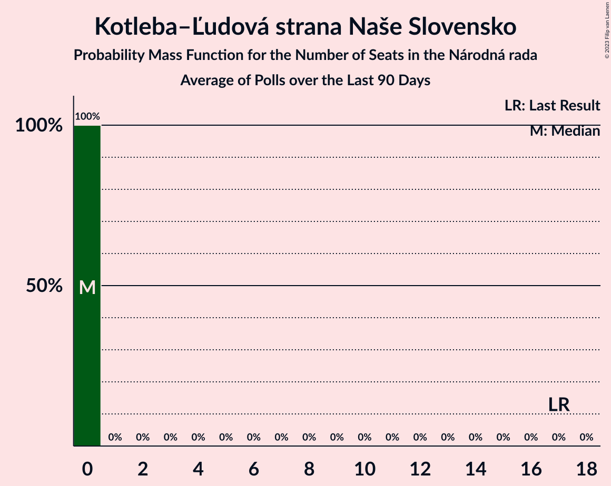
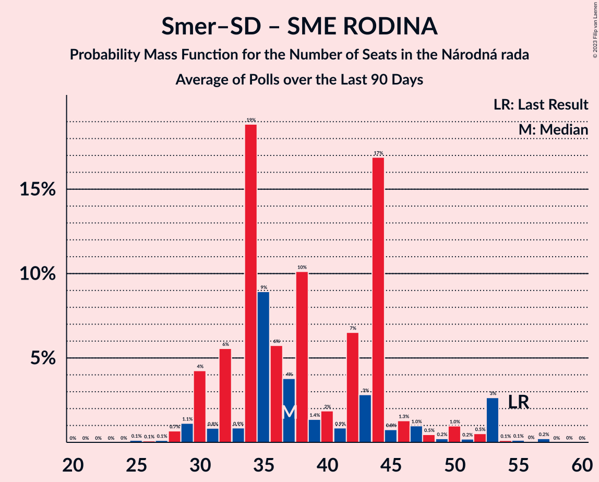

# Poll Average

<a href="#voting-intentions">Voting Intentions</a> | <a href="#seats">Seats</a> | <a href="#coalitions">Coalitions</a> | <a href="#technical-information">Technical Information</a>

## Summary

The table below lists the polls on which the average is based. They are the most recent polls (less than 90 days old) registered and analyzed so far.

| Period     | Polling firm/Commissioner(s) | OĽaNO | Smer–SD | SME RODINA | Kotleba–ĽSNS | PS–SPOLU | SaS | ZĽ | KDH | SMK–MKP | SNS | DV | V | MOST–HÍD | NOVA | PS | SPOLU | HLAS–SD | REP | MODRÍ | MODRÍ–MOST–HÍD | OĽaNO–KÚ–ZĽ | KÚ | HLAS–SD–DV | MF |
|:----------:|:----------------------------:|:--:|:--:|:--:|:--:|:--:|:--:|:--:|:--:|:--:|:--:|:--:|:--:|:--:|:--:|:--:|:--:|:--:|:--:|:--:|:--:|:--:|:--:|:--:|:--:|
| 29 February 2020 | General Election | 25.0%   53 | 18.3%   38 | 8.2%   17 | 8.0%   17 | 7.0%   0 | 6.2%   13 | 5.8%   12 | 4.6%   0 | 3.9%   0 | 3.2%   0 | 3.1%   0 | 2.9%   0 | 2.0%   0 | 0.0%   0 | 7.0%   0 | 7.0%   0 | 0.0%   0 | 0.0%   0 | 0.0%   0 | 0.0%   0 | 0.0%   0 | 0.0%   0 | 0.0%   0 | 0.0%   0 |
| N/A | Poll Average | N/A   N/A | 18–27%   32–45 | 3–7%   0–10 | 1–4%   0 | N/A   N/A | 5–8%   0–14 | N/A   N/A | 4–7%   0–12 | 3–7%   0–11 | 4–7%   0–12 | N/A   N/A | N/A   N/A | N/A   N/A | N/A   N/A | 14–19%   23–33 | 1–4%   0 | 11–15%   20–27 | 6–10%   10–17 | N/A   N/A | 0–2%   0 | 5–10%   8–16 | N/A   N/A | N/A   N/A | 0–1%   0 |
| [16–20 September 2023](2023-09-20-PolisSlovakia.html) | Polis Slovakia | N/A   N/A | 22–27%   35–47 | 4–7%   0–11 | 1–3%   0 | N/A   N/A | 5–8%   9–14 | N/A   N/A | 4–7%   0–12 | 4–7%   0–11 | 5–7%   0–12 | N/A   N/A | N/A   N/A | N/A   N/A | N/A   N/A | 13–17%   23–30 | 1–3%   0 | 11–15%   19–25 | 5–8%   10–14 | N/A   N/A | 1–2%   0 | 4–7%   0–12 | N/A   N/A | N/A   N/A | 0–1%   0 |
| [15–19 September 2023](2023-09-19-IPSOS.html) | IPSOS   Pravda | N/A   N/A | 18–23%   32–40 | 3–6%   0–10 | 2–4%   0 | N/A   N/A | 5–8%   0–13 | N/A   N/A | 4–7%   0–12 | 3–5%   0 | 4–7%   0–12 | N/A   N/A | N/A   N/A | N/A   N/A | N/A   N/A | 15–19%   26–34 | 2–5%   0 | 11–15%   21–27 | 7–10%   13–19 | N/A   N/A | 0–2%   0 | 7–10%   13–17 | N/A   N/A | N/A   N/A | 0–1%   0 |
| [6–13 September 2023](2023-09-13-Focus.html) | Focus   TV Markíza | N/A   N/A | N/A   N/A | N/A   N/A | N/A   N/A | N/A   N/A | N/A   N/A | N/A   N/A | N/A   N/A | N/A   N/A | N/A   N/A | N/A   N/A | N/A   N/A | N/A   N/A | N/A   N/A | N/A   N/A | N/A   N/A | N/A   N/A | N/A   N/A | N/A   N/A | N/A   N/A | N/A   N/A | N/A   N/A | N/A   N/A | N/A   N/A |
| [5–11 September 2023](2023-09-11-AKO.html) | AKO   TV JOJ | N/A   N/A | N/A   N/A | N/A   N/A | N/A   N/A | N/A   N/A | N/A   N/A | N/A   N/A | N/A   N/A | N/A   N/A | N/A   N/A | N/A   N/A | N/A   N/A | N/A   N/A | N/A   N/A | N/A   N/A | N/A   N/A | N/A   N/A | N/A   N/A | N/A   N/A | N/A   N/A | N/A   N/A | N/A   N/A | N/A   N/A | N/A   N/A |
| [5–9 September 2023](2023-09-09-NMS.html) | NMS | N/A   N/A | N/A   N/A | N/A   N/A | N/A   N/A | N/A   N/A | N/A   N/A | N/A   N/A | N/A   N/A | N/A   N/A | N/A   N/A | N/A   N/A | N/A   N/A | N/A   N/A | N/A   N/A | N/A   N/A | N/A   N/A | N/A   N/A | N/A   N/A | N/A   N/A | N/A   N/A | N/A   N/A | N/A   N/A | N/A   N/A | N/A   N/A |
| [25–31 August 2023](2023-08-31-Median.html) | Median   RTVS | N/A   N/A | N/A   N/A | N/A   N/A | N/A   N/A | N/A   N/A | N/A   N/A | N/A   N/A | N/A   N/A | N/A   N/A | N/A   N/A | N/A   N/A | N/A   N/A | N/A   N/A | N/A   N/A | N/A   N/A | N/A   N/A | N/A   N/A | N/A   N/A | N/A   N/A | N/A   N/A | N/A   N/A | N/A   N/A | N/A   N/A | N/A   N/A |
| 29 February 2020 | General Election | 25.0%   53 | 18.3%   38 | 8.2%   17 | 8.0%   17 | 7.0%   0 | 6.2%   13 | 5.8%   12 | 4.6%   0 | 3.9%   0 | 3.2%   0 | 3.1%   0 | 2.9%   0 | 2.0%   0 | 0.0%   0 | 7.0%   0 | 7.0%   0 | 0.0%   0 | 0.0%   0 | 0.0%   0 | 0.0%   0 | 0.0%   0 | 0.0%   0 | 0.0%   0 | 0.0%   0 |

Only polls for which at least the sample size has been published are included in the table above.

**Legend:**
+ **Top half of each row:** Voting intentions (95% confidence interval)
+ **Bottom half of each row:** Seat projections for the Národná rada (95% confidence interval)
+ **OĽaNO:** OBYČAJNÍ ĽUDIA a nezávislé osobnosti
+ **Smer–SD:** SMER–sociálna demokracia
+ **SME RODINA:** SME RODINA
+ **Kotleba–ĽSNS:** Kotleba–Ľudová strana Naše Slovensko
+ **PS–SPOLU:** Progresívne Slovensko–SPOLU–Občianska Demokracia
+ **SaS:** Sloboda a Solidarita
+ **ZĽ:** Za ľudí
+ **KDH:** Kresťanskodemokratické hnutie
+ **SMK–MKP:** Strana maďarskej koalície–Magyar Koalíció Pártja
+ **SNS:** Slovenská národná strana
+ **DV:** Dobrá voľba
+ **V:** VLASŤ
+ **MOST–HÍD:** MOST–HÍD
+ **NOVA:** NOVA
+ **PS:** Progresívne Slovensko
+ **SPOLU:** SPOLU–Občianska Demokracia
+ **HLAS–SD:** HLAS–sociálna demokracia
+ **REP:** REPUBLIKA
+ **MODRÍ:** MODRÍ–Európske Slovensko
+ **MODRÍ–MOST–HÍD:** MODRÍ–Európske Slovensko–MOST–HÍD
+ **OĽaNO–KÚ–ZĽ:** OBYČAJNÍ ĽUDIA a nezávislé osobnosti–Kresťanská únia–Za ľudí
+ **KÚ:** Kresťanská únia
+ **HLAS–SD–DV:** HLAS–sociálna demokracia–Dobrá voľba
+ **MF:** Magyar Fórum
+ **N/A (single party):** Party not included the published results
+ **N/A (entire row):** Calculation for this opinion poll not started yet

## Voting Intentions

### Confidence Intervals

| Party | Last Result | Median | 80% Confidence Interval | 90% Confidence Interval | 95% Confidence Interval | 99% Confidence Interval |
|:-----:|:-----------:|:------:|:-----------------------:|:-----------------------:|:-----------------------:|:-----------------------:|
| <a href="#obyčajní-ľudia-a-nezávislé-osobnosti">OBYČAJNÍ ĽUDIA a nezávislé osobnosti</a> | 25.0% | N/A | N/A |N/A | N/A | N/A |
| <a href="#smer–sociálna-demokracia">SMER–sociálna demokracia</a> | 18.3% | 22.3% | 19.1–25.5% |18.5–26.1% | 18.1–26.6% | 17.3–27.5% |
| <a href="#sme-rodina">SME RODINA</a> | 8.2% | 4.8% | 3.7–6.0% |3.5–6.3% | 3.3–6.6% | 2.9–7.1% |
| <a href="#kotleba–ľudová-strana-naše-slovensko">Kotleba–Ľudová strana Naše Slovensko</a> | 8.0% | 2.3% | 1.6–3.1% |1.5–3.3% | 1.3–3.5% | 1.1–3.9% |
| <a href="#progresívne-slovensko–spolu–občianska-demokracia">Progresívne Slovensko–SPOLU–Občianska Demokracia</a> | 7.0% | N/A | N/A |N/A | N/A | N/A |
| <a href="#progresívne-slovensko">Progresívne Slovensko</a> | 7.0% | 16.1% | 14.3–18.1% |13.8–18.6% | 13.5–19.1% | 12.8–19.9% |
| <a href="#spolu–občianska-demokracia">SPOLU–Občianska Demokracia</a> | 7.0% | 2.7% | 1.7–4.0% |1.5–4.3% | 1.4–4.5% | 1.2–5.0% |
| <a href="#sloboda-a-solidarita">Sloboda a Solidarita</a> | 6.2% | 6.3% | 5.3–7.3% |5.1–7.6% | 4.9–7.9% | 4.5–8.4% |
| <a href="#za-ľudí">Za ľudí</a> | 5.8% | N/A | N/A |N/A | N/A | N/A |
| <a href="#kresťanskodemokratické-hnutie">Kresťanskodemokratické hnutie</a> | 4.6% | 5.5% | 4.6–6.5% |4.4–6.8% | 4.2–7.0% | 3.8–7.6% |
| <a href="#strana-maďarskej-koalície–magyar-koalíció-pártja">Strana maďarskej koalície–Magyar Koalíció Pártja</a> | 3.9% | 4.7% | 3.6–6.1% |3.3–6.4% | 3.1–6.7% | 2.8–7.2% |
| <a href="#slovenská-národná-strana">Slovenská národná strana</a> | 3.2% | 5.7% | 4.8–6.7% |4.6–7.0% | 4.4–7.2% | 4.0–7.7% |
| <a href="#dobrá-voľba">Dobrá voľba</a> | 3.1% | N/A | N/A |N/A | N/A | N/A |
| <a href="#vlasť">VLASŤ</a> | 2.9% | N/A | N/A |N/A | N/A | N/A |
| <a href="#most–híd">MOST–HÍD</a> | 2.0% | N/A | N/A |N/A | N/A | N/A |
| <a href="#nova">NOVA</a> | 0.0% | N/A | N/A |N/A | N/A | N/A |
| <a href="#hlas–sociálna-demokracia">HLAS–sociálna demokracia</a> | 0.0% | 12.8% | 11.5–14.2% |11.2–14.6% | 10.9–15.0% | 10.3–15.7% |
| <a href="#republika">REPUBLIKA</a> | 0.0% | 7.6% | 6.2–9.3% |5.9–9.7% | 5.6–10.0% | 5.2–10.7% |
| <a href="#modrí–európske-slovensko">MODRÍ–Európske Slovensko</a> | 0.0% | N/A | N/A |N/A | N/A | N/A |
| <a href="#modrí–európske-slovensko–most–híd">MODRÍ–Európske Slovensko–MOST–HÍD</a> | 0.0% | 1.1% | 0.7–1.6% |0.6–1.7% | 0.5–1.9% | 0.4–2.2% |
| <a href="#obyčajní-ľudia-a-nezávislé-osobnosti–kresťanská-únia–za-ľudí">OBYČAJNÍ ĽUDIA a nezávislé osobnosti–Kresťanská únia–Za ľudí</a> | 0.0% | 6.9% | 5.2–8.9% |4.9–9.3% | 4.7–9.6% | 4.2–10.3% |
| <a href="#kresťanská-únia">Kresťanská únia</a> | 0.0% | N/A | N/A |N/A | N/A | N/A |
| <a href="#hlas–sociálna-demokracia–dobrá-voľba">HLAS–sociálna demokracia–Dobrá voľba</a> | 0.0% | N/A | N/A |N/A | N/A | N/A |
| <a href="#magyar-fórum">Magyar Fórum</a> | 0.0% | 0.7% | 0.4–1.0% |0.3–1.2% | 0.3–1.3% | 0.2–1.5% |

### SMER–sociálna demokracia

*For a full overview of the results for this party, see the [SMER–sociálna demokracia](party-smer–sociálnademokracia.html) page.*

| Voting Intentions | Probability | Accumulated | Special Marks |
|:-----------------:|:-----------:|:-----------:|:-------------:|
| 14.5–15.5% | 0% | 100% |  |
| 15.5–16.5% | 0.1% | 100% |  |
| 16.5–17.5% | 0.8% | 99.9% |  |
| 17.5–18.5% | 4% | 99.2% | Last Result |
| 18.5–19.5% | 11% | 95% |  |
| 19.5–20.5% | 15% | 84% |  |
| 20.5–21.5% | 12% | 68% |  |
| 21.5–22.5% | 8% | 56% | Median |
| 22.5–23.5% | 10% | 48% |  |
| 23.5–24.5% | 15% | 38% |  |
| 24.5–25.5% | 13% | 23% |  |
| 25.5–26.5% | 7% | 10% |  |
| 26.5–27.5% | 2% | 3% |  |
| 27.5–28.5% | 0.4% | 0.5% |  |
| 28.5–29.5% | 0% | 0.1% |  |
| 29.5–30.5% | 0% | 0% |  |

### SME RODINA

*For a full overview of the results for this party, see the [SME RODINA](party-smerodina.html) page.*

| Voting Intentions | Probability | Accumulated | Special Marks |
|:-----------------:|:-----------:|:-----------:|:-------------:|
| 1.5–2.5% | 0% | 100% |  |
| 2.5–3.5% | 6% | 100% |  |
| 3.5–4.5% | 33% | 94% |  |
| 4.5–5.5% | 39% | 61% | Median |
| 5.5–6.5% | 19% | 21% |  |
| 6.5–7.5% | 2% | 3% |  |
| 7.5–8.5% | 0.1% | 0.1% | Last Result |
| 8.5–9.5% | 0% | 0% |  |

### Kotleba–Ľudová strana Naše Slovensko

*For a full overview of the results for this party, see the [Kotleba–Ľudová strana Naše Slovensko](party-kotleba–ľudovástrananašeslovensko.html) page.*

| Voting Intentions | Probability | Accumulated | Special Marks |
|:-----------------:|:-----------:|:-----------:|:-------------:|
| 0.0–0.5% | 0% | 100% |  |
| 0.5–1.5% | 8% | 100% |  |
| 1.5–2.5% | 60% | 92% | Median |
| 2.5–3.5% | 30% | 32% |  |
| 3.5–4.5% | 2% | 2% |  |
| 4.5–5.5% | 0% | 0% |  |
| 5.5–6.5% | 0% | 0% |  |
| 6.5–7.5% | 0% | 0% |  |
| 7.5–8.5% | 0% | 0% | Last Result |

### SPOLU–Občianska Demokracia

*For a full overview of the results for this party, see the [SPOLU–Občianska Demokracia](party-spolu–občianskademokracia.html) page.*

| Voting Intentions | Probability | Accumulated | Special Marks |
|:-----------------:|:-----------:|:-----------:|:-------------:|
| 0.0–0.5% | 0% | 100% |  |
| 0.5–1.5% | 5% | 100% |  |
| 1.5–2.5% | 40% | 95% |  |
| 2.5–3.5% | 33% | 55% | Median |
| 3.5–4.5% | 20% | 22% |  |
| 4.5–5.5% | 2% | 2% |  |
| 5.5–6.5% | 0% | 0% |  |
| 6.5–7.5% | 0% | 0% | Last Result |

### Progresívne Slovensko

*For a full overview of the results for this party, see the [Progresívne Slovensko](party-progresívneslovensko.html) page.*

| Voting Intentions | Probability | Accumulated | Special Marks |
|:-----------------:|:-----------:|:-----------:|:-------------:|
| 6.5–7.5% | 0% | 100% | Last Result |
| 7.5–8.5% | 0% | 100% |  |
| 8.5–9.5% | 0% | 100% |  |
| 9.5–10.5% | 0% | 100% |  |
| 10.5–11.5% | 0% | 100% |  |
| 11.5–12.5% | 0.2% | 100% |  |
| 12.5–13.5% | 3% | 99.8% |  |
| 13.5–14.5% | 12% | 97% |  |
| 14.5–15.5% | 21% | 85% |  |
| 15.5–16.5% | 25% | 64% | Median |
| 16.5–17.5% | 21% | 39% |  |
| 17.5–18.5% | 13% | 19% |  |
| 18.5–19.5% | 5% | 6% |  |
| 19.5–20.5% | 1.0% | 1.1% |  |
| 20.5–21.5% | 0.1% | 0.1% |  |
| 21.5–22.5% | 0% | 0% |  |

### Sloboda a Solidarita

*For a full overview of the results for this party, see the [Sloboda a Solidarita](party-slobodaasolidarita.html) page.*

| Voting Intentions | Probability | Accumulated | Special Marks |
|:-----------------:|:-----------:|:-----------:|:-------------:|
| 2.5–3.5% | 0% | 100% |  |
| 3.5–4.5% | 0.7% | 100% |  |
| 4.5–5.5% | 15% | 99.3% |  |
| 5.5–6.5% | 48% | 84% | Last Result, Median |
| 6.5–7.5% | 30% | 36% |  |
| 7.5–8.5% | 5% | 6% |  |
| 8.5–9.5% | 0.3% | 0.3% |  |
| 9.5–10.5% | 0% | 0% |  |

### Kresťanskodemokratické hnutie

*For a full overview of the results for this party, see the [Kresťanskodemokratické hnutie](party-kresťanskodemokratickéhnutie.html) page.*

| Voting Intentions | Probability | Accumulated | Special Marks |
|:-----------------:|:-----------:|:-----------:|:-------------:|
| 1.5–2.5% | 0% | 100% |  |
| 2.5–3.5% | 0.1% | 100% |  |
| 3.5–4.5% | 8% | 99.9% |  |
| 4.5–5.5% | 43% | 92% | Last Result |
| 5.5–6.5% | 40% | 49% | Median |
| 6.5–7.5% | 8% | 9% |  |
| 7.5–8.5% | 0.5% | 0.5% |  |
| 8.5–9.5% | 0% | 0% |  |

### Strana maďarskej koalície–Magyar Koalíció Pártja

*For a full overview of the results for this party, see the [Strana maďarskej koalície–Magyar Koalíció Pártja](party-stranamaďarskejkoalície–magyarkoalíciópártja.html) page.*

| Voting Intentions | Probability | Accumulated | Special Marks |
|:-----------------:|:-----------:|:-----------:|:-------------:|
| 0.5–1.5% | 0% | 100% |  |
| 1.5–2.5% | 0.1% | 100% |  |
| 2.5–3.5% | 10% | 99.9% |  |
| 3.5–4.5% | 33% | 90% | Last Result |
| 4.5–5.5% | 34% | 57% | Median |
| 5.5–6.5% | 20% | 23% |  |
| 6.5–7.5% | 3% | 3% |  |
| 7.5–8.5% | 0.1% | 0.1% |  |
| 8.5–9.5% | 0% | 0% |  |

### Slovenská národná strana

*For a full overview of the results for this party, see the [Slovenská národná strana](party-slovenskánárodnástrana.html) page.*

| Voting Intentions | Probability | Accumulated | Special Marks |
|:-----------------:|:-----------:|:-----------:|:-------------:|
| 2.5–3.5% | 0% | 100% | Last Result |
| 3.5–4.5% | 4% | 100% |  |
| 4.5–5.5% | 36% | 96% |  |
| 5.5–6.5% | 46% | 59% | Median |
| 6.5–7.5% | 12% | 13% |  |
| 7.5–8.5% | 0.9% | 0.9% |  |
| 8.5–9.5% | 0% | 0% |  |

### REPUBLIKA

*For a full overview of the results for this party, see the [REPUBLIKA](party-republika.html) page.*

| Voting Intentions | Probability | Accumulated | Special Marks |
|:-----------------:|:-----------:|:-----------:|:-------------:|
| 0.0–0.5% | 0% | 100% | Last Result |
| 0.5–1.5% | 0% | 100% |  |
| 1.5–2.5% | 0% | 100% |  |
| 2.5–3.5% | 0% | 100% |  |
| 3.5–4.5% | 0% | 100% |  |
| 4.5–5.5% | 2% | 100% |  |
| 5.5–6.5% | 17% | 98% |  |
| 6.5–7.5% | 29% | 81% |  |
| 7.5–8.5% | 27% | 53% | Median |
| 8.5–9.5% | 19% | 25% |  |
| 9.5–10.5% | 6% | 6% |  |
| 10.5–11.5% | 0.7% | 0.8% |  |
| 11.5–12.5% | 0% | 0% |  |

### MODRÍ–Európske Slovensko–MOST–HÍD

*For a full overview of the results for this party, see the [MODRÍ–Európske Slovensko–MOST–HÍD](party-modrí–európskeslovensko–most–híd.html) page.*

| Voting Intentions | Probability | Accumulated | Special Marks |
|:-----------------:|:-----------:|:-----------:|:-------------:|
| 0.0–0.5% | 3% | 100% | Last Result |
| 0.5–1.5% | 86% | 97% | Median |
| 1.5–2.5% | 11% | 11% |  |
| 2.5–3.5% | 0.1% | 0.1% |  |
| 3.5–4.5% | 0% | 0% |  |

### Magyar Fórum

*For a full overview of the results for this party, see the [Magyar Fórum](party-magyarfórum.html) page.*

| Voting Intentions | Probability | Accumulated | Special Marks |
|:-----------------:|:-----------:|:-----------:|:-------------:|
| 0.0–0.5% | 30% | 100% | Last Result |
| 0.5–1.5% | 69% | 70% | Median |
| 1.5–2.5% | 0.4% | 0.4% |  |
| 2.5–3.5% | 0% | 0% |  |

### HLAS–sociálna demokracia

*For a full overview of the results for this party, see the [HLAS–sociálna demokracia](party-hlas–sociálnademokracia.html) page.*

| Voting Intentions | Probability | Accumulated | Special Marks |
|:-----------------:|:-----------:|:-----------:|:-------------:|
| 0.0–0.5% | 0% | 100% | Last Result |
| 0.5–1.5% | 0% | 100% |  |
| 1.5–2.5% | 0% | 100% |  |
| 2.5–3.5% | 0% | 100% |  |
| 3.5–4.5% | 0% | 100% |  |
| 4.5–5.5% | 0% | 100% |  |
| 5.5–6.5% | 0% | 100% |  |
| 6.5–7.5% | 0% | 100% |  |
| 7.5–8.5% | 0% | 100% |  |
| 8.5–9.5% | 0% | 100% |  |
| 9.5–10.5% | 0.9% | 100% |  |
| 10.5–11.5% | 9% | 99.0% |  |
| 11.5–12.5% | 29% | 90% |  |
| 12.5–13.5% | 36% | 61% | Median |
| 13.5–14.5% | 19% | 25% |  |
| 14.5–15.5% | 5% | 6% |  |
| 15.5–16.5% | 0.6% | 0.7% |  |
| 16.5–17.5% | 0% | 0% |  |
| 17.5–18.5% | 0% | 0% |  |

### OBYČAJNÍ ĽUDIA a nezávislé osobnosti–Kresťanská únia–Za ľudí

*For a full overview of the results for this party, see the [OBYČAJNÍ ĽUDIA a nezávislé osobnosti–Kresťanská únia–Za ľudí](party-obyčajníľudiaanezávisléosobnosti–kresťanskáúnia–zaľudí.html) page.*

| Voting Intentions | Probability | Accumulated | Special Marks |
|:-----------------:|:-----------:|:-----------:|:-------------:|
| 0.0–0.5% | 0% | 100% | Last Result |
| 0.5–1.5% | 0% | 100% |  |
| 1.5–2.5% | 0% | 100% |  |
| 2.5–3.5% | 0% | 100% |  |
| 3.5–4.5% | 2% | 100% |  |
| 4.5–5.5% | 18% | 98% |  |
| 5.5–6.5% | 25% | 80% |  |
| 6.5–7.5% | 17% | 55% | Median |
| 7.5–8.5% | 23% | 39% |  |
| 8.5–9.5% | 13% | 16% |  |
| 9.5–10.5% | 3% | 3% |  |
| 10.5–11.5% | 0.2% | 0.2% |  |
| 11.5–12.5% | 0% | 0% |  |

## Seats

### Confidence Intervals

| Party | Last Result | Median | 80% Confidence Interval | 90% Confidence Interval | 95% Confidence Interval | 99% Confidence Interval |
|:-----:|:-----------:|:------:|:-----------------------:|:-----------------------:|:-----------------------:|:-----------------------:|
| <a href="#obyčajní-ľudia-a-nezávislé-osobnosti">OBYČAJNÍ ĽUDIA a nezávislé osobnosti</a> | 53 | N/A | N/A |N/A | N/A | N/A |
| <a href="#smer–sociálna-demokracia">SMER–sociálna demokracia</a> | 38 | 38 | 32–43 |32–43 | 32–45 | 32–48 |
| <a href="#sme-rodina">SME RODINA</a> | 17 | 9 | 0–10 |0–10 | 0–10 | 0–12 |
| <a href="#kotleba–ľudová-strana-naše-slovensko">Kotleba–Ľudová strana Naše Slovensko</a> | 17 | 0 | 0 |0 | 0 | 0 |
| <a href="#progresívne-slovensko–spolu–občianska-demokracia">Progresívne Slovensko–SPOLU–Občianska Demokracia</a> | 0 | N/A | N/A |N/A | N/A | N/A |
| <a href="#progresívne-slovensko">Progresívne Slovensko</a> | 0 | 27 | 25–32 |23–32 | 23–33 | 22–36 |
| <a href="#spolu–občianska-demokracia">SPOLU–Občianska Demokracia</a> | 0 | 0 | 0 |0 | 0 | 0 |
| <a href="#sloboda-a-solidarita">Sloboda a Solidarita</a> | 13 | 11 | 10–14 |9–14 | 0–14 | 0–14 |
| <a href="#za-ľudí">Za ľudí</a> | 12 | N/A | N/A |N/A | N/A | N/A |
| <a href="#kresťanskodemokratické-hnutie">Kresťanskodemokratické hnutie</a> | 0 | 9 | 0–10 |0–11 | 0–12 | 0–13 |
| <a href="#strana-maďarskej-koalície–magyar-koalíció-pártja">Strana maďarskej koalície–Magyar Koalíció Pártja</a> | 0 | 0 | 0–11 |0–11 | 0–11 | 0–12 |
| <a href="#slovenská-národná-strana">Slovenská národná strana</a> | 0 | 9 | 0–11 |0–11 | 0–12 | 0–13 |
| <a href="#dobrá-voľba">Dobrá voľba</a> | 0 | N/A | N/A |N/A | N/A | N/A |
| <a href="#vlasť">VLASŤ</a> | 0 | N/A | N/A |N/A | N/A | N/A |
| <a href="#most–híd">MOST–HÍD</a> | 0 | N/A | N/A |N/A | N/A | N/A |
| <a href="#nova">NOVA</a> | 0 | N/A | N/A |N/A | N/A | N/A |
| <a href="#hlas–sociálna-demokracia">HLAS–sociálna demokracia</a> | 0 | 24 | 21–25 |21–25 | 20–27 | 18–29 |
| <a href="#republika">REPUBLIKA</a> | 0 | 14 | 10–16 |10–16 | 10–17 | 9–19 |
| <a href="#modrí–európske-slovensko">MODRÍ–Európske Slovensko</a> | 0 | N/A | N/A |N/A | N/A | N/A |
| <a href="#modrí–európske-slovensko–most–híd">MODRÍ–Európske Slovensko–MOST–HÍD</a> | 0 | 0 | 0 |0 | 0 | 0 |
| <a href="#obyčajní-ľudia-a-nezávislé-osobnosti–kresťanská-únia–za-ľudí">OBYČAJNÍ ĽUDIA a nezávislé osobnosti–Kresťanská únia–Za ľudí</a> | 0 | 12 | 9–16 |8–16 | 8–16 | 0–18 |
| <a href="#kresťanská-únia">Kresťanská únia</a> | 0 | N/A | N/A |N/A | N/A | N/A |
| <a href="#hlas–sociálna-demokracia–dobrá-voľba">HLAS–sociálna demokracia–Dobrá voľba</a> | 0 | N/A | N/A |N/A | N/A | N/A |
| <a href="#magyar-fórum">Magyar Fórum</a> | 0 | 0 | 0 |0 | 0 | 0 |

### OBYČAJNÍ ĽUDIA a nezávislé osobnosti

*For a full overview of the results for this party, see the [OBYČAJNÍ ĽUDIA a nezávislé osobnosti](party-obyčajníľudiaanezávisléosobnosti.html) page.*

### SMER–sociálna demokracia

*For a full overview of the results for this party, see the [SMER–sociálna demokracia](party-smer–sociálnademokracia.html) page.*

| Number of Seats | Probability | Accumulated | Special Marks |
|:---------------:|:-----------:|:-----------:|:-------------:|
| 29 | 0.2% | 100% |  |
| 30 | 0.1% | 99.8% |  |
| 31 | 0.1% | 99.8% |  |
| 32 | 17% | 99.7% |  |
| 33 | 0.5% | 82% |  |
| 34 | 0.3% | 82% |  |
| 35 | 18% | 82% |  |
| 36 | 1.4% | 64% |  |
| 37 | 2% | 62% |  |
| 38 | 33% | 60% | Last Result, Median |
| 39 | 2% | 27% |  |
| 40 | 2% | 25% |  |
| 41 | 4% | 23% |  |
| 42 | 5% | 19% |  |
| 43 | 10% | 14% |  |
| 44 | 2% | 4% |  |
| 45 | 0.4% | 3% |  |
| 46 | 0.5% | 2% |  |
| 47 | 0.6% | 2% |  |
| 48 | 0.9% | 1.2% |  |
| 49 | 0.1% | 0.3% |  |
| 50 | 0% | 0.2% |  |
| 51 | 0% | 0.1% |  |
| 52 | 0% | 0.1% |  |
| 53 | 0.1% | 0.1% |  |
| 54 | 0% | 0% |  |

### SME RODINA

*For a full overview of the results for this party, see the [SME RODINA](party-smerodina.html) page.*

| Number of Seats | Probability | Accumulated | Special Marks |
|:---------------:|:-----------:|:-----------:|:-------------:|
| 0 | 38% | 100% |  |
| 1 | 0% | 62% |  |
| 2 | 0% | 62% |  |
| 3 | 0% | 62% |  |
| 4 | 0% | 62% |  |
| 5 | 0% | 62% |  |
| 6 | 0% | 62% |  |
| 7 | 0% | 62% |  |
| 8 | 5% | 62% |  |
| 9 | 26% | 57% | Median |
| 10 | 29% | 31% |  |
| 11 | 1.2% | 2% |  |
| 12 | 0.3% | 0.5% |  |
| 13 | 0.2% | 0.2% |  |
| 14 | 0% | 0% |  |
| 15 | 0% | 0% |  |
| 16 | 0% | 0% |  |
| 17 | 0% | 0% | Last Result |

### Kotleba–Ľudová strana Naše Slovensko

*For a full overview of the results for this party, see the [Kotleba–Ľudová strana Naše Slovensko](party-kotleba–ľudovástrananašeslovensko.html) page.*

| Number of Seats | Probability | Accumulated | Special Marks |
|:---------------:|:-----------:|:-----------:|:-------------:|
| 0 | 100% | 100% | Median |
| 1 | 0% | 0% |  |
| 2 | 0% | 0% |  |
| 3 | 0% | 0% |  |
| 4 | 0% | 0% |  |
| 5 | 0% | 0% |  |
| 6 | 0% | 0% |  |
| 7 | 0% | 0% |  |
| 8 | 0% | 0% |  |
| 9 | 0% | 0% |  |
| 10 | 0% | 0% |  |
| 11 | 0% | 0% |  |
| 12 | 0% | 0% |  |
| 13 | 0% | 0% |  |
| 14 | 0% | 0% |  |
| 15 | 0% | 0% |  |
| 16 | 0% | 0% |  |
| 17 | 0% | 0% | Last Result |

### Progresívne Slovensko–SPOLU–Občianska Demokracia

*For a full overview of the results for this party, see the [Progresívne Slovensko–SPOLU–Občianska Demokracia](party-progresívneslovensko–spolu–občianskademokracia.html) page.*

### Progresívne Slovensko

*For a full overview of the results for this party, see the [Progresívne Slovensko](party-progresívneslovensko.html) page.*

| Number of Seats | Probability | Accumulated | Special Marks |
|:---------------:|:-----------:|:-----------:|:-------------:|
| 0 | 0% | 100% | Last Result |
| 1 | 0% | 100% |  |
| 2 | 0% | 100% |  |
| 3 | 0% | 100% |  |
| 4 | 0% | 100% |  |
| 5 | 0% | 100% |  |
| 6 | 0% | 100% |  |
| 7 | 0% | 100% |  |
| 8 | 0% | 100% |  |
| 9 | 0% | 100% |  |
| 10 | 0% | 100% |  |
| 11 | 0% | 100% |  |
| 12 | 0% | 100% |  |
| 13 | 0% | 100% |  |
| 14 | 0% | 100% |  |
| 15 | 0% | 100% |  |
| 16 | 0% | 100% |  |
| 17 | 0% | 100% |  |
| 18 | 0% | 100% |  |
| 19 | 0% | 100% |  |
| 20 | 0% | 100% |  |
| 21 | 0.2% | 100% |  |
| 22 | 0.3% | 99.8% |  |
| 23 | 6% | 99.5% |  |
| 24 | 0.7% | 94% |  |
| 25 | 9% | 93% |  |
| 26 | 4% | 84% |  |
| 27 | 45% | 80% | Median |
| 28 | 0.6% | 35% |  |
| 29 | 1.2% | 34% |  |
| 30 | 3% | 33% |  |
| 31 | 2% | 30% |  |
| 32 | 25% | 28% |  |
| 33 | 0.5% | 3% |  |
| 34 | 2% | 2% |  |
| 35 | 0.2% | 0.7% |  |
| 36 | 0.3% | 0.5% |  |
| 37 | 0.2% | 0.2% |  |
| 38 | 0.1% | 0.1% |  |
| 39 | 0% | 0% |  |

### SPOLU–Občianska Demokracia

*For a full overview of the results for this party, see the [SPOLU–Občianska Demokracia](party-spolu–občianskademokracia.html) page.*

| Number of Seats | Probability | Accumulated | Special Marks |
|:---------------:|:-----------:|:-----------:|:-------------:|
| 0 | 99.9% | 100% | Last Result, Median |
| 1 | 0% | 0.1% |  |
| 2 | 0% | 0.1% |  |
| 3 | 0% | 0.1% |  |
| 4 | 0% | 0.1% |  |
| 5 | 0% | 0.1% |  |
| 6 | 0% | 0.1% |  |
| 7 | 0% | 0.1% |  |
| 8 | 0% | 0.1% |  |
| 9 | 0% | 0.1% |  |
| 10 | 0% | 0% |  |

### Sloboda a Solidarita

*For a full overview of the results for this party, see the [Sloboda a Solidarita](party-slobodaasolidarita.html) page.*

| Number of Seats | Probability | Accumulated | Special Marks |
|:---------------:|:-----------:|:-----------:|:-------------:|
| 0 | 3% | 100% |  |
| 1 | 0% | 97% |  |
| 2 | 0% | 97% |  |
| 3 | 0% | 97% |  |
| 4 | 0% | 97% |  |
| 5 | 0% | 97% |  |
| 6 | 0% | 97% |  |
| 7 | 0% | 97% |  |
| 8 | 0% | 97% |  |
| 9 | 3% | 97% |  |
| 10 | 26% | 94% |  |
| 11 | 24% | 68% | Median |
| 12 | 6% | 44% |  |
| 13 | 25% | 39% | Last Result |
| 14 | 13% | 14% |  |
| 15 | 0.2% | 0.3% |  |
| 16 | 0% | 0.1% |  |
| 17 | 0% | 0% |  |

### Za ľudí

*For a full overview of the results for this party, see the [Za ľudí](party-zaľudí.html) page.*

### Kresťanskodemokratické hnutie

*For a full overview of the results for this party, see the [Kresťanskodemokratické hnutie](party-kresťanskodemokratickéhnutie.html) page.*

| Number of Seats | Probability | Accumulated | Special Marks |
|:---------------:|:-----------:|:-----------:|:-------------:|
| 0 | 46% | 100% | Last Result |
| 1 | 0% | 54% |  |
| 2 | 0% | 54% |  |
| 3 | 0% | 54% |  |
| 4 | 0% | 54% |  |
| 5 | 0% | 54% |  |
| 6 | 0% | 54% |  |
| 7 | 0% | 54% |  |
| 8 | 0% | 54% |  |
| 9 | 21% | 54% | Median |
| 10 | 25% | 33% |  |
| 11 | 6% | 9% |  |
| 12 | 2% | 3% |  |
| 13 | 0.9% | 1.2% |  |
| 14 | 0.1% | 0.3% |  |
| 15 | 0.3% | 0.3% |  |
| 16 | 0% | 0% |  |

### Strana maďarskej koalície–Magyar Koalíció Pártja

*For a full overview of the results for this party, see the [Strana maďarskej koalície–Magyar Koalíció Pártja](party-stranamaďarskejkoalície–magyarkoalíciópártja.html) page.*

| Number of Seats | Probability | Accumulated | Special Marks |
|:---------------:|:-----------:|:-----------:|:-------------:|
| 0 | 54% | 100% | Last Result, Median |
| 1 | 0% | 46% |  |
| 2 | 0% | 46% |  |
| 3 | 0% | 46% |  |
| 4 | 0% | 46% |  |
| 5 | 0% | 46% |  |
| 6 | 0% | 46% |  |
| 7 | 0% | 46% |  |
| 8 | 4% | 46% |  |
| 9 | 3% | 42% |  |
| 10 | 26% | 39% |  |
| 11 | 12% | 13% |  |
| 12 | 0.8% | 1.0% |  |
| 13 | 0.2% | 0.2% |  |
| 14 | 0% | 0% |  |

### Slovenská národná strana

*For a full overview of the results for this party, see the [Slovenská národná strana](party-slovenskánárodnástrana.html) page.*

| Number of Seats | Probability | Accumulated | Special Marks |
|:---------------:|:-----------:|:-----------:|:-------------:|
| 0 | 13% | 100% | Last Result |
| 1 | 0% | 87% |  |
| 2 | 0% | 87% |  |
| 3 | 0% | 87% |  |
| 4 | 0% | 87% |  |
| 5 | 0% | 87% |  |
| 6 | 0% | 87% |  |
| 7 | 0% | 87% |  |
| 8 | 4% | 87% |  |
| 9 | 40% | 83% | Median |
| 10 | 9% | 43% |  |
| 11 | 31% | 34% |  |
| 12 | 2% | 3% |  |
| 13 | 1.1% | 1.3% |  |
| 14 | 0.2% | 0.2% |  |
| 15 | 0% | 0.1% |  |
| 16 | 0% | 0% |  |

### Dobrá voľba

*For a full overview of the results for this party, see the [Dobrá voľba](party-dobrávoľba.html) page.*

### VLASŤ

*For a full overview of the results for this party, see the [VLASŤ](party-vlasť.html) page.*

### MOST–HÍD

*For a full overview of the results for this party, see the [MOST–HÍD](party-most–híd.html) page.*

### NOVA

*For a full overview of the results for this party, see the [NOVA](party-nova.html) page.*

### HLAS–sociálna demokracia

*For a full overview of the results for this party, see the [HLAS–sociálna demokracia](party-hlas–sociálnademokracia.html) page.*

| Number of Seats | Probability | Accumulated | Special Marks |
|:---------------:|:-----------:|:-----------:|:-------------:|
| 0 | 0% | 100% | Last Result |
| 1 | 0% | 100% |  |
| 2 | 0% | 100% |  |
| 3 | 0% | 100% |  |
| 4 | 0% | 100% |  |
| 5 | 0% | 100% |  |
| 6 | 0% | 100% |  |
| 7 | 0% | 100% |  |
| 8 | 0% | 100% |  |
| 9 | 0% | 100% |  |
| 10 | 0% | 100% |  |
| 11 | 0% | 100% |  |
| 12 | 0% | 100% |  |
| 13 | 0% | 100% |  |
| 14 | 0% | 100% |  |
| 15 | 0% | 100% |  |
| 16 | 0.3% | 100% |  |
| 17 | 0% | 99.6% |  |
| 18 | 0.6% | 99.6% |  |
| 19 | 1.0% | 98.9% |  |
| 20 | 0.6% | 98% |  |
| 21 | 32% | 97% |  |
| 22 | 2% | 65% |  |
| 23 | 8% | 63% |  |
| 24 | 30% | 55% | Median |
| 25 | 21% | 25% |  |
| 26 | 0.8% | 4% |  |
| 27 | 2% | 3% |  |
| 28 | 0.3% | 1.2% |  |
| 29 | 0.5% | 0.9% |  |
| 30 | 0% | 0.4% |  |
| 31 | 0.1% | 0.4% |  |
| 32 | 0% | 0.3% |  |
| 33 | 0.3% | 0.3% |  |
| 34 | 0% | 0% |  |

### REPUBLIKA

*For a full overview of the results for this party, see the [REPUBLIKA](party-republika.html) page.*

| Number of Seats | Probability | Accumulated | Special Marks |
|:---------------:|:-----------:|:-----------:|:-------------:|
| 0 | 0.1% | 100% | Last Result |
| 1 | 0% | 99.9% |  |
| 2 | 0% | 99.9% |  |
| 3 | 0% | 99.9% |  |
| 4 | 0% | 99.9% |  |
| 5 | 0% | 99.9% |  |
| 6 | 0% | 99.9% |  |
| 7 | 0% | 99.9% |  |
| 8 | 0% | 99.9% |  |
| 9 | 0.8% | 99.9% |  |
| 10 | 23% | 99.1% |  |
| 11 | 5% | 76% |  |
| 12 | 14% | 70% |  |
| 13 | 5% | 56% |  |
| 14 | 21% | 51% | Median |
| 15 | 1.3% | 30% |  |
| 16 | 25% | 29% |  |
| 17 | 2% | 4% |  |
| 18 | 0.3% | 2% |  |
| 19 | 1.2% | 2% |  |
| 20 | 0.1% | 0.3% |  |
| 21 | 0.2% | 0.2% |  |
| 22 | 0% | 0% |  |

### MODRÍ–Európske Slovensko

*For a full overview of the results for this party, see the [MODRÍ–Európske Slovensko](party-modrí–európskeslovensko.html) page.*

### MODRÍ–Európske Slovensko–MOST–HÍD

*For a full overview of the results for this party, see the [MODRÍ–Európske Slovensko–MOST–HÍD](party-modrí–európskeslovensko–most–híd.html) page.*

| Number of Seats | Probability | Accumulated | Special Marks |
|:---------------:|:-----------:|:-----------:|:-------------:|
| 0 | 100% | 100% | Last Result, Median |

### OBYČAJNÍ ĽUDIA a nezávislé osobnosti–Kresťanská únia–Za ľudí

*For a full overview of the results for this party, see the [OBYČAJNÍ ĽUDIA a nezávislé osobnosti–Kresťanská únia–Za ľudí](party-obyčajníľudiaanezávisléosobnosti–kresťanskáúnia–zaľudí.html) page.*

| Number of Seats | Probability | Accumulated | Special Marks |
|:---------------:|:-----------:|:-----------:|:-------------:|
| 0 | 2% | 100% | Last Result |
| 1 | 0% | 98% |  |
| 2 | 0% | 98% |  |
| 3 | 0% | 98% |  |
| 4 | 0% | 98% |  |
| 5 | 0% | 98% |  |
| 6 | 0% | 98% |  |
| 7 | 0% | 98% |  |
| 8 | 4% | 98% |  |
| 9 | 21% | 94% |  |
| 10 | 8% | 73% |  |
| 11 | 5% | 65% |  |
| 12 | 10% | 60% | Median |
| 13 | 20% | 49% |  |
| 14 | 2% | 30% |  |
| 15 | 0.9% | 28% |  |
| 16 | 25% | 27% |  |
| 17 | 1.2% | 2% |  |
| 18 | 0.2% | 0.7% |  |
| 19 | 0.2% | 0.5% |  |
| 20 | 0.3% | 0.3% |  |
| 21 | 0% | 0% |  |

### Kresťanská únia

*For a full overview of the results for this party, see the [Kresťanská únia](party-kresťanskáúnia.html) page.*

### HLAS–sociálna demokracia–Dobrá voľba

*For a full overview of the results for this party, see the [HLAS–sociálna demokracia–Dobrá voľba](party-hlas–sociálnademokracia–dobrávoľba.html) page.*

### Magyar Fórum

*For a full overview of the results for this party, see the [Magyar Fórum](party-magyarfórum.html) page.*

| Number of Seats | Probability | Accumulated | Special Marks |
|:---------------:|:-----------:|:-----------:|:-------------:|
| 0 | 100% | 100% | Last Result, Median |

## Coalitions

### Confidence Intervals

| Coalition | Last Result | Median | Majority? | 80% Confidence Interval | 90% Confidence Interval | 95% Confidence Interval | 99% Confidence Interval |
|:---------:|:-----------:|:------:|:---------:|:-----------------------:|:-----------------------:|:-----------------------:|:-----------------------:|
| SMER–sociálna demokracia – SME RODINA – Kotleba–Ľudová strana Naše Slovensko – Slovenská národná strana – HLAS–sociálna demokracia | 72 | 74 | 38% | 73–81 | 72–81 | 70–86 | 64–89 |
| SMER–sociálna demokracia – SME RODINA – Slovenská národná strana – HLAS–sociálna demokracia | 55 | 74 | 38% | 73–81 | 72–81 | 70–86 | 64–89 |
| SMER–sociálna demokracia – Slovenská národná strana – MOST–HÍD – HLAS–sociálna demokracia | 38 | 70 | 7% | 64–73 | 64–77 | 64–78 | 61–86 |
| SMER–sociálna demokracia – Slovenská národná strana – HLAS–sociálna demokracia | 38 | 70 | 7% | 64–73 | 64–77 | 64–78 | 61–86 |
| SMER–sociálna demokracia – SME RODINA – HLAS–sociálna demokracia | 55 | 65 | 4% | 62–74 | 62–74 | 60–77 | 58–80 |
| SMER–sociálna demokracia – SME RODINA – Kotleba–Ľudová strana Naše Slovensko – Slovenská národná strana | 72 | 51 | 0% | 49–58 | 49–60 | 46–61 | 37–67 |
| SMER–sociálna demokracia – SME RODINA – Slovenská národná strana | 55 | 51 | 0% | 49–58 | 49–60 | 46–61 | 37–67 |
| SMER–sociálna demokracia – Slovenská národná strana – MOST–HÍD | 38 | 46 | 0% | 41–51 | 41–52 | 41–54 | 37–61 |
| SMER–sociálna demokracia – Slovenská národná strana | 38 | 46 | 0% | 41–51 | 41–52 | 41–54 | 37–61 |
| SMER–sociálna demokracia – SME RODINA | 55 | 42 | 0% | 38–53 | 38–53 | 38–53 | 34–57 |
| SMER–sociálna demokracia | 38 | 38 | 0% | 32–43 | 32–43 | 32–45 | 32–48 |
| SME RODINA – Kotleba–Ľudová strana Naše Slovensko – Slovenská národná strana – HLAS–sociálna demokracia | 34 | 39 | 0% | 31–44 | 31–44 | 31–44 | 24–46 |
| SME RODINA – Slovenská národná strana – HLAS–sociálna demokracia | 17 | 39 | 0% | 31–44 | 31–44 | 31–44 | 24–46 |
| OBYČAJNÍ ĽUDIA a nezávislé osobnosti – SME RODINA – Progresívne Slovensko–SPOLU–Občianska Demokracia – Sloboda a Solidarita – Za ľudí – Kresťanskodemokratické hnutie – Strana maďarskej koalície–Magyar Koalíció Pártja – MOST–HÍD | 95 | 30 | 0% | 13–39 | 13–39 | 13–39 | 10–42 |
| OBYČAJNÍ ĽUDIA a nezávislé osobnosti – SME RODINA – Progresívne Slovensko–SPOLU–Občianska Demokracia – Sloboda a Solidarita – Za ľudí – Kresťanskodemokratické hnutie – Strana maďarskej koalície–Magyar Koalíció Pártja | 95 | 30 | 0% | 13–39 | 13–39 | 13–39 | 10–42 |
| Slovenská národná strana – MOST–HÍD – HLAS–sociálna demokracia | 0 | 34 | 0% | 23–35 | 21–35 | 21–37 | 21–39 |
| Slovenská národná strana – HLAS–sociálna demokracia | 0 | 34 | 0% | 23–35 | 21–35 | 21–37 | 21–39 |
| SME RODINA – HLAS–sociálna demokracia | 17 | 30 | 0% | 24–35 | 23–35 | 22–35 | 19–37 |
| OBYČAJNÍ ĽUDIA a nezávislé osobnosti – Progresívne Slovensko–SPOLU–Občianska Demokracia – Sloboda a Solidarita – Za ľudí – Kresťanskodemokratické hnutie – Strana maďarskej koalície–Magyar Koalíció Pártja – MOST–HÍD | 78 | 20 | 0% | 13–30 | 12–30 | 10–31 | 10–35 |
| OBYČAJNÍ ĽUDIA a nezávislé osobnosti – Progresívne Slovensko–SPOLU–Občianska Demokracia – Sloboda a Solidarita – Za ľudí – Kresťanskodemokratické hnutie – Strana maďarskej koalície–Magyar Koalíció Pártja | 78 | 20 | 0% | 13–30 | 12–30 | 10–31 | 10–35 |
| OBYČAJNÍ ĽUDIA a nezávislé osobnosti – SME RODINA – Progresívne Slovensko–SPOLU–Občianska Demokracia – Sloboda a Solidarita – Za ľudí – Kresťanskodemokratické hnutie – MOST–HÍD | 95 | 24 | 0% | 13–30 | 13–30 | 12–30 | 10–32 |
| OBYČAJNÍ ĽUDIA a nezávislé osobnosti – SME RODINA – Progresívne Slovensko–SPOLU–Občianska Demokracia – Sloboda a Solidarita – Za ľudí – Kresťanskodemokratické hnutie | 95 | 24 | 0% | 13–30 | 13–30 | 12–30 | 10–32 |
| OBYČAJNÍ ĽUDIA a nezávislé osobnosti – Progresívne Slovensko–SPOLU–Občianska Demokracia – Sloboda a Solidarita – Za ľudí – Kresťanskodemokratické hnutie – MOST–HÍD | 78 | 18 | 0% | 12–21 | 10–22 | 10–23 | 10–25 |
| OBYČAJNÍ ĽUDIA a nezávislé osobnosti – Progresívne Slovensko–SPOLU–Občianska Demokracia – Sloboda a Solidarita – Za ľudí – Kresťanskodemokratické hnutie | 78 | 18 | 0% | 12–21 | 10–22 | 10–23 | 10–25 |
| Progresívne Slovensko–SPOLU–Občianska Demokracia – Sloboda a Solidarita – Za ľudí – Kresťanskodemokratické hnutie | 25 | 18 | 0% | 12–21 | 10–22 | 10–23 | 10–25 |
| OBYČAJNÍ ĽUDIA a nezávislé osobnosti – Progresívne Slovensko–SPOLU–Občianska Demokracia – Sloboda a Solidarita – Za ľudí | 78 | 11 | 0% | 10–14 | 9–14 | 0–14 | 0–14 |
| Progresívne Slovensko–SPOLU–Občianska Demokracia – Sloboda a Solidarita – Za ľudí | 25 | 11 | 0% | 10–14 | 9–14 | 0–14 | 0–14 |

### SMER–sociálna demokracia – SME RODINA – Kotleba–Ľudová strana Naše Slovensko – Slovenská národná strana – HLAS–sociálna demokracia

| Number of Seats | Probability | Accumulated | Special Marks |
|:---------------:|:-----------:|:-----------:|:-------------:|
| 59 | 0.2% | 100% |  |
| 60 | 0% | 99.7% |  |
| 61 | 0.1% | 99.7% |  |
| 62 | 0% | 99.6% |  |
| 63 | 0% | 99.5% |  |
| 64 | 0.2% | 99.5% |  |
| 65 | 0.3% | 99.3% |  |
| 66 | 0.1% | 99.1% |  |
| 67 | 0.7% | 98.9% |  |
| 68 | 0.2% | 98% |  |
| 69 | 0.3% | 98% |  |
| 70 | 1.4% | 98% |  |
| 71 | 1.1% | 96% |  |
| 72 | 1.2% | 95% | Last Result |
| 73 | 26% | 94% |  |
| 74 | 27% | 68% |  |
| 75 | 2% | 41% |  |
| 76 | 18% | 38% | Majority |
| 77 | 3% | 21% |  |
| 78 | 5% | 18% |  |
| 79 | 0.4% | 13% |  |
| 80 | 1.3% | 12% | Median |
| 81 | 7% | 11% |  |
| 82 | 0.2% | 4% |  |
| 83 | 0.1% | 4% |  |
| 84 | 0.4% | 4% |  |
| 85 | 0.1% | 3% |  |
| 86 | 2% | 3% |  |
| 87 | 0.2% | 1.3% |  |
| 88 | 0.5% | 1.1% |  |
| 89 | 0.4% | 0.6% |  |
| 90 | 0% | 0.1% |  |
| 91 | 0% | 0.1% |  |
| 92 | 0% | 0.1% |  |
| 93 | 0% | 0.1% |  |
| 94 | 0% | 0.1% |  |
| 95 | 0% | 0.1% |  |
| 96 | 0% | 0% |  |

### SMER–sociálna demokracia – SME RODINA – Slovenská národná strana – HLAS–sociálna demokracia

| Number of Seats | Probability | Accumulated | Special Marks |
|:---------------:|:-----------:|:-----------:|:-------------:|
| 55 | 0% | 100% | Last Result |
| 56 | 0% | 100% |  |
| 57 | 0% | 100% |  |
| 58 | 0% | 100% |  |
| 59 | 0.2% | 100% |  |
| 60 | 0% | 99.7% |  |
| 61 | 0.1% | 99.7% |  |
| 62 | 0% | 99.6% |  |
| 63 | 0% | 99.5% |  |
| 64 | 0.2% | 99.5% |  |
| 65 | 0.3% | 99.3% |  |
| 66 | 0.1% | 99.1% |  |
| 67 | 0.7% | 98.9% |  |
| 68 | 0.2% | 98% |  |
| 69 | 0.3% | 98% |  |
| 70 | 1.4% | 98% |  |
| 71 | 1.1% | 96% |  |
| 72 | 1.2% | 95% |  |
| 73 | 26% | 94% |  |
| 74 | 27% | 68% |  |
| 75 | 2% | 41% |  |
| 76 | 18% | 38% | Majority |
| 77 | 3% | 21% |  |
| 78 | 5% | 18% |  |
| 79 | 0.4% | 13% |  |
| 80 | 1.3% | 12% | Median |
| 81 | 7% | 11% |  |
| 82 | 0.2% | 4% |  |
| 83 | 0.1% | 4% |  |
| 84 | 0.4% | 4% |  |
| 85 | 0.1% | 3% |  |
| 86 | 2% | 3% |  |
| 87 | 0.2% | 1.3% |  |
| 88 | 0.5% | 1.1% |  |
| 89 | 0.4% | 0.6% |  |
| 90 | 0% | 0.1% |  |
| 91 | 0% | 0.1% |  |
| 92 | 0% | 0.1% |  |
| 93 | 0% | 0.1% |  |
| 94 | 0% | 0.1% |  |
| 95 | 0% | 0.1% |  |
| 96 | 0% | 0% |  |

### SMER–sociálna demokracia – Slovenská národná strana – MOST–HÍD – HLAS–sociálna demokracia

| Number of Seats | Probability | Accumulated | Special Marks |
|:---------------:|:-----------:|:-----------:|:-------------:|
| 38 | 0% | 100% | Last Result |
| 39 | 0% | 100% |  |
| 40 | 0% | 100% |  |
| 41 | 0% | 100% |  |
| 42 | 0% | 100% |  |
| 43 | 0% | 100% |  |
| 44 | 0% | 100% |  |
| 45 | 0% | 100% |  |
| 46 | 0% | 100% |  |
| 47 | 0% | 100% |  |
| 48 | 0% | 100% |  |
| 49 | 0% | 100% |  |
| 50 | 0% | 100% |  |
| 51 | 0% | 100% |  |
| 52 | 0% | 100% |  |
| 53 | 0% | 100% |  |
| 54 | 0% | 100% |  |
| 55 | 0% | 100% |  |
| 56 | 0% | 100% |  |
| 57 | 0% | 100% |  |
| 58 | 0.1% | 99.9% |  |
| 59 | 0.3% | 99.9% |  |
| 60 | 0.1% | 99.6% |  |
| 61 | 0.2% | 99.5% |  |
| 62 | 0.1% | 99.3% |  |
| 63 | 0.2% | 99.3% |  |
| 64 | 10% | 99.0% |  |
| 65 | 18% | 89% |  |
| 66 | 18% | 71% |  |
| 67 | 1.3% | 53% |  |
| 68 | 0.7% | 52% |  |
| 69 | 0.3% | 51% |  |
| 70 | 6% | 51% |  |
| 71 | 2% | 45% | Median |
| 72 | 7% | 43% |  |
| 73 | 26% | 36% |  |
| 74 | 0.2% | 10% |  |
| 75 | 2% | 9% |  |
| 76 | 2% | 7% | Majority |
| 77 | 3% | 5% |  |
| 78 | 0.5% | 3% |  |
| 79 | 0.5% | 2% |  |
| 80 | 0.6% | 2% |  |
| 81 | 0.1% | 0.9% |  |
| 82 | 0% | 0.8% |  |
| 83 | 0.1% | 0.8% |  |
| 84 | 0.2% | 0.7% |  |
| 85 | 0% | 0.6% |  |
| 86 | 0.5% | 0.5% |  |
| 87 | 0% | 0.1% |  |
| 88 | 0% | 0.1% |  |
| 89 | 0% | 0% |  |

### SMER–sociálna demokracia – Slovenská národná strana – HLAS–sociálna demokracia

| Number of Seats | Probability | Accumulated | Special Marks |
|:---------------:|:-----------:|:-----------:|:-------------:|
| 38 | 0% | 100% | Last Result |
| 39 | 0% | 100% |  |
| 40 | 0% | 100% |  |
| 41 | 0% | 100% |  |
| 42 | 0% | 100% |  |
| 43 | 0% | 100% |  |
| 44 | 0% | 100% |  |
| 45 | 0% | 100% |  |
| 46 | 0% | 100% |  |
| 47 | 0% | 100% |  |
| 48 | 0% | 100% |  |
| 49 | 0% | 100% |  |
| 50 | 0% | 100% |  |
| 51 | 0% | 100% |  |
| 52 | 0% | 100% |  |
| 53 | 0% | 100% |  |
| 54 | 0% | 100% |  |
| 55 | 0% | 100% |  |
| 56 | 0% | 100% |  |
| 57 | 0% | 100% |  |
| 58 | 0.1% | 99.9% |  |
| 59 | 0.3% | 99.9% |  |
| 60 | 0.1% | 99.6% |  |
| 61 | 0.2% | 99.5% |  |
| 62 | 0.1% | 99.3% |  |
| 63 | 0.2% | 99.3% |  |
| 64 | 10% | 99.0% |  |
| 65 | 18% | 89% |  |
| 66 | 18% | 71% |  |
| 67 | 1.3% | 53% |  |
| 68 | 0.7% | 52% |  |
| 69 | 0.3% | 51% |  |
| 70 | 6% | 51% |  |
| 71 | 2% | 45% | Median |
| 72 | 7% | 43% |  |
| 73 | 26% | 36% |  |
| 74 | 0.2% | 10% |  |
| 75 | 2% | 9% |  |
| 76 | 2% | 7% | Majority |
| 77 | 3% | 5% |  |
| 78 | 0.5% | 3% |  |
| 79 | 0.5% | 2% |  |
| 80 | 0.6% | 2% |  |
| 81 | 0.1% | 0.9% |  |
| 82 | 0% | 0.8% |  |
| 83 | 0.1% | 0.8% |  |
| 84 | 0.2% | 0.7% |  |
| 85 | 0% | 0.6% |  |
| 86 | 0.5% | 0.5% |  |
| 87 | 0% | 0.1% |  |
| 88 | 0% | 0.1% |  |
| 89 | 0% | 0% |  |

### SMER–sociálna demokracia – SME RODINA – HLAS–sociálna demokracia

| Number of Seats | Probability | Accumulated | Special Marks |
|:---------------:|:-----------:|:-----------:|:-------------:|
| 53 | 0% | 100% |  |
| 54 | 0.2% | 99.9% |  |
| 55 | 0% | 99.8% | Last Result |
| 56 | 0.1% | 99.7% |  |
| 57 | 0.1% | 99.6% |  |
| 58 | 0.1% | 99.5% |  |
| 59 | 1.3% | 99.5% |  |
| 60 | 0.9% | 98% |  |
| 61 | 1.0% | 97% |  |
| 62 | 25% | 96% |  |
| 63 | 1.2% | 71% |  |
| 64 | 0.9% | 70% |  |
| 65 | 20% | 69% |  |
| 66 | 0.5% | 49% |  |
| 67 | 20% | 48% |  |
| 68 | 1.2% | 28% |  |
| 69 | 2% | 27% |  |
| 70 | 8% | 25% |  |
| 71 | 3% | 18% | Median |
| 72 | 0.8% | 15% |  |
| 73 | 0.8% | 14% |  |
| 74 | 9% | 13% |  |
| 75 | 0.4% | 4% |  |
| 76 | 0.1% | 4% | Majority |
| 77 | 2% | 4% |  |
| 78 | 0.2% | 1.2% |  |
| 79 | 0.2% | 1.1% |  |
| 80 | 0.6% | 0.8% |  |
| 81 | 0.1% | 0.3% |  |
| 82 | 0% | 0.2% |  |
| 83 | 0% | 0.1% |  |
| 84 | 0.1% | 0.1% |  |
| 85 | 0.1% | 0.1% |  |
| 86 | 0% | 0% |  |

### SMER–sociálna demokracia – SME RODINA – Kotleba–Ľudová strana Naše Slovensko – Slovenská národná strana

| Number of Seats | Probability | Accumulated | Special Marks |
|:---------------:|:-----------:|:-----------:|:-------------:|
| 35 | 0% | 100% |  |
| 36 | 0.2% | 99.9% |  |
| 37 | 0.4% | 99.7% |  |
| 38 | 0.2% | 99.3% |  |
| 39 | 0% | 99.1% |  |
| 40 | 0.7% | 99.1% |  |
| 41 | 0.1% | 98% |  |
| 42 | 0.2% | 98% |  |
| 43 | 0.2% | 98% |  |
| 44 | 0.1% | 98% |  |
| 45 | 0.2% | 98% |  |
| 46 | 0.4% | 98% |  |
| 47 | 0.4% | 97% |  |
| 48 | 0.4% | 97% |  |
| 49 | 26% | 96% |  |
| 50 | 3% | 70% |  |
| 51 | 18% | 67% |  |
| 52 | 3% | 49% |  |
| 53 | 27% | 46% |  |
| 54 | 6% | 20% |  |
| 55 | 0.5% | 14% |  |
| 56 | 1.1% | 13% | Median |
| 57 | 1.2% | 12% |  |
| 58 | 3% | 11% |  |
| 59 | 0.3% | 8% |  |
| 60 | 4% | 8% |  |
| 61 | 2% | 4% |  |
| 62 | 0.6% | 2% |  |
| 63 | 0.3% | 1.2% |  |
| 64 | 0.1% | 0.9% |  |
| 65 | 0.1% | 0.8% |  |
| 66 | 0% | 0.7% |  |
| 67 | 0.4% | 0.7% |  |
| 68 | 0.2% | 0.3% |  |
| 69 | 0% | 0.1% |  |
| 70 | 0.1% | 0.1% |  |
| 71 | 0% | 0% |  |
| 72 | 0% | 0% | Last Result |

### SMER–sociálna demokracia – SME RODINA – Slovenská národná strana

| Number of Seats | Probability | Accumulated | Special Marks |
|:---------------:|:-----------:|:-----------:|:-------------:|
| 35 | 0% | 100% |  |
| 36 | 0.2% | 99.9% |  |
| 37 | 0.4% | 99.7% |  |
| 38 | 0.2% | 99.3% |  |
| 39 | 0% | 99.1% |  |
| 40 | 0.7% | 99.1% |  |
| 41 | 0.1% | 98% |  |
| 42 | 0.2% | 98% |  |
| 43 | 0.2% | 98% |  |
| 44 | 0.1% | 98% |  |
| 45 | 0.2% | 98% |  |
| 46 | 0.4% | 98% |  |
| 47 | 0.4% | 97% |  |
| 48 | 0.4% | 97% |  |
| 49 | 26% | 96% |  |
| 50 | 3% | 70% |  |
| 51 | 18% | 67% |  |
| 52 | 3% | 49% |  |
| 53 | 27% | 46% |  |
| 54 | 6% | 20% |  |
| 55 | 0.5% | 14% | Last Result |
| 56 | 1.1% | 13% | Median |
| 57 | 1.2% | 12% |  |
| 58 | 3% | 11% |  |
| 59 | 0.3% | 8% |  |
| 60 | 4% | 8% |  |
| 61 | 2% | 4% |  |
| 62 | 0.6% | 2% |  |
| 63 | 0.3% | 1.2% |  |
| 64 | 0.1% | 0.9% |  |
| 65 | 0.1% | 0.8% |  |
| 66 | 0% | 0.7% |  |
| 67 | 0.4% | 0.7% |  |
| 68 | 0.2% | 0.3% |  |
| 69 | 0% | 0.1% |  |
| 70 | 0.1% | 0.1% |  |
| 71 | 0% | 0% |  |

### SMER–sociálna demokracia – Slovenská národná strana – MOST–HÍD

| Number of Seats | Probability | Accumulated | Special Marks |
|:---------------:|:-----------:|:-----------:|:-------------:|
| 34 | 0% | 100% |  |
| 35 | 0% | 99.9% |  |
| 36 | 0.3% | 99.9% |  |
| 37 | 0.5% | 99.7% |  |
| 38 | 0.4% | 99.2% | Last Result |
| 39 | 0.3% | 98.8% |  |
| 40 | 0.8% | 98.6% |  |
| 41 | 18% | 98% |  |
| 42 | 0.4% | 80% |  |
| 43 | 9% | 80% |  |
| 44 | 18% | 71% |  |
| 45 | 0.4% | 52% |  |
| 46 | 5% | 52% |  |
| 47 | 1.5% | 47% | Median |
| 48 | 0.4% | 45% |  |
| 49 | 29% | 45% |  |
| 50 | 3% | 16% |  |
| 51 | 6% | 13% |  |
| 52 | 3% | 7% |  |
| 53 | 0.3% | 4% |  |
| 54 | 1.2% | 3% |  |
| 55 | 0.3% | 2% |  |
| 56 | 0.3% | 2% |  |
| 57 | 0.1% | 2% |  |
| 58 | 0.5% | 2% |  |
| 59 | 0.4% | 1.0% |  |
| 60 | 0.1% | 0.6% |  |
| 61 | 0.5% | 0.5% |  |
| 62 | 0% | 0.1% |  |
| 63 | 0% | 0% |  |

### SMER–sociálna demokracia – Slovenská národná strana

| Number of Seats | Probability | Accumulated | Special Marks |
|:---------------:|:-----------:|:-----------:|:-------------:|
| 34 | 0% | 100% |  |
| 35 | 0% | 99.9% |  |
| 36 | 0.3% | 99.9% |  |
| 37 | 0.5% | 99.7% |  |
| 38 | 0.4% | 99.2% | Last Result |
| 39 | 0.3% | 98.8% |  |
| 40 | 0.8% | 98.6% |  |
| 41 | 18% | 98% |  |
| 42 | 0.4% | 80% |  |
| 43 | 9% | 80% |  |
| 44 | 18% | 71% |  |
| 45 | 0.4% | 52% |  |
| 46 | 5% | 52% |  |
| 47 | 1.5% | 47% | Median |
| 48 | 0.4% | 45% |  |
| 49 | 29% | 45% |  |
| 50 | 3% | 16% |  |
| 51 | 6% | 13% |  |
| 52 | 3% | 7% |  |
| 53 | 0.3% | 4% |  |
| 54 | 1.2% | 3% |  |
| 55 | 0.3% | 2% |  |
| 56 | 0.3% | 2% |  |
| 57 | 0.1% | 2% |  |
| 58 | 0.5% | 2% |  |
| 59 | 0.4% | 1.0% |  |
| 60 | 0.1% | 0.6% |  |
| 61 | 0.5% | 0.5% |  |
| 62 | 0% | 0.1% |  |
| 63 | 0% | 0% |  |

### SMER–sociálna demokracia – SME RODINA

| Number of Seats | Probability | Accumulated | Special Marks |
|:---------------:|:-----------:|:-----------:|:-------------:|
| 30 | 0% | 100% |  |
| 31 | 0.1% | 99.9% |  |
| 32 | 0% | 99.9% |  |
| 33 | 0.3% | 99.9% |  |
| 34 | 0.1% | 99.5% |  |
| 35 | 0.1% | 99.4% |  |
| 36 | 0.6% | 99.4% |  |
| 37 | 1.3% | 98.8% |  |
| 38 | 26% | 98% |  |
| 39 | 2% | 72% |  |
| 40 | 2% | 70% |  |
| 41 | 0.7% | 68% |  |
| 42 | 20% | 67% |  |
| 43 | 1.0% | 48% |  |
| 44 | 19% | 47% |  |
| 45 | 1.5% | 28% |  |
| 46 | 4% | 26% |  |
| 47 | 3% | 22% | Median |
| 48 | 1.2% | 19% |  |
| 49 | 0.6% | 18% |  |
| 50 | 3% | 17% |  |
| 51 | 0.7% | 14% |  |
| 52 | 2% | 13% |  |
| 53 | 9% | 11% |  |
| 54 | 0.4% | 2% |  |
| 55 | 0.4% | 2% | Last Result |
| 56 | 0.1% | 1.1% |  |
| 57 | 0.8% | 0.9% |  |
| 58 | 0% | 0.2% |  |
| 59 | 0.1% | 0.1% |  |
| 60 | 0% | 0.1% |  |
| 61 | 0.1% | 0.1% |  |
| 62 | 0% | 0% |  |

### SMER–sociálna demokracia

| Number of Seats | Probability | Accumulated | Special Marks |
|:---------------:|:-----------:|:-----------:|:-------------:|
| 29 | 0.2% | 100% |  |
| 30 | 0.1% | 99.8% |  |
| 31 | 0.1% | 99.8% |  |
| 32 | 17% | 99.7% |  |
| 33 | 0.5% | 82% |  |
| 34 | 0.3% | 82% |  |
| 35 | 18% | 82% |  |
| 36 | 1.4% | 64% |  |
| 37 | 2% | 62% |  |
| 38 | 33% | 60% | Last Result, Median |
| 39 | 2% | 27% |  |
| 40 | 2% | 25% |  |
| 41 | 4% | 23% |  |
| 42 | 5% | 19% |  |
| 43 | 10% | 14% |  |
| 44 | 2% | 4% |  |
| 45 | 0.4% | 3% |  |
| 46 | 0.5% | 2% |  |
| 47 | 0.6% | 2% |  |
| 48 | 0.9% | 1.2% |  |
| 49 | 0.1% | 0.3% |  |
| 50 | 0% | 0.2% |  |
| 51 | 0% | 0.1% |  |
| 52 | 0% | 0.1% |  |
| 53 | 0.1% | 0.1% |  |
| 54 | 0% | 0% |  |

### SME RODINA – Kotleba–Ľudová strana Naše Slovensko – Slovenská národná strana – HLAS–sociálna demokracia

| Number of Seats | Probability | Accumulated | Special Marks |
|:---------------:|:-----------:|:-----------:|:-------------:|
| 19 | 0% | 100% |  |
| 20 | 0% | 99.9% |  |
| 21 | 0.2% | 99.9% |  |
| 22 | 0% | 99.7% |  |
| 23 | 0.2% | 99.7% |  |
| 24 | 0.1% | 99.5% |  |
| 25 | 0.1% | 99.4% |  |
| 26 | 0% | 99.3% |  |
| 27 | 0.7% | 99.3% |  |
| 28 | 0% | 98.6% |  |
| 29 | 0.4% | 98.5% |  |
| 30 | 0.6% | 98% |  |
| 31 | 10% | 98% |  |
| 32 | 2% | 88% |  |
| 33 | 4% | 86% |  |
| 34 | 2% | 82% | Last Result |
| 35 | 26% | 81% |  |
| 36 | 0.8% | 54% |  |
| 37 | 2% | 54% |  |
| 38 | 0.7% | 52% |  |
| 39 | 19% | 51% |  |
| 40 | 8% | 33% |  |
| 41 | 0.4% | 25% |  |
| 42 | 0.1% | 24% | Median |
| 43 | 4% | 24% |  |
| 44 | 20% | 21% |  |
| 45 | 0.4% | 1.0% |  |
| 46 | 0.2% | 0.5% |  |
| 47 | 0% | 0.3% |  |
| 48 | 0.3% | 0.3% |  |
| 49 | 0% | 0% |  |

### SME RODINA – Slovenská národná strana – HLAS–sociálna demokracia

| Number of Seats | Probability | Accumulated | Special Marks |
|:---------------:|:-----------:|:-----------:|:-------------:|
| 17 | 0% | 100% | Last Result |
| 18 | 0% | 100% |  |
| 19 | 0% | 100% |  |
| 20 | 0% | 99.9% |  |
| 21 | 0.2% | 99.9% |  |
| 22 | 0% | 99.7% |  |
| 23 | 0.2% | 99.7% |  |
| 24 | 0.1% | 99.5% |  |
| 25 | 0.1% | 99.4% |  |
| 26 | 0% | 99.3% |  |
| 27 | 0.7% | 99.3% |  |
| 28 | 0% | 98.6% |  |
| 29 | 0.4% | 98.5% |  |
| 30 | 0.6% | 98% |  |
| 31 | 10% | 98% |  |
| 32 | 2% | 88% |  |
| 33 | 4% | 86% |  |
| 34 | 2% | 82% |  |
| 35 | 26% | 81% |  |
| 36 | 0.8% | 54% |  |
| 37 | 2% | 54% |  |
| 38 | 0.7% | 52% |  |
| 39 | 19% | 51% |  |
| 40 | 8% | 33% |  |
| 41 | 0.4% | 25% |  |
| 42 | 0.1% | 24% | Median |
| 43 | 4% | 24% |  |
| 44 | 20% | 21% |  |
| 45 | 0.4% | 1.0% |  |
| 46 | 0.2% | 0.5% |  |
| 47 | 0% | 0.3% |  |
| 48 | 0.3% | 0.3% |  |
| 49 | 0% | 0% |  |

### OBYČAJNÍ ĽUDIA a nezávislé osobnosti – SME RODINA – Progresívne Slovensko–SPOLU–Občianska Demokracia – Sloboda a Solidarita – Za ľudí – Kresťanskodemokratické hnutie – Strana maďarskej koalície–Magyar Koalíció Pártja – MOST–HÍD

| Number of Seats | Probability | Accumulated | Special Marks |
|:---------------:|:-----------:|:-----------:|:-------------:|
| 0 | 0.1% | 100% |  |
| 1 | 0% | 99.9% |  |
| 2 | 0% | 99.9% |  |
| 3 | 0% | 99.9% |  |
| 4 | 0% | 99.9% |  |
| 5 | 0% | 99.9% |  |
| 6 | 0% | 99.9% |  |
| 7 | 0% | 99.9% |  |
| 8 | 0% | 99.9% |  |
| 9 | 0% | 99.9% |  |
| 10 | 0.4% | 99.9% |  |
| 11 | 0.5% | 99.5% |  |
| 12 | 1.4% | 99.0% |  |
| 13 | 24% | 98% |  |
| 14 | 1.1% | 73% |  |
| 15 | 0.2% | 72% |  |
| 16 | 0% | 72% |  |
| 17 | 0% | 72% |  |
| 18 | 0.1% | 72% |  |
| 19 | 0.5% | 72% |  |
| 20 | 3% | 72% |  |
| 21 | 0.6% | 68% |  |
| 22 | 0.7% | 68% |  |
| 23 | 2% | 67% |  |
| 24 | 0.9% | 65% |  |
| 25 | 0.8% | 64% |  |
| 26 | 0.1% | 63% |  |
| 27 | 0% | 63% |  |
| 28 | 0.1% | 63% |  |
| 29 | 5% | 63% | Median |
| 30 | 20% | 58% |  |
| 31 | 0.7% | 39% |  |
| 32 | 0.9% | 38% |  |
| 33 | 3% | 37% |  |
| 34 | 0.1% | 34% |  |
| 35 | 9% | 34% |  |
| 36 | 0.2% | 24% |  |
| 37 | 4% | 24% |  |
| 38 | 0.1% | 20% |  |
| 39 | 18% | 20% |  |
| 40 | 0.8% | 2% |  |
| 41 | 0.7% | 1.3% |  |
| 42 | 0.2% | 0.6% |  |
| 43 | 0.1% | 0.4% |  |
| 44 | 0.2% | 0.3% |  |
| 45 | 0.1% | 0.1% |  |
| 46 | 0% | 0% |  |
| 47 | 0% | 0% |  |
| 48 | 0% | 0% |  |
| 49 | 0% | 0% |  |
| 50 | 0% | 0% |  |
| 51 | 0% | 0% |  |
| 52 | 0% | 0% |  |
| 53 | 0% | 0% |  |
| 54 | 0% | 0% |  |
| 55 | 0% | 0% |  |
| 56 | 0% | 0% |  |
| 57 | 0% | 0% |  |
| 58 | 0% | 0% |  |
| 59 | 0% | 0% |  |
| 60 | 0% | 0% |  |
| 61 | 0% | 0% |  |
| 62 | 0% | 0% |  |
| 63 | 0% | 0% |  |
| 64 | 0% | 0% |  |
| 65 | 0% | 0% |  |
| 66 | 0% | 0% |  |
| 67 | 0% | 0% |  |
| 68 | 0% | 0% |  |
| 69 | 0% | 0% |  |
| 70 | 0% | 0% |  |
| 71 | 0% | 0% |  |
| 72 | 0% | 0% |  |
| 73 | 0% | 0% |  |
| 74 | 0% | 0% |  |
| 75 | 0% | 0% |  |
| 76 | 0% | 0% | Majority |
| 77 | 0% | 0% |  |
| 78 | 0% | 0% |  |
| 79 | 0% | 0% |  |
| 80 | 0% | 0% |  |
| 81 | 0% | 0% |  |
| 82 | 0% | 0% |  |
| 83 | 0% | 0% |  |
| 84 | 0% | 0% |  |
| 85 | 0% | 0% |  |
| 86 | 0% | 0% |  |
| 87 | 0% | 0% |  |
| 88 | 0% | 0% |  |
| 89 | 0% | 0% |  |
| 90 | 0% | 0% |  |
| 91 | 0% | 0% |  |
| 92 | 0% | 0% |  |
| 93 | 0% | 0% |  |
| 94 | 0% | 0% |  |
| 95 | 0% | 0% | Last Result |

### OBYČAJNÍ ĽUDIA a nezávislé osobnosti – SME RODINA – Progresívne Slovensko–SPOLU–Občianska Demokracia – Sloboda a Solidarita – Za ľudí – Kresťanskodemokratické hnutie – Strana maďarskej koalície–Magyar Koalíció Pártja

| Number of Seats | Probability | Accumulated | Special Marks |
|:---------------:|:-----------:|:-----------:|:-------------:|
| 0 | 0.1% | 100% |  |
| 1 | 0% | 99.9% |  |
| 2 | 0% | 99.9% |  |
| 3 | 0% | 99.9% |  |
| 4 | 0% | 99.9% |  |
| 5 | 0% | 99.9% |  |
| 6 | 0% | 99.9% |  |
| 7 | 0% | 99.9% |  |
| 8 | 0% | 99.9% |  |
| 9 | 0% | 99.9% |  |
| 10 | 0.4% | 99.9% |  |
| 11 | 0.5% | 99.5% |  |
| 12 | 1.4% | 99.0% |  |
| 13 | 24% | 98% |  |
| 14 | 1.1% | 73% |  |
| 15 | 0.2% | 72% |  |
| 16 | 0% | 72% |  |
| 17 | 0% | 72% |  |
| 18 | 0.1% | 72% |  |
| 19 | 0.5% | 72% |  |
| 20 | 3% | 72% |  |
| 21 | 0.6% | 68% |  |
| 22 | 0.7% | 68% |  |
| 23 | 2% | 67% |  |
| 24 | 0.9% | 65% |  |
| 25 | 0.8% | 64% |  |
| 26 | 0.1% | 63% |  |
| 27 | 0% | 63% |  |
| 28 | 0.1% | 63% |  |
| 29 | 5% | 63% | Median |
| 30 | 20% | 58% |  |
| 31 | 0.7% | 39% |  |
| 32 | 0.9% | 38% |  |
| 33 | 3% | 37% |  |
| 34 | 0.1% | 34% |  |
| 35 | 9% | 34% |  |
| 36 | 0.2% | 24% |  |
| 37 | 4% | 24% |  |
| 38 | 0.1% | 20% |  |
| 39 | 18% | 20% |  |
| 40 | 0.8% | 2% |  |
| 41 | 0.7% | 1.3% |  |
| 42 | 0.2% | 0.6% |  |
| 43 | 0.1% | 0.4% |  |
| 44 | 0.2% | 0.3% |  |
| 45 | 0.1% | 0.1% |  |
| 46 | 0% | 0% |  |
| 47 | 0% | 0% |  |
| 48 | 0% | 0% |  |
| 49 | 0% | 0% |  |
| 50 | 0% | 0% |  |
| 51 | 0% | 0% |  |
| 52 | 0% | 0% |  |
| 53 | 0% | 0% |  |
| 54 | 0% | 0% |  |
| 55 | 0% | 0% |  |
| 56 | 0% | 0% |  |
| 57 | 0% | 0% |  |
| 58 | 0% | 0% |  |
| 59 | 0% | 0% |  |
| 60 | 0% | 0% |  |
| 61 | 0% | 0% |  |
| 62 | 0% | 0% |  |
| 63 | 0% | 0% |  |
| 64 | 0% | 0% |  |
| 65 | 0% | 0% |  |
| 66 | 0% | 0% |  |
| 67 | 0% | 0% |  |
| 68 | 0% | 0% |  |
| 69 | 0% | 0% |  |
| 70 | 0% | 0% |  |
| 71 | 0% | 0% |  |
| 72 | 0% | 0% |  |
| 73 | 0% | 0% |  |
| 74 | 0% | 0% |  |
| 75 | 0% | 0% |  |
| 76 | 0% | 0% | Majority |
| 77 | 0% | 0% |  |
| 78 | 0% | 0% |  |
| 79 | 0% | 0% |  |
| 80 | 0% | 0% |  |
| 81 | 0% | 0% |  |
| 82 | 0% | 0% |  |
| 83 | 0% | 0% |  |
| 84 | 0% | 0% |  |
| 85 | 0% | 0% |  |
| 86 | 0% | 0% |  |
| 87 | 0% | 0% |  |
| 88 | 0% | 0% |  |
| 89 | 0% | 0% |  |
| 90 | 0% | 0% |  |
| 91 | 0% | 0% |  |
| 92 | 0% | 0% |  |
| 93 | 0% | 0% |  |
| 94 | 0% | 0% |  |
| 95 | 0% | 0% | Last Result |

### Slovenská národná strana – MOST–HÍD – HLAS–sociálna demokracia

| Number of Seats | Probability | Accumulated | Special Marks |
|:---------------:|:-----------:|:-----------:|:-------------:|
| 0 | 0% | 100% | Last Result |
| 1 | 0% | 100% |  |
| 2 | 0% | 100% |  |
| 3 | 0% | 100% |  |
| 4 | 0% | 100% |  |
| 5 | 0% | 100% |  |
| 6 | 0% | 100% |  |
| 7 | 0% | 100% |  |
| 8 | 0% | 100% |  |
| 9 | 0% | 100% |  |
| 10 | 0% | 100% |  |
| 11 | 0% | 100% |  |
| 12 | 0% | 100% |  |
| 13 | 0% | 100% |  |
| 14 | 0% | 100% |  |
| 15 | 0% | 100% |  |
| 16 | 0% | 100% |  |
| 17 | 0% | 100% |  |
| 18 | 0% | 100% |  |
| 19 | 0.1% | 100% |  |
| 20 | 0.1% | 99.9% |  |
| 21 | 9% | 99.8% |  |
| 22 | 0.1% | 91% |  |
| 23 | 0.8% | 91% |  |
| 24 | 0.4% | 90% |  |
| 25 | 0.5% | 89% |  |
| 26 | 0.2% | 89% |  |
| 27 | 1.4% | 89% |  |
| 28 | 0.2% | 87% |  |
| 29 | 0.5% | 87% |  |
| 30 | 19% | 87% |  |
| 31 | 4% | 67% |  |
| 32 | 6% | 63% |  |
| 33 | 3% | 57% | Median |
| 34 | 24% | 54% |  |
| 35 | 27% | 30% |  |
| 36 | 0.4% | 3% |  |
| 37 | 1.4% | 3% |  |
| 38 | 0.7% | 1.4% |  |
| 39 | 0.3% | 0.7% |  |
| 40 | 0.3% | 0.4% |  |
| 41 | 0% | 0.1% |  |
| 42 | 0% | 0.1% |  |
| 43 | 0% | 0% |  |

### Slovenská národná strana – HLAS–sociálna demokracia

| Number of Seats | Probability | Accumulated | Special Marks |
|:---------------:|:-----------:|:-----------:|:-------------:|
| 0 | 0% | 100% | Last Result |
| 1 | 0% | 100% |  |
| 2 | 0% | 100% |  |
| 3 | 0% | 100% |  |
| 4 | 0% | 100% |  |
| 5 | 0% | 100% |  |
| 6 | 0% | 100% |  |
| 7 | 0% | 100% |  |
| 8 | 0% | 100% |  |
| 9 | 0% | 100% |  |
| 10 | 0% | 100% |  |
| 11 | 0% | 100% |  |
| 12 | 0% | 100% |  |
| 13 | 0% | 100% |  |
| 14 | 0% | 100% |  |
| 15 | 0% | 100% |  |
| 16 | 0% | 100% |  |
| 17 | 0% | 100% |  |
| 18 | 0% | 100% |  |
| 19 | 0.1% | 100% |  |
| 20 | 0.1% | 99.9% |  |
| 21 | 9% | 99.8% |  |
| 22 | 0.1% | 91% |  |
| 23 | 0.8% | 91% |  |
| 24 | 0.4% | 90% |  |
| 25 | 0.5% | 89% |  |
| 26 | 0.2% | 89% |  |
| 27 | 1.4% | 89% |  |
| 28 | 0.2% | 87% |  |
| 29 | 0.5% | 87% |  |
| 30 | 19% | 87% |  |
| 31 | 4% | 67% |  |
| 32 | 6% | 63% |  |
| 33 | 3% | 57% | Median |
| 34 | 24% | 54% |  |
| 35 | 27% | 30% |  |
| 36 | 0.4% | 3% |  |
| 37 | 1.4% | 3% |  |
| 38 | 0.7% | 1.4% |  |
| 39 | 0.3% | 0.7% |  |
| 40 | 0.3% | 0.4% |  |
| 41 | 0% | 0.1% |  |
| 42 | 0% | 0.1% |  |
| 43 | 0% | 0% |  |

### SME RODINA – HLAS–sociálna demokracia

| Number of Seats | Probability | Accumulated | Special Marks |
|:---------------:|:-----------:|:-----------:|:-------------:|
| 17 | 0% | 100% | Last Result |
| 18 | 0% | 100% |  |
| 19 | 0.6% | 100% |  |
| 20 | 0.2% | 99.3% |  |
| 21 | 2% | 99.1% |  |
| 22 | 1.0% | 98% |  |
| 23 | 4% | 97% |  |
| 24 | 25% | 92% |  |
| 25 | 2% | 68% |  |
| 26 | 1.0% | 66% |  |
| 27 | 3% | 65% |  |
| 28 | 0.5% | 62% |  |
| 29 | 0.7% | 62% |  |
| 30 | 21% | 61% |  |
| 31 | 10% | 39% |  |
| 32 | 8% | 30% |  |
| 33 | 1.4% | 22% | Median |
| 34 | 0.5% | 20% |  |
| 35 | 19% | 20% |  |
| 36 | 0.5% | 1.0% |  |
| 37 | 0.3% | 0.5% |  |
| 38 | 0.2% | 0.3% |  |
| 39 | 0.1% | 0.1% |  |
| 40 | 0% | 0% |  |

### OBYČAJNÍ ĽUDIA a nezávislé osobnosti – Progresívne Slovensko–SPOLU–Občianska Demokracia – Sloboda a Solidarita – Za ľudí – Kresťanskodemokratické hnutie – Strana maďarskej koalície–Magyar Koalíció Pártja – MOST–HÍD

| Number of Seats | Probability | Accumulated | Special Marks |
|:---------------:|:-----------:|:-----------:|:-------------:|
| 0 | 0.3% | 100% |  |
| 1 | 0% | 99.7% |  |
| 2 | 0% | 99.7% |  |
| 3 | 0% | 99.7% |  |
| 4 | 0% | 99.7% |  |
| 5 | 0% | 99.7% |  |
| 6 | 0% | 99.7% |  |
| 7 | 0% | 99.7% |  |
| 8 | 0% | 99.7% |  |
| 9 | 0.1% | 99.7% |  |
| 10 | 2% | 99.6% |  |
| 11 | 1.3% | 97% |  |
| 12 | 2% | 96% |  |
| 13 | 24% | 94% |  |
| 14 | 1.2% | 70% |  |
| 15 | 0.2% | 69% |  |
| 16 | 0% | 68% |  |
| 17 | 0% | 68% |  |
| 18 | 0.1% | 68% |  |
| 19 | 0.4% | 68% |  |
| 20 | 21% | 68% | Median |
| 21 | 0.9% | 47% |  |
| 22 | 0.4% | 46% |  |
| 23 | 2% | 45% |  |
| 24 | 4% | 43% |  |
| 25 | 10% | 39% |  |
| 26 | 0.1% | 30% |  |
| 27 | 0% | 29% |  |
| 28 | 0.2% | 29% |  |
| 29 | 6% | 29% |  |
| 30 | 20% | 23% |  |
| 31 | 0.8% | 3% |  |
| 32 | 1.0% | 2% |  |
| 33 | 0.4% | 1.3% |  |
| 34 | 0.1% | 0.9% |  |
| 35 | 0.6% | 0.8% |  |
| 36 | 0.2% | 0.2% |  |
| 37 | 0% | 0% |  |
| 38 | 0% | 0% |  |
| 39 | 0% | 0% |  |
| 40 | 0% | 0% |  |
| 41 | 0% | 0% |  |
| 42 | 0% | 0% |  |
| 43 | 0% | 0% |  |
| 44 | 0% | 0% |  |
| 45 | 0% | 0% |  |
| 46 | 0% | 0% |  |
| 47 | 0% | 0% |  |
| 48 | 0% | 0% |  |
| 49 | 0% | 0% |  |
| 50 | 0% | 0% |  |
| 51 | 0% | 0% |  |
| 52 | 0% | 0% |  |
| 53 | 0% | 0% |  |
| 54 | 0% | 0% |  |
| 55 | 0% | 0% |  |
| 56 | 0% | 0% |  |
| 57 | 0% | 0% |  |
| 58 | 0% | 0% |  |
| 59 | 0% | 0% |  |
| 60 | 0% | 0% |  |
| 61 | 0% | 0% |  |
| 62 | 0% | 0% |  |
| 63 | 0% | 0% |  |
| 64 | 0% | 0% |  |
| 65 | 0% | 0% |  |
| 66 | 0% | 0% |  |
| 67 | 0% | 0% |  |
| 68 | 0% | 0% |  |
| 69 | 0% | 0% |  |
| 70 | 0% | 0% |  |
| 71 | 0% | 0% |  |
| 72 | 0% | 0% |  |
| 73 | 0% | 0% |  |
| 74 | 0% | 0% |  |
| 75 | 0% | 0% |  |
| 76 | 0% | 0% | Majority |
| 77 | 0% | 0% |  |
| 78 | 0% | 0% | Last Result |

### OBYČAJNÍ ĽUDIA a nezávislé osobnosti – Progresívne Slovensko–SPOLU–Občianska Demokracia – Sloboda a Solidarita – Za ľudí – Kresťanskodemokratické hnutie – Strana maďarskej koalície–Magyar Koalíció Pártja

| Number of Seats | Probability | Accumulated | Special Marks |
|:---------------:|:-----------:|:-----------:|:-------------:|
| 0 | 0.3% | 100% |  |
| 1 | 0% | 99.7% |  |
| 2 | 0% | 99.7% |  |
| 3 | 0% | 99.7% |  |
| 4 | 0% | 99.7% |  |
| 5 | 0% | 99.7% |  |
| 6 | 0% | 99.7% |  |
| 7 | 0% | 99.7% |  |
| 8 | 0% | 99.7% |  |
| 9 | 0.1% | 99.7% |  |
| 10 | 2% | 99.6% |  |
| 11 | 1.3% | 97% |  |
| 12 | 2% | 96% |  |
| 13 | 24% | 94% |  |
| 14 | 1.2% | 70% |  |
| 15 | 0.2% | 69% |  |
| 16 | 0% | 68% |  |
| 17 | 0% | 68% |  |
| 18 | 0.1% | 68% |  |
| 19 | 0.4% | 68% |  |
| 20 | 21% | 68% | Median |
| 21 | 0.9% | 47% |  |
| 22 | 0.4% | 46% |  |
| 23 | 2% | 45% |  |
| 24 | 4% | 43% |  |
| 25 | 10% | 39% |  |
| 26 | 0.1% | 30% |  |
| 27 | 0% | 29% |  |
| 28 | 0.2% | 29% |  |
| 29 | 6% | 29% |  |
| 30 | 20% | 23% |  |
| 31 | 0.8% | 3% |  |
| 32 | 1.0% | 2% |  |
| 33 | 0.4% | 1.3% |  |
| 34 | 0.1% | 0.9% |  |
| 35 | 0.6% | 0.8% |  |
| 36 | 0.2% | 0.2% |  |
| 37 | 0% | 0% |  |
| 38 | 0% | 0% |  |
| 39 | 0% | 0% |  |
| 40 | 0% | 0% |  |
| 41 | 0% | 0% |  |
| 42 | 0% | 0% |  |
| 43 | 0% | 0% |  |
| 44 | 0% | 0% |  |
| 45 | 0% | 0% |  |
| 46 | 0% | 0% |  |
| 47 | 0% | 0% |  |
| 48 | 0% | 0% |  |
| 49 | 0% | 0% |  |
| 50 | 0% | 0% |  |
| 51 | 0% | 0% |  |
| 52 | 0% | 0% |  |
| 53 | 0% | 0% |  |
| 54 | 0% | 0% |  |
| 55 | 0% | 0% |  |
| 56 | 0% | 0% |  |
| 57 | 0% | 0% |  |
| 58 | 0% | 0% |  |
| 59 | 0% | 0% |  |
| 60 | 0% | 0% |  |
| 61 | 0% | 0% |  |
| 62 | 0% | 0% |  |
| 63 | 0% | 0% |  |
| 64 | 0% | 0% |  |
| 65 | 0% | 0% |  |
| 66 | 0% | 0% |  |
| 67 | 0% | 0% |  |
| 68 | 0% | 0% |  |
| 69 | 0% | 0% |  |
| 70 | 0% | 0% |  |
| 71 | 0% | 0% |  |
| 72 | 0% | 0% |  |
| 73 | 0% | 0% |  |
| 74 | 0% | 0% |  |
| 75 | 0% | 0% |  |
| 76 | 0% | 0% | Majority |
| 77 | 0% | 0% |  |
| 78 | 0% | 0% | Last Result |

### OBYČAJNÍ ĽUDIA a nezávislé osobnosti – SME RODINA – Progresívne Slovensko–SPOLU–Občianska Demokracia – Sloboda a Solidarita – Za ľudí – Kresťanskodemokratické hnutie – MOST–HÍD

| Number of Seats | Probability | Accumulated | Special Marks |
|:---------------:|:-----------:|:-----------:|:-------------:|
| 0 | 0.1% | 100% |  |
| 1 | 0% | 99.9% |  |
| 2 | 0% | 99.9% |  |
| 3 | 0% | 99.9% |  |
| 4 | 0% | 99.9% |  |
| 5 | 0% | 99.9% |  |
| 6 | 0% | 99.9% |  |
| 7 | 0% | 99.9% |  |
| 8 | 0% | 99.9% |  |
| 9 | 0% | 99.9% |  |
| 10 | 0.5% | 99.9% |  |
| 11 | 0.6% | 99.4% |  |
| 12 | 2% | 98.8% |  |
| 13 | 24% | 97% |  |
| 14 | 1.2% | 73% |  |
| 15 | 0.2% | 72% |  |
| 16 | 0% | 72% |  |
| 17 | 0% | 71% |  |
| 18 | 2% | 71% |  |
| 19 | 3% | 70% |  |
| 20 | 5% | 66% |  |
| 21 | 2% | 61% |  |
| 22 | 0.9% | 59% |  |
| 23 | 5% | 58% |  |
| 24 | 10% | 53% |  |
| 25 | 1.2% | 43% |  |
| 26 | 0.2% | 42% |  |
| 27 | 0% | 42% |  |
| 28 | 0.1% | 42% |  |
| 29 | 22% | 42% | Median |
| 30 | 19% | 20% |  |
| 31 | 0.1% | 1.0% |  |
| 32 | 0.5% | 0.9% |  |
| 33 | 0.1% | 0.5% |  |
| 34 | 0.3% | 0.4% |  |
| 35 | 0.1% | 0.1% |  |
| 36 | 0% | 0% |  |
| 37 | 0% | 0% |  |
| 38 | 0% | 0% |  |
| 39 | 0% | 0% |  |
| 40 | 0% | 0% |  |
| 41 | 0% | 0% |  |
| 42 | 0% | 0% |  |
| 43 | 0% | 0% |  |
| 44 | 0% | 0% |  |
| 45 | 0% | 0% |  |
| 46 | 0% | 0% |  |
| 47 | 0% | 0% |  |
| 48 | 0% | 0% |  |
| 49 | 0% | 0% |  |
| 50 | 0% | 0% |  |
| 51 | 0% | 0% |  |
| 52 | 0% | 0% |  |
| 53 | 0% | 0% |  |
| 54 | 0% | 0% |  |
| 55 | 0% | 0% |  |
| 56 | 0% | 0% |  |
| 57 | 0% | 0% |  |
| 58 | 0% | 0% |  |
| 59 | 0% | 0% |  |
| 60 | 0% | 0% |  |
| 61 | 0% | 0% |  |
| 62 | 0% | 0% |  |
| 63 | 0% | 0% |  |
| 64 | 0% | 0% |  |
| 65 | 0% | 0% |  |
| 66 | 0% | 0% |  |
| 67 | 0% | 0% |  |
| 68 | 0% | 0% |  |
| 69 | 0% | 0% |  |
| 70 | 0% | 0% |  |
| 71 | 0% | 0% |  |
| 72 | 0% | 0% |  |
| 73 | 0% | 0% |  |
| 74 | 0% | 0% |  |
| 75 | 0% | 0% |  |
| 76 | 0% | 0% | Majority |
| 77 | 0% | 0% |  |
| 78 | 0% | 0% |  |
| 79 | 0% | 0% |  |
| 80 | 0% | 0% |  |
| 81 | 0% | 0% |  |
| 82 | 0% | 0% |  |
| 83 | 0% | 0% |  |
| 84 | 0% | 0% |  |
| 85 | 0% | 0% |  |
| 86 | 0% | 0% |  |
| 87 | 0% | 0% |  |
| 88 | 0% | 0% |  |
| 89 | 0% | 0% |  |
| 90 | 0% | 0% |  |
| 91 | 0% | 0% |  |
| 92 | 0% | 0% |  |
| 93 | 0% | 0% |  |
| 94 | 0% | 0% |  |
| 95 | 0% | 0% | Last Result |

### OBYČAJNÍ ĽUDIA a nezávislé osobnosti – SME RODINA – Progresívne Slovensko–SPOLU–Občianska Demokracia – Sloboda a Solidarita – Za ľudí – Kresťanskodemokratické hnutie

| Number of Seats | Probability | Accumulated | Special Marks |
|:---------------:|:-----------:|:-----------:|:-------------:|
| 0 | 0.1% | 100% |  |
| 1 | 0% | 99.9% |  |
| 2 | 0% | 99.9% |  |
| 3 | 0% | 99.9% |  |
| 4 | 0% | 99.9% |  |
| 5 | 0% | 99.9% |  |
| 6 | 0% | 99.9% |  |
| 7 | 0% | 99.9% |  |
| 8 | 0% | 99.9% |  |
| 9 | 0% | 99.9% |  |
| 10 | 0.5% | 99.9% |  |
| 11 | 0.6% | 99.4% |  |
| 12 | 2% | 98.8% |  |
| 13 | 24% | 97% |  |
| 14 | 1.2% | 73% |  |
| 15 | 0.2% | 72% |  |
| 16 | 0% | 72% |  |
| 17 | 0% | 71% |  |
| 18 | 2% | 71% |  |
| 19 | 3% | 70% |  |
| 20 | 5% | 66% |  |
| 21 | 2% | 61% |  |
| 22 | 0.9% | 59% |  |
| 23 | 5% | 58% |  |
| 24 | 10% | 53% |  |
| 25 | 1.2% | 43% |  |
| 26 | 0.2% | 42% |  |
| 27 | 0% | 42% |  |
| 28 | 0.1% | 42% |  |
| 29 | 22% | 42% | Median |
| 30 | 19% | 20% |  |
| 31 | 0.1% | 1.0% |  |
| 32 | 0.5% | 0.9% |  |
| 33 | 0.1% | 0.5% |  |
| 34 | 0.3% | 0.4% |  |
| 35 | 0.1% | 0.1% |  |
| 36 | 0% | 0% |  |
| 37 | 0% | 0% |  |
| 38 | 0% | 0% |  |
| 39 | 0% | 0% |  |
| 40 | 0% | 0% |  |
| 41 | 0% | 0% |  |
| 42 | 0% | 0% |  |
| 43 | 0% | 0% |  |
| 44 | 0% | 0% |  |
| 45 | 0% | 0% |  |
| 46 | 0% | 0% |  |
| 47 | 0% | 0% |  |
| 48 | 0% | 0% |  |
| 49 | 0% | 0% |  |
| 50 | 0% | 0% |  |
| 51 | 0% | 0% |  |
| 52 | 0% | 0% |  |
| 53 | 0% | 0% |  |
| 54 | 0% | 0% |  |
| 55 | 0% | 0% |  |
| 56 | 0% | 0% |  |
| 57 | 0% | 0% |  |
| 58 | 0% | 0% |  |
| 59 | 0% | 0% |  |
| 60 | 0% | 0% |  |
| 61 | 0% | 0% |  |
| 62 | 0% | 0% |  |
| 63 | 0% | 0% |  |
| 64 | 0% | 0% |  |
| 65 | 0% | 0% |  |
| 66 | 0% | 0% |  |
| 67 | 0% | 0% |  |
| 68 | 0% | 0% |  |
| 69 | 0% | 0% |  |
| 70 | 0% | 0% |  |
| 71 | 0% | 0% |  |
| 72 | 0% | 0% |  |
| 73 | 0% | 0% |  |
| 74 | 0% | 0% |  |
| 75 | 0% | 0% |  |
| 76 | 0% | 0% | Majority |
| 77 | 0% | 0% |  |
| 78 | 0% | 0% |  |
| 79 | 0% | 0% |  |
| 80 | 0% | 0% |  |
| 81 | 0% | 0% |  |
| 82 | 0% | 0% |  |
| 83 | 0% | 0% |  |
| 84 | 0% | 0% |  |
| 85 | 0% | 0% |  |
| 86 | 0% | 0% |  |
| 87 | 0% | 0% |  |
| 88 | 0% | 0% |  |
| 89 | 0% | 0% |  |
| 90 | 0% | 0% |  |
| 91 | 0% | 0% |  |
| 92 | 0% | 0% |  |
| 93 | 0% | 0% |  |
| 94 | 0% | 0% |  |
| 95 | 0% | 0% | Last Result |

### OBYČAJNÍ ĽUDIA a nezávislé osobnosti – Progresívne Slovensko–SPOLU–Občianska Demokracia – Sloboda a Solidarita – Za ľudí – Kresťanskodemokratické hnutie – MOST–HÍD

| Number of Seats | Probability | Accumulated | Special Marks |
|:---------------:|:-----------:|:-----------:|:-------------:|
| 0 | 0.3% | 100% |  |
| 1 | 0% | 99.7% |  |
| 2 | 0% | 99.7% |  |
| 3 | 0% | 99.7% |  |
| 4 | 0% | 99.7% |  |
| 5 | 0% | 99.7% |  |
| 6 | 0% | 99.7% |  |
| 7 | 0% | 99.7% |  |
| 8 | 0% | 99.7% |  |
| 9 | 0.1% | 99.7% |  |
| 10 | 5% | 99.6% |  |
| 11 | 2% | 94% |  |
| 12 | 3% | 92% |  |
| 13 | 24% | 89% |  |
| 14 | 13% | 65% |  |
| 15 | 0.3% | 52% |  |
| 16 | 0% | 52% |  |
| 17 | 0% | 52% |  |
| 18 | 2% | 52% |  |
| 19 | 0.8% | 50% |  |
| 20 | 37% | 49% | Median |
| 21 | 7% | 12% |  |
| 22 | 1.1% | 5% |  |
| 23 | 2% | 4% |  |
| 24 | 0.8% | 2% |  |
| 25 | 1.2% | 1.4% |  |
| 26 | 0.1% | 0.2% |  |
| 27 | 0% | 0% |  |
| 28 | 0% | 0% |  |
| 29 | 0% | 0% |  |
| 30 | 0% | 0% |  |
| 31 | 0% | 0% |  |
| 32 | 0% | 0% |  |
| 33 | 0% | 0% |  |
| 34 | 0% | 0% |  |
| 35 | 0% | 0% |  |
| 36 | 0% | 0% |  |
| 37 | 0% | 0% |  |
| 38 | 0% | 0% |  |
| 39 | 0% | 0% |  |
| 40 | 0% | 0% |  |
| 41 | 0% | 0% |  |
| 42 | 0% | 0% |  |
| 43 | 0% | 0% |  |
| 44 | 0% | 0% |  |
| 45 | 0% | 0% |  |
| 46 | 0% | 0% |  |
| 47 | 0% | 0% |  |
| 48 | 0% | 0% |  |
| 49 | 0% | 0% |  |
| 50 | 0% | 0% |  |
| 51 | 0% | 0% |  |
| 52 | 0% | 0% |  |
| 53 | 0% | 0% |  |
| 54 | 0% | 0% |  |
| 55 | 0% | 0% |  |
| 56 | 0% | 0% |  |
| 57 | 0% | 0% |  |
| 58 | 0% | 0% |  |
| 59 | 0% | 0% |  |
| 60 | 0% | 0% |  |
| 61 | 0% | 0% |  |
| 62 | 0% | 0% |  |
| 63 | 0% | 0% |  |
| 64 | 0% | 0% |  |
| 65 | 0% | 0% |  |
| 66 | 0% | 0% |  |
| 67 | 0% | 0% |  |
| 68 | 0% | 0% |  |
| 69 | 0% | 0% |  |
| 70 | 0% | 0% |  |
| 71 | 0% | 0% |  |
| 72 | 0% | 0% |  |
| 73 | 0% | 0% |  |
| 74 | 0% | 0% |  |
| 75 | 0% | 0% |  |
| 76 | 0% | 0% | Majority |
| 77 | 0% | 0% |  |
| 78 | 0% | 0% | Last Result |

### OBYČAJNÍ ĽUDIA a nezávislé osobnosti – Progresívne Slovensko–SPOLU–Občianska Demokracia – Sloboda a Solidarita – Za ľudí – Kresťanskodemokratické hnutie

| Number of Seats | Probability | Accumulated | Special Marks |
|:---------------:|:-----------:|:-----------:|:-------------:|
| 0 | 0.3% | 100% |  |
| 1 | 0% | 99.7% |  |
| 2 | 0% | 99.7% |  |
| 3 | 0% | 99.7% |  |
| 4 | 0% | 99.7% |  |
| 5 | 0% | 99.7% |  |
| 6 | 0% | 99.7% |  |
| 7 | 0% | 99.7% |  |
| 8 | 0% | 99.7% |  |
| 9 | 0.1% | 99.7% |  |
| 10 | 5% | 99.6% |  |
| 11 | 2% | 94% |  |
| 12 | 3% | 92% |  |
| 13 | 24% | 89% |  |
| 14 | 13% | 65% |  |
| 15 | 0.3% | 52% |  |
| 16 | 0% | 52% |  |
| 17 | 0% | 52% |  |
| 18 | 2% | 52% |  |
| 19 | 0.8% | 50% |  |
| 20 | 37% | 49% | Median |
| 21 | 7% | 12% |  |
| 22 | 1.1% | 5% |  |
| 23 | 2% | 4% |  |
| 24 | 0.8% | 2% |  |
| 25 | 1.2% | 1.4% |  |
| 26 | 0.1% | 0.2% |  |
| 27 | 0% | 0% |  |
| 28 | 0% | 0% |  |
| 29 | 0% | 0% |  |
| 30 | 0% | 0% |  |
| 31 | 0% | 0% |  |
| 32 | 0% | 0% |  |
| 33 | 0% | 0% |  |
| 34 | 0% | 0% |  |
| 35 | 0% | 0% |  |
| 36 | 0% | 0% |  |
| 37 | 0% | 0% |  |
| 38 | 0% | 0% |  |
| 39 | 0% | 0% |  |
| 40 | 0% | 0% |  |
| 41 | 0% | 0% |  |
| 42 | 0% | 0% |  |
| 43 | 0% | 0% |  |
| 44 | 0% | 0% |  |
| 45 | 0% | 0% |  |
| 46 | 0% | 0% |  |
| 47 | 0% | 0% |  |
| 48 | 0% | 0% |  |
| 49 | 0% | 0% |  |
| 50 | 0% | 0% |  |
| 51 | 0% | 0% |  |
| 52 | 0% | 0% |  |
| 53 | 0% | 0% |  |
| 54 | 0% | 0% |  |
| 55 | 0% | 0% |  |
| 56 | 0% | 0% |  |
| 57 | 0% | 0% |  |
| 58 | 0% | 0% |  |
| 59 | 0% | 0% |  |
| 60 | 0% | 0% |  |
| 61 | 0% | 0% |  |
| 62 | 0% | 0% |  |
| 63 | 0% | 0% |  |
| 64 | 0% | 0% |  |
| 65 | 0% | 0% |  |
| 66 | 0% | 0% |  |
| 67 | 0% | 0% |  |
| 68 | 0% | 0% |  |
| 69 | 0% | 0% |  |
| 70 | 0% | 0% |  |
| 71 | 0% | 0% |  |
| 72 | 0% | 0% |  |
| 73 | 0% | 0% |  |
| 74 | 0% | 0% |  |
| 75 | 0% | 0% |  |
| 76 | 0% | 0% | Majority |
| 77 | 0% | 0% |  |
| 78 | 0% | 0% | Last Result |

### Progresívne Slovensko–SPOLU–Občianska Demokracia – Sloboda a Solidarita – Za ľudí – Kresťanskodemokratické hnutie

| Number of Seats | Probability | Accumulated | Special Marks |
|:---------------:|:-----------:|:-----------:|:-------------:|
| 0 | 0.3% | 100% |  |
| 1 | 0% | 99.7% |  |
| 2 | 0% | 99.7% |  |
| 3 | 0% | 99.7% |  |
| 4 | 0% | 99.7% |  |
| 5 | 0% | 99.7% |  |
| 6 | 0% | 99.7% |  |
| 7 | 0% | 99.7% |  |
| 8 | 0% | 99.7% |  |
| 9 | 0.1% | 99.7% |  |
| 10 | 5% | 99.6% |  |
| 11 | 2% | 94% |  |
| 12 | 3% | 92% |  |
| 13 | 24% | 89% |  |
| 14 | 13% | 65% |  |
| 15 | 0.3% | 52% |  |
| 16 | 0% | 52% |  |
| 17 | 0% | 52% |  |
| 18 | 2% | 52% |  |
| 19 | 0.8% | 50% |  |
| 20 | 37% | 49% | Median |
| 21 | 7% | 12% |  |
| 22 | 1.1% | 5% |  |
| 23 | 2% | 4% |  |
| 24 | 0.8% | 2% |  |
| 25 | 1.2% | 1.4% | Last Result |
| 26 | 0.1% | 0.2% |  |
| 27 | 0% | 0% |  |

### OBYČAJNÍ ĽUDIA a nezávislé osobnosti – Progresívne Slovensko–SPOLU–Občianska Demokracia – Sloboda a Solidarita – Za ľudí

| Number of Seats | Probability | Accumulated | Special Marks |
|:---------------:|:-----------:|:-----------:|:-------------:|
| 0 | 3% | 100% |  |
| 1 | 0% | 97% |  |
| 2 | 0% | 97% |  |
| 3 | 0% | 97% |  |
| 4 | 0% | 97% |  |
| 5 | 0% | 97% |  |
| 6 | 0% | 97% |  |
| 7 | 0% | 97% |  |
| 8 | 0% | 97% |  |
| 9 | 3% | 97% |  |
| 10 | 26% | 94% |  |
| 11 | 24% | 68% | Median |
| 12 | 6% | 44% |  |
| 13 | 25% | 39% |  |
| 14 | 13% | 14% |  |
| 15 | 0.2% | 0.3% |  |
| 16 | 0% | 0.1% |  |
| 17 | 0% | 0% |  |
| 18 | 0% | 0% |  |
| 19 | 0% | 0% |  |
| 20 | 0% | 0% |  |
| 21 | 0% | 0% |  |
| 22 | 0% | 0% |  |
| 23 | 0% | 0% |  |
| 24 | 0% | 0% |  |
| 25 | 0% | 0% |  |
| 26 | 0% | 0% |  |
| 27 | 0% | 0% |  |
| 28 | 0% | 0% |  |
| 29 | 0% | 0% |  |
| 30 | 0% | 0% |  |
| 31 | 0% | 0% |  |
| 32 | 0% | 0% |  |
| 33 | 0% | 0% |  |
| 34 | 0% | 0% |  |
| 35 | 0% | 0% |  |
| 36 | 0% | 0% |  |
| 37 | 0% | 0% |  |
| 38 | 0% | 0% |  |
| 39 | 0% | 0% |  |
| 40 | 0% | 0% |  |
| 41 | 0% | 0% |  |
| 42 | 0% | 0% |  |
| 43 | 0% | 0% |  |
| 44 | 0% | 0% |  |
| 45 | 0% | 0% |  |
| 46 | 0% | 0% |  |
| 47 | 0% | 0% |  |
| 48 | 0% | 0% |  |
| 49 | 0% | 0% |  |
| 50 | 0% | 0% |  |
| 51 | 0% | 0% |  |
| 52 | 0% | 0% |  |
| 53 | 0% | 0% |  |
| 54 | 0% | 0% |  |
| 55 | 0% | 0% |  |
| 56 | 0% | 0% |  |
| 57 | 0% | 0% |  |
| 58 | 0% | 0% |  |
| 59 | 0% | 0% |  |
| 60 | 0% | 0% |  |
| 61 | 0% | 0% |  |
| 62 | 0% | 0% |  |
| 63 | 0% | 0% |  |
| 64 | 0% | 0% |  |
| 65 | 0% | 0% |  |
| 66 | 0% | 0% |  |
| 67 | 0% | 0% |  |
| 68 | 0% | 0% |  |
| 69 | 0% | 0% |  |
| 70 | 0% | 0% |  |
| 71 | 0% | 0% |  |
| 72 | 0% | 0% |  |
| 73 | 0% | 0% |  |
| 74 | 0% | 0% |  |
| 75 | 0% | 0% |  |
| 76 | 0% | 0% | Majority |
| 77 | 0% | 0% |  |
| 78 | 0% | 0% | Last Result |

### Progresívne Slovensko–SPOLU–Občianska Demokracia – Sloboda a Solidarita – Za ľudí

| Number of Seats | Probability | Accumulated | Special Marks |
|:---------------:|:-----------:|:-----------:|:-------------:|
| 0 | 3% | 100% |  |
| 1 | 0% | 97% |  |
| 2 | 0% | 97% |  |
| 3 | 0% | 97% |  |
| 4 | 0% | 97% |  |
| 5 | 0% | 97% |  |
| 6 | 0% | 97% |  |
| 7 | 0% | 97% |  |
| 8 | 0% | 97% |  |
| 9 | 3% | 97% |  |
| 10 | 26% | 94% |  |
| 11 | 24% | 68% | Median |
| 12 | 6% | 44% |  |
| 13 | 25% | 39% |  |
| 14 | 13% | 14% |  |
| 15 | 0.2% | 0.3% |  |
| 16 | 0% | 0.1% |  |
| 17 | 0% | 0% |  |
| 18 | 0% | 0% |  |
| 19 | 0% | 0% |  |
| 20 | 0% | 0% |  |
| 21 | 0% | 0% |  |
| 22 | 0% | 0% |  |
| 23 | 0% | 0% |  |
| 24 | 0% | 0% |  |
| 25 | 0% | 0% | Last Result |

## Technical Information

+ **Number of polls included in this average:** 6
+ **Lowest number of simulations done in a poll included in this average:** 0
+ **Total number of simulations done in the polls included in this average:** 2,097,152
+ **Error estimate:** 2.30%
