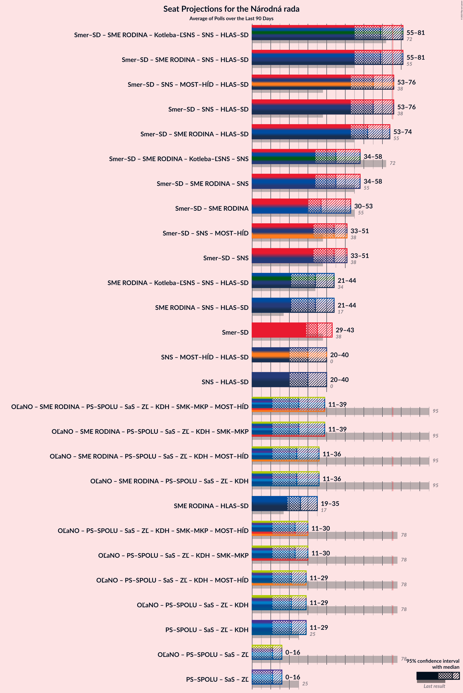

# Overview

The table below lists the most recent polls (less than 90 days old) registered and analyzed so far.

| Period     | Polling firm/Commissioner(s) | OĽaNO | Smer–SD | SME RODINA | Kotleba–ĽSNS | PS–SPOLU | SaS | ZĽ | KDH | SMK–MKP | SNS | DV | V | MOST–HÍD | NOVA | PS | SPOLU | HLAS–SD | REP |
|:----------:|:----------------------------:|:--:|:--:|:--:|:--:|:--:|:--:|:--:|:--:|:--:|:--:|:--:|:--:|:--:|:--:|:--:|:--:|:--:|:--:|
| 29 February 2020 | General Election | 25.0%   53 | 18.3%   38 | 8.2%   17 | 8.0%   17 | 7.0%   0 | 6.2%   13 | 5.8%   12 | 4.6%   0 | 3.9%   0 | 3.2%   0 | 3.1%   0 | 2.9%   0 | 2.0%   0 | 0.0%   0 | 7.0%   0 | 7.0%   0 | 0.0%   0 | 0.0%   0 |
| N/A | [Poll Average](average.html) | 7–12%   13–20 | 12–16%   21–29 | 5–8%   9–15 | 2–6%   0–9 | N/A   N/A | 10–16%   18–30 | 1–3%   0 | 5–8%   0–14 | 3–7%   0–11 | 3–5%   0–9 | 0–3%   0 | N/A   N/A | N/A   N/A | N/A   N/A | 6–10%   10–18 | 0–2%   0 | 16–21%   29–39 | 4–8%   0–15 |
| [6–13 September 2021](2021-09-13-AKO.html) | AKO | 8–12%   16–20 | 12–16%   21–29 | 5–9%   9–15 | 2–4%   0 | N/A   N/A | 12–17%   23–30 | 1–3%   0 | 5–8%   9–14 | 3–5%   0 | 3–5%   0 | 0–2%   0 | N/A   N/A | N/A   N/A | N/A   N/A | 7–11%   12–18 | 0–2%   0 | 16–21%   31–40 | 4–7%   0–10 |
| [1–7 September 2021](2021-09-07-FOCUS.html) | FOCUS   TV Markíza | 7–10%   12–17 | 12–17%   24–33 | 5–8%   9–15 | 3–6%   0–9 | N/A   N/A | 10–14%   17–24 | 1–3%   0 | 5–8%   0–14 | 4–7%   0–11 | 3–5%   0–9 | 1–3%   0 | N/A   N/A | N/A   N/A | N/A   N/A | 6–9%   10–15 | 1–2%   0 | 16–21%   27–37 | 5–9%   11–15 |
| 29 February 2020 | General Election | 25.0%   53 | 18.3%   38 | 8.2%   17 | 8.0%   17 | 7.0%   0 | 6.2%   13 | 5.8%   12 | 4.6%   0 | 3.9%   0 | 3.2%   0 | 3.1%   0 | 2.9%   0 | 2.0%   0 | 0.0%   0 | 7.0%   0 | 7.0%   0 | 0.0%   0 | 0.0%   0 |

Only polls for which at least the sample size has been published are included in the table above.

**Legend:**
+ **Top half of each row:** Voting intentions (95% confidence interval)
+ **Bottom half of each row:** Seat projections for the Národná rada (95% confidence interval)
+ **OĽaNO:** OBYČAJNÍ ĽUDIA a nezávislé osobnosti
+ **Smer–SD:** SMER–sociálna demokracia
+ **SME RODINA:** SME RODINA
+ **Kotleba–ĽSNS:** Kotleba–Ľudová strana Naše Slovensko
+ **PS–SPOLU:** Progresívne Slovensko–SPOLU–Občianska Demokracia
+ **SaS:** Sloboda a Solidarita
+ **ZĽ:** Za ľudí
+ **KDH:** Kresťanskodemokratické hnutie
+ **SMK–MKP:** Strana maďarskej koalície–Magyar Koalíció Pártja
+ **SNS:** Slovenská národná strana
+ **DV:** Dobrá voľba
+ **V:** VLASŤ
+ **MOST–HÍD:** MOST–HÍD
+ **NOVA:** NOVA
+ **PS:** Progresívne Slovensko
+ **SPOLU:** SPOLU–Občianska Demokracia
+ **HLAS–SD:** HLAS–sociálna demokracia
+ **REP:** REPUBLIKA
+ **N/A (single party):** Party not included the published results
+ **N/A (entire row):** Calculation for this opinion poll not started yet

