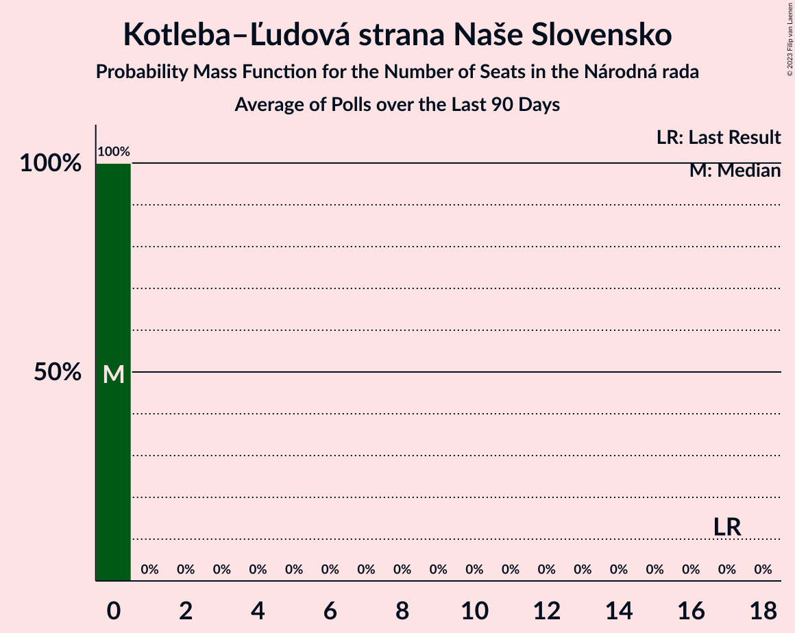

# Kotleba–Ľudová strana Naše Slovensko

<a href="#voting-intentions">Voting Intentions</a> | <a href="#seats">Seats</a>

## Voting Intentions

Last result: **8.0%** (General Election of 29 February 2020)

### Confidence Intervals

| Period     | Polling firm/Commissioner(s) | Median | 80% Confidence Interval | 90% Confidence Interval | 95% Confidence Interval | 99% Confidence Interval |
|:----------:|:----------------:|:-----------:|:-----------------------:|:-----------------------:|:-----------------------:|:-----------------------:|
| N/A | [Poll Average](average.html) | 7.9% | 6.0–9.9% | 5.6–10.4% | 5.4–10.8% | 4.9–11.6% |
| [20–25 November 2020](2020-11-25-Polis.html) | Polis | 8.1% | 7.1–9.3% | 6.8–9.7% | 6.6–10.0% | 6.1–10.6% |
| [18–25 November 2020](2020-11-25-FOCUS.html) | FOCUS | 9.6% | 8.5–10.9% | 8.2–11.2% | 7.9–11.6% | 7.4–12.2% |
| [6–11 November 2020](2020-11-11-MedianSK.html) | Median SK   RTVS | 6.9% | 6.0–8.0% | 5.7–8.3% | 5.5–8.6% | 5.1–9.2% |
| [21–26 October 2020](2020-10-26-Actly.html) | Actly | 6.2% | 5.3–7.3% | 5.1–7.6% | 4.9–7.9% | 4.5–8.4% |
| [15–23 October 2020](2020-10-23-Polis.html) | Polis | 8.0% | 7.0–9.2% | 6.8–9.5% | 6.5–9.8% | 6.1–10.4% |
| [7–15 October 2020](2020-10-15-FOCUS.html) | FOCUS | 9.8% | 8.7–11.1% | 8.4–11.4% | 8.1–11.8% | 7.6–12.4% |
| [7–12 October 2020](2020-10-12-Polis.html) | Polis | 9.2% | 8.2–10.4% | 8.0–10.7% | 7.7–11.0% | 7.3–11.6% |
| [1–9 October 2020](2020-10-09-AKO.html) | AKO | 8.5% | 7.5–9.7% | 7.2–10.1% | 6.9–10.4% | 6.4–11.0% |
| [14–18 September 2020](2020-09-18-MedianSK.html) | Median SK   RTVS | 8.8% | 7.8–10.1% | 7.5–10.4% | 7.2–10.8% | 6.8–11.4% |
| [4–9 September 2020](2020-09-09-Polis.html) | Polis | 8.5% | 7.5–9.6% | 7.3–9.9% | 7.0–10.2% | 6.6–10.7% |
| [26 August–2 September 2020](2020-09-02-FOCUS.html) | FOCUS | 8.5% | 7.5–9.7% | 7.2–10.1% | 7.0–10.4% | 6.5–11.0% |
| [21–26 August 2020](2020-08-26-Actly.html) | Actly | 8.9% | 7.8–10.2% | 7.5–10.5% | 7.3–10.8% | 6.8–11.5% |
| [22–27 July 2020](2020-07-27-Polis.html) | Polis | 8.0% | 7.0–9.2% | 6.8–9.6% | 6.5–9.9% | 6.1–10.5% |
| [7–17 July 2020](2020-07-17-AKO.html) | AKO | 7.9% | 6.9–9.1% | 6.6–9.4% | 6.4–9.7% | 5.9–10.3% |
| [17–24 June 2020](2020-06-24-FOCUS.html) | FOCUS | 9.6% | 8.5–10.9% | 8.2–11.3% | 7.9–11.6% | 7.4–12.2% |
| [5–10 June 2020](2020-06-10-Polis.html) | Polis | 9.0% | 7.9–10.2% | 7.6–10.6% | 7.4–10.9% | 6.9–11.5% |
| [23–27 May 2020](2020-05-27-Polis.html) | Polis | 7.4% | 6.4–8.5% | 6.2–8.8% | 5.9–9.1% | 5.5–9.6% |
| [14–21 May 2020](2020-05-21-FOCUS.html) | FOCUS | 9.7% | 8.6–11.0% | 8.3–11.4% | 8.0–11.7% | 7.5–12.3% |
| [15–19 April 2020](2020-04-19-FOCUS.html) | FOCUS | 9.2% | 8.1–10.4% | 7.8–10.8% | 7.5–11.1% | 7.0–11.7% |
| [14–17 April 2020](2020-04-17-AKO.html) | AKO | 6.4% | 5.5–7.5% | 5.3–7.8% | 5.0–8.1% | 4.6–8.7% |
| [4–8 April 2020](2020-04-08-Polis.html) | Polis | 7.5% | 6.6–8.6% | 6.3–8.9% | 6.1–9.2% | 5.7–9.8% |
| [18–21 March 2020](2020-03-21-FOCUS.html) | FOCUS | 7.3% | 6.4–8.5% | 6.1–8.8% | 5.9–9.1% | 5.5–9.7% |

### Probability Mass Function

The following table shows the probability mass function per percentage block of voting intentions for the [poll average](average.html) for Kotleba–Ľudová strana Naše Slovensko.

| Voting Intentions | Probability | Accumulated | Special Marks |
|:-----------------:|:-----------:|:-----------:|:-------------:|
| 2.5–3.5% | 0% | 100% |  |
| 3.5–4.5% | 0.1% | 100% |  |
| 4.5–5.5% | 4% | 99.9% |  |
| 5.5–6.5% | 16% | 96% |  |
| 6.5–7.5% | 21% | 80% |  |
| 7.5–8.5% | 24% | 59% | Last Result, Median |
| 8.5–9.5% | 21% | 35% |  |
| 9.5–10.5% | 11% | 15% |  |
| 10.5–11.5% | 3% | 4% |  |
| 11.5–12.5% | 0.5% | 0.5% |  |
| 12.5–13.5% | 0% | 0% |  |

## Seats

Last result: **17** seats (General Election of 29 February 2020)

### Confidence Intervals

| Period     | Polling firm/Commissioner(s) | Median | 80% Confidence Interval | 90% Confidence Interval | 95% Confidence Interval | 99% Confidence Interval |
|:----------:|:----------------:|:------:|:-----------------------:|:-----------------------:|:-----------------------:|:-----------------------:|
| N/A | [Poll Average](average.html) | 15 | 11–19 | 10–22 | 9–22 | 9–22 |
| [20–25 November 2020](2020-11-25-Polis.html) | Polis | 17 | 12–18 | 12–18 | 12–19 | 12–20 |
| [18–25 November 2020](2020-11-25-FOCUS.html) | FOCUS | 19 | 15–22 | 15–22 | 14–22 | 13–22 |
| [6–11 November 2020](2020-11-11-MedianSK.html) | Median SK   RTVS | 14 | 12–15 | 11–16 | 11–17 | 10–17 |
| [21–26 October 2020](2020-10-26-Actly.html) | Actly | 11 | 9–12 | 9–13 | 9–14 | 0–14 |
| [15–23 October 2020](2020-10-23-Polis.html) | Polis | 16 | 13–18 | 11–19 | 11–19 | 11–19 |
| [7–15 October 2020](2020-10-15-FOCUS.html) | FOCUS | 18 | 15–20 | 15–20 | 14–21 | 14–24 |
| [7–12 October 2020](2020-10-12-Polis.html) | Polis | 16 | 14–19 | 13–21 | 12–21 | 12–22 |
| [1–9 October 2020](2020-10-09-AKO.html) | AKO | 15 | 15–18 | 15–18 | 14–18 | 12–20 |
| [14–18 September 2020](2020-09-18-MedianSK.html) | Median SK   RTVS | 18 | 15–18 | 14–19 | 14–19 | 13–21 |
| [4–9 September 2020](2020-09-09-Polis.html) | Polis | 15 | 15–20 | 13–20 | 13–20 | 12–20 |
| [26 August–2 September 2020](2020-09-02-FOCUS.html) | FOCUS | 16 | 14–16 | 14–17 | 14–17 | 13–19 |
| [21–26 August 2020](2020-08-26-Actly.html) | Actly | 18 | 16–20 | 14–20 | 14–20 | 13–22 |
| [22–27 July 2020](2020-07-27-Polis.html) | Polis | 14 | 12–15 | 11–17 | 11–17 | 11–20 |
| [7–17 July 2020](2020-07-17-AKO.html) | AKO | 16 | 12–17 | 12–18 | 12–19 | 12–19 |
| [17–24 June 2020](2020-06-24-FOCUS.html) | FOCUS | 20 | 16–20 | 16–22 | 14–23 | 13–24 |
| [5–10 June 2020](2020-06-10-Polis.html) | Polis | 17 | 14–20 | 14–20 | 14–21 | 13–21 |
| [23–27 May 2020](2020-05-27-Polis.html) | Polis | 14 | 11–15 | 11–16 | 11–16 | 10–17 |
| [14–21 May 2020](2020-05-21-FOCUS.html) | FOCUS | 15 | 15–18 | 15–19 | 15–19 | 13–21 |
| [15–19 April 2020](2020-04-19-FOCUS.html) | FOCUS | 15 | 15 | 15–17 | 14–18 | 13–19 |
| [14–17 April 2020](2020-04-17-AKO.html) | AKO | 13 | 13 | 11–13 | 11–13 | 10–14 |
| [4–8 April 2020](2020-04-08-Polis.html) | Polis | 14 | 12–16 | 12–17 | 11–18 | 11–19 |
| [18–21 March 2020](2020-03-21-FOCUS.html) | FOCUS | 14 | 13–17 | 13–19 | 12–19 | 11–21 |

### Probability Mass Function

The following table shows the probability mass function per seat for the [poll average](average.html) for Kotleba–Ľudová strana Naše Slovensko.

| Number of Seats | Probability | Accumulated | Special Marks |
|:---------------:|:-----------:|:-----------:|:-------------:|
| 0 | 0.3% | 100% |  |
| 1 | 0% | 99.7% |  |
| 2 | 0% | 99.7% |  |
| 3 | 0% | 99.7% |  |
| 4 | 0% | 99.7% |  |
| 5 | 0% | 99.7% |  |
| 6 | 0% | 99.7% |  |
| 7 | 0% | 99.7% |  |
| 8 | 0% | 99.7% |  |
| 9 | 3% | 99.7% |  |
| 10 | 2% | 97% |  |
| 11 | 13% | 95% |  |
| 12 | 6% | 82% |  |
| 13 | 10% | 76% |  |
| 14 | 7% | 65% |  |
| 15 | 22% | 58% | Median |
| 16 | 4% | 36% |  |
| 17 | 15% | 32% | Last Result |
| 18 | 5% | 17% |  |
| 19 | 3% | 13% |  |
| 20 | 4% | 10% |  |
| 21 | 0.4% | 6% |  |
| 22 | 5% | 5% |  |
| 23 | 0% | 0.1% |  |
| 24 | 0% | 0% |  |

