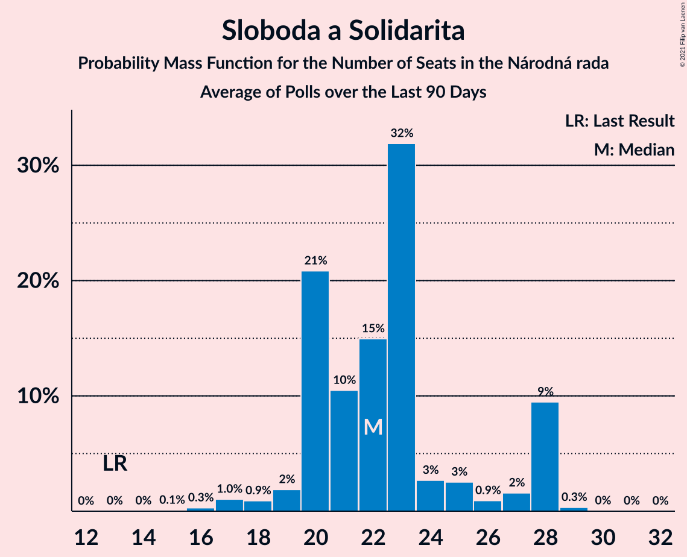

# Sloboda a Solidarita

<a href="#voting-intentions">Voting Intentions</a> | <a href="#seats">Seats</a>

## Voting Intentions

Last result: **12.1%** (General Election of 5 March 2016)

### Confidence Intervals

| Period     | Polling firm/Commissioner(s) | Median | 80% Confidence Interval | 90% Confidence Interval | 95% Confidence Interval | 99% Confidence Interval |
|:----------:|:----------------:|:-----------:|:-----------------------:|:-----------------------:|:-----------------------:|:-----------------------:|
| N/A | [Poll Average](average.html) | 5.8% | 4.7–7.3% | 4.4–7.7% | 4.2–8.1% | 3.9–8.7% |
| [10–14 January 2020](2020-01-14-FOCUS.html) | FOCUS | 5.4% | 4.6–6.5% | 4.4–6.8% | 4.2–7.0% | 3.8–7.6% |
| [7–9 January 2020](2020-01-09-AKO.html) | AKO   TA3 | 6.8% | 5.9–7.9% | 5.6–8.3% | 5.4–8.5% | 5.0–9.1% |
| [7–11 December 2019](2019-12-11-Polis.html) | Polis | 5.2% | 4.5–6.2% | 4.2–6.4% | 4.1–6.7% | 3.7–7.2% |
| [2–9 December 2019](2019-12-09-FOCUS.html) | FOCUS | 5.7% | 4.8–6.7% | 4.6–7.0% | 4.4–7.3% | 4.0–7.8% |
| [19–25 November 2019](2019-11-25-AKO.html) | AKO | 6.3% | 5.4–7.4% | 5.2–7.7% | 5.0–8.0% | 4.6–8.6% |
| [9–13 November 2019](2019-11-13-Polis.html) | Polis | 5.1% | 4.3–6.1% | 4.1–6.4% | 3.9–6.6% | 3.6–7.1% |
| [30 October–6 November 2019](2019-11-06-FOCUS.html) | FOCUS | 5.0% | 4.2–6.0% | 4.0–6.3% | 3.8–6.5% | 3.5–7.0% |
| [15–22 October 2019](2019-10-22-FOCUS.html) | FOCUS | 5.2% | 4.4–6.2% | 4.2–6.5% | 4.0–6.7% | 3.6–7.3% |
| [7–10 October 2019](2019-10-10-AKO.html) | AKO | 6.7% | 5.8–7.8% | 5.5–8.2% | 5.3–8.4% | 4.9–9.0% |
| [18–25 September 2019](2019-09-25-AKO.html) | AKO | 7.0% | 6.1–8.2% | 5.8–8.5% | 5.6–8.8% | 5.2–9.3% |
| [11–17 September 2019](2019-09-17-FOCUS.html) | FOCUS | 6.4% | 5.5–7.5% | 5.3–7.8% | 5.1–8.1% | 4.7–8.7% |
| [26–29 August 2019](2019-08-29-AKO.html) | AKO | 8.1% | 7.9–10.3% | 7.6–10.6% | 7.4–10.9% | 6.9–11.6% |
| [12 August 2019](2019-08-12-MVK.html) | MVK | 5.5% | 4.7–6.5% | 4.4–6.8% | 4.3–7.1% | 3.9–7.6% |
| [1–7 August 2019](2019-08-07-FOCUS.html) | FOCUS | 7.0% | 6.0–8.1% | 5.8–8.4% | 5.5–8.7% | 5.1–9.3% |
| [19–25 June 2019](2019-06-25-FOCUS.html) | FOCUS | 7.1% | 6.2–8.3% | 5.9–8.6% | 5.7–8.9% | 5.3–9.5% |
| [11–18 June 2019](2019-06-18-Polis.html) | Polis | 8.5% | 7.5–9.6% | 7.3–10.0% | 7.0–10.2% | 6.6–10.8% |
| [1–11 June 2019](2019-06-11-FOCUS.html) | FOCUS | 8.0% | 7.0–9.2% | 6.7–9.5% | 6.4–9.8% | 6.0–10.4% |
| [28–31 May 2019](2019-05-31-AKO.html) | AKO | 10.8% | 9.6–12.2% | 9.3–12.5% | 9.0–12.9% | 8.5–13.6% |
| [8–10 May 2019](2019-05-10-AKO.html) | AKO | 13.5% | 12.2–15.0% | 11.8–15.4% | 11.5–15.8% | 10.9–16.5% |
| [29 April–6 May 2019](2019-05-06-AKO.html) | AKO | 13.1% | 11.8–14.6% | 11.4–15.0% | 11.1–15.3% | 10.6–16.1% |
| [8–14 April 2019](2019-04-14-FOCUS.html) | FOCUS | 10.0% | 8.9–11.3% | 8.6–11.7% | 8.3–12.0% | 7.8–12.7% |
| [1–2 April 2019](2019-04-02-AKO.html) | AKO | 12.9% | 11.6–14.4% | 11.3–14.8% | 11.0–15.1% | 10.4–15.9% |
| [1–15 March 2019](2019-03-15-FOCUS.html) | FOCUS | 11.0% | 10.1–12.1% | 9.8–12.4% | 9.6–12.7% | 9.1–13.2% |
| [21–26 February 2019](2019-02-26-FOCUS.html) | FOCUS | 11.2% | 10.0–12.5% | 9.6–12.9% | 9.4–13.2% | 8.8–13.9% |
| [8–12 February 2019](2019-02-12-AKO.html) | AKO | 14.8% | 13.4–16.3% | 13.1–16.8% | 12.7–17.1% | 12.1–17.9% |
| [16–23 January 2019](2019-01-23-FOCUS.html) | FOCUS | 12.3% | 11.1–13.8% | 10.7–14.2% | 10.5–14.5% | 9.9–15.2% |
| [1–9 December 2018](2018-12-09-FOCUS.html) | FOCUS | 13.3% | 12.1–14.8% | 11.7–15.2% | 11.4–15.6% | 10.8–16.3% |
| [27–28 November 2018](2018-11-28-AKO.html) | AKO | 15.9% | 14.5–17.5% | 14.1–17.9% | 13.8–18.3% | 13.1–19.1% |
| [13–15 November 2018](2018-11-15-AKO.html) | AKO | 16.1% | 14.7–17.7% | 14.3–18.1% | 13.9–18.5% | 13.3–19.3% |
| [7–14 November 2018](2018-11-14-FOCUS.html) | FOCUS | 12.0% | 10.7–13.4% | 10.4–13.8% | 10.1–14.1% | 9.5–14.8% |
| [3–8 October 2018](2018-10-08-AKO.html) | AKO | 16.0% | 14.6–17.6% | 14.2–18.0% | 13.9–18.4% | 13.2–19.2% |
| [18–25 September 2018](2018-09-25-FOCUS.html) | FOCUS | 13.5% | 12.2–15.0% | 11.8–15.4% | 11.5–15.7% | 10.9–16.5% |
| [30 August–5 September 2018](2018-09-05-AKO.html) | AKO | 16.0% | 14.6–17.6% | 14.2–18.0% | 13.9–18.4% | 13.2–19.2% |
| [15–17 August 2018](2018-08-17-AKO.html) | AKO | 15.7% | 14.3–17.3% | 13.9–17.7% | 13.6–18.1% | 12.9–18.9% |
| [2–9 August 2018](2018-08-09-FOCUS.html) | FOCUS | 12.2% | 11.0–13.6% | 10.6–14.0% | 10.3–14.4% | 9.8–15.1% |
| [18–21 June 2018](2018-06-21-AKO.html) | AKO | 15.5% | 14.1–17.1% | 13.7–17.5% | 13.4–17.9% | 12.7–18.7% |
| [4–11 June 2018](2018-06-11-FOCUS.html) | FOCUS | 12.4% | 11.2–13.8% | 10.8–14.2% | 10.5–14.6% | 10.0–15.3% |
| [16–21 May 2018](2018-05-21-AKO.html) | AKO | 16.7% | 15.3–18.3% | 14.9–18.7% | 14.5–19.1% | 13.9–19.9% |
| [24–30 April 2018](2018-04-30-FOCUS.html) | FOCUS | 13.2% | 11.9–14.7% | 11.6–15.1% | 11.3–15.5% | 10.7–16.2% |
| [20–24 April 2018](2018-04-24-AKO.html) | AKO | 16.1% | 14.7–17.7% | 14.3–18.1% | 13.9–18.5% | 13.3–19.3% |
| [4–7 April 2018](2018-04-07-AKO.html) | AKO | 17.1% | 15.7–18.7% | 15.2–19.2% | 14.9–19.6% | 14.2–20.4% |
| [7–13 March 2018](2018-03-13-FOCUS.html) | FOCUS | 14.0% | 12.7–15.5% | 12.3–15.9% | 12.0–16.3% | 11.4–17.1% |
| [21–26 February 2018](2018-02-26-AKO.html) | AKO | 16.2% | 14.8–17.8% | 14.4–18.2% | 14.0–18.6% | 13.4–19.4% |
| [23–28 January 2018](2018-01-28-FOCUS.html) | FOCUS | 13.1% | 11.9–14.6% | 11.5–15.0% | 11.2–15.4% | 10.6–16.1% |

### Probability Mass Function

The following table shows the probability mass function per percentage block of voting intentions for the [poll average](average.html) for Sloboda a Solidarita.

| Voting Intentions | Probability | Accumulated | Special Marks |
|:-----------------:|:-----------:|:-----------:|:-------------:|
| 2.5–3.5% | 0.1% | 100% |  |
| 3.5–4.5% | 7% | 99.9% |  |
| 4.5–5.5% | 34% | 93% |  |
| 5.5–6.5% | 34% | 59% | Median |
| 6.5–7.5% | 19% | 26% |  |
| 7.5–8.5% | 6% | 7% |  |
| 8.5–9.5% | 0.8% | 0.8% |  |
| 9.5–10.5% | 0% | 0% |  |
| 10.5–11.5% | 0% | 0% |  |
| 11.5–12.5% | 0% | 0% | Last Result |

## Seats

Last result: **21** seats (General Election of 5 March 2016)

### Confidence Intervals

| Period     | Polling firm/Commissioner(s) | Median | 80% Confidence Interval | 90% Confidence Interval | 95% Confidence Interval | 99% Confidence Interval |
|:----------:|:----------------:|:------:|:-----------------------:|:-----------------------:|:-----------------------:|:-----------------------:|
| N/A | [Poll Average](average.html) | 10 | 0–13 | 0–14 | 0–15 | 0–16 |
| [10–14 January 2020](2020-01-14-FOCUS.html) | FOCUS | 11 | 0–13 | 0–13 | 0–13 | 0–15 |
| [7–9 January 2020](2020-01-09-AKO.html) | AKO   TA3 | 12 | 10–15 | 10–15 | 10–15 | 0–17 |
| [7–11 December 2019](2019-12-11-Polis.html) | Polis | 8 | 0–10 | 0–10 | 0–11 | 0–11 |
| [2–9 December 2019](2019-12-09-FOCUS.html) | FOCUS | 12 | 10–13 | 0–13 | 0–13 | 0–14 |
| [19–25 November 2019](2019-11-25-AKO.html) | AKO | 11 | 11 | 11–12 | 10–12 | 0–14 |
| [9–13 November 2019](2019-11-13-Polis.html) | Polis | 9 | 0–11 | 0–11 | 0–12 | 0–13 |
| [30 October–6 November 2019](2019-11-06-FOCUS.html) | FOCUS | 0 | 0–11 | 0–11 | 0–12 | 0–13 |
| [15–22 October 2019](2019-10-22-FOCUS.html) | FOCUS | 10 | 0–10 | 0–11 | 0–11 | 0–13 |
| [7–10 October 2019](2019-10-10-AKO.html) | AKO | 12 | 10–16 | 9–16 | 9–16 | 0–16 |
| [18–25 September 2019](2019-09-25-AKO.html) | AKO | 12 | 9–13 | 9–14 | 9–15 | 9–16 |
| [11–17 September 2019](2019-09-17-FOCUS.html) | FOCUS | 10 | 9–13 | 9–13 | 9–13 | 0–14 |
| [26–29 August 2019](2019-08-29-AKO.html) | AKO | 15 | 12–17 | 12–18 | 12–18 | 11–19 |
| [12 August 2019](2019-08-12-MVK.html) | MVK | 10 | 0–12 | 0–12 | 0–12 | 0–14 |
| [1–7 August 2019](2019-08-07-FOCUS.html) | FOCUS | 11 | 10–14 | 10–14 | 10–15 | 9–16 |
| [19–25 June 2019](2019-06-25-FOCUS.html) | FOCUS | 13 | 10–14 | 10–15 | 10–16 | 9–17 |
| [11–18 June 2019](2019-06-18-Polis.html) | Polis | 15 | 13–17 | 12–18 | 12–19 | 11–20 |
| [1–11 June 2019](2019-06-11-FOCUS.html) | FOCUS | 14 | 12–16 | 12–16 | 11–17 | 10–18 |
| [28–31 May 2019](2019-05-31-AKO.html) | AKO | 18 | 15–19 | 15–20 | 15–21 | 14–22 |
| [8–10 May 2019](2019-05-10-AKO.html) | AKO | 21 | 19–24 | 18–24 | 18–25 | 17–26 |
| [29 April–6 May 2019](2019-05-06-AKO.html) | AKO | 20 | 19–24 | 18–25 | 18–25 | 16–25 |
| [8–14 April 2019](2019-04-14-FOCUS.html) | FOCUS | 17 | 14–19 | 14–20 | 14–21 | 13–22 |
| [1–2 April 2019](2019-04-02-AKO.html) | AKO | 22 | 18–22 | 18–23 | 17–24 | 16–25 |
| [1–15 March 2019](2019-03-15-FOCUS.html) | FOCUS | 19 | 17–20 | 16–21 | 16–21 | 15–22 |
| [21–26 February 2019](2019-02-26-FOCUS.html) | FOCUS | 18 | 16–21 | 16–22 | 15–22 | 15–24 |
| [8–12 February 2019](2019-02-12-AKO.html) | AKO | 23 | 21–26 | 20–27 | 20–27 | 19–29 |
| [16–23 January 2019](2019-01-23-FOCUS.html) | FOCUS | 21 | 19–23 | 19–25 | 17–25 | 17–27 |
| [1–9 December 2018](2018-12-09-FOCUS.html) | FOCUS | 22 | 21–26 | 20–27 | 20–27 | 18–29 |
| [27–28 November 2018](2018-11-28-AKO.html) | AKO | 26 | 24–29 | 23–30 | 22–31 | 21–32 |
| [13–15 November 2018](2018-11-15-AKO.html) | AKO | 27 | 22–29 | 22–31 | 21–32 | 21–34 |
| [7–14 November 2018](2018-11-14-FOCUS.html) | FOCUS | 20 | 18–24 | 17–24 | 17–25 | 16–27 |
| [3–8 October 2018](2018-10-08-AKO.html) | AKO | 26 | 24–30 | 23–31 | 22–31 | 22–33 |
| [18–25 September 2018](2018-09-25-FOCUS.html) | FOCUS | 25 | 22–27 | 21–28 | 20–29 | 19–31 |
| [30 August–5 September 2018](2018-09-05-AKO.html) | AKO | 26 | 24–29 | 23–29 | 23–29 | 22–31 |
| [15–17 August 2018](2018-08-17-AKO.html) | AKO | 26 | 24–30 | 23–30 | 23–31 | 22–35 |
| [2–9 August 2018](2018-08-09-FOCUS.html) | FOCUS | 22 | 20–24 | 19–25 | 19–26 | 18–27 |
| [18–21 June 2018](2018-06-21-AKO.html) | AKO | 26 | 24–28 | 23–29 | 23–29 | 21–31 |
| [4–11 June 2018](2018-06-11-FOCUS.html) | FOCUS | 22 | 19–24 | 19–26 | 18–27 | 17–28 |
| [16–21 May 2018](2018-05-21-AKO.html) | AKO | 28 | 26–31 | 25–32 | 24–32 | 23–35 |
| [24–30 April 2018](2018-04-30-FOCUS.html) | FOCUS | 23 | 21–26 | 21–26 | 20–27 | 19–30 |
| [20–24 April 2018](2018-04-24-AKO.html) | AKO | 26 | 24–29 | 24–29 | 24–30 | 22–32 |
| [4–7 April 2018](2018-04-07-AKO.html) | AKO | 29 | 25–32 | 25–32 | 24–33 | 23–35 |
| [7–13 March 2018](2018-03-13-FOCUS.html) | FOCUS | 25 | 22–26 | 21–27 | 21–28 | 20–30 |
| [21–26 February 2018](2018-02-26-AKO.html) | AKO | 27 | 24–29 | 24–30 | 22–31 | 21–32 |
| [23–28 January 2018](2018-01-28-FOCUS.html) | FOCUS | 23 | 20–25 | 19–25 | 19–26 | 18–28 |

### Probability Mass Function

The following table shows the probability mass function per seat for the [poll average](average.html) for Sloboda a Solidarita.

| Number of Seats | Probability | Accumulated | Special Marks |
|:---------------:|:-----------:|:-----------:|:-------------:|
| 0 | 24% | 100% |  |
| 1 | 0% | 76% |  |
| 2 | 0% | 76% |  |
| 3 | 0% | 76% |  |
| 4 | 0% | 76% |  |
| 5 | 0% | 76% |  |
| 6 | 0% | 76% |  |
| 7 | 0% | 76% |  |
| 8 | 2% | 76% |  |
| 9 | 8% | 74% |  |
| 10 | 16% | 65% | Median |
| 11 | 16% | 49% |  |
| 12 | 12% | 33% |  |
| 13 | 14% | 21% |  |
| 14 | 3% | 7% |  |
| 15 | 3% | 4% |  |
| 16 | 0.4% | 0.7% |  |
| 17 | 0.2% | 0.3% |  |
| 18 | 0% | 0% |  |
| 19 | 0% | 0% |  |
| 20 | 0% | 0% |  |
| 21 | 0% | 0% | Last Result |

