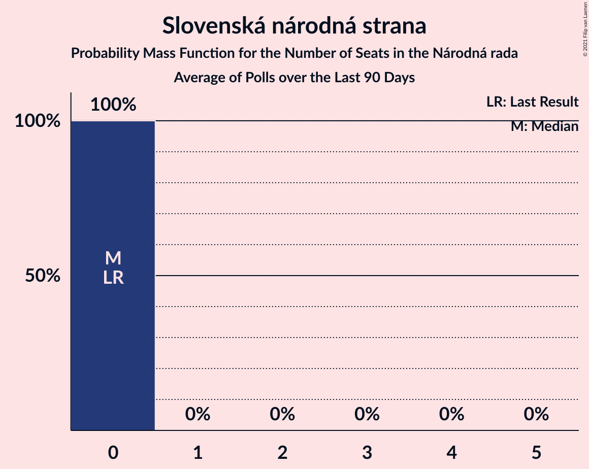

# Slovenská národná strana

<a href="#voting-intentions">Voting Intentions</a> | <a href="#seats">Seats</a>

## Voting Intentions

Last result: **3.2%** (General Election of 29 February 2020)

### Confidence Intervals

| Period     | Polling firm/Commissioner(s) | Median | 80% Confidence Interval | 90% Confidence Interval | 95% Confidence Interval | 99% Confidence Interval |
|:----------:|:----------------:|:-----------:|:-----------------------:|:-----------------------:|:-----------------------:|:-----------------------:|
| N/A | [Poll Average](average.html) | 1.7% | 1.1–2.5% | 1.0–2.8% | 0.9–3.0% | 0.7–3.4% |
| [23–27 May 2020](2020-05-27-Polis.html) | Polis | 1.4% | 1.0–2.0% | 0.9–2.1% | 0.8–2.3% | 0.7–2.6% |
| [14–21 May 2020](2020-05-21-FOCUS.html) | FOCUS | 1.4% | 1.0–2.0% | 0.9–2.2% | 0.8–2.3% | 0.7–2.6% |
| [15–19 April 2020](2020-04-19-FOCUS.html) | FOCUS | 1.6% | 1.2–2.2% | 1.1–2.4% | 1.0–2.5% | 0.8–2.9% |
| [14–17 April 2020](2020-04-17-AKO.html) | AKO | 2.2% | 1.7–2.9% | 1.6–3.1% | 1.4–3.3% | 1.2–3.7% |
| [4–8 April 2020](2020-04-08-Polis.html) | Polis | 0.0% | N/A | N/A | N/A | N/A |
| [1–31 March 2020](2020-03-31-FOCUS.html) | FOCUS | 3.4% | 2.8–4.2% | 2.6–4.5% | 2.4–4.7% | 2.2–5.1% |

### Probability Mass Function

The following table shows the probability mass function per percentage block of voting intentions for the [poll average](average.html) for Slovenská národná strana.

| Voting Intentions | Probability | Accumulated | Special Marks |
|:-----------------:|:-----------:|:-----------:|:-------------:|
| 0.0–0.5% | 0% | 100% |  |
| 0.5–1.5% | 42% | 100% |  |
| 1.5–2.5% | 48% | 58% | Median |
| 2.5–3.5% | 10% | 10% | Last Result |
| 3.5–4.5% | 0.3% | 0.3% |  |
| 4.5–5.5% | 0% | 0% |  |

## Seats

Last result: **0** seats (General Election of 29 February 2020)

### Confidence Intervals

| Period     | Polling firm/Commissioner(s) | Median | 80% Confidence Interval | 90% Confidence Interval | 95% Confidence Interval | 99% Confidence Interval |
|:----------:|:----------------:|:------:|:-----------------------:|:-----------------------:|:-----------------------:|:-----------------------:|
| N/A | [Poll Average](average.html) | 0 | 0 | 0 | 0 | 0 |
| [23–27 May 2020](2020-05-27-Polis.html) | Polis | 0 | 0 | 0 | 0 | 0 |
| [14–21 May 2020](2020-05-21-FOCUS.html) | FOCUS | 0 | 0 | 0 | 0 | 0 |
| [15–19 April 2020](2020-04-19-FOCUS.html) | FOCUS | 0 | 0 | 0 | 0 | 0 |
| [14–17 April 2020](2020-04-17-AKO.html) | AKO | 0 | 0 | 0 | 0 | 0 |
| [4–8 April 2020](2020-04-08-Polis.html) | Polis |  |  |  |  |  |
| [1–31 March 2020](2020-03-31-FOCUS.html) | FOCUS | 0 | 0 | 0 | 0 | 0 |

### Probability Mass Function

The following table shows the probability mass function per seat for the [poll average](average.html) for Slovenská národná strana.

| Number of Seats | Probability | Accumulated | Special Marks |
|:---------------:|:-----------:|:-----------:|:-------------:|
| 0 | 100% | 100% | Last Result, Median |

