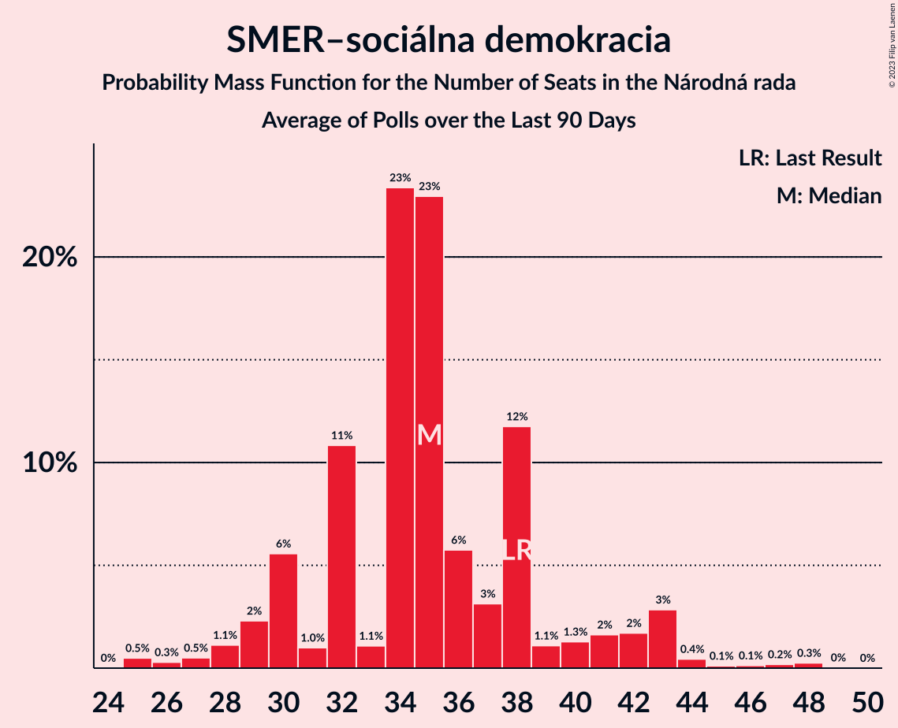

# SMER–sociálna demokracia

<a href="#voting-intentions">Voting Intentions</a> | <a href="#seats">Seats</a>

## Voting Intentions

Last result: **18.3%** (General Election of 29 February 2020)

### Confidence Intervals

| Period     | Polling firm/Commissioner(s) | Median | 80% Confidence Interval | 90% Confidence Interval | 95% Confidence Interval | 99% Confidence Interval |
|:----------:|:----------------:|:-----------:|:-----------------------:|:-----------------------:|:-----------------------:|:-----------------------:|
| N/A | [Poll Average](average.html) | 8.5% | 6.2–11.4% | 5.8–11.9% | 5.5–12.3% | 5.0–13.0% |
| [6–11 November 2020](2020-11-11-MedianSK.html) | Median SK   RTVS | 6.3% | 5.4–7.4% | 5.2–7.7% | 5.0–8.0% | 4.6–8.5% |
| [21–26 October 2020](2020-10-26-Actly.html) | Actly | 10.8% | 9.6–12.2% | 9.3–12.5% | 9.0–12.9% | 8.5–13.6% |
| [7–15 October 2020](2020-10-15-FOCUS.html) | FOCUS | 10.5% | 9.3–11.8% | 9.0–12.2% | 8.7–12.5% | 8.2–13.2% |
| [7–12 October 2020](2020-10-12-Polis.html) | Polis | 7.2% | 6.4–8.3% | 6.1–8.6% | 5.9–8.8% | 5.5–9.4% |
| [1–9 October 2020](2020-10-09-AKO.html) | AKO | 8.3% | 7.3–9.5% | 7.0–9.9% | 6.7–10.2% | 6.3–10.8% |
| [14–18 September 2020](2020-09-18-MedianSK.html) | Median SK   RTVS | 9.1% | 8.1–10.4% | 7.8–10.8% | 7.5–11.1% | 7.0–11.7% |
| [4–9 September 2020](2020-09-09-Polis.html) | Polis | 8.8% | 7.8–9.9% | 7.6–10.2% | 7.3–10.5% | 6.9–11.1% |
| [26 August–2 September 2020](2020-09-02-FOCUS.html) | FOCUS | 10.9% | 9.7–12.2% | 9.4–12.6% | 9.1–12.9% | 8.6–13.6% |
| [21–26 August 2020](2020-08-26-Actly.html) | Actly | 10.9% | 9.7–12.3% | 9.4–12.7% | 9.1–13.0% | 8.6–13.7% |
| [22–27 July 2020](2020-07-27-Polis.html) | Polis | 8.8% | 7.8–10.0% | 7.5–10.4% | 7.2–10.7% | 6.8–11.3% |
| [7–17 July 2020](2020-07-17-AKO.html) | AKO | 10.7% | 9.5–12.1% | 9.2–12.4% | 8.9–12.8% | 8.4–13.5% |
| [17–24 June 2020](2020-06-24-FOCUS.html) | FOCUS | 19.0% | 17.5–20.7% | 17.1–21.2% | 16.7–21.6% | 16.0–22.4% |
| [5–10 June 2020](2020-06-10-Polis.html) | Polis | 18.8% | 17.3–20.4% | 16.9–20.9% | 16.6–21.3% | 15.9–22.1% |
| [23–27 May 2020](2020-05-27-Polis.html) | Polis | 21.1% | 19.6–22.8% | 19.2–23.3% | 18.8–23.7% | 18.1–24.5% |
| [14–21 May 2020](2020-05-21-FOCUS.html) | FOCUS | 21.6% | 20.0–23.3% | 19.5–23.8% | 19.1–24.2% | 18.4–25.1% |
| [15–19 April 2020](2020-04-19-FOCUS.html) | FOCUS | 21.8% | 20.1–23.5% | 19.7–24.0% | 19.3–24.4% | 18.6–25.2% |
| [14–17 April 2020](2020-04-17-AKO.html) | AKO | 18.3% | 16.8–20.0% | 16.4–20.4% | 16.0–20.8% | 15.3–21.6% |
| [4–8 April 2020](2020-04-08-Polis.html) | Polis | 21.2% | 19.7–22.9% | 19.3–23.4% | 18.9–23.8% | 18.2–24.6% |
| [18–21 March 2020](2020-03-21-FOCUS.html) | FOCUS | 21.6% | 20.0–23.3% | 19.6–23.8% | 19.2–24.2% | 18.4–25.1% |

### Probability Mass Function

The following table shows the probability mass function per percentage block of voting intentions for the [poll average](average.html) for SMER–sociálna demokracia.

| Voting Intentions | Probability | Accumulated | Special Marks |
|:-----------------:|:-----------:|:-----------:|:-------------:|
| 2.5–3.5% | 0% | 100% |  |
| 3.5–4.5% | 0.1% | 100% |  |
| 4.5–5.5% | 3% | 99.9% |  |
| 5.5–6.5% | 13% | 97% |  |
| 6.5–7.5% | 19% | 84% |  |
| 7.5–8.5% | 16% | 65% | Median |
| 8.5–9.5% | 12% | 49% |  |
| 9.5–10.5% | 15% | 37% |  |
| 10.5–11.5% | 15% | 22% |  |
| 11.5–12.5% | 6% | 8% |  |
| 12.5–13.5% | 1.3% | 1.4% |  |
| 13.5–14.5% | 0.1% | 0.1% |  |
| 14.5–15.5% | 0% | 0% |  |
| 15.5–16.5% | 0% | 0% |  |
| 16.5–17.5% | 0% | 0% |  |
| 17.5–18.5% | 0% | 0% | Last Result |

## Seats

Last result: **38** seats (General Election of 29 February 2020)

### Confidence Intervals

| Period     | Polling firm/Commissioner(s) | Median | 80% Confidence Interval | 90% Confidence Interval | 95% Confidence Interval | 99% Confidence Interval |
|:----------:|:----------------:|:------:|:-----------------------:|:-----------------------:|:-----------------------:|:-----------------------:|
| N/A | [Poll Average](average.html) | 16 | 11–21 | 10–21 | 10–22 | 10–24 |
| [6–11 November 2020](2020-11-11-MedianSK.html) | Median SK   RTVS | 11 | 10–15 | 10–15 | 10–15 | 0–16 |
| [21–26 October 2020](2020-10-26-Actly.html) | Actly | 21 | 18–22 | 17–22 | 17–23 | 16–26 |
| [7–15 October 2020](2020-10-15-FOCUS.html) | FOCUS | 17 | 16–21 | 16–21 | 16–22 | 15–24 |
| [7–12 October 2020](2020-10-12-Polis.html) | Polis | 13 | 10–14 | 10–15 | 10–15 | 10–16 |
| [1–9 October 2020](2020-10-09-AKO.html) | AKO | 16 | 13–17 | 13–18 | 12–19 | 12–21 |
| [14–18 September 2020](2020-09-18-MedianSK.html) | Median SK   RTVS | 18 | 15–19 | 14–20 | 14–20 | 14–21 |
| [4–9 September 2020](2020-09-09-Polis.html) | Polis | 17 | 15–17 | 14–19 | 13–20 | 12–21 |
| [26 August–2 September 2020](2020-09-02-FOCUS.html) | FOCUS | 18 | 18–21 | 18–21 | 18–22 | 17–24 |
| [21–26 August 2020](2020-08-26-Actly.html) | Actly | 18 | 18–23 | 18–24 | 17–24 | 16–26 |
| [22–27 July 2020](2020-07-27-Polis.html) | Polis | 14 | 14–17 | 14–17 | 13–17 | 12–21 |
| [7–17 July 2020](2020-07-17-AKO.html) | AKO | 20 | 17–23 | 17–24 | 17–24 | 16–25 |
| [17–24 June 2020](2020-06-24-FOCUS.html) | FOCUS | 39 | 31–41 | 30–41 | 30–41 | 30–44 |
| [5–10 June 2020](2020-06-10-Polis.html) | Polis | 34 | 33–37 | 31–39 | 30–39 | 29–41 |
| [23–27 May 2020](2020-05-27-Polis.html) | Polis | 38 | 34–41 | 34–42 | 34–44 | 32–45 |
| [14–21 May 2020](2020-05-21-FOCUS.html) | FOCUS | 37 | 37–42 | 37–44 | 34–44 | 31–44 |
| [15–19 April 2020](2020-04-19-FOCUS.html) | FOCUS | 37 | 37–39 | 37–41 | 37–42 | 35–45 |
| [14–17 April 2020](2020-04-17-AKO.html) | AKO | 35 | 35 | 34–35 | 32–35 | 29–35 |
| [4–8 April 2020](2020-04-08-Polis.html) | Polis | 41 | 37–46 | 36–46 | 34–48 | 33–50 |
| [18–21 March 2020](2020-03-21-FOCUS.html) | FOCUS | 43 | 40–46 | 39–48 | 37–52 | 34–53 |

### Probability Mass Function

The following table shows the probability mass function per seat for the [poll average](average.html) for SMER–sociálna demokracia.

| Number of Seats | Probability | Accumulated | Special Marks |
|:---------------:|:-----------:|:-----------:|:-------------:|
| 0 | 0.1% | 100% |  |
| 1 | 0% | 99.9% |  |
| 2 | 0% | 99.9% |  |
| 3 | 0% | 99.9% |  |
| 4 | 0% | 99.9% |  |
| 5 | 0% | 99.9% |  |
| 6 | 0% | 99.9% |  |
| 7 | 0% | 99.9% |  |
| 8 | 0% | 99.9% |  |
| 9 | 0% | 99.9% |  |
| 10 | 9% | 99.8% |  |
| 11 | 13% | 91% |  |
| 12 | 3% | 78% |  |
| 13 | 10% | 75% |  |
| 14 | 2% | 65% |  |
| 15 | 10% | 62% |  |
| 16 | 10% | 52% | Median |
| 17 | 12% | 42% |  |
| 18 | 2% | 29% |  |
| 19 | 6% | 28% |  |
| 20 | 4% | 21% |  |
| 21 | 13% | 17% |  |
| 22 | 3% | 5% |  |
| 23 | 0.5% | 1.2% |  |
| 24 | 0.3% | 0.6% |  |
| 25 | 0.1% | 0.3% |  |
| 26 | 0.2% | 0.3% |  |
| 27 | 0% | 0% |  |
| 28 | 0% | 0% |  |
| 29 | 0% | 0% |  |
| 30 | 0% | 0% |  |
| 31 | 0% | 0% |  |
| 32 | 0% | 0% |  |
| 33 | 0% | 0% |  |
| 34 | 0% | 0% |  |
| 35 | 0% | 0% |  |
| 36 | 0% | 0% |  |
| 37 | 0% | 0% |  |
| 38 | 0% | 0% | Last Result |

